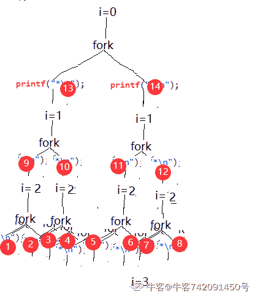
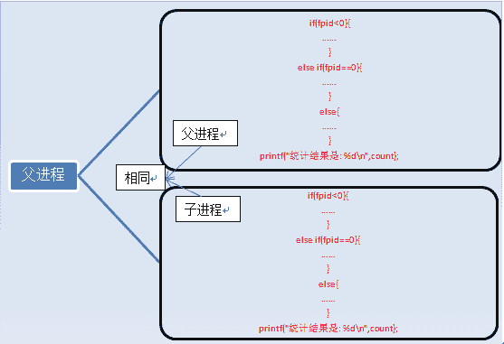
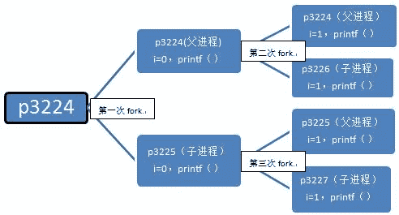
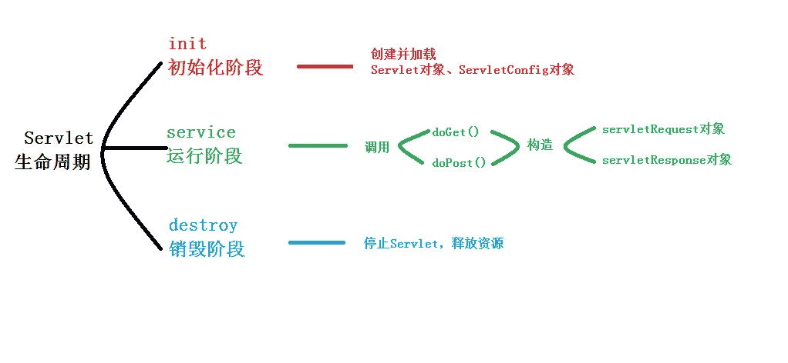

# 美丽联合 2016 研发工程师笔试题

## 1

若 AB 为任意两个随机事件，则（）

正确答案: C   你的答案: 空 (错误)

```cpp
P(AB)>=(P(A)+P(B))/2
```

```cpp
P(AB)<=P(A)P(B)
```

```cpp
P(AB)<=(P(A)+P(B))/2
```

```cpp
P(AB)>=P(A)P(B)
```

本题知识点

概率统计 *Java 工程师 C++工程师 运维工程师 算法工程师 PHP 工程师 概率论与数理统计* *讨论

[SunburstRun](https://www.nowcoder.com/profile/557336)

答案是 C          由 P（AB）定义可知：P（AB）<=P(A)，P（AB）<=P(B)；相加，除以 2 得 C

编辑于 2016-04-19 22:02:53

* * *

[surgewong](https://www.nowcoder.com/profile/6508503)

用包含和互斥来举例可以排除 B 和 D

发表于 2017-09-24 15:20:33

* * *

[樊烦](https://www.nowcoder.com/profile/597769)

p(ab)<=p(a)p(ab)<=p(b)两式相加，除 2，即得答案

发表于 2016-03-13 09:55:28

* * *

## 2

以下程序段执行后结果是()

```cpp
#include<stdio.h>
int main(){
    short *p,*q;
    short arr[15] = {0};
    p = q = arr;
    p++;
    printf("%d,", p - q);
    printf("%d,", (char*)p - (char*)q);
    printf("%d", sizeof(arr) / sizeof(*arr));
}
```

正确答案: D   你的答案: 空 (错误)

```cpp
1,0,15
```

```cpp
0,2,1
```

```cpp
1,1,15
```

```cpp
1,2,15
```

本题知识点

C++ Java 工程师 C++工程师 运维工程师 算法工程师 PHP 工程师 C 语言

讨论

[大菜鸟大菜狗](https://www.nowcoder.com/profile/905766)

D 指针自增、自减每次移动的偏移量是指针所指向对象的字节大小，所以 p++与 q 的偏移量是 2 个字节。指针相减的值是指针地址的偏移除以指针每次移位的大小；1)p-q=1;偏移量为 2 个字节，每次移动 2 个字节，所以为 12)(char *)p-(char *)q，指针的偏移没变，但是每次指针移位是按照（char*）类型移动，即每次移动 1 个字节，所以是 23）数字每次元素 2 个字节，所以 sizeof(arr)为 30，sizeof(*arr)为 2。

发表于 2015-10-15 10:16:05

* * *

[樊烦](https://www.nowcoder.com/profile/597769)

两个指针变量之间的运算

只有指向同一数组的两个指针变量之间才能进行运算，否则运算毫无意义。

1) 两指针变量相减

两指针变量相减所得之差是两个指针所指数组元素之间相差的元素个数。 实际上是两个指针值（地址）相减之差再除以该数组元素的长度（字节数）。例如 pf1 和 pf2 是指向同一浮点数组的两个指针变量，设 pf1 的值为 2010H，pf2 的值为 2000H，而浮点数组每个元素占 4 个字节，所以 pf1-pf2 的结果为(2000H-2010H)/4=4，表示 pf1 和 pf2 之间相差 4 个元素。

> 注意：两个指针变量不能进行加法运算。例如，pf1+pf2 是什么意思呢？毫无实际意义。

2) 两指针变量进行关系运算

指向同一数组的两指针变量进行关系运算可表示它们所指数组元素之间的关系。例如：

*   pf1==pf2 表示 pf1 和 pf2 指向同一数组元素；
*   pf1>pf2 表示 pf1 处于高地址位置；
*   pf1<pf2 表示 pf2 处于低地址位置。

指针变量还可以与 0 比较。设 p 为指针变量，则 p==0 表明 p 是空指针，它不指向任何变量；p!=0 表示 p 不是空指针。

空指针是由对指针变量赋予 0 值而得到的。例如：

```cpp
#define NULL 0
int *p = NULL;
```

对指针变量赋 0 值和不赋值是不同的。 指针变量未赋值时，值是随机的，是垃圾值，不能使用的，否则将造成意外错误。而指针变量赋 0 值后，则可以使用，只是它不指向具体的变量而已。以上从 http://c.biancheng.net/cpp/html/75.html 摘选

发表于 2016-03-13 10:11:01

* * *

[FEI 阿童木](https://www.nowcoder.com/profile/773615)

整体求解思路是：p q 是指向地址的指针，随着数据类型的不同而产生的偏移量不同；short 类型大小是 2 字节，char 类型大小是 1 字节；++p 是地址偏移量为 2 字节，但是对于 short 类型来说就是相差 1，转化为 char 类型就是 2；sizeof 是指数组的所占内存的大小=数据类型*个数；

发表于 2016-03-10 21:57:14

* * *

## 3

下面有关 C++类说法正确的是()

正确答案: A D   你的答案: 空 (错误)

```cpp
对基类成员的访问必须是无二义性的
```

```cpp
基类的公有成员在派生类中仍然是公有的
```

```cpp
this 指针保证基类保护成员在子类中可以被访问
```

```cpp
派生类一般很少用私有派生
```

本题知识点

C++ Java 工程师 C++工程师 运维工程师 算法工程师 PHP 工程师

讨论

[未来即来、](https://www.nowcoder.com/profile/216571)

基类成员在派生类当中的属性根据继承方式不同而有别，B 错误；this 只对本类的非静态成员有效，C 不正确。

发表于 2016-02-29 20:56:38

* * *

[XQ](https://www.nowcoder.com/profile/554854)

```cpp
AD
B:基类的公有成员在派生类中权限由派生规则决定
C：this 代表本类
```

发表于 2015-10-14 18:36:05

* * *

[蓝波的牛角](https://www.nowcoder.com/profile/528654)

父类的成员及函数能否在子类中被访问是取决于继承方式的。 若是私有继承，父类成员都不可见; 若为保护继承，父类的成员都变为保护; 若为公有继承，父类成员访问限定符不变; 因此一般都为公有继承。

发表于 2016-03-28 16:37:15

* * *

## 4

下列 sql 语句中哪条语句可为用户 zhangsan 分配数据库 userdb 表 userinfo 的查询和插入数据权限（）。

正确答案: A   你的答案: 空 (错误)

```cpp
grant select,insert on userdb.userinfo to'zhangsan'@'localhost'
```

```cpp
grant'zhangsan'@'localhost'to select,insert for userdb.userinfo
```

```cpp
grant select,insert on userdb.userinfo for'zhangsan'@'localhost'
```

```cpp
grant'zhangsan'@'localhost'to userdb.userinfo on select,insert
```

本题知识点

数据库 Java 工程师 C++工程师 运维工程师 算法工程师 PHP 工程师

讨论

[爬虫慢慢爬](https://www.nowcoder.com/profile/782530)

格式应该是：grant [权限] on [table] to 'username'@'localhost';

发表于 2016-03-21 10:48:29

* * *

[旋风王子](https://www.nowcoder.com/profile/796565)

```cpp
grant select,insert on userdb.userinfo to'zhangsan'@'localhost' 熟悉英语的应该知道这句话更通畅啊。
```

发表于 2016-03-16 09:55:07

* * *

[星痕 sky](https://www.nowcoder.com/profile/625230)

授予权限的格式是 grant on（表名）to（角色名），@localhost（本地主机）是指这台计算机的用户张三。

编辑于 2016-01-20 17:40:56

* * *

## 5

下面 Transact-SQL 语句中可以用于创建主键的是（）

正确答案: A   你的答案: 空 (错误)

```cpp
alter table table1 with notcheck add constraint [PK_table1] primary key nonclustered (column1) on primary;
```

```cpp
alter table table1 column1 primary key;
```

```cpp
alter table table1 column1;
```

```cpp
create table table1 (column1 char(13) not null primary,column2 int not) on primary;
```

本题知识点

数据库 Java 工程师 C++工程师 运维工程师 算法工程师 PHP 工程师

讨论

[旭强](https://www.nowcoder.com/profile/125212)

表中删除主键为：alert table table_test drop primary key;表中增加主键为：alert table table_test add primary key(id);

发表于 2015-10-23 15:12:06

* * *

[Lxら.Pride 憤荳](https://www.nowcoder.com/profile/2225329)

我只知道 A 最长

发表于 2018-04-10 17:25:21

* * *

[hylan](https://www.nowcoder.com/profile/339980)

选项 a 有点问题，应该是 with nocheck 最后面的 on primary 不能要

发表于 2016-05-07 13:01:06

* * *

## 6

C++语言中，有关类的初始化叙述正确的是（）

正确答案: A D   你的答案: 空 (错误)

```cpp
静态函数中不能出现 this 指针
```

```cpp
可以在类定义时，对对象直接初始化
```

```cpp
一般数据类型可以在类的外部进行初始化
```

```cpp
静态数据类型可以在类的外部进行初始化
```

本题知识点

C++ Java 工程师 C++工程师 运维工程师 算法工程师 PHP 工程师

讨论

[阿里巴巴宜搭团队招聘](https://www.nowcoder.com/profile/927755)

A：静态函数属于类本身，不与  查看全部)

编辑于 2016-08-07 13:16:04

* * *

[你的 offer 到了](https://www.nowcoder.com/profile/6744756)

完美的避开了所有的答案

发表于 2017-07-18 11:45:00

* * *

[安♀静](https://www.nowcoder.com/profile/433264)

AD 静态成员变量必须在类外初始化，静态成员常量在类中初始化

编辑于 2015-10-14 21:46:17

* * *

## 7

执行以下语句，输出结果为（）

```cpp
#include<stdio.h>
int main( ) {
char *p1 = "hello";
char *p2 = "world";
char *p3 = "a piece of cake";
char *str[] = {p1, p2, p3};
printf("%c", *(str[0] + 1));
}
```

正确答案: D   你的答案: 空 (错误)

```cpp
world
```

```cpp
hello
```

```cpp
编译时错误
```

```cpp
其他选项都不正确
```

本题知识点

C++ Java 工程师 C++工程师 运维工程师 算法工程师 PHP 工程师 C 语言

讨论

[菜鸟葫芦娃](https://www.nowcoder.com/profile/415611)

char*p1="hello";char*p2="world";char*p3="a piece of cake";char*str[]={p1,p2,p3};printf("%c",*(str[0]+1));str[0] 为 p1 p1 指向的是"hello" p1 指针+1 前进一位指向字符 e。最后输出 e

发表于 2015-10-14 17:09:16

* * *

[wentguo](https://www.nowcoder.com/profile/803846)

str 为指针数组，str[0]=p1,因为 p1 指向 char 型，所以 str[0]+1 中的加 1 表示的意思是加一个字符的长度，所以输出为 e. 指针加减，加减的是指针所指向的数据类型的长度单位。

发表于 2015-10-21 09:58:19

* * *

[懒得起名字](https://www.nowcoder.com/profile/202615)

```cpp
int _tmain(int argc, _TCHAR* argv[])
{
	char *p1 = "hello";
	char *p2 = "world";
	char *p3 = "a piece of cake";
	char *str[] = { p1, p2, p3 };
	cout << sizeof(*str[0]) << " " << typeid(str[0]).name() << " " << *(str[0] + 1) << endl;//typeid 是类型
	cout << sizeof(*&str[0]) << " " << typeid(&str[0]).name() << " " << *(&str[0] + 1) << endl;
	cout << sizeof(*str) << " " << typeid(str).name() << " " << *(str + 1) << endl;
	cout << sizeof(*&str) << " " << typeid(&str).name() << " " << *(&str + 1) << endl;
	return 0;
}
运行结果：
1 char * e
4 char * * world
4 char * [3] world
12 char * (*)[3] 00F7F734
能看懂这个你就知道了，这个地方+1 的时候都是说步长，步长就是说+1 前面的这个对象 所指向的 数据类型的长度，比如 &str[0]类型是 char * * 所指向的是 char * 长度是指针的长度（不同机器不同）
```

发表于 2015-11-13 17:10:12

* * *

## 8

下列程序代码在 Linux 系统执行后"*"会被输出多少次()

```cpp
void main()
{
   int i;
   for(i=0;i<3;i++)
   {
      fork();
      printf("*\n");
    }
  return;
}
```

正确答案: A   你的答案: 空 (错误)

```cpp
14
```

```cpp
16
```

```cpp
30
```

```cpp
32
```

本题知识点

Linux Java 工程师 C++工程师 运维工程师 算法工程师 PHP 工程师

讨论

[小水滴真的是太可爱了吧](https://www.nowcoder.com/profile/742091450)



发表于 2019-12-28 15:26:27

* * *

[大菜鸟大菜狗](https://www.nowcoder.com/profile/905766)

A 注意这个题目中输出的时候有\n，刷新了缓冲区，所以只能是 14 个。画一个二叉树可以快速得出 1                    。第一个不算 2             。            。（2）3        。      。     。     。（4）4      。 。 。 。 。 。 。 。（8）

发表于 2015-10-15 10:48:46

* * *

[樊烦](https://www.nowcoder.com/profile/597769)

**一、fork 入门知识**

     一个进程，包括代码、数据和分配给进程的资源。fork（）函数通过系统调用创建一个与原来进程几乎完全相同的进程，

也就是两个进程可以做完全相同的事，但如果初始参数或者传入的变量不同，两个进程也可以做不同的事。

 一个进程调用 fork（）函数后，系统先给新的进程分配资源，例如存储数据和代码的空间。然后把原来的进程的所有值都

复制到新的新进程中，只有少数值与原来的进程的值不同。相当于克隆了一个自己。

我们来看一个例子：

**[cpp]** [view plain](http://blog.csdn.net/myarrow/article/details/8995091#) [copy](http://blog.csdn.net/myarrow/article/details/8995091#)

1.  01. /*  
2.  02. *  fork_test.c  
3.  03. *  version 1  
4.  04. *  Created on: 2010-5-29  
5.  05. *      Author: wangth  
6.  06. */     
7.  07.#include <unistd.h>     
8.  08.#include <stdio.h>      
9.  09.int  main ()     
10.  10.{     
11.  11.    pid_t fpid; //fpid 表示 fork 函数返回的值      
12.  12.    int  count=0;    
13.  13.    fpid=fork();     
14.  14.    if  (fpid < 0)     
15.  15.        printf("error in fork!" );     
16.  16.    else   if  (fpid == 0) {    
17.  17.        printf("i am the child process, my process id is %d/n" ,getpid());     
18.  18.        printf("我是爹的儿子/n" ); //对某些人来说中文看着更直白。      
19.  19.        count++;    
20.  20.    }    
21.  21.    else  {    
22.  22.        printf("i am the parent process, my process id is %d/n" ,getpid());     
23.  23.        printf("我是孩子他爹/n" );    
24.  24.        count++;    
25.  25.    }    
26.  26.    printf("统计结果是: %d/n" ,count);    
27.  27.    return  0;    
28.  28.}    
29.  /* 
30.  *  fork_test.c 
31.  *  version 1 
32.  *  Created on: 2010-5-29 
33.  *      Author: wangth 
34.  */   
35.  #include <unistd.h>   
36.  #include <stdio.h>    
37.  int  main ()   
38.  {   
39.  pid_t fpid; //fpid 表示 fork 函数返回的值   
40.  int  count=0;  
41.  fpid=fork();   
42.  if  (fpid < 0)   
43.  printf("error in fork!" );   
44.  else   if  (fpid == 0) {  
45.  printf("i am the child process, my process id is %d/n" ,getpid());   
46.  printf("我是爹的儿子/n" ); //对某些人来说中文看着更直白。   
47.  count++;  
48.  }  
49.  else  {  
50.  printf("i am the parent process, my process id is %d/n" ,getpid());   
51.  printf("我是孩子他爹/n" );  
52.  count++;  
53.  }  
54.  printf("统计结果是: %d/n" ,count);  
55.  return  0;  
56.  }  

运行结果是：
    i am the child process, my process id is 5574
    我是爹的儿子
    统计结果是: 1
    i am the parent process, my process id is 5573
    我是孩子他爹 

    统计结果是: 1

 在语句 fpid=fork()之前，只有一个进程在执行这段代码，但在这条语句之后，就变成两个进程在执行了，这两个进程的几乎完全相同，

将要执行的下一条语句都是 if(fpid<0)……
    为什么两个进程的 fpid 不同呢，这与 fork 函数的特性有关。

**fork 调用的一个奇妙之处就是它仅仅被调用一次，却能够返回两次，它可能有三种不同的返回值：**
    1）在父进程中，fork 返回新创建子进程的进程 ID；
    2）在子进程中，fork 返回 0；
    3）如果出现错误，fork 返回一个负值；

在 fork 函数执行完毕后，如果创建新进程成功，则出现两个进程，一个是子进程，一个是父进程。在子进程中，fork 函数返回 0，在父进程中， fork 返回新创建子进程的进程 ID。我们可以通过 fork 返回的值来判断当前进程是子进程还是父进程。

引用一位网友的话来解释 fpid 的值为什么在父子进程中不同。“其实就相当于链表，进程形成了链表，父进程的 fpid(p 意味 point)指向子进程的进程 id， 因为子进程没有子进程，所以其 fpid 为 0.

 **fork 出错可能有两种原因：**
    1）当前的进程数已经达到了系统规定的上限，这时 errno 的值被设置为 EAGAIN。
    2）系统内存不足，这时 errno 的值被设置为 ENOMEM。

 创建新进程成功后，系统中出现两个基本完全相同的进程，这两个进程执行没有固定的先后顺序，哪个进程先执行要看系统的进程调度策略。
    每个进程都有一个独特（互不相同）的进程标识符（process ID），可以通过 getpid（）函数获得，还有一个记录父进程 pid 的变量，可以通过 getppid（）函数获得变量的值。
   fork 执行完毕后，出现两个进程，如下图所示：

 

       有人说两个进程的内容完全一样啊，怎么打印的结果不一样啊，那是因为判断条件的原因，上面列举的只是进程的代码和指令，还有变量啊。

 执行完 fork 后，进程 1 的变量为 count=0，fpid！=0（父进程）。进程 2 的变量为 count=0，fpid=0（子进程），这两个进程的变量都是独立的， 存在不同的地址中，不是共用的，这点要注意。可以说，我们就是通过 fpid 来识别和操作父子进程的。

 还有人可能疑惑为什么不是从#include 处开始复制代码的，这是因为 fork 是把进程当前的情况拷贝一份，执行 fork 时，进程已经执行完了 int count=0;    fork 只拷贝下一个要执行的代码到新的进程。

**二、fork 进阶知识**

    先看一份代码：

**[cpp]** [view plain](http://blog.csdn.net/myarrow/article/details/8995091#) [copy](http://blog.csdn.net/myarrow/article/details/8995091#)

1.  /* 
2.  *  fork_test.c 
3.  *  version 2 
4.  *  Created on: 2010-5-29 
5.  *      Author: wangth 
6.  */   
7.  #include <unistd.h>   
8.  #include <stdio.h>   
9.  int  main( void )  
10.  {  
11.  int  i=0;  
12.  printf("i son/pa ppid pid  fpid/n" );  
13.  //ppid 指当前进程的父进程 pid   
14.  //pid 指当前进程的 pid,   
15.  //fpid 指 fork 返回给当前进程的值   
16.  for (i=0;i<2;i++){  
17.  pid_t fpid=fork();  
18.  if (fpid==0)  
19.  printf("%d child  %4d %4d %4d/n" ,i,getppid(),getpid(),fpid);  
20.  else   
21.  printf("%d parent %4d %4d %4d/n" ,i,getppid(),getpid(),fpid);  
22.  }  
23.  return  0;  
24.  }  

    运行结果是：
    i son/pa ppid pid  fpid
    0 parent 2043 3224 3225
    0 child  3224 3225    0
    1 parent 2043 3224 3226
    1 parent 3224 3225 3227
    1 child     1 3227    0
    1 child     1 3226    0 

 这份代码比较有意思，我们来认真分析一下：
    第一步：在父进程中，指令执行到 for 循环中，i=0，接着执行 fork，fork 执行完后，系统中出现两个进程，分别是 p3224 和 p3225

（后面我都用 pxxxx 表示进程 id 为 xxxx 的进程）。可以看到父进程 p3224 的父进程是 p2043，子进程 p3225 的父进程正好是 p3224。我们用一个链表来表示这个关系：
    p2043->p3224->p3225 
    第一次 fork 后，p3224（父进程）的变量为 i=0，fpid=3225（fork 函数在父进程中返向子进程 id），代码内容为：

**[cpp]** [view plain](http://blog.csdn.net/myarrow/article/details/8995091#) [copy](http://blog.csdn.net/myarrow/article/details/8995091#)

1.  for (i=0;i<2;i++){  
2.  pid_t fpid=fork();//执行完毕，i=0，fpid=3225   
3.  if (fpid==0)  
4.  printf("%d child  %4d %4d %4d/n" ,i,getppid(),getpid(),fpid);  
5.  else   
6.  printf("%d parent %4d %4d %4d/n" ,i,getppid(),getpid(),fpid);  
7.  }  
8.  return  0;  

p3225（子进程）的变量为 i=0，fpid=0（fork 函数在子进程中返回 0），代码内容为：

**[cpp]** [view plain](http://blog.csdn.net/myarrow/article/details/8995091#) [copy](http://blog.csdn.net/myarrow/article/details/8995091#)

1.  for (i=0;i<2;i++){  
2.  pid_t fpid=fork();//执行完毕，i=0，fpid=0   
3.  if (fpid==0)  
4.  printf("%d child  %4d %4d %4d/n" ,i,getppid(),getpid(),fpid);  
5.  else   
6.  printf("%d parent %4d %4d %4d/n" ,i,getppid(),getpid(),fpid);  
7.  }  
8.  return  0;  

  所以打印出结果：
    0  parent 2043 3224 3225
    0 child  3224 3225    0
    第二步：假设父进程 p3224 先执行，当进入下一个循环时，i=1，接着执行 fork，系统中又新增一个进程 p3226，对于此时的父进程，p2043->p3224（当前进程）->p3226（被创建的子进程）。
    对于子进程 p3225，执行完第一次循环后，i=1，接着执行 fork，系统中新增一个进程 p3227，对于此进程，p3224->p3225（当前进程）->p3227（被创建的子进程）。从输出可以看到 p3225 原来是 p3224 的子进程，现在变成 p3227 的父进程。父子是相对的，这个大家应该容易理解。只要当前进程执行了 fork，该进程就变成了父进程了，就打印出了 parent。
    所以打印出结果是：
     1 parent 2043 3224 3226
    1 parent 3224 3225 3227 
    第三步：第二步创建了两个进程 p3226，p3227，这两个进程执行完 printf 函数后就结束了，因为这两个进程无法进入第三次循环，无法 fork，该执行 return 0;了，其他进程也是如此。
    以下是 p3226，p3227 打印出的结果：
     1 child     1 3227    0
    1 child     1 3226    0 
    细心的读者可能注意到 p3226，p3227 的父进程难道不该是 p3224 和 p3225 吗，怎么会是 1 呢？这里得讲到进程的创建和死亡的过程，在 p3224 和 p3225 执行完第二个循环后，main 函数就该退出了，也即进程该死亡了，因为它已经做完所有事情了。p3224 和 p3225 死亡后，p3226，p3227 就没有父进程了，这在操作系统是不被允许的，所以 p3226，p3227 的父进程就被置为 p1 了，p1 是永远不会死亡的，至于为什么，这里先不介绍，留到“三、fork 高阶知识”讲。
    总结一下，这个程序执行的流程如下：

 摘选自 http://blog.csdn.net/myarrow/article/details/8995091

发表于 2016-03-13 10:43:57

* * *

## 9

Servlet 的生命周期可以分为初始化阶段，运行阶段和销毁阶段三个阶段，以下过程属于初始化阶段是（）。

正确答案: A C D   你的答案: 空 (错误)

```cpp
加载 Servlet 类及.class 对应的数据
```

```cpp
创建 servletRequest 和 servletResponse 对象
```

```cpp
创建 ServletConfig 对象
```

```cpp
创建 Servlet 对象
```

本题知识点

Java Java 工程师

讨论

[吹风](https://www.nowcoder.com/profile/799587)

Servlet 的生命周期一般  查看全部)

编辑于 2016-04-27 10:20:37

* * *

[doer3](https://www.nowcoder.com/profile/3252049)



编辑于 2017-08-23 16:53:56

* * *

[牛客 143068 号](https://www.nowcoder.com/profile/143068)

Servlet 的生命周期可以分为初始化阶段，运行阶段和销毁阶段三个阶段，以下过程属于初始化阶段是 1.  加载 Servlet 类及.class 对应的数据 2. 创建 ServletConfig 对象 3. 创建 Servlet 对象每一次请求来到容器时，会产生 HttpServletRequest 与 HttpServlceResponse 对象，并在调用 service()方法时当做参数传入。在 WEB 容器启动后，会读取 Servlet 设置信息，将 Servlet 类加载并实例化，并为每个 Servlet 设置信息产生一个 ServletConfig 对象，而后调用 Servlet 接口的 init()方法，并将产生的 ServletConfig 对象当作参数传入。

发表于 2016-07-12 23:02:50

* * *

## 10

计算机执行下面算法时，算法的时间复杂度为（）

```cpp
for(i=n-1;i>=0;i--)
    for(j=0;j<i;j++)
    {
        s;//s 为 C 语言语句
    }
```

正确答案: D   你的答案: 空 (错误)

```cpp
O(n)
```

```cpp
O(nlgn)
```

```cpp
n²
```

```cpp
O(n²)
```

本题知识点

编程基础 *Java 工程师 C++工程师 运维工程师 算法工程师 PHP 工程师* *讨论

[大菜鸟大菜狗](https://www.nowcoder.com/profile/905766)

D:执行的次数为：（n-1）+(n-2)+...+1=n*(n-1)/2;选 D

发表于 2015-10-15 10:50:03

* * *

[菊花侠 fly](https://www.nowcoder.com/profile/2695374)

选了 c😅

发表于 2017-03-03 10:17:03

* * *

[李滔](https://www.nowcoder.com/profile/4713958)

n-1 加到 1,为 O(n²)

发表于 2016-08-14 19:12:50

* * *

## 11

下列有关 Nginx 配置文件 nginx.conf 的叙述正确的是（）

正确答案: A D   你的答案: 空 (错误)

```cpp
nginx 进程数设置为 CPU 总核心数最佳
```

```cpp
虚拟主机配置多个域名时，各域名间应用逗号隔开
```

```cpp
sendfile on;表示为开启高效文件传输模式，在进行下载等应用磁盘 IO 重负载应用时，应设置为 on
```

```cpp
设置工作模式与连接数上限时，应考虑单个进程最大连接数(最大连接数=连接数*进程数）
```

本题知识点

Linux 网络基础 Java 工程师 C++工程师 运维工程师 算法工程师 PHP 工程师

讨论

[LEarBB](https://www.nowcoder.com/profile/708350)

参考网络上的一篇总结。  Nginx 配置文件 nginx.conf 中文详解 详见：[`www.2cto.com/os/201212/176520.html`](http://www.2cto.com/os/201212/176520.html)A. 进程数设置为 CPU 总核心数最佳。  (正确)B. 配置虚拟主机，多个域名时，用 **空格** 分隔。 (错误)C. 设定 http 服务器中 sendfile on;   #开启高效文件传输模式     普通应用设置为 on；     用于进行下载等应用磁盘 IO 重负载应用，设置为**off**，以平衡磁盘与网络 I/O 处理速度，降低系统的负载。(错误)D. 工作模式与连接数上限 ：（最大连接数 = 连接数 * 进程数）(正确)

发表于 2016-03-11 16:45:25

* * *

[Ｍe 怤畢炜 eＭ](https://www.nowcoder.com/profile/215299)

笔试遇到这样的题直接放弃...

发表于 2016-08-06 13:09:17

* * *

[IT 高鹏](https://www.nowcoder.com/profile/540188)

域名可以有多个，用空格隔开 sendfile on; 开启高效文件传输模式，sendfile 指令指定 nginx 是否调用 sendfile 函数来输出文件，对于普通应用设为 on，如果用来进行下载等应用磁盘 IO 重负载应用，可设置为 off，以平衡磁盘与网络 I/O 处理速度，降低系统的负载。注意：如果图片显示不正常把这个改成 off。

发表于 2015-10-14 21:53:19

* * *

## 12

下列有关 InnoDB 和 MylSAM 说法正确的是()

正确答案: B C   你的答案: 空 (错误)

```cpp
InnoDB 不支持 FULLTEXT 类型的索引
```

```cpp
InnoDB 执行 DELETE FROM table 命令时，不会重新建表
```

```cpp
MylSAM 的索引和数据是分开保存的
```

```cpp
MylSAM 支持主外键，索引及事务的存储
```

本题知识点

数据库 Java 工程师 C++工程师 运维工程师 算法工程师 PHP 工程师

讨论

[小虎牙](https://www.nowcoder.com/profile/512935)

MySQL 有多种存储引擎，每种存储引擎有各自的优缺点，可以择优选择使用：

MyISAM、InnoDB、MERGE、MEMORY(HEAP)、BDB(BerkeleyDB)、EXAMPLE、FEDERATED、ARCHIVE、CSV、BLACKHOLE。

MySQL 支持数个存储引擎作为对不同表的类型的处理器。MySQL 存储引擎包括处理事务安全表的引擎和处理非事务安全表的引擎：

· MyISAM 管理非事务表。它提供高速存储和检索，以及全文搜索能力。MyISAM 在所有 MySQL 配置里被支持，它是默认的存储引擎，除非你配置 MySQL 默认使用另外一个引擎。

· MEMORY 存储引擎提供“内存中”表。MERGE 存储引擎允许集合将被处理同样的 MyISAM 表作为一个单独的表。就像 MyISAM 一样，MEMORY 和 MERGE 存储引擎处理非事务表，这两个引擎也都被默认包含在 MySQL 中。

注释：MEMORY 存储引擎正式地被确定为 HEAP 引擎。

· InnoDB 和 BDB 存储引擎提供事务安全表。BDB 被包含在为支持它的操作系统发布的 MySQL-Max 二进制分发版里。InnoDB 也默认被包括在所 有 MySQL 5.1 二进制分发版里，你可以按照喜好通过配置 MySQL 来允许或禁止任一引擎。

· EXAMPLE 存储引擎是一个“存根”引擎，它不做什么。你可以用这个引擎创建表，但没有数据被存储于其中或从其中检索。这个引擎的目的是服务，在 MySQL 源代码中的一个例子，它演示说明如何开始编写新存储引擎。同样，它的主要兴趣是对开发者。

· NDB Cluster 是被 MySQL Cluster 用来实现分割到多台计算机上的表的存储引擎。它在 MySQL-Max 5.1 二进制分发版里提供。这个存储引擎当前只被 Linux, Solaris, 和 Mac OS X 支持。在未来的 MySQL 分发版中，我们想要添加其它平台对这个引擎的支持，包括 Windows。

· ARCHIVE 存储引擎被用来无索引地，非常小地覆盖存储的大量数据。

· CSV 存储引擎把数据以逗号分隔的格式存储在文本文件中。

· BLACKHOLE 存储引擎接受但不存储数据，并且检索总是返回一个空集。

· FEDERATED 存储引擎把数据存在远程数据库中。在 MySQL 5.1 中，它只和 MySQL 一起工作，使用 MySQL C Client API。在未来的分发版中，我们想要让它使用其它驱动器或客户端连接方法连接到另外的数据源。

**比较常用的是 MyISAM 和 InnoBD**

|  
   |   **MyISAM** 
   |   **InnoDB** 
   |
|   **构成上的区别：** 
   |   每个 MyISAM 在磁盘上存储成三个文件。第一个文件的名字以表的名字开始，扩展名指出文件类型。 
  .frm 文件存储表定义。

  数据文件的扩展名为.MYD (MYData)。

  索引文件的扩展名是.MYI (MYIndex)。

   |   基于磁盘的资源是 InnoDB 表空间数据文件和它的日志文件，InnoDB 表的大小只受限于操作系统文件的大小，一般为 2GB    |
|   **事务处理上方面** **:** 
   |   MyISAM 类型的表强调的是性能，其执行数度比 InnoDB 类型更快，但是不提供事务支持 
   |   InnoDB 提供事务支持事务，外部键（foreign key）等高级数据库功能 
   |
|   **SELECT   UPDATE,INSERT** **，** **Delete** **操作**    |   如果执行大量的 SELECT，MyISAM 是更好的选择 
   |   **1.**如果你的数据执行大量的**INSERT** **或** **UPDATE**，出于性能方面的考虑，应该使用 InnoDB 表 
  **2.DELETE   FROM table**时，InnoDB 不会重新建立表，而是一行一行的删除。

  **3.LOAD   TABLE FROM MASTER**操作对 InnoDB 是不起作用的，解决方法是首先把 InnoDB 表改成 MyISAM 表，导入数据后再改成 InnoDB 表，但是对于使用的额外的 InnoDB 特性（例如外键）的表不适用

   |
|   **对** **AUTO_INCREMENT** **的操作** 

   |   每表一个 AUTO_INCREMEN 列的内部处理。 
  **MyISAM** **为** **INSERT** **和** **UPDATE** **操作自动更新这一列**。这使得 AUTO_INCREMENT 列更快（至少 10%）。在序列顶的值被删除之后就不能再利用。(当 AUTO_INCREMENT 列被定义为多列索引的最后一列，可以出现重使用从序列顶部删除的值的情况）。

  AUTO_INCREMENT 值可用 ALTER TABLE 或 myisamch 来重置

  对于 AUTO_INCREMENT 类型的字段，InnoDB 中必须包含只有该字段的索引，但是在 MyISAM 表中，可以和其他字段一起建立联合索引

  更好和更快的 auto_increment 处理

   |   如果你为一个表指定 AUTO_INCREMENT 列，在数据词典里的 InnoDB 表句柄包含一个名为自动增长计数器的计数器，它被用在为该列赋新值。 
  自动增长计数器仅被存储在主内存中，而不是存在磁盘上

  关于该计算器的算法实现，请参考

  **AUTO_INCREMENT** **列在** **InnoDB** **里如何工作**

   |
|   **表的具体行数**    |   select count(*) from table,MyISAM 只要简单的读出保存好的行数，注意的是，当 count(*)语句包含   where 条件时，两种表的操作是一样的 
   |   InnoDB 中不保存表的具体行数，也就是说，执行 select count(*) from table 时，InnoDB 要扫描一遍整个表来计算有多少行 
   |
|   **锁**    |   表锁 
   |   提供行锁(locking on row level)，提供与 Oracle 类型一致的不加锁读取(non-locking read in    SELECTs)，另外，InnoDB 表的行锁也不是绝对的，如果在执行一个 SQL 语句时 MySQL 不能确定要扫描的范围，InnoDB 表同样会锁全表， 例如 update table set num=1 where name like “%aaa%”

 |

编辑于 2015-10-15 08:26:59

* * *

[MIKE ZHOU](https://www.nowcoder.com/profile/236638)

现在，MySQL 5.6.4 里添加了 InnoDB 引擎的  [Full-Text 索引支持](http://blogs.innodb.com/wp/2011/12/innodb-full-text-search-in-mysql-5-6-4/) 。所有答案 A 有待考量。。

发表于 2015-11-02 11:33:59

* * *

[youloveme](https://www.nowcoder.com/profile/706834)

1.  **MyISAM**是[MySQL](https://zh.wikipedia.org/wiki/MySQL)的默认[数据库引擎](https://zh.wikipedia.org/w/index.php?title=%E8%B3%87%E6%96%99%E5%BA%AB%E5%BC%95%E6%93%8E&action=edit&redlink=1)（5.5 版之前），由早期的[ISAM](https://zh.wikipedia.org/wiki/ISAM)所改良。虽然性能极佳，但却有一个缺点：不支持[事务处理](https://zh.wikipedia.org/w/index.php?title=%E4%BA%8B%E5%8A%A1%E8%99%95%E7%90%86_(%E6%95%B8%E6%93%9A%E5%BA%AB)&action=edit&redlink=1)（transaction）。不过，在这几年的发展下，[MySQL](https://zh.wikipedia.org/wiki/MySQL)也导入了[InnoDB](https://zh.wikipedia.org/wiki/InnoDB)（另一种数据库引擎），以强化[参照完整性](https://zh.wikipedia.org/w/index.php?title=%E5%8F%83%E8%80%83%E5%AE%8C%E6%95%B4%E6%80%A7&action=edit&redlink=1)与[并发违规处理](https://zh.wikipedia.org/w/index.php?title=%E4%B8%A6%E8%A1%8C%E9%81%95%E8%A6%8F%E8%99%95%E7%90%86&action=edit&redlink=1)机制，后来就逐渐取代 MyISAM。

    每个 MyISAM 数据表，皆由存储在硬盘上的 3 个文件所组成，每个文件都以数据表名称为文件主名，并搭配不同扩展名区分文件类型：

    1.  .frm－－存储数据表定义，此文件非 MyISAM 引擎的一部分。
    2.  .MYD－－存放真正的数据。
    3.  .MYI－－存储索引信息。

3.  InnoDB 可借由事务记录档（Transaction Log）来恢复程序崩溃（crash），或非预期结束所造成的数据错误；而 MyISAM 遇到错误，必须完整扫描后才能重建索引，或修正未写入硬盘的错误。InnoDB 的修复时间，大略都是固定的，但 MyISAM 的修复时间，则与数据量的多寡成正比。相对而言，随着数据量的增加，InnoDB 会有较佳的稳定性。
4.  MyISAM 必须依靠操作系统来管理读取与写入的缓存，而 InnoDB 则是有自己的读写缓存管理机制。（InnoDB 不会将被修改的數據頁立即交给操作系统）因此在某些情况下，InnoDB 的数据访问会比 MyISAM 更有效率。
5.  InnoDB 目前并不支持 MyISAM 所提供的压缩与 terse row formats，所以对硬盘与高速缓存的使用量较大。因此 MySQL 从 5.0 版开始，提供另一个负载较轻的格式，他可减少约略 20%的系统负载，而压缩功能已项目于未来的新版中推出。
6.  当操作完全兼容[ACID](https://zh.wikipedia.org/wiki/ACID)（事务）时，虽然 InnoDB 会自动合并数笔连接，但每次有事务产生时，仍至少须写入硬盘一次，因此对于某些硬盘或磁盘阵列，会造成每秒 200 次的事务处理上限。若希望达到更高的性能且保持事务的完整性，就必使用磁盘缓存与电池备援。当然 InnoDB 也提供数种对性能冲击较低的模式，但相对的也会降低事务的完整性。而 MyISAM 则无此问题，但这并非因为它比较先进，这只是因为它不支持事务。

编辑于 2015-12-16 22:47:12

* * *

## 13

某台模型机器有 7 种不同指令，若系统采用定长操作码表示至少需要多少位（）

正确答案: D   你的答案: 空 (错误)

```cpp
16
```

```cpp
12
```

```cpp
4
```

```cpp
3
```

本题知识点

编译和体系结构 Java 工程师 C++工程师 运维工程师 算法工程师 PHP 工程师

讨论

[Pandora](https://www.nowcoder.com/profile/266279)

定长操作码的 7 种指令，二进制 3 位可以表示完全（2 ³ 已经可以表示 8 种） 。000，001，010，011，100，101，110，111

发表于 2015-10-15 09:41:26

* * *

## 14

下列程序段执行后，输出 d 的值为()

```cpp
int main()
{
   int a=1,b=0,c=-1,d=0;
   d=++a||++b&&++c;
   cout<<d<<endl;
   return 0;
}
```

正确答案: A   你的答案: 空 (错误)

```cpp
1
```

```cpp
2
```

```cpp
3
```

```cpp
0
```

本题知识点

C++ Java 工程师 C++工程师 运维工程师 算法工程师 PHP 工程师

讨论

[炒更](https://www.nowcoder.com/profile/384248)

|| &&  不是左右顺序的事，而是 && 的优先级高于||

发表于 2016-03-12 19:10:50

* * *

[Pandora](https://www.nowcoder.com/profile/266279)

1\. C/C++中，布尔值作为整型输出时，表现为：true 输出 1，false 输出 0；2\. 语句 4 为逻辑表达式，因此返回值 d 为 1 或 0；3\. 短路原则：||或操作符左操作数为真，即可停止判断，返回 1。

编辑于 2016-03-02 16:05:24

* * *

[轩~^~*~^~](https://www.nowcoder.com/profile/6617914)

运算符优先级：&&>||>=

所以先计算++b&&++c,++c 为 0，所以整体是 false=0，再计算++a||0，++a 为 true，

所以整体是 true=1，所以 d=1

发表于 2016-08-09 15:26:10

* * *

## 15

一进程刚获得 3 个主存块的使用权，若该进程访问页面的次序是{1,2,3,4,1,2,5,1,2,3,4,5}。当采用先进先出调度算法时，发生缺页次数是()次

正确答案: C   你的答案: 空 (错误)

```cpp
12
```

```cpp
10
```

```cpp
9
```

```cpp
11
```

本题知识点

操作系统 Java 工程师 C++工程师 运维工程师 算法工程师 PHP 工程师

讨论

[wanxiaonan](https://www.nowcoder.com/profile/300590)

1 被访问，第 1 次缺页，队列为  查看全部)

编辑于 2015-12-15 17:29:00

* * *

[幻灵](https://www.nowcoder.com/profile/7027217)

| 访问页面 | 1 | 2 | 3 | 4 | 1 | 2 | 5 | 1 | 2 | 3 | 4 | 5 |
| 物理块 1 | 1 | 1 | 1 | 4 | 4 | 4 | 5 |   |   | 5 | 5 |   |
| 物理块 2 |   | 2 | 2 | 2 | 1 | 1 | 1 |   |   | 3 | 3 |   |
| 物理块 3 |   |   | 3 | 3 | 3 | 2 | 2 |   |   | 2 | 4 |   |
| 缺页否 | **√** | **√** | **√** | **√** | **√** | **√** | **√** |   |   | **√** | **√** |   |

由上表可以看出，利用 FIFO（ ***先进先出*** ）算法时进行了 9 次页面置换。

编辑于 2016-10-01 20:22:34

* * *

[Pandora](https://www.nowcoder.com/profile/266279)

[wanxiaonan](http://www.nowcoder.com/profile/300590)是对的。又给我扫盲了，原来一直记错了么 o(╯□╰)o 注意：1、首先按照访问顺序的**1,2,3 页面一开始是缺少的**，所以也要计算进来；2、**FIFO** **淘汰算法总是淘汰最先进入内存的页面，即选择在内存中驻留时间最久的页面进行淘汰。**所以：在不缺页的时候，访问的页面**并不会**被更新成为最近访问。如本来内存中页面为 **1，2，5** ，接下来要访问 **1** ，查看没有缺页，访问后内存中页面顺序仍旧是**1，** **2，** **5** ，按照先进先出调度算法， **下次缺页替换时将页面 1 替换出去。**所以是 9 次缺页。

编辑于 2016-03-13 12:53:54

* * *

## 16

若一进程有 10 个用户线程，则在系统调度执行时间上占用的时间片是()

正确答案: A   你的答案: 空 (错误)

```cpp
1
```

```cpp
0
```

```cpp
42014
```

```cpp
10
```

本题知识点

操作系统 Java 工程师 C++工程师 运维工程师 算法工程师 PHP 工程师

讨论

[钉子](https://www.nowcoder.com/profile/506749)

**由于用户线程不依赖于操作系统内核，因此，操作系统内核是不知道用户线程的存在的**，用户线程是由用户来管理和调度的，用户利用线程库提供的 API 来创建、同步、调度和管理线程。所以，**用户线程的调度在用户程序内部进行**，通常采用非抢先式和更简单的规则，也无须用户态和核心态切换，所以速度很快。**由于操作系统不知道用户线程的存在，所以，操作系统把 CPU 的时间片分配给用户进程，再由用户进程的管理器将时间分配给用户线程。**那么，用户进程能得到的时间片即为所有用户线程共享。因此，正确答案应为 A。

发表于 2016-06-23 21:31:39

* * *

[keglly](https://www.nowcoder.com/profile/413805)

系统调用时间片是进程的个数

发表于 2016-06-28 15:57:06

* * *

[小虎牙](https://www.nowcoder.com/profile/512935)

正确答案：A
解析：本题主要考查关于进程和线程之间资源共享的知识点。在引入线程的操作系统中，线程是进程中的一个实体，是系统独立调度和分派的基本单位。但是线程自己基本上不拥有系统资源，所以它不是资源分配的基本单位，它只拥有一部分在运行中必不可少的与处理机相关的资源，如线程状态、寄存器上下文和栈等，它同样有就绪、阻塞和执行三种基本状态。它可与同属一个进程的其他线程共享进程所拥有的全部资源。一个线程可以创建和撤销另一个线程；同一个进程中的多个线程之间可以并发执行。由于用户线程不依赖于操作系统内核，因此，操作系统内核是不知道用户线程的存在的，用户线程是由用户来管理和调度的，用户利用线程库提供的 API 来创建、同步、调度和管理线程。所以，用户线程的调度在用户程序内部进行，通常采用非抢先式和更简单的规则，也无须用户态和核心态切换，所以速度很快。由于操作系统不知道用户线程的存在，所以，操作系统把 CPU 的时间片分配给用户进程，再由用户进程的管理器将时间分配给用户线程。那么，用户进程能得到的时间片即为所有用户线程共享。因此，正确答案应为 A。

发表于 2015-10-15 08:16:15

* * *

## 17

下列选项中，有关死锁说法正确的是()

正确答案: A D   你的答案: 空 (错误)

```cpp
采用"按序分配"策略可以破坏产生死锁的环路等待条件
```

```cpp
银行家算法是最有代表性的死锁解除算法
```

```cpp
在资源的动态分配过程中，防止系统进入安全状态，可避免发生死锁
```

```cpp
产生死锁的现象是每个进程等待着某一个不能得到且不可释放的资源
```

本题知识点

操作系统 Java 工程师 C++工程师 运维工程师 算法工程师 PHP 工程师

讨论

[Pandora](https://www.nowcoder.com/profile/266279)

B、银行家算法是**避免死锁**；C、在资源的动态分配过程中，防止系统进入**不安全状态**，可避免发生死锁。

发表于 2015-10-15 10:10:35

* * *

[Ｍe 怤畢炜 eＭ](https://www.nowcoder.com/profile/215299)

按序分配可以破坏环路等待的条件、一次性给进程分配完全部资源破坏请求与等待条件 剩下那两个条件直接按名字 反着操作就可以。避免死锁就是银行家算法+安全性算法 这个是书上的知识 记住就可以了

发表于 2016-08-06 12:12:14

* * *

[ZQB](https://www.nowcoder.com/profile/276503)

在避免死锁的方法中，把系统的状态分为安全状态和不安全状态，只要能使系统始终都处于安全状态，便可避免发生死锁。避免死锁的实质是：在资源的动态分配中，如何使系统不进入不安全状态。

发表于 2016-04-13 16:13:36

* * ***