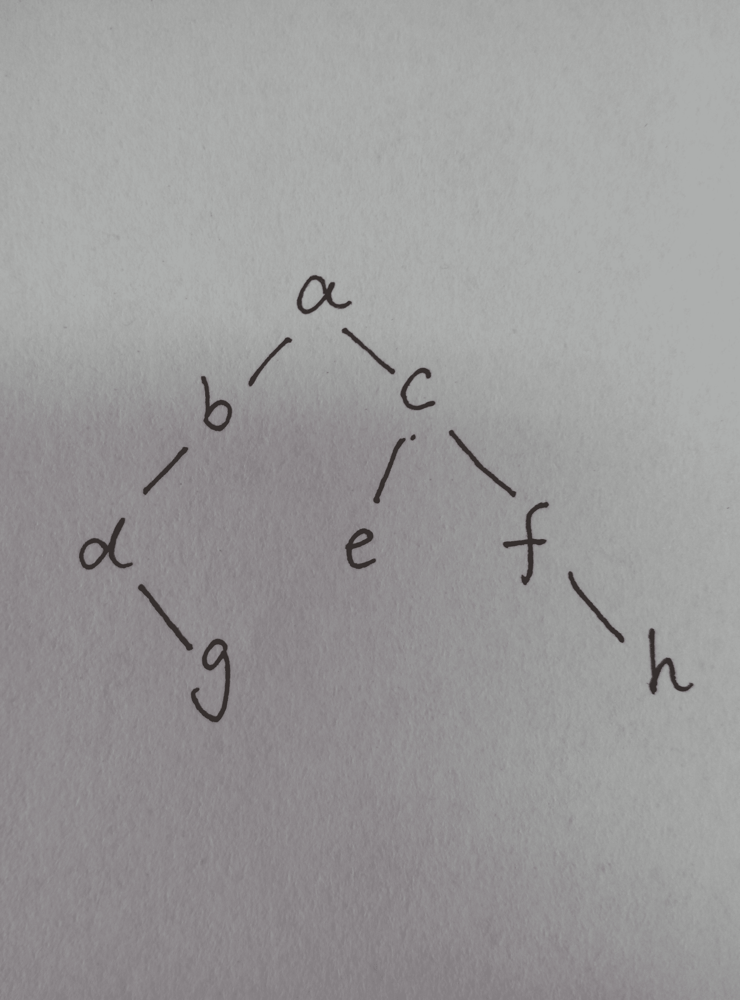
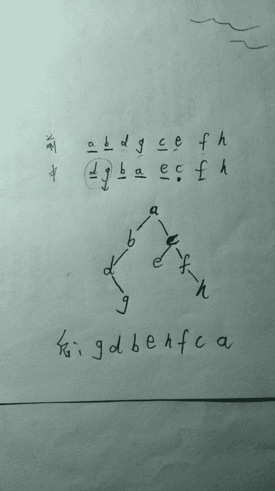
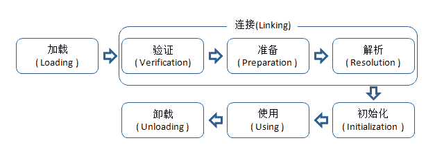
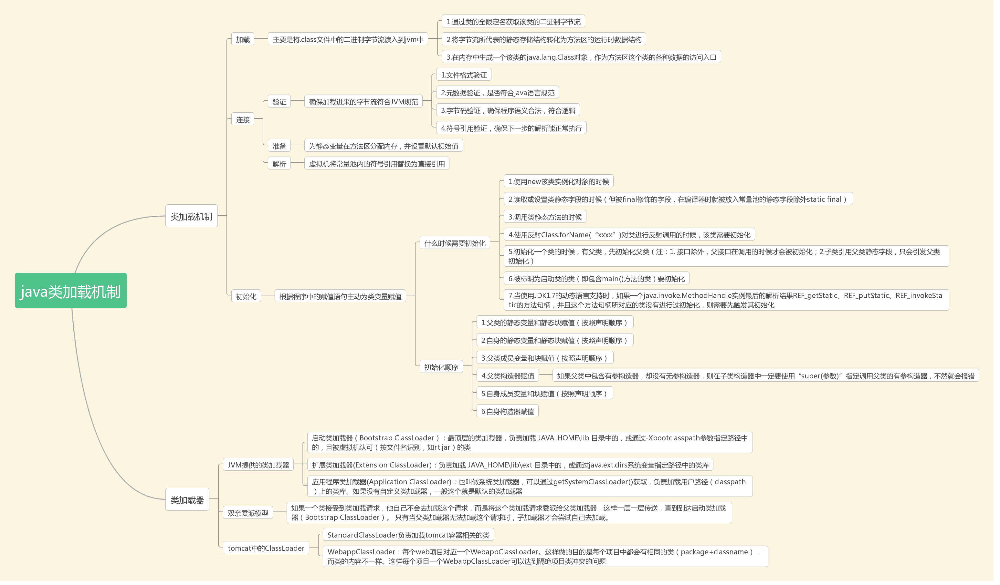
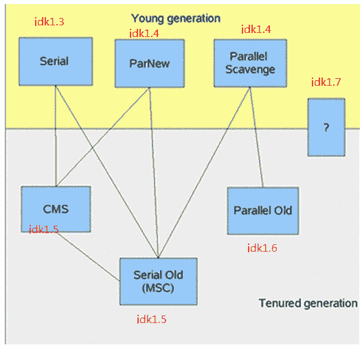
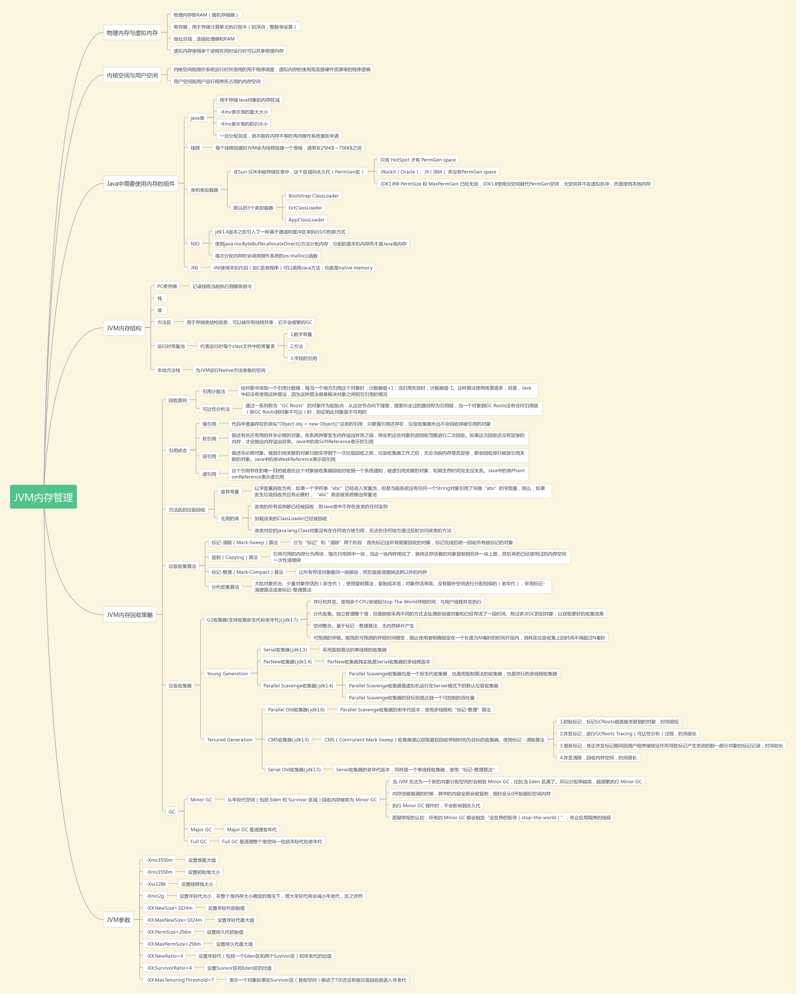
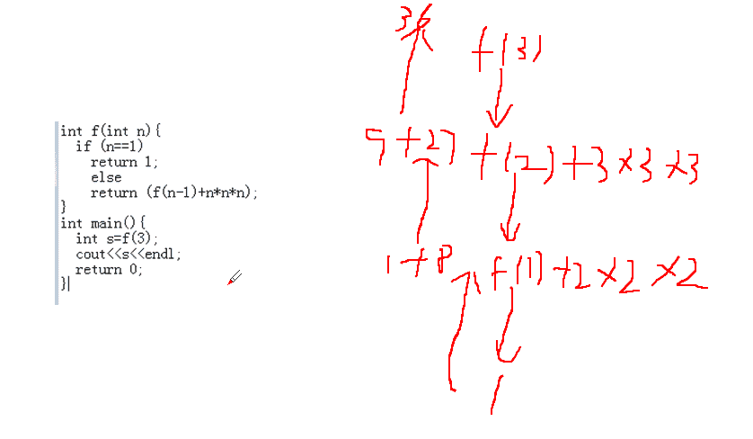
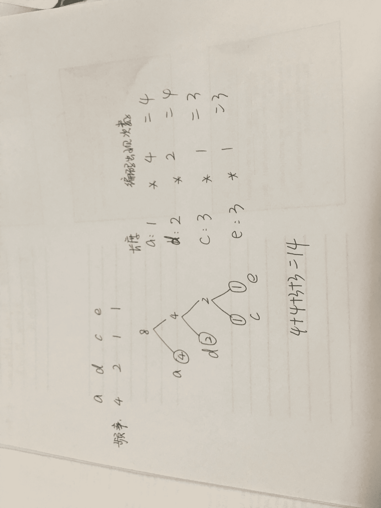
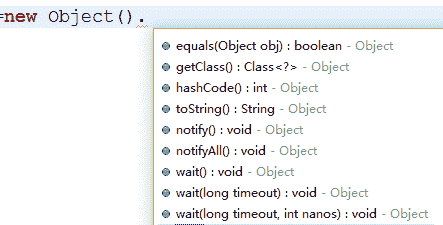

# 美团 2016 研发工程师笔试题(三)

## 1

如下图所示，1~9 诸数各有一个规定的符号，请据此回答下列问题。

| 1 | 2 | 3 | 4 | 5 | 6 | 7 | 8 | 9 |
| （ | = | / | × | \ | + | - | ) |   |

9 与什么符号相对应？

正确答案: A   你的答案: 空 (错误)

```cpp
÷
```

```cpp
+
```

```cpp
—
```

```cpp
\
```

本题知识点

判断推理

讨论

[wwwwxxxx](https://www.nowcoder.com/profile/363259333)

这个考过行测就知道，这个就是选没出现过的，就是这么简单不要多想了，题目也说了各有一个规定的符号，顶顶让我上去

发表于 2020-12-18 16:53:19

* * *

[jxSu_nju](https://www.nowcoder.com/profile/283865)

只能说是瞎蒙的。发现没有重复，所以后面也不重复。

发表于 2016-03-17 14:11:30

* * *

[牛客 898556 号](https://www.nowcoder.com/profile/898556)

因为有出现乘号 × ，而不是用 * 号代替，所以 / 也不应该代替除号  ÷

发表于 2015-10-27 10:07:29

* * *

## 2

Cross(sore) rents makes () inlet

正确答案: A   你的答案: 空 (错误)

```cpp
skin
```

```cpp
skan
```

```cpp
lake
```

```cpp
make
```

本题知识点

数学运算

讨论

[鸢尾楚楚](https://www.nowcoder.com/profile/109408)

```cpp
这道题，我连题目都没看懂
```

发表于 2016-04-03 14:52:16

* * *

[Pandora](https://www.nowcoder.com/profile/266279)

Cr**o**ss(s **o** *re*) *re*nts ma**k**es (s **k** *in*) *in*let

发表于 2015-10-17 14:39:06

* * *

[SunburstRun](https://www.nowcoder.com/profile/557336)

答案是 A       skin 括号里的单词的第一个字母是前面一个单词的第五个字母
第二个字母是前面一个单词的第三个字母
第三个字母是后面一个单词的第一个字母
第四个字母是后面一个单词的第二个字母

发表于 2015-10-16 13:45:19

* * *

## 3

下面对析构函数的正确描述是：

正确答案: C   你的答案: 空 (错误)

```cpp
系统不能提供默认的析构函数
```

```cpp
析构函数必须由用户定义
```

```cpp
析构函数没有参数
```

```cpp
析构函数可以设置默认参数
```

本题知识点

C++ C++工程师 Java 工程师 美团 2016

讨论

[hellowww](https://www.nowcoder.com/profile/924580)

析构函数名与类名相同，只是在函数名前面加一个位取反符~，以区别于构造函数 。它不能带任何参数，也没有返回值（包括 void 类型）。只能有一个析构函数，不能重载 。如果用户没有编写析构函数，编译器 自动生成一个缺省的析构函数（即使自定义了析构函数，编译器 也总是会为我们合成一个析构函数，并且如果自定义了析构函数，编译器在执行时会先调用自定义的析构函数再调用合成的析构函数），它也不进行任何操作。所以许多简单的类中没有用显式的析构函数。

发表于 2015-10-16 21:58:04

* * *

[xxmy008](https://www.nowcoder.com/profile/9578567)

不能带任何参数，也没有返回值（包括 void 类型）。只能有一个析构函数，不能重载   。如果用户没有编写析构函数，编译器   自动生成一个缺省的析构函数

发表于 2017-03-14 21:09:12

* * *

[QT 菜鸡弟弟](https://www.nowcoder.com/profile/132714808)

看成构造函数了，尴尬

发表于 2019-07-02 09:18:46

* * *

## 4

有 N 个员工排队排成一排，每个员工对应了一个级别 K，按照以下规则给员工发奖品。 1.每个员工都至少发一个奖品 2.相邻的两个员工如果级别不同，那么级别高的一定要得到比级别低的员工更多的奖品。 K 为整数，1 表示级别最低，然后是 2,3，以此类推。 员工的级别排列如下：1 2 3 4 4 1 2，求最少需要的奖品总数，以满足上述规则？

正确答案: A   你的答案: 空 (错误)

```cpp
15
```

```cpp
14
```

```cpp
13
```

```cpp
12
```

本题知识点

数学运算

讨论

[是小毛吖](https://www.nowcoder.com/profile/672111)

同样是 4 级，为啥后面的就是 2 个，而不是 4 个。员工心理会平衡吗

发表于 2017-08-20 20:22:33

* * *

[飞翔 zhi 梦](https://www.nowcoder.com/profile/138555)

员工：1 2 3 4 4 1 2 奖品：1 2 3 4 2 1 2 = 15

编辑于 2015-10-17 12:09:28

* * *

[心存静则强](https://www.nowcoder.com/profile/663814)

有条件 2 知，第一个发一个，第二个至少 2 个，第三个至少 3 个，第四个至少 4，因为相邻级别增加，第五个与第四个相同比第六个级别高， 所以第五个至少 2 个，第六个 1 个，第七个至少 2 个。1+2+3+4+2+1+2=15

发表于 2015-10-16 20:12:00

* * *

## 5

在公有派生的情况下，派生类中定义的成员函数只能访问原基类的()

正确答案: C   你的答案: 空 (错误)

```cpp
公有成员和私有成员
```

```cpp
私有成员和保护成员
```

```cpp
公有成员和保护成员
```

```cpp
私有成员,保护成员和公有成员
```

本题知识点

C++工程师 Java 工程师 美团 2016

讨论

[xiao_lai](https://www.nowcoder.com/profile/951877)

|   | public: | protected: | private: |
| public 继承 | public | protected | --- |
| protected 继承 | protected | protected | --- |
| private 继承 | private | private | --- |

使用 private 继承 , 父类的所有方法在子类中变为 private; 使用 protected 继承 , 父类的 protected 和 public 方法在子类中变为 protected,private 方法不变 ; 使用 public 继承 , 父类中的方法属性不发生改变 ;

编辑于 2016-05-02 20:17:14

* * *

[hellowww](https://www.nowcoder.com/profile/924580)

|   |  类内部 |  本包 |  子类 | 外部包  |
| public  |   √ |  √ |  √ |  √ |
| protected |   √ |  √ |  √ |  × |
| default  |   √ |  √ |  × |  × |
|  private |   √ |  × |  × |  × |

发表于 2015-10-16 21:59:55

* * *

[MatthewMatt](https://www.nowcoder.com/profile/7594311)

注意是派生类中的成员函数而不是派生类对象

发表于 2017-02-27 21:59:40

* * *

## 6

下面程序输出结果为？

```cpp
#include<iostream.h>
#define SUB(X,Y) (X)*Y
int main(){
    int a=3,b=4;
    cout<<SUB（a++,++b);
    return 0;
}
```

正确答案: A   你的答案: 空 (错误)

```cpp
15
```

```cpp
16
```

```cpp
20
```

```cpp
12
```

本题知识点

C++ C++工程师 Java 工程师 美团 2016

讨论

[Pandora](https://www.nowcoder.com/profile/266279)

所以注意 3++和++4,表达式中的 3++得先结束表达式再自加，而++4 是先自加再执行表达式。

发表于 2015-10-17 14:41:21

* * *

[飞翔 zhi 梦](https://www.nowcoder.com/profile/138555)

SUB（a++,++b) =  (a++)*++b = （3++）*++4 = 3*5 = 15

发表于 2015-10-17 12:11:51

* * *

[winzw.cn](https://www.nowcoder.com/profile/8839659)

不要总是相信别人的答案是正确的，vs2017 运行结果：15

发表于 2017-08-07 16:03:11

* * *

## 7

在

```cpp
int p[][4] = {{1}, {3, 2}, {4, 5, 6}, {0}};
```

中，p[1][2]的值是()

正确答案: B   你的答案: 空 (错误)

```cpp
1
```

```cpp
0
```

```cpp
6
```

```cpp
2
```

本题知识点

C++ C++工程师 Java 工程师 美团 2016 C 语言

讨论

[飞翔 zhi 梦](https://www.nowcoder.com/profile/138555)

p[][4] = 

| 1 | 0 | 0 | 0 |
| 3 | 2 | **0** | 0 |
| 4 | 5 | 6 | 0 |
| 0 | 0 | 0 | 0 |

发表于 2015-10-17 12:13:32

* * *

[小小果](https://www.nowcoder.com/profile/421595)

原来是这样

发表于 2016-05-17 08:44:37

* * *

[挪威 de 森林](https://www.nowcoder.com/profile/399818686)

数组中没有写出来的部分默认值为 0

发表于 2020-08-19 00:06:01

* * *

## 8

一个二叉树,前序遍历结果是:a b d g c e f h;中序遍历结果是:d g b a e c f h 求后序遍历结果是:

正确答案: B   你的答案: 空 (错误)

```cpp
g d b c e h f a
```

```cpp
g d b e h f c a
```

```cpp
d g b a c e f h
```

```cpp
g h d e f b c a
```

本题知识点

树 C++工程师 Java 工程师 美团 2016

讨论

[飞翔 zhi 梦](https://www.nowcoder.com/profile/138555)



发表于 2015-10-17 12:18:22

* * *

[zt_xcyk](https://www.nowcoder.com/profile/839070)

B

发表于 2015-10-18 11:58:34

* * *

[繁星的夜空 2012](https://www.nowcoder.com/profile/2920593)

一个二叉树,前序遍历结果是:a b d g c e f h;中序遍历结果是:d g b a e c f h 求后序遍历结果是:g d b e h f c a 解析：已知二叉树的中序遍历和前序遍历，如何求后序遍历 第一步，root 最简单，前序遍历的第一节点就是 root。第二步，对于前序遍历，除了 G 是 root 外，剩下的结点都是 root 的左右子树。没有其它信息第三步，观察中序遍历，其中 root 结点 a 左侧的 dgb 必然是 root 的左子树，a 右侧的 ecfh 必然是 root 的右子树。第四步，观察左子树 dgb，左子树的中的根节点必然是大树 root 的 leftchild。一定是先把 root 和 root 的所有左子树节点遍历完之后才会遍历右子树，并且遍历的右子树的第一个节点就是右子树的根节点。第五步，root 的右子树的结点 ecfh 也可以通过前序遍历求得。在前序遍历中，一定是先把 root 和 root 的所有左子树节点遍历完之后才会遍历右子树，并且遍历的右子树的第一个节点就是右子树的根节点。如何知道哪里是前序遍历中的左子树和右子树的分界线呢？通过中序遍历去数节点的个数。在上一次中序遍历中，root 左侧是 dgb，所以有 3 个节点位于 root 左侧。那么在前序遍历中，必然是第 1 个是 a，第 2 到第 4 个由 dgb 过程，第 6 个就是 root 的右子树的根节点了，是 c。第六步，观察发现，上面的过程是递归的。先找到当前树的根节点，然后划分为左子树，右子树，然后进入左子树重复上面的过程，然后进入右子树重复上面的过程。最后就可以还原一棵树了。第七步，其实，如果仅仅要求写后续遍历，甚至不要专门占用空间保存还原后的树。只需要稍微改动第六步，就能实现要求。仅需要把第六步的递归的过程改动为如下:1 确定根,确定左子树，确定右子树。2 在左子树中递归。3 在右子树中递归。4 打印当前根。

发表于 2016-12-21 19:17:08

* * *

## 9

以下哪项不属于 java 类加载过程？

正确答案: B   你的答案: 空 (错误)

```cpp
生成 java.lang.Class 对象
```

```cpp
int 类型对象成员变量赋予默认值
```

```cpp
执行 static 块代码
```

```cpp
类方法解析
```

本题知识点

Java Java 工程师 美团

讨论

[StrongYoung](https://www.nowcoder.com/profile/649626)

不应该选 D，而应该选 B  查看全部)

编辑于 2015-12-18 10:07:19

* * *

[hardy](https://www.nowcoder.com/profile/641341)

类加载过程

类从被加载到虚拟机内存中开始，到卸载出内存为止，它的整个生命周期包括：加载（Loading）、验证（Verification）、准备(Preparation)、解析(Resolution)、初始化(Initialization)、使用(Using)和卸载(Unloading)7 个阶段。其中准备、验证、解析 3 个部分统称为连接（Linking）。如图所示。

加载、验证、准备、初始化和卸载这 5 个阶段的顺序是确定的，类的加载过程必须按照这种顺序按部就班地开始，而解析阶段则不一定：它在某些情况下可以在初始化阶段之后再开始，这是为了支持 Java 语言的运行时绑定（也称为动态绑定或晚期绑定）。以下陈述的内容都已 HotSpot 为基准。

**加载**

在加载阶段（可以参考 java.lang.ClassLoader 的 loadClass()方法），虚拟机需要完成以下 3 件事情：

1.  通过一个类的全限定名来获取定义此类的二进制字节流（并没有指明要从一个 Class 文件中获取，可以从其他渠道，譬如：网络、动态生成、数据库等）；
2.  将这个字节流所代表的静态存储结构转化为方法区的运行时数据结构；
3.  在内存中生成一个代表这个类的 java.lang.Class 对象，作为方法区这个类的各种数据的访问入口；

加载阶段和连接阶段（Linking）的部分内容（如一部分字节码文件格式验证动作）是交叉进行的，加载阶段尚未完成，连接阶段可能已经开始，但这些夹在加载阶段之中进行的动作，仍然属于连接阶段的内容，这两个阶段的开始时间仍然保持着固定的先后顺序。

**验证**

验证是连接阶段的第一步，这一阶段的目的是为了确保 Class 文件的字节流中包含的信息符合当前虚拟机的要求，并且不会危害虚拟机自身的安全。
验证阶段大致会完成 4 个阶段的检验动作：

1.  文件格式验证：验证字节流是否符合 Class 文件格式的规范；例如：是否以魔术 0xCAFEBABE 开头、主次版本号是否在当前虚拟机的处理范围之内、常量池中的常量是否有不被支持的类型。
2.  元数据验证：对字节码描述的信息进行语义分析（注意：对比 javac 编译阶段的语义分析），以保证其描述的信息符合 Java 语言规范的要求；例如：这个类是否有父类，除了 java.lang.Object 之外。
3.  字节码验证：通过数据流和控制流分析，确定程序语义是合法的、符合逻辑的。
4.  符号引用验证：确保解析动作能正确执行。

验证阶段是非常重要的，但不是必须的，它对程序运行期没有影响，如果所引用的类经过反复验证，那么可以考虑采用-Xverifynone 参数来关闭大部分的类验证措施，以缩短虚拟机类加载的时间。

**准备**

准备阶段是正式为类变量分配内存并设置类变量初始值的阶段，这些变量所使用的内存都将在方法区中进行分配。这时候进行内存分配的仅包括类变量（被 static 修饰的变量），而不包括实例变量，实例变量将会在对象实例化时随着对象一起分配在堆中。其次，这里所说的初始值“通常情况”下是数据类型的零值，假设一个类变量的定义为：

| 1 | publicstaticintvalue=123; |

那变量 value 在准备阶段过后的初始值为 0 而不是 123.因为这时候尚未开始执行任何 java 方法，而把 value 赋值为 123 的 putstatic 指令是程序被编译后，存放于类构造器()方法之中，所以把 value 赋值为 123 的动作将在初始化阶段才会执行。
至于“特殊情况”是指：public static final int value=123，即当类字段的字段属性是 ConstantValue 时，会在准备阶段初始化为指定的值，所以标注为 final 之后，value 的值在准备阶段初始化为 123 而非 0\.

**解析**

解析阶段是虚拟机将常量池内的符号引用替换为直接引用的过程。解析动作主要针对类或接口、字段、类方法、接口方法、方法类型、方法句柄和调用点限定符 7 类符号引用进行。

**初始化**

类初始化阶段是类加载过程的最后一步，到了初始化阶段，才真正开始执行类中定义的 java 程序代码。在准备极端，变量已经付过一次系统要求的初始值，而在初始化阶段，则根据程序猿通过程序制定的主管计划去初始化类变量和其他资源，或者说：初始化阶段是执行类构造器<clinit>()方法的过程.

<clinit>()方法是由编译器自动收集类中的所有类变量的赋值动作和静态语句块 static{}中的语句合并产生的，编译器收集的顺序是由语句在源文件中出现的顺序所决定的，静态语句块只能访问到定义在静态语句块之前的变量，定义在它之后的变量，在前面的静态语句块可以赋值，但是不能访问原文链接  http://www.importnew.com/18548.html

发表于 2016-05-12 20:06:00

* * *

[程序猿 Go 师傅](https://www.nowcoder.com/profile/242025553)

java 类加载过程如图所示


编辑于 2019-10-21 17:04:28

* * *

## 10

```cpp
#include<iostream>
#include<string>
using namespace std;
class A
{
    friend long fun(A s)
    {
        if (s.x<3) {
            return 1;
        }
        return s.x+fun(A(s.x - 1));
    }
public:
    A(long a)
    {
        x = a--;
    }
private:
    long x;
};
int main()
{
    int sum=0;
    for( int i=0; i<5; i++) {
        sum += fun(A(i));
    }
    cout<<sum;
}
```

代码运行结果是？

正确答案: B   你的答案: 空 (错误)

```cpp
21
```

```cpp
15
```

```cpp
9
```

```cpp
36
```

本题知识点

C++ C++工程师 Java 工程师 美团 2016

讨论

[EricZeng](https://www.nowcoder.com/profile/827560)

这道题主要注意第 16 行的代码，x=a--;等价于 x=a;a--;两行代码，也就是说 a--并不会对结果产生影响。        i:  0  1  2  3  4   A(i):  0  1  2  3  4f(A(i)):  1  1  1  4  8  sum:  1  2  3  7  15

发表于 2016-06-26 19:51:38

* * *

[飞翔 zhi 梦](https://www.nowcoder.com/profile/138555)

        i:  0  1  2  3  4f(A(i)):  1  1  1  4  8 = 15

发表于 2015-10-17 12:20:50

* * *

[心存静则强](https://www.nowcoder.com/profile/663814)

```cpp
x=a--相当于 x=a;a=a--; x>3  ,s.x+fun(A(s.x - 1))递归。所以算得结果 15.
```

发表于 2015-10-16 19:28:57

* * *

## 11

下列哪项不属于 jdk1.6 垃圾收集器？

正确答案: D   你的答案: 空 (错误)

```cpp
Serial 收集器
```

```cpp
parNew 收集器
```

```cpp
CMS 收集器
```

```cpp
G1 收集器
```

本题知识点

Java C++工程师 Java 工程师 美团 2016

讨论

[Sishuo](https://www.nowcoder.com/profile/1490527)

1.Serial 收集器 
单线程收集器，收集时会暂停所有工作线程（我们将这件事情称之为 Stop The World，下称 STW），使用复制收集算法，虚拟机运行在 Client 模式时的默认新生代收集器。 

2.ParNew 收集器 
ParNew 收集器就是 Serial 的多线程版本，除了使用多条收集线程外，其余行为包括算法、STW、对象分配规则、回收策略等都与 Serial 收集器一摸一样。对 应的这种收集器是虚拟机运行在 Server 模式的默认新生代收集器，在单 CPU 的环境中，ParNew 收集器并不会比 Serial 收集器有更好的效果。 

3.Parallel Scavenge 收集器 
Parallel Scavenge 收集器（下称 PS 收集器）也是一个多线程收集器，也是使用复制算法，但它的对象分配规则与回收策略都与 ParNew 收集器有所不同，它是 以吞吐量最大化（即 GC 时间占总运行时间最小）为目标的收集器实现，它允许较长时间的 STW 换取总吞吐量最大化。 

4.Serial Old 收集器 
Serial Old 是单线程收集器，使用标记－整理算法，是老年代的收集器，上面三种都是使用在新生代收集器。 

5.Parallel Old 收集器 
老年代版本吞吐量优先收集器，使用多线程和标记－整理算法，JVM 1.6 提供，在此之前，新生代使用了 PS 收集器的话，老年代除 Serial Old 外别无选择，因为 PS 无法与 CMS 收集器配合工作。 

6.CMS（Concurrent Mark Sweep）收集器 
CMS 是一种以最短停顿时间为目标的收集器，使用 CMS 并不能达到 GC 效率最高（总体 GC 时间最小），但它能尽可能降低 GC 时服务的停顿时间，这一点对于实时或 者高交互性应用（譬如证券交易）来说至关重要，这类应用对于长时间 STW 一般是不可容忍的。CMS 收集器使用的是标记－清除算法，也就是说它在运行期间会 产生空间碎片，所以虚拟机提供了参数开启 CMS 收集结束后再进行一次内存压缩。 

发表于 2017-12-12 14:29:54

* * *

[请叫我猿叔叔](https://www.nowcoder.com/profile/6316247)

注：  现在 G1 已经商用了

发表于 2016-07-11 23:16:02

* * *

[程序猿 Go 师傅](https://www.nowcoder.com/profile/242025553)

G1 收集器是 jdk1.7 引入的，详情请看下图中垃圾收集器部分 

编辑于 2019-10-21 21:31:45

* * *

## 12

0-999999 之间的所有数字中，任何一位都不包括数字 3 的数字总数为多少?

正确答案: D   你的答案: 空 (错误)

```cpp
262144
```

```cpp
381041
```

```cpp
524288
```

```cpp
531441
```

本题知识点

数学运算

讨论

[我你](https://www.nowcoder.com/profile/626774)

答案是 9⁶，这题在选答案的时候可以快速计算，9 的 n 次方末尾的数字一定在 1 和 9 之间排除 AC，然后根据 9 的 n 次方一定可以被 3 整除，把所有数字加起来一定可以被 3 整除，答案 B 中 3+8+1+4+1=17 不能被 3 整除，所以可以排除，最后只剩 D 了

发表于 2015-10-17 11:36:33

* * *

[飞翔 zhi 梦](https://www.nowcoder.com/profile/138555)

十万     万     千     百    十     个每一位都可以是 0 1 2 4 5 6 7 8 9 所以是 9⁶  

发表于 2015-10-17 12:23:49

* * *

[episode](https://www.nowcoder.com/profile/1972979)

数字可以是 1~6 位，并不是固定的 6 位，所以好多人的答案是蒙对的，思路错了。正解是从 1 位到 6 位求出来不含 3 的数字总数：1+9+9²+9³+9⁴+9⁵+9⁶ 然而首位不能为 0，去除所有首位为 0 的数，再减去 1+9+9²+9³+9⁴+9⁵ 算出来刚好是 9⁶，但绝不是下面他们那样的思路，那样的思路是错的。

发表于 2016-09-02 18:15:11

* * *

## 13

有序数组 1 2 3 4 5 6 7 8 9 查找 3 的二分查找序列是:

正确答案: B   你的答案: 空 (错误)

```cpp
1->2->3
```

```cpp
5->2->3
```

```cpp
9->5->3
```

```cpp
5->1->4->3
```

本题知识点

查找 *讨论

[飞翔 zhi 梦](https://www.nowcoder.com/profile/138555)

索引：0 1 2 3 4 5 6 7 8 值：   1 2 3 4 5 6 7 8 9 第一步：left = 0;right = 8;middle = (0+8)/2=4;为 5 第二步：left = 0;right = 3;middle = (0+3)/2=1;为 2 第三步：left = 2;right = 3;middle = (2+3)/2=2;为 3 停止

发表于 2015-10-17 12:28:09

* * *

[我愿意](https://www.nowcoder.com/profile/5407446)

二分查找法：middle =(right +left )/2,当>middle 时，left =middle +1;反之，right =middle -1.

发表于 2016-08-11 11:24:34

* * *

[雷布斯克茨威格](https://www.nowcoder.com/profile/627745755)

起始条件 ：left=0, right=8, middle=(0+8)/2=4（对应的数为 5）；
5>3，所以取 middle 上部分 ：left=0, right=middle-1=3, middle=(0+3)/2=1（对应的数是 2）；
2<3，所以取 middle 下部分：left=middle+1=2，right=3,middle=(2+3)/2=2（对应的数是 3）；
3=3，end！

发表于 2020-05-09 09:46:24

* * *

## 14

在 java7 中,下列哪个说法是正确的:

正确答案: D   你的答案: 空 (错误)

```cpp
ConcurrentHashMap 使用 synchronized 关键字保证线程安全
```

```cpp
HashMap 实现了 Collection 接口
```

```cpp
Arrays.asList 方法返回 java.util.ArrayList 对象
```

```cpp
SimpleDateFormat 对象是线程不安全的
```

本题知识点

Java Java 工程师

讨论

[盛远之](https://www.nowcoder.com/profile/950568)

hashMap 在单线程中使用大大提高效率，在多线程的情况下使用 hashTable 来确保安全。hashTable 中使用 synchronized 关键字来实现安全机制，但是 synchronized 是对整张 hash 表进行锁定即让线程独享整张 hash 表，在安全同时造成了浪费。concurrentHashMap 采用分段加锁的机制来确保安全

发表于 2016-03-18 11:02:54

* * *

[smartleon](https://www.nowcoder.com/profile/485266)

Arrays.asList()将一个数组转化为一个 List 对象，这个方***返回一个 ArrayList 类型的对象， 这个 ArrayList 类并非 java.util.ArrayList 类，**而是 Arrays 类的静态内部类！**用这个对象对列表进行添加删除更新操作，就会报 UnsupportedOperationException 异常。

发表于 2015-10-27 11:46:37

* * *

[大河儿马](https://www.nowcoder.com/profile/214250)

ConcurrentHashMap 使用 segment 来分段和管理锁，segment 继承自 ReentrantLock，因此 ConcurrentHashMap 使用 ReentrantLock 来保证线程安全。

发表于 2015-11-12 10:25:44

* * *

## 15

```cpp
#include <iostream>
using namespace std;
int f(int n){
  if (n==1)
    return 1;
    else
    return (f(n-1)+n*n*n);
}
int main(){
  int s=f(3);
  cout<<s<<endl;
  return 0;
}
```

运行结果是？

正确答案: D   你的答案: 空 (错误)

```cpp
8
```

```cpp
9
```

```cpp
27
```

```cpp
36
```

本题知识点

C++ C++工程师 Java 工程师 美团 2016

讨论

[菜鸟葫芦娃](https://www.nowcoder.com/profile/415611)

D 其实递归的原理就是利用栈来进行中间存储的数据。f(3)=f(2)+3*3*3=9+27=36f(2)=f(1)+2*2*2=1+8=9f(1)=1 图形化或者内存的走势如下图： 

发表于 2015-10-17 07:49:38

* * *

[酒酿小元宵](https://www.nowcoder.com/profile/791539993)

f( )是一个递归函数，结束递归的条件为 n==1

在 main 函数中:

先调用 f(3),n = 3,return f(2) + 3*3*3

再调用 f(2),n = 2,return f(1) + 2*2*2

最后调用 f(1),n=2,return 1,递归结束

再逐层返回：

f(1) = 1

f(2) = f(1 ) + 2*2*2 = 1 + 8 = 9

f(3) = f(2) + 3*3*3 = 9 + 27 = 36

发表于 2018-09-20 19:39:40

* * *

[眼笑。](https://www.nowcoder.com/profile/7150643)

没学过 c++,主要是想刷一些 c 的题。这里遇到没见过的知识点，记录一下 count<~~发表于 2018-03-20 08:39:33

* * *

## 16

```cpp
public interface IService {String NAME="default";}
```

默认类型等价表示是哪一项:~~

正确答案: C   你的答案: 空 (错误)

```cpp
public String NAME="default";
```

```cpp
public static String NAME="default";
```

```cpp
public static final String NAME="default";
```

```cpp
private String NAME="default";
```

本题知识点

Java C++工程师 Java 工程师 美团 2016

讨论

[lily007](https://www.nowcoder.com/profile/209797)

接口中的变量默认是 public static final 的，方法默认是 public abstract 的

发表于 2015-10-16 13:54:45

* * *

[hanking](https://www.nowcoder.com/profile/3849729)

在 interface 里面的变量都是 public static final 的。所以你可以这样写：
public static final int i=10;
或则
int i=10；（可以省略掉一部分）

注意在声明的时候要给变量赋予初值

**解释：**

首先你要弄清接口的含义.接口就是提供一种统一的’协议’,而接口中的属性也属于’协议’中的成员.它们是公共的,静态的,最终的常量.相当于全局常量.
抽象类是不’完全’的类,相当于是接口和具体类的一个中间层.即满足接口的抽象,也满足具体的实现.
如果接口可以定义变量，但是接口中的方法又都是抽象的，在接口中无法通过行为来修改属性。有的人会说了，没有关系，可以通过实现接口的对象的行为来修改接口中的属性。这当然没有问题，但是考虑这样的情况。如果接口 A 中有一个 public 访问权限的静态变量 a。按照[Java](http://lib.csdn.net/base/javase)的语义，我们可以不通过实现接口的对象来访问变量 a，通过 A.a = xxx;就可以改变接口中的变量 a 的值了。正如抽象类中是可以这样做的，那么实现接口 A 的所有对象也都会自动拥有这一改变后的 a 的值了，也就是说一个地方改变了 a，所有这些对象中 a 的值也都跟着变了。这和抽象类有什么区别呢，怎么体现接口更高的抽象级别呢，怎么体现接口提供的统一的协议呢，那还要接口这种抽象来做什么呢？所以接口中不能出现变量，如果有变量，就和接口提供的统一的抽象这种思想是抵触的。所以接口中的属性必然是常量，只能读不能改，这样才能为实现接口的对象提供一个统一的属性。

通俗的讲，你认为是要变化的东西，就放在你自己的实现中，不能放在接口中去，接口只是对一类事物的属性和行为更高层次的抽象。对修改关闭，对扩展（不同的实现 implements）开放，接口是对开闭原则的一种体现。csdn:[`blog.csdn.net/u013309870`](https://blog.csdn.net/u013309870)

编辑于 2019-01-15 22:14:09

* * *

[冰封无痕](https://www.nowcoder.com/profile/266593)

接口中的成员包括：全局常量和抽象方法。接口中的成员都有固定的修饰符， 成员变量：public static final 成员方法：public abstract 接口中的成员的访问权限都是公共的，接口中可以隐藏不写这些固定的修饰符。接口不可以实例化，只有子类重写了接口中的所有方法后，子类才可以实例化，否则子类还是一个抽象类。子类重写方法的访问权限都是 public 的。

编辑于 2016-09-05 21:30:09

* * *

## 17

关于以下程序代码的说明正确的是()

```cpp
 public class HasStatic {// 1
	private static int x = 100;// 2
	public static void main(String args[]) {// 3
		HasStatic hsl = new HasStatic();// 4
		hsl.x++;// 5
		HasStatic hs2 = new HasStatic();// 6
		hs2.x++;// 7
		hsl = new HasStatic();// 8
		hsl.x++;// 9
		HasStatic.x--;// 10
		System.out.println(" x=" + x);// 11
	}
}
```

正确答案: A   你的答案: 空 (错误)

```cpp
程序通过编译，输出结果为:x=102
```

```cpp
程序通过编译，输出结果为:x=103
```

```cpp
10 行不能通过编译.因为 x 星私有静态变量
```

```cpp
5 行不能通过编译.因为引用了私有静态变量
```

本题知识点

Java C++工程师 Java 工程师 美团 2016

讨论

[hellowww](https://www.nowcoder.com/profile/924580)

同一个类内，private 变量可以访问，所以 CD 错。由于 x 是 static 的，存贮在类内，而不是对象内，所以++、--操作的是同一个变量。

发表于 2015-10-16 22:09:26

* * *

[wangchenphoebe](https://www.nowcoder.com/profile/225981)

类变量既可以通过类来返回，也可以通过类的对象来访问。但通过类的对象来访问类变量时，实际不是访问该对象所拥有的变量，因为当系统创建该类的对象时，系统不会再为类变量分配内存，也不会再次对类变量进行初始化，也就是说，对象根本不拥有对应类的类变量，通过对象访问类变量只是一种假象，通过对象访问的依然是该类的类变量。 ————《疯狂 java 讲义》

发表于 2016-07-19 20:40:59

* * *

[李哥的骄傲](https://www.nowcoder.com/profile/5881893)

首先要明确，静态(static)是在程序加载的时候就一起写入内存，相当于是一直跟随着它自己这个类，这就可以理解为什么可以用 类名.变量名 来直接调用；接着是实例化对象(也就是 new 出来的对象)，实例化是必须 new 了之后才会存在在该类中，也就是说若不是静态方法，你就必须先 new，是 new 这个对象有该类的访问权限，因此 new 出来的对象名也可以调用静态产量了；最后这就是因为静态变量一开始就加载到内存中，因此++和--都是对同一变量值，所以最终通过编译，值为 102

发表于 2017-03-08 23:49:37

* * *

## 18

有以下程序

```cpp
#include<iostream>
#include<cstdio>
using namespace std;
int main(){
  int m=0123, n = 123;
  printf("%o %o\n", m, n);
  return 0;
}

```

程序运行后的输出结果是()

正确答案: C   你的答案: 空 (错误)

```cpp
0123 0173
```

```cpp
0123 173
```

```cpp
123 173
```

```cpp
173 173
```

本题知识点

C++ C++工程师 Java 工程师 美团 2016 C 语言

讨论

[菜鸟葫芦娃](https://www.nowcoder.com/profile/415611)

Co% 表示 8 进制进行  查看全部)

编辑于 2016-01-13 12:38:06

* * *

[未来即来、](https://www.nowcoder.com/profile/216571)

数字前加 0 表示八进制数，加 0x 表示 16 进制。

发表于 2016-02-27 21:32:14

* * *

[huixieqingchun](https://www.nowcoder.com/profile/551201)

**注意八进制输出时，前面不会带 o 字母的，一定要注意。**

发表于 2016-05-18 17:35:35

* * *

## 19

HashSet 子类依靠()方法区分重复元素。

正确答案: C   你的答案: 空 (错误)

```cpp
toString(),equals()
```

```cpp
clone(),equals()
```

```cpp
hashCode(),equals()
```

```cpp
getClass(),clone()
```

本题知识点

Java Java 工程师

讨论

[闲逛的蚂蚁](https://www.nowcoder.com/profile/947285)

  查看全部)

编辑于 2016-10-30 00:08:19

* * *

[bbblemon](https://www.nowcoder.com/profile/3807435)

**选 C****HashSet 的底层还是用 HashMap 来实现的。将 Entry<K,V>的 V 都变成了同一个 Object 对象，public static final PRESENT = new Object()。****而 HashMap 的数据结构是数组+链表+红黑树。****调用 K 的 hashCode 方法，然后高低 16 位进行&运算。得到的 hash 值，与数组 tab[]（桶）的长度-1 进行&运算，确定插入对象在哪一个桶上。然后调用对象的 equals 方法，形成链表。当链表长度大于 8 时，链表转红黑树。**

发表于 2018-06-29 19:13:35

* * *

[winney_wwwwww](https://www.nowcoder.com/profile/3525971)

比较对象相等时也是要最好同时重写这两个方法。一直记着 hashcode 用来找桶，equals 用来在桶里找相同那一个。

发表于 2017-05-13 09:56:39

* * *

## 20

多个线程可同时操作一个数据，为了保证该数据的准确性，可将操作该数据的部分改为:

正确答案: D   你的答案: 空 (错误)

```cpp
只写
```

```cpp
只读
```

```cpp
异步
```

```cpp
同步
```

本题知识点

并发 C++工程师 Java 工程师 美团 2016

讨论

[offer 过来自己动](https://www.nowcoder.com/profile/372304342)

链接：[`www.nowcoder.com/questionTerminal/0061be88463e4949863f68ba38175ae9?toCommentId=7323`](https://www.nowcoder.com/questionTerminal/0061be88463e4949863f68ba38175ae9?toCommentId=7323)
来源：牛客网

1\. 并发：在 [操作系统](http://baike.baidu.com/view/880.htm) 中，是指一个时间段中有几个程序都处于已启动运行到运行完毕之间，且这几个程序都是在同一个 [处理机](http://baike.baidu.com/view/2107226.htm) 上运行。其中两种并发关系分别是同步和互斥
2\. 互斥：进程间相互排斥的使用临界资源的现象，就叫互斥。
3\. 同步： 进程之间的关系不是相互排斥临界资源的关系，而是相互依赖的关系。进一步的说明：就是前一个进程的输出作为后一个进程的输入，当第一个进程没有输出时第二个进程必须等待。具有同步关系的一组并发进程相互发送的信息称为消息或事件。
其中并发又有伪并发和真并发，伪并发是指单核处理器的并发，真并发是指多核处理器的并发。
4\. 并行：在单处理器中多道程序设计系统中，进程被交替执行，表现出一种并发的外部特种；在多处理器系统中，进程不仅可以交替执行，而且可以重叠执行。在多处理器上的程序才可实现并行处理。从而可知，并行是针对多处理器而言的。并行是同时发生的多个并发事件，具有并发的含义，但并发不一定并行，也亦是说并发事件之间不一定要同一时刻发生。

5\. 多线程：多线程是程序设计的逻辑层概念，它是进程中并发运行的一段代码。多线程可以实现线程间的切换执行。

6\. 异步：异步和同步是相对的，同步就是顺序执行，执行完一个再执行下一个，需要等待、协调运行。异步就是彼此独立,在等待某事件的过程中继续做自己的事，不需要等待这一事件完成后再工作。线程就是实现异步的一个方式。异步是让调用方法的主线程不需要同步等待另一线程的完成，从而可以让主线程干其它的事情。
   异步和多线程并不是一个同等关系,异步是最终目的,多线程只是我们实现异步的一种手段。异步是当一个调用请求发送给被调用者,而调用者不用等待其结果的返回而可以做其它的事情。实现异步可以采用多线程技术或则交给另外的进程来处理。

发表于 2020-09-30 23:07:37

* * *

[ajavastudent](https://www.nowcoder.com/profile/936566)

答案：D 对该数据加锁，放在同步代码块中 synchronize(){}

发表于 2016-01-08 10:08:09

* * *

[Better29](https://www.nowcoder.com/profile/4195045)

只读也保证了数据的准确性和一致性呢 感觉应该选 B D

发表于 2017-05-30 17:50:55

* * *

## 21

用二进制来编码字符串"adceadaa"，需要能够相据编码，解码回原来的字符串，则至少需要二进制字符的长度是?

正确答案: B   你的答案: 空 (错误)

```cpp
12
```

```cpp
14
```

```cpp
18
```

```cpp
20
```

本题知识点

树

讨论

[小虎牙](https://www.nowcoder.com/profile/512935)



发表于 2015-12-03 17:05:02

* * *

[lily007](https://www.nowcoder.com/profile/209797)

adceadaa 使用到了压缩的办法，其中 a:4,d:2,c:1,e:1 编码为 a：1         b：01c：001d：000 所以总共需要二进制位数=1*4+2*2+1*3+1*3=14

发表于 2015-10-16 13:59:26

* * *

[炫](https://www.nowcoder.com/profile/376795)

利用哈夫曼编码，字符出现的频率越大，则使用越短的二进制进行编码

编辑于 2016-01-10 14:10:09

* * *

## 22

下面不属于 Object 类中方法的是:

正确答案: B   你的答案: 空 (错误)

```cpp
hashCode()
```

```cpp
finally()
```

```cpp
wait()
```

```cpp
toString()
```

本题知识点

Java C++工程师 Java 工程师 美团 2016

讨论

[牛客 5993425 号](https://www.nowcoder.com/profile/5993425)

这个故事告诉我们英语学得好题目做得好。方法一般都是动词或者动宾结构，finally 显然不对应该是 finalize

发表于 2017-05-21 14:14:48

* * *

[ixiaomo](https://www.nowcoder.com/profile/854180)

下图

发表于 2016-04-18 10:51:46

* * *

[征服天堂](https://www.nowcoder.com/profile/371462)

finalize()才是 object 方法，放在程序末尾，垃圾回收器运行到此程序时，执行此方法，通过重载此方法，可以在进行内存回收时实现其它功能，比如关闭文件等

发表于 2015-11-18 11:56:26

* * *

## 23

有以下程序运行结果为:

```cpp
#include <iostream>
using namespace std;
char fun(char x, char y) {
	if (x < y)
		return x;
	return y;
}
int main() {
	int a = '1', b = '1', c = '2';
	cout << fun(fun(a, b), fun(b, c));
	return 0;
}
```

正确答案: D   你的答案: 空 (错误)

```cpp
运行出错
```

```cpp
2
```

```cpp
3
```

```cpp
1
```

本题知识点

C++ C++工程师 Java 工程师 美团 2016 C 语言

讨论

[飞翔 zhi 梦](https://www.nowcoder.com/profile/138555)

fun(fun(a, b), fun(b, c)) =  fun(fun( '1' ,  '1' ), fun( '1' ,  '2' )) = fun( '1' , '1' ) =  '1'

发表于 2015-10-17 12:40:51

* * *

[EricZeng](https://www.nowcoder.com/profile/827560)

第 9 行代码将字符型转换为整型 a=49,b=49,c=50 第 10 行调用 fun()函数时，由于 fun()传递的参数是字符型，将整型变量 a,b,c 截断转换为字符型变量 a,b,c；因此运行时不会出错。答案是 1，选 D。

发表于 2016-06-28 19:36:44

* * *

[changyz](https://www.nowcoder.com/profile/852163)

cout 直接输出 fun 的结果，即字符'1'，若重新将结果赋值给 int 类型的，则结果为 49。此题要注意字符和 ASCII 码的自动转化。

发表于 2015-10-17 23:44:10

* * *

## 24

下面关于类定义的说法中，正确的是:

正确答案: A   你的答案: 空 (错误)

```cpp
类定义中包括数据成员和函数成员的声明
```

```cpp
类成员的缺省访问权限是保护的
```

```cpp
数据成员必须被声明为私有的
```

```cpp
成员函数只能在类体外进行定义
```

本题知识点

C++工程师 Java 工程师 美团 2016

讨论

[牛客 581671 号](https://www.nowcoder.com/profile/581671)

类成员的缺省访问是私有的，private

发表于 2015-10-16 23:15:30

* * *

[FreeLoop201909292343456](https://www.nowcoder.com/profile/737430612)

缺省可以理解为默认网上搜索了一下缺省这个词的含义。这个名词表述的意思是，当某个数据在没有被指定为特定项时，会自动选择的一项数值——换言之，缺少某项的数据指定时，省略某项的数据定义时，程序会自动填入的项，也就是 default。

发表于 2019-11-10 15:48:27

* * *

[璎珞-沐](https://www.nowcoder.com/profile/6390519)

类的成员函数的原型要写在类体中，原型说明了函数的参数表和返回值类型。而函数的定义一般在类外面，也可以直接在类内部定义。

发表于 2017-05-15 13:30:18

* * *

## 25

下面程序的运行结果：()

```cpp
public static void main(String args[]) {
		Thread t=new Thread(){
		public void  run(){
			dianping();

		}
	};
	t.run();
	System.out.print("dazhong");
	}
	static void dianping(){
		System.out.print("dianping");
}
```

正确答案: B   你的答案: 空 (错误)

```cpp
dazhongdianping
```

```cpp
dianpingdazhong
```

```cpp
a 和 b 都有可能
```

```cpp
dianping 循环输出，dazhong 夹杂在中间
```

本题知识点

Java Java 工程师

讨论

[lily007](https://www.nowcoder.com/profile/209797)

B 在上面 main()方  查看全部)

编辑于 2016-01-14 16:35:52

* * *

[stevenniu](https://www.nowcoder.com/profile/595432)

**如果调用 run（） 选 b****如果调用 start（） 选 c****因为调用 start 后并不保证线程启动的顺序**

发表于 2016-03-08 16:02:17

* * *

[牛客 329873 号](https://www.nowcoder.com/profile/329873)

```cpp
这里仅仅是调用了 run()方法，程序就只能顺序执行；开启线程是调用 start()方法，这样才能并发执行。
```

发表于 2016-01-31 21:30:25

* * *

## 26

下列算法中，没有使用贪心策略的是:

正确答案: D   你的答案: 空 (错误)

```cpp
Prim 算法
```

```cpp
Kruskal 算法
```

```cpp
Dijkstra 算法
```

```cpp
KMP 算法
```

本题知识点

贪心 C++工程师 Java 工程师 美团 2016

讨论

[gendlee](https://www.nowcoder.com/profile/617149)

**A.Prim 算法** **：属于贪心策略。**
**    最小树生成概念。G=(V, E),首先置 S＝{1},只要 S 是 V 的真子集，就进行如下的贪心选择，选取满足条件 i 属于 S，j 属于 V－S，且** **matrix[i][j]是最小的边，将 j 加入到 S 中，这个过程一直持续到 S＝V 为止，在这个过程中选择的所有边恰好构**
**成 G 的一棵最小生成树。****B. ** **Kruskal 算法：** **属于贪心策略。****    不停地循环，每一次都寻找两个顶点，这两个顶点不在同一个真子集里，且边上的权值最小。** **把找到的这两个顶点联合起来。** **初始时，每个顶点各自属于自己的子集合，共 n 个子集合。** **每一步操作，都会将两个子集合融合成一个，进而减少一个子集合。** **结束时，所有的顶点都在同一个子集合里，这个子集合就是最小生成树。****C** **.Dijkstra 算法:** **属于贪心策略****    该算法是解单源最短路径问题的贪心算法。其基本思想是，设置顶点集合 S 并不断地做贪心选择来扩充这个集合。****D.** **KMP 算法：不属于贪心算法，而是递推策略。****    KMP 算法是一种改进的字符串匹配算法。为了确定在匹配不成功时，下次匹配时 j 的位置，引入了 next[]数组，next[j]的值表示 P[0...j-1]中最长后缀的长度等于相同字符序列的前缀，在匹配过程称，若发生不匹配的情况，如果 next[j]>=0，则目标串的指针 i 不变，将模式串的指针 j 移动到 next[j]的位置继续进行匹配；若 next[j]=-1，则将 i 右移 1 位，并将 j 置 0，继续进行比较。**

编辑于 2015-10-18 15:59:17

* * *

## 27

给出 8 个正整数 3 2 2 3 8 8 1 2。可以将这 8 个整数分成一组或多组。使得满足以下条件 1，不能打乱给出的整数的顺序 2，每一组的和不能超过 18 显然.这样的划分有很多种.求这样的划分中.每一组的最大值的和形成的最小值是:

正确答案: A   你的答案: 空 (错误)

```cpp
13
```

```cpp
14
```

```cpp
15
```

```cpp
16
```

本题知识点

数学运算

讨论

[Aimiyoo](https://www.nowcoder.com/profile/454056)

至今没看懂想要表达什么意思

发表于 2016-03-23 22:15:42

* * *

[zhisheng_blog](https://www.nowcoder.com/profile/616717)

两个 8 是相邻的，两个 8 必须在一个组才能 使两个 8 不落在两个组内使最后的和变得更大，又因为 不能破坏原有顺序，所以 分组为（3 、2 、2 、3）（8 、8）（1 、2），然后呢答案不就出来了 3+8+2=13

发表于 2016-04-07 13:05:50

* * *

[131452zreo](https://www.nowcoder.com/profile/303529390)

形成的   每一组的的最大值 的和   形成的最小值 (这题的断句是有毒吗)

发表于 2018-10-14 20:51:59

* * *

## 28

n 个字符组成了一个字符串:若每个字符都不一样，则该字符串共有多少个不同的非空子集

正确答案: D   你的答案: 空 (错误)

```cpp
n
```

```cpp
n (n+1)/2
```

```cpp
n!
```

```cpp
2^n-1
```

本题知识点

组合数学 *C++工程师 Java 工程师 美团 2016* *讨论

[菜鸟葫芦娃](https://www.nowcoder.com/profile/415611)

答案为 D 注意这个题目求  查看全部)

编辑于 2015-10-16 23:53:23

* * *

[lily007](https://www.nowcoder.com/profile/209797)

n 个字符，n 个位置，每个位置的字符都有两种情况，存在或不存在，所有总共有 2^n，在减去每个位置都没有字符的情况所以是 2^n-1

发表于 2015-10-16 14:26:39

* * *

[过往云烟 123](https://www.nowcoder.com/profile/983664)

特例法。比如 n=3，即可求解，选择题就是有技巧性而言的，不要傻算。

发表于 2016-08-01 13:55:25

* * *

## 29

关于内联函数说法错误的是:

正确答案: C   你的答案: 空 (错误)

```cpp
不是任何一个函数都可定义成内联函数
```

```cpp
内联函数的函数体内不能含有复杂的结构控制语句
```

```cpp
递归函数可以被用来作为内联函数
```

```cpp
内联函数一般适合于只有 1~5 行语句的小函数
```

本题知识点

C++ C++工程师 Java 工程师 美团 2016

讨论

[菜鸟葫芦娃](https://www.nowcoder.com/profile/415611)

内联函数是使用 inline 关键字声明的函数，也成内嵌函数，它主要的作用是解决程序的运行效率。使用内联函数的时候要注意：1.递归函数不能定义为内联函数 2.内联函数一般适合于不存在 while 和 switch 等复杂的结构且只有 1~5 条语句的小函数上，否则编译系统将该函数视为普通函数。3.内联函数只能先定义后使用，否则编译系统也会把它认为是普通函数。4.对内联函数不能进行异常的接口声明。

发表于 2015-10-16 14:20:03

* * *

[huixieqingchun](https://www.nowcoder.com/profile/551201)

**内联函数主要用来提高程序的运行效率，递归函数如果用内联函数的话，会使代码变得很长，从而无限循环嵌套。**

发表于 2016-05-20 12:41:33

* * *

[叉子伯格](https://www.nowcoder.com/profile/8158796)

关于内联函数： 1、inline 只影响函数在源码文件里面的编译行为，所以 inline 放在函数声明的位置没有意义，甚至可能引起编译错误。 2、inline 只是程序员给编译器的一个建议，是否将函数内联取决于编译器的判断。内联函数类似于宏，在编译期间就展开。而递归函数在执行过程中才知道要运行多少次，所以递归函数不会被作为内联函数。

编辑于 2017-05-14 12:30:06

* * *

## 30

有 49 个球，每个球都有从 1 到 49 不同的编号。若挑选若干个球，按照一定的顺序排成一个圆圈，使圈内任何相邻两个球的编号乘积小于 100，那么最多能挑选出多少球？

正确答案: B   你的答案: 空 (错误)

```cpp
16
```

```cpp
18
```

```cpp
19
```

```cpp
20
```

本题知识点

数学运算

讨论

[wuhouyinghua](https://www.nowcoder.com/profile/675693)

因为任何两个不同的两位数相乘的  查看全部)

编辑于 2015-12-24 19:07:42

* * *

[小杨 vita](https://www.nowcoder.com/profile/576504)

9*10=90<100   10*11=110>100，所以我们以 9 和 10 为中点向两边扩展，得到 1-18，交错摆放即可， ...7 11 9 10 8 12...

发表于 2015-10-18 00:52:17

* * *

[Mosaicchen](https://www.nowcoder.com/profile/502239)

1*49*2*33*3*24*4*19*5*16*6*14*7*12*8*11*9*10

发表于 2015-12-24 17:01:43

* * ***