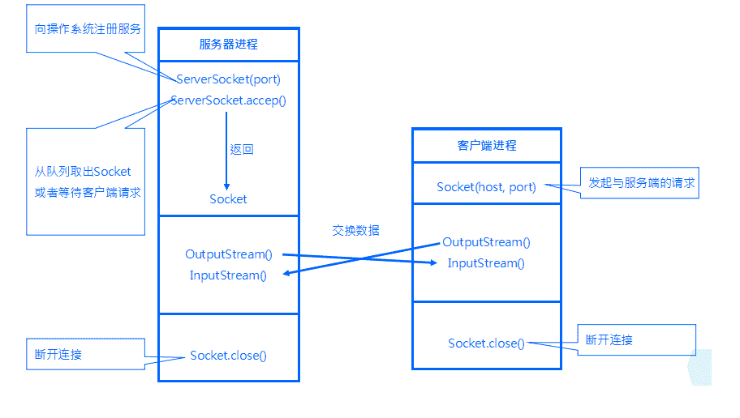

# 爱奇艺 2016 研发工程师笔试题（二）

## 1

考虑下面这个简单的例子，让我们看看 reflection 是如何工作的。

```cpp
import java.lang.reflect.*;
public class DumpMethods{
	public static void main(String[] args) {
		try {
			Class c=Class.forName(args[0]);
			Method m[]=c.getDeclaredMethods();
			for (int i = 0; i < m.length; i++) {
				System.out.println(m[i].toString());
			}
		} catch (Throwable e) {
			System.err.println(e);
		}
	}
}
```

其中"c.getDeclaredMethods"的作用是:

正确答案: D   你的答案: 空 (错误)

```cpp
取得类的公有方法对象
```

```cpp
取得类的所有公有方法名称
```

```cpp
取得类的所有方法对象
```

```cpp
以上选项都不正确
```

本题知识点

Java

讨论

[Pandora](https://www.nowcoder.com/profile/266279)

=====目测答案从 C 修改为 D 了，所以大家若碰到，就选 D 咯(lll￢ω￢)=====**public Method[] getDeclaredMethods()**返回类或接口声明的所有方法，包括 public, protected, default (package) 访问和 private 方法的 Method 对象，但不包括继承的方法。当然也包括它所实现接口的方法。**public Method[] getMethods()**返回类的所有 public 方法，包括其继承类的公用方法，当然也包括它所实现接口的方法。

编辑于 2017-05-04 14:57:27

* * *

[武岩](https://www.nowcoder.com/profile/4552908)

纠正，选 D。做了两遍还是错的，自惭中......决定把 Class 类好好看一遍。当一个类或接口被加载到 JVM 的时候便会产生一个与之关联的一个 Java.lang.Class 对象，我们可以通过此 Class 对象来得到被装入的类的详细信息。其中：Method[] getDeclaredMethods() 返回 Class 对象表示的类或接口的**所有已声明的方法**数组，但是不包括从父类继承和接口实现的方法。Method[] getMethods() 返回当前 Class 对象表示的类或接口的所有**公有成员方法**对象数组，包括已声明的和从父类继承或实现接口的方法。其他方法的介绍大家可以看此博客：[`utopialxw.iteye.com/blog/1220476`](http://utopialxw.iteye.com/blog/1220476)

编辑于 2018-01-10 13:36:02

* * *

[zhisheng_blog](https://www.nowcoder.com/profile/616717)

****getDeclaredMethods**** **()**
          **返回**  **Method**  **对象的一个数组，这些对象反映此**  **Class**  **对象表示的类或接口声明的所有方法，** **包括公共、保护、默认（包）访问和私有方法，但不包括继承的方法。**

发表于 2016-01-08 10:09:45

* * *

## 2

十进制变量 i 的值为 100，那么八进制的变量 i 的值为:

正确答案: C   你的答案: 空 (错误)

```cpp
146
```

```cpp
148
```

```cpp
144
```

```cpp
142
```

本题知识点

C++

讨论

[随心而动 _hello_world](https://www.nowcoder.com/profile/805630)

```cpp
100 对应二进制 1100100  每三个二进制 ==》对应一个八进制     则 1 100 100 对应八进制为 144
```

发表于 2017-03-06 17:47:06

* * *

[沐浴星光的潇洒少年](https://www.nowcoder.com/profile/709899)

```cpp
100%8=4；100/8=12;
12%8=4;12/8=1;
1%8=1;1/8=0;所以结果是 144
```

发表于 2015-10-22 19:42:40

* * *

[刘景稳](https://www.nowcoder.com/profile/301798)

十进制 100=64+32+4 ==1*8²+4*8¹+4*8⁰ ==>144 八进制

发表于 2016-04-03 09:13:30

* * *

## 3

有以下代码:

```cpp
class A{
	public A(String str){

	}
}
public class Test{
	public static void main(String[] args) {
		A classa=new A("he");
		A classb=new A("he");
		System.out.println(classa==classb);
	}
}
```

请问输出的结果是:

正确答案: A   你的答案: 空 (错误)

```cpp
false
```

```cpp
true
```

```cpp
报错
```

```cpp
以上选项都不正确
```

本题知识点

Java

讨论

[KKKK](https://www.nowcoder.com/profile/578658)

答案为 false  因为== 表示的是否指向的是同一个内存。 System.out.println(classa.equals(classb));   如果这这样输出 答案也是错误的 因为子类没有覆盖 Object 的 equals()方法,而默认调用==的这个方法   判断两个对象是否相等需要覆盖 equals()方法和 hashcaode()方法

发表于 2015-10-21 17:07:27

* * *

[看猪跑](https://www.nowcoder.com/profile/987254)

这题不管是==还是 equals 输出结果都为 false 因为 equals 没有被重写时默认调用==进行比较。

发表于 2015-12-14 12:45:25

* * *

[一流风沙](https://www.nowcoder.com/profile/3648146)

object 类――众类鼻祖 1.取得对象信息：toString():对象输出时，会默认调用 Object 类的 toString()方法，将对象信息变为字符串返回。 2.对象相等判断方法：equals():两个对象进行比较时，实际上是比较两个对象的地址值（从程序看出两个对象内容完全相等，但是结果是不相等的，这是因为 classa 与 classb 的内容分别在不同的内存空间指向了不同的内存地址）。所以要对 equals()进行覆写，判断 equals()方法里面的 Object 类对象是否与调用 equals()的类是同一个类的实例(用 instanceof 判断)，如果是，则进行向下转型，然后再调用 String 类中的 equals 方法对属性进行比较。 3.对象签名：hashCode():Object 类有两种方法来推断对象的标识：equals()和 hashCode()。如果根据 equals()方法判断两个对象是相等的，那么对这两个对象中的每一个调用 hashCode()方法都必然生成相同的整数结果。但是反过来，如果两个 hashCode()返回的结果相等，两个对象的 equals()方法却不一定相等。在默认情况下 equals()方法用来比较两个对象的地址值，而原始的 hashCode()方法用来返回其所在对象的物理地址（ps：对于非字符串变量而言，equals 和==比较的是地址，对于字符串变量而言 equals()比较的是内容==比较地址）

编辑于 2017-03-12 12:18:03

* * *

## 4

设 x 和 y 是二叉树中的任意两个节点，若在先根序列中 x 在 y 之前，而在后根序列中 x 在 y 之后，则 x 和 y 的关系是().

正确答案: C   你的答案: 空 (错误)

```cpp
x 是 y 的右兄弟
```

```cpp
x 是 y 的子孙
```

```cpp
x 是 y 的祖先
```

```cpp
x 是 y 的左兄弟
```

本题知识点

树

讨论

[go_changing](https://www.nowcoder.com/profile/990318)

先根序列： 根 左  右后根序列： 左 右 根其中左右的相对位置没变，则 x y 中一个肯定在左右，一个在根，又根据先根序列中 x 在 y 之前，而在后根序列中 x 在 y 之后，可知 x 是根，y 在左右中，故 x 是 y 的祖先

发表于 2016-04-08 10:30:42

* * *

[huixieqingchun](https://www.nowcoder.com/profile/551201)

像这种题目，如果实在不好比较确定，可以画一个简单的树来对比。这是做题的最好方法。

发表于 2016-05-10 17:06:35

* * *

[牛客 653582 号](https://www.nowcoder.com/profile/653582)

设 L、D、R 分别表示遍历左子树、访问根结点和遍历右子树， 则对一棵二叉树的遍历有三种情况：DLR（称为先根次序遍历），LDR（称为中根次序遍历），LRD （称为后根次序遍历）。x=D

编辑于 2015-10-20 21:33:26

* * *

## 5

A 派生出子类 B，B 派生出子类 C，并且在 java 源代码中有如下声明：

```cpp
1.A a0=new A();
2.A a1=new B();
3.A a2=new C();
```

以下哪个说法是正确的？

正确答案: A   你的答案: 空 (错误)

```cpp
第 1 行,第 2 行和第 3 行的声明都是正确的
```

```cpp
第 1,2,3 行都能通过编译，但第 2,3 行运行时出错
```

```cpp
第 1,2 行能通过编译，但第 3 行编译出错
```

```cpp
只有第 1 行能通过编译
```

本题知识点

Java

讨论

[仰望星空＃213](https://www.nowcoder.com/profile/9197323)

一句话 向上转型是无条件的

发表于 2016-08-03 00:07:50

* * *

[花田土著](https://www.nowcoder.com/profile/622522)

总结：向上转型具有传递性

发表于 2016-07-16 17:09:18

* * *

[清风随我心](https://www.nowcoder.com/profile/7172803)

类的继承具有传递性，子类可以通过向上转型的方式无条件地赋值给父类对象；父类通过向下转型赋值给子类时，必须通过强制类型转换。

发表于 2017-11-13 16:17:47

* * *

## 6

如果使用一个普通账户 telnet 远程登录到 Linux 系统中，如何改变身份以  root 权限管理系统（）

正确答案: B   你的答案: 空 (错误)

```cpp
chgrp
```

```cpp
su
```

```cpp
chusr
```

```cpp
chmod
```

本题知识点

Linux

讨论

[changyz](https://www.nowcoder.com/profile/852163)

su 和 su -是有区别的，su - 会切换环境变量，su 只是切换用户

发表于 2015-10-21 22:15:23

* * *

[牛客 58452145](https://www.nowcoder.com/profile/971812)

Bsu 是在用户间切换，可以是从普通用户切换到 root 用户，也可以是从 root 用户切换到普通用户。如果当前是 root 用户，那么切换成普通用户 test 用以下命令：
su - test
如果要切换回 root 用户，那么用以下命令：
su 或 su -
用户名 root 可以省略不写。
切换回 root 用户时要输入 root 密码。一般直接输入 exit 命令来切换回 root 用户，这样就不用输入密码。

发表于 2015-10-19 15:59:56

* * *

[后劲好大](https://www.nowcoder.com/profile/4013442)

su 和 su -是有区别的，su - 会切换环境变量，su 只是切换用户。

发表于 2017-06-07 21:17:31

* * *

## 7

以下选项中循环结构合法的是:

正确答案: C   你的答案: 空 (错误)

```cpp
while(int i<7){i++;System.out.println("i is "+i);}
```

```cpp
int j=3;while(j){ System.out.println("j is "+j);}
```

```cpp
int j=0;for(int k=0;j+k!=10;j++,k++){System.out.println("j is "+j+"k is" +k);}
```

```cpp
int j=0; do{System.out.println("j is "+j++);if(j==3){continue loop;}}while(j<10);
```

本题知识点

Java

讨论

[Pandora](https://www.nowcoder.com/profile/266279)

只有 C 对。A、while(**int i<7**){i++;System.out.println("i is "+i);}，**int i 要放在外面声明**；B、int j=3;while(j){ System.out.println("j is "+j);}，**java 判断处为 boolean 类型，应该如 j==3，j>1 之类才行** **；不像 C 中，0 可以表示假，非 0 可以表示真。java 的真假就是 true 和 false 以及判别式。**C、int j=0;for(int k=0;j+k!=10;j++,k++){System.out.println("j is "+j+"k is" +k);}，**当 j=5，k=5 时循环结束**；D、int j=0; do{System.out.println("j is "+j++);if(j==3){continue loop;}}while(j<10);，**continue loop 前面没有标注出循环名 loop，相当于未定义**。

编辑于 2015-12-19 14:26:38

* * *

[NoBiGo](https://www.nowcoder.com/profile/2111901)

Java 中的 while（）括号种为 boolean 类型，应该如 j==3，j>1 之类才行；不像 C 语言中，O 可以表示为加，非 0 表示为真，java 的真假就是 true 或者 false 以及判别式。

发表于 2017-01-13 22:15:10

* * *

[小虎牙](https://www.nowcoder.com/profile/512935)

C A 中的变量 i 没有初始化

发表于 2015-10-22 08:37:33

* * *

## 8

系统当前已经加载的所有文件系统在 _________ 文件中得到反映。

正确答案: C   你的答案: 空 (错误)

```cpp
/usr/sbin/cfdisk
```

```cpp
/sbin/fdisk
```

```cpp
/etc/mtab
```

```cpp
/etc/fstab
```

本题知识点

Linux

讨论

[zhaoying](https://www.nowcoder.com/profile/316866)

**/etc/mtab 文件的作用：**记载的是现在系统已经装载的文件系统，包括操作系统建立的虚拟文件等；而/etc/fstab 是系统准备装载的
**etc/fstab 文件的作用 ：**记录了计算机上硬盘分区的相关信息，启动 Linux 的时候，检查分区的 fsck 命令，和挂载分区的 mount 命令，都需要 fstab 中的信息，来正确的检查和挂载硬盘。

发表于 2016-09-01 16:13:03

* * *

[青楼不打烊](https://www.nowcoder.com/profile/367479)

当前已经加载。。 fstab 内的未必都是已经挂载上的啊。

发表于 2015-11-04 19:38:07

* * *

[一位不知名人士](https://www.nowcoder.com/profile/56386160)

cfdisk 是用来磁盘分区的程序，类似 DOS 的 fdisk，具有互动式操作界面而非传统 fdisk 的问答式界面，可以轻易地利用方向键来操控分区操作。fdisk 是一个创建和维护分区表的程序，它兼容 DOS 类型的分区表、BSD 或者 SUN 类型的磁盘列表。  /etc/mtab 记载的是现在系统已经装载的文件系统，包括操作系统建立的虚拟文件等；而/etc/fstab 是系统准备装载的
etc/fstab 记录了计算机上硬盘分区的相关信息，启动 Linux 的时候，检查分区的 fsck 命令，和挂载分区的 mount 命令，都需要 fstab 中的信息，来正确的检查和挂载硬盘。 

发表于 2020-06-19 15:12:31

* * *

## 9

关于以下 application,说法正确是什么？

```cpp
public class Test {
	static int x=10;
	static {x+=5;}
	public static void main(String[] args) //4
        {
		System.out.println("x="+x);
	}
	static{x/=3;};
}//9
```

正确答案: B   你的答案: 空 (错误)

```cpp
4 行与 9 行不能通过编译，因为缺少方法名和返回类型
```

```cpp
编译通过，执行结果是：x=5
```

```cpp
编译通过，执行结果是：x=3
```

```cpp
9 行不能通过编译，因为只能有一个静态初始化器
```

本题知识点

Java

讨论

[jranzjm](https://www.nowcoder.com/profile/9624625)

首先明确一下执行顺序，静态代码块先于主方法执行，静态代码块之间遵从代码顺序执行。所以：先初始化静态变量 x=10；//x=10 执行第一个静态代码块，x=x+5; //x=15 执行第二静态代码块 x=x/3; //x=5 执行主方法： 输出 x=5 拓展一下，在类中定义的{}之间被称为构造块，构造块相对于构造方法先执行，构造块之间按照代码编译顺序执行此外还有普通代码块，存在于方法之中。贴出参考文章：[`www.cnblogs.com/sophine/p/3531282.html`](http://www.cnblogs.com/sophine/p/3531282.html)

发表于 2017-12-15 11:24:01

* * *

[anhoulin](https://www.nowcoder.com/profile/579609)

```cpp
class A{
	static {
		System.out.println("父类静态代码块");
	}
	public A(){
		System.out.println("父类构造方法");
	}
	{
		System.out.println("父类初始化块");
	}
}
public class B extends A{
	static{
		System.out.println("子类静态代码块");
	}
	public B(){
		System.out.println("子类构造方法");
	}
	{
		System.out.println("子类初始化块");
	}
	public static void main(String[] args){
		new B();
	}
}
```

父类静态代码块-->子类静态代码块-->父类普通代码块-->父类构造方法-->子类代码块-->子类构造方法；

编辑于 2016-08-20 15:31:59

* * *

[花不掉泪](https://www.nowcoder.com/profile/767385)

答案:B 这道题主要考察类记载时候的初始化问题，执行这个类的 main 方法，会导致类进行加载，而类加载的属性如下 1、虚拟机在首次加载 Java 类时，会对静态初始化块、静态成员变量、静态方法进行一次初始化。我们不要去纠结这里的顺序，一般来说我们只需要知道，静态方法一般在最后。
 2、只有在调用 new 方法时才会创建类的实例
 3、类实例创建过程：按照父子继承关系进行初始化，首先执行父类的初始化块部分，然后是父类的构造方法；再执行本类继承的子类的初始化块，最后是子类的构造方法
 4、类实例销毁时候，首先销毁子类部分，再销毁父类部分

编辑于 2015-10-21 16:47:03

* * *

## 10

以下哪项是类实例化的语句？

正确答案: D   你的答案: 空 (错误)

```cpp
varName ClassName=new varName();
```

```cpp
ClassName varName=new ClassName(new ClassName);
```

```cpp
ClassName varName=ClassName();
```

```cpp
ClassName varName=new ClassName();
```

本题知识点

Java C++

讨论

[yzhj](https://www.nowcoder.com/profile/919003)

我对这题很无语

发表于 2016-09-13 17:45:01

* * *

[China Galen](https://www.nowcoder.com/profile/1005115)

阿里巴巴 Java 规范中 强制规定， 类名使用首字母大写的驼峰形式，方法名、参数名、成员变量、局部变量都统一使用首字母小写的驼峰形式。

发表于 2017-02-28 21:00:54

* * *

[程式猎人](https://www.nowcoder.com/profile/2606116)

classname 说的是类名，varName 说的是变量名，而不是考察类名首字母要大写吧，毕竟类名首字母不大写也是可以的。

发表于 2016-08-12 18:51:09

* * *

## 11

如果希望监听 TCP 端口 9000，服务器端应该怎样创建 socket?

正确答案: B   你的答案: 空 (错误)

```cpp
new Socket("localhost",9000);
```

```cpp
new ServerSocket(9000);
```

```cpp
new Socket(9000);
```

```cpp
new ServerSocket("localhost",9000);
```

本题知识点

Java

讨论

[revivedSuN](https://www.nowcoder.com/profile/141075)

**B****ServerSo**  查看全部)

编辑于 2016-01-12 11:28:23

* * *

[武岩](https://www.nowcoder.com/profile/4552908)

**答案选 B。****ServerSocket(int port) 是服务端绑定 port 端口，调 accept()监听等待客户端连接，它返回一个连接队列中的一个 socket。****Socket(InetAddress address ,** **int port)是创建客户端连接主机的 socket 流，其中 InetAddress 是用来记录主机的类，port 指定端口。****socket 和 servletSocket 的交互如下图所示**： **详细了解，大家可以看此博客：http://www.cnblogs.com/rond/p/3565113.html**

编辑于 2016-10-17 09:35:35

* * *

[薛定谔之喵](https://www.nowcoder.com/profile/519263)

ServerSocket  (int port)创建一个 serversocket 绑定在特定的端口 Socket(InetAddress address, int port)创建一个 socket 流，连接到特定的端口和 ip 地址

发表于 2016-01-11 11:05:00

* * *

## 12

Linux 文件系统的文件都按其作用分门别类地放在相关的目录中，对于外部设备文件，一般应将其放在哪个目录中（）

正确答案: C   你的答案: 空 (错误)

```cpp
/bin
```

```cpp
/etc
```

```cpp
/dev
```

```cpp
/lib
```

本题知识点

Linux

讨论

[每天进步二点点](https://www.nowcoder.com/profile/759918)

/bin  二进制执行文件，也就是命令文件/etc 下存放的是配置文件/dev 存放是时外部设备文件，硬盘，usb 等/lib 存放的是库文件

发表于 2015-10-20 10:41:53

* * *

[牛客-120 抢救中心](https://www.nowcoder.com/profile/6165623)

/bin 二进制可执行命令

/dev 设备特殊文件

/etc 系统管理和配置文件

/etc/rc.d 启动的配置文件和脚本

/home 用户主目录的基点，比如用户 user 的主目录就是/home/user，可以用~user 表示

/lib 标准程序设计库，又叫动态链接共享库，作用类似 windows 里的.dll 文件

/sbin 超级管理命令，这里存放的是系统管理员使用的管理程序

/tmp 公共的临时文件存储点

/root 系统管理员的主目录

/mnt 系统提供这个目录是让用户临时挂载其他的文件系统

/lost+found 这个目录平时是空的，系统非正常关机而留下“无家可归”的文件（windows 下叫什么.chk）

/proc 虚拟的目录，是系统内存的映射。可直接访问这个目录来获取系统信息。

/var 某些大文件的溢出区，比方说各种服务的日志文件

/usr 最庞大的目录，要用到的应用程序和文件几乎都在这个目录，其中包含：

/usr/x11R6 存放 x window 的目录

/usr/bin 众多的应用程序

/usr/sbin 超级用户的一些管理程序

/usr/doclinux 文档

/usr/includelinux 下开发和编译应用程序所需要的头文件

/usr/lib 常用的动态链接库和软件包的配置文件

/usr/man 帮助文档

/usr/src 源代码，linux 内核的源代码就放在/usr/src/linux 里

/usr/local/bin 本地增加的命令

发表于 2018-07-30 10:07:59

* * *

[菜粥](https://www.nowcoder.com/profile/5293318)

【一般情况下，/sbin/ 下的命令只有 root 用户可以使用，/bin/ 下的命令所有用户都可以使用】

/bin/ 存放系统命令的目录，普通用户和超级用户、或者单用户模式下都可以执行

/sbin/ 保存系统环境设置相关的命令，只有超级用户可以使用这些命令进行系统环境设置，但是有些命令允许普通用户查看
/usr/bin/ 存放系统命令的目录，普通和超级用户都可以执行，这些命令和系统启动无关，在单用户模式下不能执行
/usr/sbin/ 存放根文件系统不必要的系统管理命令，例如多数服务程序，只有超级用户可以使用。
/boot/ 系统启动目录，保存系统启动相关的文件，如内核文件和启动引导程序（Grub）文件等。【建议备份，并且保存到非系统盘，这样就算系统盘因为空间占满而导致系统无法启动，也能及时从别的盘符启动】
/dev/ 设备文件保存位置，Linux 中所有内容以文件形式保存，包括硬件。

/etc/ 配置文件保存位置。系统内所有采用默认安装方式（RPM 安装）服务的配置文件全部都保存在这个目录，如账户名和密码，服务的启动脚本，常用的服务的配置文件等。

/home/ 普通用户的家目录。建立每个用户时，每个用户要有一个默认登录位置，这个位置就是这个用户的家目录，所有普通用户的家目录就是在/home 下建立一个和用户名相同的目录。如用户 User1 的家目录就是/home/user1

/lib/ 系统调用的函数库保存位置

/lost+found/ 当系统意外崩溃或者意外关机而产生的文件碎片放在这里。当系统启动时，fsck 工具（相当于 windows 的自检）会检查该目录，并修复已经损坏的文件系统。/lost+found/在每个分区都有。

/media/ 挂载目录。系统建议是用来挂载媒体设备的，如光盘。

/misc/ 挂载目录。系统建议用来挂载 NFS 服务的共享目录。

/opt/ 第三方安装的软件保存位置。

/proc/ 虚拟文件系统，该目录的数据并不会保存到硬盘，而是保存到内存中。主要保存系统的内核、进程、外部设备状态和网络状态。

For example： /proc/cpuinfo 保存 CPU 信息

                       /proc/devices/ 保存设备驱动列表

   /proc/filesystems 保存文件系统列表

   /proc/net/ 保存网络协议信息

/sys/ 虚拟文件系统。和/proc/目录相似，都是保存在内存当中的，主要是保存内核相关信息的

/root/ 超级用户的家目录。普通用户家目录在/home 下，超级用户家目录直接在/ 下

/srv/ 服务数据目录。一些系统服务启动之后，可以在这个目录中保存所需要的数据

/tmp/ 临时目录。系统放临时文件的目录，该目录下所有用户都可以访问和写入.建议该目录不要存放重要数据，最好每次开机都把该目录清空。

/usr/ 系统软件资源目录。注：usr 不是 user 缩写，而是 Unix Software Resource 的缩写。

/var/ 动态数据保存位置。主要保存缓存、日志以及软件运行所产生的文件

发表于 2020-09-07 11:44:33

* * *

## 13

网络服务的 daemon 是:

正确答案: A   你的答案: 空 (错误)

```cpp
netd
```

```cpp
httpd
```

```cpp
inetd
```

```cpp
lpd
```

本题知识点

Linux

讨论

[每天进步二点点](https://www.nowcoder.com/profile/759918)

A:     Netd 就是 Network Daemon 的缩写，表示 Network 守护进程. Netd 负责跟一些涉及网络的配置，操作，管理，查询等相关的功能实现，比如，例如带宽控制（Bandwidth），流量统计，带宽控制，网络地址转换（NAT），个人局域网（pan），PPP 链接，soft-ap，共享上网（Tether），配置路由表，interface 配置管理，等等.好像 Andorid 用的 C：    inetd 是监视一些网络请求的 [守护进程](http://baike.baidu.com/view/53123.htm) ，其根据网络请求来调用相应的服务进程来处理连接请求。它可以为多种服务管理连接，当 inetd 接到连接时，它能够确定连接所需的程序，启动相应的进程，并把 socket 交给它 。个人觉得应该选 A

发表于 2015-10-23 14:49:06

* * *

[La Perte](https://www.nowcoder.com/profile/188916)

**inetd**  ( **i** nter **net**  service  **d** aemon) is a  [super-server](https://en.wikipedia.org/wiki/Super-server)   [daemon](https://en.wikipedia.org/wiki/Daemon_(computer_software))  on many  [Unix](https://en.wikipedia.org/wiki/Unix)  systems that provides  [Internet](https://en.wikipedia.org/wiki/Internet)  services. For each configured service, it listens for requests from connecting clients. Requests are served by spawning a process which runs the appropriate executable, but simple services such as  *echo*  are served by inetd itself. External executables, which are run on request, can be single- or multi-threaded. First appearing in  [4.3BSD](https://en.wikipedia.org/wiki/BSD) , ^([[1]](https://en.wikipedia.org/wiki/Inetd#cite_note-1))  it is generally located at /usr/sbin/inetd.

编辑于 2016-03-18 22:59:35

* * *

[SanDuo](https://www.nowcoder.com/profile/9194567)

linux daemon

```cpp
1、 Service 就是指常驻内存大一些程序，且可以提供一些系统或是网络功能。提供 service 的那个程序就成为 daemon。Daemon 和 service 可以视为等同，不必刻意去区分。
2、 Daemon 可以分为两类，一类是可独立启动的，成为 stand alone；另一类是通过一支 super daemon 来统一管理的服务。
3、 Stand alone 类型的 daemon 能够自动启动，常驻内存，对请求响应较快，如 httpd、vsftpd 等。
4、 Super daemon 统一管理的是用户有请求，super daemon 就唤醒响应 daemon，如果用户请求结束，就 kill 掉该 daemon。优点不用常驻内存，缺点装到内存需要时间。如 telnet。这个 super daemon 早期是 inetd，后来被 xinetd 取代。

这里说的是网络的 daemon 应该指的是 network daemon，netd 表示 network 的守护进程，netd 主要负责一些网络的相关配置，操作，管理和查询功能的实现
关于 netd 的资料找到的很少，以下是唯一找到的一片文章介绍的 http://gaozhipeng.me/posts/netd-learn1/ 
```

发表于 2017-08-18 16:43:18

* * *

## 14

有两个完全相同的正方体，各面分别有数字 1,2,3,4,5,6.把两个正方体放到桌子上，正面的数字加起来等于偶数的情形有多少种()(提示：1+3 与 3+1 是一种情况）

正确答案: D   你的答案: 空 (错误)

```cpp
24
```

```cpp
9
```

```cpp
18
```

```cpp
12
```

本题知识点

数学运算

讨论

[Pandora](https://www.nowcoder.com/profile/266279)

1，2，3，4，5，6，3 个奇数，3 个偶数。相加和为偶数的情况为俩奇数相加或俩偶数相加。俩奇数相加：**3 个奇数里边选 2 个 C** [**3**] ^(**2**) =3 种（1+3，1+5，3+5），以及**相同奇数相加 C** [**3**] ^(**1**) =3 种 （1+1，3+3，5+5），所以共 6 种。俩偶数相加：同理，即 C [3] ^(2+) C [3] ¹=6 种。共 6+6=12 种。

编辑于 2015-10-19 18:51:35

* * *

[小白 aaAA](https://www.nowcoder.com/profile/749563)

注意题干中的注释部分，1+3 和 3+1 是一种情况，共有六中这样的情况，18-6=12

发表于 2015-10-29 00:30:17

* * *

[赵小刀](https://www.nowcoder.com/profile/2731862)

直接穷举

发表于 2016-08-30 21:13:22

* * *

## 15

如果某测试用例集实现了某软件的路径覆盖，那么它一定同时实现了该软件的

正确答案: D   你的答案: 空 (错误)

```cpp
条件覆盖
```

```cpp
判定/条件覆盖
```

```cpp
组合覆盖
```

```cpp
判定覆盖
```

本题知识点

软件测试

讨论

[heyme](https://www.nowcoder.com/profile/366570)

判定覆盖是每个判定的真假一次，就会导致所有的结果路径会实现；条件覆盖是每个判定里的条件各取一次，不一定会产生所有的结果；有一个 PPT 讲解很清楚 http://wenku.baidu.com/view/5de1f30e76c66137ee061916.html

发表于 2016-06-03 10:01:43

* * *

[相信自己！](https://www.nowcoder.com/profile/253547)

白盒测试分为：
1.语句覆盖：可执行语句至少被执行一次；
2.判断覆盖：每个判断的取真分支和取假分支至少经历一次；
3.条件覆盖：每个条件的取值至少满足一次；
比如：

4.判断条件覆盖：判断和条件都满足；
5.条件组合覆盖：每个条件的所有可能都至少出现一次，并且判定结果至少出现一次 ；
他与条件覆盖的区别：他不是简单要求每个条件出现“真”和“假”两种结果，而是要求这些结果所有可能至少出现一次；
6.路径测试：执行所有可能的执行路径；
7.基本路径测试：
路径测试执行了每个路径，每个判定的结果肯定经历过一次

编辑于 2016-08-23 21:10:02

* * *

[牛客 973863 号](https://www.nowcoder.com/profile/973863)

路径覆盖一定包含判定覆盖，与条件并没有直接关系；判定条件覆盖一定包含判定覆盖和条件覆盖 ；条件覆盖与判定覆盖并不等同并且没有直接的关系，只是关注点不同，一个关注判定分支，一个关注条件的真假，判定条件唯一时（如 if  (a) {}），可以认为两者是相同的。

发表于 2016-04-04 20:07:19

* * *