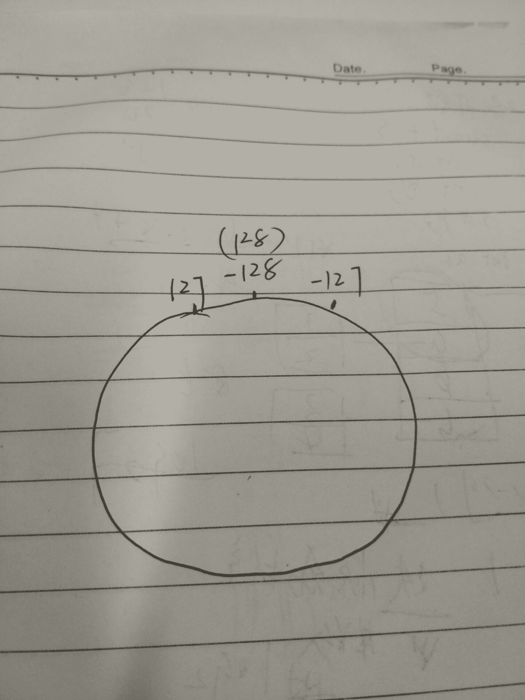
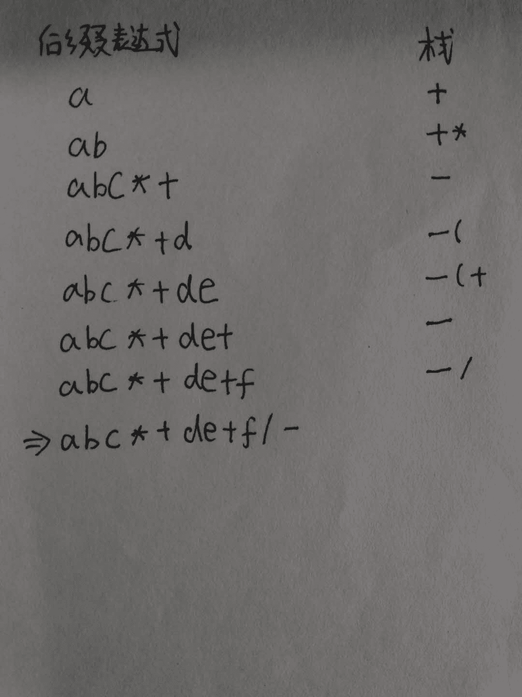

# 五十八、同城 2016 研发工程师笔试题

## 1

以下代码的执行结果是().

```cpp
#include<stdio.h>
int main(){
   int i = -2147483648;
   return printf("%d,%d,%d,%d", ~i, -i, 1 - i, -1 - i);
}
```

正确答案: D   你的答案: 空 (错误)

```cpp
0,2147483648,2147483649,2147483647
```

```cpp
0,-2147483648,-2147483647,2147483647
```

```cpp
2147483647,2147483648,2147483649,2147483647
```

```cpp
2147483647,-2147483648,-2147483647,2147483647
```

本题知识点

C++工程师 Java 工程师 58 集团 2016 C 语言

讨论

[Flyc](https://www.nowcoder.com/profile/316774)

Green848 的答案里面有些本质性的错误，只不过误打误撞刚好跟实际计算出来的答案一样而已。看来大家对原码、反码、补码、取反运算~、以及单目运算符 - 的理解还不够哈，O(∩_∩)O，相信细心的同学肯定回发现 Green848 的答案有这样一些问题：首先，-2147483648 这个数为 32 位 int 所能表示的最小负整数，而如果原码为 1000 0000  0000  0000  0000  0000  0000  0000（表示-0） ，其反码应为数值位取反，符号位不变，即 1111  1111  1111  1111  1111  1111  1111  1111，补码为反码+1 即为 0 000 0000  0000  0000  0000  0000  0000  0000 （最高位溢出，舍去），而+0 的原码、反码、补码均为 0 000 0000  0000  0000  0000  0000  0000  0000，如果用 1000 0000  0000  0000  0000  0000  0000  0000 作为 -2147483648 的原码，则会导致 -2147483648 和 0 的补码表示一样，因此，计算机中规定用 1000 0000  0000  0000  0000  0000  0000  0000 来作为 -2147483648 的补码，以确保**-2147483648~2147483647**都有唯一的补码表示；**总结以上内容：正数的原码、反码、补码形式一致，负数的反码为原码的数值位取反，补码为反码+1 也即是原码的数值位取反再+1，计算机中以补码表示数据和运算，而 32 位最小负整数的补码为** **1000 0000 ** **0000 ** **0000 ** **0000 ** **0000 ** **0000 ** **0000。**然后回到本道题目的解答：首先，求 **~i ，** i 的补码为 1000 0000  0000  0000  0000  0000  0000  0000，取反 0111 1111 1111 1111 1111 1111 1111 1111，此为补码，符号位为 0，表示正数，正数原码补码一致，因而该数即表示 2³¹-1，即**2147483647** ^。然后，求 **-i** ，要对一个数值执行单目运算符 -  表示的是对该数取反然后再+1，也即是我们常说的求补运算，注意这里取反+1 与原码求补码的区别！也就是**求补运算与求补码是不一样的**！例子（4 位有符号整数）：x=-4  1100（补码）   **-x=~x+1** 也即是 0011+0001=0100（4），而 1100 再求补码应是先数值位取反，即 1011，然后+1，变成 1100！注意这两者（求补与求补码）之间的区别。题目中  i 的补码为 1000 0000  0000  0000  0000  0000  0000  0000，取反+1,**仍为** 1000 0000  0000  0000  0000  0000  0000  0000，即    **-2147483648**求 **1-i**  我们已经求出-i 的补码为 1000 0000  0000  0000  0000  0000  0000  0000 加上 1 的补码即为 1000 0000  0000  0000  0000  0000  0000  0001 该补码表示的原码为 1 111 1111  1111 1111 1111 1111 1111 1111，即为**-** **2147483647****最后求-1-i ** -1 的补码为 1 111 1111  1111 1111 1111 1111 1111 1111，加上-i 补码 1000 0000  0000  0000  0000  0000  0000  0000，得 0111 1111  1111 1111 1111 1111 1111 1111，即 **2147483647**另外补充一点，计算机中有符号数和无符号数的机器码（补码）是一样的，同一个二进制码按照有无符号输出结果不一样，例如本题中四个答案如果按照无符号整数输出，那么答案就是 C

编辑于 2016-02-27 09:47:53

* * *

[夜的哀伤](https://www.nowcoder.com/profile/870519)

个人认为以表盘比较好。以 8 位为例，有符号 -128~127 无符号 0~255.此处用有符号，然后对照表盘相应前进或后退，此处 i 初值相当于-128，~i 值为 127，-i 为 128 即-128，前进 1 位为-127，后退 1 位为 127（128 不存在，就像我们一般都说 0 点不说 24 点）


编辑于 2016-09-16 21:45:41

* * *

[Pandora](https://www.nowcoder.com/profile/266279)

感谢[Flyc](http://www.nowcoder.com/profile/316774)的指正，我原来的回答确实存在根本性错误，致歉牛友 o(╯□╰)o**正数原码、反码、补码形式一致。** **负数反码，为其原码的符号位不变，其他位取反；** **负数补码，是其反码加 1。**举例 8bit 有符号型整数：+34 原码=反码=补码：00100010-34 原码=10100010，反码=11011101，补码=11011110**==================================**不管是在 32 还是在 64 位编译器处理下，int 都是 4 字节 32 位，所以整数范围是-2147483648~2147483647，数值以补码形式存储。**【注意】最小负数**-2147483648=-2³¹ **并没有原码和反码，只有补码**，由 -0 的原码 **1** 0...0（31 个 0） 表示 。因此：**1、~i：**对每一位**** **取反运算**。为**0**1...1（31 个 1），是正数，补码即原码，即 2³¹-1=2147483647；**2、** **-i：** **对该数求补运算，即【每位】取反运算，再加 1。**取反， **1**0...0（31 个 0）-> **0**1...1（31 个 1），再加 1 得 **1**0...0（31 个 0），**该** **补** **码表现为** **最小负数**- 2147483648，并没有原码和反码；**3、1-i：补码形式相加，再推回原码得十进制结果。**-i（ **1**0...0（31 个 0） ）+（**0** ...1（31 个 0） ）= **1**0...1（30 个 0），此为补码形式，**补码转** **原码**为补码减 1，再非符号位取反，即原码**1**...1（32 个 1）= -(2³¹-1)= - 2147483647 **；****4、** **-1-i** **：补码形式相加，再推回原码得十进制结果。**即-i（ **1**0...0（31 个 0） ）+（**1** ...1（32 个 1） ）= **0**1...1（31 个 1），是正数形式，原码即补码，为 2³¹-1= 2147483647 。

编辑于 2016-02-20 14:05:22

* * *

## 2

表达式 a+b*c-(d+e)/f 的后缀表达式为()

正确答案: C   你的答案: 空 (错误)

```cpp
abc*+def+/-
```

```cpp
+*-/+bcaefd
```

```cpp
abc*+de+f/-
```

```cpp
abc*+de+f-/
```

本题知识点

模拟

讨论

[zt_xcyk](https://www.nowcoder.com/profile/839070)

Ca+b*c-(d+e)/f =  ((a+(b*c))-((d+e)/f))   按运算规则 给每个把括号带着 然后把括号移到最近的括号外面((a (b c)  *  )  +  ((d e)  +  f)  /  )  -   然后就是答案了  abc*+de+f/-

发表于 2015-10-20 19:29:07

* * *

[周星星 _](https://www.nowcoder.com/profile/537870)

ref：http://www.cnblogs.com/mygmh/archive/2012/10/06/2713362.html

发表于 2016-08-12 11:33:44

* * *

[大山猫](https://www.nowcoder.com/profile/269431238)

如果笔试遇到了选择题： 可以这样快速的得到结果
第一步：按照运算符的优先级对所有的运算单位加括号
        式子变成拉：(a+(b*c))-((d+e)/f)
第二步：把运算符号移动到对应的括号后面 
              则变成拉：((a(bc)* )+( (de)+f )/- 
              把括号去掉：abc*+de+f/-  后缀式子出现 

编辑于 2019-07-06 10:59:26

* * *

## 3

四分位数是统计学的一个概念，把序列中的数值由小到大排列并分成四等分，处于三个分割点位置的数就是四分位数。n 为序列的总长度，三个四分位数可以根据如下公式求出：Q1 的位置=（n+1）x 0.25Q2 的位置=（n+1）x 0.5Q3 的位置=（n+1）x 0.75 比如数据序列：1,3,5,7,2,4,6 由小到大排列的结果是：1,2,3,4,5,6,7 一共 7 项，Q1 的位置=(7+1)*0.25=2,Q2 的位置=(7+1)*0.5=4，Q3 的位置=(7+1)*0.75=6，四分位数即为第 2,4,6 个元素上对应的数值：（2,4,6）那么数据序列 6,45,49,16,42,41,7,38,43,40,36 的四分位数为：

正确答案: B   你的答案: 空 (错误)

```cpp
49,41,43
```

```cpp
16,40,43
```

```cpp
16,45,7
```

```cpp
16,41,45
```

本题知识点

模拟

讨论

[LaZZy](https://www.nowcoder.com/profile/747497)

B
先由小到大排序，为 6， 7， 16， 36， 38， 40， 41， 42， 43， 45， 49
共 11 项，Q1 的位置=(11+1)*0.25=3，即 16；
              Q2 的位置=(11+1)*0.5=6，即 40；
              Q3 的位置=(11+1)*0.75=9，即 43；
故选择 B 16,40,43

发表于 2015-10-21 14:13:01

* * *

[紫荆的传说](https://www.nowcoder.com/profile/9588381)

注意要先由小到大重新排列！

发表于 2016-09-01 15:56:39

* * *

[我是坏小孩别靠近](https://www.nowcoder.com/profile/5061137)

B 由已知条件得：**序列中的数值****要从小到大排列**排序： 6，7，16，36，38，40，41，42，43，45，49 一共 11 项：Q1 位置=（11+1）x 0.25 = 3Q2 位置=（11+1）x 0.5 = 6Q3 位置=（11+1）x 0.75 = 9 四分位数即为第 3,6,9 个元素上对应的数值(16，40，43)

编辑于 2017-08-30 20:38:11

* * *

## 4

一棵深度为 5 的完全二叉树最少有（）个节点（第一层深度视为 1）

正确答案: B   你的答案: 空 (错误)

```cpp
15
```

```cpp
16
```

```cpp
31
```

```cpp
32
```

本题知识点

树 C++工程师 Java 工程师 58 集团 2016

讨论

[洛天天](https://www.nowcoder.com/profile/384839)

完全二叉树和满二叉树的定义。满二叉树，所有的分支结点都存在左子树和右子树，并且所有叶子都在同一层上。深度为 n 的满二叉树的节点数为 2^n - 1 ;  完全二叉树是除了叶子层，其他层都符合满二叉树定义的二叉树，所以完全二叉树最少的结点为 2^（n-1） -1 +１　；

发表于 2016-08-30 20:44:17

* * *

[小子爱大米](https://www.nowcoder.com/profile/736340)

16 个。首先深度为 5 的完全二叉树，则前四层为编号对应的完全二叉树，最后一层最少为一个，所以为 2⁴-1+1=16.

发表于 2015-10-20 15:03:38

* * *

[高原 ignite](https://www.nowcoder.com/profile/450708080)

（h—1 层的满二叉树结点个数）+1

发表于 2019-11-07 22:56:48

* * *

## 5

在有序表(5,8,36,48,50,58,88)中二分查找字 58 时所需进行的关键字比较次数是（），对应的判定树高度为（）.

正确答案: B   你的答案: 空 (错误)

```cpp
2,2
```

```cpp
2,3
```

```cpp
3,2
```

```cpp
3,3
```

本题知识点

树 C++工程师 Java 工程师 58 集团 2016

讨论

[lkk](https://www.nowcoder.com/profile/898770)

根据有序表建立二叉排序树      48     /    \   8      58  / \      /   \5 36   50 8858 在第二层，也就是第二次比较就可以确定了 BST 的高度为 3，也就是最多要经过 3 次排序所以最终结果为 2,3

编辑于 2016-08-03 20:21:33

* * *

[牛客 1017932 号](https://www.nowcoder.com/profile/1017932)

二分查找过程可用二叉树来描述：把当前查找区间的中间位置上的结点作为根，左子表和右子表中的结点分别作为根的左子树和右子树。由此得到的二叉树，称为描述二分查找的判定树(Decision Tree)或比较树(Comparison Tree)。

发表于 2017-08-22 09:35:19

* * *

[沐浴星光的潇洒少年](https://www.nowcoder.com/profile/709899)

```cpp
第一次比较（0+6）/2=3 处的元素，第二次比较(3+1,6)/2=5 处的元素，刚好找到，此时查找的列表元素包含 50，58，88，列表长度为 3 应该就为判定树的高度
```

发表于 2015-10-21 19:48:52

* * *

## 6

假设以行优先顺序存储三维数组 A[5][6][7],其中元素 A[0][0][0]的地址为 1100，且每个元素占 2 个存储单元，则 A[4][3][2]的地址是()

正确答案: D   你的答案: 空 (错误)

```cpp
1150
```

```cpp
1291
```

```cpp
1380
```

```cpp
1482
```

本题知识点

数组 C++工程师 Java 工程师 58 集团 2016

讨论

[周星星 _](https://www.nowcoder.com/profile/537870)

参考[沐浴星光的潇洒少年](http://www.nowcoder.com/profile/709899)把三维坐标想象成立方体。分配的空间 A[5][6][7]表示层高为 5、行数为 6、列数为 7 因为数数的基本单位其实是列，二维坐标是行号列号，虽然平时可能习惯行号列号层号，但是按照二维的规律，那么三维坐标应该是层号行号列号那么 A[4][3][2]中 4、3、2 分别对应这个点的层数、行号、列号位置为 4*(6*7)+3*7+2=191 每个元素两个存储单元，最终结果为 191*2+1100=1482

编辑于 2016-10-02 15:09:05

* * *

[Aimer](https://www.nowcoder.com/profile/867963)

首先弄清楚 A[4][3][2] 所对应的元素个数一共有多少个，A[0] - A[3] 元素个数为 = 4*6*7*2A[4][0]-A[4][2] 的元素个数为 = 3*7*2A[4][3][0] - A[4][3][2] 的元素个数为 = 3*2 一共(4*6*7+3*7+3)*2 = 382382+1100 = 1482

发表于 2015-11-02 16:03:29

* * *

[暗月下捉迷藏](https://www.nowcoder.com/profile/480887)

可以将三维数组 A[5][6][7]看作 5 个 6 行 7 列的二维数组。1、A[4][3][2]元素在第 5 个二维数组，前面 4 个二维数组存储元素个数为 4*（6*7）；2、第 5 个二维数组中，目标元素位于第 4 行第 3 列，其前面存储元素个数为 3*7+2；因此 A[4][3][2]前面存储了 4*6*7+3*7+2=191 个元素，故其地址为 1100+191*2=1482。

编辑于 2017-07-13 16:23:55

* * *

## 7

马路上有编号 1,2,3...10 的十盏路灯，为节约用电而又不影响照明，可以把其中 3 盏灯关掉，但不可以同时关掉相邻的两盏，在两端的灯都不能关掉的情况下，有()种不同的关灯方法。

正确答案: A   你的答案: 空 (错误)

```cpp
20
```

```cpp
60
```

```cpp
120
```

```cpp
240
```

本题知识点

组合数学 *C++工程师 Java 工程师 58 集团 2016* *讨论

[也号如是我闻](https://www.nowcoder.com/profile/489389)

采用插隔板法，即 8 灯关 3,余 5 灯亮,5 灯之间 6 个空,插入 3 盏不亮灯即 C（6,3）

发表于 2015-10-21 20:13:03

* * *

[牛客 993137 号](https://www.nowcoder.com/profile/993137)

取个巧。中间八个灯关三个 C（8，3）=56，答案小于 56 选 A

发表于 2016-05-29 03:22:14

* * *

[梦婷](https://www.nowcoder.com/profile/1660754)

用插空法，先假设 7 盏灯是好的，在 7 盏灯的 6 个缝隙中间选 3 个位置，就能保证三盏灭的灯不相邻了。即 C(6,3)

发表于 2016-09-05 11:31:31

* * *

## 8

房间里有 8 人，分别佩戴着从 1 号到 8 号的纪念章，任选 3 人记录其纪念章号码，最大的号码为 6 的概率()

正确答案: B   你的答案: 空 (错误)

```cpp
3/28
```

```cpp
5/28
```

```cpp
23/28
```

```cpp
25/28
```

本题知识点

概率统计 *C++工程师 Java 工程师 58 集团 2016 概率论与数理统计* *讨论

[Snail 的小家](https://www.nowcoder.com/profile/3165299)

最大为 6 那么余下二个只能从 1-5 中选择，选择方法数目为 C(5, 2)从 8 个号码中选择 3 个号码次数 C(8, 3)因此两个相除，比例为  C(5, 2)/C(8, 3) =   (5*4 / 2) / (8*7*6/ 6)  = 5 / 28

发表于 2017-03-28 13:56:49

* * *

[Pandora](https://www.nowcoder.com/profile/266279)

评论区小伙伴是对的，这都好久了，感谢让我重新审题做题纠错。 正确答案就是楼下的那个答案，我直接复制过来： 首先算没有选 78 的概率 C(3,6)/C(3,8) 然后算从 1-6 选出 6 的概率 C(2，5)/C(3，6) 然后相乘 C(3,6)/C(3,8)* C(2，5)/C(3，6) ====以下巧合原答案==== 8 个里边任意选 3 个选法总数：C(3,8)8=56，最大为 6，则需要在 1~5 里边任意选 2 个：C(2,5)=10，所以 10/56=5/28。

编辑于 2018-01-25 17:26:17

* * *

[牛客 477144 号](https://www.nowcoder.com/profile/477144)

B 首先算没有选 78 的概率 C(3,6)/C(3,8)然后算从 1-6 选出 6 的概率 C(2，5)/C(3，6)然后相乘 C(3,6)/C(3,8)* C(2，5)/C(3，6)

发表于 2015-10-20 19:27:11

* * *

## 9

58 同城北京租房列表页共有 3 个广告位，广告库中共有 5 个经纪人，每个经纪人发布了 2 条广告房源参与此列表页 3 个广告位的随机展示(即每条广告房源获得展示的概率是一样的)，则此列表页展示时，同时展示同一个经纪人的两条房源的概率是（）

正确答案: A   你的答案: 空 (错误)

```cpp
1/3
```

```cpp
2/9
```

```cpp
7/27
```

```cpp
3/50
```

本题知识点

概率统计 *C++工程师 Java 工程师 58 集团 2016 概率论与数理统计* *讨论

[Pandora](https://www.nowcoder.com/profile/266279)

共 5*2=10 条广告，广告列有 3 空位，所以是总共情形：C[10] ³=120；同一经纪人（C[5] ¹）的两条房源（共 3 条，已有 2 条，则需要在剩下的 8 条中选 1 条，C[10-2] ¹）：C [5] ¹*C [10-2] ¹=40；所以 40/120=1/3。

发表于 2015-10-21 11:05:11

* * *

[知夏](https://www.nowcoder.com/profile/7275952)

这道题不用考虑广告位排列先后问题。 一共 10 条广告，3 个广告位都来自不同经纪人的概率为：1×(8/9)×(6/8)＝2/3 所有答案为 1-(2/3)＝1/3

发表于 2018-04-03 10:11:56

* * *

[初日晨曦](https://www.nowcoder.com/profile/775649)

怎么都不考虑广告位先后问题？我觉得：选一个经纪人 C[5]^(1 ) , 选出的经纪人的两条广告投放在 3 个广告位：A[3]^(2 ), 剩余一个广告位从剩余的 8 条广告中选：8 ，总共相乘=240 一共有 10*9*8 = 720 种   P = 240/720 =1/3

发表于 2017-09-08 15:05:16

* * *

## 10

定义 bash 环境的用户文件是？

正确答案: C   你的答案: 空 (错误)

```cpp
bash &.bashrc
```

```cpp
bash & bash_profile
```

```cpp
bashrc &.bash_profile
```

```cpp
bashrc &.bash_conf
```

本题知识点

Linux C++工程师 Java 工程师 58 集团 2016

讨论

[Ziwen](https://www.nowcoder.com/profile/263993)

bash_profile 是在你每次登录的时候执行。bashrc 是在你新开了一个命令窗口时执行。

发表于 2015-10-23 09:41:36

* * *

[百度 GTS](https://www.nowcoder.com/profile/3283278)

~/.bash_profile:每个用户都可使用该文件输入专用于自己使用的 shell 信息,当用户登录时,该文件仅仅执行一次!默认情况下,他设置一些环境变量,执行用户的.bashrc 文件. 此文件类似于/etc/profile，也是需要需要重启才会生效，/etc/profile 对所有用户生效，~/.bash_profile 只对当前用户生效。 ~/.bashrc:该文件包含专用于你的 bash shell 的 bash 信息,当登录时以及每次打开新的 shell 时,该文件被读取.（每个用户都有一个.bashrc 文件，在用户目录下） 此文件类似于/etc/bashrc，不需要重启生效，重新打开一个 bash 即可生效， /etc/bashrc 对所有用户新打开的 bash 都生效，但~/.bashrc 只对当前用户新打开的 bash 生效。

发表于 2016-09-14 15:49:12

* * *

[后劲好大](https://www.nowcoder.com/profile/4013442)

bash_profile 是在你每次登录的时候执行。bashrc 是在你新开了一个命令窗口时执行

发表于 2017-06-07 21:32:53

* * *

## 11

数组 A 由 1000W 个随机正整数(int)组成，设计算法，给定整数 n，在 A 中找出符合如下等式:n=a+b 的 a 和 b，说明算法思路以及时间复杂度是多少?

你的答案

本题知识点

数组 C++工程师 Java 工程师 58 集团 2016

讨论

[姚梦龙](https://www.nowcoder.com/profile/688871)

//算法思路：考虑到数据量太大，辅助空间很容易不够。所以考虑只使用一个长为 n 的辅助数组 temp 来取巧。算法分为两步//第一步，遍历 A，每次将 temp[ A[i] ]置为 1，表示 A[i] 出现了。//第二步，遍历结束了此时。则遍历 temp 数组，遍历时每次都判断   temp[ i ] ]和 temp[  n- i ]  ]是否都为 1，若都为 1 则说明满足 n=a+b 的 a 和 b 都出现了，则输出。时间复杂性：O(n)

发表于 2015-11-19 09:46:03

* * *

[周星星 _](https://www.nowcoder.com/profile/537870)

方法一、数组排序，二分 1000w 数字存到数组中，需要的地址空间为 1000w*4byte=4w kb =40 Mb。这个容量是可以接受的。将数组快速排序，平均时间复杂度 O(n*logn)对任给的 n，找 n=a+b 假设 v 是排序后的数组，a,b 组合无非是 v[0], n-v[0]v[1], n-v[1]...v[i]>=n 通过二分查找来 确定是否存在这一组 a，b 就是确定 n-v[i]是否存在。 最坏需要 i*logn 次。所以总时间复杂度为 O(nlog(n)*log(n)) //不严格方法二、hash_map 原数组为 a，如果 a[i]<n，就把(a[i],0)键值对插入到哈希表 h 中，时间复杂度 nh 的 pair 会按照 key 自动排序。我们主要是利用他查询复杂度 O(1)的特点确定每组 a,b 是否存在：0,n1,n-1...n/2-1,n/2+1 总时间复杂度为 O(n)方法三：直接申请一个大小为 N 的数组，只要 40M 空间，然后数组中每一个元素对 N 取余(当然如果比 N 还大就直接舍弃)，取余的值就放在对于数组下标中。比方 N 为 10，元素 8，就放数组第 8 个元素中，然后看看数组第二个元素有没有值就好了。所以复杂度为 o(n)该方法不对，用数组下标标记元素 i 固然没错。但是问题在于整数 n 的上限可能很高，n=2³² 时，申请一个大小为 n 的数组，需要的空间大小为 2³² * 4byte  ≈ 4GB，太大了 ref：http://group.jobbole.com/13848/

编辑于 2016-10-13 16:36:29

* * *

[红豆 20190807083095](https://www.nowcoder.com/profile/499360778)

```cpp
int[]b=new int[n+1];
for(int i=0;i<A.length;i++){

    if(a[i]<=n){
        int c=a[i];
        b{c}=1;

    } 
}

for(int i=0:i<=n;i++){
    if(b{i}==1&&b[n-i]==0){
        sys.out.prirnt(""+i+(n-i));
    }
}
```

发表于 2019-08-24 10:43:21

* * *

## 12

数据库中有学院表和成绩表学院表 t_school 结构如下:学院 ID：school_id,学院名称:school_name 成绩表 t_score 结构如下:学号:id.姓名:name,分数:score,学院 ID:school_id 请用 sql 语句查询出学院名称为"计算机系"的分数最高的前 20 位的学生姓名

你的答案

本题知识点

数据库 C++工程师 Java 工程师 58 集团 2016

讨论

[Echo001](https://www.nowcoder.com/profile/363046)

```cpp
select name
from t_score where school_id in
(select school_id from t_school where school_name = '计算机系')
order by score DESC limit 20
```

发表于 2016-09-01 17:40:58

* * *

[玉仔](https://www.nowcoder.com/profile/896605)

select score.name from t_school school, t_score score where school.school_id = score.school_id and school.school_name="计算机系" order by score.score desc limit 20

发表于 2016-08-30 14:54:24

* * *

[Jiang 锋](https://www.nowcoder.com/profile/961788916)

为什么都直接从成绩表中查出前 20 的学生呢？？？难道不应该选出总成绩前 20 的吗？？？

发表于 2019-03-12 13:57:02

* * *

## 13

斗地主是中国非常流行的一种牌类游戏:一副扑克 54 张牌，3 人轮抓，每人 17 张，3 张底牌。请问，同一个人 17 张手牌就抓到火箭(即同时抓到大小王)的概率是多少？说明计算过程

你的答案

本题知识点

概率统计 *C++工程师 Java 工程师 58 集团 2016* *讨论

[周星星 _](https://www.nowcoder.com/profile/537870)

这题答案是不是错了？？？54 张牌排成序列。一共有 b 种情况，b=54！某人抽到火箭有 a 中情况。假设每三张一组，一共 18 组。大小王分布在前 17 组，情况个数为 17*16，剩下的牌随机。a=17*16*52!三个人需要乘三，答案为 3a/b=0.2851 楼上[SunburstRun](http://www.nowcoder.com/profile/557336)提到的另一种解法也就是官方答案：C（52,3)/C(54,3)*3*17/51*16/50 化简之后是(3*17*16)/(54*53)结果是 0.285

编辑于 2016-08-12 16:27:38

* * *

[沐浴星光的潇洒少年](https://www.nowcoder.com/profile/709899)

大小王不再底牌的概率：C（52,3)/C(54,3)，三人中有一个抓到大小王 C(3,1)，一个人抓到 17 张牌的抓法有 C(51,17)种，除大小王的抓法有 C(49,15)种，剩下两张抓的是王，所以 :C（52,3)/C(54,3)*C(3,1)*C(49,15)/C(51,17)=0.285

发表于 2015-10-22 08:54:24

* * *

[SunburstRun](https://www.nowcoder.com/profile/557336)

先求必须任一一个大小王不在底牌，即：C（52,3)/C(54,3)，这保证了大小王一定在上面牌中然后一个人抓到第一张王的概率=17/51,抓到第二张王概率=16/50，所以单独一个人抓到概率为:17/51*16/50，那么 3 人中出现一个人的概率是 3*17/51*16/50 所以最后结果为:C（52,3)/C(54,3)*3*17/51*16/50=0.3081

发表于 2015-10-20 10:02:25

* * *

## 14

请用时间复杂度最低的方法找出数组中数值差距最大的两个元素的差值？

你的答案

本题知识点

查找 *C++工程师 Java 工程师 58 集团 2016* *讨论

[红萝卜](https://www.nowcoder.com/profile/798367)

设置两个临时变量 t1，t2，然后遍历数组，t1 始终保存较大值，t2 保存较小值，遍历完毕，就能得到一个最大值 t1，最小值 t2。是我想的太简单了，还是题就是这样？

发表于 2015-10-20 12:02:48

* * *

[sichengLv](https://www.nowcoder.com/profile/253572)

一次遍历，找出最大值 max、最小值 min，最大差值 = max - min，时间复杂度 O(n)。

发表于 2018-04-01 14:51:55

* * *

[十年一品温如言↗](https://www.nowcoder.com/profile/799406)

冒泡算法，第一趟从前向后——倒数第一位最大的数，第二趟从倒数第二位向前——第一位为最小的数，最后一位减第一位。比较((n-1)+(n-2))次，比较 O(2n)；最好情况换值 0 次（由小到大排好序的数组），最差情况换值((n-1)+(n-2))次，平均换值 O(n)，复杂度 O(3n)

发表于 2015-10-31 21:48:10

* * *

## 15

实现一个优先级消息队列。不妨将消息抽象成一个整数，该整数数值代表消息的优先级。优先级消息队列是一个这样的队列：任何时间都有可能有消息入队列，任何时间都有可能消息出队列。但只能弹出当前保存的优先级最高的消息。

```cpp
class CPriorityMsgQueue
{
  public:
            //任意消息进入队列
          void enQueue(int msg);
          //优先级最高的消息弹出队列
          int deQueue();
  private:
           //可以自行添加需要的私有成员
}
```

你的答案

本题知识点

队列 *C++工程师 Java 工程师 58 集团 2016* *讨论

[stonegrass](https://www.nowcoder.com/profile/2086256)

解题思路：优先级消息队列 使用 Java 数据结构 PriorityQueue，其实它的源码实现就是二叉堆。

```cpp
class CPriorityMsgQueue{
    PriorityQueue<Integer> pqueue = new PriorityQueue<Integer>();

	public void  enQueue(int  msg){

	pqueue.offer(msg);

	}

	public int deQueue(){ 

	 pqueue.poll(msg); 

	 } 

}
```

编辑于 2016-11-25 16:03:41

* * *

[小杨 vita](https://www.nowcoder.com/profile/576504)

用堆实现优先级队列

发表于 2015-10-20 22:17:25

* * *

[Jason09](https://www.nowcoder.com/profile/7700243)

用 stl::priority_queue，不是可以直接满足题目要求的吗？

发表于 2016-10-20 20:48:32

* * *

## 16

为打击灌水和欺诈信息的发布，58 上的帖子从到展示要经历重重检测。检测规则一共有 50 个，一条帖子可能会同时被同时被多个规则拦截，也可能不被任何规则拦截。现有一个日志文件，每一行都记录着一个帖子 ID 和若干拦截该帖子的规则 ID，日志文件一共 9999995 行。帖子 ID 取值为[1,9999999]上的某个整数，且无重复。帖子 ID 在日志文件中是无序的。问题：1.如何计算任意两个规则同时拦截的帖子数量?要求只扫描一遍日志文件。采用尽可能少的存储空间 2.假设一个帖子 ID 需要用 4 个字节来存储，请使用 2M 的内存空间丢失的那 4 个帖子 ID 找出来，你的算法扫描了几遍日志文件？

你的答案

本题知识点

复杂度 C++工程师 Java 工程师 58 集团 2016

讨论

[sichengLv](https://www.nowcoder.com/profile/253572)

**ID ****    拦截规则**1              A B C 2              B C D3              A B D4              C D E...                ...**1、****计算任意两个规则同时拦截的帖子数量？**    如求 A、B 这两个规则，按行遍历整个文件，判断 ID 的拦截规则是否包含 A、B 这两个，如果包含，则找到一个。**2、****使用 2M 的内存空间丢失的那 4 个帖子 ID 找出来？**    帖子 ID 取值范围：[1,9999999]，使用位图法，需要申请 1000 万 * 1 bit / 8  = 1.25MB 的内存空间。按行扫描一次文件，将出现 ID 对应的 bit 标记为 1，如果哪一个 bit 不为 1，即为丢失的那 4 个帖子 ID。 

发表于 2018-04-01 15:25:43

* * *

[小杨 vita](https://www.nowcoder.com/profile/576504)

1、按行读，对每行查找是否符合 2 个规则
2、位图法，只需要 1MB 多

发表于 2015-10-20 22:17:14

* * *

[Li.fx](https://www.nowcoder.com/profile/816533)

1，并集 2，数据密集，申请一个 1000 万的 boolean 数组就行

发表于 2016-02-28 01:04:34

* * *******