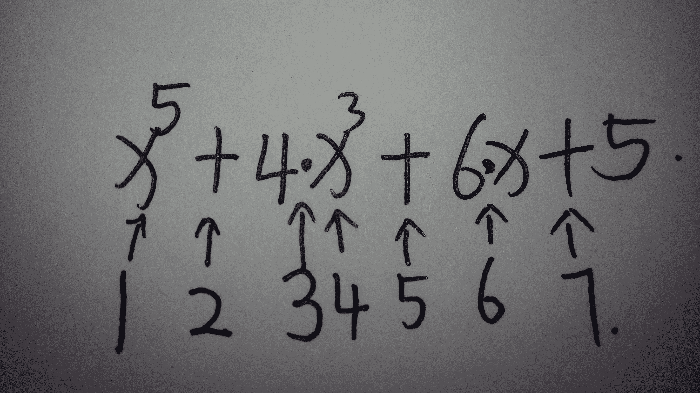

# 滴滴出行 2016 研发工程师笔试题（三）

## 1

边长 1 米的正方体共计 2100 个，堆成一个实心的长方体，它的高是 10 米，长，宽都大于高，问长方体的长与宽的和是多少米？

正确答案: D   你的答案: 空 (错误)

```cpp
41
```

```cpp
31
```

```cpp
37
```

```cpp
29
```

本题知识点

数学运算

讨论

[SunburstRun](https://www.nowcoder.com/profile/557336)

答案是 D  查看全部)

编辑于 2015-10-23 17:58:22

* * *

[5086134](https://www.nowcoder.com/profile/5086134)

这个很简单，长和宽的乘积为 210，且两者只和大于 20，对 210 开根号小于 15，两者和不大于 30，选 D

发表于 2019-01-19 15:10:14

* * *

[牛客 304921366 号](https://www.nowcoder.com/profile/304921366)

长 x 宽 y 体积 2100 10xy=2100 xy=210 用不等式 x+y 大于等于 2 倍根号 xy 估算一下区间 大概是 28-30 所以 29

发表于 2021-08-11 22:47:54

* * *

## 2

在所有的 2 位数，十位数比个位数大的位数有几个？()

正确答案: A   你的答案: 空 (错误)

```cpp
45
```

```cpp
50
```

```cpp
44
```

```cpp
49
```

本题知识点

数学运算

讨论

[SunburstRun](https://www.nowcoder.com/profile/557336)

答案是 A  查看全部)

编辑于 2015-10-23 17:40:10

* * *

[依若](https://www.nowcoder.com/profile/320158)

一共有 100 个两位数组合（00~99），其中两位相等的有 10 个（00、11。。。99），因为十位和个位处于同等的地位，所以十位比个位大的有一半即 90/2=45 个。ps：可以这样考虑是因为如果十位比个位大，十位一定不为 0

发表于 2015-10-24 15:31:27

* * *

[CoAgs](https://www.nowcoder.com/profile/868282301)

10
20 21
30 31 32
...........
就拿前两个作比方 【10,30）中 十位数比个位数大的有 3 个 即十位数为 1,2 的
在看三个作比方 【10,40）中国 十位数比个位数大的有 6 个 即十位数为 1,2,3 的
可以看出 这就是一个简单的 1 加到 9 的和
以为 1+2=3；1+2+3=6；即 1+2+3+4+5+6+7+8+9=45
故选 A

发表于 2020-02-14 18:27:19

* * *

## 3

人患癌症的概率为 1/1000.假设有一台癌症诊断仪 S1，通过对它以往的诊断记录的分析，如果患者确实患有癌症它的确诊率为 90%,如果患者没有癌症，被诊断成癌症的概率是 10%。某人在被诊断为癌症后，他真正患癌症的概率为()

正确答案: C   你的答案: 空 (错误)

```cpp
9/1000
```

```cpp
1/1000
```

```cpp
1/112
```

```cpp
9/10
```

本题知识点

概率统计 *概率论与数理统计* *讨论

[SunburstRun](https://www.nowcoder.com/profile/557336)

答案是 C  查看全部)

编辑于 2015-10-23 17:41:11

* * *

[Pandora](https://www.nowcoder.com/profile/266279)

**贝叶斯规则**：p(x|y)=p(y|x)*p(x)/p(y)。代入：p(真有癌|诊断有)=p(诊断有|真有癌)*p(真有癌)/p(诊断有)已知：p(诊断有|真有癌)=90%【如果患者确实患有癌症它的确诊率为 90%】p(真有癌)=1/1000【人患癌症的概率为 1/1000】p(诊断有)=p(真有癌)*p(诊断有|真有癌)+p(没有癌)*p(诊断有|没有癌)=1/1000*90%+(1-1/1000)*10%=1008/10000 所以：90%*(1/1000)/(1008/10000)=9/1008=1/112。

发表于 2015-10-23 20:54:31

* * *

[牛客 883374 号](https://www.nowcoder.com/profile/883374)

1 人患癌症的概率为 1/1000...推出:设有基数 1000 人,其中 1 人患癌.2 如果患者确实患有癌症它的确诊率为 90%...推出:1000 人中确诊 0.9(1*0,9)人.3 如果患者没有癌症，被诊断成癌症的概率是 10%...推出:999(1000-1)人中误诊 99.9 人.4 被诊断为癌症后，他真正患癌症的概率...推出:0.9/(0.9+99.9)=1/112

发表于 2016-03-10 10:28:10

* * *

## 4

你站在一艘船上，你站起来提起船上的一个箱子，人拿起箱子的过程中，船吃水线会怎么样？

正确答案: A   你的答案: 空 (错误)

```cpp
下降
```

```cpp
不确定
```

```cpp
不变
```

```cpp
上升
```

本题知识点

数学运算

讨论

[reakingf](https://www.nowcoder.com/profile/151746)

"人拿起箱子的过程中 "处于超重状态，所以会下降

发表于 2016-09-08 16:06:45

* * *

[紫吉 _o](https://www.nowcoder.com/profile/478692)

提起箱子的过程中，人会给箱子一个向上的力，箱子会有一个向上的加速度，箱子处于超重状态，此时箱子与船体还是接触的，所以但是船体收到的压力是减小的。所以船会上升，所以吃水线下降

发表于 2016-09-13 16:22:46

* * *

[攻城狮 QAQ](https://www.nowcoder.com/profile/9901331)

在这个人船箱子模型中，可以将人与船看做一体，箱子有一个向上的加速度 a1，则船和人有一个向下的加速度 a2，分析箱子的受力情况：F 人托-mg=ma1 F 人托=ma1+mg  故：人和船整体多了一个向下 ma 的力，故船要下沉，a1 和 a2 的关系 ma1=(m+m 人+m 船)a2

编辑于 2017-09-03 10:41:30

* * *

## 5

有 3 堆火柴，分别有 3,9,12 根，两个人依次取火柴，每次只能取同一堆的火柴，最少拿一根，最多拿走堆内所有火柴，取走最后一根火柴，让对方无火柴可以取者为胜。请问现在谁会获胜?()

正确答案: A   你的答案: 空 (错误)

```cpp
先手
```

```cpp
不确定
```

```cpp
后手
```

本题知识点

智力题

讨论

[剑已凌乱](https://www.nowcoder.com/profile/1767495)

        直白一点：如果只有两堆不一样根数，如 3,9。先手第一次把多的那堆拿到和少的那堆一样，（就是拿掉 6），后手随便拿多少，先手在另外一堆拿同样多就能保证赢（很简单，推一下）。那么 3 堆的时候，先手只需要把任意一堆拿到只剩一根，那么这堆拿完需要 2 次，相对于 2 堆来说就是每人多拿一次的区别。结果还是先手赢============另外，题目说只能拿同样一堆如果是拿完一堆才能拿下一堆那就更简单了

发表于 2016-10-26 22:03:07

* * *

[Julius](https://www.nowcoder.com/profile/543417)

Nim 游戏是经典的公平组合游戏(ICG)，对于 ICG 游戏我们有如下定义：
1、两名选手；
2、两名选手轮流行动，每一次行动可以在有限合法操作集合中选择一个；
3、游戏的任何一种可能的局面(position)，合法操作集合只取决于这个局面本身；局面的改变称为“移动”(move)。
4、若轮到某位选手时，该选手的合法操作集合为空，则这名选手判负。

对于第三条，我们有更进一步的定义 Position，我们将 Position 分为两类：
P-position：在当前的局面下，先手必败。
N-position：在当前的局面下，先手必胜。

他们有如下性质：
1.合法操作集合为空的局面是 P-position；
2.可以移动到 P-position 的局面是 N-position；
3.所有移动都只能到 N-position 的局面是 P-position。

在这个游戏中，我们已经知道 A[] = {0,0,...,0}的局面是 P 局面，那么我们可以通过反向枚举来推导出所有的可能局面，总共的状态数量为 A[1]*A[2]*...*A[N]。并且每一次的状态转移很多。
虽然耗时巨大，但确实是一个可行方法。

不过，对于这个游戏有一个非常神奇的结论：

**对于一个局面，当且仅当 A[1] xor A[2] xor ... xor A[N] = 0 时，该局面为 P 局面。**利用这个结论来解题： 3 ^ 9 ^ 12= 6,  而 6 != 0。 所以先手为**N**局面，先手胜。对于这个结论的证明如下：
1\. 全 0 状态为 P 局面，即 A[i]=0，则 A[1] xor A[2] xor ... xor A[N] = 0。
2\. 从任意一个 A[1] xor A[2] xor ... xor A[N] = k != 0 的状态可以移动到 A[1] xor A[2] xor ... xor A[N] = 0 的状态。由于 xor 计算的特殊性，我们知道一定有一个 A[i]最高位与 k 最高位的 1 是相同的，那么必然有 A[i] xor k < A[i]的，所以我们可以通过改变 A[i]的值为 A[i]'，使得 A[1] xor A[2] xor ... xor A[i]' xor ... xor A[N] = 0。
3\. 对于任意一个局面，若 A[1] xor A[2] xor ... xor A[N] = 0，则不存在任何一个移动可以使得新的局面 A[1] xor A[2] xor ... xor A[N] = 0。由于 xor 计算的特殊性，我们可以知道，一定是存在偶数个 1 时该位置的 1 才会被消除。若只改变一个 A[i]，无论如何都会使得 1 的数量发生变化，从而导致 A[1] xor A[2] xor ... xor A[N] != 0。
以上三条满足 ICG 游戏中 N,P 局面的转移性质，所以该结论的正确性也得到了证明。

发表于 2015-10-25 22:58:34

* * *

[Aimer](https://www.nowcoder.com/profile/867963)

采取的是特例分析法，可以采取以每次最少取一根的胜负结果这种特例来分析，

分析如下，首先按照取火柴的堆的顺序来看

堆的单双决定了这个堆决定两个人中的哪个获胜,

设甲乙两人，甲先手，乙后手

如果堆的顺序是 单单双(3.9.12; 9,3,12)

单堆--> 甲乙甲

单堆--> 乙甲乙

双堆--> 甲乙甲乙(最后甲没有火柴可拿)

如果堆的顺序是 双单单(12,3,9 ; 12,9,3)

双堆--> 甲乙甲乙

单堆--> 甲乙甲

单堆--> 乙甲乙(最后甲没有火柴可拿)

如果堆的顺序是 单双单(3,12,9 ; 9,12,3)

单堆 --> 甲乙甲

双堆 --> 乙甲乙甲

单堆 --> 乙甲乙(最后甲没有火柴可拿)

发表于 2015-10-26 15:02:25

* * *

## 6

只使用一次临时变量，请问计算 X⁵+4X³+6X+5 最少需要几次算数操作？

正确答案: C   你的答案: 空 (错误)

```cpp
8
```

```cpp
6
```

```cpp
7
```

```cpp
9
```

本题知识点

数学运算

讨论

[SunburstRun](https://www.nowcoder.com/profile/557336)

答案是 C  查看全部)

编辑于 2015-10-23 17:43:36

* * *

[hanpfei](https://www.nowcoder.com/profile/267026)

有另外的分解方式 X *（(X² + 2)² + 2） + 5，可以看到，6 次算数操作是可以求解出来的。

发表于 2016-03-14 16:30:10

* * *

[渣渣帅](https://www.nowcoder.com/profile/493199)



发表于 2015-12-05 15:55:35

* * *

## 7

某一个非闰年有 53 个星期日，请问第二年的元旦一定是星期几?()

正确答案: D   你的答案: 空 (错误)

```cpp
二
```

```cpp
日
```

```cpp
三
```

```cpp
一
```

本题知识点

数学运算

讨论

[SunburstRun](https://www.nowcoder.com/profile/557336)

答案是 D  查看全部)

编辑于 2015-10-23 17:44:29

* * *

[zhisheng_blog](https://www.nowcoder.com/profile/616717)

**答案：D    星期一**有 53 个星期日，那么 53 * 7 = 371 天， 应为是非闰年则：371 - 365 = 6 天；  可以得到这个闰年是以星期日开始的，也是以星期日结束的，则在第二年的元旦，那必须是**星期一**。

发表于 2016-08-27 17:59:38

* * *

[YoJay](https://www.nowcoder.com/profile/3444207)

如果某年是平年（365 天）则元旦是该年的第 1 天，12 月 31 日是该年的第 365 天，如果我们已知元旦是星期一，由于星期是以 7 为周期的，那么求 12 月 31 日是星期几时，求法如下：先算出 365÷7=52…1，余数为 1。所以第 365 天相当于第 1 天，故也是星期一。[`www.sohu.com/a/205943867_399075`](https://www.sohu.com/a/205943867_399075)

发表于 2019-02-26 16:38:35

* * *

## 8

在两位数 10,11，....，98,99 中，把每个被 7 除以余 2 的数字，如 16,23....等，改成 1,6,2,3....，而其余的数不变。问经过这样的变化之后所有数的和是多少()

正确答案: B   你的答案: 空 (错误)

```cpp
4506
```

```cpp
4365
```

```cpp
4487
```

```cpp
4905
```

本题知识点

数学运算

讨论

[牛客 881132 号](https://www.nowcoder.com/profile/881132)

假设满足被 7 除余 2 条件的数十位为 m，各位为 n，那么这个数变化之前数值为 10*m+n，变化之后数值为 m+n，两者之差为 9*m。10 到 99 之前，这样的 m 有 12 个，分别为 1,2,3,3,4,5,5,6,7,7,8,9，9*（1+2+3+…+9+3+5+7）=540；10+11+…+99=4905；4905-540=4365

发表于 2015-11-23 17:23:22

* * *

[SunburstRun](https://www.nowcoder.com/profile/557336)

答案是 B         每个被 7 除余 2 的数满足通项：an=7n+9 n 为自然数
为等差数列.
则这些数之和为：
由等差数列公式求和得：
（16+93）*12/2=654
而两位数 10,11,…,98,99 所有数之和为
（10+99）*90/2=4905
所以非“被 7 除余 2 的数”之和为：
4905-654=4251 然后 4251+1+6+2+3+3+0.....= 4365

发表于 2015-10-23 17:45:52

* * *

[樊烦不烦](https://www.nowcoder.com/profile/859743)

这是一道好题！快速解决思路如下：被 7 除余 2 的数，我们看成 mn,根据题意会被拆解为 m n，这两者会相差 10*m+n - (m+n) = 9m 我们只需要将中和 10,11....98 99 的和算出来，{（10+99）*（99-9） } /  2 = 4905 然后减去其中的差值 9*(1+2+3+3+4+5+5+6+7+7+8+9) = 540 所以结果是 4905 - 540 = 4365

发表于 2016-10-27 20:10:47

* * *

## 9

有三个黑气球，其中只有一个黑气球中有金币，你可以任意选择任何一个气球，而主持人在剩下的气球中打破一个气球，然后告诉你里边没有金币:你还有一次机会，既可以坚持选择，也可以换另外一个未打破的气球。如果你选择换的话获得金币的概率为()

正确答案: C   你的答案: 空 (错误)

```cpp
1/3
```

```cpp
1/2
```

```cpp
2/3
```

```cpp
0
```

本题知识点

概率统计 *概率论与数理统计* *讨论

[heliuwe](https://www.nowcoder.com/profile/9752064)

 如果你第一次选择有金币的气球（1/3 的概率），那么你换了之后肯定得不到金币，所以这种情况下得到金币的概率是 1/3*0=0。如果你第一次选择没有金币的气球（2/3 的概率），那么你换了之后，剩下的那个没有破的气球里面就是金币，所以这种情况下得到金币的概率是 2/3*1=2/3。总概率 0+2/3=2/3。 

发表于 2016-09-18 09:46:20

* * *

[心静](https://www.nowcoder.com/profile/437950)

实际上，这是一个“条件概率”的计算。你先任意选择一扇门，每扇门被选中的概率都是 1/3，然后基于你的选择这个前提条件，主持人再选择一扇门。倘若你第一次选了一扇没有奖的门，那么，主持人选择一扇没有奖的门的条件概率是 1，联合概率是 1/3；倘若你第一次选了一扇有奖的门，那么主持人选择一扇没有奖的门的条件概率是 1/2，联合概率是 1/3*1/2=1/6。所以，不换的中奖概率是 1/6+1/6=1/3，换的中奖概率是 1/3+1/3=2/3 。

喂神马会是这样？喂神马是 2/3 而不是 1/2？因为除了主持人排除了一扇门这个明显的限制条件之外，还有一个隐含的限制条件：改变第一次的选择。就是说，只要你改变第一次的选择，那么你就不是在剩下的“两”扇门中间做选择，你只有唯一的一扇门可选了。**这个时候，你更像是跟之前的自己作对：如果之前你的选择有 1/3 的概率中奖，那么此时改变选择之后，你就有 1/3 的概率与大奖擦肩而过；如果之前你的选择有 2/3 的概率落空，那么此时改变选择之后，你就有 2/3 的概率把大奖抱回家。**（看出来这两句话是一句话的同学，恭喜你！你可以去参加这类游戏了！）具体解析参见本人博客：http://www.cnblogs.com/hdk1993/p/4905858.html

编辑于 2015-10-23 22:34:03

* * *

[SunburstRun](https://www.nowcoder.com/profile/557336)

答案是 C          这个题目可能很多人选 B，但是这其实是一种概率论思想，把小球分成了 2 份，你选择那个气球概率有金币的是 1/3,其余 2 个看成一个团体是 2/3, ，而主持人在剩下的气球中打破一个气球，然后告诉你里边没有金币，则是那个团体概率=(1-1/3)=2/3             如果是剩余有 3 个气球，主持人否决掉一个气球，自己这里有 1 个气球那么概率是=(1-1/4)/2=3/8>1/4。 考试的时候你想一想，滴滴的笔试不可能就是 1/2 这么简单~

发表于 2015-10-23 17:57:29

* * *

## 10

水果店店长早晨通知店员，苹果应减 10%,中午发现该减价是香蕉而非苹果，便又通知了香蕉减价 10%,苹果提价 10%,那么苹果是否恢复了原价?()

正确答案: B   你的答案: 空 (错误)

```cpp
不能确定
```

```cpp
否
```

```cpp
是
```

本题知识点

数学运算

讨论

[Eric 关](https://www.nowcoder.com/profile/821001)

买的股票跌停板了，第二天又涨停了，无数次这样之后就会发现快赔光了^_^

发表于 2015-10-24 13:49:03

* * *

[依若](https://www.nowcoder.com/profile/320158)

原价 x 元，降价后 y=x(1-10%)=0.9x，升价后 z=y(1+10%)=1.1y=0.99x。所以苹果没有恢复原价。除非苹果原价是 0 元。

发表于 2015-10-24 15:24:26

* * *

[星陨无痕](https://www.nowcoder.com/profile/436939)

答案是 B 设苹果原来价格为 x 元降价后苹果的价格为 0.9x 元发觉降价错了这时候再提升百分之十而这个百分之十是 0.9x 元的百分之十也就是 0.09x 元最后苹果的价格是 0.9x+0.09x=0.99x 元没有恢复原来价格，比原来便宜了百分之一 x 元

发表于 2015-10-24 11:12:22

* * *

## 11

一个车队总长 500 米正在前进，其中有一辆摩托车从队尾行驶到队头，到达后又从队头走到队尾，这时，车队正好前进了 1000 米。已知车队的速度和摩托车的速度保持不变，问摩托车这段时间总共开了约多少米？()

正确答案: A   你的答案: 空 (错误)

```cpp
1618 米
```

```cpp
1000 米
```

```cpp
1500 米
```

```cpp
2000 米
```

本题知识点

数学运算

讨论

[SunburstRun](https://www.nowcoder.com/profile/557336)

答案是 A  查看全部)

编辑于 2015-10-23 18:21:27

* * *

[张佃鹏](https://www.nowcoder.com/profile/851149)

设队列速度为 x，摩托车速度为 y，则有：500/(y-x)+500/(y+x)=1000/x;推出： y=1.618x 所以摩托车走的距离为 1618 米

发表于 2015-10-24 21:26:30

* * *

[Hank-Yan](https://www.nowcoder.com/profile/320870)

肯定是大于 1500 小于 2000 的啊。果断选 A

发表于 2016-08-31 11:20:10

* * ***