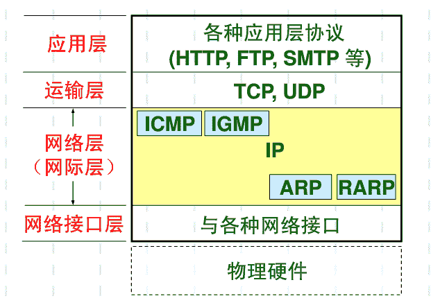
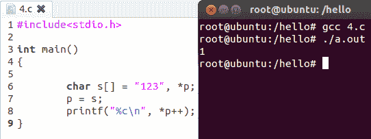

# 四千三百九十九、游戏 2015 校园招聘游戏开发类笔试题

## 1

已知有一个关键字序列：（19，14,23,1,68,20,84,27,55,11,10,79）散列存储在一个哈希表中，若散列函数为 H（key）=key%7，并采用链地址法来解决冲突，则在等概率情况下查找成功的平均查找长度为（）。

正确答案: A   你的答案: 空 (错误)

```cpp
1.5
```

```cpp
1.7
```

```cpp
2.0
```

```cpp
2.3
```

本题知识点

哈希 *讨论

[牛客-007](https://www.nowcoder.com/profile/394118)

  查看全部)

编辑于 2015-01-31 10:39:48

* * *

[rppp](https://www.nowcoder.com/profile/9542322)

主要考察哈希表的链地址存储，分别计算每个数据的查找程度，如下所示：地址为 0：14（1）  84（2）地址为 1：1（1）2：23（1）  79（2）3：10（1）4：11（1）5：19（1） 68（2）6：20（1） 27（2） 55（3）平均查找程度=（1+2+1+1+2+1+1+1+2+1+2+3）/12 = 18/12 = 1.5

发表于 2017-07-24 11:47:12

* * *

[sunlight_run](https://www.nowcoder.com/profile/6428287)

|   | 0 | 1 | 2 | 3 | 4 | 5 | 6 |
| %7 | 14，84， | 1 | 23，79 | 10 | 11 | 19，68 | 20，27，55 |
| 次数 | 1+2 | 1 | 1+2 | 1 | 1 | 1+2 | 1+2+3 |

总查找次数相加为 18，所以平均查找长度为 18/12=1.5

发表于 2017-06-16 17:03:38

* * *

## 2

计算机网络中，所有的计算机都连接到一个中心节点上，一个网络结点需要传输数据，首先传输到中心节点上，然后由中心节点转发到目的节点 ，这种连接结构被称为（）

正确答案: C   你的答案: 空 (错误)

```cpp
总线结构
```

```cpp
环型结构
```

```cpp
星型结构
```

```cpp
网状结构
```

本题知识点

网络基础

讨论

[牛客-007](https://www.nowcoder.com/profile/394118)

答案：CA，总线结构是  查看全部)

编辑于 2015-01-31 10:15:42

* * *

[MyGoodHelper](https://www.nowcoder.com/profile/644326)

C**星型结构：**是用集线器或交换机作为网络的***节点，网络中的每一台计算机都通过网卡连接到***节点，计算机之间通过***节点进行信息交换，各节点呈星状分布而得名。星型结构是目前在局域网中应用得最为普遍的一种，在企业网络中几乎都是采用这一方式。星型网络几乎是 Ethernet（[以太网](http://baike.baidu.com/view/848.htm)）网络专用。这类网络目前用的最多的传输介质是双绞线，如常见的[五类双绞线](http://baike.baidu.com/view/199946.htm)、[超五类双绞线](http://baike.baidu.com/view/2251892.htm)等。
**总线结构**这种网络拓扑结构中所有设备都直接与总线相连，它所采用的介质一般也是同轴电缆（包括粗缆和细缆），也有采用光缆作为总线型传输介质的，[ATM](http://baike.baidu.com/subview/26/5395796.htm)网、Cable Modem 所采用的[网络](http://baike.baidu.com/view/3487.htm)等都属于总线型网络结构。
**环形结构**环型[网络拓扑结构](http://baike.baidu.com/view/228909.htm)主要应用于采用同轴电缆（也可以是光纤）作为[传输介质](http://baike.baidu.com/view/305337.htm)的[令牌网](http://baike.baidu.com/view/2235739.htm)中，是由连接成封闭回路的[网络节点](http://baike.baidu.com/view/1266538.htm)组成的。这种[网络](http://baike.baidu.com/view/3487.htm)中的每一[节点](http://baike.baidu.com/view/47398.htm)是通过环[中继转发器](http://baike.baidu.com/view/1247563.htm)(RPU)与它左右相邻的节点串行连接，在[传输介质](http://baike.baidu.com/view/305337.htm)环的两端各加上一个阻抗匹配器就形成了一个封闭的环路，这样在逻辑上就相当于形成了一个封闭的环路，“环型”结构的命名起因就在于此。
**网状结构**网状拓扑结构，这种[拓扑结构](http://baike.baidu.com/view/82343.htm)主要指各[节点](http://baike.baidu.com/view/47398.htm)通过传输线互联连接起来，并且每一个[节点](http://baike.baidu.com/view/47398.htm)至少与其他两个[节点](http://baike.baidu.com/view/47398.htm)相连·网状拓扑结构具有较高的可靠性，但其结构复杂，实现起来费用较高，不易[管理](http://baike.baidu.com/view/18841.htm)和维护，不常用于[局域网](http://baike.baidu.com/view/788.htm)。

编辑于 2015-01-18 15:54:31

* * *

[牛客 975968 号](https://www.nowcoder.com/profile/975968)

A，总线结构是指所有计算机通过一跟总线通信 B，环形结构相当于多台计算机的网线手拉手围成一个圈的连接模型 C，星型结构是有一个中心点，向外辐射出多条链路，符合题目描述的情况 D，网状结构也就是计算机之间交互连接，任意两台计算机之间直接或者间接相连

发表于 2017-03-22 16:15:55

* * *

## 3

An ARP query packet is encapsulated in()

正确答案: C   你的答案: 空 (错误)

```cpp
a link-layer frame addressed to a specific adapter
```

```cpp
an IP datagram
```

```cpp
a link-layer broadcast frame
```

```cpp
none of above
```

本题知识点

网络基础

讨论

[MyGoodHelper](https://www.nowcoder.com/profile/644326)

C1\. ARP 是用于将  查看全部)

编辑于 2015-01-31 10:15:22

* * *

[周星星 _](https://www.nowcoder.com/profile/537870)

ARP 包包装在什么里面？A、发给指定网络适配器的链路层帧 B、ip 数据报 C、链路层广播帧选 CARP 协议工作在数据链路层，但是属于网络层。配张图ref：http://wenku.baidu.com/link?url=CGmE2oEritxjtHty4NHwRsFKlA0Nfdus-wmi0o8U5irBvP9iIxExwjip2mblgTyP0m2Nt55XqXwOXHSOGOYDtC0lhFeJWXhhzW__eUxeADi

编辑于 2016-08-25 14:25:39

* * *

[萱萱是个好姑娘](https://www.nowcoder.com/profile/890398)

1,ARP 协议和 RARP 协议是作用于数据链路层的，ARP 协议的作用是将 IP 地址转换为物理地址，它的工作原理是，将 ARP 请求报文广播到所在网络上的所有主机，报文中含有目的主机的 IP 地址，只有目标主机可以返回一个 ARP 应答报文，报文中含有该主机的物理地址。 2，网络层的协议是 IP 协议和 ICMP 协议。 3，传输层的协议是 TCP 和 UDP。

发表于 2016-03-22 00:06:46

* * *

## 4

若有以下定义和赋值语句，则与&s[i][j]等价的是（）

```cpp
int s[2][3] = {0}, (*p)[3], i, j;
p = s;
i = j = 1;

```

正确答案: C   你的答案: 空 (错误)

```cpp
*(*(p+i)+j)
```

```cpp
*(p[i]+j)
```

```cpp
*(p+i)+j
```

```cpp
(*(p+i))[j]
```

本题知识点

C 语言

讨论

[kuring](https://www.nowcoder.com/profile/462306)

  查看全部)

编辑于 2015-01-31 10:13:27

* * *

[苏妄言](https://www.nowcoder.com/profile/498343)

int (*p)[3] 表示一个指针，指向一个含有三个元素的数组；p=s，表示 p 指向了数组 s 的第一行，p+1 表示现在指针指向了数组 s 的第二行；*(p+1)表示数组 s 第二行第一个元素的地址；*(p+1)+1 表示数组 s 第二行第二个元素的地址；

发表于 2015-04-29 14:25:46

* * *

[言安阳](https://www.nowcoder.com/profile/460557)

ints[2][3] = {0}  ————> s 为二维数组(*p)[3]    ————> 数组指针（p 是个指针，指向一个长度为 3 的数组，每个元素是 int 型） p = s       ————> p 指向的是 s 的第一行的首元素的地址   *(p+i) 等价于 s[i]   *(p[i]+j) 等价于 *(*(p+i)+j) 等价于 s[i][j]    p[i]+j ==> *(p+i)+j ==> &s[i][j]

编辑于 2016-03-12 10:39:15

* * *

## 5

运行下面这段代码，会出现的情况是:()

```cpp
void GetMemory(char *p) { p = (char *)malloc(100); }

void Test(void) {
    char *str = NULL;
    GetMemory(str);
    strcpy(str, "hello world");
    printf(str);
}

```

正确答案: C   你的答案: 空 (错误)

```cpp
hello world
```

```cpp
显示为乱码
```

```cpp
程序崩溃
```

```cpp
hello
```

本题知识点

C 语言

讨论

[牛客-007](https://www.nowcoder.com/profile/394118)

答案：CGetMemo  查看全部)

编辑于 2015-01-17 11:05:58

* * *

[kuring](https://www.nowcoder.com/profile/462306)

GetMemory 虽然在堆上申请了内存空间，但是并未将地址赋值给 str。str 的值仍然为 0，在进程地址空间中地址 0 为系统保留地址空间，在 linux 下进程访问会报段错误。linux 进程地址空间图解：


选 C

发表于 2015-01-22 12:02:12

* * *

[我是果汁 CC](https://www.nowcoder.com/profile/368678)

```cpp
#include <iostream>
using namespace std;

class A
{
public:
	void getMemory(char **p)
	{
		*p = (char *)malloc(100);
	}

	void test()
	{
		char *str = NULL;
		getMemory(&str);
		strcpy(str, "hello world");
		printf(str);
	}
};

void main()
{
	A a;
	a.test();
}
```

应该用二级指针

发表于 2015-08-10 17:17:00

* * *

## 6

分析以下函数，该函数的功能是（）

```cpp
void sca_from_file(int a[], int n, char fn[])
{
    FILE *fp;
    int i;
    fp = fopen(fn, "r");
    for (i = 0; i < n; i++)
    {
        fscanf(fp, "%d", &a[i]);
    }
    fclose(fp);
}

```

正确答案: A   你的答案: 空 (错误)

```cpp
打开文件 fn，从文件中读出 n 个整数到数组 a 中
```

```cpp
打开文件 fn，将数组 a 的 n 个元素写到文件中
```

```cpp
打开文件 fn，从文件中读出 n，再读 n 个整数到数组 a 中
```

```cpp
打开文件 fn，将 n 和数组 a 的 n 个元素依次写到文件中
```

本题知识点

C 语言

讨论

[kuring](https://www.nowcoder.com/profile/462306)

  查看全部)

编辑于 2015-01-31 10:11:17

* * *

[牛客-007](https://www.nowcoder.com/profile/394118)

答案：A
fscanf()作用是从文件流中读取数据，fprintf()是将数据写入到文件。不要搞混。
格式：int fscanf(FILE*stream,constchar*format,[argument...]);
参数：%d：读入一个十进制整数.
%s : 读入一个字符串，遇空字符‘\0'结束。
%c : 读入一个字符。无法读入空值。空格可以被读入。
所以这里是从文件中读出 n 个整数到数组 a 中

发表于 2015-01-28 15:44:34

* * *

[seekerjie](https://www.nowcoder.com/profile/272412)

由 fp = fopen(fn, "r");看出文件是只读的，所以选 A

发表于 2015-08-15 15:08:46

* * *

## 7

设有以下函数 void fun(int n,char *s)(......),则下面对函数指针的定义和赋值均是正确的是：（）

正确答案: B   你的答案: 空 (错误)

```cpp
void (*pf)(int，char);   pf=&fun;
```

```cpp
void (*pf)(int n，char *s);   pf=fun;
```

```cpp
void *pf();  *pf=fun;
```

```cpp
void *pf();  pf=fun;
```

本题知识点

C 语言

讨论

[kuring](https://www.nowcoder.com/profile/462306)

  查看全部)

编辑于 2015-01-31 10:09:59

* * *

[小雨落梧桐](https://www.nowcoder.com/profile/234240)

B. 函数指针只需要把 fun 改成(*pf) ,赋值 直接 pf = fun;即可 函数名赋值.指针函数赋值时候,可以直接用函数名赋值(书上一般都是这样赋值的) .但是也可以用&fun ,取地址操作符复制给函数指针.   pf = &fun;也是可以的.亲测过但是 A 答案,在 char 参数后面少了一个*,所以是错的.如果加上*.也是正确的

编辑于 2015-04-13 12:36:42

* * *

[大星星和小猩猩](https://www.nowcoder.com/profile/9374535)

函数名即函数的起始地址，直接赋值即可。pf=&fun 和 pf=fun 都是正确的。但是函数指针，要求形参类型必须一致，A 选项形参类型错误，如果改成 void (*pf)(int，char*); pf=&fun;则 A 和 B 都正确。所以选 B。   

发表于 2018-01-23 09:01:48

* * *

## 8

下列关于线程说法错误的是（）

正确答案: B   你的答案: 空 (错误)

```cpp
耗时的操作使用线程，提高程序响应
```

```cpp
耗内存的操作使用线程，提高内存利用率
```

```cpp
多 CPU 的系统使用线程，提高 CPU 利用率
```

```cpp
并行操作使用线程，如 c/s 架构中服务端程序为每个客户端请求创建一个线程来响应
```

本题知识点

操作系统

讨论

[牛客-007](https://www.nowcoder.com/profile/394118)

答案：B 使用多线程不能  查看全部)

编辑于 2015-01-31 10:07:52

* * *

[河湖之恋](https://www.nowcoder.com/profile/220047)

答案选 B。我的直观看法是：线程是将一个进程分成多个部分来进行程序的执行，那么这多个部分就还需要额外的内存来进行管理，也就是多要了内存，所以不可能提高内存利用率。

发表于 2015-09-14 09:34:20

* * *

[MyGoodHelper](https://www.nowcoder.com/profile/644326)

B 多线程可以提高 CPU 利用率，不能提高内存利用率

发表于 2015-01-18 21:27:22

* * *

## 9

以下 SQL 语句的作用是：（）

```cpp
SELECT count(*) FROM 't_users' where id <> 0
```

正确答案: D   你的答案: 空 (错误)

```cpp
t_users 表 id 等于 0 的全部记录
```

```cpp
t_users 表 id 不等于 0 的全部记录
```

```cpp
t_users 表 id 等于 0 的记录数量
```

```cpp
t_users 表 id 不等于 0 的记录数量
```

本题知识点

数据库

讨论

[牛客-007](https://www.nowcoder.com/profile/394118)

答案：Dwhere i  查看全部)

编辑于 2015-01-31 10:07:18

* * *

[MyGoodHelper](https://www.nowcoder.com/profile/644326)

Dselect 是查询语句，COUNT(*) 函数返回表中的记录数：from 子句确定查询的 t_users 表，where 条件子句 where id <> 0 表示 id 不等于 0

编辑于 2015-01-18 15:51:05

* * *

[弥钵](https://www.nowcoder.com/profile/673343000)

看漏了 count

发表于 2022-02-16 00:55:34

* * *

## 10

下面关于 Z-Buffer 算法的论断哪一条不正确？（）

正确答案: B   你的答案: 空 (错误)

```cpp
深度缓存算法并不需要开辟一个与图像大小相等的深度缓存数组
```

```cpp
深度缓存算法不能用于处理对透明物体的消隐
```

```cpp
深度缓存算法能并行实现
```

```cpp
深度缓存算法中没有对多边形进行排序
```

本题知识点

图像处理

讨论

[霜月幻夜](https://www.nowcoder.com/profile/899884)

A。除了保存 framebuffer 外，再增加一个空间来保存每个像素与视点的距离，记为 Z-Buffer。绘制前初始化所有 zBuffer 为无限远，绘制时当前像素的 z 如果比 zBuffer 中的大，则跳过此像素；否则，就绘制此像素，并将 zBuffer 中的值更新为当前像素的 z

发表于 2015-06-20 22:37:13

* * *

[indere](https://www.nowcoder.com/profile/480421)

A。Z-buffer 不是用来更新像素点颜色的吗？根据深度的遮挡关系来判断是否更新像素颜色。所以大小应该是和图像的大小一样才对。Z-buffer 由于只记录深度信息，无法判断物体是否是透明的，如果场景中有透明物体，应该先绘制所有不透明物体，然后把 Z-buffer 设置为“只读”，绘制透明物体后再把 Z-buffer 改回成“可读可写”

编辑于 2019-01-14 15:46:48

* * *

[Maybe.](https://www.nowcoder.com/profile/337833)

B 深度缓存算法能用于处理对透明物体的消隐

发表于 2015-10-11 00:35:34

* * *

## 11

设一组初始记录关键字序列为（49,38,65,97,76,13,27,49），则以第一个关键字 49 为基准而得到的一趟快速排序结果是：（）

正确答案: C   你的答案: 空 (错误)

```cpp
38，13，27，49，49，65，97，76
```

```cpp
13，27，38，49，65，76，97，49
```

```cpp
27，38，13，49，76，97，65，49
```

```cpp
27，38，13，49，97，76，65，49
```

本题知识点

排序 *讨论

[牛客 444334 号](https://www.nowcoder.com/profile/444334)

C

基本思想：  查看全部)

编辑于 2015-01-31 11:21:55

* * *

[牛客-007](https://www.nowcoder.com/profile/394118)

答案：C
以 49 为基准，取出 49，两个指针，前指针指向 38，后指针指向最后一个 49
首先移动后指针，找到 27<49，将 27 放在 0 位置，后指针前移
再根据前指针查找，65>49，将 65 放在原 27 的位置
现在结果是 27,38, ,97,76,13,65,49
继续用后指针查找，13<49,放在空位中，后指针前移，
结果是 27,38,13,97,76, ,65,49
继续前指针查找，97>49，放在空位，变成 27,38,13, ,76,97,65,49
然后前后指针都指向 76，结束，将 49 放入空位中，得到 27,38,13,49,76,97,65,49

发表于 2015-01-28 16:01:09

* * *

[lulu10922](https://www.nowcoder.com/profile/971944)

什么破题目，根本就没有个标准的答案。partition 的方法不一样，划分的肯定有区别。

发表于 2015-09-01 13:39:49

* * *

## 12

在单链表中，要将 s 所指结点插入到 p 所指结点之后，其语句应为（）

正确答案: D   你的答案: 空 (错误)

```cpp
s->next=p+1;  p->next=s;
```

```cpp
(*p).next=s;  (*s).next=(*p).next
```

```cpp
s->next=p->next;  p->next=s->next;
```

```cpp
s->next=p->next;  p->next=s;
```

本题知识点

链表 *讨论

[牛客 444334 号](https://www.nowcoder.com/profile/444334)

D
在插入节点的操作中，应该  查看全部)

编辑于 2015-01-31 10:21:18

* * *

[Deleteaoe](https://www.nowcoder.com/profile/544454846)

正确答案是 D

发表于 2021-06-10 21:54:30

* * *

[牛客-007](https://www.nowcoder.com/profile/394118)

答案：D
不能让 p->next 先指向 s,否则原链表中 p 的下一个结点就丢失了
所以s->next=p->next; p->next=s;

发表于 2015-01-28 16:05:13

* * *

## 13

如果一个堆栈的入栈序列是 A,B,C,D,E,则堆栈的不可能输出顺序是（）。

正确答案: C   你的答案: 空 (错误)

```cpp
EDCBA
```

```cpp
DECBA
```

```cpp
DCEAB
```

```cpp
ABCDE
```

本题知识点

栈 *讨论

[牛客 444334 号](https://www.nowcoder.com/profile/444334)

C

A 可行，ABCDE 依  查看全部)

编辑于 2015-01-12 21:44:09

* * *

[何处闻](https://www.nowcoder.com/profile/5294155)

规律：某数 a 右侧比 a 小的数构成的子列必须严格降序

发表于 2017-08-14 19:57:08

* * *

[牛客-007](https://www.nowcoder.com/profile/394118)

答案：C
C 选项第一步 D 节点出栈，说明 ABC 节点都已经在栈内，所以 B 的出栈一定在 A 的前面

发表于 2015-01-28 16:34:01

* * *

## 14

若以{4,5,6,7,8}作为叶子结点的权值构造哈夫曼树，则其带权路径长度是（）。

正确答案: D   你的答案: 空 (错误)

```cpp
24
```

```cpp
30
```

```cpp
53
```

```cpp
69
```

本题知识点

树

讨论

[eagle](https://www.nowcoder.com/profile/603476)

D 构造方法是每次  查看全部)

编辑于 2015-01-12 18:04:08

* * *

[我是小埋哟](https://www.nowcoder.com/profile/6306378)


发表于 2016-10-31 13:47:58

* * *

[牛客-007](https://www.nowcoder.com/profile/394118)

答案：D
树的带权路径长度(Weighted Path Length of Tree)：定义为树中所有叶结点的带权路径长度之和。
结点的带权路径长度：结点到树根之间的路径长度与该结点上权的乘积。
构造哈夫曼树后，
4,5 的编码长度为 3,
6,7,8 的编码长度为 2
（4+5）*3+（6+7+8）*2=27+42=69

发表于 2015-01-28 16:28:20

* * *

## 15

某城市发生了一起汽车撞人逃跑事件，该城市只有两种颜色的车，蓝 20%绿 80%，事发时现场有一个目击者，他指证是蓝车，但是根据专家在现场分析，当时那种条件能看正确的可能性是 80%，那么，肇事的车是蓝车的概率是多少？

正确答案: C   你的答案: 空 (错误)

```cpp
80%
```

```cpp
84%
```

```cpp
50%
```

```cpp
64%
```

本题知识点

概率统计 *概率论与数理统计* *讨论

[大爱冷色调](https://www.nowcoder.com/profile/398773)

  查看全部)

编辑于 2015-01-31 11:11:05

* * *

[牛客 973782 号](https://www.nowcoder.com/profile/973782)

肇事车颜色是蓝色 A1 的概率为 P(A1)=0.2，是绿色 A2 概率为 P(A2)=0.8;‘+’表示看到的是蓝色，‘-’表示看到的是绿色，
《目击者看清》为条件概率，即 P(+/A1)=0.8，P(-/A2)=0.8，同样的 P(-/A1)=0.2，P(+/A2)=0.2；
问题是求看到蓝色车的前提下是蓝色车的概率，利用贝叶斯公式
P(A1/+)=P(+/A1)*P(A1)/(P(+/A1)*P(A1)+P(+/A2)*P(A2))=0.8*0.2/(0.8*0.2+0.2*0.8)=0.5

发表于 2015-08-20 16:04:46

* * *

[OOACMer](https://www.nowcoder.com/profile/632326)

答案：A 解析：       经本人初步观察，此题为逻辑思维题。若肇事车为蓝色，说明 目击者看正确了；若为绿色，说明目击者看错了。 根据《 专家在现场分析，当时那种条件能看正确的可能性是 80% 》知道： 肇事的车是蓝车的概率就是 80%，前面《 该城市只有两种颜色的车，蓝 20%绿 80% 》是误导因素，你被误导了么？

发表于 2015-08-06 20:19:07

* * *

## 16

一颗完全二叉树第六层有 8 个叶结点（根为第一层），则结点个数最多有（）个。

正确答案: D   你的答案: 空 (错误)

```cpp
39
```

```cpp
72
```

```cpp
104
```

```cpp
111
```

本题知识点

树

讨论

[牛客-007](https://www.nowcoder.com/profile/394118)

答案：D 二叉树第 k 层最  查看全部)

编辑于 2015-01-14 11:01:37

* * *

[牛客-liwei4939](https://www.nowcoder.com/profile/1840907)

完全二叉树第六层 8 个叶结点，则第七层缺少 16 个结点不满，结点个数等于 2^(7 )-1-16=111

发表于 2017-04-22 21:18:52

* * *

[C.C.](https://www.nowcoder.com/profile/52)

答案是 111 最多的情况是层:节点数 1 : 12 : 23 : 44 : 85 : 166 : 327 :  48 1 + 2 + 3 + 4 + 8 + 16 + 32 + 48 = 111 第七层的节点是第六层的左边 24 个的子节点（因为最右边 8 个是叶子节点），所以是 48 个

发表于 2015-01-13 17:23:54

* * *

## 17

已知二叉树后序遍历序列是 DABEC，中序遍历序列是 DEBAC,它的前序遍历序列是（）

正确答案: A   你的答案: 空 (错误)

```cpp
CEDBA
```

```cpp
ACBED
```

```cpp
DECAB
```

```cpp
DEABC
```

本题知识点

树

讨论

[牛客 444334 号](https://www.nowcoder.com/profile/444334)

A

第一步：还是先求 roo  查看全部)

编辑于 2015-01-31 10:35:06

* * *

[牛客-007](https://www.nowcoder.com/profile/394118)

答案：
解法一：
根据后序遍历可以看出 root 节点为 C，前序遍历是首先变量跟节点的，所以第一个必为 C，因此排除法选择 A
解法二：
第一步根据后序遍历可以看出 root 节点为 C，然后中序遍历 D 的左边为左子树，右边是右子树，可以看出左子树为空
第二步根据后续遍历可以看到右子树的根为 E，然后看中序遍历右子树节点中，E 的左侧为右子树的左子树，右边为右子树的右子树。
第三步，根据前两步递归下去可以恢复二叉树结构，然后前序遍历一遍得到结果。
结果为 CEDBA
解法二的程序实现如下：

```cpp
#include "stdio.h"
typedef struct Tnode
{
    struct Tnode * left;
    struct Tnode * right;
    char elem;
} TreeNode;
//根据中序，后序遍历,返回二叉树
void * getByInPostOrder(char * inorder, char * postorder, int length)
{
    if(length<1)
        return NULL;
    TreeNode * node=malloc(sizeof(TreeNode));
    node->elem=postorder[length-1];//根节点
    int rootIndex=0;
    while(rootIndex<length && inorder[rootIndex]!=node->elem)
        rootIndex++;//查找中序遍历根节点索引
    //递归恢复左右子树
    node->left=getByInPostOrder(inorder, postorder ,rootIndex);
    node->right=getByInPostOrder(inorder+rootIndex+1, postorder+rootIndex, length-rootIndex-1);
    return node;
}
//前序遍历
void preOrder(void * root)
{
    if(root==NULL)
        return;
    TreeNode * node=(TreeNode*)root;
    printf("%c",node->elem);
    preOrder(node->left);
    preOrder(node->right);
}
void main()
{    
    char * in="DEBAC";//中序遍历结果
    char * post="DABEC";//后续遍历
    void * tree=getByInPostOrder(in,post,strlen(in));
    preOrder(tree);    
}
```

发表于 2015-01-28 16:21:37

* * *

[TracyDragon](https://www.nowcoder.com/profile/5168521)

根据后序遍历（左右根）DABEC 知根节点为 C，前序遍历（根左右）以 C 开头，只有 A 选项符合，故选 A

发表于 2017-03-15 22:26:21

* * *

## 18

在下面几种排序方法中，空间复杂度最高的是（）

正确答案: D   你的答案: 空 (错误)

```cpp
插入排序
```

```cpp
选择排序
```

```cpp
快速排序
```

```cpp
归并排序
```

本题知识点

排序 *讨论

[MyGoodHelper](https://www.nowcoder.com/profile/644326)

D 所有简单排序和堆排序  查看全部)

编辑于 2015-01-31 10:31:53

* * *

[程序猿 Go 师傅](https://www.nowcoder.com/profile/242025553)


编辑于 2019-10-21 21:29:09

* * *

[牛客-007](https://www.nowcoder.com/profile/394118)

答案：D 插入排序，选择排序，快速排序 除了交换变量的临时空间外都不需要额外的空间开销，
归并排序 需要一个跟原始数组同样大小的空间做归并操作

发表于 2015-01-11 12:53:38

* * *

## 19

在单链表中，增加头结点的目的是（）

正确答案: B   你的答案: 空 (错误)

```cpp
标识表结点中首结点的位置
```

```cpp
算法实现上的方便
```

```cpp
使单链表至少有一个结点
```

```cpp
说明单链表是线性表的链式存储实现
```

本题知识点

链表 *讨论

[牛客-007](https://www.nowcoder.com/profile/394118)

答案：B 增加头结点增大  查看全部)

编辑于 2015-01-31 10:31:03

* * *

[小雨落梧桐](https://www.nowcoder.com/profile/234240)

B. 教科书上的原话是: 为了方便在表头插入和删除结点,是的与在其他地方所做的操作相同,需要在表头结点前面增加一个结点把它称之为表头附加节点或者头结点

发表于 2015-04-20 15:56:36

* * *

[石木](https://www.nowcoder.com/profile/9221811)

单链表添加头结点主要是方便算法的实现，从而在单链表为空与非空时，保持插入与删除操作的一致。

发表于 2016-08-27 16:13:51

* * *

## 20

下列程序的时间复杂度是（）

```cpp
for (int i = 1, s = 0; i <= n; ++i)
{
    int t = 1;
    for (int j = 1; j <= i; ++j)
        t = t * j;
    s = s + t;
}

```

正确答案: C   你的答案: 空 (错误)

```cpp
O(n)
```

```cpp
O(n*logn)
```

```cpp
O(n²)
```

```cpp
O(n³)
```

本题知识点

复杂度

讨论

[牛客-007](https://www.nowcoder.com/profile/394118)

  查看全部)

编辑于 2015-01-28 17:56:16

* * *

[Yano_nankai](https://www.nowcoder.com/profile/999047)

执行次数分别为 1 2 3 ... n

所以总的执行次数是 1 到 n 的和，为 n*(1+n)/2，时间复杂度是 O(n²)

发表于 2015-08-06 16:50:54

* * *

[牛客 651205 号](https://www.nowcoder.com/profile/651205)

当 i==n 的时候就是标准的 O(N²),所以按照对高次幂开说就是 O(N²)

发表于 2019-02-18 16:08:56

* * *

## 21

SQL 中，基本表结构的修改用 1 关键字。

你的答案 (错误)

1 参考答案 (1) ALTER

本题知识点

数据库

讨论

[牛客-007](https://www.nowcoder.com/profile/394118)

**ALTER**
  查看全部)

编辑于 2015-01-26 17:41:12

* * *

[牛客 205392791 号](https://www.nowcoder.com/profile/205392791)

还区分大小写？真是醉了

发表于 2020-04-13 11:56:18

* * *

[MyGoodHelper](https://www.nowcoder.com/profile/644326)

ALTER TABLE ALTER TABLE 语句用于在已有的表中添加、修改或删除列。

发表于 2015-01-11 14:08:36

* * *

## 22

若 D1=[a1,a2,a3],D2=[1,2,3],则 D1*D2 集合共有 1 个元组。

你的答案 (错误)

1 参考答案 (1) 9

本题知识点

组合数学 *讨论

[MyGoodHelper](https://www.nowcoder.com/profile/644326)

9 集合做乘法：M  查看全部)

编辑于 2015-01-29 10:57:50

* * *

[万敏感词](https://www.nowcoder.com/profile/6045621)

[笛卡尔积](http://baike.baidu.com/view/79382.htm) 中每一个 [元](http://baike.baidu.com/subview/6673/6324750.htm) 素（d1，d2，…，dn），叫作一个 n 元组（n-tuple）或简称 元组

发表于 2016-12-13 20:24:53

* * *

[kingLouis](https://www.nowcoder.com/profile/990276010)

元组（tuple）是[关系数据库](https://baike.baidu.com/item/%E5%85%B3%E7%B3%BB%E6%95%B0%E6%8D%AE%E5%BA%93/1237340)中的基本概念，关系是一张[表](https://baike.baidu.com/item/%E8%A1%A8/84929)，表中的每行（即数据库中的每条记录）就是一个元组，每列就是一个[属性](https://baike.baidu.com/item/%E5%B1%9E%E6%80%A7/1405051)。 在[二维表](https://baike.baidu.com/item/%E4%BA%8C%E7%BB%B4%E8%A1%A8/2863955)里，元组也称为行。

发表于 2021-09-17 20:54:08

* * *

## 23

在 VS 编译器以下程序的输出结果是 1

```cpp
char s[] = "123", *p; 
p = s; 
printf("%c\n", *p++);
```

你的答案 (错误)

1 参考答案 (1) 1

本题知识点

C++

讨论

[itsang](https://www.nowcoder.com/profile/5024890)

其中还有个知识点，很多人容易搞错：

```cpp
char s[] = "123", *p = s;
// 输出为 123
cout << p << endl;
// 输出为 1
cout << *p << endl;

```

发表于 2016-12-03 20:56:55

* * *

[牛客 551207 号](https://www.nowcoder.com/profile/551207)

答案是 1，因为*p++实际上就是*(p++)，然而 p++是后置++，它先返回 p 的拷贝给*，解引用之后，p 再自己++。

发表于 2015-12-30 12:36:41

* * *

[牛客 341919 号](https://www.nowcoder.com/profile/341919)

看图

发表于 2015-10-21 16:58:52

* * *

## 24

在 32 位系统中：

```cpp
char arr[] = {4, 3, 9, 9, 2, 0, 1, 5};
char *str = arr;
sizeof(arr) = 1;
sizeof(str) = 2;
strlen(str) = 3;

```

你的答案 (错误)

123 参考答案 (1) 8
(2) 4
(3) 5

本题知识点

C++

讨论

[牛客-007](https://www.nowcoder.com/profile/394118)

答案：8,4,5（已实测）  查看全部)

编辑于 2015-01-17 11:13:53

* * *

[leobuzhi](https://www.nowcoder.com/profile/932073)

注意 ASCII 为 0 的值表示的是‘\0’ 

发表于 2016-02-06 16:37:51

* * *

[我是谁谁谁呢](https://www.nowcoder.com/profile/538759)

sizeof(arr)表示求数组所占空间的字节数，这里 1*8=8sizeof（str），str 是指针，32 位操作系统，指针大小是 32/8=4 个字节 strlen(str)，表示求字符串长度，这里字符串由字符数组得到，字符数组赋值的是字符的 ASC11 码，但是 asc 为 0 的值表示的是‘\0’，但是 strlen 就是以'\0'为结束符的，所以为 5

发表于 2015-08-23 09:58:51

* * *

## 25

设有序表中有 1000 个元素，则用二分查找元素 X 最多需要比较 1 次可知道所查找元素查找序列中。

你的答案 (错误)

1 参考答案 (1) 10

本题知识点

排序 *讨论

[牛客-007](https://www.nowcoder.com/profile/394118)

答案：10 二分查找的时  查看全部)

编辑于 2015-01-17 11:11:15

* * *

[阿良](https://www.nowcoder.com/profile/490918)

答案应该是 9 假设查找元素在序列中，最后一次就可以不比较了，比如 3 个数，比较一次结果就出来了～

发表于 2015-09-07 08:06:05

* * *

[小小丽](https://www.nowcoder.com/profile/438476084)

总结一下各位大佬的答案：

首先要弄清楚二分次数和比较次数。 比较次数＝二分次数＋1\.

1000 用二分法分到只剩一个数的次数是 9 次，如果问题是：1000 个数用二分法分到剩一个数，答案是 9 次，是这里并没有比较最后剩下的那个数，所以总的比较次数为 10。 若已知一定存在此数，则最后一次不用比较了，总的为 9 次。 就是大家所说的：比较次数为 logN 向上取整，二分次数为:logN 向下取整 log1000 为 9.XX，

综上所述所以比较次数为 10，二分次数为 9

发表于 2020-06-07 09:40:35

* * *

## 26

设输入序列为：1,2,3，则经过栈的作用后可以得到 1 种不同的输出序列。

你的答案 (错误)

1 参考答案 (1) 5

本题知识点

栈 *讨论

[牛客-007](https://www.nowcoder.com/profile/394118)

  查看全部)

编辑于 2015-01-31 10:00:16

* * *

[小四](https://www.nowcoder.com/profile/333228)

S=C(2n,n)-C(2n,n-1);  *1.括号化问题。*

矩阵链乘： P=a1×a2×a3×……×an，依据乘法结合律，不改变其顺序，只用括号表示成对的乘积，试问有几种括号化的方案？(h(n)种)

 *2.出栈次序问题。*

一个栈(无穷大)的进栈序列为 1,2,3,..n,有多少个不同的出栈序列?

类似：有 2n 个人排成一行进入剧场。入场费 5 元。其中只有 n 个人有一张 5 元钞票，另外 n 人只有 10 元钞票，剧院无其它钞票，问有多少中方法使得只要有 10 元的人买票，售票处就有 5 元的钞票找零？(将持 5 元者到达视作将 5 元入栈，持 10 元者到达视作使栈中某 5 元出栈)

 *3.将多边行划分为三角形问题。*

```cpp
将一个凸多边形区域分成三角形区域的方法数?
```

        类似：一位大城市的律师在她住所以北 n 个街区和以东 n 个街区处工作。每天她走 2n 个街区去上班。如果她从不穿越（但可以碰到）从家到办公室的对角线，那么有多少条可能的道路？

类似：在圆上选择 2n 个点,将这些点成对连接起来使得所得到的 n 条线段不相交的方法数?

4.*给顶节点组成二叉树的问题。*

给定 N 个节点，能构成多少种不同的二叉树？

发表于 2015-08-14 14:32:20

* * *

[ttkl](https://www.nowcoder.com/profile/750643)

catalan 数问题

发表于 2015-03-09 20:03:35

* * *

## 27

一个家庭有两个小孩，其中一个是女孩、另一个也是女孩的概率是 1（假定生男生女概率一样）

你的答案 (错误)

1 参考答案 (1) 1/3

本题知识点

概率统计 *讨论

[MyGoodHelper](https://www.nowcoder.com/profile/644326)

1/3 男男，男女，女男  查看全部)

编辑于 2015-01-26 20:27:26

* * *

[0pandas0](https://www.nowcoder.com/profile/773225)

设事件 A 为两个孩子中有女孩，事件 B 为第二个孩子为女孩。则 P(A)=1-1/4=3/4(即求至少有一个女孩的情况概率)P(AB)=1/2*1/2=1/4（两个都是女孩的概率）P(B|A)=P(AB)/P(A)=1/4 / 3/4 =1/3（条件概率）

发表于 2015-09-02 17:08:54

* * *

[牛客-007](https://www.nowcoder.com/profile/394118)

答案：1/3 两个小孩可能是 男男，男女，女男，女女已知其中一个是女孩，也就是后三种情况中的一种，男女，女男，女女
只有最后一种情况另一个也是女孩。因此另一个也是女孩的概率是 1/3

发表于 2015-01-26 17:00:22

* * *

## 28

在 linux 中，某文件的权限为：drw-r--r--，该权限用数值形式表示为 1，修改文件权限用 2 命令。

你的答案 (错误)

12 参考答案 (1) 644
(2) chmod

本题知识点

Linux

讨论

[牛客-007](https://www.nowcoder.com/profile/394118)

答案： 644，chmod 6  查看全部)

编辑于 2015-01-17 11:29:11

* * *

[后劲好大](https://www.nowcoder.com/profile/4013442)

chmod 修改文件权限
r 代表 4w 代表 2x 代表 1
所以是 644

发表于 2017-06-07 21:19:46

* * *

[hchlqlz](https://www.nowcoder.com/profile/8751363)

哇，用数值形式表示默认是 10 进制吧。。。感觉应该写成 0644 更清楚。

发表于 2017-06-17 10:48:21

* * *

## 29

i 的初始值为 0，i++在两个线程里面分别执行 100 次，能得到最大值是 1，最小值是 2。

你的答案 (错误)

12 参考答案 (1) 200
(2) 2

本题知识点

C++

讨论

[飞云](https://www.nowcoder.com/profile/819467)

最大值 200，最小值 2；  查看全部)

编辑于 2015-01-31 10:29:46

* * *

[竹醉](https://www.nowcoder.com/profile/794065)

最小值 2 的分析：假设两个线程 a,b 首先 a 执行 99 次，i 为 99，在未被写入内存时，b 取 i=0 时执行 1 次，写入内存后 i=1,此时覆盖掉了 i=99 的值；然后 a 取 i=1 执行 1 次，b 取 i=1 执行 99 次，当 a 比 b 后写入内存时，a 覆盖掉 b，此时 i=2

编辑于 2015-08-10 22:22:55

* * *

[Aimer](https://www.nowcoder.com/profile/867963)

最小值是 2 情况分析

线程 1                                                   ( 内存 )                          线程 2

                                                               i = 0

1. 读取 i = 0

2. 执行 i++ 99 次

                                                                                         3. 线程 2 从内存总读入 i                                                                                         i =0

4\. i = 99  -> 将 i = 99 写回内存            i = 99            

5\. 执行 i++ 一次， i = 1

6\. 将 i=1 写入到内存中

                                                         i = 1

7\. 读入 i=1 ，执行一次 i++

 得到 i = 2

 共计 100 次累加操作结束                                

8\. 读入 i = 1 ,                                                                                    执行 i++ 99 次直至结束得到

                                                                                     i = 100

9\. 将 i = 100 写回内存中

                                                         i = 100

10 将 i=2 写入到内存中                      i = 2

编辑于 2015-10-29 23:10:33

* * *

## 30

小陆每天要写一份工作日报，日报标准是“入职第 X 天-小陆-XXX”，对于“入职第几天”，小陆现在每次需要对上次写的日报标题里的天数+1， 遇到周末还要多加 2 天等等。请你写一段程序，帮小陆自动完成这件事，提供写日期当天的年月日，算出已入职的天数（假定小陆的入职时间是 2014 年 8 月 18 日）。要求：不能使用时间，日期相关的库函数。

你的答案

本题知识点

编程基础 *讨论

[飞翔蓝天](https://www.nowcoder.com/profile/546664)

```cpp
SimpleDateForma
```

  查看全部)

编辑于 2015-01-31 09:50:28

* * *

[wanxiaonan](https://www.nowcoder.com/profile/300590)

```cpp
#include <iostream>
using namespace std;

//每个月多少天
const int daysInMonth[12] = { 31, 28, 31, 30, 31, 30, 31, 31, 30, 31, 30, 31 };

//入职年月日
const int YEAR = 2014;
const int MONTH = 8;
const int DAY = 18;

//函数功能：是否为闰年
inline bool isLeapYear(int year) { return (year % 400 == 0 || (year % 4 == 0 && year % 100 != 0)); }

//函数功能：某一年有多少天
inline int allDaysOfYear(int year) {
	return isLeapYear(year) ? 366 : 365;
}

//函数功能：[year1, year2)年间一共有多少天，仅考虑年
int daysBetweenYears(int year1, int year2) {
	int sum = 0;
	for (int i = year1; i < year2; i++) {
		sum += allDaysOfYear(i);
	}
	return sum;
}

//函数功能：给出日期，计算出该年的第多少天。
int daysInYear(int year, int month, int day) {
	int result = day;
	for (int i = 0; i < month - 1; i++) {
		if (i == 1 && isLeapYear(year))
			result += 1;
		result += daysInMonth[i];
	}
	return result;
}

//函数功能：从入职起多少天
int daysFromEntry(int year, int month, int day) {
	if (year < YEAR) return 0;
	int daysOfYear = daysInYear(year, month, day);
	int daysEntryYear = daysInYear(YEAR, MONTH, DAY);
	if (daysOfYear < daysEntryYear && year == YEAR) return 0;
	int result = 0;	
	return daysOfYear - daysEntryYear + daysBetweenYears(YEAR, year) + 1;	
}

//函数功能：日期输入是否合法
bool isCorrectDate(int year, int month, int day) {
	if (month <= 0 || month > 12 || day <= 0) return false;
	if (isLeapYear(year) && month == 2 && day <= daysInMonth[1] + 1) 	
		return true;
	if (day <= daysInMonth[month - 1]) return true;
	return false;
}

int main() {
	int year, month, day;
	year = 2015;
	for (month = 1; month <= 12; month++)
	{
		for (day = 1; day <= 31; day++)
		{
			if (!isCorrectDate(year, month, day))
				cout << "日期错误" << endl;
			else
				cout << month << "-" << day << " : " << daysFromEntry(year, month, day) << endl;
		}
		system("pause");
	}

	return 0;
}
```

编辑于 2015-11-14 15:24:59

* * *

[沐浴星光的潇洒少年](https://www.nowcoder.com/profile/709899)

```cpp
题目的意思就是算出小陆的入职时间到今天中间一共有多少天，不能使用相关函数，
那就只能一天一天的数，14 年的入职天数，加上 15 年年初到当天中间一共有多少天，
再加上当天，中间的二月份是 28 天
```

编辑于 2015-11-02 11:39:43

* * *

## 31

请按注释的说明，用 C 语言实现以下函数的功能。

> /*Name:replace
> Function:to replace substring s1 in string source with substring s2
> Parameters:source,string supposed to hold substring
> s1,substring to be replaced
> s2,substring to replace substring s1
> flag,case-sensitive flag,
> 1,case-sensitive
> 0,non-case-sensitive
> Return values: number of substrings haved been replaced*/

(Supplementary:To be not complicated,assume that the length of the string after replaced is not greater than 1024 bytes.)

你的答案

本题知识点

字符串 *C++* *讨论

[wanxiaonan](https://www.nowcoder.com/profile/300590)

```cpp
 inline bool isEqual(char a, char b, int flag) {
	if (flag == 0)
		return toupper(a) == toupper(b);
	else
		return a == b;
}

int* getNextArray(char* pattern, int flag) {
	assert(pattern != NULL);
	int len = strlen(pattern);
	assert(len > 0);
	int *next = (int*)malloc(sizeof(int) * len);

	next[0] = -1;
	for (int i = 0, j = -1; i < len - 1; i++) {
		if (-1 == j || isEqual(pattern[i], pattern[j], flag)) {
			i++; j++;
			next[i] = j;
		}
		else {
			j = next[j];
		}
	}
	return next;
}

char* KMP(char* source, char* pattern, int flag) {
	int lenSource = strlen(source);
	int lenPattern = strlen(pattern);
	assert(lenPattern > 0);
	int* next = getNextArray(pattern, flag);
	int i, j;
	for (i = 0, j = 0; i < lenSource && j < lenPattern;) {
		if (-1 == j || isEqual(source[i], pattern[j], flag)) {
			i++; j++;			
		}
		else {
			j = next[j];
		}
	}
	free(next);
	if (j >= lenPattern) 
		return source + i - lenPattern;
	else
		return NULL;
}

void strncopy(char* dest, char* source, int n) {
	for (int i = 0; i < n; i++) {
		*dest++ = *source++;
	}
}

int replace(char* source, char* s1, char* s2, int flag) {
	int len1 = strlen(s1);
	int len2 = strlen(s2);
	int lenS = strlen(source);
	char* newBegin = KMP(source, s1, flag);
	if (newBegin == NULL)
		return 0;
	char newSource[1024];
	char *pSource = source, *pNewSource = newSource;
	int cnt = 0;
	while (newBegin != NULL)
	{
		cnt++;
		strncopy(pNewSource, pSource, newBegin - pSource);
		pNewSource += newBegin - pSource;
		pSource = newBegin + len1;
		strncopy(pNewSource, s2, len2);
		pNewSource += len2;
		newBegin = KMP(pSource, s1, flag);
	}
	while (*pSource != '\0') {
		*pNewSource++ = *pSource++;
	}
	*pNewSource = '\0';
	pSource = source; pNewSource = newSource;
	while (*pNewSource != '\0') {
		*pSource++ = *pNewSource++;
	}

	return cnt;
}
```

发表于 2015-11-14 19:30:32

* * *

[沐浴星光的潇洒少年](https://www.nowcoder.com/profile/709899)

```cpp
用 C 写字符串替换函数，写不出来
```

发表于 2015-11-01 20:05:47

* * *

[牛客 309555 号](https://www.nowcoder.com/profile/309555)

#include <stdio.h>#include<stdlib.h>
#include<string.h>
#define   M  1024
#define    N 20

  void toUpper(int &c)
 {
   if(c>=97&&c<=122)
    c=c-32;
 }
 int isBegin(char *pos,char *s1,int flag)  //判断从 pos 开始的前缀串是否和 s1 匹配
{
    int length =strlen(pos);
    int length1=strlen(s1);
   int c1,c2;
    if(length<length1) return 0;

    for(int i=0;i<length1;i++)
  {
     c1=pos[i],c2=s1[i];
     if(flag==0)
      {           
           toUpper(c1);
          toUpper(c2);

      }
      if(c1!=c2)return 0;

   }   
   return 1;

}
int replace(char * source,char * s1, char *s2,int flag) //flag=1 区分大小写 0 不区分  返回替换个数
{

   int length = strlen(source);
   int length1=strlen(s1);
   int length2 =strlen(s2);
   int count = 0;
   int a[N]={-1};
   char * tmp =(char*)calloc(length+1,sizeof(char));
    strcpy(tmp,source);
    memset(source,0,M);
   for(int i=0;i<length;)
  {
      if(isBegin(&tmp[i],s1,flag))
      {
        a[count++]=i;
        i=i+length1;
      }
     else i++;

  }

int i=0,j=0, k=0;  // k 是替换点的下标
 for( i=0;i<length;) //i 是 tmp 的下标
 {
    if(a[k]==i)
    { strcpy(&source[j],s2);
      i=i+length1;
      j=j+length2;
      k++;
     }
    else
    {
      source[j]=tmp[i];
        i++;
       j++;
     }
 }

     return count;

 }

int main()
{
   char *source = (char*)malloc(M);
   char *s1 = (char*)malloc(N);
   char *s2 = (char*)malloc(N);

   printf("输入 source 字符串:\n");
   gets(source);
      printf("输入 s1 字符串:\n");
   gets(s1);
  printf("输入 s2 字符串:\n");
   gets(s2);
int i=  replace(source,s1,s2,0);
 printf("%s   共替换%d 处",source,i);    
   return 0;
}

发表于 2015-05-20 16:25:16

* * *

## 32

将一个整数 X 提升到 8 的倍数（即 1->8,8->8,25->32）,可以通过表达式()来实现

你的答案

本题知识点

智力题

讨论

[牛客 444334 号](https://www.nowcoder.com/profile/444334)

(X+7)/8*8

整体思  查看全部)

编辑于 2015-01-31 10:01:53

* * *

[沐浴星光的潇洒少年](https://www.nowcoder.com/profile/709899)

```cpp
x+(8-x%8)%8
```

发表于 2015-11-01 20:07:50

* * *

[牛客-007](https://www.nowcoder.com/profile/394118)

如果 x 是 8 的倍数，返回 8，如果不是 8 的倍数，x=(x/8+1)*8

```cpp
x=x%8==0?x:(x/8+1)*8
```

发表于 2015-01-17 18:40:43

* * *

## 33

设有 n 个结点的完全二叉树，如果按照从自上到下，从左到右从 1 开始顺序编号，则第 i 个结点的双亲结点编号为[$##$],右孩子结点的编号为[$##$]。

你的答案

本题知识点

树

讨论

[牛客-007](https://www.nowcoder.com/profile/394118)

  查看全部)

编辑于 2015-01-28 17:52:59

* * *

[湾仔秋秋糖](https://www.nowcoder.com/profile/797549)

                  双亲            右孩子    
根节点：    无               2*i + 1 叶节点：    i/2                 无其他节点    i/2               2*i+1

发表于 2015-08-05 12:04:24

* * *

[道可道非常道嘤](https://www.nowcoder.com/profile/646612786)

题目啥玩意儿？乱码了？

发表于 2019-09-07 16:51:37

* * *

## 34

N 个孩子站成一排，给每个人设定一个权重（已知）。按照如下的规则分配糖果： (1)每个孩子至少分得一颗糖果 （2）权重较高的孩子，会比他的邻居获得更多的糖果。问：总共最少需要多少颗糖果？请分析算法思路，以及算法的时间，空间复杂度是多少。

你的答案

本题知识点

复杂度 编程基础 *讨论

[编号 2015](https://www.nowcoder.com/profile/408620)

leetcode 上的原题，先每人发一颗糖。第一遍从前往后扫描，满足相邻两个小孩后面的权重大于前面的权重的情况，后面的小孩在前面的小孩的糖果数的基础上加一个。第二遍从后往前扫描，满足条件与第一遍扫描一样。这样两遍扫描下来就可以保证权重高的孩子比相邻权重低的孩子的糖果多。时间复杂度是 O(n)，空间复杂度是 O(n)。

```cpp
int candy(vector<int> &ratings) {
        int i,j,sum = 0,min = ratings[0],n = ratings.size();
        int dp[n+1]={0};
        if (n<2)return 1;
        for (i = 0;i<n;i++)
            dp[i] = 1;

        for (i = 0;i<n;i++)
        {
            if (i<n-1&&ratings[i+1]>ratings[i])
                dp[i+1]=dp[i]+1;
        }
        for (i = n-1;i>=0;i--)
        {
            if (i>0&&ratings[i-1]>ratings[i]&&dp[i-1]<dp[i]+1)
                dp[i-1]=dp[i]+1;
            sum += dp[i];
        }
        return sum;
  }
```

编辑于 2015-10-27 16:41:34

* * *

[牛客 989465 号](https://www.nowcoder.com/profile/989465)

```cpp
/*
N 个孩子站成一排，给每个人设定一个权重（已知）。按照如下的规则分配糖果： (1)每个孩子至少分得一颗糖果 （2）权重较高的孩子，会比他的邻居获得更多的糖果。
问：总共最少需要多少颗糖果？请分析算法思路，以及算法的时间，空间复杂度是多少。
*/

#include <stdio.h>

void handout(int* child, int nCount, int* Candy, int* pTotalCandy);

int main()
{
    int nTotalCandy = 0;
    int childWeight[] = {1, 8, 3, 2, 2, 6, 4, 8};
    int candy[sizeof(childWeight) / sizeof(childWeight[0])] = {0};
    handout(childWeight, sizeof(childWeight) / sizeof(childWeight[0]), candy, &nTotalCandy);

    printf("Total:%d\n", nTotalCandy);
    for (int i = 0; i < sizeof(childWeight) / sizeof(childWeight[0]); i++)
    {
        printf("%d ", candy[i]);
    }
    printf("\n");
    return 0;    
}

void handout(int* childWeight, int nCount, int* Candy, int* pTotalCandy)
{
    int nLastCandy = 0;
    int nLastWeight = -1;
    int nTotalCandy = 0;
    for (int i = 0; i < nCount; i++)
    {
        //大于 糖果 + 1
        if (childWeight[i] > nLastWeight)
        {
            Candy[i] = ++nLastCandy;
            nLastWeight = childWeight[i];
            nTotalCandy += Candy[i];
        }
        //等于 糖果不变
        else if (childWeight[i] == nLastWeight)
        {
            Candy[i] = nLastCandy;
            nLastWeight = childWeight[i];
            nTotalCandy += Candy[i];
        }
        //小于 糖果 -1
        else if (childWeight[i] < nLastWeight)
        {
            Candy[i] = --nLastCandy;
            nLastWeight = childWeight[i];    
            nTotalCandy += Candy[i];
            //如果前一个糖果是 1,则之前的每人再发一个
            if (nLastCandy == 0)
            {
                for (int j = 0; j <= i; j++)
                {
                    ++Candy[j];
                }
                nLastCandy++;
                nTotalCandy += i + 1;
            }
        }
    }
    *pTotalCandy = nTotalCandy;
}

```

发表于 2015-05-06 16:27:33

* * *

[Pandora](https://www.nowcoder.com/profile/266279)

所以其实题目的意思是不能排序的，因为给你排好序赋好权了 o(╯□╰)o

发表于 2015-10-28 14:34:10

* * **</stdio.h>*************