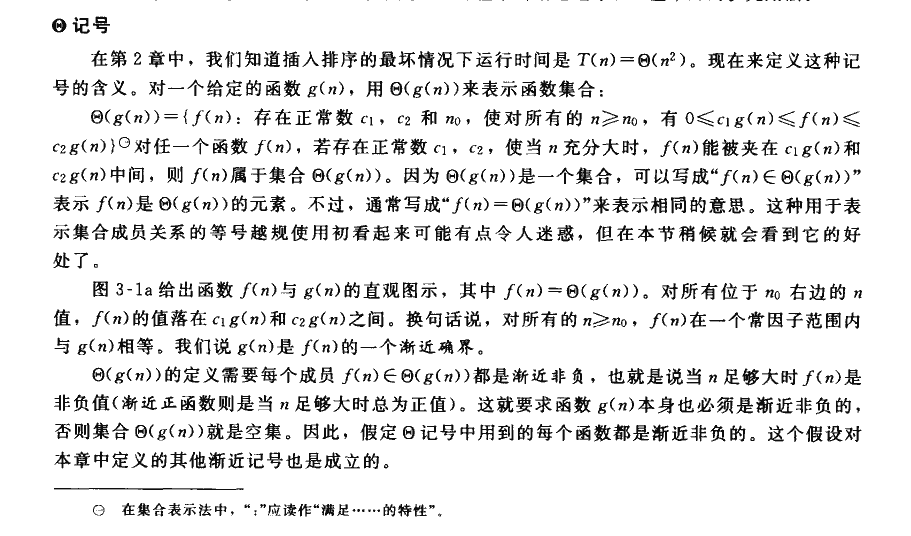
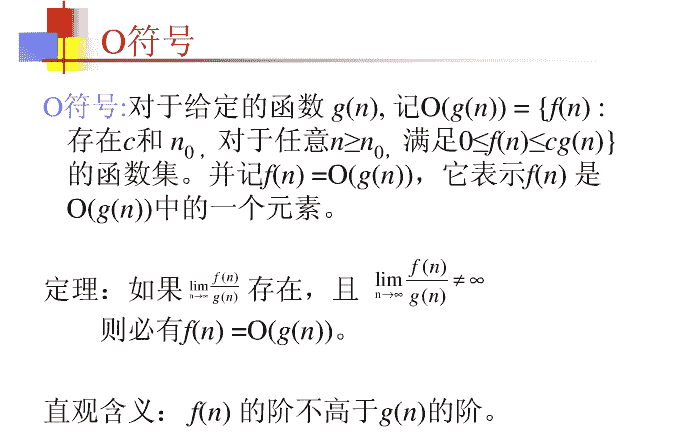
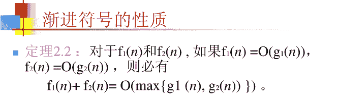
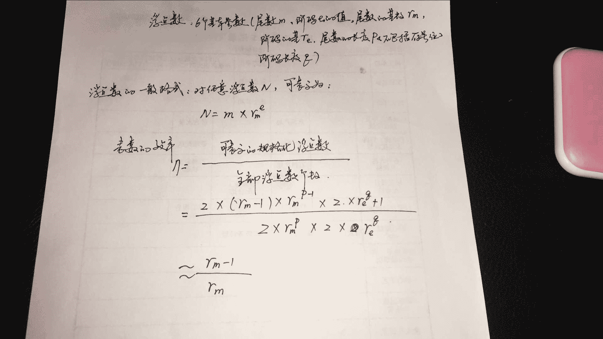
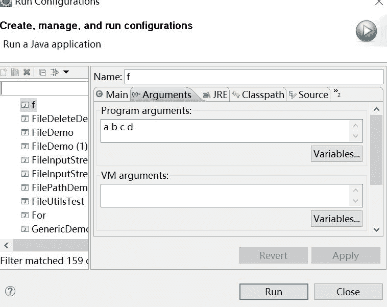
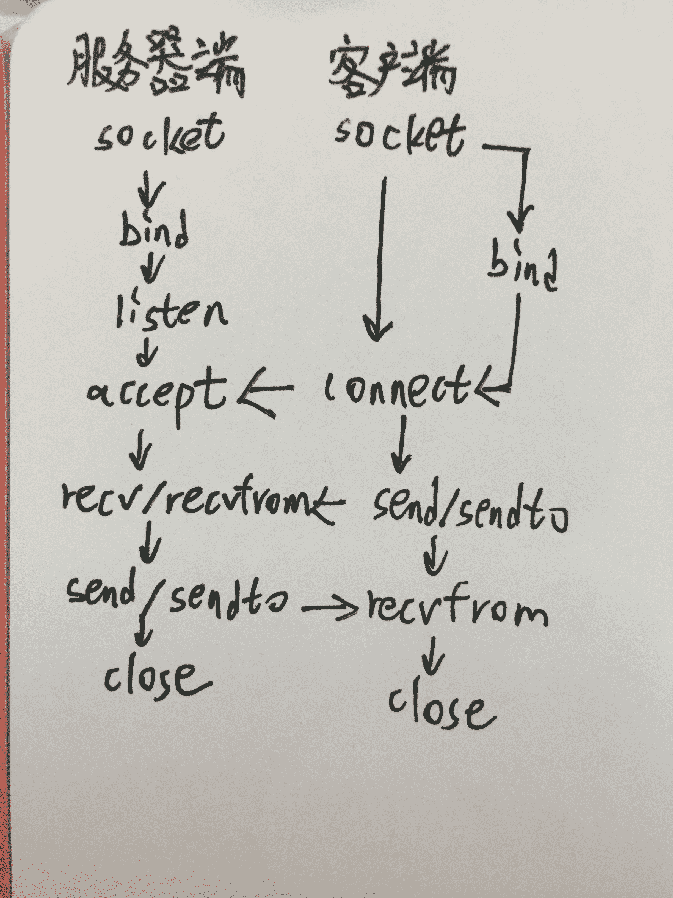

# 网易 2016 研发工程师笔试题

## 1

执行指令 find / -name "test.c"，按 Ctrl+Z 后的提示有[1] 166，可以继续将进程放到前台并唤醒执行的方式有（）

正确答案: C   你的答案: 空 (错误)

```cpp
kill 166
```

```cpp
Ctrl+h
```

```cpp
fg 1
```

```cpp
bg 1
```

本题知识点

Linux

讨论

[Nitpicking](https://www.nowcoder.com/profile/775608)

```cpp

	fg：将后台中的命令调至前台继续运行

		bg：将一个在后台暂停的命令，变成继续执行

			ctrl + z：可以将一个正在前台执行的命令放到后台，并且暂停

```

发表于 2016-03-02 09:32:19

* * *

[每天进步二点点](https://www.nowcoder.com/profile/759918)

可以 ***继续执行*** 的方式有（）这题问的已经很明显了。答案 A 肯定不对啊。
ctrl  z 就是挂起一个进程，暂停的意思
fg 是将进程放到前台并唤醒
bg 是将进程放到后台并唤醒
  *ctrl+h*,在 shell 就是向左删除的作用

发表于 2015-11-06 15:05:59

* * *

[牛客-120 抢救中心](https://www.nowcoder.com/profile/6165623)

杀的时候用%1

发表于 2018-07-30 15:17:05

* * *

## 2

记号 O 的定义正确的是（）

正确答案: A   你的答案: 空 (错误)

```cpp
O(g(n))=｛f(n)|存在正常数 c 和 n0 使得所有 n>=n0 有: 0<=f(n)<=cg(n)}
```

```cpp
O(g(n))={f(n)|对于任何正常数 c>0,存在正数和 n0>0 使得对所有 n>=n0 有:0<=cg(n)<f(n)}
```

```cpp
O(g(n))={f(n)|对于任何正常数 c>0,存在正数和 n0>0 使得对所有 n>=n0 有:0<=f(n)<cg(n)}
```

```cpp
O(g(n))={f(n)|存在正常数 c 和 n0 使得所有 n>=n0 有:0<=cg(n)<=f(n)}
```

本题知识点

复杂度

讨论

[SunburstRun](https://www.nowcoder.com/profile/557336)

[图]为了不让一些同学误导  查看全部)

编辑于 2015-11-02 07:54:33

* * *

[字节跳动 _ 服务端工程师](https://www.nowcoder.com/profile/271108)

定义，如果存在正常数 c 和 n0，使得当 N>=n0 时，T（N) <= cf(N)，则记为 T(N) = O(f(n))；这里只是颠倒过来了而已

发表于 2015-11-01 22:29:45

* * *

[Patron97](https://www.nowcoder.com/profile/8610466)

算法导论第二版的另一种说法

发表于 2018-04-27 08:48:02

* * *

## 3

根据关系数据库规范范理论，关系数据库中的关系要满足第一范式。例如一个表: dept 部门号  部门名    部门经理   部门成员 0001       销售部    zhangsan 李四,王五,赵六
在部门关系中，因哪个属性而使它不满足第一范式？（）

正确答案: D   你的答案: 空 (错误)

```cpp
部门号
```

```cpp
部门名
```

```cpp
部门总经理
```

```cpp
部门成员
```

本题知识点

数据库

讨论

[随心而动黎](https://www.nowcoder.com/profile/9843108)

第一范式(1NF)
定义：如  查看全部)

编辑于 2016-11-06 10:30:45

* * *

[炫](https://www.nowcoder.com/profile/376795)

数据项必须都是不可分的，部门成员是成员 1、成员 2，...，成员 n 的集合，是可分的

发表于 2015-10-31 17:54:06

* * *

[苏格拉底没有然丶](https://www.nowcoder.com/profile/571522)

```cpp
1、第一范式（1NF）
        在任何一个关系数据库中，第一范式（1NF）是对关系模式的基本要求，不满足第一范式（1NF）的数据库就不是关系数据库。
        所谓第一范式（1NF）是指数据库表的每一列都是不可分割的基本数据项，同一列中不能有多个值，即实体中的某个属性不能有多个值或者不能有重复的属性。如果出现重复的属性，就可能需要定义一个新的实体，新的实体由重复的属性构成，新实体与原实体之间为一对多关系。在第一范式（1NF）中表的每一行只包含一个实例的信息。例如，对于图 3-2 中的员工信息表，不能将员工信息都放在一列中显示，也不能将其中的两列或多列在一列中显示；员工信息表的每一行只表示一个员工的信息，一个员工的信息在表中只出现一次。简而言之，第一范式就是无重复的列。

2、第二范式（2NF）
       第二范式（2NF）是在第一范式（1NF）的基础上建立起来的，即满足第二范式（2NF）必须先满足第一范式（1NF）。第二范式（2NF）要求数据库表中的每个实例或行必须可以被唯一地区分。为实现区分通常需要为表加上一个列，以存储各个实例的唯一标识。如图 3-2 员工信息表中加上了员工编号（emp_id）列，因为每个员工的员工编号是唯一的，因此每个员工可以被唯一区分。这个唯一属性列被称为主关键字或主键、主码。
        第二范式（2NF）要求实体的属性完全依赖于主关键字。所谓完全依赖是指不能存在仅依赖主关键字一部分的属性，如果存在，那么这个属性和主关键字的这一部分应该分离出来形成一个新的实体，新实体与原实体之间是一对多的关系。为实现区分通常需要为表加上一个列，以存储各个实例的唯一标识。简而言之，第二范式就是非主属性非部分依赖于主关键字。

3、第三范式（3NF）
        满足第三范式（3NF）必须先满足第二范式（2NF）。简而言之，第三范式（3NF）要求一个数据库表中不包含已在其它表中已包含的非主关键字信息。例如，存在一个部门信息表，其中每个部门有部门编号（dept_id）、部门名称、部门简介等信息。那么在图 3-2 的员工信息表中列出部门编号后就不能再将部门名称、部门简介等与部门有关的信息再加入员工信息表中。如果不存在部门信息表，则根据第三范式（3NF）也应该构建它，否则就会有大量的数据冗余。简而言之，第三范式就是属性不依赖于其它非主属性。
```

发表于 2016-03-19 15:58:37

* * *

## 4

VC 提供一种被称为 Watch 的机制来观看变量和表达式的值，由于指针指向的数组，Watch 只能显示第一个元素的值，为了显示数组的后续内容，或者要显示一片内存的内容，可以使用（）功能

正确答案: A   你的答案: 空 (错误)

```cpp
Memory
```

```cpp
Regsters
```

```cpp
Conditions
```

```cpp
Varibles
```

本题知识点

开发工具

讨论

[牛客 863103 号](https://www.nowcoder.com/profile/863103)

转自一篇博客的解答，感谢作者  查看全部)

编辑于 2016-07-09 15:47:38

* * *

## 5

一个查询语句执行后显示的结果为：1 班 802 班 753 班 NULL，则最有可能的查询语句是（）

正确答案: B   你的答案: 空 (错误)

```cpp
SELECT AVG(成绩) FROM 成绩表 WHERE class<=3
```

```cpp
SELECT AVG(成绩) FROM 成绩表 WHERE class<=3 GROUP BY class
```

```cpp
SELECT AVG(成绩) FROM 成绩表 WHERE class<=3 order by class
```

```cpp
SELECT AVG(成绩) FROM 成绩表 HAVING class <=3 GROUP BY class
```

本题知识点

数据库

讨论

[牛客 470299 号](https://www.nowcoder.com/profile/470299)

where 子句对被选择的列施加条件，having 子句对 group by 子句所产生的组施加条件。

```cpp
SELECT column1, column2 FROM table1, table2
WHERE [ conditions ]
GROUP BY column1, column2
HAVING [ conditions ]
ORDER BY column1, column2
```

编辑于 2016-02-28 14:05:12

* * *

[fighting2016](https://www.nowcoder.com/profile/538753)

select 之后如果是聚合函数则 group by 分组会显示 null 的结果,而 order by 不会显示 null 的结果

发表于 2016-03-19 21:39:55

* * *

[字节跳动 _ 服务端工程师](https://www.nowcoder.com/profile/271108)

having 用在分组之后，

发表于 2015-11-01 22:31:29

* * *

## 6

以下关于渐进记号的性质是正确的有（）

正确答案: C   你的答案: 空 (错误)

```cpp
f(n)=O(g(n))<=> g(n)=O(f(n))
```

```cpp
f(n)=O(g(n)),g(n)=O(h(n))=> h(n)=O(f(n))
```

```cpp
f(n)=O(g(n)),g(n)=O(h(n))=> f(n)=O(h(n))
```

```cpp
O(f(n))+o(g(n))=O(min{f(n),g(n)})
```

本题知识点

编程基础 *讨论

[gendlee](https://www.nowcoder.com/profile/617149)

将表达式翻译成简单的逻辑句子：A.翻译成更简单的句子：f(n)的阶不高于 g(n)，等价于 g(n)的阶不高于 f(n)，当然不对；B.翻译成三年级数学： f(n)的阶不高于 g(n)，g(n) 的阶不高于 h(n),则 h(n) 的阶不高于 f(n)，显然不对吧。C.翻译： f(n)的阶不高于 g(n)，g(n) 的阶不高于 h(n),则 f(n) 的阶不高于 h(n)，当然正确。D.应该是： O(f(n))+o(g(n))=O(max{f(n),g(n)})，参考： 

编辑于 2015-11-07 17:12:40

* * *

[密林之战](https://www.nowcoder.com/profile/9529239)

说白了这题就是高数，针对 c 选项，f(n)=n²,g(n)=n4,h(n)=n6，其它选项也类似。

编辑于 2017-03-11 16:05:06

* * *

## 7

浮点数的尾数基值取 2，并采用隐含位表数方法，则这种浮点数的表数效率为()

正确答案: A   你的答案: 空 (错误)

```cpp
50%
```

```cpp
94%
```

```cpp
100%
```

```cpp
75%
```

本题知识点

编译和体系结构

讨论

[SunburstRun](https://www.nowcoder.com/profile/557336)

所以答案为 A

编辑于 2015-10-29 17:27:03

* * *

[hello 美女](https://www.nowcoder.com/profile/858605)

完全不会做，猜了 A

发表于 2016-08-01 16:38:20

* * *

[chchlh](https://www.nowcoder.com/profile/760870)

http://202.197.191.206:8080/22/content/chap2/section1/left06.htm 另外，我觉得隐含位和表数效率没有关系，表数效率只和基有关。不知道对不对。

编辑于 2016-03-01 20:46:07

* * *

## 8

用命令方式运行以下代码的运行结果是（）

```cpp
public class f{
    public static void main(String[] args){
        String foo1 = args[1];
        String foo2 = args[2];
        String foo3 = args[3];
    }
}
```

命令:  java f a b c

正确答案: C   你的答案: 空 (错误)

```cpp
程序编译错误
```

```cpp
a b c
```

```cpp
程序运行错误
```

```cpp
f
```

本题知识点

Java

讨论

[菜鸟葫芦娃](https://www.nowcoder.com/profile/415611)

C 运行 java 命令,没  查看全部)

编辑于 2016-11-03 16:55:31

* * *

[中华小菜鸟](https://www.nowcoder.com/profile/798916)

这题目出的太逗了，如果断章取义单执行这么个命令的话，那这命令根本跟程序挨不上边呀，至少题干应该给出 javac f.java 表示编译没问题呀，这样才能执行程序，不然完全不搭边

发表于 2015-12-04 12:57:26

* * *

[crazycoding](https://www.nowcoder.com/profile/184538)

public class f{    public static void main(String[] args){        String foo1 = args[1];        String foo2 = args[2];        String foo3 = args[3];        if (args.length == 0) {System.out.println("您调用 main 方法时没有指定任何参数！");return;}System.out.println("您调用 main 方法时指定的参数包括：");for (int i = 0; i < args.length; i++) {System.out.println("参数" + (i + 1) + "的值为：" + args[i]);}    }}事实证明 若输入给命令行输入四个参数 不会报错  这里 java T11 a b c 表示 运行 java 字节码文件 T11  参数为 a b c 只输入了三个参数，且 args 是数组下标从 0 开始，而程序中使用到 agrs[3]显然数组越界

发表于 2016-03-22 11:04:13

* * *

## 9

现有 4 个同时到达的作业 J1,J2,J3 和 J4,它们的执行时间分别是 1 小时，3 小时，5 小时，7 小时，系统按单道方式运行且采用短作业优先算法，则平均周转时间是（）小时

正确答案: C   你的答案: 空 (错误)

```cpp
6
```

```cpp
5
```

```cpp
7.5
```

```cpp
4
```

本题知识点

操作系统

讨论

[菜鸟葫芦娃](https://www.nowcoder.com/profile/415611)

谁短谁先执行因为是同时到达即提交时间一样 

| 执行次序 | 提交时间 | 执行时间 | 开始时间 | 完成时间 | 周转时间 |
| J1 | 0 | 1 | 0 | 1 | 1 |
| J2 | 0  | 3 | 1 | 4 | 4 |
| J3 | 0  | 5 | 4 | 9 | 9 |
| J4 | 0 | 7 | 9 | 16 | 16 |

平均时间为:(1+4+9+16)/4=30/4=7.5

发表于 2015-10-29 17:13:10

* * *

[夏雨天](https://www.nowcoder.com/profile/710633)

区分一下两个概念：平均等待时间：将所有作业的运行时间加起来除以总的作业数 （1+3+5+7）/4=4 平均周转时间：将所有作业运行的时间和等待的时间全部加起来除以作业数，这四个作业的等待时间分别是：0,1,4，9（1+3+5+7+0+1+4+9）/4=7.5

发表于 2016-03-18 19:55:37

* * *

[徘徊的路人甲](https://www.nowcoder.com/profile/220510)

谁短谁先执行，所以执行顺序为 J1 J2 J3 J4，J1 执行完时间为 1,轮到 J2 执行时，前面已经过了一小时，所以 J2 执行完时间为 1+3 =4，同理，平均周转时间为 （1  + （1+3）  + （1+3+5 ）+ （ 1+3+5+7））/4=7.5

发表于 2016-03-03 16:36:03

* * *

## 10

mysql 中查看 SQL 模式的命令是（）

正确答案: A C D   你的答案: 空 (错误)

```cpp
select @@global.sql_mode
```

```cpp
select global.sql_mode
```

```cpp
select @@sql_mode
```

```cpp
select @@session.sql_mode
```

本题知识点

数据库

讨论

[牛客 6666666 号](https://www.nowcoder.com/profile/968434)

MySQL 数据库中，变量分为 系统变量（以"@@"开头）和用户自定义变量。系统变量分为全局系统变量(global)和会话系统变量(session)。**@@global  **   仅用于访问全局系统变量的值；**@@session**  仅用于访问会话系统变量的值；**@@**              先访问会话系统变量的值，若不存在则去访问全局系统变量的值；sql_mode 为系统变量，既是全局系统变量，又是会话系统变量。题中 A,C,D 均正确。

发表于 2016-03-15 17:26:41

* * *

[AceXIE⎝≧⏝⏝≦⎠](https://www.nowcoder.com/profile/500378)

嗯，    sql_mode 为系统变量，既是全局系统变量，又是会话系统变量。ACD

```cpp
mysql> select @@sql_mode;
+------------+
| @@sql_mode |
+------------+
|            |
+------------+
1 row in set (0.00 sec)

mysql> select @@global.sql_mode;
+-------------------+
| @@global.sql_mode |
+-------------------+
|                   |
+-------------------+
1 row in set (0.00 sec)

mysql> select @@session.sql_mode;
+--------------------+
| @@session.sql_mode |
+--------------------+
|                    |
+--------------------+
1 row in set (0.00 sec)
```

编辑于 2016-03-22 15:09:14

* * *

[牛客-68](https://www.nowcoder.com/profile/7634665)

MySQL 数据库中，变量分为 系统变量（以"@@"开头）和用户自定义变量。系统变量分为全局系统变量(global)@@global     用于访问全局系统变量的值；会话系统变量(session)@@session  用于访问会话系统变量的值；@@              先访问会话系统变量的值，若不存在则去访问全局系统变量的值；sql_mode 为系统变量，既是全局系统变量，又是会话系统变量。

发表于 2017-03-15 17:01:38

* * *

## 11

在工程网络计划中，工作 M 的最早开始时间为第 16 天，其持续时间为 5 天。该工作有三项紧后工作，他们的最早开始时间分别为第 25 天、第 27 天和第 30 天，最迟开始时间分别为第 28 天、第 29 天和第 30 天。则工作 M 的总时差为（）天。

正确答案: B   你的答案: 空 (错误)

```cpp
9
```

```cpp
7
```

```cpp
6
```

```cpp
5
```

本题知识点

图

讨论

[chchlh](https://www.nowcoder.com/profile/760870)

题目问的都是工作 M：  查看全部)

编辑于 2016-04-16 15:49:05

* * *

[FlyingMe](https://www.nowcoder.com/profile/528212)

总时差 TF（Total Float ）指一项工作在不影响总工期的前提下所具有的机动时间，即用最迟完成时间与最早完成时间之差，28-（16+5）=7
自由时差=25-（16+5）=4

发表于 2016-03-15 17:06:28

* * *

[菜鸟葫芦娃](https://www.nowcoder.com/profile/415611)

对于有紧后工作的工作，其自由时差等于本工作之紧后工作最早开始时间减本工作最早完成时间所得之差的最小值，即：自由时差＝28－（16＋5）＝7 天。

发表于 2015-10-29 17:17:01

* * *

## 12

某公司申请到一个 C 类 IP 地址，但要连接 6 个的子公司，最大的一个子公司有 26 台计算机，每个子公司在一个网段中，则子网掩码应设为（）

正确答案: D   你的答案: 空 (错误)

```cpp
255.255.255.192
```

```cpp
255.255.255.128
```

```cpp
255.255.255.0
```

```cpp
255.255.255.224
```

本题知识点

网络基础

讨论

[cryViking](https://www.nowcoder.com/profile/952407)

首先题目问的是一个子公司的网络内，子网掩码是什么。不要理解错题意。一个子公司 26 台机器，2⁵ = 32，刚好够用，所以 IP 地址最后 8 位里的后 5 位用作子网内区分的地址。前 3 位就是子网掩码了，即 11100000，即 224。选 D，255.255.255.224

编辑于 2016-03-21 10:17:14

* * *

[菜鸟葫芦娃](https://www.nowcoder.com/profile/415611)

最大的子公司有 26 台计算机，可确认主机位数。2⁴<26<2⁵，估主机位最少应有 5 位，网络位为 27 位。C 类默认的网络号为 24 位，27-24=3 位为子网号，2³=8,除过全 1 和全 0 的子网号不能用，则可用的子网有 6 个，满足条件。所以子网掩码应设为 255.255.255.224

发表于 2015-10-29 17:18:33

* * *

[牛牛的 L](https://www.nowcoder.com/profile/733646395)

C 类地址  255.255.255.xxx 子网掩码 11111111.11111111.11111111.子网网络号+主机号（一共 8 位）子网网络号根据子公司数 2³>6    111 主机号根据计算机台数    2⁵-2>26   00000 所以子网掩码  11111111.11111111.11111111.11100000 即 255.255.255.224。

发表于 2020-06-25 19:44:19

* * *

## 13

```cpp
#include<iostream>
using namespace std;
class TestClass{
	char x;
public:
	TestClass() { cout << 'A'; }
	TestClass(char c) { cout << c; }
	~TestClass() { cout << 'B'; }
};
int main() {
	TestClass p1, *p2;
	p2 = new TestClass('X');
	delete p2;
	return 0;
}
```

执行这个程序的结果是（）

正确答案: B   你的答案: 空 (错误)

```cpp
XB
```

```cpp
AXBB
```

```cpp
AAXB
```

```cpp
AAXBBB
```

本题知识点

C++

讨论

[Pandora](https://www.nowcoder.com/profile/266279)

//类指针的声明，是不会调用  查看全部)

编辑于 2015-12-15 10:46:09

* * *

[huixieqingchun](https://www.nowcoder.com/profile/551201)

**类指针的声明不会调用构造函数，但指向一个类实例会调用构造函数。类的声明也会调用构造函数。**

发表于 2016-08-01 10:15:52

* * *

[lee1992](https://www.nowcoder.com/profile/166044)

这里把构造函数重载，所以 p1 执行的默认构造函数打印 A，p2 执行的是重载后的构造函数打印 X，然后 delete p2 调用析构，主函数结束后再调用一次析构函数析构 P1

发表于 2015-12-14 17:22:43

* * *

## 14

磁盘阵列需要的配置文件和逻辑设备是（）

正确答案: C   你的答案: 空 (错误)

```cpp
raidtab 与 hda0
```

```cpp
Raid.conf 与 sdc0
```

```cpp
Raidtab 与 md0
```

```cpp
Raid.conf 与 md0
```

本题知识点

编译和体系结构

讨论

[QPeng](https://www.nowcoder.com/profile/959956)

  查看全部)

编辑于 2016-04-02 11:36:49

* * *

[warrior_shadow](https://www.nowcoder.com/profile/172321)

/bin：存放最常用命令；
/boot：启动 Linux 的核心文件；
/dev：设备文件；
/etc：存放各种配置文件；
/home：用户主目录；
/lib：系统最基本的动态链接共享库；
/mnt：一般是空的，用来临时挂载别的文件系统；
/proc：[虚拟目录](https://www.baidu.com/s?wd=%E8%99%9A%E6%8B%9F%E7%9B%AE%E5%BD%95&tn=SE_PcZhidaonwhc_ngpagmjz&rsv_dl=gh_pc_zhidao)，是内存的映射；
/sbin：系统管理员命令存放目录；
/usr：最大的目录，存许应用程序和文件；
/usr/X11R6：[X-Window](https://www.baidu.com/s?wd=X-Window&tn=SE_PcZhidaonwhc_ngpagmjz&rsv_dl=gh_pc_zhidao)目录；
/usr/src：Linux 源代码；
/usr/include：系统头文件；
/usr/lib：存放常用动态链接共享库、静态档案库；

发表于 2018-07-11 11:28:46

* * *

[zetn](https://www.nowcoder.com/profile/200040)

一楼解析真是厉害了。。。

发表于 2018-03-17 15:08:51

* * *

## 15

tcp 套接字中不会阻塞的是？

正确答案: D   你的答案: 空 (错误)

```cpp
read
```

```cpp
write
```

```cpp
accept
```

```cpp
bind
```

本题知识点

网络基础

讨论

[Ccola](https://www.nowcoder.com/profile/825067)

哪里会阻塞已经一目了然了吧

发表于 2016-08-11 11:17:28

* * *

[达文东](https://www.nowcoder.com/profile/564089)

首先，服务器端启动进程，调用 Socket 创建一个基于 TCP 协议的流套接字描述符。

其次，服务进程调用 bind 命名套接字，将套接字描述符绑定到本地地址和本地端口上。

再次，服务器端调用 listen，开始侦听客户端的 Socket 连接请求。接下来阻塞，直到收到了客户端的 connect 请求，调用 accept 进行相应。因此，不阻塞 bind 和 listen

发表于 2015-11-09 17:33:34

* * *

[QPeng](https://www.nowcoder.com/profile/959956)

转～ 首先，服务器端启动进程，调用 Socket 创建一个基于 TCP 协议的流套接字描述符。 其次，服务进程调用 bind 命名套接字，将套接字描述符绑定到本地地址和本地端口上。 再次，服务器端调用 listen，开始侦听客户端的 Socket 连接请求。 接下来阻塞，直到收到了客户端的 connect 请求，调用 accept 进行相应。 因此，不阻塞 bind 和 listen

发表于 2016-03-03 23:28:08

* * **