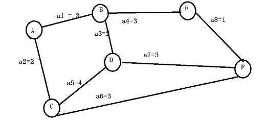

# 爱奇艺 2016 研发工程师笔试题（三）

## 1

16,27,16,(),1

正确答案: B   你的答案: 空 (错误)

```cpp
7
```

```cpp
5
```

```cpp
6
```

```cpp
8
```

本题知识点

智力题

讨论

[与子成说](https://www.nowcoder.com/profile/487252)

以上的数字分别是 2⁴ ,3³ ,4² ,5¹ ,6⁰

发表于 2015-10-30 15:40:46

* * *

[起个名是真的难](https://www.nowcoder.com/profile/650572649)

2⁴,3³,4²,5¹,1⁵ 每一组数字相加都等于 6

发表于 2019-05-13 20:15:04

* * *

[tonny](https://www.nowcoder.com/profile/284332)

B 2⁴ 3³ 4² 5¹ 6⁰

发表于 2015-10-30 20:18:55

* * *

## 2

153,179,227,321,533,()

正确答案: C   你的答案: 空 (错误)

```cpp
789
```

```cpp
1229
```

```cpp
1079
```

```cpp
919
```

本题知识点

智力题

讨论

[大睡侠](https://www.nowcoder.com/profile/138329)

150+3¹=153 170+3²=179 200+3³=227 240+3⁴=321 290+3⁵=533 350+3⁶=1079 真变态

发表于 2015-11-06 21:37:20

* * *

[枯萎的海风](https://www.nowcoder.com/profile/274211)

发下自己的思路， 对相互两个数据做差， 直到剩下两个数据 24， 72， 猜想他们之间应该是 3 倍关系， 然后再依次向上推导得到 选项 C


发表于 2016-01-05 22:34:38

* * *

[电子文](https://www.nowcoder.com/profile/705833)

C：：150+3 的 1=153；           170+3 的 2=179；             200+3 的 3=227；                ·············

发表于 2015-10-30 16:41:38

* * *

## 3

设有数组 A[i,j],数组的每个元素长度为 3 字节，i 的值为 1 到 8，j 的值为 1 到 10，数组从内存首地址 BA 开始顺序存放，当用以列为主存放时，元素 A[5,8]的存储首地址为()。

正确答案: A   你的答案: 空 (错误)

```cpp
BA+180
```

```cpp
BA+225
```

```cpp
BA+222
```

```cpp
BA+141
```

本题知识点

数组

讨论

[飞翔 zhi 梦](https://www.nowcoder.com/profile/138555)

|   | 1 | 2 | 3 | 4 | 5 | 6 | 7 | 8 | 9 | 10 |
| 1 | 前 | 前 | 前 | 前 | 前 | 前 | 前 | 前 | 后 | 后 |
| 2 | 前 | 前 | 前 | 前 | 前 | 前 | 前 | 前 | 后 | 后 |
| 3 | 前 | 前 | 前 | 前 | 前 | 前 | 前 | 前 | 后 | 后 |
| 4 | 前 | 前 | 前 | 前 | 前 | 前 | 前 | 前 | 后 | 后 |
| 5 | 前 | 前 | 前 | 前 | 前 | 前 | 前 | 这里 | 后 | 后 |
| 6 | 前 | 前 | 前 | 前 | 前 | 前 | 前 | 后 | 后 | 后 |
| 7 | 前 | 前 | 前 | 前 | 前 | 前 | 前 | 后 | 后 | 后 |
| 8 | 前 | 前 | 前 | 前 | 前 | 前 | 前 | 后 | 后 | 后 |

计算 A[5,8]的地址就等于计算在 A[5,8]之前（“前”）保存的所有变量的地址偏移量 。（（7*8+5）-1）*3 = 180

发表于 2015-10-30 19:49:04

* * *

[Aimer](https://www.nowcoder.com/profile/867963)

让我来终结连错 3 道类似题的噩梦:多加注意 i,j 的起始数值是从 1 开始的 Amn, m 对应行， n 对应列行优先: Loc(aij) = Loc(a11) +[（i-1）*n + j-1 ]*sizeof(元素)列优先: Loc(aij) = Loc(a11) + [(j-1)*m + i-1]*sizeof(元素)这道题 m = 8 , n = 10 ; i = 5 , j = 8 列优先 Loc(aij) = BA + [(8-1)*8 + 5-1]*3 = BA + 180

编辑于 2015-11-21 13:43:09

* * *

[牛客 787908 号](https://www.nowcoder.com/profile/787908)

看题目是用以列为主存放，还是以行为主存放
本题目是按照以列为主存放的，那么计算方法如下：（8*7+5-1）*3=180 
如果按照以行为主存放时，那么计算方法如下：（4*10+8-1）*3=141

发表于 2016-01-06 10:19:15

* * *

## 4

已知数据元素为(34,76,45,18,26,54,92,65)，按照依次插入节点的方法生成一棵二叉排序树，则该树的深度（根深度为 1）为()

正确答案: D   你的答案: 空 (错误)

```cpp
7
```

```cpp
6
```

```cpp
4
```

```cpp
5
```

本题知识点

树

讨论

[飞翔 zhi 梦](https://www.nowcoder.com/profile/138555)


编辑于 2015-12-05 11:55:10

* * *

[笨拙的小 Q](https://www.nowcoder.com/profile/220450)

根据二叉排序树的性质：
（1）若左子树不空,则左子树上所有结点的值均小于它的根结点的值；
（2）若右子树不空,则右子树上所有结点的值均大于它的根结点的值；
（3）左、右子树也分别为二叉排序树；所以根据性质：第一个数 34 为根节点；第二个树：76>34,所以为 34 的右孩子；第三个数 45：因为 34<45<76，所以 45 为 76 的左孩子；第 4 个数 18：18<34 所以为根节点的左孩子；第五个数 26：因为 18<26<34,所以 26 在根节点的左子树上且为节点 18 的右孩子；第六个数 54：因为 54>34，所以在根节点的右子树上，又 45<54<76,所以 54 为 45 的右孩子；第 7 个数 92：因为 92>76>34,所以 92 为 76 的右孩子；第 8 个数 65：首先 64>34,所以为右子树上的节点，又 65<76,所以为 76 左子树上的节点，又 65>54>45,所以为 54 的右孩子。

发表于 2016-06-22 09:45:03

* * *

[多磨](https://www.nowcoder.com/profile/106545629)


发表于 2020-08-09 21:47:54

* * *

## 5

对关键码序列 28,16,32,12,60,2,5,72 快速排序，从小到大一次划分结果为()

正确答案: A   你的答案: 空 (错误)

```cpp
(5,16,2,12)28(60,32,72)
```

```cpp
(2,5,12,16)28(60,32,72)
```

```cpp
(2,16,12,5)28(60,32,72)
```

```cpp
(5,16,2,12)28(32,60,72)
```

本题知识点

排序 *讨论

[飞翔 zhi 梦](https://www.nowcoder.com/profile/138555)


编辑于 2015-10-30 20:29:51

* * *

[XuHuaiyu](https://www.nowcoder.com/profile/667298)

快排这类题目为什么会有固定答案呀。。 这个跟具体实现应当是相关的 求问下正常该使用那种思路做这种题哇～

发表于 2016-03-08 09:04:12

* * *

[不会](https://www.nowcoder.com/profile/7100005)

快排说简单了就是：从最右找到第一个小于 poviot 的数，与之交换；然后再从最左找到第一个大于 poviot 的数，与之交换；这样循环往复，直到 poviot 右边的数都大于左边，左边的数都大于右边

发表于 2016-09-04 09:37:11

* * *

## 6

用三叉链表作二叉树的存储结构，当二叉树中有 n 个结点时，有()个空指针。

正确答案: C   你的答案: 空 (错误)

```cpp
n+1
```

```cpp
n
```

```cpp
n+2
```

```cpp
n-1
```

本题知识点

树

讨论

[Pandora](https://www.nowcoder.com/profile/266279)

三叉链表每个节点有三个指针域（左、亲、右），共 3n 个指针。其中非空指针=亲（n-1 个，因为根节点没有双亲）+左右（n-1，因为 n 个节点的二叉树有 n-1 条边）=2n-2；所以空指针=3n-(2n-2)=n+2。

发表于 2015-10-30 16:27:35

* * *

[神说](https://www.nowcoder.com/profile/474929)

三叉链表，每个节点有三个指针，左孩子，右孩子，父节点。对于有 n 个节点的树结构，有 n-1 条边，每条边是孩子节点指向父节点的指针，也是父节点指向孩子节点的孩子指针， 所以一共是 2(n-1)个指针，总的指针就是 3n-2(n-1)=n+2

发表于 2015-11-02 11:09:24

* * *

[心静](https://www.nowcoder.com/profile/437950)

三叉链表是二叉树的另一种主要的链式存储结构。三叉链表与二叉链表的主要区别在于，它的结点比二叉链表的结点多一个指针域，该域用于存储一个指向本结点双亲的指针。三叉链表的结点形式如下： 

发表于 2015-10-31 21:43:57

* * *

## 7

输入序列是 ABC,输出序列变为 BCA 时，经过的栈操作为()

正确答案: B   你的答案: 空 (错误)

```cpp
push,push,push,pop,pop,pop
```

```cpp
push,push,pop,push,pop,pop
```

```cpp
push,pop,push,push,pop,pop
```

```cpp
push,push,pop,pop,push,pop
```

本题知识点

栈 *讨论

[zhisheng_blog](https://www.nowcoder.com/profile/616717)


发表于 2016-09-15 22:48:12

* * *

[飞翔 zhi 梦](https://www.nowcoder.com/profile/138555)

1.pushA

| A |

2.pushB

| B |
| A |

3.popB

| A |

4.pushC

| C |
| A |

5.popC

| A |

6.popA

编辑于 2015-10-30 20:27:33

* * *

[--sgf--](https://www.nowcoder.com/profile/8882859)

简单推理一遍即可，push 为入栈，pop 为出栈。

发表于 2022-01-09 15:09:59

* * *

## 8

下面关于求关键路径的说法不正确的是()

正确答案: A   你的答案: 空 (错误)

```cpp
一个事件的最迟开始时间为以该事件为尾的弧的活动最迟开始时间与该活动的持续时间的差
```

```cpp
求关键路径是以拓扑排序为基础的
```

```cpp
一个事件的最早开始时间同以该事件为尾的弧的活动最早开始时间相同
```

```cpp
关键活动一定位于关键路径上
```

本题知识点

图

讨论

[Aimer](https://www.nowcoder.com/profile/867963)


节点代表事件，边代表活动边，都是从左-> 右， 即，  a3 对应的是 <B,D> B->D 这个方向该 AOE 网络的源点为 A, 汇点为 F -----事件 D 的最早发生时间：从源点 A 开始到达 D 的所有路径加和的最大值 max{<a1,a3>,<a2,a5>} = 6 事件 D 的最迟发生时间 ： 首先求出汇点 F  的最早发生时间 max{<a1,a4,a8>,<a1,a3,a7>,<a2,a5,a7>,<a2,a6>} = 8 汇点 F 的最早发生时间 - max{汇点逆向到事件 D 的路径累加之和} = 8- max{<a7>} = 5----活动 a3<B,D>的最早发生时间: 以 a3 该活动为出发点的事件 B---a3--->D ， 即， B 事件的最早发生时间；最迟发生时间：以 a3 该活动对应的箭头所指向的事件的最迟发生时间 - a3 活动持续时间 B---a3--->D ， 即， D 事件的最迟发生时间 - a3 活动的持续时间 = 5 - 2 = 3 -----综上所述，最早发生时间，事件=活动，是从前往后计算最迟发生时间，都是从后往前计算，事件最迟发生时间与汇点和路径累加有关，事件的时间计算要先于活动的时间计算活动最迟发生时间与活动持续时间有关

发表于 2015-11-21 15:01:35

* * *

[心静](https://www.nowcoder.com/profile/437950)

工作最迟开始时间 LSii(LatestStartTime)——是指在不影响整个任务按期完成的前提下，本工作必须开始的最迟时刻。**工作的最迟开始时间等于工作最迟完成时间与其持续时间之差。**工作最早开始时间 ESii(EarliestStartTime)——是指在其所有前面工作全部完成后，本工作有可能开始的最早时刻。关键路径，AOE 网中，从事件 i 到 j 的路径中，加权长度最大者称为 i 到 j 的关键路径（Critical Path）， 显然，关键路径决定着 AOE 网的工期，关键路径的长度就是 AOE 网代表的工程所需的最小工期。关键活动，若活动 ak 的最大可利用时间等于 0（即(l(k)=e(k)），则称 ak 为关键活动，否则为非关键活动。 显然，关键活动的延期，会使整个工程延期。但非关键活动不然，只要它的延期量不超过它的最大可利用时间，就不会影响整个工期。**换句话说，即关键活动一定位于关键路径上。**

发表于 2015-10-31 22:00:06

* * *

[左庶长](https://www.nowcoder.com/profile/6941563)

做这题要注意几点概念：
1）顶点表示事件，弧表示活动
2）如果顶点 A->B 有弧，如果让弧表示为 L，则 A 为 L 的弧尾，B 为 L 的弧头，即有箭头的那一端叫头。
一个事件的最早开始时间同以该事件为尾的弧的活动最早开始时间相同
一个事件的最迟开始时间为以该事件为头的弧的活动最迟开始时间与该活动的持续时间的差

发表于 2018-01-10 11:28:14

* * *

## 9

已知关键字序列 5,8,12,19,28,20,15,22 是最小堆，插入关键字 3，调整后得到的最小堆是()

正确答案: D   你的答案: 空 (错误)

```cpp
3,8,12,5,20,15,22,28,19
```

```cpp
3,5,12,19,20,15,22,8,28
```

```cpp
3,12,5,8,28,20,15,22,19
```

```cpp
3,5,12,8,28,20,15,22,19
```

本题知识点

堆

讨论

[菜鸟创客](https://www.nowcoder.com/profile/837774)

|   |   |   |   |   |   |   |  |

  查看全部)

编辑于 2015-12-03 14:07:40

* * *

[牛百](https://www.nowcoder.com/profile/861706)


发表于 2016-10-11 19:08:51

* * *

[WillWu](https://www.nowcoder.com/profile/893824)


发表于 2016-07-14 11:02:06

* * *

## 10

```cpp
void func()
{
   char b[2]={0};
   strcpy(b,"aaaa");
}
```

以下说法那个正确()

正确答案: A   你的答案: 空 (错误)

```cpp
Debug 版崩溃，Release 版正常
```

```cpp
Debug 版正常，Release 版崩溃
```

```cpp
Debug 版崩溃，Release 版崩溃
```

```cpp
Debug 版正常，Release 版正常
```

本题知识点

C++ C 语言

讨论

[心静](https://www.nowcoder.com/profile/437950)

因为在 Debug 中有 ASSERT 断言保护，所以要崩溃，而在 Release 优化中就会删掉 ASSERT,所以会出现正常运行。但是不推荐如此做，因为这样会覆盖不属于自己的内存，这是搭上了程序崩溃的列车，即未定义行为，出现什么后果都有可能的，程序员的职责是保证不越界，而不是追问越界之后会发生什么。就像生活中违法不一定立刻被抓，但是迟早是要被抓的。

发表于 2015-10-31 22:51:24

* * *

[坚持自信的疯兔子](https://www.nowcoder.com/profile/587694)

assert 含义是断言，它是标准 C++的 cassert 头文件中定义的一个宏，用来判断一个条件表达式的值是否为 ture,如果不为 true, 程序会终止，并且报告出错误，这样就很容易将错误定位 通常我们开发的程序有 2 种模式:Debug 模式和 Release 模式 1\. 在 Debug 模式下,编译器会记录很多调试信息,也可以加入很多测试代码,比如加入断言 assert， 方便我们程序员测试,以及出现 bug 时的分析解决 2. Release 模式下,就没有上述那些调试信息,而且编译器也会自动优化一些代码,这样生成的程序性能是最优的,但是如果出现问题,就不方便分析测试了

发表于 2016-03-24 21:23:11

* * *

[huixieqingchun](https://www.nowcoder.com/profile/551201)

**在 debug 时，有 assert 断言保护，而在 release 时，没有 assert 断言。**

发表于 2016-05-18 22:13:33

* * ***