# 三百六十、公司 2016 数据挖掘笔试题

## 1

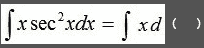

正确答案: A   你的答案: 空 (错误)

```cpp
tan(x)
```

```cpp
sec²(x)
```

```cpp
-tan(x)
```

```cpp
-sec²(x)
```

本题知识点

组合数学 *讨论

[中汇信息技术最牛逼](https://www.nowcoder.com/profile/208244)

吓出一身冷汗。。。

发表于 2016-04-15 23:03:43

* * *

[天天天藍](https://www.nowcoder.com/profile/905667)

看来高数也不是白学的嘛

发表于 2016-05-06 21:54:41

* * *

[MicroIndie](https://www.nowcoder.com/profile/2929734)

```cpp

	(a/b)'=(a'*b-a*b')/(b²)

	tan'x=(sinx/cosx)'=(sin'x*cosx-sinx*cos'x)/(cosx)²=(1/cosx)²=(secx)²

```

发表于 2016-10-26 13:40:45

* * *

## 2

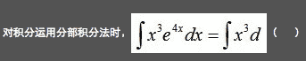

正确答案: C   你的答案: 空 (错误)

```cpp
4*e⁴x
```

```cpp
e⁴x
```

```cpp
1/4*e⁴x
```

```cpp
4e⁴x
```

本题知识点

编程基础 *讨论

[RenaissanceWhy](https://www.nowcoder.com/profile/2491161)

这明明是微积分，跟编程基础有一毛钱关系

发表于 2017-07-21 19:33:12

* * *

[走在不归路上](https://www.nowcoder.com/profile/741744)

首先前面的系数肯定是 1/4，C 选项最接近，可是 C 中的 x 代表乘号还是未知数 x 有点歧义，如果代表乘号就是正确的。合理的写法就应该是去掉 x，直接写成 1/4 e⁴x

发表于 2015-12-10 17:38:43

* * *

[钉子](https://www.nowcoder.com/profile/506749)

那个是变量 X 还是乘号 x？感觉应该写成（1/4）e⁴x 比较好！！

发表于 2015-11-10 20:50:48

* * *

## 3


正确答案: D   你的答案: 空 (错误)

```cpp
-2，2
```

```cpp
3，-3
```

```cpp
-3，3
```

```cpp
2，-2
```

本题知识点

数理统计 统计学 概率论与数理统计

讨论

[牛客 141215 号](https://www.nowcoder.com/profile/853009)

原式记为：P*dx* + Q*dy*，某二元函数记为 f(x,y)，因为原式为全微分，所以 P 是 f(x,y)对 x 的偏导，Q 是 f(x,y)对 y 的偏导。由求偏导与次序无关定理（即：f''[xy] = f''[yx]），所以 P 对 y 的导数等于 Q 对 x 的导数，然后对应系数相等即可。简单记为：**P 对 y 的导数等于 Q 对 x 的导数**

发表于 2016-02-21 09:49:47

* * *

[luya](https://www.nowcoder.com/profile/952854)

假设原函数为 f(x,y)，题中的式子是 f(x,y)的全微分， 记为：P *dx*  + Q *dy* ，其中 P 是 f(x,y)对 x 的偏导，Q 是 f(x,y)对 y 的偏导，从偏导式子反推得到其积分式子 f(x,y)= x²y^(3 )- y²sinx + y，所以 P= 2xy³ - y²cosx，Q=3x²y² -2ysinx + 1。对照题中的式子可得 a=2，b= -2.

发表于 2016-06-21 20:23:28

* * *

[circle005](https://www.nowcoder.com/profile/941690)

答案为 D，格林公式

*   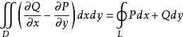

对应值求导，再比较系数相等就可以了

发表于 2015-11-02 15:38:19

* * *

## 4

在目标识别中，假定类型 1 为敌方目标，类型 2 为诱饵（假目标），已知先验概率 P(1)=0.2 和 P(2)=0.8，类概率密度函数如下：则总错误概率为 P(e)为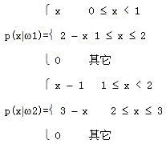

正确答案: A   你的答案: 空 (错误)

```cpp
0.08
```

```cpp
0.09
```

```cpp
0.11
```

```cpp
0.1
```

本题知识点

数理统计 概率论与数理统计

讨论

[liyijia](https://www.nowcoder.com/profile/983199)

应用贝叶斯最小误判概率准则  查看全部)

编辑于 2016-03-23 21:46:34

* * *

[络羽](https://www.nowcoder.com/profile/567620)

公式 1：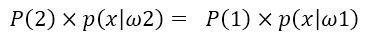
由公式 1，可得到两类的分界 x = 1.2 公式 2：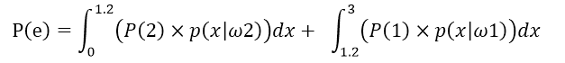
而公式 2 即为总错误概率求解公式。本题为两类问题，当 P(1)p(x|w1) > P(2)p(x|w2)时，x 被划分到第一类；反之，划分到第二类。那么，错误情况就可以分为两种，x 实际属于第一类，但是 P(1)p(x|w1) < P(2)p(x|w2)，被算法判别成了第二类。在这种情况下，犯错的概率就是，在 0~1.2 区间上第二类出现的概率，即 P(2)p(x|w2)，积分得到前半部分结果，计算值为 0.016 同理，可计算得到后一部分的结果 0.064 两部分相加，即可求出 0.08，选项 A 正确。

发表于 2016-09-14 18:17:17

* * *

[Pis](https://www.nowcoder.com/profile/758219)

 p（x/w1）P(w1) = p（x/w2）P(w2)（2-x) *0.2 = (x -1 )*0.8x=1.2

发表于 2016-03-28 14:54:28

* * *

## 5

设随机变量 X，Y 不相关，且 EX=2，EY=1,DX=3，则 E(X(X+Y-2))=()

正确答案: D   你的答案: 空 (错误)

```cpp
-3
```

```cpp
3
```

```cpp
-5
```

```cpp
5
```

本题知识点

概率统计 *讨论

[SunburstRun](https://www.nowcoder.com/profile/557336)

答案是 D  查看全部)

编辑于 2015-11-03 10:32:00

* * *

[gendlee](https://www.nowcoder.com/profile/617149)

这道题关键知识点：1)当 X,Y 无关（协方差和相关系数为 0），有**E(XY)=E(X)E(Y)**;2）**D(X)=E(X²)-(E(X))²**,**→**E(X²)=D(X)+ (E(X))² 所以，E(X(X+Y-2))=E(X²)+E(XY)-2E(X)=3+2²+2*1-2*2=5 故选答案**D**

发表于 2015-11-22 18:55:53

* * *

[Woods](https://www.nowcoder.com/profile/329815)

    E(X(X+Y-2)) =  E(X² + XY -2X)=  E(X ² ) + E(XY) -2E(X)=  E(X ² ) - E ² (X) +  E ² (X) + E(XY) - 2E(X)=  D(X) +  E ² (X)  + E(X)E(Y) - 2E(X)=  3 + 2*2 + 2  -2*2=  5

发表于 2016-06-12 21:39:19

* * *

## 6

下面哪个文件定义了网络服务的端口？()

正确答案: B   你的答案: 空 (错误)

```cpp
/etc/netport
```

```cpp
/etc/services
```

```cpp
/etc/server
```

```cpp
/etc/netconf
```

本题知识点

网络基础

讨论

[MelodyZ](https://www.nowcoder.com/profile/752966)

Linux 系统的 /etc 目录下没有选项 A、C、D 提到的文件。/etc/services 文件定义了网络服务和对应的端口号、协议等信息。下面是该文件的内容：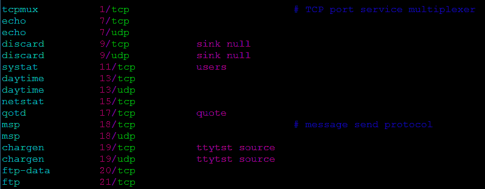

发表于 2016-08-22 00:56:28

* * *

[牛客 141215 号](https://www.nowcoder.com/profile/853009)

端口号和标准服务之间的对应关系在 RFC 1700 "Assigned Numbers"中有详细的定义。“/etc/services”文件使得服务器和客户端的程序能够把服务的名字转成端口号，这张表在每一台主机上都存在。只有“root”用户才有权限修改这个文件，而且在通常情况下这个文件是没有必要修改的，因为这个文件中已经包含了常用的服务对应的端口号。

发表于 2016-03-10 12:54:17

* * *

[舒意意 123](https://www.nowcoder.com/profile/1973064)

```cpp
/etc/services
```

发表于 2017-04-06 10:17:46

* * *

## 7

位势函数法的积累势函数 K(x)的作用相当于 Bayes 判决中的()

正确答案: A D   你的答案: 空 (错误)

```cpp
后验概率
```

```cpp
先验概率
```

```cpp
类概率密度
```

```cpp
类概率密度与先验概率的乘积
```

本题知识点

机器学习

讨论

[小米粥](https://www.nowcoder.com/profile/506637)

PRML 第六章 SVM  第三段公式(6.1)下方 势函数->核->svm 势函数 http://www.cnblogs.com/huadongw/p/4106290.htmlPRML  1.2.5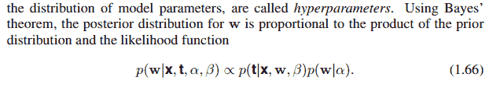

发表于 2017-03-02 20:20:48

* * *

[iiiiii](https://www.nowcoder.com/profile/3243019)

多项选择， 只有 AD 含义相同

发表于 2016-07-20 15:39:48

* * *

[创始元灵](https://www.nowcoder.com/profile/220889961)

       后验概率＝先验概率ｘ调整因子后验概率是指在得到"结果"的信息后重新修正的[概率](https://baike.so.com/doc/5663650-5876306.html)，如贝叶斯公式中的。是"执果寻因"问题中的"果"。先验概率与后验概率有不可分割的联系，后验概率的计算要以先验概率为基础。

发表于 2019-06-29 21:58:16

* * *

## 8

统计模式分类问题中，当先验概率未知时，可以使用()

正确答案: A D   你的答案: 空 (错误)

```cpp
最小最大损失准则
```

```cpp
最小误判概率准则
```

```cpp
最小损失准则
```

```cpp
N-P 判决
```

本题知识点

机器学习

讨论

[牛客 617602 号](https://www.nowcoder.com/profile/617602)

A. 考虑 p(wi)变化的条件下，是风险最小 B. 最小误判概率准则， 就是判断 p(w1|x)和 p(w2|x)哪个大，x 为特征向量，w1 和 w2 为两分类，根据贝叶斯公式，需要用到先验知识 C. 最小损失准则，在 B 的基础之上，还要求出 p(w1|x)和 p(w2|x)的期望损失，因为 B 需要先验概率，所以 C 也需要先验概率 D. N-P 判决，即限定一类错误率条件下使另一类错误率为最小的两类别决策，即在一类错误率固定的条件下，求另一类错误率的极小值的问题，直接计算 p(x|w1)和 p(x|w2)的比值，不需要用到贝叶斯公式 _

发表于 2016-08-01 15:38:42

* * *

[咕噜 1101](https://www.nowcoder.com/profile/400112057)

**最小损失准则**中需要用到先验概率**最大最小损失规则**主要就是使用解决最小损失规则时先验概率未知或难以计算的问题的。 在贝叶斯决策中，对于先验概率 p(y)，分为已知和未知两种情况。 
1\. p(y)已知，直接使用贝叶斯公式求后验概率即可； 
2\. p(y)未知，可以使用聂曼-皮尔逊决策(N-P 决策)来计算决策面。 

发表于 2019-02-22 17:03:13

* * *

[牛客 423565 号](https://www.nowcoder.com/profile/423565)

最小错误率等价最大后验概率，0-1 风险等价最小错误率，都是需要先验知识的。

发表于 2016-01-05 19:50:45

* * *

## 9

从浏览器打开 http://www.sohu.com ，TCP/IP 协议族中不会被使用到的协议是()

正确答案: A   你的答案: 空 (错误)

```cpp
SMTP
```

```cpp
HTTP
```

```cpp
TCP
```

```cpp
IP
```

本题知识点

网络基础

讨论

[谭锅锅](https://www.nowcoder.com/profile/767251)

应该是这样的：http:应用层 tcp:传输层 IP：网络层

发表于 2015-12-11 13:56:27

* * *

[Bugzhang](https://www.nowcoder.com/profile/741109)

SMTP：简单邮件传输协议。只有发送邮件用到。网络层交换数据的 IP 协议，传输数据用 TCP 协议，接收 HTML 用了 http 协议。

发表于 2016-10-03 04:56:59

* * *

[灰色节能 _ 聪](https://www.nowcoder.com/profile/722809)

SMTP 是邮件传输协议，跟题目里的动作没什么关系

发表于 2016-01-29 14:14:30

* * *

## 10

一个 4 叉树，度为 4 的结点个数为 6，度为 3 的节点个数是 10，度为 2 的节点个数是 5，叶子节点个数为()

正确答案: D   你的答案: 空 (错误)

```cpp
40
```

```cpp
42
```

```cpp
38
```

```cpp
44
```

本题知识点

树

讨论

[SunburstRun](https://www.nowcoder.com/profile/557336)

答案是 D  查看全部)

编辑于 2015-11-02 12:32:33

* * *

[Pis](https://www.nowcoder.com/profile/758219)

度    节点数        边 4        6              243        10            302        5              101        x                0 边 = 节点数 -164=21+x-1x=44

发表于 2016-03-28 15:03:36

* * *

[牛客 876873 号](https://www.nowcoder.com/profile/876873)

结点数=总分叉树+1

发表于 2016-08-02 18:00:40

* * *

## 11

由权值为 29,12,15,6,23 的五个叶子节点构造的哈夫曼树为，其带权路径长度为（）

正确答案: D   你的答案: 空 (错误)

```cpp
222
```

```cpp
192
```

```cpp
85
```

```cpp
188
```

本题知识点

树

讨论

[心静](https://www.nowcoder.com/profile/437950)

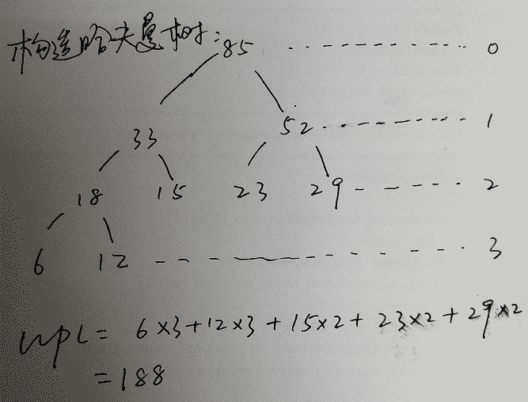

发表于 2015-11-02 21:08:44

* * *

[huixieqingchun](https://www.nowcoder.com/profile/551201)

注意哈夫曼树的构造方法，是取森林中最根结点最小的两棵树来合并，而不是任意取两棵树来合并。

发表于 2016-05-10 14:43:03

* * *

[InGodWeTrust](https://www.nowcoder.com/profile/2178882)

选 D：哈夫曼树结构为：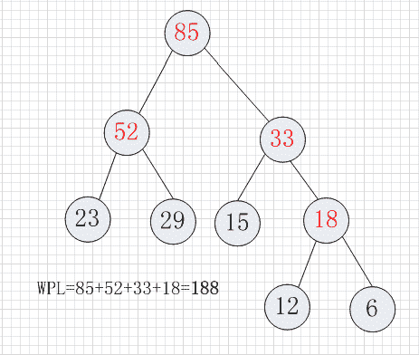

发表于 2017-04-06 19:45:09

* * *

## 12

当我们在局域网内使用 ping www.nowcoder.com 时，哪种协议没有被使用?

正确答案: D   你的答案: 空 (错误)

```cpp
ICMP
```

```cpp
ARP
```

```cpp
DNS
```

```cpp
TCP
```

本题知识点

网络基础

讨论

[win 君](https://www.nowcoder.com/profile/538899)

1、因为 ping 的话 后面跟的是地址，所以要先将域名转换为 ip 地址，即用到了 DNS2、获取到 ip 地址后，在数据链路层是根据 MAC 地址传输的，所以要用到 ARP 解析服务，获取到 MAC 地址 3、ping 功能是测试另一台主机是否可达，程序发送一份 ICMP 回显请求给目标主机，并等待返回 ICMP 回显应答，（ICMP 主要是用于 ip 主机、路由器之间传递控制信息，控制信息是指网络通不通，主机是否科大）4、TCP 的话，不涉及数据传输，不会用到

发表于 2015-11-06 09:13:54

* * *

[我也支持](https://www.nowcoder.com/profile/6206174)

**最关键的一点：ping 是“** **应用层** **”直接调用 ip 层的 ICMP 协议，ping 既不用 TCP，也不用 UDP。ICMP 报文直接被封装在 IP 包里，这就是为什么说 ICM**P**是网络层的协议，但是我们平时老用到它感觉是应用层的协议。**

编辑于 2018-11-21 19:20:40

* * *

[钉子](https://www.nowcoder.com/profile/506749)

1、首先将域名转换为 IP 地址，用到了应用层的**DNS 协议**，注意到 DNS 使用的运输层协议是 UDP 而不是 TCP。2、接着是使用 ping 命令检测网络是否是通的，主机是否可达、路由是否可用，这个时候需要从底层物理层向上到网络层；3、链路层使用的是 MAC 地址，所以需要**ARP 协议**把 IP 地址转换为 MAC 地址，从而把命令从链路层传输到网络层。4、在网络层 ping 功能发送一个**ICMP 请求**给目标主机，来等待 ICMP 应答。所以整个过程也没有用到 TCP 协议！！

发表于 2016-07-15 10:35:52

* * *

## 13

对数列(25,84,21,47,15,27,68,35,20)进行排序，元素序列的变化情况如下:1.25,84,21,47,15,27,68,35,202.20,15,21,25,47,27,68,35,843.15,20,21,25,35,27,47,68,844.15,20,21,25,27,35,47,68,84

正确答案: B   你的答案: 空 (错误)

```cpp
简单选择排序
```

```cpp
快速排序
```

```cpp
归并排序
```

```cpp
希尔排序
```

本题知识点

排序 *讨论

[沈蘑蘑～](https://www.nowcoder.com/profile/674341)

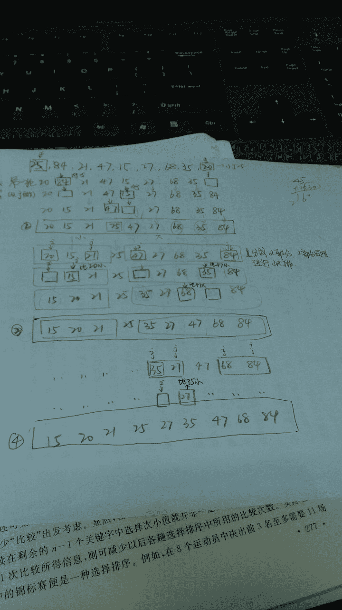

发表于 2016-03-25 13:06:10

* * *

[zt_xcyk](https://www.nowcoder.com/profile/839070)

B 快排 以第一个数为划界元素，大于它的放右边，小于它的放左边。

发表于 2015-12-07 17:02:20

* * *

[wanlanwalan](https://www.nowcoder.com/profile/7952866)

选快速排序首先第一步以 25 为基础，小于 25 的放在 25 的左边，大于 25 的放在 25 的右边得到 20,15,21,25,47,27,68,35,84 第二步在 25 的两边分别进行快速排序，左边以 20 为基数，右边以 47 为基数得到 15,20,21,25,35,27,47,68,84 第三步将,35,27 这个子序列排序，得到 15,20,21,25,27,35,47,68,84

发表于 2017-04-27 10:17:38

* * *****