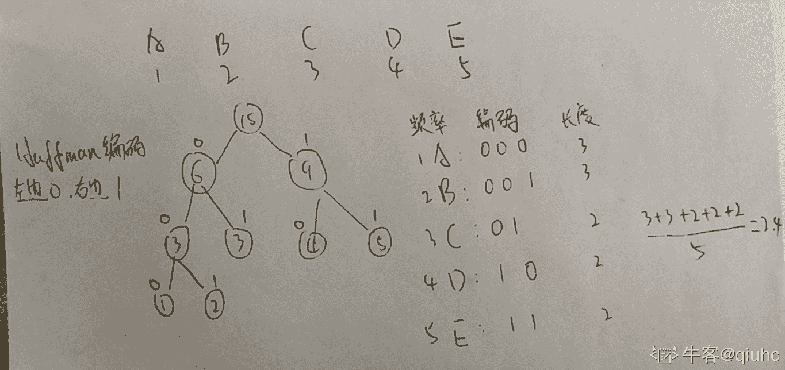
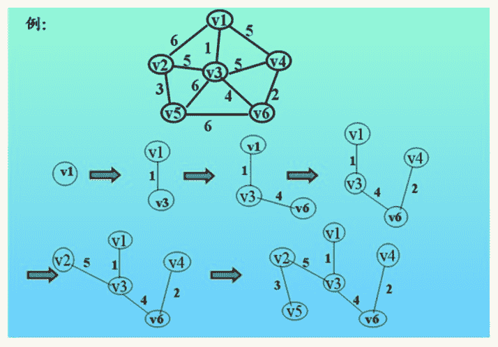

# 楚楚街 2016 非北京地区在线笔试

## 1

给定 10000 个正整数，甲乙二人轮流取，每次取一个数，并且只能从最左端或者最右端取。取得数的总和作为这个人的得分，甲先开始取数，如果最后甲的得分不小于乙，则甲获胜，否则乙获胜，甲乙都足够聪明，问是否有必胜策略？

正确答案: A   你的答案: 空 (错误)

```cpp
甲一定能胜利
```

```cpp
乙一定能胜利
```

```cpp
和 10000 个数具体值相关，如果完全随机，甲乙获胜的概率相同各占 50%
```

```cpp
和 10000 个数具体值相关， 如果完全随机，甲乙获胜的概率不同，并且没人能一定胜利（都小于 1）
```

本题知识点

概率统计 *C++工程师 Java 工程师 楚楚街 2016 概率论与数理统计* *讨论

[MemoryLimitExceeded](https://www.nowcoder.com/profile/1677722)

因为甲可以决定两个人能取的位置，例如甲取了第一个，那么留下一步能取的数都是偶数位的，无论乙怎么取，甲都能控制乙的取法，因此甲只关心奇数位和偶数位的和大小                                                                                                                        来自队友的解析

编辑于 2019-04-06 15:00:07

* * *

[夏晨棋](https://www.nowcoder.com/profile/811675)

```cpp
甲每一次都取两端数字中较大的那一个，就可以必胜。个人觉得是这样，还没想出合适的证明方法，晚点再写

```

发表于 2016-03-01 19:31:28

* * *

[Hackerteen](https://www.nowcoder.com/profile/465441670)

作为选择题是不是先可以自己列几个简单的数字，先得到正确答案，在进行分析。

发表于 2020-02-02 10:53:55

* * *

## 2

20 颗相同的糖分给 A,B,C,D 四个人，A 至少得到 1 颗，B 至少得到 2 颗，C 至少得到 3 颗，D 至少得到 4 颗的方法数为（）

正确答案: C   你的答案: 空 (错误)

```cpp
160000
```

```cpp
1716
```

```cpp
286
```

```cpp
1324
```

本题知识点

组合数学 *C++工程师 Java 工程师 楚楚街 2016* *讨论

[QAQQQQAQ](https://www.nowcoder.com/profile/290003296)

首先给 ABCD 分别 0,1,2,3 颗糖，问题转化为 14 颗糖分四个人每人至少一颗，即 C（3,13）=286

发表于 2021-04-15 22:19:28

* * *

[Pandora](https://www.nowcoder.com/profile/266279)

依题意，问题转变为 10 颗糖，分给 4 个人，有多少种分法，其中每个人可以得到 10 颗，也可以一颗也没有。所以是 10 颗糖排开，有 9 个空位，划分：1 个人得糖：C(1, 4)*C(0, 9)=42 个人得糖：C(2, 4)*C(1, 9)=543 个人得糖：C(3, 4)*C(2, 9)=1444 个人得糖：C(4, 4)*C(3, 9)=84 如：9 个空划 1 次，就是将糖果分成了 2 份，即每个人都可以得到大于 0 颗糖，也就是说不包含 1 人得糖的情况——四种情况独立，所以相加得到 286。

发表于 2016-01-15 16:21:00

* * *

[pyjac](https://www.nowcoder.com/profile/264768495)

A 至少得到 1 颗，B 至少得道 2 颗，C 至少得到 3 颗，D 至少得到 4 颗，总共消耗了 10 颗，则还剩余 10 颗要分配给 4 个人。这 10 颗糖可能分配给 1 个人，也可能 2 个人，也可能 3 个人，也可能 4 个人。怎么分呢？可以采用隔板法进行划分。10 颗糖排成一排有 9 个空格。分给 1 个人时：C(1, 4)=4 分给 2 个人时：C(2, 4)*C(1, 9)=54 分给 3 个人时：C(3, 4)*C(2, 9)=144 分给 4 个人时：C(4, 4)*C(3, 9)=84 以上相加得 286

发表于 2021-04-02 15:51:16

* * *

## 3

A B C D 4 个人排成一列，A 不在第一个, B 不在第二个，C 不在第三个，D 不在第四个的可能方法数有（）

正确答案: B   你的答案: 空 (错误)

```cpp
24
```

```cpp
9
```

```cpp
6
```

```cpp
12
```

本题知识点

组合数学 *C++工程师 Java 工程师 楚楚街 2016* *讨论

[Pandora](https://www.nowcoder.com/profile/266279)

A 刚好在 1：A(3, 3)=6B 刚好在 2：A(3, 3)=6C 刚好在 3：A(3, 3)=6D 刚好在 4：A(3, 3)=6 以上**abcd**有 4 次，**ab**dc、**a**d**c**b、**a** cb **d** 、 d**bc**a、 c**b**a**d**、 ba**cd**各有 2 次，因此重复计算了去了 9 次 ，所以 Cnt(A=1 || B=2 || C=3 || D=4)=4*6-9=15 而 ABCD 全排列：A(4, 4)=24，所以 24-15=9。

发表于 2016-01-15 18:02:00

* * *

[Hackerteen](https://www.nowcoder.com/profile/465441670)

A(4,4)-3A(3,3)+2A(2,2)-A(1,1)

发表于 2020-02-02 10:56:07

* * *

## 4

Linux 下检查某域名是否正确，同时可以得到一个它的 ip 地址的命令是

正确答案: C   你的答案: 空 (错误)

```cpp
ipconfig
```

```cpp
dns
```

```cpp
ping
```

```cpp
curl
```

本题知识点

C++工程师 Java 工程师 楚楚街 2016

讨论

[vforbox](https://www.nowcoder.com/profile/632373)

c

发表于 2016-03-11 23:52:44

* * *

## 5

Android 手机操作系统的 native 方法库是用什么语言实现的？（）

正确答案: B   你的答案: 空 (错误)

```cpp
Java
```

```cpp
C/C++
```

```cpp
Scala
```

```cpp
Python
```

本题知识点

C++工程师 Java 工程师 楚楚街 2016

## 6

下列哪个算法不是操作系统的进程调度算法？ ()

正确答案: D   你的答案: 空 (错误)

```cpp
先到先服务
```

```cpp
时间片轮转
```

```cpp
短任务优先服务
```

```cpp
LRU
```

本题知识点

C++工程师 Java 工程师 楚楚街 2016

讨论

[格子灰](https://www.nowcoder.com/profile/822665)

D 是页面调度算法

发表于 2016-07-27 12:40:48

* * *

## 7

正在运行的进程请求某资源得不到满足时，会进入到（）

正确答案: A   你的答案: 空 (错误)

```cpp
阻塞状态
```

```cpp
消亡状态
```

```cpp
等待状态
```

```cpp
就绪状态
```

本题知识点

C++工程师 Java 工程师 楚楚街 2016

讨论

[。。哼](https://www.nowcoder.com/profile/4004087)

阻塞：等待某一条件的发生。

发表于 2018-02-08 14:40:24

* * *

## 8

在操作系统中，处理突发事件、资源、服务请求等常用的内部方法是（）

正确答案: C   你的答案: 空 (错误)

```cpp
批处理
```

```cpp
分时处理
```

```cpp
中断处理
```

```cpp
高速缓存
```

本题知识点

操作系统 C++工程师 Java 工程师 楚楚街 2016

讨论

[西海安砖家](https://www.nowcoder.com/profile/305325429)

突发事情中断处理

发表于 2021-04-23 10:14:07

* * *

## 9

下列哪个不是对算法必须的要求

正确答案: B   你的答案: 空 (错误)

```cpp
有穷性
```

```cpp
清晰性
```

```cpp
确定性
```

```cpp
输出
```

本题知识点

C++工程师 Java 工程师 楚楚街 2016

## 10

关于伪代码，下列说法正确的是：

正确答案: D   你的答案: 空 (错误)

```cpp
伪代码是写错的代码
```

```cpp
伪代码是程序的别称
```

```cpp
伪代码和程序一样，有明确的语法，需要遵循
```

```cpp
伪代码是一种算法描述的方式，它比画图简单，通常没有明确的语法，比自然语言更明确，减少歧义。
```

本题知识点

C++工程师 Java 工程师 楚楚街 2016

## 11

在堆排序的过程中，建立一个堆的时间复杂度是（）

正确答案: A   你的答案: 空 (错误)

```cpp
O(n)
```

```cpp
O(logn)
```

```cpp
O(nlogn)
```

```cpp
O(n2)
```

本题知识点

堆 C++工程师 Java 工程师 楚楚街 2016

讨论

[AAS48](https://www.nowcoder.com/profile/552678974)

建堆时间复杂度：O(n)调整堆、插入、删除：O(log2n)堆排序平均时间复杂度：O(nlog2n)空间复杂度：O(1)记住！

发表于 2021-12-13 17:13:58

* * *

[酒泽思](https://www.nowcoder.com/profile/588155683)

初始建堆时间复杂度 O(n)，
一次重建堆时间复杂度 O(logn)堆排序时间复杂度为 O(nlogn)，

发表于 2021-08-30 16:59:27

* * *

[牛客 129457616 号](https://www.nowcoder.com/profile/129457616)

建堆时间复杂度：O(n)调整堆、插入、删除：O(log[2]n)堆排序平均时间复杂度：O(nlog[2]n)空间复杂度：O(1)

发表于 2021-11-15 14:27:43

* * *

## 12

在一般包含 n 个节点的二叉搜索树中查找的最差时间复杂度是?

正确答案: B   你的答案: 空 (错误)

```cpp
O(log(n))
```

```cpp
O(n)
```

```cpp
O(n²)
```

```cpp
O(1)
```

本题知识点

树 C++工程师 Java 工程师 楚楚街 2016

讨论

[光军 233](https://www.nowcoder.com/profile/374476905)

只是说二叉排序树不一定是二叉平衡树，如果所有的元素有序排列，正好成一根深度为 n 的树，此时最差的时间复杂度就是从根节点到最后一个叶子节点为 n

发表于 2021-11-09 15:11:26

* * *

[牛客 697344893 号](https://www.nowcoder.com/profile/697344893)

眼瞎了，写着最差

发表于 2021-03-30 23:27:54

* * *

[茴香小包子](https://www.nowcoder.com/profile/808536569)

对于二叉搜索树，当先后插入的关键字有序时，退化成链表，树的深度为 n，时间复杂度等于顺序查找 O（n/2）= O（n）

发表于 2021-09-09 14:56:49

* * *

## 13

给定 A,B,C,D,E 出现的频率是 1,2,3,4,5 ，如果采用 Huffman 编码，则每个字符编码的平均长度是（） 

正确答案: B   你的答案: 空 (错误)

```cpp
2.2
```

```cpp
2.4
```

```cpp
2.6
```

```cpp
2.8
```

本题知识点

树 楚楚街 2016

讨论

[qiuhc](https://www.nowcoder.com/profile/133646569)



发表于 2021-03-22 18:56:29

* * *

[牛客 79832450 号](https://www.nowcoder.com/profile/79832450)

为什么我感觉答案应该是 A 2.2 感觉应该是求加权平均数，不是简单的平均数呀

发表于 2021-09-08 14:26:00

* * *

[牛客 149144 号](https://www.nowcoder.com/profile/149144)

最优二叉树 A->010B->011C->00D->10E->1112/5=2.4

发表于 2016-03-01 20:23:11

* * *

## 14

关于拓扑排序算法，下列说法错误的是（）

正确答案: C   你的答案: 空 (错误)

```cpp
拓扑排序算法是在有向图中进行的
```

```cpp
拓扑排序算法可以通过深度优先实现
```

```cpp
对任何有向图，拓扑排序算法都可以得到节点的合法拓扑顺序
```

```cpp
拓扑排序算法可以使用队列实现
```

本题知识点

C++工程师 Java 工程师 楚楚街 2016

## 15

在一个集合中查找一个值是否出现，可以使用二分查找算法，关于二分查找算法，下面说法错误的是：

正确答案: B   你的答案: 空 (错误)

```cpp
二分查找算法又叫折半查找算法
```

```cpp
通常它的查找效率是 O(nlogn)
```

```cpp
它需要被查找的集合是有序的
```

```cpp
二分查找算法每次使得搜索空间几乎变为之前的一半。
```

本题知识点

C++工程师 Java 工程师 楚楚街 2016

讨论

[牛客 443881 号](https://www.nowcoder.com/profile/443881)

最坏的情况：lgN

发表于 2016-06-14 16:41:12

* * *

## 16

关于无向正权图的最短路和最小生成树的结论正确的是：

正确答案: C   你的答案: 空 (错误)

```cpp
当图的每条边的权值都增加 1 的时候，之前计算的最短路和最小生成树都仍然有效。
```

```cpp
当图的每条边的权值都扩大 2 倍的时候，之前计算的最短路和最小生成树已经失效。
```

```cpp
当图的每条边的权值都增加 1 的时候，之前计算的最小生成树仍然有效。
```

```cpp
当图的每条边的权值都扩大 2 倍的时候，之前计算的最短路已经失效（不再是最短路）。
```

本题知识点

树 C++工程师 Java 工程师 楚楚街 2016

## 17

发送 email 使用的网络协议是？

正确答案: B   你的答案: 空 (错误)

```cpp
TELNET
```

```cpp
SMTP
```

```cpp
POP3
```

```cpp
FTP
```

本题知识点

C++工程师 Java 工程师 楚楚街 2016

## 18

（）提供面向连接、可靠的服务？

正确答案: D   你的答案: 空 (错误)

```cpp
UDP
```

```cpp
IP
```

```cpp
广播
```

```cpp
TCP
```

本题知识点

C++工程师 Java 工程师 楚楚街 2016

## 19

在浏览器地址栏里输入一个地址的时候，往往需要把地址解析为 IP 地址，该服务简称为（）

正确答案: C   你的答案: 空 (错误)

```cpp
TCP
```

```cpp
IP
```

```cpp
DNS
```

```cpp
FTP
```

本题知识点

网络基础 C++工程师 Java 工程师 楚楚街 2016

讨论

[2022 考研计算机科学与技术](https://www.nowcoder.com/profile/148719156)

补充一下百度百科词条，学习计算机掌握缩写含义也很重要域名系统（[英文](https://baike.baidu.com/item/%E8%8B%B1%E6%96%87)：Domain Name System，[缩写](https://baike.baidu.com/item/%E7%BC%A9%E5%86%99)：DNS）是[互联网](https://baike.baidu.com/item/%E4%BA%92%E8%81%94%E7%BD%91)的一项服务。它作为将[域名](https://baike.baidu.com/item/%E5%9F%9F%E5%90%8D)和[IP 地址](https://baike.baidu.com/item/IP%E5%9C%B0%E5%9D%80)相互[映射](https://baike.baidu.com/item/%E6%98%A0%E5%B0%84)的一个[分布式数据库](https://baike.baidu.com/item/%E5%88%86%E5%B8%83%E5%BC%8F%E6%95%B0%E6%8D%AE%E5%BA%93)，能够使人更方便地访问[互联网](https://baike.baidu.com/item/%E4%BA%92%E8%81%94%E7%BD%91)

发表于 2021-06-17 13:48:56

* * *

[不屈洋哥](https://www.nowcoder.com/profile/2714875)

DNS:即动态域名解析服务，将域名解析为 iP 地址

发表于 2021-03-21 10:23:39

* * *

## 20

集线器和交换机分别属于网络模型中的哪一层？ （）

正确答案: A   你的答案: 空 (错误)

```cpp
物理层和数据链路层
```

```cpp
都是物理层
```

```cpp
数据链路层和网络层
```

```cpp
都是数据链路层
```

本题知识点

C++工程师 Java 工程师 楚楚街 2016

## 21

亮亮深吸一口气，打开了地图，地图上写着(X:12,Y:?)，这可让亮亮犯了愁，这个问号代表了什么意思呢？ 亮亮绞尽脑汁也想不出什么思路，忽然他在地图背面发现了一串数字，数字下面写着一段话“这只是一个 1~n 的混乱排列，不用在意第 i 个值”，亮亮眼前一亮，“这个混乱排列中第 i 个一定是 Y 的值！”于是，亮亮开始恢复这个混乱排列。

本题知识点

字符串 *模拟 查找 *C++工程师 Java 工程师 楚楚街 2016** **讨论

[董泽锋](https://www.nowcoder.com/profile/163235)

题目都没读明白

发表于 2016-06-22 15:55:24

* * *

[单线程小龟](https://www.nowcoder.com/profile/8416854)

题目不清楚，测试数据也弱爆了，大量不正确的都通过了题目原来想表达的意思如下：例如给定 n=25，那么现在总共有 25 个数字，从 1 到 25，正常的顺序把它们连起来写是这样：12345678910111213141516171819202122232425，而现在把这些顺序进行了打乱，问你原来可能是什样的组合。给个严谨一点的例子，例如输入 2523456718925242322202115141312111016171819 正确输出应该有 4 种如下：2 3 4 5 6 7 1 8 9 25 24 23 22 20 21 15 14 13 12 11 10 16 17 18 192 3 4 5 6 7 18 9 25 24 23 22 20 21 15 14 13 12 11 10 16 17 1 8 1923 4 5 6 7 1 8 9 25 24 2 3 22 20 21 15 14 13 12 11 10 16 17 18 1923 4 5 6 7 18 9 25 24 2 3 22 20 21 15 14 13 12 11 10 16 17 1 8 19 再例如输入 411718192021222324252627281234567891011121314151629303132333435363738394041 合法的解有 11 种如下：17 18 19 20 21 2 22 3 24 25 26 27 28 1 23 4 5 6 7 8 9 10 11 12 13 14 15 16 29 30 31 32 33 34 35 36 37 38 39 40 4117 18 19 20 21 22 2 3 24 25 26 27 28 1 23 4 5 6 7 8 9 10 11 12 13 14 15 16 29 30 31 32 33 34 35 36 37 38 39 40 4117 18 19 20 21 22 23 24 25 26 27 28 1 2 3 4 5 6 7 8 9 10 11 12 13 14 15 16 29 30 31 32 33 34 35 36 37 38 39 40 4117 18 19 20 21 22 23 24 25 26 27 28 1 2 34 5 6 7 8 9 10 11 12 13 14 15 16 29 30 31 32 3 33 4 35 36 37 38 39 40 4117 18 19 20 21 22 23 24 25 26 27 28 1 2 34 5 6 7 8 9 10 11 12 13 14 15 16 29 30 31 32 33 3 4 35 36 37 38 39 40 4117 18 19 20 21 22 23 24 25 26 27 28 12 3 4 5 6 7 8 9 10 1 11 2 13 14 15 16 29 30 31 32 33 34 35 36 37 38 39 40 4117 18 19 20 21 22 23 24 25 26 27 28 12 3 4 5 6 7 8 9 10 11 1 2 13 14 15 16 29 30 31 32 33 34 35 36 37 38 39 40 4117 18 19 20 21 22 23 24 25 26 27 28 12 34 5 6 7 8 9 10 1 11 2 13 14 15 16 29 30 31 32 3 33 4 35 36 37 38 39 40 4117 18 19 20 21 22 23 24 25 26 27 28 12 34 5 6 7 8 9 10 1 11 2 13 14 15 16 29 30 31 32 33 3 4 35 36 37 38 39 40 4117 18 19 20 21 22 23 24 25 26 27 28 12 34 5 6 7 8 9 10 11 1 2 13 14 15 16 29 30 31 32 3 33 4 35 36 37 38 39 40 4117 18 19 20 21 22 23 24 25 26 27 28 12 34 5 6 7 8 9 10 11 1 2 13 14 15 16 29 30 31 32 33 3 4 35 36 37 38 39 40 41 所以很明显，这题的本意是想让大家用 dfs 的方法进行搜索

```cpp
import java.util.ArrayList;
import java.util.Scanner;

public class Main {
	public static void main(String[] args) {
		Scanner cin=new Scanner(System.in);
		while(cin.hasNext()){
			int n=cin.nextInt();
			cin.nextLine();
			String s=cin.nextLine();
			boolean[] find=new boolean[n+1];
			int carryLen=String.valueOf(n).length();
			ArrayList<Integer> arraylist=new ArrayList<>();
			dfs(n,0,find,carryLen,s,arraylist);

		}
	}

	public static void dfs(int n,int start,boolean[] find,int carryLen,String s,ArrayList<Integer> arraylist){

		if(start==s.length()){
			for(int tmp:arraylist)
				System.out.print(tmp+" ");
			System.out.println();
			return ;
		}

		for(int i=1;i<=carryLen;i++){
			if(start+i<=s.length()){
				int num=Integer.parseInt(s.substring(start, start+i));
				if(num<=n&&!find[num]){
					find[num]=true;
					arraylist.add(num);
					dfs(n,start+i,find,carryLen,s,arraylist);
					arraylist.remove(arraylist.size()-1);
					find[num]=false;
				}
			}
		}
	}

}  
```

编辑于 2017-02-21 17:28:16

* * *

[林家花美男](https://www.nowcoder.com/profile/283031)

/*因为我刚开始写的代码是从小到大读取数据，而看了解析，大家写的代码都是从大到小获取的但是大家的从大到小的代码可能有问题，因为都没有进行重复检测，如输入 11 个数，数据是 1101123456789，这样的结果大家的代码会出现重复，所以我就借鉴了大家的思路，再加上我自己的想法，先从小到大进行读取，然后判断，1 到 n 这么多数是不是每个都读到了如果是就输出，不是就用从大到小的方式来读取，或许我的想法还有些漏洞或缺陷，还请大家指正*/#include<iostream>#include<string>#include<vector>using namespace std;int main(){    int num,i,j;    int array[25];    string str = "";    while(cin>>num){        cin>>str;        int temp[26]={0};        **for(i=0,j=0;i<str.length();)**{         if(temp[str[j]-'0']==0){                temp[str[j]-'0']=1;                array[i++]=str[j++]-'0';}            else{                array[i]=(str[j]-'0')*10+str[j+1]-'0';                **temp[array[i]]=1;**                i++;j+=2;            }        }     int flag=0;        for(i=1;i<=num;i++)            if(temp[i]==0){            flag=1;break;}        if(flag==1){            int  tmp = 0;            **for(j=0,i=0;i<str.length();i++)**{                tmp = tmp*10 + str[i] - '0';                if(tmp<=num)                    continue;                i--;                **array[j++]=tmp/10;**                tmp = 0;            }            **array[j]=tmp;**        }        for(i=0;i<num;i++)            cout<<array[i]<<' ';        cout<<endl;    }    return 0;}

编辑于 2016-05-24 18:41:29

* * *

## 22

亮亮解出了卷轴隐藏的秘密，来到了一片沼泽地。这里有很多空地，而面试直通卡可能埋在任意一块空地中，好在亮亮发现了一堆木材，他可以将木材铺在两个空地之间的沼泽地上。因为亮亮不知道面试直通卡具体在哪一块空地中，所以必须要保证任意一块空地对于亮亮来说是可以抵达的。 “怎么还有鳄鱼！没办法，看来有些空地不能直接到达了。” 亮亮虽然没有洁癖，但是沼泽地实在太臭了，所以亮亮不会循环利用木材。而且木材不能拼接在一起使用，所以亮亮必须要知道在耗费木材最少的情况下，最长的那根木材至少需要多长。

本题知识点

贪心 图 C++工程师 golang 工程师 iOS 工程师 安卓工程师 运维工程师 前端工程师 算法工程师 测试工程师 PHP 工程师 Java 工程师 2018 楚楚街 2016 牛客

讨论

[macgradyjames](https://www.nowcoder.com/profile/9178626)

```cpp
//使用 Cruskal 解决问题
import java.util.Arrays;
import java.util.Comparator;
import java.util.Scanner;

//并查集实现最小生成树
public class Main{
    private static class Edge{
    	//起点和终点
    	int x,y;
    	int weight;
    	public Edge(int x,int y,int weight)
    	{
    		this.x=x;
    		this.y=y;
    		this.weight=weight;
    	}
    }
    public static int father(int i,int a[])
    {
    	 int k=i;
         while(a[k]!=k)k=a[k];  //并查集
         return k;
    }
	/**
	 * @param args
	 */
	public static void main(String[] args) {
		// TODO Auto-generated method stub
        Scanner in=new Scanner(System.in);
        while(in.hasNext())
        {
        	int n=in.nextInt();
        	int m=in.nextInt();
        	Edge[] edges=new Edge[m];
        	for(int i=0;i<m;i++)
        	{
        		edges[i]=new Edge(in.nextInt(),in.nextInt(),in.nextInt());
        	}
        	int a[]=new int[n+1];
        	for(int j=0;j<=n;j++)
        	{
        		a[j]=j;
        	}
        	Arrays.sort(edges,new Comparator<Edge>() {
				@Override
				public int compare(Edge o1, Edge o2) {
					// TODO Auto-generated method stub
					return o1.weight-o2.weight;
				}
			});
        	int res=0;
        	for(int i=0;i<m;i++)
        	{
        		int px=father(edges[i].x,a);
        		int py=father(edges[i].y,a);
        		if(px!=py)
        		{
        			 if(edges[i].weight>res)res=edges[i].weight;
        			 if(px>py)
        				 a[px]=py;
        			 else
        				 a[py]=px;
        		}
        	}
        	System.out.println(res);
        }
	}

}
```

发表于 2016-08-11 18:43:17

* * *

[卷积神经网络哦](https://www.nowcoder.com/profile/8684256)

图的最小生成树 Prim 算法或者 Kruscal 算法
下面给出 Prim 算法解法

如图所示 此例最小木材铺法如图最后步骤所示
此时最长木板为 5
算法思想：
从 V1 出发 求出所有点中与 V1 的距离最短的一个节点 V3(无法与 V1 直接相连的距离为无穷) 得到第一条边 然后在求剩下点到 V1 和 V3 的距离最近的点 V6 依次类推直到所有点用完
注意：
为了减少时间复杂度引入数组 dis[] dis[i]表示节点 i 到已连接的集合中所有点的最小距离
一开始时只有 V1 在集合中 所以 dis[i]就为每个点到 V1 的距离 当 V3 也加入时 dis[i]要更新为
min(i 到 V1 的距离， i 到 v3 的距离)后面依次类推
这样可以将总的时间复杂度降为 O(n²)

```cpp
#include 
#include 
#include 
#include 
#include 
#include 
using namespace std;
const int maxn = 1e4 + 1;
const int MAX_INT = INT_MAX;
int dis[maxn];
int n, m, taken[maxn];
struct Node{
    int to, val;
    Node(int a, int b){
        to = a;
        val = b;
    }
};
vector v[maxn];
int main(){
    while(scanf("%d%d", &n, &m) == 2){
        memset(taken, 0, sizeof(taken));
        memset(dis, 0, sizeof(dis));
        for(int i = 0; i < m; i++){
            int a, b, val;
            scanf("%d%d%d", &a, &b, &val);
            v[a].push_back(Node(b, val));
            v[b].push_back(Node(a, val));//用 vector 保存图
        }
        taken[1] = 1;//从点 1 开始 
        //由于鳄鱼的存在(即存在非联通分量 即存在从 1 出发永远到不了的点 所以必须从 1 出发 舍弃到不了的点)
        for(int i = 1; i <= n; i++) dis[i] = MAX_INT;
        for(int i = 0; i < v[1].size(); i++) dis[v[1][i].to] = v[1][i].val;    //每个点到点 1 的距离                
        int ans = 0;
        for(int i = 1; i < n; i++){
            int min_val = MAX_INT, min_p;
            for(int j = 1; j <= n; j++){//每个点到已连接集合的最短距离
                if(!taken[j] && dis[j] < min_val){
                    min_val = dis[j];
                    min_p = j;
                }
            }
            if(min_val == MAX_INT) continue;
            ans = max(ans, min_val);
            taken[min_p] = 1;
            for(int j = 0; j < v[min_p].size(); j++){//更新 dis 数组
                if(!taken[v[min_p][j].to] && v[min_p][j].val < dis[v[min_p][j].to])
                    dis[v[min_p][j].to] = v[min_p][j].val;
            }
        }
        cout<<ans<<endl;
        for(int i = 0; i < n; i++) v[i].clear();
    }
    return 0;
}
/*
4 3
1 2 1
2 3 1
3 4 2
ans： 2
5 4
1 2 3
1 3 8
2 3 2
4 5 7
ans: 3
*/ 
```

编辑于 2018-10-28 15:50:00

* * *

[会呼吸旳痛](https://www.nowcoder.com/profile/6433012)

```cpp
//循边最小生成树，并查集动态查询连通性
include <iostream>
#include <vector>
#include <set>
#include <algorithm>
#include <map>
using namespace std;

int father(int i, vector<int> &UF)
{
	int k=i;
	while(UF[k]!=k)k=UF[k];
	return k;
}
int main()
{
	int N,M;
	while(cin>>N>>M)
	{
		multimap<int,pair<int,int>> cost;
		while(M--)
		{
			int a,b,c;
			cin>>a>>b>>c;
			cost.insert(make_pair(c,make_pair(min(a,b),max(a,b))));
		}
		vector<int>UF(N+1);
		for(int i=0;i<=N;i++)
			UF[i]=i;

		int maxV = -1;
		int cc = 0;
		for(auto it=cost.begin();it!=cost.end();it++)
		{
			int px = father(it->second.first,UF);
			int py = father(it->second.second,UF);

			if(px != py)
			{
				cc++;
				if(it->first>maxV)maxV=it->first;
                                UF[px] = UF[py];
			}
		}

		cout<<maxV<<endl;

	};
	return 0;
}

```

编辑于 2016-08-20 09:03:46

* * *

## 23

```cpp
“呼！！佳慧，我拿到面试直通卡了！”“吓死宝宝了！哦，你拿到直通卡了啊，好哒，进去吧，你可以直接接受老大的面试了”。
亮亮来到老大的办公室，“骚年，你想做什么工作啊？”“我要做大数据分析！！”
“哦~~那你先帮我们解决一个问题。是这样的，我们这次招聘会一共有 N 个人，我们公司给大家准备了一些礼物，但是我们并不知道这些人具体喜欢什么，现在库房共有 m 种礼物，每种礼物有 Ci 件，共 N 件。而我们大致知道每个人选择某种礼物的概率，即能知道 Pij(编号为 i 的人选择第 j 种礼物的概率)。现在所有人按编号依次领礼物（第 1 个人先领，第 N 个人最后领），领礼物时，参加者会按照预先统计的概率告诉准备者自己想要哪一种礼物，如果该种礼物在他之前已经发放完了则他会领不到礼物，请帮我们计算出能能领到礼物的期望人数。
```

本题知识点

动态规划 数学 C++工程师 Java 工程师 楚楚街 2016

讨论

[英国老鼠](https://www.nowcoder.com/profile/3789283)

```cpp
#include<iostream>
#include<vector>
#include<cmath>
using namespace std;
int main(){
	int N, M;
	while (cin >> N >> M){
		vector<int> C(M, 0);//每种礼物的个数
		vector<vector<double>> pro(N, vector<double>(M, 0));//每个人选择而每种礼物的概率
		for (int i = 0; i<M; i++)
			cin >> C[i];
		for (int i = 0; i<N; i++)
			for (int j = 0; j<M; j++)
				cin >> pro[i][j];

		double leftGifts = 0;
		for (int j = 0; j<M; j++){
			if (C[j] == 0)continue;
			vector<double> leftPro(C[j] + 1, 0);//对于礼物 j，剩下?件的概率
			leftPro[C[j]] = 1;
			for (int i = 0; i<N; i++){//每个人领后，概率更新情况
				leftPro[0] = leftPro[0] + leftPro[1] * pro[i][j];
				for (int k = 1; k<C[j]; k++)
					leftPro[k] = leftPro[k] * (1 - pro[i][j]) + leftPro[k + 1] * pro[i][j];
				leftPro[C[j]] = leftPro[C[j]] * (1 - pro[i][j]);
			}
			for (int i = 1; i <= C[j]; i++)//礼品 j 所剩总数
				leftGifts += leftPro[i] * i;
		}
		printf("%.1f\n", round(((double)N - leftGifts) * 10) / 10);
	}
	return 0;
}
/*解题思路：
(领到礼物的人数)=(被领的礼物数)=(礼品总数)-(剩下的礼物数)
问题可以转化为求(剩下的礼物数),考虑某种礼物:
假设有 3 件，剩 n 件的概率为 P_n，则派发礼物之前，P_3=1，P_2=P_1=P_0=0
假设第一个人选择这件礼物的概率是 0.2，则经过他选择后，P_3=0.8，P_2=0.2，P_1=P_0=0
如此类推，经过第 i 个人选择后(选择概率为 p)，剩下 k 件的概率是：
P_k'=P_k*(1-p)+P_(k+1)*p (原本有 k 件的概率*不选择这礼物的概率 + 原本有 k+1 件的概率*选择这礼物的概率)
经过 N 个人选择后，就能得出剩下的期望数量就等于 P_3*3+P_2*2+P_1*1
代码为了易懂，所以写得冗长一点，希望大家能读懂
*/
```

发表于 2017-03-23 00:58:00

* * *

[董泽锋](https://www.nowcoder.com/profile/163235)

```cpp
#include <iostream>
#include <fstream>
#include <sstream>
#include <string>
#include <vector>
#include <deque>
#include <queue>
#include <list>
#include <stack>
#include <map>
//#include <set>
#include <utility>
#include <iterator>
#include <array>
#include <cstdlib>
#include <algorithm>
#include <numeric>
#include <climits>
#include <cstring>
#include <unordered_map>
#include <functional>
#include <iomanip>
using namespace std;

int main(int argc, char *argv[])
{
    int N, M;
    // N -> N 个应聘者, M -> M 种礼物
    while (cin >> N >> M) {
        vector<int> ci;//第 i 种礼物的个数
        ci.resize(M + 1);//共 M 种礼物, 下标从 1 开始
        for (int i = 1; i <= M; ++i) {
            cin >> ci[i];
        }
        vector<vector<double> > prob(N + 1, vector<double>(M + 1, 0));
        for (int i = 1; i <= N; ++i) {
            for (int j = 1; j <= M; ++j) {
                cin >> prob[i][j];
            }
        }//prob[i][j] -> 第 i 个人选取第 j 件礼物的概率
        vector<vector<vector<double> > > dp(N + 1, vector<vector<double> >(M + 1));
        // dp[i][j][k] 表示前 i 个 人选择礼物后， 第 j 种礼物 还剩下 k 个的概率
        for (int j = 0; j <= M; ++j) {
            for (int i = 0; i <= N; ++i) {
                dp[i][j].resize(ci[j] + 1);
            }
            dp[0][j][ci[j]] = 1;//一开始没有人选择的时候, 第 j 种礼物剩下 ci[j]的概率为 1
        }
        double ans = 0.0;
        for (int i = 1; i <= N; ++i) {
            for (int j = 1; j <= M; ++j) {
                for (int k = 0; k <= ci[j]; ++k) {
                    dp[i][j][k] = dp[i - 1][j][k] * (1 - prob[i][j])
                            + (dp[i - 1][j][k + 1] + (k == 0 ? dp[i - 1][j][0] : 0)) * prob[i][j];
                    if (i == N) {
                        ans += dp[i][j][k] * (ci[j] - k);
                    }
                }
            }

        }
        cout<<setiosflags(ios::fixed); //按点输出显示   
        cout<<setprecision(1); //精度为 2
        cout << ans;
        cout << endl;
    }
    return 0;
}

```

动态规划问题。重点是状态转移方程。其中 dp[i][j][k] 表示前 i 个人选则后， 第 j 种礼物还剩下 k 个的概率。

编辑于 2016-07-18 21:12:06

* * *

[吾生有你](https://www.nowcoder.com/profile/9672931)

```cpp
import java.util.*;
public class Main {
    public static void main(String[] args) {
        Scanner s = new Scanner(System.in);
        while(s.hasNext()) {
            int n = s.nextInt(); //人数
            int m = s.nextInt(); //礼物种类数
            int[] gift = new int[m]; //每类礼物个数
            for(int i=0; i<m; i++) 
                gift[i] = s.nextInt();

            double[][] P= new double[n][m]; //每个人选择每种礼物概率
            for(int i=0; i<n; i++) {
                for(int j=0; j<m; j++) 
                    P[i][j] = s.nextDouble();
            }
            double leftGift = 0; //余下礼物数
             //对每类礼物进行循环
            for(int i=0; i<m; i++) {
                if(gift[i]==0)
                    continue;
                double[] leftpro = new double[gift[i]+1]; //此类礼物不同剩余个数(0-gift[i])的概率
                leftpro[gift[i]] = 1; //初始化为都在
                    //在每个人选择后对概率进行调整
                for(int j=0; j<n; j++) {
                    leftpro[0] = leftpro[0] + leftpro[1]*P[j][i];
                    for(int k = 1; k<gift[i]; k++) 
                        leftpro[k] = leftpro[k]*(1-P[j][i]) + leftpro[k+1]*P[j][i];
                    leftpro[gift[i]] = leftpro[gift[i]]* (1-P[j][i]);
                }
                for(int j=1; j<=gift[i]; j++) 
                    leftGift += leftpro[j] *j;

            }
            System.out.println((double) (Math.round((n - leftGift)*10)/10.0));
        }
    }
}

```

**解题思路：****(领到礼物的人数)=(被领的礼物数)=(礼品总数)-(剩下的礼物数)****问题可以转化为求(剩下的礼物数),考虑某种礼物:****假设有 3 件，剩 n 件的概率为 P_n，则派发礼物之前，P_3=1，P_2=P_1=P_0=0****假设第一个人选择这件礼物的概率是 0.2，则经过他选择后，P_3=0.8，P_2=0.2，P_1=P_0=0****如此类推，经过第 i 个人选择后(选择概率为 p)，剩下 k 件的概率是：****P_k'=P_k*(1-p)+P_(k+1)*p (原本有 k 件的概率*不选择这礼物的概率 + 原本有 k+1 件的概率*选择这礼物的概率)****经过 N 个人选择后，就能得出剩下的期望数量就等于 P_3*3+P_2*2+P_1*1****代码为了易懂，所以写得冗长一点，希望大家能读懂**

发表于 2018-06-12 14:53:33

* * ******