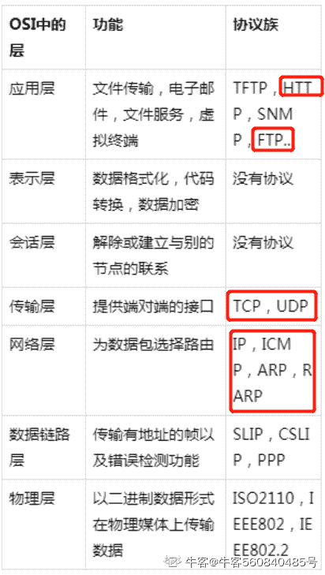
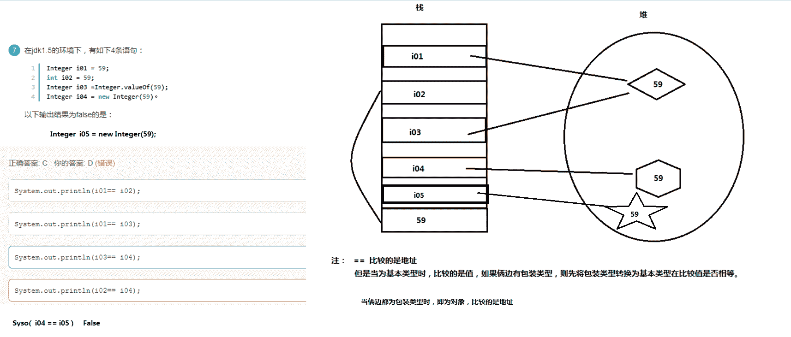
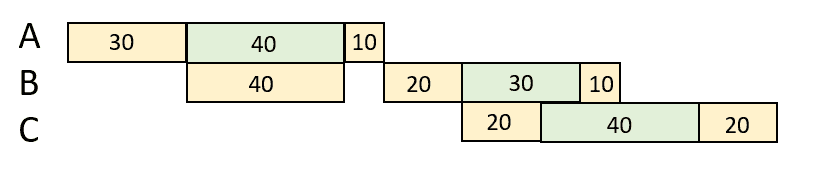
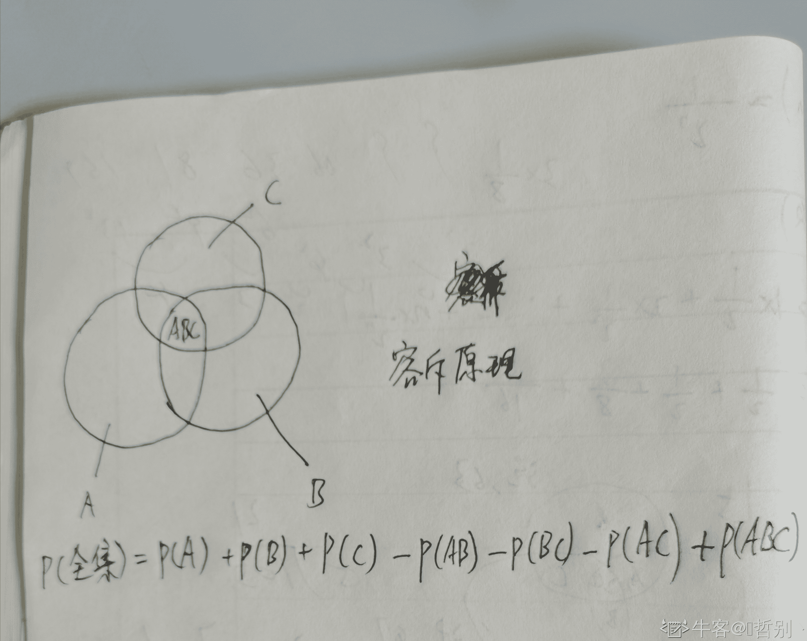
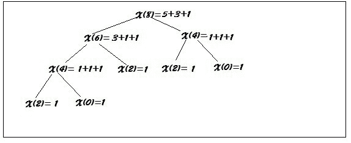
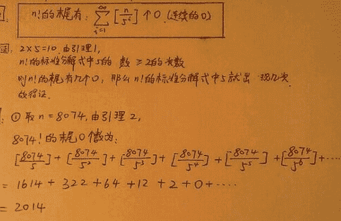

# 完美世界 2016 研发工程师笔试题

## 1

以下哪个协议属于传输层协议？

正确答案: B   你的答案: 空 (错误)

```cpp
FTP
```

```cpp
UDP
```

```cpp
IP
```

```cpp
HTTP
```

本题知识点

网络基础

讨论

[公众号「我不是匠人」](https://www.nowcoder.com/profile/936070)

FTP 是文件传输协议,在应用层 UDP 在传输层 IP 在网络层 HTTP 在应用层，常用端口号 80

发表于 2016-08-30 16:44:47

* * *

[shiyue1991](https://www.nowcoder.com/profile/4114559)

传输层协议有 TCP/UDP，IP 协议属于网络层，而 FTP 与 HTTP 属于应用层。

发表于 2016-08-20 16:59:13

* * *

[softwareGxy](https://www.nowcoder.com/profile/560840485)

FTP 与 HTTP 属于**应用层。****传输层**协议有 TCP/UDP，IP 协议属于**网络层**，

发表于 2020-03-27 12:09:52

* * *

## 2

以下哪个算法不是对称加密算法()

正确答案: D   你的答案: 空 (错误)

```cpp
DES
```

```cpp
RC5
```

```cpp
AES
```

```cpp
RSA
```

本题知识点

加密和安全

讨论

[Pandora](https://www.nowcoder.com/profile/266279)

D. RSA Ref:http://www.willrey.com/support/ssl_DES.html
常见对称加密算法：
**DES**（Data Encryption Standard）：数据加密标准，速度较快，适用于加密大量数据的场合；
3DES（Triple DES）：是基于 DES，对一块数据用三个不同的密钥进行三次加密，强度更高；
**AES**（Advanced Encryption Standard）：高级加密标准，是下一代的加密算法标准，速度快，安全级别高。
**RC5**：分组加密算法，通过异或，加与循环操作加密，是对称的。
常见的非对称加密算法：
**RSA**：由 RSA 公司发明，是一个支持变长密钥的公共密钥算法，需要加密的文件块的长度也是可变的；
DSA（Digital Signature Algorithm）：数字签名算法，是一种标准的 DSS（数字签名标准）；
ECC（Elliptic Curves Cryptography）：椭圆曲线密码编码学。

编辑于 2016-05-22 10:26:43

* * *

[小白 J 牛客 1588314 号](https://www.nowcoder.com/profile/1588314)

对称加密算法：DES,3DES,AES,RC5，Bloowfish,IDEA,TDEA 非对称加密算法：RSA，DSA 不可逆：MD5，SHA1，CRC

发表于 2017-06-26 15:15:57

* * *

[一颗放牛的小葱](https://www.nowcoder.com/profile/254289489)

D. RSA Ref:http://www.willrey.com/support/ssl_DES.html 常见对称加密算法： DES（Data Encryption Standard）：数据加密标准，速度较快，适用于加密大量数据的场合； 3DES（Triple DES）：是基于 DES，对一块数据用三个不同的密钥进行三次加密，强度更高； AES（Advanced Encryption Standard）：高级加密标准，是下一代的加密算法标准，速度快，安全级别高。 RC5：分组加密算法，通过异或，加与循环操作加密，是对称的。 常见的非对称加密算法： RSA：由 RSA 公司发明，是一个支持变长密钥的公共密钥算法，需要加密的文件块的长度也是可变的； DSA（Digital Signature Algorithm）：数字签名算法，是一种标准的 DSS（数字签名标准）； ECC（Elliptic Curves Cryptography）：椭圆曲线密码编码学。

发表于 2018-06-26 14:14:03

* * *

## 3

在多线程系统中，线程在它的生命周期中会处于不同的状态，其中不是线程状态的是:()

正确答案: B   你的答案: 空 (错误)

```cpp
Ready
```

```cpp
Busied
```

```cpp
Blocked
```

```cpp
Running
```

本题知识点

操作系统

讨论

[Salmon-William](https://www.nowcoder.com/profile/5163561)

线程五大状态：new(新建），ready(就绪),running（运行），blocked（阻塞），dead（死亡）

发表于 2017-09-28 08:57:55

* * *

[SunburstRun](https://www.nowcoder.com/profile/557336)

答案是 B          A 是就绪,C 是阻塞,D 是运行,B 是繁忙,所以选 B

发表于 2015-11-03 12:08:42

* * *

[大橘已定](https://www.nowcoder.com/profile/6994957)

[从源码解读线程（Thread）和线程池（ThreadPoolExecutor）的状态](https://www.cnblogs.com/sgh1023/p/10528000.html)

发表于 2019-03-26 16:24:07

* * *

## 4

设数组 data[m]作为循环队列的存储空间。front 为队头指针，rear 为队尾指针，则执行出队操作后其头指针 front 值为()

正确答案: D   你的答案: 空 (错误)

```cpp
front=front+1
```

```cpp
front=(front+1)%(m-1)
```

```cpp
front=(front-1)%m
```

```cpp
front=(front+1)%m
```

本题知识点

队列 *讨论

[zhisheng_blog](https://www.nowcoder.com/profile/616717)

**循环队列的相关条件和公式：**  
队尾指针是 rear,队头是 front，其中 QueueSize 为循环队列的最大长度  
1.队空条件：rear==front  
2.队满条件：(rear+1) %QueueSIze==front  
3.计算队列长度：（rear-front+QueueSize）%QueueSize  
4.入队：（rear+1）%QueueSize  
5.出队：（front+1）%QueueSize

发表于 2016-08-25 08:39:59

* * *

[奔跑的威威](https://www.nowcoder.com/profile/864907)

循环队列的存储空间是固定的为 m，执行出队操作之后，front 指针向后一位，则 front = (front+1)%m

发表于 2015-12-15 22:35:12

* * *

[起名可真的是太难了](https://www.nowcoder.com/profile/8457649)

Front 和 rear 指针的移动采用“加 1 取余”法，体现了顺序存储的“循环使用”。 

发表于 2017-12-28 22:49:07

* * *

## 5

下列关于管道(Pipe)通信的叙述中，正确的是()

正确答案: C   你的答案: 空 (错误)

```cpp
一个管道可以实现双向数据传输
```

```cpp
管道的容量仅受磁盘容量大小限制
```

```cpp
进程对管道进行读操作和写操作都可能被阻塞
```

```cpp
一个管道只能有一个读进程或一个写进程对其操作
```

本题知识点

Linux

讨论

[SunburstRun](https://www.nowcoder.com/profile/557336)

管道实际上是一种固定大小的缓  查看全部)

编辑于 2015-11-03 12:21:02

* * *

[Linsanity](https://www.nowcoder.com/profile/7457652)

A：由于管道采用半双工通信方式。因此，数据只能在一个方向上流动，A 错 B： 管道是由内核管理的一个缓冲区，其容量受多方面因素影响，包括缓冲区的大小、磁盘容量大小等问题 C： 当管道中没有信息的话，从管道中读取的进程会等待，直到另一端的进程放入信息。当管道被放满信息的时候，尝试放入信息的进程会等待，直到另一端的进程取出信息。当两个进程都终结的时候，管道也自动消失。进程对管道进行读操作和写操作都可能被阻塞，因此**C 正确****D：** 管道的一端连接一个进程的输出。这个进程会向管道中放入信息。管道的另一端连接一个进程的输入，这个进程取出被放入管道的信息，管道可以同时进行读进程和写进程**参考网址：[`www.cnblogs.com/biyeymyhjob/archive/2012/11/03/2751593.html`](http://www.cnblogs.com/biyeymyhjob/archive/2012/11/03/2751593.html)**

发表于 2017-06-14 23:00:40

* * *

[雪儿是个好姑娘](https://www.nowcoder.com/profile/848221)

管道是半双工的，读写不能同时双向进行数据操作。管道的容量还受其它因素的影响，管道缓冲区的大小也会影响程序的执行结果。管道必须打开一个读端和一个写端。若写端关闭，读端只能返回 0。如读端关闭，写端返回错误值-1

发表于 2015-11-20 15:32:37

* * *

## 6

已知数组元素基本有序的情况下，下面采用那个算法对数组排序时间复杂度最低()

正确答案: D   你的答案: 空 (错误)

```cpp
直接选择排序
```

```cpp
堆排序
```

```cpp
快速排序
```

```cpp
直接插入排序
```

本题知识点

排序 *讨论

[SunburstRun](https://www.nowcoder.com/profile/557336)

因为数组元素，基本有序，所以  查看全部)

编辑于 2015-11-03 12:21:16

* * *

[牛客 299264447 号](https://www.nowcoder.com/profile/299264447)

逆序算有序吗？算的话 用插入排序不是崩溃了

发表于 2022-01-03 23:58:39

* * *

[我会回来的呢](https://www.nowcoder.com/profile/310331371)

选择排序与初始序列无关，都是 O(n)。

在有序的情况下使用选择排序，交换次数会很少，但是比较次数不变。所以如果单问“交换次数”，可以是选择排序

发表于 2019-11-01 08:24:47

* * *

## 7

下面关于 B 和 B+树的描述中，不正确的是()

正确答案: C   你的答案: 空 (错误)

```cpp
B 树和 B+树都是平衡的多叉树
```

```cpp
B 树和 B+树都可用于文件的索引结构
```

```cpp
B 树和 B+树都能有效的支持顺序检索
```

```cpp
B 树和 B+树都能有效的支持随机检索
```

本题知识点

树

讨论

[SunburstRun](https://www.nowcoder.com/profile/557336)

答案是 CB 树只适用于随  查看全部)

编辑于 2015-11-03 12:23:30

* * *

[薛定谔之喵](https://www.nowcoder.com/profile/519263)

 ①B 树和 B+树用于组织文件的动态索引结构。 ②B 树和 B+树都是平衡的多分支树。 ③*B 树只适用于随机检索*,不适用于顺序检索, 而 B+树适用于顺序检索和随机检索

发表于 2016-03-07 21:17:01

* * *

[我叫 mx](https://www.nowcoder.com/profile/4803882)

顺序检索就像是有序链表一样的检索，B+树的只有叶子节点存放关键字，且所有叶子节点依次连接，就像一个有序链表，因此可以顺序检索；

发表于 2017-08-03 11:03:35

* * *

## 8

关于依赖注入，下列选项中说法错误的是()

正确答案: B   你的答案: 空 (错误)

```cpp
依赖注入能够独立开发各组件，然后根据组件间关系进行组装
```

```cpp
依赖注入使组件之间相互依赖，相互制约
```

```cpp
依赖注入提供使用接口编程
```

```cpp
依赖注入指对象在使用时动态注入
```

本题知识点

编程基础 *讨论

[huixieqingchun](https://www.nowcoder.com/profile/551201)

**依赖注入可以降低组件之间的耦合度。而不是增加依赖程度。**

发表于 2016-06-02 20:46:55

* * *

[心静](https://www.nowcoder.com/profile/437950)

依赖注入主要有两个好处：
(1). 解耦，将依赖之间解耦。
(2). 因为已经解耦，所以方便做单元测试，尤其是 Mock 测试。

发表于 2015-11-06 22:25:07

* * *

[Ｍe 怤畢炜 eＭ](https://www.nowcoder.com/profile/215299)

B 正好说反了...

发表于 2016-08-10 13:01:36

* * *

## 9

下列哪个地址不可能是子网掩码()

正确答案: D   你的答案: 空 (错误)

```cpp
255.224.0.0
```

```cpp
255.255.240.0
```

```cpp
255.255.255.248
```

```cpp
255.255.255.250
```

本题知识点

网络基础

讨论

[SunburstRun](https://www.nowcoder.com/profile/557336)

答案是 D  查看全部)

编辑于 2015-11-03 12:12:44

* * *

[Michael_ 翔 _](https://www.nowcoder.com/profile/264971)

| 2⁷ | 2⁶ | 2⁵ | 2⁴ | 2³ | 2² | 2¹ | 2⁰ |
| 128 | 64 | 32 | 16 | 8 | 4 | 2 | 1 |

这样，就能快速判断例如 250 是转换成 2 进制的数字了 128+64+32+16+8+2：11111010

发表于 2016-04-13 16:03:08

* * *

[马月月](https://www.nowcoder.com/profile/8024187)

从左到右，所有的 1 必须是连续的。显然 D 不符合。

发表于 2017-06-10 00:03:57

* * *

## 10

若一颗二叉树具有 10 个度为 2 的节点，5 个度为 1 的节点，度为 0 的节点个数为()

正确答案: B   你的答案: 空 (错误)

```cpp
9
```

```cpp
11
```

```cpp
15
```

```cpp
不确定
```

本题知识点

树

讨论

[行走的 VCD](https://www.nowcoder.com/profile/200)

正确答案：B 叶子节点 n，与度为 2 的节点 n0 的关系是，n = n0 + 1

发表于 2015-11-03 14:08:44

* * *

[InGodWeTrust](https://www.nowcoder.com/profile/2178882)

度为 0 的节点总比度为 2 的节点多一个，和度为 1 的节点没任何关系。

发表于 2017-04-06 19:22:55

* * *

[新垣结衣前夫](https://www.nowcoder.com/profile/524476)

对任何一个二叉树，度为 0 的点（即 [叶子节点](https://www.baidu.com/s?wd=%E5%8F%B6%E5%AD%90%E8%8A%82%E7%82%B9&tn=44039180_cpr&fenlei=mv6quAkxTZn0IZRqIHckPjm4nH00T1YLuHubuWnkn19-m1cLnHwh0ZwV5Hcvrjm3rH6sPfKWUMw85HfYnjn4nH6sgvPsT6KdThsqpZwYTjCEQLGCpyw9Uz4Bmy-bIi4WUvYETgN-TLwGUv3EnWcYPH61nH0z) ）总是比度为 2 的结点多一个。这是二叉树的主要性质之一。

发表于 2016-04-26 18:55:10

* * *

## 11

在 Java 中，以下关于方法重载和方法重写描述正确的是？

正确答案: D   你的答案: 空 (错误)

```cpp
方法重载和方法的重写实现的功能相同
```

```cpp
方法重载出现在父子关系中，方法重写是在同一类中
```

```cpp
方法重载的返回值类型必须一致，参数项必须不同
```

```cpp
方法重写的返回值类型必须相同或相容。
```

本题知识点

Java

讨论

[songhongyu](https://www.nowcoder.com/profile/730294)

目前的问题：父类的功能无法满足子类的需求。方法重写的前提： 必须要存在继承的关系。方法的重写: 子父类出了同名的函数，这个我们就称作为方法的重写。什么是时候要使用方法的重写：父类的功能无法满足子类的需求时。方法重写要注意的事项：    1.方法重写时， 方法名与形参列表必须一致。    2.方法重写时，子类的权限修饰符必须要大于或者等于父类的权限修饰符。    3.方法重写时，子类的返回值类型必须要小于或者 等于父类的返回值类型。    4.方法重写时， 子类抛出的异常类型要小于或者等于父类抛出的异常类型。            Exception(最坏)            RuntimeException(小坏)方法的重载：在一个类中 存在两个或者两个 以上的同名函数,称作为方法重载。方法重载的要求    1\. 函数名要一致。    2\. 形参列表不一致（形参的个数或形参 的类型不一致）    3\. 与返回值类型无关。

发表于 2016-10-09 21:31:06

* * *

[蜡笔小树](https://www.nowcoder.com/profile/692760)

总是傻傻分不清重载和重写，一直是按照 overriding 和 overload 记忆的，中文真是博大精深啊。重载（overload）：只要方法名 ***一致*** ，其他（参数列表、返回值）怎么折腾随便。重写（overriding）：只有实现的功能代码 ***不一致*** ，其他的（函数名、参数列表、返回值类型）必须都一致。

发表于 2016-03-26 10:58:49

* * *

[枫风风](https://www.nowcoder.com/profile/6893939)

**方法的重写 Override 要遵循“两同两小一大”规则：**①“两同”即方法名相同，形参列表相同；②“两小”指的是子类方法返回值类型应比父类方法返回值类型更小或相等，子类方法声明抛出的异常类应比父类方法声明抛出的异常类更小或相等；③“一大”指的是子类方法的访问权限应比父类方法的访问权限更大或相等。注：构造方法不受以上规则约束；**方法的重载 Overload 要注意以下的几点：**①在使用重载时只能通过不同的参数样式。例如，不同的参数类型，不同的参数个数，不同的参数顺序；②不能通过访问权限、返回类型和抛出异常的差异进行重载；③方法的异常类型和数目不会对重载造成影响；

编辑于 2017-03-18 20:37:23

* * *

## 12

下面有关 JVM 内存，说法错误的是？

正确答案: C   你的答案: 空 (错误)

```cpp
程序计数器是一个比较小的内存区域，用于指示当前线程所执行的字节码执行到了第几行，是线程隔离的
```

```cpp
Java 方法执行内存模型，用于存储局部变量，操作数栈，动态链接，方法出口等信息，是线程隔离的
```

```cpp
方法区用于存储 JVM 加载的类信息、常量、静态变量、即时编译器编译后的代码等数据，是线程隔离的
```

```cpp
原则上讲，所有的对象都在堆区上分配内存，是线程之间共享的
```

本题知识点

Java

讨论

[Albertnet](https://www.nowcoder.com/profile/9020120)

运行时数据区包括：程序计数器、虚拟机栈、本地方法栈、Java 堆、方法区以及方法区中的运行时常量池

1、程序计数器： 线程私有，是当前线程所执行的字节码的行号指示器，如果线程正执行一个 java 方法，计数器记录正在执行的虚拟机字节码指令的地址，如果线程正在执行的是 Native 方法，则计数器值为空；

2、虚拟机栈： 即栈区， 线程私有 ，为虚拟机执行 Java 方法（字节码）服务，每个方法在执行的时会创建一个栈帧用于存放局部变量表、操作数栈、动态链接和方法出口等信息，每个方法的调用直至执行完成对应于栈帧的入栈和出栈；

3、本地方法栈： 为虚拟机使用的 N ative 方法服务，也是 线程私有 ；

4、Java 堆： 在虚拟机启动时创建， 线程共享 ，唯一目的是存放对象实例，是垃圾收集器管理的主要区域——” GC 堆“，可以细分为新生代和老年代，新生代又可以细分为 Eden 空间、 From Survivor 空间和 To Survivor 空间；物理上可以不连续，但逻辑上连续，可以选择固定大小或者扩展；

5、方法区： 线程共享 ，用于存储被虚拟机加载的类信息、常量、静态变量、即时编译器编译后的代码等数据。被称为“永久代”，是因为 H otSpot 虚拟机的设计团队把 GC 分代收集扩展到方法区，即使用永久代来实现方法区，像 GC 管理 Java 堆一样管理方法区，从而省去专门为方法区编写内存管理代码，内存回收目标是针对常量池的回收和堆类型的卸载；

6、运行时常量池： 线程共享 ，是方法区的一部分， C lass 文件中存放编译期生成的各种字面量和符号引用，类加载后进入方法区的运行时常量池中。答案就是 C 错，方法区应该是线程共享的。

编辑于 2017-03-19 10:49:31

* * *

[StrongYoung](https://www.nowcoder.com/profile/649626)

运行时数据区包括：虚拟机栈区，堆区，方法区，本地方法栈，程序计数器

**虚拟机栈区** ：也就是我们常说的栈区，**线程私有**，存放基本类型，对象的引用和 returnAddress ，在编译期间完成分配。

**堆区** ， JAVA 堆，也称 GC 堆，所有**线程共享**，存放对象的实例和数组， JAVA 堆是垃圾收集器管理的主要区域。

**方法区** ：所有**线程共享**，存储已被虚拟机加载的类信息，常量，静态变量，即时编译器编译后的代码等数据。这个区域的内存回收目标主要是针对常量池的对象的回收和对类型的卸载。

**程序计数器** ：**线程私有**，每个线程都有自己独立的程序计数器，用来指示下一条指令的地址。

发表于 2015-11-07 21:47:17

* * *

[菩提旭光](https://www.nowcoder.com/profile/837579)

**选择题总有技巧可言：****C 中静态变量肯定是共享的啊，怎么可能是线程隔离的呢？肯定选 C**

发表于 2016-03-21 15:51:56

* * *

## 13

C++中，下面四个表达式中错误的一项是()

正确答案: C   你的答案: 空 (错误)

```cpp
a+=(a++)
```

```cpp
a+=(++a)
```

```cpp
(a++)+=a
```

```cpp
(++a)+=(a++)
```

本题知识点

C++

讨论

[SunburstRun](https://www.nowcoder.com/profile/557336)

A： a+=(a++)    查看全部)

编辑于 2015-11-03 12:19:28

* * *

[一动不动](https://www.nowcoder.com/profile/5087061)

首先要反对说“++i 先自加，i++后自加”的，两者的差异是返回值不同。这道题涉及到++i 和 i++的概念，以及函数返回值能否作为左值。以整形数据为例：++i：

```cpp
int pre_increment(int &a){ a=a+1; return a; }
```

函数返回的引用类型可以作为左值。i++：

```cpp
int post_increment(int &a){ int temp=a; a=a+1; return temp; } 
```

函数返回的一般类型不能作为左值。所以选择 C

编辑于 2017-09-20 16:15:26

* * *

[张客牛](https://www.nowcoder.com/profile/733369)

i++:

```cpp
int temp;
temp = i;
i = i + 1;
return temp;
```

++i:

```cpp
int temp;
temp = i;
i = i + 1;
return i;
```

C:(a++)+=a;  左值首先 return temp 的地址值导致 error:left operand must be l-value

发表于 2015-12-27 12:02:04

* * *

## 14

多线程中栈与堆是公有的还是私有的()

正确答案: C   你的答案: 空 (错误)

```cpp
栈公有，堆私有
```

```cpp
栈公有，堆公有
```

```cpp
栈私有，堆公有
```

```cpp
栈私有，堆私有
```

本题知识点

操作系统

讨论

[线上幽灵 007](https://www.nowcoder.com/profile/4039680)

堆在一起的东西，肯定是公用(公有)的，你占(栈)有的东西，肯定是你自己私有的。上面纯属娱乐，不过容易记忆。

编辑于 2018-06-27 23:28:22

* * *

[张星星](https://www.nowcoder.com/profile/716240)

```cpp
在多线程环境下，每个线程拥有一个栈和一个程序计数器。栈和程序计数器用来保存线程的执行历史和线程的执行状态，是线程私有的资源。其他的资源（比如堆、地址空间、全局变量）是由同一个进程内的多个线程共享
```

发表于 2015-12-23 15:09:37

* * *

[小洁子](https://www.nowcoder.com/profile/549519)

堆主要是动态静态分配内存空间，内存空间在内部环境是统一编址的，不会因为多了一个对象而复制另一块独立的内存空间给实例对象，而栈是存储临时变量等的，有一定生命周期，是多线程独立的。

发表于 2015-11-03 13:41:33

* * *

## 15

有如下 4 条语句：()

```cpp
Integer i01=59;
int i02=59;
Integer i03=Integer.valueOf(59);
Integer i04=new Integer(59);
```

以下输出结果为 false 的是:

正确答案: C   你的答案: 空 (错误)

```cpp
System.out.println(i01==i02);
```

```cpp
System.out.println(i01==i03);
```

```cpp
System.out.println(i03==i04);
```

```cpp
System.out.println(i02==i04);
```

本题知识点

Java

讨论

[笔墨桑](https://www.nowcoder.com/profile/485624)

C 这道题我是选错  查看全部)

编辑于 2015-12-07 17:45:36

* * *

[请叫我猿叔叔](https://www.nowcoder.com/profile/6316247)



发表于 2016-07-17 21:20:44

* * *

[秦王](https://www.nowcoder.com/profile/406719)

①无论如何，Integer 与 new Integer 不会相等。不会经历拆箱过程，
  ②两个都是非 new 出来的 Integer，如果数在-128 到 127 之间，则是 true,否则为 false
  java 在编译 Integer i2 = 128 的时候,被翻译成-> Integer i2 = Integer.valueOf(128);而 valueOf()函数会对-128 到 127 之间的数进行缓存
  ③两个都是 new 出来的,都为 false
  ④int 和 integer(无论 new 否)比，都为 true，因为会把 Integer 自动拆箱为 int 再去比

发表于 2015-11-29 15:36:32

* * *

## 16

设有 5000 个待排序的记录的关键字，如果需要用最快的方法选出其中最小的 10 个记录关键字，则用下列哪个方法可以达到此目的()

正确答案: B   你的答案: 空 (错误)

```cpp
快速排序
```

```cpp
堆排序
```

```cpp
归并排序
```

```cpp
插入排序
```

本题知识点

排序 *讨论

[牛客 7637873 号](https://www.nowcoder.com/profile/7637873)

    选择最大的 N 个数，建立 N 个节点的小顶堆选择最小的 N 个数，就建立 N 个节点的大顶堆这样可以在 O（nlogN）    \\其实就是 O(n)时间内完成前 N 个数的选择。

发表于 2017-10-19 15:24:41

* * *

[LauZyHou](https://www.nowcoder.com/profile/8203811)

剑指 Offer 上有这题，可以用 10 容量最大堆，堆满了后每次和堆顶比较，如果小就把堆顶删了，再把这个数放进去，最后堆里就是 10 个最小的数了。---------------------------------------------------------------------
高票答案解析的没问题，但是第一句话【这个题的宗旨是以最短的时间达到**局部有序**】这句话显然是错的，不知道为啥他这样写。。。

发表于 2018-09-22 10:10:54

* * *

[农民揣的二狗](https://www.nowcoder.com/profile/260179)

对于堆排序，首先我们要做的是建立最小堆，这个过程耗费 O（n）的时间复杂度，而后从最小堆中抽取 10 个最小的数，耗费 O（1）的时间复杂度。所以完成操作所需总的复杂度为 O（n）。

发表于 2016-01-18 12:39:55

* * *

## 17

三个程序 a,b,c,它们使用同一个设备进行 I/O 操作，并按 a,b,c 的优先级执行(a 优先级最高，c 最低).这三个程序的计算和 I/O 时间如下图所示。假设调度的时间可忽略。则在单道程序环境和多道程序环境下(假设内存中可同时装入这三个程序，系统采用不可抢占的调度策略).运行总时间分别为() 计算 I/O 计算 a   30   40  10b   60   30  10c   20   40  20

正确答案: A   你的答案: 空 (错误)

```cpp
260,180
```

```cpp
240,180
```

```cpp
260,190
```

```cpp
240,190
```

本题知识点

编译和体系结构

讨论

[图波列夫](https://www.nowcoder.com/profile/456780)

对于多道程序，

|   | 1  | 2  | 3  | 4  | 5  | 6  | 7  | 8  | 9  | 10  | 11  | 12  | 13  | 14  | 15  | 16  | 17  | 18  |
| A  |   |   |   |   |   |   |   |   |   |   |   |   |   |   |   |   |   |   |
| B  |   |   |   |   |   |   |   |   |   |   |   |   |   |   |   |   |   |   |
| C  |   |   |   |   |   |   |   |   |   |   |   |   |   |   |   |   |   |   |

编辑于 2016-08-27 15:01:30

* * *

[折耳猫](https://www.nowcoder.com/profile/984997)

黄色是计算时间，绿色是 I/O 输出时间，多道程序环境下运行时间如图所示为 30+40+10+20+80=180 单道时运行时间为 80+100+80=260

发表于 2015-11-09 10:53:32

* * *

[ywang2016](https://www.nowcoder.com/profile/864339)

答案应该是 260， 190 多道程序执行流程分析：1.30 分钟：  a 占用 cpu2.40 分钟：b 占用 cpu，a 占用 IO3.10 分钟：a 占用 cpu4.20 分钟：b 占用 cpu5.30 分钟：c 占用 cpu(20 分钟)，b 占用 IO6.40 分钟：b 占用 cpu(10 分钟)，c 占用 IO7.20 分钟，c 占用 cpu

发表于 2016-08-10 17:29:42

* * *

## 18

6 支笔，其笔身和笔帽颜色相同：但 6 支笔颜色各不相同，求全部笔身都戴错笔帽的可能性有多少种？

正确答案: A   你的答案: 空 (错误)

```cpp
265
```

```cpp
266
```

```cpp
267
```

```cpp
268
```

本题知识点

组合数学 *讨论

[SunburstRun](https://www.nowcoder.com/profile/557336)

答案是 A   查看全部)

编辑于 2015-11-03 12:26:08

* * *

[Willy](https://www.nowcoder.com/profile/6703097)

如果赶时间，可以这样：首先结果肯定是 5 的倍数（6-1）；然后选 A

发表于 2016-09-06 11:58:12

* * *

[Terence_Ge](https://www.nowcoder.com/profile/843241)

我来讲一下原理：笔的 ID 为：1， 2 ， 3， 4， 5 笔帽的 ID 为：11， 22， 33， 44， 551->11, 2->22, 3->33, 4->44, 5->55 符号 -> 表示对应的意思。上面的是求函数 f(5)，f(5)表示五个笔的全部错排可能性。下面过程：1.对于笔 1 而言，有 22,33,44,55 四种选择 2\. 假设笔 1 选择了 22,3.那么剩下的结果是： 2,3,4,5 -> 11,33,44,55 , 这样的对应方式有几种可能，可以分为下面 4,5 两种情况。4.如果 2->11， 那么剩下 3,4,5->33,44,55， 可能性为 f(3)；5.如果 2->33 / 44/ 55， 也就是 2 对应 33,44,55 中的任意一个，2 不对应到 11，那么此时将 2 换为 1 的结果是等价的。6.因此 2->33/44/55 时，该问题等价为 1,3,4,5 -> 11,33,44,55\.7\. 综上 f(5) = (5-1) * (1 * f(3) + f(4) );由此，我们就可以得到通用公式 f(n) = (n-1) * (f(n-1) + f(n-2))

发表于 2016-03-29 15:59:01

* * *

## 19

已知有序序列 b c d e f g q r s t,则在二分查找关键字 b 的过程中，先后进行比较的关键字依次是多少?()

正确答案: B   你的答案: 空 (错误)

```cpp
f d b
```

```cpp
f c b
```

```cpp
g c b
```

```cpp
g d b
```

本题知识点

查找 *讨论

[小洁子](https://www.nowcoder.com/profile/549519)

b c d e f g q r s t 二分查找，折半法① low = 0,high = 9,mid = (low+ high)/2=4,  ∴  'b'比较 a[4]='f'，＜,找左边 ( b~e )② low = 0,high = mid-1 = 3, mid = 3/2=1, ∴ 'b'比较 a[1]='c' , ＜，找左边（b~b）③ low = 0,high = mid -1 = 0,mid = 0,∴ 'b' 比较 a[0] = 'b'，找到（若未找到，low=high，也停止查找）所以比较的顺序就是 f c b

编辑于 2016-02-29 13:50:40

* * *

[PYQ](https://www.nowcoder.com/profile/242360)

注意二分查找每次的下标并不是直接取原来，而是会减一；并且当 mid 为奇数时，mid/2 是向下取整。

发表于 2019-10-09 18:22:27

* * *

[GS2.0](https://www.nowcoder.com/profile/6480480)

第一次 mid=(0+9)/2=4,偏大后向左查找，此时 high=mid-1=3，第二次 mid(0+3)/2=1,仍然偏大，继续向左查找，此时 high=mid-1=0 第三次 mid=(0+0)/2=0,查找到 key=f,成功；所以答案依次为对应的索引：f，c，b

发表于 2018-07-02 13:49:21

* * *

## 20

如果待排序的数组近似递减排序，则此时使用快排算法进行递增排序的时间复杂度为()

正确答案: B   你的答案: 空 (错误)

```cpp
O(n)
```

```cpp
O(n²)
```

```cpp
O(nlogn)
```

```cpp
O((n²)*logn)
```

本题知识点

排序 *讨论

[搞事情](https://www.nowcoder.com/profile/208980)

最坏的情况，待排序的序列为正序或者逆序，每次划分只得到一个比上一次划分少一个的子序列，另外一个为空。如果递归树画出来，就是一颗斜树。此时需要执行 n-1 次递归调用，且第 i 次划分需要经（n-i）次关键字比较才能找到才能找到第 i 个记录，因此比较的次数为(n-1)+(n-2)+...+1 = n*(n-1)/2，最终时间复杂度为 O(n²).

发表于 2016-03-09 09:36:27

* * *

[orzOrzorzOrz](https://www.nowcoder.com/profile/374725)

如果本来就是要排成递增，已经近似递增，用快排还是 O（n²）?如果，采取随机枢纽值呢》？

发表于 2015-11-10 18:12:25

* * *

[倚杖听江声](https://www.nowcoder.com/profile/1092167)

退化为了冒泡排序，而冒泡排序的时间复杂度为 O（n2）。

发表于 2018-08-28 15:20:34

* * *

## 21

1000 以内与 105 互质的偶数有多少个?

正确答案: C   你的答案: 空 (错误)

```cpp
227
```

```cpp
228
```

```cpp
229
```

```cpp
230
```

本题知识点

智力题

讨论

[SunburstRun](https://www.nowcoder.com/profile/557336)

答案是 C  查看全部)

编辑于 2015-11-03 12:27:05

* * *

[哲别丶 LuTan](https://www.nowcoder.com/profile/656457385)



发表于 2020-05-20 17:47:09

* * *

[新世纪的神](https://www.nowcoder.com/profile/204696)

一个交集问题因为 105=3*5*7 偶数总数 500 不互质的偶数的个数：被 6 整除+被 10 整除+被 14 整除-被 30 整除-被 70 整除-被 42 整除+被 210 整除即 166+100+71-33-14-23+4=271 互质偶数即是:500-271=229

发表于 2016-10-17 01:46:59

* * *

## 22

函数 x 的定义如下,问 x(x(8))需要调用几次函数 x(int n)?

```cpp
int x(int n){
    cnt++;
    if (n <= 3){
        return 1; }
    else{
        return x(n - 2) + x(n - 4) + 1;
    }
}
```

正确答案: B   你的答案: 空 (错误)

```cpp
16
```

```cpp
18
```

```cpp
20
```

```cpp
22
```

本题知识点

C++ C 语言

讨论

[sandrew](https://www.nowcoder.com/profile/583205)

```cpp

            发表于 2016-03-02 16:00:49

            [zt_xcyk](https://www.nowcoder.com/profile/839070)

  

  把 x(8)的值算出来 ，然后和上面画法一样  最后是 18 

            发表于 2015-11-13 14:39:44

            [任家硕](https://www.nowcoder.com/profile/4586436)

                                                                      x(8) 

  x(6) + x(4) + 1 

  (x(4) + x(2) + 1) + (x(2) + x(0) + 1) + 1 

  ((x(2) + x(0) + 1) + x(2) + 1) + (x(2) + x(0) + 1) + 1 = 9 

  9 次 

  x(9) 1 次 

  x(7) + x(5) + 1 

  x(5) 3 次 

  x(7) 5 次 

  9 + 1 + 3 + 5 = 18 

            发表于 2016-12-01 00:02:52

        23
        2015!后面有几个 0?

    正确答案:
                                                                  C
                                        你的答案:

                  空
                             (错误)

```
500
```cpp

```
501
```cpp

```
502
```cpp

```
503
```cpp

本题知识点

                                                            数学运算 

讨论

[传奇](https://www.nowcoder.com/profile/527777)

                                                                    1.每含一个 5 产生一个 0，共有 2015/5=403 个，2.此外每含一个 25 将会和 4 结合产生两个 0，相当于在 5 的基础上又额外产生一个 0，总共会额外产生 2015/25=80 个，3.每含一个 125 会产生三个 0，相当于再额外产生一个 0，共有 2015/125=16 个，4.每含一个 625 会产生 4 个 0，相当于再额外产生一个 0，共有 2015/625=3 个。所以总共会产生 403+80+16+3=502 个 0

发表于 2016-07-21 18:04:28

* * *

[月夜另风](https://www.nowcoder.com/profile/567875)

  

  2015/5+2015/25+2015/125+2015/625=403+80+16+3=502 

发表于 2015-11-04 22:28:03

* * *

[HanaGo](https://www.nowcoder.com/profile/493754)

                                                                      1\. 每一个 10 有一个 0，1-2015***有 2015/10=**201**个 10 
  2\. 每一个 5 和一个 2 有一个 0,1-2015***有 201+1=**202**个 5 
  3\. 注意：25*4 会产生 2 个零，共有 2015/25=**80**个 25 
                 125*8 会产生 3 个零，共有 2015/125=**16**个 125 
                  625*16 会产生 4 个零，共有 2015/625=**3**个 625 

  总数=201+202+（80*2-80）+（16*3-16-16）+（3*4-3-3-3）=201+202+80+16+3=502。 
  划线的表示减去被覆盖的部分。比如，80 个 25 产生的 160 个 0 中，包含有 80 个 0 是由 5 产生的。 

发表于 2016-05-16 14:47:48

* * *

## 24

          输入一个字符串,要求输出字符串中字符所有的排列,例如输入"abc",得到"abc","acb","bca","bac","cab","cba"

你的答案

本题知识点

                                                            编程基础  *讨论

[Terence_Ge](https://www.nowcoder.com/profile/843241)

                                                                      //递归实现，30 行，clean 
  #include<iostream> 
  #include<vector> 
  #include<string> 
  using namespace std; 

  vector<string> result; 

  void permute(string& str, int depth, int n){ 
      if(depth == n){ 
           result.push_back(str); 
          return ; 
      } 
      for(int i = depth; i< n; i++){ 
          swap(str[depth],str[i]); 
          permute(str, depth+1, n); 
          swap(str[depth],str[i]); 
      } 
  } 

  int main(){ 
      string str; 
      cin>>str; 
      permute(str, 0, str.size()); 
      for(int i = 0; i < result.size(); i++){ 
          cout << result[i] << endl; 
      } 
       return  0; 
  } 

发表于 2016-03-29 16:08:24

* * *

[陈止风](https://www.nowcoder.com/profile/7020477)

```
// 利用 stl 快速得到枚举排列
#include <iostream>
#include <string>
#include <algorithm>
using namespace std;

int main() {
    string s;
    while (cin >> s) {
        sort(s.begin(), s.end());
        do {
            cout << s << ' ';
        } while (next_permutation(s.begin(), s.end()));
        cout << endl;
    }
    return 0;
}
```cpp

编辑于 2017-02-03 14:31:35

* * *

[流年飘散](https://www.nowcoder.com/profile/843986)

```
import java.util.Scanner;

public class Test {
	public static void main(String[] args) {
		Scanner in = new Scanner(System.in);
		String s = in.nextLine();
		char[] c = s.toCharArray();
		getFullSequence(c, 0);
		in.close();
	}

	private static void getFullSequence(char[] c, int key) {
		if (key == c.length) {
			System.out.println(String.valueOf(c));
		}
		for (int k = key; k < c.length; k++) {
			if (IsSwap(c, key, k)) {
				swap(c, key, k);
				getFullSequence(c, key + 1);
				swap(c, key, k);
			}
		}
	}

	private static boolean IsSwap(char[] c, int k, int key) {
		for (int m = k; m < key; m++) {
			if (c[m] == c[key]) {
				return false;
			}
		}
		return true;
	}

	private static void swap(char[] c, int k, int i) {
		char f;
		f = c[k];
		c[k] = c[i];
		c[i] = f;
	}

} 
```cpp

发表于 2016-08-17 17:42:26

* * *

## 25

        编写一个程序,将小于 n 的所有质数找出来。

你的答案

本题知识点

                                                            编程基础  *讨论

[牛客 1659416](https://www.nowcoder.com/profile/6422446)

```
#include <iostream>
#include <math.h>

using namespace std;

bool isprime(int num)
{
    for (int i=2; i<=sqrt(num); i++)
    {
        if (num%i==0)
        {
            return false;
            break;
        }
    }
    return true;
}
int main()
{
    int n;
    while(cin>>n)
    {
        for (int j=2; j<n-1; j++)
            if (isprime(j))
                cout << j << " ";
    }
    return 0;
}

```cpp

发表于 2018-04-26 19:37:30

* * *

[LEarBB](https://www.nowcoder.com/profile/708350)

```
#include <iostream>
#include <cmath>
#include <vector>

using namespace std;

bool isprime(int x)
{
	if (x <= 1) return false;
	else if (x == 2) return true;

	for (int i = 2; i <= sqrt(x); ++i)
	{
		if (x % i == 0) return false;
	}

	return true;
}

vector<int> getAllPrimes(int n)
{
	vector<int> res;
	if (n < 2) return res;

	for (int i = 2; i < n; ++i)
	{
		if (isprime(i))
			res.push_back(i);
	}

	return res;
}
int main(void)
{
	int n;
	cin >> n;
	vector<int> prms = getAllPrimes(n);

	for (auto p : prms)
		cout << p << " ";
	cout << endl;

	return 0;
}
```cpp

发表于 2016-01-29 19:43:41

* * *

[TX 游戏客户端开发内推](https://www.nowcoder.com/profile/2477440)

```
//质数 对 小于自己的质数 求余，不等于 0;且小于自己的质数 的范围在[2,sqat(n)]
#include <iostream>
#include <vector>
#include <cmath>
using namespace std;

vector<int> res;
vector<int> CalP(int n)
{     if(n<2)         return res;     res.push_back(2);     int i,j;     for(i=3;i<=n;++i)     {         for(j=0;j<res.size()&&res[j]<=sqrt(i);++j)         {             if(i%res[j]==0)                 break;         }         if(j==res.size()||res[j]>sqrt(i))             res.push_back(i);     }     return res;
}      int main()
{     int n=100;     CalP(n);     for(int i=0;i<res.size();++i)         cout<<res[i]<<endl;     return 0;
}

```cpp

发表于 2018-01-10 00:00:28

* * *

## 26

          在一次活动中,我们需要按可控的比例来随机发放我们的奖品,假设需要随机的物品 id 和概率都在给定的 Map<String,Double>prizeMap 中,请实现如下这个函数:
  String   getRandomPrize(Map<String,Double>prizeMap){}使得返回的结果为参与者
  即将得到的一个随机物品 id.

  prizeMap 中的数据为: 

> 物品 id     投放概率  
>      1            0.5  
>      2            0.3  
>      3            0.1  
>      4            0.95  
>      5\.           0.05

你的答案

        None

讨论

[TX 游戏客户端开发内推](https://www.nowcoder.com/profile/2477440)

  **详细分析请见我的博客：[`blog.csdn.net/BillCYJ/article/details/79018918`](http://blog.csdn.net/BillCYJ/article/details/79018918)**  

  **分析**  

  法 1：直接从左到右一次相加。每次相加都记录相加后的结果：0.5 0.8 0.9 1.85 1.9，if(产生的随机数<=0.5)则说明选到了物品 1,else if(产生的随机数<=0.8)则说明选到了物品 2，以此类推。
 法 2：将 0.5 0.3 0.1 0.95 0.05 按照比例映射为[0,1]之间的数，再将映射后的五个数从左到右相加。剩余步骤同法 1 后半部分。 

  我用的法 1 

  **所用数据结构：** map 和 string 

  **代码**  

```
#include 
#include 
#include //map 由红黑树实现，其中的关键字有序
using namespace std;
string getRandomPrize(map prizeMap)
{
    double sum=0;
    map::iterator iter=prizeMap.begin();
    map tempMap;
    while(iter!=prizeMap.end())
    {
        sum+=iter->second;
        tempMap.insert(pair(iter->first,sum));
        ++iter;
    }
    //计时器原理实现种子，若每次调用时都重新设置种子，那多次调用的结果相同
    //srand((unsigned)time(NULL));
    //产生[a，b]上的随机数 ((double)rand()/RAND_MAX)*(b-a) + a ,其中
    //(double)rand()/RAND_MAX)得一个 0~1 的随机数
    double total = (double(rand()) / RAND_MAX) * sum;//0 到 sum 间的浮点数
    map::iterator it=tempMap.begin();
    while(it!=tempMap.end())
    {
        if(total<(*it).second)
            return (*it).first;
        ++it;
    }
}
int main()
{
    map prizeMap = {{"1",0.5},{"2",0.3},{"3",0.1},{"4",0.95},
{"5",0.05}};
    int i=5000;
    srand((unsigned)time(NULL));//应在这设种子，这样每次调用结果才随机。
    while(i--)
        cout << getRandomPrize(prizeMap) << endl;
    return 0;
}
```cpp

编辑于 2018-01-10 02:16:12

* * *

[LEarBB](https://www.nowcoder.com/profile/708350)

```
#include <iostream>
#include <map>
#include <string>
#include <ctime>

using namespace std;

string getRandomPrize(map<string, double> hm)
{
	double all = 0.0;

	map<double, string> mp;
	map<string, double>::iterator it = hm.begin();
	while (it != hm.end())
	{
		all += (*it).second;
		mp.insert(pair<double, string>(all, (*it).first));
		++it;
	}

	srand((unsigned)time(NULL));
	double total = rand() / double(RAND_MAX) * all;

	map<double, string>::iterator mpit = mp.begin();
	while (mpit != mp.end())
	{
		if (total < (*mpit).first)
			return (*mpit).second;
		++mpit;
	}

	return "";
}

int main(void)
{
	map<string, double> hm;
	hm.insert(pair<string, double>("1", 0.5));
	hm.insert(pair<string, double>("2", 0.3));
	hm.insert(pair<string, double>("3", 0.1));
	hm.insert(pair<string, double>("4", 0.95));
	hm.insert(pair<string, double>("5", 0.05));

	while (1)
		cout << getRandomPrize(hm);

	return 0;
}
```cpp

发表于 2016-01-29 20:20:15

* * *

[taotaoahui](https://www.nowcoder.com/profile/454285)

                                                                      #include <iostream> 
  // 
  #include <map> 
  //#include <stdio.h> 
  #include <string> 
  // 
  #include <vector> 
  using namespace std; 

  string getRandomPrize(map<string, double> prizeMap) 
  { 

  map<string, double>::iterator it =
  prizeMap.begin(); 

  int i = rand()%5 + 1; 

  double ss = 0.0; 

  //i = 1; 

  char a[6]; 

  string str = _itoa(i, a, 6); 

  it = prizeMap.find(str); 

  // 

  char buff[20]; 

  sprintf_s(buff, "%0.2f", it->second); 

  string lala = buff; 

  cout << lala; 

  return lala; 
  } 

  int main() 
  { 

  map<string, double> hm; 

  hm.insert(pair<string,double>("1", 0.1)); 

  hm.insert(pair<string,
  double>(((string)"2").c_str(), 0.3)); 

  hm.insert(pair<string,
  double>(((string)"3").c_str(), 0.1)); 

  hm.insert(pair<string,
  double>(((string)"4").c_str(), 0.95)); 

  hm.insert(pair<string,
  double>(((string)"5").c_str(), 0.05)); 

  string s = getRandomPrize(hm); 

  system("pause"); 

  return 0; 

```
}
```cpp

 我写的我觉得还是有错。。。。

发表于 2016-04-21 09:17:27

* * *** 
```*******