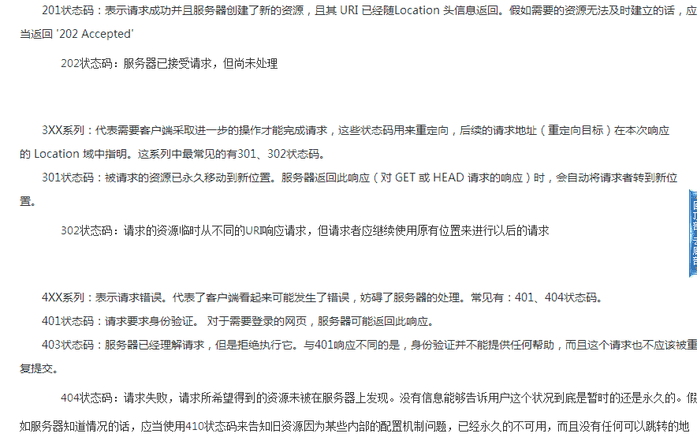

# 搜狐 2016 研发工程师笔试题

## 1

Linux 下给文件 start.sh 设置权限为自己可读可修改可执行，组内用户为可读可执行不可修改，其余用户没有任何权限，那么设置该文件权限的命令为（）

正确答案: B   你的答案: 空 (错误)

```cpp
chmod start.sh 706
```

```cpp
chmod start.sh 750
```

```cpp
chmod start.sh 705
```

```cpp
chmod start.sh 777
```

本题知识点

Linux

讨论

[Herryliu](https://www.nowcoder.com/profile/617665)

linux 中权限有九位二进制数表示 XXX YYY ZZZ，前一个 XXX 表示 owner 的权限，YYY 表示 group 的权限（也就是同组用户的权限），ZZZ 表示 other 的权限（非同组用户的权限）。根据本题要求，XXX=111，YYY=101，ZZZ=000，所以是 750

发表于 2016-03-30 11:21:05

* * *

[兮渺](https://www.nowcoder.com/profile/35545351)

读        r      4 写        w     2 执行    x      1 命令'chmod' 表示授权所有权限=   7（4+2+1）=r w x 读写权限=   6（4+2）    =r w -读和执行=   5（4+1）    =r - x 写和执行=   3（2+1）   = - w x 没有任何权限=（0）     = - - -授权时，命令后面需要跟 3 位数字。（从左往右）第一位数字表示  文件所属用户的权限；第二位表示所属组的权限（即组内用户的权限）；第三位则是其余用户 ；

编辑于 2020-05-21 15:51:44

* * *

[大菜鸟大菜狗](https://www.nowcoder.com/profile/905766)

B
按照读，写，可执行的顺序，各个值为 4，2，1 用户：用户组：其他用户 421：401：000

发表于 2015-11-04 19:21:59

* * *

## 2

以下哪种 http 状态下,浏览器会产生两次 http 请求?()

正确答案: C   你的答案: 空 (错误)

```cpp
304
```

```cpp
404
```

```cpp
302
```

```cpp
400
```

本题知识点

网络基础

讨论

[牛客是我的好帮手](https://www.nowcoder.com/profile/230425)

```cpp
304 未修改（表示客户机缓存的版本是最新的，客户机应该继续使用它。）
```

```cpp
404 找不到改页面
```

```cpp
302 暂时重定向
```

```cpp
400 代表客户端发起的请求不符合服务器对请求的某些限制，或者请求本身存在一定的错误。
```

发表于 2016-03-18 15:57:39

* * *

[牛客 7405285 号](https://www.nowcoder.com/profile/7405285)



发表于 2016-08-09 17:16:03

* * *

[心静](https://www.nowcoder.com/profile/437950)

302 重定向又称之为 302 代表暂时性转移(Temporarily Moved )，英文名称：302 redirect。 也被认为是**暂时重定向**（temporary redirect），一条对网站浏览器的指令来显示浏览器被要求显示的不同的 URL，当一个网页经历过短期的 URL 的变化时使用。一个暂时重定向是一种服务器端的重定向，能够被搜索引擎蜘蛛正确地处理。**302 重定向是暂时的重定向，**搜索引擎会抓取新的内容而保存旧的网址。由于效劳器前往 302 代码，搜索引擎以为新的网址只是暂时的。**301 重定向是永久的重定向，**搜索引擎在抓取新内容的同时也将旧的网址交换为重定向之后的网址。一般使用**302 重定向是在一个网站或网页在 24 到 48 小时之内临时移到其它位置的情况下能使用该命令，这时候就是做临时性的跳转了，也不建议经常使用 302 重定向，建议大家尽量采用 301 重定向。**

发表于 2015-11-05 20:56:23

* * *

## 3

某学校获取到一个 B 类地址段,要给大家分开子网使用,鉴于现在上网设备急剧增多,管理员给每个网段进行划分的子网掩码设置为 255.255.254.0,考虑每个网段需要有网关设备占用一个地址的情况下,每个网段还有多少可用的主机地址()

正确答案: A   你的答案: 空 (错误)

```cpp
509
```

```cpp
511
```

```cpp
512
```

```cpp
510
```

本题知识点

网络基础

讨论

[SunburstRun](https://www.nowcoder.com/profile/557336)

答案是 A      因  查看全部)

编辑于 2015-11-04 19:19:22

* * *

[披萨大叔](https://www.nowcoder.com/profile/841505)

**IP 地址=网络号+主机号。**根据子网掩码 255.255.254.0，可以看出，前两段都已满，第三段二进制是 1111 1110，最后一位可用，最后一段 8 位可用。所以可用主机地址为：2⁹=512。全 1 和全 0 地址留作特殊用途，题目又说网关设备用一个地址，所以 512-3=509

发表于 2016-08-06 14:27:48

* * *

[内存。](https://www.nowcoder.com/profile/39306668)

2 的 9 次方减一得 511， 减掉自身地址和广播地址得 509

发表于 2020-02-27 23:40:35

* * *

## 4

某种产品,合格品率为 0.96,一个合格品被检查成次品的概率是 0.02,一个次品被检查成合格品的概率为 0.05,问题:求一个被检查成合格品的产品确实为合格品的概率()

正确答案: A   你的答案: 空 (错误)

```cpp
0.9978
```

```cpp
0.9991
```

```cpp
0.9855
```

```cpp
0.96
```

本题知识点

概率统计 *讨论

[SunburstRun](https://www.nowcoder.com/profile/557336)

答案是 A      所  查看全部)

编辑于 2015-11-04 19:19:54

* * *

[炫](https://www.nowcoder.com/profile/376795)

先利用全概率公式得 P(A)=0.96*0.98+0.04*0.05 后利用贝叶斯公式得 P=0.98*0.96/（0.96*0.98+0.04*0.05）=0.9978

发表于 2015-11-07 18:02:50

* * *

[沫。](https://www.nowcoder.com/profile/602239)

可以这样理解，题目所求的是被检查是合格品的物品确实是合格品的概率，即分析物品被检查为合格品包括哪几种情况，第一:合格品被检查为合格品;第二:次品被检查为合格品。而题目告诉了合格品的概率是 0.96，则次品的概率为 0.04。而合格品被检查为次品的概率是 0.02，则合格品被检查为合格品的概率是 0.98，题目告诉我们次品被检查为合格品的概率是 0.05。因此题目所求概率为（0.96*0.98）/（0.96*0.98）+（0.04*0.05）

发表于 2016-05-28 15:08:55

* * *

## 5

设某公路上经过的货车与客车的数量之比为 2:1,货车中途停车修理的概率为 0.02,客车为 0.01,今有一辆汽车中途停车修理,求该汽车是货车的概率()

正确答案: D   你的答案: 空 (错误)

```cpp
0.67
```

```cpp
0.33
```

```cpp
0.91
```

```cpp
0.8
```

本题知识点

概率统计 *讨论

[SunburstRun](https://www.nowcoder.com/profile/557336)

答案是 D  查看全部)

编辑于 2015-11-04 19:22:58

* * *

[李小志](https://www.nowcoder.com/profile/590604)

货车有 200 辆，汽车有 100 辆。 故障比例：货车故障 4，汽车 1。 货车的概率为 4/5=0.8

发表于 2016-04-16 23:12:29

* * *

[hapjin](https://www.nowcoder.com/profile/7823823)

这样的问题是“全概率”问题。首先进行全划分：公路上的车，要么是货车，要么是客车。设事件 A1，车是货车；事件 A2，车是客车
那么，A1 和 A2 就构成了一个全划分。且有 P(A1)=2/3；P(A2)=1/3
设事件 B，表示车要修理，那么：货车中途修理的概率 0.02，即：P(B|A1)=0.02，同理 P(B|A1)=0.01
由全概率公式：P(B)=P(A1)(B|A1)+P(A2)P(B|A2) 可以算出 P(B)
要求的是：已经事件发生了，是由谁引起的？那就是 P(A1|B)，即要修理了，是修理哪个车？这是贝叶斯公式干的活。
贝叶斯公式：P(A1|B)=P(A1 * B)/P(B)=P(B|A1)P(A1)/P(B)，就可以算出 P(A1|B)

编辑于 2016-09-05 11:36:10

* * *

## 6

以下多线程对 int 型变量 x 的操作,哪个不需要进行同步()

正确答案: D   你的答案: 空 (错误)

```cpp
++x
```

```cpp
x=y
```

```cpp
x++
```

```cpp
x=1
```

本题知识点

Java

讨论

[superycman](https://www.nowcoder.com/profile/457148)

同步是害怕在操作过程的时候被其他线程也进行读取操作，一旦是原子性的操作就不会发生这种情况。因为一步到位的操作，其他线程不可能在中间干涉。另外三项都有读取、操作两个步骤，而 X=1 则是原子性操作。

发表于 2016-01-05 20:44:51

* * *

[StrongYoung](https://www.nowcoder.com/profile/649626)

前三个都至少需要先读取，再操作，非原子操作。而 D 的话，直接赋值。

发表于 2015-11-05 17:33:42

* * *

[Dianna](https://www.nowcoder.com/profile/732224)

ABC 不是原子性操作，例如想 x++，先获取 x 的值，自增一，然后再把值赋给 x，三步，中间任何一步执行时都可能被其他线程访问或者修改。所以需要同步。

发表于 2015-11-09 19:32:19

* * *

## 7

```cpp
#define  A(x) x+x
int i=5*A(4)*A(6);
cout<<i;
```

以上程序输出是多少?

正确答案: A   你的答案: 空 (错误)

```cpp
50
```

```cpp
100
```

```cpp
120
```

```cpp
480
```

本题知识点

C++

讨论

[SunburstRun](https://www.nowcoder.com/profile/557336)

答案是 A  查看全部)

编辑于 2015-11-04 19:24:56

* * *

[E๓rys](https://www.nowcoder.com/profile/228710)

宏定义的 A(x)全部替换为 x+x，但注意不要加括号！i=5*4+4*6+6=20+24+6=50 选 A

编辑于 2015-11-04 23:40:57

* * *

[良人轻薄年未归](https://www.nowcoder.com/profile/127862757)

宏定义宏定义宏定义直接替换直接替换直接替换

发表于 2022-03-09 14:19:34

* * *

## 8

以下关于 PMF(概率质量函数),PDF(概率密度函数),CDF(累积分布函数)描述错误的是()

正确答案: A   你的答案: 空 (错误)

```cpp
PDF 描述的是连续型随机变量在特定取值区间的概率
```

```cpp
CDF 是 PDF 在特定区间上的积分
```

```cpp
PMF 描述的是离散型随机变量在特定取值点的概率
```

```cpp
有一个分布的 CDF 函数 H(x),则 H(a)等于 P(X<=a)
```

本题知识点

机器学习 数理统计 统计学

讨论

[牛客 134755 号](https://www.nowcoder.com/profile/134755)

概率**质量**函数 (probability mass function，PMF)是**离散随机变量**在各特定取值上的概率。概率**密度**函数（p robability density function，PDF ）是对 **连续随机变量** 定义的，本身不是概率，只有对连续随机变量的取值进行积分后才是概率。累积分布函数（cumulative distribution function，CDF） 能完整描述一个**实数随机变量**X 的概率分布，是概率密度函数的积分。对於所有实数 x ，与 pdf 相对。

发表于 2015-12-11 09:22:41

* * *

[诙銫匦迹](https://www.nowcoder.com/profile/999011349)

A：概率密度，非概率！

发表于 2018-11-20 12:53:17

* * *

[VinctorRC](https://www.nowcoder.com/profile/2183587)

PMF:离散变量在取特征值的概率 PDF：概率密度函数 CDF：其实就是 p(x<=k)

发表于 2018-06-30 16:51:11

* * *

## 9

一个全局变量 tally,两个线程并发执行(代码段都是 ThreadProc),问两个线程都结束后,tally 取值范围为 _______

```cpp
int tally=0;//全局变量
  void ThreadProc(){
     for(int i=1;i<=50;i++)
          tally+=1;
}
```

正确答案: A   你的答案: 空 (错误)

```cpp
[50,100]
```

```cpp
[100.100]
```

```cpp
[1275,2550]
```

```cpp
[2550,2550]
```

本题知识点

C++

讨论

[大菜鸟大菜狗](https://www.nowcoder.com/profile/905766)

A 最小值的情况：（线程  查看全部)

编辑于 2015-12-15 10:54:28

* * *

[schuman](https://www.nowcoder.com/profile/473087)

这道题是考察视力的。

发表于 2016-09-01 10:09:33

* * *

[牛客 801428 号](https://www.nowcoder.com/profile/801428)

这题是**tally+=1;竟然把 1 看成了 i。。。**

发表于 2015-11-04 19:43:13

* * *

## 10

下面四个类 A,B,C,D,在 32 位机器上 sizeof(A),sizeof(B),sizeof(C),sizeof(D)值分别为()

```cpp
class A{
};
class B{
	char ch;
	int x;
};
class C{
public:
	void Print(void){}
};
class D
{
public:
	virtual void Print(void){}
};
```

正确答案: C   你的答案: 空 (错误)

```cpp
0,5,0,0
```

```cpp
1,8,4,4
```

```cpp
1,8,1,4
```

```cpp
1,5,1,4
```

本题知识点

C 语言

讨论

[SunburstRun](https://www.nowcoder.com/profile/557336)

答案是 C 类 A 空类型的实  查看全部)

编辑于 2015-11-04 19:48:49

* * *

[huixieqingchun](https://www.nowcoder.com/profile/551201)

**注意：空类编译器会将 sizeof（）的值变为 1；****类的大小只与非静态成员和虚函数的大小有关，而与其他普通函数成员无关，与构造函数析构函数也无关。**

发表于 2016-05-19 13:43:44

* * *

[MSean](https://www.nowcoder.com/profile/231467)

```cpp

	classA{

	};

	classB{

	    charch;

	    intx;

	};

	classC{

	public:

	    voidPrint(void){}

	};

	classD

	{

	public:

	    virtualvoidPrint(void){}

	};

```

参考其他牛友解析 sizeof()是针对实例的，因此类的大小只跟非 static 成员变量以及虚函数有关；（static 变量非实例独占，sizeof()不考虑；普通成员函数，包括构造函数，被各实例共享，因此也不归 sizeof()考虑）A：空类的 sizeof()为 1；B：补齐后 sizeof()为 8；C：普通成员函数不考虑，类的 sizeof()仍为 1；D：类中含虚函数，编译器会自动生成一个虚函数表，类需要一个指针来指向该虚表，因此类的 sizeof()为 4；其他：牛友们不妨亲自建几个测试类，打印出 sizeof()看一看。需要注意的是类中含虚函数且有继承时求类大小的情况，也可参考网友总结。（回头测试完后再补充）

发表于 2016-08-03 11:56:23

* * *

## 11

下列关于 GIT 的描述不恰当的一项是()

正确答案: C   你的答案: 空 (错误)

```cpp
可以采用公钥认证进行安全管理
```

```cpp
可以利用快照签名回溯历史版本
```

```cpp
必须搭建 Server 才能提交修改
```

```cpp
属于分布式版本控制工具
```

本题知识点

开发工具

讨论

[大菜鸟大菜狗](https://www.nowcoder.com/profile/905766)

Github 无论在本地还是远端都可以不用自己搭建服务器；
在本地，直接在磁盘上进行修改、版本管理；
发布在远端时，可以用 github 作为托管，并不是一定需要自己搭建服务器

发表于 2015-11-04 19:41:16

* * *

[thesby](https://www.nowcoder.com/profile/922185)

这个题虽然很好选，但是其他几个选项我还是说一下吧。选项 A，可以使用 ssh-keygen 选项 B 很显然，每次 commit 之后会产生一个号，由此可以回溯选项 C 不对，本地的 GIT 可以不要服务器，这个也是 GIT 的一个魅力。选项 D 很正确，Git 是分布式管理的版本控制，显然我们在 github 上，可以很多个用户维护一个 repository。有兴趣的，可以看看 Git 与 SVN 的区别 http://blog.jobbole.com/31444/

发表于 2016-09-20 00:05:02

* * *

[牛客 745285 号](https://www.nowcoder.com/profile/745285)

C

发表于 2015-11-06 13:52:47

* * *

## 12

已知下面的 class 层次,其中每一个 class 都定义有一个 default constructor 和一个 virtual destructor;

```cpp
class X{...};
class A{...};
class B:public A{...};
class C:public B{...};
class D:public X,public C{...};
```

下面()执行 dynamic_cast 会失败

正确答案: C   你的答案: 空 (错误)

```cpp
A *pa=new D;X *px=dynamic_cast<X*>(pa);
```

```cpp
D *pd=new D;A *pa=dynamic_cast<A*>(pd);
```

```cpp
B *pb=new B;D *pd=dynamic_cast<D*>(pb);
```

```cpp
A *pa=new C;C *pc=dynamic_cast<C*>(pa);
```

本题知识点

C++

讨论

[大菜鸟大菜狗](https://www.nowcoder.com/profile/905766)

C：dynamic_c  查看全部)

编辑于 2016-04-16 17:58:54

* * *

[NewYork](https://www.nowcoder.com/profile/371157)

向上转换一定成功，向下转换不一定成功。向下转换必须存在虚函数，不然**编译错误**。假如集成关系如下：

```cpp
A <- B <- C

```

变量定义如下：

```cpp
A *a = new B;  // 本来 new 了个 B，向上转换为 A
B* b = dynamic_cast<B*> (a); // 从 A 再转换为 B，因为本质是 B，回到自身，所以成功
C* c = dynamic_cast<C*> (b); // 将本质是 B 的东西，转变为子类对象，所以失败。即 c=0.

```

更灵活一点：

```cpp
A <- B <- C <- D <- E

A* a = new C; // 本质
B* b = dynamic_cast<B*> (a); // 成功，因为 B 是 C 的父类
E* e = dynamic_cast<E*> (a); // 失败，因为 E 是 C 的子类
```

发表于 2016-03-17 19:54:21

* * *

[青山崖野](https://www.nowcoder.com/profile/7614806)

**dynamic_cast<type-id> (expression) ：** **expression 类型是 type-id 的基类，运行时检查 expression 是否指向 type-id 类型的完整象，** **如果是，结果返回指向 type-id 类型的完整对象，否则返回 NULL 。**

```cpp
B *pb=new B;D *pd=dynamic_cast<D*>(pb); //expression（pb）指向 B 自身，并非指向 type-id（D）的对象。转换失败。
```

**http://blog.csdn.net/sunnyjones/article/details/1649956?locationNum=3&fps=1**

编辑于 2017-04-07 10:57:15

* * *

## 13

某一系统功能，需要一次性加载 N（N 在 1000 左右）个随机数，后续只对该集合进行遍历。最宜采用哪种结构存放？

正确答案: C   你的答案: 空 (错误)

```cpp
Hash 表
```

```cpp
二叉树
```

```cpp
链表
```

```cpp
图
```

本题知识点

链表 *树* *讨论

[蘅芜君](https://www.nowcoder.com/profile/6377410)

随机数，未经排序，二叉树不适合；需要遍历，hash 表不适合；不强调数据之间的关系，图不适合；随机数数据类型不一致，数组不适合。综上所述，链表最适合。

发表于 2017-03-25 09:57:06

* * *

[金嗓子喉片](https://www.nowcoder.com/profile/363194)

       首先说了 需要一次性加载 N(N 在 1000 左右) 个随机数。 随机数可能是用 byte，char，short,int long float,double 存储;最乐观的是 byte 存储才占一个字节长度 1000 个约占用内存 1KB； 最悲观的是用 long 或 double (8 字节) ，以 C 语言为例 ：long double（多精度浮点类型或长精度浮点类型）不同平台有不同的实现。有的是 8 字节，有的是 10 字节，有的是 12 字节或 16 字节 咱们用 16 字节来算 也才 16*1000=16KB 内存也很少。再来说说数据结构： 数组：连续存储，遍历快且方便，长度固定，缺点移除和添加 需要迁移 n 个数据或者后移 n 个数据 链表：离散存储，添加删除方便，空间和时间消耗大，双向链表比单向的更灵活，但是空间耗费也更大 Hash 表：数据离散存储，利用 hash 算法决定存储位置，遍历麻烦。以 java 的 HashMap 为例 二叉树：一般的查找遍历，有深度优先和广度优先，遍历分前序、中序、后序遍历，效率都差不多，但是如果数据经过排序，二叉树效率还是不错。 图：表示物件与物件之间的关系的数学对象，常用遍历方式深度优先遍历和广度优先遍历，这两种遍历方式对有向图和无向图均适用，遍历查找不及前面人一种数据结构。 所以针对本道题 链表最适合。答案：C

编辑于 2016-02-25 23:48:37

* * *

[vcjmhg](https://www.nowcoder.com/profile/397331)

链表适合便利不适合随机访问

发表于 2016-11-15 23:00:45

* * *

## 14

将一颗多叉树存储在一个 txt 文件中,格式如下:id1,parentld1,weight1id2,parentld2,weight2id3,parentld3,weight3.....其中,一行表示一个节点,id 表示节点的序号,parentld 表示节点对应父节点的序号,weight 表示该节点的权重,根节点的 parentld 是自身 id.请实现一个函数,输入是一个多叉树节点的数组和长度,要求打印出每一个节点的总权重(总权重=节点自身权重+节点对应所有子节点的权重).自定义需要的数据结构,说明时间和空间复杂度(要求时间复杂度优先,空间复杂度尽量低)

你的答案

本题知识点

树

讨论

[牛客 956136 号](https://www.nowcoder.com/profile/956136)

```cpp
#include <unordered_map>
#include <iterator>
#include <stdexcept>
#include <set>
#include <iostream>
using namespace std;

typedef struct {
	size_t id;
	size_t parentId;
	size_t weight;
} Node;

void print_weight_of_tree(Node array[], size_t len)
{
	if (len == 0) {
		return;
	}

	unordered_map<size_t, size_t> id_index;
	id_index.rehash(2 * len);
	for(size_t i = 0; i != len; i++) {
		id_index.emplace(array[i].id, i);
	}

	int *state = new int [len]();
	size_t *weight = new size_t [len];
	for(size_t i = 0; i != len; i++) {
		weight[i] = array[i].weight;
		//root node
		if(array[i].id == array[i].parentId)
			continue;
		auto it = id_index.find(array[i].parentId);
		if(it == id_index.end()) {
			throw logic_error("parent not Found");
		}
		//tag
		state[it->second] = 1;
	}
	bool end = false;
	set<size_t> new_leaf_index;
	while(!end) {
		for(auto leaf_index : new_leaf_index) {
			state[leaf_index] = 0;
		}
		new_leaf_index.clear();
		for(size_t i = 0; i != len; i++) {
			if(state[i] == 0) {
				size_t parent = array[i].parentId;
				//root node
				if(parent == array[i].id) {
					state[i] = -1;
					end = true;
					break;
				} else {
					size_t parent_index = id_index.find(parent)->second;
					new_leaf_index.insert(parent_index);
					weight[parent_index] += weight[i];
					state[i] = -1;
				}
			}
		}
	}

	for(size_t i = 0; i < len; i++) {
		cout << "id: " << array[i].id << " weight: " << weight[i] << endl;
	}
	delete [] state;
	delete [] weight;
}

int main()
{
	size_t len;
	cin >> len;
	Node *array = new Node[len];
	for(size_t i = 0; i != len; i++) {
		cin >> array[i].id >> array[i].parentId >> array[i].weight;
	}
	print_weight_of_tree(array, len);
        delete [] array;
	return 0;
}

```

思路：1、首先建立 id_index 的 hash 表，该表的作用为将节点 id 映射到节点在 array 中的下标，方便以后查询           2、算法的主要思想是先处理叶子节点（叶子节点 state 为 0)，处理叶子节点时，将叶子节点的权重添加到其父节点上，并将叶子节点标记为删除（将对应的斯 state 设置为-1)，这时原来高度为 1 的所有节点又变成新的叶子节点，然后迭代处理，直到处理完根节点           3、其中 state 和 weight 分别为数组 array 中对应节点的状态(-1, 0, 1)和权重

发表于 2016-05-12 11:48:16

* * *

[牛客 125457 号](https://www.nowcoder.com/profile/125457)

看不懂这题的意思，怎么输入时一个多叉树节点的数组呢?难道意思是打印一个森林？

发表于 2016-01-20 20:48:38

* * *

[orzOrzorzOrz](https://www.nowcoder.com/profile/374725)

多叉树有几个叉？

struct TreeNode

{

int weight；

int parentid；

vector<int> childid;

};广度优先

发表于 2015-11-22 13:26:59

* * ****