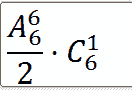
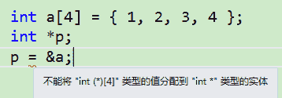

# 美团 2016 研发工程师笔试题（三）

## 1

在网络 7 层协议中，如果想使用 UDP 协议达到 TCP 协议的效果,可以在哪层做文章?

正确答案: C   你的答案: 空 (错误)

```cpp
应用层
```

```cpp
表示层
```

```cpp
会话层
```

```cpp
传输层
```

```cpp
网络层
```

本题知识点

网络基础 Java 工程师 C++工程师 运维工程师 前端工程师 算法工程师 PHP 工程师 美团 2016

讨论

[SunburstRun](https://www.nowcoder.com/profile/557336)

答案是 C  查看全部)

编辑于 2016-05-21 17:08:57

* * *

[茶小姐。](https://www.nowcoder.com/profile/1802222)

OSI 中的应用层仅仅是对应用程序经常要用到的功能、以及对实现这些功能要用到的协议进行描述。表示层解决用户信息的语法表示会话层对数据传输进行管理

发表于 2016-08-18 23:27:35

* * *

[牛客 711196 号](https://www.nowcoder.com/profile/711196)

理论上可以在会话层，表示层 ，应用层实现 UDP 相对于 TCP 缺少的功能：面向连接，流量控制，拥塞控制。。。最好是在会话层

发表于 2016-05-19 16:51:22

* * *

## 2

两个线程并发执行以下代码,假设 a 是全局变量,那么以下输出 ___ 哪个是可能的?

```cpp
int a=1;
void foo(){
    ++a;
    printf("%d", a);
}
```

正确答案: A B C D   你的答案: 空 (错误)

```cpp
3 2
```

```cpp
2 3
```

```cpp
3 3
```

```cpp
2 2
```

本题知识点

Java 工程师 C++工程师 运维工程师 前端工程师 算法工程师 PHP 工程师 美团 C 语言

讨论

[SunburstRun](https://www.nowcoder.com/profile/557336)

答案是;ABCD  查看全部)

编辑于 2016-08-30 18:24:15

* * *

[英语六级](https://www.nowcoder.com/profile/171218)

```cpp
选项 D 是假设线程 A 先执行++a 操作但没有写回到内存，这时线程 B 执行++a 操作写回内存并 printf，输出 2_，线程 A 继续执行，++a 操作写回内存，a 的值保持 2，再 printf
```

发表于 2015-11-08 11:35:25

* * *

[Reds](https://www.nowcoder.com/profile/5274912)

++a,printf 不是原子操作，随时可能被抢占资源

发表于 2016-06-23 23:21:45

* * *

## 3

下列关于线程调度的叙述中,错误的是()

正确答案: C   你的答案: 空 (错误)

```cpp
调用线程的 sleep()方法,可以使比当前线程优先级低的线程获得运行机会
```

```cpp
调用线程的 yeild()方法,只会使与当前线程相同优先级的线程获得运行机会
```

```cpp
具有相同优先级的多个线程的调度一定是分时的
```

```cpp
分时调度模型是让所有线程轮流获得 CPU 使用权
```

本题知识点

操作系统 Java 工程师 C++工程师 运维工程师 前端工程师 算法工程师 PHP 工程师 美团

讨论

[MelodyZ](https://www.nowcoder.com/profile/752966)

答案 BC。A 选项，sleep()方法强制使当前线程休眠，释放 CPU 资源，以便使得其他所有线程有机会运行。B 选项，yield()方法使得当前的线程让出 CPU 的使用权，以使得比该线程优先级相同或更高的线程有机会运行。该线程在让出 CPU 使用权之后可能再次被选中，因此 yield()方法可能会不起作用(这也说明了 yield()方法不会使得比当前线程优先级低的线程运行)。C 选项，java 虚拟机中如果多个线程优先级相同，则会随机选择一个线程占用 CPU，处于运行状态的线程会一直运行，直至它不得不放弃 CPU 为止，因此不一定是分时调度。D 正确

发表于 2016-08-09 13:21:14

* * *

[杀猪刀](https://www.nowcoder.com/profile/284466)

B 选项也不对，调用 yield 方法，让同优先级或比自己优先级高的在就绪状态的线程执行。

发表于 2016-03-18 14:58:48

* * *

[SunburstRun](https://www.nowcoder.com/profile/557336)

答案是 C         题考查对线程调度的理解。线程属于考试难点，概念不容易理解，需多下功夫。调用线程的 sleep()方法，可以使比其低的优先线程运行，所以选项 A 说法正确；调用线程的 yeild()方法，只让给同优先级运行，所以选项 B 说法正确；具有相同优先级的多个线程的调度可能是分时的，也可能是线程逐个运行，由具体 JVM 而定，选项 C 说法错误，故为所选。

编辑于 2015-11-07 12:19:46

* * *

## 4

在 linux 系统中,有一个文件夹里面有若干文件,通常用哪个命令可以获取这个文件夹的大小:

正确答案: B   你的答案: 空 (错误)

```cpp
ls -h
```

```cpp
du -sh
```

```cpp
df -h
```

```cpp
fdish -h
```

本题知识点

Linux Java 工程师 C++工程师 运维工程师 前端工程师 算法工程师 PHP 工程师 美团 2016

讨论

[MonsieurWilson](https://www.nowcoder.com/profile/275180)

A 不正确，ls 的-h 选项只有在有-l 时候才会起作用，即 ls -lhB 正确，du 可以显示当前目录及子目录的磁盘占用情况，-d 选项可以指明递归目录的深度，-s 等价于-d 0，-h 表示以可读的形式显示，比如 B, KB, GB 等 C 不正确，df 是显示整个文件系统的使用情况，不能得到当前文件夹的情况 D 不正确，命令都写错了。。。就算是 fdisk，是用来分区的，没关系。

发表于 2015-11-07 23:29:05

* * *

[Silcon](https://www.nowcoder.com/profile/224776)

du ： disk usage 查看当前目录磁盘空间使用情况

发表于 2016-03-01 15:32:23

* * *

[中国城管头儿](https://www.nowcoder.com/profile/3328825)

这道题好巧，今天在看昨天的公众号推送时发的，现在整理下。        du 是统计当前目录及子目录的大小，是做累加运算的。        df 是统计当前文件夹的状态，即被占用还是处于空闲状态。        有一个特殊的情况，被称为"幻影文件"：这个就是说当你删除一个文件夹的时候，但是系统中还有资源在占用该文件夹，这时执行 du 命令的时候，你是不会将这个文件夹的大小统计进去的；但是你在执行 df 命令时，因为现在有资源占用该文件夹，即文件句柄还存在，因此 df 命令会将该文件夹统计进去。        不知道记得对不对，希望看过的你们多多指教。

发表于 2017-05-31 21:04:38

* * *

## 5

我们用一个等臂天平来称物体的质量,如果我们要称的物体质量范围在 1 到 40 克（整数），请问我们最少需要几块砝码可以完成这项物体质量的称量?

正确答案: B   你的答案: 空 (错误)

```cpp
3
```

```cpp
4
```

```cpp
5
```

```cpp
6
```

```cpp
7
```

本题知识点

数学运算

讨论

[不忘初心跟党走](https://www.nowcoder.com/profile/117477)

此题可以看成用多少个数可以表示 1-40 之间任何一个数。砝码有三种状态，放在物体同侧，放在物体另一侧，并不使用。 所以这些数之间可以加可以减，也可以不计算在内。考虑用对称三进制来计算，即，-1，0，1 三个状态。40 可以用 1111 来表示，所以最多只用四个砝码就可以表示 1-40 之间所有数。

发表于 2015-12-18 11:36:16

* * *

[飞雪 Snown](https://www.nowcoder.com/profile/5854545)

【1  老鼠试毒药问题】40 个瓶子中有一瓶毒药，一只老鼠吃到毒药一周之内会死，如果要在一周之内检测出有毒药的一瓶，问至少需要几只老鼠？解答：（1）十进制转二进制：瓶子的十进制编号为 1-40，每个编号对应一个 6 位二进制编号，比如 40 对应的二进制为 101000，18 对应的二进制为 010010。 （2）进行实验：需要 6 只老鼠，让这 6 只老鼠中的第 i 只老鼠喝掉所有二进制第 i 位是 1 的瓶子，比如第 1 只老鼠喝掉二进制第 1 位是 1 的 20 个瓶子

*   00000**1**, 
*   00001**1**, 
*   000010**1**, 00011**1**, 
*   00100**1**, 00101**1**, 00110**1**, 00111**1**,
*   01000**1**, 01001**1**, 01010**1**, 01011**1**, 01100**1**, 01101**1**,  01110**1**, 01111**1**, 
*   10000**1**, 10001**1**, 100010**1**, 10011**1**。 

（3）得出结论： 一周之后，如果第 i 只老鼠死掉，那么说明毒药瓶子编号在对应二进制第 i 位是 1，否则是 0，由此可以组合出毒药的二进制编号。比如，如果第 1 只和第 3 只老鼠死掉，其余 4 只老鼠没死，那么毒药二进制编号为 000101，即十进制编号为 5。（4）总结：因为老鼠的状态只有死或不死，所以这里用二进制表示。【2  天平称物体问题】我们用一个等臂天平来称物体的质量,如果我们要称的物体质量范围在 1 到 40 克(整数),请问我们最少需要几块砝码可以完成这项物体质量的称量? 解答：（1）十进制转换对称三进制：瓶子的十进制编号为 1-40，每个编号对应一个 4 位三进制编号，比如 40 对应的二进制为 1111，34 对应的二进制为 11F1。 （2）进行称量：需要 4 个砝码，分别重 1g、3g、9g 和 27g，这 4 个砝码之间加减组合，可以表示 1-40 之间所有数。比如 40=27+9+3+1, 34=27+9-3+1 等。（3）总结：三进制又分为普通三进制（以 1，2，0 来表示数字）和对称三进制（以-1，0，1 来表示数字，习惯上-1 用 F 来替代）。**对称****三进制相对于二进制来说，有个优势就在于可以更接近人类的思维**，可以简洁的表达所有整数。毕竟人类正常的思维，是不可能仅靠“真假”两种逻辑来判断的，很多时候我们还有一种模棱两可的思维判断，或者说，就是介于真假之间的判断。本题中，因为砝码的状态有放物体同侧、放物体异侧、不放，所以这里用对称三进制表示。备注，下面是笔者认为对称三进制合理性的相关理论及证明：

*   可以用归纳法证明**对称三进制可以表示所有整数，其中 N 位对称三进制可以表示十进制数-(3^N-1)/2~****(3^N-1)/2**
*   **e 进制是信息表示的最优解**，证明如下：

            前提：我们考虑存储空间一定、表示整数最多为最优条件

            假定总共有 n 位，每位 m 个状态，m*n=v，即前提条件为：在 v 一定时，使得 m^n 最大，也就是 k(n)=(v/n)^n 最大

            我们取自然对数  ln(k(n))=(ln(v)-ln(n))*n=ln(v)*n - ln(n)*n,   即底数为，有(lnx)'=1/x

            对 n 求导得 ln(v) - (n*1/n + ln(n)) = ln(v) - 1 - ln(n)

            解得 ln(n)=ln(v)-1 是 k(n)唯一的极值点，易知是 k(n)最大值点

            所以 n=v/e m=e 时，k(n)最大

发表于 2018-04-07 15:50:33

* * *

[牛客 692328 号](https://www.nowcoder.com/profile/692328)

从 1 开始：缺少 1，+1
2：缺 2，但是前面最大可能满足的元素为 1，所以下个砝码可以为 3（3-1=2）
3：
4：
5：缺 5，而前面的砝码可以最大表示 4，所以为了满足 5，下个砝码可以为 4+5=9（尽可能稀疏）
OK，现在我们前两个砝码可以表示范围为 1-4；所以《9-4，9+4》的范围统统可以表示，也即《5，13》都可以表示了。

14：缺少 14，前面砝码最大可以表示为 13，所以为了满足 14 的要求，下个砝码应该为 13+14=27，如此，前面 3 个砝码的最大范围为 1-13，故而，《27-13，27+13》的范围便统统可以表示了【14，40】

于是最少需要 4 个砝码

发表于 2015-11-09 16:11:53

* * *

## 6

HTTP 中的 POST 和 GET 在下列哪些方面有区别?()

正确答案: A B C D E   你的答案: 空 (错误)

```cpp
数据位置
```

```cpp
明文密文
```

```cpp
数据安全
```

```cpp
长度限度
```

```cpp
应用场景
```

本题知识点

网络基础 Java 工程师 C++工程师 运维工程师 前端工程师 算法工程师 PHP 工程师 美团 2016

讨论

[yayamma](https://www.nowcoder.com/profile/270051)

| 操作方式 | 数据位置 | 明文密文 | 数据安全 | 长度限制 | 应用场景 |
| GET | HTTP 包头 | 明文 | 不安全 | 长度较小 | 查询数据 |
| POST | HTTP 正文 | 可明可密 | 安全 | 支持较大数据传输 | 修改数据 |

发表于 2015-11-10 11:03:03

* * *

[小虎牙](https://www.nowcoder.com/profile/512935)

Http 定义了与服务器交互的不同方法，最基本的方法有 4 种，分别是 GET，POST，PUT，DELETE。URL 全称是资源描述符，我们可以这样认为：一个 URL 地址，它用于描述一个网络上的资源，而 HTTP 中的 GET，POST，PUT，DELETE 就对应着对这个资源的 查 ， 改 ， 增 ， 删 4 个操作。到这里，大家应该有个大概的了解了，GET 一般用于 获取/查询 资源信息，而 POST 一般用于 更新 资源信息。

发表于 2015-11-26 09:39:00

* * *

[舒意意 123](https://www.nowcoder.com/profile/1973064)

| 操作方式 | 数据位置 | 明文密文 | 数据安全 | 长度限制 | 应用场景 |
| GET | HTTP 包头 | 明文 | 不安全 | 长度较小 | 查询数据 |
| POST | HTTP 正文 | 可明可密 | 安全 | 支持较大数据传输 | 修改数据 |

发表于 2017-04-09 20:19:39

* * *

## 7

以下哪些 jvm 的垃圾回收方式采用的是复制算法回收

正确答案: A D   你的答案: 空 (错误)

```cpp
新生代串行收集器
```

```cpp
老年代串行收集器
```

```cpp
并行收集器
```

```cpp
新生代并行回收收集器
```

```cpp
老年代并行回收收集器
```

```cpp
cms 收集器
```

本题知识点

Java Java 工程师 C++工程师 运维工程师 前端工程师 算法工程师 PHP 工程师 美团 2016

讨论

[select*fromuse](https://www.nowcoder.com/profile/820767)

两个最基本的 java 回收算法：复制算法和标记清理算法复制算法：两个区域 A 和 B，初始对象在 A，继续存活的对象被转移到 B。此为新生代最常用的算法
标记清理：一块区域，标记可达对象（可达性分析），然后回收不可达对象，会出现碎片，那么引出标记-整理算法：多了碎片整理，整理出更大的内存放更大的对象
两个概念：新生代和年老代新生代：初始对象，生命周期短的
永久代：长时间存在的对象
整个 java 的垃圾回收是新生代和年老代的协作，这种叫做分代回收。P.S：Serial New 收集器是针对新生代的收集器，采用的是复制算法 Parallel New（并行）收集器，新生代采用复制算法，老年代采用标记整理 Parallel Scavenge（并行）收集器，针对新生代，采用复制收集算法 Serial Old（串行）收集器，新生代采用复制，老年代采用标记整理 Parallel Old（并行）收集器，针对老年代，标记整理 CMS 收集器，基于标记清理 G1 收集器：整体上是基于标记 整理 ，局部采用复制 **综上：新生代基本采用复制算法，老年代采用标记整理算法。cms 采用标记清理。**

编辑于 2017-12-29 09:13:26

* * *

[黄瓜炒蛋怕不怕](https://www.nowcoder.com/profile/527358)

我成功了避过了所有正确答案

发表于 2016-03-24 16:29:34

* * *

[hardy](https://www.nowcoder.com/profile/641341)

垃圾回收包含的内容不少，但顺着下面的顺序捋清知识也并不难。首先要

搞清垃圾回收的范围（栈需要 GC 去回收吗？），然后就是回收的前提条件

如何判断一个对象已经可以被回收（这里只重点学习根搜索算法就行了），

之后便是建立在根搜索基础上的三种回收策略，最后便是 JVM 中对这三种

策略的具体实现。

**1.范围：要回收哪些区域？**

Java 方法栈、本地方法栈以及 PC 计数器随方法或线程的结束而自然被回收，

所以这些区域不需要考虑回收问题。Java 堆和方法区是 GC 回收的重点区域，

因为一个接口的多个实现类需要的内存不一样，一个方法的多个分支需要

的内存可能也不一样，而这两个区域又对立于栈可能随时都会有对象不再

被引用，因此这部分内存的**分配和回收**都是动态的。

**2.前提：如何判断对象已死？**

**（1）引用计数法**

引用计数法就是通过一个计数器记录该对象被引用的次数，方法简单高效，

但是解决不了**循环引用**的问题。比如对象 A 包含指向对象 B 的引用，对象 B

也包含指向对象 A 的引用，但没有引用指向 A 和 B，这时当前回收如果采用的

是引用计数法，那么对象 A 和 B 的被引用次数都为 1，都不会被回收。

下面是循环引用的例子，在 Hotspot JVM 下可以被正常回收，可以证实 JVM

采用的不是简单的引用计数法。通过-XX:+PrintGCDetails 输出 GC 日志。

**[java]** [view plain](http://blog.csdn.net/dc_726/article/details/7934101#)[copy](http://blog.csdn.net/dc_726/article/details/7934101#)

1.  package com.cdai.jvm.gc;  

3.  public class ReferenceCount {  

5.  final static int MB = 1024 * 1024;  

7.  byte[] size = new byte[2 * MB];  

9.  Object ref;  

11.  public static void main(String[] args) {  

12.  ReferenceCount objA = new ReferenceCount();  

13.  ReferenceCount objB = new ReferenceCount();  

14.  objA.ref = objB;  

15.  objB.ref = objA;  

17.  objA = null;  

18.  objB = null;  

20.  System.gc();  

21.  System.gc();  

22.  }  

24.  }  

[Full GC (System) [Tenured: 2048K->366K(10944K), 0.0046272 secs] 4604K->366K(15872K), [Perm : 154K->154K(12288K)], 0.0046751 secs] [Times: user=0.02 sys=0.00, real=0.00 secs] 

**（2）根搜索**

通过选取一些**根对象**作为起始点，开始向下搜索，如果一个对象到根对象

不可达时，则说明此对象已经没有被引用，是可以被回收的。可以作为根的

对象有：栈中变量引用的对象，类静态属性引用的对象，常量引用的对象等。

因为每个线程都有一个栈，所以我们需要选取多个根对象。

**附：对象复活**

在根搜索中得到的不可达对象并不是立即就被标记成可回收的，而是先进行**一次**

标记放入 F-Queue 等待执行对象的 finalize()方法，执行后 GC 将进行**二次**标记，复活

的对象之后将不会被回收。因此，使对象复活的唯一办法就是重写 finalize()方法，

并使对象重新被引用。

**[java]** [view plain](http://blog.csdn.net/dc_726/article/details/7934101#)[copy](http://blog.csdn.net/dc_726/article/details/7934101#)

1.  package com.cdai.jvm.gc;  

3.  public class DeadToRebirth {  

5.  private static DeadToRebirth hook;   

7.  @Override  

8.  public void finalize() throws Throwable {  

9.  super.finalize();  

10.  DeadToRebirth.hook = this;  

11.  }  

13.  public static void main(String[] args) throws Exception {  

14.  DeadToRebirth.hook = new DeadToRebirth();  

15.  DeadToRebirth.hook = null;  

16.  System.gc();  

17.  Thread.sleep(500);  

18.  if (DeadToRebirth.hook != null)  

19.  System.out.println("Rebirth!");  

20.  else  

21.  System.out.println("Dead!");  

23.  DeadToRebirth.hook = null;  

24.  System.gc();  

25.  Thread.sleep(500);  

26.  if (DeadToRebirth.hook != null)  

27.  System.out.println("Rebirth!");  

28.  else  

29.  System.out.println("Dead!");  

30.  }  

32.  }  

要注意的两点是：

第一，finalize()方法只会被执行一次，所以对象只有一次复活的机会。

第二，执行 GC 后，要停顿半秒等待优先级很低的 finalize()执行完毕。

**3.策略：垃圾回收的算法**

**（1）标记-清除**

没错，这里的标记指的就是之前我们介绍过的两次标记过程。标记完成后就可以

对标记为垃圾的对象进行回收了。怎么样，简单吧。但是这种策略的缺点很明显，

回收后**内存碎片**很多，如果之后程序运行时申请大内存，可能会又导致一次 GC。

虽然缺点明显，这种策略却是后两种策略的基础。正因为它的缺点，所以促成了

后两种策略的产生。

**（2）标记-复制**

将内存分为两块，标记完成开始回收时，将一块内存中保留的对象全部复制到另

一块空闲内存中。实现起来也很简单，当大部分对象都被回收时这种策略也很高效。

但这种策略也有缺点，可用内存变为一半了！

怎样解决呢？聪明的程序员们总是办法多过问题的。可以将堆不按 1:1 的比例分离，

而是按 8:1:1 分成一块 Eden 和两小块 Survivor 区，每次将 Eden 和 Survivor 中存活的对象

复制到另一块空闲的 Survivor 中。这三块区域并不是堆的全部，而是构成了**新生代**。

从下图可以看到这三块区域如何配合完成 GC 的，具体的对象空间分配以及晋升请

参加后面第 6 条补充。

为什么不是全部呢？如果回收时，空闲的那一小块 Survivor 不够用了怎么办？这就是

**老年代**的用处。当不够用时，这些对象将直接通过**分配担保**机制进入老年代。那么

老年代也使用标记-复制策略吧？当然不行！老年代中的对象可不像新生代中的，

每次回收都会清除掉大部分。如果贸然采用复制的策略，老年代的回收效率可想而知。

**（3）标记-整理**

根据老年代的特点，采用回收掉垃圾对象后对内存进行整理的策略再合适不过，将

所有存活下来的对象都向一端移动。

**4.实现：虚拟机中的收集器**

**（1）新生代上的 GC 实现**

**Serial**：单线程的收集器，只使用一个线程进行收集，并且收集时会暂停其他所有

工作线程（Stop the world）。它是 Client 模式下的默认新生代收集器。

**ParNew**：Serial 收集器的多线程版本。在单 CPU 甚至两个 CPU 的环境下，由于线程

交互的开销，无法保证性能超越 Serial 收集器。

**Parallel Scavenge**：也是多线程收集器，与 ParNew 的区别是，它是**吞吐量**优先

收集器。吞吐量=运行用户代码时间/(运行用户代码+垃圾收集时间)。另一点区别

是配置-XX:+UseAdaptiveSizePolicy 后，虚拟机会自动调整 Eden/Survivor 等参数来

提供用户所需的吞吐量。我们需要配置的就是内存大小-Xmx 和吞吐量 GCTimeRatio。

**（2）老年代上的 GC 实现**

**Serial Old**：Serial 收集器的老年代版本。

**Parallel Old**：Parallel Scavenge 的老年代版本。此前，如果新生代采用 PS GC 的话，

老年代只有 Serial Old 能与之配合。现在有了 Parallel Old 与之配合，可以在注重吞吐量

及 CPU 资源敏感的场合使用了。

**CMS**：采用的是**标记-清除**而非标记-整理，是一款并发低停顿的收集器。但是由于

采用标记-清除，内存碎片问题不可避免。可以使用-XX:CMSFullGCsBeforeCompaction

设置执行几次 CMS 回收后，跟着来一次内存碎片整理。

**5.触发：何时开始 GC？**

Minor GC（新生代回收）的触发条件比较简单，Eden 空间不足就开始进行 Minor GC

回收新生代。而 Full GC（老年代回收，一般伴随一次 Minor GC）则有几种触发条件：

（1）老年代空间不足

（2）PermSpace 空间不足

（3）统计得到的 Minor GC 晋升到老年代的平均大小大于老年代的剩余空间

这里注意一点：PermSpace 并不等同于方法区，只不过是 Hotspot JVM 用 PermSpace 来

实现方法区而已，有些虚拟机没有 PermSpace 而用其他机制来实现方法区。

**6.补充：对象的空间分配和晋升**

（1）对象优先在 Eden 上分配

（2）大对象直接进入老年代

虚拟机提供了-XX:PretenureSizeThreshold 参数，大于这个参数值的对象将直接分配到

老年代中。因为新生代采用的是标记-复制策略，在 Eden 中分配大对象将会导致 Eden 区

和两个 Survivor 区之间大量的内存拷贝。

（3）长期存活的对象将进入老年代

对象在 Survivor 区中每熬过一次 Minor GC，年龄就增加 1 岁，当它的年龄增加到一定程度

（默认为 15 岁）时，就会晋升到老年代中。

发表于 2016-08-11 09:57:00

* * *

## 8

对于满足 SQL92 标准的 SQL 语句:

> select foo,count(foo)from pokes where foo>10group by foo having count (*)>5 order by foo

其执行顺序应该是?

正确答案: A   你的答案: 空 (错误)

```cpp
FROM->WHERE->GROUP BY->HAVING->SELECT->ORDER BY
```

```cpp
FROM->GROUP BY->WHERE->HAVING->SELECT->ORDER BY
```

```cpp
FROM->WHERE->GROUP BY->HAVING->ORDER BY->SELECT
```

```cpp
FROM->WHERE->ORDER BY->GROUP BY->HAVING->SELECT
```

本题知识点

数据库 Java 工程师 C++工程师 运维工程师 前端工程师 算法工程师 PHP 工程师 美团 2016

讨论

[SunburstRun](https://www.nowcoder.com/profile/557336)

答案是 A1、from 子  查看全部)

编辑于 2015-11-07 16:30:15

* * *

[小虎牙](https://www.nowcoder.com/profile/512935)

SQL 不同于与其他编程语言的最明显特征是处理代码的顺序。在大数编程语言中，代码按编码顺序被处理，但是在 SQL 语言中，第一个被处理的子句是 FROM 子句，尽管 SELECT 语句第一个出现，但是几乎总是最后被处理。

      每个步骤都会产生一个虚拟表，该虚拟表被用作下一个步骤的输入。这些虚拟表对调用者（客户端应用程序或者外部查询）不可用。只是最后一步生成的表才会返回 给调用者。如果没有在查询中指定某一子句，将跳过相应的步骤。下面是对应用于 SQL server 2000 和 SQL Server 2005 的各个逻辑步骤的简单描述。

 ( 8 ) SELECT  ( 9 ) DISTINCT   ( 11 ) < Top  Num >   < select  list > ( 1 ) FROM   [ left_table ] ( 3 ) < join_type >   JOIN   < right_table > ( 2 ) ON   < join_condition > ( 4 ) WHERE   < where_condition > ( 5 ) GROUP   BY   < group_by_list > ( 6 ) WITH   < CUBE  |  RollUP > ( 7 ) HAVING   < having_condition > ( 10 ) ORDER   BY   < order_by_list > 

**逻辑查询处理阶段简介**

1.  **FROM：**对 FROM 子句中的前两个表执行笛卡尔积（Cartesian product)(交叉联接），生成虚拟表 VT1
2.  **ON：**对 VT1 应用 ON 筛选器。只有那些使<join_condition>为真的行才被插入 VT2。
3.  **OUTER(JOIN)：**如 果指定了 OUTER JOIN（相对于 CROSS JOIN 或(INNER JOIN),保留表（preserved table：左外部联接把左表标记为保留表，右外部联接把右表标记为保留表，完全外部联接把两个表都标记为保留表）中未找到匹配的行将作为外部行添加到 VT2,生成 VT3.如果 FROM 子句包含两个以上的表，则对上一个联接生成的结果表和下一个表重复执行步骤 1 到步骤 3，直到处理完所有的表为止。
4.  **WHERE：**对 VT3 应用 WHERE 筛选器。只有使<where_condition>为 true 的行才被插入 VT4.
5.  **GROUP BY：**按 GROUP BY 子句中的列列表对 VT4 中的行分组，生成 VT5.
6.  **CUBE|ROLLUP：**把超组(Suppergroups)插入 VT5,生成 VT6.
7.  **HAVING：**对 VT6 应用 HAVING 筛选器。只有使<having_condition>为 true 的组才会被插入 VT7.
8.  **SELECT：**处理 SELECT 列表，产生 VT8.
9.  **DISTINCT：**将重复的行从 VT8 中移除，产生 VT9.
10.  **ORDER BY：**将 VT9 中的行按 ORDER BY 子句中的列列表排序，生成游标（VC10).
11.  **TOP：**从 VC10 的开始处选择指定数量或比例的行，生成表 VT11,并返回调用者。

注：步骤 10，按 ORDER BY 子句中的列列表排序上步返回的行，返回游标 VC10.这一步是第一步也是唯一一步可以使用 SELECT 列表中的列别名的步骤。这一步不同于其它步骤的 是，它不返回有效的表，而是返回一个游标。SQL 是基于集合理论的。集合不会预先对它的行排序，它只是成员的逻辑集合，成员的顺序无关紧要。对表进行排序 的查询可以返回一个对象，包含按特定物理顺序组织的行。ANSI 把这种对象称为游标。理解这一步是正确理解 SQL 的基础。

发表于 2015-11-26 09:44:01

* * *

[jianghan0712](https://www.nowcoder.com/profile/476316)

有 FROM、WHERE、GROUP BY、HAVING、聚合函数的语句，1、先执行 where 子句查找符合条件的数据；2、使用 group by 子句对数据进行分组；3、对 group by 子句形成的组运行聚集函数计算每一组的值 4、最后用 having 子句去掉不符合条件的组。where 子句的作用是在对查询结果进行分组前，将不符合 where 条件的行去掉，即在分组之前过滤数据；having 子句的作用是筛选满足条件的组，即在分组之后过滤数据。

发表于 2015-11-23 19:18:17

* * *

## 9

将 7723810 的各位数字打乱排序,可组成的不同的 7 位自然数的个数是?

正确答案: B   你的答案: 空 (错误)

```cpp
1080
```

```cpp
2160
```

```cpp
3240
```

```cpp
4320
```

```cpp
5040
```

本题知识点

组合数学 *Java 工程师 C++工程师 运维工程师 前端工程师 算法工程师 PHP 工程师 美团* *讨论

[abinge](https://www.nowcoder.com/profile/925837)

(7! / 2) - (6! /2 ) = 2160
7！代表 7 个数的全排列数，除以 2 是因为有一个数重复了，“减”是因为要排除 0 在首位的排列数。

发表于 2016-03-26 21:25:26

* * *

[鹏徐翔飞](https://www.nowcoder.com/profile/866923)

首先不看重复的两个 7，首位除了 0 外可放六个数字，次位可放 0 所以也是六个，之后是 5,4,3,2,1，6*6*5*4*3*2=4320     因为七重复了一次除以 2 即可

发表于 2015-11-07 12:15:39

* * *

[粉红粉红的 Hat](https://www.nowcoder.com/profile/5410467)

排列组合： ：A 表示除 0 以外的 6 个数，向 6 个位置有序插入，除以 2 是因为有两个 7 重复；C 表示 0 可选的位置有 6 个，0 不能再最开头；

发表于 2016-09-08 16:18:55

* * *

## 10

以下关于 linux 操作系统中硬链接和软链接的描述,正确的是?

正确答案: B   你的答案: 空 (错误)

```cpp
硬链接和软链接指向的 inode 的编号是一样的
```

```cpp
可以建立一个空文件的软链接
```

```cpp
linux 操作系统可以对目录进行硬链接
```

```cpp
硬链接指向 inode 节点
```

本题知识点

Linux Java 工程师 C++工程师 运维工程师 前端工程师 算法工程师 PHP 工程师 美团 2016

讨论

[夙愿](https://www.nowcoder.com/profile/191137)


由于**硬链接**是有着相同 inode 号仅文件名不同的文件，因此硬链接存在以下几点特性：

*   文件有相同的 inode 及 data block；
*   只能对已存在的文件进行创建；
*   不能交叉文件系统进行硬链接的创建；
*   不能对目录进行创建，只可对文件创建；
*   删除一个硬链接文件并不影响其他有相同 inode 号的文件。

 

**软链接**与硬链接不同，若文件用户数据块中存放的内容是另一文件的路径名的指向，则该文件就是软连接。软链接就是一个普通文件，只是数据块内容有点特殊。软链接有着自己的 inode 号以及用户数据块。因此软链接的创建与使用没有类似硬链接的诸多限制：

*   软链接有自己的文件属性及权限等；
*   可对不存在的文件或目录创建软链接；
*   软链接可交叉文件系统；
*   软链接可对文件或目录创建；
*   创建软链接时，链接计数 i_nlink 不会增加；
*   删除软链接并不影响被指向的文件，但若被指向的原文件被删除，则相关软连接被称为死链接（即 dangling link，若被指向路径文件被重新创建，死链接可恢复为正常的软链接）。

详解：http://www.ibm.com/developerworks/cn/linux/l-cn-hardandsymb-links/

发表于 2016-08-13 15:57:21

* * *

[SunburstRun](https://www.nowcoder.com/profile/557336)

答案是 B            删除源文件的话，软连接则指向了一个空文件 

发表于 2015-11-07 10:41:14

* * *

[枯萎的海风](https://www.nowcoder.com/profile/274211)

```cpp
关于 C

如果使用 hard link 链接到目录时， 链接的数据需要连同被链接目录底下的所有数据都创建链接，举例来说，如果你要将 /etc 使用实体链接创建一个 /etc_hd 的目录时，那么在 /etc_hd 底下的所有档名同时都与 /etc 底下的档名要创建 hard link 的，而不是仅连结到 /etc_hd 与 /etc 而已。 并且，未来如果需要在 /etc_hd 底下创建新文件时，连带的， /etc 底下的数据又得要创建一次 hard link ，因此造成环境相当大的复杂度。
```

发表于 2015-12-30 14:06:23

* * *

## 11

开发 C 代码时,经常见到如下类型的结构体定义:

```cpp
typedef struct list_t{
struct list_t *next;
struct list_t *prev;
char data[0];
}list_t;
```

最后一行 char data[0];的作用是?

正确答案: A B   你的答案: 空 (错误)

```cpp
方便管理内存缓冲区
```

```cpp
减少内存碎片化
```

```cpp
标识结构体结束
```

```cpp
没有作用
```

本题知识点

Java 工程师 C++工程师 运维工程师 前端工程师 算法工程师 PHP 工程师 美团 C 语言

讨论

[SunburstRun](https://www.nowcoder.com/profile/557336)

答案是 AB  查看全部)

编辑于 2015-11-15 08:28:03

* * *

[木森林](https://www.nowcoder.com/profile/698974)

struct MyData
{
int nLen;
char data[0];
};   
在结构中，data 是一个数组名；但该数组没有元素；该数组的真实地址紧随结构体 MyData 之后，而这个地址就是结构体后面数据的地址（如果给这个结构体分配的内容大于这个结构体实际大小，后面多余的部分就是这个 data 的内容）；这种声明方法可以巧妙的实现 C 语言里的数组扩展。

编辑于 2016-06-02 08:59:28

* * *

[geniusniniidudou](https://www.nowcoder.com/profile/177362)

这样整体形成一个数据包，好处是 char data[0]不占用空间，而且形成一个整体，
访问时依靠数组下标溢出的特性，p->data[size]，在早期有些技术牛人都爱这样写，
不过在今天这是一种不安全的写法，不推荐，而且现在的编译器也比较严格，一般通不过编译了。

发表于 2016-05-26 20:12:32

* * *

## 12

在 x86 系统下,sizeof 如下结构体的值是多少?

```cpp
struct{ 
char a[10];
int b;
short c[3];
}
```

正确答案: C   你的答案: 空 (错误)

```cpp
20
```

```cpp
22
```

```cpp
24
```

```cpp
26
```

本题知识点

C++ Java 工程师 C++工程师 运维工程师 前端工程师 算法工程师 PHP 工程师 美团 C 语言

讨论

[SunburstRun](https://www.nowcoder.com/profile/557336)

答案是 C  查看全部)

编辑于 2015-11-07 16:30:38

* * *

[彬临天下](https://www.nowcoder.com/profile/883949)


发表于 2016-03-07 20:05:12

* * *

[木木夕](https://www.nowcoder.com/profile/946591)

偏移量必须为其类型的整数倍，结构体大小必须是所有成员大小的整数倍 char 偏移量 0，地址 0-9int    偏移量 10 不是 sizeof(int)的倍数，故而修正为 12，地址 12-15short 偏移量 16，地址 16-21 结构题大小 22 不是 1，2，4 的公倍数，故而 vc 自动补充 2 个数为 24

发表于 2015-11-11 22:01:20

* * *

## 13

C++中构造函数和析构函数可以抛出异常吗?

正确答案: C   你的答案: 空 (错误)

```cpp
都不行
```

```cpp
都可以
```

```cpp
只有构造函数可以
```

```cpp
只有析构函数可以
```

本题知识点

C++ Java 工程师 C++工程师 运维工程师 前端工程师 算法工程师 PHP 工程师 美团 2016

讨论

[SunburstRun](https://www.nowcoder.com/profile/557336)

答案是 C         1.不建议在构造函数中抛出异常；       2.构造函数抛出异常时，析构函数将不会被执行,需要手动的去释放内存        1.析构函数不应该抛出异常；       2.当析构函数中会有一些可能发生异常时，那么就必须要把这种可能发生的异常完全封装在析构函数内部，决不能让它抛出函数之外；       3. 析构函数异常相对要复杂一些，存在一种冲突状态，程序将直接崩溃：异常的被称为“栈展开(stack unwinding)”【备注】的过程中时，从析构函数抛出异常，C++运行时系统会处于无法决断的境遇，因此 C++语言担保，当处于这一点时，会调用 terminate()来杀死进程。因此，当处理另一个异常的过程中时，不要从析构函数抛出异常, 抛出异常时，其子对象将被逆序析构

编辑于 2016-02-25 16:39:31

* * *

[MelodyZ](https://www.nowcoder.com/profile/752966)

析构函数不能抛出异常，处理析构函数异常的正确方式是将异常封装在析构函数内部，而不是抛出异常，如下代码所示。

```cpp
~ClassName(){
    try{
        do_something();
    }
    catch{
        //...
    }
}
```

原因如下：C++异常处理模型有责任处理那些因为出现异常而失效的对象，处理方式是调用这些失效对象的析构函数，释放掉它们占用的资源。如果析构函数再抛出异常，则会陷入无尽递归嵌套之中，因此这是不被允许的。

发表于 2016-08-11 23:11:12

* * *

[dronsure](https://www.nowcoder.com/profile/876518)

都可以抛异常，***题目

发表于 2016-08-04 16:38:21

* * *

## 14

mysql 数据库中一张 user 表中,其中包含字段 A,B,C,字段类型如下:A:int,B:int,C:int 根据字段 A,B,C 按照 ABC 顺序建立复合索引 idx_A_B_C,以下查询语句中使用到索引 idx_A_B_C 的语句有哪些？

正确答案: A B D   你的答案: 空 (错误)

```cpp
select *from user where A=1 and B=1
```

```cpp
select *from user where 1=1 and A=1 and B=1
```

```cpp
select *from user where B=1 and C=1
```

```cpp
select *from user where A=1 and C=1
```

本题知识点

数据库 Java 工程师 C++工程师 运维工程师 前端工程师 算法工程师 PHP 工程师 美团

讨论

[星痕 sky](https://www.nowcoder.com/profile/625230)

复合索引可以只使用复合索引中的一部分，但必须是由最左部分开始，且可以存在常量。

编辑于 2016-01-20 18:05:46

* * *

[mengmengyeye](https://www.nowcoder.com/profile/393033)

因复合索引为 idx_A_B_C，所以查询条件只能是在 a,ab,abc,ac 才算 使用到索引 idx_A_B_C

发表于 2015-11-07 21:44:19

* * *

[鹤舞青春 1002](https://www.nowcoder.com/profile/501357)

复合索引: Mysql 从左到右的使用索引中的字段，一个查询可以只使用索引中的一部份，但只能是最左侧部分。 例如索引是 key index (a,b,c). 可以支持 a | a,b| a,b,c 3 种组合进行查找，但不支持 b,c 进行查找 .当最左侧字段是常量引用时，索引就十分有效

发表于 2015-11-16 17:51:33

* * *

## 15

HTTPS 是使用()来保证信息安全的.

正确答案: C   你的答案: 空 (错误)

```cpp
SET
```

```cpp
IPSEC
```

```cpp
SSL
```

```cpp
SSH
```

本题知识点

加密和安全 Java 工程师 C++工程师 运维工程师 前端工程师 算法工程师 PHP 工程师 美团 Java 工程师 C++工程师 运维工程师 前端工程师 算法工程师 PHP 工程师 美团 Java 工程师 C++工程师 运维工程师 前端工程师 算法工程师 PHP 工程师 美团 Java 工程师 C++工程师 运维工程师 前端工程师 算法工程师 PHP 工程师 美团 2016

讨论

[yayamma](https://www.nowcoder.com/profile/270051)

 HTTP 协议通常承载于 TCP 协议之上，有时也承载 于**TLS（** **安全传输层协议** **）**或 **SSL（ 安全套接层协议 Secure Sockets Layer** **）**协议层之上，这个时候，就成了我们常说的**HTTPS**

发表于 2015-11-19 10:54:43

* * *

[绽放的四叶草](https://www.nowcoder.com/profile/312328)

Internet 协议安全性 (IPSec)是一种开放标准的框架结构，通过使用加密的 [安全服务](http://baike.baidu.com/view/2864706.htm) 以确保在 Internet 协议 (IP) 网络上进行保密而安全的通讯。HTTP 协议通常承载于 TCP 协议之上，有时也承载 于**TLS（** **安全传输层协议** **）**或 **SSL（ 安全套接层协议 Secure Sockets Layer ** **）**协议层之上，这个时候，就成了我们常说的**HTTPS。**

发表于 2016-09-10 20:45:54

* * *

[嘻嘻 818](https://www.nowcoder.com/profile/7295134)

SSH 全称是 Secure Shell，SSH 协议是基于应用层的协议，为远程登录会话和其他网络服务提供安全性的协议。SSH 使用最多的是远程登录和传输文件，实现此功能的传统协议都不安全（ftp，telnet 等），因为它们使用明文传输数据。而 SSH 在传输过程中的数据是加密的，安全性更高。 

发表于 2019-04-25 09:03:02

* * *

## 16

由 A 地到 B 地，中间有一段扶梯，总路程和扶梯长度是固定的，为赶时间全程都在行走(包含扶梯上)，中途发现鞋带松了，需要停下来绑鞋带。请问在扶梯上绑鞋带和在路上绑鞋带两种方式用时比较短？

正确答案: B   你的答案: 空 (错误)

```cpp
路上绑鞋带,全程用时短
```

```cpp
扶梯上绑鞋带,全程用时短
```

```cpp
用时一样
```

```cpp
和扶梯长度,绑鞋带具体用时有关
```

本题知识点

数学运算

讨论

[菜鸟葫芦娃](https://www.nowcoder.com/profile/415611)

B 假设：人行走的速度为  查看全部)

编辑于 2015-12-08 19:13:05

* * *

[柠檬柒色](https://www.nowcoder.com/profile/118398)

假设两人在到扶梯之前都在走，而到达扶梯时，甲选择在扶梯前系鞋带，而乙在上扶梯后立即系鞋带，当两人都系完携带后，此时两人都在扶梯上，运动速度一致，显然此时乙在甲的前面，并甲已经不可能再追上乙。故选 B。

发表于 2016-03-11 16:01:11

* * *

[堂吉诃德 123](https://www.nowcoder.com/profile/992606)

在扶梯上系鞋带，享受扶梯加速的时间更长

发表于 2016-03-20 20:19:07

* * *

## 17

具有 7 个顶点的有向图至少应有多少条边才可能成为一个强连通图?

正确答案: B   你的答案: 空 (错误)

```cpp
6
```

```cpp
7
```

```cpp
8
```

```cpp
12
```

本题知识点

图 Java 工程师 C++工程师 运维工程师 前端工程师 算法工程师 PHP 工程师 美团 2016

讨论

[脱氧核糖核酸](https://www.nowcoder.com/profile/720995)


发表于 2016-06-30 09:23:26

* * *

[yayamma](https://www.nowcoder.com/profile/270051)

强连通图必须从任何一点出发都可以回到原处，每个节点至少要一条出路(单节点除外)至少有 n 条边，正好可以组成一个环

编辑于 2015-11-19 10:57:23

* * *

[牛客 561351 号](https://www.nowcoder.com/profile/724121)

注意题目所说的是有向图，因此是 7 条边，若为无向图，则是 6 条边

发表于 2016-03-24 19:46:44

* * *

## 18

一棵非空的二叉树的先序遍历序列与后序遍历序列正好相反，则该二叉树一定满足?

正确答案: C   你的答案: 空 (错误)

```cpp
所有的结点均无左孩子
```

```cpp
所有的结点均无右孩子
```

```cpp
只有一个叶子结点
```

```cpp
是一棵满二叉树
```

本题知识点

树 Java 工程师 C++工程师 运维工程师 前端工程师 算法工程师 PHP 工程师 美团 2016

讨论

[想做樱木的圆寸少年](https://www.nowcoder.com/profile/906117)

之所以不能选 AB，是因为题目中只交代了非空，而如果该二叉树只有根节点，即满足了 AB 条件，而显然此状态下，三种遍历顺序的结果都相同。因此我们只能选择 C 先序：根->左->右后序：左->右->根只有两个节点是，可以省略为：先序：根->孩子后序：孩子->根因此选 C

发表于 2015-12-25 00:27:42

* * *

[xncode](https://www.nowcoder.com/profile/954590)

A B 都对的 取共同点 C

发表于 2015-12-12 22:39:21

* * *

[mouzebo](https://www.nowcoder.com/profile/352617)

然而我认为只要只有左子树或者只有右子树就能满足了，用 U 表示根前序 ULR 后续 LRU 如果缺少 L 或者 R，那么前后序则刚好逆序。

发表于 2016-03-13 19:07:13

* * *

## 19

假设在 x86 平台上,有一个 int 型变量,在内存中的内部由低到高分别是:0x12,0x34,0x56,0x78 当通过网络发送该数据时,正确的发送顺序是()

正确答案: B   你的答案: 空 (错误)

```cpp
0x12,0x34,0x56,0x78
```

```cpp
0x78,0x56,0x34,0x12
```

```cpp
0x34,0x12,0x78,0x56
```

```cpp
0x56,0x78,0x12,0x34
```

本题知识点

网络基础 Java 工程师 C++工程师 运维工程师 前端工程师 算法工程师 PHP 工程师 美团 2016

讨论

[selfboot](https://www.nowcoder.com/profile/509)

X86 系列 CPU 都是 little－endian 的，所以 int 型变量值为 0x78563412, 网络发送数据时，采用大段，先发送高位再发送低位 

发表于 2016-03-15 10:43:36

* * *

[妖久](https://www.nowcoder.com/profile/9551494)

小端法(Little-Endian)就是低位字节排放在内存的低地址端(即该值的起始地址),高位字节排放在内存的高地址端;大端法(Big-Endian)就是高位字节排放在内存的低地址端(即该值的起始地址),低位字节排放在内存的高地址端;UDP/TCP/IP 协议规定:把接收到的第一个字节当作高位字节看待,这就要求发送端发送的第一个字节是高位字节;而在发送端发送数据时,发送的第一个字节是该数值在内存中的起始地址处对应的那个字节,也就是说,该数值在内存中的起始地址处对应的那个字节就是要发送的第一个高位字节(即:高位字节存放在低地址处);由此可见,多字节数值在发送之前,在内存中因该是以大端法存放的;所以说,网络字节序是大端字节序;综合可以看出选 B

发表于 2017-04-03 22:48:30

* * *

[SunburstRun](https://www.nowcoder.com/profile/557336)

答案是 B          网络端一般是大端,大端,大端最高字节在地址低位,低字节在地址高位,所以要调整顺序为 B

发表于 2015-11-07 11:36:56

* * *

## 20

以下哪个属于在预编译阶段执行 ____,以下哪些指令属于操作符 ___

> a:malloc; b:++; c:#pragma;  d:sizeof;   e:#define

正确答案: C   你的答案: 空 (错误)

```cpp
预编译 c,e 操作符 a,b
```

```cpp
预编译 c,d 操作符 b,e
```

```cpp
预编译 c,e 操作符 b,d
```

```cpp
预编译 a,d 操作符 b,d
```

本题知识点

C++ Java 工程师 C++工程师 运维工程师 前端工程师 算法工程师 PHP 工程师 美团 C 语言 2016

讨论

[Blizard223](https://www.nowcoder.com/profile/121347)

带#的肯定是预编译指令了，所以 c 和 e 预编译；sizeof 为操作符，与+，-，*这一类的一样，不是神马函数，malloc 为函数，参数为字节数，返回一个 void* 指针。

```cpp
int *p;p = (int*)malloc(sizeof(int) * 128);
```

发表于 2016-06-30 10:10:40

* * *

[SunburstRun](https://www.nowcoder.com/profile/557336)

答案是 C          sizeof 属于操作符,malloc 是函数

发表于 2015-11-07 11:37:22

* * *

[rs 勿忘初心](https://www.nowcoder.com/profile/7491640)

malloc 和 free 都属于函数，new 和 delete 属于运算符。

发表于 2017-05-31 15:19:21

* * *

## 21

开发 C 代码时,经常见到如下类型的结构体定义:

```cpp
typedef struct list_t{
struct list_t *next;
struct list_t *prev;
char data[0];
}list_t;
```

请问在 32 位系统中,sizeof(list_t)的值为?

正确答案: B   你的答案: 空 (错误)

```cpp
4byte
```

```cpp
8byte
```

```cpp
5byte
```

```cpp
9byte
```

本题知识点

Java 工程师 C++工程师 运维工程师 前端工程师 算法工程师 PHP 工程师 美团 C 语言 2016

讨论

[SunburstRun](https://www.nowcoder.com/profile/557336)

答案是 B     这个  查看全部)

编辑于 2015-12-05 11:29:53

* * *

[未来即来、](https://www.nowcoder.com/profile/216571)

在用作定义时 char[0]是空数组，是不占空间的。如果定义 char[1]，那么就是长度为 1 的数组，使用 char[0]则表示这唯一的数据，注意差别啦

发表于 2016-02-24 03:19:30

* * *

[MSean](https://www.nowcoder.com/profile/231467)

**选 B；****柔性数组：****把单一元素的数组放在一个 struct 的尾端，使得每个 struct 对象可以拥有可变大小的数组**。开始题目中的**char data[0]** 或写成**char data[]**，即为柔性数组；data**不占用 struct 的空间**，只是作为一个符号地址存在。 因此 sizeof 的值是两个指针所占字节，即 4+4 = 8 字节。

发表于 2016-09-11 00:18:40

* * *

## 22

对进程和线程的描述,以下正确的是()

正确答案: D   你的答案: 空 (错误)

```cpp
父进程里的所有线程共享相同的地址空间,父进程的所有子进程共享相同的地址空间
```

```cpp
改变进程里面主线程的状态会影响到其他线程的行为,改变父进程的状态不会影响到其他子进程
```

```cpp
多线程会引起死锁,而多进程不会
```

```cpp
以上选项都不正确
```

本题知识点

操作系统 Java 工程师 C++工程师 运维工程师 前端工程师 算法工程师 PHP 工程师 美团 Java 工程师 C++工程师 运维工程师 前端工程师 算法工程师 PHP 工程师 美团 Java 工程师 C++工程师 运维工程师 前端工程师 算法工程师 PHP 工程师 美团 Java 工程师 C++工程师 运维工程师 前端工程师 算法工程师 PHP 工程师 美团 2016

讨论

[炫](https://www.nowcoder.com/profile/376795)

A 错，进程拥有独立的地址空间；B 错，主线程和子线程是并行关系的时候，并没有依赖关系。父进程和子进程中，子进程是父进程的一个副本，创建子进程后，子进程会有自己的空间，然后把父进程的数据拷贝到子进程的空间里。运行时，谁先运行是不确定的，这由系统决定；C 错，多线程和多进程都会引起死锁，一般说的死锁指的是进程间的死锁。引自： http://www.android100.org/html/201511/22/198307.html

发表于 2016-01-09 13:32:00

* * *

[TEAsuka](https://www.nowcoder.com/profile/881208)

关于 B 选项的一点见解。在线程调度的三种状态运行、阻塞、就绪上来说，改变主线程的状态，其他线程并不受到影响。但是主线程终止，同一进程内的所有子线程全部终止。所以说 B 选项的前半句 正确的改法应该是：改变进程里面主线程的状态不一定会影响到其他线程的行为。

发表于 2016-08-28 09:35:43

* * *

[Jimmy Wang](https://www.nowcoder.com/profile/956893)

父进程和子进程都有自己独立的地址空间；父进程结束，所有子进程都结束，进程结束，所有线程都结束；如果多个进程同时占有对方需要的资源而同时请求对方的资源，而它们在得到请求之前不会释放所占有的资源，那么就会导致死锁的发生，也就是进程不能实现同步。

发表于 2015-11-10 20:40:08

* * *

## 23

以下哪个 ip 不和 10.11.12.91/28 处于同一个子网

正确答案: D   你的答案: 空 (错误)

```cpp
10.11.12.85/28
```

```cpp
10.11.12.88/28
```

```cpp
10.11.12.94/28
```

```cpp
10.11.12.97/28
```

本题知识点

网络基础 Java 工程师 C++工程师 运维工程师 前端工程师 算法工程师 PHP 工程师 美团 2016

讨论

[Newbie001](https://www.nowcoder.com/profile/276258)

前 28 位为网络号，故子网掩码为 11111111.11111111. 11111111. 11110000（255.255.255.240）。256-240=16，有 16 个子网，每一个子网段大小范围是 16。10.11.12.91/28 中 91 可以表示为：01011011，前四位为网络号，后四位为主机号，故包含 10.11.12.91 的子网范围是：01010000~01011111（80~95）。去掉第一个和最后一个，和 10.11.12.91/28 在一个网段的范围为： 10.11.12.81/28~ 10.11.12.94/28。答案选择 D。

发表于 2016-09-11 10:23:15

* * *

[JKinbo](https://www.nowcoder.com/profile/514106)

每个 IP 地址的前 28 位表示网络号，所以其子网掩码为 255.255.255.240，前面都相同，240 表示最后 4 位可用，即 11110000，题目中的每个 ip 的前 3 个都一样，所以只考虑最后一个，因为 240 说明后 4 位可以不同，子网不同只需考虑 11110000 的前四位 1111 不同即可，128/64/32/16，可以看出 64+32=96 是一个划分点，所以在它 2 侧的肯定不属于同一个子网

发表于 2016-06-13 10:54:31

* * *

[小菜鸟 fe](https://www.nowcoder.com/profile/3208287)

10.11.12.01011011/28 则子网为 10.11.12.01010000-10.11.12.01011111 就是 10.11.12.80-10.11.12.95

发表于 2016-10-08 14:42:38

* * *

## 24

给字母重新进行二进制编码,以使得"MT-TECH-TEAM"(包含连字符,不包含引号)的长度最小.并能够根据编码,解码回原来的字符串.请问最优编码情况下该字串的长度是多少 bit?

正确答案: B   你的答案: 空 (错误)

```cpp
12
```

```cpp
33
```

```cpp
36
```

```cpp
84
```

```cpp
96
```

本题知识点

树

讨论

[SunburstRun](https://www.nowcoder.com/profile/557336)

答案是 B  查看全部)

编辑于 2015-11-07 16:31:52

* * *

[色诺芬](https://www.nowcoder.com/profile/8163030)

我也是服了……高票的两个哈夫曼树压根就是错的，每一层从左到右从小到大排序，不知道为什么还有这么多人点赞，也不自己思考一下……

发表于 2017-09-05 10:35:04

* * *

[飞虹舞毓](https://www.nowcoder.com/profile/306597)

哈夫曼编码，统计每个单词出现的次数，进行排序，每次合并最小的两个，把合并的值带入，删除原来的两个值后，继续排序，直到最后只剩下一棵树

发表于 2016-03-20 21:54:08

* * *

## 25

有 9 个球,其中一个的质量与其他的不同,有一个天平,通过最多几次可以找出那个质量不一样的球?

正确答案: B   你的答案: 空 (错误)

```cpp
2
```

```cpp
3
```

```cpp
4
```

```cpp
5
```

本题知识点

智力题 Java 工程师 C++工程师 运维工程师 前端工程师 算法工程师 PHP 工程师 美团

讨论

[粉色曼陀罗的花语](https://www.nowcoder.com/profile/867728)

此题说的是最多几次，如果是最  查看全部)

编辑于 2015-12-08 17:29:06

* * *

[Johnney_R](https://www.nowcoder.com/profile/506069)

```cpp
将 9 个小球分为 3 组，每组 3 个；
```

任取 2 组比较，若重量相等，则目标小球在另一组；若重量不等，则任意替换一组再进行比较，可以知晓目标小球所在组，以及目标小球重量比一般小球是重还是轻。对目标小球所在小组任取 2 个，若重量相等，则目标小球为另一个；若重量不等则可以根据之前获取的目标小球重量特征（比一般重或轻），找出目标小球。共称 3 次。

发表于 2016-04-25 15:34:21

* * *

[幽幽雪儿](https://www.nowcoder.com/profile/1782146)

```cpp
天平每次称两个，题里面问最多应该为 5 次，最少为两次吧。
最多时，前三次都是两个同重球，第四次为两不同重球，第五次，将剩下的球与第四次中任一球称，同重剩下的为不同中的那个，不同重则
从第四次中取出的为不同重球。
```

发表于 2016-08-27 22:07:31

* * *

## 26

上网的时候发现网页不能访问,QQ 使用正常,出现此问题最可能的原因是

正确答案: B   你的答案: 空 (错误)

```cpp
网线问题
```

```cpp
DNS 问题
```

```cpp
IP 地址冲突
```

```cpp
网关错误
```

本题知识点

网络基础 Java 工程师 C++工程师 运维工程师 前端工程师 算法工程师 PHP 工程师 美团 Java 工程师 C++工程师 运维工程师 前端工程师 算法工程师 PHP 工程师 美团 Java 工程师 C++工程师 运维工程师 前端工程师 算法工程师 PHP 工程师 美团 Java 工程师 C++工程师 运维工程师 前端工程师 算法工程师 PHP 工程师 美团 2016

讨论

[李亚卿](https://www.nowcoder.com/profile/1759548)

以前还是懵懵懂懂的孩子的时候，我学会了 360 的检查网络大法，检查结果是几个红字，我记忆尤深：如果能上扣扣不能上网页，大概是 DNS 服务的问题。

发表于 2017-08-16 19:44:08

* * *

[MonsieurWilson](https://www.nowcoder.com/profile/275180)

QQ 和网页访问使用的都是传输层的 UDP 协议，因此 QQ 正常可以排除传输层以下的所有原因。因此，A，C，D 不对，选 B 项。所有网页均打不开的可能原因是 DNS 服务器配错了，或者是指定 DNS 服务器故障等原因。若是特定网页打不开，可能是要访问的域名被 DNS 劫持、DNS 污染等。

发表于 2015-11-14 11:47:27

* * *

[IT 小村](https://www.nowcoder.com/profile/429065690)

qq：ip

网页：域名-dsn-ip

发表于 2019-04-18 23:45:25

* * *

## 27

以下序列中不可能是一棵二叉查找树的后序遍历结构的是:

正确答案: B   你的答案: 空 (错误)

```cpp
1,2,3,4,5
```

```cpp
3,5,1,4,2
```

```cpp
1,2,5,4,3
```

```cpp
5,4,3,2,1
```

本题知识点

树 美团 2016

讨论

[Neway](https://www.nowcoder.com/profile/328166)

题目给出的是后续遍历的序列，那么**最后一个节点必定是** **根节点**。最后一个节点之前的所有节点必定是根节点的左右子树，根据二叉查找树的定义，其左子树和右子树中的节点， 是大于或者小于根节点的选项中只有 B 无法找到一个合理的划分点，来组成二叉查找树

发表于 2015-12-26 09:53:33

* * *

[紫旋](https://www.nowcoder.com/profile/795206)

因为是后序遍历，**先左子树，后右子树，最后根节点，**所以序列的最后一个是根节点；
因为是二叉查找树，所以比根节点小的都在左子树，比根节点大的都在右子树；
1、根节点是 5，所有的节点都比根节点小，都在左子树上；
**2、根节点是 2，而其中只有 1 比它小，而 1 在中间，所以很明显不对；（错误）**
3、根节点是 3，其中 1，2 比它小在左子树上，4，5 比它大在右子树上；
4、根节点是 1，所有的节点都比它大，都在右子树上。

发表于 2016-12-22 19:52:52

* * *

[河蟹](https://www.nowcoder.com/profile/553918)

按照二叉搜索树还原序列，得到树结构如下
**A**:        5         4       3     2   1**C**:      3     2     4  1          5**D**:         1          2       3     4   5 将 B 选项按二叉搜索树还原，树结构为         2  1            4             3   5 该二叉树的后续遍历序列为 1 3 5 4 2，因此 B 错。  

编辑于 2015-11-07 23:02:57

* * *

## 28

具有相同类型的指针类型变量 p 与数组 a,不能进行的操作是:

正确答案: D   你的答案: 空 (错误)

```cpp
p=a;
```

```cpp
*p=a[0];
```

```cpp
p=&a[0];
```

```cpp
p=&a;
```

本题知识点

C++ Java 工程师 C++工程师 运维工程师 前端工程师 算法工程师 PHP 工程师 美团 Java 工程师 C++工程师 运维工程师 前端工程师 算法工程师 PHP 工程师 美团 Java 工程师 C++工程师 运维工程师 前端工程师 算法工程师 PHP 工程师 美团 Java 工程师 C++工程师 运维工程师 前端工程师 算法工程师 PHP 工程师 美团 2016

讨论

[牛客 413522 号](https://www.nowcoder.com/profile/413522)

数组名就是一级指针数组地址为二级指针

发表于 2016-02-24 22:20:31

* * *

[TKST](https://www.nowcoder.com/profile/455676)



发表于 2016-08-09 10:52:40

* * *

[zgljl2012](https://www.nowcoder.com/profile/865787)

a 表示数组 a 的地址指针，a 和 p 类型相同，所以 p=a 操作正确；*p 表示 p 指向的值，a[0]表示数组的第一个值，两者类型相同，可赋值，正确；&a[0]是数组第一个元素的地址，与 a 相同，也是指针，可赋值，正确；a 本身是一个指针，而&a 表示 a 的地址，地址是 int 型，但 p 不一定是 int 型的，错误。

发表于 2016-01-12 15:14:31

* * *

## 29

以下代码输出什么?

```cpp
int a = 1, b = 32;
printf("%d,%d", a << b, 1 << 32);
```

正确答案: D   你的答案: 空 (错误)

```cpp
1,1
```

```cpp
1,0
```

```cpp
0,0
```

```cpp
取决于编译器
```

本题知识点

C++ Java 工程师 C++工程师 运维工程师 前端工程师 算法工程师 PHP 工程师 美团 C 语言 2016

讨论

[leobuzhi](https://www.nowcoder.com/profile/932073)

这道题目有问题，首先上 VS2015，以及 GCC4.84 的代码以及结果

其次 这个表达式本身就是不合法的。它会出现什么结果也是未定义的。看《C 陷阱与缺陷》 7.5 移位运算符，p110: n<<32 或 n<<-1 是非法的最后，既然是未定义，所以取决于编译器！

发表于 2016-02-02 21:43:55

* * *

[书生意气](https://www.nowcoder.com/profile/537376)

```cpp
执行 a<<b 时，编译器会先将 b 与 31 进行 and 操作，以限制左移的次数小于等于 31。b&31=0，则 a<<b=1
执行 1<<32 时，编译器直接执行算术左移的操作。
 来自 http://blog.csdn.net/hgl868/article/details/7058909
```

发表于 2015-11-08 21:10:29

* * *

[字节跳动 _ 服务端工程师](https://www.nowcoder.com/profile/271108)

这道题我没有作对，于是就亲身实践了一下，做了一下实验，貌似有这样的规律，当两个操作数都是常量时（也不准确，因为 const 时，也会如前者），当移动位数超过了限界，结果将会为 0.即 1<<32 = 0;1<<33 = 0;1<<34=0;。。。。。当两个操作数中有一个为变量时，将会变成算术左移 int a =1;int b = 32;a<<b = 1;a<<33 = 2;1<<b = 1;const int a = 1;a<<b = 1;

发表于 2015-11-08 18:38:24

* * **