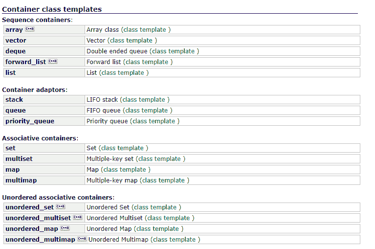
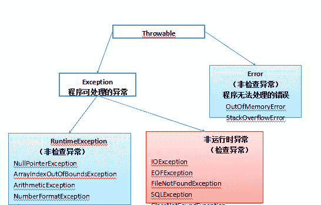
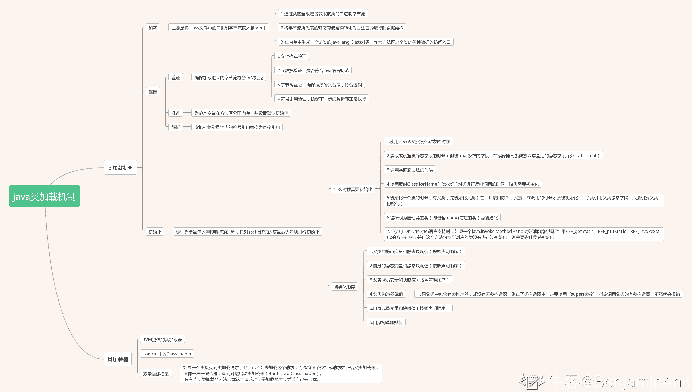
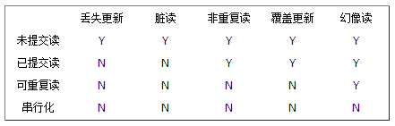
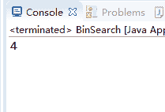

# 中国电信 2016 年 IT 研发工程师笔试题

## 1

设图 G 的相邻矩阵如下图:则 G 的顶点数和边数分别为 ( )

| 0 | 1 | 1 | 1 | 1 |
| 1 | 0 | 1 | 0 | 0 |
| 1 | 1 | 0 | 1 | 1 |
| 1 | 0 | 1 | 0 | 1 |
| 1 | 0 | 1 | 1 | 0 |

正确答案: D   你的答案: 空 (错误)

```cpp
4,5
```

```cpp
4,10
```

```cpp
5,6
```

```cpp
5,8
```

本题知识点

图

讨论

[大猴子](https://www.nowcoder.com/profile/550076)

总共有 5 行，所以有 5 个顶点。  查看全部)

编辑于 2015-12-07 14:20:24

* * *

[Frank_Sherry](https://www.nowcoder.com/profile/7652757)

图论的基本知识。首先 5 行，所以 5 个顶点，由握手定理可知，顶点的度数和等于 2 倍的边数，矩阵的各行和（或各列和）等于该顶点的度数，将矩阵的所有行（列）和相加得到的就是 2 倍的边数，所以共 8 条边。

发表于 2017-12-29 11:10:11

* * *

[明天晴天 _1989](https://www.nowcoder.com/profile/858986)

由于矩阵是对称矩阵，可以判断为无向图，矩阵有 5 行 5 列，因此有 5 个顶点，只数一下上三角或者下三角矩阵的 1 的个数，就能得到边数，为 8.

发表于 2016-08-01 11:47:33

* * *

## 2

mysql 数据库有选课表 learn(student_id int,course_id int),字段分别表示学号和课程编号, 现在想获取每个学生所选课程的个数信息,请问如下的 sql 语句正确的是()

正确答案: B   你的答案: 空 (错误)

```cpp
select student_id,sum(course_id)from learn
```

```cpp
select student_id,count(course_id)from learn group by student_id
```

```cpp
select student_id,count(course_id)from learn
```

```cpp
select student_id,sum(course_id)from learn group by student_id
```

本题知识点

数据库

讨论

[听说 ID 越长越厉害](https://www.nowcoder.com/profile/969032)

求和用累加 sum(),求行的个数用累计 count()。

发表于 2016-06-26 00:13:52

* * *

[莞尔流年-arln](https://www.nowcoder.com/profile/7888700)

获取每个学生的课程信息，首先需要进行分组，将每个学生所学的课程分为一组，用 group by ,获取个数，用 count,sum 是求和

发表于 2017-06-11 18:00:39

* * *

[旋转的木马](https://www.nowcoder.com/profile/752801)

肯定是 b 啊，获取每个学生所选课程就按照学生分组，统计个数就用 count

发表于 2015-11-11 11:02:41

* * *

## 3

下列排序算法中元素的移动次数和关键字的初始排列次序无关的是()

正确答案: C   你的答案: 空 (错误)

```cpp
直接插入排序
```

```cpp
起泡排序
```

```cpp
基数排序
```

```cpp
快速排序
```

本题知识点

排序 *讨论

[SunburstRun](https://www.nowcoder.com/profile/557336)

答案是 C  查看全部)

编辑于 2015-11-10 18:07:26

* * *

[sunlight_run](https://www.nowcoder.com/profile/6428287)

移动次数和关键字顺序无关的有：顺口溜：一堆（堆排序）海龟（归并排序）选（选择排序）基（基数排序）友

发表于 2017-07-04 19:03:45

* * *

[侯卿](https://www.nowcoder.com/profile/8037781)

不同意以上任何观点。与初始状态无关分好几种情况，大家别都当成了第二种

1、**总排序趟数**与初始状态无关的有：**（除了快速排序和优化的冒泡，其他都是）**

2、**算法复杂度**与初始状态无关的有：**堆排序**、**归并排序**、**选择排序**、**基数排序**。

3、元素总**比较次数**与初始状态无关的有：**选择排序**、**基数排序**。

4、元素总**移动次数**与初始状态无关的有：**归并排序**、**基数排序**。

具体分析感兴趣的同学可以看我的博客：[`www.cnblogs.com/Xieyang-blog/p/8340578.html`](http://www.cnblogs.com/Xieyang-blog/p/8340578.html)欢迎讨论。

编辑于 2018-01-24 11:30:05

* * *

## 4

某一密码仅使用 K、L、M、N、O 共 5 个字母,密码中的单词从左向右排列,密码单词 必须遵循如下规则:(1) 密码单词的最小长度是两个字母,可以相同,也可以不同(2) K 不可能是单词的第一个字母(3) 如果 L 出现,则出现次数不止一次(4) M 不能使最后一个也不能是倒数第二个字母 (5) K 出现,则 N 就一定出现(6) O 如果是最后一个字母,则 L 一定出现 问题:下列哪一个是单词密码?()

正确答案: C   你的答案: 空 (错误)

```cpp
KLLN
```

```cpp
LOML
```

```cpp
MLLO
```

```cpp
NMKO
```

本题知识点

智力题 组合数学 *讨论

[phXu](https://www.nowcoder.com/profile/2037126)

排除法很容易得到答案是 C

发表于 2017-06-12 14:11:08

* * *

[响亮 _niuke](https://www.nowcoder.com/profile/717709)

D

发表于 2015-11-12 19:56:33

* * *

[笔墨桑](https://www.nowcoder.com/profile/485624)

这道题很简单，只要审题了都能答对，理解字面意思就可以得出答案(1) 密码单词的最小长度是两个字母,可以相同,也可以不同这句话暂时看不出什么(2) K 不可能是单词的第一个字母排除 A 选项(3) 如果 L 出现,则出现次数不止一次 B/C 中有 L，并且出现 2 次，不能进行排除(4) M 不能使最后一个也不能是倒数第二个字母排除 B 选项(5) K 出现,则 N 就一定出现 A 和 D 都符合(6) O 如果是最后一个字母,则 L 一定出现排除 D 所以只能选 C

发表于 2015-11-11 16:17:15

* * *

## 5

n 从 1 开始,每个操作可以选择对 n 加 1，或者对 n 加倍。如果最后结果为 2013，最少需要( )个操作。

正确答案: A   你的答案: 空 (错误)

```cpp
18
```

```cpp
24
```

```cpp
21
```

```cpp
不可能
```

本题知识点

数学运算

讨论

[小跃](https://www.nowcoder.com/profile/414413)

将 2013 转换为二进制为：10111011111；其中，1 要做 2 次操作（减 1 和 除以 2 ）， 0 要做 1 次操作（ 除以 2 ） ，最左边的 1 做 0 次操作（初始为 1）。设 1 数量为 x，0 数量为 y，则 num = 2*(x-1)+y。（除以 2 在二进制里是右移一位）

发表于 2016-04-19 18:59:39

* * *

[supervirgo](https://www.nowcoder.com/profile/852565)

2013 = 1006 * 2 + 1（2 次）

1006 = 503 * 2（1 次）

503 = 251 * 2 + 1（2 次）

251 = 125 * 2 + 1（2 次）

125 = 62 * 2 + 1（2 次）

62 = 31 * 2（1 次）

31 = 15 * 2 + 1（2 次）

15 = 7 * 2 + 1（2 次）

7 =  3 * 2 + 1（2 次）3 =  1 * 2 + 1（2 次）

共 18 次，选 A

发表于 2015-11-10 20:17:41

* * *

[遂心](https://www.nowcoder.com/profile/775904)

将 2013 转换为二进制为：10111011111；其中遇到 1 除以 2，遇到 0 减 1，即有公式 num = 2*(x-1)+y，其中 x 为二进制中 1 的个数，y 为二进制中 0 的个数，则有 num = 18.

发表于 2015-11-30 20:10:10

* * *

## 6

下面一段代码的输出结果是()

```cpp
void f(char *c, char d) {
    *c = *c + 1;
    d = d + 1;
    cout << *c << d;
}
int main() {
    char a = 'A', b = 'a'; f(&b, a);
    cout << a << b << endl; 
    return 0;
}
```

正确答案: B   你的答案: 空 (错误)

```cpp
BaBa
```

```cpp
bBAb
```

```cpp
AbAb
```

```cpp
aBaB
```

本题知识点

C++ 编程基础 *讨论

[YSunJoy](https://www.nowcoder.com/profile/441681)

```cpp
c 对应 b 的地址，内容是'a'；d 的值是'A'；
f（）中，对 c 所指的内容加 1，则该地址（也是 b 的地址）的内容从'a'变成'b'；
d 的值加 1，则数值变为'B'；从函数返回后，b 传递了地址，其内容在 f（）已修改，而 a 传递了数值，a 变量本身未变。
```

发表于 2017-10-14 16:04:14

* * *

[王唧唧](https://www.nowcoder.com/profile/903364)

共输出两次，第一次，函数执行时，形参实参皆在原来基础上加 1。第二次输出，主函数中，形参受影响，实参保持原始值。

发表于 2016-04-28 00:00:47

* * *

[言安阳](https://www.nowcoder.com/profile/460557)

*c 是址传递，d 是值传递，函数调用后址传递改变了 b 的值为‘b’

发表于 2015-11-10 21:05:48

* * *

## 7

关于 JAVA 堆,下面说法错误的是()

正确答案: D   你的答案: 空 (错误)

```cpp
所有类的实例和数组都是在堆上分配内存的
```

```cpp
对象所占的堆内存是由自动内存管理系统回收
```

```cpp
堆内存由存活和死亡的对象,空闲碎片区组成
```

```cpp
数组是分配在栈中的
```

本题知识点

Java

讨论

[我是祖国的花朵](https://www.nowcoder.com/profile/5459305)

[Java](http://lib.csdn.net/base/17)把内存分成两种，一种叫做栈内存，一种叫做堆内存。

在函数中定义的一些基本类型的变量和对象的引用变量都是在函数的栈内存中分配。当在一段代码块中定义一个变量时，java 就在栈中为这个变量分配内存空间，当超过变量的作用域后，java 会自动释放掉为该变量分配的内存空间，该内存空间可以立刻被另作他用。

堆内存用于存放由 new 创建的对象和数组。在堆中分配的内存，由 java 虚拟机自动垃圾回收器来管理。在堆中产生了一个数组或者对象后，还可以在栈中定义一个特殊的变量，这个变量的取值等于数组或者对象在堆内存中的首地址，在栈中的这个特殊的变量就变成了数组或者对象的引用变量，以后就可以在程序中使用栈内存中的引用变量来访问堆中的数组或者对象，引用变量相当于为数组或者对象起的一个别名，或者代号。

引用变量是普通变量，定义时在栈中分配内存，引用变量在程序运行到作用域外释放。而数组＆对象本身在堆中分配，即使程序运行到使用 new 产生数组和对象的语句所在地代码块之外，数组和对象本身占用的堆内存也不会被释放，数组和对象在没有引用变量指向它的时候（比如先前的引用变量 x=null 时），才变成垃圾，不能再被使用，但是仍然占着内存，在随后的一个不确定的时间被垃圾回收器释放掉。这个也是 java 比较占内存的主要原因。

       以上段落来自于某一本 Java 程序设计的书中，实际上，栈中的变量指向堆内存中的变量，这就是 Java 中的指针。总结起来就是对象存储在堆内存，引用变量存储在栈内存。栈内存指向堆内存。

发表于 2016-09-21 11:34:29

* * *

[luck](https://www.nowcoder.com/profile/816707)

1\. 对象存储在堆区。2\. 数组是一种对象。

发表于 2015-11-14 00:50:40

* * *

[半纸流年](https://www.nowcoder.com/profile/710504)

java 虚拟机规范，所有的对象实例和数组都是要在堆上分配的。

发表于 2015-11-21 21:50:43

* * *

## 8

某系统有 n 台互斥使用的同类设备,3 个并发进程需要 3,4,5 台设备,可确保系统不发生死锁的设备数 n 最小为()

正确答案: B   你的答案: 空 (错误)

```cpp
9
```

```cpp
10
```

```cpp
11
```

```cpp
12
```

本题知识点

操作系统

讨论

[SunburstRun](https://www.nowcoder.com/profile/557336)

答案是 B  查看全部)

编辑于 2015-11-10 18:09:09

* * *

[牛客 330071 号](https://www.nowcoder.com/profile/330071)

是不是可以这么想。极端状态下：进程 1(3 台)：申请到 2 台，无法工作；进程 2(4 台)：申请到 3 台，无法工作；进程 3(5 台)：申请到 4 台，无法工作；申请总数：2+3+4=9，此时若只有 9 台，3 个进程持续申请且申请不到，造成死锁。所以必须再空出一台。

发表于 2015-11-13 11:27:41

* * *

[而安](https://www.nowcoder.com/profile/857258)

10
首先假设全部死锁时的最大资源数，分别为 2，3，4，那么此时是不是只要还有一个多余的资源，是不是就可以解除死锁状态了？是的，所以至少 10 台才不会出现死锁。

发表于 2016-03-28 22:05:15

* * *

## 9

一堆硬币,一个机器人,如果是反的就翻正,如果是正的就抛掷一次,无穷多次后,求 正反的比例()

正确答案: B   你的答案: 空 (错误)

```cpp
3:1
```

```cpp
2:1
```

```cpp
4:1
```

```cpp
6:1
```

本题知识点

概率统计 *讨论

[SunburstRun](https://www.nowcoder.com/profile/557336)

答案是 B  查看全部)

编辑于 2015-11-10 18:10:41

* * *

[zatree](https://www.nowcoder.com/profile/897162)

主要是无穷次后，到达了稳态的时候正反面比例不变了，如这次(稳态后)正：P，反 1-P；那么下次正：P/2+（1-P），反 P/2;则由稳态后比例不变得到==》》P=P/2+(1-P)==》》P=2/3==》》所以正：反=2：1

发表于 2016-03-26 13:02:13

* * *

[风风火火恍恍惚惚改个名](https://www.nowcoder.com/profile/193955)

原封不动的转自：[`www.nowcoder.com/questionTerminal/d409ab8979184e7b8f69e5efdb56ced5`](http://www.nowcoder.com/questionTerminal/d409ab8979184e7b8f69e5efdb56ced5)这道题终于不用做错了假设某个阶段正面硬币的比例为 p，则反面的比例为 1-p，下一次翻转后，p 的部分分为 p/2 的正面、p/2 的反面，而 1-p 的反面部分全部变为正面。趋于平衡时，前后两次正反的比例应相等，即：p/(1-p)=(p/2+(1-p))/(p/2)，得到 p=2/3。更直接一点，翻转前后正面（反面）相等，即 p=p/2+(1-p)，直接得到 p=2/3。

发表于 2016-08-15 09:57:06

* * *

## 10

主机甲和乙已建立了 TCP 连接,甲始终以 MSS=1KB 大小的段发送数据,并一直有数据 发送;乙每收到一个数据段都会发出一个接收窗口为 10KB 的确认段。若甲在 t 时刻发生超 时时拥塞窗口为 8KB,则从 t 时刻起,不再发生超时的情况下,经过 10 个 RTT 后,甲的发送窗口是()

正确答案: A   你的答案: 空 (错误)

```cpp
10KB
```

```cpp
12KB
```

```cpp
14KB
```

```cpp
15KB
```

本题知识点

网络基础

讨论

[良哥](https://www.nowcoder.com/profile/491039)

  查看全部)

编辑于 2016-02-25 15:14:17

* * *

[EricLi-](https://www.nowcoder.com/profile/880494)

*   无论在慢开始阶段还是在拥塞避免阶段，只要发送方判断网络出现拥塞（其根据就是没有按时收到确认），就要把慢开始门限 ssthresh 设置为出现拥塞时的发送方窗口值的一半（但不能小于 2）。
*   然后把拥塞窗口 cwnd 重新设置为 1，执行慢开始算法。

所以，过程为 1——>2——>4——>8（产生拥塞，门限缩小一半，变为 4，cwnd 重设为 1，此时为 t 时刻） ——>1——>2——>4（到了门限，不再执行慢开始，执行拥塞避免）——>5——>6——>7——>8——>9——>10（到达接收窗口最大值，保持不变）——>10

编辑于 2016-03-29 17:24:03

* * *

[lpcheng1992](https://www.nowcoder.com/profile/710674)

甲的发送窗口最大不能大于乙的接收窗口。

发表于 2015-11-12 16:11:24

* * *

## 11

下面哪几种是 STL 容器类型()

正确答案: A B D E   你的答案: 空 (错误)

```cpp
vector
```

```cpp
set
```

```cpp
multivector
```

```cpp
multiset
```

```cpp
array
```

本题知识点

C++

讨论

[MSean](https://www.nowcoder.com/profile/231467)

**C++11 STL**中的容器==================================================**一、顺序**容器：
**vector：**可变大小数组；**deque：**双端队列；**list：**双向链表；**forward_list：**单向链表；**array**：固定大小数组；**string**：与 vector 相似的容器，但专门用于保存字符。==================================================**二、关联**容器：按**关键字有序**保存元素：（底层实现为**红黑树**）**map：**关联数组；保存关键字-值对；**set：**关键字即值，即只保存关键字的容器；**multimap：**关键字可重复的 map；**multiset：**关键字可重复的 set；--------------------------------------------------------------------------------**无序**集合：**unordered_map：**用哈希函数组织的 map；**unordered_set：**用哈希函数组织的 set；**unordered_multimap：**哈希组织的 map；关键字可以重复出现；**unordered_multiset：**哈希组织的 set；关键字可以重复出现。==================================================三、其他项：**stack、queue、valarray、bitset**

编辑于 2016-08-29 23:59:27

* * *

[周星星 _](https://www.nowcoder.com/profile/537870)

答案是 ABDE。 题目不严谨，应该指明 C++ 11 标准。如果 c98，那就选 ABD。c++ 11 新增了新增 array、 forward_list 以及 unordered 的 4 个关联容器：（unordered_set/unordered_multiset/unordered_map/unordered_multimap）ref:c++ primer plus P877

编辑于 2016-09-02 09:18:10

* * *

[Patron97](https://www.nowcoder.com/profile/8610466)

直接上 C++ Reference 内容地址：[`www.cplusplus.com/reference/stl/`](http://www.cplusplus.com/reference/stl/)

发表于 2018-05-09 10:30:19

* * *

## 12

下面有关 JAVA 异常类的描述,说法正确的有()

正确答案: A B C   你的答案: 空 (错误)

```cpp
异常的继承结构:基类为 Throwable,Error 和 Exception 。实现 Throwable, RuntimeException 和 IOException 等继承 Exception
```

```cpp
非 RuntimeException 一般是外部错误(不考虑 Error 的情况下),其可以在当前类被 try{}catch 语句块所捕获
```

```cpp
Error 类体系描述了 Java 运行系统中的内部错误以及资源耗尽的情形,Error 不需要捕捉
```

```cpp
RuntimeException 体系包括错误的类型转换、数组越界访问和试图访问空指针等等,必须 被 try{}catch 语句块所捕获
```

本题知识点

Java

讨论

[Razertory](https://www.nowcoder.com/profile/140047)

ABC
都是 Throwable 的子类： 1.Exception（异常） :是程序本身可以处理的异常。
2.Error（错误）: 是程序无法处理的错误。这些错误表示故障发生于虚拟机自身、或者发生在虚拟机试图执行应用时，一般不需要程序处理。

3.检查异常（编译器要求必须处置的异常） ：  除了 Error，RuntimeException 及其子类以外，其他的 Exception 类及其子类都属于可查异常。这种异常的特点是 Java 编译器会检查它，也就是说，当程序中可能出现这类异常，要么用 try-catch 语句捕获它，要么用 throws 子句声明抛出它，否则编译不会通过。

4.非检查异常(编译器不要求处置的异常): 包括运行时异常（RuntimeException 与其子类）和错误（Error）。

编辑于 2016-06-02 22:02:03

* * *

[升勿喜 坠勿悲 足矣](https://www.nowcoder.com/profile/1659303)

B 为什么！可以 throws 啊！为啥非要捕获

发表于 2017-04-08 23:19:27

* * *

[authority](https://www.nowcoder.com/profile/4519441)

D 选项 错误的原因：说一个简单的例子：在我们用 myeclipse 或 eclipse 开发时非运行时异常 总是在我们写的时候就会出错 提醒我们 try catch  或 throw  但是运行时异常检查不出来，只有运行时才会出错，所以也不需 try catch 欢迎大家踊跃探讨

发表于 2016-09-05 16:48:35

* * *

## 13

下面有关 java 类加载器,说法正确的是?()

正确答案: B C D   你的答案: 空 (错误)

```cpp
引导类加载器(bootstrap class loader):它用来加载 Java 的核心库,是用原生代码来实现的
```

```cpp
扩展类加载器(extensions class loader):它用来加载 Java 的扩展库。
```

```cpp
系统类加载器(system class loader):它根据 Java 应用的类路径(CLASSPATH)来加载 Java 类
```

```cpp
tomcat 为每个 App 创建一个 Loader,里面保存着此 WebApp 的 ClassLoader。需要加载 WebApp 下的类时,就取出 ClassLoader 来使用
```

本题知识点

Java

讨论

[牛客 318796 号](https://www.nowcoder.com/profile/318796)

类的加载是由类加载器完成的，类加载器包括：根加载器（ BootStrap ）、扩展加载器（ Extension ）、系统加载器（ System ）和用户自定义类加载器（ java.lang.ClassLoader 的子类）。从 Java 2 （ JDK 1.2 ）开始，类加载过程采取了父亲委托机制（ PDM ）。 PDM 更好的保证了 Java 平台的安全性，在该机制中， JVM 自带的 Bootstrap 是根加载器，其他的加载器都有且仅有一个父类加载器。类的加载首先请求父类加载器加载，父类加载器无能为力时才由其子类加载器自行加载。 JVM 不会向 Java 程序提供对 Bootstrap 的引用。下面是关于几个类加载器的说明：

*   Bootstrap ：一般用本地代码实现，负责加载 JVM 基础核心类库（ rt.jar ）；
*   Extension ：从 java.ext.dirs 系统属性所指定的目录中加载类库，它的父加载器是 Bootstrap ；
*   system class loader ：又叫应用类加载器，其父类是 Extension 。它是应用最广泛的类加载器。它从环境变量 classpath 或者系统属性 java.class.path 所指定的目录中记载类，是用户自定义加载器的默认父加载器。
*   用户自定义类加载器： java.lang.ClassLoader 的子类

    父类委托机制是可以修改的，有些服务器就是自定义类加载器优先的。

编辑于 2016-03-26 10:34:20

* * *

[cairo](https://www.nowcoder.com/profile/768973)

```cpp
 1）Bootstrap ClassLoader

	负责加载$JAVA_HOME 中 jre/lib/rt.jar 里所有的 class，由 C++实现，不是 ClassLoader 子类

	2）Extension ClassLoader

	负责加载 java 平台中扩展功能的一些 jar 包，包括$JAVA_HOME 中 jre/lib/*.jar 或-Djava.ext.dirs 指定目录下的 jar 包

	3）App ClassLoader

	负责记载 classpath 中指定的 jar 包及目录中 class

	4）Custom ClassLoader

	属于应用程序根据自身需要自定义的 ClassLoader，如 tomcat、jboss 都会根据 j2ee 规范自行实现 ClassLoader

	加载过程中会先检查类是否被已加载，检查顺序是自底向上，从 Custom ClassLoader 到 BootStrap ClassLoader 逐层检查，只要某个 classloader 已加载就视为已加载此类，保证此类只所有 ClassLoader 加载一次。而加载的顺序是自顶向下，也就是由上层来逐层尝试加载此类。 
```

发表于 2015-11-13 11:33:05

* * *

[程序猿 Go 师傅](https://www.nowcoder.com/profile/242025553)



编辑于 2019-10-21 16:52:09

* * *

## 14

下面有关事务隔离级别说法正确的是?()

正确答案: A B C D   你的答案: 空 (错误)

```cpp
串行读(Serializable):完全串行化的读,每次读都需要获得表级共享锁,读写相互都会阻塞
```

```cpp
未提交读(Read Uncommitted):允许脏读,也就是可能读取到其他会话中未提交事务修改 的数据
```

```cpp
提交读(Read Committed):只能读取到已经提交的数据
```

```cpp
可重复读(Repeated Read):在同一个事务内的查询都是事务开始时刻一致的
```

本题知识点

数据库

讨论

[privilege...](https://www.nowcoder.com/profile/705973)

http://blog.csdn.net/ocean1010/article/details/6548771（百度查的）并发与事务隔离：并发：        丢失更新，脏读，非重复读，覆盖更新，幻想读事务隔离： 未提交读，已提交读，可重复读，串行化（复制的其他题别人的回答）1、更新丢失：   一个事务的更新覆盖了另一个事务的更新。
2、脏读：          一个事务读取了另一个事务未提交的数据。
3、不可重复读：一个事务两次读取同一个数据，两次读取的数据不一致。
4、幻象读：       一个事务两次读取一个范围的记录，两次读取的记录数不一致。**未提交读：** 一个事务在执行过程中可以看到其他事务没有提交的新插入的记录，而 且能看到其他事务没有提交的对已有记录的更新。**已提交读：** 一个事务在执行过程中可以看到其他事务已经提交的新插入的记录，而且能看到其他事务已经提交的对已有记录的更新。**可重复读：** 一个事务在执行过程中可以看到其他事务已经提交的新插入的记录，但是不能看到其他其他事务对已有记录的更新。**串行化：** 一个事务在执行过程中完全看不到其他事务对数据库所做的更新。（事务执行的时候不允许别的事务并发执行。事务串行化执行，事务只能一个接着一个地执行，而不能并发执行）**** 

编辑于 2015-11-14 15:10:58

* * *

[黄毅飞](https://www.nowcoder.com/profile/606365)

```cpp
串行读(Serializable):完全串行化的读,每次读都需要获得表级共享锁,读写相互都会阻塞
理解:每次读的时候不一定获得的是表级共享锁。oracle 中还有可能是 row 级或者 database 级。
```

```cpp
可重复读(Repeated Read):在同一个事务内的查询都是事务开始时刻一致的
理解:感觉这个也不一定，幻影读也没有解决呀。
```

编辑于 2015-12-11 13:22:02

* * *

[Anotherniukewang](https://www.nowcoder.com/profile/800909)

**读未提交：一个事务可以读到别的事务没有提交的数据 ---->可能出现****脏读****读提交：一个事务要等另一个事务提交了才能读取数据 -----> 可能出现****不可重复读     ****不可重复读：就是 A 事务首先去查看一个数据，然后 B 事务对该数据进行更改，接着 A 事务再去读的时候发现和刚才读的不一样了。一个事务内两个相同的查询却得到不同的结果。****重复读：在开始读数据时，事务开启，不允许别的事务再去修改数据（update）  -----> 可能出现幻度    幻度：就是在一个事务的两次读数据间，别的事务插入(insert)新数据。****序列化：最高的隔离级别，对事务串行化顺序处理**

发表于 2017-09-04 19:29:26

* * *

## 15

下列说法错误的是 ()

正确答案: B D   你的答案: 空 (错误)

```cpp
利用一组地址连续的存储单元依次存放自栈底到栈顶的数据元素,这种形式的栈也称为顺序栈
```

```cpp
top=0 时为空栈,元素进栈时指针 top 不断地减 1
```

```cpp
当 top 等于数组的最大下标值时则栈满
```

```cpp
栈不能对输入序列部分或全局起求逆作用
```

本题知识点

栈 *讨论

[想做樱木的圆寸少年](https://www.nowcoder.com/profile/906117)

A 正确，虽然链栈也可以实现地址连续，但无法做到依次存放数据元素，因为除了元素域还需要存放指针域。因此满足条件的只有顺序栈。B 错误，top= -1 时为空栈，top=0 只能说明栈中只有一个元素，并且元素进栈时 top 应该自增 C 正确，top 所指向的对象永远是栈顶元素 D 错误，栈的特性（先进后出）就决定了可以作为求逆元素的辅助空间。所谓求逆运算就是 ABC 依次入栈，输入 CBA。

发表于 2016-02-02 10:58:36

* * *

[灰色节能 _ 聪](https://www.nowcoder.com/profile/722809)

 求逆应该是  你 顺序压入 ABC，压完后依次弹出栈顶就变成了 CBA，不就变成原来的逆序了 部分求逆也是同理

发表于 2016-01-21 21:18:08

* * *

[白起丶](https://www.nowcoder.com/profile/815173790)

对于 C 选项，当用数组来存储栈时，栈空时 top = -1，top 每次指向栈顶的下一个位置，故栈满时 top 指向的位置就是数组的最大下标值。

发表于 2020-07-17 11:28:32

* * *

## 16

找出两个链表相交的结点(定义链表结构)

你的答案

本题知识点

链表 *讨论

[牛客 883929 号](https://www.nowcoder.com/profile/883929)

//节点定义 typedef struct Node{int data;Node* next;}//寻找内存位置相同的节点 Node* Search(Node* head1,Node* head2){if(head1==null || head2==null) return null;int diff = head1.size() - head2.size();Node* p1=head1,p2=head2;if(diff<0){for(int i=1;i<=diff;i++) p2 = p2->next;}else if(diff>0){for(int i=1;i<=diff;i++) p1 = p1->next;}while(p1->next!=p2->next){p1 = p1->next;p2 = p2->next;}return p1->next;}

发表于 2016-05-10 21:13:45

* * *

[啦啦啦 201809042342197](https://www.nowcoder.com/profile/245061515)

class Node {

```cpp
  Node next;
   int val;
   public Node(int val) {
       this.val = val;
   }
```

}Class solution {    public void 
}

发表于 2019-03-14 16:36:39

* * *

[小虎牙](https://www.nowcoder.com/profile/512935)

structNode{  int data;  structNode *next;}class solution{
  public:   structNode* FindCommen(structNode* list1,structNode* list2){  if(list1==NULL || list2==NULL)     return NULL; int len1=list1.size(); int len2=list2.size(); int diff;if(len1>len2)   {     diff=len1-len2;    for(int i=0;i<diff;i++)      {        list1=list1->next;      }   }else    {     diff=len2-len1;     for(int i=0;i<diff;i++ )    {       list2=list2->next;    }   }while(list1->data != list2->data){   list1=list->next;  list2=list2->next;}return list1;}

发表于 2015-11-22 16:04:58

* * *

## 17

给定一个已经排好序的字符串数组,空字符串散布在该数组中,编写一个函数寻找一个 给定字符串的位置。

你的答案

本题知识点

链表 *讨论

[牛客 923](https://www.nowcoder.com/profile/447244)

```cpp
#include<iostream>
using namespace std;
int search(string s[],int low,int high,string x) {
	if(x == "")
	return -1;
	while(low <= high) {
		int mid = (high-low)/2+low;
		int t = mid;
		while(s[t] == "" && t<=high) {
			t++;
		}
		if(s[t] == x)
				return t;
			else if(s[t] < x)
				low = t+1;
			else
				high = mid-1;
	}
	return -1;
}

int main() {
	string s[13] = {
		"at", "", "", "", "ball", "", "", "car", "", "", "dad", "", ""
	};
	cout<<search(s, 0, 12, "ball")<<endl;

	return 0;
}
```

发表于 2016-04-26 17:20:55

* * *

[D206](https://www.nowcoder.com/profile/965895285)

```cpp
def find_string(str_target,string):
    str_list = string.split(' ')
    for i in range(len(str_list)):
        if str_list[i] ==  str_target:
             print("该字符串的位置为 %d" % (i+1))

```

发表于 2019-08-03 15:47:04

* * *

[面临孤独](https://www.nowcoder.com/profile/317499190)

二分查找

```cpp
public class BinSearch {
    public static boolean isF=false;
    public static int result=-1;
    public static void main(String[] args) {
        String[] str = {
                "at", "", "", "", "ball", "", "", "car", "", "", "dad", "", ""
            };
        indexOfString(str, "ball", 0, str.length-1);
        System.out.println(result);
    }
    public static void indexOfString(String[] str,String s,int left,int right) {
        if(isF)
            return;
        String mid=str[(left+right)/2];
        if (mid.equals("")) {
            indexOfString(str, s, left, right-1);
            indexOfString(str, s,left+1, right);
        }else if (mid.compareTo(s)>0) {
            indexOfString(str, s, left, (left+right)/2-1);
        } else if(mid.compareTo(s)<0){
            indexOfString(str, s,(left+right)/2+1, right);
        } else {
            isF=true;
            result=(left+right)/2;
            return;
        }
        return;
    }
}
```



发表于 2020-09-08 20:15:42

* * *

## 18

给定一个二叉树,且每个节点存储一个值。设计一个算法,实现:对于一个给定的数值, 打印出所有的路径。这条路径不必要开始于或结束语根节点或叶节点。

你的答案

本题知识点

树

讨论

[卑微的学习者](https://www.nowcoder.com/profile/354131)

bool visitTreePathByValue(TreeNode * pNode , int nNodeVal){if (NULL == pNode){return false;}if (nNodeVal == pNode->value()){printf("%d" , pNode->value());return true;}bool bVisit = false;bVisit = visitTreePathByValue(pNode->left() , nNodeVal);if (bVisit){printf("%d" , pNode->value());}bVisit = visitTreePathByValue(pNode->right() , nNodeVal);if (bVisit){printf("%d" , pNode->value());}return bVisit;}

发表于 2016-01-25 15:37:39

* * *

[qs956](https://www.nowcoder.com/profile/737167515)

向上的路径不是也要打印吗？

发表于 2020-03-07 19:52:04

* * *

[我勒个旭](https://www.nowcoder.com/profile/262884115)

/*** 使用广度优先算法或者深度优先算法*/

发表于 2018-07-22 20:04:36

* * ********