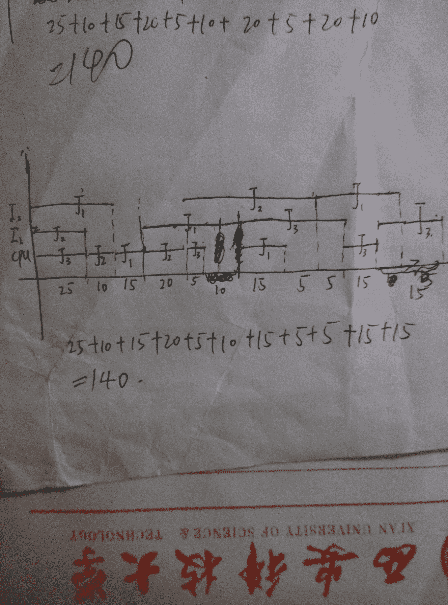
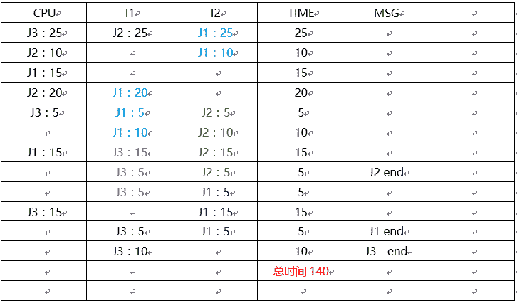
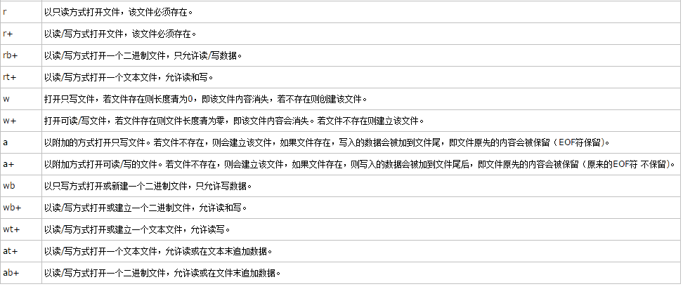
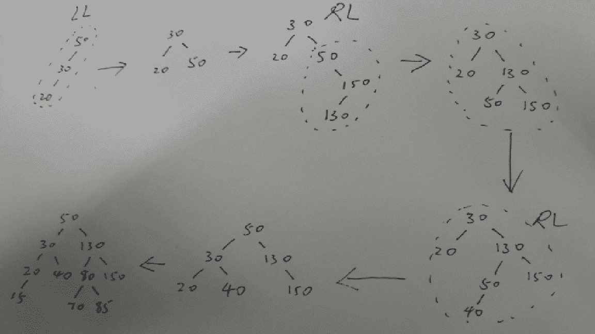
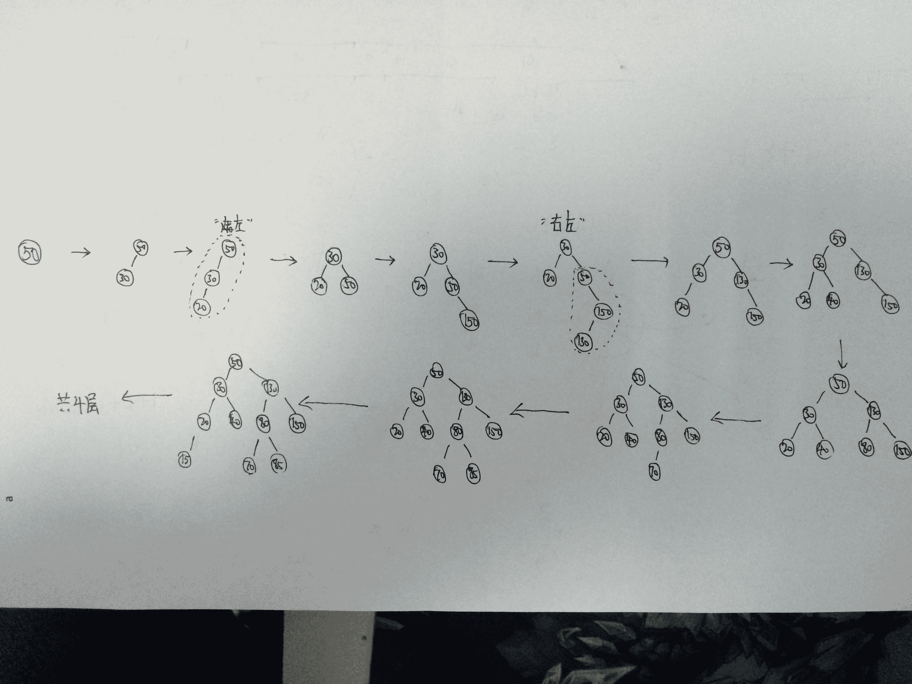

# 网易 2016 研发工程师笔试题（二）

## 1

设有两个事务 T1,T2,其并发操作如下所示,下面评价正确的是()

> 步骤          T1         T21          读 A=1002                      读 A=1003\.         A=A+10 写回 4\.                     A=A-10 写回

正确答案: D   你的答案: 空 (错误)

```cpp
该操作不能重复读
```

```cpp
该操作不存在问题
```

```cpp
该操作读"脏"数据
```

```cpp
该操作丢失修改
```

本题知识点

数据库

讨论

[牛客 223996 号](https://www.nowcoder.com/profile/223996)

这两个事务的问题出在，原本两  查看全部)

编辑于 2016-04-19 09:38:55

* * *

[炫](https://www.nowcoder.com/profile/376795)

**丢失修改**

下面我们先来看一个例子，说明并发操作带来的数据的不一致性问题。

考虑飞机订票系统中的一个活动序列:
甲售票点（甲事务）读出某航班的机票余额 A,设 A=16.
乙售票点（乙事务）读出同一航班的机票余额 A,也为 16.
甲售票点卖出一张机票,修改余额 A←A-1.所以 A 为 15,把 A 写回数据库.
乙售票点也卖出一张机票,修改余额 A←A-1.所以 A 为 15,把 A 写回数据库.

结果明明卖出两张机票，数据库中机票余额只减少 1。

归纳起来就是：两个事务 T1 和 T2 读入同一数据并修改，T2 提交的结果破坏了 T1 提交的结果，导致 T1 的修改被丢失。前文（2.1.4 数据删除与更新）中提到的问题及解决办法往往是针对此类并发问题的。但仍然有几类问题通过上面的方法解决不了，那就是：
 **不可重复读**

不可重复读是指事务 T1 读取数据后，事务 T2 执行更新操作，使 T1 无法再现前一次读取结果。具体地讲，不可重复读包括三种情况：
事务 T1 读取某一数据后，事务 T2 对其做了修改，当事务 1 再次读该数据时，得到与前一次不同的值。例如，T1 读取 B=100 进行运算，T2 读取同一数据 B，对其进行修改后将 B=200 写回数据库。T1 为了对读取值校对重读 B，B 已为 200，与第一次读取值不一致。
事务 T1 按一定条件从数据库中读取了某些数据记录后，事务 T2 删除了其中部分记录，当 T1 再次按相同条件读取数据时，发现某些记录神密地消失了。
事务 T1 按一定条件从数据库中读取某些数据记录后，事务 T2 插入了一些记录，当 T1 再次按相同条件读取数据时，发现多了一些记录。（这也叫做幻影读） 
**读"脏"数据**

读"脏"数据是指事务 T1 修改某一数据，并将其写回磁盘，事务 T2 读取同一数据后，T1 由于某种原因被撤消，这时 T1 已修改过的数据恢复原值，T2 读到的数据就与数据库中的数据不一致，则 T2 读到的数据就为"脏"数据，即不正确的数据。

产生上述三类数据不一致性的主要原因是并发操作破坏了事务的隔离性。并发控制就是要用正确的方式调度并发操作，使一个用户事务的执行不受其它事务的干扰，从而避免造成数据的不一致性。

发表于 2016-05-10 12:43:19

* * *

[zhisheng_blog](https://www.nowcoder.com/profile/616717)

正确答案：D；本题考察事务的并发；
解析：
这两个事务先后读取了 A＝100，但是在做修改操作的时候，由于 T1 将 A＝A+10 做完修改写回时 T2 已经读取了 A＝100，这个时候，T2 再执行 A＝A－10 时修改操作会覆盖 T1 的修改，使得 A 的值变成了 90。即 T2 的修改覆盖了 T1 的修改，这种现象叫做丢失修改。

发表于 2016-08-24 00:01:17

* * *

## 2

以下哪个不是与 Mysql 服务器相互作用的通讯协议()

正确答案: B   你的答案: 空 (错误)

```cpp
TCP/IP
```

```cpp
UDP
```

```cpp
共享内存
```

```cpp
Socket
```

本题知识点

数据库

讨论

[TPU-Lee](https://www.nowcoder.com/profile/257118)

MySQL 实现了四种通信协议

  查看全部)

编辑于 2016-09-01 23:00:41

* * *

[肥宝 er](https://www.nowcoder.com/profile/994084)

```cpp
与 Mysql 服务器相互作用的通讯协议包括 TCP/IP，Socket，共享内存，命名管道  
```

发表于 2015-11-13 15:30:26

* * *

[zhisheng_blog](https://www.nowcoder.com/profile/616717)

正确答案：A；本题考察 MySql 相关知识；
解析：
与 Mysql 服务器相互作用的通讯协议包括 TCP／IP、Socket、共享内存、命名管道；

发表于 2016-08-24 00:03:12

* * *

## 3

CPU 和两台输入/输出设备(I1,I2)多道程序设计环境下,同时有三个作业 J1,J2,J3 进行,这三个作业使用 CPU 和输入/输出设备的顺序和时间如下所示:

> J1:I2(35ms);CPU(15ms);I1(35ms);CPU(15ms);I2(25ms)J2:I1(25ms);CPU(30ms);I2(35ms)J3:CPU(30ms);I1(25ms);CPU(15ms);I1(15ms);

假定 CPU,I1,I2 都能并行工作,J1 的优先级最高,J2 次之,J3 优先级最低,优先级高的作业可以抢占优先级低的作业的 CPU,但不能抢占 I1,I2,作业从 J3 开始到完成需要多少时间?

正确答案: C   你的答案: 空 (错误)

```cpp
130
```

```cpp
85
```

```cpp
140
```

```cpp
115
```

本题知识点

操作系统

讨论

[SunburstRun](https://www.nowcoder.com/profile/557336)



发表于 2015-11-11 18:22:37

* * *

[zhisheng_blog](https://www.nowcoder.com/profile/616717)

正确答案：C；本题考察操作系统相关问题；
解析：图示

| CPU |        I1 |         I2     |     Time |     Msg |
| J3:25 | J2:25 | J1:25 | 25 |  |
| J2:10 |  | J1:10 | 10 |  |
| J1:15 |  |  | 15 |  |
| J2:20 | J1:20 |  | 20 |  |
| J3:5 | J1:5 | J2:5 | 5 |  |
|  | J1:10 | J2:10 | 10 |  |
| J1:15 | J3:15 | J2:15 | 15 |  |
|  | J3:5 | J2:5 | 5 | J2 结束 |
|  | J3:5 | J1:5 | 5 |  |
| J3:15 |  | J1:15 | 15 |  |
|  | J3:5 | J1:5 | 5 | J1 结束 |
|  | J3:10 |  | 10 | J3 结束 |
|  |  |  | 140 |  |

发表于 2016-08-24 00:06:18

* * *

[薛定谔之喵](https://www.nowcoder.com/profile/519263)



发表于 2016-03-13 20:40:02

* * *

## 4

文件 exer1 的访问权限为 rw-r--r--，现要增加所有用户的执行权限和同组用户的写权限，下列哪个命令是对的（）

正确答案: A   你的答案: 空 (错误)

```cpp
chmod a+x,g+w exer1
```

```cpp
chmod g+w exer1
```

```cpp
chmod 765 exer1
```

```cpp
chmod o+x exer1
```

本题知识点

Linux

讨论

[苏格拉底没有然丶](https://www.nowcoder.com/profile/571522)

文字设定法 chmod ［who］ ［+ | - | =］ ［mode］ 文件名¼      u 表示“用户（user）”，即文件或目录的所有者。g 表示“同组（group）用户”，即与文件属主有相同组 ID 的所有用户。
o 表示“其他（others）用户”。
a 表示“所有（all）用户”。它是系统默认值。
操作符号可以是：
+ 添加某个权限。
- 取消某个权限。
     = 赋予给定权限并取消其他所有权限（如果有的话）。
   数字设定法的一般形式为：
chmod ［mode］ 文件名¼      我们必须首先了解用数字表示的属性的含义：0 表示没有权限，1 表示可执行权限，2 表示可写权限，4 表示可读权限，然后将其相加。所以       数字属性的格式应为 3 个从 0 到 7 的八进制数，其顺序是（u）（g）（o）。

例如，如果想让某个文件的属主有“读/写”二种权限，需要把 4（可读）+2（可写）＝6（读/写）。

编辑于 2021-12-21 20:51:48

* * *

[mengmengyeye](https://www.nowcoder.com/profile/393033)

a 表示对所有用户 u 表示系主用户 g 表示同组用户 o 表示其他用户答案 c 如果改成 775 就对了。

发表于 2015-11-11 21:33:34

* * *

[zhisheng_blog](https://www.nowcoder.com/profile/616717)

正确答案：A；本题考察 Linux 系统下修改文件权限的命令；
解析：
u-g-o 分别表示用户－用户组－其他用户，用 a 表示所有的用户；即可以表示成为 chmod a+x g+w exer1；
用数字 4-2-1 分别表示 rwx 则这里 u:4+2+1=7，g:4+2+1=7，o:4+1=5。即同样可以表示成为 chmod 775 exer1；

发表于 2016-08-24 00:07:54

* * *

## 5

新建一个管理员用户 admin，需要使用的参数（）

正确答案: A   你的答案: 空 (错误)

```cpp
useradd -u 0 -o admin
```

```cpp
useradd -g -0 admin
```

```cpp
useradd -p -d admin
```

```cpp
useradd -e -f admin
```

本题知识点

Linux

讨论

[Anna8023](https://www.nowcoder.com/profile/705028)

-u 用户号 指定用户的用户号；因为系统用户的用户号为 0，故指定用户号为 0 如果同时有-o 选项，则可以重复使用其他用户的标识号；因为系统本身存在用户号为 0 的系统用户，故应该使用该参数。

发表于 2015-11-13 11:40:33

* * *

[luoyuyiw](https://www.nowcoder.com/profile/1828881)

u 表示创建用户.g 表示创建用户组 -e 指定账号的有效期限，缺省表示永久有效。
-f 指定在密码过期后多少天即关闭该账号。-p 表示创建密码

发表于 2016-06-29 18:44:42

* * *

[zhisheng_blog](https://www.nowcoder.com/profile/616717)

正确答案：A；本题考察 linux 下的命令；
解析：
-u 表示指定用户的用户号，由于系统用户的用户号是 0，所以指定用户号为 0。如果同时有-o 选项，则可以重复使用其他用户的标识号；即-u 0 -o admin 的到相同的效果。但是系统本身勋在用户号为 0 的系统用户，则这里应该使用-o admin 参数；

发表于 2016-08-24 00:08:49

* * *

## 6

设 fp 已定义,执行语句 fp=fopen("file","w");后,以下针对文本文件 file 操作叙述的选项错误的是:

正确答案: A C D   你的答案: 空 (错误)

```cpp
可以随意读和写
```

```cpp
只能写不能读
```

```cpp
可以在原有内容后追加写
```

```cpp
写操作结束后可以从头开始读
```

本题知识点

C++

讨论

[鹤舞青春 1002](https://www.nowcoder.com/profile/501357)

用“w”打开  查看全部)

编辑于 2015-12-18 11:29:58

* * *

[牛客 284361 号](https://www.nowcoder.com/profile/284361)



发表于 2016-07-03 19:35:24

* * *

[zhisheng_blog](https://www.nowcoder.com/profile/616717)

正确答案：ACD；本题考察 C 语言中的文件操作；
解析：
fopen(“file”,”w”)打开文件，并赋值为“w”权限，即写权限，则 B 正确，A 错误，因为这里不具有读权限；对于 C 的解释：用“w”打开的文件只能向该文件写入。若打开的文件不存在，则以指定的文件名建立该文件，若打开的文件已经存在，则将该文件删去，重建一个新文件。所以 C 错误；对于 D 的解释：D 所描述的权限应该是“w+”而非“w”，所以 D 错误；

发表于 2016-08-24 00:11:09

* * *

## 7

下面()组命令,将变量 count 值赋值为 1

正确答案: B   你的答案: 空 (错误)

```cpp
DIM@count=1 count=1
```

```cpp
DECLARE @count SELECT @count=1
```

```cpp
DECLARE count SELECT count=1
```

```cpp
DIM @count SELECT @count=1
```

本题知识点

数据库

讨论

[foreverfruit](https://www.nowcoder.com/profile/888998)

@表示声明一个局部变量，@@表示声明一个全局变量（比如已经定义好的系统变量）申明局部变量语法：declare @变量名 数据类型；例如：declare @num int；赋值：有两种方法式（@num 为变量名，value 为值）set @num=value;   或   select @num=value;

发表于 2016-03-22 17:14:07

* * *

[zhisheng_blog](https://www.nowcoder.com/profile/616717)

正确答案：B；本题考察 Sql 赋值语句；
解析：
DECLARE @count 表示选定变量，SELECT @count＝1 表示为 count 赋值；这里的赋值语句还可以使用 SET @count＝1；但是 select 和 set 在赋值语句中有些区别：SELECT 可以在一条语句里对多个变量同时赋值,而 SET 只能一次对一个变量赋值，即如果数据表中存在多个 count 变量，则不能使用 SET 赋值；
但是我没有查到 DIM 语句是什么意思。。

发表于 2016-08-24 00:12:06

* * *

[星痕 sky](https://www.nowcoder.com/profile/625230)

declare 表示声明，@表示赋值。（书上没有找到，先收藏起来）

编辑于 2016-01-20 17:42:09

* * *

## 8

下面重载乘法运算符的函数原型声明中正确的是:

正确答案: A B D   你的答案: 空 (错误)

```cpp
MyClass operator *(double ,MyClass);
```

```cpp
MyClass operator *(MyClass ,MyClass);
```

```cpp
MyClass operator *(double ,double);
```

```cpp
MyClass operator *(MyClass ,double);
```

本题知识点

C++

讨论

[Pandora](https://www.nowcoder.com/profile/266279)

答案应该是 ABDc++  查看全部)

编辑于 2015-12-02 17:18:04

* * *

[zhisheng_blog](https://www.nowcoder.com/profile/616717)

正确答案：ABD；本题考察 C++运算符重载；
解析：
对于一个运算符函数来说，它或者是类的成员，或者至少包含一个类类型的参数；
操作符重载允许将标准 C++操作符用于类对象；

发表于 2016-08-24 00:12:58

* * *

[huixieqingchun](https://www.nowcoder.com/profile/551201)

**运算符重载声明中的参数的顺序不能随意变更。故 A 和 D 是两个不同的重载运算方法。C 选项在库函数中已经实现了两个实数的相乘运算，所以不是重载的情况。**

发表于 2016-05-18 17:50:32

* * *

## 9

依次把结点的关键字的值为 50,30,20,150,130,40,80,70,85,15 的记录插入到初始化为空的平衡二叉排序树中，在插入过程中平衡树条件如被破坏，则进行必要的调整，得到的平衡二叉排序树的深度（深度从 1 开始）为（）

正确答案: C   你的答案: 空 (错误)

```cpp
6
```

```cpp
5
```

```cpp
4
```

```cpp
3
```

本题知识点

树

讨论

[八区匪徒](https://www.nowcoder.com/profile/396877)



发表于 2016-08-06 16:53:38

* * *

[jhuil](https://www.nowcoder.com/profile/496113)

可以用公式的，n+1 对 2 取对数，结果向取整，

发表于 2015-11-14 10:29:24

* * *

[Dobest](https://www.nowcoder.com/profile/233504)



发表于 2016-03-22 16:53:59

* * *

## 10

截止 JDK1.8 版本,java 并发框架支持锁包括?

正确答案: A B D   你的答案: 空 (错误)

```cpp
读写锁
```

```cpp
自旋锁
```

```cpp
X 锁
```

```cpp
乐观锁
```

```cpp
排他锁
```

本题知识点

Java

讨论

[小虎牙](https://www.nowcoder.com/profile/512935)

Java 锁的种类以及辨析 锁作为并发共享数据，保证一致性的工具，在 JAVA 平台有多种实现(如 synchronized 和 ReentrantLock 等等 ) 。这些已经写好提供的锁为我们开发提供了便利，但是锁的具体性质以及类型却很少被提及。本系列文章将分析 JAVA 中常见的锁以及其特性，为大家答疑解惑。

[1、自旋锁](http://ifeve.com/java_lock_see1/)

[2、自旋锁的其他种类](http://ifeve.com/java_lock_see2/)

[3、阻塞锁](http://ifeve.com/java_lock_see3/)

4、可重入锁

5、读写锁

6、互斥锁

7、悲观锁

8、乐观锁

9、公平锁

10、非公平锁

11、偏向锁

12、对象锁

13、线程锁

14、锁粗化

15、轻量级锁

16、锁消除

17、锁膨胀

18、信号量

发表于 2015-11-25 09:14:31

* * *

[黑眼圈的灰姑娘](https://www.nowcoder.com/profile/200043)

1、自旋锁 ,自旋，jvm 默认是 10 次吧，有 jvm 自己控制。for 去争取锁 2、阻塞锁 被阻塞的线程，不会争夺锁。3、可重入锁 多次进入改锁的域 4、读写锁 5、互斥锁 锁本身就是互斥的 6、悲观锁 不相信，这里会是安全的，必须全部上锁 7、乐观锁 相信，这里是安全的。8、公平锁 有优先级的锁 9、非公平锁 无优先级的锁 10、偏向锁 无竞争不锁，有竞争挂起，转为轻量锁 11、对象锁 锁住对象 12、线程锁 13、锁粗化 多锁变成一个，自己处理 14、轻量级锁 CAS 实现 15、锁消除 偏向锁就是锁消除的一种 16、锁膨胀 jvm 实现，锁粗化 17、信号量 使用阻塞锁 实现的一种策略 18、排它锁：X 锁，若事务 T 对数据对象 A 加上 X 锁，则只允许 T 读取和修改 A，其他任何事务都不能再对 A 加任何类型的锁，直到 T 释放 A 上的锁。这就保证了其他事务在 T 释放 A 上的锁之前不能再读取和修改 A。

编辑于 2016-05-17 11:05:17

* * *

[zhisheng_blog](https://www.nowcoder.com/profile/616717)

正确答案：ABD；题目来源《深入理解 Java 虚拟机》
解析：
截止 JDK1.8，java 中的锁包括：参考 [`ifeve.com/java_lock_see/`](http://ifeve.com/java_lock_see/)

编辑于 2016-08-24 00:16:31

* * *

## 11

下列哪个 IP 地址可以分配给一台计算机?

正确答案: D   你的答案: 空 (错误)

```cpp
256.1.3.4
```

```cpp
197.3.11.0
```

```cpp
199.5.89
```

```cpp
11.15.33.235
```

本题知识点

网络基础

讨论

[takiko](https://www.nowcoder.com/profile/974152)

互联网的网络地址分为 A~E 五类，其中 A 类地址：0.0.0.0 ~ 127.255.255.255 主机号是后 24 位 B 类地址：128.0.0.0 ~ 191.255.255.255 主机号是后 16 位 C 类地址：192.0.0.0 ~ 223.255.255.255 主机号是后 8 位 D 类地址：224.0.0.0 ~ 239.255.255.255 后 28 位为多播组号 E 类地址：240.0.0.0 ~ 255.255.255.255 后 27 位待用所以，A 错。主机号全为 0 的时候，表示一个网段主机号全为 1 的时候，是一个指向网络的广播。关于广播的具体分类请看 TCP/IP 卷一的第十二章。所以 B 代表一个网段。C 的话，参照 TCP/IP 详解卷一第三章 IP:网际协议的图 3-3，代表了一个直接相连的网络。D 作为一个 A 类地址，是可以分配给一台计算机的。

编辑于 2016-03-20 13:37:47

* * *

[牛客 Shawn](https://www.nowcoder.com/profile/933772)

分类的 IP 地址由：网络号+主机号组成，主要分为 A、B、C、D、E 五类，我们能使用的只有 A~C 类，D 类为多播地址，E 类保留使用。答案 A 中，256 的点分十进制 IP 地址不存在，最大为 255 答案 B 中，197 的网络号对应 C 类地址，不能使用全 0 的主机号答案 C 不符合表述答案 D 是符合的 A 类地址

发表于 2016-03-04 22:17:43

* * *

[a 我心飞扬 a](https://www.nowcoder.com/profile/879125)

```cpp
分类的 IP 地址由：网络号+主机号组成，主要分为 A、B、C、D、E 五类，我们能使用的只有 A~C 类，D 类为多播地址，E 类保留使用。
主机号全为 0 的时候，表示一个网段
主机号全为 1 的时候，是一个指向网络的广播。关于广播的具体分类请看 TCP/IP 卷一的第十二章。
答案 A 中，256 的点分十进制 IP 地址不存在，最大为 255
答案 B 中，197 的网络号对应 C 类地址，不能使用全 0 的主机号
答案 C 不符合表述
答案 D 是符合的 A 类地址

本题一定要注意主机号！！！
```

编辑于 2016-03-22 17:11:13

* * *