# 百度 2016 研发工程师笔试题（四）

## 1

关于 MapReduce 的描述错误的是()

正确答案: D   你的答案: 空 (错误)

```cpp
一个 Task 通常会把输入集切分成若干独立的数据块
```

```cpp
通常计算节点和存储节点是同一节点
```

```cpp
通常,作业的输入输出都会被存储在文件系统中
```

```cpp
MapReduce 框架会先排序 map 任务的输出
```

本题知识点

Hadoop/Spark

讨论

[Johnny_Jiang](https://www.nowcoder.com/profile/477181)

D map 任务的输入，会按照 key 进行聚集，之后会有一个 shuffle 的阶段，并不是排序

发表于 2015-11-28 23:50:48

* * *

[TPU-Lee](https://www.nowcoder.com/profile/257118)

Hadoop Map/Reduce 是一个使用简易的软件框架，基于它写出来的应用程序能够运行在由上千个商用机器组成的大型集群上，并以一种可靠容错的方式并行处理上 T 级别的数据集。

一个 Map/Reduce 作业（job） 通常会把输入的数据集切分为若干独立的数据块，由 *map 任务（task）*以完全并行的方式处理它们。框架会对 map 的输出先进行排序， 然后把结果输入给*reduce 任务*。通常作业的输入和输出都会被存储在文件系统中。 整个框架负责任务的调度和监控，以及重新执行已经失败的任务。

通常，Map/Reduce 框架和分布式文件系统是运行在一组相同的节点上的，也就是说，计算节点和存储节点通常在一起。这种配置允许框架在那些已经存好数据的节点上高效地调度任务，这可以使整个集群的网络带宽被非常高效地利用.在文章《 [MapReduce 原理与设计思想](http://blog.jobbole.com/80619/) 》中，详细剖析了 MapReduce 的原理，这篇文章则通过实例重点剖析 MapReduce

发表于 2015-11-17 17:27:29

* * *

[xxqcheers](https://www.nowcoder.com/profile/782495)

Hadoop 框架的流程，MapReduce 的框架流程：map 任务可以细分为四个阶段：record reader、mapper，combiner 和 partitioner。map 任务的输出被称为中间键和中间值，会被送到 reducer 做后续处理。reduce 任务可以分为四个阶段：混排（shuffle），排序（sort），reducer 和输出格式（output format）。所以 D 选项是不正确的，map 任务结束的第一步应该是 shuffle 阶段，然后才是 sort 阶段。

发表于 2016-04-25 10:23:59

* * *

## 2

设哈希表长度为 11,哈希函数 H(K)=(K 的第一个字母在字母表中的序号)MOD11,若输入顺序为(D,BA,TN,M,CI,I,K,X,TA),采用内散列表,处理冲突方法为线性探测法,要求构造哈希表,在等概率情况下查找成功平均查找长度为()

正确答案: C   你的答案: 空 (错误)

```cpp
4
```

```cpp
3
```

```cpp
20/9
```

```cpp
23/9
```

本题知识点

哈希 *讨论

[Pandora](https://www.nowcoder.com/profile/266279)

线性探测：本位置 x 被占据，就寻找下一位 x+1，直至找到空位置，所以：（注意看清题目“K 的第一个字母在字母表中的序号 ”）D=4mode11=4，1 次 B=2mod11=2，1 次 T=20mod11=9，1 次 M=13mod11=2->3，2 次 C=3mod11=3->4->5，3 次 I=9mod11=9->10，2 次 K=11mod11=0，1 次 X=24mod11=2->3->4->5->6，5 次 T=20mod11=9->10->0->1，4 次 9 个数字，共 20 次，所以 20/9。

编辑于 2016-09-22 11:25:39

* * *

[瓦塔西瓦 TOTO](https://www.nowcoder.com/profile/5094881)

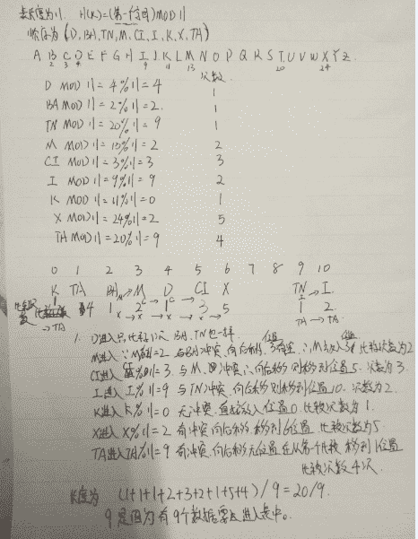

发表于 2017-03-28 16:35:19

* * *

[花斩](https://www.nowcoder.com/profile/103061)

这题根本就是在考字母表！！！

发表于 2017-11-18 18:56:52

* * *

## 3

设有 5 个可用的某类资源,由 4 个进程共享,每个进程最多可申请()个资源而使系统不会死锁?

正确答案: A   你的答案: 空 (错误)

```cpp
2
```

```cpp
4
```

```cpp
3
```

```cpp
1
```

本题知识点

操作系统

讨论

[而安](https://www.nowcoder.com/profile/857258)

A
因为如果每个进程都需要一  查看全部)

编辑于 2018-05-06 22:12:25

* * *

[披萨大叔](https://www.nowcoder.com/profile/841505)

设每个进程最多申请 x 个资源而不产生死锁。**4 *（x-1）+ 1 = 5****x = 2**解析：**每个进程申请（x-1）个资源时，各个进程都需要等待其他进程释放资源，此时共** **4 *（x-1）个资源，系统** **会产生死锁；****只要再多一个资源，就可以打破死锁的僵局。**

发表于 2016-07-23 15:15:31

* * *

[SunburstRun](https://www.nowcoder.com/profile/557336)

答案是 A         设临界资源为 m.共享进程为 n 个,个进程最多可申请 x 个资源那么当 m>n 时,m>n*(x-1)时 使系统不会死锁,          m<=n 时,x=1 使系统不会死锁

编辑于 2018-05-06 22:12:25

* * *

## 4

主机甲向主机乙发送一个(SYN=1,seq=11220)的 TCP 段,期望与主机乙建立 TCP 连接,若主机乙接受该连接请求,则主机乙向主机甲发送的正确的 TCP 段应该是()

正确答案: B   你的答案: 空 (错误)

```cpp
(SYN=1,ACK=1,seq=11220,ack=11220)
```

```cpp
(SYN=1,ACK=1,seq=11221,ack=11221)
```

```cpp
(SYN=0,ACK=0,seq=11221,ack=11221)
```

```cpp
(SYN=0,ACK=1,seq=11220,ack=11220)
```

本题知识点

网络基础

讨论

[Pandora](https://www.nowcoder.com/profile/266279)

SYN 和 ACK 是**TCP 协议报头**中的 6 个保留位中的 2 位。ACK：ACK 位置为 1 表明确认号是合法的。如果 ACK 为 0，那么数据报不包含确认信息，确认字段被省略。SYN：用于建立连接。1、如下图，目前连接还在建立阶段，乙向甲发送的 TCP 段是包含确认信息 ack 的， 则 SYN=1，ACK=1；2、至于 seq，ack，乙向甲发送的 seq 可以随意，但是 **乙向甲发送的** **ack 却要求是之前甲向乙发送的请求 seq 加 1**，所以是 ack=11220+1=11221。排除法，B。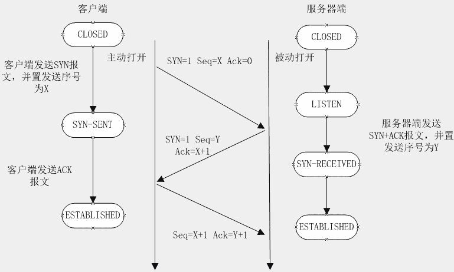

发表于 2015-11-15 10:45:31

* * *

[VagrantYang](https://www.nowcoder.com/profile/6863719)

主机甲向主机乙发送的报文的序号为 11220，这个序号表示主机乙希望下一个报文的数据的第一个序号为 11220，若主机乙收到此数据包又因为该数据包的大小为 1，那么他的 ack 的应该为 11220  + 1,表示主机乙的 0 到 11220 的数据包都收到了。这样 AD 就排除了。

编辑于 2018-02-13 23:27:35

* * *

[梦境迷离](https://www.nowcoder.com/profile/759736)

又被误导了，总结下，seq 下一个期望包序号 表示请发这个号开头的包给我。ack 确认包序号 0 开始，所以加 1 表示 n+1 个已经收到。 这个题目包只有一个字节。。。

发表于 2018-05-01 00:17:03

* * *

## 5

```cpp
#include<iostream>
using namespace std;
void f(int *p,int *q)
{
	p++;
	*q=*q+1;
}
int main() {
	int m=1,n=2,*r=&m;
	f(r,&n);
	cout<<m<<","<<n;
	return 0;
}
```

程序运行后的输出结果是()

正确答案: C   你的答案: 空 (错误)

```cpp
2,3
```

```cpp
1,4
```

```cpp
1,3
```

```cpp
1,2
```

本题知识点

C++

讨论

[kiss90](https://www.nowcoder.com/profile/590177)

```cpp
/*
f(r,&n); 指针 r 指向 m 的地址。
调用该函数时，将 m 和 n 的地址复制一份赋值给指针 p 和 q；
在函数体中，将指针 p 加 1，即 p 指向 m 的下一个地址，函数调用结束后该指针即被释放，m 的地址不变；
在函数体中，将指针 q 所指内容加 1，即 n+1，这样就间接通过 q 改变了 n 的值。
*/
```

发表于 2016-04-16 09:20:43

* * *

[技术小咔](https://www.nowcoder.com/profile/9842786)

p++只是地址加加，m 中值没有变化

发表于 2017-10-01 14:55:23

* * *

[学习三分之二输出三分之一](https://www.nowcoder.com/profile/642919)

在 f()函数里 p++是指针地址上的改变对数值没有影响，也就是 r 改变了

发表于 2015-11-30 17:48:07

* * *

## 6

在 UNIX 操作系统中,若用户键入的命令参数的个数为 1 时,执行 cat$1 命令:若用户键入的命令个数为 2 时,执行 cat>>$2<$1 命令,请将下面所示的 shell 程序的空缺部分补齐

```cpp
case () in
    1)cat $1;;
    2)cat>>$2<$1;;
    *)echo 'defult...';;
esac
```

正确答案: A   你的答案: 空 (错误)

```cpp
$#
```

```cpp
$@
```

```cpp
$$
```

```cpp
$*
```

本题知识点

Linux

讨论

[TPU-Lee](https://www.nowcoder.com/profile/257118)

【解析】本题考查了 UNIX 操作系统中 Shell 程序设计方面的相关知识。在 UNIX 中，＄＄、＄@、＄#以及＄*的含义分别如下：
＄＄表示当前命令的进程标识数。
＄*表示所有位置参量，例如＄1、＄2 等。
＄@与＄*类似，但当用双引号进行转义时，"＄@"能够分解多个参数，而"＄*"合并成一个参数。
＄#包括位置参数的个数，但是不包括命令名。

发表于 2015-11-17 17:33:18

* * *

[MyGoodHelper](https://www.nowcoder.com/profile/644326)

A  题意是根据参数个数执行对应的 case 语句$#：参数个数$$：当前 shell 的 PID 进程 ID$@和$*均表示所有参数，形式有所不同。$@："$1" "$2" … "$n"； $*: "$1 $2 … $n"。

发表于 2015-12-30 10:00:41

* * *

[后劲好大](https://www.nowcoder.com/profile/4013442)

＄＄表示当前命令的进程标识数。
＄*表示所有位置参量，例如＄1、＄2 等。
＄@与＄*类似，但当用双引号进行转义时，"＄@"能够分解多个参数，而"＄*"合并成一个参数。
＄#包括位置参数的个数，但是不包括命令名

发表于 2017-06-08 20:48:56

* * *

## 7

使用 useradd 创建用户时和主目录相关的参数是()

正确答案: B C D   你的答案: 空 (错误)

```cpp
p
```

```cpp
d
```

```cpp
m
```

```cpp
M
```

本题知识点

Linux

讨论

[isssen](https://www.nowcoder.com/profile/991810)

-p 设定帐号的密码
-d 指定用户的主目录
-m 自动建立用户的主目录
-M 不要自动建立用户的主目录

发表于 2015-11-15 12:08:28

* * *

[牛客 757983 号](https://www.nowcoder.com/profile/757983)

这也得记。。

发表于 2016-02-03 16:34:16

* * *

[codelife](https://www.nowcoder.com/profile/997126)

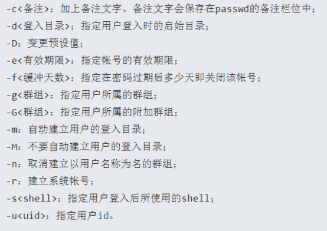

发表于 2016-08-27 10:01:30

* * *

## 8

已知表达式++a 中的"++"是作为成员函数重载的运算符,则与++a 等效的运算符函数调用形式为()

正确答案: A   你的答案: 空 (错误)

```cpp
a.operator++()
```

```cpp
a.operator++(0)
```

```cpp
a.operator++(int)
```

```cpp
operator++(a,0)
```

本题知识点

C++

讨论

[小强强](https://www.nowcoder.com/profile/279887)

```cpp
前置单目运算符重载为类的成员函数时，不需要显式说明参数，即函数没有形参。后置单目运算符重载为类的成员函数时，函数要带有一个整型形参。
```

发表于 2016-06-20 10:22:48

* * *

[rs 勿忘初心](https://www.nowcoder.com/profile/7491640)

C++规定：++a 前缀运算符 a.operator() 不需要加参数。a++后缀运算符 a.operator(int) 需要加参数。

编辑于 2017-05-05 21:13:54

* * *

[日照香炉](https://www.nowcoder.com/profile/841825)

答案是 A，记混了 C++规定**后缀**形式有一个 int 类型参数，当函数被调用时，编译器传递一个 0 做为 int 参数的值给该函数，这里是前缀

发表于 2015-11-16 00:39:15

* * *

## 9

下面哪些是基于核的机器学习算法?()

正确答案: B C D   你的答案: 空 (错误)

```cpp
Expectation Maximization
```

```cpp
Radial Basis Function
```

```cpp
Linear Discrimimate Analysis
```

```cpp
Support Vector Machine
```

本题知识点

机器学习

讨论

[ThomasCai](https://www.nowcoder.com/profile/9517784)

所谓判别式模型，需要把正负样本区分开，那势必会遇到区分不开的情形，这时就要用到核函数了，那所以我认为判别式模型都要用核函数的。

发表于 2017-08-04 17:29:32

* * *

[薛定谔的熊](https://www.nowcoder.com/profile/769741)

我是这么理解的，核函数的本质其实就是一种将一个空间转化为另一个空间的变化，线性判别分析是把高维空间利用特征值和特征向量转化到一维空间，所以也算是一种核函数？

发表于 2016-09-06 19:21:42

* * *

[loapui_91](https://www.nowcoder.com/profile/604569)

有个疑问。其实是不是在有出现向量内积的地方，都可以引入核函数？

发表于 2016-02-27 00:12:51

* * *

## 10

现有 4 个同时到达的作业 J1,J2,J3 和 J4,它们的执行时间分别是 3 小时,5 小时,7 小时,9 小时系统按单道方式运行且采用短作业优先算法,则平均周转时间是()小时

正确答案: A   你的答案: 空 (错误)

```cpp
12.5
```

```cpp
24
```

```cpp
19
```

```cpp
6
```

本题知识点

操作系统

讨论

[SunburstRun](https://www.nowcoder.com/profile/557336)

答案是 A  查看全部)

编辑于 2015-11-14 19:44:16

* * *

[我是一只咸鱼](https://www.nowcoder.com/profile/811572)

平均周转时间：将所有进程的等待、执行时间加起来，除以进程数。短作业优先算法：同时到达优先处理时间短的。(3+(3+5)+(3+5+7)+(3+5+7+9))/4=12.5

发表于 2016-10-21 14:53:43

* * *

[KevinScott](https://www.nowcoder.com/profile/931757)

```cpp
根据平均周转时间的概念，将所有进程的等待、执行时间加起来，除以进程数，就可以了。
```

发表于 2016-10-12 17:49:47

* * *

## 11

关于基于 Hadoop 的 MapReduce 编程的环境配置,下面哪一步是不必要的()

正确答案: A   你的答案: 空 (错误)

```cpp
配置 Eclipse
```

```cpp
配置 ssh
```

```cpp
配置 java 环境变量
```

```cpp
配置 Hadoop 环境变量
```

本题知识点

Hadoop/Spark

讨论

[Johnny_Jiang](https://www.nowcoder.com/profile/477181)

答案是 A，必须配置的应该是 BCD，这个要看使用什么 IDE 来做开发了，不用 eclipse 的话自然不用配置 eclipse 了就配置 hadoop 的开发环境而言，通常是在 linux 系统上搭建。就题目中所提到的四个选项，首先 hadoop 是运行在 java 平台上的，因而 java 的环境变量是必须要先配置好的；其次，hadoop 本身需要 ssh 支持，比如在启动 hadoop 集群的时候，通常是在 jobTracker 上启动，JobTracker 会通过 ssh，在 TaskTracker 上启动相应的进程，因而 SSH 也是必须要配置的;再次，Hadoop 的环境变量，如果不配置的话，就无法通过 hadoop jar ******这样的命令来运行程序，需要进入到 hadoop 的安装目录去，使用./hadoop jar ******来运行程序，所以说如果可以忍受进入目录启动程序的话，也不是必须配置的，不过通常都是需要配置的，毕竟配置一下会易用很多；最后，使用 eclipse 开发的话，是必须要配置 eclipse 的，eclipse 里的 hadoop 插件里面首先要设置的就是 hadoop 目录的位置，之后配置 JobTracker 的 ip、端口等等信息，然后才能在 eclipse 里面看到 HDFS 的情况，以及通过 eclipse 提交任务。研究尚浅，以上一人之见，如有错误，请大家帮忙更正。

编辑于 2017-12-20 23:32:05

* * *

[早起的小虫儿](https://www.nowcoder.com/profile/420791)

用 IDEA 的,哈哈

发表于 2017-07-24 15:23:13

* * *

[步陟远](https://www.nowcoder.com/profile/3405704)

a，楼上解释的很详细

发表于 2016-11-06 15:17:25

* * *

## 12

在 mysql 中，将"数据库原理"课程的学分赋值给变量的语句是()

正确答案: A   你的答案: 空 (错误)

```cpp
select xuefen into @xuefen from course where cname='数据库原理'
```

```cpp
select xuefen from course  where cname='数据库原理' and xuefen=@xuefen
```

```cpp
select @xuefen=xuefen from course  where cname='数据库原理'
```

```cpp
select xuefen=@xuefen from course where cname='数据库原理'
```

本题知识点

数据库

讨论

[村长，那人偷牛！](https://www.nowcoder.com/profile/7052957)

看到回答有的很不负责任啊，你们验证了吗，验证如下，本操作只针对 mysql 数据库，因为我只有这个数据库。A 选项：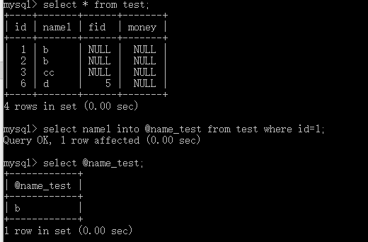
A 选项正确。B 选项：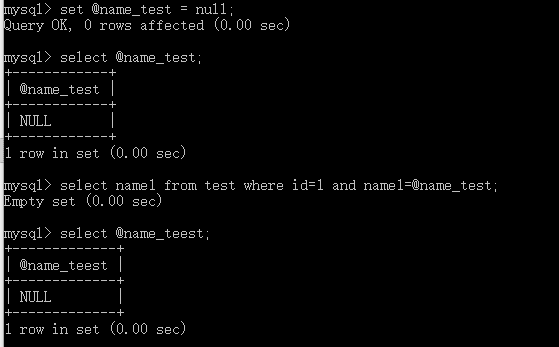
B 选项错误 C 选项：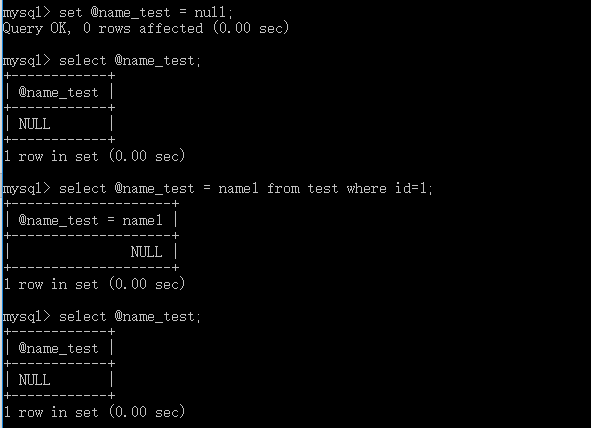
C 选项错误 D 选项：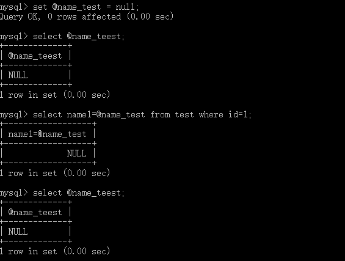
D 选项错误 C 选项错误原因：在 mysql 中 , “=” 会默认的当做比较符号处理 ( 很多地方 ), mysql 为了区分比较和赋值的概念 : 重新定义了一个新的的赋值符号 :  :=测试如下：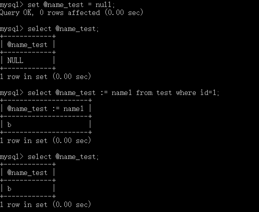 

发表于 2017-06-20 02:17:04

* * *

[郑斌 coder](https://www.nowcoder.com/profile/511012)

SELECT INTO 语句

SELECT INTO 语句从一个表中选取数据，然后把数据插入另一个表中。

SELECT INTO 语句常用于创建表的备份复件或者用于对记录进行存档。

发表于 2016-07-15 23:46:57

* * *

[未来即来、](https://www.nowcoder.com/profile/216571)

sql 中自定义变量的格式为：declare @变量名 变量数据类型，之后每次使用时必须带@由于是将学分赋值给变量，即@xuefen = xuefen，又 select into 语句中，(2)为表名，(1)处为数据，所以排除 A 最后答案为 C

发表于 2016-02-29 23:17:59

* * *

## 13

类 A 是类 B 的友元,类 C 是类 A 的公有派生类,忽略特殊情况则下列说法正确的是()

正确答案: B D   你的答案: 空 (错误)

```cpp
类 B 是类 A 的友元
```

```cpp
类 C 不是类 B 的友元
```

```cpp
类 C 是类 B 的友元
```

```cpp
类 B 不是类 A 的友元
```

本题知识点

C++

讨论

[Pandora](https://www.nowcoder.com/profile/266279)

BD 友元关系是 **单向的，**  查看全部)

编辑于 2015-12-29 18:10:11

* * *

[yayamma](https://www.nowcoder.com/profile/270051)

(1) 友元关系不能被继承。
(2) 友元关系是单向的，不具有交换性。若类 B 是类 A 的友元，类 A 不一定是类 B 的友元，要看在类中是否有相应的声明。
(3) 友元关系不具有传递性。若类 B 是类 A 的友元，类 C 是 B 的友元，类 C 不一定是类 A 的友元，同样要看类中是否有相应的申明。

发表于 2015-12-29 16:14:07

* * *

[卷积神经网络哦](https://www.nowcoder.com/profile/8684256)

B 可能是 A 的友元也可能不是，要看 A 中有没有申明。。怎么就能说 B 一定不是 A 的友元呢。。。。难道 A 申明 B 是其友元还算特殊情况。。

编辑于 2019-01-31 10:07:10

* * *

## 14

在对一组记录(54,38,96,23,15,72,60,45,83)进行直接插入排序时,当把第 7 个记录 60 插入到有序表时,为寻找插入位置需比较()次

正确答案: D   你的答案: 空 (错误)

```cpp
5
```

```cpp
6
```

```cpp
4
```

```cpp
3
```

本题知识点

排序 *讨论

[朕不是码农](https://www.nowcoder.com/profile/5966933)

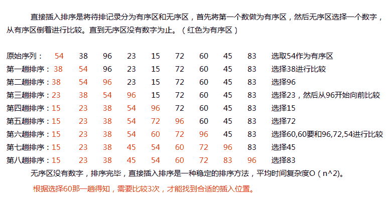

发表于 2016-08-05 08:30:01

* * *

[忆水寒](https://www.nowcoder.com/profile/232102)

在插入第 7 个数，说明前面的数字已经有序了。即数字为 15--- 23---38---54----72---96---60---45---83 现在对滴 7 个数字 60 进行插入，需要向前找到插入点。依次比较，96,72,54.最后插入在 54 后面。所以比较 3 次。

发表于 2016-08-05 19:21:25

* * *

[tan313](https://www.nowcoder.com/profile/608282)

直接插入排序是从后往前比较。参考博客 http://blog.csdn.net/tan313/article/details/51146170

发表于 2016-04-17 21:07:06

* * *

## 15

用有向无环图描述表达式 (A+B)*((A+B)/A), 至少需要顶点的数目为 ( )

正确答案: B   你的答案: 空 (错误)

```cpp
8
```

```cpp
5
```

```cpp
6
```

```cpp
9
```

本题知识点

图

讨论

[花非花，雾非雾](https://www.nowcoder.com/profile/3558813)

在弄清楚这道题之前，不妨先看一个例子，就是将一个表达式转化成二叉树，再将二叉树去重转换成有向无环图。这里的重指的是节点的重。
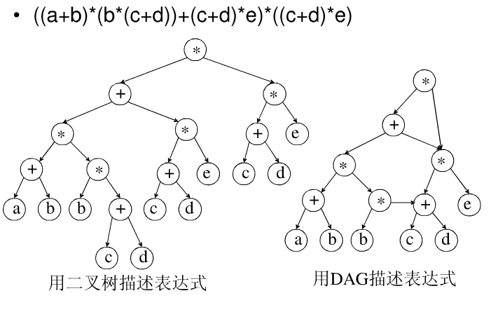
那么同样的这道题的图示如下：
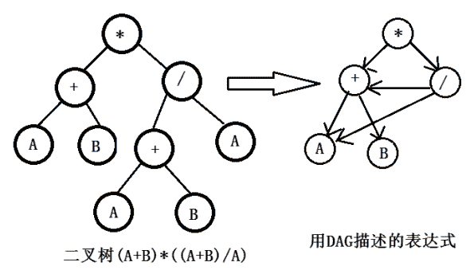
所以总共是 5 个顶点。

发表于 2017-08-04 19:56:19

* * *

[Pandora](https://www.nowcoder.com/profile/266279)

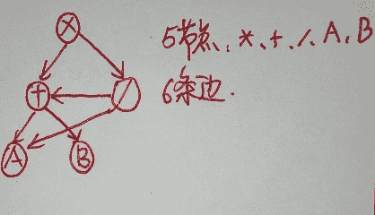

编辑于 2015-11-15 15:42:06

* * *

[huixieqingchun](https://www.nowcoder.com/profile/551201)

数字和运算符都用结点表示，边表示相应的运算。

发表于 2016-05-07 20:36:16

* * *

## 16

若 MyClass 是一个类名，其有如下语句序列：

```cpp
MyClass c1，*c2；
MyClass *c3=new MyClass；
MyClass &c4=c1；
```

上面的语句序列调用构造函数个数是( )。

正确答案: B   你的答案: 空 (错误)

```cpp
1
```

```cpp
2
```

```cpp
3
```

```cpp
4
```

本题知识点

C++

讨论

[挥着牛鞭的男孩](https://www.nowcoder.com/profile/825762)

只有 c1 和 c3 会调用构造函数。c2 只是一个指针，用来动态描述对象的，不需要类的定义。c4 只是一个 c1 的别名，说白了 c4 就是 c1  不占空间

发表于 2015-11-15 13:29:52

* * *

[huixieqingchun](https://www.nowcoder.com/profile/551201)

**c1 要调用一次构造函数；****c2 只是一个指针，用来动态描述对象，不会调用类的构造函数；****c3 的右边新创建一个对象会调用构造函数。但是注意，这里的赋值运算符不是类中的赋值运算符，而是普通的赋值运算符；****c4 是一个对象引用，是 c1 的一个别名，所以不会调用构造函数。**

发表于 2016-05-23 16:59:46

* * *

[MSean](https://www.nowcoder.com/profile/231467)

```cpp

	MyClass c1；

	MyClass *c2；

	MyClass *c3=newMyClass；

	MyClass &c4=c1；

```

**只要类的对象被创建，就会执行构造函数。**第 1 行：创建对象 c1，调用了构造函数；第 2 行：声明了一个指向 MyClass 类型的指针，未调用构造函数；第 3 行：new MyClass 在内存中创建了一个对象，并把对象地址赋给指针 c3，创建对象调用了构造函数；第 4 行：将 c4 声明为引用，并将 c1 赋给它，即**c4 只是 c1 的一个引用**，未调用构造函数。选**B**

发表于 2016-08-26 15:58:40

* * *

## 17

下面说法错误的是()

正确答案: B   你的答案: 空 (错误)

```cpp
遗传算法直接以适应度作为搜索信息,无需导数等其他辅助信息
```

```cpp
决策树算法对离散属性和连续属性进行建模
```

```cpp
Hapfield 网络不仅有不动点吸引子,也有其它类型的吸引子
```

```cpp
决策树是一种混合算法,它综合了多种不同的创建树的方法
```

本题知识点

自然语言处理

讨论

[老子是帮主](https://www.nowcoder.com/profile/284321)

决策树算法是一类算法的总称，C4.5 是决策树用于分类，CART 也是决策树用于回归，分类决策树不能处理连续属性，回归决策树可以处理连续属性，我这么理解不对吗？

发表于 2017-08-18 15:14:17

* * *

[向算法发起进攻的圆圆](https://www.nowcoder.com/profile/255547601)

```cpp
求问 Hapfield 网络是什么呀
```

发表于 2020-04-21 09:03:13

* * *

[yssnn](https://www.nowcoder.com/profile/98695026)

Hopfield 神经网络就是采用了这种学习方式，其权值一旦确定就不在改变，而网络中各神经元的状态在运行过程中不断更新，网络演变到稳定时各神经元的状态便是问题之解。

发表于 2021-04-07 17:09:15

* * *

## 18

下面程序段包含 4 个函数,其中具有隐含 this 指针的是()

```cpp
int f1();
class T
{
    public:static int f2();
    private:friend int f3();
    protect:int f4();
};
```

正确答案: D   你的答案: 空 (错误)

```cpp
f1
```

```cpp
f2
```

```cpp
f3
```

```cpp
f4
```

本题知识点

C++

讨论

[zt_xcyk](https://www.nowcoder.com/profile/839070)

D 静态成员函数属于整个类所拥有，没有 this 指针友员函数不是这个类的成员，没有类的非静态成员函数  有

发表于 2015-11-19 18:50:12

* * *

[未来即来、](https://www.nowcoder.com/profile/216571)

只有类的非静态成员才有 this 指针，static 显然没有，友元函数也没有

发表于 2016-02-27 21:34:40

* * *

[公众号「我不是匠人」](https://www.nowcoder.com/profile/936070)

>this 指针只能在类的成员函数中使用，它指向该成员函数被调用的对象。>静态成员函数没有 this 指针。>友元函数是非成员函数，没有 this 指针。

发表于 2018-03-15 14:15:34

* * *

## 19

声明一个名为 books_cursor 的游标,和名为@book_name 的游标变量,以下语句正确的是()

正确答案: D   你的答案: 空 (错误)

```cpp
select books_cursor into @book_name
```

```cpp
set books_cursor=@book_name
```

```cpp
set @books_cursor=book_name
```

```cpp
fetch next from books_cursor into @book_name
```

本题知识点

数据库

讨论

[SUCCESS](https://www.nowcoder.com/profile/125172)

D,将游标向下移动一行，获取的数据存入定义的游标变量里边

发表于 2016-03-03 10:23:06

* * *

[炫](https://www.nowcoder.com/profile/376795)

declare cur cursor dynamic//声明游标 forselect * from stuopen curdeclare @id int,@name nvarchar,@age int,@sex nvarchar,@a int//声明游标变量 fetch next from cur into @id,@name,@age,@sex,@awhile @@fetch_status = 0 beginprint cast(@id as nvarchar)+@name+cast(@age as nvarchar)+@sex+cast(@a as nvarchar)fetch next from cur into @id,@name,@age,@sex,@a endclose curdeallocate curgo

编辑于 2016-04-23 18:56:10

* * *

[周星星 _](https://www.nowcoder.com/profile/537870)

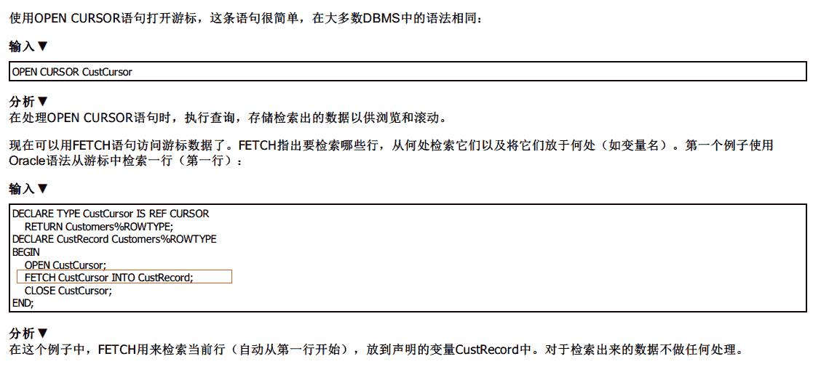

发表于 2016-06-16 16:12:49

* * *

## 20

设有关系模式 R(A,B,C,D),其数据依赖集:F=((A,B)->C,C->D),则关系模式 R 的规范化程度最高达到()

正确答案: B   你的答案: 空 (错误)

```cpp
BCNF
```

```cpp
2NF
```

```cpp
1NF
```

```cpp
3NF
```

本题知识点

数据库

讨论

[SunburstRun](https://www.nowcoder.com/profile/557336)

答案是 B  查看全部)

编辑于 2015-11-15 14:31:41

* * *

[chinawjb](https://www.nowcoder.com/profile/760834)

第 1 范式：

**存在** **非主属性**对码的**部分依赖**关系 R(A,B,C) **AB 是码** C 是非主属性 **B-->C** B 决定 C C 部分依赖于 B

第一范式

定义：如果关系 R 中所有属性的值域都是单纯域，那么关系模式 R 是第一范式的

那么符合第一模式的特点就有

1)有主关键字

2)主键不能为空，

3)主键不能重复,

4)字段不可以再分

 第 2 范式：数据库表中**不存在非关键字段**对任一[候选关键字](http://baike.baidu.com/view/549695.htm)段的 **[部分函数依赖](http://baike.baidu.com/view/4807244.htm)**（部分函数依赖指的是存在组合关键字中的某些字段决定非关键字段的情况），也即所有非关键字段都完全依赖于任意一组候选关键字。第 3 范式：在第二范式的基础上，数据表中如果**不存在非关键字段**对任一候选关键字段的 **[传递函数依赖](http://baike.baidu.com/view/550979.htm)**则符合第三范式。所谓传递函数依赖，指的是如果存在"A → B → C"的决定关系，则 C 传递函数依赖于 A。因此，满足第三范式的数据库表应该不存在如下依赖关系：               关键字段 → 非关键字段 x → 非关键字段 yBCNF（ 鲍依斯-科得范式 ）：在第三范式的基础上，数据库表中如果**不存在任何字段**对任一候选关键字段的 **[传递函数依赖](http://baike.baidu.com/view/550979.htm)**则符合 BCNF。

依赖关系： 1.数据依赖
数据依赖指的是通过一个关系中属性间的相等与否体现出来的数据间的相互关系，其中最重要的是函数依赖和多值依赖。

2.函数依赖
设 X,Y 是关系 R 的两个属性集合，当任何时刻 R 中的任意两个元组中的 X 属性值相同时，则它们的 Y 属性值也相同，则称 X 函数决定 Y，或 Y 函数依赖于 X。

3.平凡函数依赖
当关系中属性集合 Y 是属性集合 X 的子集时(Y?X)，存在函数依赖 X→Y，即一组属性函数决定它的所有子集，这种函数依赖称为平凡函数依赖。

4.非平凡函数依赖
当关系中属性集合 Y 不是属性集合 X 的子集时，存在函数依赖 X→Y，则称这种函数依赖为非平凡函数依赖。

5.完全函数依赖
设 X,Y 是关系 R 的两个属性集合，X’是 X 的真子集，存在 X→Y，但对每一个 X’都有 X’!→Y，则称 Y 完全函数依赖于 X。

6.部分函数依赖
设 X,Y 是关系 R 的两个属性集合，存在 X→Y，若 X’是 X 的真子集，存在 X’→Y，则称 Y 部分函数依赖于 X。

7.传递函数依赖
设 X,Y,Z 是关系 R 中互不相同的属性集合，存在 X→Y(Y !→X),Y→Z，则称 Z 传递函数依赖于 X。 

发表于 2016-08-23 16:10:26

* * *

[huixieqingchun](https://www.nowcoder.com/profile/551201)

**存在函数传递的依赖，最高满足第二范式。**

发表于 2016-06-02 16:44:10

* * ***