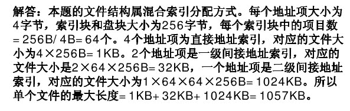
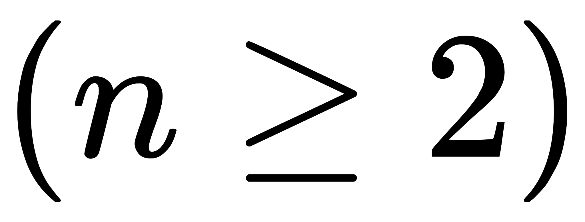

# 百度 2016 研发工程师笔试题（五）

## 1

假定变量 I,f,d 数据类型分别为 int,float 和 double(int 用补码表示，float 和 double 分别用 IEEE754 单精度和双精度浮 点数据格式表示)，已知 i=785,f=1.5678e³,d=1.5e¹⁰⁰ 若在 32 位机器 中执行下列关系表达式，则结果为真是（）

> (I)i==(int)(float)I(II)f==(float)(int)f    (III)f==(float)(double) f    (IV)(d+f)-d==f

正确答案: B   你的答案: 空 (错误)

```cpp
仅 I 和 II
```

```cpp
仅 I 和 III
```

```cpp
仅 II 和 III
```

```cpp
仅 III 和 IV
```

本题知识点

C++

讨论

[SunburstRun](https://www.nowcoder.com/profile/557336)

答案是 B  查看全部)

编辑于 2015-11-17 23:34:51

* * *

[早起的鸟有虫吃](https://www.nowcoder.com/profile/476977)

在 c++中为了尽量保证精度不丢失，一般会把低转化为高精度，比如 char->int->float->double(I)i==(int)(float)I   由于 i（int）经过强制类型转换从 int->float->int 和左边相同  正确(II)f==(float)(int)f    由于 f（float）经过强制类型转换 从 float->int，虽然 int 也强制类型转换了但是小数点已经去掉，故精度丢失，和左边不一样，错误(III)f==(float)(double) f      由于 f（float）经过强制类型转换 从 float->double->float 和左边相同   正确 (IV)(d+f)-d==f  左边为了尽量保证精度不丢失，一般会把低转化为高精度从 float->double 和右边 float 不同  错误

发表于 2016-06-15 17:24:08

* * *

[Ahlin](https://www.nowcoder.com/profile/637371)

抓住两点：1、精度大小 2、数值范围 I 扩大精度范围，再转换回去，无损，相等 II 减小精度，再转换回去，已损，不等 III 同 1IV 就不好说了。 两边类型肯定不等，考试做题那是不等，但对于 IDE，就不一样了。大部分编译器执行后相等。

发表于 2016-11-01 22:02:24

* * *

## 2

设文件索引节点中有 7 个地址项，其中 4 个地址项为直接地址索引，2 个地址项是一级间接地址索引，1 个地址项是二级间接地址索引，每个地址项大小为 4 字节，若磁盘索引块和磁盘数据块大小均为 256 字节，则可表示的单个文件的最大长度是（ ）

正确答案: C   你的答案: 空 (错误)

```cpp
33kb
```

```cpp
519kb
```

```cpp
1057kb
```

```cpp
16513kb
```

本题知识点

编译和体系结构

讨论

[Pandora](https://www.nowcoder.com/profile/266279)

来自网络：

编辑于 2016-01-25 11:36:59

* * *

[LiangChen0322](https://www.nowcoder.com/profile/138856)

这是典型的 EXT4 文件系统的索引节点的组织形式：4 个直接地址项记录四个 block，也就是 256B x 4 = 1K。间接索引项就是指索引项指向一个 block，block 中记录的是直接索引项，256 / 4 = 64，所以两个二级索引就是 2 x 64 x 256B = 32K。同理，一个三级索引可以记录 1 x 256/4 x 256/4 x 256B = 1024K 的文件内容，总共 1057K。

发表于 2016-03-02 17:07:28

* * *

[不吃葡萄皮](https://www.nowcoder.com/profile/179155)

直接索引 4 个，可索引到 4 个数据块，共 4*2⁸=2¹⁰ 字节。 一级间接地址索引 2 个，地址项占 4 字节，数据块大小 256 字节，因此每个数据块可以存 64 个地址，共 2*2⁶*2⁸=2¹⁵ 字节。 二级间接地址索引 1 个，可寻址 2⁶*2⁶ 个，共 2⁶*2⁶ *2⁸=2²⁰ 字节。

发表于 2015-11-24 20:34:55

* * *

## 3

采用递归方式对顺序表进行快速排序，下列关于递归次数的叙述中，正确的是（）

正确答案: D   你的答案: 空 (错误)

```cpp
递归次数与初始数据的排列次序无关
```

```cpp
每次划分后，先处理较长的分区可以减少递归次数
```

```cpp
每次划分后，先处理较短的分区可以减少递归次数
```

```cpp
递归次数与每次划分后得到的分区处理顺序无关
```

本题知识点

递归 排序 *讨论

[青山崖野](https://www.nowcoder.com/profile/7614806)

**递归次数，取决于递归树，而递归树取决于轴枢的选择。树越平衡，递归次数越少。****而对分区的长短处理顺序，影响的是递归时对栈的使用内存，而不是递归次数**

发表于 2017-04-18 16:04:46

* * *

[文子](https://www.nowcoder.com/profile/585636)

快速排序的 递归的次数与 初始 数据的排列顺序有关， 递归次数与每次划分后得到的分区处理顺序无关

发表于 2015-11-16 09:58:28

* * *

[接下来的路才真正的开始](https://www.nowcoder.com/profile/581074)

答案选 DA 递归次数和数据排列有关 若有序，这次数为 0（N）。理论上最少的次数为 0（logN）BC 每次划分应该先处理较短的分许，只是减少递归占用的内存空间，并不能减少次数。

发表于 2016-03-29 10:49:32

* * *

## 4

已知一组数据的协方差矩阵 P,下面关于主分量说法错误的是()

正确答案: C   你的答案: 空 (错误)

```cpp
主分量分析的最佳准则是对一组数据进行按一组正交基分解, 在只取相同数量分量的条件下,以均方误差计算截尾误差最小
```

```cpp
在经主分量分解后,协方差矩阵成为对角矩阵
```

```cpp
主分量分析就是 K-L 变换
```

```cpp
主分量是通过求协方差矩阵的特征值得到
```

本题知识点

机器学习

讨论

[不吃葡萄皮](https://www.nowcoder.com/profile/179155)

K-L 变换与 PCA 变换是不同的概念，PCA 的变换矩阵是协方差矩阵，K-L 变换的变换矩阵可以有很多种（二阶矩阵、协方差矩阵、总类内离散度矩阵等等）。当 K-L 变换矩阵为协方差矩阵时，等同于 PCA。

发表于 2015-11-24 20:39:32

* * *

[GoodFellow201904261341544](https://www.nowcoder.com/profile/875109857)

PCA 不等同于 KLPCA 的变换矩阵是协方差矩阵，KL 变换的变换矩阵有二阶矩阵，协方差矩阵，总类内离散矩阵等当 KL 变换矩阵为协方差矩阵时等同于 PCA

发表于 2019-08-13 21:27:00

* * *

[创始元灵](https://www.nowcoder.com/profile/220889961)

当 K-L 变换矩阵为协方差矩阵时，等同于 PCA。

发表于 2019-06-29 10:38:26

* * *

## 5

对 n个权值均不相同的字符构成哈夫曼树，关于该树的叙述中，正确的是（）

正确答案: A C   你的答案: 空 (错误)

```cpp
树中一定没有度为 1 的结点
```

```cpp
该树一定是一棵完全二叉树
```

```cpp
树种任一非叶结点的权值一定不小于下一任一结点的权值
```

```cpp
树中两个权值最小的结点一定是兄弟结点
```

本题知识点

树

讨论

[想做樱木的圆寸少年](https://www.nowcoder.com/profile/906117)

A    哈夫曼树中，所有的字符串结点都是和其他字符串结点或者权值结点构成子树，因此不可能存在度为 1 的结点，A 正确 B    完全二叉树意为前 n-1 层为满二叉树，最后一层连续缺失右边结点的二叉树，而哈夫曼树无法保证最后一层连续缺失右边结点以及前 n-1 层为满二叉树。B 错误 C    树中任意节点的权值一定大于自己的左右孩子，但不能保证一定不小于其他下一任结点的权值。C 正确 D    生成哈夫曼树的第一步就是在结点集合中找到两个权值最小的结点，然后生成一棵二叉树。D 正确

发表于 2015-12-25 00:45:59

* * *

[EricZeng](https://www.nowcoder.com/profile/827560)

答案 C 的解释如下 C.树中任一非叶子结点的权值一定不小于下一（指子树）任一（左子树或右子树）结点的权值。

发表于 2016-08-22 11:03:57

* * *

[舰长 007](https://www.nowcoder.com/profile/181025725)

ACD 吧，这个 D 没问题的

发表于 2021-10-25 21:54:38

* * *

## 6

设输入序列是 1,3,5....m,经过栈的作用后输出序列的第一个元素是 m,则输出序列中第 i 个输出元素是()

正确答案: A   你的答案: 空 (错误)

```cpp
m-2(i-1)
```

```cpp
m-i
```

```cpp
m-1-i
```

```cpp
m+1-i
```

本题知识点

栈 *讨论

[村长，那人偷牛！](https://www.nowcoder.com/profile/7052957)

看成 1、2、3、4.。。的肯定不止我一个 呜呜~

发表于 2017-03-02 00:04:54

* * *

[NicoleZ](https://www.nowcoder.com/profile/5606250)

等差数列：d=-2
                 a1=m
                 ai=a1+(i-1)*d

发表于 2016-10-03 15:55:48

* * *

[alicehua](https://www.nowcoder.com/profile/361876)

第一个为 M 第二个为 m - 2*(2-1)第三个为 m-2*(3-1).....第 i 个为 m-2*(i-1),呜呜呜没看清题目是 1 3 5 。。。m

发表于 2015-11-16 09:57:05

* * *

## 7

假定某页面管理系统的内存容量为 64KB,分成 16 块,块号为 0,1,2,3,...15.假设某作用 4 页,其页号为 0,1,2,3,被分别装入内存的 2,4,1,6 块,其中该作业中第 3 页在内存中的起始地址()

正确答案: B   你的答案: 空 (错误)

```cpp
2048
```

```cpp
4096
```

```cpp
12288
```

```cpp
8192
```

本题知识点

编译和体系结构

讨论

[Pandora](https://www.nowcoder.com/profile/266279)

每一块是 64KB/16=4KB0 页-2 块：起始地址 4KB*2=8KB1 页-4 块：起始地址 4KB*4=16KB**2 页-1 块：** **起始地址 4KB*1=4KB=4096B**3 页-6 块：起始地址 4KB*6=24KB 如楼上所说，总共 4 页 0,1,2,3，那么第三页就是页号为 2 的页，对应块号 1。语言精深 o(╯□╰)o

编辑于 2016-08-28 21:01:32

* * *

[luya](https://www.nowcoder.com/profile/952854)

```cpp
也是醉了，居然问的是第 3 页的起始地址而不是页号为 3 的起始地址。第 3 页的页号是 2，存放在块号为 1 的块中，直接计算得到起始地址 4K*1=4K
```

发表于 2016-08-03 16:56:47

* * *

[textbook](https://www.nowcoder.com/profile/716566)

楼上是错的，题目说的第三块其实就是索引为 2 的块，对应的为第一块，由于内存分块每块为 64/16=4k，且是从第 0 块开始的，那第一块的收地址必然是 4k

发表于 2015-11-16 01:31:41

* * *

## 8

下面程序输出结果是什么?

```cpp
#include<iostream>
using namespace std;
class A{
public:
	A(char *s)
	{
		cout<<s<<endl;
	}
	~A(){}
};
class B:virtual public A
{
public:
	B(char *s1,char*s2):A(s1){
		cout<<s2<<endl;
	}
};
class C:virtual public A
{
public:
	C(char *s1,char*s2):A(s1){
		cout<<s2<<endl;
	}
};
class D:public B,public C
{
public:
	D(char *s1,char *s2,char *s3,char *s4):B(s1,s2),C(s1,s3),A(s1)
	{
		cout<<s4<<endl;
	}
};
int main() {
	D *p=new D("class A","class B","class C","class D");
	delete p;
	return 0;
}
```

正确答案: A   你的答案: 空 (错误)

```cpp
class A class B class C class D
```

```cpp
class D class B class C class A
```

```cpp
class D class C class B class A
```

```cpp
class A class C class B class D
```

本题知识点

C++

讨论

[牛客 2326156 号](https://www.nowcoder.com/profile/2326156)

和参数顺序没关系的,和继承顺序有关        A
     /      \   B       C    \       /
       D 加了 virtual 后, 继承关系是这样的.不加的话是这样的     A             A     |              |    B             C
        \         /
            D

发表于 2016-08-08 16:39:59

* * *

[莫笑☁️輕狂](https://www.nowcoder.com/profile/152216)

这个就是 c++对象生成时的构造顺序问题，先构造继承过来的父类，然后同级按顺序构造，算下来顺序就是 abcd 了
虚继承解决继承二义性问题

发表于 2015-11-16 18:20:55

* * *

[小洁子](https://www.nowcoder.com/profile/549519)

运行发现必须在 class B & class C 以及 class D 中实现对继承的类 A 的构造，即“ :A(s1) ”等语句，但 D 实例对象时，真正起构造 A 类作用的是最后在 D 类中对 A 的构造，若把虚继承(类 B/C)中 A 的构造改为“ :A(s2) ”不会造成结果影响。也就是说，虚继承解决继承二义性，虚继承中对基类的构造是该类类型的实例对象初始化，但 D 类型的实例对象对 A 类初始化只与 D 有关，不会再执行一次 B/C 中的构造，即 ABCD。

发表于 2015-11-24 15:31:34

* * *

## 9

下面说法错误的是()

正确答案: A B   你的答案: 空 (错误)

```cpp
在组合时,为了保证成员对象被正确清除,在组合类的析构函数中需要显式调用其成员对象的析构函数
```

```cpp
在类的继承层次中,可以自动进行向上和向下类型转换.而且都是安全的
```

```cpp
构造函数可以重载,析构函数不能重载
```

```cpp
C++的派生类如果要覆盖一个继承到的成员函数,在基类中需要将该函数声明为 virtual
```

本题知识点

C++

讨论

[钉子](https://www.nowcoder.com/profile/506749)

没有仔细思考，做错了，不过我  查看全部)

编辑于 2016-05-11 22:29:00

* * *

[IT-Angle](https://www.nowcoder.com/profile/152300)

对于 D 选项，为什么是错的？因为如果派生类的函数与基类的函数同名，并且参数也相同，但是基类函数没有 virtual 关键字，此时，基类的函数被隐藏，注意，是隐藏而不是覆盖。覆盖的基本特征之一就是 基类函数必须有 virtual 关键字。

发表于 2016-03-24 19:53:16

* * *

[噼里啪啦酱](https://www.nowcoder.com/profile/486089)

我觉得答案 AB。推荐看《Effective C++》就比较简单了。A：成员类对象在离开作用域的时候会调用其自身的析构函数，并不需要我们手动 delete，就将其看做一个基本的局部对象即可。除非在构造的时候用了动态类存分配，这又是另外一回事了。B：明显错误，参考《Effective C++》第 39 条,不要向下转型。C：正确，比较简单 D：正确，也是《Effective C++》第 37 条，如果子类要重写父类方法，需要将父类该方法声明为 virtual，实现 RTTI。当然你可以不这样干，结果就是静态绑定。补充一点，重写就叫覆盖。如果没有 virtual 就是隐藏。

编辑于 2016-05-16 10:49:38

* * *

## 10

下面选项中,哪些是 interface 中合法方法定义?()

正确答案: A C D   你的答案: 空 (错误)

```cpp
public void main(String [] args);
```

```cpp
private int getSum();
```

```cpp
boolean setFlag(Boolean [] test);
```

```cpp
public float get(int x);
```

本题知识点

Java

讨论

[setmefree](https://www.nowcoder.com/profile/996946)

```cpp
interface 中的方法默认为 public abstract 的 ，变量默认为 public static final 
```

发表于 2016-06-17 18:29:14

* * *

[Sword52888](https://www.nowcoder.com/profile/801909)

我还是必须啰嗦几句。

JDK8 及以后，允许我们在接口中定义 static 方法和 default 方法。

在 jdk8 之前，interface 之中可以定义变量和方法，变量必须是 public、static、final 的，方法必须是 public、abstract 的。由于这些修饰符都是默认的，所以在 JDK8 之前，下面的写法都是等价的.

```cpp
public interface JDK8BeforeInterface {  
    public static final int field1 = 0;  

    int field2 = 0;  

    public abstract void method1(int a) throws Exception;  

    void method2(int a) throws Exception;  
} 
```

JDK8 及以后，允许我们在接口中定义 static 方法和 default 方法。

```cpp
public interface JDK8Interface {  

    // static 修饰符定义静态方法  
    static void staticMethod() {  
        System.out.println("接口中的静态方法");  
    }  

    // default 修饰符定义默认方法  
    default void defaultMethod() {  
        System.out.println("接口中的默认方法");  
    }  
} 
```

再定义一个接口的实现类：

```cpp
public class JDK8InterfaceImpl implements JDK8Interface {  
    //实现接口后，因为默认方法不是抽象方法，所以可以不重写，但是如果开发需要，也可以重写  
} 
```

静态方法，只能通过接口名调用，不可以通过实现类的类名或者实现类的对象调用。default 方法，只能通过接口实现类的对象来调用。

```cpp
public class Main {  
    public static void main(String[] args) {  
        // static 方法必须通过接口类调用  
        JDK8Interface.staticMethod();  

        //default 方法必须通过实现类的对象调用  
        new JDK8InterfaceImpl().defaultMethod();  
    }  
} 
```

当然如果接口中的默认方法不能满足某个实现类需要，那么实现类可以覆盖默认方法。

```cpp
public class AnotherJDK8InterfaceImpl implements JDK8Interface {  

    // 签名跟接口 default 方法一致,但是不能再加 default 修饰符  
    @Override  
    public void defaultMethod() {  
        System.out.println("接口实现类覆盖了接口中的 default");  
    }  
} 
```

由于 java 支持一个实现类可以实现多个接口，如果多个接口中存在同样的 static 和 default 方***怎么样呢？如果有两个接口中的静态方法一模一样，并且一个实现类同时实现了这两个接口，此时并不会产生错误，因为 jdk8 只能通过接口类调用接口中的静态方法，所以对编译器来说是可以区分的。但是如果两个接口中定义了一模一样的默认方法，并且一个实现类同时实现了这两个接口，那么必须在实现类中重写默认方法，否则编译失败。

```cpp
public interface JDK8Interface1 {  

    // static 修饰符定义静态方法  
    static void staticMethod() {  
        System.out.println("JDK8Interface1 接口中的静态方法");  
    }  

    // default 修饰符定义默认方法  
    default void defaultMethod() {  
        System.out.println("JDK8Interface1 接口中的默认方法");  
    }  

} 
```

```cpp
public class JDK8InterfaceImpl implements JDK8Interface,JDK8Interface1 {  

    // 由于 JDK8Interface 和 JDK8Interface1 中 default 方法一样,所以这里必须覆盖  
    @Override  
    public void defaultMethod() {  
        System.out.println("接口实现类覆盖了接口中的 default");  
    }  
} 
```

```cpp
public class Main {  
    public static void main(String[] args) {  
        JDK8Interface.staticMethod();  
        JDK8Interface1.staticMethod();  
        new JDK8InterfaceImpl().defaultMethod();  
    }  
} 
```

发表于 2017-10-29 10:46:38

* * *

[worsun](https://www.nowcoder.com/profile/423142)

java 程序的入口必须是 static 类型的，接口中不允许有 static 类型的方法。A 项没有 static 修饰符，可以作为普通的方法。而且接口中的方法必须是 public 的。想想借口就是为了让别人实现的，相当于标准，标准不允许别人使用是不合理的，所以接口中的方法必须是 public。C 项中，接口中的方法默认是 public 的。D 项属于正常的方法。所以答案是：ACD

发表于 2016-03-08 14:24:40

* * *

## 11

下面程序的输出是:()

```cpp
String x="fmn";
x.toUpperCase();
String y=x.replace('f','F');
y=y+"wxy";
System.out.println(y);
```

正确答案: D   你的答案: 空 (错误)

```cpp
FmNwxy
```

```cpp
fmnwxy
```

```cpp
wxyfmn
```

```cpp
Fmnwxy
```

本题知识点

Java

讨论

[披萨大叔](https://www.nowcoder.com/profile/841505)

String x="fmn";  “fmn”是在常量池里的不可变对象。x.toUpperCase();   在堆中 new 一个"FMN"对象，但无任何引用指向它。String y=x.replace('f','F'); 在堆中 new 一个"Fmn"对象，y 指向它。y=y+"wxy"; 在堆中 重新 new 一个"Fmnwxy"对象， 修改 y 指向，现在 y 指向它。

编辑于 2016-07-14 16:48:25

* * *

[newcomer](https://www.nowcoder.com/profile/291053)

本题主要考察 String 对象的不可变性。
toUpperCase()会对当前对象进行检查 如果不需要转换直接返回当前对象，否则 new 一个新对象返回；
replace()如果两个参数相同，则直接返回，否则 new 一个新对象，所以这里 y 指向"Fmn";
y=y+"wxy" 这里修改 y 所指向的字符串对象，让它由指向"Fmn"变成指向"Fmnxyz".

发表于 2015-12-12 20:57:40

* * *

[荣威](https://www.nowcoder.com/profile/800598)

String x="fmn";x.toUpperCase();System.out.println(x);x = x.toUpperCase();System.out.println(x);输出：fmnFMN

发表于 2015-11-19 16:55:31

* * *

## 12

PHP 中,单引号和双引号所包围的字符串有什么区别?()

正确答案: C D   你的答案: 空 (错误)

```cpp
单引号解析其中\r\t 等转义字符,而双引号不解析
```

```cpp
双引号速度快,单引号速度慢
```

```cpp
单引号速度快,双引号速度慢
```

```cpp
双引号解析其中以$开头的变量,而单引号不解析
```

本题知识点

PHP

讨论

[不会算法啊望天](https://www.nowcoder.com/profile/1592385)

c 也对吧，别说没有变量的时候速度一样，""就算没有变量也会遍历一遍里面的内容检查有没有变量

发表于 2017-09-28 14:45:05

* * *

[MrBadMan](https://www.nowcoder.com/profile/4615808)

最上边那个下来吧,php 中,双引号会对字符串进行解析,所以速度来说肯定是单引号快,所以在写 sql 的时候在没有变量的情况下尽量使用单引号

发表于 2018-03-15 21:53:14

* * *

[程序员阿菜](https://www.nowcoder.com/profile/678661)

单引号和双引号所包围的字符串有什么区别问题已经限定了 包围的是字符串。。速度上来说：单双引号中没有变量的话，是一样的。有变量存在，即有$存在 会试着解析，速度肯定会慢。但是此题的关键在于包含的字符串会不会被解析，所以选 d

发表于 2015-12-11 09:26:58

* * *

## 13

查询词提示是现代搜索引擎中广泛使用的一种技术,当用户输入查询词前缀时,会给出一系列相关的查询词推荐,例如在搜索框内输入"中国",会提示"中国好声音","中国银行", "中国联通"等,尝试设计一个查询词提示系统,回答以下问题:1.给定一个查询词集合,用何种数据结构和算法来构建最基本的提示系统?要求输入中文和拼音都能正常工作 2.用户输入的前缀下可能有很多可提示的查询词,如何对这些查询词进行排序,将用户选择概率更高的词放在前面?

你的答案

本题知识点

推荐

讨论

[小虎牙](https://www.nowcoder.com/profile/512935)

解析见：

[`tech.meituan.com/pinyin-suggest.html`](http://tech.meituan.com/pinyin-suggest.html)

它详细的分析了这个问题，用 trieTree

发表于 2015-11-22 17:01:23

* * *

[7 厘海岸](https://www.nowcoder.com/profile/9931780)


发表于 2017-07-07 13:30:22

* * *

[lin_allen](https://www.nowcoder.com/profile/893434)

借鉴楼上发的帖子，复制粘贴整理了一下 typedef struct TrieNode

{

    int count;                  //用来统计单词前缀出现的次数

    struct TrieNode* next[26];  //指向各个子树的指针

    bool exist;                 //标记该节点处是否构成单词

    char trans[11];             //当前节点对应的单词

}TrieNode ,*Trie;1.用 tire 树的数据结构+topK 算法来构建，建索引和查询的时候都要把汉字转换成拼音，查询完成后还得把拼音转换成汉字显示；2.即解决 TopK 问题： hashMap 统计+排序（1）hashmap 统计: 先对这批海量数据预处理。具体方法是：维护一个 Key 为 Query 字串，Value 为该 Query 出现次数的 HashTable，即 hash_map(Query，Value)，每次读取一个 Query，如果该字串不在 Table 中，那么加入该字串，并且将 Value 值设为 1；如果该字串在 Table 中，那么将该字串的计数加一即可，最终在 O(N)的时间复杂度内用 Hash 表完成了统计。
（2）排序：借助堆这个数据结构，找出 Top K，时间复杂度为 N‘logK。即借助堆结构，我们可以在 log 量级的时间内查找和调整/移动。因此，维护一个 K(该题目中是 10)大小的小根堆，然后遍历 300 万的 Query，分别和根元素进行对比。所以，我们最终的时间复杂度是：O（N） + N' * O（logK），（N 为 1000 万，N’为 300 万）。

发表于 2016-09-29 16:58:28

* * ***