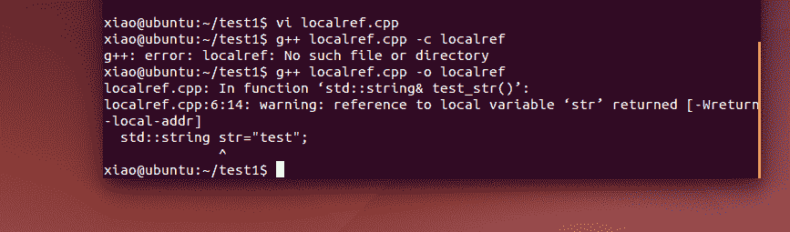
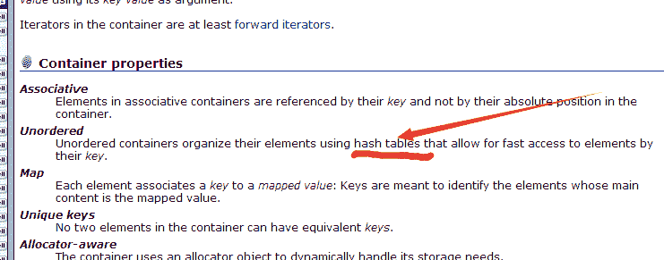
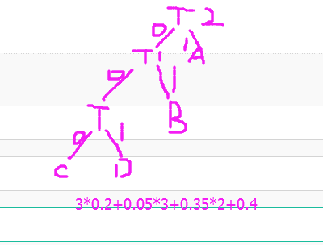
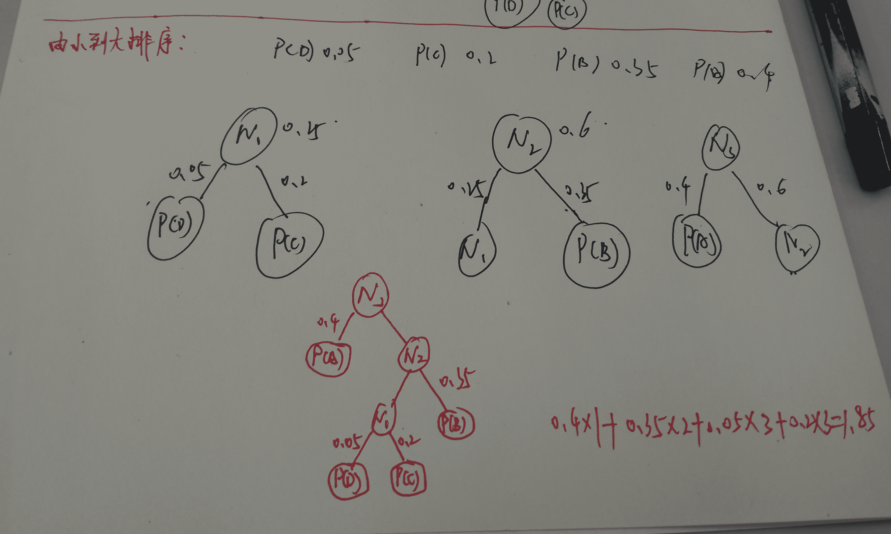

# 搜狗 2016 研发工程师笔试题

## 1

缓存系统中的主要使用的数据结构是()

正确答案: C   你的答案: 空 (错误)

```cpp
HashSet
```

```cpp
Array
```

```cpp
HashMap
```

```cpp
LinkedList
```

本题知识点

高级结构 Java 工程师 C++工程师 运维工程师 前端工程师 算法工程师 PHP 工程师 搜狗

讨论

[SunburstRun](https://www.nowcoder.com/profile/557336)

缓存系统中主要是:Mem**  查看全部)

编辑于 2015-11-18 12:13:02

* * *

[谭杰](https://www.nowcoder.com/profile/9904269)

常用的缓存系统有：redis、mem***d。它们的存储结构都是 key-value 类型的数据结构，而 HashMap 就是 key-value 结构

编辑于 2016-10-31 09:37:28

* * *

[小蜜蜂嗡嗡](https://www.nowcoder.com/profile/767813)

常用的缓存系统有：redis、mem***d，其存储结构均为 key-value 类型的数据结构，而 HashMap 就是 key-value 结构

发表于 2018-09-12 20:28:23

* * *

## 2

A,B 两台机器都正常工作,B 机器未监听任何端口.如果 A 机器向 B 机器 80 端口发送 SYN 包,会收到何种类型的回包?

正确答案: D   你的答案: 空 (错误)

```cpp
ACK 包
```

```cpp
FIN 包
```

```cpp
不会收到回包
```

```cpp
RST 包
```

本题知识点

网络基础 Java 工程师 C++工程师 运维工程师 前端工程师 算法工程师 PHP 工程师 搜狗

讨论

[心静](https://www.nowcoder.com/profile/437950)

**D****1** **端口**  查看全部)

编辑于 2016-01-20 10:26:25

* * *

[FatTotoro](https://www.nowcoder.com/profile/459382)

rst 是复位报文 几种 TCP 链接中出现 rst 的情况 1.端口未打开 2，请求超时 3，提前关闭 4,在一个已关闭的 socket 上出现数据

发表于 2016-03-24 10:09:42

* * *

[SunburstRun](https://www.nowcoder.com/profile/557336)

因为 B 机器未监听任何端口,A 又向 B 的 80 端口发送了数据包,所以 B 不会建立连接,会异常结束建立连接,会发送 RST 包,如果是正常结束的话就会发送 FIN 包,RST 是 TCP 连接中 出现差错产生的,RST 置 1 可以用来拒绝一个非法的报文段或拒绝打开一个连接

发表于 2015-11-18 10:20:29

* * *

## 3

选项代码中能正确操作数组元素的是()

```cpp
int main(){
  int a[N][N]={{0,0},{0,0}};
  for(int i=0;i<N;i++){
     for(int j=0;j<N;j++){
       //访问二维数组 a 的值
       //选项代码
      }
    }
}
```

正确答案: A B   你的答案: 空 (错误)

```cpp
*(*(a+i)+j)=1
```

```cpp
*(a[i]+j)=1
```

```cpp
**(a+i)[j]=1
```

```cpp
*((a+i)+j)=1
```

本题知识点

数组 Java 工程师 C++工程师 运维工程师 前端工程师 算法工程师 PHP 工程师 搜狗

讨论

[越努力-越幸运](https://www.nowcoder.com/profile/335227)

数组名当被直接使用时，是一个指向数组首地址的指针。如果数组是***数组，那么数组名是指向第一行数组的首地址，而不是第一行第一列单个元素的地址，所以*(a+i)与 a[i]是一个意思，当直接用 a[i]时代表的是该一维数组的首地址，所以*(a[i]+j)是与 a[i][j]等效，所以 AB 选项正确 

发表于 2015-11-18 15:14:26

* * *

[huixieqingchun](https://www.nowcoder.com/profile/551201)

```cpp
a[i] 和*（a+i)表示的是一个意思，所以对于二维数组也一定要注意区分 
```

发表于 2016-04-26 13:07:56

* * *

[劷鹿](https://www.nowcoder.com/profile/535195)

a[i]=*(a+i); a[i][j]=*(a[i]+j)=*(*(a+i)+j);

发表于 2017-03-07 09:25:41

* * *

## 4

在 linux+gcc 下,关于以下代码,正确的是()

```cpp
std::string& test_str(){
   std::string str = "test";
   return str;
}
int main(){
   std::string& str_ref = test_str();
   std::cout << str_ref << std::endl;
   return 0;
}
```

正确答案: A B D   你的答案: 空 (错误)

```cpp
编译警告
```

```cpp
返回局部变量的引用,运行时出现未知错误
```

```cpp
正常编译且运行
```

```cpp
把代码里的&都去掉之后,程序可以正常运行
```

本题知识点

C++ Java 工程师 C++工程师 运维工程师 前端工程师 算法工程师 PHP 工程师 搜狗 C 语言

讨论

[是萌萌的前辈呀](https://www.nowcoder.com/profile/649256)

对于 D 选项，简要说明一下：D 选项，去掉&后其实就是我们见到的最基本的返回值问题，其返回值为局部变量。**其实问题就变成了为什么不能返回局部变量地址，却可以返回局部变量？**

1.  局部变量用作返回值时，会生成一个**局部变量的拷贝用作返回值**，之后局部变量会被系统回收；
2.  函数不能返回局部变量的地址，因为如果返回局部变量的地址，系统回收后，指针、引用指向的内容就无意义了。

编辑于 2017-08-22 11:58:50

* * *

[Brandoncc](https://www.nowcoder.com/profile/3703291)

引用返回的是局部变量本身，而不是复制一份再返回，所以结果难以预料；其次返回局部自动变量是可以的，只要不是地址或引用就可以，否则需要将变量声明成 static 类型。

编辑于 2016-08-27 14:58:41

* * *

[下里巴人](https://www.nowcoder.com/profile/361316)

在我的电脑下 ubuntu 14.0 下，出现编译警告 ，提示“返回局部变量引用”，故 A 选项也应该对！

发表于 2016-03-20 21:53:09

* * *

## 5

关于虚函数的描述正确的是()

正确答案: B   你的答案: 空 (错误)

```cpp
派生类的虚函数与基类的虚函数具有不同的参数个数和类型
```

```cpp
内联函数不能是虚函数
```

```cpp
派生类必须重新定义基类的虚函数
```

```cpp
虚函数可以是一个 static 型的函数
```

本题知识点

C++ Java 工程师 C++工程师 运维工程师 前端工程师 算法工程师 PHP 工程师 搜狗

讨论

[mcq](https://www.nowcoder.com/profile/961991)

题目有问题的。正确应该是这样的，虚函数是为了实现动态绑定，不能声明为虚函数的有：1、静态成员函数； 2、类外的普通函数； 3、构造函数； 4、友元函数此外，还有一些函数可以声明为虚函数，但是没有意义，但编译器不会报错，如：1、赋值运算符的重载成员函数： 因为复制操作符的重载函数往往要求形参与类本身的类型一致才能实现函数功能，故形参类型往往是基类的类型，因此即使声明为虚函数，也把虚函数当普通基类普通函数使用。2、内联函数：内联函数目的是在代码中直接展开（编译期），而虚函数是为了继承后能动态绑定执行自己的动作（动态绑定），因此本质是矛盾的，因此即使内联函数声明为虚函数，编译器遇到这种情况是不会进行 inline 展开的，而是当作普通函数来处理。因此声明了虚函数不能实现内敛的，即内敛函数可以声明为虚函数，但是毫无了内联的意义

编辑于 2016-05-15 22:06:37

* * *

[zt_xcyk](https://www.nowcoder.com/profile/839070)

B 内联函数是编译器就展开的，把代码镶嵌就程序，虚函数是动态绑定，运行期决定的。所以内联函数不能是虚函数

发表于 2015-11-19 18:40:45

* * *

[NEWTON](https://www.nowcoder.com/profile/791983)

前几天说内联函数不能是虚函数是错的，今天又是对的。傻眼

发表于 2016-07-07 10:36:28

* * *

## 6

32 位/33MHzPCI 总线的峰值带宽是多少?

正确答案: C   你的答案: 空 (错误)

```cpp
33MB/s
```

```cpp
4MB/s
```

```cpp
133MB/s
```

```cpp
266MB/s
```

本题知识点

编译和体系结构 Java 工程师 C++工程师 运维工程师 前端工程师 算法工程师 PHP 工程师 搜狗

讨论

[CarsonZhu＆＆](https://www.nowcoder.com/profile/327988)

B（总线峰值带宽）=F（时钟频率 MHz）*D（总线位数）/8

编辑于 2016-03-15 21:27:21

* * *

[天空海豚🐬](https://www.nowcoder.com/profile/3946118)

这不是 33MHz 嘛？咋就变成 33.3MHz 了?

发表于 2016-09-06 11:03:07

* * *

[SunburstRun](https://www.nowcoder.com/profile/557336)

本题考查总线带宽的计算。公式 Q=W×F/N 计算总线的数据传输速率 Q(其中，W 为总线数据宽度，即总线位宽/8；F 为总 线：工作频率；N 为完成一次数据传送所需的总线时钟周期个数)。总线 位宽为 32 位，总线工作频率为 33.3MHz，PCI 1.0 规范完成一次数据传 送需 1 个总线时钟周期时，总线带宽 Q133MB/s。正确答案为选项 C。

发表于 2015-11-18 10:20:55

* * *

## 7

关于函数输入参数的正确描述都有哪些?() 

正确答案: A C D   你的答案: 空 (错误)

```cpp
始终用 const 限制所有指向只读输入参数的指针和引用
```

```cpp
值传递只用于原始类型(int,float...)的输入参数
```

```cpp
优先按 const 的引用取得其他用户定义类型的输入
```

```cpp
如果函数需要修改其参数副本,则可以考虑通过值传递代替通过引用传递
```

本题知识点

C++ Java 工程师 C++工程师 运维工程师 前端工程师 算法工程师 PHP 工程师 搜狗 C 语言

讨论

[心静](https://www.nowcoder.com/profile/437950)

[c++编程规范的纲要和记录](http://www.cnblogs.com/hdk1993/p/4976073.html)

37\. 对于只做输入的参数：

a) 始终用 const 限制所有指向只输入参数的指针和引用。

b) 优先通过值来取得原始类型和复制开销比较低的值的对象。

c) 优先按 const 的引用取得其他用户定义类型的输入。d) 如果函数需要其参数的副本，则可以考虑通过值传递代替通过引用传递。这在概念上等同于通过 const 引用传递加上一次复制，能够帮助编译器更好的优化掉临时变量。http://www.cnblogs.com/hdk1993/p/4976073.html

编辑于 2015-11-18 22:22:31

* * *

[@xgq](https://www.nowcoder.com/profile/8895434)

A 只读数据不能被修改，采用 const 修饰就限制了对参数的修改  正确 B 反例：值传递可以传递类对象 C 常量的引用可以提高程序的执行效率，无需创建参数的副本，当然优先考虑 D 被调函数修改实参副本，传形参时通过值传递创建副本，不改变主调函数的实参，传递引用时可能伴随着主调函数实参被修改

发表于 2017-09-12 10:29:55

* * *

[谦儿哥](https://www.nowcoder.com/profile/763702)

D 不是都说了 修改参数副本吗？形参就是副本 所以值传递 就是修改的副本 而引用才是本身    D 错吗？

发表于 2015-11-18 21:24:34

* * *

## 8

一个长方体形状的盒子长、宽、高分别为 20 厘米、8 厘米和 2 厘米，现在要用一张纸将其六个面完全包裹起来，要求从纸上剪下的部分不得用作贴补，请问这张纸的大小可能是下列哪一个?( )

正确答案: C   你的答案: 空 (错误)

```cpp
长 25 厘米、宽 17 厘米
```

```cpp
长 26 厘米、宽 14 厘米
```

```cpp
长 24 厘米、宽 21 厘米
```

```cpp
长 24 厘米、宽 14 厘米
```

本题知识点

数学运算

讨论

[SunburstRun](https://www.nowcoder.com/profile/557336)

长方体的表面积 S=2×(20×8+20×2+8×2)=432 选项 A 中纸的面积 25×17=425；选项 B 中纸的面积 26×14=364；选项 C 中纸的面积 24×21=504；选项 D 中纸的面积 24×14=336。纸的面积应该大于长方体的表面积，结合选项，选择 C。

发表于 2015-11-18 10:21:25

* * *

[scripter](https://www.nowcoder.com/profile/903202)

第一个稍微一算不行，问题出在提供报纸的宽度，长度只要达到 24 都够用，那么肯定是最宽的 c 答案

发表于 2016-04-07 01:09:39

* * *

[爱上 _ 向日葵的执着](https://www.nowcoder.com/profile/1816381)

将盒子完全展开，应该是两种情况，
第一种：
长：20（盒子底部的长度）+2*2（盒子的高度）+2*10（盒子顶部的长度）=44
宽：20（盒子底部的宽度）+2*2（盒子的高度）=24
第二种：
长：20（盒子底部的长度）+2*2（盒子的高度）=24
宽：8（盒子底部的宽度）+2*2（盒子的高度）+2*4（盒子顶部的长度）=20

由于是包装纸，所以应该要多出一点才能完全包住。所以选 24*21，C

发表于 2018-03-23 11:35:04

* * *

## 9

组成数字 1 到 2,000,000 的所有数字的各位数的总和是？

正确答案: A   你的答案: 空 (错误)

```cpp
55,000,002
```

```cpp
45,000,002
```

```cpp
2,000,001,000,000
```

```cpp
10,999,902
```

本题知识点

数学运算

讨论

[SunburstRun](https://www.nowcoder.com/profile/557336)

只要 a+b 没有进位,(a+b  查看全部)

编辑于 2015-11-18 12:14:12

* * *

[Norman FENG](https://www.nowcoder.com/profile/2283997)

用数学期望做可秒杀此题首先把所有数字前面补上 0。先只考虑 0,000,000 ~ 1,999,999 随机抽取一个数 各位数字的期望是 0.5 | 4.5 4.5 4.5 | 4.5 4.5 4.5 和为 27.5，一共有 2,000,000 个数，27.5 * 2,000,000 = 55,000,000 加上 2,000,000 这个数，所以和为 55,000,002

发表于 2016-09-04 00:52:40

* * *

[passi0n](https://www.nowcoder.com/profile/387721)

先考虑 000,000~999,999 共 1,000,000 个数，每个数字有 6 位，共 6,000,000 位数字，数字 0 到 9 出现次数相当，都出现了 6,000,000/10=600,000 次。因此 000,000~999,999 所有数字之和为(0+1+2+...+9)*600,000=45*600,000=27,000,0001,000,000 到 1,999,999 再加上最高位的 1,000,000 个 1 即可所以组成数字 1 到 2,000,000 的所有数字的各位的总和是：27,000,000+27,000,000+1,000,000+2=55,000,002

发表于 2015-12-18 11:39:03

* * *

## 10

两个人两个小时能组装两辆自行车，要在 6 小时内组装 12 辆自行车，需要多少人?

正确答案: C   你的答案: 空 (错误)

```cpp
2
```

```cpp
3
```

```cpp
4
```

```cpp
5
```

本题知识点

数学运算

讨论

[SunburstRun](https://www.nowcoder.com/profile/557336)

1 个人 2 个小时装 1 辆车,所以 1 人 6 小时装 3 辆车, 所以 4 人 6 小时装 12 辆车, 所以要 4 人.

发表于 2015-11-18 10:22:05

* * *

[九界](https://www.nowcoder.com/profile/124708)

设每人每小时装 x 台车    2*2*x=2   x 等于 0.5    最后需要 k 人  问题就是 k*6*0.5=12 解得 k 等于 4 就是简单的将问题提炼，列一元一次方程。

发表于 2015-11-22 12:24:29

* * *

[无ˇ戏](https://www.nowcoder.com/profile/8644090)

两个人两个小时能组装两辆自行车,即组装两辆车需要 2*2 =4 个人时，一辆车就是 2 个人时 12 辆车 需要 24 个人时， 即 6 个小时需要 4 个人

发表于 2017-09-08 15:49:04

* * *

## 11

在 Logistic Regression 中,如果同时加入 L1 和 L2 范数,会产生什么效果()

正确答案: A   你的答案: 空 (错误)

```cpp
可以做特征选择,并在一定程度上防止过拟合
```

```cpp
能解决维度灾难问题
```

```cpp
能加快计算速度
```

```cpp
可以获得更准确的结果
```

本题知识点

机器学习 Java 工程师 C++工程师 运维工程师 前端工程师 算法工程师 PHP 工程师 搜狗

讨论

[大宇哥](https://www.nowcoder.com/profile/476020)

此解析是我看特征选择的博客看到的，是做特征选择看可以使用 L1，L2 范数，具体如下：
Ｌ１范数具有系数解的特性，但是要注意的是，Ｌ１没有选到的特征不代表不重要，原因是两个高相关性的特征可能只保留一个。如果需要确定哪个特征重要，再通过交叉验证。
为什么 L1，L2 范数可以防止过拟合呢
在代价函数后面加上正则项，Ｌ１即是Ｌｏｓｓｏ回归，Ｌ２是岭回归
但是它为什么能防止过拟合呢？
奥卡姆剃刀原理：能很好的拟合数据且模型简单
模型参数在更新时，正则项可使参数的绝对值趋于０，使得部分参数为０，降低了模型的复杂度（模型的复杂度由参数决定），从而防止了过拟合。提高模型的泛化能力

发表于 2016-08-10 18:22:29

* * *

[JasonTian](https://www.nowcoder.com/profile/846843)

L1 范数用于特征选择，L2 范数可以约束模型参数，抑制过拟合，增强泛化性能

发表于 2016-08-23 12:47:25

* * *

[搭上最后一班车](https://www.nowcoder.com/profile/993558)

L1 范数是指向量中各个元素绝对值之和，用于特征选择 L2 范数 是指向量各元素的平方和然后求平方根，用于 防止过拟合，提升模型的泛化能力参考答案为 D，感觉不合理。

发表于 2016-03-07 10:48:01

* * *

## 12

在分类问题中,我们经常会遇到正负样本数据量不等的情况,比如正样本为 10w 条数据,负样本只有 1w 条数据,以下合适的处理方法是()

正确答案: A C D   你的答案: 空 (错误)

```cpp
将负样本重复 10 次,生成 10w 样本量,打乱顺序参与分类
```

```cpp
直接进行分类,可以最大限度利用数据
```

```cpp
从 10w 正样本中随机抽取 1w 参与分类
```

```cpp
将负样本每个权重设置为 10,正样本权重为 1,参与训练过程
```

本题知识点

机器学习 Java 工程师 C++工程师 运维工程师 前端工程师 算法工程师 PHP 工程师 搜狗

讨论

[East.W.R](https://www.nowcoder.com/profile/4902973)

出题很不严谨啊，什么叫最合适，然后又是多选。。。

编辑于 2018-01-20 16:50:19

* * *

[嘻嘻兔](https://www.nowcoder.com/profile/294910)

解决这类问题主要分**重采样、欠采样、调整权值** 

**1\. 重采样。**

A 可视作重采样的变形。改变数据分布消除不平衡，可能导致过拟合。

**2\. 欠采样。**

C 的方案 提高少数类的分类性能，可能丢失多数类的重要信息。

如果 1：10 算是均匀的话，可以将多数类分割成为 1000 份。然后将每一份跟少数类的样本组合进行训练得到分类器。而后将这 1000 个分类器用 assemble 的方法组合位一个分类器。A 选项可以看作此方式，因而相对比较合理。 

另：如果目标是 预测的分布 跟训练的分布一致，那就加大对分布不一致的惩罚系数。 

**3\. 权值调整。**

D 方案也是其中一种方式。http://blog.csdn.net/ztf312/article/details/50893967

编辑于 2016-03-15 16:07:19

* * *

[kiss90](https://www.nowcoder.com/profile/590177)

```cpp
//机器学习分类问题中的不均衡问题（正负样本相差 10 倍以上）。
//周志华教授的 EasyEnsemble 就是解决不均衡问题的。
//感觉这题 ACD 都对，都是解决不均衡问题的方法。具体使用时要具体问题具体分析。
```

发表于 2016-03-04 22:03:33

* * *

## 13

使用一个长度最大为 150 的队列，对满二叉树进行广度优先遍历时，能够容纳的二叉树的最大深度（第一层深度为 1）为（）

正确答案: A   你的答案: 空 (错误)

```cpp
8
```

```cpp
10
```

```cpp
9
```

```cpp
7
```

本题知识点

树 搜狗 2021 远景能源有限公司

讨论

[crisy1991](https://www.nowcoder.com/profile/851211)

满二叉树每一层的结点个数为（第一层深度为 1）第 n 层的节点数：2^(n-1),如果使用 150 的队列进行广度优先遍历，则每一层的节点数不大于 150，2^(n-1)≤150，2⁷=128,2⁸=256，n-1 最多为 7，所以最大深度 n=8.

发表于 2016-06-20 11:18:06

* * *

[DiWei](https://www.nowcoder.com/profile/996358)

广度优先遍历满二叉树，队列中最多会容纳满二叉树的最后一层即 2^(n-1)个。2⁷=128,所以是 8 层。

发表于 2015-11-27 10:57:37

* * *

[凌梦初辰](https://www.nowcoder.com/profile/9808981)

注意到题目中是广度优先遍历，出去一个进入其子节点，最大是最后一层，即 2^（n-1）那么多个节点。2^(n-1)<=150,n=7,所以最大是 n+1=8 层

发表于 2017-09-06 09:05:45

* * *

## 14

对以下数据结构中 data 的处理方式描述正确的是()

```cpp
struct Node
{
   int size;
   char data[0];
};
```

正确答案: C   你的答案: 空 (错误)

```cpp
data 将会被编译成一个 char *类型指针
```

```cpp
全部描述都不正确
```

```cpp
编译器会认为这就是一个长度为 0 的数组,而且会支持对于数组 data 的越界访问
```

```cpp
编译器会默认将数组 data 的长度设置为 1
```

本题知识点

C++ Java 工程师 C++工程师 运维工程师 前端工程师 算法工程师 PHP 工程师 搜狗 C 语言

讨论

[SunburstRun](https://www.nowcoder.com/profile/557336)

看不懂 char data[0];请去百度  柔性数组,它只能放在结构体末尾,是申明一个长度为 0 的数组，就可以使得这个结构体是可变长的。对于编译器来说，此时长度为 0 的数组并不占用空间，因为数组名本身不占空间，它只是一个偏移量， 数组名这个符号本身代 表了一个不可修改的地址常量 （注意：数组名永远都不会是指针！ ），但对于这个数组的大小，我们可以进行动态分配 请仔细理解后半部分，对于编译器而言，数组名仅仅是一个符号，它不会占用任何空间，它在结构体中，只是代表了一个偏移量，代表一个不可修改的地址常量！ 对于 0 长数组的这个特点，很容易构造出变成结构体，如缓冲区，数据包等等：注意:构造缓冲区就是方便管理内存缓冲区,减少内存碎片化,它的作用不是标志结构体结束,而是扩展柔性数组是 C99 的扩展，简而言之就是一个在 struct 结构里的标识占位符（不占结构 struct 的空间）

发表于 2015-11-18 10:22:27

* * *

[waponx](https://www.nowcoder.com/profile/229868)

对于变长数组和变长结构体，这是在 C99 才加入标准的。对于变长数组，举个例子就能解释了：int main() {    int n = 10;
    int arr[n];
}对于变长结构体就比较复杂一点（也不算很复杂：））。很多人其实会有这种疑惑，就是为什么不用指针去代替变长结构体，比如：structNode{   intsize;   char*data；};就这个问题，我总结了一下用指针和用变长结构体的区别：1.在位置方面：指针可以放在任何地方，但是变长结构体的变长部分一定要放在结构体的最后。2.在内存占用方面：指针会占一个指针的大小的内存空间，但是变长数组是不占内存的，它只是一个占位符。3.在内存布局方面：指针指向的内存和结构体的内存可以是不连续的，但是变长部分和结构体的内存必须是连续。4.在内存释放方面：使用指针，就要先释放指针所指的内存在释放整个结构体的内存，否则会照成内存泄露。但是使用变长结构体直接释放整个结构体的空间就可以了 5.一个限制：指针可以用在 C++的类中，但是变长结构体就不可以了。因为有些编译器会将一些额外的信息放在类的最后，比如 vptr 或者虚基类的内容，使用了变长的类，就会把这部分的值改变，这种行为是未定义的，谁也不知道会发生什么。

发表于 2016-03-30 22:51:12

* * *

[MSean](https://www.nowcoder.com/profile/231467)

**柔性数组(Flexible Array)**也叫伸缩性数组，也就是**变长数组**，反映了 C 语言对精炼代码的极致追求。这种代码结构产生于对动态结构体的需求， 比如我们需要在结构体中存放一个动态长度的字符串时，就可以用柔性数组。C99 使用不完整类型来实现柔性数组，标准形式如下：

```cpp

	*struct MyStruct*

	 *{*

	 *int a;*

	 *double b;*

	 *char c[]; // or char c[0]; 也可以用其他数据类型；*

	 *};*

```

**c 不占用 MyStruct 的空间，只是作为一个符号地址存在，而且必须是结构体的最后一个成员。**参考链接：http://www.cnblogs.com/nchxmoon/p/3145480.html

发表于 2016-08-03 09:54:43

* * *

## 15

在 HMM 中,如果已知观察序列和产生观察序列的状态序列,那么可用以下哪种方法直接进行参数估计()

正确答案: D   你的答案: 空 (错误)

```cpp
EM 算法
```

```cpp
维特比算法
```

```cpp
前向后向算法
```

```cpp
极大似然估计
```

本题知识点

机器学习 Java 工程师 C++工程师 运维工程师 前端工程师 算法工程师 PHP 工程师 搜狗

讨论

[yunhe](https://www.nowcoder.com/profile/531558)

EM 算法： 只有观测序列，无状态序列时来学习模型参数，即 Baum-Welch 算法维特比算法： 用动态规划解决 HMM 的预测问题，不是参数估计前向后向：用来算概率极大似然估计：即观测序列和相应的状态序列都存在时的监督学习算法，用来估计参数故应选 D（参考李航博士《统计学习方法》）

发表于 2016-04-20 17:49:12

* * *

[小舔哥](https://www.nowcoder.com/profile/5568694)

HMM 当中涉及到：**观测****序列 O**，产生观测序列的**状态序列 X**（相当于隐变量），还有**参数**。**概率计算问题**：已知观测序列 O 和参数，求在条件下的最大概率。概率计算问题可以使用**前向算法**和**后向算法**求解。**学习问题**：已知观测序列 O，求解参数，使得在该参数下的观测序列出现概率最大。这个时候状态序列未知，相当于含有隐变量的参数求解问题，这种问题一般使用**EM 算法**，具体到 HMM 当中使用**Baum-Welch 算法**。**普通参数求解问题**：已知观测序列 O，还有状态序列 X，求解参数问题，使得最大。这是一个普通的参数求解问题，那么可以直接使用**极大****似然估计**来进行求解。**解码问题**：已知观测序列 O 和参数，求解最有可能的状态序列 X，使得最大。使用**维特比算法**求解。

发表于 2018-08-28 16:14:27

* * *

[xiaxiamii](https://www.nowcoder.com/profile/883541)

D 极大似然估计在给定观测序列和对应的状态序列估计模型参数，可以利用极大似然发估计。如果给定观测序列，没有对应的状态序列，才用 EM，将状态序列看不不可测的隐数据

发表于 2016-03-04 14:35:02

* * *

## 16

幼儿园 10 个小朋友排成一列,其中 3 个小朋友是女孩,求女孩排在一起的概率是()

正确答案: C   你的答案: 空 (错误)

```cpp
1/18
```

```cpp
1/6
```

```cpp
1/15
```

```cpp
1/10
```

本题知识点

概率统计 *Java 工程师 C++工程师 运维工程师 前端工程师 算法工程师 PHP 工程师 搜狗 概率论与数理统计* *讨论

[九界](https://www.nowcoder.com/profile/124708)

所有人排列的情况是 10！   把三个小女孩看做整体排列是 8！   三个小女孩排列是 3！最后结果就是 (8！X3！)/10!     消除 8！就是    3！/(10X9)     就是 1/15

发表于 2015-11-22 12:20:37

* * *

[灰色节能 _ 聪](https://www.nowcoder.com/profile/722809)

总的情况是 10 个小朋友全排列，按题目意思，把三个小女孩捆绑在一起，插入到 7 个小朋友的空隙敏感词有 8 个空隙其中抽一个，其它小朋友全排列，再加上三个小女孩之间的全排列，得出 A(3,3)*C(1,8)*A（7,7)/A(10,10)

发表于 2016-02-21 16:42:18

* * *

[ox_chen](https://www.nowcoder.com/profile/8398291)

三个女孩（女孩彼此之间不做区分）所处的位置一共有 C(3,10)种情况，三个女孩排在一起的情况有 1,2,3;2,3,4;...8,9,10 共 8 种情况，所以排在一起的概率为 8/C(3,10)=1/15

发表于 2016-09-13 15:32:08

* * *

## 17

STL 中的 unordered_map 和 priority_queue 使用的底层数据结构分别是什么?()

正确答案: B   你的答案: 空 (错误)

```cpp
rbtree,queue
```

```cpp
hashtable,heap
```

```cpp
rbtree,heap
```

```cpp
hashtable,queue
```

本题知识点

高级结构 C++ Java 工程师 C++工程师 运维工程师 前端工程师 算法工程师 PHP 工程师 搜狗 C 语言

讨论

[二货磁铁](https://www.nowcoder.com/profile/800454)

选 Bunordered_map：是所谓的哈希 map，很容易就选了 hashtablepriority_queue：是所谓的优先级队列，说白了就是一个二叉堆，所以底层应该是用 heap 实现，并非名字中的 queue 所以选 B

发表于 2015-11-18 16:24:58

* * *

[SunburstRun](https://www.nowcoder.com/profile/557336)



发表于 2015-11-18 12:15:53

* * *

[onizuka](https://www.nowcoder.com/profile/566047)

*   map： map 内部实现了一个红黑树，该结构具有自动排序的功能，因此 map 内部的所有元素都是**有序的**，红黑树的每一个节点都代表着 map 的一个元素，因此，对于 map 进行的查找，删除，添加等一系列的操作都相当于是对红黑树进行这样的操作，故红黑树的效率决定了 map 的效率。
*   unordered_map: unordered_map 内部实现了一个哈希表，因此其元素的排列顺序是杂乱的，无序的

发表于 2016-09-19 21:13:56

* * *

## 18

平面上平均每 4 个单位面积有一个染色点,观察一定面积上的点数 X,X 近似服从()

正确答案: B   你的答案: 空 (错误)

```cpp
均匀分布
```

```cpp
泊松分布
```

```cpp
二项分布
```

```cpp
正态分布
```

本题知识点

数理统计 概率论与数理统计

讨论

[Joker2 死啦](https://www.nowcoder.com/profile/193636)

泊松分布的参数λ是单位时间(或单位面积)内随机事件的平均发生率。 泊松分布适合于描述单位时间内随机事件发生的次数。（来自百度百科）这里某个单位面积有染色点可以看做是个随机事件，而在一定面积上观察这个一定面积可以看做是单位时间

发表于 2015-12-10 10:56:05

* * *

[、尾翼](https://www.nowcoder.com/profile/3970074)

问题关键在于：**平均**每 4 个单位面积有一个染色点，如果是 恰好每 4 个单位面积有一个染色点 ，那么符合均匀分布，泊松分布适合于描述单位时间内随机事件发生的次数，就是从整体看平均，所以当画布上有 100 个像素点，即使左上角 25 个像素点完全被染色，其它 75 个点是每染色的，也可以说成**平均**每 4 个单位面积有一个染色点，这就是从整体上看平均。

发表于 2017-12-07 10:24:49

* * *

[Shopee 内推营业 ing](https://www.nowcoder.com/profile/1379367)

在实际事例中，当一个随机事件，例如某电话交换台收到的呼叫、来到某公共汽车站的乘客、某放射性物质发射出的粒子、显微镜下某区域中的白血球等等，以固定的平均瞬时速率λ（或称密度）随机且独立地出现时，那么这个事件在单位时间（面积或体积）内出现的次数或个数就近似地服从泊松分布 P(λ)。因此,泊松分布在管理科学、运筹学以及自然科学的某些问题中都占有重要的地位。

发表于 2017-04-08 18:09:08

* * *

## 19

对一个由 A,B,C,D 随机组成的序列进行哈弗曼编码，据统计，各个元素的概率分别为：P(A)=0.4，P(B)=0.35，P(C)=0.2，P(D)=0.05，请问该编码的平均期望编码长度为（）bits？

正确答案: C   你的答案: 空 (错误)

```cpp
1.45
```

```cpp
1.7
```

```cpp
1.85
```

```cpp
1.92
```

本题知识点

树 C++工程师 C++工程师 Java 工程师 C++工程师 运维工程师 前端工程师 算法工程师 PHP 工程师 搜狗 C++工程师 搜狗 2015

讨论

[Aesthetic92](https://www.nowcoder.com/profile/940702)

答案：选 C 首先要建立哈  查看全部)

编辑于 2015-01-27 20:25:57

* * *

[鸡哥](https://www.nowcoder.com/profile/348022)



发表于 2015-06-26 20:16:46

* * *

[go_changing](https://www.nowcoder.com/profile/990318)



发表于 2016-04-08 09:48:15

* * *

## 20

下列不是 SVM 核函数的是：

正确答案: B   你的答案: 空 (错误)

```cpp
多项式核函数
```

```cpp
logistic 核函数
```

```cpp
径向基核函数
```

```cpp
Sigmoid 核函数
```

本题知识点

机器学习 数理统计 搜狐 Java 工程师 C++工程师 运维工程师 前端工程师 算法工程师 PHP 工程师 搜狗 数据分析

讨论

[牛客职导官方账号](https://www.nowcoder.com/profile/897353)

【正确答案】B【解析】  查看全部)

编辑于 2021-11-19 12:21:49

* * *

[小虎牙](https://www.nowcoder.com/profile/512935)

选 B;支持向量机是建立在统计学习理论基础之上的新一代机器学习算法，支持向量机的优势主要体现在解决线性不可分问题，它通过引入核函数，巧妙地解决了在高维空间中的内积运算，从而很好地解决了非线性分类问题。构造出一个具有良好性能的 SVM，核函数的选择是关键．核函数的选择包括两部分工作：一是核函数类型的选择，二是确定核函数类型后相关参数的选择．因此如何根据具体的数据选择恰当的核函数是 SVM 应用领域遇到的一个重大难题，也成为科研工作者所关注的焦点，即便如此，却依然没有得到具体的理论或方法来指导核函数的选取．

1、经常使用的核函数

核函数的定义并不困难，根据泛函的有关理论，只要一种函数 K ( x i , x j ) 满足 Mercer 条件，它就对应某一变换空间的内积．对于判断哪些函数是核函数到目前为止也取得了重要的突破，得到 Mercer 定理和以下常用的核函数类型：

**(1)线性核函数**

K ( x , x i ) = x ⋅ x i

**(2)多项式核**

K ( x , x i ) = ( ( x ⋅ x i ) + 1 ) d

**(3)径向基核（RBF）**

K ( x , x i ) = exp ( − ∥ x − x i ∥ 2 σ 2 )

Gauss 径向基函数则是局部性强的核函数，其外推能力随着参数 σ 的增大而减弱。多项式形式的核函数具有良好的全局性质。局部性较差。

**(4)傅里叶核**

K ( x , x i ) = 1 − q 2 2 ( 1 − 2 q cos ( x − x i ) + q 2 )

**(5)样条核**

K ( x , x i ) = B 2 n + 1 ( x − x i )

**(6)Sigmoid 核函数**

K ( x , x i ) = tanh ( κ ( x , x i ) − δ )

采用 Sigmoid 函数作为核函数时，支持向量机实现的就是一种多层感知器神经网络，应用 SVM 方法，隐含层节点数目(它确定神经网络的结构)、隐含层节点对输入节点的权值都是在设计(训练)的过程中自动确定的。而且支持向量机的理论基础决定了它最终求得的是全局最优值而不是局部最小值，也保证了它对于未知样本的良好泛化能力而不会出现过学习现象。

2、核函数的选择

在选取核函数解决实际问题时，通常采用的方法有：一是利用专家的先验知识预先选定核函数；二是采用 Cross-Validation 方法，即在进行核函数选取时，分别试用不同的核函数，归纳误差最小的核函数就是最好的核函数．如针对傅立叶核、RBF 核，结合信号处理问题中的函数回归问题，通过仿真实验，对比分析了在相同数据条件下，采用傅立叶核的 SVM 要比采用 RBF 核
的 SVM 误差小很多．三是采用由 Smits 等人提出的混合核函数方法，该方法较之前两者是目前选取核函数的主流方法，也是关于如何构造核函数的又一开创性的工作．将不同的核函数结合起来后会有更好的特性，这是混合核函数方法的基本思想．

对于核函数的理解，[pluskid 的博客](http://blog.pluskid.org/?p=685&cpage=1#comment-4697)写的相当不错啊，大家可以看看。


发表于 2015-11-19 15:47:36

* * *

[忆梦＆....](https://www.nowcoder.com/profile/1733)

SVM 核函数包括线性核函数、多项式核函数、径向基核函数、高斯核函数、幂指数核函数、拉普拉斯核函数、ANOVA 核函数、二次有理核函数、多元二次核函数、逆多元二次核函数以及 Sigmoid 核函数**B**

编辑于 2021-11-19 12:21:49

* * **