# 京东 2016 研发工程师笔试题

## 1

下列有关 MySQL 数据库中的 NULL 值,说法正确的是()

正确答案: D   你的答案: 空 (错误)

```cpp
NULL 与它本身的比较可以使用=,<>或!=
```

```cpp
NULL 是"有数据的"
```

```cpp
NULL 与 0 的比较可以使用=,<>或!=
```

```cpp
NULL 是"无数据"或"未知数据"
```

本题知识点

数据库 C++工程师 Java 工程师 京东 2016

讨论

[zhaoying](https://www.nowcoder.com/profile/316866)

"空值" 和"NULL"的概念：  1：空值('')是不占用空间的,判断空字符用 = '' 或者 <> '' 来进行处理; 2: NULL 值是未知的，且占用空间，不走索引;判断 NULL 用 IS NULL 或者 is not null , SQL 语句函数中可以使用 ifnull ()函数来进行处理. 注：在进行 count ()统计某列的记录数的时候，如果采用的 NULL 值，会别系统自动忽略掉，但是空值是统计到其中

发表于 2016-04-10 21:19:30

* * *

[zt_xcyk](https://www.nowcoder.com/profile/839070)

在 MySQL 数据库中，NULL 对于一些特殊类型的列来说，其代表了一种特殊的含义，而不仅仅是一个空值。IS NULL: 此运算符返回 true，当列的值是 NULL。IS NOT NULL: 运算符返回 true，当列的值不是 NULL。<=> 操作符比较值（不同于=运算符）为 ture，即使两个 NULL 值涉及 NULL 条件是特殊的。不能使用 =NULL 或 !=NULL 寻找 NULL 值的列

发表于 2015-11-19 18:33:26

* * *

[轩~^~*~^~](https://www.nowcoder.com/profile/6617914)

NULL 表示遗漏的未知数据或者无数据不填入。
无法比较 NULL 和 0；它们是不等价的。
无法使用比较运算符来测试 NULL 值，比如 =, <, 或者 <>。
空值的判断用 IS NULL 或 IS NOT NULL
http://www.w3school.com.cn/sql/sql_null_values.asp

编辑于 2016-08-17 11:22:46

* * *

## 2

下列关于集中式总线解决方式的叙述中正确的是()

正确答案: A B D   你的答案: 空 (错误)

```cpp
集中式串行链接,查询所有部件都用一条"总线请求"线
```

```cpp
集中式定时查询,所有部件共用一条"总线忙"线
```

```cpp
集中式独立请求,查询所有部件都用一条"总线请求"线
```

```cpp
集中式定时查询,所有部件都用一条"总线请求"线
```

本题知识点

编译和体系结构 C++工程师 Java 工程师 京东 2016

讨论

[suki](https://www.nowcoder.com/profile/782155)

集中式总线请求方案有三种，定时查询、串行连接和独立请求，定时查询和串行连接所有部件都用一条"总线请求"线，但是定时查询是由 CPU 去定时查询总线上的部件，而串行连接是部件去请求 CPU。独立请求每个部件均有一条 "总线请求"线。

发表于 2016-03-18 12:19:50

* * *

[已注销](https://www.nowcoder.com/profile/2862122)

一 、集中式串行连接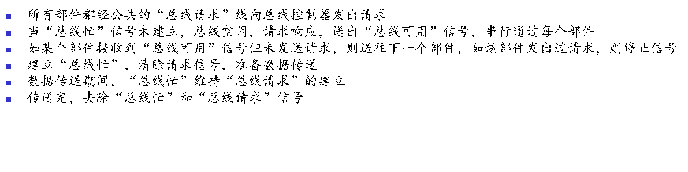
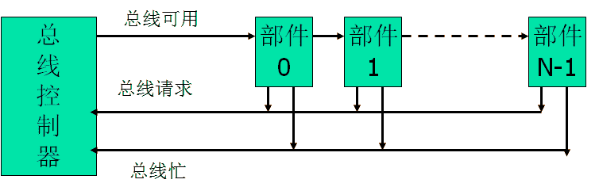
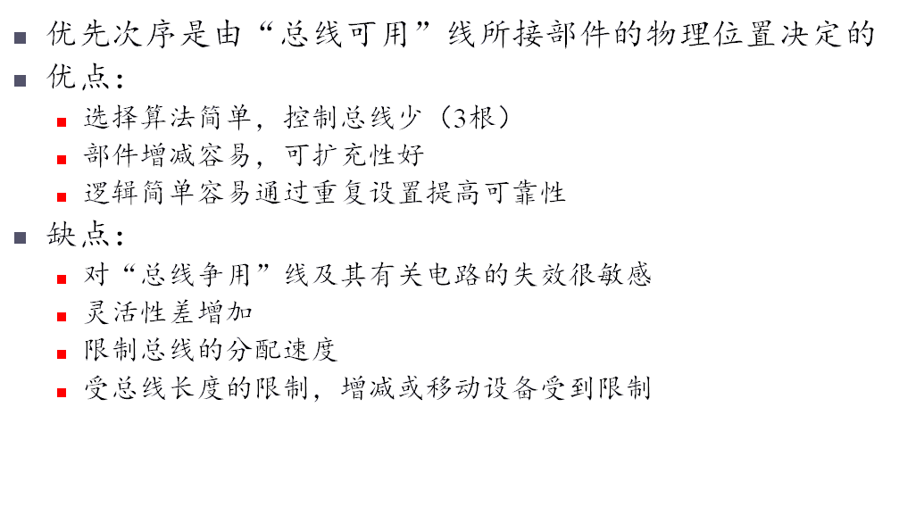
二、集中式定时查询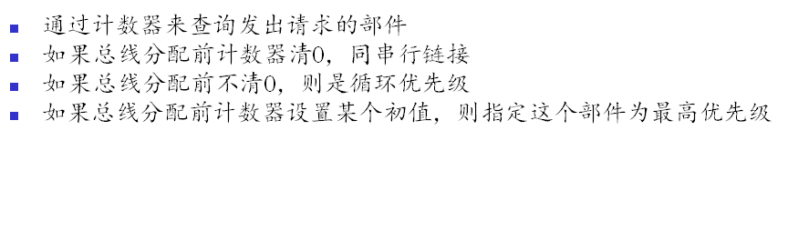
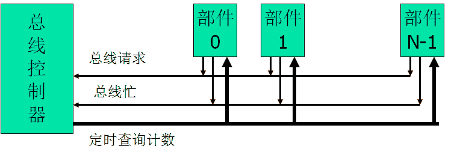
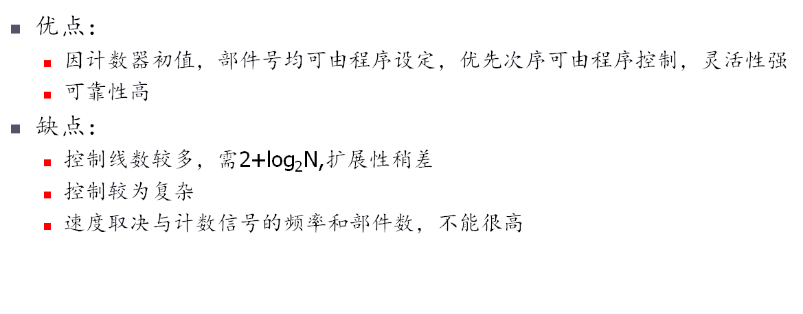
三、集中式独立请求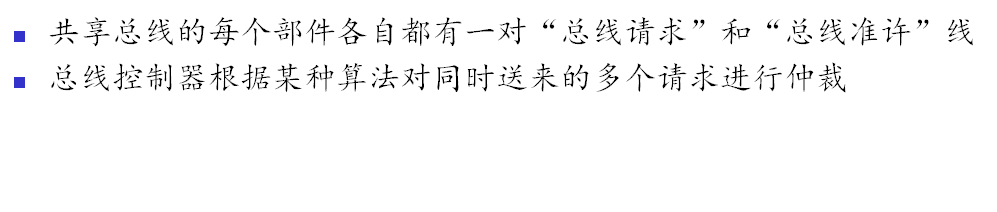
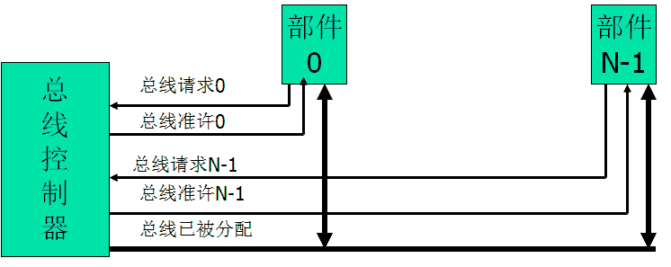
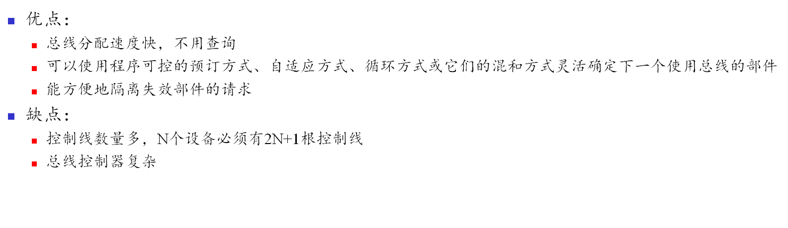

发表于 2016-11-29 16:49:57

* * *

[简单的快乐](https://www.nowcoder.com/profile/522729)

京东软开咋考这种题目。。。

发表于 2016-09-03 10:58:23

* * *

## 3

下面关于 GFS 集群的叙述中,正确是()

正确答案: C   你的答案: 空 (错误)

```cpp
GFS 所有的元数据都存放在 chunkserver 上
```

```cpp
GFS 所有的元数据都是放在硬盘上的
```

```cpp
一个 GFS 集群由一个 master 和大量 chunkserver 构成
```

```cpp
其他选项均不正确
```

本题知识点

分布式 C++工程师 Java 工程师 京东 2016

讨论

[竹枕溪](https://www.nowcoder.com/profile/408297)

GFS:分布式文件系统。Master 是 GFS 的管理节点，在逻辑上只有一个，它保存系统的元数据，负责整个文件系统的管理，是 GFS 文件系统中的“大脑”。Chunk Server 负责具体的存储工作。数据以文件的形式存储在 Chunk Server 上，Chunk Server 的个数可以有多个，它的数目直接决定了 GFS 的规模。GFS 将文件按照固定大小进行分块，每一块称为一个 Chunk（数据 块），每个 Chunk 都有一个对应的索引号（Index）。Master 管理了分布式文件系统中的所有元数据。文件划分为 Chunk 进行存储，对于 Master 来说，每个 Chunk Server 只是一个存储空间。

发表于 2015-11-22 21:16:26

* * *

[想奔跑的蜗牛](https://www.nowcoder.com/profile/300042)

不是应该选 D 吗，C 中没有包含客户端，不是吗？

发表于 2016-09-05 17:56:39

* * *

[牛客 5235719 号](https://www.nowcoder.com/profile/5235719)

元数据是存放在内存上的

发表于 2016-09-05 17:34:51

* * *

## 4

下列 main()函数执行后的结果为()

```cpp
int func(){ 
	int i, j, k = 0;
	for(i = 0, j =- 1;j = 0;i++, j++){
		k++;
	}
	return k;
}
int main(){
 	cout << (func());
 	return 0;
}
```

正确答案: B   你的答案: 空 (错误)

```cpp
-1
```

```cpp
0
```

```cpp
1
```

```cpp
2
```

本题知识点

C++ C 语言 C++工程师 Java 工程师 京东 2016

讨论

[竹枕溪](https://www.nowcoder.com/profile/408297)

对于 for(；；)循环体，中间的表达式一般是个判定条件，返回布尔型，表达式 j=0,对于 int,除了 0 以外的所有都是 true,如 if(1)之类的，
所以这里返回 false，循环体一次都不执行

发表于 2015-11-22 21:23:10

* * *

[三江小渡](https://www.nowcoder.com/profile/579554)

表达式是有返回值的，对于：j=0，返回值就是 0；所以不会执行循环

发表于 2015-11-20 22:53:57

* * *

[yelin](https://www.nowcoder.com/profile/4962194)

**for(a；b；c）**
//1、 当执行到 for 循环时，a 部分语句会且**只会执行一次** ，相当于进行一次初始化。

//2、b 部分为 **循环判定条件** ，true 则执行，在**执行循环体内之前**进行的条件判断。

// 3、C 部分：执行一次循环后，再进行下一次条件判断也就是 b 部分的时候会执行 c 部分。 本题关键在考察**逗号表达式**以及**for 循环执行条件**，仔细一点可以看清本质的。 备注：逗号表达式相关知识以及 for 循环其他相关知识不太清楚的同学请百度，Google。

编辑于 2017-03-29 16:38:43

* * *

## 5

浮点数尾数基值 rm=8,尾数长度为 6,则可表示规格化正尾数的个数为多少个()

正确答案: B   你的答案: 空 (错误)

```cpp
63
```

```cpp
56
```

```cpp
84
```

```cpp
64
```

本题知识点

编程基础 *C++工程师 Java 工程师 京东 2016* *讨论

[牛客 231810 号](https://www.nowcoder.com/profile/231810)

```cpp
浮点数尾数基值 rm=8,尾数长度为 6，规格化正尾数时，前三位（2³）不能全为零。故 2⁶-2³=56
```

发表于 2016-04-10 15:28:34

* * *

[leobuzhi](https://www.nowcoder.com/profile/932073)

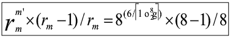8²*（8-1）/8=56

发表于 2016-02-09 20:31:43

* * *

[LEarBB](https://www.nowcoder.com/profile/708350)

参考：
[`max.book118.com/html/2012/0322/1369583.shtm`](http://max.book118.com/html/2012/0322/1369583.shtm)   可以从第 12 页 PPT 开始看
http://www.doc88.com/p-350263283064.html                  这里有个原题 有公式计算。

发表于 2015-12-06 23:37:53

* * *

## 6

分布式事务处理的特性包括哪些()

正确答案: A B C D   你的答案: 空 (错误)

```cpp
持久性
```

```cpp
隔离性
```

```cpp
原子性
```

```cpp
一致性
```

本题知识点

数据库 C++工程师 Java 工程师 京东 2016

讨论

[小虎牙](https://www.nowcoder.com/profile/512935)

事务四大特性(简称 ACID) 

1、原子性(Atomicity)：事务中的全部操作在数据库中是不可分割的，要么全部完成，要么均不执行。

2、一致性(Consistency)：几个并行执行的事务，其执行结果必须与按某一顺序串行执行的结果相一致。

3、隔离性(Isolation)：事务的执行不受其他事务的干扰，事务执行的中间结果对其他事务必须是透明的。

4、持久性(Durability)：对于任意已提交事务，系统必须保证该事务对数据库的改变不被丢失，即使数据库出现故障。     

发表于 2015-11-20 09:40:34

* * *

[Uhey](https://www.nowcoder.com/profile/259845)

ACID

发表于 2016-01-20 16:22:17

* * *

## 7

以下几种模型方法属于判别式模型的有

> 1)混合高斯模型 2)条件随机场模型 3)区分度训练 4)隐马尔科夫模型

正确答案: C   你的答案: 空 (错误)

```cpp
1,4
```

```cpp
3,4
```

```cpp
2,3
```

```cpp
1,2
```

本题知识点

机器学习 C++工程师 Java 工程师 京东 2016

讨论

[小虎牙](https://www.nowcoder.com/profile/512935)

判别式模型与生成式模型的区别 

产生式模型(Generative Model)与判别式模型(Discrimitive Model)是分类器常遇到的概念，它们的区别在于：

对于输入 x，类别标签 y：
产生式模型估计它们的联合概率分布 P(x,y)
判别式模型估计条件概率分布 P(y|x)

产生式模型可以根据贝叶斯公式得到判别式模型，但反过来不行。

Andrew Ng 在 NIPS2001 年有一篇专门比较判别模型和产生式模型的文章：
On Discrimitive vs. Generative classifiers: A comparision of logistic regression and naive Bayes 

([`robotics.stanford.edu/~ang/papers/nips01-discriminativegenerative.pdf`](http://robotics.stanford.edu/~ang/papers/nips01-discriminativegenerative.pdf))

判别式模型常见的主要有：

Logistic Regression

SVM

Traditional Neural Networks

Nearest Neighbor

CRF

Linear Discriminant Analysis

Boosting

Linear Regression

产生式模型常见的主要有：

       Gaussians

Naive Bayes 

       Mixtures of Multinomials

       Mixtures of Gaussians

       Mixtures of Experts

       HMMs

Sigmoidal Belief Networks, Bayesian Networks

Markov Random Fields

Latent Dirichlet Allocation

发表于 2015-11-20 09:41:03

* * *

[我是雷蒙德](https://www.nowcoder.com/profile/859118326)

公式上看

生成模型： 学习时先得到 P(x,y)，继而得到 P(y|x)。预测时应用最大后验概率法（MAP）得到预测类别 y。 判别模型： 直接学习得到 P(y|x)，利用 MAP 得到 y。或者直接学得一个映射函数 y=f(x)。

直观上看

生成模型： 关注数据是如何生成的 
判别模型： 关注类别之间的差别

借用一下[这位老兄](https://blog.csdn.net/zouxy09/article/details/8195017)的例子：

假如你的任务是识别一个语音属于哪种语言。例如对面一个人走过来，和你说了一句话，你需要识别出她说的到底是汉语、英语还是法语等。那么你可以有两种方法达到这个目的：

1.  学习每一种语言，你花了大量精力把汉语、英语和法语等都学会了，我指的学会是你知道什么样的语音对应什么样的语言。然后再有人过来对你说，你就可以知道他说的是什么语音.
2.  不去学习每一种语言，你只学习这些语言之间的差别，然后再判断（分类）。意思是指我学会了汉语和英语等语言的发音是有差别的，我学会这种差别就好了。

那么第一种方法就是生成方法，第二种方法是判别方法。

具体可以参考这个：[`blog.csdn.net/qq_20011607/article/details/81744614`](https://blog.csdn.net/qq_20011607/article/details/81744614)

编辑于 2018-08-16 20:10:34

* * *

[牛客 1124449 号](https://www.nowcoder.com/profile/1124449)

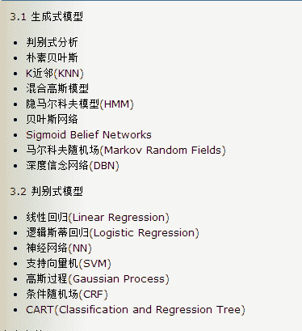

发表于 2017-09-02 14:25:57

* * *

## 8

一进程刚获得 3 个主存块的使用权,若该进程访问页面的次序是 1,2,3,4,1,2,5,1,2,3,4,5.当采用 LRU 算法时,发生的缺页此次数是()

正确答案: B   你的答案: 空 (错误)

```cpp
9
```

```cpp
10
```

```cpp
11
```

```cpp
12
```

本题知识点

编译和体系结构 C++工程师 Java 工程师 京东 2016 操作系统

讨论

[三江小渡](https://www.nowcoder.com/profile/579554)

LRU：淘汰上次使用距当前最  查看全部)

编辑于 2016-08-01 08:58:03

* * *

[牛客 352906 号](https://www.nowcoder.com/profile/352906)

| 访问页号顺序 | 1 | 2 | 3 | 4 | 1 | 2 | 5 | 1 | 2 | 3 | 4 | 5 |
| 第三个内存页 |   |   | 3 | 4 | 1 | 2 | 5 | 1 | 2 | 3 | 4 | 5 |
| 第二个内存页  |   | 2 | 2 | 3 | 4 | 1 | 2 | 5 | 1 | 2 | 3 | 4 |
| 第一个内存页 | 1 | 1 | 1 | 2 | 3 | 4 | 1 | 2 | 5 | 1 | 2 | 3 |
| 是否缺页中断 | × | × | × | × | × | × | × | √ | √ | × | × | × |

发表于 2016-09-03 00:58:44

* * *

[LoftWhale](https://www.nowcoder.com/profile/448316)

楼上的回答（牛客 579554 号），我想问最后一个访问页面 5 的时候，主存的序号应该是 543，这里写的是 542，不知道何故？还是我理解错了，求解答？我觉得应该把 2 号页换出去，而不是把 3 号页换出去。

发表于 2015-12-16 10:38:28

* * *

## 9

```cpp
ClassA *pclassa=new ClassA[5];
delete pclassa;
```

c++语言中，类 ClassA 的构造函数和析构函数的执行次数分别为()

正确答案: A   你的答案: 空 (错误)

```cpp
5,1
```

```cpp
1,1
```

```cpp
5,5
```

```cpp
1,5
```

本题知识点

C++ C++工程师 Java 工程师 京东 2016

讨论

[zt_xcyk](https://www.nowcoder.com/profile/839070)

AClass A *  查看全部)

编辑于 2015-12-07 13:45:02

* * *

[成长](https://www.nowcoder.com/profile/965462)

这边考察 delete 和 delete[] 的区别。delete 和 delete[]都能释放指针所指向的内存区域。但 delete 只会调用一次析构函数，而 delete[]还会调用后续所有对象的析构函数。当数据类型为基本数据类型时，用 delete 和 delete[]都可以，因为基本数据类型没有析构函数。

发表于 2016-06-01 14:45:46

* * *

[LEarBB](https://www.nowcoder.com/profile/708350)

构造函数很明显 5 次。析构时 区别 delete 和 delete[]

发表于 2015-12-06 23:39:48

* * *

## 10

大整数 845678992357836701 转化成 16 进制表示,最后两位字符是?

正确答案: D   你的答案: 空 (错误)

```cpp
AB
```

```cpp
EF
```

```cpp
8B
```

```cpp
9D
```

本题知识点

编程基础 *C++工程师 Java 工程师 京东 2016* *讨论

[牛客 808408 号](https://www.nowcoder.com/profile/808408)

利用同余关系做。845678992357836701 除以 4 余数为 1( 845678992357836700 能被 4 整除 )，在 16 进制数中，决定除以 4 后余数的只有最后一位（前面位都是 16 的倍数，自然被 4 整除），算算也只有 D（13）除以 4 余 1，所以选 D.

编辑于 2016-03-05 23:00:34

* * *

[挥着牛鞭的男孩](https://www.nowcoder.com/profile/825762)

我来给你们解答:先把此数搞成二进制的(当然不用全算。。。。)，它要 16 进制最后两位，也就是二进制最后八位。那么最后八位怎么求？很简单，除二取余。这样从后往前写就是 10111001。。。。二进制嘛，倒着写，最后两位位应该是 10011101.化成 16 进制，就是 9D 喽。。。。。

发表于 2015-11-20 09:30:08

* * *

[牛客 554361 号](https://www.nowcoder.com/profile/554361)

16 乘以 1 到 9，分别是【16，32，48，64，80，96，112，128，144】 ，
从高位开始：8 不瞒足 16 的倍数；在取一位得到 84，84-80=4；
                     4 在往前取一位得到 45，45-32=13；
                     13 往前取一位得到 136，136-128=8；
                      。。。。。。
                      一直取到最后一位得到 61，61-48=13；
                     13 对应 16 进制的 D，所以答案是 9D。

还望高手来解答 ^_^

发表于 2015-11-19 23:26:10

* * *

## 11

下面程序输出是什么

```cpp
int main()
{
	bool first=true;
	int sum=0;
	int value;
	unsigned short i=0xFFFF;
	for (;i>=0;--i)
	{
		if (first)
		{
			value=65536;
			sum+=value%3;
			first=false;
		}
		else{
			sum+=--value%3;
			if (value<=0)
			{
				cout<<sum<<","<<i;
				break;
			}
		}
	}
	return 0;
}
```

正确答案: E   你的答案: 空 (错误)

```cpp
1,65535
```

```cpp
65535,65535
```

```cpp
65535,65536
```

```cpp
65535,1
```

```cpp
65536,65535
```

本题知识点

C++ C++工程师 Java 工程师 京东 2016

讨论

[小洁子](https://www.nowcoder.com/profile/549519)

True 只经历一次， i＝6  查看全部)

编辑于 2016-04-25 23:32:37

* * *

[斑鸠 91](https://www.nowcoder.com/profile/933871)

看到推荐解析算 sum 好复杂，其实 sum 就是 value 从 65536 减到 1 每次%3，而 65536%3=1，65535%3=0，65534%3=2.。。。余数一直是 102，102 这样出现的，因为是对 3 取模嘛。那么相加起来就把 1+0+2 看成是 1+1+1，更好理解，结果一样， 最后一次 1%3=1。所以 value 从 65536 到 1 是执行了 65536 次，余数加起来就是 65536 个 1 相加，sum 等于 65536.

发表于 2016-09-03 10:41:55

* * *

[ﺭ并偷偷用脚摸了摸你的小脸ﺭ朱](https://www.nowcoder.com/profile/5869632)

做题的话，只需要知道 sum 比 i 大 1

发表于 2017-04-02 09:52:32

* * *

## 12

java 中 String str = "hello world"下列语句错误的是？

正确答案: A B C   你的答案: 空 (错误)

```cpp
str+='      a'
```

```cpp
int strlen = str.length
```

```cpp
str=100
```

```cpp
str=str+100
```

本题知识点

Java Java 工程师 2016

讨论

[月露凝尘](https://www.nowcoder.com/profile/957040)

str += 'a'   和 str +="a"都是对的，但是如果 a 前面加一个空格，那么只能用双引号了。代表字符串

发表于 2015-12-10 15:15:44

* * *

[ToTop](https://www.nowcoder.com/profile/9094735)

数组有 length 属性，字符串只有 length()方法

发表于 2016-10-03 17:40:30

* * *

[奔跑的威威](https://www.nowcoder.com/profile/864907)

ABC 在 java 中会报错，D 可以正常运行, 所以答案是 ABC.A. 'a'是字符,' a'这个是空格和 a，必须要用" a"才可以;B.String 有 length()方法 C.int 无法直接转成 String 类型 D.尾部添加字符串”100“

编辑于 2016-03-11 22:48:25

* * ***