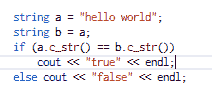
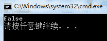

# 搜狗 2016 研发工程师笔试题（二）

## 1

已知 i 为整数，d(i)表示 i 的正约数的和，已知 10000 除以 1 到 10000 所有整数的余数和为 17743986，求 1<=i<=10000 范围内所有 d(i)的和的末 4 位。

正确答案: C   你的答案: 空 (错误)

```cpp
1774
```

```cpp
3986
```

```cpp
6014
```

```cpp
8225
```

本题知识点

数学运算

讨论

[Norman FENG](https://www.nowcoder.com/profile/2283997)

列公式容易花眼，看一个具体的数字便可明白。看 3000 这个数被当做约数加了多少次。3000 * 1 = 30003000 * 2 = 60003000 * 3 = 9000 所以 3000 被加了三次，和为 3000*3=900010000 除以 3000 的余数是 1000，这个 1000 便是 10000 - 3000 * 3 所以 10000 % x = 10000 - x 被作为约数相加的总和让 x 从 1 遍历到 10000，把这 1000 个式子相加，结果为 17743986 = 100000000 - 所有 d(i)的和所以 所有 d(i)的和 =  100000000 -  17743986  

发表于 2016-09-04 01:05:09

* * *

[理工废柴](https://www.nowcoder.com/profile/815649)

    鄙人才疏，无法用严谨的数学表达来回答，姑且算是凑出来的吧，答案是 C。
    由题得  10000 = (10000 / x) *x +10000%x (1 ≤ x ≤ 10000), 这里遵从编程里的整数除法运算。
    故而 10000² - 17743986 = ∑ (10000 / x) *x
    我们再看 ∑ d(i) = d(1)+d(2)+......d(10000) = 1*n1+2*n2+3*n3+......10000*n. 这里解释一下，1~10000 约数之和的和可以看做是每一个约数×它在所有被除数中出现的次数。现在我们只要证明 n=10000 / x 就可以了。显然，对于任意正整数 x<10000,它的小于 10000 的倍数的个数有 10000 / x 个（这里还是整数除法运算），换言之，它在被除数中出现的次数就是 10000 / x，故而 ∑ d(i)=10000² - 17743986，答案是 C。
    还有问题欢迎回复。

编辑于 2015-11-23 22:24:12

* * *

[靠搬砖致富的包工头](https://www.nowcoder.com/profile/779986)

N = (N / x) *x +N%x (1 ≤ x ≤ N，<N<10000)； ∑N= ∑（ (N / x) *x） + ∑（ N%x  ）；∑（ N%x  ）= 17743986 ；∑N=10000*10000=100000000；∑（ (N / x) *x）=100000000-17743986=82266014

编辑于 2016-05-02 19:50:48

* * *

## 2

在区间[-2,2]里任取 2 个实数，它们的平方和>1 的概率是大约是()

正确答案: B   你的答案: 空 (错误)

```cpp
84%
```

```cpp
80%
```

```cpp
65%
```

```cpp
57%
```

本题知识点

概率统计 *Java 工程师 C++工程师 运维工程师 前端工程师 算法工程师 PHP 工程师 搜狗 概率论与数理统计* *讨论

[那孩](https://www.nowcoder.com/profile/588443)

该区间内任意取两个数就相当于  查看全部)

编辑于 2016-01-20 10:51:18

* * *

[zhisheng_blog](https://www.nowcoder.com/profile/616717)

楼上解释的非常不错

发表于 2016-01-19 16:25:29

* * *

[DiuDiuWang](https://www.nowcoder.com/profile/787250662)

学会用几何的方法解答概率问题

发表于 2020-01-14 10:33:28

* * *

## 3

关于代码输出正确的结果是()（Linux g++ 环境下编译运行）

```cpp
int main(int argc, char *argv[])
{
	string a="hello world";
	string b=a;
	if (a.c_str()==b.c_str())
	{
		cout<<"true"<<endl;
	}
	else cout<<"false"<<endl;
	string c=b;
	c="";
	if (a.c_str()==b.c_str())
	{
		cout<<"true"<<endl;
	}
	else cout<<"false"<<endl;
	a="";
	if (a.c_str()==b.c_str())
	{
		cout<<"true"<<endl;
	}
	else cout<<"false"<<endl;
	return 0;
}
```

正确答案: D   你的答案: 空 (错误)

```cpp
false false false
```

```cpp
true false false
```

```cpp
true true true
```

```cpp
true true false
```

本题知识点

C++ Java 工程师 C++工程师 运维工程师 前端工程师 算法工程师 PHP 工程师 搜狗

讨论

[searchcoding](https://www.nowcoder.com/profile/967)

C++ string 实现版本不同，如果实现时编译器使用了引用计数方法，COW 。string b="test"string a=b;通过赋值的方式，a 和 b 指向的是同一块内存，字符串"test"的引用计数加 1 变成 2，a="",a 指向另外内存，”test“引用减一变为 1，看情形，猜测 gcc 使用了类似方法，vs 没有。Visual C++(2010)和 clang libc++却不约而同抛弃了 COW，选择了 SSO（small string optimization，足够小的字符串直接放在对象本身的栈内存中，避免了向 Heap 动态请求内存的开销

编辑于 2015-12-18 10:42:51

* * *

[ContinueZ](https://www.nowcoder.com/profile/425432)

答案应该是 A.false false false 程序：
输出：
理由如下：1.c_str()返回值是 const char*，返回一个指向正规 C 字符串的指针；2.string b=a 是 C++中 string 类的赋值操作，b 会开辟一个与 a 同等长度的内存空间，把 a 的字符串拷贝到 b 的内存空间中；所以 if(a.c_str()==b.c_str())比较的是 2 个 const char*，很显然是不等的。

编辑于 2016-04-19 20:21:01

* * *

[scanf_cin](https://www.nowcoder.com/profile/377724)

答案选 d，在 Linux g++ 环境下编译运行，得到结果为 true true false。理由是三个 if 条件判断的都是 a，b 两个指针的值是否相同。程序开始将 a，b 都指向了同一个字符串地址，这时两个指针的值相同，所以第一个输出 true。接着程序将 c 指向了 b，又将 c 指向了一个空字符串。但是对 a，b 并没有影响，所以第二个输出还是 true。然后程序将 a 指向了一个空字符串空间，这时的 a 指针已经发生了变化，指向的不再是原来的“hello world ”而是新的一块空间。因此这时的 a，b 指针的值不相等。这时输出 false。所以答案选 d，true true false

编辑于 2016-06-22 19:04:05

* * *

## 4

一班只在上午有课，二班只在下午有课，同学 A 某天下午要上课，则以下说法正确的是？

正确答案: D   你的答案: 空 (错误)

```cpp
A 不是二班的
```

```cpp
A 是一班的
```

```cpp
A 是二班的
```

```cpp
A 不是一班的
```

本题知识点

判断推理

讨论

[麦兜逗斗](https://www.nowcoder.com/profile/901197)

一班的人一定是而且必须是上午上课，而这货下午上课，肯定不是一班的，但是可能是别班的，不一定是二班

发表于 2016-03-21 15:58:53

* * *

[zhisheng_blog](https://www.nowcoder.com/profile/616717)

D 一定是对的

发表于 2016-01-19 16:26:18

* * *

[dnj123456789](https://www.nowcoder.com/profile/862105)

本道题可以确定的是：不是一班的;是不是二班的不能确定

发表于 2015-11-24 23:04:38

* * *

## 5

以下说法中正确的是()

正确答案: B D   你的答案: 空 (错误)

```cpp
SVM 对噪声(如来自其他分布的噪声样本)鲁棒
```

```cpp
在 AdaBoost 算法中,所有被分错的样本的权重更新比例相同
```

```cpp
Boosting 和 Bagging 都是组合多个分类器投票的方法,二者都是根据单个分类器的正确率决定其权重
```

```cpp
给定 n 个数据点,如果其中一半用于训练,一般用于测试,则训练误差和测试误差之间的差别会随着 n 的增加而减少
```

本题知识点

机器学习 Java 工程师 C++工程师 运维工程师 前端工程师 算法工程师 PHP 工程师 搜狗

讨论

[牛客 128972 号](https://www.nowcoder.com/profile/128972)

A. SVM 并不是对噪声鲁棒的，soft-margin 就是针对数据集中存在一些特异点，引入松弛变量得出的。所以当来自其它分布的噪声较多时，将不再鲁棒；B. 被分错的样本权证增加的比例是相同的，题目中并没有说权重是相同的（读错题了。。）；C. Bagging 中每个基分类器的权重都是相同的；

*   Adaboost 与 Bagging 的区别：
*   采样方式：Adaboost 是错误分类的样本的权重较大实际是每个样本都会使用；Bagging 采用有放回的随机采样； 
*   基分类器的权重系数：Adaboost 中错误率较低的分类器权重较大；Bagging 中采用投票法，所以每个基分类器的权重系数都是一样的。
*   Bias-variance 权衡：Adaboost 更加关注 bias，即总分类器的拟合能力更好；Bagging 更加关注 variance，即总分类器对数据扰动的承受能力更强。

D. 显而易见是是正确的啊。

编辑于 2016-08-10 11:41:55

* * *

[airWendy](https://www.nowcoder.com/profile/351267)

1、SVM 对噪声（如来自其他分布的噪声样本）鲁棒 SVM 本身对噪声具有一定的鲁棒性，但实验证明，是当噪声率低于一定水平的噪声对 SVM 没有太大影响，但随着噪声率的不断增加，分类器的识别率会降低。2、在 AdaBoost 算法中所有被分错的样本的权重更新比例相同 AdaBoost 算法中不同的训练集是通过调整每个样本对应的权重来实现的。开始时，每个样本对应的权重是相同的，即其中 n 为样本个数，在此样本分布下训练出一弱分类器。对于分类错误的样本，加大其对应的权重；而对于分类正确的样本，降低其权重，这样分错的样本就被凸显出来，从而得到一个新的样本分布。在新的样本分布下，再次对样本进行训练，得到弱分类器。以此类推，将所有的弱分类器重叠加起来，得到强分类器。3、Boost 和 Bagging 都是组合多个分类器投票的方法，二者均是根据单个分类器的正确率决定其权重。Bagging 与 Boosting 的区别：取样方式不同。Bagging 采用均匀取样，而 Boosting 根据错误率取样。Bagging 的各个预测函数没有权重，而 Boosting 是由权重的，Bagging 的各个预测函数可以并行生成，而 Boosing 的哥哥预测函数只能顺序生成。以上答案参考 http://www.cnblogs.com/Miranda-lym/p/5194922.html

发表于 2016-03-05 13:04:19

* * *

[kiss90](https://www.nowcoder.com/profile/590177)

```cpp
/*Adaboost 的目的是从训练数据中学习一系列弱分类器，然后将其按一定权重累加起来得到强分类器。
刚开始每个样本对应的权重是相等的，在此样本分布下训练一个基本分类器 c1.对于 c1 错分的样本增加其权重，
对正确分类的样本降低其权重。这样使得错分的样本突出出来，并得到一个新的样本分布。
同时根据分类情况赋予 c1 一个权重，表示其重要程度，分类正确率越高权重越大。
然后在新的样本分布下对分类器进行训练，得到 c2 及其权重。依此类推，得到 M 个基本分类器及其权重。
将这些弱分类器按照权重累加起来就是所期望的强分类器。（B 对）
//Bagging 是对训练样本多次抽样训练多个分类器，然后对测试集进行投票所得到的优胜结果就是最终的分类结果。
在投票时每个分类器的权重是相等的。（所以 C 错）
*/
```

编辑于 2016-07-12 15:17:51

* * *

## 6

以下计算斐波那契数列的函数时间复杂度为()

```cpp
int Fibonacci(int n)
{
   if(n==0)
     return 0;
   else if(n==1)
     return 1;
   else
     return Fibonacci(n-1)+Fibonacci(n-2)
}
```

正确答案: D   你的答案: 空 (错误)

```cpp
O(nlogn)
```

```cpp
O(n²)
```

```cpp
O(n)
```

```cpp
O(2^n)
```

本题知识点

复杂度

讨论

[huixieqingchun](https://www.nowcoder.com/profile/551201)

**这种递归可以看成是是一棵二叉树，题目相当于是求二叉树中的总结点个数。**

发表于 2016-06-05 17:39:21

* * *

[LZY019](https://www.nowcoder.com/profile/361190)

                   f(10)
                 /              \
              f(9)                 f(8)
            /         \             /       \
          f(8)       f(7)   f(7)      f(6)
       /    \      /     \    f(7)  f(6)  f(6) f(5)我们不难发现在这棵树中有很多结点会重复的，而且重复的结点数会随着 n 的增大而急剧增加。这意味这计算量会随着 n 的增大而急剧增大。事实上，用递归方法计算的时间复杂度是以 n 的指数的方式递增的。大家可以求 Fibonacci 的第 100 项试试，感受一下这样递归会慢到什么程度。在我的机器上，连续运行了一个多小时也没有出来结果。

发表于 2016-02-29 12:21:53

* * *

[zhisheng_blog](https://www.nowcoder.com/profile/616717)

复杂度是 O(2^n)

发表于 2016-01-19 16:27:03

* * *

## 7

有三个线程 T1,T2,T3,下面方法可以确保它们按顺序执行的有()该线程继续执行

正确答案: A B C   你的答案: 空 (错误)

```cpp
先启动最后一个(T3 调用 T2,T2 调用 T1)
```

```cpp
可以用线程类的 join()方法在一个线程中启动另一个线程,另一个线程完成
```

```cpp
先启动第一个(T3 调用 T2,T2 调用 T1)
```

```cpp
以上选项说法都不正确
```

本题知识点

并发 Java 工程师 C++工程师 运维工程师 前端工程师 算法工程师 PHP 工程师 搜狗

讨论

[过往云烟 123](https://www.nowcoder.com/profile/983664)

```cpp
应该选 ABC.亲测！！！！
实际上先启动三个线程中哪一个都行，
因为在每个线程的 run 方法中用 join 方法限定了三个线程的执行顺序。
即便是第二个线程先启动执行了，由于 t1.join()方法，
使得线程 2 需要等待线程 1 运行结束后才能继续运行。
所以三个线程的启动顺序无关紧要！！！

public class JoinTest2 {

	// 1.现在有 T1、T2、T3 三个线程，你怎样保证 T2 在 T1 执行完后执行，T3 在 T2 执行完后执行

	public static void main(String[] args) {

		final Thread t1 = new Thread(new Runnable() {

			@Override
			public void run() {
				System.out.println("t1");
			}
		});
		final Thread t2 = new Thread(new Runnable() {

			@Override
			public void run() {
				try {
					// 引用 t1 线程，等待 t1 线程执行完
					t1.join();
				} catch (InterruptedException e) {
					e.printStackTrace();
				}
				System.out.println("t2");
			}
		});
		Thread t3 = new Thread(new Runnable() {

			@Override
			public void run() {
				try {
					// 引用 t2 线程，等待 t2 线程执行完
					t2.join();
				} catch (InterruptedException e) {
					e.printStackTrace();
				}
				System.out.println("t3");
			}
		});
		t3.start();//这里三个线程的启动顺序可以任意，大家可以试下！
		t2.start();
		t1.start();
	}
}

```

编辑于 2017-05-03 16:07:48

* * *

[Sean 星](https://www.nowcoder.com/profile/8672806)

感觉只有 B 对，AC 没有说具体调用什么方法，同意的扣 1，join 方法的用法是如果主线程需要用到子线程的处理结果，主线程需要子线程调用结束后再结束，就需要用到 join，在主线程 join 代码之后，会等到子线程结束后，再执行 join 之后的代码

编辑于 2020-06-05 08:16:59

* * *

[zhisheng_blog](https://www.nowcoder.com/profile/616717)

选 bc

发表于 2016-01-19 16:27:38

* * *

## 8

下面关于 synflood 攻击的说法,错误的是()

正确答案: B   你的答案: 空 (错误)

```cpp
服务端由于连接队列被占满而不能对外服务
```

```cpp
不但能攻击 TCP 服务,还可以攻击 UDP 服务
```

```cpp
大量连接处于 SYN_RECV 状态
```

```cpp
使用硬件防火墙可以一定程度上抵御攻击
```

本题知识点

网络基础 Java 工程师 C++工程师 运维工程师 前端工程师 算法工程师 PHP 工程师 搜狗

讨论

[小虎牙](https://www.nowcoder.com/profile/512935)

要明白这种攻击的基本原理，还是要从 TCP 连接建立的过程开始说起：大家都知道，TCP 与 UDP 不同，它是基于连接的，也就是说：为了在[服务端](http://baike.baidu.com/view/1087294.htm)和客户端之间传送 TCP 数据，必须先建立一个[虚拟电路](http://baike.baidu.com/view/65717.htm)，也就是 TCP 连接，建立 TCP 连接的标准过程是这样的：首先，请求端（客户端）发送一个包含 SYN 标志的 TCP 报文，SYN 即同步（Synchronize），同步报文会指明客户端使用的端口以及 TCP 连接的初始序号；第二步，服务器在收到客户端的 SYN[报文](http://baike.baidu.com/view/175122.htm)后，将返回一个 SYN+ACK 的报文，表示客户端的请求被接受，同时 TCP 序号被加一，ACK 即确认（Acknowledgment）。第三步，客户端也返回一个确认报文 ACK 给服务器端，同样 TCP 序列号被加一，到此一个 TCP 连接完成。以上的连接过程在 TCP 协议中被称为[三次握手](http://baike.baidu.com/view/1003841.htm)（Three-way Handshake）。问题就出在 TCP 连接的三次握手中，假设一个用户向服务器发送了 SYN[报文](http://baike.baidu.com/view/175122.htm)后突然死机或掉线，那么服务器在发出 SYN+ACK 应答报文后是无法收到客户端的 ACK 报文的（第三次握手无法完成），这种情况下服务器端一般会重试（再次发送 SYN+ACK 给客户端）并等待一段时间后丢弃这个未完成的连接，这段时间的长度我们称为 SYN Timeout，一般来说这个时间是分钟的数量级（大约为 30 秒-2 分钟）；一个用户出现异常导致服务器的一个线程等待 1 分钟并不是什么很大的问题，但如果有一个恶意的攻击者大量模拟这种情况，服务器端将为了维护一个非常大的半连接列表而消耗非常多的资源----数以万计的半连接，即使是简单的保存并遍历也会消耗非常多的 CPU 时间和内存，何况还要不断对这个列表中的 IP 进行 SYN+ACK 的重试。实际上如果服务器的 TCP/IP 栈不够强大，最后的结果往往是堆栈溢出崩溃---即使服务器端的系统足够强大，服务器端也将忙于处理攻击者伪造的 TCP 连接请求而无暇理睬客户的正常请求（毕竟客户端的正常请求比率非常之小），此时从正常客户的角度看来，服务器失去响应，这种情况我们称作：服务器端受到了 SYN Flood 攻击（SYN[洪水攻击](http://baike.baidu.com/view/3277089.htm)）。

发表于 2015-11-24 09:10:26

* * *

[我是真的菜得 1P](https://www.nowcoder.com/profile/81461441)

这是明显的 TCP 系列问题。【问题 1】为什么连接的时候是三次握手，关闭的时候却是四次握手？答：因为当 Server 端收到 Client 端的 SYN 连接请求报文后，可以直接发送 SYN+ACK 报文。其中 ACK 报文是用来应答的，SYN 报文是用来同步的。但是关闭连接时，当 Server 端收到 FIN 报文时，很可能并不会立即关闭 SOCKET，所以只能先回复一个 ACK 报文，告诉 Client 端，"你发的 FIN 报文我收到了"。只有等到我 Server 端所有的报文都发送完了，我才能发送 FIN 报文，因此不能一起发送。故需要四步握手。【问题 2】为什么 TIME_WAIT 状态需要经过 2MSL(最大报文段生存时间)才能返回到 CLOSE 状态？首先补充：MSL 是 TCP 报文里面最大生存时间，它是任何报文段被丢弃前在网络内的最长时间。答：虽然按道理，四个报文都发送完毕，我们可以直接进入 CLOSE 状态了，但是我们必须假象网络是不可靠的，有可以最后一个 ACK 丢失。所以 TIME_WAIT 状态就是用来重发可能丢失的 ACK 报文。在 Client 发送出最后的 ACK 回复，但该 ACK 可能丢失。Server 如果没有收到 ACK，将不断重复发送 FIN 片段。所以 Client 不能立即关闭，它必须确认 Server 接收到了该 ACK。Client 会在发送出 ACK 之后进入到 TIME_WAIT 状态。Client 会设置一个计时器，等待 2MSL 的时间。如果在该时间内再次收到 FIN，那么 Client 会重发 ACK 并再次等待 2MSL。所谓的 2MSL 是两倍的 MSL(Maximum Segment Lifetime)。MSL 指一个片段在网络中最大的存活时间，2MSL 就是一个发送和一个回复所需的最大时间。如果直到 2MSL，Client 都没有再次收到 FIN，那么 Client 推断 ACK 已经被成功接收，则结束 TCP 连接。或者换一种更舒服的解释方法：1）、由于客户端 A 最后一个 ACK 可能会丢失，这样 B 服务端就无法正常进入 CLOSED 状态。于是 B 会重传请求释放的报文，而此时 A 如果已经关闭了，那就收不到 B 的重传请求，就会导致 B 不能正常释放。而如果 A 还在等待时间内，就会收到 B 的重传，然后进行应答，这样 B 就可以进入 CLOSED 状态了。2）、在这 2MSL 等待时间里面，本次连接的所有的报文都已经从网络中消失，从而不会出现在下次连接中。【问题 3】为什么不能用两次握手进行连接？答：3 次握手完成两个重要的功能，既要双方做好发送数据的准备工作(双方都知道彼此已准备好)，也要允许双方就初始序列号进行协商，这个序列号在握手过程中被发送和确认。       现在把三次握手改成仅需要两次握手，死锁是可能发生的。作为例子，考虑计算机 S 和 C 之间的通信，假定 C 给 S 发送一个连接请求分组，S 收到了这个分组，并发 送了确认应答分组。按照两次握手的协定，S 认为连接已经成功地建立了，可以开始发送数据分组。可是，C 在 S 的应答分组在传输中被丢失的情况下，将不知道 S 是否已准备好，不知道 S 建立什么样的序列号，C 甚至怀疑 S 是否收到自己的连接请求分组。在这种情况下，C 认为连接还未建立成功，将忽略 S 发来的任何数据分 组，只等待连接确认应答分组。而 S 在发出的分组超时后，重复发送同样的分组。这样就形成了死锁。【问题 4】如果已经建立了连接，但是客户端突然出现故障了怎么办？TCP 还设有一个保活计时器，显然，客户端如果出现故障，服务器不能一直等下去，白白浪费资源。服务器每收到一次客户端的请求后都会重新复位这个计时器，时间通常是设置为 2 小时，若两小时还没有收到客户端的任何数据，服务器就会发送一个探测报文段，以后每隔 75 秒钟发送一次。若一连发送 10 个探测报文仍然没反应，服务器就认为客户端出了故障，接着就关闭连接。【问题 5】TCP 最后一次 ACK 包没有送到就开始传输数据包，会发生什么？服务端不会接收数据包，还会返回客户端一个 RST 包，也就是异常包。

发表于 2020-04-04 14:11:32

* * *

[细雨湿身](https://www.nowcoder.com/profile/736416)

SYN Flood 攻击（SYN 洪水攻击）是基于连接的

发表于 2016-09-26 13:34:04

* * *

## 9

以下属于 Hash 碰撞解决方法的是()

正确答案: A B C D   你的答案: 空 (错误)

```cpp
线性探测
```

```cpp
二次探测
```

```cpp
拉链法
```

```cpp
二次散列
```

本题知识点

哈希 *Java 工程师 C++工程师 运维工程师 前端工程师 算法工程师 PHP 工程师 搜狗* *讨论

[zhisheng_blog](https://www.nowcoder.com/profile/616717)

**常见哈希冲突解决办法：****1.开放地址法 2.线性探测法 3.链地址法（拉链法） 4.二次探测法****5.伪随机探测法 6.再散列（双重散列，多重散列） 7.建立一个公共溢出区****单旋转法是建立散列函数的一种方法，**  **，将最后一位数，旋转放置到第一位****常见的散列函数有，直接定址法，数字分析法，平法取中法，取余法，折叠法，随机法**

发表于 2016-01-19 16:28:40

* * *

[鹤舞青春 1002](https://www.nowcoder.com/profile/501357)

这个网址有详细解析：http://www.linuxidc.com/Linux/2014-05/101601.htm

发表于 2015-11-24 14:38:28

* * *

[codelife](https://www.nowcoder.com/profile/997126)

又忘了，，，，整理下。。。。关于哈希的实现

[`blog.csdn.net/hackerain/article/details/6105780`](http://blog.csdn.net/hackerain/article/details/6105780)

1. 哈希法的概念或原理：

思想 是通过一定的手段以达到能通过关键字 K 直接找到存储以关键字为 K 的 K-V 键值对，这个手段就是哈希函数：(便于计算，地址分布均匀，冲突少)，而构造出的结果是一一张哈希表。

2. 哈希函数的构造方法：

单旋转法是建立散列函数的一种方法， ，将最后一位数，旋转放置到第一位

常见的散列函数有，直接定址法，数字分析法，平法取中法，取余法，折叠法，随机法

3.

a)  数字分析法：从关键字 K 中选取分布均匀的若干位作为哈希表的地址(需事先知道关键字的集合)

b)  平方取中法：在不确定想作为关键字的某些位数是否分布均匀的情况下，可先求出关键字的平方值，然后按需要取平方值的中间几位作为哈希地址。

c)  分段叠加法：

d)  除留余数法： 哈希表长 M，最大素数 P(P<=M)，H(K) = K % P。

e)  伪随机数法

3. 处理冲突的方法：原因：因为无论不同的构造哈希函数的方法是哪种，总会有机会出现不同的 K 映射到相同的地址上。

a)  开放地址法 ：思想：以关键字 K 的哈希地址 P=H(K)出现冲突时，以 P 为基础重新产生一个哈希地址 P1,如果还是冲突则重复上述动作知道不冲突为止。具体的散列的方法有：

i.  线性探测再散列：冲突发生时就简单的顺序查看下一个相邻存储单元是否可用，重复该动作直到找到可用地址为止。

ii.  二次探测再散列的方法：冲突发生是进行左右跳跃式的查找可用存储单元，重复该动作直到找到可用存储单元为止。

iii.  伪随机探测再散列：通过一个伪随机数发生器 给定一个随机数作为新的起点查找。

三种再散列的方法比较：线性探测再散列的优点是：只要哈希表未满就一定能找到可用的存储单元，而二次探测再散列和伪随机数探测再散列未必。

线性探测再散列的缺点是：容易产生二次聚集(处理同义词的冲突时产生非同义词的冲突)。

b)再哈希法：同时构造多个哈希函数 Hi=RHi(key) i=1,2,3,...k

优点：不容易产生地址的聚集，也就不容易产生冲突。

缺点：增加计算时间。(要计算不同的哈希函数，当然在函数调用开销上，而且当

选择的哈希函数性能不优或是不适合当前的数据特征时也是有延时的)。

c)链地址法：以地址为 i 的元素为例，当有同样的地址的元素出现时就构造一个以 i 为同义词的单链表，即就是将相同地址的元素链接成一个单链表然后将该单链表挂接在以 i 为存储单元的哈希表中。

d)建立公共溢出区：将基本表和溢出表分开，只要产生导致冲突的元素就直接存放到溢出表中。

5. 哈希法的性能分析： 评价因素 ：平均查找长度 ASL。 影响因素 ：1.哈希函数， 2.处理冲突的方法。3.哈希表的装填因子：a = (哈希表元素个数)/(哈希表的长 度)。

发表于 2016-08-23 08:45:00

* * *

## 10

关于 HTTP 协议头描述不正确的是()

正确答案: A C   你的答案: 空 (错误)

```cpp
cookie 是通过 http 请求正文到服务器端
```

```cpp
cookie 是保存在客户端的
```

```cpp
服务器端可以读取用户端的所有 cookie
```

```cpp
cookie 是通过 http 请求报头传到服务器端
```

本题知识点

网络基础 Java 工程师 C++工程师 运维工程师 前端工程师 算法工程师 PHP 工程师 搜狗

讨论

[我不是坏人](https://www.nowcoder.com/profile/8830948)

客户端保存了不同服务器的 cookie，每个服务器只能获取对应的 cookie，而不能获取全部的

发表于 2016-07-07 07:00:28

* * *

[牛客 143068 号](https://www.nowcoder.com/profile/143068)

HTTP 协议头描述正确的是：

```cpp
1.cookie 是保存在客户端的
2.cookie 是通过 http 请求报头传到服务器端
```

发表于 2016-06-18 22:46:04

* * *

[冷冰冰](https://www.nowcoder.com/profile/149974)

A 错误， cookie 是通过 http 请求报头传到服务器端

发表于 2015-11-25 00:23:47

* * *

## 11

下列哪些函数的返回类型是属于 windows 内核对象()

正确答案: B C D   你的答案: 空 (错误)

```cpp
CreatePen
```

```cpp
CreateEvent
```

```cpp
CreateFile
```

```cpp
CreateSemaphore
```

本题知识点

Windows Java 工程师 C++工程师 运维工程师 前端工程师 算法工程师 PHP 工程师 搜狗

讨论

[webary](https://www.nowcoder.com/profile/581261)

答案**BCD**：在 Wind  查看全部)

编辑于 2015-11-26 00:40:02

* * *

[zhisheng_blog](https://www.nowcoder.com/profile/616717)

答案 BCD   画笔 对象， 事件 对象， 文件 对象，互斥量（ 信号量 ）对象

发表于 2016-01-19 16:30:37

* * *

[汪旺旺汪](https://www.nowcoder.com/profile/715357517)

内核对象，GDI 对象，user 对象的总结表格 [`blog.csdn.net/zailushang2013ys/article/details/80639206`](https://blog.csdn.net/zailushang2013ys/article/details/80639206)

发表于 2019-09-07 19:35:21

* * *

## 12

下面说法正确的有()

正确答案: B   你的答案: 空 (错误)

```cpp
短连接多用于操作频繁,点对点的通讯,且连接数不能太多的情况
```

```cpp
数据库的连接一般都用长连接
```

```cpp
web 网站的 http 服务一般都用短连接
```

```cpp
长连接多用于并发量大,但是每个用户又不需频繁操作的情况
```

本题知识点

网络基础 Java 工程师 C++工程师 运维工程师 前端工程师 算法工程师 PHP 工程师 搜狗

讨论

[小虎牙](https://www.nowcoder.com/profile/512935)

数据库中长连接和短连接的区别分析： http://blog.sina.com.cn/s/blog_6aa3070701014i4l.html

什么是长连接？

其实长连接是相对于通常的短连接而说的，也就是长时间保持客户端与服务端的连接状态。

通常的短连接操作步骤是：

连接-》数据传输-》关闭连接；

而长连接通常就是：

连接-》数据传输-》保持连接-》数据传输-》保持连接-》…………-》关闭连接；

这就要求长连接在没有数据通信时，定时发送数据包，以维持连接状态，短连接在没有数据传输时直接关闭就行了

什么时候用长连接，短连接？

长连接主要用于在少数客户端与服务端的频繁通信，因为这时候如果用短连接频繁通信常会发生 Socket 出错，并且频繁创建 Socket 连接也是对资源的浪费。

但是对于服务端来说，长连接也会耗费一定的资源，需要专门的线程（unix 下可以用进程管理）来负责维护连接状态。

总之，长连接和短连接的选择要视情况而定。TCP 长连接和短连接的区别：http://www.cnblogs.com/liuyong/archive/2011/07/01/2095487.html

发表于 2015-11-25 08:49:31

* * *

[fighting2016](https://www.nowcoder.com/profile/538753)

```cpp
A 是长连接多用于操作频繁,点对点的通讯,且连接数不能太多的情况.
D 并发量大,用长连接的话,服务端可能会无法响应其他客户端,因为服务器端的资源数可能不够用.
```

发表于 2016-03-13 16:59:50

* * *

[哎呀嘛呀](https://www.nowcoder.com/profile/8625289)

完美的错过了正确选项。

发表于 2016-08-15 20:33:06

* * *

## 13

用二进制表示十进制 1-4,分别为 1,10,11,100,这些二进制数每一位上 1 的个数共为 5 个.那么,用二进制表示的十进制数 1-128,每一位上 1 的个数共有()

正确答案: C   你的答案: 空 (错误)

```cpp
1025
```

```cpp
448
```

```cpp
449
```

```cpp
1024
```

本题知识点

编程基础 *Java 工程师 C++工程师 运维工程师 前端工程师 算法工程师 PHP 工程师 搜狗* *讨论

[wanxiaonan](https://www.nowcoder.com/profile/300590)

答案是：128 * 7 / 2 + 1 = 449 因为 127=1111111,七个 1。即每一位上可以是 0 或者 1。总共 128 个数，每一位上有一半是 0，一半是 1。所以除以 2。128 即是第 8 位为 1。所以需要加 1。

发表于 2015-12-04 12:49:12

* * *

[晓梦](https://www.nowcoder.com/profile/675989)

**128 = 2⁷ = [1000 0000]**从 **0 [000 0000** **]** 到 **127 [111 1111]**  这 128 个数中，0 和 1 出现了各一半故从 0 到 127 中出现 1 的次数是  7 * 128 / 2 = 448 再加上 128 的二进制表示中的那个 1，合计是 449 次

发表于 2016-01-29 14:43:06

* * *

[越努力-越幸运](https://www.nowcoder.com/profile/335227)

利用排列组合的方法来这个地方我打不出那种特殊符号，就这么表示：C(m,n)表示从 n 个元素中选择 m 个元素，除了最后一个数 128 是 8 位的，其他都是 7 位的（左边补齐 0），所以有这样的式子(n 为 1 的个数):n=1+1*C(1,7)+2*C(2,7)+3*C(3,7)+4*C(4,7)+5*C(5,7)+6*C(6,7)+7*C(7,7)  =1+1*C(1,7)+2*C(2,7)+3*C(3,7)+4*C(3,7)+5*C(2,7)+6*C(1,7)+7*C(7,7)  =1+7*( C(1,7)+2*C(2,7)+3*C(3,7) )+ 7*C(7,7)  =449 第一个的 1 表示前面提到的 128 八位数的情况

发表于 2015-11-23 21:00:01

* * ****