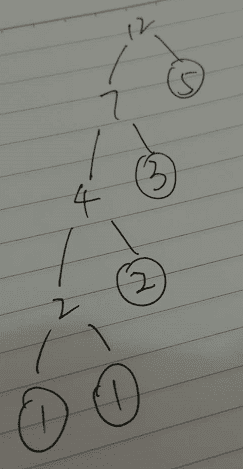
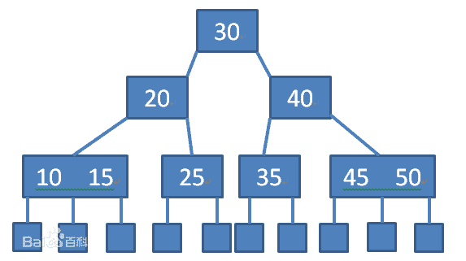
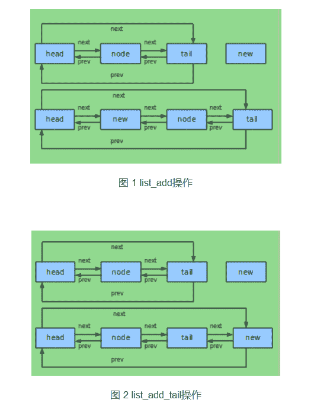

# 迅雷 2016 研发工程师笔试题

## 1

若串 str="xunlei"，其子串的数目是()

正确答案: D   你的答案: 空 (错误)

```cpp
32
```

```cpp
31
```

```cpp
21
```

```cpp
22
```

本题知识点

组合数学 *讨论

[SunburstRun](https://www.nowcoder.com/profile/557336)

字串： n（n+1）/2 + 1 非空子串：n（n+1）/2 非空真子串：n（n+1）/2 - 1

发表于 2015-11-25 14:44:56

* * *

[Malcolm](https://www.nowcoder.com/profile/882596)

来自 malcolm：

子串数量的计算方法

编辑 ab 的子串：a、b、ab 和一个空子串共 4 个即（2+1+1）个，abc 的子串：a、 b、 c、 ab、 bc 、abc 和一个空子串 共（3+2+1+1）个，所以若字符串的长度为 n,则子串的个数就是[n+(n-1)+.......+1+1]个，"software"中非空子串的个数就是 8+7+....+1=36 个。把这个理解了题目就好办

发表于 2016-03-21 11:39:15

* * *

[阿在在](https://www.nowcoder.com/profile/1284406)

噢，我把子串和子序列搞混了，子串是不能跳的

发表于 2017-09-17 11:12:27

* * *

## 2

以下关于指针的说法,正确的是()

正确答案: C   你的答案: 空 (错误)

```cpp
int *const p 与 int const *p 等价
```

```cpp
const int *p 与 int *const p 等价
```

```cpp
const int *p 与 int const *p 等价
```

```cpp
int *p[10]与 int (*p)[10]等价
```

本题知识点

C++ C 语言

讨论

[牛客 477144 号](https://www.nowcoder.com/profile/477144)

*   int *con

  查看全部)

编辑于 2015-12-06 17:01:13

* * *

[牛客 696521 号](https://www.nowcoder.com/profile/696521)

这种一般是根据靠近原则来看，const 修饰 p 那么就是指针本身值不变，const 修饰*p 那么就是指指针指向的变量值不变

发表于 2016-06-03 20:07:22

* * *

[在](https://www.nowcoder.com/profile/1141408)

那如何区分这几类呢? 带两个 const 的肯定是指向常量的常指针，很容易理解，主要是如何区分常量指针和指针常量:

一种方式是看** * 和 const 的排列顺序**，比如
     int const* p; //const * 即常量指针
     const int* p; //const * 即常量指针
     int* const p; //* const 即指针常量
还一种方式是**看 const 离谁近，即从右往左看**，比如
     int const* p; //const 修饰的是*p，即*p 的内容不可通过 p 改变，但 p 不是 const，p 可以修改，*p 不可修改；
     const int* p; //同上
     int* const p; //const 修饰的是 p，p 是指针，p 指向的地址不能修改，p 不能修改，但*p 可以修改；

发表于 2017-04-04 12:15:20

* * *

## 3

以下不是关系型数据库管理系统(RDBMS)的是()

正确答案: D   你的答案: 空 (错误)

```cpp
mysql
```

```cpp
postgreSql
```

```cpp
oracle
```

```cpp
hadoop
```

本题知识点

数据库

讨论

[小虎牙](https://www.nowcoder.com/profile/512935)

选 DRDBMS 是 SQ  查看全部)

编辑于 2016-02-29 23:52:02

* * *

[codersong](https://www.nowcoder.com/profile/365974)

hadoop 是分布式文件系统，不是关系型数据库管理系统。

发表于 2016-03-01 10:18:41

* * *

[Hunter21](https://www.nowcoder.com/profile/2781254)

realtion database management systerm 关系型数据库管理系统

发表于 2016-09-10 23:13:27

* * *

## 4

假设磁盘上的物理块大小为 512 字节，一个逻辑记录长度为 80 个字符。若采用记录成组技术存储若干记录，当块因子为 4 时，磁盘空间的利用率可达到( )。

正确答案: C   你的答案: 空 (错误)

```cpp
16%
```

```cpp
33%
```

```cpp
63%
```

```cpp
91%
```

本题知识点

编译和体系结构

讨论

[anybody](https://www.nowcoder.com/profile/126520)

把若干个逻辑记录合成一组存放在一个物理块的工作称为记录的成组，每块中的逻辑记录个数称为块因子。所以，磁盘空间的利用率＝（记录大*块因子）/物理块大小＝（80*4）/512=63%.

发表于 2016-07-24 21:22:26

* * *

[SunburstRun](https://www.nowcoder.com/profile/557336)

磁盘空间利用率的计算公式为：80*4/512=62.5%，约为 63%。所以磁盘空间的利用率可达到 63%。

发表于 2015-11-25 14:46:03

* * *

[牛客小虾](https://www.nowcoder.com/profile/351937)

若干个逻辑记录合并成一组，写入一个块叫记录成组，这时每块中的逻辑记录的个数称块因子。成组操作一般先在输出缓冲区内进行，凑满一块后才将缓冲区内的信息写到存储介质上。反之，当存储介质上的一个物理记录读进输入缓冲区后，把逻辑记录从块中分离出来的操作叫记录的分解。

编辑于 2016-06-05 07:14:51

* * *

## 5

若栈采用链式存储结构,则下列说法中正确的是()

正确答案: D   你的答案: 空 (错误)

```cpp
需要判断栈满但不需要判断栈空
```

```cpp
不需要判断栈满也不需要判断栈空
```

```cpp
需要判断栈满且需要判断栈空
```

```cpp
不需要判断栈满但需要判断栈空
```

本题知识点

栈 *讨论

[炫](https://www.nowcoder.com/profile/376795)

链栈由于采用了链表的方式作为存储方式，入栈时，使用 malloc 申请空间后，用指针相连接，所以节点个数没有限制，但是出栈时，如果栈中的元素个数为 0，则不能继续出栈，**所以需要判断当前栈是否为空**

发表于 2016-06-04 13:21:24

* * *

[兵长一米七](https://www.nowcoder.com/profile/660990)

栈的链式存储结构： top 指针相当于单链表中的头指针，入栈即在链头插入。栈的链式存储简称链栈，没有头结点。top=NULL 表示栈为空
栈的顺序存储结构：即用一个 StackSize 大小的数组来存储整个栈，那么下标为 0 的元素就是栈底元素，用 top 变量来指示栈顶元素，因为数组的大小为 StackSize，所以 0<= top <StackSize。当 top=0 时表示该栈只有一个元素，top=StackSize-1 时表示栈满，top=-1 时，表示栈为空栈 

发表于 2016-03-26 17:42:35

* * *

[牛客 7488564 号](https://www.nowcoder.com/profile/7488564)

当无可用空闲内存时，不算栈满吗？

发表于 2017-01-05 23:49:03

* * *

## 6

```cpp
class P
{
private:
	int ival;
public:
	P();
	~P();
	int GetVal(){
		return ival;
	};
	virtual int SetVal(int val)
	{
		ival=val;
	};
};
```

在 32 位编译器下 sizof(P)为()

正确答案: B   你的答案: 空 (错误)

```cpp
4
```

```cpp
8
```

```cpp
12
```

```cpp
16
```

本题知识点

C++

讨论

[小虎牙](https://www.nowcoder.com/profile/512935)

1.类的大小为类的非静态成员

  查看全部)

编辑于 2015-12-14 10:54:59

* * *

[方泉水很甜](https://www.nowcoder.com/profile/695496)

含有虚函数的类都会建立一张虚函数表，表中存放的是虚函数的函数指针，这个表的地址存放在类中，所以不管有几个虚函数，sizeof(P)的大小都是 4+4=8。

发表于 2015-12-13 21:05:08

* * *

[恋曲 15](https://www.nowcoder.com/profile/251763)

sizeof(p) = 4 + 4 = 8  包含成员变量和一个虚指针 

发表于 2015-12-17 13:44:10

* * *

## 7

对数据库第二范式的理解正确的是()

正确答案: C   你的答案: 空 (错误)

```cpp
数据库表的每一列都是不可分割的原子数据项
```

```cpp
在 1NF 基础上,任何非主属性不依赖于其它非主属性
```

```cpp
在 1NF 基础上,非码属性必须完全依赖与码
```

```cpp
以上说法都不正确
```

本题知识点

数据库

讨论

[张星星](https://www.nowcoder.com/profile/716240)

第一范式，原子性第二范式，没有包含在主键中的列必须完全依赖于主键，而不能只依赖于主键的一部分。第三范式， 不能存在传递依赖

发表于 2016-02-20 20:11:57

* * *

[牛客-山山](https://www.nowcoder.com/profile/741461)

1NF:原子性 字段不可再分,否则就不是关系数据库;
2NF:唯一性 一个表只说明一个事物;
3NF:每列都与主键有直接关系，不存在传递依赖;

发表于 2016-02-16 15:46:25

* * *

[一枚水货](https://www.nowcoder.com/profile/641855)

**第一范式（** **1NF** **）：** 字段具有   原子性   ,   不可再分   。所有关系型数据库系统都满足第一范式）数据库表中的字段都是单一属性的，不可再分。例如，姓名字段，其中的姓和名必须作为一个整体，无法区分哪部分是姓，哪部分是名，如果要区分出姓和名，必须设计成两个独立的字段。

**第二范式（** **2NF** **）：** 第二范式（   2NF   ）是在   第一范式（   1NF   ）的基础上   建立起来的，即满足第二范式（   2NF   ）必须先满足第一范式（   1NF   ）。要求   数据库表中的每个实例或行必须可以被惟一地区分   。通常需要为表加上一个列，以存储各个实例的惟一标识。这个惟一属性列被称为   主关键字或主键   。

  第二范式（   2NF   ）要求   实体的属性完全依赖于主关键字   。所谓完全依赖是指不能存在仅依赖主关键字一部分的属性，如果存在，那么这个属性和主关键字的这一部分应该分离出来形成一个新的实体，新实体与原实体之间是一对多的关系。为实现区分通常需要为表加上一个列，以存储各个实例的惟一标识。简而言之，第二范式就是非主属性非部分依赖于主关键字。

**第三范式** **（ ** **3NF ** **）** **：** 满足第三范式（   3NF   ）   必须先满足第二范式（   2NF   ）   。简而言之，第三范式（   3NF   ）要求一个数据库表中   不包含   已在其它表中   已包含的非主关键字信息   。所以第三范式具有如下特征：

1   ，每一列只有一个值

2   ，每一行都能区分。

3   ，每一个表都   不包含其他表已经包含   的非主关键字信息。

例如，帖子表中只能出现发帖人的   id   ，而不能出现发帖人的   id   ，还同时出现发帖人姓名，否则，只要出现同一发帖人   id   的所有记录，它们中的姓名部分都必须严格保持一致，这就是   数据冗余   。

发表于 2016-07-31 18:14:07

* * *

## 8

假设以数组 A[60]存放循环队列的元素,其头指针是 front=47,当前队列有 50 个元素,则队列的尾指针值为()

正确答案: B   你的答案: 空 (错误)

```cpp
3
```

```cpp
37
```

```cpp
97
```

```cpp
50
```

本题知识点

队列 *讨论

[zhisheng_blog](https://www.nowcoder.com/profile/616717)

 队列中元素的个数： (rear-front+QueueSize)%QueueSize 根据题意得：（rear - 47  + 60）% 60 = 50=>   ** rear = 37   选 B**至于答案选项中还有个 97，纯属瞎扯。

发表于 2016-08-25 09:28:47

* * *

[小虎牙](https://www.nowcoder.com/profile/512935)

选 B（47+50）mod 60=37

发表于 2015-11-25 16:37:01

* * *

[thfeng](https://www.nowcoder.com/profile/970691)

(rear-47+60)%60=50 解得 rear=37

发表于 2016-06-08 10:39:11

* * *

## 9

函数

```cpp
int f(unsigned int n) {
    unsigned int m = 0;
    for (m = 0; n; ++m) {
        n &= (n - 1);
    }
    return m;
}
```

f(2486)的返回值是()

正确答案: A   你的答案: 空 (错误)

```cpp
7
```

```cpp
10
```

```cpp
15
```

```cpp
1243
```

本题知识点

C 语言

讨论

[testestest](https://www.nowcoder.com/profile/913613)

2486=2048 + 256 + 128 + 32 + 16 + 4 + 2 七个 1

发表于 2016-09-17 08:20:05

* * *

[gendlee](https://www.nowcoder.com/profile/617149)

```cpp
比较完整的答案：
//求二进制数 1 的个数
int numOfOne(x){
int count = 0;
while(x)
    {count++;
     x = x&(x-1); }return count;
}
//那么求二进制中 0 的个数呢？好的，以下就是：  
```

```cpp
int numOfZero(x)
while(x+1)
    {count++;
     x = x|(x+1); }return count;
}

这道题求的时候也有技巧，一般都要先转化成 16 进制，再转化成二进制，
那么这里 2486 = 2048 + 438（没骂人^()^），已知 2048 = 2^n，
n 管他是多少，也就是说 2048 中只有一个 1，第一个。
所以只需要求 438 中 1 的个数再加上 1，就是总 1 的个数。
做题中的一点小悟，逐享之。

```

编辑于 2016-07-31 16:29:45

* * *

[牛客 854218 号](https://www.nowcoder.com/profile/854218)

n&=(n-1)相当于 n=n&(n-1),执行一次也就相当于把二进制中的最低位的 1 置为 0；循环执行，也就是计算 2468 的二进制中有多少个 1.

发表于 2016-07-06 18:45:14

* * *

## 10

以下不是 double compare(int,int)的重载函数的是()

正确答案: D   你的答案: 空 (错误)

```cpp
int compare(double,double)
```

```cpp
double compare(double,double)
```

```cpp
double compare(double,int)
```

```cpp
int compare(int,int)
```

本题知识点

C++

讨论

[刘放](https://www.nowcoder.com/profile/203364)

a. 成员函数被重载的特征：

（ 1 ）相同的范围（在同一个类中）；

（ 2 ）函数名字相同；

（ 3 ）参数不同；

（ 4 ） virtual 关键字可有可无。

b. 覆盖是指派生类函数覆盖基类函数，特征是：

（ 1 ）不同的范围（分别位于派生类与基类）；

（ 2 ）函数名字相同；

（ 3 ）参数相同；

（ 4 ）基类函数必须有 virtual 关键字。

c.“ 隐藏 ” 是指派生类的函数屏蔽了与其同名的基类函数，规则如下：

（ 1 ）如果派生类的函数与基类的函数同名，但是参数不同。此时，不论有无 virtual 关键字，基类的函数将被隐藏（注意别与重载混淆）。

（ 2 ）如果派生类的函数与基类的函数同名，并且参数也相同，但是基类函数没有 virtual 关键字。此时，基类的函数被隐藏（注意别与覆盖混淆）

发表于 2015-11-26 11:16:35

* * *

[牛客 308968 号](https://www.nowcoder.com/profile/308968)

这题的答案是 D，因为重载函数与类型无关，所以不看类型，题目中的 compare(int,int)与 D 中的 compare(int,int)一样，编译器不能区分

编辑于 2016-07-27 10:57:46

* * *

[IreanLau](https://www.nowcoder.com/profile/681025)

重载的作用就是同一个函数有不同的行为, 不是在一个域中的函数是无法构成重载的. 返回值类型被接受的同时，是完全可以强转的， 功能的不同主要来自于参数。

发表于 2015-11-29 20:15:23

* * *

## 11

将两个各有 n 个元素的有序表归并成一个有序表,最少的比较次数是()

正确答案: D   你的答案: 空 (错误)

```cpp
2n
```

```cpp
2n-1
```

```cpp
n-1
```

```cpp
n
```

本题知识点

排序 *讨论

[想做樱木的圆寸少年](https://www.nowcoder.com/profile/906117)

我理解的最少的比较次数是当一个有序表 A 的所有元素都大于另一个有序表 B 的所有元素时。当 A 表中的第一个元素与 B 表中的所有元素比较一次，并发现该元素大于 B 表中的最大元素时，A 表剩下的所有元素都不需要再比较，直接依次添加在 B 表的末尾。该过程一共比较了 N 次

发表于 2016-02-01 11:34:08

* * *

[烟消 bug 云散](https://www.nowcoder.com/profile/914092)

最小情况：把前一个表 A 中的第一个值与后一个表 B 相比较，发现最小的值比 B 的最大的值都要大，所以第一个回答中的次数其实不是 1 次，而是 N 次，因为你没办法直接访问到最后一个元素

发表于 2016-07-04 08:58:09

* * *

[那结局呢](https://www.nowcoder.com/profile/391512)

有没有可能是一次呢？其中一个表的最小元素大于另一个表的最小元素

发表于 2015-12-18 20:51:33

* * *

## 12

已知关键字序列为(51,22,83,46,75,18,68,30),按关键码字 51 进行一趟快速排序,完成后的序列为()

正确答案: A   你的答案: 空 (错误)

```cpp
(30,22,18,46,51,75,68,83)
```

```cpp
(30,18,22,46,51,75,83,68)
```

```cpp
(30,18,22,46,51,75,68,83)
```

```cpp
(18,22,30,46,51,68,75,83)
```

本题知识点

排序 *讨论

[LEarBB](https://www.nowcoder.com/profile/708350)

    答案选  **A**  查看全部)

编辑于 2015-12-22 10:28:57

* * *

[牛客 375003 号](https://www.nowcoder.com/profile/375003)

快排也有好几种方法的，有的结果选项里也咩有。

发表于 2016-02-03 18:16:49

* * *

[挥着牛鞭的男孩](https://www.nowcoder.com/profile/825762)

我也是醉了，快排又不是只有你知道的那一种

发表于 2016-08-04 08:40:25

* * *

## 13

若一个算法的时间复杂度用 T(n)表示,其中 n 的含义是()

正确答案: A   你的答案: 空 (错误)

```cpp
问题规模
```

```cpp
语句条数
```

```cpp
循环层数
```

```cpp
函数数量
```

本题知识点

编程基础 *讨论

[codersong](https://www.nowcoder.com/profile/365974)

时间复杂度是执行次数最多那句语句的执行次数，表明的就是问题的规模了。

发表于 2016-03-01 10:11:48

* * *

[炫](https://www.nowcoder.com/profile/376795)

一般情况下，算法中基本操作重复执行的次数是问题规模 n 的某个函数，用 T(n)表示。

发表于 2016-01-04 13:39:31

* * *

[细雨湿身](https://www.nowcoder.com/profile/736416)

A

发表于 2015-11-26 14:59:28

* * *

## 14

以下关于纯虚函数的说法,正确的是()

正确答案: A   你的答案: 空 (错误)

```cpp
声明纯虚函数的类不能实例化
```

```cpp
声明纯虚函数的类成虚基类
```

```cpp
子类必须实现基类的
```

```cpp
纯虚函数必须是空函数
```

本题知识点

C++ C 语言

讨论

[丁一一](https://www.nowcoder.com/profile/905485)

声明纯虚函数的类是抽象类，不能实例化基类被虚继承才是虚基类

发表于 2015-12-02 22:25:05

* * *

[噼里啪啦酱](https://www.nowcoder.com/profile/486089)

选项 D 我的理解是空函数的概念比如 int fun(int x ,int y){}这叫做空函数，也就是花括号中为空；而纯虚函数的定义是 virtual int fun(int x int y)=0.和空函数还是有点不一样的

发表于 2016-03-17 10:43:39

* * *

[LoftWhale](https://www.nowcoder.com/profile/448316)

百科：纯虚函数可以让类先具有一个操作名称，而没有操作内容，让派生类在继承时再去具体地给出定义。凡是含有纯虚函数的类叫做 [抽象类](http://baike.baidu.com/view/262290.htm) 。这种类不能声明对象，只是作为基类为派生类服务。除非在派生类中完全实现基类中所有的的纯虚函数，否则，派生类也变成了抽象类，不能实例化对象。

发表于 2015-12-14 16:00:33

* * *

## 15

有以下 5 个叶子节点 1,1,3,2,5 构成的哈夫曼树的带权路径长度为（）

正确答案: D   你的答案: 空 (错误)

```cpp
24
```

```cpp
26
```

```cpp
23
```

```cpp
25
```

本题知识点

树

讨论

[唐子玄](https://www.nowcoder.com/profile/264309)

*   结点带权路径长度=该结点到根的路径长度×该结点权
*   哈夫曼树:给定叶子权值和叶子数 可以构造出不同结构的二叉树 其中带权路径长度最小的二叉树称为最优二叉树 哈夫曼树是一种最优二叉树
*   哈夫曼树算法

1.  根据 n 个权值构造具有 n 棵二叉树的森林---森林中的每颗二叉树都只有一个根结点 结点的数据域为一个权值 该结点左右子树都是空
2.  在森林中选出 2 棵根结点权值最小的树 A B(这样的树不止 2 棵---任选 2 棵)---创建一个新结点作为 A B 的根结点 A B 分别作为根结点的左右孩子(权值小的在左边大的在右边 这样规定 哈夫曼树就唯一了)---将 A B 的权值相加作为根结点的权值---森林中产生一颗新树 C(:~有左右孩子各 1)
3.  在森林中继续选出 2 棵根结点权值最小的树(2.中产生的 C 也在选择范围内)---重复 2.的过程 直到将森林中所有的数合并成一颗二叉树---这颗二叉树就是哈夫曼树

按照上述算法可以得到如下哈夫曼树 其带权路径长度= 5*1+3*2+2*3+(1+1)*4 =25 选 D

发表于 2015-11-30 18:18:10

* * *

[scanf_cin](https://www.nowcoder.com/profile/377724)

先从数组中选出两个最小的数 1,1 作为两个路径的权值，然后将这两个数相加放到数组中就是 2,3,2,5，然后在从中选出最小的两个数 2,2 作为两个路径的权值。再将这两个数相加放到数组中得到 4,3,5.然后在选出两个最小的数 4,3 作为两个路径的权值。在将这两个数的和放到数组中，得到 7,5 这就是最后的两个权值。将这些权值全部加起来就是 1+1+2+2+4+3+7+5=25，这就是整个路径的长度，所以选 d

发表于 2015-11-30 15:15:31

* * *

[shizheng](https://www.nowcoder.com/profile/669575)

一定要注意哈夫曼树的带权路径长度只需要计算叶子节点的带权路径长度之和

发表于 2016-03-20 15:46:23

* * *

## 16

表达式 (a+b)×(c-d)+e 的逆波兰表示法（后缀表示法）为 ____

正确答案: D   你的答案: 空 (错误)

```cpp
abcde+-×+
```

```cpp
(a+b)×(c-d)+e
```

```cpp
+×+ab-cde
```

```cpp
ab+cd-×e+
```

```cpp
+×+-abcde
```

本题知识点

模拟

讨论

[牛男爱答题](https://www.nowcoder.com/profile/372008)

简易方法：利用加“（）”的方式，根据表达式运算顺序，依次加上（），根据括号的作用域，然后把运算符拿到括号的外面，最后去掉（）；
eg：(a+b)*(c-d)+e
--> (((a+b)*(c-d))+e)
-->ab+cd-*e

发表于 2015-11-30 11:24:16

* * *

[tonny](https://www.nowcoder.com/profile/284332)

选 D ab+cd-*e+
运算顺序是这样的(（ab+）(cd-)*)e+

发表于 2015-11-26 21:42:30

* * *

[炫](https://www.nowcoder.com/profile/376795)

后缀表达式：从左至右扫描表达式，遇到数字时，将数字压入堆栈，遇到运算符时，弹出栈顶的两个数，用运算符对它们做相应的计算（次顶元素 op 栈顶元素），并将结果入栈；重复上述过程直到表达式最右端，最后运算得出的值即为表达式的结果。http://blog.csdn.net/antineutrino/article/details/6763722

发表于 2015-12-06 13:53:21

* * *

## 17

数据库 DB,数据库系统 DBS,数据库管理系统 DBMS 三者之间的关系是()

正确答案: C   你的答案: 空 (错误)

```cpp
DBMS 包括 DB 和 DBS
```

```cpp
DBS 就是 DB,也就是 DBMS
```

```cpp
DBS 包括 DB 和 DBMS
```

```cpp
DB 包括 DBS 和 DBMS
```

本题知识点

数据库

讨论

[SunburstRun](https://www.nowcoder.com/profile/557336)

数据库系统 DBS 由 5 部分组成：硬件系统、数据库集合、数据库管理系统及相关软件、数据库管理员和用户

发表于 2015-11-25 14:48:18

* * *

[星痕 sky](https://www.nowcoder.com/profile/625230)

数据库系统是指在计算机系统中引入数据库后的系统，一般由数据库（DB），数据库管理系统（DBMS），应用系统，数据库管理员（DBA）构成。

发表于 2016-01-20 15:58:08

* * *

[nomico271](https://www.nowcoder.com/profile/2527957)

**DB(数据库）：**Database；**DBMS（数据库管理系统）：**Database Management System；**DBS（数据库系统）：**Data Base System。DBS = DB + DBMS+ 软件组成。

发表于 2017-08-01 11:06:35

* * *

## 18

索引字段值不唯一,应该选择的索引类型为()

正确答案: A   你的答案: 空 (错误)

```cpp
普通索引
```

```cpp
候选索引
```

```cpp
主索引
```

```cpp
唯一索引
```

本题知识点

数据库

讨论

[SunburstRun](https://www.nowcoder.com/profile/557336)

索引类型分类：①主索引：主索引是一种只能在数据库表中建立不能在自由表中建立的索引。在指定的字段或表达式中，主索 引的关键字绝对不允许有重复值。②候选索引：和主索引类似，它的值也 不允许在指定的字段或表达式中重复。一个表中可以有多个 候选索引。③唯一索引：唯一索引允许关键字取重复的值。当有重复值 出现时，索引文件只保存重复值的第 1 次出现。提供唯一索引主要是为了兼容早期的 版本。④普通索引：普通索引允许关键字段有相同值。在一对 多关系的多方，可以使用普通索引

发表于 2015-11-25 14:49:03

* * *

[中国银联科技事业部](https://www.nowcoder.com/profile/9100260)

普通索引：没有任何限制唯一索引：不允许建立索引的列有重复的值，但可以有空值主索引：特殊的唯一索引，不允许有空值候选索引：也要求唯一性，一个表中可以有多个候选索引

发表于 2017-09-12 15:37:18

* * *

[星痕 sky](https://www.nowcoder.com/profile/625230)

主索引和候选索引均不允许有重复值，且主索引只能有一个，候选索引可以有多个。

发表于 2016-01-20 17:59:15

* * *

## 19

下列数据结构中，不属于二叉树的是（）

正确答案: B   你的答案: 空 (错误)

```cpp
哈夫曼树
```

```cpp
B 树
```

```cpp
AVL 树
```

```cpp
二叉排序树
```

本题知识点

树

讨论

[小虎牙](https://www.nowcoder.com/profile/512935)

选 B1970 年，R.Bayer 和 E.mccreight 提出了一种适用于外查找的[树](http://baike.baidu.com/subview/143352/6479956.htm)，它是一种平衡的多叉树，称为 B 树（或 B-树、B_ 树）。一棵 m 阶 B 树(balanced tree of order m)是一棵平衡的 m 路搜索树。它或者是空树，或者是满足下列性质的树：1、根结点至少有两个子女；2、每个非根节点所包含的关键字个数 j 满足：┌m/2┐ - 1 <= j <= m - 1；3、除根结点以外的所有结点（不包括叶子结点）的度数正好是关键字总数加 1，故内部子树个数 k 满足：┌m/2┐ <= k <= m ；4、所有的叶子结点都位于同一层

编辑于 2015-11-26 20:30:49

* * *

[InGodWeTrust](https://www.nowcoder.com/profile/2178882)

在网上找的 B 树的结构图，B 树属于二叉树？

发表于 2017-04-07 11:09:24

* * *

[♥乔木♥](https://www.nowcoder.com/profile/8448640)

虽然写对了，但是我在想哈夫曼树，，不能 3 叉吗

发表于 2020-06-11 09:16:55

* * *

## 20

下列关于关系数据模型的术语中,哪一个术语所表达的概念与二维表的"行"的概念最接近()

正确答案: C   你的答案: 空 (错误)

```cpp
域
```

```cpp
关系
```

```cpp
元组
```

```cpp
属性
```

本题知识点

数据库

讨论

[小乌](https://www.nowcoder.com/profile/477630)

关系数据库中，关系是一张表，表中的每行（即数据库中的每条记录）就是一个元组，每列就是一个属性，列中所对应的值为域（也称为 字段)

发表于 2016-08-28 17:07:43

* * *

[joey—](https://www.nowcoder.com/profile/854146)

```cpp
C，关系数据库中方，关系是一张表，表中的每行（即数据库中的每条记录）就是一个元组，每列就是一个属性。 在二维表里，元组也称为记录。
```

发表于 2015-12-10 15:01:18

* * *

[peng.tan](https://www.nowcoder.com/profile/3111850)

行：元组--一条具体的数据列：属性

发表于 2017-01-13 02:00:41

* * *

## 21

ISAM 文件系统中采用多级索引的目的是()

正确答案: A   你的答案: 空 (错误)

```cpp
提高检索效率
```

```cpp
减少数据的冗余
```

```cpp
方便文件的修改
```

```cpp
提高存储效率
```

本题知识点

数据库

讨论

[中华小菜鸟](https://www.nowcoder.com/profile/798916)

送分题呀，请记住：加索引的唯一目的就是为了提高查询检索性能，但一定程度上肯定会对其他操作的性能有影响，如果没有影响，那全部加索引就 ok 了，但是这显然不现实滴

发表于 2015-12-05 09:32:19

* * *

[花花花花花🌸](https://www.nowcoder.com/profile/188943)

加索引的唯一目的就是为了提高查询检索性能，但一定程度上肯定会对其他操作的性能有影响，

发表于 2016-04-25 19:09:14

* * *

[无能狂怒轩](https://www.nowcoder.com/profile/740648719)

索引一般都是为了提高检索效率，选 A 是肯定没错。较少冗余和索引没关系， 修改和存储相当于写而不是读。

发表于 2020-06-03 15:22:07

* * *

## 22

将长度为 n 的单链表连接在长度为 m 的单链表之后,其算法的时间复杂度为()

正确答案: A   你的答案: 空 (错误)

```cpp
O(m)
```

```cpp
O(1)
```

```cpp
O(n)
```

```cpp
O(m+n)
```

本题知识点

编程基础 *讨论

[小虎牙](https://www.nowcoder.com/profile/512935)

选 A 将长度为 n 的放在长度为 m 的链表之后，需要先遍历长度为 m 的链表，找到链表尾部，这个时间复杂度为 O(m)，再将链表尾部的 next 指针指向长度为 n 的链表的头结点即可

发表于 2015-11-25 17:04:35

* * *

[未来即来、](https://www.nowcoder.com/profile/216571)

先遍历长度 m 的链表为 O(m)，插入时的 O(1)可忽略

发表于 2016-03-01 19:54:23

* * *

[本命年的 Offer！](https://www.nowcoder.com/profile/6344483)

主要是要先找到长度 m 链表的尾指针。

发表于 2017-10-23 15:38:08

* * *

## 23

下面说法正确的是()

正确答案: A   你的答案: 空 (错误)

```cpp
一个空类默认一定生成构造函数,拷贝构造函数,赋值操作符,引用操作符,析构函数
```

```cpp
可以有多个析构函数
```

```cpp
析构函数可以为 virtual,可以被重载
```

```cpp
类的构造函数如果都不是 public 访问属性,则类的实例无法创建
```

本题知识点

C++

讨论

[Jeffdon](https://www.nowcoder.com/profile/798998)

析构函数没有参数列表，无法重载，但是可以重写

发表于 2015-12-15 22:23:02

* * *

[钉子](https://www.nowcoder.com/profile/506749)

D 选项，单例模式

1.  class  CSingleton  
2.  {  
3.  private :  
4.  CSingleton()   //构造函数是私有的   
5.  {  
6.  }  
7.  static  CSingleton *m_pInstance;  
8.  public :  
9.  static  CSingleton * GetInstance()  
10.  {  
11.  if (m_pInstance == NULL)   //判断是否第一次调用   
12.  m_pInstance = new  CSingleton();  
13.  return  m_pInstance;  
14.  }  
15.  };  
16.  用户访问唯一实例的方法只有 GetInstance()成员函数。如果不通过这个函数，任何创建实例的尝试都将失败，因为类的构造函数是私有的。GetInstance()使用 懒惰初始化，也就是说它的返回值是当这个函数首次被访问时被创建的 。这是一种防弹设计——所有 GetInstance()之后的调用都返回相同实例的指针：
17.  http://blog.csdn.net/hackbuteer1/article/details/7460019

编辑于 2015-12-13 17:24:16

* * *

[冰雪林中著此身](https://www.nowcoder.com/profile/169177)

选项 A 错误。 参考《深度探索 C++对象模型》第二章 构造函数语义学。“在需要的时候被编译器生产出来”’ 一个类是空类，没有任何事物需要它的构造器，所以编译器不会生成默认构造器。

发表于 2016-03-25 08:50:33

* * *

## 24

有序顺序表含有 127 个元素，向其插入一个新元素并保持原来顺序不变，平均要移动（）个元素。

正确答案: A   你的答案: 空 (错误)

```cpp
63.5
```

```cpp
8
```

```cpp
32
```

```cpp
7
```

本题知识点

复杂度

讨论

[菜鸟葫芦娃](https://www.nowcoder.com/profile/415611)

平均要移动 63.5 次； 如果插在第一个位置那就要移动 127 个元素（即 127 次）； 如果插在第二个位置那就要移动 126 个元素（即 126 次）；                    .……                    .……                    .……                    .…… 如果插在最后一个位置那不用移动移动次数为 0；就是从 0~127 的一个递增数列（想倒过来递减也行）；所以平均要移动的次数 N=(0+127)/2=63.5；

发表于 2015-11-27 16:58:55

* * *

[冲鸭！冲鸭！冲鸭！](https://www.nowcoder.com/profile/551437339)

**线性表按照存储方式可分为顺序表和链表。****（1）顺序表**。将数据元素放到一块连续的内存空间，相邻数据元素存储地址也相邻。  1）优点：通过下标就可访问元素，因此存取效率高。
  2）缺点：需预分配空间，分配多了会造成浪费，分配少了会造成“溢出”，因此空间利用率低；插入和删除元素需移动元素，因此插入删除慢。  3）时间复杂度：访问元素是 O（1），插入删除元素是 O（n）。**（2）链表。**相邻数据元素的地址可能不相邻。每个数据元素所占存储空间分成两部分，一部分存放元素值，一部分存放元素之间的关系。  1）优点：存储空间是动态分配的，因此没有空间限制；插入和删除元素只需要改变指针指向，因此插入删除快。  2）缺点：访问元素需要从开始元素一个一个去查找访问，因此存取效率低。  3）时间复杂度：访问元素是 O（n），插入元素是 O（1）。--------------------------------------------------------------------------------------------------------------------本题解题思路：有 127 个元素，插入一个新元素，插入的位置有 127+1（在顺序表尾部插）=128 方式 1）如果在第 0 个位置插入，需移动 127 个元素。2）如果在第 1 个位置插入，需移动 126 个元素。3）如果在第 2 个位置插入，需移动 125 个元素。...127）如果在第 126 个位置插入，需移动 1 个元素。128）如果在表尾部插入，需移动 0 个元素。因此平均需要移动：(0+1+2+...+127)/128 = (127*128)/2*1/128 = 63.5 个元素。

发表于 2019-07-29 18:47:04

* * *

[はくけつ](https://www.nowcoder.com/profile/9739084)

题意要保持原顺序不变的话，就只有两种情况，第一，插入在第一个位置，其余的向后移，总共 127 次；第二，插入到最后一个位置，其余的数不需要移动，总共 0 次；故而，平均移动次数为，(127+0)/2=63.5

发表于 2016-08-11 13:39:14

* * *

## 25

在带头结点的双向循环链表中插入一个新结点,需要修改的指针域数量是()

正确答案: D   你的答案: 空 (错误)

```cpp
2 个
```

```cpp
6 个
```

```cpp
3 个
```

```cpp
4 个
```

本题知识点

链表 *讨论

[张 sir](https://www.nowcoder.com/profile/268614)

选 D，在结点 p 后插入新结点 s 需要修改 4 个指针，如下： 1.s->prior=p 2.s->next=p->next 3.p->next->prior=s 4.p-next=s

发表于 2016-04-07 20:18:15

* * *

[薛定谔之喵](https://www.nowcoder.com/profile/519263)



发表于 2016-05-15 10:57:34

* * *

[IreanLau](https://www.nowcoder.com/profile/681025)

在单向循环链表中 和每个节点直接关联的指针 有两个  ，那么 双循环链表中 就是 4 个 

发表于 2015-11-29 20:19:41

* * *********