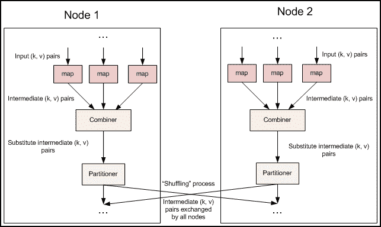

# 百度 2016 研发工程师笔试题（六）

## 1

HTTP 的会话有四个过程，请选出不是的一个（）

正确答案: D   你的答案: 空 (错误)

```cpp
建立连接
```

```cpp
发出响应信息
```

```cpp
发出请求信息
```

```cpp
传输数据
```

本题知识点

网络基础

讨论

[yayamma](https://www.nowcoder.com/profile/270051)

HTTP 会话的四个过程
1\.  查看全部)

编辑于 2015-12-18 09:43:30

* * *

[Circle&Z](https://www.nowcoder.com/profile/476805)

HTTP 协议

客户端连上 web 服务器后，若想获得 web 服务器中的某个 web 资源，需遵守一定的通讯格式， HTTP 协议用于定义客户端与 web 服务器通迅的格式。

WEB 浏览器与 WEB 服务器之间的一问一答的交互过程必须遵循一定的规则，这个规则就是 HTTP 协议。

HTTP 是 hypertext transfer protocol （超文本传输协议）的简写，它是 TCP/IP 协议集中的一个应用层协议，用于定义 WEB 浏览器与 WEB 服务器之间交换数据的过程以及数据本身的格式。 

HTTP 协议的版本 

HTTP/1.0、 HTTP/1.1

HTTP 协议是学习 JavaWEB 开发的基石，不深入了解 HTTP 协议，就不能说掌握了 WEB 开发，更无法管理和维护一些复杂的 WEB 站点。深入理解 HTTP 协议，对管理和维护复杂的 WEB 站点、开发具有特殊用途的 WEB 服务器程序具有直接影响。

HTTP 1.0 的会话方式

浏览器与 WEB 服务器的连接过程是短暂的，每次连接只处理一个请求和响应。对每一个页面的访问，浏览器与 WEB 服务器都要建立一次单独的连接。 浏览器到 WEB 服务器之间的所有通讯都是完全独立分开的请求和响应对。

四个步骤：


支持***：


HTTP 1.1 的特点 

在一个 TCP 连接上可以传送多个 HTTP 请求和响应  

多个请求和响应过程可以重叠进行

增加了更多的请求头和响应头 


HTTP1.0 和 HTTP1.1 的区别

在 HTTP1.0 协议中，客户端与 web 服务器建立连接后，只能获得一个 web 资源。

HTTP1.1 协议，允许客户端与 web 服务器建立连接后，在一个连接上获取多个 web 资源。

HTTP 请求的细节——请求行

请求行中的 GET 称之为请求方式，请求方式有：

POST、 GET 、 HEAD 、 OPTIONS 、 DELETE 、 TRACE 、 PUT

常用的有： GET 、  POST

用户如没有设置，默认情况下浏览器向服务器发送的都是 get 请求，例如在浏览器直接输地址访问，点超链接访问等都是 get ，用户如想把请求方式改为 post ，可通过更改表单的提交方式实现。

不管 POST 或 GET ，都用于向服务器请求某个 WEB 资源，这两种方式的区别主要表现在数据传递上：

如请求方式为 GET 方式，则可以在请求的 URL 地址后以 ? 的形式带上交给服务器的数据，多个数据之间以 & 进行分隔，例如：

GET /mail/1.html?name=abc&password=xyz HTTP/1.1

GET 方式的特点：在 URL 地址后附带的参数是有限制的，其数据容量通常不能超过 1K 。

如请求方式为 POST 方式，则可以在请求的实体内容中向服务器发送数据， Post 方式的特点：传送的数据量无限制。

HTTP 请求的细节——消息头

用于 HTTP 请求中的常用头

Accept: text/html,image/*    

Accept-Charset: ISO-8859-1

Accept-Encoding: gzip,compress

Accept-Language: en-us,zh-cn 

Host: www.it315.org:80

If-Modified-Since: Fri, 11 Dec 2015 18:23:51 GMT

Referer: http://www.it315.org/index.jsp

User-Agent: Mozilla/4.0 (compatible; MSIE 5.5; Windows NT 5.0)

Cookie

Connection: close/Keep-Alive   

Date: Fri, 11 Dec 2015 18:23:51 GMT

HTTP 响应的细节——状态行

状态行

格式： HTTP 版本号　状态码　原因叙述 <CRLF>

举例：HTTP/1.1 200 OK

状态码用于表示服务器对请求的处理结果，它是一个三位的十进制数。响应状态码分为 5 类，如下所示：


响应状态码à典型情况

200（正常） 

表示一切正常，返回的是正常请求结果。

302/307（临时重定向）

指出被请求的文档已被临时移动到别处，此文档的新的 URL 在 Location 响应头中给出。

304（未修改）

表示客户机缓存的版本是最新的，客户机应该继续使用它。

403（禁止） 

服务器理解客户端请求，但拒绝处理它。通常由于服务器上文件或目录的权限设置所致。 

404（找不到） 

服务器上不存在客户机所请求的资源。

500（内部服务器错误） 

服务器端的 CGI 、 ASP 、 JSP 等程序发生错误。

HTTP 响应细节——常用响应头

HTTP 请求中的常用响应头

Location: http://www.it315.org/index.jsp 

Server:apache tomcat

Content-Encoding: gzip 

Content-Length: 80 

Content-Language: zh-cn 

Content-Type: text/html; charset=GB2312 

Last-Modified: Fri, 11 Dec 2015 18:23:51 GMT

Refresh: 1;url=http://www.it315.org

Content-Disposition: attachment; filename=aaa.zip

Transfer-Encoding: chunked  

Set-Cookie:SS=Q0=5Lb_nQ; path=/search

ETag: W/"7777-1242234904000"

Expires: -1

Cache-Control: no-***  

Pragma: no-***   

Connection: close/Keep-Alive   

Date: Fri, 11 Dec 2015 18:23:51 GMT

发表于 2015-12-16 16:11:46

* * *

[美团校招内推直达](https://www.nowcoder.com/profile/458054)

答案：D

HTTP 会话过程包括四个步骤

1.  连接(Connection)
2.  请求(Request)
3.  应答(Response)
4.  关闭(Close) 

编辑于 2015-12-03 21:47:35

* * *

## 2

在 ISO/OSI 参考模型中，网络层的主要功能是（）

正确答案: A   你的答案: 空 (错误)

```cpp
路由选择，拥塞控制与网络互连
```

```cpp
提供可靠的端一端服务，透明地传送报文
```

```cpp
数据格式变换，数据加密与解密，数据压缩与恢复
```

```cpp
在通信实体之间传送以帧为单位的数据
```

本题知识点

网络基础

讨论

[美团校招内推直达](https://www.nowcoder.com/profile/458054)

**答案:A**  查看全部)

编辑于 2015-12-18 09:46:03

* * *

[Circle&Z](https://www.nowcoder.com/profile/476805)

    OSI （ Open System Interconnect ），即开放式系统互联。 一般都叫 OSI 参考模型，是 ISO （国际标准化组织）组织在 1985 年研究的网络互联模型。该体系结构标准定义了网络互连的七层框架（物理层、数据链路层、网络层、传输层、会话层、表示层和应用层），即 ISO 开放系统互连参考模型。在这一框架下进一步详细规定了每一层的功能，以实现开放系统环境中的互连性、互操作性和应用的可移植性。

ISO 为了更好的使网络应用更为普及，就推出了 OSI 参考模型。其含义就是推荐所有公司使用这个规范来控制网络。这样所有公司都有相同的规范，就能互联了。提供各种网络服务功能的计算机网络系统是非常复杂的。根据分而治之的原则， ISO 将整个通信功能划分为七个层次，划分原则是：

    （ 1 ）网路中各节点都有相同的层次；

    （ 2 ）不同节点的同等层具有相同的功能；

    （ 3 ）同一节点内相邻层之间通过接口通信；

    （ 4 ）每一层使用下层提供的服务，并向其上层提供服务；

    （ 5 ）不同节点的同等层按照协议实现对等层之间的通信。

    分层的好处是利用层次结构可以把开放系统的信息交换问题分解到一系列容易控制的软硬件模块－层中，而各层可以根据需要独立进行修改或扩充功能，同时，有利于个不同制造厂家的设备互连，也有利于大家学习、理解数据通讯网络。

               OSI 参考模型中不同层完成不同的功能，各层相互配合通过标准的接口进行通信。

**第** **7** **层应用层：** **OSI** **中的最高层。** 为特定类型的网络应用提供了访问 OSI 环境的手段。应用层确定进程之间通信的性质，以满足用户的需要。应用层不仅要提供应用进程所需要的信息交换和远程操作，而且还要作为应用进程的用户***，来完成一些为进行信息交换所必需的功能。它包括：文件传送访问和管理 FTAM 、虚拟终端 VT 、事务处理 TP 、远程数据库访问 RDA 、制造报文规范 MMS 、目录服务 DS 等协议；应用层能与应用程序界面沟通，以达到展示给用户的目的。 在此常见的协议有 :HTTP ， HTTPS ， FTP ， TELNET ， SSH ， SMTP ， POP3 等。

**第** **6** **层表示层：主要用于处理两个通信系统中交换信息的表示方式。** 为上层用户解决用户信息的语法问题。它包括数据格式交换、数据加密与解密、数据压缩与终端类型的转换。

**第** **5** **层会话层：在两个节点之间建立端连接。** 为端系统的应用程序之间提供了对话控制机制。此服务包括建立连接是以全双工还是以半双工的方式进行设置，尽管可以在层 4 中处理双工方式 ；会话层管理登入和注销过程。它具体管理两个用户和进程之间的对话。如果在某一时刻只允许一个用户执行一项特定的操作，会话层协议就会管理这些操作，如阻止两个用户同时更新数据库中的同一组数据。

**第** **4** **层传输层：—常规数据递送－面向连接或无连接。** 为会话层用户提供一个端到端的可靠、透明和优化的数据传输服务机制。包括全双工或半双工、流控制和错误恢复服务；传输层把消息分成若干个分组，并在接收端对它们进行重组。不同的分组可以通过不同的连接传送到主机。这样既能获得较高的带宽，又不影响会话层。在建立连接时传输层可以请求服务质量，该服务质量指定可接受的误码率、延迟量、安全性等参数，还可以实现基于端到端的流量控制功能。

**第** **3** **层网络层：本层通过寻址来建立两个节点之间的连接，为源端的运输层送来的分组，选择合适的路由和交换节点，正确无误地按照地址传送给目的端的运输层。** 它包括通过互连网络来路由和中继数据 ；除了选择路由之外，网络层还负责建立和维护连接，控制网络上的拥塞以及在必要的时候生成计费信息。常用设备有交换机；

**第** **2** **层数据链路层：在此层将数据分帧，并处理流控制。** 屏蔽物理层，为网络层提供一个数据链路的连接，在一条有可能出差错的物理连接上，进行几乎无差错的数据传输（差错控制）。本层指定拓扑结构并提供硬件寻址。常用设备有网卡、网桥、交换机；

**第** **1** **层物理层：处于** **OSI** **参考模型的最底层。** 物理层的主要功能是利用物理传输介质为数据链路层提供物理连接，以便透明的传送比特流。常用设备有（各种物理设备）集线器、中继器、调制解调器、网线、双绞线、同轴电缆。

数据发送时，从第七层传到第一层，接收数据则相反。

上三层总称应用层，用来控制软件方面。下四层总称数据流层，用来管理硬件。除了物理层之外其他层都是用软件实现的。

数据在发至数据流层的时候将被拆分。

**在传输层的数据叫段，网络层叫包，数据链路层叫帧，物理层叫比特流，这样的叫法叫** **PDU** **（协议数据单元）**各层功能详述

(1) 物理层 (Physical Layer)

物理层是 OSI 参考模型的最低层，它利用传输介质为数据链路层提供物理连接。它主要关心的是通过物理链路从一个节点向另一个节点传送比特流，物理链路可能是铜线、卫星、微波或其他的通讯媒介。它关心的问题有：多少伏电压代表 1 ？多少伏电压代表 0 ？时钟速率是多少？采用全双工还是半双工传输？总的来说物理层关心的是链路的机械、电气、功能和规程特性。

(2) 数据链路层 (Data Link Layer)

数据链路层是为网络层提供服务的，解决两个相邻结点之间的通信问题，传送的协议数据单元称为数据帧。

数据帧中包含物理地址（又称 MAC 地址）、控制码、数据及校验码等信息。该层的主要作用是通过校验、确认和反馈重发等手段，将不可靠的物理链路转换成对网络层来说无差错的数据链路。

此外，数据链路层还要协调收发双方的数据传输速率，即进行流量控制，以防止接收方因来不及处理发送方来的高速数据而导致缓冲器溢出及线路阻塞。

(3) 网络层 (Network Layer)

网络层是为传输层提供服务的，传送的协议数据单元称为数据包或分组。该层的主要作用是解决如何使数据包通过各结点传送的问题，即通过路径选择算法（路由）将数据包送到目的地。另外，为避免通信子网中出现过多的数据包而造成网络阻塞，需要对流入的数据包数量进行控制（拥塞控制）。当数据包要跨越多个通信子网才能到达目的地时，还要解决网际互连的问题。

(4) 传输层 (Transport Layer)

传输层的作用是为上层协议提供端到端的可靠和透明的数据传输服务，包括处理差错控制和流量控制等问题。该层向高层屏蔽了下层数据通信的细节，使高层用户看到的只是在两个传输实体间的一条主机到主机的、可由用户控制和设定的、可靠的数据通路。

传输层传送的协议数据单元称为段或报文。

(5) 会话层 (Session Layer)

会话层主要功能是管理和协调不同主机上各种进程之间的通信（对话），即负责建立、管理和终止应用程序之间的会话。会话层得名的原因是它很类似于两个实体间的会话概念。例如，一个交互的用户会话以登录到计算机开始，以注销结束。

(6) 表示层 (Presentation Layer)

表示层处理流经结点的数据编码的表示方式问题，以保证一个系统应用层发出的信息可被另一系统的应用层读出。如果必要，该层可提供一种标准表示形式，用于将计算机内部的多种数据表示格式转换成网络通信中采用的标准表示形式。数据压缩和加密也是表示层可提供的转换功能之一。

(7) 应用层 (Application Layer)

应用层是 OSI 参考模型的最高层，是用户与网络的接口。该层通过应用程序来完成网络用户的应用需求，如文件传输、收发电子邮件等。数据封装过程：每层封装后的数据单元的叫法不同，在应用层、表示层、会话层的协议数据单元统称为 data（数据），在传输层协议数据单元称为 segment（数据段），在网络层称为 packet（数据包），数据链路层协议数据单元称为 frame（数据帧），在物理层叫做 bits（比特流）。 OSI 的数据封装当数据到达接收端时，每一层读取相应的控制信息根据控制信息中的内容向上层传递数据单元，在向上层传递之前去掉本层的控制头部信息和尾部信息（如果有的话）。此过程叫做解封装。这个过程逐层执行直至将对端应用层产生的数据发送给本端的相应的应用进程。以用户浏览网站为例说明数据的封装、解封装过程。 数据封装当用户输入要浏览的网站信息后就由应用层产生相关的数据，通过表示层转换成为计算机可识别的 ASCII 码，再由会话层产生相应的主机进程传给传输层。传输层将以上信息作为数据并加上相应的端口号信息以便目的主机辨别此报文，得知具体应由本机的哪个任务来处理；在网络层加上 IP 地址使报文能确认应到达具体某个主机，再在数据链路层加上 MAC 地址，转成 bit 流信息，从而在网络上传输。报文在网络上被各主机接收，通过检查报文的目的 MAC 地址判断是否是自己需要处理的报文，如果发现 MAC 地址与自己不一致，则丢弃该报文，一致就去掉 MAC 信息送给网络层判断其 IP 地址；然后根据报文的目的端口号确定是由本机的哪个进程来处理，这就是报文的解封装过程。

7 应用层：老板

6 表示层：相当于公司中演示稿老板、替老板写信的助理

工作比喻

5 会话层：相当于公司中收寄信、写信封与拆信封的秘书

4 传输层：相当于公司中跑邮局的送信职员

3 网络层：相当于邮局中的排序工人

2 数据链路层：相当于邮局中的装拆箱工人

1 物理层：相当于邮局中的搬运工人**OSI 是一个定义良好的协议规范集，并有许多可选部分完成类似的任务。**
**它定义了开放系统的层次结构、层次之间的相互关系以及各层所包括的可能的任务。是作为一个框架来协调和组织各层所提供的服务。**
****OSI 参考模型并没有提供一个可以实现的方法，而是描述了一些概念，用来协调进程间通信标准的制定。** **即 OSI 参考模型并不是一个标准，而是一个在制定标准时所使用的概念性框架。**** **编辑于 2015-12-16 16:57:25

* * *

[牛男爱答题](https://www.nowcoder.com/profile/372008)

网络层所研究和解决的问题：
1.网络层提供给运输层的服务；
2.路由选择；
3.流量控制；
4.网络互连；
5.Internet 中的网络层协议。

发表于 2015-11-29 22:00:07

* * *

## 3

以下代码执行结果？（）

```cpp
<?php
mysql_connect('localhost','root',"");
$result = mysql_query("SELECT id,name FROM tb1");
while($row = mysql_fetch_array($result,MYSQL_ASSOC)){
    echo' ID:' .$row[0].' Name:' .$row[];
    }
?>
```

正确答案: A   你的答案: 空 (错误)

```cpp
报错
```

```cpp
循环换行打印全部记录
```

```cpp
无任何结果
```

```cpp
只打印第一条记录
```

本题知识点

PHP

讨论

[Circle&Z](https://www.nowcoder.com/profile/476805)

代码中没有指明要操作的数据库  查看全部)

编辑于 2016-05-12 10:05:27

* * *

[dee](https://www.nowcoder.com/profile/514757)

A
这段代码貌似很多问题啊
1.php>=5.5 就废除了 mysql_connect 等一些列 mysql 函数
2.没有选择 db（mysql_select_db()）
3.mysql_fetch_array()的第 2 个参数是 MYSQL_ASSOC，代表取出的数组是关联数组，因此$row[0]是没有值的，会报错
4.$row[]用法错误

编辑于 2016-07-05 20:41:56

* * *

[wains](https://www.nowcoder.com/profile/556375)

mysql 中有多个数据库，连接时没有选择使用哪个数据库，所以报错

发表于 2015-11-30 18:24:19

* * *

## 4

MapReduce 框架中，在 Map 和 Reduce 之间的 combiner 的作用是（）

正确答案: D   你的答案: 空 (错误)

```cpp
对中间格式进行压缩
```

```cpp
对中间结果进行混洗
```

```cpp
对 Map 的输出结果排序
```

```cpp
对中间过程的输出进行本地的聚集
```

本题知识点

Hadoop/Spark

讨论

[Johnny_Jiang](https://www.nowcoder.com/profile/477181)

一个 MapReduce 的 job，在 map 之后，reduce 之前，会有一个数据聚集的过程，即 map 完的数据会按照 key 聚集在一起，会有一个 shuffle 的过程，然后再进入 reduce。在不同的节点上的 map 会将同一个 key 的数据传输到同一个节点上，而传输就会涉及到数据量、传输时间，combiner 的作用就是在每个节点 map 完之后，将同一个节点上的数据，按照 key 输入 combiner 中，然后 combiner 可以将同一个 key 的数据合并或压缩，然后再传输出去。典型的例子就是 wordCount 程序， 数据分块之后，1.进入 map，分词，生成 key/value 对，map 阶段结束之后，产生键值对类似这样：abc 1;aaa 1……2.将同一个节点上的数据，按照 key 聚集起来，3.输入到 combiner 中，进行数据聚集，输入的数据是：abc,1;abc,1 ;abc,1 ;abc,1，然后输出一条：abc,44.将 combiner 聚集完的数据传输出去，5.进入 reduce 阶段：输入的数据是：abc,list(4);abc ,list( 3);abc ,list( 1)，输出的数据是：abc , 86.将 reduce 输出的数据写入文件至此，一个 job 结束另附上数据格式转换：map: (K1, V1) → list(K2,V2) combine: (K2, list(V2)) → list(K3, V3) reduce: (K3, list(V3)) → list(K4, V4)不过在上面的例子里面，K1 K2 K3 K4 都是 abc，并没有改，实际代码中会有变化研究尚浅，一人之见，如有错误，请大家帮忙更正。

编辑于 2015-12-06 22:05:39

* * *

[Circle&Z](https://www.nowcoder.com/profile/476805)

Hadoop 框架使用 Mapper 将数据处理成一个<key,value>键值对，再网络节点间对其进行整理(shuffle)，然后使用 Reducer 处理数据并进行最终输出。    在上述过程中，我们看到至少两个性能瓶颈：（引用）

1.  如果我们有 10 亿个数据，Mapper 会生成 10 亿个键值对在网络间进行传输，但如果我们只是对数据求最大值，那么很明显的 Mapper 只需要输出它所知道的最大值即可。这样做不仅可以减轻网络压力，同样也可以大幅度提高程序效率。
2.  使用专利中的国家一项来阐述数据倾斜这个定义。这样的数据远远不是一致性的或者说平衡分布的，由于大多数专利的国家都属于美国，这样不仅 Mapper 中的键值对、中间阶段(shuffle)的键值对等，大多数的键值对最终会聚集于一个单一的 Reducer 之上，压倒这个 Reducer，从而大大降低程序的性能。

目标：

Mapreduce 中的 Combiner 就是为了避免 map 任务和 reduce 任务之间的数据传输而设置的，Hadoop 允许用户针对 map task 的输出指定一个合并函数。即为了减少传输到 Reduce 中的数据量。它主要是为了削减 Mapper 的输出从而减少网络带宽和 Reducer 之上的负载。

数据格式转换：

map: (K1, V1) → list(K2,V2) 
combine: (K2, list(V2)) → list(K3, V3) 
reduce: (K3, list(V3)) → list(K4, V4)

注意：combine 的输入和 reduce 的完全一致，输出和 map 的完全一致

使用注意：

对于 Combiner 有几点需要说明的是：

1）有很多人认为这个 combiner 和 map 输出的数据合并是一个过程，其实不然，map 输出的数据合并只会产生在有数据 spill 出的时候，即进行 merge 操作。

2）与 mapper 与 reducer 不同的是，combiner 没有默认的实现，需要显式的设置在 conf 中才有作用。

3）并不是所有的 job 都适用 combiner，只有操作满足结合律的才可设置 combiner。combine 操作类似于：opt(opt(1, 2, 3), opt(4, 5, 6))。如果 opt 为求和、求最大值的话，可以使用，但是如果是求中值的话，不适用。

4）一般来说，combiner 和 reducer 它们俩进行同样的操作。

**但是：特别值得注意的一点，一个 combiner 只是处理一个结点中的 的输出，而不能享受像 reduce 一样的输入（经过了 shuffle 阶段的数据），这点非常关键。具体原因查看下面的数据流解释：**

融合 combiner 的数据流 

                           插入了 Combiner 的 MapReduce 数据流
Combiner： 前面展示的流水线忽略了一个可以优化 MapReduce 作业所使用带宽的步骤，这个过程叫 Combiner，它在 Mapper 之后 Reducer 之前运行。Combiner 是可选的，如果这个过程适合于你的作业，Combiner 实例会在每一个运行 map 任务的节点上运行。Combiner 会接收特定节点上的 Mapper 实例的输出作为输入，接着 Combiner 的输出会被发送到 Reducer 那里，而不是发送 Mapper 的输出。Combiner 是一个“迷你 reduce”过程， **它只处理单台机器生成的数据（特别重要，作者在做一个矩阵乘法的时候，没有领会到这点，把它当成一个完全的 reduce 的输入数据来处理，结果出错。）。**
词频统计是一个可以展示 Combiner 的用处的基础例子，上面的词频统计程序为每一个它看到的词生成了一个（word，1）键值对。所以如果在同一个文档内“cat”出现了 3 次，（”cat”，1）键值对会被生成 3 次，这些键值对会被送到 Reducer 那里。通过使用 Combiner，这些键值对可以被压缩为一个送往 Reducer 的键值对（”cat”，3）。现在每一个节点针对每一个词只会发送一个值到 reducer，大大减少了 shuffle 过程所需要的带宽并加速了作业的执行。这里面最爽的就是我们不用写任何额外的代码就可以享用此功能！如果你的 reduce 是可交换及可组合的，那么它也就可以作为一个 Combiner。

发表于 2015-12-21 09:40:12

* * *

[北虎爷爷](https://www.nowcoder.com/profile/882826)

combiner 中间格式的压缩 混洗  排序 

发表于 2015-11-28 16:36:45

* * *

## 5

下面代码的运行结果为（）

```cpp
#include<iostream>
#include<string>
using namespace std;

class B0 {
public:
    virtual void display() {
        cout << "B0::display0" << endl;
    }
};

class B1 :public B0 {
public:
    void display() { cout << "B1::display0" << endl; }
};

class D1 : public B1 {
public:
    void display() { 
        cout << "D1::display0" << endl; 
    }
};

void fun(B0 ptr) {
    ptr.display();
}

int main() {
    B0 b0;
    B1 b1;
    D1 d1;
    fun(b0);
    fun(b1);
    fun(d1);
}
```

正确答案: A   你的答案: 空 (错误)

```cpp
B0::display0 
B0::display0 
B0::display0
```

```cpp
B0::display0 
B0::display0 
D1::display0
```

```cpp
B0::display0 
B1::display0 
D1::display0
```

```cpp
B0::display0 
B1::display0 
B1::display0
```

本题知识点

C++

讨论

[代码学徒](https://www.nowcoder.com/profile/883558)

[图]这里使用的不是按地址  查看全部)

编辑于 2016-03-16 11:36:38

* * *

[easyliver](https://www.nowcoder.com/profile/830940)

此题的关键点在于 fun 函数，传入的参数是一个类的对象，这样，派生类作为参数传入的时候，会自动的类型转换为基类对象，这样，display 就只是执行基类的函数了。选 B0::display() B0::display() B0::display()

发表于 2016-02-20 08:57:56

* * *

[gethobby](https://www.nowcoder.com/profile/400964)

虚函数的动态绑定仅在 **基类指针或引用绑定派生类对象时发生** ，fun 的形参不是指针，所以调用哪个版本的函数编译时就已经确定，根据形参静态类型确定调用 B0 的成员。

编辑于 2016-02-23 15:49:26

* * *

## 6

命令

> subnet 166.173.197.131 netmask 255.255.255.192{range 166.173.197.128 166.173.197.191;default-lease-time 600;max-lease-time 7200;}

表示？（）

正确答案: B C   你的答案: 空 (错误)

```cpp
向 166.173.197.128 网络分配从 166.173.197.131 到 166.173.197.255
```

```cpp
一个两小时的最大租用时间
```

```cpp
指定了一个十分钟的缺省租用时间
```

```cpp
网关地址 166.173.197.1
```

本题知识点

Linux 网络基础

讨论

[mcq](https://www.nowcoder.com/profile/961991)

该报文表示的意义：       对子网 166.17***7.131（其子网掩码为 255.255.255.192，即网络号占高 26 位，主机号占低 6 位），该子网的网络地址为：166.17***7.128，其主机范围为 166.17***7.128-166.17***7.191\.       现在对该可选择范围内申请主机号范围在 166.17***7.10-166.17***7.107 的 IP 地址；       该申请默认租用时间为 600s，最大租用时间不超过 7200 秒      至于申请和分配是否成功在这里并不关心。

编辑于 2016-08-30 16:37:01

* * *

[Circle&Z](https://www.nowcoder.com/profile/476805)

IP 和子网掩码

我们都知道， IP 是由四段数字组成，在此，我们先来了解一下 3 类常用的 IP

A 类 IP 段 0.0.0.0 到 127.255.255.255 (0 段和 127 段不使用 )

B 类 IP 段 128.0.0.0 到 191.255.255.255

C 类 IP 段 192.0.0.0 到 223.255.255.255

XP 默认分配的子网掩码每段只有 255 或 0

A 类的默认子网掩码 255.0.0.0 一个子网最多可以容纳 1677 万多台电脑

B 类的默认子网掩码 255.255.0.0 一个子网最多可以容纳 6 万台电脑

C 类的默认子网掩码 255.255.255.0 一个子网最多可以容纳 254 台电脑

我们必须有一个子网掩码，因为：

1 ）当配置 IP 时，所有计算机都必须填写子网掩码

2 ）我们必须在我们的网络中设置一些逻辑边界

3 ）我们必须至少输入所使用 IP 类的默认子网掩码

我以前认为，要想把一些电脑搞在同一网段，只要 IP 的前三段一样就可以了，今天，我才知道我错了。如果照我这样说的话，一个子网就只能容纳 254 台电脑？真是有点笑话。我们来说详细看看吧。

要想在同一网段，只要网络标识相同就可以了，那要怎么看网络标识呢？首先要做的是把每段的 IP 转换为二进制。（有人说，我不会转换耶，没关系，我们用 Windows 自带计算器就行。打开计算器，点查看 > 程序员，输入十进制的数字，再点一下“二进制”这个单选点，就可以切换至二进制了。）

把子网掩码切换至二进制，我们会发现，所有的子网掩码是由一串连续的 1 和一串连续的 0 组成的（一共 4 段，每段 8 位，一共 32 位数）。

255.0.0.0 11111111.00000000.00000000.00000000

255.255.0.0 11111111.11111111.00000000.00000000

255.255.255.0 11111111.11111111.11111111.00000000

这是 A/B/C 三类默认子网掩码的二进制形式，其实，还有好多种子网掩码，只要是一串连续的 1 （不少于 8 个）和一串连续的 0 就可以了（每段都是 8 位）。如 11111111.11111111.11111000.00000000 ，这也是一段合法的子网掩码。子网掩码决定的是一个子网的计算机数目，计算机公式是 2 的 m 次方，其中，我们可以把 m 看到是后面的多少个 0 。如 255.255.255.0 转换成二进制，那就是 11111111.11111111.11111111.00000000 ，后面有 8 个 0 ，那 m 就是 8 ， 255.255.255.0 这个子网掩码可以容纳 2 的 8 次方（台）电脑，也就是 256 台，但是有两个 IP 是不能用的，那就是最后一段不能为 0 和 255 ，减去这两台，就是 254 台。

划分方法

子网的划分，实际上就是设计子网掩码的过程。子网掩码主要是用来区分 IP 地址中的网络 ID 和主机 ID ，它用来屏蔽 IP 地址的一部分，从 IP 地址中分离出网络 ID 和主机 ID. 子网掩码是由 4 个十进制数组成的数值 " 中间用 "." 分隔，如 255.255.255.0 。若将它写成二进制的形式为 :11111111.11111111.11111111.00000000 ，其中为 "1" 的位分离出网络 ID, 为 "0" 的位分离出主机 ID ，也就是通过将 IP 地址与子网掩码进行 " 与 " 逻辑操作，得出网络号。

例如，假设 IP 地址为 192.160.4.1 ，子网掩码为 255.255.255.0 ，则网络 ID 为 192.160.4.0, 主机 ID 为 0.0.0.1 。计算机网络 ID 的不同，则说明他们不在同一个物理子网内，需通过路由器转发才能进行数据交换。

每类地址具有默认的子网掩码 : 对于 A 类为 255.0.0.0 ，对于 B 类为 255.255.0.0 ，对于 C 类为 255.255.255.0 。除了使用上述的表示方法之外，还有使用子网掩码中 "1" 的位数来表示的，在默认情况下， A 类地址为 8 位， B 类地址为 16 位， C 类地址为 24 位。例如， A 类的某个地址为 12.10.10.3/8 ，这里的最后一个 "8" 说明该地址的子网掩码为 8 位，而 199.42.26.0/28 表示网络 199.42.26.0 的子网掩码位数有 28 位。

如果希望在一个网络中建立子网，就要在这个默认的子网掩码中加入一些位，它减少了用于主机地址的位数。加入到掩码中的位数决定了可以配置的子网。因而，在一个划分了子网的网络中，每个地址包含一个网络地址、一个子网位数和一个主机地址

示例

255.255.248.0 这个子网掩码可以最多容纳多少台电脑？

计算方法

把将其转换为二进制的四段数字（每段要是 8 位，如果是 0 ，可以写成 8 个 0 ，也就是 00000000 ）

11111111.1111111.11111000.00000000

然后，数数后面有几颗 0 ，一共是有 11 颗，那就是 2 的 11 次方，等于 2048 ( 注意：主机号中全 0 是保留地址，全 1 是广播地址，所以它们不算可用主号地址。网络号也是一样的。子网号是可以用全 0 和全 1 的 ) ，所以这个子网掩码最多可以容纳 2048-2=2046 台电脑。

一个子网最多可以容纳多少台电脑你会算了吧，下面我们来个逆向算法的题。

一个公司有 530 台电脑，组成一个对等局域网，子网掩码设多少最合适？

首先，无疑， 530 台电脑用 B 类 IP 最合适（ A 类不用说了，太多， C 类又不够，肯定是 B 类），但是 B 类默认的子网掩码是 255.255.0.0 ，可以容纳 6 万台电脑，显然不太合适，那子网掩码设多少合适呢？我们先来列个公式。

公式

2 的 m 次方 >=560

首先，我们确定 2 的 m 次方一定是大于 2 的 8 次方的，因为我们知道 2 的 8 次方是 256 ，也就是 C 类 IP 的最大容纳电脑的数目，我们从 9 次方一个一个试， 2 的 9 次方是 512 ，不到 560 ， 2 的 10 次方是 1024 ，看来 2 的 10 次方最合适了。子网掩码一共由 32 位组成，已确定后面 10 位是 0 了，那前面的 22 位就是 1 ，最合适的子网掩码就是： 11111111.11111111.11111100.00000000 ，转换成 10 进制，那就是 255.255.252.0 。

分配和计算子网掩码你会了吧，下面，我们来看看 IP 地址的网段。

相信好多人都和我一样，认为 IP 只要前三段相同，就是在同一网段了，其实，不是这样的，同样，我也把 IP 的每一段转换为一个二进制数，这里就拿 IP ： 192.168.0.1 ，子网掩码： 255.255.255.0 做实验吧。

192.168.0.1

11000000.10101000.00000000.00000001

（这里说明一下，和子网掩码一样，每段 8 位，不足 8 位的，前面加 0 补齐。）

IP 11000000.10101000.00000000.00000001

子网掩码 11111111.11111111.11111111.00000000

同一网段

在这里，向大家说一下到底怎么样才算同一网段。

要想在同一网段，必需做到网络标识相同，那网络标识怎么算呢？各类 IP 的网络标识算法都是不一样的。 A 类的，只算第一段。 B 类，只算第一、二段。 C 类，算第一、二、三段。

算法只要把 IP 和子网掩码的每位数 AND 就可以了。

AND 方法： 0 和 1=0 0 和 0=0 1 和 1=1

如： And 192.168.0.1 ， 255.255.255.0 ，先转换为二进制，然后 AND 每一位

IP 11000000.10101000.00000000.00000001

子网掩码 11111111.11111111.11111111.00000000

得出 AND 结果 11000000.10101000.00000000.00000000

转换为十进制 192.168.0.0 ，这就是网络标识，

再将子网掩码反取，也就是 00000000.00000000.00000000.11111111 ，与 IP AND

得出结果 00000000.00000000.00000000.00000001 ，转换为 10 进制，即 0.0.0.1 ，

这 0.0.0.1 就是主机标识。要想在同一网段，必需做到网络标识一样。

我们再来看看这个改为默认子网掩码的 B 类 IP

如 IP ： 188.188.0.111 ， 188.188.5.222 ，子网掩码都设为 255.255.254.0 ，在同一网段吗？

先将这些转换成二进制

188.188.0.111 10111100.10111100.00000000.01101111

188.188.5.222 10111100.10111100.00000101.11011110

255.255.254.0 11111111.11111111.11111110.00000000

分别 AND ，得

10111100.10111100.00000000.00000000

10111100.10111100.00000100.00000000

网络标识不一样（看 255.255.254.0 转换成二进制后 1 的数位，所以可以看到不一样），即不在同一网段。

判断是不是在同一网段，你会了吧，下面，我们来点实际的。

一个公司有 530 台电脑，组成一个对等局域网，子网掩码和 IP 设多少最合适？

子网掩码不说了，前面算出结果来了 11111111.11111111.11111100.00000000 ，也就是 255.255.252.0

B 类地址

选一个 B 类 IP 段，这里就选 188.188.x.x 吧

这样， IP 的前两段确定的，关键是要确定第三段，只要网络标识相同就可以了。我们先来确定网络号。（我们把子网掩码中的 1 和 IP 中的 ? 对就起来， 0 和 * 对应起来，如下：）

255.255.252.0 11111111.11111111.11111100.00000000

188.188.x.x 10111100.10111100.??????**.********

网络标识 10111100.10111100.??????00.00000000

由此可知， ? 处随便填（只能用 0 和 1 填，不一定全是 0 和 1 ），我们就用全填 0 吧， * 处随便，这样呢，我们的 IP 就是

10111100.10111100.000000**.******** ，一共有 530 台电脑， IP 的最后一段 1 ～ 254 可以分给 254 台计算机， 530/254=2.086 ，采用进 1 法，得整数 3 ，这样，我们确定了 IP 的第三段要分成三个不同的数字，也就是说，把 000000** 中的 ** 填三次数字，只能填 1 和 0 ，而且每次的数字都不一样，至于填什么，就随我们便了，如 00000001 ， 00000010 ， 00000011 ，转换成十进制，分别是 1 ， 2 ， 3 ，这样，第三段也确定了，这样，就可以把 IP 分成 188.188.1.y ， 188.188.2.y ， 188.188.3.y ， y 处随便填，只要在 1 ～ 254 范围之内，并且这 530 台电脑每台和每台的 IP 不一样，就可以了。

有人也许会说，既然算法这么麻烦，干脆用 A 类 IP 和 A 类默认子网掩码得了，偶要告诉你的是，由于 A 类 IP 和 A 类默认子网掩码的主机数目过大，这样做无疑是大海捞针，如果同时局域网访问量过频繁、过大，会影响效率的，所以，最好设置符合自己的 IP 和子网掩码 ^_^

举个实例：比如公司分配到的网段是 192.168.1.0/24 ，首先我要分一个 8 个主机的网段出来，那么这个网段的首地址是什么 ? 之后，我又要划分一个 16 个主机的地址出来，那么 16 个主机的首地址是什么？

划分实例

C 类地址例子 : 网络地址 192.168.10.0; 子网掩码 255.255.255.192(/26)

1. 子网数 =2*2=4

2. 主机数 =2 的 6 次方 -2=62

3. 有效子网 ?:block size=256-192=64; 所以第一个子网为 192.168.10.64, 第二个为 192.168.10.128

4. 广播地址 : 下个子网 -1. 所以 2 个子网的广播地址分别是 192.168.10.127 和 192.168.10.191

5. 有效主机范围是 : 所以第一个子网为 192.168.10.0 ，第二个为 192.168.10.64 ，第三个为 192.168.10.128 ，第四个为 192.168.10.192

B 类地址例子 1: 网络地址 :172.16.0.0; 子网掩码 255.255.192.0(/18)

1. 子网数 =2*2=4

2. 主机数 =2 的 14 次方 -2=16382

3. 有效子网 ?:block size=256-192=64; 所以第一个子网为 172.16.64.0, 最后 1 个为 172.16.128.0

4. 广播地址 : 下个子网 -1. 所以 2 个子网的广播地址分别是 172.16.127.255 和 172.16.191.255

5. 有效主机范围是 : 第一个子网的主机地址是 172.16.64.1 到 172.16.127.254; 第二个是 172.16.128.1 到 172.16.191.254

B 类地址例子 2: 网络地址 :172.16.0.0; 子网掩码 255.255.255.224(/27)

1. 子网数 =2 的 11 次方 -2=2046( 因为 B 类地址默认掩码是 255.255.0.0, 所以网络位为 8+3=11)

2. 主机数 =2 的 5 次方 -2=30

3. 有效子网 ?:block size=256-224=32; 所以第一个子网为 172.16.0.32, 最后 1 个为 172.16.255.192

4. 广播地址 : 下个子网 -1. 所以第一个子网和最后 1 个子网的广播地址分别是 172.16.0.63 和 172.16.255.223

5. 有效主机范围是 : 第一个子网的主机地址是 172.16.0.33 到 172.16.0.62; 最后 1 个是 172.16.255.193 到 172.16.255.223

Variable Length Subnet Masks(VLSM)

变长子网掩码 (VLSM) 的作用 : 节约 IP 地址空间 ; 减少路由表大小 . 使用 VLSM 时 , 所采用的路由协议必须能够支持它 , 这些路由协议包括 RIPv2,OSPF,EIGRP 和 BGP.

编辑于 2015-12-21 10:56:39

* * *

[LEarBB](https://www.nowcoder.com/profile/708350)

subnet 设置一个子网  166.17***7.131/24  range   可分配的 IP 地址范围上  166.17***7.10 ~ 166.17***7.107
default-lease-time 默认租约时间 max-lease-time 最大租约时间 

发表于 2015-12-05 10:57:31

* * *

## 7

设某计算机的逻辑地址空间和物理地址空间均为 64KB，按字节编址。某进程最多需要 6 页数据存储空间，页的大小为 1KB， 操作系统采用固定分配局部置换策略为此进程分配 4 个页框。当该进程执行到时刻 260 时，要访问逻辑地址为 17CAH 的数据 。该逻辑地址对应的页号是（）页号   页框好 装入时间  访问位 0       7      130        11       4      230        12       2      200        13       9      160        1

正确答案: A   你的答案: 空 (错误)

```cpp
5
```

```cpp
6
```

```cpp
7
```

```cpp
8
```

本题知识点

编译和体系结构

讨论

[Streamery](https://www.nowcoder.com/profile/980921)

  查看全部)

编辑于 2015-12-02 19:14:05

* * *

[惟愿无事](https://www.nowcoder.com/profile/706098)

逻辑地址 17CAH  H 表示 16 进制，可以忽略 17CA 转换为 2 进制为 （0001  0111 1100 1010）。页面大小为 1KB，可知页面占用地址的 10 位，所以页号为前 6 位，即为（000101）  因此页号为 5

编辑于 2016-03-23 18:26:09

* * *

[gethobby](https://www.nowcoder.com/profile/400964)

自己这块考研的知识都忘了。。。

发表于 2016-02-23 15:51:47

* * *

## 8

在一个分时操作系统中，进程出现由运行状态进入就绪状态，由阻塞状态进入就绪状态的原因分别可能是（）

正确答案: B   你的答案: 空 (错误)

```cpp
等待资源而阻塞，时间片用完
```

```cpp
时间片用完，因获得资源被唤醒
```

```cpp
等待资源而阻塞，因获得资源被唤醒
```

```cpp
时间片用完，等待资源而阻塞
```

本题知识点

操作系统

讨论

[macrofun](https://www.nowcoder.com/profile/855121)

B 运行态到就绪态，则肯定没有阻塞。排除 AC，正常原因就是时间片用完。阻塞状态进入就绪状态，就没有运行，所以肯定不是时间片用完，正常原因就是获得所需资源后解除了阻塞。基本概念，难度 0.01 颗星。

编辑于 2015-11-29 23:03:52

* * *

[Offer 都去哪儿了](https://www.nowcoder.com/profile/281107)

B

发表于 2015-11-29 22:56:32

* * *

## 9

下列选项中是正确的方法声明的是？（）

正确答案: A B C D   你的答案: 空 (错误)

```cpp
protected abstract void f1();
```

```cpp
public final void f1() {}
```

```cpp
static final void fq(){}
```

```cpp
private void f1() {}
```

本题知识点

Java

讨论

[冰封无痕](https://www.nowcoder.com/profile/266593)

1.抽象方法只能定义在抽象类中，抽象方法和抽象类必须由 abstract 修饰，abstract 关键字只能描述类和方法，不能描述变量。抽象方法只定义方法声明，不定义方法实现。抽象类不可以被实例化（创建对象），只有通过子类继承抽象类并覆盖抽象类中的所有抽象方法后，该子类才可以被实例化，否则该子类还是一个抽象类。抽象类中有构造函数用于给子类对象进行初始化，同时抽象类中可以含有非抽象方法。abstract 关键字不可以与 final，private,static 关键字共存，因为被 final 修饰的方法不可以被重写，意味着子类不可以重写该方法，如果 abstract 和 final 共同修饰父类中的方法，子类要实现抽象方法（abstract 的作用），而 final 又不让该方法重写，这相互矛盾。如果 private 和 abstract 共同修饰父类中的方法，private 修饰则该方法不可以被子类访问，但是 abstract 修饰需要子类去实现，两者产生矛盾。如果 static 和 abstract 共同修饰父类中的方法，static 表示是静态的方法，随着类的加载而加载，则该方法不需要在子类中去实现，这与 abstract 关键字矛盾。 2.static 用于修饰成员变量和成员函数，想要实现对象中的共性数据的对象共享，可以将这个数据进行静态修饰，被静态修饰的成员可以直接被类名调用，静态随着类的加载而加载，而且优先于对象存在。静态方法只能访问静态成员（静态方法和静态变量），不可以访问非静态成员，这是因为静态方法加载时，优先于对象存在，所以没有办法访问对象中的成员。静态方法中不能使用 this 和 super 关键字，因为 this 代表本类对象，super 代表父类对象，而静态时，有可能没有对象存在，所以 this 和 super 无法使用。 3.final 关键字可以修饰类，方法，变量（成员变量内，局部变量，静态变量），被 final 修饰的类是一个最终类，不可以被继承，被 final 修饰的方法是一个最终方法，不可以被覆盖，但是可以被继承。被 final 修饰的变量只能是一个常量，只能赋值一次。内部类被定义在类中的局部位置上时，只能访问局部被 final 修饰的局部变量。

编辑于 2016-09-04 23:31:42

* * *

[阿森先生](https://www.nowcoder.com/profile/4775155)

ABCD
A：抽象方法只可以被 public 和 protected 修饰；
B：final 可以修饰类、方法、变量，分别表示：该类不可继承、该方法不能重写、该变量是常量
C：static final 可以表达在一起来修饰方法，表示是该方法是静态的不可重写的方法
D：private 修饰方法（这太常见的）表示私有方法，本类可以访问，外界不能访问

发表于 2017-01-13 13:53:04

* * *

[石头式](https://www.nowcoder.com/profile/649752)

（1）对于 public 修饰符，它具有最大的访问权限，可以访问任何一个在 CLASSPATH 下的类、接口、异常等。它往往用于对外的情况，也就是对象或类对外的一种接口的形式。

（2）对于 protected 修饰符，它主要的作用就是用来保护子类的。它的含义在于子类可以用它修饰的成员，其他的不可以，它相当于传递给子类的一种继承的东西。

（3）对于 default 来说，有点的时候也成为 friendly（友员），它是针对本包访问而设计的，任何处于本包下的类、接口、异常等，都可以相互访问，即使是父类没有用 protected 修饰的成员也可以。

（4）对于 private 来说，它的访问权限仅限于类的内部，是一种封装的体现，例如，大多数的成员变量都是修饰符为 private 的，它们不希望被其他任何外部的类访问。

发表于 2015-12-21 22:49:29

* * *

## 10

在 MySQL 里，对数据表进行修改的语句正确的是（）

正确答案: B D   你的答案: 空 (错误)

```cpp
alter table employee add memo
```

```cpp
alter table employee drop column age
```

```cpp
alter table employee add column
```

```cpp
alter table employee drop age
```

本题知识点

数据库

讨论

[granet](https://www.nowcoder.com/profile/371903)

删除列可以省略 column，添加列必须说明数据类型

发表于 2016-05-16 20:56:27

* * *

[cajan2](https://www.nowcoder.com/profile/839745)

mysql 的删除列可以省略掉 COLUMN 关键字

```cpp
ALTER TABLE table_name 
DROP  column_name
```

发表于 2016-01-28 10:55:07

* * *

[SunburstRun](https://www.nowcoder.com/profile/557336)

答案是 B         如需在表中添加列，请使用下列语法:

```cpp
ALTER TABLE table_name
ADD column_name datatype

```

要删除表中的列，请使用下列语法：

```cpp
ALTER TABLE table_name 
DROP COLUMN column_name
```

编辑于 2016-05-15 19:31:17

* * *

## 11

有命令：

> awk'BEGIN { Arr[2,79]=78 __________ }'

为了让执行的结果是 78，应该填（）语句

正确答案: A B C D   你的答案: 空 (错误)

```cpp
print Arr["2\03479"]
```

```cpp
print Arr[2,79]
```

```cpp
idx=2 SUBSEP 79;print Arr[idx]
```

```cpp
print Arr[ 2, 79]
```

本题知识点

Linux

讨论

[挥着牛鞭的男孩](https://www.nowcoder.com/profile/825762)

苯宝宝不会(╯▔皿▔)╯

发表于 2016-08-05 18:18:22

* * *

[不停走路鸟](https://www.nowcoder.com/profile/787858)

**SUBSEP**
SUBSEP(Subscript Separator) 数组下标的分隔字符， 预设值为”\034″实际上, awk 中的 数组 只接受 字串 当它的下标,如: Arr["John"]。
但使用者在 awk 中仍可使用 数字 当阵列的下标，甚至可使用***的数组(Multi-dimenisional Array) 如： Arr[2,79]。 事实上，awk 在接受 Arr[2,79] 之前，就已先把其下标转换成字串”2\03479″，之后便以 Arr["2\03479"] 代替 Arr[2,79]。

可参考下例 :

```cpp
awk 'BEGIN {
Arr[2,79] = 78
print  Arr[2,79]
print  Arr[ 2 , 79 ]
print  Arr["2\03479"]
idx = 2 SUBSEP 79
print Arr[idx]
}
' $*

```

执行结果输出:

```cpp
78
78
78
78
```

发表于 2016-03-31 09:51:16

* * *

[Streamery](https://www.nowcoder.com/profile/980921)

SUBSEP 为数组下标的分隔符，预设值为“\034”,awk 中的数组只接受字串当它的数组下标，awk 在接受 Arr[2,79]之前，就已将其下标转成字串“2\03479”,之后变便以 Arr["2\03479"]代替 Arr[2,79]。故 A,B,C,D 全正确

发表于 2015-12-03 22:20:40

* * *

## 12

数据库恢复的基础是利用转储的冗余数据。这些转储的冗余数据包括（）

正确答案: D   你的答案: 空 (错误)

```cpp
数据字典，应用程序，审计档案，数据库后备副本
```

```cpp
数据字典，应用程序，审计档案，日志文件
```

```cpp
数据字典，应用程序，数据库后备副本
```

```cpp
日志文件，数据库后备副本
```

本题知识点

数据库

讨论

[留言男](https://www.nowcoder.com/profile/377221)

题目说的是转储，转储只需要日志文件和后备数据就可以了数据字典只是用来定义数据库，应用程序也是一个道理....

发表于 2015-12-15 15:39:17

* * *

[zhao_sky](https://www.nowcoder.com/profile/891294)

日志文件数据库后备副本其它的都不需要

发表于 2016-08-27 08:57:24

* * *

[炫](https://www.nowcoder.com/profile/376795)

数据库恢复需要由 DBA 介入，装入最新的数据库后备副本，和有关的日去文件副本，然后由系统进行恢复工作。

发表于 2015-12-28 13:43:20

* * *

## 13

在一棵度为 3 的树中，度为 3 的节点个数为 2，度为 2 的节点个数为 1，则度为 0 的节点个数为（）

正确答案: A   你的答案: 空 (错误)

```cpp
6
```

```cpp
5
```

```cpp
4
```

```cpp
7
```

本题知识点

树

讨论

[yayamma](https://www.nowcoder.com/profile/270051)

A 设该树总共有 n  查看全部)

编辑于 2015-12-10 18:30:55

* * *

[Boooobby](https://www.nowcoder.com/profile/740942)

既然是一颗树，那么总的节点数=总的边数+1 所以，设度为 1 的节点数为 x，度为 0 的节点数为 y2+1+x+y = 3*2+2*1+1*x+0*y+1 解得 y=6

编辑于 2016-04-12 21:23:56

* * *

[xubin.nic](https://www.nowcoder.com/profile/6121459)

树的度是树中所有节点的度的最大值，结点的子树的个数称为度。树的深度是树中结点的最大层次

编辑于 2018-04-03 19:08:48

* * *

## 14

在/etc/fstab 文件中指定的文件系统加载参数中， 参数一般用于 CD-ROM 等移动设备。

正确答案: D   你的答案: 空 (错误)

```cpp
defaults
```

```cpp
sw
```

```cpp
rw 和 ro
```

```cpp
noauto
```

本题知识点

Linux

讨论

[BrainerGao](https://www.nowcoder.com/profile/516342)

题目的意思是什么参数一般用于 CD-ROM 等移动设备参数 default 表示和使用默认设置 sw 表示自动挂载的可读写分区 ro 表示挂载只读权限的 rw 表示挂载读写权限的 所以选择 D。表示手动挂载的，也用于 CD-ROW 等移动设备

发表于 2016-08-23 21:43:40

* * *

[Monica 呀！](https://www.nowcoder.com/profile/7498476)

考察 Linux /etc/fstab 文件配置。/etc/fstab 是系统分区的配置文件，开机后系统会自动挂载文件中制定的设备；但是光驱 U 盘这些移动设备是无法开机自动挂起的，否则将造成系统启动失败。noauto 是非自动挂起；rw :读写；ro :只读；sw :交换分区；defaults :默认设置；参考：http://ncwcl.blog.51cto.com/36545/200288

发表于 2016-09-13 11:00:17

* * *

[~龙芯~](https://www.nowcoder.com/profile/925182)

```cpp
defaults 使用默认设置 sw 自动挂载的可读写分区 noauto 设备（分区）只能手动挂载
ro  挂载为只读权限
rw  挂载为读写权限     所以选择 D
```

编辑于 2015-09-01 12:37:12

* * ***