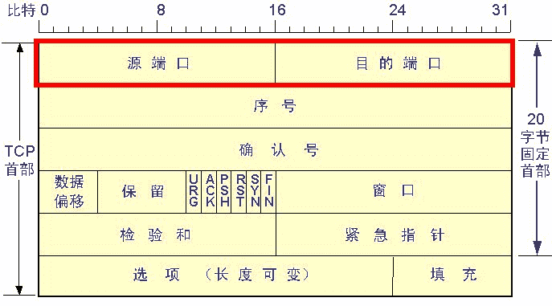

# 猎豹移动 2016 研发工程师笔试题

## 1

下列选项中,属于"10.174.20.176/28"该网段的有效 IP 地址是:

正确答案: B   你的答案: 空 (错误)

```cpp
10.174.20.174
```

```cpp
10.174.20.186
```

```cpp
10.174.20.191
```

```cpp
10.174.20.192
```

本题知识点

网络基础

讨论

[我 is a 牛客](https://www.nowcoder.com/profile/372558)

Bip 地址是 32 位每 8 位为一组的二进制码，由题 10.174.20.176/28，指前 28 位不变，即（10.174.20.不变，还有 4 位不变，这四位的二进制根据 176 知位 1011），故，对此网段的有效 ip 为：10.174.20.1011 0000~10.174.20.1011 1111，排出全 0 和全 1 不能用，则 ip 为：10.174.20.177~10.174.20.190（去掉.176 和.191）.

编辑于 2017-08-03 17:45:27

* * *

[莫荣辉](https://www.nowcoder.com/profile/5629349)

主机号不能全 0 和全 1

发表于 2017-04-04 15:49:43

* * *

[Anotherniukewang](https://www.nowcoder.com/profile/800909)

ip 地址是 32 位每 8 位为一组的二进制码，由题 10.174.20.176/28，指前 28 位不变，即（10.174.20.不变，还有 4 位不变，这四位的二进制根据 176 知位 1011），故，对此网段的有效 ip 为：10.174.20.1011 0000~10.174.20.1011 1111，排出全 0 和全 1 不能用，则 ip 为：10.174.20.177~10.174.20.190（去掉.176 和.191）.

发表于 2017-09-04 20:14:48

* * *

## 2

关于关系型数据库,正确且全面的描述是:

正确答案: A   你的答案: 空 (错误)

```cpp
在关系模型中数据的逻辑结构是一张二维表
```

```cpp
DML 是介于关系代数和关系演算之间的语言,它充分体现了关系数据库语言的特性和优点
```

```cpp
关系模型的完整性规则是对关系的某种约束,分为实体完整性和参照完整性约束
```

```cpp
关系数据库中,关系也称为数据库,元组也称为行,属性也称为列
```

本题知识点

数据库

讨论

[LEarBB](https://www.nowcoder.com/profile/708350)

```cpp
A. 在关系模型中数据的逻辑结构是一张二维表(A 正确)  
B. SQL 语句是介于关系代数和关系演算之间的(结构化查询)语言(B 错  ) 
C. 关系模型的完整性 包括实体完整性 域完整性 参照完整性和用户定义完整性。
  域完整性，实体完整性和参照完整性，是关系模型必须满足的完整性约束条件。(C 错  不完整) 
D. 关系是一张表，表中的每行（即数据库中的每条记录）是一个元组，每列是一个属性。(D 错  说反了)
```

编辑于 2017-08-03 17:46:05

* * *

[细雨湿身](https://www.nowcoder.com/profile/736416)

```cpp
A. 在关系模型中数据的逻辑结构是一张二维表(A 正确)  
B. SQL 语句是介于关系代数和关系演算之间的(结构化查询)语言(B 错  ) 
C. 关系模型的完整性 包括实体完整性 域完整性 参照完整性和用户定义完整性。
  域完整性，实体完整性和参照完整性，是关系模型必须满足的完整性约束条件。(C 错  不完整) 
D. 关系是一张表，表中的每行（即数据库中的每条记录）是一个元组，每列是一个属性。(D 错  说反了)
```

发表于 2016-03-07 20:07:51

* * *

[花花花花花🌸](https://www.nowcoder.com/profile/188943)

A. 在关系模型中数据的逻辑结构是一张二维表(A 正确) B. SQL 语句是介于关系代数和关系演算之间的(结构化查询)语言(B 错 ) C. 关系模型的完整性 包括实体完整性 域完整性 参照完整性和用户定义完整性。 域完整性，实体完整性和参照完整性，是关系模型必须满足的完整性约束条件。(C 错 不完整) D. 关系是一张表，表中的每行（即数据库中的每条记录）是一个元组，每列是一个属性。(D 错 说反了)

发表于 2016-04-25 19:22:04

* * *

## 3

下面关于 TCP 协议的说法,哪些是正确的:

正确答案: A C D   你的答案: 空 (错误)

```cpp
不支持广播通讯
```

```cpp
不需要建立链接,直接可以发生数据
```

```cpp
提供紧急数据传送功能,当有紧急数据发送时,接收方收到后会优先读取紧急数据
```

```cpp
能够探知到接收方处理能力,当接收方大量数据未接收时,会停止继续发送新数据
```

本题知识点

网络基础

讨论

[Pandora](https://www.nowcoder.com/profile/266279)

紧急比特 URG——当 URG＝1 时，表明紧急指针字段有效。它告诉系统此报文段中有紧急数据，应尽快传送(相当于高优先级的数据)。

编辑于 2015-11-30 22:02:04

* * *

[何小坤](https://www.nowcoder.com/profile/438635)

tcp 协议是有链接的数据传输，既然有链接，那肯定不支持广播的 C 需要了解 tcp 数据报格式，有紧急控制位和紧急指针的 D 是 TCP 的一个功能，因为 TCP 是记录数据流的状态的，所以可以检测对方是否接受。

发表于 2016-02-18 17:31:58

* * *

[huixieqingchun](https://www.nowcoder.com/profile/551201)

**TCP 是面向有连接的数据通信，不支持广播通信。**

发表于 2016-06-12 22:23:22

* * *

## 4

下面对 Host 文件描述正确的是()

正确答案: C   你的答案: 空 (错误)

```cpp
这个文件是批处理文件,用来指定域名的访问 IP
```

```cpp
一个 DNS 域名解析服务器文件,用于解析域名对应的 IP 地址
```

```cpp
作用是网址域名与其对应的 IP 地址建立一个关联"数据库"
```

```cpp
当用户输入网址后,系统首先到 DNS 服务器中寻找对应的 IP 地址,如果不存在会到 Host 文件中确定最终访问地址
```

本题知识点

网络基础

讨论

[牛大侠](https://www.nowcoder.com/profile/413533)

```cpp
C
搬运工：Hosts 是一个没有扩展名的系统文件,windows 下存在 C:\Windows\System32\drivers\etc 位置，linux 下存在/etc 位置，其作用就是将一些常用的网址域名与其对应的 IP 地址建立一个关联“数据库”，当用户在浏览器中输入一个需要登录的网址时，系统会首先自动从 Hosts 文件中寻找对应的 IP 地址，一旦找到，系统会立即打开对应网页，如果没有找到，则系统再会将网址提交 DNS 域名解析服务器进行 IP 地址的解析。 
```

编辑于 2017-08-03 17:47:58

* * *

[爬虫慢慢爬](https://www.nowcoder.com/profile/782530)

host 文件一个没有扩展名的系统文件，其作用就是用来存储一些常用的网络域名和与其对应的 ip 地址，当用户输入一个需要登录的网址时，系统就会先去 host 文件中查找，如果找到了就立即打开该网址，如果找不到就去 DNS 域名解析服务器中查找。

发表于 2016-03-21 14:51:22

* * *

[Rubyist](https://www.nowcoder.com/profile/690575)

C**hosts 文件** 是一个用于储存 [计算机网络](https://zh.wikipedia.org/wiki/%E8%AE%A1%E7%AE%97%E6%9C%BA%E7%BD%91%E7%BB%9C) 中各节点信息的计算机文件。这个文件负责将 [主机名称](https://zh.wikipedia.org/wiki/%E4%B8%BB%E6%A9%9F%E5%90%8D%E7%A8%B1) 映射到相应的 [IP 地址](https://zh.wikipedia.org/wiki/IP%E5%9C%B0%E5%9D%80) 。hosts 文件通常用于补充或取代网络中 [DNS](https://zh.wikipedia.org/wiki/DNS) 的功能。和 DNS 不同的是，计算机的用户可以直接对 hosts 文件进行控制。

发表于 2016-03-23 17:29:19

* * *

## 5

两个进程加载同一个动态链接库时(windows 钟的 dll 文件或 linux 中的.so 文件),动态链接库的以下哪个资源是两个进程共享的?

正确答案: D   你的答案: 空 (错误)

```cpp
文本区域
```

```cpp
栈区域
```

```cpp
堆区域
```

```cpp
文件描述符
```

本题知识点

Windows

讨论

[leobuzhi](https://www.nowcoder.com/profile/932073)

文件描述符在形式上是一个非负  查看全部)

编辑于 2016-04-23 20:14:34

* * *

[细雨湿身](https://www.nowcoder.com/profile/736416)

文件描述符在形式上是一个非负整数。实际上，它是一个索引值，指向 [内核](https://zh.wikipedia.org/wiki/%E5%86%85%E6%A0%B8) 为每一个 [进程](https://zh.wikipedia.org/wiki/%E8%BF%9B%E7%A8%8B) 所维护的该进程打开文件的记录表。当程序打开一个现有文件或者创建一个新文件时，内核向进程返回一个文件描述符。在 [程序设计](https://zh.wikipedia.org/wiki/%E7%A8%8B%E5%BA%8F%E8%AE%BE%E8%AE%A1) 中，一些涉及底层的程序编写往往会围绕着文件描述符展开。但是文件描述符这一概念往往只适用于 [UNIX](https://zh.wikipedia.org/wiki/UNIX) 、 [Linux](https://zh.wikipedia.org/wiki/Linux) 这样的操作系统。Linux/ [UNIX](https://zh.wikipedia.org/wiki/UNIX) 系统：在 exec()之后和程序指令运行之前的过程：

*   将可执行文件的内存段添加到进程映像中；
*   把共享目标内存段添加到进程映像中；
*   为可执行文件和它的共享目标(动态链接库)执行重定位操作；
*   关闭用来读入可执行文件的文件描述符，如果动态链接程序收到过这样的文件描述符的话；
*   将控制转交给程序，使得程序好像从 exec()直接得到控制

发表于 2016-03-07 20:10:12

* * *

[Adv_Zxy](https://www.nowcoder.com/profile/9673524)

code segment (text)的代码不是共享的吗?

发表于 2017-08-15 19:56:56

* * *

## 6

如果将网络 IP 段 40.15.128.0/17 划分成 2 个子网,则第一个子网 IP 段为 40.15.128.0/18,则第二个子网为:

正确答案: D   你的答案: 空 (错误)

```cpp
40.15.129.0/18
```

```cpp
40.15.128.128/18
```

```cpp
40.15.192.0/17
```

```cpp
40.15.192.0/18
```

本题知识点

网络基础

讨论

[极速回应的字节内推君](https://www.nowcoder.com/profile/770716)

前面的人讲的不太清楚，我来补充一下 1.IP 地址 32 位，分为两段：网络地址＋主机地址。其中可由主机地址分离出一些位来作为子网地址 2.斜线后的数字是表示用多少位来表示网络地址，这里很明显是 17 位，那么只有 15 位表示主机地址 3.这里分成了两个子网，也就只需要用一位来表示。也就是第 18 位 4.第一个地址的第十八位明显是 0，第二个只能是 1 5.综上，得答案

发表于 2017-01-28 11:56:37

* * *

[SunburstRun](https://www.nowcoder.com/profile/557336)

答案是 D       我们就看后面 16 位.1 0 0 0 0 0 0 0 划分成 2 个子网,那么就是占据开头 2 位因为 40.15.128.0/18,所以它的开头是 1 0......那么剩下这个一定是 1 1,所以为 128+64=192

发表于 2015-11-30 13:41:31

* * *

[huixieqingchun](https://www.nowcoder.com/profile/551201)

**划分两个子网，就是占用一位主机位。**

发表于 2016-06-23 09:26:09

* * *

## 7

关于 web 表单登录中用到的图形验证码的实现,以下做法不正确的有:

正确答案: A B D   你的答案: 空 (错误)

```cpp
返回给浏览器的 html 代码中包含图形验证码和文本字符串,登录前客户端判断输入内容和页面中保存的内容是否一致
```

```cpp
服务器端在返回的图片和 cookie 中同时包含图形验证码,登录前客户端判断输入内容和 cookie 保存的内容是否一致
```

```cpp
服务器端生成验证码后一方面通过图片将验证码返回给客户端,同时在服务器端保存文本的验证码,由服务器端验证输入内容是否正确
```

```cpp
浏览器通过识别图形验证码中的内容和用户输入的内容判断是否一致
```

本题知识点

HTML

讨论

[baohao](https://www.nowcoder.com/profile/214864)

目测 A,B,D 都是不正确的验证码的实现方式。所以答案选 A B D。A B 选项都把正确的验证码文本放在了客户端，这是违背了验证码的初衷的。爬虫或者是恶意程序依旧可以通过各种手段获取你嵌入在 html 文本或者保存在 cookie 中的正确验证码文本，模拟表单提交来达到攻击的目的。D 选项更是无稽之谈。C 选项才是正确的实现方式，发送到客户端的只有图片形式的验证码，服务器端保存 cookie 对应的图形验证码的正确文本。客户端表单提交时到服务器端验证。

发表于 2015-12-02 20:40:08

* * *

[希望拥抱变化的西瓜](https://www.nowcoder.com/profile/537800)

关键是  客户端出于安全考虑，不能直接在客户端进行验证

发表于 2016-07-29 09:24:33

* * *

[w&&h](https://www.nowcoder.com/profile/5673612)

关键在于：验证是由服务器完成的而不是浏览器的活服务器将“锁-钥匙”造出来，将图片形式的钥匙发送给浏览器，服务器本身留着文本形式的“锁”，最后需要钥匙传送回服务器才能解锁。

发表于 2017-11-29 10:37:49

* * *

## 8

进程和线程是操作系统中最基本的概念,下列有关描述错误的是:

正确答案: D   你的答案: 空 (错误)

```cpp
线程，有时被称为轻量级进程(Lightweight Process，LWP），是程序执行流的最小单元。
```

```cpp
由于线程没有独立的地址空间,因此同一个进程的一组线程可以访问该进程资源,这些线程之间的通信也很高效
```

```cpp
线程之间的通信简单(共享内存即可,但须注意互斥访问的问题),而不同进程之间的通信更为复发,通常需要调用内核实现
```

```cpp
线程有独立的虚拟地址空间,但是拥有的资源相对进程来说,只有运行所必须的栈,寄存器等
```

本题知识点

操作系统

讨论

[Ed](https://www.nowcoder.com/profile/916602)

感觉 B 没错，A 倒是可疑。

发表于 2016-03-22 18:40:06

* * *

[日照香炉](https://www.nowcoder.com/profile/841825)

B:线程之间的通信是为了同步（毕竟共享进程的资源），同步措施实施起来并不高效

发表于 2015-12-02 16:14:22

* * *

[牛客 172827 号](https://www.nowcoder.com/profile/172827)

D、怎么就对了？难道线程有自己的地址空间？？？？进程和线程的一个区别不就是说，进程有自己的独立的虚拟用户地址空间，而线程没有，和该进程的其他线程共享进程的地址空间吗？求大神指点！！！

编辑于 2016-07-17 17:28:02

* * *

## 9

下列选项中,不属于 SQL 约束的是:

正确答案: D   你的答案: 空 (错误)

```cpp
UNIQUE
```

```cpp
PRIMARY KEY
```

```cpp
FOREIGN KEY
```

```cpp
BETWEEN
```

本题知识点

数据库

讨论

[牛客 692087 号](https://www.nowcoder.com/profile/692087)

**D****约束主要有一下几种:**  查看全部)

编辑于 2015-12-02 18:53:36

* * *

[细雨湿身](https://www.nowcoder.com/profile/736416)

约束主要有一下几种:

NOT NULL : 用于控制字段的内容一定不能为空（NULL）。 

UNIQUE : 控制字段内容不能重复，一个表允许有多个 Unique 约束。

PRIMARY KEY: 也是用于控制字段内容不能重复，但它在一个表只允许出现一个。

FOREIGN KEY: FOREIGN KEY 约束用于预防破坏表之间连接的动作，FOREIGN KEY 约束也能防止非法数据插入外键列，因为它必须是它指向的那个表中的值之一。

CHECK: 用于控制字段的值范围。

DEFAULT: 用于设置新记录的默认值。

发表于 2016-03-07 20:14:38

* * *

[花花花花花🌸](https://www.nowcoder.com/profile/188943)

约束主要有一下几种: NOT NULL : 用于控制字段的内容一定不能为空（NULL）。  UNIQUE : 控制字段内容不能重复，一个表允许有多个 Unique 约束。 PRIMARY KEY: 也是用于控制字段内容不能重复，但它在一个表只允许出现一个。 FOREIGN KEY: FOREIGN KEY 约束用于预防破坏表之间连接的动作，FOREIGN KEY 约束也能防止非法数据插入外键列，因为它必须是它指向的那个表中的值之一。 CHECK: 用于控制字段的值范围。 DEFAULT: 用于设置新记录的默认值。

发表于 2016-04-24 23:22:50

* * *

## 10

在 linux 网络编程中,以下关于 socket 描述符正确的是:

正确答案: A C   你的答案: 空 (错误)

```cpp
socket 存在两种模式:阻塞和非阻塞
```

```cpp
系统调用 read 从 socket 中读取数据时,当 read 返回-1 的时候,表示 socket 中数据读取完毕
```

```cpp
如果 socket 设置成非阻塞模式,当 socket 的输入缓冲区没有可读数据时,read 操作会返回错误
```

```cpp
在阻塞 socket 上调用 write 函数发送数据,函数返回时,表示数据已经发送出去
```

本题知识点

Linux

讨论

[scanf_cin](https://www.nowcoder.com/profile/377724)

socket 调用 write 发生错误是也会返回，但是返回的是-1。所以不是返回了就代表数据已经发出去了。。。。

发表于 2015-11-30 14:20:16

* * *

[噼里啪啦酱](https://www.nowcoder.com/profile/486089)

我觉得答案是 AC.B：非阻塞模式下，返回 0 表示对端发送 close 关闭连接；**所以我觉得这个也不一定正确。**C:正确.非阻塞模式下，如果缓冲区为空，那么 read 返回-1，同时设置 errno=EAGAIN。D：非阻塞模式下，表示写入内核 socket 缓冲区；阻塞模式下表示成功发送出去。

编辑于 2016-05-15 18:57:09

* * *

[codelife](https://www.nowcoder.com/profile/997126)

从写一个 TCP 套接字的 write 调用成功返回仅仅表示我们可以重新使用原来的应用进程缓冲区，并不代表对端 TCP 或应用进程已接收到数据。

对端 TCP 必须确认收到的数据，伴随来自对端的 ACK 的不断到达，本端 TCP 至此才能从套接字发送缓冲区中丢弃已确认的数据，TCP 必须为已发送的数据保留一个副本，直到它被对端确认为止。

UDP 不保存应用进程数据的副本因此无需一个真正的发送缓冲区，write 调用成功返回表示所写的数据报或其所有分片已被加入数据链路层的输出队列。

对于 read 调用（套接字标志为阻塞），如果接收缓冲区中有 20 字节，请求读 100 个字节，就会返回 20。对于 write 调用（套接 字标志为阻塞），如果请求写 100 个字节，而发送缓冲区中只有 20 个字节的空闲位置，那么 write 会阻塞，直到把 100 个字节全部交给发送缓冲区才返 回，如果 write 中得套接字标志为非阻塞，则直接返回 20，因此我们可以实现自己的 readn 和 writen 函数。

每个 TCP 套接字都有一个发送缓冲区和一个接收缓冲区，每个 UDP 套接字都有一个接收缓冲区；
[`www.tuicool.com/articles/FRVJj2`](http://www.tuicool.com/articles/FRVJj2)
[`blog.csdn.net/hguisu/article/details/7453390`](http://blog.csdn.net/hguisu/article/details/7453390)

发表于 2016-08-22 13:57:23

* * *