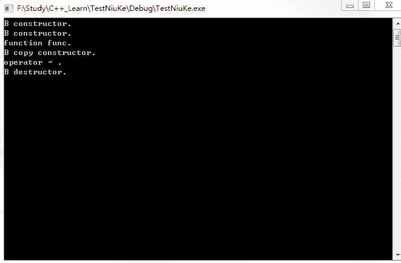
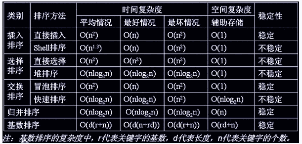
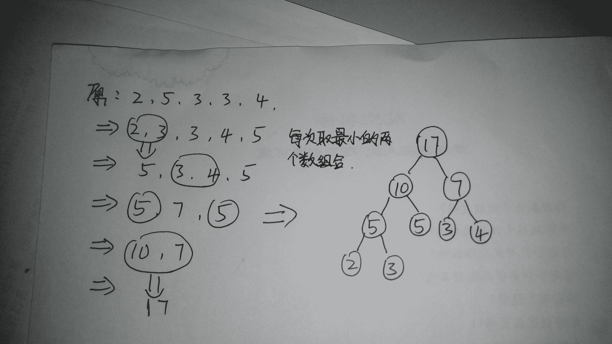
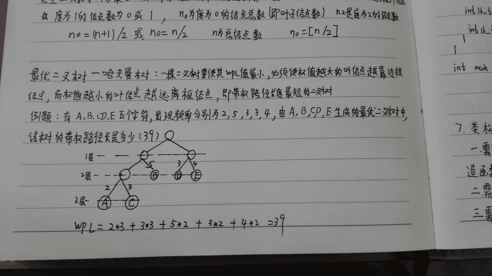

# 搜狗 2016 C++工程师笔试题

## 1

关于重载和多态正确的是

正确答案: B   你的答案: 空 (错误)

```cpp
如果父类和子类都有相同的方法,参数个数不同,将子类对象赋给父类后,由于子类继承于父类,所以使用父类指针
调用父类方法时,实际调用的是子类的方法
```

```cpp
选项全部都不正确
```

```cpp
重载和多态在 C++面向对象编程中经常用到的方法,都只在实现子类的方法时才会使用
```

```cpp

```
class A{
	void test(float a){cout<<"1";}
};
class B:public A{
	void test(int b){cout<<"2";}
};
A *a=new A;
B *b=new B;
a=b;
a.test(1.1);
结果是 1

```cpp

```

本题知识点

C++ C++工程师 运维工程师 前端工程师 算法工程师 PHP 工程师 搜狗

讨论

[SunburstRun](https://www.nowcoder.com/profile/557336)

答案是 B  查看全部)

编辑于 2015-12-02 17:47:40

* * *

[macrofun](https://www.nowcoder.com/profile/855121)

选项 D 确实不该选，做过之后再来看，选 D 确实太傻了。首先，class 默认访问权限为 private，故所有函数都不能在外部被调用。其实，即使把函数的访问权限声明为 public，也还是不对。通过指针调用函数，应该使用 a->test(1.1); 错的离谱。选 D 确实不该。正确答案为 B。

编辑于 2015-12-14 10:53:14

* * *

[花蝶恋](https://www.nowcoder.com/profile/214466)

D 选项有 2 点错误 1.class 默认的属性为 private，不能用对象调用 private2.好多人认为在基类的 test 加上 virtual 就对了，其实 不然，虚函数要求返回值，参数名，参数个数，函数类型都相同，很显然基类和派生类的参数类型是不同的。对，这个例子根本不是覆盖！它是隐藏，隐藏分为 2 种： (1) 派生类的函数与基类的函数同名，但是参数列表有所差异。此时，不论有无 virtual 关键字，基类的函数在派生类中将被隐藏。(2） 派生类的函数与基类的函数同名，参数列表也相同，但是基类函数没有 virtual 关键字。

发表于 2016-02-28 17:51:53

* * *

## 2

现有两堆硬币，小明和小亮玩游戏，每次每人只能从其中一堆中取走 1 个或 2 个硬币，最后将硬币取完者算作胜利，当两堆硬币的个数分别是 12、13 时，小明应该如何安排策略才能必定获得胜利?

正确答案: C   你的答案: 空 (错误)

```cpp
安排小亮先取硬币
```

```cpp
小明或小亮均一定必胜
```

```cpp
安排自己先取硬币
```

```cpp
不可能必胜
```

本题知识点

数学运算

讨论

[SunburstRun](https://www.nowcoder.com/profile/557336)

答案是 C  查看全部)

编辑于 2015-12-02 18:08:37

* * *

[Aki_Willow](https://www.nowcoder.com/profile/819693)

小明先在 13 的堆中取一个，之后不管小亮在哪个堆中取多少个，小明都在另一个堆中取相同多个，比如小亮在第一堆取 2 个，小明就在第二堆取 2 个，这样两堆一直一样多，最后一个必定被小明取到。

发表于 2015-12-05 00:52:49

* * *

[indere](https://www.nowcoder.com/profile/480421)

硬币数为 12 的堆，取完所需的次数至少是 6，最多为 12，所有可能为{6,8,10,12}。硬币数为 13 的堆，取完所需的次数至少是 7，最多为 13，所有可能为{7,9,11,13}。将两个堆都取完所需的次数 偶数+奇数=奇数。 所以先手能够胜利。

发表于 2016-06-05 09:26:41

* * *

## 3

不考虑任何编译器优化(如:NRVO),下述代码的第 10 行会发生

```cpp
#include <stdio.h>
class B{
};
B func(const B& rhs){
  return rhs;
}
int main(int argc, char **argv){
  B b1, b2;
  b2 = func(b1);  //10
}
```

正确答案: D   你的答案: 空 (错误)

```cpp
一次默认构造函数,一次拷贝构造函数,一次析构函数,一次(拷贝赋值运算符)operator=
```

```cpp
二次拷贝构造函数,一次析构函数
```

```cpp
一次(拷贝赋值运算符)operator=,一次析构函数
```

```cpp
一次拷贝构造函数,一次析构函数,一次(拷贝赋值运算符)operator=
```

本题知识点

C++ C++工程师 运维工程师 前端工程师 算法工程师 PHP 工程师 搜狗 C 语言

讨论

[zray4u](https://www.nowcoder.com/profile/475358)

Db2=func(b1  查看全部)

编辑于 2015-12-10 13:26:31

* * *

[stanly](https://www.nowcoder.com/profile/6519340)

D zray4u 说得不完全对大家可以去自己调试一下 答案是 D 但是次序并不是 一次拷贝构造函数,一次析构函数,一次(拷贝赋值运算符)operator=而是一次拷贝构造函数,一次(拷贝赋值运算符)operator= ,一次析构函数 1.一次拷贝构造函数发生在 func 函数调用完成，返回 B 类型的对象时，因为返回的不是引用类型，所以会生成一个对象，不妨称为 TEMP，将返回的对象通过拷贝构造函数复制给 TEMP，由于拷贝构造函数的参数是 const B&，rhs 并不会在函数结束时候被析构，这时并不调用析构函数；2.赋值运算符在 func 函数执行完成后，将上面提到的 TEMP，通过赋值运算符赋值给 b2；3.这句表达式的最后将临时对象 TEMP 进行析构；可以试一试将 B func(constB& rhs) 改为 B func(constB rhs)，rhs 才会被析构；

发表于 2016-07-23 15:43:33

* * *

[LeoJJ](https://www.nowcoder.com/profile/3755354)

```cpp

	#include <stdio.h>

	classB

	{

	public:

	    B(){

	        printf("B constructor.\n");

	    }

	    ~B(){

	        printf("B destructor.\n");

	    }

	    B(constB& other)

	    {

	        printf("B copy constructor.\n");

	    }

	        B& operator =(B& rhs)

	    {

	        printf("operator = .\n");

	        returnrhs;

	    }

	};

	B func(constB& rhs){

	    printf("function func.\n");

	    returnrhs;

	}

	intmain(intargc,char**argv)

	{

	  B b1,b2;

	  {

	  b2=func(b1);

	  }

	  getchar();

	  return0;

	}

```



发表于 2016-08-31 10:45:03

* * *

## 4

在上下文和头文件均正常的情况下，下面代码的输出结果是()

```cpp
int main(){
   int pid;
   int num = 1;
   pid = fork();
   if(pid > 0){
   num++;
   printf("in parent:num:%d addr:%x\n", num, &num);
   }
   else if(pid == 0){
   printf("in child:num:%d addr:%x\n", num, &num);
   }
}
```

正确答案: B   你的答案: 空 (错误)

```cpp
父子进程中输出的 num 相同,num 地址不相同
```

```cpp
父子进程中输出的 num 不同,num 地址相同
```

```cpp
父子进程中输出的 num 相同,num 地址也相同
```

```cpp
父子进程中输出的 num 不同,num 地址不相同
```

本题知识点

C++ C++工程师 运维工程师 前端工程师 算法工程师 PHP 工程师 搜狗 C 语言

讨论

[wanxiaonan](https://www.nowcoder.com/profile/300590)

```cpp
虚拟地址空间。num 地址的值相
```

  查看全部)

编辑于 2016-03-22 15:58:19

* * *

[挥着牛鞭的男孩](https://www.nowcoder.com/profile/825762)

其实刚刚 fork 出来不止虚拟地址一样，物理地址也一样。当进程发生分歧时，即修改此变量时，才会分配不同的物理地址，也就是 copy-on-write，写时复制。

发表于 2016-08-20 10:42:13

* * *

[感恩的心](https://www.nowcoder.com/profile/249731)

问题就出在地址想不相同，如果按照两个进程各处在独自的虚拟进程地址空间分析的话，这个题很容易会选择第四个答案，但是 Linux 中的资源分配都是虚拟机制，也就是说，他们还是会共用一个虚拟的地址，但是映射到物理内存就可能会不一样。

发表于 2016-02-29 11:21:31

* * *

## 5

```cpp
int a=0;
class someClass{
   int b;
   static int c;
};
int main(){
   int d=0;
   someClass *p=new someClass();
   return 0;
}
```

关于以上代码中的变量在内存中的存储位置描述正确的是()

正确答案: A   你的答案: 空 (错误)

```cpp
堆、栈、全局区均有变量
```

```cpp
不存在堆区的变量
```

```cpp
不存在栈区的变量
```

```cpp
不存在全局变量区的变量
```

本题知识点

C++ C++工程师 运维工程师 前端工程师 算法工程师 PHP 工程师 搜狗

讨论

[Pandora](https://www.nowcoder.com/profile/266279)

B1、**栈区**（stack）— 由编译器自动分配释放 ，存放为运行函数而分配的局部变量、函数参数、返回数据、返回地址等。
2、**堆区**（heap） — 一般由程序员分配释放， new, malloc 之类的，若程序员不释放，程序结束时可能由 OS 回收 。3、**全局区**（静态区）（static）— 存放全局变量、静态数据、常量。程序结束后由系统释放。
4、**文字常量区** — 常量字符串就是放在这里的。程序结束后由系统释放。
5、**程序代码区** — 存放函数体（类成员函数和全局函数）的二进制代码。////////////////////////////////////////a，全局变量，全局区；b，成员变量，堆区；（我是这样理解的，因为对象要申请，会放在堆区，所以类的成员也就是放在堆区）c，静态变量，静态区；d，方法变量，栈区；p，方法变量，栈区，指向堆区的对象。

编辑于 2017-06-19 16:22:41

* * *

[testestest](https://www.nowcoder.com/profile/913613)

变量 a 全局变量 存放在全局变量区
变量 b 类的成员变量 由类的定义决定  在 main 函数中类 A 动态分配 因此 b 在堆区
变量 c 静态成员 静态存储区
变量 d 局部变量 栈区

编辑于 2016-11-29 21:06:04

* * *

[huixieqingchun](https://www.nowcoder.com/profile/551201)

** 这里要注意理解 b，因为对象有动态分配空间时，里面已经包含了成员变量的空间，所以成员变量也存储在堆中。**

发表于 2016-05-21 15:12:51

* * *

## 6

以下代码段有问题的是()

正确答案: A B C   你的答案: 空 (错误)

```cpp
<pre>void func1(char *e){
  char *p1;
  p1=malloc(100);
  sprintf(p1,error:"%s'.",e);
  local_log(p1);
  }
</pre>
```

```cpp
<pre>
int func2(char *filename)
  {
    FILE *fp;
    int key;
    fp=fopen(filename,"r");
    fscanf(fp,"%d",&key);
    return key;
   }
</pre>
```

```cpp
<pre>
void func3(char *info){
  char *p,*pp;
  p=malloc(100);
  pp=p;
  free(p);
  sprintf(pp,*info:"%s'.",info);
  free(pp);
  }
</pre>
```

```cpp
选项全部正确
```

本题知识点

C++工程师 运维工程师 前端工程师 算法工程师 PHP 工程师 搜狗 C 语言

讨论

[SunburstRun](https://www.nowcoder.com/profile/557336)

答案是 ABC  查看全部)

编辑于 2015-12-02 18:01:57

* * *

[下里巴人](https://www.nowcoder.com/profile/361316)

A、首先 malloc 的用法也不对， malloc 默认返回的是空指针 void* 需要程序猿在 malloc 前面指定类型，比如本例 p1= (char*) malloc(100)。其次在函数内部 malloc 的内存需要 freeB 、明显的没有关闭文件流 C、free 两次 程序会出错

发表于 2016-03-06 17:00:07

* * *

[编程小王子](https://www.nowcoder.com/profile/112662)

sprintf 函数的用法：在将各种类型的数据构造成字符串时，sprintf 的强大功能很少会让你失望的，由于 sprintf 和 printf 在用法上几乎一样，知识打印的目的地不同而已，sprintf 打印到字符串中，而 printf 则直接在命令行上输出。这也是 sprintf 比 printf 有用得多；sprintf 是个变参函数，定义如下：int sprintf(char *buffer,const char *format[,argument ]..);除了前俩个参数类型固定外，后面可以接任意多个参数。而它的精华，显然就在第二个参数；格式化字符串上。printf 和 sprintf 都使用格式化字符串来指定串的格式，在格式串内部使用一些以“%”开头的格式，说明符（format specifications）来占据一个位置，在后边的便餐列表中提供相应的变量，最终函数就会用相应的变量来替代那个说明符，产生一个调用者想要的字符串。格式化数字字符串：sprintf 最常用的应用之一莫过于把整数打印到字符串中，所以 sprintf 在大多数场合可以替代 itoa.B、int func2(char *filename)  {    FILE *fp;    int key;    fp=fopen(filename,"r");    fscanf(fp,"%d",&key);    return key;   }C、void func3(char *info){  char *p,*pp;  p=malloc(100);  pp=p;  free(p);  sprintf(pp,*info:"%s'.",info);  free(pp);  }A 申请了空间没有释放，B fp=fopen();打开流没有关闭，C free 了二次，但其实，pp=p;两个指针都指向同一块内存空间。只需释放一次就够了。

发表于 2016-01-05 21:31:33

* * *

## 7

```cpp
#include<stdio.h>
int main(){
    unsigned char i = 7;
    int j = 0;
    for(;i > 0;i -= 3){
       ++j;
    }
    printf("%d\n", j);
    return 0;
}
```

请问该程序的输出是多少?

正确答案: C   你的答案: 空 (错误)

```cpp
2
```

```cpp
死循环
```

```cpp
173
```

```cpp
172
```

本题知识点

C++ C++工程师 运维工程师 前端工程师 算法工程师 PHP 工程师 搜狗 C 语言

讨论

[啥](https://www.nowcoder.com/profile/811262)

这题正着推不容易，可以考虑反  查看全部)

编辑于 2016-08-26 10:22:37

* * *

[Pandora](https://www.nowcoder.com/profile/266279)

感谢[牛客 2862122 号](http://www.nowcoder.com/profile/2862122)，细节已修正。————————————————unsigned char 8 位数据位，范围**0-255**，
所以-2（11111110）时，溢出变成 254；
同理-1（11111111）时，溢出变成 255；
最后减到 0 时，不满足循环条件，for 停止。
刚好 173 次。
7 4 1 ==> 共**(7-1)/3+1=3**次（1-3=-2，即 254，**继续循环**）
**254** 251 ... 5 2 ==> 共**(254-2)/3+1=85**次（2-3=-1，即 255，**继续循环**）
**255** 252 ... 6 3 ==> 共**(255-5)/3+1=85**次（3-3=0，**退出循环**）
所以总共 173 次。

编辑于 2016-08-26 10:28:59

* * *

[小小酥](https://www.nowcoder.com/profile/173291)

-2 的原码是 1000 0010，反码是 1111 1101，补码是 1111 1110，计算机中存储的是补码，即存的是 1111 1110，又因为这里是无符号的，所以最高位的 1 不代表符号，所以 1111 1110 为 254，同理，依次推，直到 i 为 0，可得一共 173 次 7 4 1——3 次 254 251....2——85 次 255 252....3——85 次 3-3 为 0，就不会进入循环了，一共 173 次

发表于 2016-03-02 17:30:48

* * *

## 8

快速排序在下面哪种情况下优势最明显()

正确答案: C   你的答案: 空 (错误)

```cpp
数据有多个相同数值
```

```cpp
数据基本有序
```

```cpp
数据基本无序
```

```cpp
数据无任何相同数值
```

本题知识点

排序 *C++工程师 运维工程师 前端工程师 算法工程师 PHP 工程师 搜狗* *讨论

[编程小王子](https://www.nowcoder.com/profile/112662)

快速排序属于内部排序；快速排序的实现基于分治法，具体分为三个步骤。假设待排序的序列为 L[m..n]。分解：序列 L[m .. n]被划分成两个可能为空的子序列 L[m .. pivot-1]和 L[pivot+1 .. n]，使 L[m .. pivot-1]的每个元素均小于或等于 L[pivot]，同时 L[pivot+1.. n]的每个元素均大于 L[pivot]。其中 L[pivot]称为这一趟分割中的主元（也称为枢轴、支点）。解决：通过递归调用快速排序，对子序列 L[m .. pivot-1]和 L[pivot+1 .. r]排序。合并：由于两个子序列是就地排序的，所以对它们的合并不需要操作，整个序列 L[m .. n]已排好序。快速排序每次将待排序数组分为两个部分，在理想状况下，每一次都将待排序数组划分成等长两个部分，则需要 logn 次划分。而在最坏情况下，即数组已经有序或大致有序的情况下，每次划分只能减少一个元素，快速排序将不幸退化为冒泡排序，所以快速排序时间复杂度下界为 O(nlogn)，最坏情况为 O(n²)。在实际应用中，快速排序的平均时间复杂度为 O(nlogn)。

发表于 2016-01-05 21:57:29

* * *

[OnlyWu](https://www.nowcoder.com/profile/1758602)

快排效率的高低取决于递归深度的深浅,当基本有序时,会向基准元素的左边或者右边进行 高深度递归,而基本无序时,递归的深度 远远小于高深度递归的深度所以基本无序时,效率最高,优势最明显

发表于 2016-10-15 17:00:44

* * *

[牛客 942885 号](https://www.nowcoder.com/profile/942885)

当数据相同时，会增加相同数据间的交换，而数据基本有序会增加递归次数，显然递归次数增加影响更大

发表于 2016-07-15 22:16:23

* * *

## 9

下列各树形结构中，哪些是平衡二叉查找树：

正确答案: C   你的答案: 空 (错误)

```cpp

```
 	    4
            / \
           3   5
          /     \
         2       8
        /         \
       1           9

```cpp

```

```cpp

```
 	      7
             / \
            2   8
           / \
          1   4
             / \
            3   5

```cpp

```

```cpp

```
	       5
             /   \
            2     8
           / \   /
          1   4 7
             /
            3

```cpp

```

```cpp

```
		7
              /   \
             2     8
            / \   /
           1   4 6
              /
             3

```cpp

```

本题知识点

树 算法工程师 搜狗

讨论

[好学上进](https://www.nowcoder.com/profile/708096)

二叉平衡查找树：
左子树中所有节点的值小于根的值，右子树中的所有节点的值大于根的值
左右子树的高度之差的绝对值为 0 或 1
一看，A、B 就不满足第 2 条
D 不满足第 1 条

发表于 2015-12-04 23:04:22

* * *

[空空以空空](https://www.nowcoder.com/profile/479441)

这道题倒是很好的让我彻底搞明白了平衡树和排序（查找）树

*   平衡二叉树，或是一棵空树，或符合以下特性：

     **【平衡特性 1】**：左子树的深度和右子树的深度相差不能超过 1，可以是 0（代表左右子树深度一样）、-1（代表左子树比右子树少一层）、1（代表左子树比右子树多一层）    **【平衡特性 2】它的左右子树也要是平衡二叉树**

*   查找树，**或是一棵空树**，或满足符合以下特性：

    **【查找特性 1】**：若左子树不为空，左子树节点**所有的值**均要小于根节点；   **【查找特性 2】：** 若右子树不为空，右子树节点**所有的值**均要大于根节点；   **【查找特性 3】它的左右子树也要是查找树**
据此，我们可以排除掉 AB。
因为 A 中只有根节点满足了【平衡特性 1】，而它的左孩子 3 并没有右子树，右孩子 5 并没有左子树，左子树的平衡因子是 2。B 中，左子树深度是 2，右子树深度是 0，不是平衡树 D 中，根节点的右子树不符合条件，节点 6，小于根节点 7，不符合【查找特性 2】

发表于 2017-09-02 17:13:27

* * *

[牛客 983574 号](https://www.nowcoder.com/profile/983574)

A 的 3、5 节点左右子树不平衡

发表于 2016-09-08 19:03:13

* * *

## 10

下面哪种数据结构最适合创建一个优先级队列()

正确答案: A   你的答案: 空 (错误)

```cpp
堆
```

```cpp
双向链表
```

```cpp
单向链表
```

```cpp
栈
```

本题知识点

队列 *C++工程师 运维工程师 前端工程师 算法工程师 PHP 工程师 搜狗* *讨论

[小虎牙](https://www.nowcoder.com/profile/512935)

```cpp
一般用堆来实现，就是具有优先级的队列。在一堆数中能够确定那个最大，最大的优先服务。
```

发表于 2015-12-03 09:30:30

* * *

[revivedSuN](https://www.nowcoder.com/profile/141075)

4 种结构都可以构建优先队列。但双向链表、 单向链表、 栈 入队，出队需要搜索全部元素。所以堆最合适。

发表于 2016-02-05 10:55:54

* * *

[编程小王子](https://www.nowcoder.com/profile/112662)

优先级：  在一个堆中可以确定那个最大，最小的优先服务。即：用堆来实现具有优先级的队列；

发表于 2016-01-05 22:03:09

* * *

## 11

某个大型的网络游戏网站,现有几亿用户,为了实时获取前十名游戏分数最高的玩家,使用以下哪个排序算法比较合理()

正确答案: D   你的答案: 空 (错误)

```cpp
基数排序
```

```cpp
快速排序
```

```cpp
二叉排序
```

```cpp
堆排序
```

本题知识点

排序 *讨论

[想做樱木的圆寸少年](https://www.nowcoder.com/profile/906117)

感觉前面的评论的朋友都没有说出问题的本质。我觉得这道题选择堆排序的根本原因在于需求只说了获取前十名玩家的信息。除了堆排序之外，其他的排序都不能在单次 logN 的条件下完成对最大值/最小值的查找。**而堆排序，每次排序的结果就是找到当前堆中的最大/最小值。****因此完成需求的时间复杂度为 O(logN)。****当我们需要找到常数级的最大/最小值时，往往堆排序是我们应该最先考虑的**快速排序只有在对整个空间排序完成后才能找出前 10 名，因而时间复杂度是 O(logN).因此选 D

编辑于 2016-03-08 09:43:45

* * *

[牛客 706988 号](https://www.nowcoder.com/profile/706988)

D,参考如下比较表。堆排序时间复杂度和空间复杂度都是最优的。个人感觉堆排序唯一的缺点就是算法较为复杂，代码量稍大。

| 排序法 | 最差时间分析 | 平均时间复杂度 | 稳定度 | 空间复杂度 |
| 冒泡排序 | O(n²) | O(n²) | 稳定 | O(1) |
| 快速排序 | O(n²) | O(n*log[2]n) | 不稳定 | O(log[2]n)~O(n) |
| 选择排序 | O(n²) | O(n²) | 稳定 | O(1) |
| 二叉树排序 | O(n²) | O(n*log[2]n) | 不一顶 | O(n) |
| 插入排序 | O(n²) | O(n²) | 稳定 | O(1) |
| 堆排序 | O(n*log[2]n) | O(n*log[2]n) | 不稳定 | O(1) |
| 希尔排序 | O | O | 不稳定 | O(1) |

发表于 2015-12-03 17:40:48

* * *

[炫](https://www.nowcoder.com/profile/376795)

**各种排序的稳定性，时间复杂度和空间复杂度总结：****** 

发表于 2015-12-08 14:08:40

* * *

## 12

有 A,B,C,D,E 五个字符，出现的频率分别为 2,5,3,3,4，由 A,B,C,D,E 生成的最优二叉树中，该树的带权路径长是多少（）

正确答案: C   你的答案: 空 (错误)

```cpp
35
```

```cpp
49
```

```cpp
39
```

```cpp
45
```

本题知识点

树 搜狗

讨论

[crisy1991](https://www.nowcoder.com/profile/851211)



发表于 2016-08-05 22:10:30

* * *

[zhaoying](https://www.nowcoder.com/profile/316866)



发表于 2016-04-12 15:27:46

* * *

[张客牛](https://www.nowcoder.com/profile/733369)

最优二叉树又称哈夫曼树，是一类带权路径长度最短的树。哈夫曼编码就是一种应用广泛且非常高效的数据压缩技术。构造哈夫曼树：    将 2,5,3,3,4 按从小到大排序为 2,3,3,4,5    2+3=5 +3=8 +4=12 +5=17
    WPL=2*3+3*3+5*2+3*2+4*2=39;

发表于 2016-03-15 11:10:38

* * *

## 13

从根开始按层序遍历一颗二叉树，需要使用（）作为辅助数据结构

正确答案: B   你的答案: 空 (错误)

```cpp
heap
```

```cpp
queue
```

```cpp
binary tree
```

```cpp
stack
```

本题知识点

树 搜狗

讨论

[InGodWeTrust](https://www.nowcoder.com/profile/2178882)

广度优先遍历用队列深度优先遍历用栈

发表于 2017-04-09 16:14:38

* * *

[牛客 477144 号](https://www.nowcoder.com/profile/477144)

B 队列，广度优先堆栈实现深度优先遍历

发表于 2015-12-05 19:11:06

* * *

[好学上进](https://www.nowcoder.com/profile/708096)

仔细想一下，先将根结点 A 入队，再将 A 出队（遍历到 A），然后将 A 的所有子结点（假设为 B、C）入队，接着，B 出队（遍历到 B），将其所有子结点入队，接下来出队的自然是 C（遍历到 C），然后将 C 的所有子结点入队，这样，就遍历了两层。接下来出队的自然是 B 的第一个子结点（遍历到该节点），开始第三层的遍历……可见，我们需要一个先进先出的结构，自然选择队列。

发表于 2015-12-05 09:20:19

* * *

## 14

假设 MySQL 数据库表:

> create table T{k int unsigned not null auto_increment,a date,b varchar(24),c int,d varchar(24),primary key(k),unique key a_index (a DESC,b DESC),key k1(b),key k2(c),key k3(d));

如下哪些 sql 语句查询能较好的利用索引?()

正确答案: A D   你的答案: 空 (错误)

```cpp
select b from WHERE b like 'aaa%';
```

```cpp
select a,b from T WHERE a='2015-10-25' ORDER BY b ASC,c ASC;
```

```cpp
select a,b,c from T WHERE a='2015-10-25' ORDER BY b ASC;
```

```cpp
select a,b,c from T WHERE a='2015-10-25' ORDER BY a,b;
```

本题知识点

数据库 C++工程师 运维工程师 前端工程师 算法工程师 PHP 工程师 搜狗

讨论

[mcq](https://www.nowcoder.com/profile/961991)

解析如下：一、什么是索引：简单的来说，建立索引在进行数据库操作的时候不需要全盘一条条的扫描，删选出符合的记录，索引内部自己有一套优化算法，因此借助索引来对数据库进行操作可以提高查询的效率。二、什么时候建立的索引将失效或效率不高（情况有很多，这里列举常见的几种， 假设在字段 name 上建立了索引）：1、使用了运算符!=，以及关键字 not in, not exist 等，认为产生的结果集很大，往往导致引擎不走索引而是走全盘扫描 2、对索引字段使用了函数，如 where substr(name, 1, 3)=‘mark’， 导致索引无效**3、使用 like 和通配符，第一个字符是%将导致索引失效，如 where name like "%ark“  （A 正确）**.....三、order by 与索引首先利用 where 进行数据查询，这一步是免不了的，至于这一步有没有利用索引暂时不考虑，关键是在获取所有符合的记录后还需要进行排序，看看 order by 是如何利用索引的。如果 order by 中的字段有建立索引，同时：**1、该字段没有出现在 where 中，则在排序的时候需要正常排序，默认 order by 是升序排序, 故索引没有对排序产生有利帮助 （B,C 错误）****2、该字段同时同时出现在 where 中，则在获取记录后不进行排序，而是直接利用索引， 效率变高。（D 正确）**补充： group by 也和 order by 类似

发表于 2016-09-05 16:19:01

* * *

[revivedSuN](https://www.nowcoder.com/profile/141075)

**0**.答案中语句格式太乱首先整理下 sql 语句格式

```cpp
create table T(
       k INT UNSIGNED NOT NULL AUTO_INCREMENT,
       a DATE,
       b varchar(24),
       c INT,
       d varchar(24),
       PRIMARY KEY(k),
       UNIQUE KEY a_index(a DESC,b DESC),
       KEY k1(b),
       KEY k2(c),
       KEY k3(d)
)
```

**1**. 题目问题是哪些 sql 语句查询能较好的利用索引。4 个选项中的 sql 语句可以分为两类没有使用排序(A)，使用了排序(B,C,D)。 **那么这个“** **较好** **”我理解为两种情况。**第一，对于没有使用排序的查询，可以直接通过查询索引返回所需要的结果。第二，对于使用了排序的查询语句在利用了索引的同时，排序是否也利用索引进行排序而不是进行外部排序(explain 中的 using filesort)。 如果是根据这两点评判，我觉得是 ACD，原因如下。**选项 A** . select b from WHERE b like 'aaa%'; 根据条件 b 查询，使用的是索 k1（**通过 explain 可以看到**），由于通过索引查询,索引列包含结果 b(select b)因此只需要通过查询索引，而不需要在访问原表即可得到最终结果。 至于 like 操作，mysql 是能在索引中左最左前缀匹配的 like 比较，这种比较会被转换为普通的范围查询，而 like 中 %若位于开头则无法比较，只能全表扫描。**选项 B**. select a,b from T WHERE a='2015-10-25' ORDER BY b ASC,c ASC; 查询是通过索引 a_index（a,b）完成，而排序中的字段 b,c 无法通过索引直接来排序，因此需要再次使用外部排序最终获取结果。 （**通过 explain 的 extra 字段 using filesort 可以看出**）**选项 C.** select a,b,c from T WHERE a='2015-10-25' ORDER BY b ASC; 通过 explain 可以看到使用了 a_index 索引，由于 a 字段在查询时使用了常量，因此 b 满足最左前最的条件，可以使用索引排序。如果将条件 where 中条件换成 c = xxx，再观察 explain 结果，会发现出现 using filesort.**选项 D**. select a,b,c from T WHERE a='2015-10-25' ORDER BY a,b; 显然排序可以直接通过索引 a_index 完成，而不需要额外的 filesort.参考：[1]高性能 mysql 第 3 版 第五章创建高性能的索引 与 附录 D explain[2]mysql 官方手册 http://dev.mysql.com/doc/refman/5.7/en/create-table.html

编辑于 2016-09-12 00:34:30

* * *

[追梦青春](https://www.nowcoder.com/profile/688119)

A 中的 like 不是需要全表扫描吗

发表于 2016-02-01 23:21:11

* * *

## 15

在一个游戏的任务中,玩家需要进入 1 个山洞,取得宝石,之后回到入口.山洞的地图如下:    S--------------------TS 是入口 T 处有宝箱,打开宝箱之后可能得到的物品有:1)宝石,出现概率为 5%.2)魔法券.出现概率为 50%.玩家每消耗一个魔法券,可以直接传送到入口 S.3)什么也没有,概率为 45%.S 到 T 的距离为 1\.每次玩家回到 S 之后,宝箱 T 的状态会重置,再次进入山洞可以重新打开宝箱获得物品.玩家的任务是到达 T 获取宝石之后回到入口 S.如果到达 T 之后没有获得宝石,可以走出山洞之后再进入反复刷.问题:玩家完成任务所走路程的数学期望是()

正确答案: D   你的答案: 空 (错误)

```cpp
40
```

```cpp
25
```

```cpp
35
```

```cpp
30
```

本题知识点

数学运算

讨论

[SunburstRun](https://www.nowcoder.com/profile/557336)

答案是 D  查看全部)

编辑于 2015-12-02 18:04:56

* * *

[鹤舞青春 1002](https://www.nowcoder.com/profile/501357)

理论上，5% * 20=1，所以走了 20 次，开了 20 次宝箱，因为有往返过程，所以 20*2=40，又因为在走 40 趟中，手里有了 20 * 50%=10 个魔法圈，可以不用用脚回到起点了，可以瞬间转移到起点 所以 40-10=30 次

发表于 2015-12-03 19:40:45

* * *

[爷们的地老天荒](https://www.nowcoder.com/profile/149339)

这道题目其实是一道条件概率期望问题，我想考过研的小伙伴应该容易理解吧。可以设期望为 x 拿到宝石：路程 2 拿到魔法券：则走的路程为（1+x），可理解为先走 1 个单位的路程，然后直接传送到起点，之后需要行走的路程期望其实和初始时相同为 x，故总的路程为（1+x），什么也没有：走 2 个单位，回到起点，再开始走时和初始状态一样行走的路程期望也为 x，故总的行走路程为（2+x）综上所述，2*5% + （1+x）*50% + 45% * （2 + x）= x，解方程即可得答案

编辑于 2016-03-03 15:58:06

* * *

## 16

下面关于 TCP 的描述,错误的是()

正确答案: C   你的答案: 空 (错误)

```cpp
TCP 是一种面向连接的协议,给用户进程提供可靠的全双工的字节流
```

```cpp
TCP 客户端和服务器之间建立连接需要经过 3 次握手
```

```cpp
只要有一方主动关闭连接后,这个 TCP 连接就结束了
```

```cpp
TCP 在传输数据过程中必须保持着连接,这个连接会给通信过程增加开销
```

本题知识点

网络基础 C++工程师 运维工程师 前端工程师 算法工程师 PHP 工程师 搜狗

讨论

[小河沟大河沟](https://www.nowcoder.com/profile/773262)

http 连接分为：建立连接，即 tcp 三次握手

                    发送请求信息

                    发送响应信息

                    关闭连接（tcp 四次握手）；下面讲此过程：

 

```cpp
 在 TCP 断开的过程中会有四个状态变化过程,如下图所示:  在连接撤销过程中，有如下过程: 1.HOST1 上的应用程序关闭己方的连接导致 TCP 发送一个 FIN 消息给 HOST2。 2.HOST2 发送一个确认消息给 HOST1,并且 HOST2 把 FIN 作为 EOF 递交给 HOST2 上的应用程序。 3.一段时间过后，HOST2 上的应用程序关闭它那边的连接，引发一个 FIN 消息给 HOST1。 4.HOST1 给 HOST2 发送一个确认消息，然后 HOST2 关闭连接并释放资源，然而，HOST1 却没有关闭连接，而是进入了 TIME_WAIT 状态，并为两个最大段生存时间(2MSL)保留在此状态.

为什么需要 TIME_WAIT? 1.因为在第四步的时候，HOST1 发送的 ACK 可能丢失并导致 HOST2 重新发送 FIN 消息，TIME_WAIT 维护连接状态.
  如果执行主动关闭的一方 HOST1 不进入到 TIME_WAIT 状态就关闭连接那会发生什么呢？当重传的 FIN 消息到达时，因为 TCP 已经不再有连接的信息了，所以就用 RST(重新启动)消息应答，导致 HOST2 进入错误的状态而不是有序终止状态，如果发送最后 ACK 消息的一方处于 TIME_WAIT 状态并仍然记录着连接的信息，它就可以正确的响应对等方 HOST2 的 FIN 消息了. 2.TIME_WAIT 为连接中”离群的段”提供从网络中消失的时间.
  考虑一下，如果延迟或者重传段在连接关闭后到达时会发生什么呢？通常情况下，因为 TCP 仅仅丢弃该数据并响应 RST 消息，所以这不会造成任何问题。当 RST 消息到达发出延时段的主机时，因为该主机也没有记录连接的任何信息，所以它也丢弃该段。然而，如果两个相同主机之间又建立了一个具有相同端口号的新连接，那么离群的段就可能被看成是新连接的，如果离群的段中数据的任何序列号恰恰在新连接的当前接收窗口中，数据就会被重新接收，其结果就是破坏新连接。
```

发表于 2016-03-20 10:47:44

* * *

[starnight_cyber](https://www.nowcoder.com/profile/184125)

三次握手，四次挥手

发表于 2016-01-25 14:53:18

* * *

[Ｍe 怤畢炜 eＭ](https://www.nowcoder.com/profile/215299)

全双工通信必须保证通信双方都确认对方已经结束 所以要用四次挥手

发表于 2016-08-19 10:27:02

* * *

## 17

关于进程和线程描述正确的是()

正确答案: A B D   你的答案: 空 (错误)

```cpp
线程不拥有系统资源,但可以访问隶属于进程的资源
```

```cpp
在创建或销毁进程时,系统开销明显大于创建或销毁线程时开销
```

```cpp
进程是调度和拥有资源的基本单位
```

```cpp
不仅进程可以并发执行,同一个进程的多个线程之间也可以并发执行
```

本题知识点

操作系统 C++工程师 运维工程师 前端工程师 算法工程师 PHP 工程师 搜狗

讨论

[江山如画君](https://www.nowcoder.com/profile/408769)

ABD1.线程作为调度  查看全部)

编辑于 2015-12-11 10:23:10

* * *

[LEarBB](https://www.nowcoder.com/profile/708350)

    感觉答案有误。    在引入线程的操作系统中，通常都是 把进程作为分配资源的基本单位，    而把线程作为独立运行和独立调度的基本单位。    由于线程比进程更小，基本上不拥有系统资源

发表于 2015-12-06 01:07:12

* * *

[huixieqingchun](https://www.nowcoder.com/profile/551201)

**一定要注意 C 选项。** **线程作为调度和分配的基本单位，进程作为拥有资源的基本单位**

发表于 2016-07-11 10:26:30

* * *

## 18

下面()哪个函数返回的有效句柄用完后不需要 CloseHandle

正确答案: B   你的答案: 空 (错误)

```cpp
CreateThread
```

```cpp
GetCurrentProcess
```

```cpp
OpenProcess
```

```cpp
CreateFile
```

本题知识点

Windows C++工程师 运维工程师 前端工程师 算法工程师 PHP 工程师 搜狗

讨论

[levinwen](https://www.nowcoder.com/profile/907815)

字面信息就能看出来啦，，，get 嘛，，

发表于 2016-01-10 23:27:31

* * *

[牛客 968864 号](https://www.nowcoder.com/profile/968864)

b

发表于 2016-03-25 12:25:59

* * *

[codersong](https://www.nowcoder.com/profile/365974)

类比 Linux 下 open 文件和 create 文件，最后需不需要调用 close(fd).

发表于 2016-03-22 15:18:37

* * *

## 19

invalidateRect 的作用是()

正确答案: D   你的答案: 空 (错误)

```cpp
擦除一个矩形区域
```

```cpp
删除一个矩形
```

```cpp
使一个矩形区域变为无效,从而释放部分 GDI 资源
```

```cpp
使一个矩形区域变为无效,从而可以重绘
```

本题知识点

Windows C++工程师 运维工程师 前端工程师 算法工程师 PHP 工程师 搜狗

讨论

[小虎牙](https://www.nowcoder.com/profile/512935)

InvalidateRect（NULL，TRUE）使整个客户区重绘，而且擦除背景。
InvalidateRect（NUll，FALSE）使整个客户区重绘，不擦除背景。

发表于 2015-12-03 09:21:17

* * *

[dark_flash](https://www.nowcoder.com/profile/731210)

如果 InvalidateRect 里面是 false 则结果将是没有任何效果。难道真的是没有效果吗。当然不是，实际上是有效果的。因为，这里 InvalidateRect 还是使得 rect 的区域失效了，只是不会擦除背景也就是原来打印在屏幕上的提示都不会被清除。而且还是发送了 WM_PAINT 消息，所以 WM_PINT 消息内的处理，会执行一次。

发表于 2018-04-01 14:51:28

* * *

[牛客 968864 号](https://www.nowcoder.com/profile/968864)

c

编辑于 2016-03-25 15:51:34

* * *

## 20

典型的创建 Windows 窗口过程的流程为:()

正确答案: C   你的答案: 空 (错误)

```cpp
注册窗口类->创建窗口->更新窗口->显示窗口->消息循环
```

```cpp
创建窗口->注册窗口类->显示窗口->更新窗口->消息循环
```

```cpp
注册窗口类->创建窗口->显示窗口->更新窗口->消息循环
```

```cpp
创建窗口->注册窗口类->更新窗口->显示窗口->消息循环
```

本题知识点

Windows C++工程师 运维工程师 前端工程师 算法工程师 PHP 工程师 搜狗

讨论

[小虎牙](https://www.nowcoder.com/profile/512935)

windows 编程首先要包含 Windows.h 头文件

创建窗口大致需要以下几个步骤：

    1.建立窗口类，WNDCLASS

    2.注册窗口类，RegisterClass

    3.创建窗口，CreateWindow

    4.显示更新窗口，ShowWindow,UpdateWindow

    5.消息循环

    6.窗口过程

       至于 ShowWindow 之后为什么还要调用 UpdateWindow 呢，是因为 ShowWindow 只负责将窗口以什么各样的方式显示，而 UpdateWindow 负责发送 WM_PAINT 消息，将窗口重绘。而不调用 UpdateWndow 则系统要等消息队列遍历完成之后重绘。同样会显示窗口，只是 UpdateWindow 会让 WM_PAINT 立刻被处理发生重绘操作，效率要高一些。

发表于 2015-12-03 09:20:13

* * *

[牛客 968864 号](https://www.nowcoder.com/profile/968864)

d

发表于 2016-03-25 16:00:06

* * ****