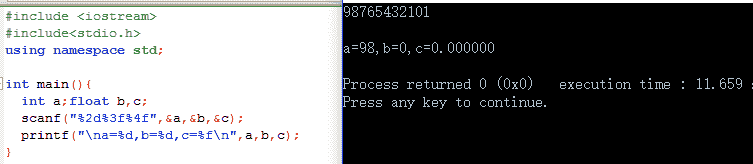

# 携程 2016 研发工程师笔试题

## 1

内存空间被分成不同区域,其中用函数

> void* malloc(unsigned int size);

申请的内存在()

正确答案: C   你的答案: 空 (错误)

```cpp
程序区
```

```cpp
静态存储区
```

```cpp
动态存储区
```

```cpp
ROM 区
```

本题知识点

Linux C 语言

讨论

[大菜鸟大菜狗](https://www.nowcoder.com/profile/905766)

C:

C 编程语言中的

  查看全部)

编辑于 2016-01-23 17:24:52

* * *

[Circle&Z](https://www.nowcoder.com/profile/476805)

stack 由系统自动分配，heap 需要程序员自己申请，C 中用函数 malloc 分配空间，用 free 释放，C++用 new 分配，用 delete 释放。当然热爱 java 的童鞋肯定更关心 java 的内存空间划分（虽然强大的 java 让程序猿在编程时不需要考虑太多内存方面的细节）java 对内存空间的划分五部分；
栈、堆、方法区、本地方法区、寄存器。
1、栈内存：存储都是局部变量。只要是在方法中定义的变量都是局部变量。
一旦变量的生命周期结束该变量就被释放。
2、堆内存都是实体（对象）（new 关键词创建的）
每一个实体都有一个首地址值。
堆内存的变量都有默认的初始化值。不同类型不一样，
int——0，double——0.0 boolean——false char——’\u0000’
当实体不在使用时，就会被垃圾回收机制处理。
我的 Github ^_^ (欢迎 follow): [`github.com/CircleZ3791117`](https://github.com/CircleZ3791117)

编辑于 2018-02-09 15:46:19

* * *

[好久不见 201710110935646](https://www.nowcoder.com/profile/4510328)

动态存储区（堆）：（动态分配）

malloc 动态分配在 heap 堆区。

动态存储区（堆），程序员自己分配自己释放。

动态存储区（栈）：（动态分配）

自动变量、const 变量在 stack 栈区。

动态存储区（栈），系统自动分配释放。

静态存储区：（静态分配）

extern 全局变量，在 static 静态存储区。

静态存储区，一旦分配，不会被回收，可读可写

程序代码区：（静态分配）

main 函数、其他函数在 code 程序代码区。

程序代码区，一旦分配，可读不可写，不可改变

发表于 2018-05-07 13:35:37

* * *

## 2

CPU 输出数据的速度远远高于打印机的打印速度,为了解决这一矛盾,可采用()

正确答案: A   你的答案: 空 (错误)

```cpp
缓冲技术
```

```cpp
覆盖技术
```

```cpp
并行技术
```

```cpp
虚存技术
```

本题知识点

编译和体系结构

讨论

[大菜鸟大菜狗](https://www.nowcoder.com/profile/905766)

A

覆盖技术和虚拟技术主要是解决内存不足的问题，当有大文件、程序需要在内存处理时，可以用到覆盖技术和虚拟技术，并行技术主要用于多核的 CPU 或者多 IO 总线上并行处理。

发表于 2015-12-07 14:11:09

* * *

[是小毛吖](https://www.nowcoder.com/profile/672111)

1\. 并行技术是多处理器(CPU)或多处机并行处理任务的技术，为了解决复杂的计算问题，提高计算速度，一般采用这种技术。如现在我们所称的多核技术、众核技术、大规模并行机等等。 2\. 通道技术是一种任务(分区或进程)之间通信的一种技术。 3\. 缓冲技术也称 Spooling 技术，Spooling 的意思是外部设备同时联机操作，又称为假脱机输入/输出操作，是操作系统中采用的一项将独占设备改造成共享设备的技术。Spooling 系统的组成包括三部分：输入井和输出井、输入缓冲区和输出缓冲区、输入进程和输出进程。为了解决 CPU 输出数据的速度远远高于打印机的打印速度这一矛盾，在操作系统中一般采用 Spooling 技术。 4\. 虚存(VM)技术能从逻辑上对内存进行扩充，达到扩充内存的效果，具有请求调入和置换功能。

编辑于 2017-08-25 09:42:00

* * *

[煜言 2009](https://www.nowcoder.com/profile/371881)

A

覆盖技术和虚拟技术主要是解决内存不足的问题，当有大文件、程序需要在内存处理时，可以用到覆盖技术和虚拟技术，并行技术主要用于多核的 CPU 或者多 IO 总线上并行处理。

发表于 2015-12-13 00:41:06

* * *

## 3

编译和执行如下 c 语言代码,系统将会输出什么?

```cpp
#include <stdio.h>
int main() {
    char c = '0';
    printf("%d %d", sizeof(c), sizeof(char));
    return 0;
}
```

正确答案: C   你的答案: 空 (错误)

```cpp
1 4
```

```cpp
2 2
```

```cpp
1 1
```

```cpp
2 1
```

本题知识点

C 语言

讨论

[江山如画君](https://www.nowcoder.com/profile/408769)

以下答案由牛友 @洛阳雪 提  查看全部)

编辑于 2017-09-28 12:43:43

* * *

[方泉水很甜](https://www.nowcoder.com/profile/695496)

**sizeof(c)永远是 1**，因为 sizeof 是计算其类型的大小，类型为 char，结果必然是 1；**sizeof('0')的结果取决于‘0’的类型**，c++中‘0’为字符常量，类型为 char，结果为 1，如果是**sizeof('02')**,C++中‘02’为整型字符常量，为 int 类型，结果为 4\.

发表于 2015-12-14 09:09:10

* * *

[学霸女王大人](https://www.nowcoder.com/profile/525784)

C++运行结果：C 运行结果：
好神奇~~

发表于 2017-03-12 10:34:06

* * *

## 4

表的主键特点中,说法不正确的是()

正确答案: D   你的答案: 空 (错误)

```cpp
主键的每一列都必须非空
```

```cpp
主键的每一列都必须唯一
```

```cpp
一个表只能定义一个主键
```

```cpp
主键可以定义在表级或列级
```

本题知识点

数据库

讨论

[bsddp](https://www.nowcoder.com/profile/813518)

主键约束可以创建表级约束和列级约束，但是主键不能定义在表级或者列级

发表于 2016-03-15 10:43:06

* * *

[ppfbsar](https://www.nowcoder.com/profile/567701)

我感觉 b 有误，多列组合主键。某一列可以重复。

发表于 2016-02-24 00:55:38

* * *

[冷冰冰](https://www.nowcoder.com/profile/149974)

什么鬼。。

发表于 2016-01-08 20:36:17

* * *

## 5

一位酒商有 6 桶葡萄酒和啤酒，容量分别为 30 升、32 升、36 升、38 升、40 升、62 升。其中五桶装着葡萄酒，一桶装着啤酒。第一位顾客买走了两桶葡萄酒；第二位顾客所买的葡萄酒则是第一位顾客的两倍。请问，有多少升啤酒？

正确答案: B   你的答案: 空 (错误)

```cpp
32
```

```cpp
40
```

```cpp
36
```

```cpp
38
```

本题知识点

数学运算

讨论

[kiss90](https://www.nowcoder.com/profile/590177)

```cpp
/*
假设第一位顾客买了 a、b,则第二位顾客一定买了剩余的所有葡萄酒(因为 a+b 最小为 62)。 假设啤酒为 x，则 3*（a+b）+x=238
所以啤酒 x 一定满足：（238-x）是 3 的倍数。
所以只能选 B。 */
```

发表于 2016-03-02 19:35:03

* * *

[魔『杰』座](https://www.nowcoder.com/profile/374756)

其实有个简单方法，说明除开某一份，其余五份的和是三的倍数，30.36 都能被 3 整除，只有 40 余 1.其余都余 2

发表于 2015-12-07 19:05:28

* * *

[staringburning](https://www.nowcoder.com/profile/188695)

比较笨 写了个程序输出结果

```cpp
public class Charandchar {
	public static void main(String[] args) {
		// 一位酒商有 6 桶葡萄酒和啤酒，容量分别为 30 升、32 升、36 升、38 升、40 升、62 升。
		// 其中五桶装着葡萄酒，一桶装着啤酒。
		// 第一位顾客买走了两桶葡萄酒；
		// 第二位顾客所买的葡萄酒则是第一位顾客的两倍。请问，有多少升啤酒？
		int bear[] = new int[] { 30, 32, 36, 38, 40, 62 };
		for (int i = 0; i < bear.length; i++) {
			for (int j = i + 1; j < bear.length; j++) {
				int sum = bear[i] + bear[j];
				// 统计剩下的 4 桶 如果存在其中 3 桶等于 sum 的两倍 那么可以 输出
				// 这里应该统计最大的 3 个数的和
				int num = Test(i, j, bear, sum);
				if (num != 0) {
					System.out.println(num);
				}
			}
		}
	}
	private static int Test(int i, int j, int[] bear, int sum) {
		int sum_test[] = new int[bear.length - 2];
		int count = 0;
		// 将剩下的 4 桶复制到 sum_test 数组
		for (int k = 0; k < bear.length; k++) {
			if (k != i && k != j) {
				sum_test[count++] = bear[k];
				// System.out.print(bear[k] + " ");
			}
		}
		// 4 桶中统计任意 3 桶的总和 如果存在这 3 桶的和==sum 的两倍 返回
		for (int l = 0; l < sum_test.length; l++) {
			int sum_three = 0;
			for (int m = 0; m < sum_test.length; m++) {
				if (l != m) {
					sum_three += sum_test[m];
				}
			}
			if (sum_three == sum * 2) {
				// System.out.println(sum_three + "-" + sum + "-" + bear[i] +
				// "-" + bear[j]);
				return sum_test[l];
			}
		}
		return 0;
	}
}

```

结果输出 40

发表于 2015-12-07 19:20:03

* * *

## 6

将三只蜗牛放在一个正三角形的每个角上.每只蜗牛开始设三角形的一条边朝另一个角做直线运动,目标角是随机选择,那么蜗牛互不相撞的概率是多少?

正确答案: B   你的答案: 空 (错误)

```cpp
1/8
```

```cpp
1/4
```

```cpp
1/3
```

```cpp
1/2
```

本题知识点

概率统计 *讨论

[大菜鸟大菜狗](https://www.nowcoder.com/profile/905766)

B 不相撞只有 2 中情  查看全部)

编辑于 2015-12-11 10:26:50

* * *

[福大馨](https://www.nowcoder.com/profile/651222)


发表于 2016-09-17 10:10:48

* * *

[jaxmao](https://www.nowcoder.com/profile/525724)

3 只蜗牛不相撞的情况，2 种，一种顺时针，一种逆时针，每个蜗牛的爬法 2 种，往顺时针或者逆时针，为 2*2*2，所以为 2/8 为 1/4

发表于 2016-01-08 12:02:32

* * *

## 7

用变量 a 给出下面的定义:一个有 10 个指针的数组,该指针指向一个函数,该函数有一个整形参数并返回一个整型数

正确答案: D   你的答案: 空 (错误)

```cpp
int *a[10];
```

```cpp
int (*a)[10];
```

```cpp
int (*a)(int);
```

```cpp
int (*a[10])(int);
```

本题知识点

C 语言

讨论

[守护神迹](https://www.nowcoder.com/profile/717540)

样的表达式可以遵循这样的规则:  查看全部)

编辑于 2016-10-29 23:47:37

* * *

[牛客 982174 号](https://www.nowcoder.com/profile/982174)

```cpp

```

```cpp

```
int *a[10];   //指向 int 类型的指针数组 a[10]
```cpp

int (*a)[10]; //指向有 10 个 int 类型数组的指针 a
```

int (*a)(int);//函数指针，指向有一个参数并且返回类型 均为 int 的函数

```cpp

int (*a[10])(int); //函数指针的数组，指向有一个参数并且返回类型均为 int 的函数的数组
```

编辑于 2016-03-04 12:34:47

* * *

[高山羊](https://www.nowcoder.com/profile/346359)

一个有趣的网站，可以自动分析声明。[`cdecl.org/`](http://cdecl.org/)另外，可以安装 sudo apt-get install cdecl========== 1\. 由变量描述到表达式 ==========

> 本题用变量 a 给出下面的定义:一个有 10 个指针的数组,该指针指向一个函数,该函数有一个整形参数并返回一个整型数：

1\. 定义一个数组 a[10]
2\. 该数组元素是指针*a[10]3\. 该指针指向一个函数,(* a[10]) ()4\. 有一个整形参数(* a[10]) (int)5\. 并返回一个整形数 int (* a[10]) (int)**另外一个例子：**

> 定义一个函数指针，指向的函数有两个 int 形参并且返回一个函数指针，返回的指针指向一个有一个 int 形参且返回 int 的函数？来自 <http://www.nowcoder.com/questionTerminal/960f8047a9ee4a6f8227768f3bc2734d>

1\. 定义一个函数指针(*p)2\. 指向的函数有两个 int 参数(*p) (int,int)3\. 返回值是一个函数指针* (*p) (int,int)      (* (*p) (int,int))4\. 返回的指针指向一个 int 参数(* (*p) (int,int))(int)5\. 并返回 intint  (* (*p) (int,int))(int)所以：int  (* (*p) (int,int))(int)**相似的一个例子**

> 声明一个指向含有 10 个元素的数组的指针，其中每个元素是一个函数指针，该函数的返回值是 int，参数是 int*，正确的是（）来自 <http://www.nowcoder.com/questionTerminal/242d747044bd417e95fe37d69884dff8>

1\. 声明一个指针(*p)2\. 该指针指向一个数组(*p)[10]3\. 每个元素是一个函数指针(*(*p)[10])()4\. 参数是 int*(*(*p)[10])(int*)5\. 返回值是 intint (*(*p)[10])(int*)========== 2\. 由表达式到变量描述 ==========**经典例子****注意： 指向数组的指针和指针数组****int *a[10]: a 是一个数组，该数组的元素是指针，每个指针都指向一个 int 型****int (*a)[10]：a 是一个指针，该指针指向一个数组，数组元素是 int****From ** [`cdecl.org/`](http://cdecl.org/)int (*a)[10]： declare a as pointer to array 10 of intint *a[10]：declare a as array 10 of pointer to int**例子 1**

> int (*a[10])(int)

1\. a 是一个数组 2\. a 这个数组的元素是一个指针 3\. 指针是一个函数指针 4\. 这个函数参数是 int，返回值是 inta 是一个包含 10 个元素的数组，每个元素指向一个参数是 int，返回值是 int 的函数。From [`cdecl.org/`](http://cdecl.org/)

> declare a as array 10 of pointer to function (int) returning int

-----------
**例子 2**

> int (*(*p)[10])(int*)

1\. p 是一个指针 2\. p 这个指针指向一个数组 3\. 数组元素是指针 4\. 数组元素的指针指向一个函数 5\. 这个函数参数是 int*，返回值是 intp 是一个指向包含 10 个元素的数组的指针，每个元素是一个函数指针，指向一个参数是 int*，返回值是 int 的函数。

> declare p as pointer to array 10 of pointer to function (pointer to int) returning int

编辑于 2017-04-09 17:25:04

* * *

## 8

计算每位学生的多学科加总成绩的 SQL 是 _____

正确答案: C   你的答案: 空 (错误)

```cpp
select sum(score) as total,stud_name from 成绩表
```

```cpp
select count(score) as total,stud_name from 成绩表
```

```cpp
select sum(score) as total,stud_name from 成绩表 group by stud_name
```

```cpp
select count(score) as total,stud_name from 成绩表 group by stud_name
```

本题知识点

数据库

讨论

[Circle&Z](https://www.nowcoder.com/profile/476805)

根据 stud_name 对学生进行分组，分组后，同一个学生的所有成绩分为一组，用 sum(score)计算出总分，最有列名为 total。但是题目应该加限定条件，学生不能重名，否则会出错。

发表于 2015-12-09 10:00:33

* * *

[星陨无痕](https://www.nowcoder.com/profile/436939)

根据问题和答案中给出的语句进行推断问题：计算每位学生的多学科加总成绩的 SQL 是根据答案中的数据可以得知表名为：成绩表各个字段的意义： score:分数； stud_name:学生名然后根据问题要获得的数据是，每位学生多学科的总成绩；也就是说需要分成每个学生去显示数据，这时候就按照 学生姓名去分组 group by  stud_name 多科目的总成绩也就是需要进行分数的加合，使用 sum 函数就可以了；最后得到的答案就是 select sum(score) as total,stud_name from 成绩表 group by stud_name 所以选择 C

发表于 2016-03-09 11:00:44

* * *

[bsddp](https://www.nowcoder.com/profile/813518)

count()函数里面的参数是列名的的时候,那么会计算有值项的次数。 
Sum()函数里面的参数是列名的时候，是计算列名的值的相加，而不是有值项的总数。 

发表于 2016-03-15 10:50:23

* * *

## 9

冯诺依曼工作方式的基本特点是 ____

正确答案: B   你的答案: 空 (错误)

```cpp
多指令流单数据流
```

```cpp
按地址访问并顺序执行指令
```

```cpp
堆栈操作
```

```cpp
存储器按内部选择地址
```

本题知识点

编译和体系结构

讨论

[SunburstRun](https://www.nowcoder.com/profile/557336)

冯.诺依曼机工作方式的基本特  查看全部)

编辑于 2015-12-07 13:30:04

* * *

[Circle&Z](https://www.nowcoder.com/profile/476805)

冯诺依曼体系结构的特点是：        (1)计算机处理的数据和指令一律用二进制数表示(2)顺序执行程序： 计算机运行过程中，把要执行的程序和处理的数据首先存入主存储器（内存），计算机执行程序时，将自动地并按顺序从主存储器中取出指令一条一条地执行，这一概念称作顺序执行程序。    (3)计算机硬件由运算器、控制器、存储器、输入设备和输出设备五大部分组成。

发表于 2015-12-09 10:06:12

* * *

[风雪夜归人 sen](https://www.nowcoder.com/profile/635297)

冯诺依曼 **结构，** 也称 **普林斯顿结构** ，是一种将程序指令存储器和数据存储器合并在一起的电脑设计概念结构。 存储器按 地址访问，逐条地取出指令来执行。哈佛结构处理器有两个明显的特点：

1、使用两个独立的存储器模块，分别存储指令和数据，每个存储模块都不允许指令和数据并存；

2、使用独立的两条总线，分别作为 CPU 与每个存储器之间的专用通信路径，而这两条总线之间毫无关联。

发表于 2016-03-02 09:27:43

* * *

## 10

下列关于文件索引结构的叙述中,哪些是正确的?

正确答案: A B C   你的答案: 空 (错误)

```cpp
系统为每个文件建立一张索引表
```

```cpp
采用索引结构会引入存储开销
```

```cpp
从文件控制块中可以找到索引表或索引表的地址
```

```cpp
采用索引结构,逻辑上连续的文件存放在连续的物理块中
```

本题知识点

操作系统

讨论

[Circle&Z](https://www.nowcoder.com/profile/476805)

索引结构指一个文件的信息存放在若干不连续的物理块中，系统为每个文件建立一个专用的数据结构——索引表，并将这些块的块号存放在索引表中。有点是保留了链接结构的优点，同时解决了其缺点，即能顺序存取，又能随机存取，满足了文件动态增长，插入删除的需求，也能充分利用外存空间。缺点是索引表本身带来的系统开销。

发表于 2015-12-09 10:23:41

* * *

[Andy_Victory](https://www.nowcoder.com/profile/908053)

为了提高文件的检索效率，可以采用索引方法组织文件。采用索引这种结构，逻辑上连续的文件可以存放在若干不连续的物理块中，但对于每个文件，在存储介质中除存储文件本身外，还要求系统另外建立一张索引表，索引表记录了文件信息所在的逻辑块号和与之对应的物理块号。索引表也以文件的形式存储在存储介质中，索引表的物理地址则由文件说明信息项给出。

    在很多情况下，有的文件很大，文件索引表也就较大。如果索引表的大小超过了一个物理块，可以采用间接索引（多重索引），也就是在索引表所指的物理块中存放的不是文件信息，而是装有这些信息的物理块地址。这样，如果一个物理块可装下 n 个物理块地址，则经过一级间接索引，可寻址的文件长度将变为 n×n 块。如果文件长度还大于 n×n 块，还可以进行类似的扩充，即二级间接索引。

    不过，大多数文件不需要进行多重索引，也就是说，这些文件所占用的物理块的所有块号可以放在一个物理块内。如果对这些文件也采用多重索引，则显然会降低文件的存取速度。因此，在实际系统中，总是把索引表的头几项设计成直接寻址方式，也就是这几项所指的物理块中存放的是文件信息；而索引表的后几项设计成多重索引，也就是间接寻址方式。在文件较短时，就可利用直接寻址方式找到物理块号而节省存取时间。
    索引结构既适用于顺序存取，也适用于随机存取，并且访问速度快，文件长度可以动态变化。索引结构的缺点是由于使用了索引表而增加了存储空间的开销。另外，在存取文件时需要至少访问存储器两次以上，其中，一次是访问索引表，另一次是根据索引表提供的物理块号访问文件信息。由于文件在存储设备的访问速度较慢，因此，如果把索引表放在存储设备上，势必大大降低文件的存取速度。一种改进的方法是，当对某个文件进行操作之前，系统预先把索引表放入内存，这样，文件的存取就可直接在内存通过索引表确定物理地址块号，而访问存储设备的动作只需要一次。当文件被打开时，为提高访问速度将索引表读入内存，故又需要占用额外的内存空间。

发表于 2016-03-03 13:19:46

* * *

[黄小斜](https://www.nowcoder.com/profile/3539721)

索引结构指一个文件的信息存放在若干不连续的物理块中，系统为每个文件建立一个专用的数据结构——索引表，并将这些块的块号存放在索引表中。有点是保留了链接结构的优点，同时解决了其缺点，即能顺序存取，又能随机存取，满足了文件动态增长，插入删除的需求，也能充分利用外存空间。缺点是索引表本身带来的系统开销。

发表于 2017-04-11 16:16:44

* * *

## 11

以下哪些是 servlet 容器

正确答案: C D   你的答案: 空 (错误)

```cpp
Apache
```

```cpp
Nginx
```

```cpp
Tomcat
```

```cpp
Jetty
```

None

讨论

[困困](https://www.nowcoder.com/profile/455469)

  查看全部)

编辑于 2015-12-17 12:14:43

* * *

[逗比豪](https://www.nowcoder.com/profile/629516)

Apache 是世界使用排名第一的 Web [服务器](http://baike.baidu.com/view/899.htm) 软件。Nginx 是一个很强大的高性能 [Web](http://baike.baidu.com/subview/3912/15992867.htm) 和 [反向***](http://baike.baidu.com/view/1165595.htm) 服务器。Tomcat 和 [IIS](http://baike.baidu.com/view/850.htm) 等 Web 服务器一样，具有处理 HTML 页面的功能，另外它还是一个 Servlet 和 JSP 容器，独立的 Servlet 容器是 Tomcat 的默认模式。Jetty 是一个开源的 servlet 容器，它为基于 Java 的 web 容器，例如 JSP 和 servlet 提供运行环境。来自百度百科

发表于 2016-03-14 15:44:27

* * *

[Circle&Z](https://www.nowcoder.com/profile/476805)

容器就是你的程序运行时需要的环境

1，Tomcat，apache,Jetty 是 Servlet 的运行环境，即一个 Servlet 容器,做过 java web 开发的应该都知道。 

2，Servlet 容器的作用是负责处理客户请求，当客户请求来到时，Servlet 容器获取请求，然后调用某个 Servlet，并把 Servlet 的执行结果返回给客户。 

3，Servlet 容器的工作过程是：当客户请求某个资源时，Servlet 容器使用 ServletRequest 对象把客户的请求信息封装起来，然后调用 java Servlet API 中定义的 Servlet 的一些生命周期方法，完成 Servlet 的执行，接着把 Servlet 执行的要返回给客户的结果封装到 ServletResponse 对象中，最后 Servlet 容器把客户的请求发送给客户，完成为客户的一次服务过程。每一个 Servlet 的类都执行 init（）、service（）、destory（）三个函数的自动调用，在启动时调用一次 init（）函数用以进行参数的初始化，在服务期间每当接收到对该 Servlet 的请求时都会调用 Service（）函数执行该 Servlet 的服务操作，当容器销毁时调用一次 destory（）函数。 

4，典型的 Servlet 应用是***、过滤器的实现。

JSP 运行原理：当 Web 服务器上的 JSP 页面第一次被请求执行时，JSP 引擎先将 JSP 页面文件转译成一个 Java 文件，即 Servlet，Java Servlet 是基于服务器端编程的 API，用 Java Servlet 编写的 Java 程序称为 servlet，servlet 通过 HTML 与客户交互。服务器将前面转译成的 Java 文件编译成字节码文件，再执行这个字节码文件来响应客户的请求。当这个 JSP 页面再次被请求时，只要该 JSP 文件没有被改动，JSP 引擎就直接调用已装载的 Servlet。 

 JSP 和 servlet 的运行原理探讨

JSP 是一个运行在服务器端的程序，而 javascrīpt 是运行在客户端的程序。两种程序是工作在不同的地方的，这一点不可以混淆。

Javascrīpt 如何执行，服务器是不会知道的。 
对于 javascrīpt 的代码在 jsp 页面中和普通的 HTML 代码意义上是完全一样的。大可不必理会，因为 javascrīpt 是在<sctipt>标记中的，而 jsp 是<%%>中的，而<%%>中的东西是不会到客户端去的。所以你可以利用 JSP 的规则来确定那些 javascrīpt 的片断输出到客户端。

<%page   language="java"%>在服务器端执行,<scrīpt   language=javascrīpt>客户端执行，由浏览器的 Javascrīpt 引擎解释执行.
客户端用户填写 HTML 表单，发送请求。 将请求发送给 服务器端 servlet(tomcat 是 servlet 的容器)。 servlet 将该 HTTP 请求转换成一个 MQSeries 消息，并将其放入一个队列。 后端应用程序处理该消息，然后通过消息队列发回一个应答。 servlet 从队列中检索消息，并将其存放在一个 Java Bean 中。 然后 servlet 调用编译过的 Java Server Page(JSP) 并动态生成结果 HTML 页面。 JSP 从 Java Bean 检索出该页面需要的数据，将其合并到 HTML，然后将结果页面发送给客户端。
   JSP 中的 html 代码和 javascrīpt 代码不会在服务器端执行，servlet 调用编译过的 Java Server Page(JSP) ，也就是运行由 JSP 编译成的 class 文件(运行的代码包括 actionBean,formBean,一般的 bean 和内嵌在 JSP 的 Java 代码).apache 是 web 服务器(不是客户端,大多数时候就是指代应用服务器,客户端一般都是 web 浏览器)，tomcat 是应用（java）服务器，它只是一个运行 servlet 的容器，可以认为是 apache 的扩展，但是可以独立于 apache 运行。一个 Web 运行程序（网站）可以有多个 servlet，一般认为一个 action 就是一个 servlet.所谓 Servlet 是指运行在服务器端的 Java 小程序。用于响应客户端的请求。在默认情况下，Servlet 采用一种无状态的请求-响应处理方式。Servlet 代码的主要作用是为了增强 Java 服务器端的功能，它运行在服务器端，用于接收并且处理浏览器客户端发出的请求，该请求是通过配置文件 web.xml 的相关配置进行转发。也就是说 Servlet 是一个标准的 Java 类，它符合 Java 类的一般规则。和一般的 Java 类不同之处只是在于 Servlet 可以处理 Http 请求。
1.servlet 是持久的。servlet 只需 Web 服务器加载一次,后续又用到这个 servlet，就不需要再加载。(所谓加载是指 servlet 加载进 JVM 运行)
2.servlet 是与平台无关的。
3.servlet 是可扩展的。
ActionServlet 继承自 javax.servlet.http.HttpServlet 类，其在 Struts framework 中扮演的角色是中心控制器。它提供一个中心位置来处理全部的终端请求。控制器 ActionServlet 主要负责将 HTTP 的客户请求信息组装后，根据配置文件的指定描述，转发到适当的处理器 Action。

JSP 工作原理
所有 JSP 页面，在执行的时候都会被服务器端的 JSP 引擎转换为 Servelet（.java），然后又由 JSP 引擎调用 Java 编译器，将 Servelet（.java）编译为 Class 文件（.class），并由 Java 虚拟机（JVM）解释执行。下面验证这一点：
      有一个 JSP 页面 Test.jsp，在浏览器地址栏中输入[`localhost:8080/Test.jsp`](http://localhost:8080/Test.jsp) ,将会出现执行结果。同时在%CATALINA_HOME%/work/Catalina/localhost 下多出两个文件：_Test_jsp.java 和 _Test_jsp.class，他们分别就是 Servelet 和 Class 文件

编辑于 2015-12-09 10:35:15

* * *

## 12

虚拟存储的容量受到下列哪一个因素的限制影响最大?

正确答案: D   你的答案: 空 (错误)

```cpp
磁盘空间大小
```

```cpp
物理内存大小
```

```cpp
数据存放的实际地址
```

```cpp
计算机地址位数
```

本题知识点

操作系统

讨论

[hustxujinkang](https://www.nowcoder.com/profile/484941)

这题应该是计算机地址位数才对。
从影响上讲：   
虚存容量 = min (2^计算机位数， 内存＋外存);
说影响最大的是内存容量，简直胡扯

发表于 2016-08-21 16:37:35

* * *

[YAS 杨](https://www.nowcoder.com/profile/690857)

虚存容量不是无限的，最大容量受内存和外存可利用的总容量限制   ,   虚存搜索实际容量受计算机总线地址结构限制。

发表于 2016-09-02 21:42:34

* * *

[马月月](https://www.nowcoder.com/profile/8024187)

这个题目换了几个马甲，各种考察取舍和纠结。懂虚存容量是怎么回事就行了，整天搞文字游戏。搞事！

发表于 2016-11-21 14:57:55

* * *

## 13

关于域名和 IP 描述正确的是?

正确答案: A C D   你的答案: 空 (错误)

```cpp
一个域名某一时刻只能对应 1 个 IP
```

```cpp
一个 IP 只能对应一个域名
```

```cpp
域名可以通过 DNS 转换成 IP
```

```cpp
携程网站可以直接通过 IP 访问
```

本题知识点

网络基础

讨论

[J_kiwi](https://www.nowcoder.com/profile/142811)

ACDA 对，一个域名可  查看全部)

编辑于 2015-12-14 23:03:39

* * *

[Circle&Z](https://www.nowcoder.com/profile/476805)

1、域名解析 [DNS](http://www.kd010.com/)

（1）域名服务器：完成域名地址到 IP 地址转化的计算机。

（2）域名服务器上运行着一个数据库系统；

（3）数据库中保存着域名地址与 IP 地址。

（4）用户主机需要把域名地址转化为 IP 地址时向域名服务器提出查询请求；

（5）域名服务器根据用户请求进行查询并把结果返回给用户主机。

2、IP 地址与域名的对应关系

（1）一对一：

Internet 上 IP 地址是唯一的，一个 IP 地址对应着唯一的一台主机。

给定一个域名地址能找到一个唯一对应的 IP 地址。

（2）一对多：

一台计算机提供多个服务，既作 www 服务器又作邮件服务器。

IP 地址还是唯一，但可根据计算机提供的多个服务给予不同域名。

一个 [IP 地址](http://www.kd0086.com/article/20121102131546.html) 对应多个域名。

发表于 2015-12-09 10:47:42

* * *

[狼煞](https://www.nowcoder.com/profile/184363)

这道题争议很大！选项 A，一个域名某一时刻只能对应 1 个 IP，题目认为是正确的。争议：题目只限定了“某一时刻”，这个空子就大了。由于 CDN 技术，不同地域解析同一个域名所得的 IP 可能是不同的，如果某一时刻，比如 2016 年 9 月 17 日下午 15 点 51 分 33 秒，我和一名身在美国的 Jason 同时访问携程网，我们所得的 IP 极有可能是不同的。选项 B，一个 IP 只能对应一个域名 ，题目认为是错误的。无争议，虚拟主机技术可以实现共享 IP。选项 C， 域名可以通过 DNS 转换成 IP ，题目认为是正确的。无争议。选项 D， 携程网站可以直接通过 IP 访问，题目认为是正确的。争议：考虑 CDN 技术和虚拟主机技术，这简直是胡扯！不行做做实验就好了：访问域名：

```cpp
$ curl -v http://www.ctrip.com * Rebuilt URL to: http://www.ctrip.com/
*    Trying 125.39.6.139...
* Connected to www.ctrip.com (125.39.6.139) port 80 (#0)
> GET / HTTP/1.1
> Host: www.ctrip.com
> User-Agent: curl/7.47.0
> Accept: */*
> 
< HTTP/1.1 200 OK
后面部分部分省略……
```

直接访问 IP：

```cpp
$ curl -v http://125.39.6.139
* Rebuilt URL to: http://125.39.6.139/
*   Trying 125.39.6.139...
* Connected to 125.39.6.139 (125.39.6.139) port 80 (#0)
> GET / HTTP/1.1
> Host: 125.39.6.139
> User-Agent: curl/7.47.0
> Accept: */*
> 
< HTTP/1.1 404 Not Found
< Server: CDN_NWS_4.2.0
< Connection: keep-alive
< Date: Sat, 17 Sep 2016 08:02:06 GMT
< Content-Type: text/html
< Content-Length: 52
< X-NWS-LOG-UUID: 8ecfdf2f-6116-4859-8bf9-0c76eb654a79
< X-Cache-Lookup: Hit From 404 Cache 
< 
The requested URL '/' was not found on this server.
* Connection #0 to host 125.39.6.139 left intact  
```

可见无法访问！看到返回头里有 Server: CDN_NWS_4.2.0，说明携程的确用了 CDN 技术。

编辑于 2016-09-17 16:06:32

* * *

## 14

哪些字段适合建立索引?

正确答案: B C D   你的答案: 空 (错误)

```cpp
在 select 子句中的字段
```

```cpp
外键字段
```

```cpp
主键字段
```

```cpp
在 where 子句中的字段
```

本题知识点

数据库

讨论

[TeddyTangBiSheng](https://www.nowcoder.com/profile/566620)

1、表的主键、外键必须有索引；
2、数据量超过 300 的表应该有索引；
3、经常与其他表进行连接的表，在连接字段上应该建立索引；
4、经常出现在 Where 子句中的字段，特别是大表的字段，应该建立索引；
5、索引应该建在选择性高的字段上；
6、索引应该建在小字段上，对于大的文本字段甚至超长字段，不要建索引；
7、复合索引的建立需要进行仔细分析；尽量考虑用单字段索引代替：
A、正确选择复合索引中的主列字段，一般是选择性较好的字段；
B、复合索引的几个字段是否经常同时以 AND 方式出现在 Where 子句中？单字段查询是否极少甚至没有？如果是，则可以建立复合索引；否则考虑单字段索引；
C、如果复合索引中包含的字段经常单独出现在 Where 子句中，则分解为多个单字段索引；
D、如果复合索引所包含的字段超过 3 个，那么仔细考虑其必要性，考虑减少复合的字段；
E、如果既有单字段索引，又有这几个字段上的复合索引，一般可以删除复合索引；
8、频繁进行数据操作的表，不要建立太多的索引；
9、删除无用的索引，避免对执行计划造成负面影响；

发表于 2015-12-08 17:31:40

* * *

[zhisheng_blog](https://www.nowcoder.com/profile/616717)

楼上的太长了，不知道哪是重点

发表于 2016-01-10 16:23:45

* * *

[星陨无痕](https://www.nowcoder.com/profile/436939)

建立索引为的是让检索查询的过程更快捷方便；相应的建立索引所付出的代价的是创建数据时额外的建立索引所产生的相关代价。另外就是你建立索引后你的查询也并不一定会去走你建立的索引；当然这个和题目关系不大；建立索引是为了更好的去确认数据；题目中给出的答案分别是 select 中的字段，主键，外键，where 中的字段；主键，外键，建立索引其实也是为了更好的查询，归根结底还是为了在查询和排序，分组时去使用，也就是 where，order by ，group by 三个地方。主键和外键建立索引是因为相对的这两个值比较能确定一些数据，所以比较适合建立索引；where 条件中的字段适合建立索引是因为要在查询过程中减少数据检索，需要使用索引；而 select 中的字段是否建立索引本质是没有意义的，没什么必要；所以答案选择 BCD

发表于 2016-03-09 11:14:44

* * *

## 15

关于 group by 子句的作用描述正确的是?

正确答案: B C D   你的答案: 空 (错误)

```cpp
可用于过滤数据
```

```cpp
可用于 sum
```

```cpp
可用于 avg
```

```cpp
可用于 having 子句
```

本题知识点

数据库

讨论

[星陨无痕](https://www.nowcoder.com/profile/436939)

根据题目给出的答案去做推论首先 group by 的作用是用来分组，这点明确了；然后看答案 A 过滤数据，这个和分组没什么关系 pass 然后 BC sum 和 avg 两个函数分别是求和和求平均，这个时候分组就有存在价值了，一组数据的和，一组数据的平均数两个；D having 这个关键字本身就是用来和分组一起使用的，是分组后的过滤条件 so 答案选择 BCD

编辑于 2016-05-23 09:22:28

* * *

[炫](https://www.nowcoder.com/profile/376795)

用于过滤数据的子句是 where

发表于 2016-04-15 19:15:37

* * *

[Circle&Z](https://www.nowcoder.com/profile/476805)

GroupBy 语句从英文的字面意义上理解就是“根据(by)一定的规则进行分组(Group)”。它的作用是通过一定的规则将一个数据集划分成若干个小的区域，然后针对若干个小区域进行数据处理。

发表于 2015-12-09 11:08:22

* * *

## 16

执行"int x=1;int y=~x;"语句后,y 的值为？

正确答案: D   你的答案: 空 (错误)

```cpp
1
```

```cpp
0
```

```cpp
-1
```

```cpp
-2
```

本题知识点

C 语言

讨论

[SunburstRun](https://www.nowcoder.com/profile/557336)

D 运算对象是数字的补码  查看全部)

编辑于 2015-12-07 11:21:54

* * *

[Circle&Z](https://www.nowcoder.com/profile/476805)

假设 int 占 2 个字节，那么 1 的二进制表示是 0000 0001 ，~表示按位取反，则 0000 0001 变为 1111 1110，在计算机中整数用补码形式表示，正数的补码是它本身，负数的补码是原数值除符号位按位取反再加一，由补码求原数值也是按位取反再加一，那么 1111 1110 除符号位按位取反再加一变成 1000 0010，即 -2。

编辑于 2015-12-16 15:46:03

* * *

[轩~^~*~^~](https://www.nowcoder.com/profile/6617914)

x = 00000001

~x = 11111110,~x 为负数，负数在计算机中用补码表示，所以符号位不变，取反加 1

y = 100000010

发表于 2016-08-15 09:36:50

* * *

## 17

内存按字节编址,地址区间为[90000H,CFFFFH],若用 32K*8bit 的存储器芯片构成该内存,需要 __ 块

正确答案: C   你的答案: 空 (错误)

```cpp
2
```

```cpp
4
```

```cpp
8
```

```cpp
16
```

本题知识点

编译和体系结构

讨论

[牛客 787908 号](https://www.nowcoder.com/profile/787908)

（1）首先根据地址区间 90  [查看全部)

编辑于 2015-12-11 11:10:18

* * *

[liujinding1121](https://www.nowcoder.com/profile/799885)

```cpp

	（1）首先根据地址区间[90000H,CFFFFH]，可以计算地址空间为：CFFFFH - 90000H + 1 = 40000H

	因为 10000H = 2¹⁶B 那么 40000H = 4 * (2¹⁶)B

	(2)32K = 32*(2¹⁰)B

	那么内存所需芯片数为：  （  4 * (2¹⁶) ）/   32*(2¹⁰ ) = 8;

```

发表于 2015-12-26 16:46:51

* * *

[SunburstRun](https://www.nowcoder.com/profile/557336)

地址空间共有 CFFFFH-90000H +1 = 40000H，又因为是按字节编址，所以容量为 40000H = 2¹⁸。每个存储芯片的容量为 32KB = 2¹⁵B，所以需要 2¹⁸ / 2¹⁵ = 8 片

发表于 2015-12-07 10:00:23

* * *

## 18

由数字 5,6,7,9 可以组成多少个没有重复数字的三位数?

正确答案: C   你的答案: 空 (错误)

```cpp
9
```

```cpp
15
```

```cpp
24
```

```cpp
48
```

本题知识点

组合数学 *讨论

[古月广大](https://www.nowcoder.com/profile/730319)

C 先从四个数里选三个出  查看全部)

编辑于 2015-12-09 10:31:48

* * *

[Circle&Z](https://www.nowcoder.com/profile/476805)

从四个数选 3 个填入 _ _ _，第一个空格有 4 种选择，由于要求数字不重复，第二个空格有 3 种选择，第三个空格有 2 种选择 ,所以总的可能数是：4*3*2=24

发表于 2015-12-09 11:27:27

* * *

[我就是你想要的 Offer](https://www.nowcoder.com/profile/680699)

这就是一个最简单的高中排列组合题。首先这个题有顺序要求，所以是一个排列问题。所以直接套公式 A（4，3）=4*3*2=24

发表于 2016-08-15 12:34:02

* * *

## 19

```cpp
int main(){
  int a;float b,c;
  scanf("%2d%3f%4f",&a,&b,&c);
  printf("\na=%d,b=%d,c=%f\n",a,b,c);
}
```

若运行时从键盘上输入 9876543210l,则上面程序在 gcc 编译器下的输出结果是

正确答案: B   你的答案: 空 (错误)

```cpp
a=98,b=765,c=4321.000000
```

```cpp
a=98,b=0,c=0.000000
```

```cpp
a=98,b=765.000000,c=4321.000000
```

```cpp
a=98,b=765.0,c=4321.0
```

本题知识点

C++ C 语言

讨论

[王浩浩的快乐生活](https://www.nowcoder.com/profile/828235)

printf 函数执行的时候，  查看全部)

编辑于 2017-06-07 12:03:25

* * *

[leobuzhi](https://www.nowcoder.com/profile/932073)

1、用 Codeblockgcc 使用 C 如下2、用 Codeblockgcc 使用 C++如下3、用 VS 使用 C++如下事实证明这道题的答案取决于编译器

发表于 2016-01-03 17:28:52

* * *

[Fly_weng](https://www.nowcoder.com/profile/784118)

scanf("%2d%3f%4f",&a,&b,&c)后如果直接 cout<<a<<" "<<b<<" "<<c<<endl; 输出 98 765 4321 如果是 printf("\na=%d,b=%f,c=%f\n",a,b,c);输出 a=98,b=765.000000,c=4321.000000 如果是 printf("\na=%d,b=%d,c=%f\n",a,b,c);输出 a=98,b=0,c=0.000000 如果单独 printf("c=%f\n",a,b,c);输出 c=4321.000000 题目中由于 b 是 float，却以%d 输出，直接为 0，影响了 printf 的正常输出

发表于 2016-03-01 16:57:26

* * *

## 20

直接,间接,立即三种寻址方式指令的执行速度,由快至慢的排序是 ____

正确答案: C   你的答案: 空 (错误)

```cpp
直接,立即,间接
```

```cpp
直接,间接,立即
```

```cpp
立即,直接,间接
```

```cpp
立即,间接,直接
```

本题知识点

编译和体系结构

讨论

[方泉水很甜](https://www.nowcoder.com/profile/695496)

立即寻址就是指令当中自带数据  查看全部)

编辑于 2015-12-15 10:40:25

* * *

[Circle&Z](https://www.nowcoder.com/profile/476805)

总共有 14 个 16 位寄存器,8 个 8 位寄存器

通用寄存器:

  数据寄存器:

  AH(8 位)  AL(8 位)  AX(16 位)   (AX 和 AL 又称累加器)

  BH(8 位)  BL(8 位)  BX(16 位)   (BX 又称基址寄存器,唯一作为存储器指针使用寄存器)  

  CH(8 位)  CL(8 位)  CX(16 位)   (CX 用于字符串操作，控制循环的次数,CL 用于移位)

  DH(8 位)  DL(8 位)  DX(16 位)   (DX 一般用来做 32 位的乘除法时存放被除数或者保留余数)

  指针寄存器:

  SP 堆栈指针 (存放栈顶地址)

  BP 基址指针 (存放堆栈基址偏移)

  变址寄存器:主要用于存放某个存储单元地址的偏移,或某组存储单元开始地址的偏移,

  即作为存储器(短)指针使用。作为通用寄存器,它们可以保存 16 位算术逻辑运算中的操

  作数和运算结果,有时运算结果就是需要的存储单元地址的偏移.

  SI 源地址  (源变址寄存器)

  DI 目的地址 (目的变址寄存器)

控制寄存器:

  IP 指令指针

  FLAG 标志寄存器

  　① 进位标志　CF，记录运算时最高有效位产生的进位值。

 ② 符号标志　SF，记录运算结果的符号。结果为负时置 1，否则置 0。

 ③ 零标志　　ZF，运算结果为 0 时 ZF 位置 1，否则置 0。

 ④ 溢出标志　OF，在运算过程中，如操作数超出了机器可表示数的范围称为溢出。溢出时 OF 位置 1，否则置 0。

 ⑤ 辅助进位标志　AF，记录运算时第 3 位（半个字节）产生的进位值。

 ⑥ 奇偶标志　PF，用来为机器中传送信息时可能产生的代码出错情况提供检验条件。当结果操作数中 1 的个数为偶数时置 1，否则置 0。

段寄存器

  CS 代码段  IP

  DS 数据段  

  SS 堆栈段  SP BP

  ES 附加段

七种寻址方式:

1、立即寻址方式:

操作数就包含在指令中。作为指令的一部分，跟在操作码后存放在代码段。

这种操作数成为立即数。立即数可以是 8 位的，也可以是 16 位的。

例如:

    指令: MOV AX,1234H

      则: AX = 1234H

2、寄存器寻址方式:

操作数在 CPU 内部的寄存器中，指令指定寄存器号。

对于 16 位操作数，寄存器可以是:AX、BX、CX、DX、SI、DI、SP 和 BP 等。

对于 8 位操作数，寄存器可以是 AL 、AH、BL、BH、CL、CH、DL、DH。

这种寻址方式由于操作数就在寄存器中,不需要访问存储器来取得操作数

因而可以取得较高的运算数度。

3、直接寻址方式:

操作数在寄存器中，指令直接包含有操作数的有效地址(偏移地址)

注：操作数一般存放在数据段

所以操作数的地址由 DS 加上指令中直接给出的 16 位偏移得到。如果采用

段超越前缀，则操作数也可含在数据段外的其他段中。

例如:

MOV AX,[8054]

如(DS) = 2000H,

则执行结果为(AX) = 3050H

(物理地址=20000+8054=28054H)

28054H 里的内容为 3050H

在汇编语言指令中，可以用符号地址代替数值地址

如:MOV AX,VALUE

此时 VALUE 为存放操作数单元的符号地址。

如写成:MOV AX,[VALUE]也是可以的，两者是等效的。

如 VALUE 在附加段中，则应指定段超越前缀如下:

MOV AX,ES:VALUE 或 MOV AX,ES:[VALUE]

4、寄存器间接寻址方式:

操作数在寄存器中，操作数有效地址在 SI、DI、BX、BP

这四个寄存器之一中。在一般情况下，如果有效地址在

SI、DI 和 BX 中，则以 DS 段寄存器中的内容为段值。如果

有效地址在 BP 中，则以 SS 段寄存器中的内容为段值

例如:

MOV AX,[SI]

如果(DS) = 5000H (SI) = 1234H

则物理地址 =  50000 + 1234 = 51234H

51234H 地址中的内容为:6789H

执行该指令后,(AX) = 6789H

5、寄存器相对寻址方式:

操作数在存储器中，操作数的有效地址是一个基址寄存器(BX、BP)

或变址寄存器(SI、DI)的内容加上指令中给定的 8 位或 16 位位移量之和

    BX  8 位 位移量

EA(有效地址) =  BP  + 

    SI  16 位 位移量

    DI

在一般情况下，如果 SI、DI、或 BX 中的内容作为有效地址的一部分，那么

引用的段寄存器是 DS;如果 BP 中的内容作为有效地址的一部分，那么引用的

段寄存器是 SS。

物理地址 = 16d × (DS) + (BX) + 8

           或(SI)或 16 位位移量

           或(DI)

物理地址 = 16d × (SS) + (BP) + 8 位位移量

                       或 16 位位移量

在指令中给定的 8 位或 16 位位移量采用补码形式表示。在计算有效地址时，如

位移量是 8 位，则被带符号扩展成 16 位。

例如:

MOV AX,[DI+1223H]

假设，(DS) = 5000H，(DI) = 3678H

则物理地址 = 50000 + 3678 + 1233 = 5489BH

5489BH 地址中的内容:55AAH

执行该指令后 AX = 55AAH

下面指令中，源操作数采用寄存器相对寻址，引用的段寄存器是 SS: MOV BX,[BP-4]

下面指令中，目的操作数采用寄存器相对寻址，引用的段寄存器是 ES: MOV ES:[BX+5],AL

指令:MOV AX,[SI+3]与 MOV AX,3[SI]是等价的

6、基址加变址寻址方式:

操作数在寄存器中，操作数的有效地址由:

基址寄存器之一的内容与变址寄存器之一的内容相加

   BX   SI

即: EA =    + 

   BP   DI

在一般情况下，如果 BP 之内容作为有效地址的一部分，则以 SS 之内容为段值，否则已 DS

为段值。

例如：

MOV AX,[BX][DI]

如:(DS)=2100H,

   (BX)=0158H,

   (DI)=10A5H

则 EA=0158 + 10A5 = 11FD

物理地址=21000 + 11FD = 221FDH

221FDH 地址中的内容:1234H

执行该指令后 AX = 1234H

下面指令中，目的操作数采用基址加变址寻址，

引用的段寄存器是 DS: MOV DS:[BP+SI],AL

下面指令中，源操作数采用基址加变址寻址，

引用的段寄存器 ES: MOV AX,ES:[BX+SI]

这种寻址方式使用与数组或表格处理。用基址寄存器存放数组首地址，而用变地寄存器

来定位数组中的各元素，或反之。由于两个寄存器都可改变，所以能更加灵活地访问数

组或表格中的元素。

下面的两种表示方法是等价的:

MOV AX,[BX+DI]

MOV AX,[DI][BX]

7、相对基址加变址寻址方式：

操作数在存储器中，操作数的有效地址由于基址寄存器之一的内容与变址寄存器之一的

内容及指令中给定的 8 位或 16 位位移量相加得到。

         BX    SI    8 位

即: EA =     +     +      位移量

   BP    DI    16 位

在一般情况下，如果 BP 中的内容作为有效地址的一部分，则以 SS 段寄存器中的内容为段

值，否则以 DS 段寄存器中的内容为段值。

在指令中给定的 8 位或 16 位位移量采用补码形式表示。

在计算有效地址时，如果位移量是 8 位，那么被带符号扩展成 16 位。

当所得的有效地址操作 FFFFH 时，就取其 64K 的模

例如:

MOV AX,[BX+DI-2]

假设，(DS) = 5000H, (BX) = 1223H, DI = 54H, (51275) = 54H, (51276) = 76H

物理地址= 50000 + 1223 + 0054 + FFFE(-2 各位取反末位加一) = 51275H

执行该指令后 (AX) = 7654H

相对基址加变址这种寻址方式的表示方法多种多样，以下四种方法均是等价的：

MOV AX,[BX+DI+1234H], MOV AX,1234H[BX][DI]

MOV AX 1234H[BX+DI],  MOV AX,1234H[DI][BX]

发表于 2015-12-10 16:25:55

* * *

[mcc++](https://www.nowcoder.com/profile/8466558)

加油

发表于 2017-08-16 08:18:43

* * *

## 21

管道通信以 _____ 进行写入和读出

正确答案: B   你的答案: 空 (错误)

```cpp
消息为单位
```

```cpp
自然字符流
```

```cpp
文件
```

```cpp
报文
```

本题知识点

操作系统

讨论

[SunburstRun](https://www.nowcoder.com/profile/557336)

管道是指用于连接一个读进程和  查看全部)

编辑于 2015-12-07 10:21:01

* * *

[黄小斜](https://www.nowcoder.com/profile/3539721)

管道是指用于连接一个读进程和一个写进程以实现进程 之间通信的一种共享文件。向管道提供输入的是发送进程，也称为   写进程，负责向管道输入数据，数据的格式是字符流。接受管道   数据的接受进程为读进程。

发表于 2017-04-11 16:23:40

* * *

[鹤舞青春 1002](https://www.nowcoder.com/profile/501357)

管道通信（Communication Pipeline）简介：即发送进程以字符流形式将大量数据送入管道，接收进程可从管道接收数据，二者利用管道进行通信。无论是 SQL Server 用户，还是 PB 用户，作为 C/S 结构开发环境，他们在网络通信的实现上，都有一种共同的方法——命名管道。由于当前操作系统的不惟一性，各个系统都有其独自的通信协议，导致了不同系统间通信的困难。尽管 TCP/IP 协议目前已发展成为 Internet 的标准，但仍不能保证 C/S 应用程序的顺利进行。命名管道作为一种通信方法，有其独特的优越性，这主要表现在它不完全依赖于某一种协议，而是适用于任何协议——只要能够实现通信。--百度百科

发表于 2015-12-28 13:19:38

* * *

## 22

下列代码的输出结果是 _____

```cpp
boolean b=true?false:true==true?false:true;
System.out.println(b);
```

正确答案: B   你的答案: 空 (错误)

```cpp
true
```

```cpp
false
```

```cpp
null
```

```cpp
空字符串
```

本题知识点

Java

讨论

[牛客 509460 号](https://www.nowcoder.com/profile/509460)

==  优先级高于 三目运算  查看全部)

编辑于 2016-02-25 10:17:34

* * *

[BlindingDark](https://www.nowcoder.com/profile/4689020)

优先级问题和无聊的 i++，++i 问题，是最 TM 没用的题。既不能提高你的编程水平，也不能说明你的编程能力。请使用括号。谢谢。

发表于 2016-09-15 17:15:44

* * *

[云谷子](https://www.nowcoder.com/profile/828061)

booleanb=true?false:true==true?false:true;true?false:(true==true)?false:true;true?false:((true==true)?false:true);false

发表于 2016-02-03 19:24:03

* * *

## 23

设计文件系统时应尽量减少访问磁盘的次数,以提高文件系统的性能.下列各种措施中,哪些可以减少磁盘服务时间？

正确答案: A B C   你的答案: 空 (错误)

```cpp
块高速缓存
```

```cpp
磁盘驱动调度
```

```cpp
目录项分解法
```

```cpp
异步 I/O 技术
```

本题知识点

操作系统

讨论

[OnlyWu](https://www.nowcoder.com/profile/1758602)

保护磁盘,减少访问磁盘次数的措施有哪些?1)既然要减少访问,那最理想的情况就是不访问呗,把所有的数据都丢进缓存中, 将缓存变得大速度变快 2)避免随意访问磁盘,于是就 改良磁盘调度算法 3)以上都是从调用情况的外部入手,指标也得治本,所以还要从自己的内部入手, 将自己的目录管理的整齐,尽量不给人家添麻烦

发表于 2016-10-15 17:31:20

* * *

[kd 丹妮儿](https://www.nowcoder.com/profile/177900)

异步 I/O 只能提高 CPU 利用率，但访问磁盘的次数并不改变

发表于 2015-12-14 21:49:00

* * *

[默默磊 ok](https://www.nowcoder.com/profile/823626)

个人觉得，A 选项是从整个系统角度减少磁盘时间                 B 选项是从磁盘本身的优化，“通过系统合理调度，增加磁盘单位时间的操作次数，达到降低平均磁盘服务时间的目的 ” 。C 选项是从文件目录的角度的优化 B 选项 详见： http://blog.csdn.net/guo13313/article/details/50726858C 选项 详见：https://www.nowcoder.com/questionTerminal/53b0d6f6a6004c9abcca86ccfb91b60e

编辑于 2016-07-30 20:22:29

* * *

## 24

以下哪个选项一定可以将 flag 的第二个 bit 置 0

正确答案: A   你的答案: 空 (错误)

```cpp
flag&=~2
```

```cpp
flag|=2
```

```cpp
flag^=2
```

```cpp
flag>>=2
```

本题知识点

C 语言

讨论

[newcomer](https://www.nowcoder.com/profile/291053)

  查看全部)

编辑于 2015-12-08 15:38:15

* * *

[马上就有理想的 offer！](https://www.nowcoder.com/profile/2936629)

没看懂题意的我

发表于 2017-07-27 17:30:04

* * *

[福娃](https://www.nowcoder.com/profile/3376963)

看了前两个的解析愣是没看明白，自己去网上查查的结果一目了然负数在计算机中的存储方式以补码的形式存储：正数的补码就是 其本身负数的补码是取绝对值后，再取反后，再加 1 例如：-1 绝对值的二进制形式为 0000 0001                              取反  1111 1110                              加 1   1111 1111 因此在计算机中的存储为 1111 1111-2  为 1111 1110；~2 取反运算符  2 的 二进制表示形式为 0000 0010                         取反为 1111 1101 即是-3 在计算机中的存储形式；

发表于 2017-03-07 10:14:42

* * *

## 25

JUnit 主要用来完成什么

正确答案: D   你的答案: 空 (错误)

```cpp
发送 HTTP 请求
```

```cpp
建立 TCP 连接
```

```cpp
集成测试
```

```cpp
单元测试
```

本题知识点

Java

讨论

[橘子 _ 西瓜](https://www.nowcoder.com/profile/543035)

JUnit 是一个 Java 语言的单元测试框架，有程序员自测，就是所谓的白盒测试，主要四个方向 1、用于测试期望结果的断言（Assertion） 2、用于共享共同测试数据的测试工具  3、用于方便的组织和运行测试的测试套件  4、图形和文本的测试运行器

发表于 2016-05-04 10:19:52

* * *

[泠泠七弦上](https://www.nowcoder.com/profile/340909)

D 可以看关键字眼，unit 就是单元的意思嘛！

发表于 2016-05-18 12:31:55

* * *

[JackHall](https://www.nowcoder.com/profile/392259)

JUnit 肯定是单元测试，我们通常使用@Test，@Before,@After 分别表示我们测试方法运行与运行前，以及运行后的方法执行顺序 Unit 就是组件的意思，肯定不是集成测试啊！

编辑于 2016-05-25 09:41:18

* * ***