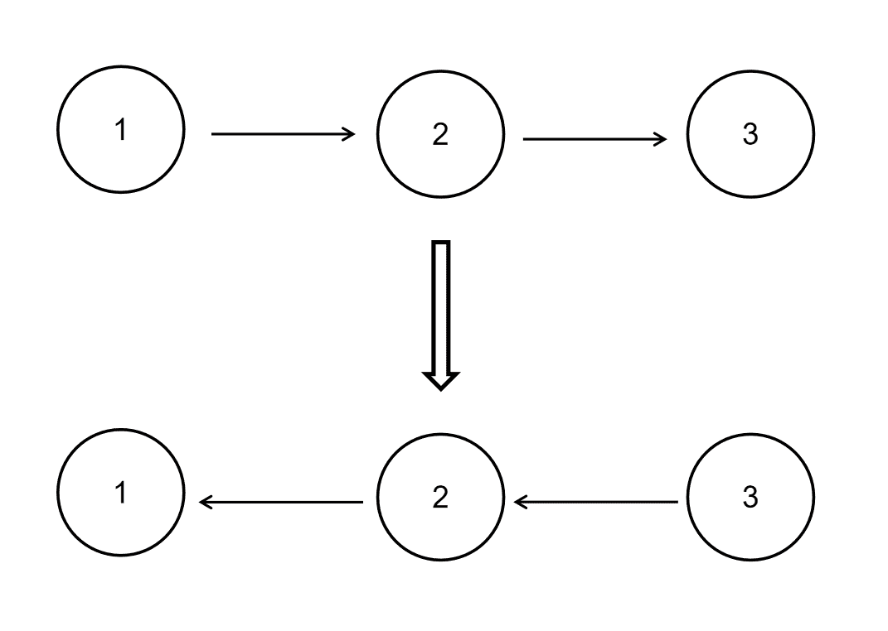

# 寻找时间黑客在线编程大赛练习卷

## 1

大家都知道斐波那契数列，现在要求输入一个正整数 n ，请你输出斐波那契数列的第 n 项。斐波那契数列是一个满足  的数列数据范围：要求：空间复杂度 ，时间复杂度  ，本题也有时间复杂度  的解法

本题知识点

数组 动态规划 记忆化搜索 快速幂 递归

讨论

[fanhk](https://www.nowcoder.com/profile/770226)

c++动态规划版

```cpp
clas
```

  查看全部)

编辑于 2015-06-19 17:21:55

* * *

[luck](https://www.nowcoder.com/profile/816707)

这个题可以说是迭代（Iteration） VS 递归（Recursion），f(n) = f(n-1) + f(n-2)，第一眼看就是递归啊，简直完美的递归环境，递归肯定很爽，这样想着关键代码两三行就搞定了，注意这题的 n 是从 0 开始的：

```cpp
if(n<=1) return n;
else return Fibonacci(n-1)+Fibonacci(n-2);
```

然而并没有什么用，测试用例里肯定准备着一个超大的 n 来让 Stack Overflow，为什么会溢出？因为重复计算，而且重复的情况还很严重，举个小点的例子，n=4，看看程序怎么跑的：Fibonacci(4) = Fibonacci(3) + Fibonacci(2);                    = Fibonacci(2) + Fibonacci(1) + Fibonacci(1) + Fibonacci(0);
                    = Fibonacci(1) + Fibonacci(0) + Fibonacci(1) + Fibonacci(1) + Fibonacci(0);
由于我们的代码并没有记录 Fibonacci(1)和 Fibonacci(0)的结果，对于程序来说它每次递归都是未知的，因此光是 n=4 时 f(1)就重复计算了 3 次之多。那么如何求解呢，动态规划似乎不错，关于动态规划三个条件：最优子结构、无后效性、子问题重叠这些就不谈了，因为理(wo)论(ye)性(bu)太(tai)强(dong)了。下例是一个简单的动态规划，以一定的空间代价避免代价更大的重复计算的栈空间浪费：

```cpp
if(n<=1){
    return n;
}
int[] record = new int[n+1];
record[0] = 0;
record[1] = 1;
for(int i=2;i<=n;i++){
    record[i] = record[i-1] + record[i-2];
}
return record[n];
```

虽然看起来很蠢，空间浪费了 sizeof(int)*(n-1)，但是对于那个超大 n 的测试用例应该是可以通过了，时间复杂度也达到了 O(n)。那能不能把“优雅”的递归和动态规划结合起来呢？递归的优点在于便于理解和编码，而重复计算的关键原因在于代码里直接就“递”进去然后等着“归”了，所以避免重复的关键在于对子问题是否已经得出解的判断，即：

```cpp
public static int[] record = null;
public int Fibonacci(int n){
    if(n<=1){
         return n;
    }
    if(null == record){
        record = new int[n+1];
    }
    if(0!=record[n-2] && 0!=record[n-1]){
        record[n] = record[n-2] + record[n-1];
    } else {
        return Fibonacci(n-2) + Fibonacci(n-1);
    }
}
```

P.S. 最后一种方法，提交时死活过不了输入 5，输出 5 这个测试用例，我在本地都跑过了。

编辑于 2015-10-05 18:48:28

* * *

[楚云天](https://www.nowcoder.com/profile/985031)

思路：用循环，最好不要用递归

```cpp
public class Solution {
    public int Fibonacci(int n) {
        int preNum=1;
        int prePreNum=0;
        int result=0;
        if(n==0)
            return 0;
        if(n==1)
            return 1;
        for(int i=2;i<=n;i++){
            result=preNum+prePreNum;
            prePreNum=preNum;
            preNum=result;
        }
        return result;

    }
}
```

发表于 2015-12-23 23:29:40

* * *

## 2

输入一个整数 n ，输出该数 32 位二进制表示中 1 的个数。其中负数用补码表示。数据范围：即范围为:

本题知识点

基础数学

讨论

[writezen](https://www.nowcoder.com/profile/919978)

```cpp
public class So
```

  查看全部)

编辑于 2015-08-18 23:23:00

* * *

[菩提旭光](https://www.nowcoder.com/profile/837579)

**绝对最佳答案及分析：**public class Solution {    public int NumberOf1(int n) {        int count = 0;        while(n!= 0){            count++;            n = n & (n - 1);         }        return count;    }}**答案正确:恭喜！您提交的程序通过了所有的测试用例****分析一下代码：** **这段小小的代码，很是巧妙。****如果一个整数不为 0，那么这个整数至少有一位是 1。如果我们把这个整数减 1，那么原来处在整数最右边的 1 就会变为 0，原来在 1 后面的所有的 0 都会变成 1(如果最右边的 1 后面还有 0 的话)。其余所有位将不会受到影响。****举个例子：一个二进制数 1100，从右边数起第三位是处于最右边的一个 1。减去 1 后，第三位变成 0，它后面的两位 0 变成了 1，而前面的 1 保持不变，因此得到的结果是 1011.我们发现减 1 的结果是把最右边的一个 1 开始的所有位都取反了。这个时候如果我们再把原来的整数和减去 1 之后的结果做与运算，从原来整数最右边一个 1 那一位开始所有位都会变成 0。如 1100&1011=1000.也就是说，把一个整数减去 1，再和原整数做与运算，会把该整数最右边一个 1 变成 0.那么一个整数的二进制有多少个 1，就可以进行多少次这样的操作。**

编辑于 2015-08-24 16:29:55

* * *

[华科平凡](https://www.nowcoder.com/profile/4939096)

python 一行解法：
如果 n 大于 0，直接计算即可，如果 n 小于 0，计算 2 的 32 次方加上 n 的结果中 1 的个数。

```cpp
# -*- coding:utf-8 -*-
class Solution:
    def NumberOf1(self, n):
        # write code here
        return bin(n).replace("0b","").count("1") if n>=0 else bin(2**32+n).replace("0b","").count("1")
```

编辑于 2017-09-11 08:59:26

* * *

## 3

给定一个单链表的头结点 pHead(该头节点是有值的，比如在下图，它的 val 是 1)，长度为 n，反转该链表后，返回新链表的表头。数据范围： 要求：空间复杂度  ，时间复杂度  。如当输入链表{1,2,3}时，经反转后，原链表变为{3,2,1}，所以对应的输出为{3,2,1}。以上转换过程如下图所示：

本题知识点

链表 *讨论

[writezen](https://www.nowcoder.com/profile/919978)

```cpp
public class So
```

  查看全部)

编辑于 2015-06-19 16:46:40

* * *

[我就用这个名字了](https://www.nowcoder.com/profile/548657)

Java   循环操作   详细思路

```cpp
public class Solution {
    public ListNode ReverseList(ListNode head) {

        if(head==null)
            return null;
        //head 为当前节点，如果当前节点为空的话，那就什么也不做，直接返回 null；
    	ListNode pre = null;
        ListNode next = null;
        //当前节点是 head，pre 为当前节点的前一节点，next 为当前节点的下一节点
        //需要 pre 和 next 的目的是让当前节点从 pre->head->next1->next2 变成 pre<-head next1->next2
        //即 pre 让节点可以反转所指方向，但反转之后如果不用 next 节点保存 next1 节点的话，此单链表就此断开了
        //所以需要用到 pre 和 next 两个节点
        //1->2->3->4->5
        //1<-2<-3 4->5
        while(head!=null){
            //做循环，如果当前节点不为空的话，始终执行此循环，此循环的目的就是让当前节点从指向 next 到指向 pre
            //如此就可以做到反转链表的效果
            //先用 next 保存 head 的下一个节点的信息，保证单链表不会因为失去 head 节点的原 next 节点而就此断裂
            next = head.next;
            //保存完 next，就可以让 head 从指向 next 变成指向 pre 了，代码如下
            head.next = pre;
            //head 指向 pre 后，就继续依次反转下一个节点
            //让 pre，head，next 依次向后移动一个节点，继续下一次的指针反转
            pre = head;
            head = next;
        }
        //如果 head 为 null 的时候，pre 就为最后一个节点了，但是链表已经反转完毕，pre 就是反转后链表的第一个节点
        //直接输出 pre 就是我们想要得到的反转后的链表
        return pre;
    }
}
```

编辑于 2021-01-20 17:13:50

* * *

[搁浅的鱼儿](https://www.nowcoder.com/profile/961875)

```cpp
//第一种方法是：非递归方法
/*
struct ListNode {
	int val;
	struct ListNode *next;
	ListNode(int x) :
			val(x), next(NULL) {
	}
};*/
class Solution {
public:
    ListNode* ReverseList(ListNode* pHead) {

        if(pHead==NULL) return NULL;//注意程序鲁棒性

        ListNode* pNode=pHead;//当前指针
        ListNode* pReverseHead=NULL;//新链表的头指针
        ListNode* pPrev=NULL;//当前指针的前一个结点

        while(pNode!=NULL){//当前结点不为空时才执行
            ListNode* pNext=pNode->next;//链断开之前一定要保存断开位置后边的结点

            if(pNext==NULL)//当 pNext 为空时，说明当前结点为尾节点
                pReverseHead=pNode;

            pNode->next=pPrev;//指针反转
            pPrev=pNode;
            pNode=pNext;
        }
        return pReverseHead;
    }
}

//第二种方法是：递归方法 /*
struct ListNode {
	int val;
	struct ListNode *next;
	ListNode(int x) :
			val(x), next(NULL) {
	}
};*/
class Solution {
public:
    ListNode* ReverseList(ListNode* pHead) {
		//如果链表为空或者链表中只有一个元素	
        if(pHead==NULL||pHead->next==NULL) return pHead;

		//先反转后面的链表，走到链表的末端结点
        ListNode* pReverseNode=ReverseList(pHead->next);

        //再将当前节点设置为后面节点的后续节点
        pHead->next->next=pHead;
        pHead->next=NULL;

        return pReverseNode;

    }
};
```

递归的方法其实是非常巧的，它利用递归走到链表的末端，然后再更新每一个 node 的 next 值 ，实现链表的反转。而 newhead 的值没有发生改变，为该链表的最后一个结点，所以，反转后，我们可以得到新链表的 head。

注意关于链表问题的常见注意点的思考：

1、如果输入的头结点是 NULL，或者整个链表只有一个结点的时候

2、链表断裂的考虑

编辑于 2016-06-27 15:52:55

* * **