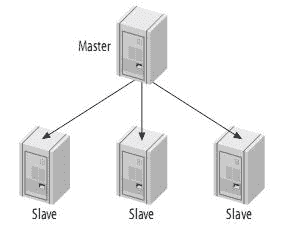
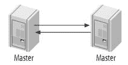
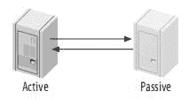
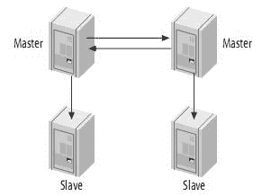
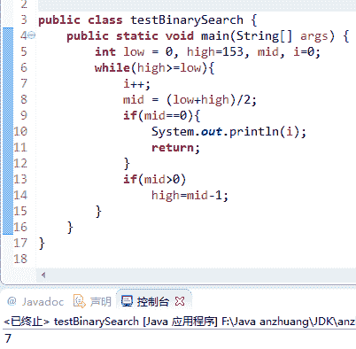
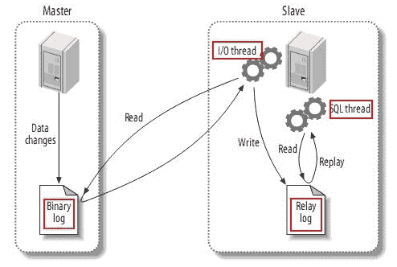
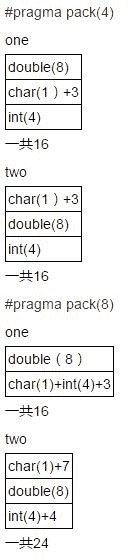

# 网易 2016 实习研发工程师选择题

## 1

以下关于 mysql 复制关系，描述错误的一项是？

正确答案: C   你的答案: 空 (错误)

```cpp
mysql 支持 master-slave 复制，也支持 master-master 复制
```

```cpp
一般情况下，异步复制的性能比半同步复制好，但后者相对更为安全
```

```cpp
基于 row 格式的复制由于传输的数据量比较大，一般不建议使用
```

```cpp
在有多个 slave 参与的半同步复制中，master 并不一定需要等待全部 slave 返回
```

本题知识点

数据库

讨论

[Rnanprince](https://www.nowcoder.com/profile/4293215)

前辈们的回答实在看不懂，我来献丑：**A. ****mysql 支持 master-slave 复制，也支持 master-master 复制，Master-Master 复制的两台服务器，既是 master，又是另一台服务器的 slave。****B.****从 mysql5.5 开始，支持半同步模式复制(semisynchronous replication)，比之前的异步模式复制增强了安全性。**
      半同步复制模式可以确保至少有一个备节点服务器在接受完主服务器发送的 binlog 日志文件并写入到中继日志后，返回给主节点一个 ack 信号，告诉主节点已经接收完日志，这时主节点线程才返回给当前 session 提交信息。**C.****row 格式：** **优点：**

    1、相比 statement 更加安全的复制格式。（选 row 模式的更大原因）

    2、在某些情况下复制速度更快。（复杂 sql，表有主键）

    3、产生比 statement 更少的锁。

    4、所有特殊函数都能复制。

**缺点：**

    1、binlog 文件较大。在 MySQL-5.6 新特性参数 binlog_row_image 解决此问题。

    2、单 sql 全表更新会产生大量 binlog。

    3、无法从 binlog 看见用户执行的 sql。MySQL-5.6 新特性参数 binlog_rows_query_log_event 解决此问题。

    4、由于 binlog 太大，容易造成主从复制端的延迟。**D.**当主节点因为超时未接收到任一个备节点的 ack 信号时会切换会异步复制模式，从而防止堵塞应用。
        当至少有一个备节点返回给主节点 ack 信号时，主节点切换回半同步复制模式。
主备节点必须全部配置成半同步复制模式，否则不支持该模式。
mysql 的半同步复制是通过安装插件来实现的，主备节点安装相应的插件，否则无法实现半同步复制。 _______________________________________________________________________________________________________________-从高层来看，复制分成三步：(1)    master 将改变记录到二进制日志(binary log)中（这些记录叫做二进制日志事件，binary log events）；(2)    slave 将 master 的 binary log events 拷贝到它的中继日志(relay log)；(3)    slave 重做中继日志中的事件，将改变反映它自己的数据。复制的体系结构有以下一些基本原则：(1)    每个 slave 只能有一个 master；(2)    每个 slave 只能有一个唯一的服务器 ID；(3)    每个 master 可以有很多 slave；(4)    如果你设置 log_slave_updates，slave 可以是其它 slave 的 master，从而扩散 master 的更新。MySQL 不支持多主服务器复制(Multimaster Replication)——即一个 slave 有多个 master。4.1、单一 master 和多 slave 由一个 master 和一个 slave 组成复制系统是最简单的情况。Slave 之间并不相互通信，只能与 master 进行通信。如下： 如果写操作较少，而读操作很时，可以采取这种结构。你可以将读操作分布到其它的 slave，从而减小 master 的压力。但是，当 slave 增加到一定数量时，slave 对 master 的负载以及网络带宽都会成为一个严重的问题。 这种结构虽然简单，但是，它却非常灵活，足够满足大多数应用需求。一些建议：(1)    不同的 slave 扮演不同的作用(例如使用不同的索引，或者不同的存储引擎)；(2)    用一个 slave 作为备用 master，只进行复制；(3)    用一个远程的 slave，用于灾难恢复；4.2、主动模式的 Master-Master(Master-Master in Active-Active Mode) Master-Master 复制的两台服务器，既是 master，又是另一台服务器的 slave。如图：4.3、主动-被动模式的 Master-Master(Master-Master in Active-Passive Mode)这是 master-master 结构变化而来的，它避免了 M-M 的缺点，实际上，这是一种具有容错和高可用性的系统。它的不同点在于其中一个服务只能进行只读操作。如图： 4.4、带从服务器的 Master-Master 结构(Master-Master with Slaves)这种结构的优点就是提供了冗余。在地理上分布的复制结构，它不存在单一节点故障问题，而且还可以将读密集型的请求放到 slave 上。 

发表于 2018-07-11 21:06:12

* * *

[远方的范特西](https://www.nowcoder.com/profile/818351)

A 应该是对的.详见 http://www.cnblogs.com/hustcat/archive/2009/12/19/1627525.html

发表于 2016-04-01 10:42:29

* * *

[唐飞 dream](https://www.nowcoder.com/profile/677030)

Mysql 复制分成三步：
(1)    master 将改变记录到二进制日志(binary log)中（这些记录叫做二进制日志事件，binary log events）；
(2)    slave 将 master 的 binary log events 拷贝到它的中继日志(relay log)；
(3)    slave 重做中继日志中的事件，将改变反映它自己的数据。

发表于 2016-04-21 19:01:29

* * *

## 2

对于根元素为最小值的二叉堆，下面说法正确的是

正确答案: A D   你的答案: 空 (错误)

```cpp
删除最小元素的复杂度是 o(logn)
```

```cpp
插入新元素的复杂度是 o(1)
```

```cpp
合并两个堆的复杂度是 o(logn)
```

```cpp
查询最小元素的复杂度是 o(1)
```

本题知识点

堆

讨论

[westolife](https://www.nowcoder.com/profile/600915)

B 错，插入应该调整堆，复杂度为 O(lgn)。至于 C 为什么错？合并两个堆有两种思路：1\. 将一个堆的元素一个个插入另一个堆, O(n[1] lgn[2] )；2\. 直接复制另个堆的元素重建堆，O(n[1] +n[2] ), 因为建一个最大堆的时间复杂度为 O(n)。所以合并两个堆的复杂度不可能是 O(lgn)。

编辑于 2016-09-17 11:55:31

* * *

[黏黏糖](https://www.nowcoder.com/profile/7036341)

A.删除最小元素，即要调整堆，复杂度为 O(logn)B.插入新元素，要和堆中元素进行比较，寻找插入位置，复杂度为 O(logn)C.合并两个堆，即堆 1 的每个元素插入堆 2，由 B 可得，复杂度为 O(nlogn)D.查询最小元素，小顶堆的最小元素即为堆顶，复杂度为 O(1)

发表于 2017-05-23 20:59:02

* * *

[abinge](https://www.nowcoder.com/profile/925837)

关于 A 选项，删除最小元素之后不需要继续调整堆使其保持堆的性质吗？调整堆的 O（lg n)的时间复杂度也得算在删除操作里面吧

发表于 2016-03-25 13:20:45

* * *

## 3

在 154 个元素组成有序表进行二分法查找，可能的比较次数为？

正确答案: B C D   你的答案: 空 (错误)

```cpp
10
```

```cpp
8
```

```cpp
4
```

```cpp
1
```

本题知识点

查找 *讨论

[奋斗吧少年](https://www.nowcoder.com/profile/554880)

折半查找过程可用二叉树来描述，把有序表中间位置上的结点作为树的根结点，左子表和右子表分别对应树的左子树和右子树。折半查找的过程就是走一条从根节点到被查结点的一条路径，比较的次数就是该路径中结点的个数，即，该结点在树中的层数。 所以该题可以转换为求有 154 个结点的二叉树有几层，小于等于这个层数的数值就是答案。 又知，深度为 K 的二叉树最多有 2 的 K 次方-1 个结点，深度为 7 的二叉树最多有 127 个结点，深度为 8 的二叉树最多有 255 个结点，所以 154 个结点的二叉树有 8 层。

发表于 2016-04-02 16:26:46

* * *

[牛客 749711 号](https://www.nowcoder.com/profile/749711)

[log2(154)] = 7，最差的情况下找 8 次，所以 8 次及 8 次以内都有可能找到。

发表于 2016-03-24 10:18:47

* * *

[runner](https://www.nowcoder.com/profile/395770)

为什么是按 2 的次方来算？二分法不是会每次减一吗。。这样的话 2 的 n 方就不准确了啊！我在纸上推算和代码测试了最多都只有 7 次。。 求解答

发表于 2016-03-24 12:08:03

* * *

## 4

下面程序的输出结果是

```cpp
#include<iosteam.h>
void main(){
	int n[][3] = {10,20,30,40,50,60};
	int (*p)[3];
	p=n;
	cout<<p[0][0]<<","<<*(p[0]+1)<<","<<(*p)[2]<<endl;
```

```cpp
}
```

正确答案: B   你的答案: 空 (错误)

```cpp
10,30,50
```

```cpp
10,20,30
```

```cpp
20,40,60
```

```cpp
10,30,60
```

本题知识点

C++

讨论

[LEarBB](https://www.nowcoder.com/profile/708350)

int (*p)[3];这里首先确定：p 是一个指针，一个指向数组的指针。p = &(p[0])       p 是二维指针 p[0] = &(p[0][0]) p[0]是一维指针 p[0] + 1 表示在列上移动。  e.g:  p[0] + 1 = &p[0][0] + 1 = &p[0][1]p + 1   表示在行上移动。  e.g: p + 1 = &(p[0]) + 1 = &p[1]因此：*(p[0]+1) = p[0][1] = 20(*p)[2] = p[0][2] = 30

发表于 2016-03-25 01:32:11

* * *

[绽放的四叶草](https://www.nowcoder.com/profile/312328)

p[0]表示第一行的地址，p[0]+1 表示第一行首地址偏移一个地址，即 a[0][1]。int (*p)[3]，p 是一个数组指针，指向三个元素为一个数组的指针，(*p)表示第一行，（*p）[2]表示 a[0][2]

发表于 2016-03-24 15:03:11

* * *

[可靠的熊](https://www.nowcoder.com/profile/997099)

直接在 p 上偏移就是行，在*p 上偏移就是列比如**（p+1）等于 40 即 p[1][0];*（*p+1）等于 20 即 p[0][1];其中*q=q[0]*q+1=q[1]

发表于 2016-03-24 15:16:57

* * *

## 5

下列不属于网络层协议的是？

正确答案: A   你的答案: 空 (错误)

```cpp
TCP
```

```cpp
IP
```

```cpp
IPX
```

```cpp
ICMP
```

本题知识点

网络基础

讨论

[Rubyist](https://www.nowcoder.com/profile/690575)

ATCP 属于传输层协议 ICMP 是   [TCP/IP 协议](http://baike.baidu.com/view/7649.htm)   族的一个子协议，属于网络层协议，主要用于在主机与路由器之间传递控制信息，包括报告错误、交换受限控制和状态信息等。当遇到 IP 数据无法访问目标、IP   [路由器](http://baike.baidu.com/view/1360.htm) 无法按当前的传输速率转发   [数据包](http://baike.baidu.com/view/25880.htm)   等情况时，会自动发送 ICMP 消息。ICMP 报文在 IP 帧结构的首部协议类型字段（Protocol 8bit)的值=1.

编辑于 2016-03-23 19:24:44

* * *

[Eason_S](https://www.nowcoder.com/profile/314390)

IPX （Internetwork Packet Exchange protocol) ：互联网数据包交换协议 是一个专用的协议簇，它主要由 Novell NetWare 操作系统使用。IPX 是 IPX 协议簇中的第三层协议。 用来对通过互联网络的数据包进行路由选择和转发， 将数据从服务器发送到工作站。 它指定一个无连接的数据包，相当于 TCP/IP 协议簇中的 IP 协议。

发表于 2016-08-02 15:55:14

* * *

[看骨灰盒规范化](https://www.nowcoder.com/profile/773277)

c

发表于 2016-05-03 10:42:37

* * *

## 6

以下是 java concurrent 包下的 4 个类，选出差别最大的一个

正确答案: C   你的答案: 空 (错误)

```cpp
Semaphore
```

```cpp
ReentrantLock
```

```cpp
Future
```

```cpp
CountDownLatch
```

本题知识点

Java

讨论

[RamblerW](https://www.nowcoder.com/profile/661842)

A、Semaphore：类，控制某个资源可被同时访问的个数;B、ReentrantLock：类，具有与使用 synchronized 方法和语句所访问的隐式监视器锁相同的一些基本行为和语义，但功能更强大；C、 Future：接口，表示异步计算的结果；D、 CountDownLatch： 类，可以用来在一个线程中等待多个线程完成任务的类。

编辑于 2016-10-25 17:36:16

* * *

[Q563573095](https://www.nowcoder.com/profile/437958)

1、答案选 C。    a、它是个接口。
    b、别的类都处理线程间的关系，处理并发机制，但该类只用于获取线程结果。
2、Future 表示获取一个正在指定的线程的结果。对该线程有取消和判断是否执行完毕等操作。3、CountDownLatch 是个锁存器，他表示我要占用给定的多少个线程且我优先执行，我执行完之前其他要使用该资源的都要等待。4、 Semaphore，就像是一个许可证发放者，也想一个数据库连接池。证就这么多，如果池中的证没换回来，其他人就不能用。5、 ReentrantLock 和 synchronized 一样，用于锁定线程。

发表于 2016-06-04 09:17:50

* * *

[迷局](https://www.nowcoder.com/profile/3966478)

选 C，它最短，所以差别最大！

发表于 2017-06-08 10:51:54

* * *

## 7

文件 aaa 的访问权限为 rw-r--r--,现要增加所有用户的执行权限和同组用户的写权限，下列哪些命令是正确的？

正确答案: A C   你的答案: 空 (错误)

```cpp
chmod a+x,g+w aaa
```

```cpp
chmod 764 aaa
```

```cpp
chmod 775 aaa
```

```cpp
chmod o+x,g+w aaa
```

本题知识点

Linux

讨论

[牛客 318796 号](https://www.nowcoder.com/profile/318796)

```cpp
-rwxr-xr--  1 amrood   users 1024  Nov 2 00:10  myfile
drwxr-xr--- 1 amrood   users 1024  Nov 2 00:10  mydir
```

第一列就包含了文件或目录的权限。

第一列的字符可以分为三组，每一组有三个，每个字符都代表不同的权限，分别为读取(r)、写入(w)和执行(x)：

*   第一组字符(2-4)表示文件所有者的权限，-rwxr-xr-- 表示所有者拥有读取(r)、写入(w)和执行(x)的权限。
*   第二组字符(5-7)表示文件所属用户组的权限，-rwxr-xr-- 表示该组拥有读取(r)和执行(x)的权限，但没有写入权限。
*   第三组字符(8-10)表示所有其他用户的权限，rwxr-xr-- 表示其他用户只能读取(r)文件。

| 符号 | 说明 |
| + | 为文件或目录增加权限 |
| - | 删除文件或目录的权限 |
| = | 设置指定的权限 |

*   *u* stands for user.
*   *g* stands for group.
*   *o* stands for others.
*   *a* stands for all.

```cpp
$ls -l testfile
-rwxrwxr--  1 amrood   users 1024  Nov 2 00:10  testfile
$chmod o+wx testfile
$ls -l testfile
-rwxrwxrwx  1 amrood   users 1024  Nov 2 00:10  testfile
$chmod u-x testfile
$ls -l testfile
-rw-rwxrwx  1 amrood   users 1024  Nov 2 00:10  testfile
$chmod g=rx testfile
$ls -l testfile
-rw-r-xrwx  1 amrood   users 1024  Nov 2 00:10  testfile

```

*   chmod 775 aaa //???
    除了符号，也可以使用八进制数字来指定具体权限，如下表所示：

    | 数字 | 说明 | 权限 |
    | 0 | 没有任何权限 | --- |
    | 1 | 执行权限 | --x |
    | 2 | 写入权限 | -w- |
    | 3 | 执行权限和写入权限：1 (执行) + 2 (写入) = 3 | -wx |
    | 4 | 读取权限 | r-- |
    | 5 | 读取和执行权限：4 (读取) + 1 (执行) = 5 | r-x        |
    | 6 | 读取和写入权限：4 (读取) + 2 (写入) = 6 | rw- |
    | 7 | 所有权限: 4 (读取) + 2 (写入) + 1 (执行) = 7 | rwx 
     |

发表于 2016-03-23 19:11:46

* * *

[offer 收割帝](https://www.nowcoder.com/profile/326635)

所有用户都有执行权限，所以在 764 的基础上，后面的 64 都要加一个 x，就成了，75，所以最后是 775

发表于 2016-04-02 01:00:24

* * *

[牛客 228506 号](https://www.nowcoder.com/profile/228506)

难道不是 764 吗

发表于 2016-03-28 17:54:46

* * *

## 8

在 mysql 中，以下哪种方式可以开启一个事务？

正确答案: A C   你的答案: 空 (错误)

```cpp
START TRANSACTION
```

```cpp
START
```

```cpp
BEGIN
```

```cpp
BEIGN TRANSACTION
```

本题知识点

数据库

讨论

[51Hz](https://www.nowcoder.com/profile/541081)

*   BEGIN 或 START TRANSACTION；显示地开启一个事务；
*   COMMIT；也可以使用 COMMIT WORK，不过二者是等价的。COMMIT 会提交事务，并使已对数据库进行的所有修改称为永久性的；
*   ROLLBACK；有可以使用 ROLLBACK WORK，不过二者是等价的。回滚会结束用户的事务，并撤销正在进行的所有未提交的修改；
*   SAVEPOINT identifier；SAVEPOINT 允许在事务中创建一个保存点，一个事务中可以有多个 SAVEPOINT；
*   RELEASE SAVEPOINT identifier；删除一个事务的保存点，当没有指定的保存点时，执行该语句会抛出一个异常；
*   ROLLBACK TO identifier；把事务回滚到标记点；
*   SET TRANSACTION；用来设置事务的隔离级别。InnoDB 存储引擎提供事务的隔离级别有 READ UNCOMMITTED、READ COMMITTED、REPEATABLE READ 和 SERIALIZABLE。

发表于 2016-03-24 14:39:12

* * *

[FullenVay](https://www.nowcoder.com/profile/3883503)

我成功地避开了所有的正确答案

发表于 2017-02-28 21:30:38

* * *

[周星星 _](https://www.nowcoder.com/profile/537870)

**[MySQL](http://lib.csdn.net/base/14)事务控制语句** 
        在 mysql 命令行的默认下，事务都是自动提交的，sql 语句提交后马上会执行 commit 操作。因此开启一个事务必须使用 begin，start transaction，或者执行 set autocommit=0;
 可以使用的事务控制语句

start transction | begin : 显示的开启一个事务 http://blog.csdn.net/mchdba/article/details/8690935

发表于 2016-06-07 19:26:23

* * *

## 9

下列选项哪些是正确的

正确答案: D   你的答案: 空 (错误)

```cpp
对于 unordered_map 和 map 这两个容器，迭代器的有效性皆不受删除操作影响
```

```cpp
对于 unordered_map 和 map 这两个容器，迭代器的有效性皆不受插入操作影响
```

```cpp
为了保证代码的异常安全性，应该避免在构造函数中抛异常
```

```cpp
为了保证代码的异常安全性，应该避免在析构函数中抛异常
```

本题知识点

哈希 *讨论

[jxzheng95](https://www.nowcoder.com/profile/630752)

答案应该为 D。
[`www.cplusplus.com/reference/map/map/erase/`](http://www.cplusplus.com/reference/map/map/erase/) 查看下边 iterator validity 这项。同理可以看到 map 的 insert，unorder_map 的 insert 和 erase 操作的这项属性。
A 选项：当 unorder_map 和 map 某迭代器 it 指向的元素被删除时，只有该迭代器 it 失效，其他的迭代器不会失效。
B 选项：map 插入时不会引起迭代器失效；unorder_map 插入时一般情况下不会引起迭代器失效，只有当容器增长到需要 rehash 时，原来的所有迭代器失效。
C 选项：构造函数抛出异常后，已经构造的成员对象会被逆序析构，申请的内存资源会被系统释放，不会调用析构函数。而且构造函数抛出异常是唯一表明构造失败的方法。
D 选项：effective C++“条款 08：别让异常逃离析构函数”指出来如果析构函数抛出异常，对于 vector<Widget>这样的一个对象数组，如果第一个 Widget 析构有异常抛出，这时候还要销毁数组中剩下的 Widget 否则会造成内存泄漏，但是如果剩下的 Widget 析构时也抛出异常，就会两个异常同时存在，程序如果不是结束执行就会产生不明确行为。即使不是使用容器或数组，在析构函数中抛出异常也可能导致程序过早结束或不明确行为。

发表于 2016-04-22 13:50:06

* * *

[淇神](https://www.nowcoder.com/profile/561565628)

都屏蔽了，你还出来

发表于 2020-05-31 16:06:45

* * *

[牛客 773831 号](https://www.nowcoder.com/profile/773831)

此题答案有误.  正确答案 应该为 ADmap 均不受影响对于 unordered_map, 底层是 hash_table  插入元素会导致迭代器失效。http://en.cppreference.com/w/cpp/container/unordered_map/eraseReferences and iterators to the erased elements are invalidated. Other iterators and references are not invalidated.http://en.cppreference.com/w/cpp/container/unordered_map/insertIf rehashing occurs due to the insertion, all iterators are invalidated. Otherwise iterators are not affected. References are not invalidated. Rehashing occurs only if the new number of elements is greater than max_load_factor( ) *bucket_count( ) .对于被删除的元素的迭代器，都是会失效的。

编辑于 2016-04-01 17:34:07

* * *

## 10

下面描述中，正确的是

正确答案: B D   你的答案: 空 (错误)

```cpp
虚函数是没有实现的函数
```

```cpp
纯虚函数的实现是在派生类中
```

```cpp
抽象类是没有纯虚函数的类
```

```cpp
抽象类指针可以指向不同的派生类
```

本题知识点

C++

讨论

[51Hz](https://www.nowcoder.com/profile/541081)

用关键字 virtual 修饰的成员函数叫做虚函数，虚函数是为了实现多态而存在的，必须 有函数体纯虚函数的声明，是在虚函数声明的结尾加=0，没有函数体。在派生类中没有重新定义虚函数之前是不能调用的如果一个类中至少含有一个纯虚函数，此时称之为抽象类。所以抽象类一定有纯虚函数基类类型的指针可以指向任何基类对象或派生类对象

发表于 2016-03-24 14:51:30

* * *

[sudufly](https://www.nowcoder.com/profile/111393589)

B 纯虚函数 只继承接口不继承实现虚函数    继承接口和一份默认实现非虚函数 继承接口和一份强制实现虽然纯虚函数可以在基类中提供默认实现方式，但是派生类任然需要对纯虚函数进行实现，如果不实现的话派生类依旧是一个抽象类，无法实例想使用纯虚函数的默认实现 需要显示调用纯虚函数 Base::Func();所以，，，这个 b 吧估计是这个意思

编辑于 2020-01-06 10:34:47

* * *

[Sones](https://www.nowcoder.com/profile/1049984)

纯虚函数的实现可以在抽象类，但是不能在抽象类体之内定义。

发表于 2017-10-09 12:50:55

* * *

## 11

以下不同的数据库类型中，哪些不属于关系数据库范畴

正确答案: A C D   你的答案: 空 (错误)

```cpp
MongoDB
```

```cpp
PostgreSQL
```

```cpp
Redis
```

```cpp
HBase
```

本题知识点

数据库

讨论

[ssserver](https://www.nowcoder.com/profile/679469)

只有 B 属于关系型数据库；A  Mongodb 数据属于文档型非关系数据库；C  Redis 属于 KV 键值数据库 D  Hbase 属于列数据库答案：B

发表于 2016-03-23 23:30:19

* * *

[残阳纷雨；](https://www.nowcoder.com/profile/5565655)

noSQL 数据库其实有很多：基于 K-V：Redis, Voldemort, Oracle BDB
基于列存储：Cassandra, HBase, Riak.基于文档型：CouchDB, MongoDB | 图形(Graph)数据库 | Neo4J, InfoGrid, Infinite Graph | 

发表于 2018-03-12 16:33:37

* * *

[sunshine193](https://www.nowcoder.com/profile/2551444)

只有 B 属于关系型数据库；A  Mongodb 数据属于文档型非关系数据库；C  Redis 属于 KV 键值数据库 D  Hbase 属于列数据库

发表于 2017-04-06 08:57:16

* * *

## 12

精俭排序，即一对数字不进行两次和两次以上的比较，以下是“精俭排序”的是

正确答案: A B   你的答案: 空 (错误)

```cpp
插入排序
```

```cpp
归并排序
```

```cpp
选择排序
```

```cpp
堆排序
```

本题知识点

排序 *讨论

[日照香炉](https://www.nowcoder.com/profile/841825)

A.插入排序，前面是有序的，后面的每一个元素与前面有序的元素比较，比较过的就是有序的了，不会再比较一次，例如：   3   2   1   5 第一趟：【2,3,1,5】，2 和 3 比较，3 后移；第二趟：【1,2,3,5】，1 和 2,1 和 3 比较，而 2,3 不会比较。
B.每次合并后，内部都是有序的，内部的元素之间不用再比较 C.选择排序，每次在后面的元素中找到最小的，找最小元素的过程是在没有排好序的那部分进行，所有肯定会比较多次；D.堆排序：每次要调整堆，举个例子试试，很容易看出来。总之，只要是每次操作是在排好序的那部分元素之间操作，就符合题意，否则不是。

发表于 2016-03-25 14:34:07

* * *

[MrTyChance](https://www.nowcoder.com/profile/6681736)

我觉得应该是稳不稳定的问题，不稳定的排序 相同元素会再次遇到

发表于 2017-02-23 14:04:15

* * *

[牛客 578447 号](https://www.nowcoder.com/profile/578447)

堆排序由于删除最大节点的时候会产生一个空位，把最后的元素移动到空位，被移动的元素有可能碰到自己原来的兄弟，在删除最大节点时会再次被比较

发表于 2016-06-29 19:04:43

* * *

## 13

有一颗二叉树的前序遍历和后续遍历分别是 1,2,3,4 和 4,3,2,1，则该二叉树的中序遍历可能是

正确答案: A B D   你的答案: 空 (错误)

```cpp
1,2,3,4
```

```cpp
2,3,4,1
```

```cpp
3,2,4,1
```

```cpp
4,3,2,1
```

本题知识点

树

讨论

[47](https://www.nowcoder.com/profile/3891186)

其实有选项了就很简单,根据二叉树的定义,已知前序中序或者后序中序便可以得出唯一一棵二叉树,也就是说你只要把上述的前序遍历和中序遍历结合的树来和后序比较,一样则正确,不一样就是错的

发表于 2016-08-01 16:44:33

* * *

[Nothing&All](https://www.nowcoder.com/profile/976362)

中序遍历可能有四种：①4,3,2,1 ②3,4,2,1 ③2,4,3,1 ④ 2,3,4,1 如图： 还有一个是 A 选项。1-2-3-4 这种的。好像还有 1432,1342,1243。一共 8 种

编辑于 2016-03-24 16:20:35

* * *

[_ 遇见时光](https://www.nowcoder.com/profile/502947)

A 也是可能的吧

发表于 2016-03-23 20:42:42

* * *

## 14

以下有关 Http 协议的描述中，正确的有？

正确答案: A C D   你的答案: 空 (错误)

```cpp
post 请求一般用于修改服务器上的资源，对发送的消息数据量没有限制，通过表单方式提交
```

```cpp
HTTP 返回码 302 表示永久重定向，需要重新 URI
```

```cpp
可以通过 206 返回码实现断点续传
```

```cpp
HTTP1.1 实现了持久连接和管线化操作以及主动通知功能，相比 http1.0 有大福性能提升
```

本题知识点

网络基础

讨论

[胡哈哈](https://www.nowcoder.com/profile/933464)

错误代码(也称作状态代码)，指为服务器所接收每个请求(网页点击)分配的 3 位数代码。多数有效网页点击都有状态代码 200("正常")。"网页未找到"错误会生产 404 错误。某些常见的代码以粗体显示。

1xx(临时响应)

用于表示临时响应并需要请求者执行操作才能继续的状态代码。

代码 说明

100(继续) 请求者应当继续提出请求。服务器返回此代码则意味着，服务器已收到了请求的第一部分，现正在等待接收其余部分。

101(切换协议) 请求者已要求服务器切换协议，服务器已确认并准备进行切换。

2xx(成功)

用于表示服务器已成功处理了请求的状态代码。

代码 说明

200(成功) 服务器已成功处理了请求。通常，这表示服务器提供了请求的网页。如果您的 robots.txt 文件显示为此状态，那么，这表示 Googlebot 已成功检索到该文件。

201(已创建) 请求成功且服务器已创建了新的资源。

202(已接受) 服务器已接受了请求，但尚未对其进行处理。

203(非授权信息) 服务器已成功处理了请求，但返回了可能来自另一来源的信息。

204(无内容) 服务器成功处理了请求，但未返回任何内容。

205(重置内容) 服务器成功处理了请求，但未返回任何内容。与 204 响应不同，此响应要求请求者重置文档视图(例如清除表单内容以输入新内容)。

206(部分内容) 服务器成功处理了部分 GET 请求。

3xx(已重定向)

要完成请求，您需要进一步进行操作。通常，这些状态代码是永远重定向的。Google 建议您在每次请求时使用的重定向要少于 5 个。您可以使用网站管理员工具来查看 Googlebot 在抓取您已重定向的网页时是否会遇到问题。诊断下的抓取错误页中列出了 Googlebot 由于重定向错误而无法抓取的网址。

代码 说明

300(多种选择) 服务器根据请求可执行多种操作。服务器可根据请求者 (User agent) 来选择一项操作，或提供操作列表供请求者选择。

301(永久移动) 请求的网页已被永久移动到新位置。服务器返回此响应(作为对 GET 或 HEAD 请求的响应)时，会自动将请求者转到新位置。您应使用此代码通知 Googlebot 某个网页或网站已被永久移动到新位置。

302(临时移动) 服务器目前正从不同位置的网页响应请求，但请求者应继续使用原有位置来进行以后的请求。此代码与响应 GET 和 HEAD 请求的 301 代码类似，会自动将请求者转到不同的位置。但由于 Googlebot 会继续抓取原有位置并将其编入索引，因此您不应使用此代码来通知 Googlebot 某个页面或网站已被移动。

303(查看其他位置) 当请求者应对不同的位置进行单独的 GET 请求以检索响应时，服务器会返回此代码。对于除 HEAD 请求之外的所有请求，服务器会自动转到其他位置。

304(未修改) 自从上次请求后，请求的网页未被修改过。服务器返回此响应时，不会返回网页内容。

如果网页自请求者上次请求后再也没有更改过，您应当将服务器配置为返回此响应(称为 If-Modified-Since HTTP 标头)。由于服务器可以告诉 Googlebot 自从上次抓取后网页没有更改过，因此可节省带宽和开销。

305(使用***) 请求者只能使用***访问请求的网页。如果服务器返回此响应，那么，服务器还会指明请求者应当使用的***。

307(临时重定向) 服务器目前正从不同位置的网页响应请求，但请求者应继续使用原有位置来进行以后的请求。此代码与响应 GET 和 HEAD 请求的 301 代码类似，会自动将请求者转到不同的位置。但由于 Googlebot 会继续抓取原有位置并将其编入索引，因此您不应使用此代码来通知 Googlebot 某个页面或网站已被移动。

4xx(请求错误)

这些状态代码表示，请求可能出错，已妨碍了服务器对请求的处理。

代码 说明

400(错误请求) 服务器不理解请求的语法。

401(未授权) 请求要求进行身份验证。登录后，服务器可能会返回对页面的此响应。

403(已禁止) 服务器拒绝请求。如果在 Googlebot 尝试抓取您网站上的有效网页时显示此状态代码(您可在 Google 网站管理员工具中诊断下的网络抓取页面上看到此状态代码)，那么，这可能是您的服务器或主机拒绝 Googlebot 对其进行访问。

404(未找到) 服务器找不到请求的网页。例如，如果请求是针对服务器上不存在的网页进行的，那么，服务器通常会返回此代码。

如果您的网站上没有 robots.txt 文件，而您在 Google 网站管理员工具"诊断"标签的 robots.txt 页上发现此状态，那么，这是正确的状态。然而，如果您有 robots.txt 文件而又发现了此状态，那么，这说明您的 robots.txt 文件可能是命名错误或位于错误的位置。(该文件应当位于顶级域名上，且应当名为 robots.txt)。

如果您在 Googlebot 尝试抓取的网址上发现此状态(位于"诊断"标签的 HTTP 错误页上)，那么，这表示 Googlebot 所追踪的可能是另一网页中的无效链接(旧链接或输入有误的链接)。

405(方法禁用) 禁用请求中所指定的方法。

406(不接受) 无法使用请求的内容特性来响应请求的网页。

407(需要***授权) 此状态代码与 401(未授权)类似，但却指定了请求者应当使用***进行授权。如果服务器返回此响应，那么，服务器还会指明请求者应当使用的***。

408(请求超时) 服务器等候请求时超时。

409(冲突) 服务器在完成请求时发生冲突。服务器必须包含有关响应中所发生的冲突的信息。服务器在响应与前一个请求相冲突的 PUT 请求时可能会返回此代码，同时会提供两个请求的差异列表。

410(已删除) 如果请求的资源已被永久删除，那么，服务器会返回此响应。该代码与 404(未找到)代码类似，但在资源以前有但现在已经不复存在的情况下，有时会替代 404 代码出现。如果资源已被永久删除，那么，您应当使用 301 代码指定该资源的新位置。

411(需要有效长度) 服务器不会接受包含无效内容长度标头字段的请求。

412(未满足前提条件) 服务器未满足请求者在请求中设置的其中一个前提条件。

413(请求实体过大) 服务器无法处理请求，因为请求实体过大，已超出服务器的处理能力。

414(请求的 URI 过长) 请求的 URI(通常为网址)过长，服务器无法进行处理。

415(不支持的媒体类型) 请求的格式不受请求页面的支持。

416(请求范围不符合要求) 如果请求是针对网页的无效范围进行的，那么，服务器会返回此状态代码。

417(未满足期望值) 服务器未满足"期望"请求标头字段的要求。

5xx(服务器错误)

这些状态代码表示，服务器在尝试处理请求时发生内部错误。这些错误可能是服务器本身的错误，而不是请求出错。

代码 说明

500(服务器内部错误) 服务器遇到错误，无法完成请求。

501(尚未实施) 服务器不具备完成请求的功能。例如，当服务器无法识别请求方法时，服务器可能会返回此代码。

502(错误网关) 服务器作为网关或***，从上游服务器收到了无效的响应。

503(服务不可用) 目前无法使用服务器(由于超载或进行停机维护)。通常，这只是一种暂时的状态。

504(网关超时) 服务器作为网关或***，未及时从上游服务器接收请求。

505(HTTP 版本不受支持) 服务器不支持请求中所使用的 HTTP 协议版本。

发表于 2016-04-03 00:08:17

* * *

[一个匿名的弱鸡](https://www.nowcoder.com/profile/569802)

HTTP /302 redirect: 302 代表暂时性转移(Temporarily Moved )。 
HTTP/206 “Partial Content”响应是在客户端表明自己只需要目标 URL 上的部分资源的时候返回的.这种情况经常发生在客户端继续请求一个未完成的下载的时候(通常是当客户端加载一个体积较大的嵌入文件,比如视屏或[PDF 文件](https://www.baidu.com/s?wd=PDF%E6%96%87%E4%BB%B6&tn=44039180_cpr&fenlei=mv6quAkxTZn0IZRqIHckPjm4nH00T1Y4uHn4m1Rsrjb4m1f1mH040ZwV5Hcvrjm3rH6sPfKWUMw85HfYnjn4nH6sgvPsT6KdThsqpZwYTjCEQLGCpyw9Uz4Bmy-bIi4WUvYETgN-TLwGUv3Erj6YPHRsPWb) ),或者是客户端尝试实现带宽遏流的时候.

发表于 2016-03-24 00:22:17

* * *

[旋风王子](https://www.nowcoder.com/profile/796565)

这道题答案应该是 ACD。206 返回码可以实现断点重传。具体参见 http://www.cnblogs.com/ziyunfei/archive/2012/11/18/2775499.html

发表于 2016-03-25 19:23:16

* * *

## 15

下列有关 windows 系统的 EXE 和 DLL 文件说法错误的是？

正确答案: B C   你的答案: 空 (错误)

```cpp
EXE 和 DLL 文件都是 PE 文件
```

```cpp
EXE 不能有导出函数，DLL 可以有导出函数
```

```cpp
EXE 有 x86 和 x64 之分，则 DLL 没有
```

```cpp
EXE 可以单独运行，DLL 则不行
```

本题知识点

Windows

讨论

[周星星 _](https://www.nowcoder.com/profile/537870)

答案解析：BC- AD 正确 PE 文件的全称是 Portable Executable，意为可移植的可执行的文件，常见的 EXE、DLL、OCX、SYS、COM 都是 PE 文件，PE 文件是微软 Windows 操作系统上的程序文件（可能是间接被执行，如 DLL）dll 是动态链接库，不可直接运行，dll 提供库函数给其他程序调用。exe 可执行程序，文件可以直接运行。http://m.blog.csdn.net/article/details?id=51496866- B 错误 EXE 完全可以和 DLL 一样导出函数，一样被调用。(http://bbs.pediy.com/showthread.php?t=56840)

DLL 中导出函数的声明有两种方式：

一种方式是：在函数声明中加上 __declspec(dllexport)；

另外一种方式是：采用模块定义(.def)文件声明，(.def)文件为链接器提供了有关被链接程序的导出、属性及其他方面的信息。（http://blog.csdn.net/yushiqiang1688/article/details/5204393）- C 错误发布 dll 时，可以选择编译为 x86 模式、x64 模式以及 Any Cpu 模式等(http://www.cnblogs.com/qguohog/archive/2011/09/13/2174897.html)

编辑于 2016-07-24 11:50:06

* * *

[MSean](https://www.nowcoder.com/profile/231467)

A、**对：**PE 文件，即 Portable Executable 可移植的、可执行的文件，常见的 EXE、DLL、OCX、SYS、COM 都是 PE 文件；B、**错：**EXE 和 DLL 一样可以有导出函数；C、**错：**DLL 也有 x86 和 x64 之分；D、**对：**EXE 可以单独运行，DLL 虽然包含可执行代码但却不能单独执行，而应由 windows 应用程序直接或间接调用。

发表于 2016-08-02 16:58:45

* * *

[牛客 916689 号](https://www.nowcoder.com/profile/916689)

EXE 完全可以和 DLL 一样导出函数，一样被调用。例子 http://www.pediy.com/kssd/pediy09/pediy09-682.htm

发表于 2016-03-25 10:31:56

* * *

## 16

假设系统按单值方式运行且采用最短作业优先算法，有 J1,J2,J3,J4 共 4 个作业同时到达，则以下哪几种情况下的平均周转时间为 10 分钟?

正确答案: B C   你的答案: 空 (错误)

```cpp
执行时间 J1:1 分钟 J2:5 分钟 J3:9 分钟 J4:13 分钟
```

```cpp
执行时间 J1:1 分钟 J2:4 分钟 J3:7 分钟 J4:10 分钟
```

```cpp
执行时间 J1:2 分钟 J2:4 分钟 J3:6 分钟 J4:8 分钟
```

```cpp
执行时间 J1:3 分钟 J2:6 分钟 J3:9 分钟 J4:12 分钟
```

本题知识点

操作系统

讨论

[逗比豪](https://www.nowcoder.com/profile/629516)

首先，短作业优先则短时间的作  查看全部)

编辑于 2016-08-18 08:41:16

* * *

[RainChang](https://www.nowcoder.com/profile/360144)

短作业优先，那么这样计算：(J1*4+J2*3+J3*2+J4*1)/4

发表于 2016-03-25 01:12:40

* * *

[牛客 916689 号](https://www.nowcoder.com/profile/916689)

平均周转时间=（作业 1 完成时间-作业 1 到达时间+作业 2 完成时间-作业 2 到达时间+。。。+作业 n 完成时间-作业 n 到达时间）/n 所以 B=（1+5+12+22）/4=10；C=（2+6+12+20）/4=10；

发表于 2016-03-25 14:59:59

* * *

## 17

MYSQL 实现主从复制的日志是哪种？

正确答案: C   你的答案: 空 (错误)

```cpp
READ LOG
```

```cpp
UNDO LOG
```

```cpp
BINLOG
```

```cpp
GENERAL LOG
```

本题知识点

数据库

讨论

[周星星 _](https://www.nowcoder.com/profile/537870)

mysql 主(称 master)从(称 slave)复制的原理：      (1).master 将数据改变记录到二进制日志(binary log)中,也即是配置文件 log-bin 指定的文件(这些记录叫做二进制日志事件，binary log events)      (2).slave 将 master 的 binary log events 拷贝到它的中继日志(relay log)      (3).slave 重做中继日志中的事件,将改变反映它自己的数据(数据重演)附简要原理图： ref:mysql 5.6.14 主从复制(也称 mysql AB 复制)环境配置[`www.it165.net/database/html/201311/4851.html`](http://www.it165.net/database/html/201311/4851.html)MySQL 主从复制原理、主从复制（异步）、半同步复制、基于 SSL 复制[`www.it165.net/database/html/201406/6835.html`](http://www.it165.net/database/html/201406/6835.html)

发表于 2016-06-07 19:15:12

* * *

[黑眼圈的灰姑娘](https://www.nowcoder.com/profile/200043)

mysql 日志一般分为 5 种错误日志：-log-err (记录启动，运行，停止 mysql 时出现的信息)二进制日志：-log-bin （记录所有更改数据的语句，还用于复制，恢复数据库用）查询日志：-log （记录建立的客户端连接和执行的语句）慢查询日志: -log-slow-queries （记录所有执行超过 long_query_time 秒的所有查询）更新日志:     -log-update （二进制日志已经代替了老的更新日志，更新日志在 MySQL 5.1 中不再使用）

发表于 2016-05-12 19:44:32

* * *

[Breeze Mao](https://www.nowcoder.com/profile/893215)

MySQL5.6 开始主从复制有两种方式：基于日志（binlog）；基于 GTID（全局事务标示符）。

发表于 2016-03-24 10:34:41

* * *

## 18

()是构成 C 语言的基本单位

正确答案: A   你的答案: 空 (错误)

```cpp
函数
```

```cpp
过程
```

```cpp
子程序
```

```cpp
子例程
```

本题知识点

C++工程师 牛客 C 语言

讨论

[留言男](https://www.nowcoder.com/profile/377221)

面向过程的语言为嘛不能选 B。。。。

发表于 2016-03-28 15:29:41

* * *

[古月 1994](https://www.nowcoder.com/profile/6256272)

现在的程序语言主要分为面向对象的，代表有 Java，Python，C++等，还有一种就是面向过程的，代表有 C 语言，汇编等。
自己在学习 C 语言课上写的控制台小程序中最深刻的印象就是写了好多小函数相互调用，最后写个 main 函数进行功能选择。

发表于 2016-08-02 09:15:02

* * *

[liuzhen007](https://www.nowcoder.com/profile/873052646)

貌似有一个类似的题目，答案是：语句 😂

发表于 2019-11-29 22:44:15

* * *

## 19

对于线性表（7，34，55，25，64，46，20，10）进行散列存储时，若使用 H（K)=K%9 作为散列函数，则散列地址为 1 的元素有（）个

正确答案: D   你的答案: 空 (错误)

```cpp
1
```

```cpp
2
```

```cpp
3
```

```cpp
4
```

本题知识点

哈希 *讨论

[zhisheng_blog](https://www.nowcoder.com/profile/616717)

答案：D   4 个其实就是用关键字去套哈希函数为 H(key)=key MOD 9,7%9=734%9=7**55%**9=**1**25%9=7**64%**9=**1****46%**9=**1****10%**9=**1****就是 55、64、46、10 这四个数了。**

编辑于 2016-08-20 16:54:07

* * *

[皎月明·离人泪](https://www.nowcoder.com/profile/502725)

散列后的地址不是不重复吗，题中不是问的是散列地址，不是应该是一一对应的吗

发表于 2016-04-15 01:45:33

* * *

[啊 K](https://www.nowcoder.com/profile/680136)

哈希函数 H（K)=K%9 表示除 9 的余数作为应该放的地址位置。所以题目问地址是 1 的，就是问线性表里面哪些数除以 9 余 1.有 55 64 46 10

发表于 2016-03-24 21:06:51

* * *

## 20

头文件已经正常包含，以下代码在 VS IDE 上编译和运行结果是

```cpp
class A{
    public:
	void test(){printf("test A");}
};
int main()
{
    A *pA = NULL;
    pA->test();
    return 0;
}
```

正确答案: C   你的答案: 空 (错误)

```cpp
编译出错
```

```cpp
程序运行奔溃
```

```cpp
输出"test A"
```

```cpp
输出乱码
```

本题知识点

C++ C 语言

讨论

[leobuzhi](https://www.nowcoder.com/profile/932073)

第一，这道题目应该是写法有点问题，应该是这样的（注意类后面加了分号，test 后面加了括号）

```cpp
#include<iostream>
using namespace std;
class A{
public:
	void test()
	{ printf("test A"); }
};
int main(){
	A* pA = NULL;
	pA->test();
	return 0;
}
```

**其实这个是可以正常运行的****原因如下：**因为对于非虚成员函数，Ｃ++这门语言是静态绑定的。这也是Ｃ++语言和其它语言 Java, Python 的一个显著区别。以此下面的语句为例：

```cpp
pA->test();

```

这语句的意图是：调用对象 pA 的 test 成员函数。如果这句话在 Java 或 Python 等动态绑定的语言之中，编译器生成的代码大概是：
找到 pA 的 test 成员函数，调用它。（注意，这里的找到是程序运行的时候才找的，这也是所谓动态绑定的含义：运行时才绑定这个函数名与其对应的实际代码。有些地方也称这种机制为迟绑定，晚绑定。）
但是对于 C++。为了保证程序的运行时效率，Ｃ++的设计者认为凡是编译时能确定的事情，就不要拖到运行时再查找了。所以 C++的编译器看到这句话会这么干：
１：查找 pA 的类型，发现它有一个非虚的成员函数叫 test 。（编译器干的）
２：找到了，在这里生成一个函数调用，直接调 A:: test ( pA )。
所以到了运行时，由于 test ()函数里面并没有任何需要解引用 pA 指针的代码，所以真实情况下也不会引发 segment fault。这里对成员函数的解析，和查找其对应的代码的工作都是在编译阶段完成而非运行时完成的，这就是所谓的静态绑定，也叫早绑定。
正确理解 C++的静态绑定可以理解一些特殊情况下 C++的行为。

发表于 2016-03-23 21:16:51

* * *

[hahah007](https://www.nowcoder.com/profile/796048)

C 应该是正确的。根据<<深度探索 c++对象模型>>里面说到的，普通成员函数在编译器实现时，大致经历一下转化过程：1.改写函数的签名以安插一个额外的参数 - this 指针 2\. 将每一个对非静态成员数据成员的存取操作改为经由 this 指针来存取。3.将成员函数重写成外部函数，函数名称经过“mangling"处理，使其在程序中有唯一的名字。（重写成外部函数，是希望在实现成员函数的时候，使其效率接近普通非成员函数，尽可能避免带来额外开销）------------------------A*pA=null;pA->test(); //当调用成员函数时，只是将实参 null 传给 this 指针（对应 1.）test 成员函数中并无任何需要通过 this 指针访问的数据成员（对应 2.），因此没有带来任何影响

编辑于 2016-04-02 23:55:32

* * *

[Kelyn](https://www.nowcoder.com/profile/706062)

这道题目应该选 C，能够正常运行。test 函数作为非虚函数，在编译时就确定了。即使 pA 为 null，但是已经声明了类型，就知道 pA 有个 test 函数，且 test 函数里没有用到成员变量，单单一个打印语句是可以运行成功的。自己去 vs 敲好运行下就知道了。

发表于 2016-03-28 17:25:16

* * *

## 21

下面两个结构体

```cpp
struct One{
	double d;
	char c;
	int i;
}
struct Two{
	char c;
	double d;
	int i;
}
```

在#pragma pack(4)和#pragma pack(8)的情况下，结构体的大小分别是

正确答案: C   你的答案: 空 (错误)

```cpp
16 24,16 24
```

```cpp
16 20,16 20
```

```cpp
16 16,16 24
```

```cpp
16 16,24 24
```

本题知识点

C 语言

讨论

[51Hz](https://www.nowcoder.com/profile/541081)



编辑于 2016-03-24 15:41:47

* * *

[selfboot](https://www.nowcoder.com/profile/509)

许多实际的计算机系统对基本类型数据在内存中存放的位置有限制，它们会要求这些数据的首地址的值是某个数 k（通常它为 4 或 8）的倍数，这就是所谓的内存对齐。

每个特定平台上的编译器都有自己的默认“对齐系数”（32 位机一般为 4，64 位机一般为 8）。我们可以通过预编译命令#pragma pack(k)，k=1,2,4,8,16 来改变这个系数，其中 k 就是需要指定的“对齐系数”；也可以使用#pragma pack()取消自定义字节对齐方式。

struct 或者 union 成员对齐规则如下：

1. 第一个数据成员放在 offset 为 0 的地方，对齐按照对齐系数和自身占用字节数中，二者比较小的那个进行对齐；

2. 在数据成员完成各自对齐以后，struct 或者 union 本身也要进行对齐，对齐将按照对齐系数和 struct 或者 union 中最大数据成员长度中比较小的那个进行；

先局部成员对齐，然后再全局对齐。

发表于 2016-03-24 09:35:56

* * *

[，。，。，。ff](https://www.nowcoder.com/profile/6187885)

每个特定平台上的[编译器](http://baike.baidu.com/item/%E7%BC%96%E8%AF%91%E5%99%A8)都有自己的默认“对齐系数”(也叫对齐模数)。程序员可以通过[预编译](http://baike.baidu.com/item/%E9%A2%84%E7%BC%96%E8%AF%91)命令#pragma pack(n)，n=1,2,4,8,16 来改变这一系数，其中的 n 就是你要指定的“对齐系数”。规则：1、[数据成员](http://baike.baidu.com/item/%E6%95%B0%E6%8D%AE%E6%88%90%E5%91%98)对齐规则：结构(struct)(或联合(union))的数据成员，第一个数据成员放在 offset 为 0 的地方，以后每个数据成员的对齐按照#pragma pack 指定的数值和这个数据成员自身长度中，比较小的那个进行。2、结构(或联合)的整体对齐规则：在数据成员完成各自对齐之后，结构(或联合)本身也要进行对齐，对齐将按照#pragma pack 指定的数值和结构(或联合)最大数据成员长度中，比较小的那个进行。-----百度百科（内存对齐）

发表于 2017-03-24 21:15:44

* * *

## 22

在上下文和头文件均正常情况下，以下程序的输出结果是？

```cpp
int x = 1;
do{	
    printf("%2d\n",x++);
}while(x--);
```

正确答案: D   你的答案: 空 (错误)

```cpp
1
```

```cpp
无任何输出
```

```cpp
2
```

```cpp
陷入死循环
```

本题知识点

C 语言

讨论

[汪文魁](https://www.nowcoder.com/profile/3306830)

%2d 是 C 语言中 printf 函数的输出格式说明符。 具体解释如下： 使输出的 int 型的数值以 2 位的固定位宽输出。如果不足 2 位，则在前面补空格；如果超过 2 位，则按实际位数输出。 注：如果输出的数值不是 int 型，则进行强制类型转换为 int，之后按上面的格式输出。 举例如下： 1 2 3 4 printf("%2d", 12); // 输出 12 printf("%2d", 1); // 输出 _1 (_ 代表空格) printf("%2d", 122); // 输出 122 printf("%2d", 12.72); // 输出 12 (强制类型转换，即取整数部分)

发表于 2016-11-16 20:52:35

* * *

[沫沫棒棒](https://www.nowcoder.com/profile/6551170)

Do while 为出口循环，也就是先执行循环体，再进行出口判断，若为 false 则跳出循环。

发表于 2016-08-15 14:45:34

* * *

[shizheng](https://www.nowcoder.com/profile/669575)

死循环  无限输出 1

发表于 2016-03-24 15:46:38

* * *

## 23

ping 下面是基于哪个协议？

正确答案: A   你的答案: 空 (错误)

```cpp
ICMP
```

```cpp
TCP
```

```cpp
IP
```

```cpp
UDP
```

本题知识点

网络基础

讨论

[Candy_air](https://www.nowcoder.com/profile/802809)

TCP、UDP 属于传输层，ICMP 、IP 属于网络层协议，而 ICMP 主要用于在主机与路由器之间传递控制信息，包括报告错误、交换受限控制和状态信息等。当遇到 IP 数据无法访问目标、IP [路由器](http://baike.baidu.com/view/1360.htm) 无法按当前的传输速率转发 [数据包](http://baike.baidu.com/view/25880.htm) 等情况时，会自动发送 ICMP 消息。ICMP 报文在 IP 帧结构的首部协议类型字段（Protocol 8bit)的值=1. 

发表于 2016-03-24 11:50:44

* * *

[轩辕ㄓ枫](https://www.nowcoder.com/profile/190866)

ping 在主机和服务器之间传递控制消息，属于 ICMP 协议，但是 ICMP 协议是 TCP/IP 的子协议。。。

发表于 2016-04-09 21:50:09

* * *

[她去哪我就想去哪](https://www.nowcoder.com/profile/1933417)

```cpp
TCP/IP 所属的 ICMP 协议。
ICMP 是 Internet 控制报文协议，它是 TCP/IP 协议族的一个子协议，用于在 IP 主机、路由器之间传递控制消息。控制消息是指网络通不通、主机是否可达、路由是否可用等网络本身的消息。这些控制消息虽然并不传输用户数据，但是对于用户数据的传递起着重要的作用。
ICMP 是一个“错误侦测与回报机制”，其目的是检测网路的连线状况﹐也能确保连线的准确性。
功能主要有：
· 侦测远端主机是否存在。
· 建立及维护路由资料。
· 重导资料传送路径（ICMP 重定向）。
· 资料流量控制。ICMP 在沟通之中，主要是透过不同的类别(Type)与代码(Code) 让机器来识别不同的连线状况。
```

发表于 2018-03-26 18:45:54

* * *

## 24

有一个文件 ip.txt，每行一条 ip 记录，共若干行，下面哪个命令可以实现“统计出现次数最多的前 3 个 ip 及其次数”？

正确答案: B   你的答案: 空 (错误)

```cpp
uniq -c ip.txt | sort -nr | head -n 3
```

```cpp
sort ip.txt | uniq -c | sort -rn | head -n 3
```

```cpp
cat ip.txt | count -n | sort -rn | head -n 3
```

```cpp
cat ip.txt | sort | uniq -c | sort -rn | top -n 3
```

本题知识点

Linux

讨论

[追赶大废](https://www.nowcoder.com/profile/286729)

答案选 B，首先排序 sort，相同的 ip 会排在一起，然后 uniq -c 会去掉重复的 ip，只有保留一条，同时记录重复数在行首，如： 3 ip1   \n    1 ip2   \n 2 ip3，再按照数字反向排序即可 sort -nr，-n 是按照数字，-r 是降序，最好 head -n 3 取出前三个即可。

编辑于 2016-08-17 22:49:39

* * *

[kiwi_95](https://www.nowcoder.com/profile/372313)

uniq -c 时只会对相邻的计数，所以要先 sort 再 uniq，然后再 sort -nr

发表于 2016-03-29 16:38:33

* * *

[超爱贤](https://www.nowcoder.com/profile/758292)

首先 sort 进行排序，将重复的行都排在了一起，然后使用 uniq -c 将重复的行的次数放在了行首，在用 sort -rn 进行反向和纯文本排序，这样就按照重复次数从高到低进行了排列，最后利用 head -n 3 输出行首的三行。

发表于 2016-03-24 11:26:10

* * *

## 25

在使用锁保证线程安全时，可能会出现活跃度失败的情况，活跃度失败主要包括

正确答案: D   你的答案: 空 (错误)

```cpp
死锁
```

```cpp
饥饿
```

```cpp
活锁
```

```cpp
以上全部
```

本题知识点

操作系统

讨论

[轩辕ㄓ枫](https://www.nowcoder.com/profile/190866)

在使用锁保证现场安全时可能会出现 活跃度 失败的情况主要包括 饥饿、丢失信号、和活锁、死锁 等。【多线程除了死锁之外遇到最多的就是活跃度问题了】

饥饿 ：指线程需要访问的资源 被永久拒绝 ，以至于不能再继续进行。解决饥饿问题需要平衡线程对资源的竞争，如线程的优先级、任务的权重、执行的周期等。

活锁 ：指线程虽然没有被阻塞，但由于某种条件不满足，一直尝试重试却始终失败。解决活锁问题需要对 重试机制 引入一些随机性。例如如果检测到冲突，那么就暂停随机的一定时间进行重试，这会大大减少碰撞的可能性。

发表于 2016-04-09 21:52:05

* * *

[一个人的天空](https://www.nowcoder.com/profile/174801)

我认为，活跃度失败意思就是调用不到了线程了，那么三种都有可能；
死锁也就是互相等着对方释放资源，结果谁也得不到；活锁可能发生让某一个线程一直处于等待状态，其他线程都可以调用到；饥饿我就感觉用抢占式说好说，每次来就执行优先级高的，那么优先级低的可能永远执行不到。

发表于 2016-03-28 00:08:51

* * *

[72%](https://www.nowcoder.com/profile/999727528)

活跃度问题有关死锁、饥饿和活锁：1\. 死锁是由于**资源紧张造**成的，多个线程由于请求资源而形成一个环路，谁也不退让，导致谁也不能执行；2\. 饥饿主要是由于线程**优先级**造成的，当大量线程并发执行时，优先级较小的线程总是得不到执行，引起线程饥饿；3\. 活锁是由于线程在资源请求中遇到冲突时的**重试策略**不正确造成的。引入一定的随机性可避免活锁。

发表于 2019-12-13 16:55:43

* * *

## 26

关于 sleep 和 wait,以下描述错误的是

正确答案: D   你的答案: 空 (错误)

```cpp
sleep 是线程类的方法，wait 是 object 的方法
```

```cpp
sleep 不释放对象锁，wait 放弃对象锁
```

```cpp
sleep 暂停线程，但监控状态依然保持，结束后会自动恢复
```

```cpp
wait 进入等待锁定池，只有针对此对象发出 notify 方法获得对象锁进入运行状态
```

本题知识点

Java 编程基础 *讨论

[炫](https://www.nowcoder.com/profile/376795)

首先，sleep()是 Thread 类中的方法，而 wait()则是 Object 类中的方法。

sleep()方法导致了程序暂停，但是他的监控状态依然保持着，当指定的时间到了又会自动恢复运行状态。在调用 sleep()方法的过程中，线程不会释放对象锁。
**wait()方***导致线程放弃对象锁，进入等待此对象的等待锁定池，只有针对此对象调用 notify()方法后本线程才进入对象锁定池准备获取对象锁进入运行状态。****注意是准备获取对象锁进入运行状态，而不是立即获得**

编辑于 2016-04-18 18:43:39

* * *

[Ｍe 怤畢炜 eＭ](https://www.nowcoder.com/profile/215299)

```cpp
wait 进入等待锁定池，只有针对此对象发出 notify 方法获得对象锁进入 “就绪” 状态.
```

发表于 2016-04-08 10:18:20

* * *

[huixieqingchun](https://www.nowcoder.com/profile/551201)

**D 选项最终是进入就绪状态，而不是运行状态。**

发表于 2016-08-01 15:20:35

* * ******