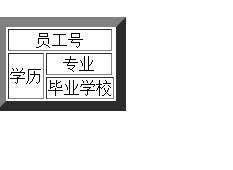
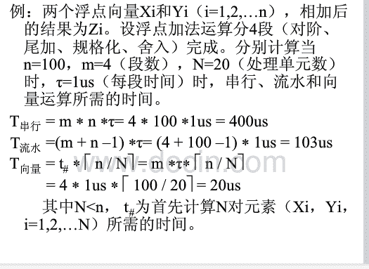
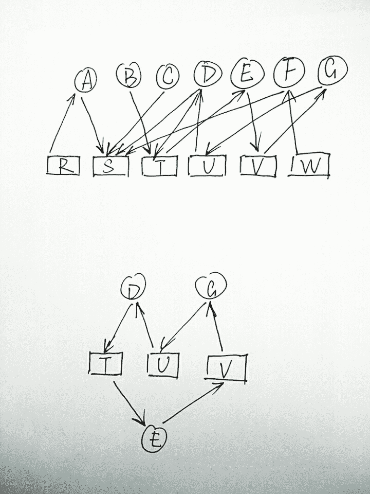
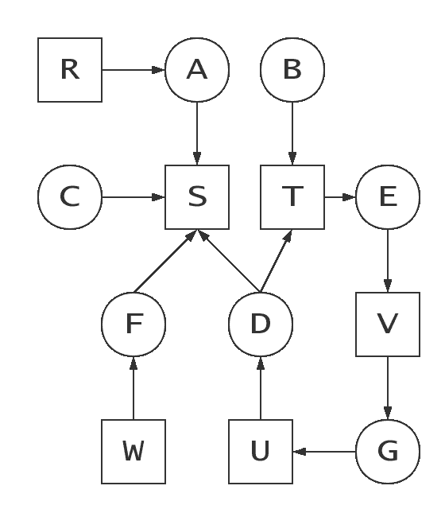

# 京东 2016 实习生招聘笔试研发类模拟练习

## 1

以下分析以下代码说法正确的是:（ ）

```cpp
<html>
<head>
　<script type="text/javascript">
　　function writeIt (value) { document.myfm.first_text.value=value;}
　</script>
</head>
<body bgcolor="#ffffff">
　<form name="myfm">
　　<input type="text" name="first_text">
　　<input type="text" name="second_text" onchange="writeIt(value)">
　</form>
</body>
</html>
```

正确答案: C D   你的答案: 空 (错误)

```cpp
在页面的第二个文本框中输入内容后，当光标离开第二个文本框时，第一个文本框的内容不变
```

```cpp
在页面的第一个文本框中输入内容后，当光标离开第一个文本框时，将在第二个文本框中复制第一个文本框的内容
```

```cpp
在页面的第二个文本框中输入内容后，当光标离开第二个文本框时，将在第一个文本框中复制第二个文本框的内容
```

```cpp
在页面的第一个文本框中输入内容后，当光标离开第一个文本框时，第二个文本框的内容不变
```

本题知识点

HTML

讨论

[Kingu_](https://www.nowcoder.com/profile/3767149)

onchange 是失去焦点  查看全部)

编辑于 2016-11-04 16:01:06

* * *

[Circle&Z](https://www.nowcoder.com/profile/476805)

onchange 事件

[Event 对象](http://www.w3school.com.cn/jsref/dom_obj_event.asp)

**定义和用法**

onchange 事件会在域的内容改变时发生。

**语法**

onchange="SomeJavaScriptCode"

| **参数** | **描述** |
| SomeJavaScriptCode | 必需。规定该事件发生时执行的 JavaScript。 |

**支持该事件的** **HTML** **标签：**

<input type="text">, <select>, <textarea>

**支持该事件的** **JavaScript** **对象：**

fileUpload, select, text, textarea 我的 Github ^_^ (欢迎 follow): [`github.com/CircleZ3791117`](https://github.com/CircleZ3791117) 

编辑于 2018-02-09 15:45:47

* * *

[流年伴夏](https://www.nowcoder.com/profile/2611897)

选项几乎都在说光标离开的事情，但是 onblur 才是光标离开事件，onchange 是只要输入框值改变就会触发，这个题出的有问题

发表于 2017-01-22 22:51:57

* * *

## 2

对下述代码错误描述正确的是( )

```cpp
NSTimer *myTimer = [NSTimer timerWithTimeInterval:1.0 target:self selector:@selector(doSomeThing:) userInfo:nil repeats:YES]; 
[myTimer fire]
```

正确答案: A   你的答案: 空 (错误)

```cpp
没有将 timer 加入 runloop
```

```cpp
doSomeThing 缺少参数
```

```cpp
忘记传递数据给 userInfo
```

```cpp
myTimer 对象未通过[[myTimer alloc] init]方法初始化
```

本题知识点

iOS

讨论

[Circle&Z](https://www.nowcoder.com/profile/476805)

本题用的是下面第二种初始化方法，需要将 timer 加入 runloop 中 NSTimer 的初始化方法 < 一 >

scheduledTimerWithTimeInterval:target:selector:userInfo:repeats: 方法

+ (NSTimer *)scheduledTimerWithTimeInterval:(NSTimeInterval)seconds target:(id)target selector:(SEL)aSelector userInfo:(id)userInfo repeats:(BOOL)repeats

seconds ：需要调用的毫秒数

target ：调用方法需要发送的对象。即：发给谁

userInfo ：发送的参数

repeats ：指定定时器是否重复调用目标方法

现在做个比喻：

可以把调度一个计时器与启动汽车的引擎相比较。别调度的计时器就是运行中的引 擎。没有被调度的计时器就是一个已经准备好启动但是还没有运行的引擎。我们在程序里 面 , 无论何时 , 都可以调度和取消调度计时器 , 就像根据我们所处的环境 , 决定汽车的引擎 室启动还是停止。如果你想要在程序中 , 手动的在某一个确定时间点调度计时器 , 可以使用 NSTimer 的类方法 timerWithTimeInterval:target:selector:userInfo:repeats: 方法。

NSTimer 的初始化方法 < 二 >

如果，我们想在任何时候都能够随心所欲的 启动 / 停止定时器。

咋办？不用急，还有 NSTimer 的另一种初始化方法，能够满足我们的要求：

// 使用 timerWithTimeInterval 方法来实例化一个 NSTimer, 这时候 NSTimer 是不会启动的

self.paintingTimer = [NSTimer timerWithTimeInterval:1.0

target:self

selector:@selector(paint:)

userInfo:nil

repeats:YES];

// 当需要调用时 , 可以把计时器添加到事件处理循环中

[[NSRunLoop currentRunLoop] addTimer:self.paintingTimer forMode:NSDefaultRunLoopMode]; 我的 Github ^_^ (欢迎 follow): [`github.com/CircleZ3791117`](https://github.com/CircleZ3791117) 

编辑于 2018-02-09 15:45:25

* * *

[#pragma mark](https://www.nowcoder.com/profile/734920)

A。scheduled 开头的方法初始化的，会将这个 timer 调度到当前运行的 loop 中; timer 和 init 开头的初始化方法，只是创建，并没有调度到 loop 中，需要手动 addTimer

发表于 2017-03-06 10:52:02

* * *

[牛客 621081 号](https://www.nowcoder.com/profile/621081)

为什么 C#里有一道 oc

发表于 2016-06-03 19:32:34

* * *

## 3

在 Linux 中,file.sh 文件的权限为-rw-r--r-x, 其对应权限用数值形式表示为( )

正确答案: A   你的答案: 空 (错误)

```cpp
645
```

```cpp
643
```

```cpp
775
```

```cpp
745
```

本题知识点

Linux

讨论

[Circle&Z](https://www.nowcoder.com/profile/476805)

为了更加安全的存储文件，Linux 为不同的文件赋予了不同的权限，每个文件都拥有下面三种权限：

· 所有者权限：文件所有者能够进行的操作

· 组权限：文件所属用户组能够进行的操作

· 外部权限（其他权限）：其他用户可以进行的操作。

查看文件权限

**ls -l** 命令可以查看与文件权限相关的信息：

```cpp
$ls -l /home/amrood
```

```cpp
-rwxr-xr--  1 amrood   users 1024  Nov 2 00:10  myfile
```

```cpp
drwxr-xr--- 1 amrood   users 1024  Nov 2 00:10  mydir
```

第一列就包含了文件或目录的权限。  第一列的字符可以分为三组，每一组有三个，每个字符都代表不同的权限，分别为读取(r)、写入(w)和执行(x)：

· 第一组字符(2-4)表示文件所有者的权限，-rwxr-xr-- 表示所有者拥有读取(r)、写入(w)和执行(x)的权限。

· 第二组字符(5-7)表示文件所属用户组的权限，-rwxr-xr-- 表示该组拥有读取(r)和执行(x)的权限，但没有写入权限。

· 第三组字符(8-10)表示所有其他用户的权限，rwxr-xr-- 表示其他用户只能读取(r)文件。

文件访问模式

文件权限是 Linux 系统的第一道安全防线，基本的权限有读取(r)、写入(w)和执行(x)：

· 读取：用户能够读取文件信息，查看文件内容。

· 写入：用户可以编辑文件，可以向文件写入内容，也可以删除文件内容。

· 执行：用户可以将文件作为程序来运行。

目录访问模式

目录的访问模式和文件类似，但是稍有不同：

· 读取：用户可以查看目录中的文件

· 写入：用户可以在当前目录中删除文件或创建文件

· 执行：执行权限赋予用户遍历目录的权利，例如执行 cd 和 ls 命令。

改变权限

**chmod** (change mode) 命令来改变文件或目录的访问权限，权限可以使用符号或数字来表示。

使用符号表示权限

可以增加(+)和删除(-)权限，也可以指定特定权限。

| **符号** | **说明** |
| + | 为文件或目录增加权限 |
| - | 删除文件或目录的权限 |
| = | 设置指定的权限 |

  下面的例子将会修改 testfile 文件的权限：

```cpp
$ls -l testfile
```

```cpp
-rwxrwxr--  1 amrood   users 1024  Nov 2 00:10  testfile
```

```cpp
$chmod o+wx testfile
```

```cpp
$ls -l testfile
```

```cpp
-rwxrwxrwx  1 amrood   users 1024  Nov 2 00:10  testfile
```

```cpp
$chmod u-x testfile
```

```cpp
$ls -l testfile
```

```cpp
-rw-rwxrwx  1 amrood   users 1024  Nov 2 00:10  testfile
```

```cpp
$chmod g=rx testfile
```

```cpp
$ls -l testfile
```

```cpp
-rw-r-xrwx  1 amrood   users 1024  Nov 2 00:10  testfile
```

也可以同时使用多个符号：

```cpp
$chmod o+wx,u-x,g=rx testfile
```

```cpp
$ls -l testfile
```

```cpp
-rw-r-xrwx  1 amrood   users 1024  Nov 2 00:10  testfile
```

使用数字表示权限

除了符号，也可以使用八进制数字来指定具体权限，如下表所示：

| **数字** | **说明** | **权限** |
| 0 | 没有任何权限 | --- |
| 1 | 执行权限 | --x |
| 2 | 写入权限 | -w- |
| 3 | 执行权限和写入权限：1 (执行) + 2 (写入) = 3 | -wx |
| 4 | 读取权限 | r-- |
| 5 | 读取和执行权限：4 (读取) + 1 (执行) = 5 | r-x |
| 6 | 读取和写入权限：4 (读取) + 2 (写入) = 6 | rw- |
| 7 | 所有权限: 4 (读取) + 2 (写入) + 1 (执行) = 7 | rwx |

  下面的例子，首先使用  **ls -1** 命令查看 testfile 文件的权限，然后使用  **chmod** 命令更改权限：

```cpp
$ls -l testfile
```

```cpp
-rwxrwxr--  1 amrood   users 1024  Nov 2 00:10  testfile
```

```cpp
$ chmod 755 testfile
```

```cpp
$ls -l testfile
```

```cpp
-rwxr-xr-x  1 amrood   users 1024  Nov 2 00:10  testfile
```

```cpp
$chmod 743 testfile
```

```cpp
$ls -l testfile
```

```cpp
-rwxr---wx  1 amrood   users 1024  Nov 2 00:10  testfile
```

```cpp
$chmod 043 testfile
```

```cpp
$ls -l testfile
```

```cpp
----r---wx  1 amrood   users 1024  Nov 2 00:10  testfile
```

更改所有者和用户组

在 Linux 中，每添加一个新用户，就会为它分配一个用户 ID 和群组 ID，上面提到的文件权限也是基于用户和群组来分配的。  有两个命令可以改变文件的所有者或群组：

· **chown** ：chown 命令是"change owner"的缩写，用来改变文件的所有者。

· **chgrp** ：chgrp 命令是"change group"的缩写，用来改变文件所在的群组。

 **chown** 命令用来更改文件所有者，其语法如下：

```cpp
$ chown user filelist
```

user 可以是用户名或用户 ID，例如

```cpp
$ chown amrood testfile
```

```cpp
$
```

将 testfile 文件的所有者改为 amrood。  注意：超级用户 root 可以不受限制的更改文件的所有者和用户组，但是普通用户只能更改所有者是自己的文件或目录。 **chgrp** 命令用来改变文件所属群组，其语法为：

```cpp
$ chgrp group filelist
```

group 可以是群组名或群组 ID，例如

```cpp
$ chgrp special testfile
```

```cpp
$
```

将文件 testfile 的群组改为 special。 我的 Github ^_^ (欢迎 follow): [`github.com/CircleZ3791117`](https://github.com/CircleZ3791117) 

编辑于 2018-02-09 15:44:55

* * *

[程序员阿菜](https://www.nowcoder.com/profile/678661)

共十位  第一位是文件类型 后面的每三位算一个数字 将字母翻译下就可以了   r 4  w 2  x1

编辑于 2016-04-07 10:30:00

* * *

[后劲好大](https://www.nowcoder.com/profile/4013442)

r：4
w：2
x：1

发表于 2017-06-12 13:28:32

* * *

## 4

通过分析如下 HTML 代码，可以得出( )

```cpp
<table border="10"> 
<tr> 
　　<td colspan=2 align="center">员工号</td>
</tr> 
<tr> 
<td rowspan=2 align="center">学历</td>
<td align="center">专业</td>
</tr>
<tr>
<td colspan=2 align="center">毕业学校</td>
</tr> 
</table>
```

正确答案: B D   你的答案: 空 (错误)

```cpp
该表格共有 2 行 3 列
```

```cpp
该表格中的文字均居中显示
```

```cpp
该表格的边框宽度为 10 毫米
```

```cpp
"员工号"单元个跨 2 列
```

本题知识点

HTML

讨论

[Wendy-lxq](https://www.nowcoder.com/profile/802395)

首先看有几行，几行只要通过 tr 就可以判断，题目里有 3 个 tr，所以是 3 行。其次看有几列，列数是看有最多 td 的那一行，所以是 2 列。题目中写 border="10"，单位是 px，所以边框应该为 10px，不是 10 毫米。td 的 colspan 属性代表所占列数， rowspan 属性代表所占行数，所以员工号占用 2 列，学历占用 2 行。因为每个 td 中都写了 align= 'center'，所以没列都会居中显示。

发表于 2017-04-02 10:15:10

* * *

[Circle&Z](https://www.nowcoder.com/profile/476805)

td 的 colspan 属性代表所占列数， rowspan 属性代表所占行数 我的 Github ^_^ (欢迎 follow): [`github.com/CircleZ3791117`](https://github.com/CircleZ3791117)

编辑于 2018-02-09 15:44:20

* * *

[lurao](https://www.nowcoder.com/profile/798967)

3 行 2 列，10 代表 10px，像素点。

发表于 2016-04-07 12:37:46

* * *

## 5

数据库中存在学生表 S、课程表 C 和学生选课表 SC 三个表，它们的结构如下：S(S#，SN，SEX，AGE，DEPT)C(C#，CN)SC(S#，C#，GRADE)其中：S#为学号，SN 为姓名，SEX 为性别，AGE 为年龄，DEPT 为系别，C#为课程号，CN 为课程名，GRADE 为成绩。请检索选修课程号为 C2 的学生中成绩最高的学号。( )

正确答案: D   你的答案: 空 (错误)

```cpp
SELECT S#，SUM(GRADE)FROM SC WHERE GRADE＞=60 GROUP BY S# ORDER BY 2 DESC HAVING COUNT(*)＞＝4 WHERE C#=“C2” AND GRADE ＞=(SELECT GRADE FORM SC WHERE C#=“C2”)
```

```cpp
SELECT S# FORM SC WHERE C#=“C2” AND GRADE IN (SELECT GRADE FORM SC WHERE C#=“C2”)
```

```cpp
SELECT S# FORM SC WHERE C#=“C2” AND GRADE NOT IN (SELECT GRADE FORM SC WHERE C#=“C2”)
```

```cpp
SELECT S# FORM SC WHERE C#=“C2” AND GRADE＞＝ALL (SELECT GRADE FORM SC WHERE C#=“C2”)
```

本题知识点

数据库 Java 工程师 C++工程师 PHP 工程师 golang 工程师 前端工程师 安卓工程师 iOS 工程师 算法工程师 大数据开发工程师 运维工程师 安全工程师 数据库工程师 游戏研发工程师 测试开发工程师 测试工程师 2021 远景能源有限公司

讨论

[Circle&Z](https://www.nowcoder.com/profile/476805)

SQL 常用语句积累：

一、 SQL 基本语句

SQL 分类：

DDL —数据定义语言 (Create ， Alter ， Drop ， DECLARE)

DML —数据操纵语言 (Select ， Delete ， Update ， Insert)

DCL —数据控制语言 (GRANT ， REVOKE ， COMMIT ， ROLLBACK)

首先 , 简要介绍基础语句：

1 、说明：创建数据库

Create DATABASE database-name

2 、说明：删除数据库

drop database dbname

3 、说明：备份 sql server

--- 创建 备份数据的 device

USE master

EXEC sp_addumpdevice 'disk', 'testBack', 'c:\mssql7backup\MyNwind_1.dat'

--- 开始 备份

BACKUP DATABASE pubs TO testBack

4 、说明：创建新表

create table tabname(col1 type1 [not null] [primary key],col2 type2 [not null],..)

根据已有的表创建新表：

A ： create table tab_new like tab_old ( 使用旧表创建新表 )

B ： create table tab_new as select col1,col2 … from tab_old definition only

5 、说明：删除新表 drop table tabname

6 、说明：增加一个列

Alter table tabname add column col type

注：列增加后将不能删除。 DB2 中列加上后数据类型也不能改变，唯一能改变的是增加 varchar 类型的长度。

7 、说明：添加主键： Alter table tabname add primary key(col)

说明：删除主键： Alter table tabname drop primary key(col)

8 、说明：创建索引： create [unique] index idxname on tabname(col … .)

删除索引： drop index idxname

注：索引是不可更改的，想更改必须删除重新建。

9 、说明：创建视图： create view viewname as select statement

删除视图： drop view viewname

10 、说明：几个简单的基本的 sql 语句

选择： select * from table1 where 范围

插入： insert into table1(field1,field2) values(value1,value2)

删除： delete from table1 where 范围

更新： update table1 set field1=value1 where 范围

查找： select * from table1 where field1 like ’ %value1% ’ ---like 的语法很精妙，查资料 !

排序： select * from table1 order by field1,field2 [desc]

总数： select count * as totalcount from table1

求和： select sum(field1) as sumvalue from table1

平均： select avg(field1) as avgvalue from table1

最大： select max(field1) as maxvalue from table1

最小： select min(field1) as minvalue from table1

11 、说明：几个高级查询运算词

A ： UNION 运算符

UNION 运算符通过组合其他两个结果表（例如 TABLE1 和 TABLE2 ）并消去表中任何重复行而派生出一个结果表。当 ALL 随 UNION 一起使用时（即 UNION ALL ），不消除重复行。两种情况下，派生表的每一行不是来自 TABLE1 就是来自 TABLE2 。

B ： EXCEPT 运算符

EXCEPT 运算符通过包括所有在 TABLE1 中但不在 TABLE2 中的行并消除所有重复行而派生出一个结果表。当 ALL 随 EXCEPT 一起使用时 (EXCEPT ALL) ，不消除重复行。

C ： INTERSECT 运算符

INTERSECT 运算符通过只包括 TABLE1 和 TABLE2 中都有的行并消除所有重复行而派生出一个结果表。当 ALL 随 INTERSECT 一起使用时 (INTERSECT ALL) ，不消除重复行。

注：使用运算词的几个查询结果行必须是一致的。

12 、说明：使用外连接

A 、 left outer join ：

左外连接（左连接）：结果集几包括连接表的匹配行，也包括左连接表的所有行。

SQL: select a.a, a.b, a.c, b.c, b.d, b.f from a LEFT OUT JOIN b ON a.a = b.c

B ： right outer join:

右外连接 ( 右连接 ) ：结果集既包括连接表的匹配连接行，也包括右连接表的所有行。

C ： full outer join ：

全外连接：不仅包括符号连接表的匹配行，还包括两个连接表中的所有记录。

二、 SQL 子查询语句

1 、单行子查询

select ename,deptno,sal

from emp

where deptno=(select deptno from dept where loc='NEW YORK') ；

2 、多行子查询

SELECT ename,job,sal

FROM EMP

WHERE deptno in ( SELECT deptno FROM dept WHERE dname LIKE 'A%') ；

3 、多列子查询

SELECT deptno,ename,job,sal

FROM EMP

WHERE (deptno,sal) IN (SELECT deptno,MAX(sal) FROM EMP GROUP BY deptno) ；

4 、内联视图子查询

(1)SELECT ename,job,sal,rownum

FROM (SELECT ename,job,sal FROM EMP ORDER BY sal) ；

(2)SELECT ename,job,sal,rownum

FROM ( SELECT ename,job,sal FROM EMP ORDER BY sal)

WHERE rownum<=5 ；

5 、在 HAVING 子句中使用子查询

SELECT deptno,job,AVG(sal) FROM EMP GROUP BY deptno,job HAVING AVG(sal)>(SELECT sal FROM EMP WHERE ename='MARTIN') ；

6 、内连接 左连接 右连接举例；

select sys_user.user_id ,sys_user.user_code  from  sys_user inner join XZFW_BANJIE onsys_user.user_id=XZFW_BANJIE.userid

小例子：

select top 10 * from sys_user  where user_code not in (select  user_code  from sys_user where user_code like '%yzj%')

select top 2 * from (select top 2 *  from td.users order by us_username desc) users order by us_username desc

7 、删除约束语句：

alter   table   dbo.XZFW_SYS_USER   drop   CONSTRAINT  FK1772E1891324F678

8 、记录数查询

select count(user_pass) from sys_user

select count(*) from sys_user where user_code!='admin'

9 、在范围之间取值 ( between ... and .. 用法 )

select sys_user.user_id,sys_user.user_name,xzfw_shoujian.caseid from sys_user inner join xzfw_shoujian on sys_user.user_id=xzfw_shoujian.userid where user_id between 5 and 100

或 select * from sys_user  where user_id<10 and user_id>1

10 、 三表查询实例：（三张表为： USER_DETAILS ， Subject ， Score ）

select USER_DETAILS.USER_NAME,Subject.SubjectName,Score.Score from USER_DETAILS inner join Scoreon USER_DETAILS.USER_ID=Score.USER_ID inner join Subject on Score.SubjectID=Subject.SubjectIDwhere USER_DETAILS.USER_ID=1

常用查询举例：

select * from dbo.USER_DETAILS where USER_NAME='Cheers Li' and USER_POSITION='SQE'

select * from dbo.USER_DEPT

select * from dbo.USER_DETAILS

select top 3* from dbo.USER_DETAILS inner join dbo.USER_DEPT onUSER_DETAILS.USER_DEPT_ID=dbo.USER_DEPT.USER_DEPT_ID

insert into dbo.USER_DEPT (USER_DEPT_ID,USER_DEPT_NAME)values('QE_01','Software quality engineer')

update USER_DEPT set USER_DEPT_ID='QE_02' where USER_DEPT_NAME='Quality Control'

delete from dbo.USER_DEPT where USER_DEPT_ID='QE_01'

select dbo.USER_DETAILS.USER_NAME,dbo.USER_DETAILS.USER_AGE,dbo.USER_DEPT.USER_DEPT_NAME,USER_DEPT.USER_DEPT_ID fromdbo.USER_DETAILS right join dbo.USER_DEPT onUSER_DETAILS.USER_DEPT_ID=dbo.USER_DEPT.USER_DEPT_ID

select count(USER_NAME)from dbo.USER_DETAILS where USER_NAME='Cheers Li'

alter table USER_DEPT add Testcolumn char

alter table USER_DEPT drop column Testcolumn

select top 3* from(select top 3* from dbo.USER_DETAILS where USER_DEPT_ID='DEV_01' order byUSER_AGE desc)aa order by USER_ID desc

select * from dbo.USER_DETAILS where USER_NAME=(select max(USER_NAME) fromdbo.USER_DETAILS)

三、补充常用语句。

1\. select employees.employee_id,employees.first_name,employees.last_name,salary*(1+0.1) new_salary from hr.employees;

2\. select employee_id,first_name from hr.employees where first_name like 'B%';

3\. select count(*) from hr.employees where first_name like 'B%';

4\. select job_id,avg(salary),sum(salary),max(salary),count(*) from hr.employees group by job_id;

其次，大家来看一些不错的 sql 语句

1 、说明：复制表 ( 只复制结构 , 源表名： a 新表名： b) (Access 可用 )

法一： select * into b from a where 1<>1

法二： select top 0 * into b from a

2 、说明：拷贝表 ( 拷贝数据 , 源表名： a 目标表名： b) (Access 可用 )

insert into b(a, b, c) select d,e,f from b;

3 、说明：跨数据库之间表的拷贝 ( 具体数据使用绝对路径 ) (Access 可用 )

insert into b(a, b, c) select d,e,f from b in ‘具体数据库’ where 条件

例子： ..from b in '"&Server.MapPath(".")&"\data.mdb" &"' where..

4 、说明：子查询 ( 表名 1 ： a 表名 2 ： b)

select a,b,c from a where a IN (select d from b ) 或者 : select a,b,c from a where a IN (1,2,3)

5 、说明：显示文章、提交人和最后回复时间

select a.title,a.username,b.adddate from table a,(select max(adddate) adddate from table where table.title=a.title) b

6 、说明：外连接查询 ( 表名 1 ： a 表名 2 ： b)

select a.a, a.b, a.c, b.c, b.d, b.f from a LEFT OUT JOIN b ON a.a = b.c

7 、说明：在线视图查询 ( 表名 1 ： a )

select * from (Select a,b,c FROM a) T where t.a > 1;

8 、说明： between 的用法 ,between 限制查询数据范围时包括了边界值 ,not between 不包括

select * from table1 where time between time1 and time2

select a,b,c, from table1 where a not between 数值 1 and 数值 2

9 、说明： in 的使用方法

select * from table1 where a [not] in ( ‘值 1 ’ , ’值 2 ’ , ’值 4 ’ , ’值 6 ’ )

10 、说明：两张关联表，删除主表中已经在副表中没有的信息

delete from table1 where not exists ( select * from table2 where table1.field1=table2.field1 )

11 、说明：四表联查问题：

select * from a left inner join b on a.a=b.b right inner join c on a.a=c.c inner join d on a.a=d.d where .....

12 、说明：日程安排提前五分钟提醒

SQL: select * from 日程安排 where datediff('minute',f 开始时间 ,getdate())>5

13 、说明：一条 sql 语句搞定数据库分页

select top 10 b.* from (select top 20 主键字段 , 排序字段 from 表名 order by 排序字段 desc) a, 表名 b where b. 主键字段 = a. 主键字段 order by a. 排序字段

14 、说明：前 10 条记录

select top 10 * form table1 where 范围

15 、说明：选择在每一组 b 值相同的数据中对应的 a 最大的记录的所有信息 ( 类似这样的用法可以用于论坛每月排行榜 , 每月热销产品分析 , 按科目成绩排名 , 等等 .)

select a,b,c from tablename ta where a=(select max(a) from tablename tb where tb.b=ta.b)

16 、说明：包括所有在 TableA 中但不在 TableB 和 TableC 中的行并消除所有重复行而派生出一个结果表

(select a from tableA ) except (select a from tableB) except (select a from tableC)

17 、说明：随机取出 10 条数据

select top 10 * from tablename order by newid()

18 、说明：随机选择记录

select newid()

19 、说明：删除重复记录

Delete from tablename where id not in (select max(id) from tablename group by col1,col2,...)

20 、说明：列出数据库里所有的表名

select name from sysobjects where type='U'

21 、说明：列出表里的所有的

select name from syscolumns where id=object_id('TableName')

22 、说明：列示 type 、 vender 、 pcs 字段，以 type 字段排列， case 可以方便地实现多重选择，类似 select 中的 case 。

select type,sum(case vender when 'A' then pcs else 0 end),sum(case vender when 'C' then pcs else 0 end),sum(case vender when 'B' then pcs else 0 end) FROM tablename group by type

显示结果：

type vender pcs

电脑 A 1

电脑 A 1

光盘 B 2

光盘 A 2

手机 B 3

手机 C 3

23 、说明：初始化表 table1

TRUNCATE TABLE table1

24 、说明：选择从 10 到 15 的记录

select top 5 * from (select top 15 * from table order by id asc) table_ 别名 order by id desc

数据库基本理论整理：

通俗地理解三个范式

通俗地理解三个范式，对于数据库设计大有好处。在数据库设计中，为了更好地应用三个范式，就必须通俗地理解三个范式 ( 通俗地理解是够用的理解，并不是最科学最准确的理解 ) ：

第一范式： 1NF 是对属性的原子性约束，要求属性具有原子性，不可再分解；

第二范式： 2NF 是对记录的惟一性约束，要求记录有惟一标识，即实体的惟一性；

第三范式： 3NF 是对字段冗余性的约束，即任何字段不能由其他字段派生出来，它要求字段没有冗余。

没有冗余的数据库设计可以做到。但是，没有冗余的数据库未必是最好的数据库，有时为了提高运行效率，就必须降低范式标准，适当保留冗余数据。具体做法是：在概念数据模型设计时遵守第三范式，降低范式标准的工作放到物理数据模型设计时考虑。降低范式就是增加字段，允许冗余。

基本表及其字段之间的关系 , 应尽量满足第三范式。但是，满足第三范式的数据库设计，往往不是最好的设计。为了提高数据库的运行效率，常常需要降低范式标准：适当增加冗余，达到以空间换时间的目的。

〖例 2 〗：有一张存放商品的基本表，如表 1 所示。“金额”这个字段的存在，表明该表的设计不满足第三范式，因为“金额”可以由“单价”乘以“数量”得到，说明“金额”是冗余字段。但是，增加“金额”这个冗余字段，可以提高查询统计的速度，这就是以空间换时间的作法。

在 Rose 中，规定列有两种类型：数据列和计算列。“金额”这样的列被称为“计算列”，而“单价”和“数量”这样的列被称为“数据列”。

表 1 商品表的表结构

商品名称 商品型号 单价 数量 金额

电视机 29 吋 2500 40 100,000 我的 Github ^_^ (欢迎 follow): [`github.com/CircleZ3791117`](https://github.com/CircleZ3791117) 

编辑于 2018-02-09 15:43:55

* * *

[AimSteel](https://www.nowcoder.com/profile/204221)

SC 表：课程号 C#，S#学号，GRADE 成绩，找出课程号为 C2 中成绩 最高的学号 All：对所有数据都满足条件，整个条件才成立。All 方法中查询了 C2 课程号的所有成绩，对于 SC 表中 GRADE 全满足的条件就是最高成绩相等，所以查询出来的结果就是 C2 课程号中成绩最高的那一条数据。选择 DSELECT S# FORM SC WHERE C#=“C2” AND GRADE＞＝ALL (SELECT GRADE FORM SC WHERE C#=“C2”

发表于 2016-04-22 17:20:05

* * *

[omg1992](https://www.nowcoder.com/profile/110376)

这个题目没有错么？

发表于 2016-04-08 08:55:29

* * *

## 6

Java 类 Demo 中存在方法 func1、func2、func3 和 func4，请问该方法中，哪些是不合法的定义？( )

```cpp
public class Demo{

　　float func1()
　　{
　　　　int i=1;
　　　　return;
　　}
　　float func2()
　　{
　　　　short i=2;
　　　　return i;
　　}
　　float func3()
　　{
　　　　long i=3;
　　　　return i;
　　}
　　float func4()
　　{
　　　　double i=4;
　　　　return i;
　　}
}
```

正确答案: A D   你的答案: 空 (错误)

```cpp
func1
```

```cpp
func2
```

```cpp
func3
```

```cpp
func4
```

本题知识点

Java

讨论

[小牛快跑 233](https://www.nowcoder.com/profile/414929)

这道题考的是数据类型转换问题。由大到小需要强制转换，由小到大不需要。A：return;   没有返回值，**错误**B：short → float 无须强制转换，**正确**C：long → float  无须强制转换（**这个最选项容易出错**），**正确。**float 占 4 个字节为什么比 long 占 8 个字节大呢，因为底层的实现方式不同。**浮点数的 32 位并不是简单直接表示大小，而是按照一定标准分配的**。第 1 位，符号位，即 S 接下来 8 位，指数域，即 E。剩下 23 位，小数域，即 M，取值范围为[1 ,2 ) 或[0 , 1)然后按照公式： **V=(-1)^s * M * 2^E****也就是说浮点数在内存中的 32 位不是简单地转换为十进制，而是通过公式来计算而来，通过这个公式虽然，只有 4 个字节，但浮点数最大值要比长整型的范围要大**。D：double → float 没有强制转换，**错误**。

编辑于 2016-08-04 00:39:37

* * *

[Circle&Z](https://www.nowcoder.com/profile/476805)

数据类型的转换，分为自动转换和强制转换。自动转换是程序在执行过程中 “ 悄然 ” 进行的转换，不需要用户提前声明，一般是从位数低的类型向位数高的类型转换；强制类型转换则必须在代码中声明，转换顺序不受限制。

**自动数据类型转换**

自动转换按从低到高的顺序转换。不同类型数据间的优先关系如下：  低 ---------------------------------------------> 高 byte,short,char-> int -> long -> float -> double 运算中，不同类型的数据先转化为同一类型，然后进行运算，转换规则如下：

| **操作数 1** **类型** | **操作数 2** **类型** | **转换后的类型** |
| byte 、 short 、 char | int | int |
| byte 、 short 、 char 、 int | long | long |
| byte 、 short 、 char 、 int 、 long | float | float |
| byte 、 short 、 char 、 int 、 long 、 float | double | double |

**强制数据类型转换**

强制转换的格式是在需要转型的数据前加上 “( )” ，然后在括号内加入需要转化的数据类型。有的数据经过转型运算后，精度会丢失，而有的会更加精确我的 Github ^_^ (欢迎 follow): [`github.com/CircleZ3791117`](https://github.com/CircleZ3791117)

编辑于 2018-02-09 15:42:47

* * *

[晓宇大美女~](https://www.nowcoder.com/profile/790486)

今天才知道原来 long 到 float 不用强转，因为 float 表示的范围确实比 long 表示的范围大，虽然它只占 4 个字节，而 long 占 8 个字节涨知识了

发表于 2016-06-18 19:15:09

* * *

## 7

执行下列代码的输出结果是( )

```cpp
public class Demo{
　public static void main(String args[]){
　　　int num = 10;
　　　System.out.println(test(num));
}
public static int test(int b){
　　　try
　　　{
　　　　b += 10;
　　　　return b;
　　　}
　　　catch(RuntimeException e)
　　　{
　　　}
　　　catch(Exception e2)
　　　{
　　　}
　　　finally
　　　{
　　　　b += 10;
　　　　return b;
　　　}
　　}
}
```

正确答案: C   你的答案: 空 (错误)

```cpp
10
```

```cpp
20
```

```cpp
30
```

```cpp
40
```

本题知识点

Java

讨论

[过往云烟 123](https://www.nowcoder.com/profile/983664)

如果 finally 块中有 return 语句的话，它将覆盖掉函数中其他 return 语句。

发表于 2016-06-08 22:37:53

* * *

[良哥](https://www.nowcoder.com/profile/491039)

关于 try catch 知识：程序运行到 **try 块，b=20;并没有发生异常，不运行 catch 块，运行到 return b;因为 finally 块无论如何都要运行，因此并不发生返回动作，进行运行 finally 块，b=30;****进行程序返回输出；**

编辑于 2016-04-10 23:51:49

* * *

[Circle&Z](https://www.nowcoder.com/profile/476805)

推荐博文 try-catch-finally 执行顺序详解：[`qing0991.blog.51cto.com/1640542/1387200`](http://qing0991.blog.51cto.com/1640542/1387200)

**try 块中抛出异常，try、catch 和 finally 中都有 return 语句**

public static int WithException(){

int i=10;

try{

System.out.println("i in try block is ： "+i);

i = i/0;

return --i;

}

catch(Exception e){

System.out.println("i in catch - form try block is ： "+i);

--i;

System.out.println("i in catch block is ： "+i);

return --i;

}

finally{

System.out.println("i in finally - from try or catch block is--"+i);

--i;

System.out.println("i in finally block is--"+i);

return --i;

}

}

执行结果：

============WithException==================

i in try block is ： 10

i in catch - form try block is ： 10

i in catch block is ： 9

i in finally - from try or catch block is--8

i in finally block is--7

6

===============================

执行顺序：

抛出异常后，执行 catch 块，在 catch 块的 return 的--i 执行完后，并不直接返回而是执行 finally，因 finally 中有 return 语句，所以，执行，返回结果 6。

结论：

try 块中抛出异常，try、catch 和 finally 中都有 return 语句，返回值是 finally 中的 return。

**总体结论：**

结论一：

return 语句并不是函数的最终出口，如果有 finally 语句，这在 return 之后还会执行 finally（return 的值会暂存在栈里面，等待 finally 执行后再返回）
结论二：

finally 里面不建议放 return 语句，根据需要，return 语句可以放在 try 和 catch 里面和函数的最后。可行的做法有四：
（1）return 语句只在函数最后出现一次。
（2）return 语句仅在 try 和 catch 里面都出现。
（3）return 语句仅在 try 和函数的最后都出现。
（4）return 语句仅在 catch 和函数的最后都出现。

注意，除此之外的其他做法都是不可行的，编译器会报错
我的 Github ^_^ (欢迎 follow): [`github.com/CircleZ3791117`](https://github.com/CircleZ3791117)

编辑于 2018-02-09 15:43:11

* * *

## 8

下列 C 程序执行后 c 输出结果为( )（32 位）

```cpp
#include<stdio.h>
#include<stdlib.h>
void main()
{
　　int a = -3;
　　unsigned int b = 2;
　　long c = a + b;
　　printf("%ld\n", c);
}
```

正确答案: A   你的答案: 空 (错误)

```cpp
-1
```

```cpp
4294967295
```

```cpp
0x7FFFFFFF
```

```cpp
0xFFFFFFFF
```

本题知识点

C 语言

讨论

[JUST&GO](https://www.nowcoder.com/profile/630916)

个人理解：（1）如果是负数，那么在计算机保存时应该转为补码，负数的补码为：除符号位以外，取反后，再加一（2）正数的话，保存时不变由于在 32 位系统中，int , unsigned int, long 的大小均为 4 字节 int a = -3, 原码：1000 0000 0000 0000 0000 0000 0000 0011 反码：1111 1111 1111 1111 1111 1111 1111 1100 补码：1111 1111 1111 1111 1111 1111 1111 1101unsigned intb = 2;原码：0000 0000 0000 0000 0000 0000 0000 0010 反码：0000 0000 0000 0000 0000 0000 0000 0010 补码：0000 0000 0000 0000 0000 0000 0000 0010 那么，a+b 应该是补码的运算，即：1111 1111 1111 1111 1111 1111 1111 1101+0000 0000 0000 0000 0000 0000 0000 0010=1111 1111 1111 1111 1111 1111 1111 1111 所以相加以后，保存的应该是：0xffffffff，但是，由于要显示出来，即最后的打印，那么我们应该求出 0xffffffff 是什么数字保存在内存中的，因此，应该对补码求反，很容易的得出，应该是除符号位以外减一取反即原码：1111 1111 1111 1111 1111 1111 1111 1111 减一：1111 1111 1111 1111 1111 1111 1111 1110 取反：1000 0000 0000 0000 0000 0000 0000 0001 那么显示的应该是-1

发表于 2016-04-23 21:30:44

* * *

[hahah007](https://www.nowcoder.com/profile/796048)

无符号和有符号整数进行运算时，有符号整数会被提升为无符号整数。-3 对应的二进制表示是 0xfffffffd，和 2 相加表示 0xffffffff。输出结果取决于 long 是 32 位，还是 64 位。这个取决于编译器和机器。long 是有符号的整型。如果是 32 位，0xfffffff 在补码表示法（最高位是负数位）下是等于-1\.如果是 64 位，0xfffffff 是属于 long 的正整数范围（负数位在第 64 位），等于 4294967295。（如果你的编译出来是 32 位的 long，你可以用 longlong 测试一下就能得到这个数。因为 long long 无论在 32 位机器或者 64 位机器都是占用 8 个字节 64 位）----------------------------------------------------------------------------------------------补充一下，这个题目感觉很坑，CD 我觉得是不能选的，很多面试题其实都不严谨，不必过于纠结，也建议不要盲目相信答案。

编辑于 2016-09-05 17:46:12

* * *

[LLJ](https://www.nowcoder.com/profile/332088)

gcc 编译之后，运行结果是-1.
问题问的是输出结果，ld 表示长整型，按十进制输出就是-1.

发表于 2016-04-08 10:41:42

* * *

## 9

两个浮点向量 Xi 和 Yi(i=1,2,…n),相加后的结果为 Zi。设浮点加法运算分 4 段(对阶、 尾加、规格化、舍入)完成。分别计算当 n=100,m=4(段数),N=20（处理单元数）时，t=1us（每段时间）时，串行、流水和向量运算所需的时间分别是( )

正确答案: A   你的答案: 空 (错误)

```cpp
400us,103us,20us
```

```cpp
400us,103us,80us
```

```cpp
400us,104us,80us
```

```cpp
400us,104us,40us
```

本题知识点

编译和体系结构

讨论

[随便（你想啥是啥）](https://www.nowcoder.com/profile/923033)



发表于 2016-04-07 16:02:14

* * *

[Cloud2049](https://www.nowcoder.com/profile/8508158)

详见 http://wenku.baidu.com/link?url=movsNQaSDGz62p_OtG5a_poi6pWojmZbhhacvGiOFLnXktecloHS1htWH0ESUGONlAo7y-7GKIwW4ZVSNJp7NC1_C8khBLMALf3NFFdr54i

发表于 2017-02-17 09:29:45

* * *

## 10

用边界值分析法，假定 1<x>正确答案: A   你的答案: 空 (错误)

```cpp
X=1，X=2，X=9，X=10
```

```cpp
X=2，X=9
```

```cpp
X=1，X=10
```

```cpp
X=1，X=5，X=6，X=10
```

本题知识点

软件测试

讨论

[听我 ViVi 道来](https://www.nowcoder.com/profile/426198)

边界值分析的基本思想是使用在  查看全部)

编辑于 2016-04-18 11:50:32

* * *

[钟晨宇](https://www.nowcoder.com/profile/4007206)

这里涉及到开闭区间和离点的概念，在边界值分析时，有下面几个点：上点：就是指得边界上得点，无论此时得域是开区间还是闭区间，开区间得话，上点就是在域外，闭区间得话，上点就是在域内。离点：指得就是离上点最近得点，这里就跟是闭区间还是开区间就有关系了，如果是开区间，那么离点就在域内，如果是闭区间，那么离点就在域外。内点：域内得任意点都是内点。题目中给的是开区间，不包括等于的情况。这里上点是 1 和 10，因为是开区间，所以离点是在区间内，即 2 和 9。所以边界值要覆盖 1 2 9 10。上点很好理解，但是开区间的离点为什么在区间内，0 和 11 需要覆盖吗？其实可以这么理解，对开区间，范围不包括边界，上点是在范围之外的，所以需要再测一个在范围之内，又离上点最近的点，这个值就是范围内离上点最近的点。另外，假如题目给的条件是 1≦x≦10，那答案就是 0 1 10 11，如果是 1＜x≦10，那答案就应该是 1 2 10 11。

编辑于 2017-03-14 20:33:47

* * *

[良哥](https://www.nowcoder.com/profile/491039)

1) 对 16-bit 的整数而言 32767 和 -32768 是边界

2) 屏幕上光标在最左上、最右下位置

3) 报表的第一行和最后一行

4) 数组元素的第一个和最后一个

5) 循环的第 0 次、第 1 次和倒数第 2 次、最后一次;根据边界选取规则，应该选取第一个和最后一个 即 2 和 9；

发表于 2016-04-07 14:18:00

* * *

## 11

考虑数字序列{1, 3, 4, 2, 6, 7, 5, 5, 8, 10, 9, 10, 7, 17}，任取其中几个数字相加，使得到的和为 29，则不同的组合有几种？（说明：比如其中的第 2，第 3，第 7，第 14 个数的组合和第 2，第 3，第 8，第 14 个数的组合看起来是一样的，都是 3，4，5，17，顺序都一样，那么这里只视其为一种）( )

正确答案: C   你的答案: 空 (错误)

```cpp
223
```

```cpp
342
```

```cpp
136
```

```cpp
198
```

本题知识点

组合数学 *讨论

[蛟龙吐火球丰](https://www.nowcoder.com/profile/3985756)

为啥在选择题里考编程题……

发表于 2018-06-27 13:00:21

* * *

[coyote](https://www.nowcoder.com/profile/835605)

```cpp
/*
 * 注意：题目中说明有问题，应该是第 2,3,7,14 个数的组合和 第 2,3,8,14 个数的组合
 *       看起来是一样的，都是{3,4,5,17}，那么只视为一种。
 * 但是：第 1,4,6,10,11 个数的组合{1,2,7,10,9}和第 1,4,11,12,13 个数的组合
 *       {1,2,9,10,7}并不是同一种，如果对输入的序列进行了排序，那么这两个组合会
 *       变成同一个组合{1,2,7,9,10}，所以不能对输入的序列先排序后处理。  */

/* 本算法不适用于包含负数的情况 */

/*
 * 另 1：如果得到答案是 96，说明对原始序列进行了排序 
 * 另 2：如果得到答案是 52，说明不但对原始序列进行了排序，还进行了去重操作。这
 *      是错误的，因为组合可能包含多个相同的数字，去重后把这部分组合丢掉了。
 * 另 3：如果得到答案是 223，说明没有排除组合完全一致的情况（例如第 2,3,7,14 个数的组合和 
 *      第 2,3,8,14 个数的组合）
 * 另 4：如果得到答案是 2，说明你求的是满足条件的子序列（下标连续，如{4,2,6,7,5,5}
 *      或{10,9,10}）的个数
 * 另 5：如果得到答案是 152，说明求的是满足条件：“构成组合的数字不能重复”的组合个数
 */
#include "stdafx.h"
#include<iostream>
#include<vector>
#include<set>
using namespace std;

void SubSet(vector<int>& arr, set<vector<int>>& set, vector<int>& tmp, int index, int sum)
{
    //越界返回
    if (index == arr.size()) return;
    //边界条件不满足返回
    if (sum < 0) return;
    //找到满足条件的子集
    if (arr[index] == sum)
    {
        //纪录子集的最后一个元素
        tmp.push_back(arr[index]);
        //将子集的副本保存
        set.insert(tmp);
        //删除最后一个加入的元素
        tmp.pop_back();

        //如果不选取 index 对应的数字时，求能得到的满足条件的子集
        SubSet(arr, set, tmp, index + 1, sum);
        return;
    }
    /******** arr[index] <> sum 的情况 *********/
    tmp.push_back(arr[index]);
    //选取当前元素的方案：
    SubSet(arr, set, tmp, index + 1, sum - arr[index]);
    tmp.pop_back();
    //不选取当前元素的方案：
    SubSet(arr, set, tmp, index + 1, sum);
}

int _tmain(int argc, _TCHAR* argv[])
{
    int Num/*序列大小*/, SUM/*子集和*/;
    cin >> Num >> SUM;
    //序列
    vector<int> Arr(Num, 0);
    for (unsigned i = 0; i < Num; i++)
    {
        cin >> Arr[i];
    }
    //临时存放子集
    vector<int> Tmp;
    //存放所有子集
    set<vector<int>> sets;
    //求解所有子集
    SubSet(Arr, sets, Tmp, 0, SUM);
    //子集个数---136
    cout << sets.size() << endl;
    //子集详情
    for (auto a : sets)
    {
        for (auto b : a)
            cout << b << " ";
        cout << endl;
    }
    return 0;
}

```

编辑于 2016-10-07 20:04:33

* * *

[Java9527](https://www.nowcoder.com/profile/120509)

```cpp
简单粗暴解法：就是从 11 个数里面选 3 个，有 11*10*9/6=156，再看答案就可以了
```

发表于 2016-04-13 18:02:29

* * *

## 12

假设信道长度为 1200km，其往返时间为 20ms，分组长度为 1200bit，发送速率为 1Mb/s。若忽略处理时间和发送确认分组时间，则该信道的利用率为( )

正确答案: B   你的答案: 空 (错误)

```cpp
0.016
```

```cpp
0.0566
```

```cpp
0.06
```

```cpp
0.14
```

本题知识点

网络基础

讨论

[Universe](https://www.nowcoder.com/profile/613967)

1200bit 的长度，发送速  查看全部)

编辑于 2016-06-13 13:02:03

* * *

[苟.....苟富贵勿相忘啊大兄弟](https://www.nowcoder.com/profile/6742836)

U = Td / (Td + RTT +Ta),
其中 U 是信道利用率，Td 发送时延，RTT 是一个往返时间，Ta 是接收时延

发表于 2017-08-09 19:58:51

* * *

[舒莉 2](https://www.nowcoder.com/profile/157247)

```cpp
1MB=1048576bit 
1MB=1024KB=1048576bit  大约为 1000000
1s=1000ms
1MB/S=10000bit/ms
12000bit/10000bit/ms=1.2ms
20ms+1.2ms=21.2ms
1.2ms/21.2ms=0.0566
```

发表于 2016-06-10 13:35:52

* * *

## 13

假设一个系统包括 A 到 G 七个进程，R 到 W 六中资源。资源间的所有权关系，如下：

> 1、进程 A 占有资源 R，请求资源 S2、进程 B 不占有任何资源，请求资源 T3、进程 C 不占任何资源，请求资源 S4、D 占有资源 U，请求资源 S 和 T5、E 有资源 T，请求资源 V6、F 有资源 W，请求资源 S7、G 有资源 V，需要资源 U

下列说法中正确的是( )

正确答案: A C   你的答案: 空 (错误)

```cpp
进程 D、E、G 被死锁
```

```cpp
进程 D、E、C 被死锁
```

```cpp
进程 A、C、F 没有被死锁
```

```cpp
进程 A、D、E 被死锁
```

本题知识点

操作系统

讨论

[阿叩得](https://www.nowcoder.com/profile/118943)



发表于 2016-04-12 12:00:46

* * *

[小矮子带着流浪狗去流浪](https://www.nowcoder.com/profile/9200918)

画出资源分布图，其中方框代表的是资源，圆圈代表的是进程。资源指向进程，代表进程占有此资源；进程指向资源，代表进程请求该资源。
因为箭头是有向的，所以如果形成一个环，说明这个环中的所有进程都被死锁。举例来说，从 A 出发，只能到 S；从 C 出发，只能到 S；从 F 出发，也只能到 S。由于三个进程不能形成一个环，所以没有被死锁。
从 D 出发，D->T->E->V->G->U->D，经过上述路径 D 从自身回到自身，形成一个环路，所以该环中的进程都被死锁，即 D、E、G。

编辑于 2017-02-13 10:07:25

* * *

[Ｍe 怤畢炜 eＭ](https://www.nowcoder.com/profile/215299)

画个图。成环路的就是死锁进程

发表于 2016-04-08 09:26:48

* * *

## 14

下列程序执行后，输出的结果为( )

```cpp
#include <stdio.h>
int cnt=0;
int fib(int n){
　　cnt++;
　　if(n==0) 
　　　　return 1; 
　　else if(n==1) 
　　　　return 2; 
　　else 
　　　　return fib(n-1)+fib(n-2);
}
void main()
{
　　fib(8);
　　printf("%d",cnt);
}
```

正确答案: B   你的答案: 空 (错误)

```cpp
41
```

```cpp
67
```

```cpp
109
```

```cpp
177
```

本题知识点

C 语言 递归

讨论

[追逐者](https://www.nowcoder.com/profile/293577)

------f(n)-----------cnt 的值------------f(0)-----------1------------------------f(1)-----------1------------------------f(2)-----------3------------------1+1+1------f(3)-----------5------------------1+3+1------f(4)-----------9------------------ 3+5+1------f(5)-----------15-----------------5+9+1*****************************************************=====>f(6)=9+15+1=25=====>f(7)=15+25+1=41=====>f(8)=25+41+1=67

发表于 2016-04-15 16:14:50

* * *

[peach](https://www.nowcoder.com/profile/996872)

F(1)的时候为 1F(2)的时候为 3...规律为 F(n) = F(n - 1) + F(n - 2) + 1 由此可知 F(8) = 41 + 25 + 1

发表于 2016-04-07 14:57:31

* * *

[zhaoying](https://www.nowcoder.com/profile/316866)

本题考察 Fibonacci sequence，可将 fib 函数的计算过程构造一棵平衡二叉树（AVL 数），F(n) /*AVL 数的总结点数*/= F(n - 1)/*左结点个数*/ + F(n - 2) /*右结点个数*/+ 1 /*根结点*/，AVL 树的总结点个数就是递归函数的调用次数。

发表于 2016-04-12 11:01:19

* * **</x>