# 美丽联合 2017 校园招聘笔试题

## 1

设顺序循环队列 Q[0: M-1]的头指针和尾指针分别为 F 和 R.头指针 F 总是指向队头元素的前一位置.尾指针 R 总是指向队尾元素的当前位置.则该循环队列中的元素个数为（）

正确答案: A   你的答案: 空 (错误)

```cpp
（R-F+M)%M
```

```cpp
R-F
```

```cpp
(F-R+M)%M
```

```cpp
F-R
```

本题知识点

队列 *讨论

[牛客-68](https://www.nowcoder.com/profile/7634665)

书中定义的队列长度为：(rear-front++QueueSize)%QueueSize1.rear: 定义中是指向末尾元素的下一个位置， 本题中是直接指向末尾元素， 所以将 rear 向后移动一个位置， R-12.front：定义中是指向首元素， 而本题中是指向首元素的前一个元素， 因此向后移动一个位置， F-1rear = R-1front = F-1 所以： [ (R - 1) - ( F - 1) + M]%M  =  (R-F+M)%M 正确答案：A

发表于 2017-06-25 18:28:22

* * *

[好学上进](https://www.nowcoder.com/profile/708096)

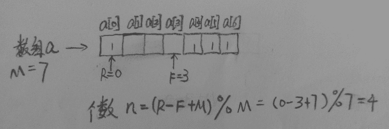

发表于 2016-04-18 13:35:03

* * *

[冰凌淩](https://www.nowcoder.com/profile/848186)

```cpp
A （R-F+M)%M
```

发表于 2016-04-10 11:17:34

* * *

## 2

算法的时间复杂度取决于（）

正确答案: A C   你的答案: 空 (错误)

```cpp
待处理数据的状态
```

```cpp
处理器的速度
```

```cpp
问题的规模
```

```cpp
程序所占空间
```

本题知识点

复杂度

讨论

[风过无痕 IJ](https://www.nowcoder.com/profile/781306)

比如说快排，初始数据的顺序影响快排的时间复杂度。

发表于 2016-04-09 13:47:57

* * *

[ai_](https://www.nowcoder.com/profile/458988)

对于 B,   时间复杂度 （注意不是所用时间）， 时间复杂度是一个函数，定量描述了算法的运行时间。  

发表于 2016-04-09 20:08:18

* * *

[田露](https://www.nowcoder.com/profile/401016)

AC 与处理器与程序所占物理空间大小无关

发表于 2016-04-08 19:39:46

* * *

## 3

```cpp
int f(int x){
    return ((x>2) ? x*f(x-1) : 3);
}
int i;
i=f(f(2));
```

执行如上函数后. i 的值为（）

正确答案: C   你的答案: 空 (错误)

```cpp
30
```

```cpp
无限递归
```

```cpp
9
```

```cpp
2160
```

本题知识点

递归

讨论

[竹隐寒烟](https://www.nowcoder.com/profile/975555)

答案应该为 9 首先 2 传进去后， 2 > 2 为假，故函数返回 3 ，这时 f(f(2)) 就相当于 f(3), 再将 3 传进去应该返回 3 * f(3 - 1) 即 3 * f(2), 又因为 f(2) 为 3，所以 f(3) = 9,因此答案就为 9.

```cpp

	intf(intx)

	{

	    return((x>2) ? x*f(x-1) : 3);

	}

	inti;

	i = f(f(2));

```

发表于 2016-04-08 23:03:14

* * *

[LauZyHou](https://www.nowcoder.com/profile/8203811)

第一行少了个左`{`第五行末尾应该是`;`

发表于 2019-02-13 16:58:08

* * *

[肉丝丝](https://www.nowcoder.com/profile/1279234)

...这题好容易看错

发表于 2017-09-14 10:08:12

* * *

## 4

有关操作系统常用调度算法叙述正确的是（）

正确答案: A D   你的答案: 空 (错误)

```cpp
FCFS 调度算法不利于短作业
```

```cpp
SPF 调度算法不利于短作业
```

```cpp
HRN 调度算法不利于长作业
```

```cpp
HRN 调度算法既利于短作业又有利于长作业
```

本题知识点

操作系统

讨论

[良哥](https://www.nowcoder.com/profile/491039)

常见的调度算法：1.**先来先服务调度算法（FCFS）**:就是按照各个作业进入系统的自然次序来调度作业。这种调度算法的优点是实现简单，公平。其缺点是没有考虑到系统中各种资源的综合使用情况，往往使短作业的用户不满意，因为短作业等待处理的时间可能比实际运行时间长得多。 因此选 A；

2.**短作业优先调度算法** **(SPF):** 就是优先调度并处理短作业，所谓短是指作业的运行时间短。而在作业未投入运行时，并不能知道它实际的运行时间的长短，因此需要用户在提交作业时同时提交作业运行时间的估计值。  

3.**最高响应比优先算法(HRN)：**FCFS 可能造成短作业用户不满，SPF 可能使得长作业用户不满，于是提出 HRN，选择响应比最高的作业运行。响应比=1+作业等待时间/作业处理时间。 因此选 C；

4. **基于优先数调度算法(HPF)：**每一个作业规定一个表示该作业优先级别的整数，当需要将新的作业由输入井调入内存处理时，优先选择优先数最高的作业。

发表于 2016-04-24 16:01:33

* * *

[好学上进](https://www.nowcoder.com/profile/708096)

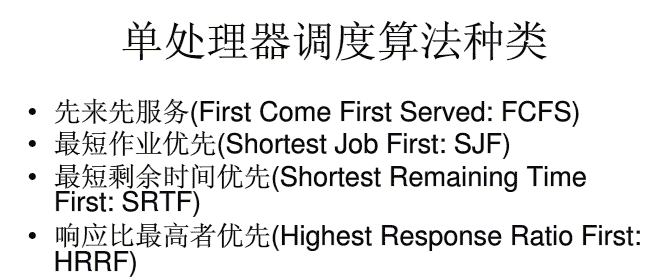
本题中 SPF 是 Shortest Process First（最短进程优先），与 SJF（最短作业优先）是一个意思；HRN 是 Highest Response Ratio Nest，与 HRRF 是一个意思，都表示最高响应比优先。
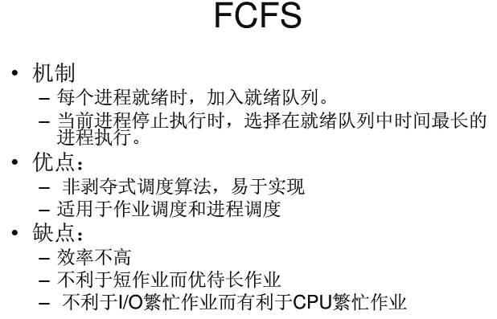
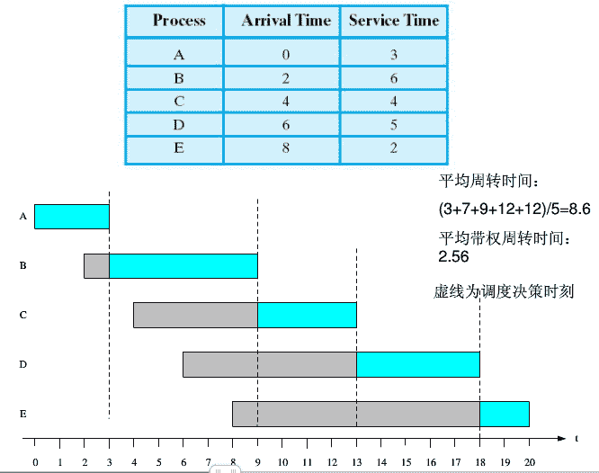
                                                                     FCFS 调度图
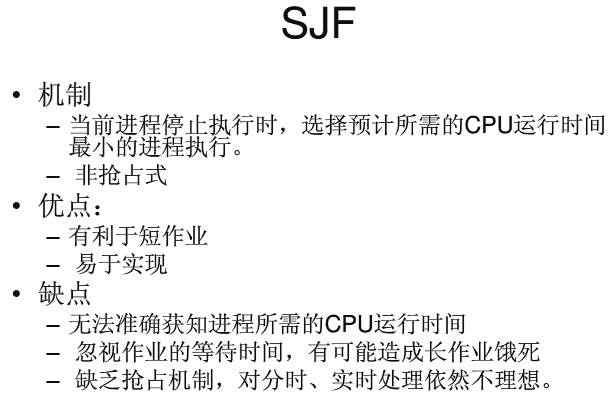
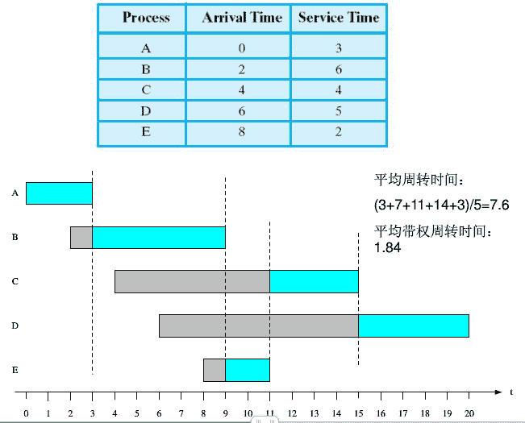
                                                                      SJF 调度图
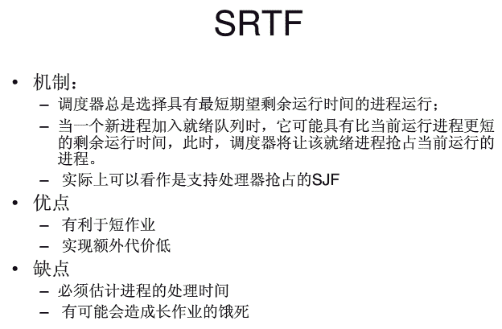
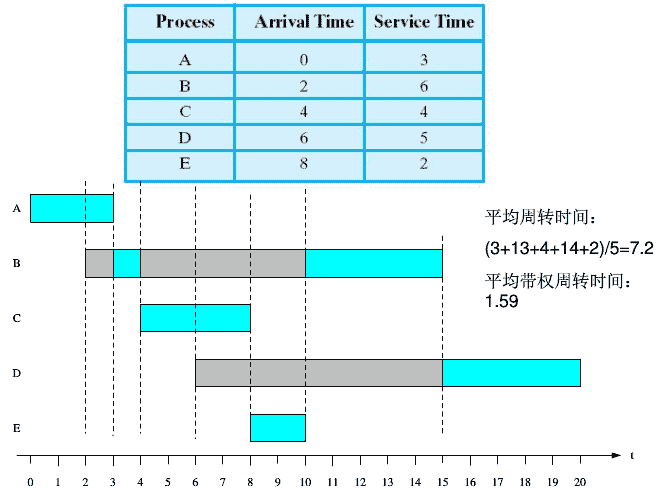
                                                                 SRTF 调度图
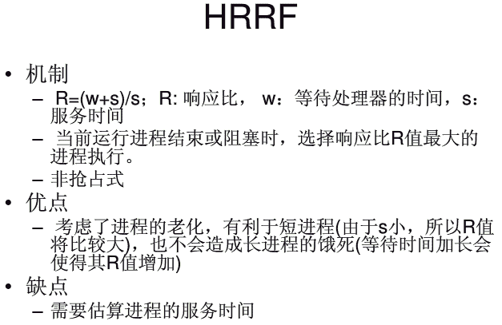
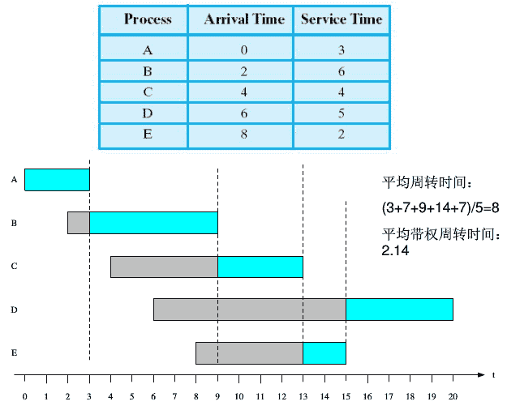
                                                             HRRF 调度图

发表于 2016-04-18 15:11:48

* * *

[程序员小董](https://www.nowcoder.com/profile/207399)

fcfs 是先来先服务算法 对短作业不利 spf 是短作业优先算法 hrn 是高响应比算法 对长短作业都比较好

发表于 2016-04-11 10:58:33

* * *

## 5

在 ECMAScript6 中,Promise 的状态有（）

正确答案: A C D   你的答案: 空 (错误)

```cpp
Pending
```

```cpp
Pause
```

```cpp
Resolved
```

```cpp
Rejected
```

本题知识点

Javascript

讨论

[夙愿](https://www.nowcoder.com/profile/191137)

答案：

*   一个 promise 可能有三种状态：等待（pending）、已完成（fulfilled）、已拒绝（rejected）
*   一个 promise 的状态只可能从“等待”转到“完成”态或者“拒绝”态，不能逆向转换，同时“完成”态和“拒绝”态不能相互转换
*   promise 必须实现 then 方法（可以说，then 就是 promise 的核心），而且 then 必须返回一个 promise，同一个 promise 的 then 可以调用多次，并且回调的执行顺序跟它们被定义时的顺序一致
*   then 方法接受两个参数，第一个参数是成功时的回调，在 promise 由“等待”态转换到“完成”态时调用，另一个是失败时的回调，在 promise 由“等待”态转换到“拒绝”态时调用。同时，then 可以接受另一个 promise 传入，也接受一个“类 then”的对象或方法，即 thenable 对象。

编辑于 2017-06-26 10:23:33

* * *

[今天也要加油鸭 _](https://www.nowcoder.com/profile/7808492)

三个状态 pending fulfilled rejected 两个过程 pending->fulfilled(resolve) pending->rejected(reject)一个方法 then

发表于 2018-09-04 15:02:26

* * *

[栗子唐](https://www.nowcoder.com/profile/186478)

在阮一峰老师写的 es6 标准入门中提到：‘Promise 对象代表一个异步操作，有 3 种状态：Pending(进行中)、Resolved(已完成，又称 Fulfilled)和 Rejected(已完成)’。应该是 ACD

发表于 2017-06-28 16:44:45

* * *

## 6

下面的哪个选项是自底向上分析方法（）

正确答案: D   你的答案: 空 (错误)

```cpp
递归下降分析法
```

```cpp
预测分析法
```

```cpp
LL（ 1）分析法
```

```cpp
算符优先分析法
```

本题知识点

编译和体系结构

讨论

[牛客 492493 号](https://www.nowcoder.com/profile/492493)

蘑菇街这套题是各种岗位的集合么

发表于 2016-04-12 10:43:16

* * *

[唐飞 dream](https://www.nowcoder.com/profile/677030)

自底向上分析法(bottom-up analysis method )一种语言形式分析算法.是根据形式文法的重写规则，自叶开始逐级向上归约，直到构造出表示句子结构的整个推导树为止的一种语言形式分析算法.递归向分析法为每一个非终结符建立相应的子程序,然后模拟语法树自动向下推倒，在推倒过程中遇到终结符则检查是否匹配，遇到非终结符则调用相应的子程序处理。预测分析法是根据客观对象的已知信息而对事物在将来的某些特征、发展状况的一种估计、测算活动。运用各种定性和定量的分析理论与方法，对事物未来发展的趋势和水平进行判断和推测的一种活动。LL(1)分析使用显式栈而不是 [递归调用](http://baike.baidu.com/view/1265506.htm) 来完成分析。以标准方式表示这个栈非常有用，这样 LL(1)分析程序的动作就可以快捷地显现出来。算符优先分析法是一种简单直观、特别方便于表达式分析，易于手式实现的方法。算符优先法只考虑算符（广义为终结符号）之间的优先关系，它是一种**自底向上的归约过程**，但这种归约未必严格按照句柄归约。它是一种不 [规范归约](http://www.baike.com/sowiki/%E8%A7%84%E8%8C%83%E5%BD%92%E7%BA%A6?prd=content_doc_search) 法。

发表于 2016-04-15 19:17:06

* * *

[Siiruo Wong](https://www.nowcoder.com/profile/621767)

自底向上的分析技术 有：

（ 1 ）简单优先分析法

（ 2 ）算符优先分析法

（ 3 ）优先函数

（ 4 ） LR 分析法

发表于 2016-08-29 16:41:32

* * *

## 7

有关曼彻斯特编码叙述正确的是（）

正确答案: C D   你的答案: 空 (错误)

```cpp
在信号位开始时不改变信号极性，表示辑”1”
```

```cpp
模拟数据转换为数字信号
```

```cpp
在信号位中电平从高到低跳变表示 0
```

```cpp
数字数据转换为数字信号
```

本题知识点

编译和体系结构

讨论

[小萱琪琪](https://www.nowcoder.com/profile/348579)

```cpp
曼彻斯特编码的编码规则是: 
在信号位中电平从低到高跳变表示 1 
在信号位中电平从高到低跳变表示 0 
差分曼彻斯特编码的编码规则是: 
在信号位开始时改变信号极性，表示辑"1" 
在信号位开始时不改变信号极性，表示逻辑"0" 
```

编辑于 2016-10-07 19:49:15

* * *

[南山北](https://www.nowcoder.com/profile/948516)

 曼彻斯特编码（Manchester Encoding），也叫做相位编码（ Phase Encode，简写 PE），是一个同步时钟编码技术，被物理层使用来编码一个同步位流的时钟和数据。它在以太网媒介系统中的应用属于数据通信中的两种位同步方法里的自同步法（另一种是外同步法），即接收方利用包含有同步信号的特殊编码从信号自身提取同步信号来锁定自己的时钟脉冲频率，达到同步目的。
曼彻斯特编码，常用于局域网传输。曼彻斯特编码将时钟和数据包含在数据流中，在传输代码信息的同时，也将时钟同步信号一起传输到对方，每位编码中有一跳变，不存在直流分量，因此具有自同步能力和良好的抗干扰性能。但每一个码元都被调成两个电平，所以数据传输速率只有调制速率的 1/2。
 在曼彻斯特编码中，每一位的中间有一跳变，位中间的跳变既作时钟信号，又作数据信号；从低到高跳变表示“1”，从高到低跳变表示“0”。还有一种是差分曼彻斯特编码，每位中间的跳变仅提供时钟定时，而用每位开始时有无跳变表示“0”或“1”，有跳变为“0”，无跳变为“1”。
其中非常值得注意的是，在每一位的"中间"必有一跳变，根据此规则，可以得出曼彻斯特编码波形图的画法。例如：传输二进制信息 0，若将 0 看作一位，我们以 0 为中心，在两边用虚线界定这一位的范围，然后在这一位的中间画出一个电平由高到低的跳变。后面的每一位以此类推即可画出整个波形图。

曼彻斯特编码 - 编码流程

1\. 首先 I/O 口输出高电平。

2\. 检查数据是否发送完成，如果是，跳到步骤 7。

3\. 检查下一个数据位的值。

4\. 如果是“1”，调用发送 1 的函数 ManchesterOne(T)。

5\. 如果是"0"，调用发送 0 的函数 ManchesterZero(T)。

6\. 返回到步骤 2。

7\. I/O 输出为高电平并返回。

发表于 2016-08-19 14:39:04

* * *

[唐飞 dream](https://www.nowcoder.com/profile/677030)

彻斯特编码的编码规则是在信号位中电平从低到高跳变表示 1  ；在信号位中电 平从高到低跳变表示 0  。 曼切斯特编码的 每个比特位在时钟周期内只占一半， 每个时钟周期内必有一次跳变， 这种跳变就是位同 步信号

```cpp
曼彻斯特编码，常用于局域网传输。在曼彻斯特编码中，每一位的中间有一跳变，位中间的跳变既作时钟信号，又作数据信号；从高到低跳变表示"1"，从低到高跳变表示"0"。还有一种是差分曼彻斯特编码，每位中间的跳变仅提供时钟定时，而用每位开始时有无跳变表示"0"或"1"，有跳变为"0"，无跳变为"1"。 
```

编辑于 2016-04-15 19:25:55

* * *

## 8

关于中间件特点的描述.不正确的是（）

正确答案: A   你的答案: 空 (错误)

```cpp
中间件运行于客户机/服务器的操作系统内核中，提高内核运行效率
```

```cpp
中间件应支持标准的协议和接口
```

```cpp
中间件可运行于多种硬件和操作系统平台上
```

```cpp
跨越网络,硬件，操作系统平台的应用或服务可通过中间件透明交互
```

本题知识点

Java

讨论

[半纸流年](https://www.nowcoder.com/profile/710504)

中间件是一种独立的系统软件或服务程序，分布式应用软件借助这种软件在不同的技术之间共享资源。中间件位于客户机/ 服务器的操作系统之上，管理计算机资源和网络通讯。是连接两个独立应用程序或独立系统的软件。相连接的系统，即使它们具有不同的接口，但通过中间件相互之间仍能交换信息。执行中间件的一个关键途径是信息传递。通过中间件，应用程序可以工作于多平台或 OS 环境。（简单来说，中间件并不能提高内核的效率，一般只是负责网络信息的分发处理）

发表于 2016-04-09 15:07:52

* * *

[Eva90s](https://www.nowcoder.com/profile/448930)

a，中间件位于操作系统之上，应用软件之下，而不是操作系统内核中

发表于 2016-04-29 08:27:51

* * *

[牛客 143068 号](https://www.nowcoder.com/profile/143068)

中间件是一种独立的系统软件或服务程序，分布式应用软件借助这种软件在不同的技术之间共享资源。中间件位于客户机/ 服务器的操作系统之上，管理计算机资源和网络通讯。是连接两个独立应用程序或独立系统的软件。相连接的系统，即使它们具有不同的接口，但通过中间件相互之间仍能交换信息。执行中间件的一个关键途径是信息传递。通过中间件，应用程序可以工作于多平台或 OS 环境。（简单来说，中间件并不能提高内核的效率，一般只是负责网络信息的分发处理）中间件特点的描述：1. 中间件应支持标准的协议和接口 2. 中间件可运行于多种硬件和操作系统平台上 3. 跨越网络,硬件，操作系统平台的应用或服务可通过中间件透明交互

发表于 2016-06-24 16:50:09

* * *

## 9

下面关于 promise 的说法中，错误的是（）

正确答案: D   你的答案: 空 (错误)

```cpp
resolve（）和 reject 都是直接生成一个进入相应状态的 promise 对象，其参数就是进入相应状态时传递过去的参数，可以在完成回调的参数中得到
```

```cpp
Promise.resolve（value），Promise.reject（reason）是 Promise 构造器上还直接提供了一组静态方法
```

```cpp
在调用 then 方法或者 catch 方法时都是异步进行的，但是执行速度比较快
```

```cpp
Promise 构造器的 prototype 上还有两个方法，分别是 then 和 catch。这两个方法的参数也是回调函数，这些函数会在 Promise 实例进入不同状态后被调用。Then 对应到 resolve，catch 对应到 reject
```

本题知识点

Javascript

讨论

[DJL 箫氏](https://www.nowcoder.com/profile/753556)

then 有两个参数 都是回调函数 第一个回调函数，在 Promise 状态为 resolve 执行，第二个在状态为 reject 执行。catch 方法，相当于 then(null,reject)的一个变体。

发表于 2016-08-10 14:05:29

* * *

[hardy](https://www.nowcoder.com/profile/641341)

JS 中最基础的异步调用方式是 callback，它将回调函数 callback 传给异步 API，由浏览器或 Node 在异步完成后，通知 JS 引擎调用 callback。对于简单的异步操作，用 callback 实现，是够用的。但随着负责交互页面和 Node 出现，callback 方案的弊端开始浮现出来。 Promise 规范孕育而生，并被纳入 ES6 的规范中。后来 ES7 又在 Promise 的基础上将 async 函数纳入标准。此为 JavaScript 异步进化史。


**同步与异步**

通常，代码是由上往下依次执行的。如果有多个任务，就必需排队，前一个任务完成，后一个任务才会执行。这种执行模式称之为：同步（synchronous）。新手容易把计算机用语中的同步，和日常用语中的同步弄混淆。如，“把文件同步到云端”中的同步，指的是“使...保持一致”。而在计算机中，同步指的是任务从上往下依次执行的模式。比如：

```cpp
A();
B();
C();
```

在这段代码中，A、B、C 是三个不同的函数，每个函数都是一个不相关的任务。在同步模式，计算机会先执行 A 任务，再执行 B 任务，最后执行 C 任务。在大部分情况，同步模式都没问题。但是如果 B 任务是一个耗时很长的网络请求，而 C 任务恰好是展现新页面，就会导致网页卡顿。

更好解决方案是，将 B 任务分成两个部分。一部分立即执行网络请求的任务，另一部分在请求回来后的执行任务。这种一部分立即执行，另一部分在未来执行的模式称为异步。

```cpp
A();
// 在现在发送请求 
ajax('url1',function B() {
  // 在未来某个时刻执行
})
C();
// 执行顺序 A => C => B
```

实际上，JS 引擎并没有直接处理网络请求的任务，它只是调用了浏览器的网络请求接口，由浏览器发送网络请求并监听返回的数据。JavaScript 异步能力的本质是浏览器或 Node 的多线程能力。

**callback **

未来执行的函数通常也叫 callback。使用 callback 的异步模式，解决了阻塞的问题，但是也带来了一些其他问题。在最开始，我们的函数是从上往下书写的，也是从上往下执行的，这种“线性”模式，非常符合我们的思维习惯，但是现在却被 callback 打断了！在上面一段代码中，现在它跳过 B 任务先执行了 C 任务！这种异步“非线性”的代码会比同步“线性”的代码，更难阅读，因此也更容易滋生 BUG。

试着判断下面这段代码的执行顺序，你会对“非线性”代码比“线性”代码更难以阅读，体会更深。

```cpp
A();

ajax('url1', function(){
    B();

    ajax('url2', function(){
        C();
    }
    D();

});
E();
// A => E => B => D => C
```

这段代码中，从上往下执行的顺序被 Callback 打乱了。我们的阅读代码视线是 A => B => C => D => E，但是执行顺序却是 A => E => B => D => C，这就是非线性代码带来的糟糕之处。

通过将 ajax 后面执行的任务提前，可以更容易看懂代码的执行顺序。虽然代码因为嵌套看起来不美观，但现在的执行顺序却是从上到下的“线性”方式。这种技巧在写多重嵌套的代码时，是非常有用的。

```cpp
A();
E();

ajax('url1', function(){
    B();
    D();

    ajax('url2', function(){
        C();
    }

});
// A => E => B => D => C
```

上一段代码只有处理了成功回调，并没处理异常回调。接下来，把异常处理回调加上，再来讨论代码“线性”执行的问题。

```cpp
A();

ajax('url1', function(){
    B();

    ajax('url2', function(){
        C();
    },function(){
        D();
    });

},function(){
    E();

});
```

加上异常处理回调后，url1 的成功回调函数 B 和异常回调函数 E，被分开了。这种“非线性”的情况又出现了。

在 node 中，为了解决的异常回调导致的“非线性”的问题，制定了错误优先的策略。node 中 callback 的第一个参数，专门用于判断是否发生异常 

```cpp
A();

get('url1', function(error){
    if(error){
        E();
    }else {
        B();

        get('url2', function(error){
            if(error){
                D();
            }else{
                C();
            }
        });
    }
});
```

到此，callback 引起的“非线性”问题基本得到解决。遗憾的是，使用 callback 嵌套，一层层 if else 和回调函数，一旦嵌套层数多起来，阅读起来不是很方便。此外，callback 一旦出现异常，只能在当前回调函数内部处理异常。

**promise**

在 JavaScript 的异步进化史中，涌现出一系列解决 callback 弊端的库，而 Promise 成为了最终的胜者，并成功地被引入了 ES6 中。它将提供了一个更好的“线性”书写方式，并解决了异步异常只能在当前回调中被捕获的问题。

Promise 就像一个中介，它承诺会将一个可信任的异步结果返回。首先 Promise 和异步接口签订一个协议，成功时，调用 resolve 函数通知 Promise，异常时，调用 reject 通知 Promise。另一方面 Promise 和 callback 也签订一个协议，由 Promise 在将来返回可信任的值给 then 和 catch 中注册的 callback。

```cpp
// 创建一个 Promise 实例（异步接口和 Promise 签订协议）
var promise = new Promise(function (resolve,reject) {
  ajax('url',resolve,reject);
});

// 调用实例的 then catch 方法 （成功回调、异常回调与 Promise 签订协议）
promise.then(function(value) {
  // success
}).catch(function (error) {
  // error
})
```

Promise 是个非常不错的中介，它只返回可信的信息给 callback。它对第三方异步库的结果进行了一些加工，保证了 callback 一定会被异步调用，且只会被调用一次。

```cpp
var promise1 = new Promise(function (resolve) {
  // 可能由于某些原因导致同步调用
  resolve('B');
});
// promise 依旧会异步执行
promise1.then(function(value){
    console.log(value)
});
console.log('A');
// A B （先 A 后 B）

var promise2 = new Promise(function (resolve) {
  // 成功回调被通知了 2 次
  setTimeout(function(){
    resolve();
  },0)
});
// promise 只会调用一次
promise2.then(function(){
    console.log('A')
});
// A (只有一个)

var promise3 = new Promise(function (resolve,reject) {
  // 成功回调先被通知，又通知了失败回调
  setTimeout(function(){
    resolve();
    reject();
  },0)

});
// promise 只会调用成功回调
promise3.then(function(){
    console.log('A')
}).catch(function(){
    console.log('B')
});
// A（只有 A）
```

介绍完 Promise 的特性后，来看看它如何利用链式调用，解决异步代码可读性的问题的。

```cpp
var fetch = function(url){
    // 返回一个新的 Promise 实例
    return new Promise(function (resolve,reject) {
        ajax(url,resolve,reject);
    });
}

A();
fetch('url1').then(function(){
    B();
    // 返回一个新的 Promise 实例
    return fetch('url2');
}).catch(function(){
    // 异常的时候也可以返回一个新的 Promise 实例
    return fetch('url2');
    // 使用链式写法调用这个新的 Promise 实例的 then 方法    
}).then(function() {
    C();
    // 继续返回一个新的 Promise 实例...
})
// A B C ...
```

如此反复，不断返回一个 Promise 对象，再采用链式调用的方式不断地调用。使 Promise 摆脱了 callback 层层嵌套的问题和异步代码“非线性”执行的问题。

Promise 解决的另外一个难点是 callback 只能捕获当前错误异常。Promise 和 callback 不同，每个 callback 只能知道自己的报错情况，但 Promise ***着所有的 callback，所有 callback 的报错，都可以由 Promise 统一处理。所以，可以通过 catch 来捕获之前未捕获的异常。

Promise 解决了 callback 的异步调用问题，但 Promise 并没有摆脱 callback，它只是将 callback 放到一个可以信任的中间机构，这个中间机构去链接我们的代码和异步接口。

**异步（async）函数**

异步（async）函数是 ES7 的一个新的特性，它结合了 Promise，让我们摆脱 callback 的束缚，直接用类同步的“线性”方式，写异步函数。

声明异步函数，只需在普通函数前添加一个关键字 async 即可，如 async function main(){} 。在异步函数中，可以使用 await 关键字，表示等待后面表达式的执行结果，一般后面的表达式是 Promise 实例。

```cpp
async function main{
    // timer 是在上一个例子中定义的
    var value = await timer(100);
    console.log(value); // done （100ms 后返回 done）
}

main();
```

异步函数和普通函数一样调用 main() 。调用后，会立即执行异步函数中的第一行代码 var value = await timer(100)。等到异步执行完成后，才会执行下一行代码。

除此之外，异步函数和其他函数基本类似，它使用 try...catch 来捕捉异常。也可以传入参数。但不要在异步函数中使用 return 来返回值。

```cpp
var  timer = new Promise(function create(resolve,reject) {
  if(typeof delay !== 'number'){
    reject(new Error('type error'));
  }
  setTimeout(resolve,delay,'done');
});

async function main(delay){
  try{
    var value1 = await timer(delay);
    var value2 = await timer('');
    var value3 = await timer(delay);
  }catch(err){
    console.error(err);
      // Error: type error
      //   at create (<anonymous>:5:14)
      //   at timer (<anonymous>:3:10)
      //   at A (<anonymous>:12:10)
  }
}
main(0);
```

异步函数也可以被当作值，传入普通函数和异步函数中执行。但是在异步函数中，使用异步函数时要注意，如果不使用 await，异步函数会被同步执行。

```cpp
async function main(delay){
    var value1 = await timer(delay);
    console.log('A')
}

async function doAsync(main){
  main(0);
  console.log('B')
}

doAsync(main);
// B A
```

这个时候打印出来的值是 B A。说明 doAsync 函数并没有等待 main 的异步执行完毕就执行了 console。如果要让 console 在 main 的异步执行完毕后才执行，我们需要在 main 前添加关键字 await。

```cpp
async function main(delay){
    var value1 = await timer(delay);
    console.log('A')
}

async function doAsync(main){
    await main(0);
    console.log('B')
}

doAsync(main);
// A B
```

由于异步函数采用类同步的书写方法，所以在处理多个并发请求，新手可能会像下面一样书写。这样会导致 url2 的请求必需等到 url1 的请求回来后才会发送。

```cpp
var fetch = function (url) {
  return new Promise(function (resolve,reject) {
    ajax(url,resolve,reject);
  });
}

async function main(){
  try{
    var value1 = await fetch('url1');
    var value2 = await fetch('url2');
    conosle.log(value1,value2);
  }catch(err){
    console.error(err)
  }
}

main();
```

使用 Promise.all 的方法来解决这个问题。Promise.all 用于将多个 Promise 实例，包装成一个新的 Promis e 实例，当所有的 Promise 成功后才会触发 Promise.all 的 resolve 函数，当有一个失败，则立即调用 Promise.all 的 reject 函数。

```cpp
var fetch = function (url) {
  return new Promise(function (resolve,reject) {
    ajax(url,resolve,reject);
  });
}

async function main(){
  try{
    var arrValue = await Promise.all[fetch('url1'),fetch('url2')];
    conosle.log(arrValue[0],arrValue[1]);
  }catch(err){
    console.error(err)
  }
}

main();
```

目前使用 Babel 已经支持 ES7 异步函数的转码了，大家可以在自己的项目中开始尝试。

via：https://segmentfault.com/a/1190000006138882

发表于 2016-08-15 14:47:30

* * *

[最讨厌晚上 9 点半，钉钉响起的声音](https://www.nowcoder.com/profile/303433)

这是 copy 的哦：感觉不错的一个解释：① then 有两个参数 都是回调函数     第一个回调函数，在 Promise  状态为 resolve 执行，第二个在状态为 reject 执行。② catch 方法，相当于 then(null,reject)的一个变体。

发表于 2017-03-30 23:47:03

* * *

## 10

KMP 算法下，长为 n 的字符串中匹配长度为 m 的子串的复杂度为（）

正确答案: B   你的答案: 空 (错误)

```cpp
O(n)
```

```cpp
O(m + n)
```

```cpp
O(m + log(m))
```

```cpp
O(n + log(m))
```

本题知识点

复杂度 查找 *讨论

[南山北](https://www.nowcoder.com/profile/948516)

kmp 算法完成的任务是：给定两个字符串 O 和 f，长度分别为 n 和 m，判断 f 是否在 O 中出现，如果出现则返回出现的位置。常规方法是遍历 O 的每一个位置，然后从该位置开始和 f 进行匹配，但是这种方法的复杂度是 O(nm)。kmp 算法通过一个 O(m)的预处理，使匹配的复杂度降为 O(n+m)。 

kmp 算法思想

我们首先用一个图来描述 kmp 算法的思想。在字符串 O 中寻 找 f，当匹配到位置 i 时两个字符串不相等，这时我们需要将字符串 f 向前移动。常规方法是每次向前移动一位，但是它没有考虑前 i-1 位已经比较过这个事实， 所以效率不高。事实上，如果我们提前计算某些信息，就有可能一次前移多位。假设我们根据已经获得的信息知道可以前移 k 位，我们分析移位前后的 f 有什么特点。我们可以得到如下的结论：

*   A 段字符串是 f 的一个前缀。
*   B 段字符串是 f 的一个后缀。
*   A 段字符串和 B 段字符串相等。

所以前移 k 位之后，可以继续比较位置 i 的前提是 f 的前 i-1 个位置满足：**长度为 i-k-1 的前缀 A 和后缀 B 相同**。只有这样，我们才可以前移 k 位后从新的位置继续比较。

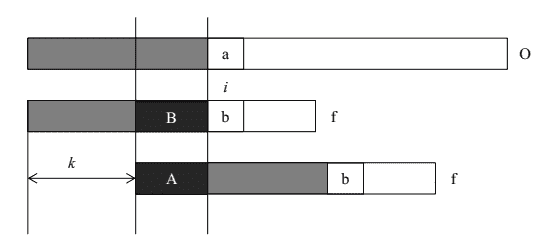 

所以 kmp 算法的核心即是计算字符串 f 每一个位置之前的字 符串的前缀和后缀公共部分的最大长度（不包括字符串本身，否则最大长度始终是字符串本身）。获得 f 每一个位置的最大公共长度之后，就可以利用该最大公共长 度快速和字符串 O 比较。当每次比较到两个字符串的字符不同时，我们就可以根据最大公共长度将字符串 f 向前移动(已匹配长度-最大公共长度)位，接着继续比 较下一个位置。事实上，字符串 f 的前移只是概念上的前移，只要我们在比较的时候从最大公共长度之后比较 f 和 O 即可达到字符串 f 前移的目的。

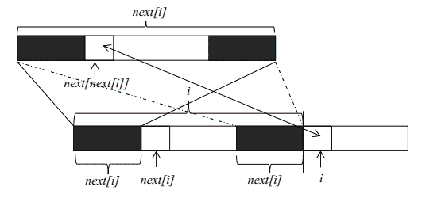 

next 数组计算

理解了 kmp 算法的基本原理，下一步就是要获得字符串 f 每一个位置的最大公共长度。这个最大公共长度在算法导论里面被记为 next 数组。在这里要注意一点， next 数组表示的是长度，下标从 1 开始；但是在遍历原字符串时，下标还是从 0 开始。假设我们现在已经求得 next[1]、next[2]、……next[i]，分别表示长度为 1 到 i 的字符串的前缀和后缀最大公共长度，现在要求 next[i+1]。由上图我们可以看到，如果位置 i 和位置 next[i]处的两个字符相同（下标从零开始）， 则 next[i+1]等于 next[i]加 1。如果两个位置的字符不相同，我们可以将长度为 next[i]的字符串继续分割，获得其最大公共长度 next[next[i]]，然后再和位置 i 的字符比较。这是因为长度为 next[i]前缀和后缀都可以分割成上部的构造，如果位置 next[next[i]]和位置 i 的字符相同，则 next[i+1]就等于 next[next[i]]加 1。如果不相等，就可以继续分割长度为 next[next[i]]的字符串，直到字符串长度为 0 为止。由此我们可以写出求 next 数组的代码（[Java](http://lib.csdn.net/base/17)版）： 

```cpp
public int[] getNext(String b)  
{  
    int len=b.length();  
    int j=0;  

    int next[]=new int[len+1];//next 表示长度为 i 的字符串前缀和后缀的最长公共部分，从 1 开始  
    next[0]=next[1]=0;  

    for(int i=1;i<len;i++)//i 表示字符串的下标，从 0 开始  
    {//j 在每次循环开始都表示 next[i]的值，同时也表示需要比较的下一个位置  
        while(j>0&&b.charAt(i)!=b.charAt(j))j=next[j];  
        if(b.charAt(i)==b.charAt(j))j++;  
        next[i+1]=j;  
    }  

    return next;  
} 

```

上述代码需要注意的问题是，我们求取的 next 数组表示长度为 1 到 m 的字符串 f 前缀的最大公共长度，所以需要多分配一个空间。而在遍历字符串 f 的时候，还是从下标 0 开始(位置 0 和 1 的 next 值为 0，所以放在循环外 面)，到 m-1 为止。代码的结构和上面的讲解一致，都是利用前面的 next 值去求下一个 next 值。

字符串匹配

计算完成 next 数组之后，我们就可以利用 next 数组在 字符串 O 中寻找字符串 f 的出现位置。匹配的代码和求 next 数组的代码非常相似，因为匹配的过程和求 next 数组的过程其实是一样的。假设现在字符串 f 的 前 i 个位置都和从某个位置开始的字符串 O 匹配，现在比较第 i+1 个位置。如果第 i+1 个位置相同，接着比较第 i+2 个位置；如果第 i+1 个位置不同，则出 现不匹配，我们依旧要将长度为 i 的字符串分割，获得其最大公共长度 next[i]，然后从 next[i]继续比较两个字符串。这个过程和求 next 数组一 致，所以可以匹配代码如下（java 版）： 

```cpp
public void search(String original, String find, int next[]) {  
    int j = 0;  
    for (int i = 0; i < original.length(); i++) {  
        while (j > 0 && original.charAt(i) != find.charAt(j))  
            j = next[j];  
        if (original.charAt(i) == find.charAt(j))  
            j++;  
        if (j == find.length()) {  
            System.out.println("find at position " + (i - j));  
            System.out.println(original.subSequence(i - j + 1, i + 1));  
            j = next[j];  
        }  
    }  
}  

```

上述代码需要注意的一点是，每次我们得到一个匹配之后都要对 j 重新赋值。

编辑于 2016-08-19 14:56:13

* * *

[古来征战几人回](https://www.nowcoder.com/profile/96346009)

推荐这篇博客里对 KMP 算法的讲解很清晰，通过一个实际的例子来讲解了如何进行匹配：[`www.ruanyifeng.com/blog/2013/05/Knuth`](http://www.ruanyifeng.com/blog/2013/05/Knuth%E2%80%93Morris%E2%80%93Pratt_algorithm.html)

这里基于上述博客中的例子进行 python 实现：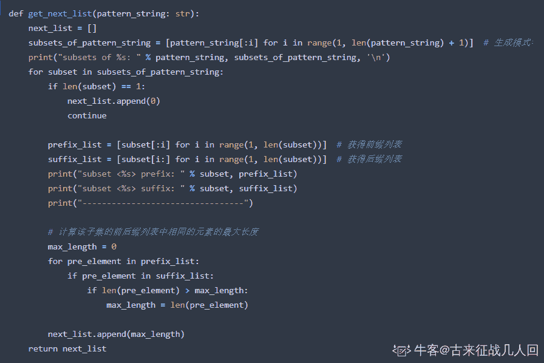

Next 表函数测试结果如下：

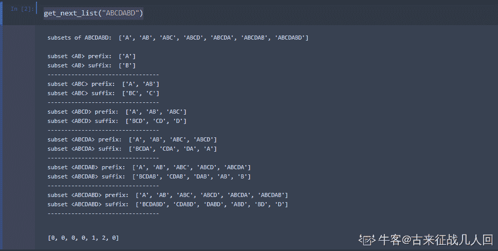

现在来实现 search 函数：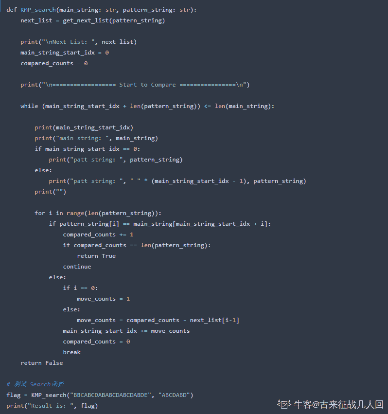
search 函数测试结果如下：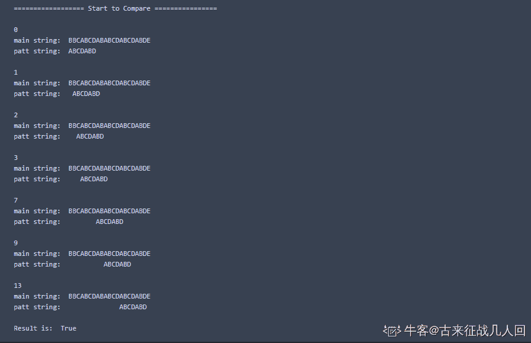

发表于 2020-05-06 22:20:52

* * *

[大星星和小猩猩](https://www.nowcoder.com/profile/9374535)

KMP 算法的本质是在分析模式串的特点，从而使得在匹配过程中，当某个字符不匹配时，主串不需要回溯，从而降低了匹配所需的时间复杂度。**主串不需要回溯，而模式串在进行匹配前，要被遍历一遍进行预处理，目的是为了生成 next 数组。**所以，时间复杂度为 O（N+M）。

编辑于 2020-04-09 10:50:55

* * *

## 11

通过构建有序序列，对于未排序数据，在已排序序列中从后向前扫描，找到相应的位置并插入的排序算法是（）

正确答案: D   你的答案: 空 (错误)

```cpp
归并排序
```

```cpp
选择排序
```

```cpp
希尔排序
```

```cpp
插入排序
```

本题知识点

排序 *讨论

[唐飞 dream](https://www.nowcoder.com/profile/677030)

归并操作(merge)，也叫归并算法，指的是将两个顺序序列合并成一个顺序序列的方法。如　设有数列{6，202，100，301，38，8，1}初始状态：6,202,100,301,38,8，1 第一次归并后：{6,202},{100,301},{8,38},{1}，比较次数：3；第二次归并后：{6,100,202,301}，{1,8,38}，比较次数：4；第三次归并后：{1,6,8,38,100,202,301},比较次数：4；总的比较次数为：3+4+4=11,；逆序数为 14；简单选择排序的基本思想：第 1 趟，在待排序记录 r[1]~r[n]中选出最小的记录，将它与 r[1]交换；第 2 趟，在待排序记录 r[2]~r[n]中选出最小的记录，将它与 r[2]交换；以此类推，第 i 趟在待排序记录 r[i]~r[n]中选出最小的记录，将它与 r[i]交换，使有序序列不断增长直到全部排序完毕。以下为简单选择排序的存储状态，其中大括号内为无序区，大括号外为有序序列：初始序列：{ 49 27 65 97 76 12 38 }第 1 趟：12 与 49 交换：12 { 27 65 97 76 49 38 }第 2 趟：27 不动　：12 27 { 65 97 76 49 38 }第 3 趟：65 与 38 交换：12 27 38 { 97 76 65 49}第 4 趟：97 与 49 交换：12 27 38 49 { 97 76 65 }第 5 趟：76 与 65 交换：12 27 38 49 65 { 97 76 }第 6 趟：97 与 76 交换：12 27 38 49 65 76 97 完成希尔排序：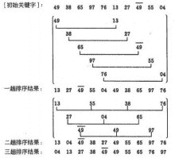插入排序：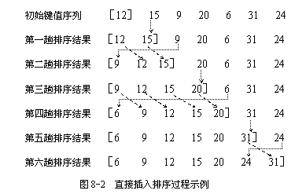

发表于 2016-04-15 20:00:37

* * *

[Orange。](https://www.nowcoder.com/profile/608812)

题目说了找到位置插入了，肯定是插入排序了。。

发表于 2017-08-17 08:56:14

* * *

[牛客 657694 号](https://www.nowcoder.com/profile/657694)

D

发表于 2016-11-14 23:29:19

* * *

## 12

执行 chmod 644 mm.txt 后的权限是（）

正确答案: B   你的答案: 空 (错误)

```cpp
drw-r--r--
```

```cpp
-rw-r--r--
```

```cpp
lrwxr--r--
```

```cpp
rwxr- -rw-
```

本题知识点

Linux

讨论

[Allfy](https://www.nowcoder.com/profile/467194)

读写执行 1 执行 x，2 写权限 w，4 读权限 r6 ：拥有者 4：所属组    4：其他人 rw-r--r--前面还有一个占位符表示文件类型-二进制文件 d 目录 l 软连接故-rw-r--r--

发表于 2016-04-09 22:11:38

* * *

[kop](https://www.nowcoder.com/profile/183734)

从左至右，1-3 位数字代表文件所有者的权限，4-6 位数字代表同组用户的权限，7-9 数字代表其他用户的权限。
而具体的权限是由数字来表示的，读取的权限等于 4，用 r 表示；写入的权限等于 2，用 w 表示；执行的权限等于 1，用 x 表示；
通过 4、2、1 的组合，得到以下几种权限：0（没有权限）；4（读取权限）；5（4+1 | 读取+执行）；6（4+2 | 读取+写入）；7（4+2+1 | 读取+写入+执行）

发表于 2016-09-10 09:25:14

* * *

[linlh](https://www.nowcoder.com/profile/558030)

如果单单指权限的话应该是 b

发表于 2016-04-09 17:08:58

* * *

## 13

下列说法正确的是（）

正确答案: A B D   你的答案: 空 (错误)

```cpp
二维以上的数组其实是一种特殊的广义表
```

```cpp
数组一旦建立，结构的元素个数和元素间的物理存储关系就不再变化
```

```cpp
数组是一种线性结构，因此只能用来存储线性表
```

```cpp
数组采用顺序存储方式表示
```

本题知识点

数组

讨论

[lsyyzx](https://www.nowcoder.com/profile/563332)

对于选项 c,因为数组也可以用来存储完全二叉树。

发表于 2017-03-06 15:05:56

* * *

[追逐者](https://www.nowcoder.com/profile/293577)

关于这一题，我们需要区分数据的物理结构与逻辑结构。物理结构主要是指存储方式，包含线性存储与链式存储，它是从计算机存储的角度去考虑。逻辑结构指的是数据之间的关系，有线性关系和链式关系等，主要是从人为定义角度去考虑。数组是一种被人们定义为线性关系的表，至于其存储结构，可以用线性存储也可以是链式存储去存储

发表于 2016-04-15 11:54:12

* * *

[唐飞 dream](https://www.nowcoder.com/profile/677030)

c 问题是一维数组是一种线性结构，因此只能用来存储线性表***数组可以用矩阵来表示，比如二维数组，但是***数组是线性结构的，而矩阵是非线性结构。
线性是一种逻辑结构，数据结构中的除去首尾元素外,其他元素都有唯一的前驱和后继。
***数组元素之间的逻辑关系（前驱后继关系）通过数组下标体现出来的。
而矩阵通常认为元素之间没有特定的前后关系。
因为缺少前后关系，所以矩阵就被划分为非线性结构。

线性结构是一个有序[数据元素](http://www.bing.com/knows/%E6%95%B0%E6%8D%AE%E5%85%83%E7%B4%A0)的集合。  常用的线性结构有：[线性表](http://www.bing.com/knows/%E7%BA%BF%E6%80%A7%E8%A1%A8)，栈，[队列](http://www.bing.com/knows/%E9%98%9F%E5%88%97_%E5%B8%B8%E7%94%A8%E6%95%B0%E6%8D%AE%E7%BB%93%E6%9E%84%E4%B9%8B%E4%B8%80)，双[队列](http://www.bing.com/knows/%E9%98%9F%E5%88%97_%E5%B8%B8%E7%94%A8%E6%95%B0%E6%8D%AE%E7%BB%93%E6%9E%84%E4%B9%8B%E4%B8%80)，[数组](http://www.bing.com/knows/%E6%95%B0%E7%BB%84)，串。 关于广义表，是一种非线性的[数据结构](http://www.bing.com/knows/%E6%95%B0%E6%8D%AE%E7%BB%93%E6%9E%84_%E8%AE%A1%E7%AE%97%E6%9C%BA%E5%AD%98%E5%82%A8%E3%80%81%E7%BB%84%E7%BB%87%E6%95%B0%E6%8D%AE%E6%96%B9%E5%BC%8F)。 常见的[非线性结构](http://www.bing.com/knows/%E9%9D%9E%E7%BA%BF%E6%80%A7%E7%BB%93%E6%9E%84)有：二维数组，[***数组](http://www.bing.com/knows/%E5%A4%9A%E7%BB%B4%E6%95%B0%E7%BB%84)，广义表，树(二叉树等)，图。

编辑于 2016-04-21 23:57:22

* * *

## 14

为了提高数据库的性能，需要针对系统设计基准测试进行压力测试，那么进行压力测试时需要考虑以下哪些指标（）

正确答案: B C D   你的答案: 空 (错误)

```cpp
可扩展性
```

```cpp
响应时间
```

```cpp
并发性
```

```cpp
吞吐量
```

本题知识点

数据库

讨论

[SyroneWong](https://www.nowcoder.com/profile/619465)

可扩展性是程序设计应该考虑的吧，和测试有关联？另外做题时开发性没看懂不敢选，你们就不能有个人做做校正？

发表于 2016-06-16 16:33:45

* * *

[PixelWise](https://www.nowcoder.com/profile/120561)

在实习的时候拿 apache benchmark 做过压力测试，主要涉及的就是延迟 Latency，每秒的请求处理次数 QPS。回到这题里面来。延迟对应响应时间。吞吐量是单位时间完成的请求数量，也就是 QPS 吧。并发性实际上是从并发请求的结果的完整性角度来说的。至于可扩展性，我的理解是压力测试使用的测试用例可以被重复使用。或者更严格的说，压力测试使用的测试用例测试环境应该是与业务逻辑无关的。

发表于 2016-09-07 15:00:48

* * *

[清歌王子](https://www.nowcoder.com/profile/259871)

并发性吧？？还以为阴我

编辑于 2016-06-18 13:41:41

* * *

## 15

假如在 MySQL 中有存储过程 proc1（员工编号，月份）用来查询员工的工资，两个参数类型均为字符类型，则下列调用存储过程的方法正确的是（）

正确答案: A C   你的答案: 空 (错误)

```cpp
call Proc1（‘emp001’  ,’ 201601’ );
```

```cpp
exec Proc1（‘emp001’  ,’ 201601’ );
```

```cpp
call Proc1（‘emp001’  ,null);
```

```cpp
call Proc1（‘emp001’  ,);
```

本题知识点

数据库

讨论

[炫](https://www.nowcoder.com/profile/376795)

**1、首先要注意的是题目中说明的是 MySQL 中存储过程的调用，而不是 Sql Server，****2、MySQL 的存储过程参数没有默认值，所以在调用 MySQL 存储过程时，不能省略参数，但是可以用 null 来代替**

发表于 2016-05-22 13:06:29

* * *

[zhao_sky](https://www.nowcoder.com/profile/891294)

学习了，exec 是 sql server 的存储过程调用方式，call 是 mysql 的存储过程调用方式，同时调用时必须有参数或者为 null

发表于 2016-08-27 09:00:20

* * *

[zhisheng_blog](https://www.nowcoder.com/profile/616717)

记得 sql server 可以使用 exec 调用，但是不太清楚 Sql server 与 MySQL 之间的差别，还是得多看看书本，扎实基础啊。还是一枚弱渣。

发表于 2016-08-01 14:21:44

* * *

## 16

利用时间重叠概念实行并行处理的是（）

正确答案: B   你的答案: 空 (错误)

```cpp
多处理机
```

```cpp
流水处理机
```

```cpp
相联处理机
```

```cpp
并行（阵列）处理机
```

本题知识点

编译和体系结构

讨论

[Cloud2049](https://www.nowcoder.com/profile/8508158)

**时间重叠**：让多个处理过程在时间上错开，轮流重叠的使用同一套硬件设备的各个部分，加快硬件使用的周转来赢得速度。——**流水线处理机****资源重叠**：通过重复设置硬件资源来提高性能或可靠性。——**并行处理机、相联处理机****资源共享**：用软件的方法让多个用户公用同一套资源，通过提高系统资源的利用率来提高系统的效率和性能。——**多处理机**

编辑于 2017-03-02 15:50:56

* * *

[良哥](https://www.nowcoder.com/profile/491039)

**阵列处理机：**  单指令流多数据流； 采用资源重复技术。**采用流水结构的单机系统：**  单指令流多数据流； 采用时间重复技术。

发表于 2016-04-24 16:49:03

* * *

[Foxen](https://www.nowcoder.com/profile/297771)

> 时间并行性概念的实现方式就是采用流水处理部件。这是一种非常经济而实用的 [并行技术](http://baike.baidu.com/view/897462.htm) ，能保证计算机系统具有较高的性能价格比。目前的高性能微型机几乎无一例外地使用了流水技术。

百度百科

发表于 2016-04-13 15:24:55

* * *

## 17

下列关于策略处理规则描述正确的是（）

正确答案: A C D   你的答案: 空 (错误)

```cpp
如果子容器的某个策略被配置，则此配置值会覆盖由其父容器所传递下来的配置值
```

```cpp
当组策略的用户配置和计算机配置冲突的时候，优先处理用户配置
```

```cpp
组策略的配置值是有累加性的
```

```cpp
系统是先处理计算机配置，再处理用户配置
```

本题知识点

Windows

讨论

[唐飞 dream](https://www.nowcoder.com/profile/677030)

B 选项 计算机策略覆盖用户策略；不同层次的策略产生冲突时，子容器上的 gpo 优先级高；同一容器上多个 gpo 产生冲突时，处于 gpo 列表最高位置的 gpo 优先级最高。总体原侧就是：后执行的优先级高。这样，处理方法是：变更组策略的应用顺序；阻止继承；强制（禁止替代）；避免变更应用顺序。

发表于 2016-04-15 20:07:04

* * *

[风吹夏天](https://www.nowcoder.com/profile/3516745)

组策略

发表于 2016-08-06 21:50:35

* * *

## 18

设二叉树中的结点总数为 49，若用二叉链表作为存储结构，则该二叉树中总共有多少个空指针域（）

正确答案: C   你的答案: 空 (错误)

```cpp
51
```

```cpp
52
```

```cpp
50
```

```cpp
49
```

本题知识点

树

讨论

[IT 工作](https://www.nowcoder.com/profile/859375)

一共有 n 个节点。那么每一个节点都有两个域，共有 2n 个。一共有多少个分支呢？每一个节点都有父节点(除了根节点)那么就会有 n-1 个分支。那么空指针的域就是 2n - (n-1) = n+1;那么就会有 n+1 个空指针域。也就是 50 个。不管是不是满二叉树，这个结论都是正确的。

发表于 2016-04-10 19:50:54

* * *

[超小白](https://www.nowcoder.com/profile/499570)

这不就是二叉树的性质么，和哈夫曼树都没多大关系，只要是二叉树，**有 n 个节点，就一定是有 n+1 个空指针域，**这在学线索二叉树的时候有详细推理过程的。
1\. n 个结点，每个结点有两个指针共 2n 个指针，
2. n 个结点，除根结点外的 n-1 个结点都有一个指向父结点的线，即非空指针，共 n-1 条非空指针
3\. 控指针数 = 总指针数-非空指针数 = 2n-(n-1) = n+1
推到完毕

发表于 2016-08-20 08:58:57

* * *

[hyhappy](https://www.nowcoder.com/profile/522349)

哈夫曼树只有度为 2 的结点和叶子结点，并且 n0=n2+1，由此计算可知，叶子结点有 25 个，而每个叶子结点有两个空指针，所以共有 50 个

发表于 2016-04-09 23:53:36

* * *

## 19

Linux 中包括两种链接：硬链接（Hard Link）和软连接（Soft Link），下列说法正确的是（）

正确答案: A   你的答案: 空 (错误)

```cpp
软连接可以跨文件系统进行连接，硬链接不可以
```

```cpp
当删除原文件的时候软连接文件仍然存在，且指向的内容不变
```

```cpp
硬链接被删除，磁盘上的数据文件会同时被删除
```

```cpp
硬链接会重新建立一个 inode，软链接不会
```

本题知识点

Linux

讨论

[努力奋斗的摩羯座女孩](https://www.nowcoder.com/profile/197921)

1>首先什么是链接？     链接操作实际上是给系统中已有的某个文件指定另外一个可用于访问它的名称。对于这个新的文件名，我们可以为之指定不同的 [访问权限](https://www.baidu.com/s?wd=%E8%AE%BF%E9%97%AE%E6%9D%83%E9%99%90&tn=44039180_cpr&fenlei=mv6quAkxTZn0IZRqIHcvrjTdrjb0T1dBn1TkujN9m1-bnhRdrH610ZwV5Hcvrjm3rH6sPfKWUMw85HfYnjn4nH6sgvPsT6KdThsqpZwYTjCEQLGCpyw9Uz4Bmy-bIi4WUvYETgN-TLwGUv3En1DznHD4PHbs) ，以控制对信息的共享和安全性的问题。 如果链接指向目录，用户就可以利用该链接直接进入被链接的目录而不用打一大堆的路径名。而且，即使我们删除这个链接，也不会破坏原来的目录。2>硬链接     硬链接只能引用同一文件系统中的文件。它引用的是文件在文件系统中的物理索引(也称为 inode)。当您移动或删除原始文件时，硬链接不会被破坏，因为它所引用的是文件的物理数据而不是文件在文件结构中的位置。硬链接的文件不需要用户有访问原始文件的权限，也不会显示原始文件的位置，这样有助于文件的安全。如果您删除的文件有相应的硬链接，那么这个文件依然会保留，直到所有对它的引用都被删除。3>软链接（符号链接）      软连接，其实就是新建立一个文件，这个文件就是专门用来指向别的文件的（那就和 windows 下的快捷方式的那个文件有很接近的意味）。软连接产生的是一个新的文件，但这个文件的作用就是专门指向某个文件的，删了这个软连接文件，那就等于不需要这个连接，和原来的存在的实体原文件没有任何关系，但删除原来的文件，则相应的软连接不可用（cat 那个软链接文件，则提示“没有该文件或目录“）。4> **硬链接与软链接的区别；**

硬连接是不会建立 inode 的，他只是在文件原来的 inode link count 域再增加 1 而已，也因此硬链接是不可以跨越文件系统的。相反都是软连接会重新建立一个 inode，当然 inode 的结构跟其他的不一样，他只是一个指明源文件的字符串信息。一旦删除源文件，那么软连接将变得毫无意义。而硬链接删除的时候，系统调用会检查 inode link count 的数值，如果他大于等于 1，那么 inode 不会被回收。因此文件的内容不会被删除。

硬链接实际上是为文件建一个别名，链接文件和原文件实际上是同一个文件。可以通过 ls -i 来查看一下，这两个文件的 inode 号是同一个，说明它们是同一个文件；而软链接建立的是一个指向，即链接文件内的内容是指向原文件的指针，它们是两个文件。

软链接可以跨文件系统，硬链接不可以；软链接可以对一个不存在的文件名(filename)进行链接（当然此时如果你 vi 这个软链接文件，linux 会自动新建一个文件名为 filename 的文件）,硬链接不可以（其文件必须存在，inode 必须存在）；软链接可以对目录进行连接，硬链接不可以。两种链接都可以通过命令 ln 来创建。ln 默认创建的是硬链接。使用 -s 开关可以创建软链接。

发表于 2016-08-10 17:08:10

* * *

[小小的我 8833](https://www.nowcoder.com/profile/492668)

（ 1 ）软连接可以跨文件系统，硬连接不可以

（ 2 ）硬连接不管有多少个，都指向的是同一个 I 节点，会把结点连接数增加，只要结点的连接数不是 0 ，文件就一直存在不管你删除的是源文件还是连接的文件。只要有一个存在文件就存在。 当你修改源文件或者连接文件任何一个的时候，其他的文件都会做同步的修改。软链接不直接使用 i 节点号作为文件指针 , 而是使用文件路径名作为指针。所以删除连接文件对源文件无影响，但是删除源文件，连接文件就会找不到要指向的文件。软链接有自己的 i 节点 , 并在磁盘上有一小片空间存放路径名。

（ 3 ）软连接可以对一个不存在的文件名进行连接 。

（ 4 ）软连接可以对目录进行连接。

发表于 2016-04-13 13:30:58

* * *

[bailu](https://www.nowcoder.com/profile/988460)

选项 B 错在节点的连接数会改变

发表于 2016-04-16 21:36:34

* * *

## 20

在 java 中重写方法应遵循规则的包括（）

正确答案: B C   你的答案: 空 (错误)

```cpp
访问修饰符的限制一定要大于被重写方法的访问修饰符
```

```cpp
可以有不同的访问修饰符
```

```cpp
参数列表必须完全与被重写的方法相同
```

```cpp
必须具有不同的参数列表
```

本题知识点

Java

讨论

[大肥肥](https://www.nowcoder.com/profile/774122)

**方法的重写（override）两同两小一大原则**：方法名相同，参数类型相同子类返回类型小于等于父类方法返回类型，子类抛出异常小于等于父类方法抛出异常，子类访问权限大于等于父类方法访问权限。

编辑于 2016-11-02 13:49:37

* * *

[菜鸟葫芦娃](https://www.nowcoder.com/profile/415611)

总结来说为：方法名相同，参数类型相同子类返回类型等于父类方法返回类型，子类抛出异常小于等于父类方法抛出异常，子类访问权限大于等于父类方法访问权限。详细的说明为：**重写是子类对父类的允许访问的方法的实现过程进行重新编写, 返回值和形参都不能改变。** **即外壳不变，核心重写！**

重写的好处在于子类可以根据需要，定义特定于自己的行为。 也就是说子类能够根据需要实现父类的方法。

重写方法不能抛出新的检查异常或者比被重写方法申明更加宽泛的异常。例如： 父类的一个方法申明了一个检查异常 IOException，但是在重写这个方法的时候不能抛出 Exception 异常，因为 Exception 是 IOException 的父类，只能抛出 IOException 的子类异常。

方法的重写规则

*   1）参数列表必须完全与被重写方法的相同；
*   2）**返回类型必须完全与被重写方法的返回类型相同；（备注:这条信息是标准的重写方法的规则,但是在 java 1.5 版本之前返回类型必须一样,1.5(包含)j** **版本之后 ava 放宽了限制,返回类型必须小于或者等于父类方法的返回类型** **）。才有了**
*   **子类返回类型小于等于父类方法返回类型。在 java 里面这个怎么样都是正确的,请小伙伴谨记。**
*   3）访问权限不能比父类中被重写的方法的访问权限更低。例如：如果父类的一个方法被声明为 public，那么在子类中重写该方法就不能声明为 protected。
*   4）父类的成员方法只能被它的子类重写。
*   5）声明为 final 的方法不能被重写。
*   6）声明为 static 的方法不能被重写，但是能够被再次声明。
*   7）子类和父类在同一个包中，那么子类可以重写父类所有方法，除了声明为 private 和 final 的方法。
*   8）子类和父类不在同一个包中，那么子类只能够重写父类的声明为 public 和 protected 的非 final 方法。
*   9）重写的方法能够抛出任何非强制异常，无论被重写的方法是否抛出异常。但是，重写的方法不能抛出新的强制性异常，或者比被重写方法声明的更广泛的强制性异常，反之则可以。
*   10）构造方法不能被重写。
*   11）如果不能继承一个方法，则不能重写这个方法。

来自:http://www.runoob.com/java/java-override-overload.html

编辑于 2017-07-08 11:57:00

* * *

[半纸流年](https://www.nowcoder.com/profile/710504)

A：修饰符>=被重写的方法修饰符就行 B：可以有不同的访问修饰符。访问权限大于等于就行

发表于 2016-04-09 16:00:43

* * *

## 21

以下集合对象中哪几个是线程安全的（）

正确答案: C D   你的答案: 空 (错误)

```cpp
LinkedList
```

```cpp
ArrayList
```

```cpp
Vector
```

```cpp
Hashtable
```

本题知识点

Java

讨论

[公众号:重温新知](https://www.nowcoder.com/profile/126819)

简单记忆线程安全的集合类： **喂！SHE！  喂是指 ** **vector，S 是指 stack，** **H 是指** **hashtable，E 是指：Eenumeration**

发表于 2017-01-17 10:52:48

* * *

[DJL 箫氏](https://www.nowcoder.com/profile/753556)

Collection 是对象集合， Collection 有两个子接口 List 和 Set,

* * *

List 可以通过下标 (1,2..) 来取得值，值可以重复,而 Set 只能通过游标来取值，并且值是不能重复的

ArrayList ， Vector ， LinkedList 是 List 的实现类

ArrayList 是线程不安全的， Vector 是线程安全的，这两个类底层都是由数组实现的

LinkedList 是线程不安全的，底层是由链表实现的

* * *

Map 是键值对集合

HashTable 和 HashMap 是 Map 的实现类

HashTable 是线程安全的，不能存储 null 值

HashMap 不是线程安全的，可以存储 null 值

发表于 2016-08-10 14:52:46

* * *

[牛客 376335 号](https://www.nowcoder.com/profile/376335)

集合中线程安全的类有：vector，stack，hashtable，enumeration，除此之外均是非线程安全的类与接口

发表于 2016-07-05 22:09:50

* * *

## 22

下列有关 java 构造函数叙述正确的是（）

正确答案: C D   你的答案: 空 (错误)

```cpp
构造器的返回值为 void 类型
```

```cpp
如果一个源文件中有多个类，那么构造器必须与公共类同名
```

```cpp
构造器可以有 0 个，1 个或一个以上的参数
```

```cpp
每个类可以有一个以上的构造器
```

本题知识点

Java

讨论

[雪底藏松](https://www.nowcoder.com/profile/717244)

构造方法是一种特殊的方法，具有以下特点。（1）构造方法的方法名必须与类名相同。（2）构造方法没有返回类型，也不能定义为 void，在方法名前面不声明方法类型。（3）构造方法的主要作用是完成对象的初始化工作，它能够把定义对象时的参数传给对象的域。（4）一个类可以定义多个构造方法，如果在定义类时没有定义构造方法，则编译系统会自动插入一个无参数的默认构造器，这个构造器不执行任何代码。（5）构造方法可以重载，以参数的个数，类型，顺序。

发表于 2016-05-29 16:31:05

* * *

[谁南牛客](https://www.nowcoder.com/profile/5279005)

（1）A 构造函数无返回值，错误；（2）B 中多个类时构造函数不一定与公共类同名，因为每个类都可以有构造函数，函数名同所属类，错误；（3）C 构造器可以有任意个参数，对的；（4）D 每个类都默认有一个构造函数，选项中“一个以上”的描述，让人误解至少要两个，所以错误。所以答案对错不重要，理解就好。

编辑于 2017-01-24 17:55:21

* * *

[hap](https://www.nowcoder.com/profile/432631)

如果有多个类，多个类都可以有自己的构造器，所以我觉得 b 是错的

发表于 2016-04-24 11:51:26

* * *

## 23

```cpp

```
public class Test1 {

    static int cnt = 6;

    static {
        cnt += 9;
    }

    public static void main(String[] args) {
        System.out.println("cnt =" + cnt);
    }

    static {
        cnt /= 3;
    }
}
```cpp

```

正确答案: A   你的答案: 空 (错误)

```cpp
cnt=5
```

```cpp
cnt=2
```

```cpp
cnt=3
```

```cpp
cnt=6
```

本题知识点

Java

讨论

[Stark666](https://www.nowcoder.com/profile/562817)

（1）父类静态成员和静态初始化块，按在代码中出现的顺序依次执行。（2）子类静态成员和静态初始化块，按在代码中出现的顺序依次执行。（3）父类实例成员和实例初始化块，按在代码中出现的顺序依次执行。（4）执行父类构造方法。（5）子类实例成员和实例初始化块，按在代码中出现的顺序依次执行。（6）执行子类构造方法。

发表于 2017-02-21 19:52:59

* * *

[anhoulin](https://www.nowcoder.com/profile/579609)

看了前面的解答，我想更正一下其中几位同学的解答。如楼上有的同学说的，静态初始化块，静态变量这两个是属于同一级别的，是按代码写得顺序执行的！**而不是先执行静态变量后执行静态初始化块！这是错的。我举个例子：**

```cpp
public class Test{  static{ cnt = 6;
    } static int cnt = 100; public static void main(String[] args){
        System.out.println("cnt = " + cnt);
        //最后输出是 50，如果按照错误说法就应该是 3
        //按顺序执行就是 cnt=6--->cnt=100---->cnt = 100/2 = 50.
    }  static{ cnt /= 2;
    }
}
```

编辑于 2016-08-13 18:05:41

* * *

[Eason_S](https://www.nowcoder.com/profile/314390)

在 JVM 调用 mian 方法之前先用进行静态内容的初始化。顺序为：父类的静态变量， 父类的静态代码块 ，子类的静态变量，子类的静态代码块。

发表于 2016-05-26 17:43:03

* * *

## 24

```cpp
b = 2*a/ 4
a = "one"
print(a,b)
```

执行下列语句后的显示结果是什么（）

正确答案: C   你的答案: 空 (错误)

```cpp
10
```

```cpp
one0.5
```

```cpp
error
```

```cpp
one 0
```

本题知识点

Python

讨论

[立行](https://www.nowcoder.com/profile/6283712)

py2.7 执行上述代码
语法错误！

```cpp
File "<string>", line 1, in <module>
```

```cpp
NameError: name 'a' is not defined 
```

执行

```cpp
a = "one"
```

```cpp
b = 2*a/ 4
```

```cpp
print(a,b)
```

报错：

```cpp
语法错误！
```

```cpp
File "<string>", line 2, in <module>
```

```cpp
TypeError: unsupported operand type(s) for /: 'str' and 'int'
```

有趣的是执行

```cpp
a = "one"
```

```cpp
b = 2*a
```

```cpp
print(a,b)
```

是正确的结果！！

```cpp
('one', 'oneone')
```

发表于 2018-04-24 08:57:39

* * *

[一叶知秋 26](https://www.nowcoder.com/profile/4424133)

```cpp
a 没有定义，会报错
```

    NameError: name 'a' is not defined

发表于 2017-03-31 21:57:08

* * *

[程序猴](https://www.nowcoder.com/profile/500743)

第一行 a 未定义 及时第一行第二行掉过来 str 类型也只能做*  不能做\运算

发表于 2016-05-27 23:07:39

* * *

## 25

```cpp
1.bit = input("Enter a binary digit:")
2.if bit = 0 or 1:
3\.    print "your input is" ,bit
4.else
5\.    print "your input is invalid"
```

以上程序要求用户输入二进制数字 0/1 并显示之，请指出程序中代码第几行存在错误：（）

正确答案: A D   你的答案: 空 (错误)

```cpp
4
```

```cpp
5
```

```cpp
3
```

```cpp
2
```

本题知识点

Python

讨论

[谨恒](https://www.nowcoder.com/profile/3482365)

还有一个细节需要指出,在 Python3 下：bit = input("Enter a binary digit:")  执行之后，实际上得到的 bit 是字符串形式，换句话说，第 2 行应该判断的是 if bit=='0' or bit=='1': 需要写成字符串形式！

编辑于 2018-03-19 19:24:12

* * *

[ciphersaw](https://www.nowcoder.com/profile/543695)

由 print 的格式可知此代码在 Python2.x 下执行，并且第 2 行与第 4 行有语法错误，正确的代码如下：

```cpp
bit = input("Enter a binary digit:")
if bit == 0 or bit == 1:
    print "your input is" ,bit
else:
    print "your input is invalid"
```

注意第 2 行千万不能写成：

```cpp
if bit == 0 or 1: #相当于 if (bit == 0) or 1:
```

因为以上条件语句不管 bit 为何值，都恒为真！

还有第 4 行的 else 后需要加上冒号。

编辑于 2018-05-07 21:35:15

* * *

[rayshaw13](https://www.nowcoder.com/profile/9222824)

```cpp

	1.bit=input("Enter a binary digit:")

	2.if int(bit)==0 or int(bit)==1:

	3.   print ("your input is",bit)

	4.else:

	5.   print("your input is invalid")

```

编辑于 2018-05-17 09:43:05

* * *

## 26

下列有关 this 指针使用方法的叙述正确的是（）

正确答案: D   你的答案: 空 (错误)

```cpp
保证基类保护成员在子类中可以被访问
```

```cpp
保证基类私有成员在子类中可以被访问
```

```cpp
保证基类共有成员在子类中可以被访问
```

```cpp
保证每个对象拥有自己的数据成员，但共享处理这些数据的代码
```

本题知识点

C 语言

讨论

[天真的德鲁伊](https://www.nowcoder.com/profile/787744)

三短一长选一长

发表于 2016-06-01 22:04:14

* * *

[十里桃林](https://www.nowcoder.com/profile/1252368)

this 是指向实例化对象本身时候的一个指针，里面存储的是对象本身的地址，通过该地址可以访问内部的成员函数和成员变量。 为什么需要 this？因为 this 作用域是在类的内部，自己声明一个类的时候，还不知道实例化对象的名字，所以用 this 来使用对象变量的自身

发表于 2017-05-10 21:40:06

* * *

[HelloOffer](https://www.nowcoder.com/profile/927910)

个人感觉 this 指针和访问控制没有关系吧！D 项正确     保证每个对象拥有自己的数据成员，但共享处理这些数据的代码    相同类型的对象共用同一段实现代码，所以需要用 this 指针区分对象与对象之间的差异。

发表于 2016-08-24 18:15:52

* * *

## 27

设有定义 char *p[]={"Shanghai","Beijing","Honkong"};则结果为 j 字符的表达式是（）

正确答案: B   你的答案: 空 (错误)

```cpp
*p[1] +3
```

```cpp
*(p[1] +3)
```

```cpp
*(p[3] +1)
```

```cpp
p[3] [1]
```

本题知识点

C 语言

讨论

[我才是 xxx](https://www.nowcoder.com/profile/7775675)

```cpp
char *p[]={"Shanghai","Beijing","Honkong"};
cout << p[1] << endl; //Beijing 
cout << "Beijing" + 3 << endl; //jing 
cout << *(p[1] + 3) << endl; //j 
cout << *p[1] << endl; //B 
cout << *p[1] + 3 << endl; //69 
cout << 'B' + 3 << endl; //69 
```

编辑于 2017-12-11 11:48:45

* * *

[牛客 562413 号](https://www.nowcoder.com/profile/562413)

char 型指针数组，可以看理解成形如 char p[][]的二维数组。题中 j 所在位置即 p[1][3]，这时有多种办法表示 p[1][3]，*(p[1] +3)或是*(*(p+1)+3)

发表于 2016-04-11 14:20:11

* * *

[陈心朔](https://www.nowcoder.com/profile/312694)

解引用 * 的优先级比 + 高，所以选项 A 输出为 字符‘B’的 ANSI 码 66 + 3 = 69；选项 C、D 均越界。

发表于 2017-03-03 14:47:46

* * *

## 28

```cpp
#include <stdio.h>
void func(char *p) { p = p + 1; }
int main() {
    char s[] = {'1', '2', '3', '4'};
    func(s);
    printf("%c", *s);
    return 0;
}

```

以下程序执行后的输出结果为（）

正确答案: C   你的答案: 空 (错误)

```cpp
2
```

```cpp
编译错误
```

```cpp
1
```

```cpp
无法确定
```

本题知识点

C 语言

讨论

[好学上进](https://www.nowcoder.com/profile/708096)

p 是一个指针，s 也是一个指针，指针传指针，还是相当于值传递，函数调用时将 s 的内容（即字符'1'的地址）拷贝给 p，p+1 不会对 s 产生任何影响。想要达到改变 s 的目的，需要用到指针的指针，代码得这样写：
#include<stdio.h>

void func(char **p)
{
*p=*p+1;
}
int main()
{
char s[]={'1','2','3','4'};
func(&s);
printf("%c",*s);   //此时输出 2
return 0;
}
还有一点要说的是，题目代码的第 9 行应该是 printf("%c",*s);，否则，按题目的写法，答案将是无法确定。
        以上内容编辑于  2016-04-20 16:24:31 ，此后，几位读者提出了各种质疑。首先，对于大家真诚的指教，在下表示衷心的感谢！看了大家的质疑，在下又认真看了这道题，发现，在下之前的解释，确实有错误的地方！在这里，在下向所有读者道歉，对不起，误导大家了！请大家原谅！        本着将功补过的心态，在下再重新解释一下这道题，也顺便介绍一下 C 语言中数组和指针的相关知识。       在下才疏学浅，再次解释中错误疏漏之处依然在所难免，再次恳请大家批评指正！**1.再论原题**       我们知道，s 中存储的值是一个地址，即数组首元素'1'所在存储单元的地址，执行 func 函数时，将这个地址值传给 p，然后，在函数体中，对 p 执行加 1 操作，使 p 指向数组的第 1 个元素（从 0 算起），即 s[1]。但是，这只是对 p 的修改，跟 s 毫无关系！在传参时，将 s 的值拷贝给 p，之后，s 与 p 就毫无关系了。 func 函数结束后，p 超出作用域被释放掉了，此时打印 s 指向的内容（即*s），仍然是 s[0]的值，而不是 s[1]的值。所以，原题应该选择 C。        到这里，其实题目本身已经解决了。在下下面讲到的，是由这道题引出的更加深入的知识。**2.s 与&s**大家先看下面的代码：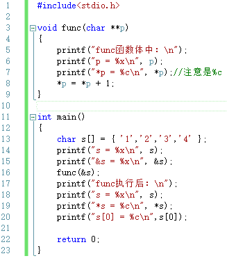 下面是运行结果：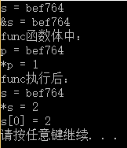 （注：以上是 VS2015 上的测试结果，在其它 IDE 上，结果是一样的）        相信大家和我一样惊讶，&s 不是对 s 取地址吗，怎么&s 和 s 的值是一样的呢？        在 C 语言中，许多连续内存都是用“起始地址+偏移量”的形式表示的，数组就是如此。对 char *s[]={'1','2','3','4'}而言，s 就是首地址，所以 s 本身是 char*类型的。        再说&s，此时，&运算符并不会取 s 得地址，而是从“会意”的角度，对 s 做一种“向上转换”。原来 s 是 char*类型的，指向数组的首元素，现在&s"向上转换"，使得&s 指向了整个数组，所以，&s 的类型是 char(*)[4]。char(*)[4]的意思是：这是一个指针，该指针指向一个有 4 个 char 型元素的数组。&s 指向整个数组，数组往往有不止一个元素，但&s 只能是一个值，那么，这个值该怎么设置呢？C 语言将其设置为数组首元素的地址。没错，**如果 s 是一个一维数组的名称的话，s 与&s 的值是相同的，只不过两者所表示的意义不同，前者表示数组的首元素，后者表示整个数组**。**3.在下的错误**       正是因为&s 的值也是数组首元素的地址，所以 func(&s)传参后，p 的值也是数组首元素的地址，于是*p 的值就是数组首元素的值，执行*p=*p+1 就是对数组首元素加 1，上面的运行结果也说明了这一点。在  2016-04-20 16:24:31 的解释中，由于在下以为&s 得到的是 s 的地址，于是也就认为*p=*p+1 是修改了 s 的值，现在看来，这是完全错误的。巧合的是，正是由于 s[1]=s[0]+1，才使得在下当时没有立即发现错误。**4.编译通不通过的问题**        请广大读者注意，题目给的是 C 代码，所以，我们不要试图把它作为.cpp 文件去编译！        在前面的“2.s 与&s”中说过，&s 是 char(*)[4]类型的。C 编译器要求比较松，允许 char(*)[4]向 char**转换，只不过会给出警告；而 C++编译器要求比较严苛，它不允许 char(*)[4]向 char**转换。下面是在下 2016-04-20 16:24:31 提供的代码作为.c 文件在 VS2015 上编译时给出的警告： warning C4047: “函数”:“char **”与“char (*)[4]”的间接级别不同下面是在下 2016-04-20 16:24:31 提供的代码作为.cpp 文件在 VS2015 上编译时给出的错误提示：错误 C2664“void func(char **)”: 无法将参数 1 从“char (*)[4]”转换为“char **”       好了，该解释的都解释了，对于在下先前所犯的错误给官大读者带来的误导，在下再次表示深深的歉意，万望大家谅解！再次感谢广大读者的批评指正！

编辑于 2016-09-16 20:09:50

* * *

[koei](https://www.nowcoder.com/profile/506907)

改变变量的值，要用指针。
改变指针的值，要用指针的指针。

发表于 2016-07-04 09:23:24

* * *

[嘿大神吖](https://www.nowcoder.com/profile/5022896)

首先，分配一块地址给 char[]=｛'1'，'2'，'3'，'4'｝，s 指向这块地址，且是第一个元素'1'，函数调用使得 p 也指向这块地址，且指向第一个元素'1'，自此 p 和 s 再无联系，但不管谁改变了地址块内容，＊指针取相同地址处值相同。 若＊p=＊p+1，则 p 会改变第一个元素值，＊p=2，＊s=2，且都指向第一个元素.数组变为 char[]=｛'2'，'2'，'3'，'4'｝ 若 p=p+1，会使 p 指向第二个元素'2'，s 还是指向第一个元素'1',＊p=2，*s=1,数组变为 char[]=｛'1'，'2'，'3'，'4'｝ 也就是说 p 通过＊p+N 改变了地址块内数组的值，*s 值会变，但 p 通过 p=p+N 改变了本身的值，只会改变 p 的指向，不会改变 s 及＊s 的值。

编辑于 2018-05-28 03:50:12

* * *

## 29

以下字符串定义与赋值中，正确的是（）

正确答案: D   你的答案: 空 (错误)

```cpp
char s[80] = {"A", "B", "C"}
```

```cpp
char s[80]; s = {'A',  'B', 'C'}
```

```cpp
char s[80]; s = "ABC";
```

```cpp
char s[80] = "ABC";
```

本题知识点

C++ C 语言

讨论

[清澈阳光下，那份笑容](https://www.nowcoder.com/profile/5213124)

*   A：char s[80] = {"A", "B" ,"C"}

后面是对数组元素进行初始化，而每个元素是字符所有应该用单引号。

*   B:char s[80]; s = {'A', 'B','C'}

这个的错误是由于对数组初始化必须在定义的时候，否则不能对数组进行像上面这样的整体赋值，只能对单个元素进行赋值。

*   char s[80]; s = "ABC";

这个的错误原因和 B 类似。

*   char s[80] ="ABC";

发表于 2016-07-13 13:44:42

* * *

[xd321](https://www.nowcoder.com/profile/458899)

字符数组初始化有俩种方法：
1.用字符为数组赋初值，A 选项等式右边所有字符如果使用单引号，则也正确
2.用字符串常量赋初值，即 D 选项，注意字符串用双引号
除此以外，都是错的。

发表于 2016-06-18 20:16:54

* * *

[小刀小刀](https://www.nowcoder.com/profile/671398)

A 的意思是用了三个字符数组初始化显然不对。B 与 C 我认为此时的 s 就是指针了，声明时初始化可以，但是单独再赋值就不对了，让指针的值等于别的值也就出错了，D 正确，字符串本身就是字符数组，赋值没问题

发表于 2016-05-04 00:07:51

* * *

## 30

在 MySQL 中，下列关于触发机器的描述正确的是（）

正确答案: A C   你的答案: 空 (错误)

```cpp
MySQL 的触发器只支持行级出发，不支持语句级触发
```

```cpp
触发器可以调用将数据返回客户端的存储程序
```

```cpp
在 MySQL 中，使用 new 和 old 引用触发器中发生的记录内容
```

```cpp
在触发器中可以使用显示或者隐式方式开始或结束事务的语句
```

本题知识点

数据库

讨论

[day-day-up](https://www.nowcoder.com/profile/720118)

我完美的避开了所有正确答案。。。

发表于 2016-08-18 13:07:54

* * *

[cainiaoed](https://www.nowcoder.com/profile/536714)

 A、 触发程序与表相关，当对表执行 INSERT、DELETE 或 UPDATE 语句时，将激活触发程序。可以将
触发程序设置为在执行语句之前或之后激活。例如，可以在从表中删除每一行之前，或在更新了

要想创建触发程序或舍弃触发程序，可使用 CREATE TRIGGER 或 DROP TRIGGER 语句

B、触发程序不能调用将数据返回客户端的存储程序，也不能使用采用 CALL 语句的动态 SQL

（允许存储程序通过参数将数据返回触发程序）。C、使用 OLD 和 NEW 关键字，能够访问受触发程序影响的行中的列（OLD 和 NEW 不区分大小写）。
在 INSERT 触发程序中，仅能使用 NEW.col_name，没有旧行。在 DELETE 触发程序中，仅能使用
OLD.col_name，没有新行。在 UPDATE 触发程序中，可以使用 OLD.col_name 来引用更新前的某一行的列，也能使用 NEW.col_name 来引用更新后的行中的列。D、 触发程序不能使用以显式或隐式方式开始或结束事务的语句，如 START TRANSACTION、
COMMIT 或 ROLLBACK。

编辑于 2016-04-26 10:13:05

* * *

[请叫我猿叔叔](https://www.nowcoder.com/profile/6316247)

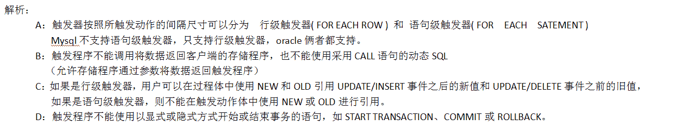

发表于 2016-09-06 20:31:41

* * *

## 31

对于工资表结构如下（员工编号，姓名，部门，工资），如果要对查询的结果按照部门升序与工资降序进行排序，则下列排序正确的是（）

正确答案: B C   你的答案: 空 (错误)

```cpp
order by 部门，工资
```

```cpp
order by 部门，工资 desc
```

```cpp
order by 部门 asc，工资 desc
```

```cpp
order by 部门 desc，工资 desc
```

本题知识点

数据库

讨论

[zhisheng_blog](https://www.nowcoder.com/profile/616717)

**desc 降序，asc 升序，默认是 asc（升序），所以就是 B C 了**

发表于 2016-04-13 16:19:28

* * *

[helloworldzy](https://www.nowcoder.com/profile/812830)

又没注意到多选

发表于 2016-08-11 21:37:39

* * *

[改个名字解解毒...](https://www.nowcoder.com/profile/866538)

select * from tablename order by id desc
:根据 id 字段按照降序排列，从大到小
select * from tablename order by id asc
:根据 id 字段按照升序排列，从小到大

发表于 2017-05-25 19:24:08

* * *

## 32

为了提高数据的查询效率，需要在数据库中建立索引，则下列设计索引的原则描述正确的是（）

正确答案: A B   你的答案: 空 (错误)

```cpp
在频繁进行排序或分组（即进行 group by 或 order by 操作）的列上建立索引
```

```cpp
考虑列中值的分布，列的基数越大，索引的效果越好
```

```cpp
在 select 关键字后选择列表的列上，建立索引
```

```cpp
在表中，索引越多越好
```

本题知识点

数据库

讨论

[牛客 761893 号](https://www.nowcoder.com/profile/761893)

http://blog.itpub.net/29272216/viewspace-1243730/1、   表的某个字段值得离散度越高，该字段越适合选作索引的关键字。主键字段以及唯一性约束字段适合选作索引的关键字，原因就是这些字段的值非常离散。尤其是在主键字段创建索引时， cardinality （基数，集的势）的值就等于该表的行数。 MySQL 在处理主键约束以及唯一性约束时，考虑周全。数据库用户创建主键约束的同时， MySQL 自动创建主索引（ primary index ），且索引名称为 Primary ；数据库用户创建唯一性索引时， MySQL 自动创建唯一性索引（ unique index ），默认情况下，索引名为唯一性索引的字段名。

2、   占用存储空间少的字段更适合选作索引的关键字。例如，与字符串相比，整数字段占用的存储空间较少，因此，较为适合选作索引关键字。

3、   存储空间固定的字段更适合选作索引的关键字。与 text 类型的字段相比， char 类型的字段较为适合选作索引关键字。

4、   Where 子句中经常使用的字段应该创建索引，分组字段或者排序字段应该创建索引，两个表的连接字段应该创建索引。

5、   更新频繁的字段不适合创建索引，不会出现在 where 子句中的字段不应该创建索引。

6、   最左前缀原则。

7、   尽量使用前缀索引。

发表于 2016-04-10 16:41:27

* * *

[请叫我猿叔叔](https://www.nowcoder.com/profile/6316247)

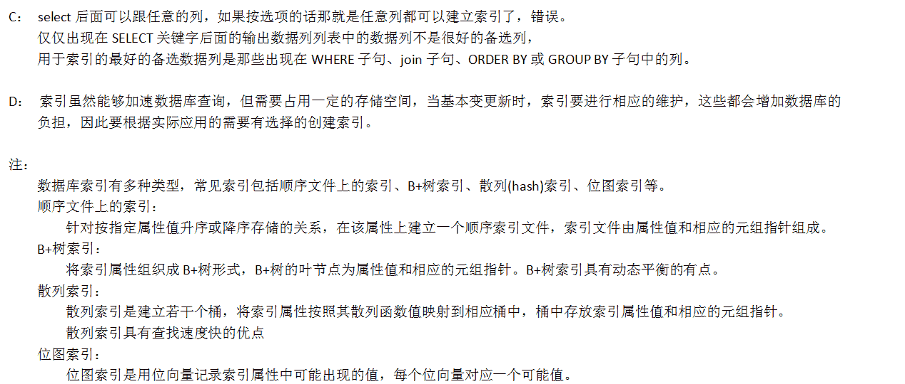

编辑于 2016-09-06 22:08:31

* * *

[石木](https://www.nowcoder.com/profile/9221811)

列的指应改为列的值

发表于 2016-07-19 21:33:36

* * *

## 33

网络地址为 172.16.0.0，采用子网掩码 255.255.224.0 .以下说法正确的是（）

正确答案: C   你的答案: 空 (错误)

```cpp
其中一个子网的广播地址为：172.16.32.255
```

```cpp
其中一个子网的广播地址为：172.16.128.255
```

```cpp
划分了 8 个有效子网
```

```cpp
划分了 6 个有效子网
```

本题知识点

网络基础

讨论

[努力奋斗的摩羯座女孩](https://www.nowcoder.com/profile/197921)

该题应该只有 c 是正确答案。分析：     （1）255.255.224.0 ＝ 11111111 11111111 11100000 00000000 ，所以可以知道这个是个 B 类的网络地址，网络号是 8 位，所有 19-16 ＝ 3 位是用于子网的划分，所以有 2x2x2 ＝ 8 个子网，所以 C 肯定是对的；     （2）一个子网的广播域是后面的主机位全部为 1，即后面的 13 位应该全为 1，相应的八类的网络地址的广播域分别为        172 16 00011111 11111111 ＝  172.16. 31.255         172 16  00111111 11111111 ＝  172.16 .63.255         172 16  01011111 11111111 ＝  172.16. 95.255 172 16  01111111 11111111 ＝  172.16. 127.255          172 16  10011111 11111111 ＝  172.16. 159.255          172 16  10111111 11111111 ＝  172.16. 191.255          172 16  11011111 11111111 ＝  172.16. 223.255          172 16   11111111  11111111 ＝  172.16. 255.255          

发表于 2016-08-10 15:51:29

* * *

[蓬莱小鸟](https://www.nowcoder.com/profile/253599)

有效子网个数 = 子网数 - 2 。原因如下：如果使用零子网 那么要去掉 172.16.0.0 这个子网 因为该 IP 为 172.16.0.0/16 的 网络号还去掉 172.16.224.0 这个子网 因为该子网的广播地址为 172.16.255.255 是 172.16.0.0/16 的广播地址

发表于 2016-06-03 13:48:42

* * *

[不负时光](https://www.nowcoder.com/profile/317111)

仅有 C 对！共有 8 个子网，分别是：172.16.0.0172.16.32.0172.16.64.0172.16.96.0172.16.128.0172.16.160.0172.16.192.0172.16.224.0 广播地址：最后 13 位的主机号全为 1。分别是：172.16.31.255172.16.63.255172.16.95.255172.16.127.255172.16.159.255172.16.191.255172.16.255.255

发表于 2016-04-11 21:49:14

* * *

## 34

对下列常见的各种网络术语描述正确的是（）

正确答案: C D   你的答案: 空 (错误)

```cpp
ADNS 是一种用于 TCP/IP 应用程序的分布式数据库，因此它在 TCP/IP 体系中处于应用层
```

```cpp
TFTP 是一种文件传递应用程序，它使用的传输层协议是 TCP
```

```cpp
Ping 是对两个 TCP/IP 系统连通性进行测试的基本工具，它利用 ICMP 进行基本的请求的应答
```

```cpp
Telnet 是标准的提供远程登录功能的应用，可以在不同 OS 系统的主机之间运行
```

本题知识点

网络基础

讨论

[努力奋斗的摩羯座女孩](https://www.nowcoder.com/profile/197921)

这个有很多确实不太好记。但是，有四个使用的是 TCP，其余的都是 UDP，这四个是：文件传送 FTP，电子邮件 SMTP（simple mail transport protocol），远程终端接入 Telnet，万维网 http。大家一般记住这四个是实用的 TCP

发表于 2016-08-10 15:59:43

* * *

[牛客 823423 号](https://www.nowcoder.com/profile/823423)

```cpp
DNS，Domain Name System 或者 Domain Name Service（域名系统或者余名服务）。域名系统为 Internet 上的主机分配域名地址和 IP 地址。用户使用域名地址，该系统就会自动把域名地址转为 IP 地址。 
ADNS 是硬件防火墙的意思. 
PDNS 本身是一个支持 mysql 数据库的 dns 服务器。

TFTP 使用 UDP
FTP 使用 TCP
```

发表于 2016-04-08 16:04:34

* * *

[鹅是散修](https://www.nowcoder.com/profile/469075)

TFTP 使用 UDP

发表于 2016-05-21 19:06:32

* * *

## 35

Arthur 最近搬到了新的别墅，别墅特别大，原先的桌子显得比较小，所以他决定换一张新的桌子。他买了一张特别大的桌子，桌子是由很多条桌腿进行支撑的，可是回到家之后他发现桌子不稳，原来是桌子腿长度不太相同。他想要自己把桌子修理好，所以他决定移除掉一些桌腿来让桌子变得平稳。桌子腿总共有 n 条腿，第 i 条腿长度为 li，Arthur 移除第 i 桌腿要花费代价为 di。假设 k 条腿桌子平稳的条件:超过一半桌腿能够达到桌腿长度的最大值。例如：一条腿的桌子是平稳的，两条腿的桌子腿一样长时是平稳的。请你帮 Arthur 计算一下是桌子变平稳的最小总代价。

本题知识点

动态规划

讨论

[好学上进](https://www.nowcoder.com/profile/708096)

以题目中的例子说明算法：
2 2 1 1 3 3
4 3 5 5 2 1
首先，按桌腿长度由大到小排序
3 3 2 2 1 1
2 1 4 3 5 5
统计最长桌腿数 m(这里 m=2)，若 m*2>n(n 为桌腿总数，这里 n=6)，则符合要求，不用砍桌腿，否则，有两种决策：
a.不砍这些桌腿，保留它们，“成全”答案，即在剩下的 n-m 条桌腿中保留代价最大的 m-1 条，砍掉其余的 n-m-(m-1)=n-m-m+1 条代价最小的桌腿。
b.砍掉这些最长的桌腿，但剩下的桌腿是否满足要求还不一定，需要重做上述步骤。
       我们发现，方案 a 一定可以让桌子平稳，但是，我们无法保证这样做的代价是最小的，因为如果我们砍掉这些最长桌腿，由剩余桌腿构造出的解的代价（当然要加上这些已经砍掉的最长桌腿的代价）可能更小。所以，我们需要假设砍掉了这些最长桌腿，然后观察剩余桌腿，如果他们还不能使桌子平稳，还得继续进行 a,b 决策，知道我们发现，当前剩余桌腿能够使桌子平稳了。（当然，在这种情况下，如果我们继续砍桌腿，还可能出现新的解，但这些解是在已有解的基础上再砍桌腿造成的，成本必然增加，所以，只要我们明确已经“砍出”一个解了，就不必再继续算下去了）
对于上例，我们先砍掉最长的桌腿，代价 delete_cost=2+1=3，同时，更新桌腿总数 n=n-m=6-2=4。
然后，对剩余桌腿按照代价由小到大排序，如下
2 2 1 1
3 4 5 5
然后统计前 n-m+1(由于前面已经更新了总桌腿数 n，所以这里是 n-m+1 而不是 n-m-m+1)条桌腿的代价 result_cost=3+4+5=12
这个 result_cost 对应的就是答案
1 3 3
5 2 1
的代价，即我们前边说的保留桌腿，“成全”答案的代价。
我们发现，无论是否保留最长桌腿，在实际编程时，都可以“真的”砍掉最长桌腿，因为计算保留它们，“成全”答案的这种情况的代价时，并不需要最长桌腿的代价。
这里，我们记着将 result_cost 与 min_cost（min_cost 初始化为一个很大的数，如 1000000）相比较，若 result_cost<min_cost，则执行 min_cost=result_cost 刷新 min_cost，以保证 min_cost 保存的是当前的最小代价。这里，min_cost 被更新为 12。
接着，对砍掉最长桌腿的剩余桌腿再按照桌腿长度由大到小排序，如下
2 2 1 1
3 4 5 5
此时，m=2，n=4，m*2>n 仍然不满足，于是再将 2 2 砍掉，delete_cost=3+3+4=10(第一个 3 是上次砍掉 3 3 时的代价，注意，delete_cost 需要累加上次的 delete_cost，因为本次砍桌腿是在砍掉前边那些桌腿的基础上砍的)，然后更新 n，n=n-m=4-2=2
然后，再将剩余桌腿按照代价由小到大排序，有
1 1
5 5
再计算前 n-m+1=2-2+1=1 条桌腿的代价，result_cost=3+5=8，注意，砍掉 1 这条桌腿，是在上一轮砍掉 3 3 这两条桌腿上做的，所以，
result_cost 也要累加上次的 delete_cost。这里，result_cost=8 对应的答案是：砍掉
3 3 1
2 1 5
剩下
2 2 1 <-----------------------------------------这就是当前答案
3 4 5
的情况。
由于 8<12，所以将 min_cost 更新为 8。
接着，对砍掉最长桌腿的剩余桌腿再按照桌腿长度由大到小排序，如下
1 1
5 5
此时，m=2，n=2，满足 m*2>n，所以
1 1
5 5
也是一个答案，它对应的代价就是当前已经砍掉的所有的桌腿的代价，就是当前的 delete_cost 值，这里就是 10。
因为条件 m*2>n 已经满足，所以不需要继续往下算了。
此时，一共有两个代价，一个是所有“保留长腿，成全答案”的情况中的最小代价，就是 nim_cost 的值，另一个是依次砍掉最长桌腿，直到出现满足要求的解的代价，就是 delete_cost 的值，所以，我们最后比较这两个值，输出小者，程序结束。
本例中，min_cost=8，delete_cost=10，所以我们输出 8，这就是代价最小的解，它对应的情况是：砍掉
3 3 1
2 1 5
剩下
2 2 1
3 4 5
的情况。

下面给出具体算法：
a.初始化：int del_cost = 0, res_cost = 0, min_cost = 10000000;；
b.将桌腿按长度由大到小排序，统计最长桌腿数 m，若 m*2>n，输出 min_cost 和 del_cost 中的小者，否则，令 tempcost=del_cost;
   del_cost=del_cost+m 个最长桌腿数的代价;n=n-m;；
c.对除去最长桌腿的剩余桌腿按代价由小到大排序，统计前 n-m+1 个代价的和 summincost，令 res_cost=temp+summincost;，若 res_cost<min_cost，则 min_cost=res_cost;，最后，返回到步骤 b。

最后，给出具体实现代码：

```cpp
#include <iostream>
#include<vector>
#include<algorithm>

using namespace std;

struct Leg
{
	int len;
	int cost;
	Leg(int _len, int _cost)
	{
		len = _len;
		cost = _cost;
	}
};

bool comlen(Leg legi, Leg legj)
{
	return (legi.len > legj.len);
}
bool comcost(Leg legi, Leg legj)
{
	return (legi.cost < legj.cost);
}

int main(void)
{
	vector<Leg> someleg;
	vector<int>saveid;
	vector<int> ltemp;
	vector<int> ctemp;
	int n;
	while (cin >> n)
	{
		for (int i = 0; i < n; i++)//输入桌腿长度
		{
			int a;
			cin >> a;
			ltemp.push_back(a);
		}
		for (int i = 0; i < n; i++)//输入拆桌腿的代价
		{
			int b;
			cin >> b;
			ctemp.push_back(b);
		}
		for (auto it = ltemp.begin(), itt = ctemp.begin(); it != ltemp.end() && itt != ctemp.end(); ++it, ++itt)//构造桌腿结构体
		{
			Leg leg(*it, *itt);
			someleg.push_back(leg);
		}
		int del_cost = 0, res_cost = 0, min_cost = 10000000;
		while (true)
		{
			std::sort(someleg.begin(), someleg.end(), comlen);//按桌腿长度从大到小排序
			int m = 0;
			int tlen = someleg[0].len;
			for (auto it = someleg.begin(); it != someleg.end(); ++it)//找出最大长度的桌腿的个数
			{
				if (tlen == it->len)
				{
					++m;
				}
				else
				{
					break;
				}
			}
			if (m * 2 > n)
			{
				int mincost = del_cost < min_cost ? del_cost : min_cost;
				cout << mincost << endl;
				break;
			}
			else
			{
				int tempcost = del_cost;
				int tcost = 0;
				for (int i = 0; i < m; i++)//计算出拆除最大长度的桌腿的代价
				{
					tcost += someleg[i].cost;
				}
				del_cost += tcost;
				someleg.erase(someleg.begin(), someleg.begin() + m);//拆掉最长桌腿
				n -= m;
				std::sort(someleg.begin(), someleg.end(), comcost);//剩余桌腿按代价由小到大排序
				int summincost = 0;

				for (int i = 0; i < n - m + 1; i++)//如果保留那 cnt 个最长的桌腿，就必须拆除 n-cnt-(cnt-1)个短桌腿，由于前边已经有了 n-=cnt，所以
				{                                //这里只需 n-cnt+1，为保证代价最小，必须拆除代价最小的 n-cnt+1 条桌腿
					summincost += someleg[i].cost;
				}
				res_cost = summincost + tempcost;
				if (res_cost < min_cost)
				{
					min_cost = res_cost;
				}
			}
		}
	}
	return 0;
}

```

发表于 2016-04-21 10:15:54

* * *

[牛客 618824 号](https://www.nowcoder.com/profile/618824)

```cpp
大体思路是把先把输入的腿长映射到一个 106 维的腿长数目数组，数组中的值为对应腿长的的数目。然后从后往前遍历
没碰到一个腿长，将比他高的腿长砍掉，同时计算还需要砍多少桌腿，对剩余的桌腿排序砍掉对应部分，然后计算最小值。
#include<iostream>
#include<vector>
#include<algorithm>
using namespace std;

int main()
{
    int n;
    while(cin>>n)
    {
        vector<int >l,d,d_cut;
        int a[106]={0};
        int li,di;
        for(int i=0;i<n;i++)
        {
            cin>>li;
            l.push_back(li);
            a[li]++;
        }
        int minCost=0;
        for(int i=0;i<n;i++)
        {
            cin>>di;
            d.push_back(di);
            minCost+=di;
        }
        for(int i=105;i>0;i--)
        {
            int cost=0; 
            d_cut.clear();
            if(a[i])
            {
                int cutLegNum=l.size()-a[i];
                for(int j=i+1;j<=105;j++)
                {
                    cutLegNum-=a[j];
                }
                cutLegNum-=(a[i]-1);
                for(int k=0;k<n;k++)
                {
                    if(l[k]<i)
                        d_cut.push_back(d[k]);
                    if(l[k]>i)
                        cost+=d[k];
                }
                if(cutLegNum>0)
                {
                    sort(d_cut.begin(),d_cut.end()); 
		    for (int k = 0; k <cutLegNum; k++)
                        cost+=d_cut[k];
                    if(cost<minCost)
                        minCost=cost;
                }      
            }
        }
        cout<<minCost<<endl;
    }
    return 0;  
}

```

发表于 2016-04-12 11:43:30

* * *

[helloc12](https://www.nowcoder.com/profile/188312)

个人思路：另外增加一个数组用于保存已排序的腿长数组 A，从最长腿至最短腿遍历计算代价值，计算分一下步骤：1.指定腿长 len
2.查找指定腿长在已排序数组中的两端位置（有重复腿长）3.确定小于该腿长的桌腿应除去的数量即：n=2*front-back（可以画个图自己算一下------****-------）4.把小于 len 的腿长排序，取前 n 个将代价累加到 sum5.把大于 len 的腿长代价累加 sum，得到一次计算的结果抛砖引玉，自己写得比较繁琐，图省事也没处理重复腿长计算              #include "iostream"#include "algorithm"#include "vector"using namespace std;int num;int findBack(int *arr,int id){    for(int i=num-1;i>=0;i--){        if(arr[i]==id)return i;    }    return -1;}int findFront(int *arr,int id){    for(int i=0;i<num;i++){        if(arr[i]==id)return i;    }    return -1;}int calMin(int *pL,int *pD,int *pS,int i){    if(i==1)return -1;    int len=pS[i];    int back=findBack(pS,len);    int front=findFront(pS,len);    int rmvElse=2*front-back; //    vector<int> vec;    for(int i=0;i<num;i++){        if(pL[i]<len){            vec.push_back(pD[i]);        }    }    sort(vec.begin(),vec.end());    //sort    int sum=0;    for(int i=0;i<rmvElse;i++){        sum=sum+vec[i];    }    for(int i=0;i<num;i++){        if(pL[i]>len)sum+=pD[i];    }    return sum;}int findMin(int *pL,int *pD,int *pS){    int i=num-1;    int min=100000;    while(1){        int res=calMin(pL,pD,pS,i);        //cout<<res<<" ";        if(res==-1)break;        if(res<min)min=res;        i--;    }    return min;}int main(){    cin>>num;    int pL[num],pD[num],pS[num];    for(int i=0;i<num;i++){        cin>>pL[i];        pS[i]=pL[i];    }    for(int i=0;i<num;i++)cin>>pD[i];    sort(pS,pS+num);    int ans=findMin(pL,pD,pS);    cout<<ans<<endl;    return 0;}

发表于 2016-04-10 19:36:37

* * *

## 36

现有一个 n 个整数的序列，你要做的就是交换两个数的位置直到整个序列按照升序排列，那么将这个整数序列排好序，需要交换多少次？例如，1，2，3，5，4，我们只需要交换一次，即将 5 和 4 交换即可。

本题知识点

动态规划

讨论

[好学上进](https://www.nowcoder.com/profile/708096)

 冒泡排序的变相考察。需要说明的是，题目出得不够严谨，应将“交换两个数的位置”明确为“交换相邻两个数的位置”。下面给出代码：

```cpp
#include <iostream>
#include<vector>
#include<algorithm>

using namespace std;

int main(void)
{
    int n;
    while (cin>>n)
    {
        int* arr = new int[n];
        for (int i = 0; i < n; i++)
        {
            cin >> arr[i];
        }
        int count = 0;
        bool flag = true;
        for (int i = n-1; i >0; --i)
        {
            if (flag==false)
            {              
                break;
            }
            flag = false;
            for (int j = 0; j < i; j++)
            {
                if (arr[j]>arr[j+1])
                {
                    std::swap(arr[j], arr[j + 1]);
                    ++count;
                    flag = true;
                }
            }
        }
        cout << count << endl;
        delete[] arr;
    }
    return 0;
}

```

发表于 2016-04-21 21:46:09

* * *

[良哥](https://www.nowcoder.com/profile/491039)

importjava.util.Scanner;publicclassMain{    publicstaticvoidmain(String[] args){        Scanner sc =newScanner(System.in);        intN = sc.nextInt();        int[] a =newint[N];        for(inti=0;i<N;i++){            a[i]= sc.nextInt();        }        intcount =0;        inttemp =0;        for(inti =0;i<N-1;i++){            for(intj=0;j<N-1-i;j++){                if(a[j+1]<a[j]){                    temp= a[j];                    a[j]=a[j+1];                    a[j+1]=temp;                    count++;                }            }        }        System.out.println(count);    }}就是冒泡交换的次数，每次把最大的值放在最后；题目意思应该是每次只能相邻的交换，所以冒泡交换的次数就是最后的结果

发表于 2016-04-24 17:08:35

* * *

[七月牧夫](https://www.nowcoder.com/profile/611841)

```cpp
#include<iostream>
using namespace std;

int main()
{
    int num;
    while (cin >> num){
        int a[1000],tem,total=0;
        for (int i = 0; i < num; i++) cin >> a[i];
        int *p = a;
        for (int i = 0; i < num; i++){
            for (int j = 0; j<(num-1); j++){
                if (*p>*(p + 1)){
                    tem = *p;
                    *p = *(p + 1);
                    *(p + 1) = tem;
                    total++;
                }
                p++;
            }
            p = a;
        }
        cout << total << endl;
   }
    return 0;
}//恢复有序状态，统计交换次数
```

发表于 2016-08-28 21:17:05

* * ****