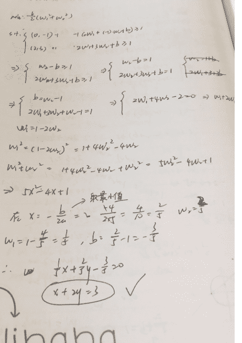
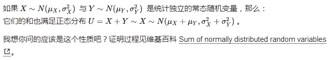
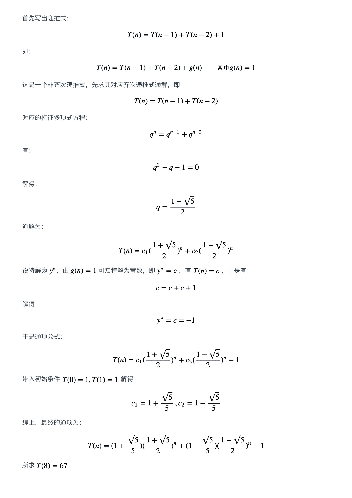
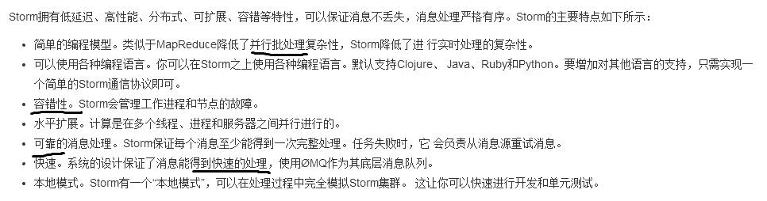
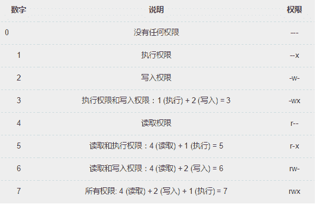
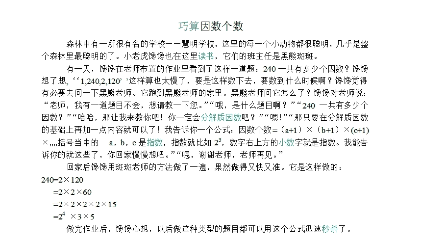

# 京东 2016 算法工程师笔试题

## 1

若 k 为整形,下述 while 循环的次数为:()

```cpp
int k=1000;
while (k > 1)
{ 
	printf("%d\n", k);
	k = k / 2;
}
```

正确答案: D   你的答案: 空 (错误)

```cpp
1000
```

```cpp
10
```

```cpp
11
```

```cpp
9
```

本题知识点

运营 京东 2016 算法工程师 C 语言

讨论

[C-jonn](https://www.nowcoder.com/profile/2935763)

当 k>1 时继续执行 k/=2；只需要将 1000 的二进制 11 1110 1000 每次右移一位，直到 00 0000 0011 时，计算总共右移了 9 位，，

发表于 2017-07-19 22:17:16

* * *

[jack2723186855](https://www.nowcoder.com/profile/4747710)

坑在 K 为整形

发表于 2016-09-02 22:33:26

* * *

[Pandora](https://www.nowcoder.com/profile/266279)

9<log2>发表于 2016-04-16 10:05:18

* * *

## 2

基于二次准则函数的 H-K 算法较之于感知器算法的优点是()?

正确答案: B D   你的答案: 空 (错误)

```cpp
计算量小
```

```cpp
可以判别问题是否线性可分
```

```cpp
其解完全适用于非线性可分的情况
```

```cpp
其解的适应性更好
```

本题知识点

机器学习 运营 京东 2016 算法工程师

讨论

[遛牛虻](https://www.nowcoder.com/profile/798214)

HK 算法思想很朴实,就是在最小均方误差准则下求得权矢量.
他相对于感知器算法的优点在于,他适用于线性可分和非线性可分得情况,对于线性可分的情况,给出最优权矢量,对于非线性可分得情况,能够判别出来,以退出迭代过程.

发表于 2016-04-25 21:04:38

* * *

[长 rourou 了](https://www.nowcoder.com/profile/7526136)

不应该是 B D 吗？

发表于 2016-09-04 21:28:29

* * *

[15510970069](https://www.nowcoder.com/profile/6998450)

综合各路解答来看，参考[`blog.csdn.net/momaojia/article/details/75098389`](https://blog.csdn.net/momaojia/article/details/75098389)：1.感知机可以理解为最简单的神经网络，对权重的更新仅依靠阈值 2. delta 法则（又叫增量法则， LMS 法则，Adaline 法则，Windrow-Hoff 法则）或者这里的 H-K（LSME 法则），就是感知机为解决非线性训练样本问题的变种，也即我们常见的平方误差损失函数或均方误差损失函数代替阈值来更新权重 3\. 至于答案则只能记住

发表于 2018-04-09 16:46:55

* * *

## 3

在统计模式识分类问题中，当先验概率未知时，可以使用()?

正确答案: B C   你的答案: 空 (错误)

```cpp
最小损失准则
```

```cpp
N-P 判决
```

```cpp
最小最大损失准则
```

```cpp
最小误判概率准则
```

本题知识点

机器学习 运营 京东 2016 算法工程师

讨论

[牛客 128972 号](https://www.nowcoder.com/profile/128972)

在贝叶斯决策中，对于先验概率 p(y)，分为已知和未知两种情况。1\. p(y)已知，直接使用贝叶斯公式求后验概率即可；2\. p(y)未知，可以使用**聂曼-皮尔逊决策(N-P 决策)**来计算决策面。而**最大最小损失规则**主要就是使用解决**最小损失规则**时先验概率未知或难以计算的问题的。

发表于 2016-07-11 20:58:57

* * *

[零下异度](https://www.nowcoder.com/profile/2981615)

选项 A         最小损失准则中需要用到先验概率选项 B 在贝叶斯决策中，对于先验概率 p(y)，分为已知和未知两种情况。1\. p(y)已知，直接使用贝叶斯公式求后验概率即可；2\. p(y)未知，可以使用聂曼-皮尔逊决策(N-P 判决)来计算决策面。聂曼-皮尔逊决策（N-P 判决）可以归结为找阈值 a，即：

*   如果 p（x|w[1]）/p（x|w[2]）>a，则 x 属于 w[1；]
*   如果 p（x|w[1]）/p（x|w[2]）<a，则 x 属于 w [[2；]]

选项 C         待补充选项 D         待补充

发表于 2017-05-01 15:40:32

* * *

[大耳朵刘备](https://www.nowcoder.com/profile/1251796)

B 对的话，A 不也是对的？求解释

发表于 2017-03-08 21:19:06

* * *

## 4

线面函数可以作为聚类分析中的判别函数的有?

正确答案: B C   你的答案: 空 (错误)

本题知识点

运营 京东 2016 算法工程师

讨论

[老子是帮主](https://www.nowcoder.com/profile/284321)

聚类分析的判别函数当然是希望簇间距离越大越好，簇内距离越小越好，
B 项中 c 应该是代表 cluster 的数目，ni 代表第 i 个簇中样本数目，向量 mi 代表的是第 i 个簇中的簇中心点，xi 为样本，所以公式的含义是各个簇中的样本到簇中心点的距离之和，这个值当然是越小越好；
C 项中 mj 向量应该表示的是第 j 个簇的簇中心店，m 向量应该表示的是所有簇中心点的中心点，公式的含义应该是所有簇中心点到各个簇中心点的中心点的距离，这个距离显然是越大越好，表示各个簇之间的距离较大；
A 和 D 中的 Sw 应该表示的是内类散度矩阵,w 代表 within，Sb 代表的是类间散度矩阵，b 代表 between，这两个矩阵乘积后不管是求秩还是求行列式都不能反应聚类的情况。

编辑于 2018-04-10 13:00:09

* * *

[Forrestcloud](https://www.nowcoder.com/profile/3410196)

B:聚类簇内距离越小越好 C:聚类簇间距离越大越好

发表于 2017-09-06 20:39:04

* * *

[CheneyShen](https://www.nowcoder.com/profile/9667425)

LDA 算法吗？

发表于 2017-08-11 23:41:06

* * *

## 5

在()情况下,用分支定界法做特征选择计算量相对较少?

正确答案: B D   你的答案: 空 (错误)

```cpp
选用的可分性判据 J 具有可加性
```

```cpp
选用的可分性判据 J 对特征数目单调不减
```

```cpp
样本较多
```

本题知识点

机器学习 运营 京东 2016 算法工程师

讨论

[小牛励志要当牛魔王](https://www.nowcoder.com/profile/7462798)

不知道题目的考点在哪里 机器学习考点有些偏

发表于 2018-07-19 12:37:41

* * *

[小小年纪不学](https://www.nowcoder.com/profile/9246854)

这是运筹学的？？这考题跨越运筹学、统计学、数据结构、深度学习、随机过程、时间序列。。我都要爆炸了。

发表于 2018-09-05 21:55:21

* * *

[SimthYao](https://www.nowcoder.com/profile/526053)

分支定界法类似决策树的决策特征，要选择那些具有强可分辨性的少量特征。

发表于 2016-05-28 21:21:21

* * *

## 6

以下()属于线性分类器最佳准则?

正确答案: A C D   你的答案: 空 (错误)

```cpp
感知准则函数
```

```cpp
贝叶斯分类
```

```cpp
支持向量机
```

```cpp
Fisher 准则
```

本题知识点

机器学习 运营 京东 2016 算法工程师

讨论

[赵子龙](https://www.nowcoder.com/profile/730218)

线性分类器有三大类：感知器准则函数、SVM、Fisher 准则，而贝叶斯分类器不是线性分类器。感知器准则函数：代价函数 J=-(W*X+w0)，分类的准则是最小化代价函数。感知器是神经网络（NN）的基础，网上有很多介绍。SVM：支持向量机也是很经典的算法，优化目标是最大化间隔（margin），又称最大间隔分类器，是一种典型的线性分类器。（使用核函数可解决非线性问题）Fisher 准则：更广泛的称呼是线性判别分析（LDA），将所有样本投影到一条远点出发的直线，使得同类样本距离尽可能小，不同类样本距离尽可能大，具体为最大化“广义瑞利商”。贝叶斯分类器：一种基于统计方法的分类器，要求先了解样本的分布特点（高斯、指数等），所以使用起来限制很多。在满足一些特定条件下，其优化目标与线性分类器有相同结构（同方差高斯分布等），其余条件下不是线性分类。参考：http://blog.163.com/rustle_go_go/blog/static/20294501420122110431306/

发表于 2016-04-20 15:09:59

* * *

[🔍搜索 offer 中](https://www.nowcoder.com/profile/7482002)

线性分类器**三种**最优准则： 

**Fisher** **准则** ：根据两类样本一般类内密集，类间分离的特点，寻找线性分类器最佳的法线

向量方向，使两类样本在该方向上的投影满足类内尽可能密集，类间尽可能分开。这种度量通过类内离散矩阵 Sw 和类间离散矩阵 Sb 实现。

**感知准则函数** ：准则函数以使错分类样本到分界面距离之和最小为原则。

 其优点是通过错分类样本提供的信息对分类器函数进行修正，这种准则是人工神经元

网络多层感知器的基础。 

**支持向量机** ：基本思想是在两类线性可分条件下，所设计的分类器界面使两类之间的

间隔为最大，它的基本出发点是使期望泛化风险尽可能小。

发表于 2016-10-07 20:38:59

* * *

[聆听几点几](https://www.nowcoder.com/profile/5404761)

线性分类器有三大类：感知器准则函数、SVM、Fisher 准则，而贝叶斯分类器不是线性分类器

发表于 2016-09-05 21:25:09

* * *

## 7

有两个样本点，第一个点为正样本,它的特征向量是(0,-1);第二个点为负样本,它的特征向量是(2,3),从这两个样本点组成的训练集构建一个线性 SVM 分类器的分类面方程是()

正确答案: C   你的答案: 空 (错误)

```cpp
2x+y=4
```

```cpp
x+2y=5
```

```cpp
x+2y=3
```

```cpp
以上都不对
```

本题知识点

机器学习 运营 京东 2016 算法工程师

讨论

[精灵鼠](https://www.nowcoder.com/profile/470415)

首先确定这题出错了，应该是(0,-1)是负样本，(2,3)是正样本，因为必须满足约束条件，（看了好多人解析求斜率过中点求出来的都是碰巧的，之前的答案是 C 选项此时应该将正负样本颠倒就是这个答案：x+2y=3，但不改的话就是 D，已提交反馈给官网订正）于是必须满足：min  1/2(w[1]²+w[2]²)s.t.   -1*(0*w[1]-1*w[2]+b)>=11*(2*w[1]+3*w[2]+b)>=1 这样联立方程组可以解出 w[1]=1/5，w[2]=2/5，b= -3/5，所以就是答案三

编辑于 2017-08-25 09:12:46

* * *

[666 的佩奇爸爸](https://www.nowcoder.com/profile/7670357)


发表于 2018-09-05 20:55:08

* * *

[宋化志](https://www.nowcoder.com/profile/3144287)

SVM 分类面即是最大分割平面，求斜率：-1/[(y1-y2)/(x1-x2)]=-1/[(3-(-1))/(2-0)]=-1/2 求中点：((x1+x2)/2,(y1+y2)/2)=((0+2)/2, (-1 + 3)/2)=(1, 1)最后表达式：x+2y=3\.

发表于 2017-07-10 20:40:44

* * *

## 8

```cpp

```
byte b1=1,b2=2,b3,b6,b8;
```cpp

final byte b4=4,b5=6,b7;
b3=(b1+b2);  /*语句 1*/
b6=b4+b5;    /*语句 2*/
b8=(b1+b4);  /*语句 3*/
b7=(b2+b5);  /*语句 4*/
System.out.println(b3+b6);
```

下列代码片段中，存在编译错误的语句是()

正确答案: B C D   你的答案: 空 (错误)

```cpp
语句 2
```

```cpp
语句 1
```

```cpp
语句 3
```

```cpp
语句 4
```

本题知识点

Java

讨论

[Pandora](https://www.nowcoder.com/profile/266279)

本题答案应为：B、C、D  查看全部)

编辑于 2016-11-23 23:36:36

* * *

[追风筝的人](https://www.nowcoder.com/profile/313935)

B、C、D 一、关于 final 的重要知识点;1、final 关键字可以用于成员变量、本地变量、方法以及类。2、 final 成员变量必须在声明的时候初始化或者在构造器中初始化，否则就会报编译错误。3、 你不能够对 final 变量再次赋值。4、 本地变量必须在声明时赋值。5、 在匿名类中所有变量都必须是 final 变量。6、 final 方法不能被重写。7、 final 类不能被继承。8、 没有在声明时初始化 final 变量的称为空白 final 变量(blank final variable)，它们必须在构造器中初始化，或者调用 this()初始化。不这么做的话，编译器会报错“final 变量(变量名)需要进行初始化”。二、数据类型转换当使用 +、-、*、/、%、运算操作是，遵循如下规则： 只要两个操作数中有一个是 double 类型的，另一个将会被转换成 double 类型，并且结果也是 double 类型，如果两个操作数中有一个是 float 类型的，另一个将会被转换为 float 类型，并且结果也是 float 类型，如果两个操作数中有一个是 long 类型的，另一个将会被转换成 long 类型，并且结果也是 long 类型，否则（操作数为：byte、short、int 、char），两个数都会被转换成 int 类型，并且结果也是 int 类型。 语句 1  :（b1 + b2） 被转换为 int 类型 但是 b3 仍为 byte ，所以出错 要么将 b3 转化为 int 要么将（b1 + b2） 强制转换为 byte 类型。所以语句 1 错误。语句 2：b4 、b5 被声明 final 所以类型是不会转换， 计算结果任然是 byte  ，所以 语句 2 正确。语句 3：(b1 + b4)  结果仍然转换成 int  所以语句 3 错误。语句 4 : (b2 + b5)  结果仍然转换为 int ， 所以语句 4 错误。

编辑于 2017-08-26 17:41:54

* * *

[刘提莫](https://www.nowcoder.com/profile/182927)

这是 C++？

发表于 2016-04-28 23:47:16

* * *

## 9

SecondNamenode 的正确描述是()

正确答案: B D   你的答案: 空 (错误)

```cpp
与 NameNode 一样同时对外提供服务,减轻 NameNode 的压力,如果 NameNode 意外终止,SecondaryNameNode 会接替它使集群继续工作
```

```cpp
SecondNamenode 会周期地进行 fsimage 文件的合并,防止 edits 文件过大,导致 Namenode 启动时间过长,应该与 Namenode 部署到不同节点上
```

```cpp
SecondNamenode 会周期地进行 fsimage 文件的合并,防止 edits 文件过大,导致 Namenode 启动时间过长,应该与 Namenode 部署到同一个节点上
```

```cpp
SecondNamenode 是对主 Namenode 的一个补充,对内存的需求和 Namenode 相同
```

本题知识点

Hadoop/Spark 运营 京东 2016 算法工程师

讨论

[赵广军](https://www.nowcoder.com/profile/8248421)

没有用过 Hadoop 的,真的不知道这里在讲什么!!

发表于 2016-09-04 21:28:04

* * *

[鹤舞青春 1002](https://www.nowcoder.com/profile/501357)

SecondNamenode 是对主 Namenode 的一个补充，它会周期的执行对 HDFS 元数据的检查点。
当前的设计仅仅允许每个 HDFS 只有单个 SecondNamenode 结点。
SecondNamenode 是有一个后台的进程，会定期的被唤醒（唤醒的周期依赖相关配置）执行检查点任务，然后继续休眠。
它使用 ClientProtocol 协议与主 Namenode 通信。**SecondNamenode 最好与 Namenode 部署到不同的服务器(** 应该在 merge 的过程中，SecondNamenode 对内存的需求与 Namenode 是相同的，所以对于那些 **大型的生产系统** 中，如果将两者部署 到同台服务器 上，在 内存上会出现 瓶颈。)

编辑于 2016-06-06 20:02:59

* * *

[林大大](https://www.nowcoder.com/profile/906588)

SecondaryNameNode 是 NameNode 的**冷备份** ，如果 NameNode 意外终止，需要人工切换。SecondaryNameNode 负责合并 fsimage 和 fsedits 然后再发给 namenode。定时默认 1 小时，从 namenode 上，获取 fsimage 和 edits 来进行合并，然后再发送给 namenode。减少 namenode 的工作量。应该将 SecondaryNamenode 配置在另外一台机器上运行：1、可扩展性。2、容错性。

发表于 2016-09-04 14:28:36

* * *

## 10

假设 x1 和 x2 是两个以 0 为均值,1 为标准差的正态分布,那么 x1+x2 的概率密度分布是()?

正确答案: B   你的答案: 空 (错误)

```cpp
以 0 为均值,2 为标准差的正态分布
```

```cpp
以 0 为均值,sqrt(2)为标准差的正态分布
```

```cpp
以 0 为均值,1 为标准差的正态分布
```

```cpp
以 0 为均值,sqrt(2)/2 为标准差的正态分布
```

本题知识点

概率统计 *运营 京东 2016 算法工程师 京东 2016* *讨论

[时间妖](https://www.nowcoder.com/profile/464952)

B 若 x1 与 x2 相互独立，则：E(x1+x2) = E(x1)+E(x2) = 0 则方差：Var(x1+x2) = Var(x1)+Var(x2) = 2 由于，标准差 = sqrt(方差)故为，sqrt(2)

发表于 2016-04-14 17:05:11

* * *

[周卫林](https://www.nowcoder.com/profile/121024)

[`en.wikipedia.org/wiki/Sum_of_normally_distributed_random_variables`](https://en.wikipedia.org/wiki/Sum_of_normally_distributed_random_variables)

发表于 2017-09-06 17:51:21

* * *

[暴躁牛友](https://www.nowcoder.com/profile/3525832)

这里不严谨，一定要说明 x1 和 x2 独立才可以得到答案，这里缺少了独立的条件，按道理是没有答案的

发表于 2019-04-12 11:52:15

* * *

## 11

```cpp
#include <stdio.h>
int cnt = 0;
int fib(int n) {
    cnt++;
    if (n == 0)
        return 1;
    else if (n == 1)
        return 2;
    else
        return fib(n - 1) + fib(n - 2);
}
void main() {
    fib(8);
    printf("%d", cnt);
}

```

下列程序执行后,输出的结果为()

正确答案: B   你的答案: 空 (错误)

```cpp
41
```

```cpp
67
```

```cpp
109
```

```cpp
177
```

本题知识点

运营 京东 2016 算法工程师 C 语言

讨论

[lonelylsy](https://www.nowcoder.com/profile/556225)

n=0 和 n=1 时均计算一次，  查看全部)

编辑于 2016-10-09 11:00:37

* * *

[蓝夕](https://www.nowcoder.com/profile/219679)

这其实可以看做斐波那契数列的变形，相当于从第 3 个数开始，这个数等于前面两个之和加 1.由于是从 0 开始，所以要数 9 个数：1，1，3，5，9，15，25，41，67

发表于 2016-04-28 22:51:46

* * *

[YaoC](https://www.nowcoder.com/profile/5743955)

本题递推很容易求出答案，这里再提供一种通过求解析解得到答案的方法 

发表于 2017-03-13 22:17:23

* * *

## 12

下面关于 Hive 的说法正确的是()

正确答案: A D   你的答案: 空 (错误)

```cpp
Hive 是基于 Hadoop 的一个数据仓库工具,可以将结构化的数据文本映射为一张数据库表,并提供简单的 SQL 查询功能
```

```cpp
Hive 可以直接使用 SQL 语句进行相关操作
```

```cpp
Hive 能够在大规模数据集上实现低延迟快速的查询
```

```cpp
Hivez 在加载数据过程中不会对数据进行任何的修改,只是将数据移动到 HDFS 中 Hive 设定的目录下
```

本题知识点

Hadoop/Spark 运营 京东 2016 算法工程师

讨论

[foreverfruit](https://www.nowcoder.com/profile/888998)

Hive 使用类 sql 语句进行相关操作，称为 HQL，它允许熟悉 SQL 的用户查询数据。同时，这个语言也允许熟悉 MapReduce 开发者的开发自定义的 mapper 和 reducer 来处理内建的 mapper 和 reducer 无法完成的复杂的分析工作。Hive 构建在基于静态批处理的 Hadoop 之上，Hadoop 通常都有较高的延迟并且在作业提交和调度的时候需要大量的开销。因此，Hive 并不能够在大规模数据集上实现低延迟快速的查询，例如，Hive 在几百 MB 的数据集上执行查询一般有分钟级的时间延迟。Hive 并不适合那些需要低延迟的应用，例如，联机事务处理（OLTP）。Hive 查询操作过程严格遵守 Hadoop MapReduce 的作业执行模型，Hive 将用户的 HiveQL 语句通过解释器转换为 MapReduce 作业提交到 Hadoop 集群上，Hadoop 监控作业执行过程，然后返回作业执行结果给用户。Hive 并非为联机事务处理而设计，Hive 并不提供实时的查询和基于行级的数据更新操作。Hive 的最佳使用场合是大数据集的批处理作业，例如，网络日志分析。
转自 http://blog.csdn.net/wangyang1354/article/details/50570903

发表于 2016-04-26 21:20:43

* * *

[13579](https://www.nowcoder.com/profile/9932177)

如果要说 B 不对的话：直接改为间接吧，底层走的，还是 MapReduce 任务 HiveSQL ->AST(抽象语法树：完成 SQL 词法，语法解析，将 SQL 转化为抽象 语法树 AST Tree；) -> QB(查询块) ->OperatorTree（操作树）->优化后的操作树->mapreduce 任务树->优化后的 mapreduce 任务树

发表于 2018-09-12 22:16:16

* * *

## 13

关于 input split 和 block 的描述正确的是()

正确答案: B   你的答案: 空 (错误)

```cpp
Mapreduce 的 input split 就是一个 block
```

```cpp
input split 是一种记录的逻辑划分,而 block 是对输入数据的物理分割,两者之间有着本质的区别
```

```cpp
由于 Block 是本地的,DFSCline 可以不用向 DataNode 建立连接,直接读磁盘上的文件
```

```cpp
为了发挥计算本地化性能,应该尽量使 inputSplit 大小与 block 大小相当
```

本题知识点

Hadoop/Spark 运营 京东 2016 算法工程师

讨论

[鹤舞青春 1002](https://www.nowcoder.com/profile/501357)

1\. 一个 split 不会包含零点几或者几点几个 Block，一定是包含大于等于 1 个整数个 Block
2\. 一个 split 不会包含两个 File 的 Block,不会跨越 File 边界
3\. split 和 Block 的关系是一对多的关系
4. maptasks 的个数最终决定于 splits 的长度 http://zhangjun9709030.blog.163.com/blog/static/105740861201412710193928/

发表于 2016-06-07 12:23:14

* * *

[编程的渣渣啊啊啊](https://www.nowcoder.com/profile/8501721)

不是每个 block 分成一个 split 吗

发表于 2018-04-04 11:03:51

* * *

## 14

以下不属于 strom 特点的是()

正确答案: C   你的答案: 空 (错误)

```cpp
实时性
```

```cpp
容错机制
```

```cpp
批处理
```

```cpp
高可靠性
```

本题知识点

Hadoop/Spark 运营 京东 2016 算法工程师

讨论

[遛牛虻](https://www.nowcoder.com/profile/798214)

以下是查到的解析，感觉答案应该是 C.Storm 是一个分布式的、容错的实时计算系统 Storm 的主要特点如下:

简单的编程模型。类似于 MapReduce 降低了并行批处理复杂性，Storm 降低了进行实时处理的复杂性。

可以使用各种编程语言。你可以在 Storm 之上使用各种编程语言。默认支持 Clojure、Java、Ruby 和 Python。要增加对其他语言的支持，只需实现一个简单的 Storm 通信协议即可。

容错性。Storm 会管理工作进程和节点的故障。

水平扩展。计算是在多个线程、进程和服务器之间并行进行的。

可靠的消息处理。Storm 保证每个消息至少能得到一次完整处理。任务失败时，它会负责从消息源重试消息。

快速。系统的设计保证了消息能得到快速的处理，使用ØMQ 作为其底层消息队列。

本地模式。Storm 有一个"本地模式"，可以在处理过程中完全模拟 Storm 集群。这让你可以快速进行开发和单元测试。

发表于 2016-04-25 21:32:21

* * *

[鹤舞青春 1002](https://www.nowcoder.com/profile/501357)

题目问的是不是  以下是 strom 特点的是，，，，

发表于 2016-06-07 12:44:27

* * *

[ktry](https://www.nowcoder.com/profile/1632703)

我觉得应该是题目错了吧。。不是 storm 的特点的是 c

发表于 2017-09-07 13:56:24

* * *

## 15

以下几种模型方法属于判别式模型(Discriminative Model)的有()1)混合高斯模型 2)条件随机场模型 3)区分度训练 4)隐马尔科夫模型

正确答案: A   你的答案: 空 (错误)

```cpp
2,3
```

```cpp
3,4
```

```cpp
1,4
```

```cpp
1,2
```

本题知识点

机器学习 运营 京东 2016 算法工程师 京东 2016

讨论

[chen 尾巴](https://www.nowcoder.com/profile/969479)

# 判别式模型与生成式模型
生成式模型(Generative Model)与判别式模型(Discrimitive Model)是分类器常遇到的概念，它们的区别在于：（对于输入 x，类别标签 y）

1\. 生成式模型估计它们的联合概率分布 P(x,y)

2\. 判别式模型估计决策函数 F(X)或条件概率分布 P(y|x)

3\. 生成式式模型可以根据贝叶斯公式得到判别式模型，但反过来不行

## 生成式模型
1\. 判别式分析
2\. 朴素贝叶斯 Native Bayes
3\. 混合高斯型 Gaussians
4\. K 近邻 KNN
5\. 隐马尔科夫模型 HMM
6\. 贝叶斯网络
7\. sigmoid belief networks
8\. 马尔科夫随机场 Markov random fields
9\. 深度信念网络 DBN
10\. 隐含狄利克雷分布简称 LDA(Latent Dirichlet allocation)
11\. 多专家模型（the mixture of experts model）

## 判别式模型
1\. 线性回归 linear regression
2\. 逻辑回归 logic regression
3\. 神经网络 NN
4\. 支持向量机 SVM
5\. 高斯过程 Gaussian process
6\. 条件随机场 CRF
7\. CART(Classification and regression tree)
8\. Boosting

发表于 2018-01-27 17:34:04

* * *

[牛客 849484 号](https://www.nowcoder.com/profile/849484)

常见的判别模型有：支持向量机传统的神经网络线性判别分析线性回归产生式模型常见的主要有：高斯朴素贝叶斯混合多项式混合高斯模型专家的混合物隐马尔可夫模型马尔可夫的随机场

编辑于 2016-05-27 21:50:30

* * *

[牛客 372863 号](https://www.nowcoder.com/profile/372863)

常见的判别式模型有：

              Logistic regression

              Linear discriminant analysis

             Supportvector machines

             Boosting

             Conditional random fields

             Linear regression

             Neural networks

 常见的生成式模型有:

             Gaussian mixture model and othertypes of mixture model

             Hidden Markov model

             NaiveBayes

             AODE

             Latent Dirichlet allocation

             Restricted Boltzmann Machine

发表于 2016-04-20 09:44:40

* * *

## 16

大整数 845678992357836701 转化成 16 进位制的表示，最后两位字符是()

正确答案: D   你的答案: 空 (错误)

```cpp
8B
```

```cpp
AB
```

```cpp
EF
```

```cpp
9D
```

本题知识点

编程基础 *运营 京东 2016 算法工程师 京东 2016* *讨论

[TonyLuis](https://www.nowcoder.com/profile/753632)

100%4 = 0
1000%8 = 0
10000%16 = 0
845678992357836701%16 = 6701%16 = 701%16 = 13
所以最后一位是 D

编辑于 2016-08-02 15:59:41

* * *

[唐飞 dream](https://www.nowcoder.com/profile/677030)

它要 16 进制最后两位，也就是二进制最后八位。 除二取余。这样从后往前写就是 10111001，最后两位位应该是 10011101.化成 16 进制，就是 9D.

发表于 2016-04-18 19:53:43

* * *

[稻草阳光](https://www.nowcoder.com/profile/284984)

将 845678992357836701 的后三位拿出来 Mod（16）。结果为 13，16 进制为 D。所以选 9D。

发表于 2016-05-10 12:10:07

* * *

## 17

已知数据表 A 中每个元素距其最终位置不远，为了节省时间，应该采取的算法是()

正确答案: B   你的答案: 空 (错误)

```cpp
直接选择排序
```

```cpp
直接插入排序
```

```cpp
堆排序
```

```cpp
快速排序
```

本题知识点

排序 *运营 京东 2016 算法工程师 京东 2016* *讨论

[kkking](https://www.nowcoder.com/profile/969827)

选 B  因为每个数据里最终目标不远，说明数据基本有序，直接插入排序是数据越有序越快，最快时间复杂度可达到 O(n)，选择排序无论何时都是 O（n²）, 快速排序越有序越慢，它要从后到前遍历找比基准小的，时间复杂度达到 O(n),堆排序需要不断进行调整，时间复杂度为 O(nlog2^n)

编辑于 2016-08-25 20:56:47

* * *

[zhao_sky](https://www.nowcoder.com/profile/891294)

若文件初始状态基本有序(指正序)，则应选用直接插人

发表于 2016-08-25 16:19:50

* * *

[Forrestcloud](https://www.nowcoder.com/profile/3410196)

基本有序时，选择插入排序  最合适

发表于 2017-09-05 21:41:00

* * *

## 18

下列有关 k-mean 算法说法正确的是()

正确答案: A D   你的答案: 空 (错误)

```cpp
不能自动识别类的个数,随机挑选初始点为中心点计算
```

```cpp
数据数量不多时,输入的数据的顺序不同会导致结果不同
```

```cpp
不能自动识别类的个数,不是随机挑选初始点为中心点计算
```

```cpp
初始聚类中心的选择对聚类结果的影响很大
```

本题知识点

数理统计 运营 京东 2016 算法工程师 概率论与数理统计

讨论

[pplife](https://www.nowcoder.com/profile/8843530)

Kmeans 优化目标函数的过程中，两步均是遍历所有的点，累加损失。 因此与数据的输入顺序无关。

发表于 2016-08-06 11:11:38

* * *

[echorma](https://www.nowcoder.com/profile/2188193)

如果初始中心选择输入数据的前 k 个样本，那输入的顺序就会影响初始中心的选择，对最终结果会有影响吧

发表于 2017-09-06 19:20:34

* * *

[BrainerGao](https://www.nowcoder.com/profile/516342)

A、不能自动识别类的个数，随机挑选初始中心点计算  对    B、优化目标函数的过程中，都遍历所有的点，输入数据的顺序对结果没有影响，所以 B 错 C、错 D、初始聚类中心的选择对聚类结果的影响很大 对

发表于 2016-09-29 21:42:35

* * *

## 19

在 Linux 中，file.sh 文件的权限为 -rw-r--r-x，其对应权限用数值形式表示为（）

正确答案: C   你的答案: 空 (错误)

```cpp
775
```

```cpp
745
```

```cpp
645
```

```cpp
643
```

本题知识点

Linux 运营 京东 2016 算法工程师

讨论

[mcskyding](https://www.nowcoder.com/profile/752269)

Linux 权限中，第一个指是否是目录，后面根据 rwx 形式对拥有者，所属组，其他分别授权，-rw-r--r-x 即为 110,100,101，转换成十进制就是 645

编辑于 2016-04-17 20:31:23

* * *

[‘望，幸福’](https://www.nowcoder.com/profile/1408421)



发表于 2017-06-12 16:51:30

* * *

[album](https://www.nowcoder.com/profile/3572443)

权限显示位一共为 10 位，分为四段，：

*   第一段（位）：普通文件（-）、软链接（l）、文件目录（d）等
*   之后每 3 位一段，分别代表所有者、所属组、其他人的权限
*   每一组分别有三种权限，可读（r）、可写（w）、可执行（x），用数字来标识就是对应 4、2、1
*   综合起来用数字表示就是每组权限的标识数字相加

本题中为 4+2、4、4+1，连起来就是 645

发表于 2018-04-25 19:47:40

* * *

## 20

设图 G 的相邻矩阵如下：

> 0 1 1 1 1   1 0 1 0 0   1 1 0 1 1   1 0 1 0 1   1 0 1 1 0

则 G 的顶点数和边数分别为()

正确答案: A   你的答案: 空 (错误)

```cpp
5,8
```

```cpp
4,10
```

```cpp
5,6
```

```cpp
4,5
```

本题知识点

图 运营 京东 2016 算法工程师 京东 2016

讨论

[普拉额](https://www.nowcoder.com/profile/794896)

行数是顶点数，所有 1 的个数除以二是边数

发表于 2016-04-19 22:19:33

* * *

[新世纪的神](https://www.nowcoder.com/profile/204696)

根据矩阵的对称性可以判断出这是一个无向图，顶点是 5，边数把右上部分一加起来就行了，等于 8。

发表于 2016-04-24 20:01:08

* * *

[Three_Stone](https://www.nowcoder.com/profile/67073033)

邻接矩阵是对称的，因此左下角和右上角是一样的，边数就是任意一个矩阵中 1 出现的数目和，顶点数则为矩阵的行数或者列数

发表于 2019-08-10 16:57:16

* * *

## 21

有一段楼梯台阶有 15 级台阶，以小明的脚力一步最多只能跨 3 级，请问小明登上这段楼梯有多少种不同的走法?()

正确答案: C   你的答案: 空 (错误)

```cpp
2345
```

```cpp
3261
```

```cpp
5768
```

```cpp
6843
```

本题知识点

递归 运营 京东 2016 算法工程师

讨论

[害群之马](https://www.nowcoder.com/profile/4328897)

 假设走 n 步阶梯的方法总数为 f(n)，那么对于 n 步的阶梯，有三种情况：第一步走一步，第一步走两步，第一步走三步， 走完第一步后剩下的走法分别有 f(n-1)，f(n-2)，f(n-3)种走法，所以有:  f(n)=f(n-1)+f(n-2)+f(n-3)               (对于 n>=4)  同理：       f(n-1)=f(n-2)+f(n-3)+f(n-4)    (对于 n>=5)  前面两式相减可以得到：  f(n)=2*f(n-1)-f(n-4)  (对于 n>=5) 而对于 n<=5 的情况有：  f(1)=1  f(2)=2  f(3)=4 f(4)=7 于是有： f(5)=2*7-f(1)=13 (6)=2*13-f(2)=24  f(7)=2*24-f(3)=44 f(8)=88-f(4)=81 f(9)=2*81-f(5)=149 <f(10)=298-f(6)=274 f(11)=548-f(7)=504 f(12)=1008-f(8)=927 f(13)=1854-f(9)=1854-149=1705  f(14)=3410-f(10)=3410-274=3136 f(15)=6272-f(11)=6272-504=5768 呵呵 

编辑于 2018-04-09 16:31:45

* * *

[zxx2019](https://www.nowcoder.com/profile/653982)

```cpp
类似斐波那契数列的思想，若所求方法表示为 f（n），因为当台阶大于 3 时，可看做是
f(n)=f(n-1)+f(n-2)+f(n-3);//因为踏入最后一节阶梯有三种方法，最后一步是一步，两步，三步。
代码如下：
        public static void main(String[] args) {
		int f1 = 1;
		int f2 = 2;
		int f3 = 4;
		int result = 0;
		for(int i = 4;i<=15;i++){
			result = f1+f2+f3;
			f1 = f2;
			f2 = f3;
			f3 = result;
		}
		System.out.println(result);
	}
```

发表于 2016-04-18 17:07:52

* * *

[foreverfruit](https://www.nowcoder.com/profile/888998)

假设在第 0 阶台阶上时，一级台阶时只有一种方法，两级台阶有两种，三级台阶有 4 种方法，四级台阶有 7 种，。。。，显然这是斐波那契数列 f(n)=f(n-1)+f(n-2)+f(n-3)

编辑于 2016-04-26 21:36:24

* * *

## 22

整数 240 有几个因数()

正确答案: C   你的答案: 空 (错误)

```cpp
36
```

```cpp
54
```

```cpp
20
```

```cpp
28
```

本题知识点

组合数学 *运营 京东 2016 算法工程师* *讨论

[bababear](https://www.nowcoder.com/profile/1878112)

先将 240 因式分解，得到 240=（2⁴）*（3¹）*（5¹），在选择因子的时候可采用 x=2^m*3^n*5^k;而 m，n，k 各有 5（4+1）,2（1+1），2（1+1）种选法，且相互独立，故一共有 5*2*2=20 个因子。

编辑于 2016-09-01 21:21:14

* * *

[周卫林](https://www.nowcoder.com/profile/121024)



发表于 2017-09-06 22:02:03

* * *

[penetest](https://www.nowcoder.com/profile/813716)

240 分解成 4 个 2，1 个 3，1 个 5，那么因数个数就是（4+1）*（1+1）*（1+1）=5*2*2=20

发表于 2016-04-26 22:27:16

* * *

## 23

Nave Bayes 是一种特殊的 Bayes 分类器,特征变量是 X,类别标签是 C,它的一个假定是:()

正确答案: C   你的答案: 空 (错误)

```cpp
各类别的先验概率 P(C)是相等的
```

```cpp
以 0 为均值，sqr(2)/2 为标准差的正态分布
```

```cpp
特征变量 X 的各个维度是类别条件独立随机变量
```

```cpp
P(X|C)是高斯分布
```

本题知识点

机器学习 运营 京东 2016 算法工程师

讨论

[叫我变态鸽子熊](https://www.nowcoder.com/profile/467102)

朴素贝叶斯的条件就是每个变量相互独立

发表于 2016-06-06 20:27:51

* * *

[魅影骑士](https://www.nowcoder.com/profile/841834)

朴素贝叶斯的基本假设就是条件独立性

发表于 2017-03-03 16:29:04

* * *

[牛客-Akon](https://www.nowcoder.com/profile/946358)

注意：此处为条件性独立，即**已知类别**的情况下各属性相互独立

发表于 2017-08-18 15:22:56

* * *

## 24

有一楼梯共 m 级，刚开始时你在第一级，若每次只能跨上一级或者二级，要走上 m 级，共有多少走法？注：规定从一级到一级有 0 种走法。

给定一个正整数 int **n**，请返回一个数，代表上楼的方式数。保证 n 小于等于 100。为了防止溢出，请返回结果 Mod 1000000007 的值。

测试样例：

```cpp
3
```

```cpp
返回：2
```

本题知识点

递归 动态规划 运营 京东 2016 算法工程师

讨论

[华科平凡](https://www.nowcoder.com/profile/4939096)

python solution:

```cpp
class GoUpstairs:
    def countWays(self, n):
        res = [1, 1]
        while len(res) < n:
            res.append(res[-1] + res[-2])
        return res[-1] % 1000000007
```

编辑于 2017-09-12 14:40:54

* * *

[每天都要努力](https://www.nowcoder.com/profile/106293)

```cpp
这题用递归的斐波那契数列算***超时：
    public int countWays(int n) {
        // write code here

        if(n==0){
            return 0;
        }else if(n==1){
            return 1;
        }else if(n==2){
            return 2;
        }else{
            return countWays(n-1)+countWays(n-2);
        }  

    }
所以可以把他改成动态规划：
        public int countWays(int n) {
		// write code here

		int dp[]=new int [n];         

		dp[0]=0;
		dp[1]=1;
		dp[2]=2;
		if(n>2){
			for(int i=3;i<n;i++){
				dp[i]=(dp[i-1]+dp[i-2])%1000000007;
			}
		}
		return dp[n-1];

	}
dp[i]表示的是到第 i 个台阶有多少种跳法。
```

编辑于 2016-09-06 08:57:24

* * *

[zhaoying](https://www.nowcoder.com/profile/316866)

1.  /*
2.  *n=2：只有 1 种跳法；
3.  *n=3：两种跳法；
4.  *n>3：假设跳 N 级的跳法有 f(n)种，
5.  *         （1）第一次跳，跳 1 级，则剩下 N-1 级的跳法有 f(n-1)种；
6.  *         （2）第一次跳，跳 2 级，则剩下 N-2 级的跳法有 f(n-2)种；
7.  *     所以：f(n) = f(n-1) + f(n-2)。
8.  */ 
9.  class GoUpstairs {
    public:
    int countWays(int n) {
    // write code here
    int n0 = 1, n1 = 2;
    int ret;
    if (n == 1)
    ret = 0;
    if (n == 2)
    ret = 1;
    if (n == 3)
    ret = 2;

    for (int i = 4; i <= n; i++)
    {
    ret = (n0 + n1)%1000000007;

    n0 = n1;
    n1 = ret;
    }
    return ret;
    }
    }; 

编辑于 2016-09-03 15:47:17

* * *

## 25

小东和三个朋友一起在楼上抛小球，他们站在楼房的不同层，假设小东站的楼层距离地面 N 米，球从他手里自由落下，每次落地后反跳回上次下落高度的一半，并以此类推直到全部落到地面不跳，求 4 个小球一共经过了多少米？(数字都为整数)

给定四个整数**A**,**B**,**C**,**D**，请返回所求结果。

测试样例：

```cpp
100,90,80,70
```

```cpp
返回：1020
```

本题知识点

数学 运营 京东 2016 算法工程师

讨论

[我就是你想要的 Offer](https://www.nowcoder.com/profile/680699)

刚开始做这个题受到了括号里  数字都为整数  的误导，以为  落地距离是 5 米，弹起后 2 米（5/2 自动取整）。算出来结果不对，变小了。所以，不是自动取整。就是所有的都算进去，这就牵扯到数学上的极限思想了。除了最开始的下落高度只加一次外，以后的弹起下落都是两倍的距离。举个例子，下落高度是 x 米 ，则有下落后弹起的高度是 x/2，再落下去，又走了一个 x/2，依此类推，一直下去，也就是总距离为 x+2*x（1/2+1/4+1/8+……），而括号中的数列是一个等比数列，其极限求和的结果就是 1。所以 总距离就是 3*x。推理到这里，就发现写程序只需要一行关键代码就可以。

```cpp

	classBalls {

	public:

	intcalcDistance(intA, intB, intC, intD) {

	// write code here

	return 3*(A+B+C+D);

	}

	};

```

编辑于 2019-08-26 15:58:03

* * *

[大大的逗比](https://www.nowcoder.com/profile/651064)

```cpp

	**没有数学分析到可以用极限，但是递归还是解决问题了** 

	public int calcDistance(int A, int B, int C, int D) {
		double len=0;
		len+=getLen(A*1.0,0);
		len+=getLen(B*1.0,0);
		len+=getLen(C*1.0,0);
		len+=getLen(D*1.0,0);
		return (int) Math.round(len);
    }
	private double getLen(double a,double sum) {
        if (a<=0) {
			return  sum;
		}
        sum+=a+a/2;
		return getLen(a/2, sum);	
	}

```

编辑于 2016-08-11 14:36:21

* * *

[cycleof](https://www.nowcoder.com/profile/7034296)

```cpp
class Balls {
public:
    int calcDistance(int A, int B, int C, int D) {
        double x = A+B+C+D,sum = x;//普通思路
        while(x > 0){
            sum += x;
            x /= 2.0;
        }
        return ceil(sum);
        /*return ( 3*(A+B+C+D) );*/ //极限思想
    }
};

```

发表于 2017-07-26 18:11:18

* * *****</log2>