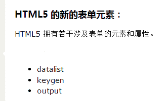
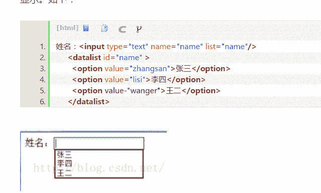
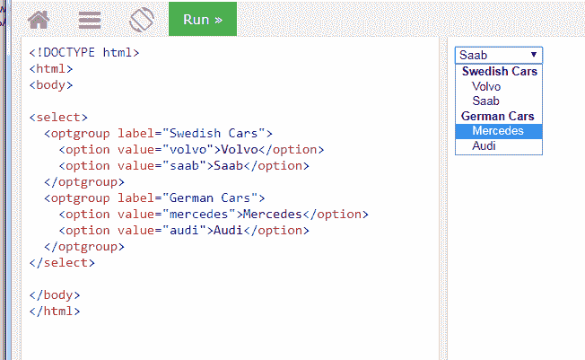
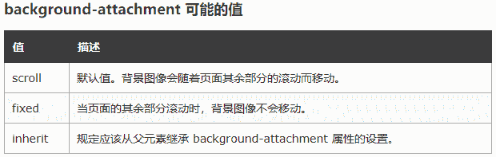
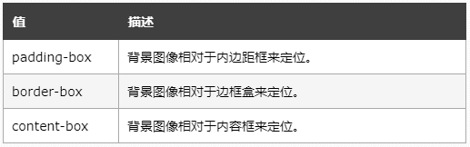
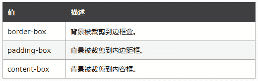
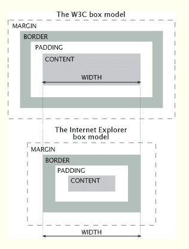
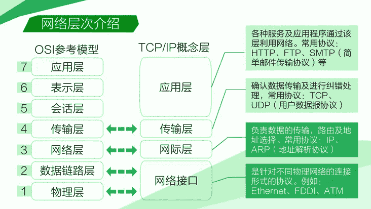
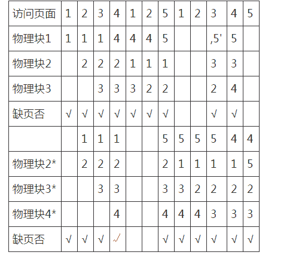
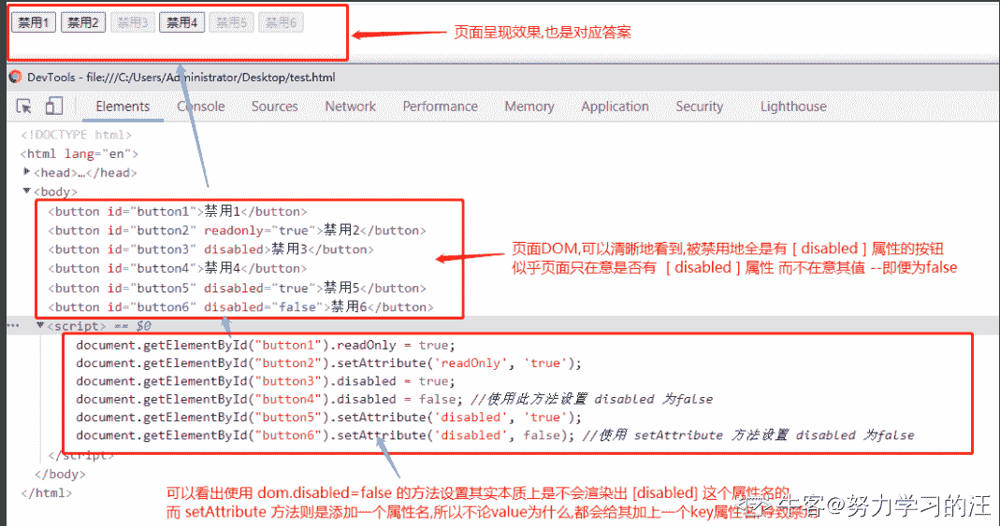

# 字节跳动 2017 前端工程师实习生笔试题

## 1

下面标签嵌套正确的是

正确答案: D   你的答案: 空 (错误)

```cpp
<ul><p>牛客网</p></ul>
```

```cpp
<a href="#"><a href="#">牛客网</a></a>
```

```cpp
<dl><li>牛客网</li></dl>
```

```cpp
<ol><li>牛客网</li></ol>
```

本题知识点

HTML 前端工程师 字节跳动 2017

讨论

[Abet](https://www.nowcoder.com/profile/127801)

A.ul 只能紧挨着 liB.a 中不能再嵌套 aC.dl dtD.ol li 是有序排列

发表于 2016-05-27 15:32:50

* * *

[wang 世界](https://www.nowcoder.com/profile/5614439)

ul 和 li 无序列表
ol 和 li 有序列表
这两个都是这样搭配着使用的

发表于 2016-07-05 00:13:41

* * *

[公众号:重温新知](https://www.nowcoder.com/profile/126819)

<dl> 标签定义一个描述列表。

<dl> 标签与 [<dt>](http://www.runoob.com/tags/tag-dt.html) （定义项目/名字）和 [<dd>](http://www.runoob.com/tags/tag-dd.html) （描述每一个项目/名字）一起使用。

发表于 2017-01-20 11:46:37

* * *

## 2

下面哪些是 HTML5 新增的表单元素？

正确答案: A C   你的答案: 空 (错误)

```cpp
datalist
```

```cpp
optgroup
```

```cpp
output
```

```cpp
legend
```

本题知识点

HTML 前端工程师 字节跳动 2017

讨论

[张星星](https://www.nowcoder.com/profile/716240)

 datalist 元素规定输入域的选项列表。 keygen 元素的作用是提供一种验证用户的可靠方法。 output 元素用于不同类型的输出

发表于 2016-07-31 09:19:28

* * *

[人间失格 _](https://www.nowcoder.com/profile/9663314)



发表于 2017-04-17 18:12:53

* * *

[烨 _ 感觉自己萌萌哒](https://www.nowcoder.com/profile/7394243)

关于 opt

发表于 2017-12-21 10:31:35

* * *

## 3

在 HTML 中，（ ）可以在网页上通过链接直接打开邮件客户端发送邮件。

正确答案: C   你的答案: 空 (错误)

```cpp
<a href=”telnet:ming.zhou@nowcoder.com”>发送邮件</a>
```

```cpp
<a href=”mail:ming.zhou@nowcoder.com”>发送邮件</a>
```

```cpp
<a href=”mailto:ming.zhou@nowcoder.com”>发送邮件</a>
```

```cpp
<a href=”ftp:ming.zhou@nowcoder.com”>发送邮件</a>
```

本题知识点

HTML 前端工程师 字节跳动 2017

讨论

[zhisheng_blog](https://www.nowcoder.com/profile/616717)

mailto 后面加发送邮件地址

发表于 2016-06-22 09:28:49

* * *

[Paulllll](https://www.nowcoder.com/profile/5077799)

太难了，不适合我

发表于 2017-07-24 00:34:09

* * *

[路路](https://www.nowcoder.com/profile/840275)

mailto 后为收件人地址； tel 最常用 js 一键拨号;

发表于 2016-05-10 19:31:46

* * *

## 4

请选出所有的置换元素（）

正确答案: A B C D   你的答案: 空 (错误)

```cpp
img
```

```cpp
input
```

```cpp
textarea
```

```cpp
select
```

本题知识点

HTML 前端工程师 字节跳动 2017

讨论

[希望拥抱变化的西瓜](https://www.nowcoder.com/profile/537800)

a) 置换元素：浏览器根据元素的标签和属性，来决定元素的具体显示内容。 
例如：浏览器会根据标签的 src 属性的 值来读取图片信息并显示出来，而如果查看(x)html 代码，则看不到图片的实际内容；<input>标签的 type 属性来决定是显示输入 框，还是单选按钮等。 (x)html 中 的、<input>、<textarea>、<select>、<object> 都是置换元素。这些元素往往没有实际的内容，即是一个空元素。

置换元素在其显示中生成了框，这也就是有的内联元素能够设置宽高的原因。

b) 不可替换元素：(x)html 的大多数元素是不可替换元素，即其内容直接表现给用户端（如浏览器）。

例如： <label>label 中的内容</label> 标签<label>是一个非置换元素，文字 label 中的内容”将全被显示。

发表于 2016-04-29 15:11:03

* * *

[阿里内推王](https://www.nowcoder.com/profile/427012)

In CSS, a  **replaced element**  is an element whose representation is outside the scope of CSS. These are kind of external objects whose representation is independent of the CSS. Typical replaced elements are  [](https://developer.mozilla.org/en-US/docs/Web/HTML/Element/img) ,  [<object>](https://developer.mozilla.org/en-US/docs/Web/HTML/Element/object) ,  [<video>](https://developer.mozilla.org/en-US/docs/Web/HTML/Element/video)  or form elements like [<textarea>](https://developer.mozilla.org/en-US/docs/Web/HTML/Element/textarea)  and  [<input>](https://developer.mozilla.org/en-US/docs/Web/HTML/Element/input) .w3c 文档的定义，置换元素的意思是  展现不是由 CSS 来控制的元素。这些外部元素的展现不依赖于 CSS 规范

发表于 2016-04-29 11:03:32

* * *

[joeychen](https://www.nowcoder.com/profile/280143)

什么鬼 置换元素是什么？！！！

发表于 2016-06-06 20:14:26

* * *

## 5

下面哪条声明能固定背景图片（）

正确答案: A   你的答案: 空 (错误)

```cpp
background-attachment:fixed;
```

```cpp
background-attachment:scroll;
```

```cpp
background-origin: initial;
```

```cpp
background-clip: initial;
```

本题知识点

HTML 前端工程师 字节跳动 2017

讨论

[阿里内推王](https://www.nowcoder.com/profile/427012)

```cpp
background-attachment
有三个值，scroll 是默认值，背景图像会随着页面其余部分的滚动而移动。
         fixed 当页面的其余部分滚动时，背景图像不会移动。
         inherit 规定应该从父元素继承 background-attachment 属性的设置。
```

background-origin 属性规定 background-position 属性相对于什么位置来定位。background-clip   属性规定背景的绘制区域。

发表于 2016-04-29 11:08:08

* * *

[IoE](https://www.nowcoder.com/profile/655404835)

**#  background-attachment** 属性设置背景图像是否固定或者随着页面的其余部分滚动。**# background-origin** 属性规定背景图像相对于什么位置来定位。语法 ：background-origin: padding-box | border-box | content-box;
**#  background-clip **属性规定背景的绘制区域。
语法：background-clip: padding-box | border-box | content-box;

编辑于 2019-10-14 01:04:12

* * *

[箫声远](https://www.nowcoder.com/profile/269558)

background-attachment :定义背景图片随滚动轴的移动方式
取值: scroll | fixed | inherit
scroll: 随着页面的滚动轴背景图片将移动
fixed: 随着页面的滚动轴背景图片不会移动
inherit: 继承初始值: scroll
继承性: 否
适用于: 所有元素

发表于 2016-08-10 08:00:52

* * *

## 6

下列说法正确的是（）

正确答案: A B   你的答案: 空 (错误)

```cpp
display: none；不为被隐藏的对象保留其物理空间；
```

```cpp
visibility:hidden;所占据的空间位置仍然存在,仅为视觉上的完全透明；
```

```cpp
visibility:hidden;产生 reflow 和 repaint(回流与重绘)；
```

```cpp
visibility:hidden;与 display: none;两者没有本质上的区别；
```

本题知识点

HTML 前端工程师 字节跳动 2017

讨论

[阿里内推王](https://www.nowcoder.com/profile/427012)

```cpp
display: none 和 visibility:hidden 的区别就是 visibility:hidden 会保留元素的空间

repaint(重绘) ，repaint 发生更改时，元素的外观被改变，且在没有改变布局的情况下发生，如改变 outline,visibility,background color，不会影响到 dom 结构渲染。

reflow(渲染)，与 repaint 区别就是他会影响到 dom 的结构渲染，同时他会触发 repaint，他会改变他本身与所有父辈元素(祖先)，这种开销是非常昂贵的，导致性能下降是必然的，页面元素越多效果越明显。

所以 display:none 才会产生 reflow

visibility:hidden 只会出发 repaint

```

发表于 2016-04-29 11:14:06

* * *

[炫](https://www.nowcoder.com/profile/376795)

**display:none 可以理解为看不见摸不着**
**visibility：hidden 可以理解为看不见摸得着**
**display 的切换会触发 reflow，而 visibility 不会。**

编辑于 2016-05-11 14:07:36

* * *

[胖胖梅](https://www.nowcoder.com/profile/962499)

display:none 改变了 dom 的结构，所以产生了 reflow visibility:hidden 没有改变 dom 结构，触发 repaint

发表于 2016-06-17 11:03:12

* * *

## 7

以下关于盒子模型描述正确的是：

正确答案: A   你的答案: 空 (错误)

```cpp
标准盒子模型中：盒子的总宽度 ＝ 左右 margin + 左右 border + 左右 padding + width
```

```cpp
IE 盒子模型中：盒子总宽度 ＝ 左右 margin + 左右 border + width
```

```cpp
标准盒子模型中：盒子的总宽度 ＝ 左右 margin + 左右 border + width
```

```cpp
IE 盒子模型中：盒子总宽度 ＝ width
```

本题知识点

HTML 前端工程师 字节跳动 2017

讨论

[机智的马里奥](https://www.nowcoder.com/profile/5834344)



发表于 2017-03-11 22:17:52

* * *

[Mr.Apple](https://www.nowcoder.com/profile/213669)

标准盒子模型 ＝ margin + border + padding + content （content =  width | height）IE 盒子模型 ＝ margin + content （content = border + padding + width | height）

编辑于 2016-06-14 09:30:53

* * *

[阿里内推王](https://www.nowcoder.com/profile/427012)

```cpp
标准盒子模型中：盒子的总宽度 ＝ 左右 margin + 左右 border + 左右 padding + width IE 盒子模型中：盒子总宽度 ＝ 左右 margin +  width
```

发表于 2016-04-29 11:15:33

* * *

## 8

下面哪个属性不会让 div 脱离文档流（normal flow）？

正确答案: C   你的答案: 空 (错误)

```cpp
position: absolute;
```

```cpp
position: fixed;
```

```cpp
position: relative;
```

```cpp
float: left;
```

本题知识点

HTML 前端工程师 字节跳动 2017

讨论

[炫](https://www.nowcoder.com/profile/376795)

A：position: absolute;生成绝对定位的元素，相对于 static 定位以外的第一个父元素进行定位；都绝对定位了，肯定脱离了文档流。。
B:position: fixed;生成绝对定位的元素，相对于浏览器窗口进行定位;相对于浏览器了，也和正常顺序排下来没什么关系。。
C:position: relative;生成相对定位的元素，相对于其正常位置进行定位。生成相对定位，也就是说还在原本的上下左右之间，上下左右的元素都不变，so 这个没有能脱离文档流。。就这个了
D:float: left;都浮动出去了，还上哪保持原位置去。**最终答案选择 C**

发表于 2016-05-11 14:15:08

* * *

[略略略 321](https://www.nowcoder.com/profile/1745790)

脱离文档流:就不占据空间了？ 是的，一个元素脱离文档流后，其他的元素在定位时候回当做没看见他，两者位置重叠都是可以的。 2、脱离文档流不是从 dom 树中脱离，用浏览器的审查元素可以看到脱离文档流的元素，依然会出现在 dom 树里 3、实质：   脱离文档流，也就是将元素从普通的布局排版中拿走，其他盒子在定位的时候，会当做脱离文档流的元素不存在而进行定位。需要注意的是，使用 float 脱离文档流时，其他盒子会无视这个元素，但其他盒子内的文本依然会为这个元素让出位置，环绕在周围。而对于使用 absolute positioning 脱离文档流的元素，其他盒子与其他盒子内的文本都会无视它。

发表于 2017-03-21 21:44:14

* * *

[章鱼小丸子](https://www.nowcoder.com/profile/747798)

float 和 absolute 有什么区别？float 仍会占据位置。不会覆盖其他 dom。absolute 可以覆盖其他的 dom。----------------------------------------------absolute 相对于上一级不是 static 的元素定位，脱离文档流。relative 相对于上一级等位，static 也可以，不脱离文档流，保留原来的位置。fixed 相对于浏览器窗口定义，脱离文档流。static：不定位。

发表于 2016-08-03 11:54:25

* * *

## 9

可以使英文字母全部转为大写的属性正确的是（）

正确答案: C   你的答案: 空 (错误)

```cpp
text-transform: capitalize;
```

```cpp
text-transform: lowercase;
```

```cpp
text-transform: uppercase;
```

```cpp
font-weight: bold;
```

本题知识点

HTML 前端工程师 字节跳动 2017

讨论

[wang 世界](https://www.nowcoder.com/profile/5614439)

```cpp
text-transform:capitalize 是首字母大写
text-transfrom:lowercase 是全部字母为小写
text-transfrom:uppercase 是全部字母为大写 
font-weight: bold;字体为粗体，
```

用法：
#p{

```cpp
text-transform:lowercase;}
```

发表于 2016-07-05 00:12:03

* * *

[牛客 9867106 号](https://www.nowcoder.com/profile/9867106)

理解错了。。。还以为是代码大写

发表于 2016-09-27 20:01:22

* * *

[牛客 340164 号](https://www.nowcoder.com/profile/340164)

capitalize 以大写字母开头，uppercase 全大写，lowercase 全小写

发表于 2016-05-25 16:42:33

* * *

## 10

假设在今日头条里面,有很多工作人员检查新闻是不是属于虚假新闻,所有新闻真实率到达了 98%,工作人员在检验一个真实的新闻把它检验为一个虚假的新闻的概率为 2%,而一个虚假的新闻被检验为真实的新闻的概率为 5%.那么,一个被检验为真实的新闻确实是真实的新闻的概率是多大?

正确答案: B   你的答案: 空 (错误)

```cpp
0.9991
```

```cpp
0.9989
```

```cpp
0.9855
```

```cpp
0.96
```

本题知识点

概率统计 *前端工程师 字节跳动 2017 概率论与数理统计* *讨论

[立雪听风](https://www.nowcoder.com/profile/241956)

这是一个古典事件：（1）基本事件数：被检验为真实的新闻 = 真新闻检验为真+假新闻检验为真=98%*（1-2%）+（1-98%）*5%（2）有效事件数：  真新闻被检验为真 = 98% *（1-2%）有效/基本=B 选项

发表于 2016-06-14 17:43:15

* * *

[hfutdog](https://www.nowcoder.com/profile/634898)

假设总共 100 个新闻，那么真实新闻为 98 个，虚假新闻为 2 个，**检验为真实的新闻** 总个数为**真实的检验为真实的** 和**虚假的检验为真实的** 之和：98x(1-2%)+2x5%=96.14 个，其中**检验为真实的真实新闻个数即是真实的检验为真实的** 个数：98x(1-2%)=96.04 个，所以其真实概率为 96.04/96.14=0.9989......

发表于 2016-05-02 18:38:10

* * *

[getTry](https://www.nowcoder.com/profile/921265)

一个被检验为真实的新闻确实是真实的新闻的概率 = (98%×98%) / (98%×98%+2%×5%) ，分子是真实新闻被检验为真实新闻的总概率，分母是所有被检验为真实新闻的总概率

发表于 2016-04-30 20:49:59

* * *

## 11

现在有两堆石子，小今与小条玩游戏，2 个人都足够聪明，两个人规定:每次每人只能从其中一堆中取走 1 个或 2 个或 3 个石子，后将石子全部取完的人胜利。现在两堆石子的个数为 8 和 9，请问如何安排才能让小今必胜?

正确答案: A   你的答案: 空 (错误)

```cpp
让小今先取
```

```cpp
让小条先取
```

```cpp
没有策略能够让小今必胜
```

```cpp
以上说法都不正确
```

本题知识点

数学运算

讨论

[Summer117](https://www.nowcoder.com/profile/1077548)

转载自： http://blog.csdn.net/cinderella_hou/article/details/52014092   答案是： 让小今先取。

其实这里是有规律可循的，可归结为 “取余制胜” 。详解如下：

一 取余制胜（取棋子，报数游戏） 

1．每次取 1~n 个棋子，总数，取最后一个赢 策略：总数÷（1+n） 
有余则先，拿掉余数，之后总与对手凑成 1+n 即可 无余则后，总与对手凑成 1+n 即可  
2. 每次取 1~n 个棋子，总数，取最后一个输 
策略：最狠的做法就是留给对方一枚棋子，对方不取也得取。所以想赢的关键就在于能不能取到倒数第二枚棋子。 

问题转化为：每次取 1~n 个棋子，总数，取倒数第二枚棋子赢。 （总数-1）÷（1+n），之后同 1 中做法。

所以这道题，可以分两堆考虑，9 个的那堆，9%（1+3） 等于 1，所以小今首先取 1，然后不管小天取几，都和他凑成 4， 这样 9 这一堆，小今必定最后取。然后小天去取 8 那一堆，因为 8%4 = 0.所以，需要后取，只要和小天所取凑够 4 就好 OK 了。

发表于 2016-09-07 11:25:07

* * *

[AnimalCourier](https://www.nowcoder.com/profile/229580)

和一些抢数字的游戏有点像，不妨这么想，后手的可以把一轮取走的石子数控制在 4。如果小今先从 9 的堆里面拿走一个，剩下两个 8，那他控制着每轮每边（小条拿哪边就拿哪边）拿 4 个，一定能拿走最后一个。

发表于 2016-05-04 16:18:05

* * *

[百里屠个苏](https://www.nowcoder.com/profile/874695)

取完后两堆石头为 0 0，4 4，8 8 的必胜。如 A 取完为 4 4，无论 B 怎么取，A 都能保证为 0 4，B 再取，A 就可以为 0 0，就赢了。同理,A 只要保证取完为 8 8，就一定可以保证自己可以获得 4 4，还可以一直往上推，12 12.....

发表于 2016-07-01 11:53:36

* * *

## 12

以下描述正确的：

正确答案: B C D   你的答案: 空 (错误)

```cpp
Http 协议所使用的运输层协议是 UDP
```

```cpp
Https 的端口号是 443
```

```cpp
TCP 注重数据可靠性，UDP 注重数据传输快
```

```cpp
传输层提供端到端的可靠报文传递和错误恢复
```

本题知识点

网络基础 前端工程师 字节跳动 2017

讨论

[Mr.Apple](https://www.nowcoder.com/profile/213669)

1.网络模型OSI 七层模型 7 应用层：允许访问网络资源。 通信单位：报文（指的是 TCP/IP 协议里广义的应用层 ） 
6 表示层：数据的转换，加密，压缩  
5 会话层：建立，管理，终止会话  
4 运输层：提供可靠的进程到进程的交付和差错恢复。  
3 网络层：从源到终点传送分组，提供网络互联。通信单位 数据报 
2 数据链路层：将比特组织成帧结构，提供逐跳交付。通信单位 帧 
1 物理层：经过媒体传送比特 2.TCP 与 UDPUDP（ User Datagram Protocal， 用户数据报协议 ）（1）简介面向数据报的不可靠的 传输层通信协议（2）特点 UDP 不能保证可靠传输，也就更不能保证所发送的数据的到达顺序，它所实现的是尽最大的努力交付。UDP 是面向数据报文的、无连接的协议，因此它的开销低并且发送器前的时延小（因为不用建立连接啊），面向报文也使得 IP 层在传输 UDP 协议的报文时既不会拆分也不会合并。UDP 可以支持一对一、一对多、多对一、多对多的通信。UDP 没有拥塞控制功能，它的发送速率不会随着网络出现的拥塞而降低，所以它的实时性较好。这也是许多视频聊天应用采用它的原因。（3）报文格式
TCP（ Transmission Control Protocol， 传输控制协议  ）（1）简介面向连接的、可靠的、基于字节流的传输层通信协议（2）特点 TCP 协议保证可靠传输，也就是说发送的数据是什么样，接收的数据也是什么样。TCP 协议是有连接的、面向数据流的协议。有连接是说数据传送前通信双方需要建立连接、通信完毕后需要断开连接，不过这里所提到的连接都是逻辑上的连接。面向数据流的意思是说发送方应用程序发送的数据是什么顺序，接收方应用读取的接收到的数据也是什么顺序。TCP 协议提供的是端到端的通信，也就是说一条 TCP 连接只能提供一对一的通信。不过，一个应用可以同时建立多条 TCP 连接来实现与多个目标的通信。TCP 协议提供拥塞控制功能，会在网络状况良好的情况下适当提高发送/接收速率，反之则适当降低发送/接收速率。这样，将会提高对网络的利用率。（3） 数据封包结构 
3.参考网址 https://segmentfault.com/a/1190000004598598

发表于 2016-07-28 11:11:27

* * *

[janna1](https://www.nowcoder.com/profile/162038)

HTTP 的端口号是 80，https 的端口号是 443，两者不能混淆了。

发表于 2016-08-29 18:30:25

* * *

[丷柠檬](https://www.nowcoder.com/profile/649311)

传输层的 UDP 协议也有提供可靠的报文传递和错误恢复吗？为啥 D 是对的

发表于 2016-07-01 10:00:14

* * *

## 13

表 toutiao_tb

> title   data       auther  typeabc     2016.2.23   bob     1bcv     2016.3.3    http    1cvt     2016.3.3    http    1bcvvcm  2016.3.5    js      2nmhh    2016.2.3    html    2hhj     2016.3.3    java    3rrr     2016.3.2    cc      1

查询 title 中包含 cv 且 type 是 1 的记录

正确答案: B   你的答案: 空 (错误)

```cpp
select * from toutiao_tb where title = 'cv' and type='1'
```

```cpp
select * from toutiao_tb where title like '%cv%' and type=1
```

```cpp
select * from toutiao_tb where title like '*cv' and type=1
```

```cpp
select * from toutiao_tb where title ='*cv*' and type='1‘
```

本题知识点

数据库 前端工程师 字节跳动 2017

讨论

[cquptli](https://www.nowcoder.com/profile/913077)

```cpp
SQL 提供了四种匹配模式：

1\. % 表示任意 0 个或多个字符。如下语句：Select * FROM user Where name LIKE '%三%'; 将会把 name 为“张三”，“三脚猫”，“唐三藏”等等有“三”的全找出来。%三：表示左匹配。三%：表示右匹配。

%三%：表示模糊查询。

2\. _ 表示任意单个字符。语句： Select * FROM user Where name LIKE '_ 三 _'；只找出“唐三藏”。这样 name 为三个字且中间一个字是“三”的； Select * FROM user Where name LIKE '三 __'； 只找出“三脚猫”这样 name 为三个字且第一个字是“三”的；

3\. [ ] 表示括号内所列字符中的一个（类似与正则表达式）。语句：Select * FROM user Where name LIKE '[张李王]三'; 将找出“张三”、“李三”、“王三”（而不是“张李王三”）； 如 [ ] 内有一系列字符（01234、abcde 之类的）则可略写为“0-4”、“a-e“。Select * FROM user Where name LIKE '老[1-9]'；将找出“老 1”、“老 2”、……、“老 9”；如要找“-”字符请将其放在首位：'张三[-1-9]'；

4\. [^ ] 表示不在括号所列之内的单个字符。语句：Select * FROM user Where name LIKE '[^张李王]三'；将找出不姓“张”、“李”、“王”的“赵三”、“孙三”等；Select * FROM user Where name LIKE '老[¹-4]'; 将排除“老 1”到“老 4”寻找“老 5”、“老 6”、……、“老 9”。

5.* 表示查找的是所有信息,例如 select * from tbl_user

最后是重点！由于通配符的缘故，导致我们查询特殊字符“%”、“_”、“[”、“';”的语句无法正常实现，而把特殊字符用“[ ]”括起便可正常查询。据此我们写出以下函数： function sqlencode(str) str=replace(str,"';","';';") str=replace(str,"[","[[]") ';此句一定要在最先 str=replace(str,"_","[_]") str=replace(str,"%","[%]") sqlencode=str end function 在查询前将待查字符串先经该函数处理即可，并且在网页上连接数据库用到这类的查询语句时侯要注意：如 Select * FROM user Where name LIKE '老[¹-4]';上面《'》老[¹-4]《'》是要有单引号的，别忘了，我经常忘！
```

发表于 2016-06-03 00:04:15

* * *

[DayUp](https://www.nowcoder.com/profile/775837)

答案都不对，正确答案是 select * from toutiao_tb  where  title **like** '%cv%' and type=1;

发表于 2016-08-05 23:11:19

* * *

[zhisheng_blog](https://www.nowcoder.com/profile/616717)

按道理说，这些答案应该都错的。因为 select * from + 表名称（toutiao_tb ）where + 条件，但是这是这是做题，大家都明白 **% 表示任意 0 个** **或多个字符。**

发表于 2016-08-01 14:19:30

* * *

## 14

下列关于操作系统进程与线程的区别正确的是：

正确答案: A D   你的答案: 空 (错误)

```cpp
进程是资源分配的基本单位
```

```cpp
线程是资源分配的基本单位
```

```cpp
进程是资源调度的基本单位
```

```cpp
线程是资源调度的基本单位
```

本题知识点

操作系统 前端工程师 字节跳动 2017

讨论

[爱吃青菜皮卷面的 byr](https://www.nowcoder.com/profile/1411365)

在引入线程的操作系统中，通常都是把进程作为分配资源的基本单位，而把线程作为独立运行和独立调度的基本单位 。

发表于 2017-01-01 23:15:14

* * *

[Mr.Apple](https://www.nowcoder.com/profile/213669)

https://segmentfault.com/a/1190000005884656

发表于 2016-07-28 11:18:08

* * *

[高城和一](https://www.nowcoder.com/profile/4126433)

操作系统中资源分配、调度和管理的最小单位都是进程。而 CPU 调度的最小单位是线程。

发表于 2016-09-12 14:07:26

* * *

## 15

下面那个页面调度算法,当进程分配到的页面数增加时,缺页中断的次数可能增加也可能减少

正确答案: A   你的答案: 空 (错误)

```cpp
FIFO 算法
```

```cpp
LRU 算法
```

```cpp
Clock 算法
```

```cpp
LFU 算法
```

本题知识点

编译和体系结构 前端工程师 字节跳动 2017

讨论

[Bestbud](https://www.nowcoder.com/profile/384606)

在操作系统的内存管理中，有一类很重要的算法就是**内存页面置换算法**（包括 FIFO，LRU,LFU 等几种常见页面置换算法）。事实上，Cache 算法和内存页面置换算法的核心思想是一样的：都是在给定一个限定大小的空间的前提下，设计一个原则如何来更新和访问其中的元素。**LRU**全称是 Least Recently Used，即最近最久未使用的意思。 下面说一下 LRU 算法的核心思想，LRU 算法的设计原则是：如果一个数据在最近一段时间没有被访问到，那么在将来它被访问的可能性也很小。也就是说，当限定的空间已存满数据时，应当把最久没有被访问到的数据淘汰。

**FIFO**（First in First out），先进先出。在 FIFO Cache 设计中，核心原则就是： 如果一个数据最先进入缓存中，则应该最早淘汰掉 。也就是说，当缓存满的时候，应当把最先进入缓存的数据给淘汰掉。

**LFU**（Least Frequently Used）最近最少使用算法。它是基于“如果一个数据在最近一段时间内使用次数很少，那么在将来一段时间内被使用的可能性也很小”的思路。

注意 LFU 和 LRU 算法的不同之处，LRU 的淘汰规则是基于访问时间，而 LFU 是基于访问次数的。

发表于 2016-08-18 10:06:26

* * *

[周星星 _](https://www.nowcoder.com/profile/537870)

先进先出(FIFO)页面置换算法 优先淘汰最早进入内存的页面，亦即在内存中驻留时间最久的页面。该算法实现简单，只需把调入内存的页面根据先后次序链接成队列，设置一个指针总指向最早的页面。但该算法与进程实际运行时的规律不适应，因为在进程中，有的页面经常被访问。

FIFO 算法还会产生当所分配的物理块数增大而页故障数不减反增的异常现象，这是由 Belady 于 1969 年发现，故称为 Belady 异常，如图 3-28 所示。只有 FIFO 算法可能出现 Belady 异常，而 LRU 和 OPT 算法永远不会出现 Belady 异常。

可以看出物理块为 3 的时候缺页次数为 9，增大为 4 的时候缺页数反而是 10ref：http://c.biancheng.net/cpp/html/2614.html

编辑于 2016-09-18 21:21:00

* * *

[牛客 755284 号](https://www.nowcoder.com/profile/755284)

http://www.cnblogs.com/dolphin0520/p/3749259.htmlhttp://blog.csdn.net/wanghaofeng/article/details/5036494

发表于 2016-05-04 16:02:49

* * *

## 16

下列排序算法不稳定的有?

正确答案: B D F G   你的答案: 空 (错误)

```cpp
插入排序
```

```cpp
希尔排序
```

```cpp
冒泡排序
```

```cpp
堆排序
```

```cpp
归并排序
```

```cpp
快速排序
```

```cpp
选择排序
```

本题知识点

排序 *前端工程师 字节跳动 2017* *讨论

[知行两难](https://www.nowcoder.com/profile/7368458)

不稳定：快选堆希稳    定：插冒归基

编辑于 2016-09-14 21:39:07

* * *

[孙强 Jimmy](https://www.nowcoder.com/profile/791455)

给大家一个口诀吧，不稳定的排序：**快**（快排）**些**（希尔）**选**（选择）**一堆**（堆排）

发表于 2017-07-29 11:02:10

* * *

[醉生梦死吧](https://www.nowcoder.com/profile/861327)

（9）稳定排序和不稳定排序 （7 大排序的稳定性分析） http://www.cnblogs.com/codingmylife/archive/2012/10/21/2732980.html 稳定排序有：插入排序、冒泡排序、归并排序 不稳定排序：希尔排序、快速排序、选择排序、堆排序

发表于 2016-05-16 18:46:10

* * *

## 17

运行以下程序

```cpp
<script> 
    var m= 1, j = k = 0; 
    function add(n) { 
        return n = n+1; 
　 } 
    y = add(m); 
    function add(n) { 
        return n = n + 3; 
    } 
z = add(m); 
</script> 
```

y 和 z 的最终结果为:

正确答案: B   你的答案: 空 (错误)

```cpp
2,4
```

```cpp
4,4
```

```cpp
2,2
```

```cpp
报异常
```

本题知识点

Javascript 前端工程师 字节跳动 2017

讨论

[牛客 841725 号](https://www.nowcoder.com/profile/841725)

```cpp
js 里面没有函数重载的概念，在
```

  查看全部)

编辑于 2016-11-01 14:10:41

* * *

[一笙筱歌](https://www.nowcoder.com/profile/1577657)

function add(){}定义的函数会优先解析，而不是顺序解析；因此整个过程中，首先依次解析两个 add function，由于同名，所以后者会覆盖前者；然后，顺序解析其余的 JS 代码，y = add(m);语句和 z = add(m); 语句调用的都是第二个 add function，因此返回的都是 4.
定义函数的三种方式有：function 函数、Function()构造函数、对象字面量。从解析顺序来分析，它们的不同在于：function 函数：优先解析；Function()构造函数、函数字面量定义:顺序解析。
                    示例：
                        // 4 2 3 3 5 6
                        function f(){return 1;}                 // 函数 1     优先解析
                        alert(f());        //返回值为 4 说明第 1 个函数被第 4 个函数覆盖   
                        var f = new Function("return 2;");        // 函数 2
                        alert(f());        //返回值为 2 说明第 4 个函数被第 2 个函数覆盖
                        var f = function(){return 3;}            // 函数 3
                        alert(f());           //返回值为 3 说明第 2 个函数被第 3 个函数覆盖   
                        function f(){return 4;}                 // 函数 4    优先解析 覆盖函数 1
                        alert(f());        //返回值为 3 说明第 4 个函数被第 3 个函数覆盖
                        var f = new Function("return 5");         // 函数 5
                        alert(f());    //返回值为 5 说明第 3 个函数被第 5 个函数覆盖   
                        var f = function(){return 6 ;}            // 函数 6
                        alert(f());        //返回值为 6 说明第 5 个函数被第 6 个函数覆盖   

发表于 2016-08-06 15:52:07

* * *

[孟杨敏](https://www.nowcoder.com/profile/454297)

B

1.  在 Function 类型里，函数是对象，函数名是指向函数对象的指针， **没有重载** ！
2.  当声明了多个同名函数时， **后面的函数会覆盖前面的函数** ，所以在题目中，事实上只有后面的 add(n)起了作用，因此，两个结果都为 4。
3.  补充一点：个人感觉这里有一点 **函数声明和函数表达式** 的区别需要特别注意！解析器在向执行环境中加载数据时，会率先读取函数声明，并使其在执行任何代码之前可用。也就是先读取 function 函数的声明，再读取函数表达式 y = add(m);语句 和 z = add(m);语句， 所以 y = add(m);语句虽然在函数声明之前，但依然应用了函数。

发表于 2016-08-24 21:01:59

* * *

## 18

```cpp
(function() {
      var a = b = 5;
  })();   
console.log(b);
console.log(a);
```

上面这段代码运行后的输出是:

正确答案: D   你的答案: 空 (错误)

```cpp
5，5
```

```cpp
undefined，undefined
```

```cpp
5，undefined
```

```cpp
5，Uncaught ReferenceError: a is not defined
```

本题知识点

Javascript 前端工程师 字节跳动 2017

讨论

[ivuu](https://www.nowcoder.com/profile/8503325)

第一个考点在于 var a=b=5 相当于拆解成 var a=b; b=5; 然后，b=5 前面没有 var，相当于声明为全局变量（这种方式在严格模式下会报错，此题不考虑)。所以就相当于： var b; (fun…{ var a=b; b=5; })(); console.log(b); //5 console.log(a); //报错 此处报错也就是另一个考点，a 声明的是函数的局部变量，在函数结束是就销毁了，所以在全局下找不到 a，于是报错。 （手机码字，排版如果出错，请原谅⁄(⁄ ⁄ ⁄ω⁄ ⁄ ⁄)⁄）

发表于 2017-08-11 10:54:07

* * *

[天海加油！！！](https://www.nowcoder.com/profile/110637)

明明会出错，a is not defined

发表于 2016-08-24 18:55:46

* * *

[Mr.Apple](https://www.nowcoder.com/profile/213669)

1.var 操作符使用 var 操作符定义的变量将成为该变量的作用域中的局部变量，如果在函数中使用 var 定义一个变量，那么这个变量在函数退出后就会被销毁；省略 var 操作符会创建一个全局变量，但在局部作用域中定义的全局变量很难维护，也会由于相应变量不会马上就有定义而导致不必要的混乱，给未经声明的变量赋值在严格模式下会导致抛出 Reference 错误，所以不推荐使用。function noVar(){message="global var";//全局变量}noVar();console.log(message);2.解析 var a=b=1;>> var a=b;b=1;首先使用 var 初始化变量 a 赋值为 b，b 未定义，a=undefined；省略 var 初始化变量 b 为全局变量，b=1。

编辑于 2016-05-04 09:04:51

* * *

## 19

页面有一个 id 为 button1 的按钮，如何通过原生的 js 禁用？(IE 考虑 IE 8.0 以上版本)

正确答案: C D   你的答案: 空 (错误)

```cpp
document.getElementById("button1").readonly= true;
```

```cpp
document.getElementById("button1").setAttribute(“readonly”,”true”);
```

```cpp
document.getElementById("button1").disabled = true;
```

```cpp
document.getElementById("button1").setAttribute(“disabled”,”true”);
```

本题知识点

Javascript 前端工程师 字节跳动 2017

讨论

[最讨厌晚上 9 点半，钉钉响起的声音](https://www.nowcoder.com/profile/303433)

为什么你们这说：Readonly 只针对 input(text/password)和 textarea 有效，而 disabled 对于所有的表单元素有效 ????? 不明白你们为什么都这么说？？？**①disabled 和 readOnly 都是表单的公有属性，** **readOnly 是只读，** **disabled 是禁用。这里问的是禁用，所以是 disabled。****②还有就是题目中的** **readOnly 写成了** **readolny****③小知识点：setArrtibute 在 ie7 以前是不能通过 style 和 class 设置属性的**

发表于 2017-03-23 23:48:09

* * *

[努力学习的汪](https://www.nowcoder.com/profile/401903329)

*   本人对于做过的面试题全部进行了梳理解析,分享给大家.这是 JS 部分,需要的可以看看:[JavaScript 专项练习](https://gitee.com/hongjilin/hongs-study-notes/tree/master/%E6%A2%B3%E7%90%86_%E4%B8%93%E9%A1%B9%E7%BB%83%E4%B9%A0%E5%8F%8A%E7%9F%A5%E8%AF%86%E7%82%B9%E6%A2%B3%E7%90%86%E7%AC%94%E8%AE%B0/JavaScript%E4%B8%93%E9%A1%B9%E7%BB%83%E4%B9%A0/)

*   disabled 和 readOnly 都是表单的公有属性， readOnly 是只读， disabled 是禁用。

    *   同时 Readonly 只针对 input(text/password) 和 textarea 有效,所以排除 A、B 项

*   只要设置了 [disabled] 属性不论什么值都会禁用,包括 **false**,页面似乎只在乎是否有这个属性 而不在乎其值,所以对于选项四有疑惑的同学可以看我的图解
    

编辑于 2021-10-25 13:15:59

* * *

[AnimalCourier](https://www.nowcoder.com/profile/229580)

Readonly 只针对 input(text/password)和 textarea 有效，而 disabled 对于所有的表单元素有效，包括 select,radio,checkbox,button 等。

发表于 2016-05-04 16:28:06

* * *

## 20

如果想为 id 值为 button1 的元素设置背景色为红色，下列选项中，做法正确的一项是（）

正确答案: A   你的答案: 空 (错误)

```cpp
document.getElementById('button1').style.backgroundColor="red";
```

```cpp
document.getElementById('button1').style.backgroundcolor="red";
```

```cpp
document.getElementById('button1').style.backGroundColor="red";
```

```cpp
document.getElementById('button1').style.bgcolor="red";
```

本题知识点

Javascript 前端工程师 字节跳动 2017 浩鲸云 2020

讨论

[快乐的 coder](https://www.nowcoder.com/profile/750058)

A，js 里样式设置直接把 css 写法的的“-”去掉，再改写为驼峰写法即可。

发表于 2016-06-01 08:42:11

* * *

[Bestbud](https://www.nowcoder.com/profile/384606)

bgcolor 是标签属性，只有 body 和 table tr td 元素有该属性，可以设置背景颜色，其他标签使用 bgcolor 没有效果使用 js 改变 bgcolor 的语句为 document.body.bgColor="red"; 或 document.getElementById(“table tr td 元素的 id”).bgColor="red";D 选项有三个地方错了：1.button 没有 bgcolor 属性；2.不应该用 style ；3.bgcolor 中的 c 应该大写。在 HTML 4.01 中，不赞成使用 body 元素的 bgcolor 属性；在 XHTML 1.0 Strict DTD 中，不支持 body 元素的 bgcolor 属性。

请使用 CSS 代替。

发表于 2016-08-18 12:29:50

* * *

[谁从微毫见参天](https://www.nowcoder.com/profile/790543109)

链接：[`www.nowcoder.com/questionTerminal/7ba96072758343de9f363b33d8275081`](https://www.nowcoder.com/questionTerminal/7ba96072758343de9f363b33d8275081)
来源：牛客网

HTML

```cpp
<body bgcolor="#E6E6FA">

```

1、bgcolor 是标签属性，用于设置背景颜色，只有 body  table  tr  td 元素有该属性。 
2、使用 js 改变 bgcolor 的语句（没有 style）：    document.body.bgColor="red"; 或    document.getElementById(“table tr td 元素的 id”).bgColor="red";

```cpp
h1{background-color:#00ff00;}
```

3、background-color 是标签属性，填充除外边距 margin 以外的元素范围。
4、使用 js 改变 background-color 的语句（有 style）：    document.getElementById(“元素的 id”).backgroundColor="red";(驼峰式命名)5、动态改变 HTML 元素的样式：     object.style.property="new style";

发表于 2019-03-11 10:16:02

* * *

## 21

现在有一个字符串，你要对这个字符串进行 n 次操作，每次操作给出两个数字：(p, l) 表示当前字符串中从下标为 p 的字符开始的长度为 l 的一个子串。你要将这个子串左右翻转后插在这个子串原来位置的正后方，求最后得到的字符串是什么。字符串的下标是从 0 开始的，你可以从样例中得到更多信息。

本题知识点

字符串 *模拟 C++工程师 golang 工程师 iOS 工程师 安卓工程师 运维工程师 前端工程师 算法工程师 测试工程师 PHP 工程师 Java 工程师 字节跳动 2017* *讨论

[嫑慌](https://www.nowcoder.com/profile/2553661)

```cpp

	var line = readline();

	var n = readline();

	for(var i=0;i<n;i++){

	    var line2 = readline().split(' ');

	    var start = parseInt(line2[0]);

	    var len = parseInt(line2[1]);

	    var temp = line.substr(start,len).split('').reverse().join('');

	    line = line.slice(0,start+len) + temp + line.slice(start+len);

	}

	print(line);

```

发表于 2018-10-05 16:55:49

* * *

[anybody](https://www.nowcoder.com/profile/126520)

```cpp
#include <iostream>
#include <string>
#include <vector>
#include <algorithm>
using namespace std;

int main()
{
	string st;
	while (cin >> st)
	{
		int n;
		cin >> n;
		while (n--)
		{
			int beg, len, index;
			cin >> beg >> len;
			string temp = st.substr(beg, len);
			index = beg + len;
			reverse(temp.begin(), temp.end());
			st.insert(index, temp);
		}
		cout << st << endl;
	}
	return 0;
}
```

发表于 2016-07-23 14:06:06

* * *

[yekongle123](https://www.nowcoder.com/profile/2251535)

```cpp
import java.util.Scanner;
public class Main {
    public static void main(String[] args){
        Scanner in = new Scanner(System.in);
        while(in.hasNext()){
            StringBuffer str =new StringBuffer( in.nextLine());
            int n = in.nextInt();    
            for(int i =0;i<n;i++){
                int start = in.nextInt();
                int end = start + in.nextInt();
                StringBuffer buffer = new StringBuffer(str.substring(start, end));    
                str.insert(end, buffer.reverse().toString()); 
            }
            System.out.println(str);
        }    
    }
}

```

发表于 2017-10-16 13:17:39

* * *

## 22

你作为一名出道的歌手终于要出自己的第一份专辑了，你计划收录 n 首歌而且每首歌的长度都是 s 秒，每首歌必须完整地收录于一张 CD 当中。每张 CD 的容量长度都是 L 秒，而且你至少得保证同一张 CD 内相邻两首歌中间至少要隔 1 秒。为了辟邪，你决定任意一张 CD 内的歌数不能被 13 这个数字整除，那么请问你出这张专辑至少需要多少张 CD ？

本题知识点

贪心 动态规划 前端工程师 字节跳动 2017

讨论

[changwl](https://www.nowcoder.com/profile/592799)

```cpp
import java.util.*;

public class Main{

    public static void main(String[] args){
        Scanner in = new Scanner(System.in);
        while(in.hasNext()){
            int n = in.nextInt();
            int s = in.nextInt();
            int l = in.nextInt();
            int count = (l+1)/(s+1);
            count = Math.min(n, count);
            if(count%13==0){
                count--;
            }
            int sum = n/count;
            int yu = n%count;
			if(yu!=0){
            	sum++;
            	if(yu%13==0&&(count-yu)==1){//查看最后最后一张专辑的情况
            		sum++;
            	}
            }
            System.out.println(sum);
        }
    }
}
```

编辑于 2016-06-03 23:22:00

* * *

[夙愿](https://www.nowcoder.com/profile/191137)

```cpp
#include <iostream>

using namespace std;

int main() {
    long long n, s, l;//n 首歌，每首 s 秒，CD 容量 l 秒
    long long i, z;//每张 CD 存 i 首歌，需要 z 张
    while(scanf("%lld%lld%lld", &n, &s, &l) != EOF) {
        for(i=1; i*s+i-1<=l; i++);//计算 1 张 CD 可以存 i 首歌
        i--;
        z=1;

        if(i % 13 == 0) {//每张 CD 不能存 13 的倍数首歌
            i--;
        }

        for(z=1; i*z<n; z++);//计算需要多少张 CD

        if((n % 13 == 0) && (n <= i)) {//针对 n 是 13 的倍数且 1 张 CD 就可以存所有歌曲的情况
            z++;
        }
        if((i - 1) % 13 == 0){//针对最后 i-1 可能是 13 的倍数
            z++;
        }
        if((n == 1) && (s == 1) && (l == 1)){//单独考虑 1,1,1
            z=1;
        }
        cout << z << endl;
    }
    return 0;
}
```

编辑于 2016-08-05 10:08:28

* * *

[进击的小白](https://www.nowcoder.com/profile/745507)

```cpp
process.stdin.resume();
process.stdin.setEncoding('ascii');

var input = "";
var input_array = "";
var n;
var s;
var l;

process.stdin.on('data', function (data) {
    input += data;
});

function do_something(n, s, l){
	//你的代码
    var single = Math.floor(l / (s + 1));
    if (single % 13 === 0) single--;
    if (s === l) single = 1;

    var res = Math.ceil(n / single)

    if (res === 1 && n % 13 === 0) res++;

    console.log(res)
}

process.stdin.on('end', function () {
    input_array = input.split("\n");
    var nLine = 0;
    while(nLine < input_array.length){
        var line = input_array[nLine++].trim();
        if(line === ''){
            continue;
        }
        var input_arrays = line.split(' ');
        n = +input_arrays[0];
        s = +input_arrays[1];
        l = +input_arrays[2];

		do_something(n, s, l);

    }
});
```

发表于 2016-09-23 11:36:32

* * ****