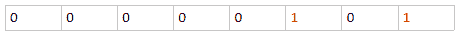
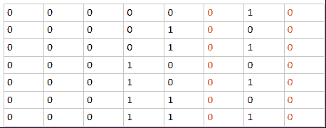
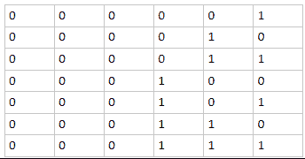

# 字节跳动 2017 客户端工程师实习生笔试题

## 1

现在有一个字符串，你要对这个字符串进行 n 次操作，每次操作给出两个数字：(p, l) 表示当前字符串中从下标为 p 的字符开始的长度为 l 的一个子串。你要将这个子串左右翻转后插在这个子串原来位置的正后方，求最后得到的字符串是什么。字符串的下标是从 0 开始的，你可以从样例中得到更多信息。

本题知识点

字符串 *模拟 C++工程师 golang 工程师 iOS 工程师 安卓工程师 运维工程师 前端工程师 算法工程师 测试工程师 PHP 工程师 Java 工程师 字节跳动 2017* *讨论

[嫑慌](https://www.nowcoder.com/profile/2553661)

```cpp

	var line = readline();

	var n = readline();

	for(var i=0;i<n;i++){

	    var line2 = readline().split(' ');

	    var start = parseInt(line2[0]);

	    var len = parseInt(line2[1]);

	    var temp = line.substr(start,len).split('').reverse().join('');

	    line = line.slice(0,start+len) + temp + line.slice(start+len);

	}

	print(line);

```

发表于 2018-10-05 16:55:49

* * *

[anybody](https://www.nowcoder.com/profile/126520)

```cpp
#include <iostream>
#include <string>
#include <vector>
#include <algorithm>
using namespace std;

int main()
{
	string st;
	while (cin >> st)
	{
		int n;
		cin >> n;
		while (n--)
		{
			int beg, len, index;
			cin >> beg >> len;
			string temp = st.substr(beg, len);
			index = beg + len;
			reverse(temp.begin(), temp.end());
			st.insert(index, temp);
		}
		cout << st << endl;
	}
	return 0;
}
```

发表于 2016-07-23 14:06:06

* * *

[yekongle123](https://www.nowcoder.com/profile/2251535)

```cpp
import java.util.Scanner;
public class Main {
    public static void main(String[] args){
        Scanner in = new Scanner(System.in);
        while(in.hasNext()){
            StringBuffer str =new StringBuffer( in.nextLine());
            int n = in.nextInt();    
            for(int i =0;i<n;i++){
                int start = in.nextInt();
                int end = start + in.nextInt();
                StringBuffer buffer = new StringBuffer(str.substring(start, end));    
                str.insert(end, buffer.reverse().toString()); 
            }
            System.out.println(str);
        }    
    }
}

```

发表于 2017-10-16 13:17:39

* * *

## 2

你作为一名出道的歌手终于要出自己的第一份专辑了，你计划收录 n 首歌而且每首歌的长度都是 s 秒，每首歌必须完整地收录于一张 CD 当中。每张 CD 的容量长度都是 L 秒，而且你至少得保证同一张 CD 内相邻两首歌中间至少要隔 1 秒。为了辟邪，你决定任意一张 CD 内的歌数不能被 13 这个数字整除，那么请问你出这张专辑至少需要多少张 CD ？

本题知识点

贪心 动态规划 前端工程师 字节跳动 2017

讨论

[changwl](https://www.nowcoder.com/profile/592799)

```cpp
import java.util.*;

public class Main{

    public static void main(String[] args){
        Scanner in = new Scanner(System.in);
        while(in.hasNext()){
            int n = in.nextInt();
            int s = in.nextInt();
            int l = in.nextInt();
            int count = (l+1)/(s+1);
            count = Math.min(n, count);
            if(count%13==0){
                count--;
            }
            int sum = n/count;
            int yu = n%count;
			if(yu!=0){
            	sum++;
            	if(yu%13==0&&(count-yu)==1){//查看最后最后一张专辑的情况
            		sum++;
            	}
            }
            System.out.println(sum);
        }
    }
}
```

编辑于 2016-06-03 23:22:00

* * *

[夙愿](https://www.nowcoder.com/profile/191137)

```cpp
#include <iostream>

using namespace std;

int main() {
    long long n, s, l;//n 首歌，每首 s 秒，CD 容量 l 秒
    long long i, z;//每张 CD 存 i 首歌，需要 z 张
    while(scanf("%lld%lld%lld", &n, &s, &l) != EOF) {
        for(i=1; i*s+i-1<=l; i++);//计算 1 张 CD 可以存 i 首歌
        i--;
        z=1;

        if(i % 13 == 0) {//每张 CD 不能存 13 的倍数首歌
            i--;
        }

        for(z=1; i*z<n; z++);//计算需要多少张 CD

        if((n % 13 == 0) && (n <= i)) {//针对 n 是 13 的倍数且 1 张 CD 就可以存所有歌曲的情况
            z++;
        }
        if((i - 1) % 13 == 0){//针对最后 i-1 可能是 13 的倍数
            z++;
        }
        if((n == 1) && (s == 1) && (l == 1)){//单独考虑 1,1,1
            z=1;
        }
        cout << z << endl;
    }
    return 0;
}
```

编辑于 2016-08-05 10:08:28

* * *

[进击的小白](https://www.nowcoder.com/profile/745507)

```cpp
process.stdin.resume();
process.stdin.setEncoding('ascii');

var input = "";
var input_array = "";
var n;
var s;
var l;

process.stdin.on('data', function (data) {
    input += data;
});

function do_something(n, s, l){
	//你的代码
    var single = Math.floor(l / (s + 1));
    if (single % 13 === 0) single--;
    if (s === l) single = 1;

    var res = Math.ceil(n / single)

    if (res === 1 && n % 13 === 0) res++;

    console.log(res)
}

process.stdin.on('end', function () {
    input_array = input.split("\n");
    var nLine = 0;
    while(nLine < input_array.length){
        var line = input_array[nLine++].trim();
        if(line === ''){
            continue;
        }
        var input_arrays = line.split(' ');
        n = +input_arrays[0];
        s = +input_arrays[1];
        l = +input_arrays[2];

		do_something(n, s, l);

    }
});
```

发表于 2016-09-23 11:36:32

* * *

## 3

给出 n 个字符串，对于每个 n 个排列 p，按排列给出的顺序(p[0] , p[1] … p[n-1])依次连接这 n 个字符串都能得到一个长度为这些字符串长度之和的字符串。所以按照这个方法一共可以生成 n! 个字符串。

一个字符串的权值等于把这个字符串循环左移 i 次后得到的字符串仍和原字符串全等的数量，i 的取值为 [1 , 字符串长度]。求这些字符串最后生成的 n! 个字符串中权值为 K 的有多少个。

注：定义把一个串循环左移 1 次等价于把这个串的第一个字符移动到最后一个字符的后面。

本题知识点

字符串 *模拟 Java 工程师 C++工程师 运维工程师 前端工程师 算法工程师 PHP 工程师 字节跳动 2017* *讨论

[D_L](https://www.nowcoder.com/profile/458841)

此题主要是理解题意，编程倒是不难。按照输入和输出给的样例，结合题干，就基本可以正确猜出出题人的意思了。第一行输入 3 2，即 n = 3, K = 2 紧接着是 n 行输入：ABRAABRA 主要是 K 表达的含义： K 代表一个字符串的权值，最终结果让程序输出 权值等于 K 的**数量**（count(K)），权值就是等于把一个字符串循环左移 i 次后得到的字符串仍和原字符串全等的**数量** ，又特么是数量。假设 一个字符串循环左移 i 次后 得到的字符串仍和原字符串全等 情况设为 is_eq_after_move(i) ， 其中 i 的取值为 [1, 字串长度]， 则 K = count (is_eq_after_move(i) )， 即这些情况的总数。因为 i 最大值可以取到 字符长度， 所以 K 的最小值是 1。K 的含义基本清楚了，那字符串有如何生成？根据题意 字符串会有 n! 个情况，能将 n 个字符串组装成 n! 个 新的 字符串，想到的只有 **全排列** 了 。可以根据 输入输出例子 验证这个猜测。验证如下：n = 3, K = 2 全排列：AB RAAB RA   (偏移后和原串相等的偏移量 i = 4， 8) ，则 K = count(i) = 2AB RA RAAB   (偏移量 i = 8), 则 K = count(i) = 1RAAB AB RA ( 偏移量 i = 8), 则 K = count(i) = 1RAAB RA AB ( 偏移量 i = 4, 8), 则 K = count(i) = 2RA AB RAAB ( 偏移量 i = 4, 8), 则 K = count(i) = 2RA RAAB AB ( 偏移量 i = 8), 则 K = count(i) = 1 则 输出 K == 2 的数量： count(K == 2) = 3 正是 输出例子给出的数字 **3**。至此理解题意了。接下来只需搞定， **生成全排列** **的** **算法**，和 **验证** **偏移 offset 个字符 后和原串相等** **的算法** 就可以了。后面的就不啰嗦了，给出一种实现验证 循环偏移时候，不用真的移动字符，做几个判断即可

```cpp
#include <iostream>
#include <vector>
#include <assert.h>
#include <cstring> // for strncmp
#include <algorithm> // for std::next_permutation
using namespace std;

bool is_eq_after_move(const string& str, const size_t offset) {
    const size_t len = str.size();
    if (offset == len) return true;

    assert(offset >= 1 && offset < len);
    // 左移 offset 位数后，与原串相等的情况之一：
    //      每 offset 个数据块 都要相等
    //      所以 这种情况 的字符串，长度首先必须是 offset 的 整数倍。
    //
    // 情况之二，串长不是 offset 的 整数倍，像这种: ABABAB , offset = 4
    // 这种情况可以用递归来化解:
    if (len % offset != 0) {   
        if (len % offset > len / 2) return false; // 加上此句可减少复杂度
        return is_eq_after_move(str, len % offset);
    }

    // 程序能走到这的都是 之前提到的 情况一:
    char* s = (char*)&str[0]; // 先指向首地址
    for (size_t loop = 0, max_loop = len / offset - 1; 
        	loop < max_loop; ++loop) {
        if ( 0 != strncmp(s, s + offset, offset) ) {
            return false;
        }
        s += offset;
    }
    return true;
}

void get_ret(size_t& ret, const int* pos, const size_t size,
             const vector<string>& input, const size_t K) {
    size_t count = 1; // 自身整体移动算一个
    string newstring;
    for (size_t i = 0; i < size; ++i) {
        newstring += input[pos[i]];
    }

    const int len = newstring.size();
    for (int offset = 1; offset < len; ++offset) {
        // 只判断 和第一个相等的字符即可
        if (newstring[offset] == newstring[0]) {
            if (is_eq_after_move(newstring, offset)) {
                count++;
            }
        }
    }

    if (count == K) {
        ret++;
    }
}

int main() {
    size_t n, K;
    cin >> n >> K;
    vector<string> input(n);
    size_t newstrlen = 0;
    for (size_t i = 0; i < n; ++i) {
        cin >> input[i];
    	newstrlen += input[i].size();
    }

    // 生成 0 ~ n-1 的全排列
	int pos[n];
	for (int i = 0; i < n; ++i) pos[i] = i;

	size_t ret = 0;
    do {
	    get_ret(ret, pos, n, input, K);
    } while (std::next_permutation(pos, pos + n));

    cout << ret << endl;
    return 0;
}
```

编辑于 2016-06-05 21:19:43

* * *

[Holiday_12138](https://www.nowcoder.com/profile/461586)

```cpp

	递归生成全排列，判断权值，也就是串能分出多少个相同的子串，用 KMP 可解，

	判断 n-next[n]能否整除 n，可以知道串是否由多个相同字串组成,

	除完的商就是权值，不能整除的串权值为 1.

		import java.util.*;
public class Main{
	static ArrayList<String> res;
    public static int next(String arr){
    	int[] next=new int[arr.length()+1];
    	int res=1;
    	next[0]=next[1]=0;
    	int j=0;
    	for(int i=1;i<arr.length();i++){
    		while(j>0&&arr.charAt(i)!=arr.charAt(j)) j=next[j];
    		if(arr.charAt(i)==arr.charAt(j)) {
    			j++;
    		}
    		next[i+1]=j;
    	}
    	if(arr.length()%(arr.length()-next[arr.length()])==0)
    		res=arr.length()/(arr.length()-next[arr.length()]);
    	return res;
    }
    public static void allString(String[] strr,int s,int n){
    	String tmp;
    	if(s==(n-1)){
    		tmp="";
    		for(int i=0;i<n;i++){
    			tmp+=strr[i];
    		}
    		res.add(tmp);
    	}  
    	for(int i=s;i<n;i++){
    		tmp=strr[s];
    		strr[s]=strr[i];
    		strr[i]=tmp;
    		allString(strr,s+1,n);
    		tmp=strr[s];
    		strr[s]=strr[i];
    		strr[i]=tmp;
    	}
    }
	public static void main(String[] args){
		Scanner sc=new Scanner(System.in);
		int n,k,count;
		String[] strr;
		while(sc.hasNext()){
			res=new ArrayList<String>();
			count=0;
			n=sc.nextInt();
			k=sc.nextInt();
			strr=new String[n];
			for(int i=0;i<n;i++){
				strr[i]=sc.next();
			}
			allString(strr,0,n);
			for(int i=0;i<res.size();i++){
				if(next(res.get(i))==k)
					count++;
			}
			System.out.println(count);
		}
		sc.close();
	}
}

```

编辑于 2016-09-03 17:56:59

* * *

[JQK2020](https://www.nowcoder.com/profile/807126818)

全排列+map 记录提高效率（这题数据挺强的）

```cpp
#include<bits/stdc++.h>
using namespace std;
string s[9];
map<string,int>m;
int main(){
    int n,k;cin>>n>>k;
    for(int i=1;i<=n;i++)cin>>s[i];
    int a[10];
    for(int i=1;i<=n;i++)a[i]=i;
    do{
        string k;
        for(int i=1;i<=n;i++)k+=s[a[i]];
        m[k]++;
    }while(next_permutation(a+1,a+1+n));
    int ans=0;
    map<string,int>::iterator it=m.begin();
    for(;it!=m.end();it++){
        string x=(*(it)).first;
        int now=0;
        for(int i=0;i<x.size();i++){//偏移量
            int f=1;
            for(int j=0;j<x.size();j++){
                if(x[j]!=x[(j+i)%x.size()]){f=0;break;}
            }
            now+=f;
            if(now>k)break;
        }
        if(now==k)ans+=m[x];
    }
    cout<<ans;
}

```

编辑于 2020-05-12 00:25:10

* * *

## 4

给定 x, k ，求满足 x + y = x | y 的第 k 小的正整数 y 。 | 是二进制的或(or)运算，例如 3 | 5 = 7。

比如当 x=5，k=1 时返回 2，因为 5+1=6 不等于 5|1=5，而 5+2=7 等于 5 | 2 = 7。

本题知识点

动态规划 查找 *Java 工程师 C++工程师 运维工程师 前端工程师 算法工程师 PHP 工程师 字节跳动 2017 golang 工程师 iOS 工程师 安卓工程师 测试工程师* *讨论

[牛客 66666666 号](https://www.nowcoder.com/profile/110943)

```cpp

```
#include <iostream>

using namespace std;

int main()
{
	long long x, k;
	cin>>x>>k;
	long long bitNum = 1;
	long long ans = 0;
	while(k)
	{
		if((x & bitNum) == 0)
		{
			ans += (bitNum * (k & 1));
			k >>= 1;
		}
		bitNum <<= 1;
	}
	cout<<ans<<endl;
	return 0;
}
```cpp

```

应该没有更简单的解法了-----解法说明------x+y=x|y 这里可以推出一个结论，x&y=0。也就是说，在二进制上看，x 取 1 的地方，y 必定不能取 1。从最低位考虑，若 x 与 y 在某一位上同时取 1，则 x+y 在该位上为 0，x|y 在该位上为 1，前面说这是最低一位 x y 同时取 1，也就是说没有更低位加法的进位，所以这里两个结果不相等，出现了矛盾。例子：x = 001010y = 110110x + y =  1000000x | y = 111110 偏差产生的原因是倒数第二位，x+y=0 x|y=1 且倒数第一位加法没有进位结论：**x 在二进制取 1 的位上，y 不能做出改变，只能取 0**----方法----有了上述结论，可以进一步推出只要在 x 取 0 的地方，y 可以做出改变例如 x = 10010010011y = 00000000(0)00   k = 0y = 00000000(1)00   k = 1y = 0000000(1)(0)00 k = 2y = 0000000(1)(1)00 k = 3y = 00000(1)0(0)(0)00 k = 4y = 00000(1)0(0)(1)00 k = 5...注意观察括号里的数，为 x 取 0 的比特位，而如果把括号里的数连起来看，正好等于 k。得出结论，**把 k 表示成二进制数，填入 x 取 0 的比特位，x 取 1 的比特位保持为 0，得到 y**。---代码说明---思路有了，接着就是代码，显然用位操作是最合适的方式。循环的思想是每次取得 k 的最低一位，填入到低位开始，x 中比特位为 0 的位置上。所以用 while 来判断 k 是否大于 0，若是，说明 k 还未完全填完循环体内，需要找到 x 当前可以填的位置，我们用 bitNum 来从右往左扫描 x 的每一位

```cpp
(x & bitNum) == 0 说明 x 该位为 0,可以把 k 的当前最后一位填入，用 (k & 1) 取出最后一位，用 ans += (bitNum * (k & 1)) 把 k 的最后一位填入到当前 bitNum 指向的位置。
填完后，k 右移一位，去掉已经被填过的最后一位，bitNum 也向左走一位，避免重复填入 x 的某个位置。
若 x 的某个位置为 1，则跳过该位置，向左走一位并观察是否可以填入。
两次 bitNum 向左走一位，合并成一句 bitNum <<= 1;
```

编辑于 2016-08-27 15:01:17

* * *

[D_L](https://www.nowcoder.com/profile/458841)

先上代码：

```cpp
#include <iostream>
#include <bitset>
using namespace std;

int main() {
    unsigned long long x, y = 1, k;
    cin >> x >> k;

    std::bitset<64> xbs(x), kbs(k);

    for (size_t i = 0, kpos = 0; i < xbs.size(); ++i) {
        if (! xbs.test(i)) { // xbs[i] == 0
            xbs.set(i, kbs[kpos++]);
        }
    }

    y = xbs.to_ullong();
    y ^= x;

    cout << y << endl;    

    return 0;
}

```

再来分析：此题很容易用代码描述，bool is_eq(x, y) {return x + y == x | y;}然后整个循环从 1 到 y，y 是 第 k 个 满足 is_eq() 的数。这样做没错，但是 测试用例给整个：x = 1073741802, k = 1073741823 这么大的数，显然暴力穷举就不合适了。但是可以举几个数字组合来找其中的规律：例如：k = 1 时，5 + 2 == 5 | 2k = 2 时，5 + 8 == 5 | 8k = 3 时，5 + 10  == 5 | 10k = 4 时，5 + 16  == 5 | 16k = 5 时，5 + 18  == 5 | 18…
转二进制
满足这个运算规律 x + y == x | y 的二进制有：0 + 0 == 0 | 01 + 0 == 1 | 01 + 1 !=  1 | 1 (只有这个不满足)所以 x y 各自相对应的二进制位不能同时为 1，换言之， x 中 当前位 为 1 时， 与之对应的 y 那一位 肯定是 0 所以 x 位为 1 的就确定了，可以去除 1X
Y
将 Y 中红色 的 0 去掉看看，得到一组新数据
这正是 从 1 2 3 4 5 6 7，由于 y 表是按照 k 从 1 递增的顺序得到的值。所以你有理由猜想 这组新数据正是 k ！X  Y K 之间 有了这个关系，就大胆的编写代码去验证吧。算法大概是，将 x 和 y 都转成 二进制串， 然后将 y 的二进制串依次塞进 x 串中为 0 的部位，得到的一个新值，把这个值中原先 x 为 1 的 位 都给改成 0，就能得到 y 值。比如 k = 3 = b(*1* *1)*, x = 5 = b(0101)第一步将 k 塞入 x， 得到 b(*1*1*1*1)， 第二步将原先 x 中为 1 的变成 0， 得到 b(*1*0*1*0) ， 即 y = 10

编辑于 2016-08-31 16:18:20

* * *

[超小白](https://www.nowcoder.com/profile/499570)

注释了下一个大神的 code，大家一块讨论

```cpp
#include <iostream>
using namespace std;
int main()
{
	long long x, k;
	cin >> x >> k;
	long long bitNum = 1;
	long long ans = 0;
	//目标是把 k 的各位依次填在 x 中是 0 的位上
	//bitNum 用来移动到 x 中零的位置，然后把 k 的最低位放在 x 的零位上, k 左移，将下一位变成最低位,bitNum 一直左移，知道 x 中的下一个为 0 的位上。
	while (k)
	{
		if ((x & bitNum) == 0) //x 中当前 bitNUM 为 0 的话,把 k 的最低位放在这儿
		{
			ans += (bitNum*(k & 1)); //k&1 是将 k 的最低位取出来, bitNum*(k&1)的结果就是得到 bitNum 位和当前 k 的最低位一样的一个数,而其它位都是 0
			//而 ans 原来的 bitNum 为肯定为 0，ans+(bitNum*(k&1)) 就将 k 的最低位放在 x 的这个零上了。
			k >>= 1;
		}

		bitNum <<= 1; //bitNum 的 1 一直左移到 x 中第 k 个零的位置
	}
	cout << ans << endl;
	return 0;
}

```

发表于 2016-08-11 22:32:38

* * ****