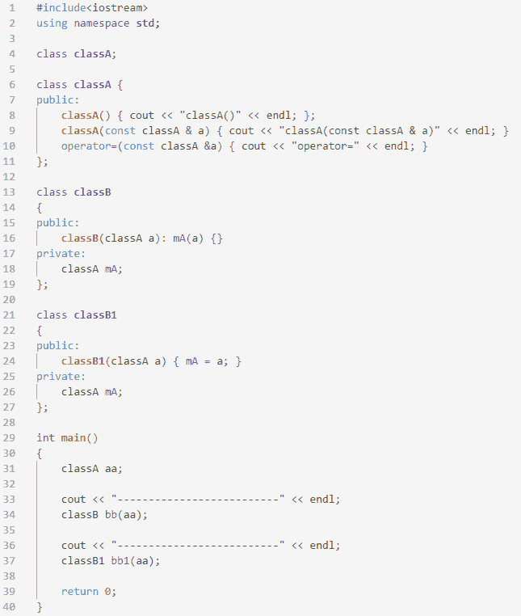
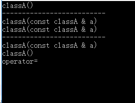
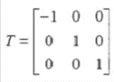
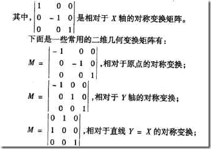

# 完美世界 2016 实习生笔试题

## 1

print()函数是一个类的常成员函数，它无返回值，下列表示中正确的是()

正确答案: C   你的答案: 空 (错误)

```cpp
const void print();
```

```cpp
void const print();
```

```cpp
void print() const;
```

```cpp
void print(const);
```

本题知识点

C++ C 语言

讨论

[牛客 1982867 号](https://www.nowcoder.com/profile/1982867)

const void print(const int num)const 第一个 const 修饰返回类型 第二个 const 修饰参数 第三个 const 修饰调用对象

发表于 2016-07-07 16:56:20

* * *

[MSean](https://www.nowcoder.com/profile/231467)

const 修饰类的成员函数，一般放在函数体后，如 void fun() const; 常成员函数声明：形如 void funcName(参数表) const; 对于常成员函数需要注意：1、其实现部分也要带 const 关键字；2、不能修改类的成员变量，不能调用类中没有被 const 修饰的成员函数（即只能调用常成员函数）；其他参考：http://www.cnblogs.com/this-543273659/archive/2011/07/18/2109922.html

发表于 2016-06-26 10:46:52

* * *

[薪炎拔剑](https://www.nowcoder.com/profile/966607816)

常成员函数含义是通过该函数**只能读取**同一类中的[数据成员](https://baike.baidu.com/item/%E6%95%B0%E6%8D%AE%E6%88%90%E5%91%98)的值，而**不能修改**它。

> 规则：

    1.常成员函数不能更新对象的数据成员    2.当一个对象被声明为常对象，则不能调用该类中的非 const 成员函数

> 常成员函数格式：

    类型说明符 函数名（参数表）const;    int GetX() const;     //声明常成员函数

编辑于 2022-02-11 12:11:28

* * *

## 2

下列对于宏的描述，不正确的是:（）

正确答案: A   你的答案: 空 (错误)

```cpp
宏会带来性能的缺失
```

```cpp
宏不进行类型检查
```

```cpp
宏可以做到函数无法做到的功能
```

```cpp
编译时宏的处理早于函数
```

本题知识点

C 语言

讨论

[华中第一狠人程德彪](https://www.nowcoder.com/profile/616662)

C 选项，宏与类型无关，但是 c++中函数必须指定返回类型，故宏可以做函数不能做的事

发表于 2016-12-29 22:18:10

* * *

[lggaoyuan](https://www.nowcoder.com/profile/173962)

A 选项，不能绝对的说宏会带来性能损失他是不确定的，要根据你使用的情况，比如，调用函数式宏不需要入栈出栈，所以一般情况下，性能会提高点，但是如果使用不当，就会降低性能，比如：函数式宏定义：#define MAX(a,b) ((a)>(b)?(a):(b))

int a[]={9,3,5,2,1,0,8,7,6,4};
int max(n)
{
return n==0?a[0]:MAX(a[n],max(n-1)); 

}int main(){max(9);return 0;}若是普通函数，则通过递归，可取的最大值，时间复杂度为 O（n）。但若是函数式宏定义，则宏展开为( a[n]>max(n-1)?a[n]:max(n-1) )，其中 max(n-1)被调用了两遍，这样依此递归下去，时间复杂度会很高。
所以我感觉 A 项说的绝对了。其实也可以使用排除法。

编辑于 2016-05-05 18:26:20

* * *

[搭上最后一班车](https://www.nowcoder.com/profile/993558)

```cpp
宏只是预定义的函数，在编译阶段不进行类型安全性检查，在编译的时候将对应函数用宏命令替换。对程序性能无影响。

选择 A
```

发表于 2016-05-04 21:33:01

* * *

## 3

四个平面最多把三维空间分成几个部分？（）

正确答案: A   你的答案: 空 (错误)

```cpp
15
```

```cpp
14
```

```cpp
13
```

```cpp
16
```

本题知识点

组合数学 *讨论

[fzyzwrj](https://www.nowcoder.com/profile/126060)

参考 http://www.  查看全部)

编辑于 2016-10-12 19:26:06

* * *

[小小蔡](https://www.nowcoder.com/profile/660881)

一 首先考虑 n 条直线最多把平面分成 an 部分
于是 a0=1 a1=2 a2=4
对于已经有 n 条直线 将平面分成了最多的 an 块
那么加一条直线 他最多与前 n 条直线有 n 个交点 于是被它穿过的区域都被一分为二 那么增加的区域数就是穿过的区域数 也就是这条直线自身被分成的段数 就是 n+1 故 a(n+1)=an+n+1
an=n+(n-1)+...+2+a1=n(n+1)/2 +1
二 再考虑 n 个平面最多把空间分成 bn 个部分
于是 b0=1 b1=2 b2=4
对于已经有 n 个平面 将空间分成了最多的 bn 块
那么加入一个平面 它最多与每个平面相交 在它的上面就会得到至多 n 条交线 
同时被它穿过的空间区域也被它一分为二 那么增加的区域数仍旧是它穿过的区域数 也就是这个平面自身被直线分割成的块数 就是 an
于是 b(n+1)=bn+an
bn=a(n-1)+b(n-1)=...=a(n-1)+a(n-2)+...+a1+b1
=(n-1)n/2 +(n-2)(n-1)/2+...+1*(1+1)/2+n+2
=求和[1 方到(n-1)方]/2 + 求和[1 到(n-1)]/2 +n+1
=n(n-1)(2n-1)/12 +n(n-1)/4 +n+1
=n(n+1)(n-1)/6 +n+1
=(n³+5n+6)/6

发表于 2016-10-01 10:16:27

* * *

[不负时光](https://www.nowcoder.com/profile/317111)

4 个面分成 14 部分的立体图都知道吧，你让水平面不动，其余 3 个面慢慢倾斜，然后交于一点，中间围成的那个图案其实就是一个三棱锥，那这个封闭的空间就是多出来的 1 个，所以就成了 15 个啦

发表于 2016-05-04 11:10:16

* * *

## 4

下面 3 段程序代码的效果一样吗？

```cpp
int b;
(1)const int *a = &b;
(2)int const *a = &b;
(3)int *const a = &b;
```

正确答案: C   你的答案: 空 (错误)

```cpp
(2)=(3)
```

```cpp
(1)=(3)
```

```cpp
(1)=(2)
```

```cpp
都不一样
```

```cpp
都一样
```

本题知识点

C++ C 语言

讨论

[小强强](https://www.nowcoder.com/profile/279887)

const 在*的左边，则指针指向的变量的值不可直接通过指针改变(可以通过其他途径改变);在*的右边，则指针的指向不可变。简记为"左定值，右定向"。

发表于 2016-06-23 09:33:58

* * *

[xyy-](https://www.nowcoder.com/profile/164651)

是否一样只要看 const 出现在 * 的哪边，如果在左边表示被指物是常量，如果在右边表示指针本身是常量。

发表于 2016-05-13 08:09:55

* * *

[爱上溜溜梅 vincent](https://www.nowcoder.com/profile/3911124)

const 在*的哪边，左定值，右定向。

发表于 2017-03-02 21:42:07

* * *

## 5

师徒四人西天取经，途中必需跨过一座桥，四个人从桥的同一端出发，你得帮助他们到达另一端，天色很暗而他们只有一支手电筒，一次同时最多可以有两个人一起经过桥。而过桥的时候必须持有手电筒，所以就得有人把手电筒带来带去，来回桥两端。手电筒不能用丢的方式来传递，四个人的步行速度各不同，若两人同行则以较慢者的速度为准，大师兄需花 1 分钟过桥，二师兄需花 2 分钟过桥，三师兄需花 5 分钟过桥，师傅需花 10 分钟过桥。请问他们最短在多少分钟内过桥？（）

正确答案: B   你的答案: 空 (错误)

```cpp
18
```

```cpp
17
```

```cpp
19
```

```cpp
16
```

本题知识点

数学运算

讨论

[我要找个好工作](https://www.nowcoder.com/profile/248847)

答案应该是 171、大师兄和二师兄过桥，算二师兄的时间也就是 2 分钟 2、大师兄独自拿手电回来 1 分钟 3、三师弟和师傅那手电过桥，算师傅的时间也就是 10 分钟 4、二师弟拿手电回来 2 分钟 5、最后大师兄和二师弟过桥 2 分钟总共 17 分钟

发表于 2016-05-04 10:25:57

* * *

[天天吃粉](https://www.nowcoder.com/profile/935235)

只能过两个人，肯定会把最慢的两个人放在一起（更多同理），然后派目的地里最快的人递电筒回来

发表于 2016-07-21 14:12:09

* * *

[古月胡](https://www.nowcoder.com/profile/526962)

重点还是先埋一个伏笔过去

发表于 2016-10-19 13:37:52

* * *

## 6

查看下面两段代码

```cpp
(1)
class classA {...};
class classB
{
public:
	classB(classA a) {mA = a;}
private:
	classA mA;
};
(2)
class classA {...};
class classB
{
public:
	classB(classA a): mA(a) {}
private:
	classA mA;
};
```

正确答案: B   你的答案: 空 (错误)

```cpp
两种方法产生的结果和效率完全相同
```

```cpp
通常情况下（2）的效率更高
```

```cpp
通常情况下（1）的效率更高
```

```cpp
两种调用方法会产生不同的结果
```

本题知识点

C++

讨论

[牛客 906907 号](https://www.nowcoder.com/profile/906907)

第一种先调用 a 的默认构造函数，在调用 operator=赋值函数，第二中直接调用复制构造函数

发表于 2016-05-04 23:16:37

* * *

[智银圣](https://www.nowcoder.com/profile/465322)

第一个就是调用构造函数，再赋值一次，第二个就是调用拷贝构造函数，直接初始化列表来进行构造(也就是:mA(a))。这就是初始化列表，很方便。而且初始化列表的顺序只和变量声明的顺序有关

发表于 2016-08-15 11:11:34

* * *

[G.zj](https://www.nowcoder.com/profile/3965851)



发表于 2018-06-05 19:47:42

* * *

## 7

对于 int* pa[5];的描述，以下哪个选项是正确的（）

正确答案: A   你的答案: 空 (错误)

```cpp
pa 是一个具有 5 个元素的指针数组，每个元素是一个 int 类型的指针;
```

```cpp
pa 是一个指向数组的指针，所指向的数组是 5 个 int 类型的元素;
```

```cpp
pa[5]表示某个数的第 5 个元素的值;
```

```cpp
pa 是一个指向某个数组中第 5 个元素的指针，该元素是 int 类型的变量
```

本题知识点

C 语言

讨论

[琼子](https://www.nowcoder.com/profile/852048)

A   int* pa[5] 表示指针数组 指一个数组里面装着指针 int (*p)[5]表示数组指针，表示一个指向数组的指针

发表于 2016-05-08 21:49:04

* * *

[咸鱼 25](https://www.nowcoder.com/profile/8873291)

数组运算符优先级高于指针和引用。

发表于 2016-09-13 15:47:00

* * *

[Andp](https://www.nowcoder.com/profile/4469350)

int* pa[5] 表示指针数组 指一个数组里面装着指针 int (*p)[5]表示数组指针，表示一个指向数组的指针

发表于 2017-03-18 21:46:26

* * *

## 8

C++中 32 位单精度浮点数能表示的十进制有效数字是多少位？（）

正确答案: C   你的答案: 空 (错误)

```cpp
9
```

```cpp
6
```

```cpp
7
```

```cpp
8
```

本题知识点

C++

讨论

[阿小奇](https://www.nowcoder.com/profile/375109)

1.  一个浮点数由三部分组成：符号位 S、指数部分 E（阶码）以及尾数部分 M。

2.  单精度浮点数(float)总共用 32 位来表示浮点数，其中尾数用 23 位存储，加上小数点前有一位隐藏的 1(IEEE754 规约数表示法)，2^(23+1) = 16777216。因为 10⁷ < 16777216 < 10⁸，所以说单精度浮点数的有效位数是 7 位。考虑到第 7 位可能的四舍五入问题，所以单精度最少有 6 位有效数字（最小尺寸）。 

3.  同样地：双精度浮点数(double)总共用 64 位来表示浮点数，其中尾数用 52 位存储，     2^(52+1) = 9007199254740992，10¹⁶ < 9007199254740992 < 10¹⁷，所以双精度的有效位数是 16 位。同样四舍五入，最少 15 位。

发表于 2016-05-04 15:26:48

* * *

[不想写代码还读毛计算机](https://www.nowcoder.com/profile/759901)

单精度浮点数的有效位数是 7 位。双精度浮点数的有效位数是 16 位。

发表于 2016-05-30 09:23:21

* * *

[聆听几点几](https://www.nowcoder.com/profile/5404761)

单 7 双 16

发表于 2016-08-10 15:24:23

* * *

## 9

下面哪一种算法不是图像空间的消隐算法?

正确答案: D   你的答案: 空 (错误)

```cpp
画家算法
```

```cpp
Z-buffer 算法
```

```cpp
可见面光线追踪算法
```

```cpp
区间扫描线算法
```

本题知识点

图像处理

讨论

[✧* ꧁Kai](https://www.nowcoder.com/profile/377972)

按消隐空间分类：1）物体空间的消隐算法 (光线投射)：将场景中每一个面与其他每个面比较，求出所有点、边、面遮挡关系。2）图像空间的消隐算法 (Z-buffer、扫描线 Z-buffer 、Warnock)：对屏幕上每个象素进行判断，决定哪个多边形在该象素可见。3）物体空间和图像空间的消隐算法 (画家算法)：在物体空间中预先计算面的可见性优先级，再在图像空间中生成消隐图。

发表于 2016-07-15 17:09:15

* * *

[jhuil](https://www.nowcoder.com/profile/496113)

常见的消隐算法有 z-buffer 算法：算法的原理是：先将待处理的景物表面上的采样点变换到图像空间（屏幕坐标系），计算其深度值，并根据采样点在屏幕上的投影位置，将其深度值与已存贮在 Z 缓存器中相应像素处的原可见点的深度值进行比较。如果新的采样点的深度（z 值）大于原可见点的深度，表明新的采样点遮住了原可见点，则用该采样点处的颜色值更新帧缓存器中相应像素的颜色值，同时用其深度值更新 Z 缓存器中的深度值；否则，不做更改。
区间缓冲区算法；
深度排序算法；
区间细分算法；
光线投射算法；
BSP 树；
多边形区域排序算法；
深度测试算法

发表于 2016-05-08 19:38:07

* * *

[Evelyn-Zhen Liu](https://www.nowcoder.com/profile/463876)

扫面线算法是按照扫描线顺序计算扫面线与多边形的相交区间，一般用来填充，消隐算法是用来解决可见区域的问题。

发表于 2016-06-01 17:39:53

* * *

## 10

short a[10] = {0};sizeof(a)返回:()

正确答案: B   你的答案: 空 (错误)

```cpp
2
```

```cpp
20
```

```cpp
4
```

```cpp
10
```

本题知识点

C 语言

讨论

[signif_sun](https://www.nowcoder.com/profile/7188773)

*   sizeof 对数组就是数组长度*数据类型长度
*   sizeof 对指针就是 int 型长度
*   sizeof 对数据类型自然是数据类型长度
*   sizeof 对结构体需要考虑结构的字节对齐

发表于 2017-06-21 11:57:40

* * *

[牛客 906907 号](https://www.nowcoder.com/profile/906907)

short 为 2 个之节

发表于 2016-05-04 23:17:31

* * *

[v_xchen_v](https://www.nowcoder.com/profile/2961718)

```cpp
int getArray(int a[])
{
    cout<<sizeof(a)<<endl;
} int main()
{ int a[5];
    cout<<sizeof(a)<<" ";

    getArray(a);
}
输出 20 8
sizeof 数组名的时候，输出的是整个数组所占的空间大小。
拓展一下：
当输入作为函数参数时，已经退化为指针，因此在函数中输出 sizeof 数组名是，输出的是指针所占的空间大小。

```

发表于 2017-03-26 21:43:32

* * *

## 11

使用下列二位图形变换矩阵将产生的变换结果为

正确答案: A   你的答案: 空 (错误)

```cpp
以 Y 轴为对称轴的反射图形
```

```cpp
以 Y=X 为对称轴的反射图形
```

```cpp
绕原点旋转 180 度
```

```cpp
以 X 轴为对称轴的反射图形
```

本题知识点

图像处理

讨论

[明月沉西海](https://www.nowcoder.com/profile/136049)

应该选 A

发表于 2016-05-19 11:17:20

* * *

[LittleBaby](https://www.nowcoder.com/profile/306751)

直接用一个点来测试一下便知，比如点（1,2,3），乘以矩阵后，（1,2,3）*r=（-1,2,3），只有 x 坐标变了，说明是关于 y 轴或者 yoz 面对称的。此题是二维图形，所以就是关于 y 轴对称的。

编辑于 2016-09-04 00:26:05

* * *

[zhanjxcom](https://www.nowcoder.com/profile/3667557)

正确答案是 A。     思路这样：设 m=[x,y,z]',则 M*m=[-x ,y,z]'与[x,y,z] '关于 y 轴对称，所以是关于 y 轴的反射图像

发表于 2016-07-11 17:46:51

* * *

## 12

对于 protected 成员，下面说法错误的是:（）

正确答案: A   你的答案: 空 (错误)

```cpp
基类可以访问从所有派生类造型（cast）成基类对象的 protected 成员
```

```cpp
从公有和保护继承的派生类继承的子类里可以访问基类的 protected 成员
```

```cpp
派生类可以定义一个同名的非 protected 成员
```

```cpp
派生类可以访问基类对象的公有 protected 成员
```

本题知识点

C++

讨论

[周星星 _](https://www.nowcoder.com/profile/537870)

程序验证之后，选 ABCD 说法都是对的

```cpp
class Base
```

```cpp
{
protected:
    int ip=666;
    void ptshow()
    {
        cout<<"protected "<<ip<<endl;
    }
public:
    void show()
    {
        cout<<"public "<<ip<<endl;
    }
};
class Derive:public Base
{
public:
    void show()
    {
        cout<<"derive public "<<ip<<endl;
    }
    void ptshow()
    {
        cout<<"same name as Base::ptshow() "<<ip<<endl;
    }
    void myshow()
    {
        cout<<"my public show "<<ip<<endl;
    }
};
int main()
{
    //1\. base
    Base b;
    //cout<<b.ip<<endl;//error: 不能访问自己的 protected 变量
    //b.ptshow();//error: Base::ptshow() is protected
    //b.show();//public 666  //可以访问 protected 变量。

    //2\. derive
    Derive d;
    //cout<<d.ip<<endl;//error: Base::ip is protected
    //d.show();//derive public 666 //从派生类可访问 protected 变量
    //d.ptshow();//和 Base 的 protected 成员重名，ok

    //3\. base pointer point to derive obj
    Base* x=new Derive();//没有虚函数的情况下，x 的行为就是普通 Base 实例
    //x->ptshow();//error: 无法访问 protected 成员
    //x->myshow();//error: Base has no member named 'myshow'
    x->show();//public 666
    return 0;
}

```

编辑于 2016-08-30 17:06:08

* * *

[爱的故事](https://www.nowcoder.com/profile/8633459)

公有：所有成员皆可访问 保护：只有派生类可以访问 私有：只能类本身能访问 证明友元：不受限制

发表于 2016-12-15 21:43:30

* * *

[走位崴了脚](https://www.nowcoder.com/profile/4695029)

****A 选项读起来有点绕，我的理解是派生类对象强制转换为基类对象，基类对象访问派生类的 protected 成员，这是错误的，首先该 protected 成员不一定是基类的，可能是派生类独有的，其次对象都不能访问 protected 成员，protected 成员只能被成员函数访问**** **C 是正确的，****同一个类内部不能定义同名变量，派生类中能定义与基类同名的变量或函数，同名的基类变量会被隐藏，同名的基类函数（非虚函数）会被隐藏，同名同参的基类虚函数会被覆盖****;****D 选项语义模糊，派生类跟基类对象有什么关系？什么叫公有 protected 成员？我认为正确的表述是  派生类可以访问基类的公有或保护成员**

编辑于 2019-06-02 17:57:28

* * *

## 13

当一个类对象的生命周期结束后，关于调用析构函数的描述正确的是:（）

正确答案: C   你的答案: 空 (错误)

```cpp
如果派生类没有定义析构函数，则只调用基类的析构函数
```

```cpp
如果基类没有定义析构函数，则只调用派生类的析构函数
```

```cpp
先调用派生类的析构函数，后调用基类的析构函数
```

```cpp
先调用基类的析构函数，后调用派生类的析构函数
```

本题知识点

C++

讨论

[啥](https://www.nowcoder.com/profile/811262)

没有定义析构函数会有默认析构函数析构过程与构造过程相反，构造过程先调用基类构造函数，再调用派生类构造函数。析构就反过来，先调用派生类析构函数，再调用基类析构函数

发表于 2016-05-08 13:08:56

* * *

[huixieqingchun](https://www.nowcoder.com/profile/551201)

**当用父类指针调用子类创建对象时** ，释放放若父类的析构函数不是虚函数，则只调用父类的析构函数，若析构函数是虚函数，则先调用子类析构函数，再调用父类的析构函数。

发表于 2016-05-18 17:44:06

* * *

[大星星和小猩猩](https://www.nowcoder.com/profile/9374535)

就算没定义析构函数，系统也会给这个类自动生成一个默认析构函数啊，既然有那么肯定会调用的，所以 AB 都错了。析构，先析构派生，再析构基类

发表于 2018-03-22 17:11:38

* * *

## 14

以下哪种 STL 容器中的对象是连续存储的:()

正确答案: B   你的答案: 空 (错误)

```cpp
list
```

```cpp
vector
```

```cpp
map
```

```cpp
set
```

本题知识点

C++

讨论

[牛客职导官方账号](https://www.nowcoder.com/profile/897353)

【正确答案】B
【解析】vec  查看全部)

编辑于 2021-11-17 15:57:19

* * *

[可可岛](https://www.nowcoder.com/profile/6119387)

List 封装了链表,Vector 封装了数组, list 和 vector 得最主要的区别在于:
vector 使用连续内存存储的，他支持[]运算符，而 list 是以链表形式实现的，不支持[]。
Map,Set 属于标准关联容器，使用了非常高效的平衡检索二叉树：红黑树，
他的插入删除效率比其他序列容器高是因为不需要做内存拷贝和内存移动，而直接替换指向节点的指针即可。

发表于 2018-02-06 19:59:10

* * *

[牛客 124903 号](https://www.nowcoder.com/profile/124903)

只有 dqeue 和 vector 是连续存储的

发表于 2016-07-13 08:38:05

* * *

## 15

一个栈的入栈序列是 A、B、C、D、E，则栈的不可能输出序列是：（）

正确答案: A   你的答案: 空 (错误)

```cpp
DCEAB
```

```cpp
ABCDE
```

```cpp
EDCBA
```

```cpp
DECBA
```

本题知识点

栈 *讨论

[shadowsGY](https://www.nowcoder.com/profile/5747385)

```cpp
知识点：栈先入后出
```

```cpp
选项 B：A 入栈，A 出栈；B 入栈，B 出栈；依次就得到 A-B-C-D-E;
```

```cpp
选项 C：A-B-C-D-E 入栈，E-D-C-D-B-A 出栈；
```

```cpp
选项 D：A 入栈，B 入栈，C 入栈；D 入栈，D 出栈，E 入栈，E 出栈，C-B-A 出栈，即可；
```

```cpp
而对于选项 A:
```

```cpp
尽量满足 A-B-C-D-E 入栈大概是这样的：B 入栈，A 入栈，C 入栈，D 入栈，D 出栈，C 出栈，E 入栈，E 出栈，A 出栈，B 出栈。
```

```cpp
技巧：排除法吧，其他都对了，就剩下一个不对了，那就是它了，哈哈。
```

发表于 2018-03-28 11:41:49

* * *

[牛客 161045 号](https://www.nowcoder.com/profile/161045)

栈是先进先出，堆是后进先出。

发表于 2016-05-04 23:25:46

* * *

[NotFear](https://www.nowcoder.com/profile/165758636)

有一个比较简单的排除法：如果入栈顺序为 A,B,C。那么出栈顺序不肯能是 CABD。可以找出与之类似的答案，排除即可

发表于 2018-12-18 18:57:25

* * *

## 16

有四个整数 a、b、c、d，且 c > d，则“a > b”是“a - c > b - d”的：（）

正确答案: A   你的答案: 空 (错误)

```cpp
必要不充分条件
```

```cpp
充分不必要条件
```

```cpp
充要条件
```

```cpp
既不充分也不必要条件
```

本题知识点

数理统计 概率论与数理统计

讨论

[Linsanity](https://www.nowcoder.com/profile/7457652)

1、充分：由（a-b）推（a - c > b - d），假设 a=4，b=3，c=3，d=1，很明显 a-c<b-d；不成立，因此是不充分条件 2、必要： 由（ a - c > b - d ）推（ a-b ）， a - c > b - d 也就是 a-b>c-d，因为 c>d 是已知条件，所以 c-d 大于 0，所以 a-b>0；所以 a>b 成立，因此必要条件答案是**必要不充分**

发表于 2017-05-07 15:06:15

* * *

[牛客 8512970 号](https://www.nowcoder.com/profile/8512970)

D

发表于 2016-06-23 19:36:08

* * *

[TonyLuis](https://www.nowcoder.com/profile/753632)

a - c > b - d 等价于 a-b>c-d 由于 c-d>0 故 a-b>c-d 推出 a-b>0，必要不充分

发表于 2016-08-02 15:49:23

* * *

## 17

下列情况中，不会调用拷贝构造函数的是（）

正确答案: B   你的答案: 空 (错误)

```cpp
用一个对象去初始化同一个类的另一个新对象时
```

```cpp
将类的一个对象赋值给该类的另一个对象时
```

```cpp
函数的形参对象，调用函数进行形参和实参结合时
```

```cpp
函数的返回值是类的对象，函数执行返回调用时
```

本题知识点

C++

讨论

[牛客职导官方账号](https://www.nowcoder.com/profile/897353)

【正确答案】B
【解析】将类  查看全部)

编辑于 2021-11-17 15:58:27

* * *

[一个人的天空](https://www.nowcoder.com/profile/174801)

比如 class Base{};
Base w1;     //构造函数
Base w2(w1);   //拷贝构造函数
w1 = w2;     //赋值运算符

Base w3 = w1; //拷贝构造函数

编辑于 2016-08-05 16:16:32

* * *

[早起的鸟有虫吃](https://www.nowcoder.com/profile/476977)

调用拷贝构造函数的 3 中情况：

```cpp
1、用一个对象去初始化同一个类的另一个新对象时
2、函数的形参对象，调用函数进行形参和实参结合时 3、函数的返回值是类的对象，函数执行返回调用时 将一个对象赋值给另一个对象，两个对象都存在，调用的是赋值构造函数，不涉及内存的分配。
当被赋值的对象不存在调用的是拷贝构造函数。
```

发表于 2016-06-16 16:55:52

* * *

## 18

以下 GPU 缓冲区中哪个是深度缓冲区:()

正确答案: B   你的答案: 空 (错误)

```cpp
frame buffer
```

```cpp
z buffer
```

```cpp
color buffer
```

```cpp
stencil buffer
```

本题知识点

编译和体系结构

讨论

[fnn1](https://www.nowcoder.com/profile/5111959)

OpenGL 在图元 raste  查看全部)

编辑于 2016-08-23 18:42:29

* * *

[bhl1](https://www.nowcoder.com/profile/562804931)

stencil Buffer 模板缓冲区

发表于 2020-06-12 15:53:38

* * *

[细雨湿身](https://www.nowcoder.com/profile/736416)

ColorBuffers  （颜色缓冲区）Depth Buffer（深度缓冲区）Stencil Buffer （模板缓冲区）

发表于 2016-09-23 09:24:08

* * *

## 19

假设下面的函数 foo 会被多线程调用，那么让 i、j、k 三个变量哪些因为线程间共享访问需要加锁保护.()

```cpp
int i = 0;
void foo()
{
	static int j = 0;
	int k = 0;
	i++; j++; k++;
}
```

正确答案: A   你的答案: 空 (错误)

```cpp
i 和 j
```

```cpp
i,j,k 都需要
```

```cpp
i
```

```cpp
j 和 k
```

本题知识点

C++ 并发

讨论

[huixieqingchun](https://www.nowcoder.com/profile/551201)

**多线程调用时要进行保护时，主要是针对全局变量和静态变量的，函数内的局部变量不会受到影响。****这里 i 是全局变量，j 是局部静态变量，所以 要进行保护。**

发表于 2016-05-22 19:47:03

* * *

[不再做蜡笔小熊啦~](https://www.nowcoder.com/profile/262375)

**每个线程都有一个栈，保存自己的局部变量；多线程需要程序员考虑全局变量和静态变量的保护。**

发表于 2016-06-13 10:59:08

* * *

[牛客 493273 号](https://www.nowcoder.com/profile/493273)

可重入函数要求不能使用无保护的全局变量，所以 i 需要加锁，k 为局部变量不用，j 前加了 static，static 其中一个作用就是：延长变量的生存期，使其具有全局变量的作用，所以 j 也需要加锁

发表于 2016-05-05 09:34:46

* * *

## 20

给定 n 个节点的平衡二叉搜索树，每个节点的值是整数。给定一个整数，在树中找出与该整数最接近的节点的最小算法复杂度是（）

正确答案: A   你的答案: 空 (错误)

```cpp
Θ(logn)
```

```cpp
Θ(n²)
```

```cpp
Θ(nlogn)
```

```cpp
Θ(n)
```

```cpp
Θ(1)
```

```cpp
Θ(n!)
```

本题知识点

复杂度 树

讨论

[全能](https://www.nowcoder.com/profile/8720975)

```cpp
平衡二叉树的时间复杂度是 log(n)，如果二叉树的元素个数为 n，那么不管是对树进行插入节点、查找、删除节点都是 log(n)次循环调用就可以了。它的时间复杂度相对于其他数据结构如数组等是最优的。
```

发表于 2016-09-06 11:21:29

* * *

[江湖仔](https://www.nowcoder.com/profile/5186838)

题目中的 logn 都是只以 2 为底的对数，，，，

在二叉排序树中查找一个数时，当这棵二叉树是平衡二叉树时，可以获得最佳的时间复杂度 logn，，，

题目想问的是二叉排序树中时间复杂度最小是多少吧，，，

另外，如果要找最接近 x 的整数，是先找到第一个比 x 大的结点 k，然后拿  k  跟  k 的父亲结点  跟  x 做比较，，，

发表于 2016-08-27 11:46:54

* * *

[cvvz](https://www.nowcoder.com/profile/275046)

我也觉得要 O(n)啊，考虑这样一种情况，根节点是 10，左子树为 1，右子树为 100，现在找 11，最接近的明显是 1，但是用二叉查找树的算法就会找到 100。所以只能一个个的遍历看。

发表于 2016-08-21 18:16:26

* * *

## 21

给定一个长度为 N 的数组，找出一个最长的单调自增子序列（不一定连续，但是顺序不能乱）
例如：给定一个长度为 8 的数组 A{1,3,5,2,4,6,7,8}，则其最长的单调递增子序列为{1,2,4,6,7,8}，长度为 6\.

本题知识点

动态规划

讨论

[世界之末](https://www.nowcoder.com/profile/200805)

```cpp
#include<iostream>
#include"vector"
using namespace std;

int main()
{
	vector<int>result;
	vector<int>result1;
	vector<int>num;
	int T;
	cin >> T;
	while (T--)
	{
		int a;
		cin >> a;
		int n = a;
		while (a--)
		{
			int b;
			cin >> b;
			num.push_back(b);
			result.push_back(1);
		}
		for (int i = 0; i < n; i++)
		{
			result[i] = 1;
			for (int j = i - 1; j >= 0; j--)
			{
				if (num[i]>num[j] && result[i] < (result[j] + 1))
					result[i] = result[j] + 1;
			}
		}

		int max = -1;
		for (int i = 0; i < n; i++)
		{
			if (result[i]>max)
			{
				max = result[i];
			}
		}
                 result.clear();
                num.clear();
		result1.push_back(max);
	}
	for (int i = 0; i < result1.size(); i++)
	{
		cout << result1[i] << endl;
	}
}
```

编辑于 2016-08-29 13:31:36

* * *

[Beannn](https://www.nowcoder.com/profile/955927)

```cpp
第一种方法最普通的方法 dp
#include <stdio.h>

int d[3005];

int dp(int a[], int n)
{
	int i, j;
	int tmp;
	int max=1;
	for(i=0;i<n;i++)
	{
		d[i]=1;
		for(j=i-1;j>=0;j--)
		{
			if(a[j]<a[i])
			{
				tmp=d[j]+1;
				if(tmp>d[i])
					d[i]=tmp;
			}		
		}
		if(d[i]>max)
			max=d[i];
	}
	return max;
}

int main()
{
	int i;
	int n,k;
	int a[3005];
	scanf("%d", &n);
	while(n--)
	{
		scanf("%d", &k);
		for(i=0;i<k;i++)
			scanf("%d", a+i);
		printf("%d\n",dp(a,k));	
	}
	return 0;
}

//第二种方法 qsort+LCS,但是通过不了，因为内存超过限制
#include <stdio.h>
#include <string.h>

void swap(int*arr, int i, int j)
{
	int tmp = arr[i];
	arr[i]=arr[j];
	arr[j]=tmp;
}

void qsort(int s[], int l, int r)
{
	if(l<r)
	{
		int i=l;
		for(int j=i+1;j<=r;j++)
			if(s[j]<s[l])
				swap(s,++i,j);
		swap(s,i,l);
		qsort(s,l,i-1);
		qsort(s,i+1,r);
	}
}

int dp[3005][3005];
int a[3005],b[3005];

int LCS(int s[], int sc[], int len)
{
	for(int i=1; i<=len;i++)
		for(int j=1;j<=len;j++)
		{
			if(s[i-1] == sc[j-1])
				dp[i][j]=dp[i-1][j-1]+1;
			else if(dp[i-1][j]>dp[i][j-1])
				dp[i][j]=dp[i-1][j];
			else 
				dp[i][j]=dp[i][j-1];
		}

	return dp[len][len];
}

int main()
{
	int i;
	int n,k;
	scanf("%d", &n);
	while(n--)
	{
		scanf("%d", &k);
		for(i=0;i<k;i++)
			scanf("%d", a+i);
			memcpy(b,a,sizeof(int)*k);
		qsort(b,0,k-1);
		printf("%d\n",LCS(a,b,k));	
	}
	return 0;
}
```

发表于 2016-05-09 21:14:51

* * *

[名俗人](https://www.nowcoder.com/profile/172251051)

动态规划题，一般先写出问题的最优子结构的关系式，如下：
**d[n] = max{ d[i]+1 | a[i] < a[n], 0 =< i <= n }**
其中，a[i]表示数组下标为 i 的数，d[i]表示以 a[i]为结尾的递增序列的长度。
很明显，数组的最长递增子序列的长度为 d[0]到 d[n]中的一个值

代码如下：

```cpp
import java.util.Scanner;

public class Main {
    public static void main(String[] args) {
        Scanner scanner = new Scanner(System.in);
        int T = scanner.nextInt();
        for (int i = 0; i < T; i++) {
            int n = scanner.nextInt();
            int[] array = new int[n];
            for (int j = 0; j < n; j++) {
                array[j] = scanner.nextInt();
            }
            int len = getLisLen(array, n);
            System.out.println(len);
        }

        scanner.close();
    }

    public static int getLisLen(int[] array, int n) {
        int[] d = new int[n];
        int max = 0;
        for (int i = 0; i < n; i++) {
            d[i] = 1;
            for (int j = 0; j < i; j++) {
                if (array[j] < array[i]) {
                    d[i] = Integer.max(d[i], d[j]+1); 
                }
            }
            max = Integer.max(max, d[i]);
        }
        return max;
    }
}
```

编辑于 2018-06-28 19:14:23

* * *

## 22

给定一个长度为 N 的数组，找出一个最长的单调自增子序列（不一定连续，但是顺序不能乱）
例如：给定一个长度为 8 的数组 A{1,3,5,2,4,6,7,8}，则其最长的单调递增子序列为{1,2,4,6,7,8}，长度为 6\.

本题知识点

动态规划

讨论

[OnePiece~~](https://www.nowcoder.com/profile/753373)

```cpp
#include<iostream>
#include<vector>
using namespace std;
intmain(){
    intn;
    while(cin>>n){
        for(intm=0;m<n;m++){
            intsize,max=0,lastpos;
            cin>>size;
            vector<int>array(size);
            for(intj=0;j<size;j++){
                cin>>array[j];
            }
            vector<int> dp(size);
            vector<int> pos(size);
            for(inti=0;i<size;i++){
                dp[i]=1;
                for(intj=0;j<i;j++){
                    if(array[i]>array[j]){
                        if(dp[j]+1>dp[i]){
                            dp[i]=dp[j]+1;
                            pos[i]=j;
                        }
                        if(max<dp[i]){
                            max=dp[i];
                            lastpos=i; 
                        }  
                    }
                }
            }
            vector<int>ans;
            for(inti=0;i<max;i++){
                ans.push_back(array[lastpos]);
                lastpos=pos[lastpos];
            }
            for(inti=max-1;i>=1;i--)
                cout<<ans[i]<<' ';
            cout<<ans[0]<<endl;
        }
    }
    return0;
}
```

编辑于 2016-08-07 16:16:27

* * *

[bloodycoder](https://www.nowcoder.com/profile/740202)

这个题用 dp，跟最长子序列差不多，只是要记录一下上一个点的位置。这个算法复杂度 o(n²).如果用排序可以优化到 o(nlog(n))

```cpp
#include <iostream>
#include <string.h>
using namespace std;
struct saveT{
	int longest; //储存以这个数为尾的最长子序列的长度
	int last_point;//上一个点
};
int main(){
	int t,n,array[3005],max_num,last_item,answer[3005];
	saveT save[3005];
	memset(save,0,sizeof(save));
	cin>>t;
	for(int i=0;i<t;i++){
		max_num = last_item = 0;
		cin>>n;
		for(int j=0;j<n;j++){
			cin>>array[j];
		}
		for(int j=0;j<n;j++){
			save[j].longest = 1;
			save[j].last_point = j;
			for(int k=0;k<j;k++){
				if(array[j]>array[k]){ //找这个元素之前的，如果自己比他大
					if(save[k].longest+1>save[j].longest){//并且他的最长子序列加 1 比自己长
						save[j].longest = save[k].longest+1;
						save[j].last_point = k;
						if(max_num<save[j].longest){
							max_num = save[j].longest;
							last_item = j;
						}
					}
				}
			}
		}
		for(int j=0;j<max_num;j++){
			answer[j] = last_item;
			last_item = save[last_item].last_point;
		}
		for(int j=max_num-1;j>0;j--){
			cout<<array[answer[j]]<<" ";
		}
        cout<<array[answer[0]]<<endl;
	}
}
```

编辑于 2016-05-16 11:41:18

* * *

[小太阳照亮明天](https://www.nowcoder.com/profile/6800111)

23

发表于 2018-08-29 19:31:09

* * *

## 23

小萌是个 WOW 发烧友，每天都痴迷于他的法师号。精诚所至金石为开，小萌穿越到 WOW 的世界中了...
初来乍到的小萌在暴风城的小巷中，遇见了一位善良的德鲁伊。德鲁伊听了小萌的故事，打算帮助他在 WOW 这个世界好好活下去，于是，把自己的东西都给了小萌了...
德鲁伊的东西太多了，于是小萌去拍卖行买了几个包裹，一切妥当之后，小萌开始把东西装进包裹里。
不过，因为小萌穿越时候脑袋先着地，所以脑子不好用，每次他拿起一个物品，要不装进包里，要不就直接扔掉...
而且，一个背包一旦不往里装东西，小萌就会封上口不再用...
现在，告诉你小萌每个物品的体积，背包的个数和容量，以及小萌拿物品的顺序，你要帮助小萌求出他能拿走多少东西。

本题知识点

穷举

讨论

[wifi](https://www.nowcoder.com/profile/930226)

没看明白题目要干嘛

发表于 2016-06-19 09:58:17

* * *

[DarcyX](https://www.nowcoder.com/profile/330781)

```cpp
// 这题测试数据就有问题的。
#include <iostream>
using namespace std;
struct Bag{
    int bagsize;
    int leftsize;
    int leftnum;
    int rslt;
};

int _max = 0;

void getN(int arr[],int n,int k,Bag b){
    if(n == k || (b.leftnum == 0 && b.leftsize == 0)){
        if(b.rslt > _max){
            _max = b.rslt;
        }
        return;
    }
    getN(arr,n,k + 1,b);
    if(b.leftsize >= arr[k]){
        b.leftsize -= arr[k];
        ++ b.rslt;
        getN(arr,n,k+1,b);
    }else if(b.leftsize < arr[k] && b.leftnum > 0 && b.bagsize > arr[k]){
        --b.leftnum;
        b.leftsize = b.bagsize - arr[k];
        ++b.rslt;
        getN(arr,n,k+1,b);
    }
}

int main(){
    int *arr = NULL;
    int n;
    int N, T, M;
    while(cin >> n) {
        for(int i = 0;i < n;++i) {
            cin >> N >> T >> M;          
            _max = 0;
            arr = new int[N];
            for(int i = 0;i < N;++i)
                cin >> arr[i];
            Bag b;
            b.bagsize = T;
            b.leftsize = 0;
            b.leftnum = M;
            b.rslt = 0;
            getN(arr, N, 0, b);

            cout << _max << endl;
            delete[] arr;
        }
    }     

    return 0;
}

```

发表于 2016-05-19 22:01:19

* * *

[anybody](https://www.nowcoder.com/profile/126520)

```cpp
#include <iostream>
#include <string.h>
#include <vector>
#include <algorithm>
using namespace std;

int main()
{
	int test;
	cin >> test;
	while (test--)
	{
		int dp[25][25][25];
		int n, t, m, a[25];
		cin >> n >> t >> m;
		for (int i = 1; i <= n; i++)
			cin >> a[i];
		memset(dp, 0, sizeof(dp));
		for (int i = 1; i <= m; ++i) // 前 i 个背包
		{
			for (int j = 1; j <= n; ++j) // 前 j 件物品
			{
				for (int k = 0; k <= t; ++k) // 容量为 k
				{
					if (k - a[j] >= 0) // 放入
						dp[i][j][k] = max(max(dp[i][j - 1][k], dp[i][j - 1][k - a[j]] + 1), dp[i - 1][j][t]); 
					// 放入当前背包
					else // 丢弃
						dp[i][j][k] = max(dp[i][j - 1][k], dp[i - 1][j][t]);
					//cout<<i <<" 个背包. "<<j<<" 件物品. "<<k<<" 容量  "<<dp[i][j][k]<<endl;
				}
			}
		}
		cout << dp[m][n][t] << endl;
	}
	return 0;
}
```

发表于 2016-07-22 17:26:07

* * ***