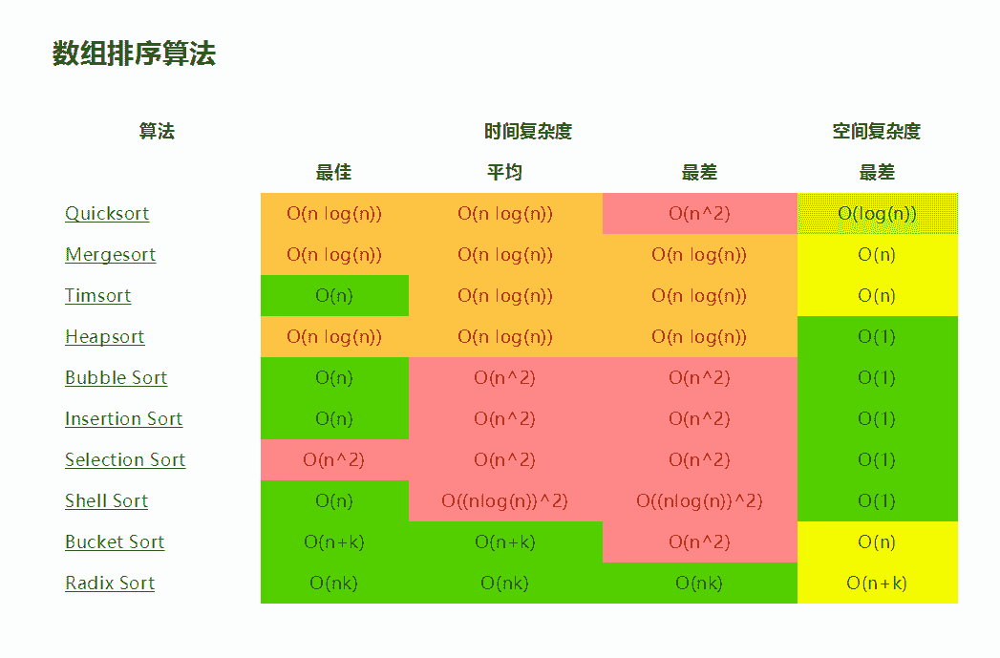
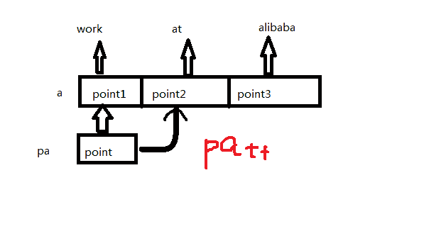
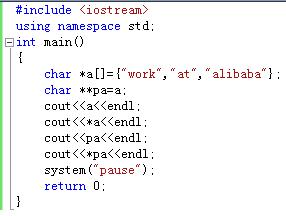
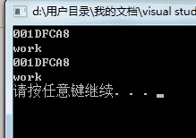
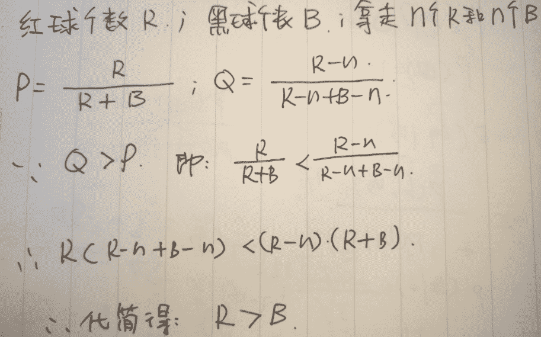
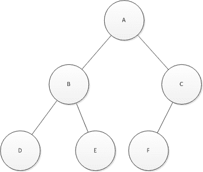
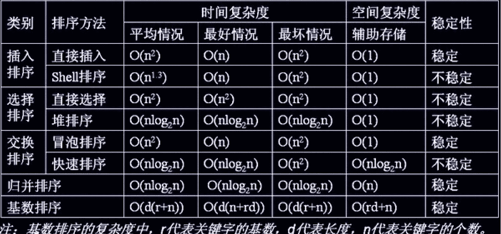

# 阿里巴巴 2017 实习生笔试题（一）

## 1

关于 c++的 inline 关键字,以下说法正确的是()

正确答案: D   你的答案: 空 (错误)

```cpp
使用 inline 关键字的函数会被编译器在调用处展开
```

```cpp
头文件中可以包含 inline 函数的声明
```

```cpp
可以在同一个项目的不同源文件内定义函数名相同但实现不同的 inline 函数
```

```cpp
定义在 Class 声明内的成员函数默认是 inline 函数
```

```cpp
优先使用 Class 声明内定义的 inline 函数
```

```cpp
优先使用 Class 实现的内 inline 函数的实现
```

本题知识点

C++

讨论

[LittleBaby](https://www.nowcoder.com/profile/306751)

A 项错误，因为使用 inline 关键字的函数只是用户希望它成为内联函数，但编译器有权忽略这个请求，比如：若此函数体太大，则不会把它作为内联函数展开的。

B 项错误，头文件中不仅要包含 inline 函数的声明，而且必须包含定义，且在定义时必须加上 inline 。【关键字 inline 必须与函数定义体放在一起才能使函数成为内联，仅将 inline 放在函数声明前面不起任何作用】

C 项错误， inline 函数可以定义在源文件中，但多个源文件中的同名 inline 函数的实现必须相同。一般把 inline 函数的定义放在头文件中更加合适。

D 项正确，类内的成员函数，默认都是 inline 的。【定义在类声明之中的成员函数将自动地成为内联函数】

EF 项无意思，不管是 class 声明中定义的 inline 函数，还是 class 实现中定义的 inline 函数，不存在优先不优先的问题，因为 class 的成员函数都是 inline 的，加了关键字 inline 也没什么特殊的。

编辑于 2016-09-04 11:21:05

* * *

[搁浅的鱼儿](https://www.nowcoder.com/profile/961875)

 内联函数：

Tip： 只有当函数只有 10 行甚至更少时才将其定义为内联函数.

定义: 当函数被声明为内联函数之后, 编译器会将其内联展开, 而不是按通常的函数调用机制进行调用.
优点: 当函数体比较小的时候, 内联该函数可以令目标代码更加高效. 对于存取函数以及其它函数体比较短, 性能关键的函数, 鼓励使用内联.
缺点: 滥用内联将导致程序变慢. 内联可能使目标代码量或增或减, 这取决于内联函数的大小. 内联非常短小的存取函数通常会减少代码大小, 但内联一个相当大的函数将戏剧性的增加代码大小. 现代处理器由于更好的利用了指令缓存, 小巧的代码往往执行更快。
结论: 一个较为合理的经验准则是, 不要内联超过 10 行的函数. 谨慎对待析构函数, 析构函数往往比其表面看起来要更长, 因为有隐含的成员和基类析构函数被调用!
另一个实用的经验准则: 内联那些包含循环或 switch 语句的函数常常是得不偿失 (除非在大多数情况下, 这些循环或 switch 语句从不被执行).
有些函数即使声明为内联的也不一定会被编译器内联, 这点很重要; 比如虚函数和递归函数就不会被正常内联. 通常, 递归函数不应该声明成内联函数.(递归调用堆栈的展开并不像循环那么简单, 比如递归层数在编译时可能是未知的, 大多数编译器都不支持内联递归函数). 虚函数内联的主要原因则是想把它的函数体放在类定义内, 为了图个方便, 抑或是当作文档描述其行为, 比如精短的存取函数.

-inl.h 文件：

Tip： 复杂的内联函数的定义, 应放在后缀名为 -inl.h 的头文件中.

内联函数的定义必须放在头文件中, 编译器才能在调用点内联展开定义. 然而, 实现代码理论上应该放在 .cc 文件中, 我们不希望 .h 文件中有太多实现代码, 除非在可读性和性能上有明显优势.

如果内联函数的定义比较短小, 逻辑比较简单, 实现代码放在 .h 文件里没有任何问题. 比如, 存取函数的实现理所当然都应该放在类定义内. 出于编写者和调用者的方便, 较复杂的内联函数也可以放到 .h 文件中, 如果你觉得这样会使头文件显得笨重, 也可以把它萃取到单独的 -inl.h 中. 这样把实现和类定义分离开来, 当需要时包含对应的 -inl.h 即可。A **如果只声明含有 inline 关键字，就没有内联的效果。** 内联函数的定义必须放在头文件中, 编译器才能在调用点内联展开定义.   有些函数即使声明为内联的也不一定会被编译器内联, 这点很重要; 比如虚函数和递归函数就不会被正常内联. 通常, 递归函数不应该声明成内联函数.B **内联函数应该在头文件中定义**，这一点不同于其他函数。编译器在调用点内联展开函数的代码时，必须能够找到 inline 函数的定义才能将调用函数替换为函数代码，而对于在头文件中仅有函数声明是不够的。C 当然**内联函数定义也可以放在源文件中，但此时只有定义的那个源文件可以用它**，而且必须为每个源文件拷贝一份定义(即每个源文件里的定义必须是完全相同的)，当然即使是放在头文件中，也是对每个定义做一份拷贝，只不过是编译器替你完成这种拷贝罢了。但相比于放在源文件中，放在头文件中既能够确保调用函数是定义是相同的，又能够保证在调用点能够找到函数定义从而完成内联(替换)。对于由两个文件 compute.C 和 draw.C 构成的程序来说，程序员不能定义这样的 min()函数，它在 compute.C 中指一件事情，而在 draw.C 中指另外一件事情。如果两个定义不相同，程序将会有未定义的行为：

      为保证不会发生这样的事情，建议把 inline 函数的定义放到头文件中。在每个调用该 inline 函数的文件中包含该头文件。这种方法保证对每个 inline 函数只有一个定义，且程序员无需复制代码，并且不可能在程序的生命期中引起无意的不匹配的事情。

D **正确。** **定义在类声明之中的成员函数将自动地成为内联函数**，例如：

```cpp
class A {   public:  void Foo(int x, int y) { ... }   // 自动地成为内联函数   } 
```

EF 在每个调用该 inline 函数的文件中包含该头文件。这种方法保证对每个 inline 函数只有一个定义，且程序员无需复制代码，并且不可能在程序的生命期中引起无意的不匹配的事情。**最好只有一个定义！**

发表于 2016-06-15 12:19:37

* * *

[加波沃克孜](https://www.nowcoder.com/profile/6735614)

垃圾题目！A 选项说的是会，又没说一定会！而且这句话隐含这是一个按标准定义的 inline 函数，说会没什么问题。如果真要考 cpp primer 的灰线知识还是换题吧！B 说的是可以包含声明，我先在 head 文件里声明再在里面定义不就好了？

发表于 2016-07-14 15:05:16

* * *

## 2

对 N 个数进行排序,在各自最优条件下以下算法时间复杂度最低的是()

正确答案: C D   你的答案: 空 (错误)

```cpp
快速排序
```

```cpp
堆排序
```

```cpp
冒泡排序
```

```cpp
直接插入排序
```

```cpp
选择排序
```

```cpp
归并排序
```

本题知识点

排序 *讨论

[zhisheng_blog](https://www.nowcoder.com/profile/616717)



发表于 2016-08-24 11:17:28

* * *

[众神之主](https://www.nowcoder.com/profile/878338)

。。我只想知道，冒泡为什么不对

发表于 2016-05-08 16:28:32

* * *

[win 君](https://www.nowcoder.com/profile/538899)

快速排序 nlogn 堆排序 nlogn 冒泡排序 在改良的冒泡下 最优时间复杂度为 n 插入排序 最优下 n 选择排序 n*n 归并 nlogn

发表于 2016-05-20 10:10:40

* * *

## 3

甲乙两个一样大小的杯子各自分别装着小于一半容积的水和酒精。现将甲杯子里的一部分水倒入乙杯子；之后将乙杯子的混合液倒入一些到甲杯子，此时甲杯子的液体恢复到最初的状态。假定水和酒精混合之后的体积等于混合之前的体积之和。 那么以下说法正确的是？

正确答案: A   你的答案: 空 (错误)

```cpp
甲杯子里的酒精体积等于乙杯子里的水的体积
```

```cpp
甲杯子里的酒精的体积等于乙杯子里的酒精的体积
```

```cpp
甲杯子里的水的体积等于乙杯子里的酒精的体积
```

```cpp
甲杯子里的水的体积等于乙杯子里的水的体积
```

```cpp
甲杯子里的液体高于乙杯子里的液位
```

```cpp
以上都不对
```

本题知识点

数学运算

讨论

[牛客 788634 号](https://www.nowcoder.com/profile/788634)

设 甲乙杯子容量为 100mL，即 初始条件甲乙杯子给为 50mL 水和酒精，第一次甲到 x mL 水给乙            乙杯子容量为：50+x            甲杯子容量为：50-x 乙杯子到 y mL 混合溶液给甲，假定 y 有 t 毫升水和 k 毫升酒精组成，此时           乙杯子容量为：50+x-y=50-x-t-k           甲杯子容量为：50-x+t+k 已知甲恢复到初始高度，则  50-x+t+k = 50  即 x = t+k 即 x-t = k  说明 乙杯子中剩余水的容量等于甲杯子中酒精的容量

发表于 2016-05-05 19:22:04

* * *

[wangchenphoebe](https://www.nowcoder.com/profile/225981)

最初，甲杯子只有酒精，乙杯子只有水。最后，甲杯子恢复到最初的高度，只是混入了一些酒精。所以从乙杯子拿出多少酒精给甲杯子，乙杯子就有多少甲杯子的水。ps:题目已经假设 酒精和水混合后等于两者容量之和

发表于 2016-06-23 18:40:04

* * *

[沫沫棒棒](https://www.nowcoder.com/profile/6551170)

他没说甲乙两个杯子里最开始的液体容量一样，所以不能说甲的水与乙的酒精一样多

发表于 2016-09-01 15:07:01

* * *

## 4

```cpp
#include <stdio.h>
int main() {
    char *a[] = {"work", "at", "alibaba"};
    char **pa = a;
    pa++;
    printf("%s", *pa);
}
```

下列程序的执行结果是()

正确答案: A   你的答案: 空 (错误)

```cpp
at
```

```cpp
atalibaba
```

```cpp
ork
```

```cpp
orkatalibaba
```

```cpp
编译错误
```

```cpp
运行溢出
```

本题知识点

C 语言

讨论

[csbdong](https://www.nowcoder.com/profile/716804)



发表于 2016-05-21 22:42:24

* * *

[嘟嘟 U](https://www.nowcoder.com/profile/140637)

 

发表于 2016-05-26 19:18:36

* * *

[加波沃克孜](https://www.nowcoder.com/profile/6735614)

首先对编译器来说没有数组这一概念，数组都被看成指针，所以 a[ ]就是*a，那么就是**a 换成了**pa，pa 即是 a，换个名字而已，根据数组的++，也就是取 a[1][ ]的值，即“at”。

发表于 2016-07-14 13:29:52

* * *

## 5

一个黑盒子里有若干红球和黑球,随机取出一个球是红球的概率是 p.现在从黑盒子中拿出等量的红球和黑球后,随机取出一个球是红球的概率是 q,如果 p<q>正确答案: B   你的答案: 空 (错误)

```cpp
最初红球的个数小于黑球的个数
```

```cpp
最初红球的个数大于黑球的个数
```

```cpp
最初红球的个数是黑球的的 2 倍
```

```cpp
最初红球的个数是黑球的 1/2
```

```cpp
无法判断最初红球和黑球谁多谁少
```

本题知识点

概率统计 *概率论与数理统计* *讨论

[yzh](https://www.nowcoder.com/profile/2959004)



发表于 2016-08-28 13:59:46

* * *

[blueyi](https://www.nowcoder.com/profile/822194)

极端想，假如拿过只后只剩下黑球，那么再次取红球的概率将为 0，所以剩下的肯定只能是红球，此时概率为 1，当然会大于 p。所以红球一定比黑球多

发表于 2016-05-08 18:04:30

* * *

[wentguo](https://www.nowcoder.com/profile/803846)

方法一：选择题，举特例，分三种情况，设定红黑球的个数。例如，假设红：3，黑：2，取出各为 1，则 p=3/5, q=2/3, p<q, 符合题意，所以红球个数大于黑球个数。方法二：设红球 m 个，黑球 n 个，取出各为 x，则 m/(m+n) < (m-x)/(m+n-2x), 化简得：m>n，即红球个数大于黑球个数。

发表于 2016-05-10 22:23:35

* * *

## 6

以下二叉树的后序遍历结果是（）


正确答案: D   你的答案: 空 (错误)

```cpp
(ABCDEF)
```

```cpp
(ABDECF)
```

```cpp
(FCEDBA)
```

```cpp
(DEBFCA)
```

```cpp
(FEDCBA)
```

```cpp
(EDBFCA)
```

本题知识点

树

讨论

[Woods](https://www.nowcoder.com/profile/329815)

我想知道下边做对的同志们是如何做到的 23333333

发表于 2016-06-05 17:01:23

* * *

[神奇航海士](https://www.nowcoder.com/profile/717090)

原图是估计是这样的，出题者估计是忘记上图了

发表于 2016-07-20 14:47:41

* * *

[龙之吟](https://www.nowcoder.com/profile/5852143)

先序遍历：根左右；中序：左根右；后序：左右根

发表于 2018-02-26 19:21:55

* * *

## 7

在 TCP/IP 建立连接过程中,客户端和服务器端的状态转移说法错误的是?

正确答案: D   你的答案: 空 (错误)

```cpp
经历 SYN_RECV 状态
```

```cpp
经历 SYN_SEND 状态
```

```cpp
经历 ESTABLISHED 状态
```

```cpp
经历 TIME_WAIT 状态
```

```cpp
服务器在收到 syn 包时将加入半连接队列
```

```cpp
服务器接受到客户端的 ack 包后将从半连接队列删除
```

本题知识点

网络基础

讨论

[quietbei](https://www.nowcoder.com/profile/239853)

TCP 建立连接时，首先客户端和服务器处于 close 状态。然后客户端发送 SYN 同步位，此时客户端处于 SYN-SEND 状态，服务器处于 lISTEN 状态，当服务器收到 SYN 以后，向客户端发送同步位 SYN 和确认码 ACK，然后服务器变为 SYN-RCVD，客户端收到服务器发来的 SYN 和 ACK 后，客户端的状态变成 ESTABLISHED(已建立连接)，客户端再向服务器发送 ACK 确认码，服务器接收到以后也变成 ESTABLISHED。然后服务器客户端开始数据传输

发表于 2016-05-24 16:19:41

* * *

[TonyLuis](https://www.nowcoder.com/profile/753632)

A、B、C 是 TCP 三次握手的状态，D 是四次挥手后发送端的最后一个状态。详细状态转移图见 [`www.cnblogs.com/tonyluis/p/5729531.html`](http://www.cnblogs.com/tonyluis/p/5729531.html)
处在 SYNC_RECV 的 TCP 连接称为半连接，并存储在内核的半连接队列中，在内核收到对端发送的 ack 包时会查找半连接队列，并将符合的 requst_sock 信息存储到完成三次握手的连接的队列中，然后删除此半连接。
因此答案是：D 

编辑于 2016-08-02 15:42:32

* * *

[不吃葡萄皮](https://www.nowcoder.com/profile/179155)

TIME_WAIT 是拆除阶段的

发表于 2016-05-11 08:35:30

* * *

## 8

假设在 n 进制下,下面的等式成立,n 值是()240*12=2880

正确答案: F   你的答案: 空 (错误)

```cpp
19
```

```cpp
18
```

```cpp
17
```

```cpp
16
```

```cpp
15
```

```cpp
以上都对
```

本题知识点

编译和体系结构

讨论

[牛客 788634 号](https://www.nowcoder.com/profile/788634)

假设为 n 进值则 [2*(n²)+4*(n¹)+0] * [1*n+2]=2*（n³）+8*(n²)+8*(n¹) 化简后居然为很等式 ，n 为任一值

发表于 2016-05-05 19:53:42

* * *

[huixieqingchun](https://www.nowcoder.com/profile/551201)

**题目中可以看出，如果用 10 进制代入时，等号左右两边是相等的。因为 10 进制相等的两个数转化为任意进制都会相等，所以答案是多个。**

发表于 2016-06-04 09:53:42

* * *

[祁十](https://www.nowcoder.com/profile/967022)

x 进制就是访 x  进 1，不到 x 都可以进行基本运算，所以看下面，比 x>=9 都可以       2 4 0x        1 2       4 8 0    2 4 0=  2 8 8 0

发表于 2016-08-01 11:24:30

* * *

## 9

下面关于系统调用的描述中,错误的是()

正确答案: B   你的答案: 空 (错误)

```cpp
系统调用把应用程序的请求传输给系统内核执行
```

```cpp
系统调用中被调用的过程运行在"用户态"中
```

```cpp
利用系统调用能够得到操作系统提供的多种服务
```

```cpp
是操作系统提供给编程人员的接口
```

```cpp
系统调用给用户屏蔽了设备访问的细节
```

```cpp
系统调用保护了一些只能在内核模式执行的操作指令
```

本题知识点

Linux

讨论

[Evan 丶.](https://www.nowcoder.com/profile/6090029)

系统调用通过中断完成，这一过程中系统由用户态变为内核态。 在内核态下，系统可以无限制的访问内核资源

发表于 2016-10-12 12:42:25

* * *

[luupee](https://www.nowcoder.com/profile/339661)

```cpp
不明白 B 为什么错误，系统调用中“被调用的过程”，这个“被调用的过程”模糊不清，不知道是说用户态程序调用系统调用函数这个过程，还是指系统调用的过程。
```

发表于 2016-07-30 14:23:39

* * *

[cherry1993](https://www.nowcoder.com/profile/459944)

用户空间与系统空间所在的内存区间不一样，同样，对于这两种区间，CPU 的运行状态也不一样。 在用户空间中，CPU 处于"用户态"；在系统空间中，CPU 处于"系统态"。

发表于 2016-05-06 18:19:36

* * *

## 10

关于 linux 的 I/O 复用接口 select 和 epoll,下列说法错误的是()

正确答案: C   你的答案: 空 (错误)

```cpp
select 调用时会进行线性遍历,epoll 采用回调函数机制,不需要线性遍历
```

```cpp
select 的最大连接数为 FD_SETSIZE
```

```cpp
select 较适合于有大量并发连接,且活跃链接较多的场景
```

```cpp
epoll 较适用于有大量并发连接，但活跃连接不多的场景
```

```cpp
epoll 的效率不随 FD 数目增加而线性下降
```

```cpp
epoll 通过共享存储实现内核和用户的数据交互
```

本题知识点

Linux

讨论

[牛客 9224710 号](https://www.nowcoder.com/profile/9224710)

不懂

发表于 2016-06-28 11:22:54

* * *

[sunshine707](https://www.nowcoder.com/profile/553379)

select 和 epoll 效率差异的原因：select 采用轮询方式处理连接，epoll 是触发式处理连接。Select:1.Socket 数量限制：该限制可操作的 Socket 数由 FD_SETSIZE 决定，内核默认 32*32=1024\.2.操作限制：通过遍历 FD_SETSIZE(1024)个 Socket 来完成调度，不管哪个 Socket 是活跃的，都遍历一遍。Epoll1.Socket 数量无限制：该模式下的 Socket 对应的 fd 列表由一个数组来保存，大小不限制（默认 4k）。2.操作无限制：基于内核提供的反射模式，有活跃 Socket 时，内核访问该 Socket 的 callback，不需要遍历轮询。但当所有的 Socket 都活跃的时候，所有的 callback 都被唤醒，会导致资源的竞争。既然都是要处理所有的 Socket，那么遍历是最简单最有效的实现方式。

发表于 2016-05-06 17:11:46

* * *

[dandna](https://www.nowcoder.com/profile/9460192)

select

*   select 能监控的描述符个数由内核中的 FD_SETSIZE 限制，仅为 1024，这也是 select 最大的缺点，因为现在的服务器并发量远远不止 1024。即使能重新编译内核改变 FD_SETSIZE 的值，但这并不能提高 select 的性能。
*   每次调用 select 都会线性扫描所有描述符的状态，在 select 结束后，用户也要线性扫描 fd_set 数组才知道哪些描述符准备就绪，等于说每次调用复杂度都是 O（n）的，在并发量大的情况下，每次扫描都是相当耗时的，很有可能有未处理的连接等待超时。
*   每次调用 select 都要在用户空间和内核空间里进行内存复制 fd 描述符等信息。

**poll**

*   poll 使用 pollfd 结构来存储 fd，突破了 select 中描述符数目的限制。
*   与 select 的后两点类似，poll 仍然需要将 pollfd 数组拷贝到内核空间，之后依次扫描 fd 的状态，整体复杂度依然是 O（n）的，在并发量大的情况下服务器性能会快速下降。

**epoll**

*   epoll 维护的描述符数目不受到限制，而且性能不会随着描述符数目的增加而下降。
*   服务器的特点是经常维护着大量连接，但其中某一时刻读写的操作符数量却不多。epoll 先通过 epoll_ctl 注册一个描述符到内核中，并一直维护着而不像 poll 每次操作都将所有要监控的描述符传递给内核；在描述符读写就绪时，通过回掉函数将自己加入就绪队列中，之后 epoll_wait 返回该就绪队列。也就是说，epoll 基本不做无用的操作，时间复杂度仅与活跃的客户端数有关，而不会随着描述符数目的增加而下降。
*   epoll 在传递内核与用户空间的消息时使用了内存共享，而不是内存拷贝，这也使得 epoll 的效率比 poll 和 select 更高。

发表于 2016-07-26 15:30:41

* * *

## 11

有无限的水源一个 5L 无刻度桶和一个 7L 无刻度桶，则只利用这两个无刻度桶，将不能获得()L 水？

正确答案: F   你的答案: 空 (错误)

```cpp
2
```

```cpp
3
```

```cpp
6
```

```cpp
8
```

```cpp
11
```

```cpp
以上均能获得
```

本题知识点

数学运算

讨论

[塞达斯兰](https://www.nowcoder.com/profile/223352)

均可获得。
2：7L 装满，倒满 5L，剩 2L
3：5L 装满，倒 7L；再装满 5L，倒满 7L，剩 3L
6：5L 装满，倒 7L；再装满 5L，倒满 7L，剩 3L；倒给 7L，5L 装满，再倒满 7L，剩 1L；倒给 7L，5 升装满，共 6L。
8：5L 装满，倒 7L；再装满 5L，倒满 7L，剩 3L；倒给 7L，5L 装满，共 8L
11：7L 装满，倒满 5L，剩 2L；倒给 5L，7L 装满，再倒满 5L，剩 4L；倒给 5L，7L 倒满，共 11L

发表于 2016-05-06 02:11:34

* * *

[陈亦文](https://www.nowcoder.com/profile/714163)

上面都是强推啊，其实只要满足 5a+7b=t 即可。a, b 可取任意整数，t 就是能获得的容量数。

发表于 2016-07-02 11:17:50

* * *

[搬一块叫 CV 的砖](https://www.nowcoder.com/profile/102354)

做法：１、求最大公约数，５和７的最大公约数是１２、任何最大公约数倍数的答案都是可以的。本题而言就是所有１的倍数。

发表于 2016-09-17 22:40:00

* * *

## 12

7 的 2014 次方这个整数的十位数字数是()

正确答案: D   你的答案: 空 (错误)

```cpp
0
```

```cpp
1
```

```cpp
3
```

```cpp
4
```

```cpp
5
```

```cpp
7
```

本题知识点

数学运算

讨论

[塞达斯兰](https://www.nowcoder.com/profile/223352)

7⁰=01
7¹=07
  查看全部)

编辑于 2016-11-14 10:49:39

* * *

[米兰小铁匠 x](https://www.nowcoder.com/profile/6656483)

```cpp
计算 72014%100=(72*72012)%100=72%100*(72012%100)%100=49%100*(72012%100)%100=49%100*(2401⁵⁰³%100)%100=49%100*(2401%100)⁵⁰³%100=49%100*1%100=49，所以 72014 的最后两位是 49。
```

发表于 2016-09-08 12:14:07

* * *

[houziqiang](https://www.nowcoder.com/profile/487885538)

费马小定理，**a^p≡a（mod p），p 是质数****7²⁰¹⁴**≡**49¹⁰⁰⁷**≡49mod(1007)****

发表于 2019-06-05 10:15:38

* * *

## 13

在 100-999 这 900 个自然数中，若将组成这个数的三个数字认为是三条线段的长度，那么是三条线段组成一个等腰三角形(包括等边)的共有()个？

正确答案: F   你的答案: 空 (错误)

```cpp
45
```

```cpp
91
```

```cpp
121
```

```cpp
142
```

```cpp
156
```

```cpp
165
```

本题知识点

数学运算

讨论

[牛客 883235 号](https://www.nowcoder.com/profile/883235)

先考虑等边三角形情况
则 a=  查看全部)

编辑于 2016-11-06 10:45:04

* * *

[塞达斯兰](https://www.nowcoder.com/profile/223352)

首先，等边三角形有 9 个。
考虑非等边的等腰三角形。若双边为 1，则第三边不存在。
若双边为 2，则第三边只能是 1 或 3。同理，可知 1-9 的等腰三角形的个数为（0+2+4+6+8*5）=52
三位数任选两个作为等腰三角形的两边，有 3 种取法，总计 52*3+9=165

发表于 2016-05-06 02:18:31

* * *

[小河沟大河沟](https://www.nowcoder.com/profile/773262)

```cpp
//在 100-999 这 900 个自然数中,若将组成这个数的三个数字认为是三条线段的长度,那么是三条线段组成一个等腰三角形(包括等边)的共有()个.

#include <iostream>
using namespace std;

int main()
{
	int a = 0;
	int b = 0;
	int c = 0;
	int time = 0;
	for (int i = 100; i <= 999;i++)
	{
		c = i % 10;
		b = (i - c) / 10 % 10;
		a = i / 100;

		if (a==0||b==0||c==0)
		{
			continue;
		}
		if ((a == b && (a + b>c)) || (b == c && (c + b>a)) || (c == a && (a + c>b)))
		{
			time++;
		}
	}
	cout << time << endl;
	return 0;
}
```

发表于 2016-06-28 21:24:52

* * *

## 14

下面哪个不是线性表?

正确答案: D   你的答案: 空 (错误)

```cpp
循环链表
```

```cpp
队列
```

```cpp
栈
```

```cpp
关联数组
```

```cpp
空字符串数组
```

```cpp
双向链表
```

本题知识点

链表 *队列* **讨论

[与伊墨墨](https://www.nowcoder.com/profile/521015)

*   1.循环链表是另一种形式的链式存贮结构。它的特点是表中最后一个结点的 [指针](http://baike.baidu.com/view/159417.htm) 域指向 [头结点](http://baike.baidu.com/view/549497.htm) ，整个链表形成一个环。         
*   （1）单循环链表——在[单链表](http://baike.baidu.com/view/178637.htm)中，将终端结点的[指针](http://baike.baidu.com/view/159417.htm)域 NULL 改为指向表头结点或开始结点即可。              （2）多重链的循环链表——将表中结点链在多个环上。
*   2 队列（Queue）是只允许在一端进行插入，而在另一端进行删除的运算受限的线性表；     3. 栈（stack）在[计算机科学](http://baike.sogou.com/lemma/ShowInnerLink.htm?lemmaId=67589518)中是限定仅在栈顶进行插入或删除操作的线性表。    4. “关联数组”是一种具有特殊索引方式的数组。不仅可以通过整数来索引它，还可以使用字符串或者其他类型的值（除了 NULL）来索引它。 详情查看：  [`baike.baidu.com/link?url=yYrNB5t4PrCvs-XfxfEM0ZZfALpsEi3FYopk1v0BuopUSWOr7mS0Lou8C-SzhDnSuv7BH5vKIoIblvi8GgUmGq`](http://baike.baidu.com/link?url=yYrNB5t4PrCvs-XfxfEM0ZZfALpsEi3FYopk1v0BuopUSWOr7mS0Lou8C-SzhDnSuv7BH5vKIoIblvi8GgUmGq)       关联数组和数组类似，由以名称作为键的字段和方法组成。   它包含标量数据，可用索引值来单独选择这些数据，和数组不同的是， 关联数组的索引值不是非负的整数而是任意的标量。这些标量称为 Keys，可以在以后用于检索数组中的数值。       关联数组的元素没有特定的顺序，你可以把它们想象为一组卡片。每张卡片上半部分是索引而下半部分是数值。5.链表（Linked list）是一种常见的基础数据结构，是一种线性表，是一种物理存储单元上非连续、非顺序的存储结构。双向链表也叫 [双链表](http://baike.baidu.com/view/1850617.htm) ，是链表的一种，它的每个数据结点中都有两个 [指针](http://baike.baidu.com/view/159417.htm) ，分别指向直接后继和直接前驱。所以，从双向链表中的任意一个结点开始，都可以很方便地访问它的前驱结点和后继结点。一般我们都构造双向 [循环链表](http://baike.baidu.com/view/178643.htm) 。

发表于 2016-05-15 14:38:53

* * *

[站在风口的猪🐷](https://www.nowcoder.com/profile/2581526)

线性表，一对一关系，除首节点和尾节点外，每个结点都有一个直接前驱和后继结点。关联数组，是数组的一组，在物理存储层面来讲，数组是连续的等大的存储单元构成，每个单元存储的数据类型都是一样的。但是关联数组的特性是 key-value，根据 key 来查找 value，这也就意味着关联数组的每个元素可以无前后顺序是离散的不是线性连续的

发表于 2018-03-21 10:31:18

* * *

[牛客 9224710 号](https://www.nowcoder.com/profile/9224710)

什么是线性表

发表于 2016-06-28 11:23:18

* * *

## 15

下面的哪种排序算法在算复杂度平均不是 O(nlogn)的?

正确答案: B   你的答案: 空 (错误)

```cpp
快速排序
```

```cpp
桶排序
```

```cpp
合并排序
```

```cpp
二叉树排序树排序
```

```cpp
堆排序
```

本题知识点

排序 *讨论

[听我 ViVi 道来](https://www.nowcoder.com/profile/426198)

桶排序的平均时间复杂度为线性的 O(N+C)，其中 C=N*(logN-logM)。如果相对于同样的 N，桶数量 M 越大，其效率越高，最好的时间复杂度达到 O(N)。 当然桶排序的空间复杂度 为 O(N+M)，如果输入数据非常庞大，而桶的数量也非常多，则空间代价无疑是昂贵的。此外，桶排序是稳定的。

发表于 2016-05-07 15:45:46

* * *

[zhisheng_blog](https://www.nowcoder.com/profile/616717)


发表于 2016-08-24 11:27:56

* * *

[LittleBaby](https://www.nowcoder.com/profile/306751)

桶排序的时间复杂度是线性的，即 O(n)的。比如：对 n 个数排序，这 n 个数的值在一定范围内（比如在 1 到 100 之间），那么直接构建一个大小为 100 的数组 arr，在遍历包含 n 个数的数组 num 时，令 arr[num[i]]++即可，最后从头到尾遍历 arr，若 arr[i]=m，则输出 m 个 i 即可。

发表于 2016-09-04 12:09:51

* * *

## 16

某创业团队的一个很大的办公室(障碍和遮挡可以忽略)里有一个 WIFI 源,有 1 个工位由于距离 WIFI 源太远而接收不到信号.为了提高该工位的联网质量，准备在工位和 WIFI 信号源之间安装一个无线 AP(相当于中继的,可以中转该工位上的计算机和 WIFI 之间的信号).只考虑从 WIFI 发出的信号，如果 AP 离 WIFI 源太近，就起不到中继的作用,如果 AP 离工位太远则可能连不上 WIFI.因此 AP 有一个最佳的安装位置,那么关于 AP 最佳安装位置的说法正确的是()

正确答案: B   你的答案: 空 (错误)

```cpp
如果 WIFI 源功率越大,那么 AP 最佳安装位置越靠近 WIFI 源
```

```cpp
如果 WiFi 源功率越大,那么 AP 最佳的安装位置越靠近工位
```

```cpp
WIFI 源功率和 AP 最佳安装位置无关.
```

```cpp
AP 最佳安装位置在工位和 WIFI 信号源连线之外
```

```cpp
AP 最佳安装位置在工位和 WIFI 信号源连线中点
```

```cpp
以上说法都不对
```

本题知识点

判断推理

讨论

[木森林](https://www.nowcoder.com/profile/698974)

谁能解释下这道题是想考什么点

发表于 2016-05-27 15:52:09

* * *

[独行僧](https://www.nowcoder.com/profile/131888)

无线 AP 是用于接收 WiFi 信号，并将之传递给工位的。将 WiFi 源信号强弱范围看作一个圆，那么 WiFi 源功率越大，所能辐射到的范围也即圆的半径越大，越靠近工位。无线 AP 就是要物尽其用，在能接收到 WiFi 信号的前提下，将信号传递给工位，故在 WiFi 源功率越大时，AP 最佳位置越靠近工位

编辑于 2016-05-10 11:05:01

* * *

[塞达斯兰](https://www.nowcoder.com/profile/223352)

我不是很看得懂题目。首先要问的是 AP 能不能放大信号？如果 AP 能放大信号，那答案就应该选 B。如果不能放大信号，我想问要这个 AP 干吗？？
E 这个答案，我随便举个例子，如果 AP 放在连线中点已经收不到 WIFI 信号了，那放在那里干吗？

发表于 2016-05-06 02:24:59

* * *

## 17

有 100 个金币，分给 10 个人.第一个金币等概率地分给 10 个人之一.之后的每一个金币分配给第 K 个人的概率正比于这个人已经持有的金币数+1.在这样的分配机制下，关于每个人最终的金币个数的分布的说法错误的是()

正确答案: B   你的答案: 空 (错误)

```cpp
每个人得到的金币的个数的期望是相等的
```

```cpp
每个人的金币个数接近均匀分布
```

```cpp
第一个金币给哪个人,哪个人的最终金币个数的期望就会更大
```

```cpp
在中间的某个阶段金币个数越多的人，未来获得金币的可能性越大
```

本题知识点

数学运算

讨论

[塞达斯兰](https://www.nowcoder.com/profile/223352)

A。由于第一个金币是随机等概率给人，所以每个人拿到第一个金币的概率是一样的，所以每个人的期望相同。
B。这种马太效应的分布模式怎么可能是均匀分布呢
C。第一个拿到金币的人，拿到第二个金币的概率要比其他人高一倍。
D。中间某个阶段拿到较多金币的人，他后面拿到金币的概率也比其他人高

所以答案应该是 B？ 这套题的答案到底是怎么回事。。。是我太久没做题全不会做了吗

发表于 2016-05-06 02:28:58

* * *

[HAL9000](https://www.nowcoder.com/profile/469582)

what，最后两个答案逻辑上都必须有一个错的呀。。。------请注意我的逻辑是指已给定 B 为答案的上下文下推导的逻辑。请理性讨论。-- NORMAL --

编辑于 2016-08-04 18:43:37

* * *

[小火球](https://www.nowcoder.com/profile/845230)

答案是 B，也就是说 B 是错误的，也就是说 EF 都是对的，也就是说 ABCD 同时处于都正确和都不正确的未知状态中么。。。

发表于 2016-07-20 11:23:43

* * *

## 18

在自由交换的情况下,只考虑偏好,小张用自己的小刀换了小王的橡皮.关于这个交换以下说法错误的是:

正确答案: F   你的答案: 空 (错误)

```cpp
小张觉得橡皮比小刀更好
```

```cpp
小王觉得小刀比橡皮更好
```

```cpp
小张和小王总的财富里没有发生变化
```

```cpp
小张和小王的效用值增加了
```

```cpp
如果把小王换成小吴，那么这个交换可能就不会发生
```

```cpp
小刀和橡皮等值
```

本题知识点

判断推理

讨论

[--海-星--](https://www.nowcoder.com/profile/337064)

选项 AB 是对称的，所以肯定正确，由 AB 可以看出题目的意图是，**这次交换靠的是物品的相对价值相当**（小张觉得橡皮比小刀更好， 小王觉得小刀比橡皮更好 ），**但明显最后一个选项等值指的是他们的绝对价值**所以，选最后一项

发表于 2016-07-28 00:02:11

* * *

[zhisheng_blog](https://www.nowcoder.com/profile/616717)

小刀和橡皮本身物品的价值不能因为这次交易就变成等值了。

发表于 2016-08-24 11:30:01

* * *

[慢爬中的蜗牛](https://www.nowcoder.com/profile/998999)

c 怎么解释

发表于 2016-08-27 15:39:25

* * *

## 19

```cpp
struct st{
    int *p;
    int i;
    char a;
};
int sz = sizeof(struct st);
```

如下 C 程序,在 64 位处理器上运行后 sz 的值是什么?

正确答案: C   你的答案: 空 (错误)

```cpp
24
```

```cpp
20
```

```cpp
16
```

```cpp
14
```

```cpp
13
```

```cpp
12
```

本题知识点

C++ C 语言

讨论

[csbdong](https://www.nowcoder.com/profile/716804)

考点：1.struct 的对齐原则，注意不同的编译器有不同的效果。2。不同的数据类型在 32 位和 64 位下所占字节的区别

32 位编译器：

      char ：1 个字节
       char*（即指针变量）: 4 个字节（32 位的寻址空间是 2³², 即 32 个 bit，也就是 4 个字节。同理 64 位编译器）       short int : 2 个字节
   int： 4 个字节       unsigned int : 4 个字节
      float: 4 个字节
      double: 8 个字节
      long: 4 个字节
      long long: 8 个字节
      unsigned long: 4 个字节

  64 位编译器：

      char ：1 个字节
      char*(即指针变量): 8 个字节       short int : 2 个字节
     int： 4 个字节       unsigned int : 4 个字节
      float: 4 个字节
      double: 8 个字节
      long: 8 个字节       long long: 8 个字节

      unsigned long: 8 个字节

 此处指针先占用 8 字节。int 占用 4 字节，满足要求不用补齐，char 占用一个字节，同时总的字节数必须满足 8 的倍数即 16

发表于 2016-05-22 22:08:28

* * *

[Haoqin](https://www.nowcoder.com/profile/4382007)

结构体的总大小,也就是 sizeof 的结果,.必须是其内部最大成员的"最宽基本类型成员"的整数倍.不足的要补齐.

发表于 2016-07-29 15:06:34

* * *

[已注销](https://www.nowcoder.com/profile/2862122)

32,64 位编译环境下的 sizeof 问题经常出现。不过，两者环境下的数据类型所占字节数都是一样的，

```cpp

	char:1 字节；

	short:2 字节；

	int:4 字节；

	long:4 字节；

	long long:8 字节；

	float:4 字节；

	double:8 字节；

	long double:8 字节；

```

唯一不同的是：指针类型***32 位：指针类型占 4 个字节******64 位：指针类型占 8 个字节***所以，本题中，st 占 8 +８＝１６字节。其中，为了字节对齐，int 和 char 需要补齐到 8 个字节

发表于 2016-08-26 16:08:58

* * *

## 20

```cpp
#include <iostream>       
#include <vector>
using namespace std;
int main(void)
{
	vector<int>array;
	array.push_back(100);
	array.push_back(300);
	array.push_back(300);
	array.push_back(300);
	array.push_back(300);
	array.push_back(500);
	vector<int>::iterator itor;
	for(itor=array.begin();itor!=array.end();itor++)
	{
		if(*itor==300)
		{
			itor=array.erase(itor);
		}
	}
	for(itor=array.begin();itor!=array.end();itor++)
	{
			cout<<*itor<<"";
	}
  return 0;
}
```

下面这个代码输出的是()

正确答案: C   你的答案: 空 (错误)

```cpp
100 300 300 300  300 500
```

```cpp
100 3OO 300 300 500
```

```cpp
100 300 300 500
```

```cpp
100 300 500
```

```cpp
100 500
```

```cpp
程序错误
```

本题知识点

C++

讨论

[sunshine707](https://www.nowcoder.com/profile/553379)

vector::erase()：从指定容器删除指定位置的元素或某段范围内的元素
vector::erase()方法有两种重载形式
如下：
iterator erase(   iterator _Where);
iterator erase(   iterator _First,   iterator _Last);
如果是删除指定位置的元素时：
返回值是一个迭代器，指向删除元素下一个元素;
如果是删除某范围内的元素时：返回值也表示一个迭代器，指向最后一个删除元素的下一个元素;在本题中，当 *itor==300 成立时，删除第一个值为 300 的元素，同时 itor 指向下一个元素（即是第二个值为 300 的元素），                            在 for(;;itor++)执行 itor，itor 指向第三个值为 300 的元素，进入下一个循环         进入循环满足*itor==300，重复上面的过程，执行完循环，itor 执行值为 500 的元素。所有整个过程中，只删除了 2 个值为 300 的元素。

发表于 2016-05-06 17:18:57

* * *

[牛客 272897 号](https://www.nowcoder.com/profile/272897)

*itor==300 成立时，删除第一个值为 300 的元素，同时 itor 指向下一个元素（即是第二个值为 300 的元素），然后执行 itor++，下滑到下一个值                             itor 指向第三个值为 300 的元素，然后进入下一个循环删除第 4 行的 300，然后跳到 500，然后打印

发表于 2016-05-08 20:56:49

* * *

[易军高](https://www.nowcoder.com/profile/4726053)

正确的写法应该是：

```cpp
for(iter = array.begin(); iter != array.end(); )//将递增放在函数体中

{
    if(*iter == 300)
        iter = erase(iter);
    else
        ++iter;
} 
```

发表于 2018-01-10 15:07:02

* * *

## 21

下面关于一个类的静态成员描述中,不正确的是()

正确答案: C   你的答案: 空 (错误)

```cpp
静态成员变量可被该类的所有方法访问
```

```cpp
该类的静态方法只能访问该类的静态成员函数
```

```cpp
该类的静态数据成员变量的值不可修改
```

```cpp
子类可以访问父类的静态成员
```

```cpp
静态成员无多态特性
```

本题知识点

C++

讨论

[shanglinger](https://www.nowcoder.com/profile/106469)

类的静态成员属于整个类 而不是某个对象，可以被类的所有方法访问，子类当然可以父类静态成员；
静态方法属于整个类，在对象创建之前就已经分配空间，类的非静态成员要在对象创建后才有内存，所有静态方法只能访问静态成员，不能访问非静态成员；
静态成员可以被任一对象修改，修改后的值可以被所有对象共享。

发表于 2016-05-25 12:17:38

* * *

[josan](https://www.nowcoder.com/profile/1505899)

我添加一下对“静态成员无多态特性”的理解，其他选项的解释参照其他牛人

首先，静态成员分静态数据成员跟静态成员函数。显然，这里我们只考虑静态成员函数。

而我们都知道，多态性是要通过指针或者引用才能体现出来的。但是，如果有引用或者指针的话，那代表着什么？说明，你必须申明对象。而我们知道静态成员函数是可以通过类直接访问的，所以这就是一个矛盾。

可能看了上面，你还是有疑问。再看看这个，

```cpp
class A
{
    static int a;
public:
    virtual static void print()
    {
        cout << a << endl;
    }
};
int A::a = 1;
class B :public A
{
    static int b;
public:
    static void print()
    {
        cout << b << endl;
    }
};
int B::b = 2;
int main()
{
    A* aa = new B;
    //B bb;
    //cout << sizeof(*aa) << endl;   //答案为 1，说明不存在 vptr 来指向一个虚表，下同
    //cout << sizeof(bb) << endl;
    aa->print();
    return 0;
}
```

如果认为静态成员函数存在多态的话，那就是 aa->print(); 但是试想一下，如果我调用 A::print(); B::print();你能分清我想调用那个函数？再想想既然有这样的通过类的调用形式，那多态还有什么意义？

调用**StackOverflow** 里面常说的解答，**No, because it doesn't make any sense in C++.**

参考网址：[`stackoverflow.com/questions/9863007/can-we-have-a-static-virtual-functions-if-not-then-why`](http://stackoverflow.com/questions/9863007/can-we-have-a-static-virtual-functions-if-not-then-why)

编辑于 2017-02-21 09:13:44

* * *

[MSean](https://www.nowcoder.com/profile/231467)

**静态成员在对象创建之前就已经分配空间，类的非静态成员要在对象创建后才有内存。****静态成员（方法）属于整个类，而不属于任何单个对象。**

发表于 2016-08-29 22:11:58

* * *

## 22

给定的一个长度为 N 的字符串 str,查找长度为 P(P<n>正确答案: D   你的答案: 空 (错误)

```cpp
不存在比最坏时间复杂度 O(NP)好的算法
```

```cpp
不存在比最坏时间复杂度 O(N²)好的算法
```

```cpp
不存在比最坏时间复杂度 O(P²)好的算法
```

```cpp
存在最坏时间复杂度为 O(N+P)的算法
```

```cpp
存在最坏时间复杂度为 O(log(N+P))的算法
```

```cpp
以上都不对
```

本题知识点

查找 *讨论

[凌梦初辰](https://www.nowcoder.com/profile/9808981)

建议大家还是有空看看 KMP 算法，还有部分匹配值的计算。还是很有用的。推荐大家一个博客，就是讲 KMP 的。[`blog.csdn.net/liu940204/article/details/51318281`](http://blog.csdn.net/liu940204/article/details/51318281)

发表于 2017-09-25 22:54:08

* * *

[Whisper。](https://www.nowcoder.com/profile/8326337)

朴素匹配算法 时间复杂度 O（(N-P+1)*P）KMP 匹配算法 时间复杂度为 O（N+P）

发表于 2016-07-26 22:32:58

* * *

[akalaka](https://www.nowcoder.com/profile/3629987)

kmp 最坏时间复杂度应该是 O(NP)，而通过 kmp 不能确定答案，而是考虑比 kmp 更好的 bm 和 Sunday 算法

发表于 2016-07-04 10:40:45

* * *

## 23

某体校选择校服,每套校服都包括短袖运动衫,长袖运动衫,厚外套,运动长裤和运动短裤组成.每种运动服有 3 个备选方案.老师请了部分学生来挑选自己喜欢的校服.结果发现任意 3 个学生都至少在一种运动服上选择互不相同,那么老师最多邀请了()名学生参加挑选.

正确答案: B   你的答案: 空 (错误)

```cpp
7
```

```cpp
8
```

```cpp
9
```

```cpp
10
```

```cpp
11
```

```cpp
12
```

本题知识点

组合数学 *讨论

[Asoiaf](https://www.nowcoder.com/profile/699334)

题目出的什么玩意儿

发表于 2016-05-28 20:24:09

* * *

[空格键~~](https://www.nowcoder.com/profile/927845)

每套校服都包括短袖运动衫,长袖运动衫,厚外套,运动长裤和运动短裤组成.“每种运动服”有个备选方案。说明校服一共有 2⁵=32 种选择方案。任意 3 个学生都至少在一种运动服上选择互不相同,假设有老师邀请了 n 个学生参加挑选，说明 C[n] ² <32<C[n] ³，得出 n=8。

发表于 2016-06-13 19:29:11

* * *

[小火球](https://www.nowcoder.com/profile/845230)

此题题意不明，无法确定一共有多少种不同的选择。题目中的**任意 3 个学生都至少在一种运动服上选择互不相同**翻译过来就是说**对于每种不同的选择，最多有 2 个人选择**。也就是说答案应该是"不同的选择数"x2。至于究竟有多少种不同的选择数，就看怎么理解题意了。从答案来 yy 一下。。。答案是 8，说明总共有 4 种不同的选择，那么就应该是 ：1\. 长袖长裤 A+厚外套+短袖短裤 A2.  长袖长裤 A+厚外套+短袖短裤 B3.  长袖长裤 B+厚外套+短袖短裤 A4.  长袖长裤 B+厚外套+短袖短裤 B 每种选择最多有 2 个人选，所以最多可以有 8 个人。如果超过 8 个人，那么肯定有一种选择被 3 个人选了，就不满足 **任意 3 个学生都至少在一种运动服上选择互不相同**的条件了。

发表于 2016-08-24 15:08:58

* * *

## 24

有 4 副相同的牌,每副牌有 4 张不同的牌.先从这 16 张牌中,随机选 4 张出来.然后,在这 4 张牌中随机选择一张牌,然后把抽出的一张放回 3 张中,再随机选择一张牌.与上次选出的牌一样的概率是()

正确答案: C   你的答案: 空 (错误)

```cpp
1/4
```

```cpp
1/3
```

```cpp
2/5
```

```cpp
1/2
```

```cpp
2/3
```

```cpp
3/4
```

本题知识点

概率统计 *概率论与数理统计* *讨论

[掉下个小石头](https://www.nowcoder.com/profile/279718)

直接看第二次抽样即可，与第一次抽的是同一张牌的概率是 1/4，不同张的概率是 3/4，同一张的话肯定是一样，不同张的时候如果抽中一样的牌的概率是 3/15，所以答案是 1/4+3/4 * 3/15 = 2/5

编辑于 2016-06-13 21:42:09

* * *

[DarcyX](https://www.nowcoder.com/profile/330781)

题意表述混乱难懂，草。。

发表于 2016-08-26 11:29:49

* * *

[Zicon~](https://www.nowcoder.com/profile/5575625)

前面的条件只是告诉你 4 副牌是完全相同的，所以每一种牌都有 4 张。将这四张牌标记为 A、B、C、D， 假设第一次抽到的是 A。看第二次抽牌，重新抽回 A 的概率是 1/4，抽到其他的概率是 3/4。而在其他的 3 张牌中与 A 相同的牌存在的概率，就相当于在 15 张牌中抽到其他 3 张与 A 相同的牌的概率，3/15。所以最后的概率是 1/4 + 3/4 * 3/15 = 2/5

发表于 2017-03-04 20:19:04

* * ****</n>****</q>*