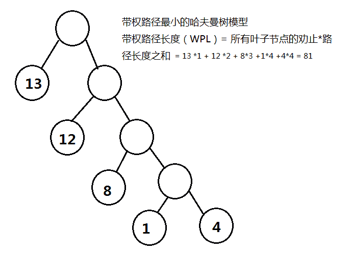
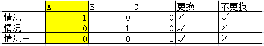
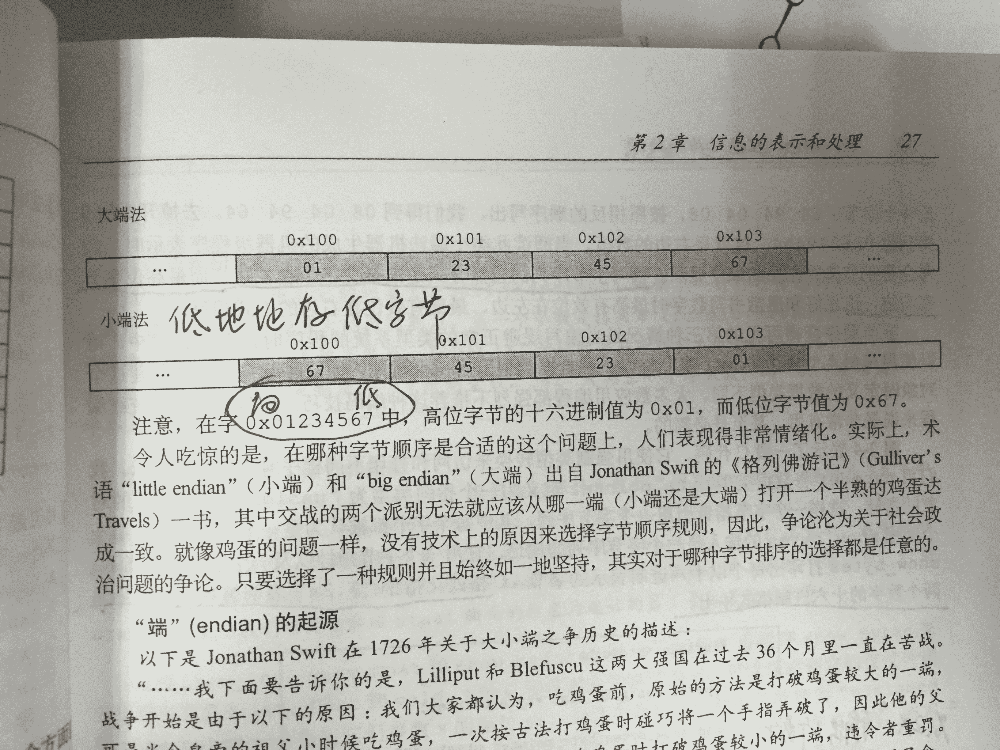
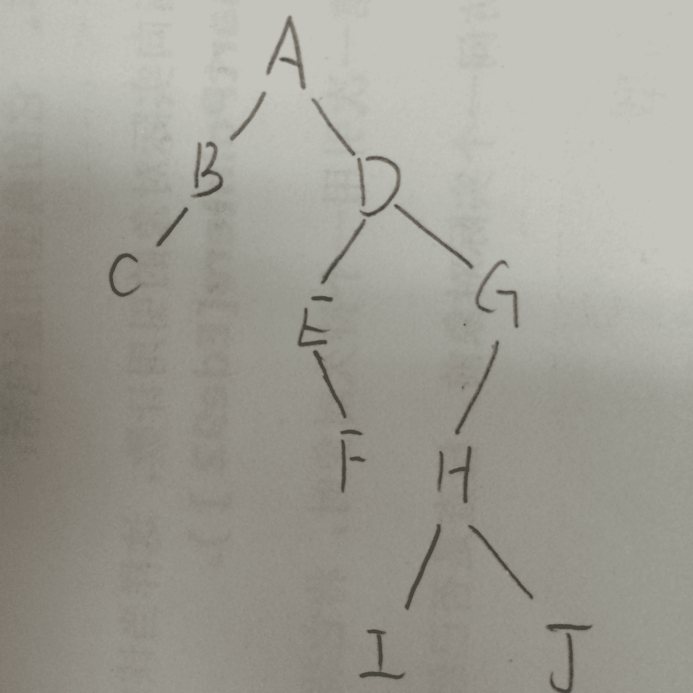
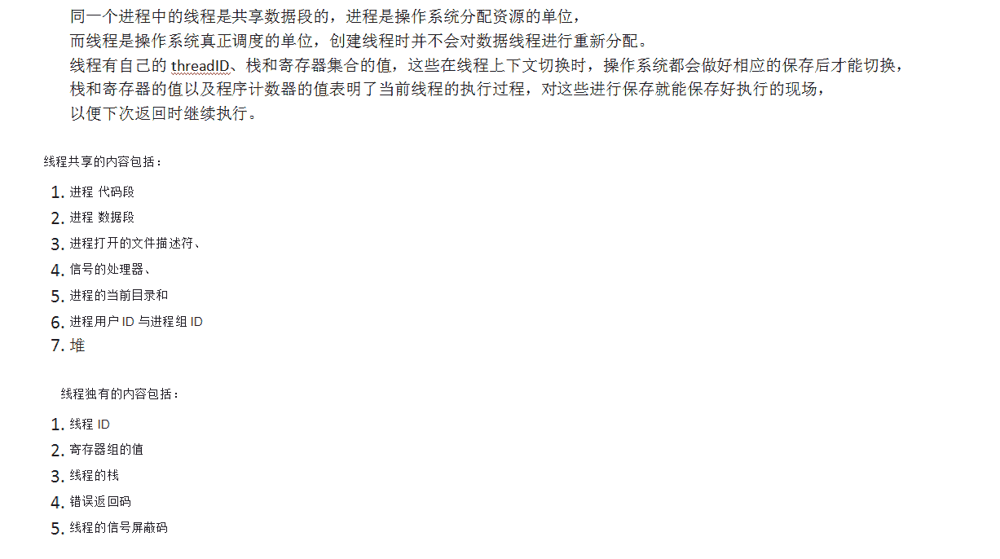
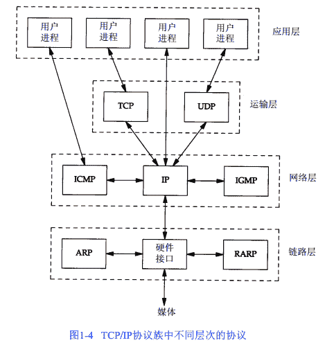
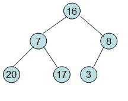
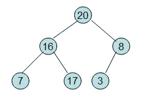
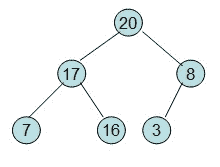
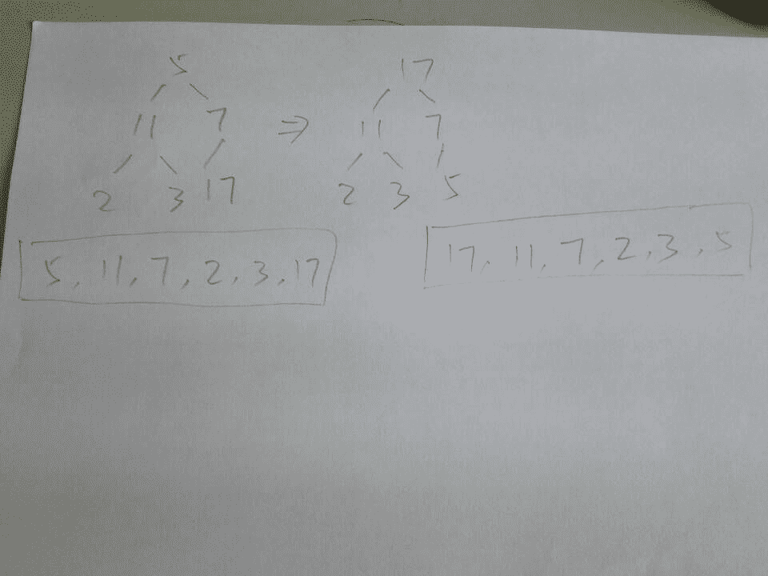

# 阿里巴巴 2017 实习生笔试题（二）

## 1

下面哪一个不是动态链接库的优点？

正确答案: B   你的答案: 空 (错误)

```cpp
共享
```

```cpp
装载速度快
```

```cpp
开发模式好
```

```cpp
减少页面交换
```

本题知识点

C++

讨论

[钉子](https://www.nowcoder.com/profile/506749)

**1 静态链接库的优点** 

 (1) 代码装载速度快，执行速度略比动态链接库快； 

 (2) 只需保证在开发者的计算机中有正确的.LIB 文件，在以二进制形式发布程序时不需考虑在用户的计算机上.LIB 文件是否存在及版本问题，可避免 DLL 地狱等问题。 

**2 动态链接库的优点 **

 (1) 更加节省内存并减少页面交换；

 (2) DLL 文件与 EXE 文件独立，只要输出接口不变（即名称、参数、返回值类型和调用约定不变），更换 DLL 文件不会对 EXE 文件造成任何影响，因而极大地提高了可维护性和可扩展性；

 (3) 不同编程语言编写的程序只要按照函数调用约定就可以调用同一个 DLL 函数；

 (4)适用于大规模的软件开发，使开发过程独立、耦合度小，便于不同开发者和开发组织之间进行开发和测试。

**3 不足之处**

 (1) 使用静态链接生成的可执行文件体积较大，包含相同的公共代码，造成浪费；

 (2) 使用动态链接库的应用程序不是自完备的，它依赖的 DLL 模块也要存在，如果使用载入时动态链接，程序启动时发现 DLL 不存在，系统将终止程序并给出错误信息。而使用运行时动态链接，系统不会终止，但由于 DLL 中的导出函数不可用，程序会加载失败；速度比静态链接慢。当某个模块更新后，如果新模块与旧的模块不兼容，那么那些需要该模块才能运行的软件，统统撕掉。这在早期 Windows 中很常见。

发表于 2016-05-12 11:12:14

* * *

[huixieqingchun](https://www.nowcoder.com/profile/551201)

**装载速度快是静态链接库的特点。**

发表于 2016-05-23 14:30:31

* * *

[启程！](https://www.nowcoder.com/profile/3545562)

动态连接库需要寻址操作才能确定其中调用的函数，而静态链接库中的函数在编译时就确定了调用 的函数，因此，在效率上，动态库比较慢所以选 B

发表于 2017-06-30 21:05:45

* * *

## 2

n 个数值选出最大 m 个数（3<m>正确答案: A   你的答案: 空 (错误)

```cpp
O(n)
```

```cpp
O(nlogn)
```

```cpp
O(logn)
```

```cpp
O(mlogn)
```

```cpp
O(nlogm)
```

```cpp
O(mn)
```

本题知识点

复杂度

讨论

[granet](https://www.nowcoder.com/profile/371903)

剑指 offer 第 30 题 1.最简单的方法：将 n 个数排序，排序后的前 k 个数就是最大的 k 个数，这种算法的复杂度是 O（nlogn）2.O（n）的方法：利用快排的 patition 思想，基于数组的第 k 个数来调整，将比第 k 个数小的都位于数组的左边，比第 k 个数大的都调整到数组的右边，这样调整后，位于数组右边的 k 个数最大的 k 个数(这 k 个数不一定是排好序的）3.O(nlogk）的方法：先创建一个大小为 k 的最小堆，接下来我们每次从输入的 n 个整数中读入一个数，如果这个数比最小堆的堆顶元素还要大，那么替换这个最小堆的堆顶并调整。

编辑于 2016-12-14 17:57:46

* * *

[月生烟](https://www.nowcoder.com/profile/8504271)

BFPRT ( 线性查找算法 )找出第 m 个大的值，该步的时间复杂度为 O(n)，然后在遍历数组选出大于等于 m 的值，该步的时间复杂度为 O(n)，总的时间复杂度为 O(2n)=O(n)

编辑于 2016-08-27 22:57:24

* * *

[selfboot](https://www.nowcoder.com/profile/509)

答案是错误的吧，用 partition 来做的话可以 O(N) 的

发表于 2016-05-06 14:11:28

* * *

## 3

由权值分别为 1、12、13、4、8 的叶子节点生成一颗哈夫曼树，它的带权路径长度为（）

正确答案: F   你的答案: 空 (错误)

```cpp
12
```

```cpp
68
```

```cpp
43
```

```cpp
6
```

```cpp
25
```

```cpp
81
```

本题知识点

树

讨论

[daiw](https://www.nowcoder.com/profile/920282)

Hoffman 树如下：        38 *13          25          *12      13                   5      *8              *1     *4      其中带*为原始元素，总共 4 层（不算根节点） 带权路径长度 13*1 + 12*2 + 8*3 + （1+4）*4 = 81

发表于 2016-05-10 17:02:49

* * *

[牛客 428302 号](https://www.nowcoder.com/profile/428302)



发表于 2016-06-02 19:08:34

* * *

[头条快捞我](https://www.nowcoder.com/profile/7062529)

上面的评论对这道题的解释很清楚了，这里我想说的是注意这里是把 1，12，13，4，8 都当成**叶子结点**来生成一棵哈夫曼树

发表于 2018-07-21 21:33:28

* * *

## 4

阿里巴巴国际站的股票代码是 1688，这个数字具有这样的特性，首先是个首位为 1 的 4 位数，其次恰巧有且仅有 1 个数字出现了两次。类似的数字还有：1861,1668 等。这样的数字一共有()个。

正确答案: F   你的答案: 空 (错误)

```cpp
144
```

```cpp
180
```

```cpp
216
```

```cpp
270
```

```cpp
288
```

```cpp
432
```

本题知识点

数学运算

讨论

[Andy_Victory](https://www.nowcoder.com/profile/908053)

分两种情况讨论：（1）若这个四位数的重复数字为 1，那么首先从三个空位中选出一个给 1，第二步从剩下 9 个可选数字中选出 2 个有序的排列到剩下的两个空位中去，那么有 C(1，3)*A(2，9)=3*(9!/(9-2)!)=3*9*8=216 种可能；（2）若这个四位数的重复数字不为 1，那么首先从 9 个可选数字中选出一个作为重复数字(C(1,9))，并放到三个空位中的两个（这两个数字相同，故只涉及组合）(C(2, 3))，然后从剩下 8 个数字中选出一个（它的位置在重复数字确定后就自然固定了，不可选）即可，故有 C(1,9)*C(2, 3)*C(1, 8)=216 种可能。总共：216+216=432

发表于 2016-06-13 10:43:17

* * *

[abcde666666](https://www.nowcoder.com/profile/154601)

| 1 |   |   |   |

第一个位置 1 是固定的，只需要考虑后三位的排列。分两种情况分析：1.如果两个重复的数字是 1,1 的位置有 3 中情况，剩下两个数字不能是 1 并且不能重复，分别是 9 种和 8 种，所以这种情况下的总得可能数是 3*8*9。2.如果两个重复的数字不是 1，则先选择要重复的数字是 9 种，剩下一个数字是 8 种（除了 1 和选择的重复的数字），三个数字全排列，其中有两个重复的数字可能性是 A(3,3)/A(2,2)=3,所以这种情况下的可能性是 9*8*3。综上所述，总的数字个数是 9*8*3+9*8*3=432。

发表于 2016-07-12 10:34:42

* * *

[daiw](https://www.nowcoder.com/profile/920282)

分两种情况  1\. 重复的是 1：则 1 的位置有百位十位个位三种， 每种情况下   由于 1 不能再选， 共 9*9 = 81，去掉 00 到 99（不包括 11）9 个    综上共(81-9)*3 = 2162\. 重复的非 1：则首先选定重复的数有 0、1 到 9 9 种，此时剩下的一个数有 8 种情况（非 1 非选定数），重复的位置有 3 种情况  共 9*8*3 = 216 种综上共 216+216=432 种

发表于 2016-05-10 18:40:30

* * *

## 5

工程师 M 发明了一种游戏：M 将一个小球随机放入完全相同的三个盒子中的某一个，玩家选中装有球的盒子即获胜；开始时 M 会让玩家选择一个盒子（选择任何一个获胜概率均为 1/3）;玩家做出选择后，M 会打开没有被选择的两个盒子中的一个空盒，此时 M 会询问玩家是否更改选择（可以坚持第一次选择，也可以选择另一个没有打开的盒子），下列叙述正确的有（）。

正确答案: E   你的答案: 空 (错误)

```cpp
改选后，玩家获胜的概率还是 1/3
```

```cpp
若不改选，玩家的获胜概率是 1/2
```

```cpp
无论怎么选择，获胜的概率都是 1/2
```

```cpp
坚持原来的选择获胜概率更高
```

```cpp
选择另一个没有被打开的盒子获胜概率更高
```

```cpp
获胜概率取决于随机因素（如小球的实际位置）
```

本题知识点

数学运算

讨论

[ld1230](https://www.nowcoder.com/profile/485371)

其实问的就是，玩家选了一个盒子，球在里面的概率和球不在里面的概率，哪个更大。因为球不在里面的话，那就肯定赢了。球在里面 1/3，球不在里面 2/3。

发表于 2016-05-19 00:25:43

* * *

[Badrain](https://www.nowcoder.com/profile/998897)

三个盒子 A，B，C。其中，1 表示有球，0 表示没球。选取三个盒子概率都一样。我们假设选择了 A。此时有三种情况如下所示：
情况一：我选中了有球的盒子，我更换的话将失败，不更换的话将成功。情况二：我选中了没球的盒子，我更换的话将成功，不更换的话将失败。情况三：我选中了没球的盒子，我更换的话将成功，不更换的话将失败。综上，我们发现更换了成功的概率是 2/3；二不更换成功的概率是 1/3。因此选择 E。

发表于 2016-05-06 18:42:46

* * *

[Amstrong](https://www.nowcoder.com/profile/325762)

       这道题目容易弄错的地方就在于，把第二次选择当作整个游戏。如果跳过前面的排除，直接跳到第二次选择：你现有的和剩下的一个盒子中只有一个装了球。当然换或者不换获胜的概率都是 1/2，但是综合前面的情况来看，第二次选择 **获胜** 有两种情况：1\. 不修改选择并**获胜**，表示第一次已经选对。概率为：1/3 * 1/2 = 1/62\. 修改选择并 **获胜**，表示第一次选错。概率为：2/3 * 1/2 = 2/6       综上可知，第二次选择中修改选择后**获胜**的概率较大。**       注意，** **这里的 2/6 并不是整个游戏中改选的获胜概率！**第二次选择，胜负的概率各为 1/2，这里的 2/6 只是第二次选择中通过改选达到获胜的概率。**       那整个游戏中改选获胜的概率是多少呢？**3 个盒子可能不容易看清，我们把问题改成：有 10 个盒子，选择完成之后移除 8 个空盒子。那么第一次选择的盒子有球的概率是 1/10，剩下 9 个盒子有球的概率是 9/10；移除 8 个空盒子相当于告诉你这 8 个盒子有球的概率为 0，但是 9 个盒子有球的总概率为 9/10 是没有变的，这就表明剩下的那个盒子有球的概率是 9/10，如果改选这个盒子获胜的概率就是 9/10。同理，对于 3 个盒子，改选获胜的概率是 2/3，A 错。

编辑于 2016-07-23 17:03:59

* * *

## 6

以下哪种方式，在读取磁盘上多个顺序数据块时的效率最高？

正确答案: C   你的答案: 空 (错误)

```cpp
中断控制方式
```

```cpp
DMA 方式
```

```cpp
通道方式
```

```cpp
程序直接访问方式
```

```cpp
循环检查 I/O 方式
```

```cpp
以上访问方式都一样
```

本题知识点

编译和体系结构

讨论

[LittleBaby](https://www.nowcoder.com/profile/306751)

答案选 C，通道方式。（1）程序直接访问方式跟循环检测 IO 方式，应该是一个意思吧，是最古老的方式。CPU 和 IO 串行，每读一个字节（或字），CPU 都需要不断检测状态寄存器的 busy 标志，当 busy=1 时，表示 IO 还没完成；当 busy=0 时，表示 IO 完成。此时读取一个字的过程才结束，接着读取下一个字。（2）中断控制方式：循环检测先进些，IO 设备和 CPU 可以并行工作，只有在开始 IO 和结束 IO 时，才需要 CPU。但每次只能读取一个字。（3）DMA 方式：Direct Memory Access，直接存储器访问，比中断先进的地方是每次可以读取一个块，而不是一个字。（4）通道方式：比 DMA 先进的地方是，每次可以处理多个块，而不只是一个块。

发表于 2016-09-04 00:03:45

* * *

[钉子](https://www.nowcoder.com/profile/506749)

I/O 中断方式是以字节为单位，DMA 控制方式是以一个连续的数据块为单位，I/O 通道控制方式是 DMA 控制方式的发展，是以一组数据块为单位的，即可以连续读取多个数据块。

发表于 2016-05-12 11:52:29

* * *

[踏实与平淡](https://www.nowcoder.com/profile/4833733)

（1）程序直接访问方式跟循环检测 IO 方式，应该是一个意思吧，是最古老的方式。CPU 和 IO 串行，每读一个字节（或字），CPU 都需要不断检测状态寄存器的 busy 标志，当 busy=1 时，表示 IO 还没完成；当 busy=0 时，表示 IO 完成。此时读取一个字的过程才结束，接着读取下一个字。（2）中断控制方式：循环检测先进些，IO 设备和 CPU 可以并行工作，只有在开始 IO 和结束 IO 时，才需要 CPU。但每次只能读取一个字。（3）DMA 方式：Direct Memory Access，直接存储器访问，比中断先进的地方是每次可以读取一个块，而不是一个字。（4）通道方式：比 DMA 先进的地方是，每次可以处理多个块，而不只是一个块。

发表于 2016-10-08 10:37:38

* * *

## 7

下列不是进程间的通信方式的是（）

正确答案: B   你的答案: 空 (错误)

```cpp
管道
```

```cpp
回调
```

```cpp
共享内存
```

```cpp
消息队列
```

```cpp
socket
```

```cpp
信号量
```

本题知识点

操作系统

讨论

[X_Coder](https://www.nowcoder.com/profile/170886)

# 管道( pipe )：管道  查看全部)

编辑于 2016-11-06 10:58:25

* * *

[搁浅的鱼儿](https://www.nowcoder.com/profile/961875)

**选 B****# 管道( pipe )：**管道是一种半双工的通信方式，数据只能单向流动，而且只能在具有亲缘关系的进程间使用。进程的亲缘关系通常是指父子进程关系。  **# 信号量( semophore ) ：** 信号量是一个计数器，可以用来控制多个进程对共享资源的访问。它常作为一种锁机制，防止某进程正在访问共享资源时，其他进程也访问该资源。因此，主要作为进程间以及同一进程内不同线程之间的同步手段。  
**# 消息队列( message queue ) ：** 消息队列是由消息的链表，存放在内核中并由消息队列标识符标识。消息队列克服了信号传递信息少、管道只能承载无格式字节流以及缓冲区大小受限等缺点。  
**# 共享内存( shared memory ) ：**共享内存就是映射一段能被其他进程所访问的内存，这段共享内存由一个进程创建，但多个进程都可以访问。共享内存是最快的 IPC 方式，它是针对其他进程间通信方式运行效率低而专门设计的。它往往与其他通信机制，如信号两，配合使用，来实现进程间的同步和通信。  
**# 套接字( socket ) ：** 套解口也是一种进程间通信机制，与其他通信机制不同的是，它可用于不同及其间的进程通信。**# 回调：** 是一种编程机制。

发表于 2016-06-15 13:25:46

* * *

[牛客 20435143](https://www.nowcoder.com/profile/241164)

回调是一种编程机制

发表于 2016-05-16 23:06:12

* * *

## 8

已知 IBM 的 PowerPC 是 big-endian 字节序列而 Intel 的 X86 是 little-endian 字节序，如果在地址啊存储的整形值时 0x04030201，那么地址为 a+3 的字节内存储的值在 PowerPC 和 Intel X86 结构下的值分别是？

正确答案: A   你的答案: 空 (错误)

```cpp
1 4
```

```cpp
1 3
```

```cpp
4 1
```

```cpp
3 1
```

```cpp
4 4
```

```cpp
1 1
```

本题知识点

编译和体系结构

讨论

[牛客 493273 号](https://www.nowcoder.com/profile/493273)

大端从大地址开始存储，小端相反，两者都是从数据低位开始存起；
假设从上至下地址递增，则
PowerPC（大）：                    Intel X86（小）：
04                                            01                    低
03                                            02                      |
02                                            03                      | 
01                                            04                     高
a+3 指向最大的地址，所以分别为 1 4

发表于 2016-05-16 10:39:20

* * *

[黑磊之父](https://www.nowcoder.com/profile/7074644)



发表于 2016-08-22 09:58:56

* * *

[UESTCODER](https://www.nowcoder.com/profile/411965)

大端模式是高地址存储数据的低字节，小端模式是高地址存储数据的高字节

发表于 2016-05-16 16:58:58

* * *

## 9

在 TCP/IP 建立连接过程中，客户端或服务器的状态转移说法错误的是？

正确答案: D   你的答案: 空 (错误)

```cpp
经历 SYN_RECV 状态
```

```cpp
经历 SYN_SEND 状态
```

```cpp
经历 ESTABLISHED 状态
```

```cpp
经历 TIME_WAIT 状态
```

```cpp
服务器在收到 syn 包时将加入半连接队列
```

```cpp
服务器收到客户端的 ack 包后将从半连接队列删除
```

本题知识点

网络基础

讨论

[孙伟斌](https://www.nowcoder.com/profile/296789)

Tcp/Ip 有 3 次握手：第一次握手：客户端向服务器端发送 SYN 包（syn＝j），进入 SYN_SEND 状态，等待服务器确认。第二次握手：服务器收到 SYN 包，确认 SYN，此时 syn＝j+1，同时发送一个 SYN 包（syn＝k）即 SYN＋ACK 包，此时服务器进入 SYN_RECV 状态；第三次握手：客户端收到 SYN＋ACK 包，向服务器发送 ACK 确认包，此时客户端和服务器端均进入 ESTABLISHED 状态。其中有一个半连接状态：服务器维护一个半连接队列，该队列卫每个客户端 SYN 包开设一个条目，标明服务器已经接到 SYN 包，并向客户端发出确认，这些条目表示的连接处于 SYN_RECV 状态，得到客户端的确认后进入 ESTABLISHED 状态。

发表于 2016-06-19 10:12:57

* * *

[lolau93](https://www.nowcoder.com/profile/572572)

TIME_WAIT 是断开连接时的状态

发表于 2016-05-06 17:09:29

* * *

[元](https://www.nowcoder.com/profile/240954)

这个博客 TCP/UDP 这块讲的不错，很实用，http://www.cnblogs.com/obama/p/3292335.html

发表于 2016-05-08 20:27:39

* * *

## 10

已知一棵二叉树的先序和中序遍历序列如下：先序：A、B、C、D、E、F、G、H、I，J 中序：C、B、A、E、F、D、I、H、J、G 其后序遍历序列为：

正确答案: E   你的答案: 空 (错误)

```cpp
C、B、D、E、A、G、I、H、J、F
```

```cpp
C、B、D、A、E、G、I、H、J、F
```

```cpp
C、E、D、B、I、J、H、G、F、A
```

```cpp
C、E、D、B、I、H、J、G、F、A
```

```cpp
C、B、F、E、I、J、H、G、D、A
```

```cpp
C、B、F、E、I、H、J、G、D、A
```

本题知识点

树

讨论

[牛客 2793674 号](https://www.nowcoder.com/profile/2793674)

先序，中序，后序，已知中序和先序或者中序和后序两种遍历结果，就可以逆向推导出整颗树 1.由先序，知 A 是根 2.由中序，知 B、C 为 A 左子树，D、E、F、G、H、I、J 为 A 右子树 3.由先序，知 B 为 A 左子树根 4.由后序，知 C 为 B 左子树 5.由先序，知 D 为 A 右子树根 6.由中序，知 E、F 为 D 左子树，G、H、I、J 位 D 右子树 7.由先序，知 E 为 D 左子树根 8.由后序，知 F 为 E 左子树 9.由先序，知 G 为 D 右子树根 10.由中序，知 H、I、J 为 G 左子树 11.由先序，知 H 为 G 左子树根 12.由中序，知 I 为 H 左子树，J 为 H 右子树 13.树推导构造完毕

编辑于 2017-08-18 13:20:51

* * *

[牛客 600723 号](https://www.nowcoder.com/profile/600723)



发表于 2016-07-14 22:01:54

* * *

[我是哦](https://www.nowcoder.com/profile/385037)

选择 E。原则，先序：根，左树，右树。中序：左树，根，右树。后序：左树，右树，根。然后是个递归过程。

发表于 2016-05-10 21:54:23

* * *

## 11

设有四个元素 A、B、C、D 顺序进栈，在进栈过程中可以出栈，出栈次序错误的排列是

正确答案: F   你的答案: 空 (错误)

```cpp
ABCD
```

```cpp
DCBA
```

```cpp
ACBD
```

```cpp
BCDA
```

```cpp
ACDB
```

```cpp
DCAB
```

本题知识点

栈 *讨论

[沐风亦沐风](https://www.nowcoder.com/profile/612715)

A：A 进 A 出，B 进 B 出，C 进 C 出，D 进 D 出。B：ABCD 依次进入，DCBA 依次输出。C：A 进 A 出，BC 进 CB 出，D 进 D 出。D：A 进，B 进 B 出，C 进 C 出，D 进 D 出，A 出。E：A 进 A 出，B 进，C 进 C 出，D 进 D 出，B 出。

发表于 2016-05-11 22:19:04

* * *

[zhisheng_blog](https://www.nowcoder.com/profile/616717)

**进栈出栈顺序问题解题思路：**栈之根本——先进后出（first in，lastout），自己在做题的时候可以画入栈和出栈图，这样就很明显得知出栈顺序了。做多了题目之后，你会发现不用画图了，直接在脑子里可以想象这个过程，则答案很容易就出来了，反正我是一个一个看着答案排除的。自己刷题总结下来的一些技巧。

编辑于 2016-09-15 22:39:49

* * *

[那时、如梦](https://www.nowcoder.com/profile/474116)

F 出栈顺序 DCAB  表明 D 是第一个要出栈的，也就是 ABCD 都被压入栈内，那么出栈顺序为 DCBA

发表于 2016-05-12 21:35:34

* * *

## 12

问题描述:

```cpp
#pragma pack(2)
class BU
{
	int number;
	union UBffer
	{
		char buffer[13];
		int number;
	}ubuf;
	void foo(){}
	typedef char*(*f)(void*);
	enum{hdd,ssd,blueray}disk;
}bu;
```

sizeof(bu)的值是()

正确答案: C   你的答案: 空 (错误)

```cpp
20
```

```cpp
21
```

```cpp
22
```

```cpp
23
```

```cpp
24
```

```cpp
非以上选项
```

本题知识点

C++

讨论

[granet](https://www.nowcoder.com/profile/371903)

#pragma pack(2  查看全部)

编辑于 2016-06-29 22:05:25

* * *

[InterOAO](https://www.nowcoder.com/profile/168673)

union:当多个数据需要共享内存或者多个数据每次只取其一时，可以利用联合体(union)；它有以下特点：    （1）它是一个结构；
    （2）它的所有成员相对于基地址的偏移量都为 0；    （3）此结构空间要大到足够容纳最"宽"的成员；    （4）其对齐方式要适合其中所有的成员综上：    而分配给 union 的实际大小不仅要满足是对齐大小的整数倍，同时要满足实际大小不能小于最大成员的大小。    本题目中
    注意第一行，#pragma pack(2)    首先考虑没有这句话时，我们在类、结构或者 union 补齐字节的时候，找它们的成员数据中找字节最大的那个数去衡量如何对齐，假设为 z；
    但是有了这句话以后，对齐方式是取 pack(n)中 n 和 z 的最小值去对齐；    可见本题中对齐字节数为 2；
    之后往下看 int number; 占 4 个字节    接下来考虑 union 大小    union UBffer    {        char buffer[13]; // 13        int number; // 4    }ubuf; buffer 是 13 个字节，number 是 4 个字节，取最大的 为 13，注意还要字节对齐，对齐字节数为 2，所以 Union 大小为 14，既满足 buffer 的对齐 也满足 number 的对齐。    void foo(){} 不占    typedef char*(*f)(void*); 不占    enum{hdd,ssd,blueray}disk; 4 个字节***综上，总大小为 14+4+0+0*** ***+4=22***

发表于 2016-06-03 13:42:44

* * *

[MSean](https://www.nowcoder.com/profile/231467)

**枚举类型的 sizeof 值都是 4；**enum 只是定义了一个常量集合，里面没有“元素”，而枚举类型是当做**int**来存储的。

发表于 2016-08-29 00:21:25

* * *

## 13

同一个进程中的线程不共享的部分是()

正确答案: F   你的答案: 空 (错误)

```cpp
信号
```

```cpp
堆
```

```cpp
文件描述符
```

```cpp
进程组 id
```

```cpp
代码段
```

```cpp
栈空间
```

本题知识点

操作系统

讨论

[搁浅的鱼儿](https://www.nowcoder.com/profile/961875)

**线程共享的环境包括：进程代码段、进程的公有数据(利用这些共享的数据，线程很容易的实现相互之间的通讯)、进程打开的文件描述符、信号的处理器、进程的当前目录和进程用户 ID 与进程组 ID。**

    进程拥有这许多共性的同时，还拥有自己的个性。有了这些个性，线程才能实现并发性。这些个性包括： 1.线程 ID
      每个线程都有自己的线程 ID，这个 ID 在本进程中是唯一的。进程用此来标   识线程。    2.寄存器组的值
       由于线程间是并发运行的，每个线程有自己不同的运行线索，当从一个线   程切换到另一个线程上 时，必须将原有的线程的寄存器集合的状态保存，以便   将来该线程在被重新切换到时能得以恢复。    3.线程的堆栈
       堆栈是保证线程独立运行所必须的。
       线程函数可以调用函数，而被调用函数中又是可以层层嵌套的，所以线程   必须拥有自己的函数堆栈， 使得函数调用可以正常执行，不受其他线程的影   响。 4.错误返回码
       由于同一个进程中有很多个线程在同时运行，可能某个线程进行系统调用   后设置了 errno 值，而在该 线程还没有处理这个错误，另外一个线程就在此时   被调度器投入运行，这样错误值就有可能被修改。
       所以，不同的线程应该拥有自己的错误返回码变量。 5.线程的信号屏蔽码
       由于每个线程所感兴趣的信号不同，所以线程的信号屏蔽码应该由线程自己管理。但所有的线程都共享同样的信号处理器。 6.线程的优先级
       由于线程需要像进程那样能够被调度，那么就必须要有可供调度使用的参数，这个参数就是线程的优先级。      涉及多线程程序涉及的时候经常会出现一些令人难以思议的事情，用堆和栈分配一个变量可能在以后的执行中产生意想不到的结果，而这个结果的表现就是内存的非法被访问，导致内存的内容被更改。 

理解这个现象的两个基本概念是：在一个进程的线程共享堆区，而进程中的线程各自维持自己堆栈。 在 windows 等平台上，不同线程缺省使用同一个堆，所以用 C 的 malloc （或者 windows 的 GlobalAlloc）分配内存的时候是使用了同步保护的。如果没有同步保护，在两个线程同时执行内存操作的时候会产生竞争条件，可能导致堆内内存管理混乱。比如两个线程分配了统一块内存地址，空闲链表指针错误等。 

Symbian 的线程一般使用独立的堆空间。这样每个线程可以直接在自己的堆里分配和释放，可以减少同步所引入的开销。当线程退出的时候，系统直接回收线程的堆空间，线程内没有释放的内存空间也不会造成进程内的内存泄漏。 

但是两个线程使用共用堆的时候，就必须用 critical section 或者 mutex 进行同步保护。否则程序崩溃时早晚的事。如果你的线程需要在共用堆上无规则的分配和释放任何数量和类型的对象，可以定制一个自己的 allcator，在 allocator 内部使用同步保护。线程直接使用这个 allocator 分配内存就可以了。这相当于实现自己的 malloc，free。但是更建议你重新审查一下自己的系统，因为这种情况大多数是不必要的。经过良好的设计，线程的本地堆应该能够满足大多数对象的需求。如果有某一类对象需要在共享堆上创建和共享，这种需求是比较合理的，可以在这个类的 new 和 delete 上实现共享保护。 

发表于 2016-06-15 16:23:39

* * *

[众神之主](https://www.nowcoder.com/profile/878338)

**栈：** 是个线程独有的，保存其运行状态和局部自动变量的。栈在线程开始的时候初始化，每个线程的栈互相独立，因此，栈是 thread safe 的。

发表于 2016-05-11 16:26:53

* * *

[请叫我猿叔叔](https://www.nowcoder.com/profile/6316247)



发表于 2016-09-08 20:36:42

* * *

## 14

下面关于系统调用的描述中,错误的是()

正确答案: B   你的答案: 空 (错误)

```cpp
系统调用把应用程序的请求传输给系统内核执行
```

```cpp
系统调用中被调用的过程运行在"用户态"中
```

```cpp
利用系统调用能够得到操作系统提供的多种服务
```

```cpp
是操作系统提供给编程人员的接口
```

```cpp
系统调用给用户屏蔽了设备访问的细节
```

```cpp
系统调用保护了一些只能在内核模式执行的操作指令
```

本题知识点

操作系统

讨论

[西瓜西瓜爱夏天](https://www.nowcoder.com/profile/366141)

调用程序是运行在用户态，而被调用的程序是运行在系统态

发表于 2016-05-24 16:18:44

* * *

[dolphinlcj](https://www.nowcoder.com/profile/7354722)

调用的程序，运行在用户态，被调用的过程，运行在内核

发表于 2016-09-29 16:53:45

* * *

[牛客 443575 号](https://www.nowcoder.com/profile/443575)

调用在用户态，运行在内核态

发表于 2016-08-17 16:53:43

* * *

## 15

在动态分区分配方案中,系统回收主存,合并空闲空间时需修改空闲区表,以下哪种情况空闲区会减 1?

正确答案: F   你的答案: 空 (错误)

```cpp
只要回收主存,空闲区数就会减一
```

```cpp
空闲区数和主存回收无关
```

```cpp
无上邻空闲区,也无下邻空闲区
```

```cpp
有上邻空闲区,但无下邻空闲区
```

```cpp
有下邻空闲区,但无上邻空闲区
```

```cpp
有上邻空闲区,也有下邻空闲区
```

本题知识点

操作系统

讨论

[黄瓜炒蛋怕不怕](https://www.nowcoder.com/profile/527358)

在分区分配方案中，回收一个分区时有几种不同的邻接情况，在各种情况下应如何处理？ 答：有四种：上邻，下邻，上下相邻，上下不相邻。 （1）回收分区的上邻分区是空闲的，需要将两个相邻的空闲区合并成一个更大的空闲区，然后修改空闲区表。 （2）回收分区的下邻分区是空闲的，需要将两个相邻的空闲区合并成一个更大的空闲区，然后修改空闲区表。 （3）回收分区的上、下邻分区都是空闲的（空闲区个数为 2），需要将三个空闲区合并成一个更大的空闲区（空闲区个数为 1 ），然后修改空闲区表、 （4）回收分区的上、下邻分区都不是空闲的，则直接将空闲区记录在空闲区表中。

发表于 2016-05-07 21:37:39

* * *

[InterOAO](https://www.nowcoder.com/profile/168673)

A：错误，因为回收主存时，要根据相邻分区空闲情况决定空闲分区个数，如果不考虑合并的话，空闲分区个数增加一个，因为可能发生合并情况，所以可能- ，可能不变；B：由上知，错误；C：无上邻空闲区,也无下邻空闲区，不需要合并空闲分区，空闲分区个数加 1；D：有上邻空闲区,但无下邻空闲区，需要将刚刚的空闲分区表的起始地址修改为上邻空闲区的起始地址和空闲分区大小，但是空闲分区个数不变；E：有下邻空闲区,但无上邻空闲区，刚刚的空闲分区表起始位置不用改变，空闲分区大小改变，空闲分区个数不变；F：有上邻空闲区,也有下邻空闲区，假设原来是 2 个空闲分区，新回收一个，发现前后都是空闲的，将三个合并为 1 个，最后结果为 1 个空闲分区，空闲分数个数减 1

发表于 2016-06-03 12:31:28

* * *

[dapengdeda](https://www.nowcoder.com/profile/206704)

系统回收主存时，按道理，空闲区会加 1，但是如果存在以下的两种情况，空闲区个数会有所不同：
（1）.当回收的主存与已有的空闲区存在上邻 ***或者*** 下邻的情况，将回收的主存与已有的空闲区合并，空闲区的个数不变；
（2）.当回收的主存与已有的空闲区存在上邻 ***和*** 下邻的情况，则回收的主存会将原来的空闲去中的两个空闲区合并成一个空闲区，即回收的主存起到了联通的作用，空闲区的个数不增，反而与之前相比，个数还减少了一个。

发表于 2016-06-04 16:06:37

* * *

## 16

下面关于虚拟局域网 VLAN 的叙述错误的是()

正确答案: D   你的答案: 空 (错误)

```cpp
VLAN 是由局域网网段构成的与物理位置无关的逻辑组
```

```cpp
利用以太网交换机可以很方便地实现 VLAN
```

```cpp
每一个 VLAN 的工作站可处在不同的局域网中
```

```cpp
不同 VLAN 内的用户可以相互之间直接通信
```

```cpp
vLAN 可以强化网络安全和网络管理
```

```cpp
VLAN 能灵活控制广播活动
```

本题知识点

网络基础

讨论

[薛定谔之喵](https://www.nowcoder.com/profile/519263)

VLAN（Virtual Local Area Network）的中文名为"虚拟局域网"。虚拟局域网（VLAN）是一组逻辑上的设备和用户，这些设备和用户并不受物理位置的限制，可以根据功能、部门及应用等因素将它们组织起来，相互之间的通信就好像它们在[同一个网段](http://baike.baidu.com/view/4200848.htm)中一样，由此得名虚拟局域网。VLAN 是一种比较新的技术，工作在[OSI 参考模型](http://baike.baidu.com/view/38361.htm)的第 2 层和第 3 层，一个 VLAN 就是一个[广播域](http://baike.baidu.com/view/291982.htm)，VLAN 之间的通信是通过第 3 层的[路由器](http://baike.baidu.com/view/1360.htm)来完成的。与传统的[局域网技术](http://baike.baidu.com/view/1598669.htm)相比较，VLAN 技术更加灵活，它具有以下优点： 网络设备的移动、添加和修改的管理开销减少；可以控制[广播](http://baike.baidu.com/view/35385.htm)活动；可提高[网络](http://baike.baidu.com/view/3487.htm)的安全性。在计算机网络中，一个二层网络可以被划分为多个不同的广播域，一个广播域对应了一个特定的用户组，默认情况下这些不同的广播域是相互隔离的。不同的广播域之间想要通信，需要通过一个或多个路由器。这样的一个广播域就称为 VLAN。

发表于 2016-05-09 21:36:37

* * *

[舒意意 123](https://www.nowcoder.com/profile/1973064)

D 不同 vlan 不可以直接通信

发表于 2017-04-13 14:22:40

* * *

[Desire2](https://www.nowcoder.com/profile/3485718)

C 选项是局域网啊，要是没连接外网的话怎么组 VLAN?

发表于 2016-09-06 11:59:01

* * *

## 17

刚毕业的小王上班有两路公交车都可以从家到公司。如果只等 A 车，平均需要 5 分钟才等到；如果只等 B 车，平均需要 7 分钟才能等到。假定两辆车运行时间独立，那么小王平均需要等多长时间才能等到 A 车或 B 车?

正确答案: C   你的答案: 空 (错误)

```cpp
2 分钟
```

```cpp
2 分 35 秒
```

```cpp
2 分 55 秒
```

```cpp
3 分钟
```

```cpp
5 分钟
```

```cpp
6 分钟
```

本题知识点

数学运算

讨论

[牛客 676528 号](https://www.nowcoder.com/profile/676528)

在时间 t 内，A 车 t/5 趟， B 车 t/7 趟，所以在 t 内等到车共计 t/5+t/7 趟，等到一趟的时间则为 t/(t/5+t/7)，等价 35/12,

编辑于 2016-06-01 22:05:47

* * *

[濺亽翔](https://www.nowcoder.com/profile/737516)

35 分钟内一共来了 12 辆车平均每 35/12 min 来一辆。35/12min = 2min55s

发表于 2016-05-10 22:51:19

* * *

[牛肉面真好吃](https://www.nowcoder.com/profile/962828)

每一分钟，来 A 车概率是 1/10，来 B 车概率是 1/14，相互独立，概率相加，每一分钟来车概率是 24/140，所以平均等到车的用时就是 1/(24/140) /2= 35/12。

35/12min = 2min55s

发表于 2016-05-17 10:45:42

* * *

## 18

一个黑色袋子中装有 5 个红球，5 个蓝球，5 个黄球，从中抽取三次，每次抽一个球，取完不放回，则每种颜色球各得一个的概率是（）

正确答案: F   你的答案: 空 (错误)

```cpp
1/5
```

```cpp
1/4
```

```cpp
1/3
```

```cpp
12/91
```

```cpp
20/91
```

```cpp
25/91
```

本题知识点

概率统计 *概率论与数理统计* *讨论

[Simon_xl](https://www.nowcoder.com/profile/723522)

最开始是 0 个球，第一次不管怎么选都会选一个和以前不同颜色的球，所以第一次选择颜色不同的球概率为 1；

第一次选择之后，还剩 14 个球，其中 被第一次选走的那个颜色只有 4 个，剩下的两种颜色的球个数不变，都为 5，
然后选一个与第一次颜色不同的球的概率是：10/14， 这是第二次选择

第二次选择之后，还剩 13 个球，其中被第一次和第二次选中的球，各有 4 个，剩下的没选到颜色的球还是 5 个，这次选中
还没选到的这个颜色的球的概率是：5/13

所以选择三个不同颜色总的概率为：1*（10/14）*（5/13） = 25/91.

编辑于 2016-05-14 14:50:07

* * *

[D_L](https://www.nowcoder.com/profile/458841)

这就一高三的题。第一次抽到 红球的概率 P[1] = 5 / (5 + 5 + 5) = 1/3 第二次抽到 蓝球的概率 P[2 ]= 5 / (4 + 5 + 5) = 5/14 第三次抽到 黄球的概率 P[3] = 5 / (4 + 4 + 5) = 5/13 则 依次抽到 红球、篮球、黄球 的概率 为  P ' = P [1 x ] P [2 x ] P [3]因为 红 蓝 黄 的先后排列顺序 一共可能有 6  有 种情况 (3 的全排列)，所以 3 次不放回的抽取，得到 3 个不同颜色的球的概率 为 P = 6 x  P '  = 6 x  1/3 x  5/14 x  5/13 = 25/91

编辑于 2016-06-08 20:48:15

* * *

[等下一阵风](https://www.nowcoder.com/profile/9431271)

C（1,5）*C（1,5）*C（1,5）/C(15,3) = 25/91

发表于 2017-09-13 18:53:09

* * *

## 19

以下程序的输出结果是

```cpp
#include <stdio.h>

int main() {
    int* pint = 0;
    pint += 6;
    printf("%d\n", pint);
}
```

正确答案: C   你的答案: 空 (错误)

```cpp
12
```

```cpp
72
```

```cpp
24
```

```cpp
0
```

```cpp
6
```

```cpp
任意数
```

本题知识点

C++

讨论

[Dw94](https://www.nowcoder.com/profile/5079857)

两个点：
1.在初始化中只有地址才能赋值给指针，因此*int p=0 是指 p 指向地址 0x00。
2.int 型数占 4 个字节，因此加 6 表示偏移了 24 个字节，结果的地址应为 0x18，即是 24.

发表于 2017-05-09 13:16:24

* * *

[keviv_li](https://www.nowcoder.com/profile/970222)

第一句的意思是将 pint 指针指向 0 地址处，由于指针类型是 int，每次加 1 相当于移动四个字节，（在 int 为四个字节的机器上）；加上 6，地址为 0x18

发表于 2016-05-06 10:29:57

* * *

[程式猎人](https://www.nowcoder.com/profile/2606116)

终于 get 到考点了，我还以为是出错题了，pint 是整形指针，移动指针，他的内容可能是任意数，有没有人和我一样看错了的。

发表于 2016-08-31 09:30:55

* * *

## 20

某种 5 号(AA)充电电池在充满电之后的电量是 900 毫安时和 1100 毫安时的可能性各为 1/2。如果将将电池串联使用，常常会因为其中一部分电池先放电完毕，而且其它电池还有 100 毫安时以上的电量时，引起先放完电的电池损坏。那么以下说法正确的是：

正确答案: C   你的答案: 空 (错误)

```cpp
如果两节这样的电池串联使用，那么必然有 1 节电池会损坏。
```

```cpp
如果有许多节这样的电池串联使用，则至少会有 1 节电池会损坏。
```

```cpp
如果放电电量控制在 900 毫安时以内，则不会有电池损坏
```

```cpp
当有 2n 节电池串联使用时，至多会有 n 节电池会损坏
```

```cpp
当串联的电池个数是奇数时，不会有电池损坏。
```

```cpp
电量少的电池一定会损坏。
```

本题知识点

数学运算

讨论

[Amstrong](https://www.nowcoder.com/profile/325762)

答案选 **C**  查看全部)

编辑于 2016-11-14 13:47:53

* * *

[牛客 665169186 号](https://www.nowcoder.com/profile/665169186)

C  要是都没充满呢     挺烦这种题的

发表于 2021-03-09 20:54:09

* * *

[helloworld33](https://www.nowcoder.com/profile/3032054)

就是个脑经急转弯，题目中说一部分放电完毕，另一部分电剩余超过 100，而 C 选项电还没放完呢。。。。

发表于 2017-04-26 16:57:58

* * *

## 21

下面哪种协议在数据链路层？

正确答案: F   你的答案: 空 (错误)

```cpp
ARP
```

```cpp
ICMP
```

```cpp
FTP
```

```cpp
UDP
```

```cpp
HTTP
```

```cpp
VPN
```

本题知识点

网络基础

讨论

[asyoguo](https://www.nowcoder.com/profile/489526)

```cpp
ICMP 是网络层，UDP 是传输层，FTP 和 HTTP 是应用层 目前 VPN 隧道协议主要有 4 种：点到点隧道协议 PPTP、第二层隧道协议 L2TP、网络层隧道协议 IPSec 以及 SOCKS v5 协议。其中，PPTP 和 L2TP 工作在数据链路层，IPSec 工作在网络层，SOCK v5 工作在会话层。
```

发表于 2016-05-16 15:23:59

* * *

[牛客 515501 号](https://www.nowcoder.com/profile/515501)

TCP/IP 模型中，ARP 协议属于网络层，在 OSI 参考模型中，ARP 属于数据链路层

发表于 2016-07-25 16:34:27

* * *

[乘风 11](https://www.nowcoder.com/profile/3675840)

参考 TCP-IP 详解卷 1,第四页

发表于 2017-08-19 11:21:19

* * *

## 22

一组记录排序码为(5 11 7 2 3 17),则利用堆排序方法建立的初始堆为

正确答案: C   你的答案: 空 (错误)

```cpp
(11 5 7 2 3 17)
```

```cpp
(11 5 7 2 13 3)
```

```cpp
(17 11 7 2 3 5)
```

```cpp
(17 11 7 5 3 2)
```

```cpp
(17 7 11 3 5 2)
```

```cpp
(17 7 11 3 2 5)
```

本题知识点

堆

讨论

[wangchenphoebe](https://www.nowcoder.com/profile/225981)

如果堆的有序状态因为某个节点  查看全部)

编辑于 2016-09-30 21:37:04

* * *

[爱吃青菜皮卷面的 byr](https://www.nowcoder.com/profile/1411365)

构造初始堆，则从最后一个非叶节点开始调整，调整过程如下：  20 和 16 交换后导致 16 不满足堆的性质，因此需重新调整这样就得到了初始堆。即每次调整都是从父节点、左孩子节点、右孩子节点三者中选择最大者跟父节点进行交换(交换之后可能造成被交换的孩子节点不满足堆的性质，因此每次交换之后要重新对被交换的孩子节点进行调整)。有了初始堆之后就可以进行排序了。

发表于 2017-02-23 21:39:47

* * *

[BrainerGao](https://www.nowcoder.com/profile/516342)



发表于 2016-06-03 10:20:14

* * *

## 23

甲乙丙三人是阿里巴巴开发人员，ABC 三人是阿里巴巴测试人员，每个开发都有对应的测试人员。主管介绍说：“A 对应的开发是乙的好友，并在三个开发中最年轻；丙的年龄比 C 对应的开发大。”则开发和测试的对应关系为（）。

正确答案: B   你的答案: 空 (错误)

```cpp
甲-A，乙-B，丙-C
```

```cpp
甲-A，乙-C，丙-B
```

```cpp
甲-B，乙-A，丙-C
```

```cpp
甲-B，乙-C，丙-A
```

```cpp
甲-C，乙-A，丙-B
```

```cpp
甲-C，乙-B，丙-A
```

本题知识点

判断推理

讨论

[ben_white](https://www.nowcoder.com/profile/148199)

A 对应的开发是乙的好友，且最年轻  -   说明：A 对应甲或丙，乙不是最年轻的丙的年龄比 C 对应的开发大：                说明： 丙不是最年轻的 -》最年轻的是甲 -》 A 对应甲                                                                    C 不对应丙   -》  C 对应乙                                                                     -》 B 对应丙 

发表于 2016-05-06 16:21:41

* * *

[产品白客](https://www.nowcoder.com/profile/590312595)

解题思路：首先如题 简单可知 1-A 不对应乙，2-丙不对应 C；简单由 1 推理可知 A 可能对应了甲/丙，但又因为 2 推理知丙比较大，不符合 1 中 最年轻的条件，所以 3-A 对应甲。最后由 1-2-3 排除法就可以找到答案。

发表于 2020-02-22 07:25:20

* * *

[Squeak111](https://www.nowcoder.com/profile/8708572)

B,丙年龄不是最小，A 不对应乙，且 A 对应的年龄最小，所以 A 对应甲，B 对丙，C 对乙

发表于 2016-11-10 15:37:30

* * *

## 24

某机器人可以说真话或者假话。某程序设定其周末（周六周日）说真话，周四说谎话，其他日期随机。某测试打算验证该功能。他连续七天，每天问机器人“你在哪里出生的？”，在前六天得到了这样的答案：阿里，淘宝，阿里，淘宝，天猫，淘宝。那么第七天，机器人的回答应该是（）

正确答案: A   你的答案: 空 (错误)

```cpp
阿里
```

```cpp
淘宝
```

```cpp
天猫
```

```cpp
阿里或淘宝
```

```cpp
阿里或天猫
```

```cpp
天猫或淘宝
```

本题知识点

判断推理

讨论

[QTZCY](https://www.nowcoder.com/profile/452895)

因为周六周日都为真话 而六天中没有两天相同的 假设少的是周日则周六=淘宝 周四-淘宝 矛盾 则少的是周六 则 周六与周日相同 阿里 选 A

发表于 2016-05-06 10:10:54

* * *

[Melody](https://www.nowcoder.com/profile/915512)

A，周六周日说真话，所以有连续两天的答案是一样的所以只有第一天是周日才可能有这种情况，顾答案是 A

发表于 2016-05-17 11:16:06

* * *

[牛客 755969 号](https://www.nowcoder.com/profile/755969)

因为答案中没有两个连续相同的，所以第一天只可能是周日或周一假设第一天的周日，则第七天周六回答应该是周日的阿里，与周四的天猫假话对应，所以这种可能正确假设第一天是周一，则第七天周日回答应该是周六的淘宝，与周四的淘宝假话冲突，所以这种可能错误故第七天回答应该是阿里

发表于 2016-05-20 00:54:17

* * ***</m>