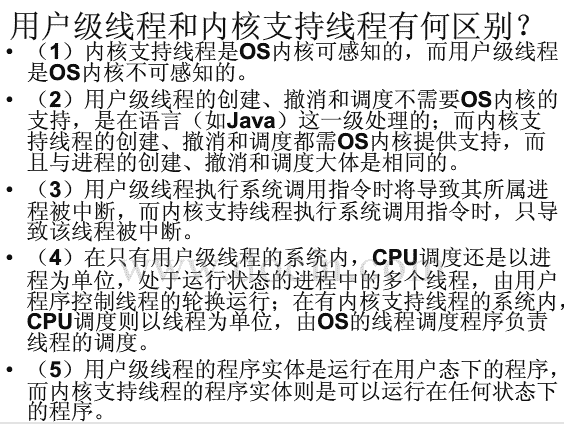
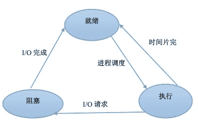
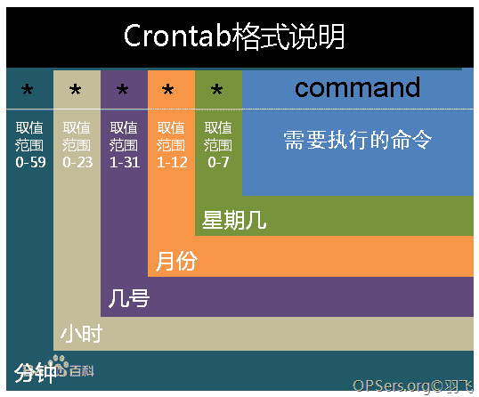
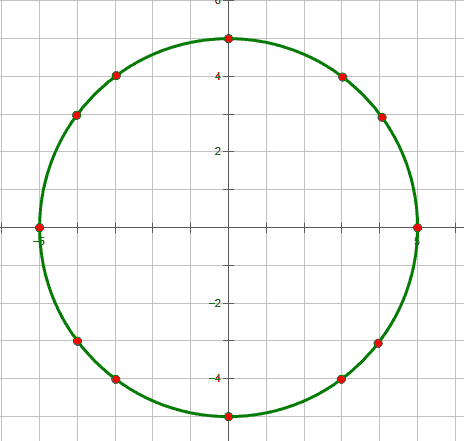

# 乐视 2017 暑期实习生笔试题（一）

## 1

进程控制块是描述进程状态和特性的数据结构，一个进程() 。

正确答案: D   你的答案: 空 (错误)

```cpp
可以有多个进程控制块；
```

```cpp
可以和其他进程共用一个进程控制块；
```

```cpp
可以没有进程控制块；
```

```cpp
只能有惟一的进程控制块。
```

本题知识点

C++工程师 Java 工程师 乐视 2017

讨论

[Eason_S](https://www.nowcoder.com/profile/314390)

进程由两部分组成: 内存映像和进程控制块。进程控制块, 可以把进程的状态数据, 上下文等都放入其中，来记录进程的外部特征，描述进程的运动变化过程。系统 根据进程控制块 来对并发执行的进程进行控制和管理。

编辑于 2016-06-16 15:38:36

* * *

[Mr.Apple](https://www.nowcoder.com/profile/213669)

**进程**是指一个具有一定独立功能的程序关于某个数据集合的一次运动活动。简单地说进程是可以并发执行的程序的执行过程，它是控制程序管理下的基本的多道程序单位。**进程控制块（PCB** **）**是由系统为每个进程分别建立的，用以记录对应进程的程序和数据的存储情况，记录进程的动态信息。**PCB 是一个进程存在的标志。**系统根据 PCB 而感知进程的存在，根据 PCB 中的信息对进程实施控制管理，当进程结束时，系统回收对应的 PCB，进程随之消亡。**进程控制块中包含一系列信息，其中进程名即进程标识符唯一标识对应进程，系统根据该标识符来识别一个进程。**一个进程只有唯一的进程控制块，不可和其他进程共用一个进程控制块。

编辑于 2016-08-02 10:34:58

* * *

[忆水寒](https://www.nowcoder.com/profile/232102)

**//O(∩_∩)O 哈哈~****选择 D。进程控制块，也叫 PCB。**它 是由系统为每个进程分别建立的，用以记录对应进程的程序和数据的存储情况，记录进程的动态信息。所以，只能有唯一的进程控制块。

发表于 2016-08-06 20:34:52

* * *

## 2

在操作系统中,把逻辑地址转变为内存的物理地址的过程称作()。

正确答案: D   你的答案: 空 (错误)

```cpp
编译；
```

```cpp
连接；
```

```cpp
运行；
```

```cpp
重定位。
```

本题知识点

C++工程师 Java 工程师 乐视 2017

讨论

[Eason_S](https://www.nowcoder.com/profile/314390)

**编译**：进行语法检查、函数分配空间，将各个函数编译成二进制码，按照特定目标文件格式生成目标文件。**连接**：把程序中各个文件编译生成的目标文件连接起来，同时还要同系统提供的资源（如函数库）连接成为一个整体，得到可执行文件。**运行**：执行连接好的程序。**重定位**：把程序的逻辑地址空间变换成内存中的实际物理地址空间的过程，也就是说在装入时对目标程序中指令和数据的修改过程。

发表于 2016-06-16 16:07:13

* * *

## 3

某计算机系统中有 8 台打印机,由 K 个进程竞争使用,每个进程最多需要 3 台打印机。该系统可能会发生死锁的 K 的最小值是()

正确答案: C   你的答案: 空 (错误)

```cpp
2
```

```cpp
3
```

```cpp
4
```

```cpp
5
```

本题知识点

C++工程师 Java 工程师 乐视 2017

讨论

[chinawjb](https://www.nowcoder.com/profile/760834)

最坏情况下，N 个进程每个都得  查看全部)

编辑于 2016-07-06 21:43:45

* * *

[李滔](https://www.nowcoder.com/profile/4713958)

由于每个进程最多需要使用 3 台打印机，可以先给每个进程分配 2 台打印机，最后在总的资源中减 1 个出来分配给一个进程就能避免死锁。所以用 7/2=3.5,向下取整为 3，所以最多使用 3 个进程不会发生死锁。所以发生死锁的最小值为 4.

发表于 2016-07-08 13:39:30

* * *

[秦王](https://www.nowcoder.com/profile/406719)

由于每个进程最多需要 3 台打印机就可以正常结束，释放占有的资源。那么现在有 K 个进程，最差的情况是这个 k 个进程每个进程分配了两台打印机，那么进程僵持在这里每个都在等待分配第三台打印机，只要还有一台打印机，进程就就能陆续释放，不会产生死锁，所以不产生死锁的条件是 2k+1<=8 即 k<3.5，所以可能发生死锁的 k 的最小值（整数）是 4  

发表于 2016-07-29 21:38:34

* * *

## 4

下面关于线程的叙述中，正确的是( )。

正确答案: C   你的答案: 空 (错误)

```cpp
不论是系统支持线程还是用户级线程，其切换都需要内核的支持
```

```cpp
线程是资源的分配单位，进程是调度和分配的单位
```

```cpp
不管系统中是否有线程，进程都是拥有资源的独立单位
```

```cpp
在引入线程的系统中，进程仍是资源分配和调度分派的基本单位
```

本题知识点

C++工程师 Java 工程师 乐视 2017

讨论

[青花小子](https://www.nowcoder.com/profile/517563)

在多线程的 OS 中，线程是调度和分配的基本单位，而进程是拥有资源的基本单位

发表于 2016-06-18 15:41:35

* * *

[frelizh](https://www.nowcoder.com/profile/186988)

（A）:线程的实现可以分为两类：用户级线程(User-LevelThread, ULT)和内核级线程(Kemel-LevelThread,  KLT)。内核级线程又称为内核支持的线程。
在用户级线程中，有关线程管理的所有工作都由应用程序完成，内核意识不到线程的存在。应用程序可以通过使用线程库设计成多线程程序。通常，应用程序从单线程起始，在该线程中开始运行，在其运行的任何时刻，可以通过调用线程库中的派生例程创建一个在相同进程中运行的新线程。图 2-2(a)说明了用户级线程的实现方式。

在内核级线程中，线程管理的所有工作由内核完成，应用程序没有进行线程管理的代码，只有一个到内核级线程的编程接口。内核为进程及其内部的每个线程维护上下文信息，调度也是在内核基于线程架构的基础上完成。图 2-2(b)说明了内核级线程的实现方式。

在一些系统中，使用组合方式的多线程实现。线程创建完全在用户空间中完成，线程的调度和同步也在应用程序中进行。一个应用程序中的多个用户级线程被映射到一些（小于或等于用户级线程的数目）内核级线程上。图 2-2(c)说明了用户级与内核级的组合实现方式。 ( B D):在传统的操作系统中，拥有资源和独立调度的基本单位都是进程。在引入线程的操作系统中，线程是独立调度的基本单位，进程是资源拥有的基本单位。在同一进程中，线程的切换不会引起进程切换。在不同进程中进行线程切换,如从一个进程内的线程切换到另一个进程中的线程时，会引起进程切换。

编辑于 2016-06-16 21:39:20

* * *

[木头人 5](https://www.nowcoder.com/profile/3645870)



发表于 2016-07-26 16:44:17

* * *

## 5

程序动态链接发生时刻是在()

正确答案: B D   你的答案: 空 (错误)

```cpp
编译时
```

```cpp
装入时
```

```cpp
调用时
```

```cpp
程序执行时
```

本题知识点

C++工程师 Java 工程师 乐视 2017

讨论

[小乌](https://www.nowcoder.com/profile/477630)

实现链接的方式有三种（链接时间不同）：1.静态链接 2.动态链接(装入时)3.动态链接(运行时）这道题应该是有两个答案

发表于 2016-06-17 16:26:42

* * *

[Ｍe 怤畢炜 eＭ](https://www.nowcoder.com/profile/215299)

这题出的好不严谨！ 在计算机操作系统的书上明确的写了程序链接的方式一共有三种： 1.静态链接方式（Static Linking）2.装入时动态链接（Load-time Dynamic Linking）3.运行时动态链接(Run-time Dynamic Linking)光问个程序动态链接谁知道是装入时还是运行时啊？

发表于 2016-06-21 14:45:00

* * *

[Axl_C](https://www.nowcoder.com/profile/669488)

动态链接也有装入时动态链接和运行时动态链接，D 是不是也应该是对的？

发表于 2016-06-15 14:48:04

* * *

## 6

以下哪些进程状态转换是正确的

正确答案: A B C E   你的答案: 空 (错误)

```cpp
就绪到运行
```

```cpp
运行到就绪
```

```cpp
运行到阻塞
```

```cpp
阻塞到运行
```

```cpp
阻塞到就绪
```

本题知识点

C++工程师 Java 工程师 乐视 2017

讨论

[Eason_S](https://www.nowcoder.com/profile/314390)



发表于 2016-06-16 16:32:25

* * *

[tan313](https://www.nowcoder.com/profile/608282)

漏选 B，运行到就绪可以指时间片用完时，其状态可以从运行切换至就绪。

发表于 2016-06-15 09:42:43

* * *

[半纸流年](https://www.nowcoder.com/profile/710504)

B：操作系统，运行——》就绪，由于时间片，运行时间到了，所以存在运行到就绪状态。

发表于 2016-06-16 13:05:52

* * *

## 7

IP 地址分类中,C 类地址的范围为：

正确答案: C   你的答案: 空 (错误)

```cpp
以 0 开头， 第一个字节范围：0~127
```

```cpp
以 10 开头， 第一个字节范围：128~191；
```

```cpp
以 110 开头， 第一个字节范围：192~223；
```

```cpp
以上答案都不正确
```

本题知识点

C++工程师 Java 工程师 乐视 2017

讨论

[tan313](https://www.nowcoder.com/profile/608282)

```cpp
1\. A 类地址 ⑴ A 类地址第 1 字节为网络地址，其它 3 个字节为主机地址。另外第 1 个字节的最高位固定为 0。 
  ⑵ A 类地址范围：1.0.0.1 到 126.255.255.254。 
  ⑶ A 类地址中的私有地址和保留地址： 
  ①10.0.0.0 到 10.255.255.255 是私有地址（所谓的私有地址就是在互联网上不使用，而被用在局域网络中的地址）。 
  ② 127.0.0.0 到 127.255.255.255 是保留地址，用做循环测试用的。 
  2\. B 类地址 ⑴ B 类地址第 1 字节和第 2 字节为网络地址，其它 2 个字节为主机地址。另外第 1 个字节的前两位固定为 10。 
  ⑵ B 类地址范围：128.0.0.1 到 191.255.255.254。 
  ⑶ B 类地址的私有地址和保留地址 
  ① 172.16.0.0 到 172.31.255.255 是私有地址 
  ②169.254.0.0 到 169.254.255.255 是保留地址。如果你的 IP 地址是自动获取 IP 地址，而你在网络上又没有找到可用的 DHCP 服务器，这时你将会从 169.254.0.0 到 169.254.255.255 中临得获得一个 IP 地址。 
  3\. C 类地址 ⑴C 类地址第 1 字节、第 2 字节和第 3 个字节为网络地址，第 4 个个字节为主机地址。另外第 1 个字节的前三位固定为 110。 
  ⑵ C 类地址范围：192.0.0.1 到 223.255.255.254。 
  ⑶ C 类地址中的私有地址：192.168.0.0 到 192.168.255.255 是私有地址。
```

发表于 2016-06-15 09:44:42

* * *

[Eason_S](https://www.nowcoder.com/profile/314390)

A 类：1.0.0.1~126.255.255.254 第一个字节范围 1~126（0000 0001~0111 1110） ‘0’开头  B 类：128.0.0.1 到 191.255.255.254 第一个字节范围 128~191 （1000 0000~1011 1111）‘10’开头 C 类：192.0.0.1 到 223.255.255.254 第一个字节范围 192~223 （1100 0000~1101 1111）‘110’开头

发表于 2016-06-16 16:59:31

* * *

[半纸流年](https://www.nowcoder.com/profile/710504)

A：1~126 ‘0’开头  
B：128~191 ‘10’开头
C：192~223 ‘110’开头

发表于 2016-06-16 13:31:55

* * *

## 8

FTP 服务和 SMTP 服务的端口默认分别是（）

正确答案: C   你的答案: 空 (错误)

```cpp
20 与 25
```

```cpp
21 与 25
```

```cpp
20，21 与 25
```

```cpp
20 与 21
```

本题知识点

C++工程师 Java 工程师 乐视 2017

讨论

[宝宝^_^](https://www.nowcoder.com/profile/829341)

```cpp
SMTP：定义了简单邮件传送协议，现在很多邮件服务器都用的是这个协议，用于发送邮件。
如常见的免费邮件服务中用的就是这个邮件服务端口，所以在电子邮件设置中常看到有这么 SMTP 端口设置这个栏，
服务器开放的是 25 号端口。  
```

```cpp
FTP：21 端口用于连接，20 端口用于传输数据
　　进行 FTP 文件传输中，客户端首先连接到 FTP 服务器的 21 端口，进行用户的认证，认证成功后，要传输文件时，服务器会开一个
端口为 20 来进行传输数据文件。 也就是说，端口 20 才是真正传输所用到的端口，端口 21 只用于 FTP 的登陆认证。我们平常下载文件
时，会遇到下载到 99%时，文件不完成，不能成功的下载。其实是因为文件下载完毕后，还要在 21 端口再行进行用户认证，而下载文
件的时间如果过长，客户机与服务器的 21 端口的连接会被服务器认为是超时连接而中断掉，就是这个原因。解决方法就是设置 21 端口
的响应时间。
```

编辑于 2016-07-23 10:19:19

* * *

[tan313](https://www.nowcoder.com/profile/608282)

```cpp

	FTP 使用 TCP 的服务，有两个特定的端口，端口 20 用于控制连接。端口 21 用于数据连接

```

发表于 2016-06-15 09:48:30

* * *

[半纸流年](https://www.nowcoder.com/profile/710504)

[**TCP/IP 协议**](http://baike.baidu.com/view/7649.htm) 中，FTP 标准命令 TCP[端口](http://baike.baidu.com/view/1075.htm) 号为 21，Port 方式数据端口为 20。

发表于 2016-06-17 16:10:27

* * *

## 9

一个 B 类网的子网掩码是 255.255.240.0，这个子网能拥有的最大主机数是：

正确答案: C   你的答案: 空 (错误)

```cpp
240
```

```cpp
255
```

```cpp
4094
```

```cpp
65534
```

本题知识点

C++工程师 Java 工程师 乐视 2017

讨论

[chinawjb](https://www.nowcoder.com/profile/760834)

子网掩码中所有 0 的位数就是主机的位数，总共 12 位，所以可以有 2 的 12 次方，总共 4096 个，但是要除去全 0 和全 1，最后只有 4094 个

发表于 2016-06-15 12:26:31

* * *

[JKinbo](https://www.nowcoder.com/profile/514106)

255,255,240,0 对应的二进制是 11111111|11111111|11110000|00000000,我们知道最后一个 1 之前是子网，那么对应的剩下的位置就是可放置的主机数，因此是 2 的 12 次幂，4096

发表于 2016-06-25 16:47:13

* * *

## 10

如果在一个建立了 TCP 连接的 socket 上调用 recv 函数，返回值为 0，则表示（）

正确答案: B   你的答案: 空 (错误)

```cpp
对端发送了一段长度为 0 的数据
```

```cpp
对端关闭了连接
```

```cpp
还没有收到对端数据
```

```cpp
连接发生错误
```

本题知识点

C++工程师 Java 工程师 乐视 2017

讨论

[zhisheng_blog](https://www.nowcoder.com/profile/616717)

**<0 出错 ****=0 连接关闭 ****>0 接收到数据大小**

发表于 2016-07-19 12:24:56

* * *

[FuestcK](https://www.nowcoder.com/profile/479698)

```cpp

	返回说明： 

	成功执行时，返回接收到的字节数。

	另一端已关闭则返回 0。

	失败返回-1，

```

发表于 2016-06-15 16:43:01

* * *

[SKCXY](https://www.nowcoder.com/profile/584779)

recv 的返回值是成功接收到的字节数。当返回值为-1 时发生错误，可以查看 errno 获取错误码。当另一方使用正常方式关闭连接的时候返回值为 0。

发表于 2016-12-08 11:33:53

* * *

## 11

面有关 http keep-alive 说法错误的是？

正确答案: D   你的答案: 空 (错误)

```cpp
在 HTTP1.0 和 HTTP1.1 协议中都有对 KeepAlive 的支持。其中 HTTP1.0 需要在 request 中增加“Connection： keep-alive” header 才能够支持，而 HTTP1.1 默认支持
```

```cpp
当使用 Keep-Alive 模式时，Keep-Alive 功能使客户端到服 务器端的连接持续有效，当出现对服务器的后继请求时，Keep-Alive 功能避免了建立或者重新建立连接
```

```cpp
可以在服务器端设置是否支持 keep-alive
```

```cpp
当你的 Server 多为动态请求，建议开启 keep-alive 增加传输效率
```

本题知识点

C++工程师 Java 工程师 乐视 2017

讨论

[牛客 284361 号](https://www.nowcoder.com/profile/284361)


发表于 2016-06-19 19:24:25

* * *

[diaozaoxiang](https://www.nowcoder.com/profile/608687)

server 为多为静态内容时，开启 keep-alive，增加传输效率。动态请求，已占用的资源得不到释放，效率低下。

发表于 2016-06-15 17:04:21

* * *

[牛客(Yangfan)](https://www.nowcoder.com/profile/897546)

静态，打开 动态，关闭

发表于 2016-06-21 13:19:44

* * *

## 12

某台路由器有两个以太网接口，分别与不同网段的以太网相连，请问：该路由器最多可有几组？（ ）

正确答案: E   你的答案: 空 (错误)

```cpp
1
```

```cpp
2
```

```cpp
3
```

```cpp
4
```

```cpp
>4
```

本题知识点

C++工程师 Java 工程师 乐视 2017

讨论

[bboyzqh](https://www.nowcoder.com/profile/477212)

```cpp
我们知道现在咱用的小塑料盒宽带
```

  查看全部)

编辑于 2016-07-24 10:17:39

* * *

## 13

a 边长为 n 的正方形可以分成多个边长为 1 的正方形，如边长为 2 的正方形有 2×2 个边长为 1 的正方形和 1 个边长为 2 的正方形；问边长为 5 的正方形有几个正方形。

正确答案: C   你的答案: 空 (错误)

```cpp
25
```

```cpp
30
```

```cpp
55
```

```cpp
100
```

本题知识点

C++工程师 Java 工程师 乐视 2017

讨论

[落秋](https://www.nowcoder.com/profile/666040)

边长为 a 的正方形，总共有 1*1+2*2+，，，a*a 个正方形

发表于 2016-06-15 16:04:57

* * *

[helloworldzy](https://www.nowcoder.com/profile/812830)

找规律:边长为 1:1 边长为 2:2*2+1*1;边长为 3:3*3+2*2+1*1。。。边长为 a:a*a+.....+2*2+1*1

发表于 2016-06-16 10:33:47

* * *

[mygolang](https://www.nowcoder.com/profile/879952)

此题需要特别注意下 这个 "有" 字. 边长为 n 的正方形一共有 n * n + (n - 1) * (n - 1) + 2 * 2 + 1 * 1 个正方形.

发表于 2016-07-06 15:13:57

* * *

## 14

A 市 B，C 两个区，人口比例为 3：5，据历史统计 B 区的犯罪率为 0.01%，C 区为 0.015%，现有一起新案件发生在 A 市，那么案件发生在 B 区的可能性有多大？（）

正确答案: C   你的答案: 空 (错误)

```cpp
37.5%
```

```cpp
32.5%
```

```cpp
28.6%
```

```cpp
76.9%
```

本题知识点

C++工程师 Java 工程师 乐视 2017

讨论

[bboyzqh](https://www.nowcoder.com/profile/477212)

题中犯罪率应该是指犯罪人数与总人数的比例,A 和 B 区的人数比为 3：5,那么 A 和 B 的犯罪人数比为（3*0.01%）：（5*0.015%）.
新案件发生在 A 区的可能性应当为 A 区犯罪人数除以 A 和 B 区犯罪人数的总和.
即（3*0.01%）/（（3*0.01%）+（5*0.015%））=0.2857=28.6%

发表于 2016-06-14 23:31:55

* * *

[阿尔曼](https://www.nowcoder.com/profile/935698)

犯罪事件记为 F，则要求的概率为 P(B|F)，根据条件概率 P(B|F)=P(F,B)/P(F)， P(F,B)=0.01%*3/8， P(F)=P(A,F)+P(B,F)=0.01%*3/8+0.015%*5/8；即可求出答案。

发表于 2016-06-22 09:39:59

* * *

[牛客(Yangfan)](https://www.nowcoder.com/profile/897546)

(3/8)*0.01%/((3/8)*0.01%+(5/8)*0.015%)

发表于 2016-06-21 13:24:45

* * *

## 15

下面程序的功能是输出数组的全排列,选择正确的选项,完成其功能。

```cpp
void perm(int list[], int k, int m)
{
if (    )
{
    copy(list,list+m,ostream_iterator<int>(cout," "));
    cout<<endl;
    return;
}
for (int i=k; i<=m; i++)
{
    swap(&list[k],&list[i]);
    (    );
    swap(&list[k],&list[i]);
}
}
```

正确答案: B   你的答案: 空 (错误)

```cpp
k!=m 和 perm（list，k+1，m）
```

```cpp
k==m 和 perm（list，k+1，m）
```

```cpp
k!=m 和 perm（list，k，m）
```

```cpp
k==m 和 perm（list，k，m）
```

本题知识点

C++工程师 Java 工程师 乐视 2017

讨论

[chinawjb](https://www.nowcoder.com/profile/760834)

if 是递归的终止判断条件，刚开始输入的时候 k 应该为 0，m 应该为数组中的元素个数；所以当 k==m 时，表示全排列的全部情况都已经找出。
第一个 swap 是依次将第 k 个元素和 k~m 个元素交换，交换完后进入递归，再全排列其子数组。
递归调用，之所以从 k+1 开始，是因为如果传入的是 k 的话，递归传进去的参数不变，递归将永无止境的递归下去，因为 k 永远不会等于 m
第二个 swap 是将该层交换完后的数组再还原，目的是为了使递归返回后不改变上一层的数组元素顺序，方便下一次交换。

发表于 2016-06-15 12:46:15

* * *

[欧阳我去](https://www.nowcoder.com/profile/745640)

其实这道题不需要搞清楚是在做什么，排除法都能够解决

发表于 2016-06-16 16:47:13

* * *

## 16

在 Linux 中 crontab 文件由 6 个域组成，每个域之间用空格分隔，下列哪个排列方式是正确的？

正确答案: B   你的答案: 空 (错误)

```cpp
MIN HOUR DAY MONTH YEAR COMMAND
```

```cpp
MIN HOUR DAY MONTH DAYOFWEEK COMMAND
```

```cpp
COMMAND HOUR DAY MONTH DAYOFWEEK
```

```cpp
COMMAND YEAR MONTH DAY HOUR MIN
```

本题知识点

C++工程师 Java 工程师 乐视 2017

讨论

[夏雨天](https://www.nowcoder.com/profile/710633)



发表于 2016-08-30 15:32:10

* * *

[zhisheng_blog](https://www.nowcoder.com/profile/616717)

**crontab 分六大块组成,具体如下：**
**MIN（分钟） HOUR（小时） DAY（日期） MONTH（月份） DAYOFWEEK（星期） COMMAND（命令）**
**故答案选：B**

发表于 2016-07-19 12:27:46

* * *

[牛客 677436 号](https://www.nowcoder.com/profile/677436)

crontab 分六大块组成,具体如下：
MIN（分钟） HOUR（小时） DAY（日期） MONTH（月份） DAYOFWEEK（星期） COMMAND（命令）

发表于 2016-06-18 11:06:50

* * *

## 17

在 Linux 系统中哪个文件定义了服务搜索顺序？ 。

正确答案: C   你的答案: 空 (错误)

```cpp
/etc/services
```

```cpp
/etc/nsorder
```

```cpp
/etc/nsswitch.conf
```

```cpp
/etc/hosts
```

本题知识点

C++工程师 Java 工程师 乐视 2017

讨论

[zhisheng_blog](https://www.nowcoder.com/profile/616717)

**/etc/services     ** 文件是记录网络服务名和它们对应使用的端口号及协议。**/etc/nsswitch.conf      ** 规定通过哪些途径以及按照什么顺序通过这些途径来查找特定类型的信息。还可以指定某个方法奏效或失效时系统将采取什么动作。  **/etc/hosts       **是配置 ip 地址和其对应主机名的文件，这里可以记录本机的或其他主机的 ip 及其对应主机名。不同的 linux 版本，这个配置文件也可能不同

发表于 2016-07-19 12:35:19

* * *

[bboyzqh](https://www.nowcoder.com/profile/477212)

文件/etc/nsswitch.conf(name service switch configuration ，名字服务切换配置 ) 规定通过哪些途径以及按照什么顺序通过这些途径来查找特定类型的信息。还可以指定某个方法奏效或失效时系统将采取什么动作。  
Nsswitch.conf 中的每一行配置都指明了如何搜索信息，每行配置的格式如下：  
Info: method[[action]] [method[[action]]...]  
其中，info 指定该行所描述的信息的类型， method 为用来查找该信息的方法， action 是对前面的 method 返回状态的响应。 action 要放在方括号里。  

发表于 2016-06-14 23:33:11

* * *

[心静](https://www.nowcoder.com/profile/437950)

/etc/services 文件是记录网络服务名和它们对应使用的端口号及协议。/etc/nsswitch.conf(name service switch configuration，名字服务切换配置)服务搜索顺序,规定通过哪些途径以及按照什么顺序通过这些途径来查找特定类型的信息。还可以指定某个方法奏效或失效时系统将采取什么动作。/etc/hosts 是配置 ip 地址和其对应主机名的文件，这里可以记录本机的或其他主机的 ip 及其对应主机名。

发表于 2016-06-17 11:02:25

* * *

## 18

下列关于链接描述，正确的的是（） 

正确答案: A C D   你的答案: 空 (错误)

```cpp
硬链接就是让链接文件的 i 节点号指向被链接文件的 i 节点
```

```cpp
硬链接和符号连接都是产生一个新的 i 节点
```

```cpp
链接分为硬链接和符号链接
```

```cpp
硬连接不能链接目录文件
```

本题知识点

C++工程师 Java 工程师 乐视 2017

讨论

[FuestcK](https://www.nowcoder.com/profile/479698)

LINUX 的硬链接不能链接到目录是因为引入了对目录的硬连接就有可能在目录中引入循环，在目录遍历的时候系统就会陷入无限循环当中，这样导致无法定位到访问目录。 硬链接：为原文件创建一个新的文件名，但本质中只增加了一个目录项，并使用与原来相等的 inode，指向原文件的区域。数据区为两个名字共享。使用限制：源文件和链接文件必须在同一个文件系统内，且目录文件不能创建硬链接。命令：ln a b // 给 a 创建链接文件 b 可以使用 ls -i 查看两个 inode 是完全一样的。同时注意连接计数 count。count 的意义对于文件来说是硬链接的个数，对于目录，一般（count-2）为目录包含的子文件个数。 注意：两者的权限也是完全一样的。对其中一个进行读写操作，另外一个也会更新。但删除其中一个，只会删除目录项，不会删除存储区数据。另外一个文件的使用和操作完全不受影响。除非 count-1 结果 0，才将数据区删除。 作用：节省空间，两个文件能同步更新，防止重要文件被“误删”。 软链接：也叫符号链接。本质是创建一个新的文件，保存源文件的路径名。因此 inode 和源文件的 inode 是不一样的。使用没有文件系统的限制，也没有文件和目录的限制。 命令：ln -s a b   注意：产生的文件权限和源文件是不一样的。由于软链接使用比较灵活，可能断链，也可以自循环，往往需要多次查找增加文件操作的步骤而降低效率。尽量少用，并避免出现循环。

编辑于 2016-06-15 16:51:04

* * *

[半纸流年](https://www.nowcoder.com/profile/710504)

符号链接也叫软连接。
硬链接是一个文件有一个或多个文件名。
软连接是一个文件内存在另一个文件的指向。

发表于 2016-06-17 19:55:40

* * *

[超爱贤](https://www.nowcoder.com/profile/758292)

请问你们楼上的怎么回复解答有什么用呢，抄书本上和网上的，文不对题。

发表于 2016-08-30 22:25:41

* * *

## 19

在 Linux 系统中,下列哪个命令是用来统计一个文件中的行数？

正确答案: B   你的答案: 空 (错误)

```cpp
lc
```

```cpp
wc – l
```

```cpp
cl
```

```cpp
count
```

本题知识点

C++工程师 Java 工程师 乐视 2017

讨论

[FuestcK](https://www.nowcoder.com/profile/479698)

wc -l 只输出文件行数 Linux 系统中的 wc(Word Count)命令的功能为统计指定文件中的字节数、字数、行数，并将统计结果显示输出。1．命令格式：wc [选项]文件...2．命令功能：统计指定文件中的字节数、字数、行数，并将统计结果显示输出。该命令统计指定文件中的字节数、字数、行数。如果没有给出文件名，则从标准输入读取。wc 同时也给出所指定文件的***计数。3．命令参数：-c 统计字节数。-l 统计行数。-m 统计字符数。这个标志不能与 -c 标志一起使用。-w 统计字数。一个字被定义为由空白、跳格或换行字符分隔的字符串。-L 打印最长行的长度。-help 显示帮助信息--version 显示版本信息 4．使用实例：实例 1：查看文件的字节数、字数、行数命令：wc test.txt 输出：[root@localhost test]# cat test.txt hnlinuxpeida.cnblogs.comubuntuubuntu linuxredhatRedhatlinuxmint[root@localhost test]# wc test.txt 7  8 70 test.txt[root@localhost test]# wc -l test.txt 7 test.txt[root@localhost test]# wc -c test.txt 70 test.txt[root@localhost test]# wc -w test.txt 8 test.txt[root@localhost test]# wc -m test.txt 70 test.txt[root@localhost test]# wc -L test.txt 17 test.txt 说明：7     8     70     test.txt 行数 单词数 字节数 文件名实例 2：用 wc 命令怎么做到只打印统计数字不打印文件名命令：输出：[root@localhost test]# wc -l test.txt 7 test.txt[root@localhost test]# cat test.txt |wc -l7[root@localhost test]#说明：使用管道线，这在编写 shell 脚本时特别有用。实例 3：用来统计当前目录下的文件数命令：ls -l | wc -l 输出：[root@localhost test]# cd test6[root@localhost test6]# ll 总计 604---xr--r-- 1 root mail  302108 11-30 08:39 linklog.log---xr--r-- 1 mail users 302108 11-30 08:39 log2012.log-rw-r--r-- 1 mail users     61 11-30 08:39 log2013.log-rw-r--r-- 1 root mail       0 11-30 08:39 log2014.log-rw-r--r-- 1 root mail       0 11-30 08:39 log2015.log-rw-r--r-- 1 root mail       0 11-30 08:39 log2016.log-rw-r--r-- 1 root mail       0 11-30 08:39 log2017.log[root@localhost test6]# ls -l | wc -l8[root@localhost test6]#说明：数量中包含当前目录

编辑于 2016-06-15 16:54:20

* * *

## 20

Linux 执行 ls，会引起哪些系统调用（）

正确答案: B C   你的答案: 空 (错误)

```cpp
nmap
```

```cpp
read
```

```cpp
execve
```

```cpp
fork
```

本题知识点

C++工程师 Java 工程师 乐视 2017

讨论

[Eason_S](https://www.nowcoder.com/profile/314390)

shell 命令执行机制就是 fork+exec， fork 是分身，execve 是变身。ls 命令要列出目录下的文件，所以 read 也会调用。

发表于 2016-06-16 22:30:23

* * *

[半纸流年](https://www.nowcoder.com/profile/710504)

nmap 也就是 Network Mapper，最早是 Linux 下的网络扫描和嗅探工具包。*nmap* 是一个网络连接端扫描软件，用来扫描网上电脑开放的网络连接端。

发表于 2016-06-17 20:13:00

* * *

[crab2313](https://www.nowcoder.com/profile/9180039)

注意题目说的是系统调用(System Call)不是库函数，是 linux 内核提供给外界的接口，库函数只是封装了这些接口而已 ls 会读文件夹所以用了 read，调用 ls 这个程序的时候会使用 execv，题目没说是 shell 里调用 ls 所以没有 fork，也许是你代码里手动通过 exec 系的函数调用 ls

发表于 2016-09-12 01:21:36

* * *

## 21

卢卡斯的驱逐者大军已经来到了赫柏的卡诺萨城，赫柏终于下定决心,集结了大军,与驱逐者全面开战。
卢卡斯的手下有 6 名天之驱逐者，这 6 名天之驱逐者各赋异能，是卢卡斯的主力。
为了击败卢卡斯，赫柏必须好好考虑如何安排自己的狂战士前去迎战。
狂战士的魔法与一些天之驱逐者的魔法属性是相克的，第 i 名狂战士的魔法可以克制的天之驱逐者的集合为 Si(Si 中的每个元素属于[0,5])。
为了公平，两名狂战士不能攻击同一个天之驱逐者。
现在赫柏需要知道共有多少种分派方案。
例：
S1={01},S2={23}，代表编号为 0 的狂战士的魔法可以克制编号为 0 和编号为 1 的天之驱逐者，编号为 1 的狂战士的魔法可以克制编号为 2 和编号为 3 的天之驱逐者，共有四种方案：02,03,12,13。
02---代表第一个狂战士负责编号为 0 的驱逐者，第二个狂战士负责编号为 2 的驱逐者；
03---代表第一个狂战士负责编号为 0 的驱逐者，第二个狂战士负责编号为 3 的驱逐者；
12---代表第一个狂战士负责编号为 1 的驱逐者，第二个狂战士负责编号为 2 的驱逐者;
13---代表第一个狂战士负责编号为 1 的驱逐者，第二个狂战士负责编号为 3 的驱逐者;
S1={01},S2={01}，代表编号为 0 的狂战士的魔法可以克制编号为 0 和编号为 1 的天之驱逐者，编号为 1 的狂战士的魔法可以克制编号为 0 和编号为 1 的天之驱逐者，共有两种方案：01,10。

本题知识点

穷举 C++工程师 Java 工程师 乐视 2017

讨论

[芸之黎](https://www.nowcoder.com/profile/107401)

```cpp
#include<iostream>
#include<cstring>
#include<cstdio>
using namespace std;
string s[6];
int n;
int vis[6];
int ans;
void dfs(int p)
{
    if(p == n)
    {
        ans++;
        return;
    }
    for(inti =0; i < s[p].length(); i++)
    {
        if(vis[s[p][i]-'0'] == 0)
        {
            vis[s[p][i]-'0'] = 1;
            dfs(p+1);
            vis[s[p][i]-'0'] = 0;
        }
    }
}
int main()
{
    while(cin>>n)
    {
        ans =0;
        memset(vis,0,sizeof(vis));
        for(inti =0; i < n; i++)
            cin>>s[i];
        dfs(0);
        cout<<ans<<endl;
    }
}
```

编辑于 2016-06-19 10:31:46

* * *

[mygolang](https://www.nowcoder.com/profile/879952)

```cpp
/*简单搜索*/
import java.io.BufferedInputStream;
import java.util.Scanner;

public class Main {

	private static int ans;

	public static int getAns(String[] str, int n) {
		ans = 0;
		int[] vis = {0, 0, 0, 0, 0, 0};
		dfs(str, vis, n, 0);
		return ans;
	}

	public static void dfs(String[] str, int[] vis, int n, int p) {
		if (p == n) {
			ans++;
			return ;
		}
		for (int i = 0; i < str[p].length(); i++) {
			if (vis[str[p].charAt(i) - '0'] == 0) {
				vis[str[p].charAt(i) - '0'] = 1;
				dfs(str, vis, n, p + 1);
				vis[str[p].charAt(i) - '0'] = 0;
			}
		}
	}

	public static void main(String[] args) {
		Scanner in = new Scanner(new BufferedInputStream(System.in));
		while (in.hasNext()) {
			int n = in.nextInt();
			String[] str = new String[n];
			for (int i = 0; i < n; i++) {
				str[i] = in.next();
			}

			int ans = getAns(str, n);
			System.out.println(ans);
		}
		in.close();
	}

}
```

发表于 2016-07-06 18:22:29

* * *

[远方的范特西](https://www.nowcoder.com/profile/818351)

```cpp
//非递归解法和递归解法，有兴趣的可以参考下
// letv1.cpp : 定义控制台应用程序的入口点。
//这道题的非递归解法，有兴趣的可以参考一下

//#include "stdafx.h"
#include <iostream>
#include <vector>
#include <string>
using namespace std;
struct node
{
	string * ps;
	int i;
};
int findNum(vector<string> data)
{
	if (data.size() == 1)
	{
		return data[0].size();
	}
	vector<struct node *> stk;
	vector<struct node *>::iterator it;
	struct node * pNode = new struct node;
	struct node * pTmp;
	pNode->ps = &data[0];
	pNode->i = 0;
	int j = 1;
	string * now = &data[1];
	int k = 0;
	int num = 0;
	stk.push_back(pNode);
	int m;	
	while (true)
	{//while1
		for (m = k; m < now->size(); m++)
		{
			bool flag = true;
			for (it = stk.begin(); it != stk.end(); it++)
			{
				if ((*((*it)->ps))[(*it)->i] == (*now)[m])
				{
					flag = false;
					break;
				}
			}
			if (flag == true)
			{
				pNode = new struct node;
				pNode->ps = now;
				pNode->i = m;
				stk.push_back(pNode);
				break;
			}
		}
		if (m < now->size())
		{
			if (j < data.size() - 1)
			{
				j++;
				k = 0;
				now = &data[j];
			}
			else
			{
				if (m == now->size() - 1)
				{

					it = stk.end() - 1;
					pTmp = *it;
					stk.erase(it);
					delete pTmp;
					it = stk.end() - 1;
					pTmp = *it;
					k = (*it)->i + 1;
					now = (*it)->ps;
					stk.erase(it);
					delete pTmp;
					j--;
					num++;
					if (stk.size() == 0 && k==now->size())
					{
						break;
					}
				}
				else
				{
					k=m+1;
					it = stk.end() - 1;
					pTmp = *it;
					stk.erase(it);
					delete pTmp;
					num++;
				}

			}
		}
		else
		{
			it = stk.end() - 1;
			pTmp = *it;
			now = (*it)->ps;
			k = (*it)->i+1;
			stk.erase(it);
			delete pTmp;
			j--;
			if (stk.size() == 0 && k == now->size())
			{
				break;
			}
		}
	}//while
	return num;
}

int main()
{
	vector<string> data;

	int n;
	string tmp;
	while (cin >> n)
	{
		for (int i = 0; i < n; i++)
		{
			string tmp;
			cin >> tmp;
			data.push_back(tmp);
		}

		cout << findNum(data) << endl;
		data.clear();
	}

    return 0;
}
//以下是递归的解法
// letv1Recursion.cpp : 定义控制台应用程序的入口点。
//

//#include "stdafx.h"
#include <iostream>
#include <vector>
#include <string>
using namespace std;

int getNum(vector<string> data, int i, string &s)
{
	int num = 0;
	int j;
	for (j = 0; j < data[i].size(); j++)
	{
		char a = data[i][j];
		if (s.find(a)== string::npos)
		{
			s.push_back(a);
			if (i == data.size() - 1)
			{
				num++;
				s.pop_back();
			}
			else
			{
				num+=getNum(data, i + 1, s);
				s.pop_back();
			}
		}
	}
	//s.pop_back();
	return num;
}

int main()
{
	vector<string> data;

	int n;
	while (cin>>n)
	{
		int i = 0;
		string s = "";
		int num = 0;
		for (int j = 0; j < n; j++)
		{
			string tmp;
			cin >> tmp;
			data.push_back(tmp);
		}
		cout<<getNum(data, i, s)<<endl;
		data.clear();
	}
    return 0;
}

```

编辑于 2016-06-20 12:37:42

* * *

## 22

在最近几场魔兽争霸赛中，赫柏对自己的表现都不满意。
为了尽快提升战力，赫柏来到了雷鸣交易行并找到了幻兽师格丽，打算让格丽为自己的七阶幻兽升星。
经过漫长的等待以后，幻兽顺利升到了满星，赫柏很满意，打算给格丽一些小费。
赫柏给小费是有原则的：
1.最终给格丽的钱必须是 5 的倍数；
2.小费必须占最终支付费用的 5%~10%之间（包含边界）。
升星总共耗费 A 魔卡，赫柏身上带了 B 魔卡，赫柏想知道他有多少种支付方案可供选择。
注：魔卡是一种货币单位，最终支付费用=本该支付的+小费

本题知识点

数学 C++工程师 Java 工程师 乐视 2017

讨论

[NWU](https://www.nowcoder.com/profile/184691)

#include <iostream>#include <math.h>using namespace std;int main(){int a,b;while(cin>>a>>b){int count = 0;int start = ceil(a/0.95);//起点（向上取整）int end = floor(a/0.90);//终点（向下取整）while((start % 5 != 0)&&(start<=end))++start;for(int i = start; i <= end&&i <= b; i += 5)++count;cout<<count<<endl;}return 0;}

发表于 2016-06-15 18:09:54

* * *

[fight 灬奋斗](https://www.nowcoder.com/profile/943684)

```cpp
#include<iostream>
#include<math.h>
using namespace std;
int main(){
    int A,B,R;
    while(cin>>A&&cin>>B){
        R=0;
        int a=ceil(A/0.95),b=floor(A/0.9);
        if(a<=B){
            if(b>B){
                R=B/5-a/5;
            }else{
                R=b/5-a/5;
            }
            if(a%5==0)
                R++;
   	}
        cout<<R<<endl;
    }
    return 0;
}
```

发表于 2016-06-15 10:15:58

* * *

[越努力-越幸运](https://www.nowcoder.com/profile/335227)

```cpp
#include<iostream>
#include<math.h>
using namespace std;
int main(){
    long A,B; 
    while(cin>>A>>B){
        int n=0;
        long a = ceil((double)A/19),b=(B-A)<A/9?(B-A):A/9;
        int mod = (5-(A+a)%5)%5;
        if(mod<=b&&a<=b){
            n=(b-a-mod)/5+1;
			if(a+mod>b) n--;
        }
        cout<<n<<endl;     
    }
    return 0;
}
```

发表于 2016-08-20 13:52:25

* * *

## 23

赫柏在绝域之门击败鲁卡斯后，从鲁卡斯身上掉落了一本高级技能书，赫柏打开后惊喜地发现这是一个早已失传的上古技能---禁忌雷炎。
该技能每次发动只需扣很少的精神值，而且输出也非常高。
具体魔法描述如下：
把地图抽象为一个二维坐标，技能发动者位于(0,0)位置。以技能发动者为中心，做一个半径为 r 的圆，满足 r²=S，如果敌人位于这个圆上，且位置为整点坐标，这个敌人将收到该技能的输出伤害。。
例如当 S=25 时，将有 12 个敌人受到该技能的输出伤害，如下图所示：



更厉害的是，禁忌雷炎可以通过改变魔法输入来控制 S 的大小，因此数学好的魔法师可以通过该技能攻击到更多的敌人。
赫柏想将这个技能学会并成为自己的主技能，可数学是他的硬伤，所以他请求你为他写一个程序，帮帮他吧，没准他就把禁忌雷炎与你分享了 : )

本题知识点

数学 C++工程师 Java 工程师 乐视 2017

讨论

[芸之黎](https://www.nowcoder.com/profile/107401)

```cpp
只需要按一个方向遍历一遍 利用勾股定理 x*x+y*y = r*r 即可解决四分之一圆周的点 *4 即为结果
 #include<iostream>
 #include<cstring>
 #include<cstdio>
 #include<cmath>
 using namespace std;
 int n;
 int main()
 {
     while(cin>>n)
     {
         int ans = 0;
         for(int i = 0; i*i < n; i ++)
         {
             int j = n - i*i;
             int s = sqrt(j);
             if(s*s == j)ans++;
         }
         cout<<4*ans<<endl;
     }
 }
```

编辑于 2016-06-19 10:25:33

* * *

[Jason09](https://www.nowcoder.com/profile/7700243)

```cpp
//在第一象限，从原点向外，发散地画圆
#include <iostream>
#include <cmath>
using namespace std;

int main()
{
	unsigned int x, y, n, ans;
	while (cin >> n)
	{
		ans = 0;
		for (x = 0; x*x < n; x++) {
			y = sqrt(n - x*x);
			if (x*x + y*y == n)
				ans++;
		}
		cout << 4 * ans << endl;
    }
    return 0;
}
```

发表于 2016-09-02 14:09:27

* * *

[wsxoo](https://www.nowcoder.com/profile/5257582)

```cpp
#include <iostream>
#include <stdio.h>
#include <math.h>
using namespace std;

long long s,cnt;
/*

*/

int main(){
	long long r,x,y;
	double tmpy;
	while(cin>>s){
		r= (long long )sqrt((double)s);
		x=r;
		y=0;
		cnt=0;
		while(x>=(-r)){
			tmpy = sqrt((double)(s-(x*x)));
			y= (long long )tmpy;
			if(tmpy-y <= 0.000001){
				if(y != 0){ //点如果落在除 x 轴的其他地方，根据圆的对称性，点的数量要加 2
					cnt += 2;
				}else{//点如果落在 x 轴上，点数加一就可以了
					cnt++;
				}

			}

			x--;
		}
		cout<<cnt<<endl;
	}
    return 0;
}

```

编辑于 2016-09-01 16:22:57

* * *