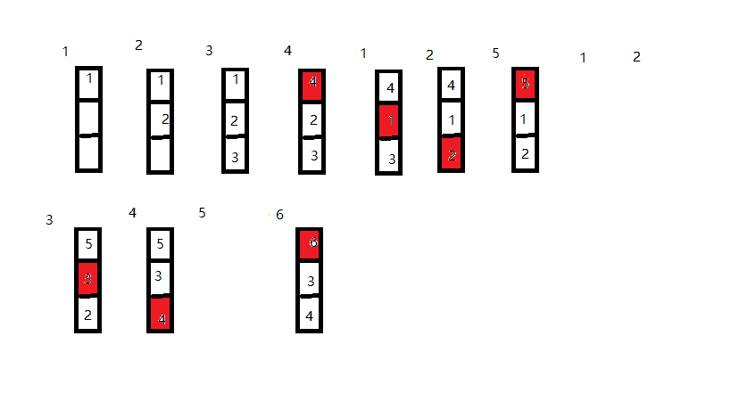
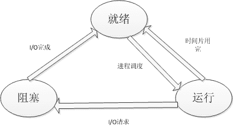

# 乐视 2017 暑期实习生笔试题（二）

## 1

适应于请求段的内存分配方法是（ ）。

正确答案: D   你的答案: 空 (错误)

```cpp
首次适应和最佳适应
```

```cpp
固定分区和可变分区
```

```cpp
首次适应和固定分区
```

```cpp
最佳适应和可变分区
```

本题知识点

C++工程师 Java 工程师 乐视 2017

讨论

[zhaoying](https://www.nowcoder.com/profile/316866)

请求分段系统是在分段系统的基础上，增加了请求调段功能和分段置换功能所形成的分段式虚拟存储系统。分段式存储管理方式分配算法与可变分区的分配算法相似，可以采用最佳适应法、最坏适应法和首次适应法等分配算法。显然仍然要解决外碎片的问题。

*   **首次** **适应分配算法：** 这种算法按分区序号从空闲分区表的第一个表目开始查找该表， **把最先找到的大于或等于作业大小的空闲分区分给要求的作业** 。然后，再按照作业的大小，从该分区中划出一块内存空间分配给作业，余下的空闲分区仍留在空闲分区表中。如果查找到分区表的最后仍没有找到大于或等于该作业的空闲区，则此次分配失败。 优点：优先利用内存中低址部分的空闲分区，而高址部分的空闲分区很少被利用，从而保留了高址部分的大空闲区。为以后到达的大作业分配大的内存空间创造了条件。缺点：低址部分不断被划分，致使留下许多难以利用的、很小的空闲分区。 
*   **循环** **首次** **适应分配算法：** 这种算法是由最先适应分配算法经过改进而形成的。在为作业分配内存时，不再每次从空闲分区表的第一个表项开始查找，而是从上次找到的空闲区的下一个空闲区开始查找，直至找到第一个能满足要求的空闲区为止，并从中划分出一块与请求大小相等的内存空间分配给作业。为实现该算法，应设置一起始查找指针，以指示下一次开始查找的空闲分区，并采用循环查找方式。即如果最后一个空闲分区的大小仍不能满足要求，则返回到第一个空闲分区进行查找。 **优点** ：内存中的空闲区分布得更均匀，减少查找空闲分区的开销。 **缺点** ：系统中缺乏大的空闲分区，对大作业不利。
*   **最佳适应分配算法** ：该算法从所有未分配的分区中挑选一个 **最接近作业大小且大于或等于作业的空闲分区分配给作业** ，目的是使每次分配后剩余的碎片最小。为了查找到大小最合适的空闲分区，需要查遍整个空闲分区表，从而增加了查找时间。因此，为了加快查找速度，要求将所有的空闲分区，按从小到大递增的顺序进行排序。这样，第一次找到的满足要求的空闲分区，必然是最佳的。 **缺点** ：每次分配之后形成的剩余部分，却是一些小的碎片，不能被别的作业利用。因此，该算法的内存利用率是不高的。 
*   **最坏适应分配算法：** 该算法从所有未分配的分区中挑选一个 **最大的空闲分区分配给作业** ，目的是使分配后剩余的空闲分区足够大，可以被别的作业使用。为了查找到最大的空闲分区，需要查遍整个空闲分区表，从而增加了查找时间。因此，为了加快查找速度，要求将所有的空闲分区按从大到小递减的顺序进行排序。这样，第一次找到的空闲分区，必然是最大的。优点：最坏适应分配算法在分配后剩余的空闲分区可能比较大，仍能满足一般作业的要求，可供以后使用。从而最大程度地减少系统中不可利用的碎片。缺点：这种算法使系统中的各空闲分区比较均匀地减小，工作一段时间以后，就不能满足对较大空闲分区的分配要求。

编辑于 2016-07-05 21:37:11

* * *

[牛客 4665796 号](https://www.nowcoder.com/profile/4665796)

请求就是动态的，因此我们的选择应该在地址的动态性中选择，所以选择可变分区和最佳适应

发表于 2016-06-27 18:11:34

* * *

[轩~^~*~^~](https://www.nowcoder.com/profile/6617914)

分段的大小是不确定的，所以不可能用固定分区，bc 不对。 出现分页和分段的方式就是为了解决碎片问题，首次适应分配算***产生很多碎片，不合适，a 不对
所以 d 

发表于 2016-08-12 09:43:23

* * *

## 2

在虚拟存储系统中，若进程在内存中占三块(开始时为空，采用先进先出页面淘汰算法，当执行访问页号序列为 1、2、3、4、1、2、5、1、2、3、4、5、6 时，将产生（ ）次缺页中断。

正确答案: D   你的答案: 空 (错误)

```cpp
7
```

```cpp
8
```

```cpp
9
```

```cpp
10
```

本题知识点

C++工程师 Java 工程师 乐视 2017 操作系统

讨论

[dandna](https://www.nowcoder.com/profile/9460192)

 先进先出页面替换算法（Th  查看全部)

编辑于 2016-08-30 18:33:11

* * *

[阿嚏](https://www.nowcoder.com/profile/142377)



发表于 2016-06-24 22:46:52

* * *

[你 _ 不要 _ 说话](https://www.nowcoder.com/profile/9942242)

首次调入 1 2  3 均中断  1（Null）  4（Null）  5 （Null）  3  （Null）  6   （Null） 2（Null）  1 （Null）     1             4 （Null）  3（Null）  2  （Null）      2           5

发表于 2016-06-22 20:57:57

* * *

## 3

操作系统采用缓冲技术,通过减少对 CPU 的（）次数,提高资源的利用率。

正确答案: A   你的答案: 空 (错误)

```cpp
中断
```

```cpp
访问
```

```cpp
控制
```

```cpp
依赖
```

本题知识点

C++工程师 Java 工程师 乐视 2017

讨论

[你若安好，便是晴天](https://www.nowcoder.com/profile/360951)

引入缓冲的主要原因包括：缓和 CPU 与 I/O 设备间速度不匹配的矛盾；减少对 CPU 的中断频率，放宽对中断响应时间的限制；提高 CPU 和 I/O 设备之间的并行性。所以采用缓冲技术，可减少对 CPU 的中断次数，从而提高系统效率。

发表于 2016-06-23 10:09:02

* * *

## 4

下列选项中关于多级队列调度和多级反馈队列的调度的叙述中，正确的是（）。

正确答案: A   你的答案: 空 (错误)

```cpp
多级反馈队列的调度中就绪队列的设置不是像多级队列调度一样按作业性质划分，而是按时间片的大小划分
```

```cpp
堆积队列调度用到优先权，而多级反馈队列调度中没有用到优先权
```

```cpp
多级队列调度中的进程固定在某一个队列中，而多级反馈队列调度中的进程不固定
```

```cpp
堆积队列调度中每个队列按作业性质不同而采用不同的调度算法，而多级反馈队列调度中除了个别队列外，均采用相同的调度算法
```

本题知识点

C++工程师 Java 工程师 乐视 2017 操作系统

讨论

[LittleBaby](https://www.nowcoder.com/profile/306751)

B 项错，因为多级队列调度也用到了优先级；C 项错，因为多级队列调度中的进程也会被移动，比如：当低优先级队列中的进程长时间得不到调度时，算***把这样的进程移动到高优先级的队列中，使其尽快执行。D 项错，因为多级队列调度不一定非要采用不同的调度算法，D 项说的绝对了。另外，多级反馈队列是否可以采用不同的调度算法，不太清楚。简单介绍下多级队列调度。 **多级队列调度** 算法把就绪队列分成多个独立队列，根据进程的属性（如内存大小、优先级、类型等），一个进程被**永久地分配到一个队列**。若按优先级划分队列的话，最高优先级队列上的进程运行一个时间片，次高优先级上的进程运行两个时间片，再下级运行四个时间片，依次类推。每次从队列头开始运行进程，每当一个进程在一个优先级队列中用完它的时间片后就**移到此队列的尾部**。只有当高优先级队列为空时，才会从低优先级队列中选择进程运行。在低优先级队列中等待时间过长的进程，将会被移动到高优先级队列中。

发表于 2016-08-24 21:55:58

* * *

[梦醒、云初](https://www.nowcoder.com/profile/9508070)

c 应该也是对的吧

发表于 2016-08-02 15:10:22

* * *

[gatieme](https://www.nowcoder.com/profile/765513)

多级反馈队列调度算法是一种 CPU 处理机调度算法，UNIX 操作系统采取的便是这种调度算法。**多级(假设为 N 级)反馈队列调度算法可以如下原理**1、设有 N 个队列（Q1,Q2....QN），其中各个队列对于处理机的优先级是不一样的，也就是说位于各个队列中的作业(进程)的优先级也是不一样的。一般来说，优先级 Priority(Q1) > Priority(Q2) > ... > Priority(QN)。怎么讲，位于 Q1 中的任何一个作业(进程)都要比 Q2 中的任何一个作业(进程)相对于 CPU 的优先级要高（也就是说，Q1 中的作业一定要比 Q2 中的作业先被处理机调度），依次类推其它的队列。2、对于某个特定的队列来说，里面是遵循时间片轮转法。也就是说，位于队列 Q2 中有 N 个作业，它们的运行时间是通过 Q2 这个队列所设定的时间片来确定的（为了便于理解，我们也可以认为特定队列中的作业的优先级是按照 FCFS 来调度的）。3、各个队列的时间片是一样的吗？不一样，这就是该算法设计的精妙之处。各个队列的时间片是随着优先级的增加而减少的，也就是说，优先级越高的队列中它的时间片就越短。同时，为了便于那些超大作业的完成，最后一个队列 QN(优先级最低的队列)的时间片一般很大(不需要考虑这个问题)。**多级反馈队列调度算法描述**1、进程在进入待调度的队列等待时，首先进入优先级最高的 Q1 等待。2、首先调度优先级高的队列中的进程。若高优先级中队列中已没有调度的进程，则调度次优先级队列中的进程。例如：Q1,Q2,Q3 三个队列，只有在 Q1 中没有进程等待时才去调度 Q2，同理，只有 Q1,Q2 都为空时才会去调度 Q3。3、对于同一个队列中的各个进程，按照时间片轮转法调度。比如 Q1 队列的时间片为 N，那么 Q1 中的作业在经历了 N 个时间片后若还没有完成，则进入 Q2 队列等待，若 Q2 的时间片用完后作业还不能完成，一直进入下一级队列，直至完成。4、在低优先级的队列中的进程在运行时，又有新到达的作业，那么在运行完这个时间片后，CPU 马上分配给新到达的作业（抢占式）。**我们来看一下该算法是如何运作的**假设系统中有 3 个反馈队列 Q1,Q2,Q3，时间片分别为 2，4，8。现在有 3 个作业 J1,J2,J3 分别在时间 0 ，1，3 时刻到达。而它们所需要的 CPU 时间分别是 3，2，1 个时间片。1、时刻 0 J1 到达。于是进入到队列 1 ， 运行 1 个时间片 ， 时间片还未到，此时 J2 到达。2、时刻 1 J2 到达。 由于时间片仍然由 J1 掌控，于是等待。 J1 在运行了 1 个时间片后，已经完成了在 Q1 中的 2 个时间片的限制，于是 J1 置于 Q2 等待被调度。现在处理机分配给 J2。3、时刻 2 J1 进入 Q2 等待调度，J2 获得 CPU 开始运行。4、时刻 3 J3 到达，由于 J2 的时间片未到，故 J3 在 Q1 等待调度，J1 也在 Q2 等待调度。5、时刻 4 J2 处理完成，由于 J3，J1 都在等待调度，但是 J3 所在的队列比 J1 所在的队列的优先级要高，于是 J3 被调度，J1 继续在 Q2 等待。6、时刻 5 J3 经过 1 个时间片，完成。7、时刻 6 由于 Q1 已经空闲，于是开始调度 Q2 中的作业，则 J1 得到处理器开始运行。 J1 再经过一个时间片，完成了任务。于是整个调度过程结束。从上面的例子看，在多级反馈队列中，后进的作业不一定慢完成。

发表于 2016-07-09 16:53:20

* * *

## 5

下列的进程状态变化中，哪些是不可能发生的？

正确答案: C   你的答案: 空 (错误)

```cpp
运行→就绪
```

```cpp
运行→等待
```

```cpp
等待→运行
```

```cpp
等待→就绪
```

本题知识点

C++工程师 Java 工程师 乐视 2017

讨论

[牛客 112852](https://www.nowcoder.com/profile/112852)

从上图可以知道不包含 C 等待至运行的切换

发表于 2016-06-24 09:37:34

* * *

## 6

路由器收到一个数据包，数据包的目标地址是 202.65.17.4，该子网属于哪一个网段？

正确答案: B   你的答案: 空 (错误)

```cpp
202.65.4.0/20
```

```cpp
202.65.16.0/22
```

```cpp
202.65.20.0/21
```

```cpp
无正确选项
```

本题知识点

C++工程师 Java 工程师 乐视 2017

讨论

[gatieme](https://www.nowcoder.com/profile/765513)

202.65.17.4 中的 17 转换为二进制,得到 00010001,再去比较选项中子网掩码位数/20~/22,得出第 3 个字节的高 5 位应该是 00010,后 3 位补 0,即 0001 0000=16 因此子网的网段是 202.165.16**A 选项** 子网掩码 20 位，每 16 个为一个网段, 202.65.0.0-202.65.15.255    202.65.16.0-202.65.31.255L 目标地址所在网段为 202.65.16.0/20--202.65.31.255/20，网络地址是 202.65.16.0/20, 很明显 202.65.17.4 与 A[202.65.4.0/20]不在一个网段**B** 子网掩码 22 位, 每 4 个在一个网段, 目标地址所在网段为 202.65.16.0/22--202.65.19.255/22，网络地址是 202.65.16.0/22, 即 202.65.17.4 与 B[202.65.16.0/22]在一个网段中**C** 子网掩码 21 位，每 8 个为一个网段, 目标地址所在网段为 202.65.16.0/21-202.65.23.255/21, 网络地址是 202.65.16.0/21, 即 202.65.17.4 与 C 选项[202.65.20.0/21]在一个网段中 B,C 感觉都可以啊, 但是正确选项是 B

发表于 2016-07-09 17:23:21

* * *

[牛客 942378 号](https://www.nowcoder.com/profile/942378)

我感觉 B，C 都是对的

发表于 2016-06-22 15:08:06

* * *

[schuman](https://www.nowcoder.com/profile/473087)

这道题问的有点模糊，应该问的是网络地址。 A 子网掩码 20 位，目标地址所在网段为 202.65.16.0/20--202.65.31.255/20，网络地址是 202.65.16.0/20。 B 子网掩码 22 位，目标地址所在网段为 202.65.16.0/22--202.65.19.255/22，网络地址是 202.65.16.0/22。 C 子网掩码 21 位，目标地址所在网段为 202.65.16.0/21-202.65.23.255/21，网络地址是 202.65.16.0/21。 所以选 B。

编辑于 2016-07-08 12:54:02

* * *

## 7

在牛客网技术有限公司的局域网中,牛妹的私人电脑可以查看到同事的电脑，也成功登陆了 QQ，但无法访问到公司的站点"http://www.nowcoder.com/" ,请你协助牛妹查找 最有可能出现的问题的地方是？

正确答案: C   你的答案: 空 (错误)

```cpp
UDP
```

```cpp
DHCP
```

```cpp
DNS
```

```cpp
HTTP
```

```cpp
浏览器
```

本题知识点

C++工程师 Java 工程师 乐视 2017 网络基础

讨论

[zhao_sky](https://www.nowcoder.com/profile/891294)

    在登录到别人电脑和登录 qq 时都不需要 DNS 进行域名解析的，这就证明网络是没有问题的，但是当你输入的是网址，这样就需要 DNS 进行域名解析服务，网址登不上去，就证明 DNS 服务有问题。

发表于 2016-08-25 16:26:03

* * *

[xyf2417](https://www.nowcoder.com/profile/546423)

看到同事的电脑和登录 qq 都是直接通过 IP 地址实现的，但是访问公司的网站却出现了问题，唯一的不同是访问公司网站需要解析域名，所以可能是域名解析出现故障。

发表于 2016-07-09 15:14:28

* * *

[凝眸．子衿](https://www.nowcoder.com/profile/8448636)

可以登 QQ 说明可以连外网，浏览不了网页就有可能是域名解析服务(DNS)出了问题

发表于 2017-02-03 11:15:11

* * *

## 8

将一个 C 类网络划分为 3 个子网，每个子网最少要容纳 55 台主机，使用的子网掩码是？

正确答案: D   你的答案: 空 (错误)

```cpp
255.255.255.252
```

```cpp
255.255.255.248
```

```cpp
255.255.255.224
```

```cpp
255.255.255.192
```

本题知识点

C++工程师 Java 工程师 乐视 2017 网络基础

讨论

[木.木](https://www.nowcoder.com/profile/288066)

D；c 类网络只有最后 8 位来分配子网号和主机号，每个子网至少容纳 55 台主机，所以需要 6 位来分配主机号，只有两位来分配子网号，子网掩码就是 255.255.255.11000000；就是 255.255.255.192

发表于 2016-06-21 22:57:58

* * *

## 9

在网络 7 层协议中，如果想使用 UDP 协议达到 TCP 协议的效果,可以在哪层做文章?

正确答案: C   你的答案: 空 (错误)

```cpp
应用层
```

```cpp
表示层
```

```cpp
会话层
```

```cpp
传输层
```

```cpp
网络层
```

本题知识点

C++工程师 Java 工程师 乐视 2017 网络基础

讨论

[Jimmy Wang](https://www.nowcoder.com/profile/956893)

我只想说，这道题很扯淡~~~我做别的地方的题目，直接告诉我，可以在应用层做文章~~~

发表于 2016-07-25 10:09:50

* * *

[bboyzqh](https://www.nowcoder.com/profile/477212)

因为 UDP 要达到 TCP 的功能就必须实现拥塞控制的功能,而且是在路由之间实现,这个在底层明显是做不到拥塞控制的,在应用层也是做不到的,因为应用层之间和应用程序挂钩,一般只能操控主机的程序,而表示层是处理所有与数据表示及运输有关的问题，包括转换、加密和压缩,在传输层是不可能的,因为你已经使用了 UDP 协议,无法在本层转换它,只有在会话层.        会话层（SESSION LAYER）允许不同机器上的用户之间建立会话关系。会话层循序进行类似的 [传输层](http://baike.baidu.com/view/239605.htm) 的普通数据的传送，在某些场合还提供了一些有用的增强型服务。允许用户利用一次会话在远端的分时系统上登陆，或者在两台机器间传递文件。 会话层提供的服务之一是管理对话控制。会话层允许信息同时双向传输，或任一时刻只能单向传输。如果属于后者，类似于物理信道上的半双工模式，会话层将记录此时该轮到哪一方

发表于 2016-06-21 21:43:51

* * *

[jokervsbat](https://www.nowcoder.com/profile/6400373)

就是应用层，这题瞎搞

发表于 2017-08-28 18:09:37

* * *

## 10

牛客网由于访问客户量的增长,原来的服务器不足以维持请求,经常发生宕机的突发情况,因此为了解决这个问题,CEO 决定新增加几台服务器,那么问题是这些接入 WEB 服务器第一次被访问到时，不同协议的发生顺序是下面中的 ____。

正确答案: A   你的答案: 空 (错误)

```cpp
ARP -> DNS -> HTTP
```

```cpp
ARP -> HTTP -> DNS
```

```cpp
DNS -> HTTP -> ARP
```

```cpp
DNS -> ARP -> HTTP
```

```cpp
HTTP -> ARP -> DNS
```

```cpp
HTTP -> DNS -> ARP
```

本题知识点

C++工程师 Java 工程师 乐视 2017

讨论

[bboyzqh](https://www.nowcoder.com/profile/477212)

1、当你给 WEB 服务器接上网线的时候，它会自动发送一条 ARP 信息，使得接入网关能找的到它；网关上会形成一条类似：2c 96 1e 3c 3e 9b - 192.168.1.123 的 MAC 地址到 IP 地址的映射记录。2、如用户在浏览器中输入域名，如本地 DNS 缓存中没有，必然会进行一次 DNS 查询，以确定该域名的 IP 地址。3、HTTP。获得 DNS 对应的 IP 地址以后，使用 HTTP 协议访问 web 服务器（不考虑 TCP 三次握手建立连接的阶段）。

发表于 2016-06-21 22:13:02

* * *

[奔跑的螃蟹](https://www.nowcoder.com/profile/7842755)

个人觉得好像是这样的啊应用层：DNS(IP 地址获取)---->应用层：HTTP---->传输层：TCP---->网络层：IP---->数据链路层（OSI7 层）|网络层（TCP/IP 模型）：ARP

发表于 2017-03-13 23:39:13

* * *

[牛客 251049 号](https://www.nowcoder.com/profile/251049)

DNS 之前要先用 ARP 协议将 IP 转成 Mac 地址

发表于 2016-09-09 18:12:57

* * *

## 11

叶某开发出了一款超级智能机器人，能对任何提问给出“是”或者“不是”的答案。现有 3 个这种机器人，其中有数量不定的(0 到 3 个)机器人发生了故障。如果正常机器人总是给出正确的答案，而故障机器人总是给出错误的答案。每一回合只能问任意一个机器人任意一个问题，那么至少需要 ____ 回合才能确保区分出哪些机器人是正常，哪些是故障。

正确答案: C   你的答案: 空 (错误)

```cpp
1
```

```cpp
2
```

```cpp
3
```

```cpp
4
```

```cpp
5
```

```cpp
6
```

本题知识点

C++工程师 Java 工程师 乐视 2017 概率统计 *讨论

[幻之飞雪](https://www.nowcoder.com/profile/442784)

问每个机器人 1+1 是否等于 2 这类问题，可以判断当前机器人是否出故障，一共 3 个机器人，所以总共需要 3 次。

发表于 2016-06-22 10:59:19

* * *

[王刚吖](https://www.nowcoder.com/profile/711285)

我可以问两回就解决问题，问第一个机器人，剩下两个哪个是好的，他会给出两个机器人的答案，在随便问剩下的一个机器人一个 1+1 的问题，就可以判断所有机器人的正常还是故障，，，，，，这样不是两次吗？？？？

发表于 2016-07-18 19:31:53

* * *

[zhisheng_blog](https://www.nowcoder.com/profile/616717)

**这题最简单了**

发表于 2016-07-23 18:02:52

* * *

## 12

人患癌症的概率为 1/1000.假设有一台癌症诊断仪 S1，通过对它以往的诊断记录的分析，如果患者确实患有癌症它的确诊率为 90%,如果患者没有癌症，被诊断成癌症的概率是 10%。某人在被诊断为癌症后，他真正患癌症的概率为()

正确答案: C   你的答案: 空 (错误)

```cpp
9/1000
```

```cpp
1/1000
```

```cpp
1/112
```

```cpp
9/10
```

本题知识点

C++工程师 Java 工程师 乐视 2017 概率统计 *讨论

[Shawn_Mei](https://www.nowcoder.com/profile/399858)

根据贝叶斯公式 设 A：癌症诊断仪给出癌症诊断。B1：病人是癌症患者。B2 病人不是癌症患者。 P(A|B1)=90%,P(A|B2)=10%P(B1|A)=P(A|B1)*P(B1)/P(A)=P(A|B1)*P(B1)/(P(A|B1)*P(B1)+P(A|B2)*P(B2))=(90%*1/1000)/((90%*1/1000)+(10%*999/1000))=1/112 选 C

发表于 2016-06-22 11:12:54

* * *

[crisy1991](https://www.nowcoder.com/profile/851211)

被诊断为癌症有两种情况：（1） 患者有癌症被诊断出来的几率： 人患癌症的概率 x 癌症诊断仪对 患者确实患有癌症它的确诊率=1/1000*90/100（2）患者没有癌症被诊断出癌症的几率： 人患没有癌症的概率 x 癌症诊断仪对 患者没有患有癌症它的确诊率=999/1000*10/100 真正患癌症的概率:确实有癌症被诊断出来的概率/（ 确实有癌症被诊断出来的概率+没有癌症被诊断出癌症的概率 ）                            =（ 1/1000*90/100）/（ 1/1000*90/100+ 999/1000*10/100 ）=1/112

发表于 2016-06-29 09:49:37

* * *

[幻之飞雪](https://www.nowcoder.com/profile/442784)

计算式为(1/1000*9/10)/(1/1000*9/10+999/1000*1/10)=9/1008=1/112

发表于 2016-06-22 11:14:30

* * *

## 13

Linux 文件权限一共 10 位长度，分成四段，第三段表示的内容是（）。

正确答案: C   你的答案: 空 (错误)

```cpp
文件类型
```

```cpp
文件所有者的权限
```

```cpp
文件所有者所在组的权限
```

```cpp
其他用户的权限
```

本题知识点

C++工程师 Java 工程师 乐视 2017 Linux

讨论

[tan313](https://www.nowcoder.com/profile/608282)

```cpp

```
Linux 用户分为：拥有者、组群(Group)、其他（other）
linux 中的文件属性过分四段，如  -rwzrwz--- 
第一段  -  是指文件类型 表示这是个普通文件 
文件类型部分
-为：表示文件
d 为：表示文件夹
l 为：表示链接文件，可以理解为 windows 中的快捷方式（link file）
b 为：表示里面可以供存储周边设备
c 为：表示里面为一次性读取装置

第二段  rwz  是指拥有者具有可读可写可执行的权限   
类似于 windows 中的所有者权限比如 administrator 对文件具有 修改、读取和执行权限

第三段  rwz 是指所属于这个组的成员对于这个文件具有，可读可写可执行的权限       
类似于 windows 中的组权限比如 administrators 组，属于这个组的成员对于文件的都有 可读可写可执行权限

第四段  --- 是指其他人对于这个文件没有任何权限
类似于 windows 中的 anyone 一样就是说所有人对着个文件都会有一个怎样的权限 
```cpp

```

发表于 2016-06-22 10:15:39

* * *

[代码会说话](https://www.nowcoder.com/profile/8532689)

C

发表于 2019-04-11 09:54:39

* * *

[细雨湿身](https://www.nowcoder.com/profile/736416)

linux 中的文件属性过分四段，如  -rwzrwz---第一段  -  是指文件类型 表示这是个普通文件文件类型部分-为：表示文件 d 为：表示文件夹 l 为：表示<a href="[`www.baidu.com/s?wd=%E9%93%BE%E6%8E%A5%E6%96%87%E4%BB%B6&tn=44039180_cpr&fenlei=mv6quAkxTZn0IZRqIHckPjm4nH00T1Y3nWnzPWbzmHNBn1RYuHmd0ZwV5Hcvrjm3rH6sPfKWUMw85HfYnjn4nH6sgvPsT6KdThsqpZwYTjCEQLGCpyw9Uz4Bmy-bIi4WUvYETgN-TLwGUv3En1TvPHmzn1b4`](https://www.baidu.com/s?wd=%E9%93%BE%E6%8E%A5%E6%96%87%E4%BB%B6&tn=44039180_cpr&fenlei=mv6quAkxTZn0IZRqIHckPjm4nH00T1Y3nWnzPWbzmHNBn1RYuHmd0ZwV5Hcvrjm3rH6sPfKWUMw85HfYnjn4nH6sgvPsT6KdThsqpZwYTjCEQLGCpyw9Uz4Bmy-bIi4WUvYETgN-TLwGUv3En1TvPHmzn1b4)"target="_blank">链接文件，可以理解为 windows 中的快捷方式（link file）b 为：表示里面可以供存储周边设备 c 为：表示里面为一次性读取装置第二段  rwz  是指拥有者具有可读可写可执行的权限  类似于 windows 中的所有者权限比如 administrator 对文件具有 修改、读取和执行权限第三段  rwz 是指所属于这个组的成员对于这个文件具有，可读可写可执行的权限      类似于 windows 中的组权限比如 administrators 组，属于这个组的成员对于文件的都有 可读可写可执行权限第四段  --- 是指其他人对于这个文件没有任何权限类似于 windows 中的 anyone 一样就是说所有人对着个文件都会有一个怎样的权限</a>

发表于 2016-09-22 11:21:08

* * *

## 14

在局域网络内的某台主机用 ping 命令测试网络连接时发现网络内部的主机都可以连同，而不能与公网连通，问题可能是（）。

正确答案: C   你的答案: 空 (错误)

```cpp
主机 IP 设置有误
```

```cpp
没有设置连接局域网的网关
```

```cpp
局域网的网关或主机的网关设置有误
```

```cpp
局域网 DNS 服务器设置有误
```

本题知识点

C++工程师 Java 工程师 乐视 2017 网络基础

讨论

[陪你看细水长流。](https://www.nowcoder.com/profile/3829426)

1.  A.主机 IP 设置有误的话，内网是无法联通的
2.  B.玩了个文字游戏吧，   局域网通讯没有网关这一说啊！  网关都是对两个网络来讲才有这一个说法，  同一个网络，  网关不起作用
3.  C.网关设置有误，不会影响内网的 PING，内网只要保证 IP 在同一个网段就可以 ping 同。所以此时内网是可以 ping 通的。但是网关是两个网络之间的一扇门，要想跟外网 ping 通就必须又打开这扇门的钥匙即网关配置正确。
4.  D.DNS 配置是为的域名解析。跟 ping 不 ping 的通无关。

编辑于 2016-08-19 11:17:25

* * *

[bboyzqh](https://www.nowcoder.com/profile/477212)

*   主机 IP 设置有误    这个不可能，否则网内也不通
*   没有设置连接局域网的网关     连接局域网的网关？这个不对
*   局域网的网关或主机的网关设置有误       这个对
*   局域网 DNS 服务器设置有误    与公网不通，与 dns 无关。域名解析时才有关

发表于 2016-06-21 22:46:24

* * *

[牛客小虾](https://www.nowcoder.com/profile/351937)

b 为什么不对啊？

发表于 2016-07-10 15:33:04

* * *

## 15

在 Linux 系统中, 哪个文件你可以存储用于创建用户目录的系统用户默认文件？ 

正确答案: C   你的答案: 空 (错误)

```cpp
/usr/tmp
```

```cpp
/etc/default
```

```cpp
/etc/skel
```

```cpp
/etc/users
```

本题知识点

C++工程师 Java 工程师 乐视 2017 Linux

讨论

[bboyzqh](https://www.nowcoder.com/profile/477212)

Linux 下的/etc/skel 目录往往不被人注意，其实此目录在新建用户时还是很有用的，灵活运用此目录可以节约一定的配置时间。
skel 是 skeleton 的缩写，意为骨骼、框架。故此目录的作用是在建立新用户时，用于初始化用户根目录。系统会将此目录下的所有文件、目录都复制到新建用户的根目录，并且将用户属主与用户组调整为与此根目录相同。所以可将用户配置文件预置到/etc/skel 目录下，比如说.bashrc、.profile 与.vimrc 等。

注：
1.如果在新建用户时，没有自动建立用户根目录，则无法调用到此框架目录。
2.如果不想以默认的/etc/skel 目录作为框架目录，可以在运行 useradd 命令时指定新的框架目录。例如：
sudo useradd -d /home/chen -m -k /etc/my_skel chen
上述命令将新建用户 chen，设置用户根目录为/home/chen，并且此目录会自动建立；同时指定框架目录为/etc/my_skel。
3.如果不想在每次新建用户时，都重新指定新的框架目录，可以通过修改/etc/default/useradd 配置文件来改变默认的框架目录，方法如下：
查找 SKEL 变量的定义，如果此变量的定义已被注释掉，可以取消注释，然后修改其值：
SKEL=/etc/my_skel

发表于 2016-06-21 22:51:18

* * *

[Joker2720](https://www.nowcoder.com/profile/210202720)

skel 是 skeleton 的缩写，意为骨骼、框架。

发表于 2022-02-05 18:47:06

* * *

[尼见](https://www.nowcoder.com/profile/818928)

类似这种题，都靠死记硬背吗。。。。

发表于 2016-08-05 16:11:58

* * *

## 16

在 linux 编程中，以下哪个 TCP 的套接字选项与 nagle 算法的开启和关闭有关？

正确答案: B   你的答案: 空 (错误)

```cpp
TCP_MAXSEG
```

```cpp
TCP_NODELAY
```

```cpp
TCP_SYNCNT
```

```cpp
TCP_KEEPALIVE
```

本题知识点

C++工程师 Java 工程师 乐视 2017 Linux 网络基础

讨论

[幻之飞雪](https://www.nowcoder.com/profile/442784)

  查看全部)

编辑于 2016-11-14 10:47:39

* * *

[cyer](https://www.nowcoder.com/profile/117723)

TCP NODELAY 是否延迟发送，等包的大小比较大再发送，前提是已经有包在发送还没有 ack

发表于 2016-12-05 23:09:57

* * *

[菜花也有漫山遍野的时候！](https://www.nowcoder.com/profile/259049)

nagle 对应 NAGLE😓

发表于 2016-09-03 18:24:58

* * *

## 17

哪个指令是将所有缓冲区的内容写入到磁盘？

正确答案: B   你的答案: 空 (错误)

```cpp
save
```

```cpp
sync
```

```cpp
edbuff
```

```cpp
flush
```

本题知识点

C++工程师 Java 工程师 乐视 2017

讨论

[bboyzqh](https://www.nowcoder.com/profile/477212)

格式：sync

强制将内存中的文件缓冲内容写到磁盘。

发表于 2016-06-21 23:01:49

* * *

[天冰 ice](https://www.nowcoder.com/profile/941433)

本来选的 flush，记得这个单词和将缓冲写入磁盘有关，结果发现 linux 里没有这个命令。。。然后查了下 sync 命令 sync    - flush file system buffers    。。。。

发表于 2016-06-22 15:41:50

* * *

[细雨湿身](https://www.nowcoder.com/profile/736416)

本来选的 flush，记得这个单词和将缓冲写入磁盘有关，结果发现 linux 里没有这个命令。。。然后查了下 sync 命令 sync    - flush file system buffers    

发表于 2016-09-22 11:24:05

* * *

## 18

对一个含有 20 个元素的有序数组做二分查找，数组起始下标为 1，则查找 A[2]的比较序列的下标为（）

正确答案: B   你的答案: 空 (错误)

```cpp
9,5,4,2
```

```cpp
10,5,2
```

```cpp
9,6,2
```

```cpp
20,10,5,3,2
```

本题知识点

查找 *讨论

[bboyzqh](https://www.nowcoder.com/profile/477212)

感觉答案不对呀，求指教！自己计算得出{10，5，2}(1+20)/2=10、比较 A[10]，同时 high 设置为 9，（9+1）/2=5、比较 A[5],再次设置 high 为 4，（4+1）/2= 2、比较 A[2]

发表于 2016-06-21 23:23:19

* * *

[花开不败](https://www.nowcoder.com/profile/4193109)

(high-low)/2+low = middle; 下标从 1 开始，因为查找查找 A[2]， low 始终为 1；（20-1）/2+1=10;(10-1)/2+1 = 5;(5-1)/2+1 = 3;(3-1)/2+1 = 2;

发表于 2016-08-04 18:18:07

* * *

[王浩浩的快乐生活](https://www.nowcoder.com/profile/828235)

使用(low+high)/2 会有整数溢出的问题（问题会出现在当 low+high 的结果大于表达式结果类型所能表示的最大值时， 这样，产生溢出后再/2 是不会产生正确结果的，而 low+((high-low)/2)不存在这个问题

发表于 2016-08-09 15:47:10

* * *

## 19

对数组 A[]={4,78,3,64,32,89,43,12}进行 Hash 存储时，选用 H(K)=K%7 作为 Hash 函数，则 Hash 地址为 1 的元素有（）个。

正确答案: C   你的答案: 空 (错误)

```cpp
1
```

```cpp
2
```

```cpp
3
```

```cpp
4
```

本题知识点

C++工程师 Java 工程师 乐视 2017 哈希 *查找* **讨论

[zhisheng_blog](https://www.nowcoder.com/profile/616717)

**我以为涉及到实际存放的位置，那就是只有一个**

发表于 2016-07-23 18:04:58

* * *

[csbdong](https://www.nowcoder.com/profile/716804)

H(k)=k%7;H(78)=78%7=1H(64)=64%7=1H(43)=43%7=1 根据上述公式判断，这里只是问 Hash 地址为 1 的元素，并没有涉及到实际存放的位置，而且冲突的处理方法也没有涉及，所以只要计算 Hash 后的值即可。

发表于 2016-07-10 17:51:12

* * *

[ZacharyChu](https://www.nowcoder.com/profile/995177)

没有说具体怎么存放的? 出题非常不严谨 ！

发表于 2016-09-05 09:19:17

* * *

## 20

一棵 Huffman 树有 m 个叶结点，使用

```cpp
struct Node {
    struct Node *l;
    struct Node *r;
    int val;
}
```

结构来存储该树中的结点，一共会产生（ ）个空指针

正确答案: D   你的答案: 空 (错误)

```cpp
2m + 1
```

```cpp
4m
```

```cpp
2m - 1
```

```cpp
2m
```

本题知识点

树

讨论

[走心](https://www.nowcoder.com/profile/714939)

哈夫曼树没有度为一的节点，有 m 个叶子节点所以就有 2m 个空指针

发表于 2016-08-01 15:59:22

* * *

[FuestcK](https://www.nowcoder.com/profile/479698)

Huffman 树树中没有度为 1 的节点所以节点数 n=n0+n1+n2=n0+n2=n0+(n0-1)=2n0-1=2m-1 一共有 2m-1 个节点，因此有 2m-1-1 条边，一条边占用一个指针域，因此被占用的指针域个数为 2m-22m-1 个节点一共有 4m-2 个指针域未被占用的指针域个数为 4m-2-（2m-2）=2m 最后答案为 2m

发表于 2016-06-22 11:18:21

* * *

[这个人没有名字](https://www.nowcoder.com/profile/411739)

不就是几个叶节点乘以 2 吗？

发表于 2016-06-22 14:08:08

* * *

## 21

今天的计算机课上，老师给同学们出了一道题：
输入 n 个数，请将其中的偶数的二进制反转。
eg：输入 1 6 5
其中 6 是偶数，二进制表示为 110，反转后为 011，代表 3，所以最终输出 1 3 5.
小贱君最近脑子不怎么好使，想了半天也没想出来如何做，最后他向你寻求帮助了，帮帮可怜的小贱君吧！

本题知识点

数学 C++工程师 Java 工程师 乐视 2017

讨论

[Allen()](https://www.nowcoder.com/profile/648934)

```cpp
#include <iostream>
using namespace std;
int flipNum(int x){
    if (x & 1) return x;
    int n = 0;
    while (x){
        n = (n << 1) | (x & 1);
        x = x >> 1;
    }
    return n;
}
int main(){
    int N;
    int x;
    while (cin >> N){
        for (int i = 0; i < N; ++i){
            cin >> x;
            cout << flipNum(x);
            if (i != N - 1) cout << " ";
        }
        cout << endl;
    }
}
```

编辑于 2016-06-22 12:56:52

* * *

[iniesta2016](https://www.nowcoder.com/profile/202611)

```cpp
import java.util.Scanner;
//注意输出的格式。。。。思路：位操作，count 数组保存二进制形式的每一位。欢迎交流~
public class Main {
	public static void main(String[] args) {
		Scanner scanner = new Scanner(System.in);
		while(scanner.hasNext()) {
			int n = scanner.nextInt();
			int[] num = new int[n];
            int[] res = new int[n];
			for(int i = 0; i < n; i ++) {
				num[i] = scanner.nextInt();
				if((num[i]& 1) == 0) {
					res[i] = reverse(num[i]);
				} else {
					res[i] = num[i];
				}
			}
            for(int i = 0; i < n - 1; i ++) {
               System.out.print(res[i] + " ");
            }
             System.out.print(res[n - 1]);
             System.out.println();
		}
	}

	private static int reverse(int a) {
		int res = 0;
		//count 数组存储 a 的二进制表示，从低位到高位，如 10，count[1] = 1,count[3] = 1,其余为 0
		int[] count = new int[32];
		for(int i = 0; i < 32; i ++) {
			 count[i] = (a >> i) & 1;
		}
		int k = 0;
		//最高位起，除符号位外（第 31 位），寻找 a 的二进制表示中，第一个为 1 的位
		for(k = 30; k >= 0; k --) {
			if(count[k] == 1)
				break;
		}
		//反转
		for(int i = k; i >= 0; i --) {
			res += (count[i] << k - i);
		}
		//符号位
		res += (count[31] << 31);
        return res;

	}

}

```

编辑于 2016-06-24 10:55:10

* * *

[aidim78](https://www.nowcoder.com/profile/110884)

```cpp
为何没人用 JavaScript？
"use strict";
const readline = require('readline');
const rl = readline.createInterface(process.stdin,process.stdout);
rl.on("line",function(ans){
        var arr = ans.split(/\s+/);
        arr = arr.slice(0,n);
        let newarr = arr.map(function(e){
            return e-0;
        }).map(function(e){
            return e.toString('2');
        }).map(function(e){
            let res ;
            if(e%2==0){
                e = e.split("").reverse().join("");

            }
            res = parseInt(e,2)
            return res;
        })
        console.log(newarr.join(" "));

        });
       rl.close();
    }else{
    throw new Error();
    }

})
```

编辑于 2016-09-08 21:58:04

* * *

## 22

经过深思熟虑之后，小贱君打算去 M 国闯一闯，那是一个古老的东方国度，传说有很多高阶魔法师，他想成为一名伟大的魔法师，将来征服星辰大海。
经过千辛万苦，小贱君终于来到了 M 国，不幸的是刚进城门小贱君就被 M 国的守城士兵困在了一种叫做“困兽之斗”的阵法之中。
士兵对小贱君说：“看到漂浮在你身边的宝石了吗？彩虹连接的两颗宝石可以任意交换位置，你需要通过一系列交换后使得宝石组成的字符串的字典序最小。若不能破阵，那还是请回吧！”
小贱君观察了一下周围的宝石，只见每颗宝石上标有一个小写字母，而且有一些宝石上通过彩虹与其他宝石相连。
琢磨了半天，他终于搞懂了这个阵法的意思：
若宝石系列为：dcba
其中有两道彩虹，分别是(0,1),(1,2),代表第一个位置上的宝石可以和第二个位置上的宝石互换，第二个位置上的宝石可以和第三个位置上的宝石互换，最终可以得到字典序最小的宝石系列：bcda。
作为小贱君的死党，你有什么方法帮助他破阵吗？

本题知识点

图 C++工程师 golang 工程师 iOS 工程师 安卓工程师 运维工程师 前端工程师 算法工程师 测试工程师 PHP 工程师 Java 工程师 乐视 2017

讨论

[胡哈哈哈](https://www.nowcoder.com/profile/5516120)

```cpp
#include <iostream>
#include <vector>
#include <string>
#include <algorithm>

using namespace std;

int find(vector<int> &, int);
void merge(vector<int> &, int, int);

int main() {
	string s;
	while (cin >> s) {
		int len = s.length();
		vector<int> indexs(len, -1);
		int cnt;
		cin >> cnt;
		for (int i = 0; i < cnt; ++i) {
			int from, to;
			cin >> from >> to;
			int froot = find(indexs, from);
			int troot = find(indexs, to);
			if (froot != troot) {
				merge(indexs, froot, troot);
			}
		}
		vector<vector<int>> mat(len);
		for (int i = 0; i < indexs.size(); ++i) {
			if (indexs[i] == -1) continue;
			int root = find(indexs, i);
			mat[root].push_back(i);
		}
		for (int i = 0; i < mat.size(); ++i) {
			vector<char> chs;
			for (int j = 0; j < mat[i].size(); ++j) {
				chs.push_back(s[mat[i][j]]);
			}
			sort(chs.begin(), chs.end());
			for (int j = 0; j < mat[i].size(); ++j) {
				s[mat[i][j]] = chs[j];
			}
		}
		cout << s << endl;
	}
	return 0;
}

int find(vector<int> &indexs, int i) {
	int ret = i;
	while (indexs[ret] >= 0) {
		ret = indexs[ret];
	}
	int q;
	for (int p = i; p != ret; p = q) {
		q = indexs[p];
		indexs[p] = ret;
	}
	return ret;
}

void merge(vector<int> &indexs, int i, int j) {
	int t;
	if (indexs[i] < indexs[j]) {
		indexs[i] += indexs[j];
		indexs[j] = i;
	} else {
		indexs[j] += indexs[i];
		indexs[i] = j;
	}
}
```

这是一个并查集问题，收集所有通过采用连通的节点，将这些节点按照字典序排序。

发表于 2016-07-10 21:15:03

* * *

[敲代码的怪叔叔](https://www.nowcoder.com/profile/704559)

```cpp
#include <iostream>
#include <cstdio>
#include <string>
#include <algorithm>

using namespace std;

int dsu[10001]={0};

int find(int x)
{
    int r=x;
    while(dsu[r]!=r)
        r=dsu[r];
    dsu[x]=r;
    return r;
}

void join(int x, int y)
{
    int fx=find(x);
    int fy=find(y);
    if(fx<fy)
        dsu[fy]=fx;
    else
        dsu[fx]=fy;
}

int main()
{
    string s;
    while(cin>>s)
    {
        int n;
        cin>>n;
        int len = s.size();
        for( int i=0; i<len; ++i)
            dsu[i]=i;
        while(n--)
        {
            int a,b;
            cin>>a>>b;
            join(a,b);
        }
        for(int i=0; i<len-1; ++i)
            for(int j=i+1; j<len; ++j)
            {
                int fj=find(i);
                int fj1=find(j);
                if(fj==fj1 && s[i] > s[j])
                    swap(s[i],s[j]);
            }
        cout<<s<<endl;
    }
    return 0;
}
```

编辑于 2016-06-22 13:59:34

* * *

[远方的范特西](https://www.nowcoder.com/profile/818351)

```cpp
// ***，通过了所有用例
//算法的思路：用一下例子说明
//dcba
//2
//0 1
//3 2
//s="dcba";
//vector<int> p 初始为{0000}
//根据
//2
//0 1
//3 2
//将 p 设置为{1122}
//也就是 s 的下标 0 1 对于 1，s 的下标 3 2 对应 2
//就是说把 s 中连成串的可以相互交换的字符的下标对应为同一个数字
//算了，玛德不知道怎么表达了，反正想看的自己看吧，主体思想在上面。
//#include "stdafx.h"
#include <iostream>
#include <vector>
#include <string>
#include <algorithm>
using namespace std;

bool cmp(char it1, char it2)
{
	return it1 < it2;
}

void getStr(string s, vector<vector<int>> arr)
{
	vector<int> p(s.size(), 0);
	int i = 0;
	int color = 1;
	for (; i < arr.size(); i++)
	{
		if (p[arr[i][0]] == 0 && p[arr[i][1]] == 0)
		{
			p[arr[i][0]] = color;
			p[arr[i][1]] = color;
			color++;
		}
		if (p[arr[i][0]] == 0 && p[arr[i][1]] != 0)
		{
			p[arr[i][0]] = p[arr[i][1]];
		}
		if (p[arr[i][0]] != 0 && p[arr[i][1]] == 0)
		{
			p[arr[i][1]] = p[arr[i][0]];
		}
		if (p[arr[i][0]] != 0 && p[arr[i][1]] != 0 && p[arr[i][0]] != p[arr[i][1]])
		{
			int tmpColor = p[arr[i][1]];
			for (int j = 0; j < s.size(); j++)
			{
				if (p[j] == tmpColor)
				{
					p[j] = p[arr[i][0]];
				}
			}
		}
	}
	int color2 = 1;
	while (color2 <= color)
	{
		vector<int> index;//保存字符的下标
		vector<char> sTmp;
		for (int j = 0; j < s.size(); j++)
		{
			if (p[j] == color2)
			{
				index.push_back(j);
				sTmp.push_back(s[j]);
			}
		}
		sort(sTmp.begin(), sTmp.end(), cmp);
		for (int j = 0; j < index.size(); j++)
		{
			s[index[j]] = sTmp[j];
		}
		sTmp.clear();
		index.clear();
		color2++;
	}
	cout << s << endl;
}

int main()
{
	string s;
	vector<vector<int>> arr;
	int n;
	while (cin >> s)
	{
		cin >> n;
		for (int i = 0; i < n; i++)
		{
			int n1, n2;
			cin >> n1 >> n2;
			if (n1 > n2)
			{
				int t = n1;
				n1 = n2;
				n2 = t;
			}
			vector<int> tmp;
			tmp.push_back(n1);
			tmp.push_back(n2);
			arr.push_back(tmp);
		}
		getStr(s, arr);
		arr.clear();
		s.clear();
	}
    return 0;
}

```

编辑于 2016-06-22 21:58:01

* * *

## 23

经过多次强攻之后，赫柏带领的军团不仅没能击败鲁卡斯，反而被鲁卡斯打得七零八落，赫柏终于体会到了高阶天之驱逐者的强大实力。
不过，赫柏最终还是找到了鲁卡斯的致命弱点，他发现鲁卡斯喜欢收集上古卷轴，因为上古卷轴能够让鲁卡斯获得神秘之力。
卢卡斯决定使用上古卷轴将卢卡斯引诱到绝域之门，利用绝域之门的力量消灭卢卡斯。
赫柏注意到卢卡斯喜欢收集不同的卷轴，如果总是捡到相同的上古卷轴，它的兴趣就会逐渐降低。
赫柏现在拥有 N 种不同的卷轴，每种卷轴有 Ai 个。现在他要将这 N 个卷轴分散在鲁卡斯领地到绝域之门的路上，每一种排列方式都有一个吸引值 Charm，吸引值越高，鲁卡斯被引诱到绝域之门的概率越高。
Charm=Sum of all D(i)，其中 D(i)=k-i，i 为该排列中卷轴 i 的下标，k 为位于 i 后面且和 i 是同一种卷轴的卷轴下标。
现在所有的卷轴以<卷轴名称 数量>的格式给出，你需要输出所有卷轴的排列顺序，使得吸引值最大，如果有多种排列方式满足条件，输出按照名字排列字典序最小的一个。

本题知识点

排序 *字符串 *C++工程师 Java 工程师 乐视 2017** **讨论

[机器学习一个](https://www.nowcoder.com/profile/765920)

每种字符串的吸引值只与它第一次出现和最后一次出现的位置有关，所以我们可以先把所有字符串的首尾出现位置确定，再把其余的字符串塞到中间就行了，安排字符串位置时均按照字典序由小到大的顺序。

```cpp
#include<iostream>
#include <sstream>
#include<stdio.h>
#include<queue>
#include<list>
#include<set>
#include<map>
#include<time.h>
#include<vector>
#include<stack>
#include<unordered_set>
#include<unordered_map>
#include<memory.h>
#include<algorithm>
#include<numeric>
#include<string>
#include<functional>
#include<limits.h>
#include<iterator>
using namespace std;
#pragma warning(disable:4996)

int main(){
	int n;
	while (cin >> n){
		string l="", mid="", r="";
		vector<pair<string, int>>v(n);
		for (int i = 0; i < n; i++){
			cin >> v[i].first>>v[i].second;
		}
		sort(v.begin(), v.end());
		for (int i = 0; i < n; i++){
			if (v[i].second>1)
				l += v[i].first + ' ', r += v[i].first + ' ', v[i].second-=2;
		}
		for (int i = 0; i < n; i++){
			while (v[i].second>0)
				mid += v[i].first + ' ', v[i].second--;
		}
		string s = l + mid + r;
		if (s.size())
			s.pop_back();
		cout << s << endl;
	}
}
```

发表于 2016-06-23 09:49:11

* * *

[牛客 118647 号](https://www.nowcoder.com/profile/118647)

```cpp
import java.util.Map;
import java.util.Scanner;
import java.util.TreeMap;

public class Main {
	public static void main(String[] args) {
		Scanner scan = new Scanner(System.in);
		while (scan.hasNext()) {
			int n = scan.nextInt();
            //TreeMap 自然排序
			Map<String, Integer> charm=new TreeMap<String,Integer>();
			String key;int value;
			for (int i = 0; i < n; i++) {
				key = scan.next();
				value = scan.nextInt();
				charm.put(key, value);
			}
			System.out.println(getCharm(charm));
		}
	}

	// 一个串的 charm 只和 start，end 的 index 有关。
	public static String getCharm(Map<String, Integer> charm) {
		StringBuilder result = new StringBuilder();
		for(Map.Entry<String, Integer> item:charm.entrySet()){
			if(item.getValue()>=2){
				result.append(item.getKey()+" ");
				item.setValue(item.getValue()-2);
			}
		}
		String head=result.toString().trim();
		for(Map.Entry<String, Integer> item:charm.entrySet()){
			while(item.getValue()>0){
				result.append(item.getKey()+" ");
				item.setValue(item.getValue()-1);
			}
		}
		result.append(head);
		return result.toString();
	}
}
```

发表于 2016-08-06 19:32:30

* * *

[inode](https://www.nowcoder.com/profile/453643)

```cpp
#include <iostream>  
#include <string>
#include <algorithm>
#include <vector> 
#include <map> 
using namespace std;
int main()  
{  
	int N;
	while(cin>>N)
	{

		map<string,int> m;
		int n = N;int num = 0;
		while(n)
		{
			int tmp ;
			string st;
			cin>>st>>tmp;
			m[st] = tmp;
			num += tmp;
			n--;
		}
		vector<string> res(num,"");
		int i = 0;
		map<string,int>::iterator iter = m.begin();
		vector<string> back;
		for(;iter!=m.end();iter++)
		{
			if (iter->second >= 2)
			{
				iter->second -= 2;
				res[i] = iter->first;
				i++;
				back.push_back(iter->first);
			}
		}
		int p = num-1;
		for(int j=back.size()-1;j>=0;j--) {
			res[p] = back[j];
			p--;
		}
		back.clear();
		for(iter = m.begin();iter!=m.end();iter++)
		{
			while(iter->second > 0)
			{
				back.push_back(iter->first);
				iter->second -- ;
			}
		}
		sort(back.begin(),back.end());
		for(int b=0;b<back.size();b++)
		{
			res[i] = back[b];
			i++;
		}
		for(i=0;i<num;i++)
		{
			cout<<res[i];
            if(i != num-1) cout<<" ";
		}
		cout<<endl;
	}
	return 0;  
} 
```

发表于 2016-08-03 22:13:16

* * ********