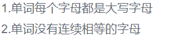

# 网易 2017 内推笔试编程题合集（二）

## 1

你就是一个画家！你现在想绘制一幅画，但是你现在没有足够颜色的颜料。为了让问题简单，我们用正整数表示不同颜色的颜料。你知道这幅画需要的 n 种颜色的颜料，你现在可以去商店购买一些颜料，但是商店不能保证能供应所有颜色的颜料，所以你需要自己混合一些颜料。混合两种不一样的颜色 A 和颜色 B 颜料可以产生(A XOR B)这种颜色的颜料(新产生的颜料也可以用作继续混合产生新的颜色,XOR 表示异或操作)。本着勤俭节约的精神，你想购买更少的颜料就满足要求，所以兼职程序员的你需要编程来计算出最少需要购买几种颜色的颜料？

本题知识点

数学 贪心

讨论

[丶阿明](https://www.nowcoder.com/profile/7627162)

看了大家写的，思路都差不多，就是写法不一样，附上我的代码：

```cpp
#include <iostream>
#include <algorithm>
using namespace std;

int main()
{
    int i,j,n,x[55];
    cin>>n;
    for(i=0;i<n;++i)
        cin>>x[i];
    for(i=n-1;i>0;--i)
    {
        sort(x,x+i+1);
        for(j=i-1;j>=0;--j)
            if((x[i]^x[j])<x[j])
                x[j]^=x[i];
    }
    for(i=0;x[i]==0;++i);
    cout<<n-i;
    return 0;
}
```

发表于 2017-04-14 12:20:45

* * *

[程序工匠 0_0 小姐](https://www.nowcoder.com/profile/8444266)

这道题小白表示理解起来很困难，结合了@我要变橙色和@夕阳 Co'de 的解题思路后，将再进一步的自己的理解写在下面：**题目翻译理解**ok，这道题翻译过来，就是进行多次输入，每次输入 n 个数，将这些数之间进行多次 xor（异或操作），其中一个数可能被 xor 多次，看最后能剩余多少不重复的数，输出数量即可。**解题思路**在 C++中，将两个数进行 xor，用的是^符号，但是实际上是将十进制转换为二进制之后，再进行 xor，这样，这 n 个十进制的数，就被转换成了 n 个二进制的包含 1，0 的字符串，将每个数转换成二进制之后单成一行，位数小的前面被补全 0，这样这 n 个数就变成了 n 行矩阵，由于 1 ≤ xi ≤ 1,000,000,000，而 2 的 30 次幂是 10 亿多，所以这个矩阵最大是 n＊30 的矩阵。现在将这个矩阵列出来，如：101010111010101101110110 然后进行行与行之间的 xor，其中 1¹=0;  0⁰=0;  1⁰=1; 0¹=1;有没有发现这种运算很像求矩阵的秩？相同的相减为 0，不同的相减为 1\.矩阵的秩定义：是其行向量或列向量的极大无关组中包含向量的个数。矩阵的秩求法：用初等行变换化成梯矩阵, 梯矩阵中非零行数就是矩阵的秩.所以这道题就被转化成了求矩阵的秩, 求法如下。

> //
> 
> //  main.cpp
> 
> //  NiuKe_HunHeYanLiao
> 
> //
> 
> //  Created by 麦心 on 16/8/18.
> 
> //  Copyright © 2016 年 程序工匠 0_0 小姐 . All rights reserved.
> 
> //
> 
> #include <iostream>
> 
> using namespace std ;
> 
> #include <vector>
> 
> #include <algorithm>
> 
> // 求一个数的二进制的最高位是哪位
> 
> int getHighBit( int num){
> 
>  int highbit = 0 ;
> 
>  while (num) {
> 
>  // 将该数的二进制右移一位
> 
>         num>>= 1 ;
> 
>         highbit++;
> 
>     }
> 
>  return highbit;
> 
> }
> 
> int main() {
> 
>  vector < int > colors;
> 
>  int n;
> 
>  while ( cin >> n){
> 
>         colors. clear ();
> 
>  int result = 0 ;
> 
>  int temp;
> 
>  int i = n;
> 
>  while (i--) {
> 
>  cin >>temp;
> 
>             colors. push_back (temp);
> 
>         }
> 
>  // 将 colors 进行从小到大的排序
> 
>  sort (colors. begin (), colors. end ());
> 
>  int bigger, smaller;
> 
>  //bigger 和 smaller 始终指向的是最后一位和倒数第二位数
> 
> bigger = n - 1 ;
> 
> smaller = bigger - 1 ;
> 
>  while (colors. size ()> 2 ) {
> 
>  // 如果两者的最高位相同，说明最高位可以消掉，
> 
>  // 将两者 xor ，或者说将矩阵两行相减消掉最高位
> 
>              if ( getHighBit (colors[ bigger ]) == getHighBit (colors[ smaller ])){
> 
>  int tem = colors[ bigger ]^colors[ smaller ];
> 
>  //find 函数头文件是 <algorithm>
> 
>  // 泛型算法的 find ，在非 string 类型的容器里，可以直接找出所对应的元素
> 
>  // 从 vector 的头开始一直到尾，找到第一个值为 temp 的元素，返回的是一个指向该元素的迭代器 std::vector<int>::iterator 类型
> 
>  // 因为现在 xor 的是两个最大的数，而且最高位已被消掉，所以 xor 得到的结果一定比这两个数小
> 
>  // 如果 temp 这个 比最大两个数小的 数没有被找到，则将 temp 加到 colors 数组中，进行再次 xor
> 
>  // 找不到的话，返回 colors.end 应该是固定用法
> 
>  if ( find (colors. begin (), colors. end (), tem)==colors. end ()){
> 
>                     colors. push_back (tem);
> 
>  sort (colors. begin (), colors. end ());
> 
>                     bigger++; // 因为 colors 中多了一个数，所以需要位数＋ 1
> 
>                     smaller++;
> 
>                 }
> 
>             } else {
> 
>                 result++;
> 
>             }
> 
>  // 如果两者最高位不同，说明已经所有数的最高位已经只有最大的那个数是 1 了，这样它已经不可能被消掉了，结果＋ 1
> 
>  // 如果两个最大数的最高位可以消掉，那么消除之后，最大数已被消掉，没有用了
> 
>  // 如果两个最大数的最高位不可以消掉，那么结果＋ 1 ，最大数也没有用了。
> 
>  // 弹出最大数
> 
>             colors. pop_back ();
> 
>  // 因为弹出了一个数，所以 bigger 和 smaller 都要相应－ 1
> 
>             bigger = smaller;
> 
>             smaller--;
> 
>         }
> 
>  cout <<result+2 << endl ;
> 
>     }
> 
> }

理解完毕，不对之处还请大神指出，谢谢。

编辑于 2016-08-18 16:22:58

* * *

[夕阳 Code](https://www.nowcoder.com/profile/7974846)

和线性代数里求线性方程组差不多，通过线性变换求极大线性无关组。而题目把“线性变换”改成了“异或变换”，原理是一样的，就是求一组能表示所有颜色的“基”,最后保留一个上三角矩阵。一个数是由 32 位表示的，那么我们可以把一个数看成是 32 维空间的一个向量。最后形成了一个 n*32 的矩阵，然后就可以按照我们线性代数的方法进行变换啦，变成上三角矩阵，最后剩几行就是需要几种颜色。

```cpp
#define _CRT_SECURE_NO_WARNINGS
#include <iostream>
#include <vector>
#include <algorithm>
#include <stdio.h>

using namespace std;
//求该数最高位是第几位
int getHighPosition(int a){
	int count = 0;
	while (a){
		a >>= 1;
		count++;
	}
	return count;
}
int main(){
	int n;
	vector<int> colors;
	while (cin>>n)
	{
		int temp;
		int res=0;
		int i = n;
		colors.clear();
		while (i--){
			cin >> temp;
			colors.push_back(temp);
		}
		sort(colors.begin(), colors.end());
		//endValue 和 cmpValue 指向最后一个数和倒数第二个数
		int endValue = n-1;
		int cmpValue = endValue - 1;
		//两种颜色以上才有混合的可能，如果只需要两种颜色，那么最少就要购买两种，购买一种是不可能得到两种颜色的。
		while (colors.size()>2)
		{
			//只有最高位相同，那么他们的最高位一定可以消去
			if (getHighPosition(colors[endValue]) == getHighPosition(colors[cmpValue]))
			{

				int temp = colors[endValue] ^ colors[cmpValue];
				//如果异或出来的这个低维的颜色没有，就加入到 colors 里
				if (find(colors.begin(), colors.end(), temp) == colors.end())
				{
					colors.push_back(temp);
					sort(colors.begin(), colors.end());
					//因为新加入了一个数，所以为了让 endValue 和 cmpValue 还是指向倒数第一和倒数第二个数，需要++
					endValue++;
					cmpValue++;
				}
			}
			else
			{
				res++;
			}
			//每判断完一次，就把最后一个数扔掉，没什么用了
			colors.pop_back();			
			endValue = cmpValue;
			cmpValue--;	
		}
		cout << res + colors.size() << endl;

	}

}

```

发表于 2016-08-16 10:48:31

* * *

## 2

一个袋子里面有 n 个球，每个球上面都有一个号码(拥有相同号码的球是无区别的)。如果一个袋子是幸运的当且仅当所有球的号码的和大于所有球的号码的积。
例如：如果袋子里面的球的号码是{1, 1, 2, 3}，这个袋子就是幸运的，因为 1 + 1 + 2 + 3 > 1 * 1 * 2 * 3
你可以适当从袋子里移除一些球(可以移除 0 个,但是别移除完)，要使移除后的袋子是幸运的。现在让你编程计算一下你可以获得的多少种不同的幸运的袋子。

本题知识点

穷举 数学

讨论

[小刀初试](https://www.nowcoder.com/profile/648666)

题目可以转化成求符合条件的集合真子集个数。每次从全集中选择若干元素（小球）组成子集（袋子）。集合子集个数为 2^n 个，使用 dfs 必然超时。且此题有重复元素，那么就搜索剪枝。对于任意两个正整数 a,b 如果满足 a+b>a*b，则必有一个数为 1.可用数论证明：设 a=1+x,b=1+y，则 1+x+1+y>(1+x)*(1+y)，--->  1>x*y，则 x，y 必有一个为 0，即 a,b 有一个为 1\.推广到任意 k 个正整数，假设 a1,a2,...ak，如果不满足给定条件，即和 sum 小于等于积 pi，如果此时再选择一个数 b,能使其满足 sum+b > pi*b，则，b 必然为 1，且为必要非充分条件。反之，如果选择的 b>1，则 sum+b <=pi*b，即 a1,a2,...,ak,b 不满足给定条件。（**搜索剪枝的重要依据**）因此，将球按标号**升序排序**。每次从小到***择，当选择到 a1,a2,...,ak-1 时满足给定条件，而再增加选择 ak 时不满足条件（ak 必然大于等于 max(a1,a2,...,ak-1)），继续向后选择更大的数，必然无法满足！因此，可以进行剪枝。如果有多个 1，即当 k=1 时，sum(1)>pi(1)不满足，但下一个元素仍为 1，则可以满足 1+1>1*1，所以要判断当前 ak 是否等于 1\.此外，对于重复数字，要去重复。

```cpp
#include <stdio.h>
#include <stdlib.h>
int bag[1001],n;

int comp(const void *a,const void *b){
    return *(int*)a - *(int*)b;
}
int dfs(int pos,long long sum,long long pi){
    int i,c;
    for(i=pos,c=0;i<n;++i){
        sum+=bag[i];
        pi*=bag[i];
        if (sum>pi) c+=1+dfs(i+1,sum,pi);
        else if (bag[i]==1) c+=dfs(i+1,sum,pi);
        else break;
        sum-=bag[i];
        pi/=bag[i];
        for(;i<n-1 && bag[i]==bag[i+1];++i);// duplicate
    }
    return c;
}
int main(){
    int i;
    while(~scanf("%d",&n)){
        for(i=0;i<n;scanf("%d",&bag[i++]));
        qsort(bag,n,sizeof(int),comp);
        printf("%d\n",dfs(0,0,1));
    }
    return 0;
}
```

编辑于 2016-08-12 14:42:25

* * *

[NB 响当当](https://www.nowcoder.com/profile/8714452)

// 非计算机专业出身，看到评论区的 bfs、修裁树啥的就蒙了。自己用一种纯数学的方法 AC，// 敢兴趣的题友可以看看。// 解题思路：// 由常识得知，要让和大于积，主要影响因素是看数组中 1 的个数。因此，我们不妨设数组为// 如下数组：1 1 1 2 2 2 3 4。我们根据 1 的个数进行分类讨论，讨论如下// 1.当有 0 个 1 时：此时必无解，你可以随意距离，能找出来算我输……// 2.当有 1 个 1 时：此时，两位数必是最优解。如 1 2、1 3、1 4。两个数时只有 1 2 2 是最优// 解；// 3.当有 2 个 1 时：此时 1 个 1 的情况必为此种情况的子集，即最少有 4 个，然后可以扩充位// 置，加一位，1 1 2 2 2，此时不是最优解，回到上一位，替换最后一位，1 1 2 3，是，此为// 增，1 1 2 4，不是，回溯上一位，此时回到 1 个 1 的状态，即 1 （1 3）。结束// ... ...// 综上可发现，只要对不同 1 个数进行求最优解即可。以上例为例，将上述规律程序化，如下// 1 个 1 时——首先看 1 2，符合题意，扩展一位 1 2 2，符合题意，扩展一位 1 2 2 2，不符，// 回溯至上一位，1 2 2，最后一位变数，1 2 3，不符合题意，回溯至上一位， 1 2，最后一位// 换数，1 3，符合题意，由于无法扩展，最后一位换数，1 4，符合题意，再次换数。数无，// 结束。此时个数为 4；// 2 个 1 时——首先看 1 1 2 符合题意，扩展一位 1 1 2 2 符合题意，1 1 2 2 2 不符合，回溯// 至上一位并换数 1 1 2 3，符合，继续换数 1 1 2 4 不符合，回溯，1 1 3……// 得到结果 16。你们会发现少了 2 个。这是因为此方法没有计算全是 1 的情况。当数组中只// 有 1 时，1 的个数 - 1 即使最优解。相加即可。// 需要注意的是当回溯后变数时不要将数组下一位直接补上，因为牵扯到重复问题，我在这里// 是做了一个小循环以跳过重复数字。方法类似暴力破解，但是由于解得目标最大位数和最大// 和后后面的不再计算，类似折半，因此速度比暴力破解快。时间复杂度没有计算，实际耗时// 18 ms。代码如下

```cpp
#include <iostream>
#include <algorithm>
#include <vector>
using namespace std;
int cont = 0;
void ContOne(int, vector<int>, int, int, int); //（1 的个数，非 1 数，当前位数, 和, 积）
int main(void)
{
    int n, numb, OneCont(0);        //OneCont 用来记录 1 的总个数
    vector<int> list;
    cin >> n;
    while (n--)
    {
        cin >> numb;
        if (numb > 1)
            list.push_back(numb);
        else
            OneCont++;
    }
    cont = OneCont - 1; //将纯 1 数组先计算出来
    if (!list.empty())
    {
        sort(list.begin(), list.end()); //对数组排序
        for (int i = 1; i <= OneCont; i++) ContOne(i, list, 0, i, 1);
    }
    cout << cont << endl;
    return 0;
}
void ContOne(int OneNub, vector<int> list, int nowBit, int sum, int mult)
{
    for (int i = nowBit; i < list.size(); i++) //迭代计算和与积
    {
        sum += list[i], mult *= list[i];
        if (sum <= mult) //如果不符合，回溯至上一位
            break;
        else
            cont++;
        ContOne(OneNub, list, i + 1, sum, mult);
        sum -= list[i], mult /= list[i]; //回到上一位后需要恢复数值
        while (i < list.size() - 1 && list[i] == list[i + 1]) 
            i++;  //寻找不重复
    }
}

```

发表于 2018-02-12 20:29:53

* * *

[骏博日博的迷弟](https://www.nowcoder.com/profile/2071506)

排序+dfs+简单剪枝

```cpp
#include <cstdio>
#include <cstring>
#include <algorithm>
int x[1002], n;
long long ans;
long long sum, mul;
void dfs(int index)
{
	for (int i = index; i<n; i++)
	{
		sum += x[i];
		mul *= x[i];
		if (sum>mul)
		{
			ans++;
			dfs(i + 1);
		}
		else if (x[i] == 1)
		{
			dfs(i + 1);
		}
		else
		{
			sum -= x[i];
			mul /= x[i];
			break;
		}
		sum -= x[i];
		mul /= x[i];
		for (; i < n - 1 && x[i] == x[i + 1]; i++);
	}
}
int main()
{
	//freopen("1.in", "r", stdin);
	while (scanf("%d", &n) != EOF)
	{
		ans = 0;
		sum = 0;
		mul = 1;
		for (int i = 0; i<n; i++)
			scanf("%d", x + i);
		std::sort(x, x + n);
		dfs(0);
		printf("%d\n", ans);
	}
	return 0;
}
```

发表于 2017-08-08 12:05:30

* * *

## 3

二货小易有一个 W*H 的网格盒子，网格的行编号为 0~H-1，网格的列编号为 0~W-1。每个格子至多可以放一块蛋糕，任意两块蛋糕的欧几里得距离不能等于 2。
对于两个格子坐标(x1,y1),(x2,y2)的欧几里得距离为:
( (x1-x2) * (x1-x2) + (y1-y2) * (y1-y2) ) 的算术平方根
小易想知道最多可以放多少块蛋糕在网格盒子里。

本题知识点

数学 贪心

讨论

[大型火焰](https://www.nowcoder.com/profile/5439431)

//不需要找规律，直接递推//定义一个数组 a[1000][1000],初始值都为 0，从 a[0][0]开始,将 a[0][2]和 a[2][0]置为-1,遍历数组，不是-1 的地方可以放蛋糕#include<iostream>
using namespace std;
int a[1000][1000] = {0};
int main()
{
    int w,h,res = 0;
    cin >> w >> h;

    for(int i=0;i<w;i++)
    {
        for(int j=0;j<h;j++)
        {
            if(a[i][j]==0)
            {
                res++;
                if((i+2)<w) a[i+2][j] = -1;
                if((j+2)<h) a[i][j+2] = -1;
            }
        }
    }
    cout << res;
    return 0;
}

发表于 2018-02-21 17:39:01

* * *

[HenryZ](https://www.nowcoder.com/profile/3602997)

```cpp
import java.util.*;

public class Main {
	public static void main(String[] args) {
		Scanner in = new Scanner(System.in);
		int col = in.nextInt();
		int row = in.nextInt();

		int[][] grid = new int[row][col];

		for(int i = 0; i < row; i++){
			if(i % 4 == 0 || i % 4 == 1){
				for(int j = 0; j < col; j++){
					if(j % 4 == 0 || j % 4 == 1){
						grid[i][j] = 1;
					} 
				}  
			}
			else {
				for(int j = 0; j < col; j++){
					if(j % 4 == 2 || j % 4 == 3){
						grid[i][j] = 1;
					} 
				} 
			}
		}

		int count = 0;
		for(int x = 0; x < row; x++){
			for(int y = 0; y < col; y++){
				if(grid[x][y] == 1){
					count++;
				}
			}
		}

		System.out.println(count);
	}

} 
```

举个例子，就可以找出规律，是以 4 为周期重复出现的
1 1 x x 1 1
1 1 x x 1 1
x x 1 1 x x
x x 1 1 x x

编辑于 2016-08-09 21:16:15

* * *

[Josephinity](https://www.nowcoder.com/profile/518935)

```cpp
import java.util.*;
public class Main{
    public static void main(String[] args) {
        Scanner sc = new Scanner(System.in);
        int m = sc.nextInt(), n = sc.nextInt();
        int evenICount = (n / 4) * 2 + (n % 4 < 2 ? n % 4 : 2);
        int oddICount = ((n - 2) / 4) * 2 + ((n - 2) % 4 < 2 ? (n - 2) % 4 : 2);
        int ans = m / 4 * (evenICount + oddICount) * 2;
        if(m % 4 > 0) ans += evenICount;
        if(m % 4 > 1) ans += evenICount;
        if(m % 4 > 2) ans += oddICount;
        System.out.println(ans);
    }
}
```

```cpp
//就是每四行四列为一个周期 pattern 相同如下的图案：
＊＊    ＊＊   ＊＊
＊＊    ＊＊   ＊＊
    ＊＊   ＊＊   ＊＊
    ＊＊   ＊＊   ＊＊
＊＊    ＊＊   ＊＊
＊＊    ＊＊   ＊＊

只要数清楚，每个 4 行中，
i 或 i＋1 行的蛋糕数为 (n / 4) * 2 + (n % 4 < 2 ? n % 4 : 2)
i＋2 或 i+3 行的蛋糕数为 ((n - 2) / 4) * 2 + ((n - 2) % 4 < 2 ? (n - 2) % 4 : 2)
然后算清楚一共有多少个完整的 4 行就行， 当然是共有 m / 4 个。
唯一要注意的就是处理行数除 4 有余数的情况，把最后可能剩余的 1～3 行加进去。 
```

编辑于 2016-08-13 15:46:13

* * *

## 4

有一片 1000*1000 的草地，小易初始站在(1,1)(最左上角的位置)。小易在每一秒会横向或者纵向移动到相邻的草地上吃草(小易不会走出边界)。大反派超超想去捕捉可爱的小易，他手里有 n 个陷阱。第 i 个陷阱被安置在横坐标为 x[i] ，纵坐标为 y[i] 的位置上，小易一旦走入一个陷阱，将会被超超捕捉。你为了去解救小易，需要知道小易最少多少秒可能会走入一个陷阱，从而提前解救小易。

本题知识点

数学 排序 *查找* **讨论

[牛客 8912096 号](https://www.nowcoder.com/profile/8912096)

#include<iostream>using namespace std;int main(){    int n,count=2000;    int x[1000]={0};    int y[1000]={0};    cin>>n;    for(int i=0;i<n;i++){        cin>>x[i];       }    for(int i=0;i<n;i++){        cin>>y[i];       }    for(int i=0;i<n;i++){        if(count>(x[i]+y[i]))            count = (x[i]+y[i]);    }    cout<<(count-2)<<endl;    return 0;}

发表于 2016-08-11 11:13:34

* * *

[wangwenbin](https://www.nowcoder.com/profile/8315212)

```cpp
//理解题意后直接计算就 ok 了
import java.util.Scanner;
public class Main{
    public static void main(String[] args){
        Scanner sc = new Scanner(System.in);
        while(sc.hasNext()){
            int n = sc.nextInt();
            int[][] num = new int[n][2];
            for(int i=0;i<n;i++){
                num[i][0] = sc.nextInt();
            }
            for(int i=0;i<n;i++){
                num[i][1] = sc.nextInt();
            }
            int min = num[0][0]-1+num[0][1]-1;
            int t = 0;
            for(int i=1;i<n;i++){
                t = num[i][0]-1+num[i][1]-1;
                if(min>t)min=t;
            }
            System.out.println(min);
        }
    }
}
```

发表于 2017-08-19 19:51:51

* * *

[行空的猴子](https://www.nowcoder.com/profile/4424881)

用 python 3 一行解决问题

```cpp
import sys

def save_xiaoyi(list_x, list_y):
    result_list = [(a1+a2) for (a1, a2) in zip(list_x, list_y)]

    return min(result_list)-2

# 读取输入数据，将每行以列表形式存储
data = sys.stdin.readlines()
# 提取 x 坐标
list_x = [int(i) for i in data[1].split()]
# 提取 y 坐标
list_y = [int(i) for i in data[2].split()]

print(save_xiaoyi(list_x, list_y)) 
```

发表于 2017-08-14 21:51:17

* * *

## 5

“回文串”是一个正读和反读都一样的字符串，比如“level”或者“noon”等等就是回文串。花花非常喜欢这种拥有对称美的回文串，生日的时候她得到两个礼物分别是字符串 A 和字符串 B。现在她非常好奇有没有办法将字符串 B 插入字符串 A 使产生的字符串是一个回文串。你接受花花的请求，帮助她寻找有多少种插入办法可以使新串是一个回文串。如果字符串 B 插入的位置不同就考虑为不一样的办法。
例如：
A = “aba”，B = “b”。这里有 4 种把 B 插入 A 的办法：
* 在 A 的第一个字母之前: "baba" 不是回文
* 在第一个字母‘a’之后: "abba" 是回文
* 在字母‘b’之后: "abba" 是回文
* 在第二个字母'a'之后 "abab" 不是回文
所以满足条件的答案为 2

本题知识点

字符串 *模拟 穷举* *讨论

[华科平凡](https://www.nowcoder.com/profile/4939096)

python 两行解法：

```cpp
a, b = input(), input()
print(sum(map(lambda c: c == c[::-1], map(lambda x: a[:x] + b + a[x:], range(len(a) + 1))))) 
```

就是这么简洁

发表于 2017-10-21 10:01:45

* * *

[这人真骚](https://www.nowcoder.com/profile/960723)

```cpp
//自然解法
#include<iostream>
#include<string>
using namespace std;
bool Huiwen(string str1)   //判断回文
    {
    int length=str1.length();
    for(int i=0;i<length;i++)
        {
        if(str1[i]!=str1[length-1])
            return false;
        length=length-1;
         }
    return true;
     }
int main()
  {
    string str1,str2,temp;
    int count,len;
    while(cin>>str1>>str2)
    {
        count = 0;
        temp=str1;
		len=str1.length()+1;
        for(int i=0;i<len;i++)
        {
            str1=temp;
            str1.insert(i,str2);   //在 A 字符串中以此插入 B 字符串
            if(Huiwen(str1))       //判断是否是回文
                count=count+1;    //统计回文    
        }
        cout<<count<<endl;
    }
    return 0;
  }
```

编辑于 2016-09-08 16:02:49

* * *

[^_^smile＆青春](https://www.nowcoder.com/profile/931603)

import java.util.*;public class Main{    public static void main(String args[]){        Scanner sc = new Scanner(System.in);        while(sc.hasNext()){            String a = sc.nextLine();            String b = sc.nextLine();            int m = 0;            for(int i=0;i<a.length()+1;i++){                String str = a.substring(0,i)+b+a.substring(i,a.length());                StringBuffer sb = new StringBuffer(str);                if(sb.reverse().toString().equals(str)){                    m++;                }            }            System.out.print(m);        }    }

```cpp
}
```

发表于 2016-08-08 13:55:16

* * *

## 6

小易总是感觉饥饿，所以作为章鱼的小易经常出去寻找贝壳吃。最开始小易在一个初始位置 x_0。对于小易所处的当前位置 x，他只能通过神秘的力量移动到 4 * x + 3 或者 8 * x + 7。因为使用神秘力量要耗费太多体力，所以它只能使用神秘力量最多 100,000 次。贝壳总生长在能被 1,000,000,007 整除的位置(比如：位置 0，位置 1,000,000,007，位置 2,000,000,014 等)。小易需要你帮忙计算最少需要使用多少次神秘力量就能吃到贝壳。

本题知识点

数学 思维 基础数学

讨论

[绕远的偶人](https://www.nowcoder.com/profile/7964874)

速度不快但是思路简单。

4x + 3 等于做了两次 2x + 1， 8x + 7 做了三次。

从起点开始令 x0 = 2*x0 + 1，统计做了多少次 2x + 1 后模 1000000007 等于 0

再把次数分解成若干个 3 与 2 的和，3 的个数加上 2 的个数最小，不超过 100000import java.util.Scanner;

public class Main {
    public static void main(String[] args) {
        Scanner in = new Scanner(System.in);
        int x0 = in.nextInt();
        in.close();
        int count = 0;
        while (x0 != 0 && count <= 300000) {
            x0 = ((x0 << 1) + 1) % 1000000007;
            count++;
        }
        int res = (count + 2) / 3;
        System.out.println(res > 100000 ? -1 : res);
    }
}

编辑于 2018-03-28 23:22:33

* * *

[Leoric](https://www.nowcoder.com/profile/963099)

设 f(x)=4x+3,g(x)=8x+7。计算可以得到以下两个规律：（1）  g(f(x))=f(g(x))   即 f 和 g 的执行顺序没有影响。（2）  f(f(f(x)))=g(g(x))    即做 3 次 f 变换等价于做 2 次 g 变换    由于规律（1） 对于一个可行方案，我们可以调整其变换的顺序。如 ffggfggff，我们可以转化成 fffffgggg。
    由于规律（2），并且为了使执行次数最少，每 3 个 f 我们可以转化成 2 个 g，如方案 fffffgggg，可以转化成 ffgggggg。    因此一个最优的策略，f 的执行次数只能为 0,1,2。对于输入的 x，我们只需要求 x，4x+3,4（4x+3）+3 的最小 g 执行次数就可以了。

发表于 2017-08-24 16:09:05

* * *

[望天树](https://www.nowcoder.com/profile/2466172)

核心问题

1.  4*x+3 和 8*x+7 的数学操作，可以用二进制的左移和补 1 表示

    > y = 4*x+3,相当于 x 的二进制左移 2 位，然后空位补 1，即原先 x 的二进制为#####,则 y 的二进制为#####11，
    > 
    > y = 8*x+3,相当于 y 的二进制左移 3 位，然后空位补 1，即原先 x 的二进制为#####,则 y 的二进制为#####111

2.  小易的移动，最终可以表达成 4*x+3 操作进行了 m 次，8*x+7 操作进行了 n 次

    > 4*x+3 操作进行 m 次，则 x 的二进制后面增加 2m 个 1
    > 
    > 8*x+7 操作进行 n 次，则 x 的二进制后面增加了 3n 个 1
    > 
    > 小易的移动，最终可以表达为：x 的二进制后面增加了（2m+3n）个 1
    > 
    > 移动的顺序对其到达没有影响

3.  小易移动次数的分析

    > 初始位置为 0，则直接满足，需移动 0 次
    > 
    > 初始位置不为 0，则记 times = （2m+3n）,m 取 1 到 10_0000,n 取 1 到 10_0000

    所以，times 的取值范围为[2,30_0000]。即：最多 30_0000 次搜索，就能获得结果。

4.  由于幂次操作数值过大，需要作出变换。参考牛客网用户。

代码如下

```cpp
import java.util.Scanner;

/**
 * Created by Halley on 2017/8/11.
 */
public class Main {
    public static final long LIMIT = 300000;//最多搜索次数
    public static final long N = 1000000007;//求余

    public static void main(String[] args){
        Scanner sc = new Scanner(System.in);
        while(sc.hasNext()) {
            System.out.println(sol(sc.nextLong()));
        }
    }

    //次数判定方法
    public static long sol(long in){
        //如果初始位置为 0，则直接可行，返回 0 次
        if(in == 0){
            return 0L ;
        }else{//初始位置不为 0，则开始搜索
            return search(in);
        }
    }

    //不为 0 时的搜索
    public static long search(long in){//参数：初始坐标
        long temp = in;
        //遍历，获取最小位移
        for(int i=1;i<=LIMIT;i++){
            //long temp = (in+1)*(long)Math.pow(2,i)-1;//当循环较大时，幂次太高，数字超出范围，报错
            //递推
            temp = (temp * 2 + 1 ) % N;
            if( temp % N == 0 ){
                //i 是符合条件的最小偏移，然后对其进行分解
                for(int j =0;j<=(i / 2);j++){//j 对应 a 值
                    if((i - 2*j) % 3 == 0){
                        return ((i+j)/3);
                    }
                }
            }
        }
        //超过最大次数还没匹配，则输出-1
        return -1L;
    }
} 
```

发表于 2017-08-17 16:00:14

* * *

## 7

考拉有 n 个字符串字符串，任意两个字符串长度都是不同的。考拉最近学习到有两种字符串的排序方法： 1.根据字符串的字典序排序。例如：
"car" < "carriage" < "cats" < "doggies < "koala"
2.根据字符串的长度排序。例如：
"car" < "cats" < "koala" < "doggies" < "carriage"
考拉想知道自己的这些字符串排列顺序是否满足这两种排序方法，考拉要忙着吃树叶，所以需要你来帮忙验证。

本题知识点

排序 *字符串* **讨论

[华科平凡](https://www.nowcoder.com/profile/4939096)

python solution:

```cpp
a, arr = input(), []
for i in range(int(a)):
    arr.append(input())
lenarr, lexarr = sorted(arr, key=len), sorted(arr)
if arr == lenarr and arr == lexarr:
    print("both")
elif arr == lenarr:
    print("lengths")
elif arr == lexarr:
    print("lexicographically")
else:
    print("none") 
```

发表于 2017-10-21 09:30:12

* * *

[想奔跑的蜗牛](https://www.nowcoder.com/profile/300042)

```cpp
/*
字典序排序，字符串大小排序
*/

#include<iostream>
#include<string>
#include<vector>
using namespace std;
vector<string>vec;

 //按照字典序排序
bool  lexicographically(){

    int i=0;
    string s;

    while((i+1) < vec.size()){
        if(vec[i].compare(vec[i+1]) >0)
            return 0;
        i++;
    }
    return 1;
}

//按照字符串大小排序
bool Lenths(){

    int i=0;
    while((i+1) <vec.size() ){
        if(vec[i+1].size() < vec[i].size() )
            return 0;
        i++;
    }
    return 1;
}

int main(){

    string s;
    int n,i=0;
    bool b1,b2;

    cin>>n;
    while(i < n){
        cin>>s;
        vec.push_back(s);
        i++;
    }

    b1=lexicographically();
    b2=Lenths();

    if(b1 && b2)
        cout<<"both";
    else if(b1 && !b2)
        cout<<"lexicographically";
    else if(!b1 && b2)
        cout<<"lengths";
    else
        cout<<"none";

    return 0;
}

```

发表于 2016-08-11 10:43:09

* * *

[月佩弦](https://www.nowcoder.com/profile/499857)

```cpp
import java.util.Scanner;

/**
 * Created by Genge on 2016-08-20.
 */
public class Main {
    public static void main(String[] args) {
        Scanner scanner = new Scanner(System.in);
        while (scanner.hasNext()) {
            int n = scanner.nextInt();
            String[] words = new String[n];
            for (int i = 0; i < n; i ++) {
                words[i] = scanner.next();
            }
            System.out.println(validate(words));
        }
        scanner.close();
    }

    private static String validate(String[] words) {
        boolean isABC = isAbc(words);
        boolean isLEN = isLen(words);
        if (isABC && isLEN) {
            return "both";
        }
        if (isABC) {
            return "lexicographically";
        }
        if (isLEN) {
            return "lengths";
        }
        return "none";
    }

    private static boolean isLen(String[] words) {
        boolean result = true;
        for (int i = 1; i < words.length; i++) {
            if (words[i].length() <= words[i - 1].length()) {
                result = false;
                break;
            }
        }
        return result;
    }

    private static boolean isAbc(String[] words) {
        boolean result = true;
        for (int i = 1; i < words.length; i++) {
            if (words[i].compareTo(words[i - 1]) <= 0) {
                result = false;
                break;
            }
        }
        return result;
    }
}

```

发表于 2016-08-20 11:54:59

* * *

## 8

小易喜欢的单词具有以下特性：
1.单词每个字母都是大写字母
2.单词没有连续相等的字母
3.单词没有形如“xyxy”(这里的 x，y 指的都是字母，并且可以相同)这样的子序列，子序列可能不连续。
例如：
小易不喜欢"ABBA"，因为这里有两个连续的'B'
小易不喜欢"THETXH"，因为这里包含子序列"THTH"
小易不喜欢"ABACADA"，因为这里包含子序列"AAAA"
小易喜欢"A","ABA"和"ABCBA"这些单词
给你一个单词，你要回答小易是否会喜欢这个单词（只要不是不喜欢，就是喜欢）。

本题知识点

字符串 *查找* **讨论

[hofighter](https://www.nowcoder.com/profile/876232)

```cpp
import java.util.Scanner;
public class Main {

    public static void main(String[] args) {
        Scanner sc = new Scanner(System.in);
        while(sc.hasNext()){
            String word = sc.next();

            if(isAllUpCase(word) && isConEql(word) && isThrEql(word))
                System.out.println("Likes");
            else
                System.out.println("Dislikes");
        }
    }
    //条件 1
     public static boolean isAllUpCase(String word){
        return word.matches("[A-Z]+");
    }
    //条件 2
    public static boolean isConEql(String word){
        return !word.matches(".*(.)(\\1).*");
    }
    //条件 3 
    public static boolean isThrEql(String word){
        return !word.matches(".*(.).*(.)(.*\\1)(.*\\2).*");
    }
}
```

编辑于 2016-08-18 17:17:52

* * *

[牛客达达](https://www.nowcoder.com/profile/418951)

这题题目测试示例有问题，只需要满足这两个要求，就可以通过代码

发表于 2017-08-14 11:58:15

* * *

[小刀初试](https://www.nowcoder.com/profile/648666)

主要是第二种的判断，可以将任意一个字符出现的起止位置看做一个线段（start,end）；将线段放入集合中，判断是否有交叉的线段，有则说明存在重复的子序列（子序列长度为 2）.

```cpp
#include <bits/stdc++.h>
using namespace std;
typedef pair<int,int> type;

int hasubseq(string &str){
    set<type> seg;	// pair(start,end)
    unordered_set<char> hash;
    for(int i=0;i<str.length();++i){
        if (hash.find(str[i])!=hash.end()) continue;
        hash.insert(str[i]);
        for(int j=str.length()-1;j>i;--j){
            if (str[i]!=str[j]) continue;
            for(set<type>::iterator it=seg.begin();it!=seg.end();++it){
                if (it->second > i && it->second < j) return 1;
                if (it->first > i && it->first < j) return 1;
            }
            seg.insert(make_pair(i,j));
            break;            
        }        
    }
    return 0;
}
int main(){
    for(string str;cin>>str;){
        int flag=1;
        if(flag){	// ABBA
            for(int i=1;i<str.length();++i){
                if (str[i]==str[i-1]){
                    cout<<"Dislikes"<<endl;
                    flag=0;
                    break;
                }
            }
        }
        if (flag){	// THETXH
            if (hasubseq(str)){
                cout<<"Dislikes"<<endl;
                flag=0;
            }
        }
        if (flag){	// ABACADA
            map<char,int> m;
            for(int i=0;i<str.length();++i){
                m[str[i]]++;
                if (m[str[i]]>3){
                    cout<<"Dislikes"<<endl;
                    flag=0;
                    break;
                }
            }
        }
        if (flag) cout<<"Likes"<<endl;
    }
    return 0;
}
```

编辑于 2016-08-09 13:31:33

* * *

## 9

Fibonacci 数列是这样定义的：
F[0] = 0
F[1] = 1
for each i ≥ 2: F[i] = F[i-1] + F[i-2]
因此，Fibonacci 数列就形如：0, 1, 1, 2, 3, 5, 8, 13, ...，在 Fibonacci 数列中的数我们称为 Fibonacci 数。给你一个 N，你想让其变为一个 Fibonacci 数，每一步你可以把当前数字 X 变为 X-1 或者 X+1，现在给你一个数 N 求最少需要多少步可以变为 Fibonacci 数。

本题知识点

模拟 数学

讨论

[挥着牛鞭的男孩](https://www.nowcoder.com/profile/825762)

```cpp
#include <iostream>
using namespace std;
int main(){
    int N,l,r,f0=0,f1=1,f;
    cin >> N;
    while(1){
        f = f0 + f1;
        f0 = f1;
        f1 = f;
        if(f < N) l = N-f;
        else{
            r = f - N;
            break;
        }
    }
    cout << min(l,r) << endl;
	return 0;
}
```

发表于 2016-08-16 17:58:24

* * *

[(⊙ө⊙)⁶₆⁶](https://www.nowcoder.com/profile/6383168)

```cpp
import java.util.Scanner;
public class Main {
    public static void main(String[] args) {
        Scanner in = new Scanner(System.in);
        int N=in.nextInt();
        int a=0,b=1;
        while(b<=N){
        	int b_temp=b+a;
        	a=b;
        	b=b_temp;
        }
        System.out.print((b-N)>(N-a)?N-a:b-N);
    }
}
```

发表于 2016-08-28 22:14:21

* * *

[AlgorithmM](https://www.nowcoder.com/profile/906698)

```cpp
# -*- coding: utf-8 -*-
"""
Created on Sun Aug 07 20:54:07 2016
不必进行查找，也不必存储斐波那契数列，可直接快速获取返回值
@author: duzejie 循环生成斐波那契数，当生成第一个比 n 大的斐波那契数时， 此时离 n 最近的两个斐波那契数为最新生成的两个斐波那契数，
测试它们，返回与 n 之间的最小距离。"""

def test(n):
    x = 0
    y = 1
    while True:
        if y > n : return min(y - n, n - x)
        x,y = y , x + y

print(test(input()))

```

编辑于 2016-08-09 11:19:21

* * *

## 10

小易邀请你玩一个数字游戏，小易给你一系列的整数。你们俩使用这些整数玩游戏。每次小易会任意说一个数字出来，然后你需要从这一系列数字中选取一部分出来让它们的和等于小易所说的数字。 例如： 如果{2,1,2,7}是你有的一系列数，小易说的数字是 11.你可以得到方案 2+2+7 = 11.如果顽皮的小易想坑你，他说的数字是 6，那么你没有办法拼凑出和为 6 现在小易给你 n 个数，让你找出无法从 n 个数中选取部分求和的数字中的最小数（从 1 开始）。

本题知识点

排序 *数学* *讨论

[toraoh](https://www.nowcoder.com/profile/364093)

Google 出过的原题……[`code.google.com/codejam/contest/4244486/dashboard#s=p2`](http://code.google.com/codejam/contest/4244486/dashboard#s=p2)（需要***查看）呃，这个题不知道见过几次了，自从 google 出过一次之后，之后忘了哪里又出了这个弱化版本，现在网易再出一次弱化版本，一点意思都没了……Google 提供的官方题解在：[`code.google.com/codejam/contest/4244486/dashboard#s=a&a=2`](http://code.google.com/codejam/contest/4244486/dashboard#s=a&a=2)中文简单转述：从小到大排序，一开始一块钱都凑不出来下面，为了 0~x 都有，我需要来一个 1 元的（不然 1 元凑不出来）给了你 1 元的，下面必须给 1+1 元以内的，不然 2 元凑不出来如果再给一个 1 元的，那你现在能凑出 0~2 元的，接下来+1+2 或者+3，都能增大范围而且不会导致中间缺一个数（4 元的不行，因为凑不出 3 了）——反正一直往下，直到出现第一个算不出来的值为止。听说考试的时候 n=100，现在练习改 20，不知道什么心态——当时约 4000 人中有约 400 人通过了，说明 n=100 的时候筛选能力就很好啊……

```cpp
#include <stdio.h>
#include <ctype.h>
#include <string.h>
#include <stdlib.h>
#include <limits.h>
#include <math.h>
#include <algorithm>
using namespace std;
typedef long long ll;

int a[1005];

int main(){
    int miss=0;
    int n;
    scanf("%d",&n);
    for(int i=0;i<n;i++)scanf("%d",&a[i]);
    sort(a,a+n);
    for(int i=0;i<n;i++){
        if(a[i]>miss+1) break;
        miss+=a[i];
    }
    printf("%d\n",miss+1);
    return 0;
} 
```

——同学们啊，请一定要做 Google 出的题目，codejam 可能要求高一点（这题是 codejam round1 的 C 题），但是至少 APAC Test 要做一做——你看 google 前一年出了一个 01 字典树，微软第二年校招实习笔试也出了一个，现在再加上网易又来一出——简直是校招笔试编程题风向标。

发表于 2016-08-08 19:13:56

* * *

[骏博日博的迷弟](https://www.nowcoder.com/profile/2071506)

基于这样一种迭代的思想：我当前假如说可以得到最大的数为 k，则再来一个新的数字 p，若 p<=k+1，则我可以得到的最大的数为 p+k，若 p>k+1，则会出现空挡，k+1 就肯定不能再得到。

```cpp
#include <cstdio>
#include <algorithm>

int main()
{
    int x[25], n;
    while(scanf("%d", &n)!=EOF)
    {
        for(int i=0 ;i<n; i++)
            scanf("%d", x+i);
        std::sort(x,x+n);
        int ans = 0;
        for(int i=0; i<n; i++)
        {
            if(x[i]>(ans+1))
                break;
            ans+=x[i];
        }
        printf("%d\n", ans+1);
    }
    return 0;
}
```

发表于 2017-08-08 13:56:40

* * *

[牛客 470556 号](https://www.nowcoder.com/profile/470556)

```cpp
/*
* Sort 后，查看有序数组的前 n 项和是否与当前项连续，
* 如果不连续说明存在一个空档无法通过求和得到
* */

import java.util.Arrays;
import java.util.Scanner;
public class Main {
    private static int check(int[] X, int n){
        if (X[0]>1) return 1;
        else if (n == 1) return X[0]+1;
        else {
            int sum = X[0];
            for (int i = 1; i < n; i++) {
                if (X[i]-sum>1) break;
                else sum += X[i];
            }
            return sum+1;
        }
    }
    public static void main(String[] args) {
        Scanner in = new Scanner(System.in);
        while (in.hasNext()) {
            int n = in.nextInt();
            int[] X = new int[n];
            for (int i = 0; i < n; i++) {
                X[i] = in.nextInt();
            }
            Arrays.sort(X);
            System.out.println(check(X, n));
        }
    }
}

```

发表于 2016-08-07 12:07:02

* * *********