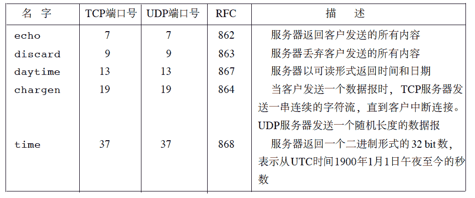

# 趋势科技 2016 校园招聘笔试题

## 1

下面哪个语句无法通过编译?

正确答案: B   你的答案: 空 (错误)

```cpp
if (x>y);
```

```cpp
if (x=y) && (x!=0) x+= y;
```

```cpp
if (x!=y) scanf("%d",&x); else scanf("%d",&y);
```

```cpp
if (x<y) {x++; y++;}
```

本题知识点

C++ 编程基础 *讨论

[再接再厉啊](https://www.nowcoder.com/profile/537683)

感觉应该写成这样： if(((x＝y)) && (x !＝ 0)) x +=y；第一个双重括号，先把 y 赋给 x,然后判断 x 是否非 0。后边重复判断 x 是否非 0。 或： if((x==y) && (x !＝ 0)) x +=y；前边判断 x,y 是否相等，后边判断 x 是否非 0。

发表于 2016-11-05 21:52:08

* * *

[fengqiusuo](https://www.nowcoder.com/profile/755602)

if (x=y) 这是有问题的，x=y 是赋值语句，应改为 x==yo(╯□╰)o 是该好好刷题了。在 VS2008 里面编译了一下，确实会提示括号的错误。

编辑于 2016-09-07 21:32:58

* * *

[进布者 _zhang](https://www.nowcoder.com/profile/889436)

B 选项 if 的判断条件没加括号（），或者说如果编程语言是 python ，没加‘：’

发表于 2016-08-19 09:59:57

* * *

## 2

以下不是无限循环的语句为?

正确答案: A   你的答案: 空 (错误)

```cpp
for (y=0,x=1; x>++y; x=i++) i=x;
```

```cpp
for (;; x+=1);
```

```cpp
while (1){x ++;}
```

```cpp
for(i=10; ;i--) sum+=i;
```

本题知识点

C++ 编程基础 *C 语言* *讨论

[zt_xcyk](https://www.nowcoder.com/profile/839070)

A
a  x>++y  就是 1>1  错，没循环一次
b  c d 一样，没有跳出条件，无限循环

发表于 2016-08-23 23:30:35

* * *

[赵董](https://www.nowcoder.com/profile/9271383)

A

发表于 2016-08-28 01:02:03

* * *

[小。me](https://www.nowcoder.com/profile/259853503)

想问问 B 怎么回事啊，有点看不懂

发表于 2018-10-23 11:50:15

* * *

## 3

设 x 和 y 均为 int 型变量，在不考虑数据溢出的情况下，则以下语句:

```cpp
x += y;
y = x - y;
x -= y;
```

的功能是?

正确答案: D   你的答案: 空 (错误)

```cpp
把 x 和 y 按从大到小排列
```

```cpp
把 x 和 y 按从小到大排列
```

```cpp
无确定结果
```

```cpp
交换 x 和 y 中的值
```

本题知识点

C++

讨论

[萝卜鱼酱](https://www.nowcoder.com/profile/1188422)

把原先的赋值写成下面的形式:

```cpp
xt = x + y
yt = xt - y
xt = xt - yt

```

然后化简就可以了：

```cpp
yt = (x + y) - y = x
xt = (x + y) - (x + y - y) = y

```

同理还有用异或交换的方式：

```cpp
x ^= y;
y ^= x;
x ^= y;

```

发表于 2016-09-06 15:43:52

* * *

[小风筝 0010](https://www.nowcoder.com/profile/3514561)

```cpp
x = x + y;//此时 x = x + y
y = x - y;//此时 y = (x + y ) - y = x
x = x - y;//此时 x = (x + y ) - (x) = y
/*所以这段代码交换了两者的位置，这种方法和使用中间变量本质是一样的。
*/
int temp, x, y, temp2;
temp = x + y;
temp2 = temp -y;//y = x
x = temp - temp2;// x = y

```

另外，交换两变量也可以用异或交换。C 语言和 C++语言的异或不用 XOR、xor、⊕，而是用“^”，键入方式为 Shift+6。（而其它语言的“^”一般表示乘方,那 C 语言的乘方怎么表示呢？函数申明： double pow(double x, double y) 
函数用途： 计算以 x 为底数的 y 次幂  
头 文 件： math.h 
输入参数： x:底数；y:幂数    
返 回 值： 计算结果 异或交换举例：

```cpp
a=a^b;
b=b^a;
a=a^b;
/*
a1=a^b
b=b^a1=b^a^b=a
//此时 a1=a^b
a=a1^b=a^b^a=b
//这种方法虽然看起来很 NB,但是不推荐这么用，了解就行。这种代码易读性不强，可能只会存在于面试笔试中，个人感觉不会大量使用。
谢谢各位

```

发表于 2016-11-27 20:59:43

* * *

[YEN-NEUer](https://www.nowcoder.com/profile/818138)

这个就是不需要重新申请空间的交换两个数字的方法

发表于 2016-10-04 11:50:21

* * *

## 4

下面代码运行后,变量 total 的结果是?

```cpp
int total = 0;
for (int i = 0, j = 5; total < 10 || j > 3; ++i, --j) {
     total += (i + j);
 }
```

正确答案: B   你的答案: 空 (错误)

```cpp
5
```

```cpp
10
```

```cpp
无法通过编译
```

```cpp
运行时出错
```

```cpp
运行时死循环
```

本题知识点

C++ C 语言

讨论

[zhisheng_blog](https://www.nowcoder.com/profile/616717)

i         j            total                        0
0        5            51        4           10total = 10，不满足 total < 10， j = 3 不满足 j > 3，退出循环。**即：toatl = 10**

编辑于 2016-09-10 10:17:16

* * *

[lonelylsy](https://www.nowcoder.com/profile/556225)

for 循环的执行顺序用如下表达式：

```cpp
for(expression1;expression2;expression3)
 {
    expression4;
}

```

1）第一次循环，即初始化循环。

*   首先执行表达式 expression1（一般为初始化语句）；
*   再执行 expression2（一般为条件判断语句），判断 expression1 是否符合 expression2 的条件；
*   如果符合，则执行 expression4，否则，停止执行；最后执行 expression3。

2）第 N（N>=2）次循环

*   首先执行 expression2，判断在 expression3 是否符合在 expression2 要求；
*   如果符合，则继续执行在 expression4，否则，停止执行。最后执行在 expression3。
*   如此往复，直至 expression3 不满足在 expression2 条件是为止。

本题执行顺序为：1\. total += (i + j); => i=0,j=5 , total=52\. ++i, --j ; => i=1,j=4 , total=53\. total += (i + j); => i=1,j=4 , total=104\. ++i, --j ; => i=2,j=3 , total=10

编辑于 2016-08-20 09:48:04

* * *

[Erya_ 尔雅](https://www.nowcoder.com/profile/412110)

难道就我觉得 参数 **j** 数据类型没有定义！毕竟 **i** 定义了，**total** 也定义

发表于 2016-09-08 10:45:00

* * *

## 5

在使用标准 C 库时, 下面哪个选项使用只读模式打开文件?

正确答案: A   你的答案: 空 (错误)

```cpp
fopen("foo.txt", "r")
```

```cpp
fopen("foo.txt", "r+")
```

```cpp
fopen("foo.txt", "w")
```

```cpp
fopen("foo.txt", "w+")
```

```cpp
fopen("foo.txt", "a")
```

本题知识点

C++ 编程基础 *讨论

[杀猪刀](https://www.nowcoder.com/profile/284466)

mode 有以下几种方式：

| 打开方式 | 说明 |
| r | 以只读方式打开文件，该文件必须存在。 |
| r+ | 以读/写方式打开文件，该文件必须存在。 |
| rb+ | 以读/写方式打开一个二进制文件，只允许读/写数据。 |
| rt+ | 以读/写方式打开一个文本文件，允许读和写。 |
| w | 打开只写文件，若文件存在则长度清为 0，即该文件内容消失，若不存在则创建该文件。 |
| w+ | 打开可读/写文件，若文件存在则文件长度清为零，即该文件内容会消失。若文件不存在则建立该文件。 |
| a | 以附加的方式打开只写文件。若文件不存在，则会建立该文件，如果文件存在，写入的数据会被加到文件尾，即文件原先的内容会被保留（EOF 符保留)。 |
| a+ | 以附加方式打开可读/写的文件。若文件不存在，则会建立该文件，如果文件存在，则写入的数据会被加到文件尾后，即文件原先的内容会被保留（原来的 EOF 符 不保留)。 |
| wb | 以只写方式打开或新建一个二进制文件，只允许写数据。 |
| wb+ | 以读/写方式打开或建立一个二进制文件，允许读和写。 |
| wt+ | 以读/写方式打开或建立一个文本文件，允许读写。 |
| at+ | 以读/写方式打开一个文本文件，允许读或在文本末追加数据。 |
| ab+ | 以读/写方式打开一个二进制文件，允许读或在文件末追加数据。 |

发表于 2016-08-18 16:16:31

* * *

[朱珠](https://www.nowcoder.com/profile/143224)

r+具有读写属性，从文件头开始写，保留原文件中没有被覆盖的内容；

w+具有读写属性，写的时候如果文件存在，会被清空，从头开始写。

r 打开只读文件，该文件必须存在。 
r+ 打开可读写的文件，该文件必须存在。 
w 打开只写文件，若文件存在则文件长度清为 0，即该文件内容会消失。若文件不存在则建立该文件。 
w+ 打开可读写文件，若文件存在则文件长度清为零，即该文件内容会消失。若文件不存在则建立该文件。 
a 以附加的方式打开只写文件。若文件不存在，则会建立该文件，如果文件存在，写入的数据会被加到文件尾，即文件原先的内容会被保留。 
a+ 以附加方式打开可读写的文件。若文件不存在，则会建立该文件，如果文件存在，写入的数据会被加到文件尾后，即文件原先的内容会被保留。 
上述的形态字符串都可以再加一个 b 字符，如 rb、w+b 或 ab＋等组合，加入 b 字符用来告诉函数库打开的文件为二进制文件，而非纯文字文件。不过在 POSIX 系统，包含 Linux 都会忽略该字符。

发表于 2017-06-04 12:38:00

* * *

[用户名无法显示](https://www.nowcoder.com/profile/8709341)

简单来说，’r' 'w'是只读/写，‘r+' 'w+'是可读/写

发表于 2017-06-06 15:59:46

* * *

## 6

请问经过表达式 a = 5 ? 0 : 1 的运算,变量 a 的最终值是?

正确答案: C   你的答案: 空 (错误)

```cpp
5
```

```cpp
1
```

```cpp
0
```

```cpp
true
```

本题知识点

C++ C 语言

讨论

[牛客职导官方账号](https://www.nowcoder.com/profile/897353)

【正确答案】C
【解析】5 ?  查看全部)

编辑于 2021-11-17 15:59:59

* * *

[羁士](https://www.nowcoder.com/profile/860432)

第一个解析什么 5>0 肯定是不对的首先三元运算符的优先级是高于赋值运算符的，所以看做 a =( (5) ? 0 : 1)，但三元运算符问号前面的应该是一个判断表达式，这里只给了一个数字 5，不知道如何判断。但三元运算符是可以换成 if else 语句的即：**if(5) a=0;else a=1;****5！=0，所以执行第一个语句，所以 a=0.**

发表于 2017-05-14 16:56:10

* * *

[遨翔九天](https://www.nowcoder.com/profile/3925354)

```cpp
条件运算符的优先级高于赋值运算符的优先级
```

发表于 2016-08-24 11:24:27

* * *

## 7

声明语句为 int a[3][4]; 下列表达式中与数组元素 a[2][1]等价的是?

正确答案: A   你的答案: 空 (错误)

```cpp
*(a[2]+1)
```

```cpp
a[9]
```

```cpp
*(a[1]+2)
```

```cpp
*(*(a+2))+1
```

本题知识点

C++

讨论

[给阿姨倒杯卡布奇诺](https://www.nowcoder.com/profile/170555)

对于 a[3][4]，a 是一个指针数组，大小为 3，里面三个元素就是该二维数组的每一行第一个元素的地址。1、*(a[2]+1)，   a[2]就是第三行首元素的地址，a[2]+1 则地址向右偏移 1，*(a[2]+1)就是取该地址的元素，也就是 a[2][1]2、*(*(a+2)+1), *(a+2) 和 a[2]是等价的。所以*(*(a+2)+1)也是表示 a[2][1]

编辑于 2016-08-22 15:51:18

* * *

[慢游世界](https://www.nowcoder.com/profile/4094782)

对于二维数组 a【】【】，a 是一个指向第一行的指针，a + n 是一个指向第 n + 1 行的指针，a【n】是指向第 n + 1 行的第一个元素的指针，a【2】+ 1 指向第三行第二个元素，即 a【2】【1】，所以答案选 A

编辑于 2016-08-21 12:41:43

* * *

[交大工科汪 03](https://www.nowcoder.com/profile/213208)

A 选项都正确

编辑于 2016-08-30 10:16:08

* * *

## 8

下列程序的打印结果是?

```cpp
char p1[15] = "abcd", *p2 = "ABCD", str[50] = "xyz"; 
strcpy(str + 2, strcat(p1 + 2, p2 + 1));
printf("%s", str);
```

正确答案: D   你的答案: 空 (错误)

```cpp
xyabcAB
```

```cpp
abcABz
```

```cpp
ABabcz
```

```cpp
xycdBCD
```

```cpp
运行出错
```

本题知识点

C++ C 语言

讨论

[--海-星--](https://www.nowcoder.com/profile/337064)

```cpp
strcat(p1+2,p2+1); //返回以 p1+2 为首的字符串，即"cdBCD"
strcpy(str+2,strcat(p1+2,p2+1)); //将"cdBCD"copy 到 str+2 位置上，并覆盖后面的内容，此时 str 为"xycdBCD"
```

编辑于 2016-08-18 23:44:31

* * *

[一只特立独行的虎](https://www.nowcoder.com/profile/856221)

strcat()字符串连接函数，strcpy()字符串复制函数

发表于 2016-08-19 22:11:57

* * *

[sky_](https://www.nowcoder.com/profile/6322282)

char*  strcpy(char *dest,char *src)；将从 src 开始包含'\0'的字符串拷贝到以 dest 开始的位置，进行覆盖 char*  strcat(char *dest,char *src);将 src 开始的字符串添加到 dest 字符串的末尾(覆盖 dest 的\0")两者都返回指向 dest 的指针。

发表于 2017-08-06 15:37:04

* * *

## 9

以下程序的输出结果是?

```cpp
#include <stdio.h>
main() {
    char a[10] = {'1', '2', '3', '4', '5', '6', '7', '8', '9', 0}, *p;
    int i;
    i = 8;
    p = a + i;
    printf("%s\n", p - 3);
}

```

正确答案: B   你的答案: 空 (错误)

```cpp
6
```

```cpp
6789
```

```cpp
'6'
```

```cpp
789
```

本题知识点

C 语言

讨论

[Joanna_yan](https://www.nowcoder.com/profile/7819436)

1、p 指向 a[5]2、“%s”输出直到'\0'的字符串 3、最后的 0 为数字而非字符‘0’，ASIIC 码中 0 为空字符所以输出的结果是   6789  而不是 67890

发表于 2016-09-08 16:23:14

* * *

[rs 勿忘初心](https://www.nowcoder.com/profile/7491640)

       C++中'\0'与'0'是不同的，他们都是字符，但是他们的 ASCII 码是不同的：'\0' ASCII 码值为 0，'0' 也可以写成'\0x30' ，ASCII 码值为 48。最后一个 0 是数字 0，即代表字符串结束标志‘\0‘。

发表于 2017-06-14 20:13:39

* * *

[TimeCover](https://www.nowcoder.com/profile/185385)

0 就是‘\0’

发表于 2017-04-06 19:00:24

* * *

## 10

int a=5,则 ++(a++)的值是?

正确答案: D   你的答案: 空 (错误)

```cpp
5
```

```cpp
6
```

```cpp
7
```

```cpp
编译出错
```

本题知识点

C++ C 语言

讨论

[牛客 4614492 号](https://www.nowcoder.com/profile/4614492)

a++返回一个值也就是 5++操作符只能作用于变量，而不能是一个数字 你可以试试 ++5

发表于 2016-09-07 18:59:28

* * *

[小菜鸟上校](https://www.nowcoder.com/profile/192386)

```cpp
++ 是一目运算符，自增运算，它只能用于一个变量，即变量值自增 1， 不能用于表达式。
++(a++) 里，小括号优先。
(a++) 是 表达式，按运算规则，不能对 表达式 作 自增运算.

-- 摘自百度知道
```

发表于 2016-08-18 16:41:42

* * *

[一代菜鸟](https://www.nowcoder.com/profile/362311)

先说结论： 因为 a++返回的是右值(rvalue)，而我们不能对一个右值进行自增操作。所以++(a++)会报错。后置 a++相当于做了三件事情：1\. tmp = a;2\. ++a3\. return tmp;事实上，如果这里 a 是一个对象，而非一个基本类型数据的话，我们重载其后置自增运算符就分成上述三个步骤（参考《C++Primer 第五版》p503 “区分前置和后置运算符”小节）再简单的说说什么是右值吧，所谓右值，可以理解为是即将结束生命周期的对象。在这里，(a++)返回的是 a 在+1 之前的值，这个值是一个**临时**的对象（在上面的对于 a++的行为解释中对应于返回值 tmp）。这个临时的对象在（a++）这条语句结束后，马上就结束了生命周期，即**右值**。关于左值，右值，以及 C++11 中引入的新的分类在 StackOverFlow 上有精彩的论述，感兴趣的同学可以自行搜索或者点击下面的链接。http://stackoverflow.com/questions/3601602/what-are-rvalues-lvalues-xvalues-glvalues-and-prvalues

编辑于 2017-05-03 22:30:40

* * *

## 11

在 Linux 中查看 ARP 缓存记录的命令是?

正确答案: A   你的答案: 空 (错误)

```cpp
"arp –a"
```

```cpp
"arp –d"
```

```cpp
"arp -L"
```

```cpp
"arp –D"
```

本题知识点

Linux

讨论

[rppp](https://www.nowcoder.com/profile/9542322)

**arp -a   查看缓存记录****arp -d   删除某些内容**

发表于 2017-07-23 16:53:43

* * *

[杀猪刀](https://www.nowcoder.com/profile/284466)

arp 缓存就是 IP 地址和 MAC 地址关系缓存列表。在 Windows 下 arp -d [$ip] 不指定 IP 地址时清除所有 arp 缓存 。在 Linux 下 arp -d $ip 必须指定 IP 地址才能执行这条命令的此参数， 所有在 Linux 系统下 arp -d $ip 命令只能清除一个 IP 地址的对应 MAC 地址缓存

编辑于 2016-08-18 16:37:35

* * *

[java 渣洼](https://www.nowcoder.com/profile/675700)

```cpp

	ARP -s inet_addr eth_addr [if_addr]

	ARP -d inet_addr [if_addr]

	ARP -a [inet_addr] [-N if_addr] [-v]

	  -a            通过询问当前协议数据，显示当前 ARP 项。

	                如果指定 inet_addr，则只显示指定计算机

	                的 IP 地址和物理地址。如果不止一个网络

	                接口使用 ARP，则显示每个 ARP 表的项。

	  -g            与 -a 相同。

	  -v            在详细模式下显示当前 ARP 项。所有无效项

	                和环回接口上的项都将显示。

	  inet_addr     指定 Internet 地址。

	  -N if_addr    显示 if_addr 指定的网络接口的 ARP 项。

	  -d            删除 inet_addr 指定的主机。inet_addr 可

	                以是通配符 *，以删除所有主机。

	  -s            添加主机并且将 Internet 地址 inet_addr

	                与物理地址 eth_addr 相关联。物理地址是用

	                连字符分隔的 6 个十六进制字节。该项是永久的。

	  eth_addr      指定物理地址。

	  if_addr       如果存在，此项指定地址转换表应修改的接口

	                的 Internet 地址。如果不存在，则使用第一

	                个适用的接口。

	示例:

	  > arp -s 157.55.85.212   00-aa-00-62-c6-09.... 添加静态项。

	  > arp -a                                  .... 显示 ARP 表。

```

编辑于 2016-08-27 21:02:59

* * *

## 12

虚拟内存容量受()的限制?

正确答案: A D   你的答案: 空 (错误)

```cpp
磁盘空间大小
```

```cpp
物理内存大小
```

```cpp
数据存放的实际地址
```

```cpp
计算机地址位数
```

本题知识点

操作系统

讨论

[杀猪刀](https://www.nowcoder.com/profile/284466)

```cpp
虚拟内存的作用同物理内存一样，只不过是从硬盘存储空间划出的部分，来完成内存的工作，由于不是真正的内存，所以被称为虚拟内存。因为计算机所支持的最大内存是由该计算机的地址位数决定的，也就是计算机的最大寻址能力。例如，32 位机的寻址能力为 2 的 32 次方，大约为 4G。所以虚拟内存的大小也受计算机地址位数的限制。不过这到题单选 D 是由前提条件的，那就是磁盘空间足够大，否则严格意义上讲应该多一个选项 A。
```

发表于 2016-08-18 16:40:22

* * *

[公众号「我不是匠人」](https://www.nowcoder.com/profile/936070)

虚存的大小要同时满足 2 个条件：1.虚存的大小  ≤ 内存容量和外存容量之和。2.虚存的大小  ≤ 计算机的地址位数能容纳的最大容量。

发表于 2016-08-21 11:10:39

* * *

[BestAndroider](https://www.nowcoder.com/profile/1826561)

虚拟内存一定只能是靠和磁盘置换么？虽然我没见过，但是理论上绝对可行。因此 A 并非决定性因素。
总结如下：
如果地址位数固定即寻址空间固定，则虚拟内存不可能大于寻址空间。
如果磁盘空间固定，寻址空间无限大，则虚拟内存理论上就是无限大（因为可以找到非磁盘，可以与内存置换的存储介质 如闪存等等）
因此 D 是最恰当的选项。

发表于 2016-08-19 18:06:08

* * *

## 13

在一个请求页式存储管理中,一个程序的页面走向为 4, 3, 2, 1, 3, 5, 4, 3, 2, 1, 5,并采用 LRU 算法。假设分配给该程序的存储块个数 M 分别为 3 和 4,则该访问中发生的缺页次数 F 分别是?

正确答案: C   你的答案: 空 (错误)

```cpp
(1) M=3, F=8 (2) M=4, F=5
```

```cpp
(1) M=3, F=10 (2) M=4, F=8
```

```cpp
(1) M=3, F=9 (2) M=4, F=9
```

```cpp
(1) M=3, F=7 (2) M=4, F=6
```

本题知识点

操作系统

讨论

[土鞋儿](https://www.nowcoder.com/profile/342027)

LRU（最近最少使用）该算法  查看全部)

编辑于 2016-09-03 22:39:49

* * *

[zhnana1991](https://www.nowcoder.com/profile/681324)

```cpp
3 个内存块构成一个队列，前 3 个页面依次入队（3 个缺页），内存中为 2-3-4； 接着要访问 1 号页面，内存中没有（1 个缺页），1 号页面淘汰，内存中为 1-2-3；
接着要访问 3 号页面，内存中有（命中），3 号页面淘汰，内存中 3-1-2；
接着要访问 5 号页面，内存中没有（1 个缺页），2 号页面淘汰，内存中 5-3-1；
接着要访问 4 号页面，内存中没有（1 个缺页），1 号页面淘汰，内存中 4-5-3；
接着要访问 3 号页面，内存中有（命中），3 号页面淘汰，内存中 3-4-5；
接着要访问 2 号页面，内存中没有（1 个缺页），5 号页面被淘汰，内存中 2-3-4；
接着要访问 1 号页面，内存中没有（1 个缺页），4 号页面被淘汰，内存中 1-2-3；
因此缺页次数为：11-2= 9；
同理，内存的存储快个数为 4 时，计算方式一样，最后得出缺页次数为 9。
```

发表于 2016-08-19 17:28:21

* * *

[HelloWord。](https://www.nowcoder.com/profile/5908104)

4-43-432-321-315-354-342-321-215

发表于 2016-09-10 20:04:16

* * *

## 14

在某企业中,有关系 W(工号,姓名,工种,工资),其中工资由工种唯一决定。将其规范化到第三范式,正确的答案是?

正确答案: C   你的答案: 空 (错误)

```cpp
W1(工号,姓名) W2(工种,工资)
```

```cpp
W1(工号,工种,工资) W2(工号,姓名)
```

```cpp
W1(工号,姓名,工种) W2(工种,工资)
```

```cpp
以上都不对
```

本题知识点

数据库

讨论

[DayUp](https://www.nowcoder.com/profile/775837)

```cpp
选 C
```

第一范式：原子性，字段不可分割第二范式：没有包含在主键中的列必须完全依赖于主键，而不能只依赖于主键的一部分。第三范式：不能存在传递依赖关于 A：表 W1 和 W2 没有建立联系，不知道某个人的是什么工种的关于 B：工号->工种，工种->工资(题目强调工资由工种唯一决定)。存在传递依赖关于 C:工号->姓名，工号—>工种 是可以确定的，但是 姓名->工种？不一定，因为可能存在同名的情况下，所以选项 C 是消除了传递依赖

编辑于 2016-09-10 10:03:29

* * *

[杀猪刀](https://www.nowcoder.com/profile/284466)

第三范式需要确保数据表中的 每一列数据都和主键直接相关，而不能间接相关 。

发表于 2016-08-18 16:57:24

* * *

[落井蛙](https://www.nowcoder.com/profile/4271869)

推荐一篇数据库范式文章：

> http://www.cnblogs.com/ybwang/archive/2010/06/04/1751279.html

发表于 2016-11-26 18:04:47

* * *

## 15

下面关于 RSA 算法的描述,不正确的是?

正确答案: C   你的答案: 空 (错误)

```cpp
RSA 的运行速度相比 AES 算法要慢很多
```

```cpp
RSA 的安全性依赖于大数分解
```

```cpp
TLS/SSL 协议中 RSA 的公钥长度一般为 256 位或 512 位
```

```cpp
RSA 是非对称加密算法
```

本题知识点

加密和安全

讨论

[BrainerGao](https://www.nowcoder.com/profile/516342)

RSA 一般为 1024 或 2048 位运行速度：RSA<AES 安全性依赖于大数分解 RSA 非对称加密算法所以 C 描述不正确

编辑于 2016-08-22 11:41:33

* * *

[cgz_hello_world](https://www.nowcoder.com/profile/135224)

准确来说应该是大素数的分解

发表于 2016-09-22 21:30:40

* * *

[--海-星--](https://www.nowcoder.com/profile/337064)

RSA 一般为 1024 或 2048 位

发表于 2016-08-18 23:25:33

* * *

## 16

下面哪项是数组优于链表的特点?

正确答案: D   你的答案: 空 (错误)

```cpp
方便删除
```

```cpp
方便插入
```

```cpp
长度可变
```

```cpp
存储空间小
```

本题知识点

数组 链表 *讨论

[牛客 977623 号](https://www.nowcoder.com/profile/977623)

```cpp
存储空间小 的意思是 占用的存储空间少
由于链表结点需要持有额外的指针，因此所占用的空间较数组更大
```

发表于 2016-08-22 16:26:05

* * *

[dolphinlcj](https://www.nowcoder.com/profile/7354722)

看成链表优于数组了，汗

发表于 2016-10-20 09:03:23

* * *

[Ｍe 怤畢炜 eＭ](https://www.nowcoder.com/profile/215299)

这题要是答错了数据结构肯定挂过科...

发表于 2016-08-18 19:27:21

* * *

## 17

假设在 n 进制下,下面的等式成立,n 的值是?567*456=150216

正确答案: D   你的答案: 空 (错误)

```cpp
9
```

```cpp
10
```

```cpp
13
```

```cpp
18
```

本题知识点

编译和体系结构

讨论

[某锐](https://www.nowcoder.com/profile/730289)

直接看俩数最后一位，7×6=42，除以 9 和 18 都余 6，所以 9 和 18 俩答案中的一个 再看，按十进制计算 567×456=258552 比 150246（n 进制）要大，所以 n 要比十进制要大，所以选择 18 进制。

发表于 2016-08-19 16:19:26

* * *

[zhisheng_blog](https://www.nowcoder.com/profile/616717)

**假设 n 进制，则有(5*n**  **2**  **+6*n+7) * (4*n**  **2**  **+5*n+6) = n**   **5**   **+5*n**  **4**  **+2*n**  **2**  **+n+6，简化以后可以得到****15*n** **4** **+49*n** **3** **+86*n** **2** **+70*n+36=n** **5** **,两边同时除以 n** **5** **，可以得到 15/n+49/n** **2** **+86/n** **3** **+70/n** **4** **+36/n** **5** **=1;****要让等式成立，n 肯定是大于 15 的，所以选 D。**

发表于 2016-08-22 09:49:20

* * *

[杀猪刀](https://www.nowcoder.com/profile/284466)

567*456=(5n²+6n+7)*(4n²+5n+6)=20n⁴+49n³+88n²+71n+42 ....(1)
150216=n⁵+5n⁴+2n²+n+6 ...............................(2)
//[x]表示对 x 取整
则: (1)式对 n 取模=42 mod n ...(3)
   (2)式对 n 取模=6 ...........(4)
由(1)=(2),综合(3),(4)式得:
   42 mod n=6 (5)
设 a=[42/n] ,则由(5)式子得:
   a*n=36       (6)
由(6)可解得 n=9,12,18,36 .......(7)

   [(1)/n] mod n=[(2)/n] mod n
=> [71+42/n] mod n=1.........(8)

把(7)的解代入(8),检验可得 n=18.

发表于 2016-08-18 16:59:15

* * *

## 18

下列关于网络编程的描述中,错误的是?

正确答案: D   你的答案: 空 (错误)

```cpp
一个 Socket 可以绑定多个网卡
```

```cpp
客户端和服务器端都可以主动关闭 Socket
```

```cpp
Socket 支持阻塞模式和非阻塞模式
```

```cpp
TCP 和 UDP 协议不能绑定同一端口
```

本题知识点

Linux 网络基础

讨论

[starnight_cyber](https://www.nowcoder.com/profile/184125)

数据包传递过程：
在网络层 IP 数据包向上传递的时候会查看数据包中的协议类型如果协议类型是 TCP，则交给 TCP
如果协议类型是 UDP，则交给 UDP
到了传输层，再根据端口号将数据传送到应用层相应的应用程序，TCP、UDP 端口是独立的
**所以 D 是错的
实际上当 TCP 和 UDP 提供相同的服务时，会选用相同的端口号（应该是为了方便吧）

说明：图片截自 TCP／IP 协议详解**

发表于 2016-08-19 15:20:53

* * *

[techolic](https://www.nowcoder.com/profile/6795072)

补充下关于第一个选项，bind 绑定操作可以试用参数 INADDR_ANY，其具体含义是，绑定到 0.0.0.0。此时，对所有的地址都将是有效的，如果系统考虑冗余，采用多个网卡的话，那么使用此种 bind，将在所有网卡上进行绑定。在这种情况下，你可以收到发送到所有有效地址上数据包。 因此 A 选项是可以的

发表于 2017-03-15 16:37:29

* * *

[Massive MIMO](https://www.nowcoder.com/profile/334195)

TCP、UDP 可以绑定同一端口来进行通信。类似于文件描述符，每个端口都拥有一个叫端口号（port   number）的整数型标识符，用于区别不同端口。由于 TCP/IP 传输层的两个协议 TCP 和 UDP 是完全独立的两个软件模块，因此各自的端口号也相互独立，如 TCP 有一个 255 号端口，UDP 也可以有一个 255 号端口，二者并不冲突。 参考：http://nigelzeng.iteye.com/blog/1209538

发表于 2016-08-19 11:44:47

* * *

## 19

当一台 PC 从一个网络移到另一个网络时,以下说法正确的是?

正确答案: B   你的答案: 空 (错误)

```cpp
它的 IP 地址和 MAC 地址都会改变
```

```cpp
它的 IP 地址会改变,MAC 地址不会改变
```

```cpp
它的 MAC 地址会改变,IP 地址不会改变
```

```cpp
它的 MAC 地址、IP 地址都不会改变
```

本题知识点

网络基础

讨论

[zhisheng_blog](https://www.nowcoder.com/profile/616717)

答案 ：Bmac 地址在你的网卡上本就是不会改变的；不同的网络，ip 地址要变化，否则无法与其他主机进行通信。

发表于 2016-08-22 09:54:17

* * *

[牛客 7989](https://www.nowcoder.com/profile/562815)

自己选的 B，但是题目出的不严谨， PC 自己的 MAC 地址是可以通过软件改变的，IP 地址也是；但二者也都可以保持不变，所以如果 PC 从一个局域网 A，放置到另一个局域网 B 的时候，可能 IP 地址同是 192.168.1.2 ； 同时 mac 地址根据不同的情景也都可以变或者不变，这取决于具体的场景，这种题出的本意是想表示 IP 地址和 MAC 的区别，但是出的不严谨。 自己还是选了 B。 个人所见，勿喷

发表于 2016-09-03 14:35:34

* * *

[Lucerne♡](https://www.nowcoder.com/profile/6611767)

mac 地址是生厂商生产时就固定下来的，存储在网卡的 ROM 中，除非网卡换了，mac 地址才会改变。答案为 B

发表于 2017-09-06 18:04:43

* * *

## 20

关于 Linux 系统上同一个程序的多个进程实例共享一个 TCP 监听端口的说法, 哪个不正确?

正确答案: D   你的答案: 空 (错误)

```cpp
每个进程都使用 SO_REUSEPORT 选项,然后绑定同一个地址和端口
```

```cpp
每个进程分别绑定不同的网卡地址的同一端口
```

```cpp
第一个进程先绑定到监听地址端口, 然后 fork 子进程共享使用
```

```cpp
每个进程分别绑定一次, 但只有最后一个调用的进程才能收到数据
```

本题知识点

Linux 网络基础

讨论

[kewang](https://www.nowcoder.com/profile/863227)

D 是竞争调度的结果，而不是最后调用的进程收到数据。A 使用 SO_REUSEPORT，绑定统一地址和端口。B 分别绑定 不同的网卡地址的同一端口，TCP 的四元组并不冲突。C 使用 fork 创建子进程共享，也没有问题。

发表于 2016-08-19 17:28:21

* * *

[挥着牛鞭的男孩](https://www.nowcoder.com/profile/825762)

在没有 SO_REUSEPORT 之前都是使用 fork 来让多个进程监听同一端口。AC 对。D，确实只有一个进程收到数据，但是是多个进程竞争连接请求。B 正确

发表于 2016-08-19 09:51:49

* * *

[KevinScott](https://www.nowcoder.com/profile/931757)

Linux kernel 3.9 带来了 SO_REUSEPORT 特性。SO_REUSEPORT 支持多个进程或者线程绑定到同一端口，提高服务器程序的性能，解决的问题：

*   允许多个套接字 bind()/listen() 同一个 TCP/UDP 端口
    *   每一个线程拥有自己的服务器套接字
    *   在服务器套接字上没有了锁的竞争
*   内核层面实现负载均衡
*   安全层面，监听同一个端口的套接字只能位于同一个用户下面

以前通过 fork 形式创建多个子进程，现在有了 SO_REUSEPORT，可以不用通过 fork 的形式，让多进程监听同一个端口，各个进程中 accept socket fd 不一样，有新连接建立时，内核只会唤醒一个进程来 accept，并且保证唤醒的均衡性。

发表于 2016-10-08 23:27:50

* * *

## 21

    找出下面程序设计问题. 多个同类型错误只需指明第一处.

```cpp
#include "stdio.h" #include "stdlib.h"
#include "string.h"
//
// 说明:
// checkpwd {username} {password} //
// 程序接收两个参数, 分别是用户名和密码. 然后和本地数据库中的正确值比较, 如果匹配则返回 0,
// 失败则返回-1 //
int main(int argc, char* argv[]) {
    char* username = argv[1];
    char* password = argv[2];
    char* cmd = (char*)malloc(256);
    if (strlen(username) == 0 || strlen(password) == 0) return;
    //
    // mysql 命令行参数说明
    // mysql -h {服务器} -u {用户名} -p{密码} {数据库名称}
    //
    sprintf(cmd, "echo 'SELECT * FROM users WHERE username=%s AND password=%s' | /bin/mysql -h 127.0.0.1 -u root -p123 userdb", password, username);
    if (system(cmd) > 0)
          return 0;
    else
          return -1;
}
```

你的答案

本题知识点

C++

讨论

[空即是色](https://www.nowcoder.com/profile/111372)

主要错误:

argv 数组边界未检查

cmd 未释放, main 返回前要增加 free(cmd);

return 无返回值

sprintf 可造成缓冲区溢出

sprintf 参数 password 和 username 写反了

sprintf 参数 password 和 username 有 sql 注入漏洞

sprintf 参数 password 和 username 有 shell 注入漏洞

cmd 中使用 root 用户连接用户数据库

system 的返回值并不代表 sql 执行结果, 而是程序返回值. 只要没有出错, mysql 的进程返回值都为 0\.

同时, 本例 select 查询结果为空集也不会造成 sql 出错.

用户的密码明文会出现在 ps 命令行列表中, 并且明文方式保存在数据库中, 有密码泄漏风险

次要问题

main 函数中的 return, 只能使用 0~255 之间的值, 不推荐用负数 (return -1 相当于 255, return -

2 相当于 254, ...)

username/password 缺少头尾空白串的判断

cmd 的长度固定为 256 可能不够

系统可能没有/bin/mysql

mysql 没有指明连接超时查询超时, 程序有可能挂起

hardcode 数据库用户密码

system 的返回值与 libc 的实现有关

程序参数说明写在注释中未写成 --help 触发打印

如果本程序发生 core dump 或被 kill, 则返回值有可能即不是 0, 也不是-1(255), 而是其它值 

发表于 2016-08-18 13:56:09

* * *

[天蓝何](https://www.nowcoder.com/profile/9858360)

free\'username 和 password 互换 return;改为 return -1;==0 才是正确

发表于 2017-08-07 16:57:35

* * *

[Lobocorazónespera](https://www.nowcoder.com/profile/9741958)

主要错误:

argv 数组边界未检查

cmd 未释放, main 返回前要增加 free(cmd);

return 无返回值

sprintf 可造成缓冲区溢出

sprintf 参数 password 和 username 写反了

sprintf 参数 password 和 username 有 sql 注入漏洞

sprintf 参数 password 和 username 有 shell 注入漏洞

cmd 中使用 root 用户连接用户[数据库](http://lib.csdn.net/base/mysql)

system 的返回值并不代表 sql 执行结果, 而是程序返回值. 只要没有出错, [MySQL](http://lib.csdn.net/base/mysql) 的进程返回值都为 0\.

同时, 本例 select 查询结果为空集也不会造成 sql 出错.

用户的密码明文会出现在 ps 命令行列表中, 并且明文方式保存在数据库中, 有密码泄漏风险

次要问题

main 函数中的 return, 只能使用 0~255 之间的值, 不推荐用负数 (return -1 相当于 255, return -

2 相当于 254, ...)

username/password 缺少头尾空白串的判断

cmd 的长度固定为 256 可能不够

系统可能没有/bin/[mysql](http://lib.csdn.net/base/mysql)

mysql 没有指明连接超时查询超时, 程序有可能挂起

hardcode 数据库用户密码

system 的返回值与 libc 的实现有关

程序参数说明写在注释中未写成 --help 触发打印

如果本程序发生 core dump 或被 kill, 则返回值有可能即不是 0, 也不是-1(255), 而是其它值

发表于 2017-08-24 23:02:44

* * *****