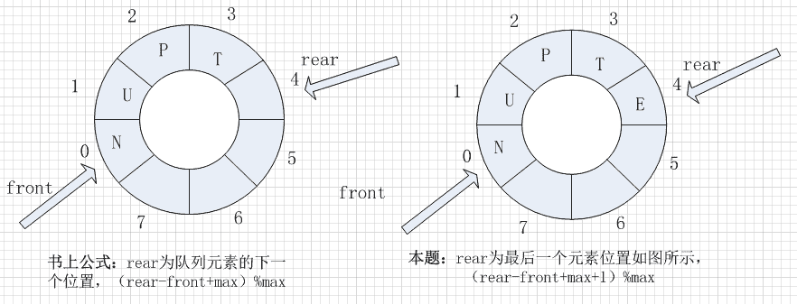
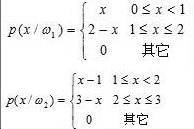

# 网易有道 2017 内推选择题

## 1

关于数据解析以下说法正确的是:

正确答案: D   你的答案: 空 (错误)

```cpp
XML 数据结构有且只有一个根节点，并且不能嵌套
```

```cpp
JSONObjetWithData:options:error:使用文件流
```

```cpp
writeJSONObject:toStream:options:error:使用缓冲区数据解析 json
```

```cpp
XML 解析分为三种:SAX 解析、PULL 解析和 DOM 解析
```

本题知识点

编程基础 *C++工程师 Java 工程师 网易有道 2017* *讨论

[美团直通车](https://www.nowcoder.com/profile/205108)

**答案：D****A:XML 数据结构只能有一个根节点，但是可以嵌套****B:** **JSONObjetWithData:options:error:** **使用缓冲区数据来解析****C:** **writeJSONObject:toSteam:options:error:** **使用流来解析**

编辑于 2019-10-09 17:31:23

* * *

[谷雨不爱吃包子](https://www.nowcoder.com/profile/8867990)

XML 只能有一个根节点，但是可以嵌套

发表于 2016-08-31 13:05:41

* * *

[HungryBird](https://www.nowcoder.com/profile/908796)

不是三种么 DOM SAX PULL

发表于 2016-08-29 23:33:02

* * *

## 2

大小为 MAX 的循环队列中，f 为当前对头元素位置，r 为当前队尾元素位置(最后一个元素的位置)，则任意时刻，队列中的元素个数为

正确答案: B   你的答案: 空 (错误)

```cpp
r-f
```

```cpp
(r-f+MAX+1)%MAX
```

```cpp
r-f+1
```

```cpp
(r-f+MAX)%MAX
```

本题知识点

队列 *C++工程师 Java 工程师 网易有道 2017* *讨论

[InGodWeTrust](https://www.nowcoder.com/profile/2178882)

本题选择 B，原因如下： 

发表于 2017-04-03 11:01:44

* * *

[williamliums](https://www.nowcoder.com/profile/663540)

【这一题有点陷阱】我来解释下为什么是 B 而不是 D 教材上说的 （也是大家记住的）求队列公式为： （rear-front+Max）%Max 该公式中的 ***rear 指向队尾元素的下一个位置*** ，而本题中 ***r*** ***指*** ***向队尾元素位置***

发表于 2016-08-30 15:09:37

* * *

[程式猎人](https://www.nowcoder.com/profile/2606116)

如果不是循环队列的话，那么队列中的元素显然是 rear-front+1；因为是循环队列，即队尾元素的索引有可能比队头元素要小，所以结果就是(rear-front+1+MAX)%MAX.

发表于 2016-09-01 23:03:44

* * *

## 3

已知两个一维模式类别的类概率密度函数为:先验概率 P(ω1)=0.6;P(ω2)=0.4,则样本{x1=1.35,x2=1.45,x3=1.55,x4=1.65}各属于哪一类别?

正确答案: A B C D   你的答案: 空 (错误)

```cpp
X4 ∈ w2
```

```cpp
X3 ∈ w1
```

```cpp
X2 ∈ w1
```

```cpp
X1 ∈ w1
```

本题知识点

概率统计 *C++工程师 Java 工程师 网易有道 2017 概率论与数理统计* *讨论

[已注销](https://www.nowcoder.com/profile/2862122)

概率问题基本上都是贝叶斯和全概率互相扯蛋,，他们之间往往可以通过条件概率建立联系。本题中，要判断 x[i ]属于 w[1]，还是 w[2，]就是判断 p(w[1] | x[i])  和 p(w[2] | x[i])的大小关系。即在 xi 已经发生的情况下，xi 属于哪个类别（w1 ，w2）的可能性更大。p(w[1] | x[i]) = p(x[i]w[1]) / p(x[i]) = p(x[i] | w[1]) * p(w[1]) / p(x[i]) = 0.6*(2 - x[i]) / p(x[i])   // 因为 x[i]都在 （1，2)范围 p(w[2] | x[i]) = p(x[i]w[2]) / p(x[i]) = p(x[i ]| w[2]) * p(w[2]) / p(x[i]) = 0.4*(x[i ]- 1) / p(x[i])   // 因为 x[i]都在 （1，2)范围上面两等式相减，得：delta = p(w[1] | x[i]) - p(w[2] | x[i]) = (1.6 - x[i]) / p(x[i])所以，在上诉样本中，大于 1.6 的，属于 w[2，]小于 1.6 的，属于 w[1。]看了很多公司的概率题基本上都是在贝叶斯和全概率上面扯，掌握这个套路就行。

发表于 2016-11-12 11:57:04

* * *

[闲凉](https://www.nowcoder.com/profile/110147)

p(w1|x) - p(w2|x) = 0.6  * （2 - x） - 0.4 * (x - 1) = 1.6 - x 所以大于 1.6 的为 w2，小于 1.6 的为 w1\.

发表于 2016-09-04 16:28:37

* * *

[伊利殺白](https://www.nowcoder.com/profile/910143)

比较后验概率 p(ω|x) , 哪个类的后验概率大 , 就属于哪个类。

后验概率 : p(ω|x)=p(x| ω )p( ω )/p(x), 分母 p(x ) 总是常数可以忽略 , 先验概率 p( ω ) 已知 , 计算类条件概率 p( x| ω ) , 即可得到后验概率 .

举例 : x_1=1.35, p( ω_1| x_1 )=(2-1.35)*0.6/ p(x )=0.39 / p(x ) ,  p( ω_2| x_1 )=(1.35-1)*0.4/ p(x )=0.14 / p(x ) ,  p( ω_1| x_1 )> p( ω_2| x_1 ), 故 x_1 ∈ ω_1 . 其它同理. (可参考《数据挖掘导论》P141 的 5.3 贝叶斯分类器)

发表于 2016-08-30 17:15:01

* * *

## 4

程序员小李通过管道统计 prog.c 函数中 for 语句通过的次数，需要使用的指令分别是

正确答案: B C   你的答案: 空 (错误)

```cpp
vi
```

```cpp
grep
```

```cpp
wc
```

```cpp
sort
```

本题知识点

Linux C++工程师 Java 工程师 网易有道 2017

讨论

[lyzzzz](https://www.nowcoder.com/profile/968751)

Linux 系统中的 wc (Word Count) 命令的功能为统计指定文件中的字节数、字数、行数，并将统计结果显示输出。

1． 命令格式：

wc [选项]文件...

2． 命令功能：

统计指定文件中的字节数、字数、行数，并将统计结果显示输出。该命令统计指定文件中的字节数、字数、行数。如果没有给出文件名，则从标准输入读取。wc 同时也给出所指定文件的***计数。

3． 命令参数：

-c 统计字节数。

-l 统计行数。

-m 统计字符数。这个标志不能与 -c 标志一起使用。

-w 统计字数。一个字被定义为由空白、跳格或换行字符分隔的字符串。

-L 打印最长行的长度。

-help 显示帮助信息

--version 显示版本信息

4． 使用实例：

实例 1：查看文件的字节数、字数、行数

命令：

wc test.txt

输出：

[root@localhost test] # cat test.txt 

hnlinux

peida.cnblogs.com

ubuntu

ubuntu linux

redhat

Redhat

linuxmint

[root @localhost test] # wc test.txt

 7  8 70  test.txt

[root @localhost test] # wc -l test.txt 

7  test.txt

[root @localhost test] # wc -c test.txt 

70  test.txt

[root @localhost test] # wc -w test.txt 

8  test.txt

[root @localhost test] # wc -m test.txt 

70  test.txt

[root @localhost test] # wc -L test.txt 

17 test.txt

说明：

7     8     70     test.txt

行数 单词数 字节数 文件名**详见：** [**http://www.cnblogs.com/peida/archive/2012/12/18/2822758.html**](http://www.cnblogs.com/peida/archive/2012/12/18/2822758.html)

发表于 2016-08-30 03:22:05

* * *

[农民揣的二狗](https://www.nowcoder.com/profile/260179)

grep “for”  proc.c  | wc -l 

发表于 2016-08-29 15:35:04

* * *

[伊利殺白](https://www.nowcoder.com/profile/910143)

grep, Global Regular Expression Print, 使用正则表达式搜索文本 , 并把匹配的行打印出来 .

wc, word count, 统计指定文件中的字节数 , 字数 , 行数 , 并将统计结果显示输出 .

发表于 2016-08-30 18:27:54

* * *

## 5

请将下列构造函数补充完整，使得程序的运行结果是 5

```cpp
#include<iostream>
using namespace std;
class Sample{
	public:
		Sample(int x){
			________
		}
		~Sample(){
			if(p) delete p;
		}
		int show(){
			return *p;
		}
	private:
		int*p;
};
int main(){
	Sample S(5);
	cout<<S.show()<<endl;
	return 0;
}
```

正确答案: B   你的答案: 空 (错误)

```cpp
*p=x;
```

```cpp
p=new int(x);
```

```cpp
*p=new int(x);
```

```cpp
p=&x;
```

本题知识点

C++ C++工程师 Java 工程师 网易有道 2017

讨论

[追风筝的人](https://www.nowcoder.com/profile/313935)

 D ： p = &x;  表示的是，对 x 取地址，赋值给指针 p，那么 p 将指向 x 的那块内存空间，但是 x  是形式参数(也有人说是方法参数，都可以)，函数调用完了之后，内存就释放了，所以再返回 *p（即取出那块内存空间的值），已经找不到了。所以错误。A ：*p = x；  表示的是 将 x 的值赋值给 P 所指向的空间，而 p 之前并没有指向任何地方，这个操作将是非法的。C：*p = new int(x)；   这个操作同 A 的结果一样。B  ： p = new int(x);  new int(x) 新申请空间，调用完后不释放空间，所以将地址赋值给 p 则 p 指向了这段新申请内存空间，所以当做  *p 返回时，即取出 p 所执行空间的值，所以会输出 5

发表于 2016-09-16 19:04:31

* * *

[androidJP](https://www.nowcoder.com/profile/614192)

x 是方法参数，则 x 的值和它所在的内存位置，都会在方法结束后失效，所以， 指针 p 不应该指向 x 的内存地址，而应该指向自己申请的一个地址空间，于是 D 错；而至于 B 和 C，为何选 B，由于 ‘p’和‘*p’，一个表示 p 指向的地址，一个则表示 p 指向的地址位置的值，所以，p = new int(x); 大致做了两件事：① 让 p 指向一个不会由于方法结束而失效的地址 ②将 x 值传给这个地址空间处， 所以最终，*p 也就是 p 指向位置的值，就是 x 值。最终，选 B。

发表于 2016-09-08 17:31:27

* * *

[忽忽](https://www.nowcoder.com/profile/583671)

*p=x 代表将 p 所指向的内存位置赋值为 x，而 x 作为局部变量，在 Sample 函数调用结束后自动释放，p 无处可指。所以需要分配一块空间

编辑于 2016-09-23 10:18:44

* * *

## 6

变量 z 执行结果是（）

```cpp
int a=5, b=6, c=12;
int z= (a * b -c ) / a;
```

正确答案: B   你的答案: 空 (错误)

```cpp
6
```

```cpp
3
```

```cpp
4
```

```cpp
5
```

本题知识点

C++ 编程基础 *C++工程师 Java 工程师 网易有道 2017* *讨论

[牛客 442126 号](https://www.nowcoder.com/profile/442126)

18/5=3.6 ，浮点类型到 int 类型要向零取整，结果 3

发表于 2016-08-29 16:20:13

* * *

[发愤图强的小菜](https://www.nowcoder.com/profile/838002)

18/5=3.6 因为是 int 类型所以是 3

发表于 2016-10-30 22:23:35

* * *

[how_Sang_Sang](https://www.nowcoder.com/profile/5107017)

取余、取模都是 3，不解释！

发表于 2020-02-10 23:36:10

* * *

## 7

如下 Java 语句

```cpp
double x= 3.0; 
int y=5; 
x/=--y;
```

执行后， x 的值是（）

正确答案: D   你的答案: 空 (错误)

```cpp
3
```

```cpp
0.6
```

```cpp
0.4
```

```cpp
0.75
```

本题知识点

Java C++工程师 Java 工程师 网易有道 2017

讨论

[lyzzzz](https://www.nowcoder.com/profile/968751)

--y 会获得 y-1 之后的结果，为 4x/=--y 相当于 x=x/4，x 为 double 类型，4 转换为 double 类型，得到小数 0.75

发表于 2016-08-31 03:08:09

* * *

[Mr_Right](https://www.nowcoder.com/profile/5606313)

| 优先级 | 运算符 | 结合性 |
| 1 | () [] . | 从左到右 |
| 2 | ! +(正号) -(负号) ~(取补) ++(自增) - -(自减) | 从右向左 |
| 3 | * / % | 从左到右 |
| 4 | +(加号) -(减号) | 从左到右 |
| 5 | << >> >>> | 从左到右 |
| 6 | < <= >= > instanceof | 从左到右 |
| 7 | ==(等于) != | 从左到右 |
| 8 | & | 从左到右 |
| 9 | ^ | 从左到右 |
| 10 | &#124; | 从左到右 |
| 11 | && | 从左到右 |
| 12 | &#124;&#124; | 从左到右 |
| 13 | ?: | 从右向左 |
| 14 | = += -= *= /= %= &= &#124;= ^= ~= <<= >>= >>>= | 从右向左 |

发表于 2018-03-14 16:35:55

* * *

[cp..](https://www.nowcoder.com/profile/6237019)

－－y 和 y－－，前者优先级最高参与运算之前减 1。y－－优先级最低一般参与运算之后再减 1，区别开这两种情况 这类题就简单了

发表于 2017-10-11 23:15:50

* * *

## 8

设某棵二叉树的中序遍历序列为 BADC，前序遍历序列为 ABCD，则后序遍历该二叉树得到序列为（）.

正确答案: B   你的答案: 空 (错误)

```cpp
BADC
```

```cpp
BDCA
```

```cpp
BCDA
```

```cpp
CBDA
```

本题知识点

树 C++工程师 Java 工程师 网易有道 2017

讨论

[Blue_Smile](https://www.nowcoder.com/profile/243872)

前序遍历：根节点-->左子树-->右子树中序遍历：左子树 --> 根节点 ->右子树后序遍历： 左子树 ->右子树 --> 根节点

发表于 2016-10-09 23:04:40

* * *

[lyzzzz](https://www.nowcoder.com/profile/968751)

中序遍历序列为 BADC 前序遍历序列为 ABCD 根为 A 左子树为 B 右子树为 DC(中序)/CD(前序)继续分解右子树，得到右子树根为 C，结合 DC 和 CD 得出右子树的左孩子为 D（这里之前说错了，这里应该是左孩子，**已更正** **）**（分析过程：CD 是前序，根是 C，DC 是中序，在 C 前的只有可能是左孩子）树为      AB       C      D 后序遍历为 BDCA

编辑于 2016-09-01 16:52:43

* * *

[勤修苦练](https://www.nowcoder.com/profile/150970)

前序遍历第一个节点即为根节点，在中序遍历中找到相应元素，中序遍历两边分别为左右子树，之后递归找出所有子树位置

发表于 2016-08-30 13:44:56

* * *

## 9

关于解释系统的叙述中，正确的是（）

正确答案: A D   你的答案: 空 (错误)

```cpp
解释程序不是直接执行，而是转换成机器可识别码之后才能执行
```

```cpp
使用解释系统时会区分编译阶段和运行阶段
```

```cpp
目标程序可以脱离其语言环境独立执行，使用比较方便、效率较高
```

```cpp
一般来说，建立在编译基础上的系统在执行速度要优于建立在解释执行基础上的系统
```

本题知识点

编译和体系结构 C++工程师 Java 工程师 网易有道 2017

讨论

[牛客 930141 号](https://www.nowcoder.com/profile/930141)

A： 计算机不能直接理解任何除及其语言以外的语言，所以必须要把程序员所写的程序语言翻译成机器语言，计算机才能执行程序。将其他语言翻译成机器语言的工具，被称为编译器。 编译器翻译的方式有两种：一个是编译，一个是解释，相对应的是编译型语言和解释型语言。
B：编译语言程序执行分为编译、执行两个阶段
C：编译语言如 JAVA 是跨平台语言，编译一次可以在别的系统中不需再次编译直接执行
D 选项：编译语言首先将源码编译成字节码或者编译成二进制码 ，C 就是把源码编译成二进制码，Java 编译成字节码。编译语言执行的效率往往比较高。因为它会对编译好的代码直接执行，而编译好的代码已经接近机器语言，无需再去做解释的工作。 解释性语言不同，在执行的时候才把源代码调到执行它的地方，比如是引擎或者解释器，调用一句执行一句。 

发表于 2016-09-10 15:01:04

* * *

[InterOAO](https://www.nowcoder.com/profile/168673)

目标程序是 编译系统生成的，解释系统不生成目标程序。编译： 源代码->目标代码解释：源代码->中间代码->目标代码目标代码是机器可直接执行的代码不管编译还是解释,都需要转为机器识别的才能执行, 只不过解释是靠虚拟机或者其他机制

发表于 2016-08-30 23:20:23

* * *

[农民揣的二狗](https://www.nowcoder.com/profile/260179)

```cpp
脚本的特点是，脚本本身不编译为机器码。而是依托于寄主（虚拟机，脚本解释器等）。
其实真正起执行作用的是寄主。脚本命令寄主按照脚本的需求来执行操作。

而常规的编译型的代码，通过编译器编译成独立的可执行文件。可执行文件本身就包含了执行语句。它自己来执行自己所需的操作。

你可以简单这么理解：常规编译型的代码，是奔跑的人。而脚本是骑马的人，脚本解释器就是他的坐骑。真正跑起来的是马而不是人。

一般脚本执行效率会低一些，但开发起来容易一些。（只是一般情况）
```

发表于 2016-08-29 15:39:09

* * *

## 10

在一个 10 阶的 B-树上，每个树根结点（非根节点）中所含的关键字数目最多允许为（）个，最少允许为（）个。

正确答案: B   你的答案: 空 (错误)

```cpp
10,5
```

```cpp
9,4
```

```cpp
8,3
```

```cpp
7,6
```

本题知识点

树 C++工程师 Java 工程师 网易有道 2017

讨论

[banbo](https://www.nowcoder.com/profile/5727594)

最多 M-1  最少 M/2-1 向上取整

发表于 2016-08-29 16:56:25

* * *

[dilemmaxk](https://www.nowcoder.com/profile/786045)

关键字的个数 n 必须满足： [ceil(m / 2)-1]<= n <= m-1  （ceil 为取上整）

发表于 2016-09-01 14:32:39

* * *

[feitian](https://www.nowcoder.com/profile/729909)

树根节点不是[1,M-1]个关键字吗？

发表于 2016-08-31 10:37:54

* * *

## 11

下列程序编译时会出现错误，请根据行号选择错误位置( )

```cpp
#include <iostream>
using namespace std;
class A{
  int a1;
protected:
  int a2;
public:
  int a3;
};
class B: public A{
  int b1;
protected:
  int b2;
public:
  int b3;
};
class C:private B{
  int c1;
protected:
  int c2;
public:
  int c3;
};
int main(){
  B obb;
  C obc;
  cout<<obb.a1;//1
  cout<<obb.a2;//2
  cout<<obb.a3;//3
  cout<<obc.b1;//4
  cout<<obc.b2;//5
  cout<<obc.b3;//6
  cout<<obc.c3;//7
  return 0;
}
```

正确答案: A D   你的答案: 空 (错误)

```cpp
1,2
```

```cpp
2,5,7
```

```cpp
3,4,7
```

```cpp
4,5,6
```

本题知识点

C++ C++工程师 Java 工程师 网易有道 2017

讨论

[牛客 332105 号](https://www.nowcoder.com/profile/332105)

**类的继承后方法属性变化：**private 属性不能够被继承。使用 private 继承，父类的 protected 和 public 属性在子类中变为 private；使用 protected 继承，父类的 protected 和 public 属性在子类中变为 protected；使用 public 继承，父类中的 protected 和 public 属性不发生改变; **private, public, protected 访问标号的访问范围：**private：只能由 1.该类中的函数、2.其友元函数访问。不能被任何其他访问，该类的对象也不能访问。protected：可以被 1.该类中的函数、2.子类的函数、以及 3.其友元函数访问。但不能被该类的对象访问。public：可以被 1.该类中的函数、2.子类的函数、3.其友元函数访问，也可以由 4.该类的对象访问。注：友元函数包括 3 种：设为友元的普通的非成员函数；设为友元的其他类的成员函数；设为友元类中的所有成员函数。

发表于 2016-09-03 12:08:56

* * *

[selfboot](https://www.nowcoder.com/profile/509)

派生类可以继承定义在基类中的成员，但是派生类的成员函数不一定有权访问从基类继承而来的成员，访问权限受下面因素影响。

*   继承方式；
*   基类成员的访问权限(即 public/private/protected)。

继承有三种方式，即公有(Public)继承、私有(Private)继承、保护(Protected)继承。（私有成员不能被继承）

*   公有继承就是将基类的公有成员变为自己的公有成员，基类的保护成员变为自己的保护成员。
*   保护继承是将基类的公有成员和保护成员变成自己的保护成员。
*   私有继承是将基类的公有成员和保护成员变成自己的私有成员。

三种继承方式的比较: 具体示例代码，参见：https://github.com/xuelangZF/CS_Offer/blob/master/Coding/C++_Inheritance.cpp 关于类的更多内容，参考 https://github.com/xuelangZF/CS_Offer/blob/master/C%2B%2B/Class.md

发表于 2016-09-15 18:02:17

* * *

[农民揣的二狗](https://www.nowcoder.com/profile/260179)

```cpp
cout<<obb.a1;//1   a1 是 A 私有的
cout<<obb.a2;//2   a2 是 A 开放给派生类使用的，客户代码不能使用
cout<<obc.b1;//4   C 是私有继承于 B，不能使用 B 的成员
cout<<obc.b2;//5   同上
cout<<obc.b3;//6   同上
```

发表于 2016-08-29 15:45:23

* * *

## 12

一磁带机有 9 道磁道，带长 700m，带速 2m/s，每个数据块 1k 字节，块间间隔 14mm。如果数据传输率为 128000 字节/秒,求记录位密度为（）字节/m.

正确答案: B   你的答案: 空 (错误)

```cpp
500000
```

```cpp
64000
```

```cpp
1000000
```

```cpp
12800
```

本题知识点

编译和体系结构 C++工程师 Java 工程师 网易有道 2017

讨论

[祖传地沟油](https://www.nowcoder.com/profile/6890164)

因为 **数据传输率（C）=记录位密度（D） x   线速度( V )**所以 **D=C/V**= 128000/2=64000 所以答案为 B

发表于 2016-08-30 21:27:28

* * *

[authority](https://www.nowcoder.com/profile/4519441)

说个简单的方法（就是小学数学用的方法。。。）请勿见笑：            128000 字节/秒  一秒走 2m 所以密度  就是 总数量/总长度   即  128000/2=64000 

发表于 2016-09-05 09:28:49

* * *

[banbo](https://www.nowcoder.com/profile/5727594)

我是看单位算的。。。。醉了  

发表于 2016-08-29 16:59:02

* * *

## 13

以下几条路由，10.1.193.0/24,10.1.194.0/24,10.1.196.0/24,10.1.198.0/24，如果进行路由汇聚，则能覆盖这几条路由地址的是（）

正确答案: C   你的答案: 空 (错误)

```cpp
10.1.192.0/22
```

```cpp
10.1.200.0/22
```

```cpp
10.1.192.0/21
```

```cpp
10.1.224.0/20
```

本题知识点

网络基础 C++工程师 Java 工程师 网易有道 2017

讨论

[isshe](https://www.nowcoder.com/profile/651395)

10.1.193.0 的二进制  查看全部)

编辑于 2016-09-05 11:39:46

* * *

[DayUp](https://www.nowcoder.com/profile/775837)

193: 1100 0001194: 1100 0010196: 1100 0100198: 1100 0110 这四个数的前五位都是 11000，加上 10.1 这两部分相同的位数，网络号就是 8+8+5=21 而 1100 0000 的十进制数是 192\. 所以路由汇聚的 IP 地址就是 10.1.192.0/21

发表于 2016-08-31 21:50:21

* * *

[追逐者](https://www.nowcoder.com/profile/293577)

将四类 IP 地址中第三位转为二进制，如下：10.1. 193.0=>**1100 0**00110.1. 194. 0=> **1100 0**01010.1. 196. 0=> **1100 0**10010.1. 198. 0=> **1100 0**110 可以得出有五位是相同的=====》得出网络号应该占用 8+8+5=21 位，即 10.1. **1100 0000** . 0==》 10.1.192.0/21 更多的 IP 相关内容可以查看 http://blog.csdn.net/hsd2012/article/details/52435057

发表于 2016-09-10 15:34:08

* * *****