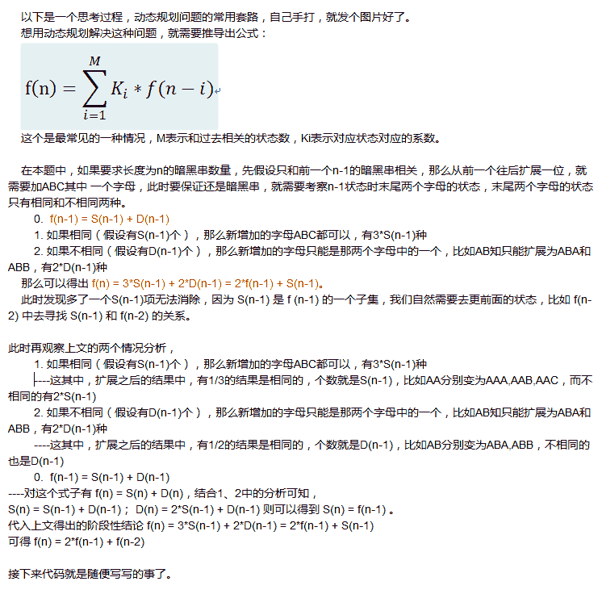
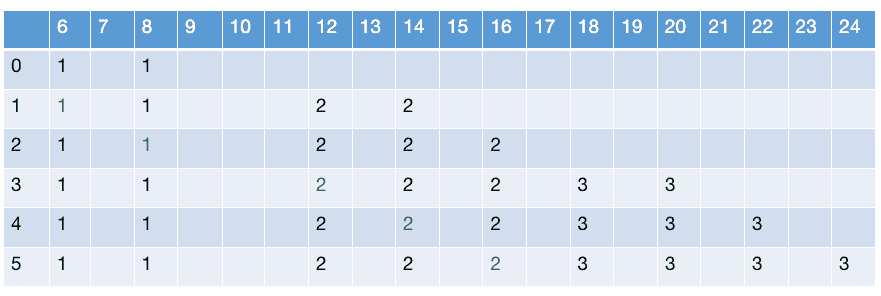

# 网易 2017 秋招编程题集合

## 1

如果一个数字序列逆置之后跟原序列是一样的就称这样的数字序列为回文序列。例如：
{1, 2, 1}, {15, 78, 78, 15}, {112} 是回文序列,
{1, 2, 2}, {15, 78, 87, 51}, {112, 2, 11} 不是回文序列。
现在给出一个数字序列，允许使用一种转换操作：
选择任意两个相邻的数，然后从序列移除这两个数，并用这两个数字的和插入到这两个数之前的位置(只插入一个和)。
现在对于所给序列要求出最少需要多少次操作可以将其变成回文序列。

本题知识点

模拟 贪心

讨论

[脱缰的哈士奇～](https://www.nowcoder.com/profile/542028)

使用双端队列 deque 数据结构进行求解。双端队列 deque 数据结构支持高效地首尾两端元素的插入和删除。(提交运行时间小于 1ms)

本题思路为：判断队首和队尾元素。若二者相等，则将这两个元素都弹出队列，将队列规模缩小 2 个，再对该问题进行判断；若二者不相等，则选择其中较小的一个，将该元素和与其相邻的元素都弹出队列，再将其和插入队列，从而将队列规模缩小 1 个，再对该问题进行判断。

```cpp
#include <iostream>
#include <deque>
using  namespace std;

int main() {
    int length;
    deque<int> datas;
    int count = 0;
    int temp;
    int start;
    int end;
    int add;
    while (cin >> length) {
        count = 0;
        datas.clear(); 

        for (int i = 0; i<length; i++) {
            cin >> temp;
            datas.push_back(temp);
        }

        while (datas.size() > 1) {

            start = datas.front();
            end = datas.back();
            if (start == end) {
                //若相等，删除队首和队末元素
                datas.pop_back();
                datas.pop_front();
            }
            else {
                //不相等
                add = 0;
                count++;
                if (start <= end) {
                    add += start;
                    datas.pop_front();
                    add += datas.front();
                    datas.pop_front();
                    datas.push_front(add);
                }
                else {
                    add += end;
                    datas.pop_back();
                    add += datas.back();
                    datas.pop_back();
                    datas.push_back(add);
                }

            }
        }
        cout << count << endl;
    }
    return 0;
}
```

编辑于 2017-03-31 11:46:39

* * *

[basicworld](https://www.nowcoder.com/profile/2008774)

```cpp
#不用递归！－－人生苦短我用 python
#首尾指针跟踪
#两个数不相等就进行加法：小的数加上相邻的值
n = int(raw_input().strip())
item = [int(x) for x in raw_input().strip().split()]

def huiwen(item, head, tail):
    times=0
    left = item[head]
    right = item[tail]
    while (head<tail):

        if left<right:
            head+=1
            left+=item[head]
            times+=1
            continue
        elif left>right:
            tail-=1
            right+=item[tail]
            times+=1
            continue
        elif left==right:
            head+=1
            tail-=1
            left = item[head]
            right = item[tail]

    return times

print huiwen(item,0,n-1)

```

编辑于 2016-09-24 12:08:52

* * *

[easollx](https://www.nowcoder.com/profile/2791338)

```cpp
//模仿 bupt 渣硕 大神的
import java.util.Scanner;
public class Main {
	public static void main(String[] args){		
		Scanner scanner = new Scanner(System.in);
		while(scanner.hasNext()){
			int times = 0;
			int n = scanner.nextInt();
			int[] inputArr = new int[n];
			for(int i = 0; i < n; i++){
				inputArr[i] = scanner.nextInt();
			}
			int head = 0;
			int tail = n - 1;
			while(head < tail){
				if(inputArr[head] > inputArr[tail]){
					inputArr[--tail] += inputArr[tail + 1];
					times++;
				}else if(inputArr[head] < inputArr[tail]){
					inputArr[++head] += inputArr[head - 1];
					times++;
				}else{
					head++;
					tail--;
				}
			}		
			System.out.println(times);
		}
		scanner.close();
	}
}
```

编辑于 2016-09-13 12:42:00

* * *

## 2

小易有一个圆心在坐标原点的圆，小易知道圆的半径的平方。小易认为在圆上的点而且横纵坐标都是整数的点是优雅的，小易现在想寻找一个算法计算出优雅的点的个数，请你来帮帮他。
例如：半径的平方如果为 25
优雅的点就有：(+/-3, +/-4), (+/-4, +/-3), (0, +/-5) (+/-5, 0)，一共 12 个点。

本题知识点

数学 计算几何

讨论

[lencha](https://www.nowcoder.com/profile/532300)

```cpp
#include<iostream>
#include<cmath>
using namespace std;
int main() {
    int n;
    cin>>n;
    int count = 0;
    int r = (int)sqrt(n);
    if (r*r == n) {
        count += 4;
        --r;
    }
    for (int i = r; i > 0; i--) {
        int x = (int)sqrt(n - i*i);
        if(x*x + i*i == n) count += 4;
    }
    cout<<count<<endl;
} 
```

发表于 2017-02-19 17:14:26

* * *

[lyul](https://www.nowcoder.com/profile/1963058)

```cpp
import java.util.Scanner;

public class Main {
    public static void main(String[] args) {
        Scanner scan = new Scanner(System.in);
        int n = scan.nextInt();
        System.out.println(count(n));
    }

    public static int count(int n) {
        int count = 0;
        double r = Math.sqrt(n);
        for (int i = 0; i < r; i++) {
            double j = Math.sqrt(n - i * i);
            if (Math.abs(j - Math.round(j)) <= 0.000000001) {
                count++;
            }
        }
        return 4 * count; 
    } 
}
```

编辑于 2017-01-18 14:59:26

* * *

[元气の悟空](https://www.nowcoder.com/profile/392974)

```cpp
#include<stdio.h>
#include<math.h>
int main(){
    for(int N=0;scanf("%d",&N)!=EOF;){
        int res=0;
        for(int i=0;i<sqrt(N);i++)
            (int)sqrt(N-i*i)==sqrt(N-i*i)?res++:res=res;
        printf("%d\n",4*res);
    }
}//圆的方程：x²+y²=r²
 //那么 y=sqrt(r²-x²)
 //在判断 y 是不是整数
```

发表于 2017-08-30 14:55:35

* * *

## 3

小易来到了一条石板路前，每块石板上从 1 挨着编号为：1、2、3.......
这条石板路要根据特殊的规则才能前进：对于小易当前所在的编号为 K 的 石板，小易单次只能往前跳 K 的一个约数(不含 1 和 K)步，即跳到 K+X(X 为 K 的一个非 1 和本身的约数)的位置。 小易当前处在编号为 N 的石板，他想跳到编号恰好为 M 的石板去，小易想知道最少需要跳跃几次可以到达。
例如：
N = 4，M = 24：
4->6->8->12->18->24
于是小易最少需要跳跃 5 次，就可以从 4 号石板跳到 24 号石板

本题知识点

贪心 动态规划

讨论

[昵称真难取](https://www.nowcoder.com/profile/7904149)

```cpp
/*思路 从 m 到 n 至少需要多少步
* mark[i]记录到达位置 i 的最少步数。初始化 mark[],起始位置 mark[m]为 0 外，其它位置都为无穷大
* i~[m,n-2]依次更新 mark[]:
* 判断，如果 mark[i]为无穷大，则说明该位置不可由 m 到达，那么该位置也就到不了 n。跳过，不作处理。减枝。
* 如果 mark[i]不是无穷大，计算 i 的因子，对每一个因子求出 i 的下一步的位置 tmp，如果 mark[tmp]>mark[i]+1，更新 mark[tmp]=mark[i]+1;
* 最终结果是 mark[n],如果 mark[n]是无穷大，则输出-1；否则返回 mark[n]。
*/ 
/*
* 比如以 8 开始 mark[8]=0,8 的因子 list={2,4},
* factor=2,可到达 10,mark[10]原本是无穷大,现在更新 mark[10]=mark[8]+1;12 同理。
* 循环下一个 i=9，mark[9]是无穷大，跳过，不用处理。
* 也就是由 8 产生 10 和 12，接下来就处理 10,12 及其产生的位置，而无需处理其他。
*/
import java.util.Scanner;
import java.util.ArrayList;
public class Main{
    public static int deal(int m,int n){//m 到 n
    	int mark[]=new int[n+1];//记录到达每一个位置的步数
    	for(int i=m+1;i<=n;i++){                          //初始化 
    		mark[i]=Integer.MAX_VALUE;
    	}
    	for(int i=m;i<n-1;i++){                         //填 mark[]
    		    if(mark[i]==Integer.MAX_VALUE)continue; //如果当前起始位置本身不可达 不作处理
    			ArrayList<Integer> list=allFactor(i);   //获得当前位置 i 的所有因子
    			for(int j=0;j<list.size();j++){         //计算 i 能到达的每一个位置 tmp
    				int tmp=i+list.get(j);
    				int count=mark[i]+1;
    				if(tmp<=n&&mark[tmp]>count){        //如果从 i 到达位置 tmp 的次数比以前记录的小 更新 mark[tmp]
    					mark[tmp]=count;
    				}
    			}	   		
    	}
    	return mark[n];
    }
	public static ArrayList<Integer>  allFactor(int n){//获得 n 的所有因子 除 1 n 外
		ArrayList list=new ArrayList();
		for(int i=2;i<=Math.sqrt(n);i++){
			if(n%i==0){
				list.add(i);
				if(i!=n/i)list.add(n/i);
			}
		}
		return list;
	}
    public static void main(String args[]){
    	Scanner sc=new Scanner(System.in);
    	 int m=sc.nextInt();
         int n=sc.nextInt();
         int r=deal(m,n);
         if(r==Integer.MAX_VALUE)r=-1;
         System.out.println(r);
        }   
}
```

编辑于 2017-08-16 09:11:07

* * *

[脱缰的哈士奇～](https://www.nowcoder.com/profile/542028)

*   思路 1：动态规划

采用动态规划思想求解。创建一个 vector 容器 steps，`steps[i]`表示到达 i 号石板所需的最小步数。初始化为 steps 容器为 INT_MAX。从序号 N 的石板开始逐个遍历，若`steps[i]`为 INT_MAX，表示该点不可到达，直接开始下次循环。若`steps[i]`不为 INT_MAX，表示该点可以到达，下面求解编号 i 的约数，进行动态规划。动态规划的转移方程为

```cpp
steps[i+j] = min(steps[i]+1,steps[i+j])   //i 为石板编号，j 为 i 的约束
steps[N] = 0 
```

代码如下。

```cpp
#include <iostream>
#include <vector>
#include <climits>
#include <cmath>
#include <algorithm>
using namespace std;

int main(){
    int N,M;
    while(cin>>N>>M){
        vector<int> steps(M+1,INT_MAX);
        steps[N] = 0;
        for(int i=N;i<=M;i++){
            if(steps[i] == INT_MAX){
                continue;
            }
            for(int j=2;(j*j)<=i;j++){
                if(i%j == 0){
                    if(i+j <= M){
                        steps[i+j] = min(steps[i]+1,steps[i+j]);
                    }
                    if(i+(i/j) <= M){
                        steps[i+(i/j)] = min(steps[i]+1,steps[i+(i/j)]);
                    }

                }

            }
        }
        if(steps[M] == INT_MAX){
            steps[M] = -1;
        }
        cout<<steps[M]<<endl;
    }
    return 0;
} 
```

*   思路 2：贪婪算法

**贪婪算法并不一定能得到最优解，但是一个可行的，较好的解。**

该问题若采用贪婪算法求解，并不会得到最优解，只会得到一个可行的，较好的解。例如，下述程序中采用了贪婪算法求解。每次都选取最大的约数前进一步。若后续发生不可到达目标点，则进行**回溯**，取第 2 大的约数作为步进值。下述程序通过率为 80%，并不能 AC。例如，对于 N=676, M=12948 情况，贪婪算法求解为 13 步，而动态规划算法求解为 10 步。

> 贪婪算法并不一定能得到最优解，但是一个可行的，较好的解。例如，给定硬币 coins=[1,2,10,25]，金额总数 amounts=30，不限制每种币值的硬币数量，要求用所给硬币凑出所需金额，并且硬币数量最少。若采用贪婪算法求解，需要 6 枚（25+5*1）硬币。 若采用动态规划求解，所需 3 枚（10+10+10）硬币。 --- [贪婪算法](http://www.infocool.net/kb/Arithmetic/201612/251791.html)

```cpp
// 程序通过率为 80%，并不能 AC
//对于 N=676, M=12948 情况，贪婪算法求解为 13 步，而动态规划算法求解为 10 步。
// 贪婪算法并不一定能得到最优解，但是一个可行的，较好的解。
#include <iostream>
using namespace std;

int stepSearch(int N, int M) {
    if (N > M) {
        return -1;
    }
    if (N == M) {
        return 0;
    }
    int res = 0;
    for (int i = 2; i<N; i++) {
        if (i*(N / i) == N) {
            res++;
            if (stepSearch(N + N/i, M) != -1) {
                res += stepSearch(N + N/i, M);
                return res;
            }
            else {
                res--;
            }
        }
    }
    return -1;
}

int main() {
    int N, M;
    while (cin >> N >> M) {
        cout << stepSearch(N, M) << endl;
    }
    return 0;
} 
```

发表于 2017-03-31 16:54:59

* * *

[Alex-大伟](https://www.nowcoder.com/profile/521033)

```cpp
package com.suda.alex;

import java.util.ArrayList;
import java.util.Scanner;

public class Test3 {

	public static void main(String[] args) {
		// TODO Auto-generated method stub
		Scanner scanner = new Scanner(System.in);
		while (scanner.hasNext()) {
			int n = scanner.nextInt();
			int m = scanner.nextInt();
			System.out.println(leastJumpTime(n, m));
		}
	}

	// 思想：动态规划
	public static int leastJumpTime(int n, int m) {
		if (m == n) {
			return 0;
		}
		int steps = m - n + 1;// 算上了起点和终点
		int[] dp = new int[steps];// 规划的量：到达 每个位置需要的最小步数
		dp[0] = 0; // 起点
		for (int i = 1; i < steps; i++) {
			dp[i] = Integer.MAX_VALUE; // 初始化 表示后续位置都不能到达
		}
		for (int i = 0; i < steps; i++) {
			// 0 对应 n 石板 ；steps - 1 = m-n 对应 m 石板
			if (dp[i] == Integer.MAX_VALUE) { // 该位置不能像前走
				dp[i] = 0;
				continue;
			}
			ArrayList<Integer> list = getAppNums(i + n); // i+n 才是石板号
			for (int j = 0; j < list.size(); j++) {
				int x = list.get(j);
				if (i + n + x <= m) {
					dp[i + x] = Math.min(dp[i + x], dp[i] + 1);
				}
			}
		}
		if (dp[steps - 1] == 0) {
			return -1;
		} else {
			return dp[steps - 1];
		}
	}

	// 求因数 时间复杂度较低
	public static ArrayList<Integer> getAppNums(int n) {
		ArrayList<Integer> list = new ArrayList<Integer>();
		for (int i = 2; i <= Math.sqrt(n); i++) {
			if (n % i == 0) {
				list.add(i);
				if (n / i != i) {
					list.add(n / i);
				}
			}
		}
		return list;
	}
}

```

发表于 2016-09-26 20:53:29

* * *

## 4

一个只包含'A'、'B'和'C'的字符串，如果存在某一段长度为 3 的连续子串中恰好'A'、'B'和'C'各有一个，那么这个字符串就是纯净的，否则这个字符串就是暗黑的。例如：
BAACAACCBAAA 连续子串"CBA"中包含了'A','B','C'各一个，所以是纯净的字符串
AABBCCAABB 不存在一个长度为 3 的连续子串包含'A','B','C',所以是暗黑的字符串
你的任务就是计算出长度为 n 的字符串(只包含'A'、'B'和'C')，有多少个是暗黑的字符串。

本题知识点

动态规划

讨论

[bupt 渣硕](https://www.nowcoder.com/profile/964976)

```cpp
#include <iostream>
using namespace std;
int main(){
    int n = 0;
    while(cin >> n){
        long long dp[31] = {0};
        dp[1] = 3, dp[2] = 9;
        for( int i = 3; i <= n; i++ )
            dp[i] = 2*dp[i-1]+dp[i-2];
        cout<<dp[n]<<endl;
    }	
}
```



编辑于 2016-09-13 11:12:44

* * *

[zj_ustc](https://www.nowcoder.com/profile/7072189)

思路是这样，不管前面是什么序列，你在第 n 位至少有两种填法，第 n-1，n-2 的字母，当第 n-1，n-2 字母相同时，前面就漏掉了一种填法，即加上一个 f(n-2)即可。

发表于 2017-11-20 10:44:26

* * *

[Jungggle](https://www.nowcoder.com/profile/2022194)

没读懂题

发表于 2017-08-11 15:02:52

* * *

## 5

对于一个整数 X，定义操作 rev(X)为将 X 按数位翻转过来，并且去除掉前导 0。例如:
如果 X = 123，则 rev(X) = 321;
如果 X = 100，则 rev(X) = 1.
现在给出整数 x 和 y,要求 rev(rev(x) + rev(y))为多少？

本题知识点

模拟 数学

讨论

[一枚立志当程序媛的女纸](https://www.nowcoder.com/profile/146953)

#include<iostream>using namespace std;int rev(int m){    int t=0;    while(m>0)    {        t=t*10+m%10;        m=m/10;    }    return t;}int main(){int x,y;    while(cin>>x>>y)    {        cout<<rev(rev(x) + rev(y))<<endl;    }    return 0;}

发表于 2016-09-14 14:06:39

* * *

[华科平凡](https://www.nowcoder.com/profile/4939096)

Python 两行代码教你做人：

```cpp
a = input().split()
print(str(int(a[0][::-1]) + int(a[1][::-1]))[::-1].lstrip("0"))
```

人生苦短，我用 python。

编辑于 2017-09-07 14:33:24

* * *

[juding](https://www.nowcoder.com/profile/5260293)

```cpp
// 很简单
import java.util.Scanner;
public class Main {	
	public static void main(String[] args){
		Scanner in = new Scanner(System.in);
		int m = in.nextInt();
		int n = in.nextInt();
		int out = rev(rev(m)+rev(n));
		System.out.println(out);

	}
	public static int rev(int num){
		int x = 0;
		while(num!=0){
			x = 10*x + num%10;
			num = num/10;
		}
		return x;
	}
}
```

发表于 2017-07-03 20:49:47

* * *

## 6

小易是一个数论爱好者，并且对于一个数的奇数约数十分感兴趣。一天小易遇到这样一个问题： 定义函数 f(x)为 x 最大的奇数约数，x 为正整数。 例如:f(44) = 11.
现在给出一个 N，需要求出 f(1) + f(2) + f(3).......f(N)
例如： N = 7
f(1) + f(2) + f(3) + f(4) + f(5) + f(6) + f(7) = 1 + 1 + 3 + 1 + 5 + 3 + 7 = 21
小易计算这个问题遇到了困难，需要你来设计一个算法帮助他。

本题知识点

数学 模拟 穷举

讨论

[pngfi](https://www.nowcoder.com/profile/244999)

```cpp
import java.util.Scanner;

public class Main{

	public static void main(String[] args) {
		Scanner s=new Scanner(System.in);
		long num=s.nextInt();
		long sum=0;
		for(long i=num;i>0;i=i/2){
			long temp=(i+1)/2;
			sum+=temp*temp;
		}
		System.out.println(sum);
	}
}

总体思路：
因为奇数的最大奇数约数就是自己啊，对于偶数我们只能一直除 2 直到得到一个奇数即为最大奇数约数

比如 1 2 3 4 5 6 7 8 9 10 
即 n=10 ，此时奇数有 1 3 5 7 9 我们把这几个奇数相加然后 n/2 
得到第二轮序列序列 1 2 3 4 5 分别对应上次的 2 4 6 8 10 五个偶数，这是我们再加 1 3 5
依次类推

细节问题：
当 n 为偶数，就有 n/2 个奇数，根据等差数列求和公式 即(（首项+末项）*项数)/2,我们知道 n/2 个奇数和为((1+n-1)*n/2)/2,
即为(n/2) * (n/2),此时 n 为偶数，因此 (n/2) * (n/2) = ((n+1)/2)  *  ((n+1)/2)

当 n 为奇数，有(n+1)/2 个奇数，此时奇数和为((n+1)/2)  *  ((n+1)/2)
因此两种情况可以用一个等式来总结

```

发表于 2016-09-18 22:40:32

* * *

[武汉孙一峰](https://www.nowcoder.com/profile/6638059)

```cpp
//找规律，你会发现基数都是直接取，偶数/2，得到的基础直接取，偶数继续/2，每次循环，可以把规模缩小 1/2。
//要注意的是((i + 1) / 2) * ((i + 1) / 2)运算时候，括号的优先级。

#include "iostream"

using namespace std;
typedef long long LL;

int main()
{
	LL N;
	LL Ans = 0;
	while (cin >> N)
	{
		Ans = 0;
		for (LL i = N; i > 0; i = i / 2)
			Ans += ((i + 1) / 2) * ((i + 1) / 2);
		cout << Ans << endl;
	}
	return 0;
}
```

编辑于 2016-09-13 13:47:35

* * *

[Alex-大伟](https://www.nowcoder.com/profile/521033)

```cpp
package com.suda.alex;

import java.util.Scanner;

public class Test6 {

	public static void main(String[] args) {
		// TODO Auto-generated method stub
		Scanner scanner = new Scanner(System.in);
		while (scanner.hasNext()) {
			int n = scanner.nextInt();
			System.out.println(sumOfMaxOdd(n));
		}
	}

	/*
	 * 奇数的最大约数就是本身。问题就是求所有 f(i), i 为偶数的和 因为要求的是最大奇约数，所以 f(2k) = f(k)，所以 f(2) + f(4)
	 * + ... + f(2k) = f(1) + f(2) + ... + f(k);
	 * 
	 * sum(n) = sum (n / 2) + 1 + 3 + ... + n - 1 = sum (n/2) + n*n/4（n 为偶数） 
	 *        
	 *        = sum (n - 1) + n （n 为奇数）
	 * 
	 * 
	 */
	public static long sumOfMaxOdd(long n) {
		if (n == 1) {
			return 1;
		}
		if (n % 2 == 0) {
			return sumOfMaxOdd(n / 2) + n * n / 4;
		} else {
			return sumOfMaxOdd(n - 1) + n;
		}
	}

}

```

发表于 2016-09-26 22:06:47

* * *

## 7

小易去附近的商店买苹果，奸诈的商贩使用了捆绑交易，只提供 6 个每袋和 8 个每袋的包装(包装不可拆分)。 可是小易现在只想购买恰好 n 个苹果，小易想购买尽量少的袋数方便携带。如果不能购买恰好 n 个苹果，小易将不会购买。

本题知识点

贪心 动态规划 数学

讨论

[不知 Andy](https://www.nowcoder.com/profile/310250)

```cpp
//复杂度 O(1)方法
import java.util.*;
public class Main{
    public static void main(String args[]) {
        Scanner in = new Scanner(System.in); 
        while(in.hasNextInt()){
            int n = in.nextInt();
            System.out.println(count(n));
        }
    }
    public static int count(int n){
        if(n%2!=0||n==10||n<6) return -1;//一定是偶数（6，8 都是）,最小是 6，10 以上偶数都可以； 
        if(n%8==0) return n/8;//如果拿八个拿完最好
        return 1+n/8;//对于 10 以上的偶数，只要对 8 取余数不为 0，就要从前面的 1 或者 2 个 8 中拿出 2 个，把余数补为 6（本来余数就是 6，就不用拿）。所以+1；
    }
}
```

编辑于 2016-09-13 19:05:28

* * *

[脱缰的哈士奇～](https://www.nowcoder.com/profile/542028)

分析

*   思路 1：动态规划（通用解法）

采用动态规划求解。思路同本文中前面的编程题——跳石板。创建一个 vector 容器 steps，steps[i]表示购买 i 个苹果所需的最小袋数。初始化为 steps 容器为 INT_MAX。从 1 苹果开始遍历，若 steps[i]为 INT_MAX，表示无法购买该个数的苹果，直接开始下次循环。若 steps[i]不为 INT_MAX，表示该个数的苹果可以购买，进行动态规划求解。动态规划的转移方程为

```cpp
steps[i+j] = min(steps[i]+1,steps[i+j])   //j 为 6 或 8
steps[0] = 0
```

动态规划的过程如下图所示。



*   思路 2：贪婪算法

对于金额，优先选取每袋含有 8 个苹果的包装。若还有余数，则再用 6 个装的包装去购买。如果不行的话，则将 8 个装的个数减去 1 个，进行**回溯**，再用 6 包装的去购买。如果还不行的话，再次**回溯**，直到购买 8 包装的个数为 0。

**贪婪算法并不一定能得到最优解，但是一个可行的，较好的解。**下面对使用贪婪算法能否得到最优解进行分析。

首先，**6 和 8 都是偶数。因此，能凑出的个数也一定是偶数。程序中若苹果总数是奇数，可以直接返回-1。**

再次，偶数个苹果数对 8 取模，其结果只可能为 0,2,4,6。若余数为 6 或者 0，则可以直接用 6 包装情况处理，不需要**回溯**购买 8 包装的情况。若余数为 4，只需回溯 1 次即可，因为 8+4=12, 12%6 = 0。若余数为 2，只需回溯 2 次即可，因为 8+8+2=18, 18%6 = 0。

综上，本题情况使用贪婪算法一定能得到最优解。

> 贪婪算法并不一定能得到最优解，但是一个可行的，较好的解。例如，给定硬币 coins=[1,2,10,25]，金额总数 amounts=30，不限制每种币值的硬币数量，要求用所给硬币凑出所需金额，并且硬币数量最少。若采用贪婪算法求解，需要 6 枚（25+5*1）硬币。 若采用动态规划求解，所需 3 枚（10+10+10）硬币。 --- [贪婪算法](http://www.infocool.net/kb/Arithmetic/201612/251791.html)

*   思路 3：数字分析求解。O(1)算法

对数字特征进行分析。

首先，**6 和 8 都是偶数。因此，能凑出的个数也一定是偶数。程序中若苹果总数是奇数，可以直接返回-1。**

再次，偶数个苹果数对 8 取模，其结果只可能为 0,2,4,6。若余数为 6 或者 0，则可以直接用 6 包装情况处理，不需要**回溯**购买 8 包装的情况。若余数为 4，只需回溯 1 次即可，因为 8+4=12, 12%6 = 0。若余数为 2，只需回溯 2 次即可，因为 8+8+2=18, 18%6 = 0。

综上，可以采用如下思路进行处理。（**由于数字 6 和 8 的特征，本方法只适用于本题**）

*   情况 1：若 num 不是偶数，则直接返回-1
*   情况 2：若 num%8 = 0，则返回 num/8
*   情况 3：若 num%8 != 0，则只需回溯 1 次或者 2 次 8 包装购买个数，就可以求解。回溯 1 次，其结果为 n/8-1+2 = n/8+1；回溯 1 次，其结果为 n/8-2+3 = n/8+1。因此，可以情况 3 下，可以返回 n/8+1。

求解

*   方法 1：动态规划。

```cpp
#include <iostream>
#include <vector>
#include <algorithm>
#include <climits>
using namespace std;

int main(){
    int amounts;
    cin>>amounts;
    vector<int> steps(amounts+1,INT_MAX);
    steps[6] = 1;
    steps[8] = 1;
    for(int i=6;i<=amounts;i++){
        if(steps[i] == INT_MAX){
            continue;
        }
        else{
            if(i+6 <= amounts){
                steps[i+6] = min(steps[i]+1,steps[i+6]);
            }
            if(i+8 <= amounts){
                steps[i+8] = min(steps[i]+1,steps[i+8]);
            }

        }
    }
    steps[amounts] = (steps[amounts] == INT_MAX)? -1:steps[amounts];

    cout<<steps[amounts]<<endl;
    return 0;
}
```

*   方法 2：贪婪算法。

```cpp
#include <iostream>
using namespace std;

int maxPackages(int num) {
    int res = 0;
    int mul, remains;
    if(num%2 != 0){
        return -1;  //非偶数直接返回
    }

    if (num % 8 == 0) {
        res += num / 8;
        return res;
    }
    else{
        mul = num / 8;  //倍数
        remains = num % 8;
        res += mul;
        num = num % 8;
        while (mul >= 0) {  //回溯 8 包装
            if (num % 6 == 0) {
                res += num / 6;
                return res;
            }
            else {
                mul--;  //回溯  8 包装购买袋数-1
                res--;
                num = num + 8;
            }
        }
    }
    return -1;

}

int main() {
    int num;
    while (cin >> num) {
        cout << maxPackages(num) << endl;
    }
    return 0;
}
```

*   方法 3：数字分析求解。O(1)。

```cpp
#include <iostream>
using namespace std;

int main() {
    int num;
    while (cin >> num) {
        if(num%2 != 0){
            cout<<-1<<endl;
        }
        else{
            if(num%8 == 0){
                cout<<num/8<<endl;
            }
            else{
                cout<<1+num/8<<endl;
            }
        }
    }
    return 0;
}
```

编辑于 2019-04-09 20:38:36

* * *

[人生就是这样啊](https://www.nowcoder.com/profile/3968859)

```cpp
/*
   本题采用的更一般的 DP 方法，和前面的跳石阶思路一样。
*/
#include <iostream>  
#include <vector> 
#include <algorithm>
using namespace std;

#define INT_MAX 100
vector<int> num = { 6, 8 };
int n;

int solution(vector<int> state){
	for (int i = 0; i < state.size(); i++){
		if (state[i] == INT_MAX)
			continue;
		for (int j = 0; j < num.size(); j++){
			if (i + num[j] <= n){
				state[i + num[j]] = min(state[i + num[j]], state[i] + 1);
			}
		}
	}
	return state[n] == INT_MAX ? -1 : state[n];
}

int main()
{  
	cin >> n;
	vector<int> state(n + 1, INT_MAX);
	state[0] = 0;
	cout << solution(state)<< endl;
	cin.get();
	cin.get();
	return 0;
}
```

发表于 2017-03-28 19:41:16

* * *

## 8

A,B,C 三个人是好朋友,每个人手里都有一些糖果,我们不知道他们每个人手上具体有多少个糖果,但是我们知道以下的信息：
A - B, B - C, A + B, B + C. 这四个数值.每个字母代表每个人所拥有的糖果数.
现在需要通过这四个数值计算出每个人手里有多少个糖果,即 A,B,C。这里保证最多只有一组整数 A,B,C 满足所有题设条件。

本题知识点

穷举 数学

讨论

[HugeTimor](https://www.nowcoder.com/profile/9989773)

这道题目的实质是：判断三元一次方程组是否有解及求解。把题目条件用方程式表示：A-B=Y1;B-C=Y2;A+B=Y3;B+C=Y4;用消元法求解：A=(Y1+Y3)/2;B=(Y3-Y1)/2=(Y2+Y4)/2;C=(Y4-Y2)/2;由于题目给出的是整数，要求解也是整数，这个约束条件也需要注意下。不满足约束条件就是没解，就可以输出 NO 了，满足所有的约束条件那就是有解。代码如下：

```cpp
import java.util.Scanner;
public class Main{
    public static void main(String[] args) {
        Scanner in = new Scanner(System.in);
        int y1,y2,y3,y4;
        float a,b,c;
        while (in.hasNextInt()) {
            y1 = in.nextInt();
            y2 = in.nextInt();
            y3 = in.nextInt();
            y4 = in.nextInt();
            a=(y1+y3)/2f;
            b=(y3-y1)/2f;
            c=(y4-y2)/2f;
            if((a-((y1+y3)/2))!=0){
                System.out.print("No");
                return ;
            }
            if((b-((y3-y1)/2)!=0)||(b!=((y2+y4)/2))){
                System.out.print("No");
                return ;
            }
            if((c-((y4-y2)/2))!=0){
                System.out.print("No");
            return ;
            }
            //满足所有的约束条件，输出解。
            System.out.print((int)a+" "+(int)b+" "+(int)c);
            }
    }
}
```

编辑于 2016-12-05 12:33:22

* * *

[灰灰 666](https://www.nowcoder.com/profile/7739218)

```cpp
#include<iostream>
using namespace std;

int main()
{   int a, b, c, d;
    int A, B, C;
	while(cin>>a>>b>>c>>d)
	{
		A=(a+c)/2;
		B=(b+d)/2;
		C=(d-b)/2;
		if(A-B==a && B-C==b && A+B==c && B+C==d)
		{
			cout<<A<<" "<<B<<" "<<C<<endl;
		}
		else
		{
			cout<<"No"<<endl;
		}
	}
    return 0;
}

//由于涉及到除法，得到的结果 A,B,C 有可能是截断后的数据，不妨逆推回去验算一遍，假如与原方程相符合，则正确

```

编辑于 2017-08-11 17:03:35

* * *

[juding](https://www.nowcoder.com/profile/5260293)

```cpp
// 要求 ABC 都为整数
// 注意多了一个约束条件，即四个式子解 3 个未知数，所以还要确定满不满足 A+B==n3

import java.util.Scanner;
public class Main {	
	public static void main(String[] args){
		Scanner in = new Scanner(System.in);
		int n1 = in.nextInt();
		int n2 = in.nextInt();
		int n3 = in.nextInt();
		int n4 = in.nextInt();
		int A = (n1+n3)/2;
		int B = (n2+n4)/2;
		int C = B-n2;
		if((n1+n3)%2==0&&(n2+n4)%2==0&&(A+B==n3)){
			System.out.println(A+" "+B+" "+C);
		}else{
			System.out.println("No");
		}
	}
}

```

编辑于 2017-07-03 22:21:53

* * *