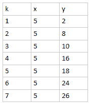
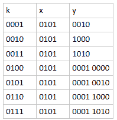
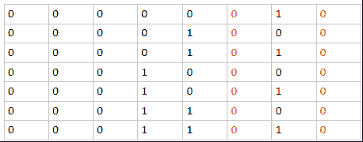
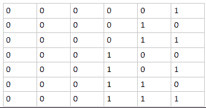

# 算法能力测评

## 1

现在有一个字符串，你要对这个字符串进行 n 次操作，每次操作给出两个数字：(p, l) 表示当前字符串中从下标为 p 的字符开始的长度为 l 的一个子串。你要将这个子串左右翻转后插在这个子串原来位置的正后方，求最后得到的字符串是什么。字符串的下标是从 0 开始的，你可以从样例中得到更多信息。

本题知识点

字符串 *模拟 C++工程师 golang 工程师 iOS 工程师 安卓工程师 运维工程师 前端工程师 算法工程师 测试工程师 PHP 工程师 Java 工程师 字节跳动 2017* *讨论

[嫑慌](https://www.nowcoder.com/profile/2553661)

```cpp

	var line = readline();

	var n = readline();

	for(var i=0;i<n;i++){

	    var line2 = readline().split(' ');

	    var start = parseInt(line2[0]);

	    var len = parseInt(line2[1]);

	    var temp = line.substr(start,len).split('').reverse().join('');

	    line = line.slice(0,start+len) + temp + line.slice(start+len);

	}

	print(line);

```

发表于 2018-10-05 16:55:49

* * *

[anybody](https://www.nowcoder.com/profile/126520)

```cpp
#include <iostream>
#include <string>
#include <vector>
#include <algorithm>
using namespace std;

int main()
{
	string st;
	while (cin >> st)
	{
		int n;
		cin >> n;
		while (n--)
		{
			int beg, len, index;
			cin >> beg >> len;
			string temp = st.substr(beg, len);
			index = beg + len;
			reverse(temp.begin(), temp.end());
			st.insert(index, temp);
		}
		cout << st << endl;
	}
	return 0;
}
```

发表于 2016-07-23 14:06:06

* * *

[yekongle123](https://www.nowcoder.com/profile/2251535)

```cpp
import java.util.Scanner;
public class Main {
    public static void main(String[] args){
        Scanner in = new Scanner(System.in);
        while(in.hasNext()){
            StringBuffer str =new StringBuffer( in.nextLine());
            int n = in.nextInt();    
            for(int i =0;i<n;i++){
                int start = in.nextInt();
                int end = start + in.nextInt();
                StringBuffer buffer = new StringBuffer(str.substring(start, end));    
                str.insert(end, buffer.reverse().toString()); 
            }
            System.out.println(str);
        }    
    }
}

```

发表于 2017-10-16 13:17:39

* * *

## 2

给定 x, k ，求满足 x + y = x | y 的第 k 小的正整数 y 。 | 是二进制的或(or)运算，例如 3 | 5 = 7。

比如当 x=5，k=1 时返回 2，因为 5+1=6 不等于 5|1=5，而 5+2=7 等于 5 | 2 = 7。

本题知识点

动态规划 查找 *Java 工程师 C++工程师 运维工程师 前端工程师 算法工程师 PHP 工程师 字节跳动 2017 golang 工程师 iOS 工程师 安卓工程师 测试工程师* *讨论

[牛客 66666666 号](https://www.nowcoder.com/profile/110943)

```cpp

```
#include <iostream>

using namespace std;

int main()
{
	long long x, k;
	cin>>x>>k;
	long long bitNum = 1;
	long long ans = 0;
	while(k)
	{
		if((x & bitNum) == 0)
		{
			ans += (bitNum * (k & 1));
			k >>= 1;
		}
		bitNum <<= 1;
	}
	cout<<ans<<endl;
	return 0;
}
```cpp

```

应该没有更简单的解法了-----解法说明------x+y=x|y 这里可以推出一个结论，x&y=0。也就是说，在二进制上看，x 取 1 的地方，y 必定不能取 1。从最低位考虑，若 x 与 y 在某一位上同时取 1，则 x+y 在该位上为 0，x|y 在该位上为 1，前面说这是最低一位 x y 同时取 1，也就是说没有更低位加法的进位，所以这里两个结果不相等，出现了矛盾。例子：x = 001010y = 110110x + y =  1000000x | y = 111110 偏差产生的原因是倒数第二位，x+y=0 x|y=1 且倒数第一位加法没有进位结论：**x 在二进制取 1 的位上，y 不能做出改变，只能取 0**----方法----有了上述结论，可以进一步推出只要在 x 取 0 的地方，y 可以做出改变例如 x = 10010010011y = 00000000(0)00   k = 0y = 00000000(1)00   k = 1y = 0000000(1)(0)00 k = 2y = 0000000(1)(1)00 k = 3y = 00000(1)0(0)(0)00 k = 4y = 00000(1)0(0)(1)00 k = 5...注意观察括号里的数，为 x 取 0 的比特位，而如果把括号里的数连起来看，正好等于 k。得出结论，**把 k 表示成二进制数，填入 x 取 0 的比特位，x 取 1 的比特位保持为 0，得到 y**。---代码说明---思路有了，接着就是代码，显然用位操作是最合适的方式。循环的思想是每次取得 k 的最低一位，填入到低位开始，x 中比特位为 0 的位置上。所以用 while 来判断 k 是否大于 0，若是，说明 k 还未完全填完循环体内，需要找到 x 当前可以填的位置，我们用 bitNum 来从右往左扫描 x 的每一位

```cpp
(x & bitNum) == 0 说明 x 该位为 0,可以把 k 的当前最后一位填入，用 (k & 1) 取出最后一位，用 ans += (bitNum * (k & 1)) 把 k 的最后一位填入到当前 bitNum 指向的位置。
填完后，k 右移一位，去掉已经被填过的最后一位，bitNum 也向左走一位，避免重复填入 x 的某个位置。
若 x 的某个位置为 1，则跳过该位置，向左走一位并观察是否可以填入。
两次 bitNum 向左走一位，合并成一句 bitNum <<= 1;
```

编辑于 2016-08-27 15:01:17

* * *

[D_L](https://www.nowcoder.com/profile/458841)

先上代码：

```cpp
#include <iostream>
#include <bitset>
using namespace std;

int main() {
    unsigned long long x, y = 1, k;
    cin >> x >> k;

    std::bitset<64> xbs(x), kbs(k);

    for (size_t i = 0, kpos = 0; i < xbs.size(); ++i) {
        if (! xbs.test(i)) { // xbs[i] == 0
            xbs.set(i, kbs[kpos++]);
        }
    }

    y = xbs.to_ullong();
    y ^= x;

    cout << y << endl;    

    return 0;
}

```

再来分析：此题很容易用代码描述，bool is_eq(x, y) {return x + y == x | y;}然后整个循环从 1 到 y，y 是 第 k 个 满足 is_eq() 的数。这样做没错，但是 测试用例给整个：x = 1073741802, k = 1073741823 这么大的数，显然暴力穷举就不合适了。但是可以举几个数字组合来找其中的规律：例如：k = 1 时，5 + 2 == 5 | 2k = 2 时，5 + 8 == 5 | 8k = 3 时，5 + 10  == 5 | 10k = 4 时，5 + 16  == 5 | 16k = 5 时，5 + 18  == 5 | 18…
转二进制
满足这个运算规律 x + y == x | y 的二进制有：0 + 0 == 0 | 01 + 0 == 1 | 01 + 1 !=  1 | 1 (只有这个不满足)所以 x y 各自相对应的二进制位不能同时为 1，换言之， x 中 当前位 为 1 时， 与之对应的 y 那一位 肯定是 0 所以 x 位为 1 的就确定了，可以去除 1X
Y
将 Y 中红色 的 0 去掉看看，得到一组新数据
这正是 从 1 2 3 4 5 6 7，由于 y 表是按照 k 从 1 递增的顺序得到的值。所以你有理由猜想 这组新数据正是 k ！X  Y K 之间 有了这个关系，就大胆的编写代码去验证吧。算法大概是，将 x 和 y 都转成 二进制串， 然后将 y 的二进制串依次塞进 x 串中为 0 的部位，得到的一个新值，把这个值中原先 x 为 1 的 位 都给改成 0，就能得到 y 值。比如 k = 3 = b(*1* *1)*, x = 5 = b(0101)第一步将 k 塞入 x， 得到 b(*1*1*1*1)， 第二步将原先 x 中为 1 的变成 0， 得到 b(*1*0*1*0) ， 即 y = 10

编辑于 2016-08-31 16:18:20

* * *

[超小白](https://www.nowcoder.com/profile/499570)

注释了下一个大神的 code，大家一块讨论

```cpp
#include <iostream>
using namespace std;
int main()
{
	long long x, k;
	cin >> x >> k;
	long long bitNum = 1;
	long long ans = 0;
	//目标是把 k 的各位依次填在 x 中是 0 的位上
	//bitNum 用来移动到 x 中零的位置，然后把 k 的最低位放在 x 的零位上, k 左移，将下一位变成最低位,bitNum 一直左移，知道 x 中的下一个为 0 的位上。
	while (k)
	{
		if ((x & bitNum) == 0) //x 中当前 bitNUM 为 0 的话,把 k 的最低位放在这儿
		{
			ans += (bitNum*(k & 1)); //k&1 是将 k 的最低位取出来, bitNum*(k&1)的结果就是得到 bitNum 位和当前 k 的最低位一样的一个数,而其它位都是 0
			//而 ans 原来的 bitNum 为肯定为 0，ans+(bitNum*(k&1)) 就将 k 的最低位放在 x 的这个零上了。
			k >>= 1;
		}

		bitNum <<= 1; //bitNum 的 1 一直左移到 x 中第 k 个零的位置
	}
	cout << ans << endl;
	return 0;
}

```

发表于 2016-08-11 22:32:38

* * *

## 3

经过深思熟虑之后，小贱君打算去 M 国闯一闯，那是一个古老的东方国度，传说有很多高阶魔法师，他想成为一名伟大的魔法师，将来征服星辰大海。
经过千辛万苦，小贱君终于来到了 M 国，不幸的是刚进城门小贱君就被 M 国的守城士兵困在了一种叫做“困兽之斗”的阵法之中。
士兵对小贱君说：“看到漂浮在你身边的宝石了吗？彩虹连接的两颗宝石可以任意交换位置，你需要通过一系列交换后使得宝石组成的字符串的字典序最小。若不能破阵，那还是请回吧！”
小贱君观察了一下周围的宝石，只见每颗宝石上标有一个小写字母，而且有一些宝石上通过彩虹与其他宝石相连。
琢磨了半天，他终于搞懂了这个阵法的意思：
若宝石系列为：dcba
其中有两道彩虹，分别是(0,1),(1,2),代表第一个位置上的宝石可以和第二个位置上的宝石互换，第二个位置上的宝石可以和第三个位置上的宝石互换，最终可以得到字典序最小的宝石系列：bcda。
作为小贱君的死党，你有什么方法帮助他破阵吗？

本题知识点

图 C++工程师 golang 工程师 iOS 工程师 安卓工程师 运维工程师 前端工程师 算法工程师 测试工程师 PHP 工程师 Java 工程师 乐视 2017

讨论

[胡哈哈哈](https://www.nowcoder.com/profile/5516120)

```cpp
#include <iostream>
#include <vector>
#include <string>
#include <algorithm>

using namespace std;

int find(vector<int> &, int);
void merge(vector<int> &, int, int);

int main() {
	string s;
	while (cin >> s) {
		int len = s.length();
		vector<int> indexs(len, -1);
		int cnt;
		cin >> cnt;
		for (int i = 0; i < cnt; ++i) {
			int from, to;
			cin >> from >> to;
			int froot = find(indexs, from);
			int troot = find(indexs, to);
			if (froot != troot) {
				merge(indexs, froot, troot);
			}
		}
		vector<vector<int>> mat(len);
		for (int i = 0; i < indexs.size(); ++i) {
			if (indexs[i] == -1) continue;
			int root = find(indexs, i);
			mat[root].push_back(i);
		}
		for (int i = 0; i < mat.size(); ++i) {
			vector<char> chs;
			for (int j = 0; j < mat[i].size(); ++j) {
				chs.push_back(s[mat[i][j]]);
			}
			sort(chs.begin(), chs.end());
			for (int j = 0; j < mat[i].size(); ++j) {
				s[mat[i][j]] = chs[j];
			}
		}
		cout << s << endl;
	}
	return 0;
}

int find(vector<int> &indexs, int i) {
	int ret = i;
	while (indexs[ret] >= 0) {
		ret = indexs[ret];
	}
	int q;
	for (int p = i; p != ret; p = q) {
		q = indexs[p];
		indexs[p] = ret;
	}
	return ret;
}

void merge(vector<int> &indexs, int i, int j) {
	int t;
	if (indexs[i] < indexs[j]) {
		indexs[i] += indexs[j];
		indexs[j] = i;
	} else {
		indexs[j] += indexs[i];
		indexs[i] = j;
	}
}
```

这是一个并查集问题，收集所有通过采用连通的节点，将这些节点按照字典序排序。

发表于 2016-07-10 21:15:03

* * *

[敲代码的怪叔叔](https://www.nowcoder.com/profile/704559)

```cpp
#include <iostream>
#include <cstdio>
#include <string>
#include <algorithm>

using namespace std;

int dsu[10001]={0};

int find(int x)
{
    int r=x;
    while(dsu[r]!=r)
        r=dsu[r];
    dsu[x]=r;
    return r;
}

void join(int x, int y)
{
    int fx=find(x);
    int fy=find(y);
    if(fx<fy)
        dsu[fy]=fx;
    else
        dsu[fx]=fy;
}

int main()
{
    string s;
    while(cin>>s)
    {
        int n;
        cin>>n;
        int len = s.size();
        for( int i=0; i<len; ++i)
            dsu[i]=i;
        while(n--)
        {
            int a,b;
            cin>>a>>b;
            join(a,b);
        }
        for(int i=0; i<len-1; ++i)
            for(int j=i+1; j<len; ++j)
            {
                int fj=find(i);
                int fj1=find(j);
                if(fj==fj1 && s[i] > s[j])
                    swap(s[i],s[j]);
            }
        cout<<s<<endl;
    }
    return 0;
}
```

编辑于 2016-06-22 13:59:34

* * *

[远方的范特西](https://www.nowcoder.com/profile/818351)

```cpp
// ***，通过了所有用例
//算法的思路：用一下例子说明
//dcba
//2
//0 1
//3 2
//s="dcba";
//vector<int> p 初始为{0000}
//根据
//2
//0 1
//3 2
//将 p 设置为{1122}
//也就是 s 的下标 0 1 对于 1，s 的下标 3 2 对应 2
//就是说把 s 中连成串的可以相互交换的字符的下标对应为同一个数字
//算了，玛德不知道怎么表达了，反正想看的自己看吧，主体思想在上面。
//#include "stdafx.h"
#include <iostream>
#include <vector>
#include <string>
#include <algorithm>
using namespace std;

bool cmp(char it1, char it2)
{
	return it1 < it2;
}

void getStr(string s, vector<vector<int>> arr)
{
	vector<int> p(s.size(), 0);
	int i = 0;
	int color = 1;
	for (; i < arr.size(); i++)
	{
		if (p[arr[i][0]] == 0 && p[arr[i][1]] == 0)
		{
			p[arr[i][0]] = color;
			p[arr[i][1]] = color;
			color++;
		}
		if (p[arr[i][0]] == 0 && p[arr[i][1]] != 0)
		{
			p[arr[i][0]] = p[arr[i][1]];
		}
		if (p[arr[i][0]] != 0 && p[arr[i][1]] == 0)
		{
			p[arr[i][1]] = p[arr[i][0]];
		}
		if (p[arr[i][0]] != 0 && p[arr[i][1]] != 0 && p[arr[i][0]] != p[arr[i][1]])
		{
			int tmpColor = p[arr[i][1]];
			for (int j = 0; j < s.size(); j++)
			{
				if (p[j] == tmpColor)
				{
					p[j] = p[arr[i][0]];
				}
			}
		}
	}
	int color2 = 1;
	while (color2 <= color)
	{
		vector<int> index;//保存字符的下标
		vector<char> sTmp;
		for (int j = 0; j < s.size(); j++)
		{
			if (p[j] == color2)
			{
				index.push_back(j);
				sTmp.push_back(s[j]);
			}
		}
		sort(sTmp.begin(), sTmp.end(), cmp);
		for (int j = 0; j < index.size(); j++)
		{
			s[index[j]] = sTmp[j];
		}
		sTmp.clear();
		index.clear();
		color2++;
	}
	cout << s << endl;
}

int main()
{
	string s;
	vector<vector<int>> arr;
	int n;
	while (cin >> s)
	{
		cin >> n;
		for (int i = 0; i < n; i++)
		{
			int n1, n2;
			cin >> n1 >> n2;
			if (n1 > n2)
			{
				int t = n1;
				n1 = n2;
				n2 = t;
			}
			vector<int> tmp;
			tmp.push_back(n1);
			tmp.push_back(n2);
			arr.push_back(tmp);
		}
		getStr(s, arr);
		arr.clear();
		s.clear();
	}
    return 0;
}

```

编辑于 2016-06-22 21:58:01

* * ***