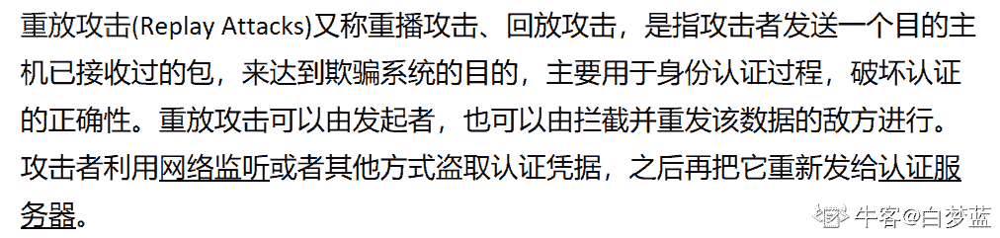
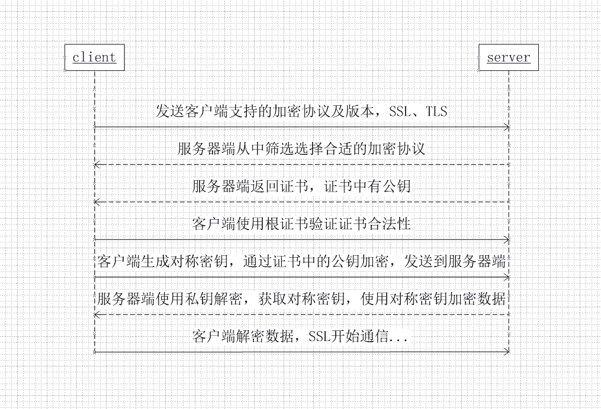

# 滴滴出行 2017 秋招安全岗笔试真题汇总

## 1

下面对于 cookie 的描述中错误的是？

正确答案: A   你的答案: 空 (错误)

```cpp
Cookie 通过 HTTP Headers 从浏览器端发送到服务器端并存储在服务器端
```

```cpp
Cookie 的大小限制在 4kb 左右，对于复杂的存储需求来说是不够用的
```

```cpp
如果在一台计算机中安装多个浏览器，每个浏览器都会以独立的空间存放 cookie
```

```cpp
由于在 HTTP 请求中的 Cookie 是明文传递的，所以安全性成问题
```

本题知识点

安全工程师 滴滴 2017

讨论

[树上的朋友 rocketman](https://www.nowcoder.com/profile/830541)

选 A，描述反了，cookie 应该是由服务端发送到客户浏览器端并保存在浏览器端

发表于 2016-12-21 11:12:04

* * *

## 2

现有某函数，其方法声明为：int func(int x)

该函数对应的 ARM 汇编代码如下：

0000016A                 PUSH    {LR}

0000016C                 MOVS    R3, #1

0000016E                 ADDS    R1, R3, #0

00000170 loc_170

00000170                 CMP     R0, #0

00000172                 BLE     loc_184

00000174                 MOVS    R2, R0

00000176                 MULS    R2, R3

00000178                 ADDS    R3, R2, #1

0000017A                 TST     R0, R1

0000017C                 BEQ     loc_180

0000017E                 ADDS    R3, R2, #0

00000180 loc_180

00000180                 SUBS    R0, #1

00000182                 B       loc_170

00000184 loc_184

00000184                 MOVS    R0, R3

00000186                 POP     {PC}

从上面的汇编代码可以得出 func(3)的值等于

正确答案: C   你的答案: 空 (错误)

```cpp
5
```

```cpp
6
```

```cpp
7
```

```cpp
8
```

```cpp
9
```

```cpp
10
```

本题知识点

安全工程师 滴滴 2017

讨论

[My201810251815499](https://www.nowcoder.com/profile/694941687)

空着

发表于 2019-06-01 01:51:37

* * *

[(＾＿-)](https://www.nowcoder.com/profile/4750646)

执行到倒数第一步时 r0=0，r1=1，r2=1，r3 依次变为 1、1+1=2、1+2=3、3+3+1=7，即 r3=7，arm 使用 r0 做函数返回值，故最终执行 movs r0，r3 后 r0=7。

发表于 2017-09-02 22:03:46

* * *

## 3

安卓系统中所有 App 进程是下面的哪个进程 fork 产生的

正确答案: C   你的答案: 空 (错误)

```cpp
init
```

```cpp
system_server
```

```cpp
zygote
```

```cpp
kthreadd
```

本题知识点

安全工程师 滴滴 2017

讨论

[gifish](https://www.nowcoder.com/profile/6825181)

*   **kthreadd 进程**: 是所有内核进程的父进程
*   **init 进程** ： 是所有用户进程的父进程(或者父父进程)
*   **zygote 进程** ： 是所有上层 Java 进程的父进程，另外 zygote 的父进程是 init 进程。

http://codecloud.net/10782.html

发表于 2017-04-27 18:21:44

* * *

[我想吃一个扇贝](https://www.nowcoder.com/profile/377568)

选 C 这个是 Android 框架的主要进程，所有的 App 进程以及系统服务进程 SystemServer 都是由 Zygote 进程 Fork 出来的

发表于 2016-12-27 21:13:11

* * *

## 4

以下关于内存文件 mmap 映射的说法不正确的是

正确答案: C   你的答案: 空 (错误)

```cpp
当文件被映射到进程地址空间后，进程可以像访问普通内存一样对文件进行访问
```

```cpp
子进程会继承父进程通过 mmap 映射的地址空间
```

```cpp
使用 mmap 必须指定映射到内存的具体文件
```

```cpp
同一个文件的不同段内容可以分别被映射到不同的内存空间
```

本题知识点

安全工程师 滴滴 2017

讨论

[嘻嘻 818](https://www.nowcoder.com/profile/7295134)

 mmap 返回的是用户进程空间的虚拟地址，在 stack 和 heap 之间的空闲逻辑空间(虚拟空间) 就是用来提供映射的，文件将会被映射到这一区域的某块虚拟内存上，具体哪一块若是用户没有指定，则由内核来分配。一般上，用户不该去指定这个映射的起始地址，因为栈和堆都是在向块区域进行扩展的，所以这块区域的大小会一直在变化，若是用户指定，用户根本就无法知道这块地址是否被堆用去了还是被栈用去了。

发表于 2019-04-15 14:33:59

* * *

## 5

常见的网络嗅探器，以下哪个不是？

正确答案: B   你的答案: 空 (错误)

```cpp
tcpdump
```

```cpp
wvs
```

```cpp
wireshark
```

```cpp
sniffit
```

本题知识点

安全工程师 滴滴 2017

讨论

[我想吃一个扇贝](https://www.nowcoder.com/profile/377568)

Web Vulnerability Scanner 是一个自动化的 Web 应用程序安全测试工具，而不是一个网络嗅探器，因此选 B。而其他均为典型的网络嗅探器。

发表于 2016-12-27 21:19:45

* * *

## 6

以下算法不能用于文本加密的是

正确答案: C   你的答案: 空 (错误)

```cpp
RC4
```

```cpp
RSA
```

```cpp
MD5
```

```cpp
DES
```

本题知识点

安全工程师 滴滴 2017

讨论

[我想吃一个扇贝](https://www.nowcoder.com/profile/377568)

选 C，MD5 是生成消息摘要的加密算法，因为其无秘钥，因此不用于文本加密，主要用于数字签名等用途，而其他算法则均为典型的文本加密算法~

发表于 2016-12-27 21:16:21

* * *

## 7

下列关于 Android 数字签名描述错误的是：

正确答案: D   你的答案: 空 (错误)

```cpp
所有的应用程序都必须有数字证书，Android 系统不会安装一个没有数字证书的应用程序
```

```cpp
Android 程序包使用的数字证书可以是自签名的，不需要一个权威的数字证书机构签名认证
```

```cpp
数字证书都是有有效期的，Android 只是在应用程序安装的时候才会检查证书的有效期。如果程序已经安装在系统中，即使证书过期也不会影响程序的正常功能。
```

```cpp
如果要正式发布一个 Android 程序，可以使用集成开发工具生成的调试证书来发布。
```

本题知识点

安全工程师 滴滴 2017

讨论

[泰坦](https://www.nowcoder.com/profile/3956150)

DAndroid 通过数字签名来标识应用程序的作者和在应用程序之间建立信任关系，不是用来决定最终用户可以安装哪些应用程序。这个数字签名由应用程序的作者完成，并不需要权威的数字证书签名机构认证，它只是用来让应用程序包自我认证的。APK 程序的两种模式：调试模式和发布模式。（1）调试模式    在调试模式下， ADT 会自动的使用 debug 密钥为应用程序签名，因此我们可以直接运行程序。**debug 密钥：** 一个名为 debug.keystore 的文件**两个风险：**debug 签名的应用程序有这样两个风险：
1）debug 签名的应用程序不能在 Android Market 上架销售，它会强制你使用自己的签名；
2）debug.keystore 在不同的机器上所生成的可能都不一样，就意味着如果你换了机器进行 apk 版本升级，那么将会出现上面那种程序不能覆盖安装的问题。不要小视这个问题，如果你开发的程序只有你自己使用，当然无所谓，卸载再安装就可以了。但要是你的软件有很多使用客户，这就是大问题了，就相当于软件不具备升级功能！所以一定要有自己的数字证书来签名;（2）发布模式 **当要发布程序时，开发者就需要使用自己的数字证书给 apk 包签名****使用自己的数字证书给 APK 签名的两种方法：**

(1)通过 DOS 命令来对 APK 签名。

(2)使用 ADT Export Wizard 进行签名

编辑于 2017-06-07 15:12:47

* * *

## 8

现有 Android 应用内某函数，其方法声明为：private int func()

该函数对应的 smali 反汇编代码如下：

.method private func()I

00000000  const-string            v2, "Didichuxing"

00000004  const/4                 v0, 0

00000006  const/4                 v1, 0

00000008  invoke-virtual          String->length()I, v2

0000000E  move-result             v3

00000010  if-ge                   v1, v3, :2E

00000014  const/16                v3, 0x0069

00000018  invoke-virtual          String->charAt(I)C, v2, v1

0000001E  move-result             v4

00000020  if-ne                   v3, v4, :28

00000024  add-int/lit8            v0, v0, 0x01

00000028  add-int/lit8            v1, v1, 0x01

0000002C  goto                    :8

0000002E  return                  v0

.end method

从上面的 smali 反汇编代码可以得出该方法的返回值等于

正确答案: C   你的答案: 空 (错误)

```cpp
1
```

```cpp
2
```

```cpp
3
```

```cpp
4
```

```cpp
5
```

本题知识点

安全工程师 滴滴 2017

讨论

[I 路人甲 I](https://www.nowcoder.com/profile/3680014)

int v1=v0=0;string v2="Didichuxing";int v3=string.length(v2)=11;for(;v1!=v3;v1++){    v3=0x0069=105='i';
    v4=string.charAt(v2,v1);//就是遍历 V2 看是否有‘i’
    if(v3=v4)//如果有‘i’
    v0++;
}return v0;

发表于 2017-08-26 11:13:09

* * *

[木槿@花开](https://www.nowcoder.com/profile/681662)

这道题就是计算这个字符串中 i 出现的次数。

发表于 2017-08-26 10:53:31

* * *

## 9

凯撒（Caesar)密码是一种基于字符替换的对称式加密方法，它是通过对 26 个英文字母循环移位和替换来进行编码的。设待加密的消息为"Didi Family"，加密后的密文是"Nsns PkwsvI"，则采用的密匙 k 是

正确答案: A   你的答案: 空 (错误)

```cpp
10
```

```cpp
11
```

```cpp
13
```

```cpp
15
```

本题知识点

安全工程师 滴滴 2017

讨论

[꧁❦热心市民李先生💎❦꧂](https://www.nowcoder.com/profile/907447335)

D-N，移动 10 位

发表于 2019-08-09 23:47:33

* * *

## 10

当一个 HTTPS 站点的证书存在问题时，浏览器就会出现警告信息以提醒浏览者注意，下列描述中哪一条不是导致出现提示的必然原因？

正确答案: D   你的答案: 空 (错误)

```cpp
证书过期
```

```cpp
证书没有被浏览器信任
```

```cpp
证书的 CN 与实际站点不符
```

```cpp
浏览器找不到对应的证书颁发机构
```

本题知识点

安全工程师 滴滴 2017

## 11

攻击者采用某种手段,使用户访问某网站时获得一个其他网站的 IP 地址,从而将用户的访问引导到其他网站,这种攻击手段称为?

正确答案: B   你的答案: 空 (错误)

```cpp
ARP 欺骗攻击
```

```cpp
DNS 欺骗攻击
```

```cpp
暴力攻击
```

```cpp
重放攻击
```

本题知识点

安全工程师 滴滴 2017

讨论

[三余](https://www.nowcoder.com/profile/3654348)

ARP 欺骗：由于局域网的网络流通不是根据 IP 地址进行，而是根据 MAC 地址进行传输。所以，MAC 地址在 A 上被伪造成一个不存在的 MAC 地址，这样就会导致网络不通，A 不能 Ping 通 C！这就是一个简单的 ARP 欺骗 DNS 欺骗就是攻击者冒充[域名服务器](https://baike.baidu.com/item/%E5%9F%9F%E5%90%8D%E6%9C%8D%E5%8A%A1%E5%99%A8)的一种欺骗行为。 原理：如果可以冒充域名服务器，然后把查询的 IP 地址设为攻击者的 IP 地址，这样的话，用户上网就只能看到攻击者的主页，而不是用户想要取得的网站的主页了，这就是 DNS 欺骗的基本原理。重放攻击(Replay Attacks)又称重播攻击、回放攻击，是指攻击者发送一个目的主机已接收过的包，来达到欺骗系统的目的，主要用于身份认证过程，破坏认证的正确性。重放攻击可以由发起者，也可以由拦截并重发该数据的敌方进行。攻击者利用[网络监听](https://baike.baidu.com/item/%E7%BD%91%E7%BB%9C%E7%9B%91%E5%90%AC)或者其他方式盗取认证凭据，之后再把它重新发给[认证服务器](https://baike.baidu.com/item/%E8%AE%A4%E8%AF%81%E6%9C%8D%E5%8A%A1%E5%99%A8)。 

发表于 2018-04-22 17:29:50

* * *

## 12

下面关于 RSA 算法的描述,不正确的是?

正确答案: D   你的答案: 空 (错误)

```cpp
RSA 是非对称加密算法
```

```cpp
RSA 的运行速度相比 AES 算法要慢很多
```

```cpp
RSA 的安全性依赖于大数分解
```

```cpp
TLS/SSL 协议中 RSA 的公钥长度一般为 128 位或 256 位
```

本题知识点

安全工程师 滴滴 2017

讨论

[寒腿妞](https://www.nowcoder.com/profile/596400)

答案是：D
TLS/SSL 协议中 RSA 的公钥长度一般为 1024

发表于 2016-12-27 20:43:52

* * *

## 13

攻击者截获并记录了从 A 到 B 的数据，然后又从早些时候所截获的数据中提取出信息重新发往 B 称为

正确答案: D   你的答案: 空 (错误)

```cpp
中间人攻击
```

```cpp
口令猜测器和字典攻击
```

```cpp
强力攻击
```

```cpp
重放攻击
```

本题知识点

安全工程师 滴滴 2017

讨论

[白梦蓝](https://www.nowcoder.com/profile/825466432)



编辑于 2020-07-15 15:37:36

* * *

## 14

以下哪一项不是针对操作体统的安全保护措施？

正确答案: B   你的答案: 空 (错误)

```cpp
SELINUX
```

```cpp
nProtect
```

```cpp
DEP
```

```cpp
ASLR
```

本题知识点

安全工程师 滴滴 2017

讨论

[三余](https://www.nowcoder.com/profile/3654348)

SELinux：Security-Enhanced LinuxnProtect:韩国 nProtect 键盘加密保护系统是一种针对个人用户信息安全的产品，它用来保护用户的信息不被黑客的键盘记录程序所获取。通过键盘加密技术即使用户的 PC 中有木马程序，黑客也无法正确读取输入的键盘信息，从而根本上防止了互联网用户在进行网上交易、网络游戏以及使用电子银行时可能出现的帐号被盗的情况。当用户连接到互联网时，键盘驱动程序会自动加载并执行，利用键盘驱动程序用户的键盘信息通过 128 位的算法进行加密 DEP:Data Execution Prevention。[数据执行保护](https://baike.baidu.com/item/%E6%95%B0%E6%8D%AE%E6%89%A7%E8%A1%8C%E4%BF%9D%E6%8A%A4)(DEP) 是一套软硬件技术，能够在内存上执行额外检查以帮助防止在系统上运行恶意代码。ASLR:Address space layout randomization,是一种针对[缓冲区溢出](https://baike.baidu.com/item/%E7%BC%93%E5%86%B2%E5%8C%BA%E6%BA%A2%E5%87%BA)的[安全保护技术](https://baike.baidu.com/item/%E5%AE%89%E5%85%A8%E4%BF%9D%E6%8A%A4%E6%8A%80%E6%9C%AF)，通过对[堆](https://baike.baidu.com/item/%E5%A0%86)、[栈](https://baike.baidu.com/item/%E6%A0%88/12808149)、共享库映射等线性区布局的随机化，通过增加攻击者预测目的地址的难度，防止攻击者直接定位攻击代码位置，达到阻止[溢出攻击](https://baike.baidu.com/item/%E6%BA%A2%E5%87%BA%E6%94%BB%E5%87%BB)的目的

发表于 2018-04-22 17:38:52

* * *

[二祁](https://www.nowcoder.com/profile/4625765)

B：nProtect nProtect 是设计用于保护个人电脑终端不被病毒和黑客程序感染的新概念的基于网络的反黑客和反病毒的工具。它帮助确保所有输入个人电脑终端的信息在网络上不落入[黑客](https://baike.baidu.com/item/%E9%BB%91%E5%AE%A2/118396)手中。

发表于 2017-08-25 12:38:16

* * *

## 15

以下哪个算法不是对称加密算法

正确答案: C   你的答案: 空 (错误)

```cpp
DES
```

```cpp
RC5
```

```cpp
ECDH
```

```cpp
AES
```

本题知识点

安全工程师 滴滴 2017

讨论

[木槿@花开](https://www.nowcoder.com/profile/681662)

ECDH 是密钥协商算法

发表于 2017-08-26 10:56:20

* * *

## 16

文件 aaa 的访问权限为 rw-r--r--,现要增加所有用户的执行权限和同组用户的写权限，下列哪些命令是正确的？

正确答案: A D   你的答案: 空 (错误)

```cpp
chmod a+x g+w aaa
```

```cpp
chmod 764 aaa
```

```cpp
chmod o+x g+w aaa
```

```cpp
chmod 775 aaa
```

本题知识点

安全工程师 滴滴 2017

讨论

[代码会说话](https://www.nowcoder.com/profile/8532689)

A,D a+x 表示给所有用户执行权限。 g+w 表示给组用户加写权限。 a：all 表示所有用户 o: other 表示其他用户 g: group 表示组用户 u: user 表示所属用户 +：表示增加权限 -：表示减少权限 =：表示指定具体权限 数字权限具体分解意思。 4:r 2:w 1:x

发表于 2019-04-11 09:44:00

* * *

[三余](https://www.nowcoder.com/profile/3654348)

文件所有者       组                         其他人 rwx                    rwx                        rwxrw-r--r--添加所有用户的执行权限和同组用户的写权限也就是变成 rwx rwx r-x111 111 1017     7      5

发表于 2018-04-22 17:46:18

* * *

[你好 127](https://www.nowcoder.com/profile/1867884)

linux 下用户权限问题，r 读权限 4w 写权限 2x 执行权限 1o 所有者 g 组 a 所有人

发表于 2017-08-25 16:10:59

* * *

## 17

文件 aaa 的内容如下：

1001:1

1002:2

1003:1

1004:2

期望处理 aaa 文件得到以下输入结果：

1001

1003

以下命令能满足的有

正确答案: C D   你的答案: 空 (错误)

```cpp
grep "1$" aaa | awk -d: '{print $1}'
```

```cpp
grep "1$" aaa | cut -d: -f0
```

```cpp
sed '/:2/d' aaa | sed 's/:1//g'
```

```cpp
awk -F: '{if ($2==1){print $1}}' aaa
```

本题知识点

安全工程师 滴滴 2017

## 18

下列关于 SSL 的描述中，正确的有

正确答案: A B C   你的答案: 空 (错误)

```cpp
SSL 即安全套接字层，是一种安全协议，它为网络的通信提供私密性，工作在应用层和传输层之间。
```

```cpp
.SSL 能加密数据以防止数据中途被窃取,维护数据的完整性，确保数据在传输过程中不被改变。
```

```cpp
SSL 实际上是共同工作的两个协议，SSL 记录协议和 SSL 握手协议。
```

```cpp
SSL 握手协议为高层协议提供基本的安全服务。
```

本题知识点

安全工程师 滴滴 2017

讨论

[艰勿拆](https://www.nowcoder.com/profile/2871914)

A B CD 项 为高层协议提供安全服务的时记录协议层。

发表于 2017-03-01 23:35:12

* * *

[寒腿妞](https://www.nowcoder.com/profile/596400)

答案是：B
A  SSL 工作在传输层
C  SSL 协议可分为两层： SSL 记录协议层和 SSL 握手协议层，SSL 握手协议层包括 SSL 握手协议、SSL 密码参数修改协议、应用数据协议和 SSL 告警协议。
D  SSL 记录协议为高层协议提供基本的安全服务。

发表于 2016-12-27 20:20:33

* * *

## 19

以下说法中，哪些说法是正确的

正确答案: A C D   你的答案: 空 (错误)

```cpp
缓冲区溢出指的是通过向程序的缓冲区写入超出其长度的内容，造成缓冲区的溢出，从而破坏程序的堆栈，使程序转而执行其他的指令，以达到攻击的目的。
```

```cpp
在 C/C++语言中，缓冲区溢出的任何尝试通常都会被语言本身自动检测并阻止。
```

```cpp
检查缓冲区长度、GS 编译选项、堆栈保护可以防御溢出攻击
```

```cpp
溢出是程序设计者设计时的不足所带来的错误。
```

本题知识点

安全工程师 滴滴 2017

## 20

以下哪种加密方案是相对最安全的？

正确答案: C   你的答案: 空 (错误)

```cpp
RSA 加密算法，密钥长度 512 位
```

```cpp
AES 加密算法，选择 ECB 模式，密钥长度 128 位
```

```cpp
AES 加密算法，选择 CBC 模式，密钥长度 128 位
```

```cpp
DES 算法
```

本题知识点

安全工程师 滴滴 2017

讨论

[李想 1234](https://www.nowcoder.com/profile/4933921)

RSA 算法通常秘钥需要 1024 位以上 AES 算法，ECB 模式对所有的块采用相同的秘钥进行加密，安全性不太高 CBC 模式对第一块加密后，后面的块加密秘钥依此与前边的块采取一定算法生成，同样的数据块加密结果不同，安全性较高，但加密过程无法并行，速度较慢

发表于 2017-08-25 18:49:49

* * *

## 21

Linux 系统下，关于权限描述正确的是：

正确答案: C D   你的答案: 空 (错误)

```cpp
文件权限描述"-rwxrw-r-x"对应权限值为 754
```

```cpp
文件权限描述"drw-rw-rw-"中的首字符'd'表示该文件为软链接文件
```

```cpp
文件权限值为 723，表示其他用户可以执行该文件
```

```cpp
文件权限值 744，表示除了文件所有者外其他用户不可执行
```

本题知识点

安全工程师 滴滴 2017

讨论

[STDOUT_FILENO](https://www.nowcoder.com/profile/3644106)

D，对于普通用户而言，要想执行（x）文件，必须要有读（r）权限；对于 root 用户而言，只要有执行（x）就行，不一定要有读（r）权限

发表于 2017-04-24 16:58:53

* * *

[卡夫卡咖啡](https://www.nowcoder.com/profile/8917256)

- 第一个字符代表文件（- ）、目录（ d ），链接（ l ）

- 其余字符每 3 个一组（ rwx ），读（ r ）、写（ w ）、执行（ x ）

- 第一组 rwx ：文件所有者的权限是读、写和执行

- 第二组 rw- ：与文件所有者同一组的用户的权限是读、写但不能执行

- 第三组 r-- ：不与文件所有者同组的其他用户的权限是读不能写和执行

发表于 2017-03-31 22:17:41

* * *

## 22

同一进程下的线程可以共享以下？

正确答案: B D   你的答案: 空 (错误)

```cpp
stack
```

```cpp
data section
```

```cpp
register set
```

```cpp
file fd
```

本题知识点

安全工程师 滴滴 2017

讨论

[木槿@花开](https://www.nowcoder.com/profile/681662)

可以共享的有：进程的代码段、进程的共有数据、进程打开的文件描述符、信号的处理器、进程的当前目录和进程用户 ID 、进程用户组 ID 不可以共享的有：线程 ID、寄存器组的值、线程的堆栈、错误返回码、线程的信号屏蔽码、线程的优先级

发表于 2017-08-26 11:05:05

* * *

[夕一啊](https://www.nowcoder.com/profile/3913740)

D 文件描述符？没看懂这个选项是什么意思

编辑于 2017-09-07 15:49:53

* * *

## 23

下列哪部分代码片段如果使用不当会导致安全漏洞？

正确答案: A C D   你的答案: 空 (错误)

```cpp
<?php
...
$sql = "select * from admin where id=".$_GET['id'];
$result = mysql_query($sql);
...
```

```cpp
<?php
$username = $_GET['name'];
echo  htmlspecialchars($username);
...
```

```cpp
<?php
...
$file = $_GET['file'];
echo file_get_contents($file);
...
```

```cpp
<?php
$string = $_GET['text'];
$pattern = '/(\w+) (\d+), (\d+)/ie';
$replacement = '${1}1,$3';
echo preg_replace($pattern, $replacement, $string);
?>
```

本题知识点

安全工程师 滴滴 2017

讨论

[DC 梁朝伟](https://www.nowcoder.com/profile/937205440)

 preg_replace 使用了 /e 模式，导致可以代码执行。[`mochazz.github.io/2018/08/13/%E6%B7%B1%E5%85%A5%E7%A0%94%E7%A9%B6preg_replace%E4%B8%8E%E4%BB%A3%E7%A0%81%E6%89%A7%E8%A1%8C/#%E6%A1%88%E4%BE%8B`](https://mochazz.github.io/2018/08/13/%E6%B7%B1%E5%85%A5%E7%A0%94%E7%A9%B6preg_replace%E4%B8%8E%E4%BB%A3%E7%A0%81%E6%89%A7%E8%A1%8C/#%E6%A1%88%E4%BE%8B) 

发表于 2019-09-20 04:26:15

* * *

## 24

文件完整性校验所使用的加密算法有哪些

正确答案: A B   你的答案: 空 (错误)

```cpp
md5
```

```cpp
sha1
```

```cpp
des
```

```cpp
rsa
```

本题知识点

安全工程师 滴滴 2017

## 25

浏览器和服务器在基于 https 进行请求链接到数据传输过程中，用到了如下哪些技术：

正确答案: A B C D   你的答案: 空 (错误)

```cpp
非对称加密技术
```

```cpp
对称加密技术
```

```cpp
散列（哈希）算法
```

```cpp
数字证书
```

本题知识点

安全工程师 滴滴 2017

## 26

下列哪些函数可能导致缓冲区溢出?

正确答案: A B C   你的答案: 空 (错误)

```cpp
wcscpy
```

```cpp
vsprintf
```

```cpp
scanf
```

```cpp
strcat_s
```

本题知识点

安全工程师 滴滴 2017

讨论

[木槿@花开](https://www.nowcoder.com/profile/681662)

A 也会导致啊，为啥不选啦

发表于 2017-08-26 11:08:15

* * *

## 27

iOS 平台上常见的 Hook 框架有:

正确答案: D   你的答案: 空 (错误)

```cpp
Xposed
```

```cpp
Intent Fuzz
```

```cpp
Drozer
```

```cpp
Substrate
```

本题知识点

安全工程师 滴滴 2017

讨论

[shiyan 娃娃](https://www.nowcoder.com/profile/612398)

```cpp
Android Hook 框架：Xposed。
Android 漏洞挖掘工具：Drozer，Intent Fuzzer。
```

发表于 2017-08-14 11:46:09

* * *

## 28

黑客通过以下哪种攻击方式，可能大批量获取网站注册用户的身份信息

正确答案: A B C   你的答案: 空 (错误)

```cpp
XSS
```

```cpp
CSRF
```

```cpp
越权
```

```cpp
以上都不可以
```

本题知识点

安全工程师 滴滴 2017

讨论

[嘻嘻 818](https://www.nowcoder.com/profile/7295134)

利用 XSS 存储型，可以在论坛个人签名处弄恶意脚本，凡是打开页面的用户都执行恶意脚本。利用 CSRF 漏洞，盗取用户身份干坏事。作用在个人用户上不大可能获取批量用户，要是作用在管理员上就如同越权访问。越权直接访问数据库危害就更大了。

发表于 2019-04-16 10:11:04

* * *

## 29

使用以下哪些工具可以直接调试安卓 app 代码逻辑？

正确答案: C D   你的答案: 空 (错误)

```cpp
baksmali
```

```cpp
ddms
```

```cpp
IDA
```

```cpp
gdb
```

本题知识点

安全工程师 滴滴 2017

## 30

Android 应用中导致 HTTPS 中间人攻击的原因有？

正确答案: A B C   你的答案: 空 (错误)

```cpp
没有对 SSL 证书校验
```

```cpp
没有对主机名进行校验
```

```cpp
SSL 证书被泄露
```

```cpp
使用 WIFI 连接网络
```

本题知识点

安全工程师 滴滴 2017

讨论

[jaylen](https://www.nowcoder.com/profile/340994250)

ABCA: 没有进行证书验证，导致身份伪造 B：没有对主机名进行验证，导致身份伪造 C：SSL 证书泄露，直接拿来用就完事

编辑于 2019-09-17 20:45:22

* * *

## 31

外部某平台报告公司产品存在 Webshell 漏洞。老板指定身为安全工程师的你全权协调处理此事，请思考，你需要做些什么

你的答案

本题知识点

安全工程师 滴滴 2017

讨论

[门半掩](https://www.nowcoder.com/profile/2670764)

webshell 漏洞？是内部人员留的后门吗？ 听起来有点不习惯...1、先备份数据，如果可以，在不影响业务的情况下，先暂时上线入侵未发生前使用的备份 2、删除 webshell，再查找一下有没有其他后门，一并清理干净 3、对于外部入侵，还要分析系统日志， 弄懂 weshell 是如何上传的(入侵过程)4、根据漏洞成因编写补丁，做好数据备份，发布补丁，恢复上线正式的产品 5、在取得许可情况下再次对产品进行安全评估和加固。评估和加固过程同样遵守先备份后评估测试、加固，最后上线正式版本的过程

编辑于 2017-03-27 03:27:46

* * *

[kylinkylin](https://www.nowcoder.com/profile/5509004)

1.打开我的 mac。
2.全权协调处理此事。
3.合上 mac，下班。

发表于 2018-03-26 14:57:16

* * *

[zhangweipengsh](https://www.nowcoder.com/profile/985166464)

1.联系平台获取详细信息 2.入侵调查（主机、网络）3.系统漏洞分析 4.问题修复 5.联系平台消除影响 6.举一反三，排查环境中同类问题，评估环境风险并进行针对性加固

发表于 2019-10-21 17:00:12

* * *

## 32

自行编写一段代码，要求代码包含 UAF(Use After Free)漏洞。假设该代码运行在内核中，简述普通用户如何利用代码中的 UAF 漏洞提升权限

你的答案

本题知识点

安全工程师 滴滴 2017

## 33

简述客户端 App 签名验证的原理和基本过程

你的答案

本题知识点

安全工程师 滴滴 2017

## 34

简述一次 https 通信建立的全过程

你的答案

本题知识点

安全工程师 滴滴 2017

讨论

[正能量 y 先生](https://www.nowcoder.com/profile/420034185)



发表于 2019-04-13 13:52:59

* * *

[寒腿妞](https://www.nowcoder.com/profile/596400)

一次 https 通信建立的全过程：
1\. 建立 TCP 连接
在 HTTP 工作开始之前，Web 浏览器首先要通过网络与 Web 服务器建立连接，该连接是通过 TCP 来完成的，该协议与 IP 协议共同构建 Internet，即著名的 TCP/IP 协议族，因此 Internet 又被称作是 TCP/IP 网络。HTTP 是比 TCP 更高层次的应用层协议，根据规则，只有低层协议建立之后才能，才能进行更层协议的连接，因此，首先要建立 TCP 连接，一般 TCP 连接的端口号是 80。
2\. Web 浏览器向 Web 服务器发送请求命令
一旦建立了 TCP 连接，Web 浏览器就会向 Web 服务器发送请求命令。
3\. Web 浏览器发送请求头信息
浏览器发送其请求命令之后，还要以头信息的形式向 Web 服务器发送一些别的信息，之后浏览器发送了一空白行来通知服务器，它已经结束了该头信息的发送。
4\. Web 服务器应答
客户机向服务器发出请求后，服务器会客户机回送应答， HTTP/1.1 200 OK ，应答的第一部分是协议的版本号和应答状态码。
5\. Web 服务器发送应答头信息
正如客户端会随同请求发送关于自身的信息一样，服务器也会随同应答向用户发送关于它自己的数据及被请求的文档。
6\. Web 服务器向浏览器发送数据
Web 服务器向浏览器发送头信息后，它会发送一个空白行来表示头信息的发送到此为结束，接着，它就以 Content-Type 应答头信息所描述的格式发送用户所请求的实际数据。
7\. Web 服务器关闭 TCP 连接
一般情况下，一旦 Web 服务器向浏览器发送了请求数据，它就要关闭 TCP 连接，然后如果浏览器或者服务器在其头信息加入了这行代码：
Connection:keep-alive
TCP 连接在发送后将仍然保持打开状态，于是，浏览器可以继续通过相同的连接发送请求。保持连接节省了为每个请求建立新连接所需的时间，还节约了网络带宽。

发表于 2016-12-27 20:10:14

* * *

## 35

请分析滴滴出行 APP 的登录功能可能面临的安全风险或漏洞，并提供相应的解决方案。

你的答案

本题知识点

安全工程师 滴滴 2017

讨论

[嘻嘻 818](https://www.nowcoder.com/profile/7295134)

 1\. 暴力破解用户名和密码。         登录失败后写入登录日志，1 小时内最多尝试 5 次。2\. 重放攻击中间人截获数据包，修改后再另一台手机重复发送给服务器。        数据包中包含时间，并校验数据包完整性。3\. SQL 注入攻击        使用安全函数转义。4\. 密码泄露        加密传输登录信息。

发表于 2019-04-16 10:50:09

* * *

## 36

请说出常见的安全漏洞类型及漏洞原理

你的答案

本题知识点

安全工程师 滴滴 2017