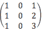

# 滴滴出行 2017 秋招算法岗笔试真题汇总

## 1

下列选项中，用来求解加权有向图的最短路径的算法是：

正确答案: A   你的答案: 空 (错误)

```cpp
Ford-Bellman 算法
```

```cpp
KM 算法
```

```cpp
深度优先检索算法
```

```cpp
广度优先检索算法
```

本题知识点

算法工程师 滴滴 2017

讨论

[老子是帮主](https://www.nowcoder.com/profile/284321)

```cpp
Ford-Bellman 算法是求含有负权图的单源最短路径算法
```

发表于 2017-03-02 21:33:21

* * *

## 2

下列机器学习算法中，属于无监督学习的有：

正确答案: C   你的答案: 空 (错误)

```cpp
PU-learning
```

```cpp
KNN
```

```cpp
EM 算法
```

```cpp
Logistic Regression
```

本题知识点

算法工程师 滴滴 2017

讨论

[宋化志](https://www.nowcoder.com/profile/3144287)

监督学习：K-近邻算法、决策树、朴素贝叶斯、逻辑回归

非监督学习：聚类、EM 算法、受限波尔兹曼机等

发表于 2017-08-26 11:22:47

* * *

[Wistaria](https://www.nowcoder.com/profile/9099931)

PU learning；正例和无标记样本学习（Learning from Positive and Unlabled Example）简称 PU 或 LPU 学习，是一种半监督的二元分类模型，通过标注过的正样本和大量未标注的样本训练出一个二元分类器。PU 学习主要有以下两个步骤：1.根据已标注过的正样本 P 在未标注样本集 U 中找出可靠的负样本集合 (Reliable Negative Examples，简称 RN)，将 PU 问题转化为二分类的问题；2.利用正负样本通过迭代训练得到一个二元分类器。

发表于 2017-03-04 21:15:35

* * *

[情话总是那么美](https://www.nowcoder.com/profile/2062454)

em 算法指的是最大期望算法（Expectation Maximization Algorithm，又译期望最大化算法），是一种迭代算法，用于含有隐变量（latent variable）的概率参数模型的最大似然估计或极大后验概率估计。

发表于 2017-10-23 16:47:29

* * *

## 3

机器学习模型 error 和模型 bias 和 variance 之间的关系：

正确答案: B   你的答案: 空 (错误)

```cpp
没有关系
```

```cpp
error = bias²+variance
```

```cpp
error = bias+variance⁰.5
```

```cpp
error = bias + variance
```

本题知识点

算法工程师 滴滴 2017

讨论

[Wistaria](https://www.nowcoder.com/profile/9099931)


发表于 2017-03-04 21:05:33

* * *

[若只如初见 201803011505196](https://www.nowcoder.com/profile/6150571)

应该等于偏差的平方加方差以及噪声之和，噪声一般忽略不计

发表于 2018-08-08 17:29:24

* * *

## 4

在 Logistic Regression 中,如果同时加入 L1 和 L2 范数,会产生什么效果：

正确答案: D   你的答案: 空 (错误)

```cpp
能解决维度灾难问题
```

```cpp
L1 和 L2 范数不能同时使用
```

```cpp
可以获得更准确的结果
```

```cpp
可以做特征选择,并在一定程度上防止过拟合
```

本题知识点

算法工程师 滴滴 2017

讨论

[郑猩](https://www.nowcoder.com/profile/8603423)

L1 范数使权值稀疏，L2 范数能得到平滑的权值

发表于 2017-03-23 20:33:17

* * *

## 5

高斯混合模型(GMM)的极大似然估计(MLE)

正确答案: A   你的答案: 空 (错误)

```cpp
只能得到非退化（协方差矩阵正定）的局部最优解
```

```cpp
存在非退化的全局最优解
```

```cpp
解情况依赖于数据分布
```

本题知识点

算法工程师 滴滴 2017

讨论

[牛客 437291 号](https://www.nowcoder.com/profile/437291)

GMM 的缺点就是收敛到局部最优

发表于 2017-08-26 13:20:33

* * *

## 6

机器下列四种排序中（）的空间复杂度最大？？

正确答案: A   你的答案: 空 (错误)

```cpp
快速排序
```

```cpp
冒泡排序
```

```cpp
希尔排序
```

```cpp
堆排序
```

本题知识点

算法工程师 滴滴 2017

讨论

[宋化志](https://www.nowcoder.com/profile/3144287)


发表于 2017-08-26 11:30:32

* * *

[cxy229](https://www.nowcoder.com/profile/868553)

快速排序使用了递归，需要空间

发表于 2017-05-12 21:11:40

* * *

[Cescfangs](https://www.nowcoder.com/profile/9486834)

空间复杂度，其它都是 O(1)，快排是 O(log[2] n)

发表于 2017-03-22 20:36:23

* * *

## 7

下面哪个序列不是下图的一个拓扑排序：

正确答案: B   你的答案: 空 (错误)

```cpp
ebfgadch
```

```cpp
adchebfg
```

```cpp
aebdgfch
```

```cpp
aedbfgch
```

本题知识点

算法工程师 滴滴 2017

讨论

[Ray12345](https://www.nowcoder.com/profile/351359)

B 项中 ch 不符合拓扑排序的规则，h 必须在 g 的后面

发表于 2017-03-25 18:00:49

* * *

[Cescfangs](https://www.nowcoder.com/profile/9486834)

拓扑有向图排序需要满足

1.  每个顶点出现且只出现一次；
2.  若 A 在序列中排在 B 的前面，则在图中不存在从 B 到 A 的路径

发表于 2017-03-22 20:41:57

* * *

[m22453](https://www.nowcoder.com/profile/888770998)

四个选项均满足了节点不重复出现

但是 选项 B 未满足若 a 出现在 b 前面 则图中不存在 b 到 a 的路径

发表于 2020-08-20 23:59:44

* * *

## 8

独立随机变量 x 和 y，概率密度分别为 p(x)和 p(y)，那么 z = x + y 的概率密度 p(z)为：

正确答案: C   你的答案: 空 (错误)

```cpp
P(x) + p(y)
```

```cpp
P(x)*p(y)
```

```cpp
P(x) 和 p(y)的卷积
```

本题知识点

算法工程师 滴滴 2017

讨论

[phoenixx](https://www.nowcoder.com/profile/7031383)


发表于 2017-04-22 23:03:01

* * *

[可别逗了](https://www.nowcoder.com/profile/584812)

当 X 与 Y 相互 独立 时, Z=X+Y 的密度 函数是 X 的 密度 函数与 Y 的密度 函数的卷积.而不是简单的 p(x)+p+(y)

发表于 2016-12-21 16:23:22

* * *

## 9

给定 1~n（n>17）范围内的所有数字，每个人每次从中取出一个数 X，然后把 X 的约数以及 X 的倍数都从这 n 个数中取走，依次轮流，谁最后没有数可以取，谁就输了。请问以下结论正确的是：

正确答案: A   你的答案: 空 (错误)

```cpp
先手必赢
```

```cpp
先手必输
```

```cpp
先手有可能赢，也有可能输，受 n 的奇偶性影响
```

```cpp
先手有可能赢，也有可能输，受 n 是否是质数影响
```

本题知识点

算法工程师 滴滴 2017

讨论

[鹏 123](https://www.nowcoder.com/profile/4329509)

要把题目改下: 1、随机取值 2、从 2 开始取值 这就是道好题目，答案是 D

发表于 2017-09-01 23:48:36

* * *

[牛客 547135 号](https://www.nowcoder.com/profile/547135)

先收直接取 1 然后所有剩下的数都是 1 的倍数

发表于 2016-12-22 10:15:28

* * *

## 10

x，y，z 在［0，1］之间均匀取值且互相独立，那么 的概率为：

正确答案: D   你的答案: 空 (错误)

```cpp
以上都不是
```

本题知识点

算法工程师 滴滴 2017

讨论

[LinuX18](https://www.nowcoder.com/profile/6859250)

球体体积，只有一象限存在，pi*4/3 *1/8 = pi/6

编辑于 2017-08-24 17:39:22

* * *

[老子是帮主](https://www.nowcoder.com/profile/284321)

我算的答案是π/6，欢迎大家指正！

发表于 2017-03-02 21:37:43

* * *

[_____._](https://www.nowcoder.com/profile/6027746)

4π3/3 / 8 =  π3/6

发表于 2017-08-23 20:43:14

* * *

## 11

在统计模式识分类问题中，当先验概率未知时，可以使用?

正确答案: A   你的答案: 空 (错误)

```cpp
最小最大损失准则
```

```cpp
最小误判概率准则
```

```cpp
最小损失准则
```

```cpp
最大损失准则
```

本题知识点

算法工程师 滴滴 2017

讨论

[scorpio__h](https://www.nowcoder.com/profile/308842)

在统计模式分类问题中，聂曼-皮尔逊判决准则主要用于 某一种判决错误较另一种判决错误更为重

要 情况；最小最大判别准则主要用于 先验概率未知的 情况。

发表于 2017-05-07 18:39:15

* * *

## 12

 ，那么 的最大值是

正确答案: C   你的答案: 空 (错误)

本题知识点

算法工程师 滴滴 2017

讨论

[new-coder](https://www.nowcoder.com/profile/7467857)

转化为三角函数求解 x^TPx = ax[1] ²+ cx[2] ²+2bx[1]x[2   ]且 x[1] ^(2 )+ x[2] ² = 1 令  x[1] = cosx,  x[2] = sinx 原式 = acos²x + csin²x + 2bsinxcosx        = c + (a-c)cos²x  + bsin2x        = c + (a-c)(1+cos2x)/2 + bsin2x        = (a+c)/2 + [(a-c)/2 * cos2x + bsin2x]        <=(a+c)/2 + sqrt( ((a-c)/2)² + b²  )

发表于 2017-03-20 21:47:55

* * *

[黑人问号](https://www.nowcoder.com/profile/7492795)

lda 方面的东西，最大值为 P 的最大特征值，设 abcd 都等于 1，最大特征值为 2，故选 c

发表于 2017-08-26 14:16:36

* * *

[bomb_peng](https://www.nowcoder.com/profile/8480690)

答案 C 其实就是矩阵 P 的最大特征值。这道题 x'Px 可以理解为向量 x 经过变换 P 之后与变换前的 x 求内积，即 1*模（Px）*cos(theta)。这种情况下的 P 应该是具有椭圆的形式，当 x 是最大特征值对应的特征向量时，Px 为长轴，模最大，且与 x 同向。所以此时取得最大值：lambda。求特征值的方法为： Px=lambda*x, 令 P-lambda*I 这个矩阵的行列式为 0，可求出两个特征值，取其大者。

发表于 2017-04-21 16:21:08

* * *

## 13

A 为 m＊n 的实矩阵，那么矩阵 AA'和 A'A 具有

正确答案: A   你的答案: 空 (错误)

```cpp
相同的非零特征值
```

```cpp
相同的特征向量集
```

```cpp
相同的核空间
```

本题知识点

算法工程师 滴滴 2017

讨论

[宋化志](https://www.nowcoder.com/profile/3144287)

设 b(lamda) 是 A'A 的非零特征值,x 是 A'A 的属于特征值 b 的特征向量,则有 A'Ax = bx.两边左乘 A 得:(AA')(Ax) = b(Ax).显然 Ax != 0,所以 b 是 A'A 的特征值.即有:A'A 的非零特征值都是 AA'的特征值.反之,同理可证 AA'的非零特征值都是 A'A 的特征值.所以 A'A 与 AA'有相同的非零特征值.证毕!

发表于 2017-08-28 11:20:34

* * *

[喵咪咪～喵咪咪～](https://www.nowcoder.com/profile/9035859)

不知道 A'是不是转置矩阵，如果是的话这类问题可用证明齐次线性方程组同解的方法
显然,AX=0 的解都是 A'AX=0 的解.
反之,若 X1 是 A'AX=0 的解
则 A'AX1=0
所以 X1'A'AX1=0
故 (AX1)'(AX1)=0
所以有 AX1=0
即 A'AX=0 的解是 AX=0 的解
故 AX=0 与 A'AX=0 同解
所以 r(A) = r(A'A).
同理有 r(A') = r((A')'A') = r(AA')
而 r(A') = r(A)
所以 r(A)=r(A'A)=r(AA').说明有相同的秩，也就有相同的非零特征值，不知道这样理解对不对。有错请不吝指教。

发表于 2017-08-14 21:45:54

* * *

[橙子可以吃](https://www.nowcoder.com/profile/193380320)

&

矩阵中每个数都是实数的矩阵称为实矩阵

发表于 2020-09-05 11:26:08

* * *

## 14

电话号码表 phone 中含有 100 万条数据，其中号码字段 phone_num 上创建了唯一索引，且电话号码全部由数字组成，要统计号码头为 188 的电话号码的数量，下面写法执行速度最慢的是 ___

正确答案: C   你的答案: 空 (错误)

```cpp
selectcount(*)fromphonewherephone_num>=‘188’andphone_num<‘188a’
```

```cpp
selectcount(*)fromphonewherephone_numlike‘188%’
```

```cpp
selectcount(*)fromphonewheresubstr(phone_num,1,3)=‘188’
```

```cpp
都一样快
```

本题知识点

算法工程师 滴滴 2017

讨论

[lalalaaaxxx](https://www.nowcoder.com/profile/1350442)

A>或者<操作符会采用索引查找

B:LIKE 通配符在 XXX％情况下会应用索引，如果在％xxx％等情况下不会应用索引

答案: C:采用函数处理的字段不能利用索引，例如 substr（） 这个题好像写成 java 的函数了

答案: C

发表于 2017-03-20 15:05:18

* * *

[m22453](https://www.nowcoder.com/profile/888770998)

前两个选项都可以直接数据库索引

而在后面一条里有函数 substr（）

发表于 2020-08-21 00:03:17

* * *

## 15

一位滴滴实习生开发出了一套简易作弊检测系统，此系统存在一定误差。如果一个用户确实存在作弊行为，但是此系统没有检测出的概率为 5%；正常用户，但是误检为作弊的概率为 1%；我们已经知道，一个用户作弊的概率为 0.1%。目前一个人被此方法检测出有作弊，那此人确实有作弊的概率接近多少？

正确答案: D   你的答案: 空 (错误)

```cpp
90%
```

```cpp
70%
```

```cpp
30%
```

```cpp
10%
```

本题知识点

算法工程师 滴滴 2017

讨论

[SparkFour](https://www.nowcoder.com/profile/852287)

贝叶斯定理和全概率公式，标记 A 实际作弊了，B 被检测作弊了，则有如下已知条件：（我用!表示取反，不知道怎么打数学符号） P(!B|A)=0.05 P(B|!A)=0.01 P(A)=0.001 要求的是 P(A|B).

由题可得： P(B|A)=0.95 P(!A)=0.999 由贝叶斯定理 P(A|B)=(P(B|A)*P(A))/P(B) 用全概率替换分母： P(A|B)=(P(B|A)*P(A))/(P(B|A)*P(A)+P(B|!A)*P(!A)) =(0.95*0.001)/(0.95*0.001+0.01*0.999)=0.0868

发表于 2017-03-16 20:48:19

* * *

[小郁啊啊](https://www.nowcoder.com/profile/585895115)


发表于 2021-08-17 15:56:36

* * *

[喵咪咪～喵咪咪～](https://www.nowcoder.com/profile/9035859)

（1-5%）*0.1%/(（1-5%）*0.1%+(1-0.1%)*1%)=91%

发表于 2017-08-14 21:56:11

* * *

## 16

Sigmoid 函数是： 请问对其求导得到什么？

正确答案: D   你的答案: 空 (错误)

本题知识点

算法工程师 滴滴 2017

讨论

[王旒军](https://www.nowcoder.com/profile/2537018)


发表于 2017-09-23 15:02:10

* * *

## 17

卷积神经网络（CNN）中 Dropout 层的作用是：

正确答案: B   你的答案: 空 (错误)

```cpp
加快收敛速度
```

```cpp
防止过拟合
```

```cpp
丰富训练样本
```

```cpp
增强正样本
```

本题知识点

算法工程师 滴滴 2017

讨论

[等待复活](https://www.nowcoder.com/profile/569650)

BDropout 是指在模型训练时随机让网络某些隐含层节点的权重不工作，不工作的那些节点可以暂时认为不是网络结构的一部分，但是它的权重得保留下来（只是暂时不更新而已），因为下次样本输入时它可能又得工作了。 训练神经网络模型时，如果训练样本较少，为了防止模型过拟合，Dropout 可以作为一种 trikc 供选择。

发表于 2016-12-21 15:22:45

* * *

[兔子翻白眼](https://www.nowcoder.com/profile/6831801)

在传统神经网络中 DropOut 层的主要作用是防止权值过度拟合，增强学习能力。DropOut 层的原理是，输入经过 DropOut 层之后，随机使部分神经元不工作（权值为 0），即只激活部分神经元，结果是这次迭代的向前和向后传播只有部分权值得到学习，即改变权值。 
因此，DropOut 层服从二项分布，结果不是 0，就是 1，在 CNN 中可以设定其为 0 或 1 的概率来到达每次只让百分之几的神经元参与训练或者测试。

发表于 2017-10-25 15:58:53

* * *

## 18

为了区分各种不同的应用程序，传输层使用（ ）来进行标识

正确答案: B   你的答案: 空 (错误)

```cpp
IP 地址
```

```cpp
端口号
```

```cpp
服务接入点（SAP）
```

```cpp
协议号
```

本题知识点

算法工程师 滴滴 2017

讨论

[无心鲶鱼](https://www.nowcoder.com/profile/991587)

B。发出数据的应用程序端口为源端口，接收数据的应用程序端口为目的端口。

编辑于 2016-12-20 20:15:22

* * *

## 19

矩阵 的秩是

正确答案: B   你的答案: 空 (错误)

```cpp
1
```

```cpp
2
```

```cpp
3
```

```cpp
其他都不是
```

本题知识点

算法工程师 滴滴 2017

讨论

[等待复活](https://www.nowcoder.com/profile/569650)

B

编辑于 2016-12-21 15:13:07

* * *

[宋化志](https://www.nowcoder.com/profile/3144287)

矩阵的秩等于行秩等于列秩。

发表于 2017-08-28 11:24:02

* * *

[offerzhazha](https://www.nowcoder.com/profile/551030944)

矩阵的秩等于矩阵非零子式的最高阶数。可以计算|A|等于 0，所以不可能是 C，很明显非零子式的最高阶为 2

发表于 2019-08-26 11:15:22

* * *

## 20

红黑树的插入算法复杂度最坏情况是

正确答案: B   你的答案: 空 (错误)

```cpp
O(n)
```

```cpp
O(log(n))
```

```cpp
O(nlog(n))
```

```cpp
其他都不对
```

本题知识点

算法工程师 滴滴 2017 复杂度

讨论

[树上的朋友 rocketman](https://www.nowcoder.com/profile/830541)

```cpp
红黑树是特殊的 AVL 树，AVL 树又是特殊的二叉查找树，它的除删除之外所有操作平均运行时间都为 O(log(n))
```

发表于 2016-12-21 10:42:04

* * *

[Steve_ZhuKW](https://www.nowcoder.com/profile/74647693)

B O(logn)[`zhuanlan.zhihu.com/p/359918999`](https://zhuanlan.zhihu.com/p/359918999) 我的这篇文章就详细地回答了这个问题

发表于 2021-03-26 13:24:24

* * *

[北卡罗来纳](https://www.nowcoder.com/profile/1458302)

B

发表于 2017-10-29 19:23:21

* * *

## 21

从 10 个红色球、20 个黄色球、30 个蓝色球中，每次随机取出一个球（不放回），则红色球最先被取完的概率是( )

正确答案: A   你的答案: 空 (错误)

```cpp
7/12      
```

```cpp
5/6           
```

```cpp
1/3             
```

```cpp
42433
```

本题知识点

算法工程师 滴滴 2017

讨论

[周昆](https://www.nowcoder.com/profile/6136895)

分 3 种情况：1）红球为最后一个球：p=1/62）黄球为最后一个球：p=1/33）蓝球为最后一个球：p=1/2。考虑情况 1）。红球不可能最先取完，条件概率 0 考虑情况 2）。排除黄球，只考虑了红球，蓝球，那么蓝球最后一个球的条件概率为 3/4 情况 3 类似 2\.P = 1/6 * 0 + 1/3 * 3/4 + 1/2 * 2/3 = 7/12

发表于 2017-04-22 17:59:23

* * *

[ljbq](https://www.nowcoder.com/profile/3415951)

我做的方法是，将问题简化为 1 个红球，2 个黄球，3 个蓝球，然后排列组合可以得出答案 A，7/12。但是两个问题为何等价，还不清楚如何证明。等大牛详解。

发表于 2016-12-30 15:24:10

* * *

[柠檬 lemon](https://www.nowcoder.com/profile/2462086)

可以反过来看，在拿到第一个红球前，必须已经有至少一个蓝球和一个绿球。

第一个是蓝球的概率是 1/3, 接下来是不是蓝球对结果没有影响，所以，接下来从红球和绿球中选择绿球的概率是 3/4

第一个是绿球概率 1/2, 接下来从红球和蓝球中选择蓝球的概率是 2/3

1/3 * 3/4 + 1/2 * 2/3 = 7/12

发表于 2017-08-26 09:29:00

* * *

## 22

总体 X 服从指数分布，其概率密度函数为： 则 的最大似然估计为（）

正确答案: C   你的答案: 空 (错误)

本题知识点

算法工程师 滴滴 2017

讨论

[范坤](https://www.nowcoder.com/profile/8519270)


发表于 2017-06-27 10:46:05

* * *

[可别逗了](https://www.nowcoder.com/profile/584812)

首先，这题的答案式选 C,因为服从的式指数分布，因此 theat = 1/mean(x) 下面给出计算过程：

发表于 2016-12-21 15:55:14

* * *

[shunqiziran](https://www.nowcoder.com/profile/891467)

这个题目有问题。感觉应该首先通过概率密度函数求出概率函数，然后对概率函数连乘用来极大似然，然后取对数，然后求导数。不过按照我说的做，就会发现题目有问题。

发表于 2018-05-02 14:50:09

* * *

## 23

下列说法哪个是正确的？

正确答案: C   你的答案: 空 (错误)

```cpp
在使用逻辑回归模型的时候，对样本的拟合程度越高越好。
```

```cpp
在使用 SVM 模型的时候，使用的核方法越复杂越好。
```

```cpp
在使用深度学习模型的时候，可以使用 dropout 层来防止过拟合。
```

```cpp
在使用 k means 聚类的时候，k 值的选取可以是任意的。
```

本题知识点

算法工程师 滴滴 2017

讨论

[等待复活](https://www.nowcoder.com/profile/569650)

正确答案：CA，形成过拟合，会使得模型的泛化能力变差 B，核的选取需要看具体的应用场景 D，K 的选择是需要通过计算和实验确定的

发表于 2016-12-21 15:03:17

* * *

## 24

高斯混合模型(GMM）的极大似然估计(MLE)

正确答案: A   你的答案: 空 (错误)

```cpp
只能得到非退化（协方差矩阵正定）的局部最优解
```

```cpp
存在非退化的全局最优解
```

```cpp
解情况依赖于数据分布
```

本题知识点

算法工程师 滴滴 2017

讨论

[可别逗了](https://www.nowcoder.com/profile/584812)

N 个样本时的极大似然估计如下：其中
因此，需要参数Θ是非退化的。

发表于 2016-12-21 16:06:14

* * *

## 25

主成分分析 PCA 和数据矩阵的奇异值分解 SVD

正确答案: B   你的答案: 空 (错误)

```cpp
完全等价，可以得到相同的特征空间
```

```cpp
数据均值归零话后，SVD 与 PCA 等价，可以得到相同的特征空间
```

```cpp
无法得到不等价形式
```

本题知识点

算法工程师 滴滴 2017

讨论

[可别逗了](https://www.nowcoder.com/profile/584812)

如果不考虑数据的均值，SVD 完全等价于 PCA。

> PCA and SVD are equivalent in certain sense, so no need to worry their differences. Assume X is the standardized data matrix, and the columns are variables, rows are samples. SVD of X is X = UDV^T, where the matrix UD is just the principal component matrix that is used commonly, and if you just use the first k columns of UD, then it is the first k principal components. Actually, the implementation of most PCA functions in software is using SVD. PCA is an eigen decomposition of covariance matrix (note that this is the singular value decomposition for the covariance matrix, but this SVD is not the SVD we usually mean. When we say SVD, we normally refer the the SVD of X). PCA has its certain interpretations such as the largest variance directions. So one can argue that PCA focus more on covariance matrix while SVD focus more on the data itself. But there is no fundamental differences between PCA and SVD. From a matrix viewpoint, SVD are best low rank matrix approximation in Frobenius norm, as well as as the low dimensional hyperplane approximation to the data cloud, which give much wider applications than PCA. As mentioned by nan.xiao, SVD is also widely used for sparse matrix or matrix completion with missing values, which is based on its interpretation which is NOT reflected by PCA.

发表于 2016-12-21 15:59:39

* * *

[丶 Pio](https://www.nowcoder.com/profile/59894512)

设数据矩阵，一行表示一个观测样本，一列表示一个特征。
1\. SVD 分解：，其中右奇异矩阵的特征分解矩阵结果。
2\. PCA 的投影矩阵，等于数据矩阵的协方差阵作特征分解所得。在中心化的情况下，其协方差矩阵刚好就等于上面 SVD 里的右奇异矩阵，所以 SVD 可以用于 PCA，两者投影降维后的结果一样。

发表于 2019-08-26 14:53:24

* * *

## 26

在一次模型预测实验里，测试集合的 Label 是[1,1,0,0]，某个模型的输出值是[0.7,0.9,0.8,0.1]，那么这个模型在该测试集合上的 AUC 是：

正确答案: C   你的答案: 空 (错误)

```cpp
0.5
```

```cpp
0.6
```

```cpp
0.75
```

```cpp
0.8
```

本题知识点

算法工程师 滴滴 2017

讨论

[骆羽 _](https://www.nowcoder.com/profile/8245708)

对于二分类问题，任取一正例和负例，正例得分大于负例得分的概率就是 AUC 的值。在这个题里，正例有两个，负例也有两个，共 4 种取法。（0.7，0.8）（0.7,0.1）（0.9,0.8）（0.9,0.1），这 4 个当中后面 3 个都是正例得分概率大于负例得分概率，所以 AUC 的值就是 3/4

发表于 2017-08-27 08:02:35

* * *

[宋化志](https://www.nowcoder.com/profile/3144287)

根据周志华机器学习上的解释 p35 页，考虑排序"损失"，AUC= 1- loss。loss 计算时这样的，针对每对正、负例，若正例的预测值小于反例则记一个罚分，如果相等则 0.5 个罚分，大于则不计，将所有分罚分加起来除以所有样例的个数则为 loss， 1-loss 便是 AUC，拿本例来说，正反例对有（0.7，0.8）（0.7,0.1）（0.9,0.8）（0.9,0.1），总计 1 个罚分，4 个样例，那么 loss 值为 1/4，最终 AUC 为 3/4。

发表于 2017-08-28 15:48:28

* * *

[xzj215008](https://www.nowcoder.com/profile/9759776)


发表于 2017-04-15 17:16:30

* * *

## 27

位势函数法的积累势函数 K(x)的作用相当于 Bayes 判决中的?

正确答案: A   你的答案: 空 (错误)

```cpp
后验概率
```

```cpp
先验概率
```

```cpp
类概率密度
```

```cpp
似然估计
```

本题知识点

算法工程师 滴滴 2017

讨论

[龙大鱼](https://www.nowcoder.com/profile/1022679)

积累位势起着判别函数的作用, 相当于贝叶斯判决中后验概率，对势函数和积累势函数的介绍详情见[`www.cnblogs.com/huadongw/p/4106290.html`](https://www.cnblogs.com/huadongw/p/4106290.html)。个人感觉势函数才相当于先验。

发表于 2018-03-07 16:38:40

* * *

[牛客 695487 号](https://www.nowcoder.com/profile/695487)

B 学习中……

发表于 2016-12-21 15:28:48

* * *

## 28

下列哪些属于常见的组合模型：

正确答案: A B D   你的答案: 空 (错误)

```cpp
bagging
```

```cpp
boosting
```

```cpp
LR
```

```cpp
RandomForest
```

本题知识点

算法工程师 滴滴 2017

讨论

[phoenixx](https://www.nowcoder.com/profile/7031383)

组合模型即所说的集成模型。

发表于 2017-04-22 17:13:30

* * *

## 29

在模型训练过程中，下列哪些方法可以防止模型过拟合（overfitting）：

正确答案: A B C D   你的答案: 空 (错误)

```cpp
增大数据量
```

```cpp
减少 feature 个数
```

```cpp
正则化
```

```cpp
交叉验证
```

本题知识点

算法工程师 滴滴 2017

讨论

[phoenixx](https://www.nowcoder.com/profile/7031383)

交叉验证的作用是为了验证模型是否过拟合，随着训练数据和验证数据的增加以及训练和验证的进度，到训练和验证完成，如果训练误差和验证误差相差较大，则很可能发生可过拟合，可以通过增加训练数据、减少特征、以及正则化来解决过拟合的问题。

```cpp
交叉验证不是来验证是否过拟合吗？也能防止？
```

发表于 2017-04-22 17:12:23

* * *

[泣血残阳](https://www.nowcoder.com/profile/6759318)

减少 feature 数应该是减少非正交的 feature，关联性的 feature 可能造成过拟合。

发表于 2018-02-12 11:07:24

* * *

## 30

交通拥堵是目前许多大型城市普遍存在的问题，如果你是滴滴工程师，如何利用网约车平台制定有效的治堵方案？

你的答案

本题知识点

算法工程师 滴滴 2017

讨论

[一碗阳光](https://www.nowcoder.com/profile/3493843)

就近分配网约车，1.根据用户主要活动区域，分别采用区域网约车分配机制和主干线网约车分配机制，2.根据道路交通流量或拥堵情况，制定合理的行车路线 3.研究高峰时段各个路段行车情况，制定更轻松快捷的行车路线规划

发表于 2017-08-22 14:46:56

* * *

[牛客 258995545 号](https://www.nowcoder.com/profile/258995545)

进行价格调整，在 peak hr 时段，价格 weight 会高与非拥堵时间

发表于 2020-09-09 06:37:08

* * *

[L-Show-way](https://www.nowcoder.com/profile/6745311)

网约车平台的每辆车带有 GPS 定位系统，该系统的数据汇总到平台后，平台可统计每条路段的网约车车辆数、车辆的移动速度等数据，进而判断该路段的拥堵情况。而对于每一辆设定目的地的车辆，在为其推荐路线时加入路段实时拥堵状况的考量，可在一定程度上避免拥堵路段。

发表于 2017-10-04 17:28:32

* * *

## 31

快车拼车基本的业务模式为：当乘客人数为 1~2 人的时候，可以选择发出拼车订单。这种条件下，司机会接送两个非常顺路的订单，依次将他们送到目的地，从而提升运输效率。 如图所示，A，B 两个订单，起终点分别为（X、Y、U、V）。其中虚线表示，如果不拼车，两个订单的行程，实线表示的是拼车后，一个司机接送两单的行程。 在以上拼车过程中，我们收到的乘客的费用为 X~Y 的价格 P(XY)+U~V 的价格 P(UV)（因为我们满足的是 A 的诉求，从 X 到 Y）。支付给司机的费用为，X~U~Y~V 的价格 P(XUYV)（因为司机走了这么远的路程）。 而在实际情况中，考虑到拼车的用户体验不如非拼车，以及上述计价方式中会有一些收入差额：P(XY) + P(UV) – P(XUYV)。所以对 A 用户的定价会在 P(XY)的基础上给予折扣，而考虑到用户感受，这个折扣在订单发出的时候，就需要确定。请分析我们应该基于哪些因素，用什么方法来确定用户的拼车折扣？

你的答案

本题知识点

算法工程师 滴滴 2017

讨论

[wangwow](https://www.nowcoder.com/profile/970219851)

1、遵循原则：①拼车价要小于原单独打车价格②两个用户最高可降价和 P(XY) + P(UV) – P(XUYV)2、拼车价计算：距离、路程拥堵时间、天气、顺路程度、乘车时间 3、各因素权重分配：灰度策略，保障用户增长、司机收入同时，对于公司而言收益率最高权重

发表于 2020-09-02 15:15:06

* * *

[伟新丶 fearless](https://www.nowcoder.com/profile/985515770)

分析因子 创建一个函数 根据不同因子分配不同的权重

发表于 2019-08-26 19:36:57

* * *

[L-Show-way](https://www.nowcoder.com/profile/6745311)

折扣因素：预计用户 B 与用户 A 的顺路程度、是否工作日、乘车时间是否为上班高峰期、用户 A 曾拼车次数以及评价、当天天气状况、用户 A 的预计搭车时长、前往用户 A 指定目的地所经过路段情况等。用什么方法：收集所有可能影响用户选择是否拼车的因素（包括折扣在内），收集用户拼车体验评价，利用神经网络模型学习各个因素间相互作用的关系。

发表于 2017-10-04 17:28:15

* * *

## 32

假设有两个高度相同的矩阵 A 和 B（如下图示），其中填满了非负实数值。将两个矩阵如下重叠放置，假设重叠区域的宽度是固定且已知的，请设计一个算法在重叠区域寻找一条“缝”（如下图虚线所示），使得这条“缝”经过的两个矩阵中的对应位置的元素差值的绝对值之和最小，该“缝”必须 4 邻域连续。请先使用数学语言定义该问题，然后设计算法并描述其思路，必要时可以使用伪代码。


你的答案

本题知识点

算法工程师 滴滴 2017

讨论

[sherry29](https://www.nowcoder.com/profile/823409695)

（该题目是由经典的 image composition 问题变化而来，可以使用动态规划算法来解决）数学语言描述该问题：求一条路径 L，使得∑_(x∈L)▒[|A(x)-B(x)|]的值最小。算法：首先计算重叠区域两个矩阵相应元素的差值绝对值，即求重叠区域的 C=|A-B|，然后转化为在 C 矩阵中用动态规划算法寻找最小花费路径。

发表于 2019-08-27 13:16:24

* * *

[bomb_peng](https://www.nowcoder.com/profile/8480690)

感觉参考答案有问题，或者是题目交代有问题。如果允许从一行返回上一行的路径的话，这是个有环图，不是动态规划问题。只有只允许向左右以及向下走时才可以用动态规划解决。

发表于 2017-04-22 00:06:04

* * *

## 33

对下面的损失函数


1) 请描述损失函数第 2 项别名和作用，并再列举一个第 2 项的其他形式。并说明两者的区别

2) 请根据题目求解参数 theta 的迭代优化公式，写出求解过程。

3）假如现在采用输入一个样本，更新一次参数的方式，参数更新采用 theta＝theta＋alpha＊delta（theta）的形式。请问你能想到什么样的加速收敛的方式。

你的答案

本题知识点

算法工程师 滴滴 2017

讨论

[橙子可以吃](https://www.nowcoder.com/profile/193380320)

（1）L2 正则项，可以降低过拟合；L1 正则项，为参数的绝对值，L2 正则项为参数的平方和，二者均能降低过拟合，L1 更易获得稀疏解。

（2）θi=θi - α(αJ(θ)/αθ)，迭代更新θ，使损失函数最小，此时θ为最优（3）随机梯度下降法，SGD

编辑于 2020-09-09 15:17:54

* * *

[牛客 258995545 号](https://www.nowcoder.com/profile/258995545)

1）Ridge 正规化

发表于 2020-09-09 06:41:31

* * *

[shanoy](https://www.nowcoder.com/profile/912928073)

加速收敛方式：适当增大 learning rate（过大会导致震荡），或者采用动态学习率（Momentum，Adagrad，Adam）；多次训练选取不同的初始值，不同的初始值能够有机会学到不同的局部最优，从而选取最优的一个解；对样本进行归一化，特征值的范围差异太大也会影响收敛的速度

发表于 2020-08-21 15:18:51

* * *

## 34

在一个 n*m 的格子迷宫内，有部分格子可以通过，有部分格子是禁止通行的，允许上下左右 4 个方向移动。 假定小强在迷宫中的坐标（i,j）的位置上，从迷宫的任意边界走出即为走出迷宫。请给出小强以最少步骤走出迷宫的算法。

你的答案

本题知识点

算法工程师 滴滴 2017

讨论

[一碗阳光](https://www.nowcoder.com/profile/3493843)

最小生成树，设置初始标记值 flag 为 1，建立 n*m 的二维数组，全部初始化为 0，障碍物时-1，从小强的位置（i,j）开始（标记为 1），每次对四周的四个格子中能到达的格子（不包含到达过得的格子和）标记为 flag+1,然后 flag 自加 1，递归标记整个二维数组直到无法到达新的位置或已到达边界，如果到达边界则从第一个到达的边界开始回溯，每次选择周围格子中数字最小的整数，直到走到格子中数字为 1 的方格为止，此时走的步数即为最小步数，如果走完所有格子都未到达边界，则无法走出。

编辑于 2017-08-23 15:52:58

* * *

[牛客 258995545 号](https://www.nowcoder.com/profile/258995545)

def minDistance(i,j):step=0m=len(grid)n=len(grid[0])start_i,start_j=i,jwhile  new_i <m and new_y<n:    direction=[(0,1),(0,-1),(1,0),(-1,0)]for x,y in direction:new_i,new_j= start_i+x,start_j+ystep+=1

发表于 2020-09-09 06:45:56

* * *

[没错 _ 我就是你的雷哥](https://www.nowcoder.com/profile/8872945)

a,b,c,d=[向左、向右、向上、向下]if a=True:    a=a+1    if a=0 or a=m:         return 1else：    b=b+1

```cpp
    if b=0 or b=m
```

         return 1if c=True    c=c+1    if c=0 or c=n         return 1else:    d=d+1     if d=0 or d=n;     return 1

发表于 2018-04-09 20:45:09

* * *

## 35

滴滴业务一直处于高速发展期，供需预测一直是我们关注的焦点，请问如何预测第二天的订单交易量？请写出需要考虑的因素和具体思路。

你的答案

本题知识点

算法工程师 滴滴 2017

讨论

[一碗阳光](https://www.nowcoder.com/profile/3493843)

需要考虑的因素：天气，汽油价格，节假日信息，历史订单交易量，活跃用户量，使用平台的出租车数量，发放优惠券数量，道路通行能力等根据以上因素的历史数据构建特征空间，用主成分分析筛选主要特征，建立回归模型，以当天为结束点的历史数据样本作测试集，获得第二天的订单交易量。

发表于 2017-08-22 15:30:29

* * *

[没错 _ 我就是你的雷哥](https://www.nowcoder.com/profile/8872945)

需要考虑的因素：天气、日期、是否周末、是否节假日、地点、如果第二天天气不好，例如有大风雨雪等天气时订单一般会增多考虑日期（第二天为周末还是工作日，特别是周末与工作日的过渡时订单业务会变化，在根据已有工作日和周末的订单信息基本可以确定第二天的订单量。节假日考虑到人们的出游返乡等）地点：若为工作日在居民区和公司附近的订单会增多，若为节假日一般火车站飞机场的订单会较多。

发表于 2018-04-09 20:52:56

* * *

[骊🎏](https://www.nowcoder.com/profile/5867699)

根据历史订单记录，周期订单交易量来预测第二天的交易量，同时要根据第二天是否是特殊日期来特殊对待，如周末，节假日，双 11 等，要根据历史特殊日期以及从历史特殊日期到本特殊如期前的订单增长减少量来作为参考因素，同时也要考虑最近是否有促销活动影响，包括分析历史促销活动订单量，同时还要考虑的因素有天气、交通等都有可能会影响订单量。

发表于 2016-12-21 20:27:06

* * *