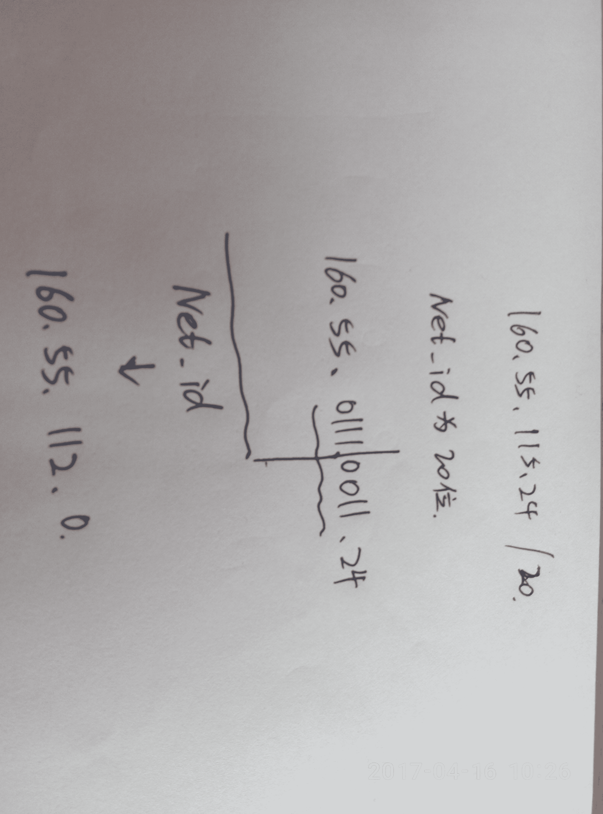
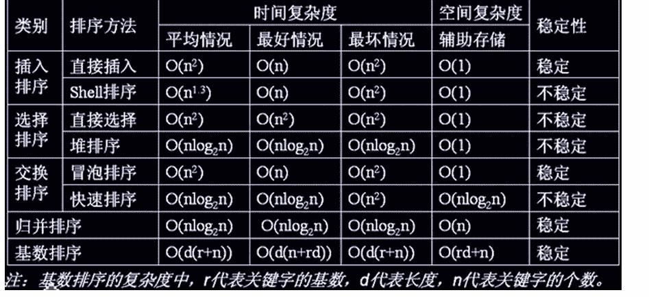
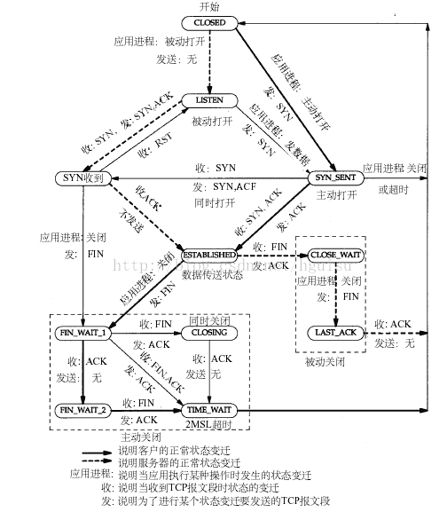

# 滴滴出行 2017 秋招运维岗笔试真题汇总

## 1

当前云计算技术发展迅速，主流云计算平台大多数都以 Linux 为基础。请问以下哪个技术是 Linux 内核提供的可以限制、记录、隔离进程组所使用的物理资源（如：cpu,memory,IO 等等）的机制

正确答案: C   你的答案: 空 (错误)

```cpp
KVM
```

```cpp
aufs
```

```cpp
cgroups
```

```cpp
namespace
```

本题知识点

运维工程师 滴滴 2017

讨论

[就是这个儿范](https://www.nowcoder.com/profile/9174885)

你说 C 哪里错了

发表于 2017-03-05 20:28:06

* * *

## 2

某 IP 地址为 160.55.115.24/20，它的子网划分出来的网络 ID 地址?

正确答案: A   你的答案: 空 (错误)

```cpp
160.55.112.0
```

```cpp
160.55.115.0
```

```cpp
160.55.112.24
```

```cpp
其他答案都不对
```

本题知识点

运维工程师 滴滴 2017

讨论

[李丫头](https://www.nowcoder.com/profile/6004379)



发表于 2017-04-16 10:28:43

* * *

## 3

TCP 协议在建立连接的过程中可能处于不同的状态，用 netstat 命令显示出 TCP 连接的状态为 SYN_SEND，则这个连接正处于

正确答案: B   你的答案: 空 (错误)

```cpp
监听对方的建立连接请求
```

```cpp
已主动发出连接建立请求
```

```cpp
等待对方的连接释放请求
```

```cpp
收到对方的连接建立请求
```

本题知识点

运维工程师 滴滴 2017

## 4

以下网络协议使用加密传输的是

正确答案: D   你的答案: 空 (错误)

```cpp
FTP
```

```cpp
TELNET
```

```cpp
DNS
```

```cpp
HTTPS
```

本题知识点

运维工程师 滴滴 2017

讨论

[周小晴](https://www.nowcoder.com/profile/3924919)

https 采用 ssl 进行加密

发表于 2017-03-21 17:48:39

* * *

## 5

以下 WEB 漏洞类型是在客户端执行的是

正确答案: B   你的答案: 空 (错误)

```cpp
SQL 注入
```

```cpp
XSS
```

```cpp
命令注入
```

```cpp
解析漏洞
```

本题知识点

运维工程师 滴滴 2017

讨论

[Leli](https://www.nowcoder.com/profile/6726457)

sql 注入和命令注入都是攻击服务器，而 xss 是在页面中加入额外的 js 代码，在客户端运行，以达到攻击用户的目地

发表于 2017-05-24 22:44:34

* * *

## 6

用户程序发出磁盘 I/O 请求后，系统的正确处理流程是 

正确答案: B   你的答案: 空 (错误)

```cpp
用户程序→系统调用处理程序→中断处理程序→设备驱动程序
```

```cpp
用户程序→系统调用处理程序→设备驱动程序→中断处理程序
```

```cpp
用户程序→设备驱动程序→系统调用处理程序→中断处理程序
```

```cpp
用户程序→设备驱动程序→中断处理程序→系统调用处理程序
```

本题知识点

运维工程师 滴滴 2017

## 7

下列选项中，满足短任务优先且不会发生饥饿现象的调度算法是

正确答案: B   你的答案: 空 (错误)

```cpp
先来先服务
```

```cpp
高响应比优先
```

```cpp
时间片轮转
```

```cpp
非抢占式短任务优先
```

本题知识点

运维工程师 滴滴 2017 Java 工程师 C++工程师 PHP 工程师 golang 工程师 哔哩哔哩 2021

讨论

[浅色年华](https://www.nowcoder.com/profile/229592369)

D 选项会产生饥饿现象，A、C 选项，不满足短作业优先，B 选项，由于响应比=(作业执行时间十作业等待时间)／作业执行时间。高响应比调度算法在等待时间相同的情况下，作业执行时间越短响应比越高，满足短任务优先。随着等待时间增加，响应比也会变大，执行机会就增大，所以不会产生饥饿现象，

发表于 2018-06-24 10:43:24

* * *

[cxq_kbdkk](https://www.nowcoder.com/profile/140748499)

饥饿现象：是指系统不能保证某个进程的等待时间上界，从而使该进程长时间等待，当等待时间给进程推进和响应带来明显影响时，称发生了进程饥饿。RR 调度算法是抢占的，没有满足短作业优先

发表于 2022-02-11 17:31:14

* * *

## 8

下列选项中，降低进程优先权的合理时机是

正确答案: A   你的答案: 空 (错误)

```cpp
进程的时间片用完
```

```cpp
进程刚完成 I/O，进入就绪队列
```

```cpp
进程长期处于就绪队列中
```

```cpp
进程从就绪状态转为运行态
```

本题知识点

运维工程师 滴滴 2017

## 9

一个袋子里装了 100 个苹果，100 个香蕉，100 个桔子，100 个梨，如果每分钟从里面随机抽取一个水果，那么最多过多少分钟时间能肯定至少拿到一打相同种类的水果？（1 打=12 个）

正确答案: D   你的答案: 空 (错误)

```cpp
40  
```

```cpp
12  
```

```cpp
24  
```

```cpp
45
```

本题知识点

运维工程师 滴滴 2017

讨论

[778 笑哈哈](https://www.nowcoder.com/profile/3718620)

```cpp
用最坏的情况算,每种正好都是取了 11 个,那就是取了 44 个水果,
这时候再取一个水果,肯定至少有一种水果满 1 打.
所以取 45 个水果就能肯定至少已拿出了 1 打相同种类的水果.
因为每分钟从袋子里取出 1 种水果,所以需要 45 分钟.
```

发表于 2018-07-25 17:49:48

* * *

## 10

6 块 300G 的硬盘做 raid5，新的设备容量是多大

正确答案: C   你的答案: 空 (错误)

```cpp
900G
```

```cpp
1800G  
```

```cpp
1500G  
```

```cpp
300G
```

本题知识点

运维工程师 滴滴 2017

讨论

[Deborah](https://www.nowcoder.com/profile/823671)

DAID5 磁盘容量＝单个硬盘容量＊（n-1）

发表于 2017-02-22 17:38:43

* * *

## 11

QQ 客户端通过什么协议，将消息发送至服务端？

正确答案: A   你的答案: 空 (错误)

```cpp
UDP
```

```cpp
TCP
```

```cpp
SMTP
```

```cpp
以上都不是
```

本题知识点

运维工程师 滴滴 2017

讨论

[smlnj](https://www.nowcoder.com/profile/124769)

这道题的答案应该选 D，这个标准答案似乎有问题！ QQ 既使用了 UDP 也有 TCP 协议！

发表于 2016-12-24 14:17:22

* * *

[爱吃水果的小菜](https://www.nowcoder.com/profile/7849254)

在默认状态下，QQ 优先采用了 UDP，这也符合 Tencent 的目标：追求效率。

发表于 2019-02-23 17:33:25

* * *

## 12

开发前端 js 时，如何给数组 list 增加元素 element?

正确答案: B   你的答案: 空 (错误)

```cpp
list.add(element)
```

```cpp
list.push(element)
```

```cpp
list.append(element)
```

```cpp
以上答案都不对
```

本题知识点

运维工程师 滴滴 2017

讨论

[牛客 658350937 号](https://www.nowcoder.com/profile/658350937)

B

发表于 2021-01-06 09:26:26

* * *

[牛客 8245679 号](https://www.nowcoder.com/profile/8245679)

b

发表于 2017-03-15 23:15:59

* * *

[smlnj](https://www.nowcoder.com/profile/124769)

Example

Add a new item to an array:

var fruits = ["Banana", "Orange", "Apple", "Mango"];
fruits.push("Kiwi");

The result of *fruits* will be:

Banana,Orange,Apple,Mango,Kiwi 所以正确答案 B

发表于 2016-12-24 14:10:45

* * *

## 13

静态变量通常存储在进程的什么位置？

正确答案: C   你的答案: 空 (错误)

```cpp
堆
```

```cpp
栈
```

```cpp
全局区
```

```cpp
代码区
```

本题知识点

运维工程师 滴滴 2017

讨论

[smlnj](https://www.nowcoder.com/profile/124769)

考察的知识点是 C++的 static 关键字。被 static 修饰的变量位于全局区。答案是 C

发表于 2016-12-24 14:13:35

* * *

## 14

IP 协议没有使用以下哪一层？

正确答案: D   你的答案: 空 (错误)

```cpp
链路层
```

```cpp
物理层
```

```cpp
网络层
```

```cpp
传输层
```

本题知识点

运维工程师 滴滴 2017

讨论

[我想吃一个扇贝](https://www.nowcoder.com/profile/377568)

D 传输层，因为传输层在网络层之上，而在网络通信中，数据是向下传递的，不会使用到上一层

发表于 2016-12-27 21:07:08

* * *

## 15

在编译的过程中，语法分析器的任务是？

正确答案: B   你的答案: 空 (错误)

```cpp
分析单词的构成逻辑
```

```cpp
分析单词串构成语言和说明的逻辑
```

```cpp
分析语句和说明如何构成程序
```

```cpp
分析程序的结构
```

本题知识点

运维工程师 滴滴 2017

讨论

[我想吃一个扇贝](https://www.nowcoder.com/profile/377568)

这个是多选吧，选 BCD

发表于 2016-12-27 21:04:45

* * *

## 16

下列排序算法中，哪个的时间复杂度不超过 nlogn？

正确答案: C   你的答案: 空 (错误)

```cpp
快速排序
```

```cpp
冒泡排序
```

```cpp
堆排序
```

```cpp
归并排序
```

本题知识点

运维工程师 滴滴 2017

讨论

[向宇同桌 2333](https://www.nowcoder.com/profile/596848)

选 CD 吧

发表于 2017-06-10 16:01:38

* * *

[Anfield_ 哲](https://www.nowcoder.com/profile/534010)

这个需要对排序的各种情况清楚所以答案选 C

发表于 2016-12-21 15:45:15

* * *

## 17

在数据库管理中，当我们某一个字段的查询量突然变大，我们应该如何提高查询性能？

正确答案: A   你的答案: 空 (错误)

```cpp
基于该字段添加索引
```

```cpp
基于该字段添加主键
```

```cpp
为该表创建外键
```

```cpp
为该表添加索引
```

本题知识点

运维工程师 滴滴 2017

讨论

[666 的佩奇爸爸](https://www.nowcoder.com/profile/7670357)

答案：A。

主关键字（主键，primary key）是表中的一个或多个字段，它的值用于唯一地标识表中的某一条记录。在两个表的关系中，外键用来在一个表中引用来自于另一个表中的特定记录。主关键字是一种唯一关键字，表定义的一部分。一个表不能有多个主关键字，并且主关键字的列不能包含空值。

索引是一种提高数据库查询速度的机制，它是一个在数据库的表或视图上按照某个关键字段的值，升序或降序排序创建的对象，当用户查询索引字段时，它可以快速地执行检索操作，借助索引，在执行查询的时候不需要扫描整个表就可以快速地找到所需要的数据。一条索引记录包含键值和逻辑指针。创建索引时，系统分配一个索引页。在表中插入一行数据，同时也向该索引页中插入一行索引记录。由此可以看出，索引在提高查询效率的同时也增加了插入操作的时间，由此适合在以查询为主的场景使用。

索引的类型有聚簇索引和非聚簇索引。聚簇索引是表中的行的物理顺序与键值的逻辑顺序一样，一个表只能有一个聚簇索引。非聚簇索引是数据存储与索引存储不在同一个地方。与非聚簇索引相比，聚簇索引一般情况下可以获得更快的数据访问速度。

创建索引可以大大提高系统的性能，主要表现为以下几个方面的内容：首先，通过创建唯一性索引，可以保证数据库表中每一行数据的唯一性。其次，通过索引，可以大大加快数据的检索速度。再次，通过索引可以加速表和表之间的连接，从而有效实现数据的完整性。然后，在使用分组和排序子句进行数据检索时，可以显著减少查询中分组和排序的时间。最后，通过使用索引，可以在查询的过程中，使用优化隐藏器，提高系统的性能。

索引可以有效地提高查询效率，那么为什么不因此而将所有的列都建立索引呢？其实索引尽管可以带来方便，但并非越多越好，过多的索引也会带来许多不利的问题。首先，创建索引和维护索引要耗费时间、空间，当数据量比较小时，这种问题还不够突出，而当数据量比较大时，这种缺陷会比较明显，效率会非常低下。其次，除了数据表占数据空间之外，每一个索引还需要占用一定的物理空间，如果要建立聚簇索引，那么需要的空间就会更大，从而造成不必要的空间浪费。最后，当对表中的数据进行增加、删除和修改的时候，索引也要动态地维护，从而降低了数据的维护速度。

通过以上分析发现，如果需要提高查询速度，可以在经常被查询的字段上创建索引来提高查询效率。所以，选项 A 正确。

编辑于 2018-07-20 18:52:54

* * *

[smlnj](https://www.nowcoder.com/profile/124769)

首先正确答案肯定是为该字段添加索引。未使用索引时查询某字段，例如：select * from studentinfo where name = 'mrsoft'按顺序查找，比如查询次数为 10\.现在在 name 字段上建立一个名为 index_name 的索引。创建索引的代码如下：create index index_name on studentinfo(name);如果表中‘mrsoft’只出现一次，现在查询的次数就为 1 了。

发表于 2016-12-24 11:55:11

* * *

## 18

链表不具备的特点有：

正确答案: A   你的答案: 空 (错误)

```cpp
可随机立刻访问任何一个元素
```

```cpp
插入、删除操作不需要移动元素
```

```cpp
无需事先估计存储空间大小
```

```cpp
存储空间大小与链表长度成正比
```

本题知识点

运维工程师 滴滴 2017

讨论

[牛客网 17 届学员](https://www.nowcoder.com/profile/641070)

正确答案：A 链表不支持随机访问，数组支持随机访问。选择 A。

发表于 2016-12-21 15:26:11

* * *

## 19

对名为 file 的文件使用 chmod 551 file 命令后，显示的权限为：

正确答案: D   你的答案: 空 (错误)

```cpp
-rwxr-xr-x
```

```cpp
-rwxr--r--
```

```cpp
-r--r--r-x
```

```cpp
-r-xr-x--x
```

本题知识点

运维工程师 滴滴 2017

讨论

[Anfield_ 哲](https://www.nowcoder.com/profile/534010)

D rwx 分别对应的是 421，所以 551 就是 r x r x   x

发表于 2016-12-21 15:42:43

* * *

## 20

找出 IO 重定向执行结果与其他三个不同的：

正确答案: C   你的答案: 空 (错误)

```cpp
./run.sh >run.log 2>&1;
```

```cpp
./run.sh 2>&1 >run.log;
```

```cpp
./run.sh &>run.log;
```

```cpp
./run.sh 2>run.log >&2
```

本题知识点

运维工程师 滴滴 2017

讨论

[少废话 A](https://www.nowcoder.com/profile/4081503)

这个题应该选 D 才对吧？0 代表标注输入 1 代表标准输出 2 代表标准错误 A 和 B 只是书写顺序不一样，意义是一样的。C 我没这样用过，但是语法上应该没错，不指定 1 和 2 的情况下应该是全部重定向到 run.log 了。而 D 只是把 2 也就是错误的内容才重定向到 run.log 中，所以是不一样的。不知道我的理解是否正确，哪位大侠指点下。

发表于 2018-04-27 21:00:06

* * *

[好好先生、201710221914964](https://www.nowcoder.com/profile/9800271)

这个题应该选 b 吧

发表于 2018-03-16 16:09:08

* * *

[matrixback](https://www.nowcoder.com/profile/884693)

C 写法错误。

发表于 2016-12-21 20:28:43

* * *

## 21

TCP 协议在建立连接的过程中可能处于不同的状态，用 netstat 命令显示出 TCP 连接的状态为 SYN_SEND，则这个连接正处于

正确答案: B   你的答案: 空 (错误)

```cpp
监听对方的建立连接请求
```

```cpp
已主动发出连接建立请求
```

```cpp
等待对方的连接释放请求
```

```cpp
收到对方的连接建立请求
```

本题知识点

运维工程师 滴滴 2017

讨论

[smlnj](https://www.nowcoder.com/profile/124769)

**linux 查看 tcp 的状态命令：**netstat -nat  查看 TCP 各个状态的数量 SYN_SENT. /* The socket is actively attempting to establish a connection. 在发送连接请求后等待匹配的连接请求 */话说：题目是不是有问题 SYN_SENT 不是 SYN_SEND？

发表于 2016-12-24 12:01:39

* * *

## 22

6 块 300G 的硬盘做 raid5，新的设备容量是多大

正确答案: C   你的答案: 空 (错误)

```cpp
900G
```

```cpp
1800G
```

```cpp
1500G
```

```cpp
300G
```

本题知识点

运维工程师 滴滴 2017

讨论

[maoxiaomi](https://www.nowcoder.com/profile/1300598)

raid5 失去一个硬盘容量 raid0 不失去 raid1 失去一半 raid6 失去两个硬盘容量 raid10 失去 一半

发表于 2017-02-21 18:24:17

* * *

## 23

crontab 中每个域的含义？

正确答案: D   你的答案: 空 (错误)

```cpp
秒 分 周 日 月 命令
```

```cpp
秒 分 时 日 周 命令
```

```cpp
分 时 周 月 日 命令
```

```cpp
分 时 日 月 周 命令
```

本题知识点

运维工程师 滴滴 2017

讨论

[牛客网 17 届学员](https://www.nowcoder.com/profile/641070)

正确答案：Dcrontab 命令常见于 Unix 和类 Unix 的操作系统之中，用于设置周期性被执行的指令。时程表的格式如下：f1 f2 f3 f4 f5 program 其中 f1 是表示分钟，f2 表示小时，f3 表示一个月份中的第几日，f4 表示月份，f5 表示一个星期中的第几天。program 表示要执行的程式。选择 D

发表于 2016-12-21 15:25:02

* * *

## 24

指令：ls | grep “[ad]*\.conf” 命令解释正确的是：

正确答案: A   你的答案: 空 (错误)

```cpp
显示包含 a 或者 d 为开头，后接任何字符，再后面是.conf 字符的文件（或目录）
```

```cpp
显示包含 a 或者 d 出现 0 次或无数次，后面是.conf 字符的文件（或目录）
```

```cpp
显示包含字母 a 或者 d 出现 0 次或 1 次，后面是.conf 字符的文件（或目录）
```

```cpp
显示从字母 a 到 d ，后接任何字符，再后面是.conf 字符的文件（或目录）
```

本题知识点

运维工程师 滴滴 2017

讨论

[洛东城](https://www.nowcoder.com/profile/6678967)

这答案，grep 啊，不是通配符，*号明明代表匹配前边的字符任意次数

发表于 2017-03-06 22:51:17

* * *

## 25

以下密码学算法需要使用秘钥的是

正确答案: D   你的答案: 空 (错误)

```cpp
SHA256
```

```cpp
SHA1
```

```cpp
MD5
```

```cpp
HMAC
```

本题知识点

运维工程师 滴滴 2017

讨论

[寒腿妞](https://www.nowcoder.com/profile/596400)

答案是 D SHA256、SHA1、MD5 都是产生消息摘要的加密算法，主要用于数字签名。HMAC 是密钥相关的哈希运算消息认证码，运算利用哈希算法，以一个密钥和一个消息为输入，生成一个消息摘要作为输出。

发表于 2016-12-27 20:03:59

* * *

## 26

以下不属于漏洞扫描工具的是

正确答案: C   你的答案: 空 (错误)

```cpp
NMAP
```

```cpp
AWVS
```

```cpp
nc
```

```cpp
Nessus
```

本题知识点

运维工程师 滴滴 2017

讨论

[matrixback](https://www.nowcoder.com/profile/884693)

nc 可以端口扫描。

发表于 2016-12-21 20:27:37

* * *

## 27

以下不是用来进行认证的协议的是

正确答案: D   你的答案: 空 (错误)

```cpp
Kerberos
```

```cpp
Outh2
```

```cpp
RADIUS
```

```cpp
SNMP
```

本题知识点

运维工程师 滴滴 2017

讨论

[matrixback](https://www.nowcoder.com/profile/884693)

SNMP 主要用于信息管理。

发表于 2016-12-21 20:25:43

* * *

## 28

如下哪些 linux 命令可以查看文件内容（多选题）：

正确答案: A B C D   你的答案: 空 (错误)

```cpp
less
```

```cpp
cat
```

```cpp
more
```

```cpp
vim
```

本题知识点

运维工程师 滴滴 2017

讨论

[Anfield_ 哲](https://www.nowcoder.com/profile/534010)

less 查看文件内容，用户可以选择向上看或者是向下看 more 查看文件内容，用户按键显示下一屏的内容。cat 连接文件打印到输出设备上 vim 打开 vim 编辑器，显示内容。

发表于 2016-12-21 15:41:14

* * *

## 29

如下 sql 语句，会执行错误的是？

正确答案: A D   你的答案: 空 (错误)

```cpp
UPDATE db1.table1 column1=”valu1”
```

```cpp
SELECT distinct(*) FROM table1 GROUP BY column1
```

```cpp
SET NAMES 'utf8'
```

```cpp
DROP DATABASE table1
```

本题知识点

运维工程师 滴滴 2017

讨论

[matrixback](https://www.nowcoder.com/profile/884693)

update from tablename set xxx =xxx where xx.database 不能 drop.

发表于 2016-12-21 20:24:09

* * *

## 30

在前后端交互过程中，Cookie 是一个很重要、敏感的存储介质。如何防止 Cookie 内容被黑客篡改？

正确答案: A C D   你的答案: 空 (错误)

```cpp
服务端对 Cookie 内容加密
```

```cpp
浏览器对 Cookie 内容加密
```

```cpp
设置 HttpOnly
```

```cpp
对 Cookie 设置有效时间
```

本题知识点

运维工程师 滴滴 2017

讨论

[就是这个儿范](https://www.nowcoder.com/profile/9174885)

cookie 不是在客户端的 吗？

发表于 2017-03-05 20:32:31

* * *

## 31

有用户反映滴滴打车软件打开速度慢，请描述下排查方案

你的答案

本题知识点

运维工程师 滴滴 2017

讨论

[白色衬衫⚠️](https://www.nowcoder.com/profile/416032551)

首先让用户自身排除手机问题吗，网络延时高、网速不好等问题。DNS 缓存信息，缓存是否过期。CDN 边缘节点的缓存没有命中，导致回源 Redis、Memcache 的缓存没有命中。查看系统负载情况，看系统负载是否过高从而来不及处理用户请求。服务器是否遭受 SYN 攻击，或者 DDOS 攻击。**请教大神指导有什么问题？**

发表于 2020-03-05 13:07:57

* * *

## 32

提供一个二叉树的子树查找函数，完成如下的功能：   输入参数：root， node   输出：1.node 所在的深度（0 表示不存在，最小深度为 1）；2.node 对应的路径（从 root 开始，左为 L,右为 R, 按逗号分隔）；   说明：1.node 所在位置相同，左右子树和 name 都必须相同；   请用熟悉的语言，用两种方式（递归和栈）完成此函数

你的答案

本题知识点

运维工程师 滴滴 2017

## 33

找出数组（至少包含一个数字）中的一个连续子数组、该子数组拥有最大和。

例如：给定一个数组[ − 2,1, − 3,4, − 1,2,1, − 5,4],连续子数组［4, − 1,2,1］的和是 6，比其它子数组的和都大。

int maxSubArray(int *nums, int arrLen){

}

你的答案

本题知识点

运维工程师 滴滴 2017

讨论

[武培轩](https://www.nowcoder.com/profile/5033606)

[剑指 Offer-连续子数组的最大和](http://www.cnblogs.com/wupeixuan/p/8623206.html)

```cpp
public class Solution01 {
    public static void main(String[] args) {
        int[] arr = { − 2,1, − 3,4, − 1,2,1, − 5,4};
        System.out.println(FindGreatestSumOfSubArray(arr));
    }
    public static int FindGreatestSumOfSubArray(int[] array) {
        if(array.length==0)
            return 0;
        int sum = array[0];//保存每组的和
        int maxSum = array[0];//连续子数组最大和
        //动态规划
        for(int i = 1;i<array.length;i++){
            sum = Math.max(sum+array[i],array[i]);
            maxSum = Math.max(sum,maxSum);
        }
        return maxSum;
    }
} 
```

发表于 2018-04-14 15:27:26

* * *

[紫旋](https://www.nowcoder.com/profile/795206)

是求子数组的最大和，还是最大和的子数组？
如果是子数组的最大和，就看这个：[`www.nowcoder.com/questionTerminal/459bd355da1549fa8a49e350bf3df484`](https://www.nowcoder.com/questionTerminal/459bd355da1549fa8a49e350bf3df484)
如果是最大和的子数组，就看这个：[`www.nowcoder.com/questionTerminal/4e682c258f37433f9bb4b754d7ac6c08`](https://www.nowcoder.com/questionTerminal/4e682c258f37433f9bb4b754d7ac6c08)

编辑于 2017-08-28 10:29:06

* * *

[bian6](https://www.nowcoder.com/profile/7699453)

```cpp
求最大字串和，字串两边肯定都是正数，遍历所有两边为正数的字串，把
和放在另一个数组中，找出最大值即可
#include<stdio.h>
#include<stdlib.h>
int main()
{
    int a[1000]={0};
    while(scanf("%d",&a[0])!=EOF)
    {
        int i,j,k,num=1,flag=a[0],b[1000]={0};
        int sum,n=0,flt;
        for(i=1;i<1000;i++)
        {
            scanf("%d",&a[i]);
            if(a[i]>flag)
                flag=a[i];
            num++;
            if(getchar()=='\n')
            break;
        }
        for(i=0;i<num-1;i++)
        {
            if(a[i]>0)
            for(j=num-1;j>i;j--)    
            {
                sum=0;
                if(a[j]>0)
                {
                    for(k=i;k<=j;k++)
                        sum+=a[k];
                    printf("i=%d j=%d sum=%d\n",i,j,sum);
                    b[n++]=sum; 
                }
            }

        }
       for(k=0;k<n;k++)
                if(b[k]>flt)
                    flt=b[k];
        if(flt>flag)
            printf("%d\n",flt);
        else
            printf("%d\n",flag);
    }
}
```

发表于 2017-08-28 21:28:38

* * *

## 34

给出一个非空的整数数组，返回其中前 k 个出现最频繁的元素。

比如 [1,1,1,2,2,3]，k = 2，输出[1,2]。

如果 n 是数组的大小，要求给出时间复杂度小于 O(n log n)的算法。

你的答案

本题知识点

运维工程师 滴滴 2017

## 35

给出一个从小到大排好序的整数数组 nums 和一个整数 n，在数组中添加若干个补丁（元素）使得[1,n]的区间内的所有数都可以表示成 nums 中若干个数的和。返回最少需要添加的补丁个数。

样例 1：nums = [1, 3], n = 6

返回 1，表示至少需要添加 1 个数｛2｝，才可以表示 1 到 6 之间所有数。

样例 2：nums = [1, 5, 10], n = 20

返回 2，表示至少需要添加两个数｛2，4｝，才可以表示 1 到 20 之间所有数。

你的答案

本题知识点

运维工程师 滴滴 2017

讨论

[它喵的我的 offer 呢](https://www.nowcoder.com/profile/5048270)

include

include

usingnamespacestd;

intmain()

{

vector vec;

intN;

cin>>N;

vec.resize(N);

for(inti=0;i<N;i++)

cin>>vec[i];

intaim;

cin >>aim;

intsum=0;

intcount=0;

for(inti=0;i<N;i++)

{

if(sum>=aim)

{

break;

}

if(vec[i]>sum+1)

{

```cpp
count++;

cout << "you need to add"<< sum+1<<endl;

sum=sum+sum+1;

i--;
```

}

else

{

sum=sum+vec[i];

}

}

cout<<count;

}

//这和 已知一个数组 求不能由数组元素只通过加法组合得到的最小数 那个题类似，用 sum 表示 已经能得到的数最大值（意味着 1-sum）

//都能得到，下一数如果是大于 sum+1 的 那这 sum+1 这个数肯定拼不出来（前面 i 个数只能拼出 1-sum） 这时 就要添加数，为了让添加的

/数/最少 这个添的数应该是 sum+1，这样前 i+1 个数能得到的数就是 sum[i]+sum[i]+1，直到 sum 大于等于你要求的数 就可以退出循环。

编辑于 2017-01-06 16:34:19

* * *

## 36

一个文件，大概 1 亿行，每行一个 ip，将出现次数最多的 top10 输出到一个新的文件中

你的答案

本题知识点

运维工程师 滴滴 2017

讨论

[高兴的才哥](https://www.nowcoder.com/profile/7045152)

```cpp
sort ip.txt | uniq -c | sort -rn | head -n 10 >>IP.txt
```

编辑于 2017-01-12 20:38:52

* * *

[Anfield_ 哲](https://www.nowcoder.com/profile/534010)

这个是一个简单的大数据分析的问题，我们可以利用字符串哈希算法，把每个 ip 对应出一个整数，放入这个整数序号的文件当中，然后取出每个文件当中出现次数最多的 ip，然后最后利用堆排序取出 top 10

发表于 2016-12-21 15:32:07

* * *

[白色衬衫⚠️](https://www.nowcoder.com/profile/416032551)

awk -F" " '{IP[$1]++}END{for (i in IP) print IP[i],i}'  /var/log/filename.log  |sort -k2  -rn   |head -10  >text.txtawk -F" " '{print $1}' /var/log/filename.log |sort -n  |uniq -c |sort -rn  -k1 |head -10  > text.txt

发表于 2020-03-05 13:08:24

* * *