# 滴滴出行 2017 秋招测试岗笔试真题汇总

## 1

内存页式管理方式中，首先淘汰在内存中空闲（未被修改或读取）时间最长的帧，这种替换策略是 _____.（ ）

正确答案: B   你的答案: 空 (错误)

```cpp
先进先出法（FIFO）
```

```cpp
最近最少使用法（LRU）
```

```cpp
优先级调度
```

```cpp
轮转法
```

本题知识点

C++工程师 Java 工程师 滴滴 2017 测试工程师

讨论

[Fndoid](https://www.nowcoder.com/profile/9439878)

未被修改或读取，LRU

发表于 2016-12-23 17:06:13

* * *

## 2

进程 P1 使用资源情况：申请资源 S1．．•申请资源 S2，…释放资源 S1；进程 P2 使用资源情况：申请资源 S2，…申请资源 S1，…释放资源 S2，系统并发执行进程 P1，P2，系统将( )

正确答案: B   你的答案: 空 (错误)

```cpp
必定产生死锁
```

```cpp
可能产生死锁
```

```cpp
不会产生死锁
```

```cpp
以上说法都不对
```

本题知识点

C++工程师 Java 工程师 滴滴 2017 测试工程师

讨论

[Rootlee](https://www.nowcoder.com/profile/966703)

题目没有说明资源 S1 和 S2 的数量，所以是**可能产生死锁**。
如果资源 S1 和 S2 的数量都是 1 的话，则**必定产生死锁**。

发表于 2017-08-03 21:11:22

* * *

[牛客 8464554 号](https://www.nowcoder.com/profile/8464554)

B 和 D 表述的意思不是一样的么。。

发表于 2017-01-10 16:54:49

* * *

[冰冰透心凉](https://www.nowcoder.com/profile/2136880)

首先，P1 申请 S1，P2 申请 S2 然后，P1 申请 S2，P2 申请 S1 此时就发生了死锁。

发表于 2017-09-30 21:09:53

* * *

## 3

引用和指针，下面说法不正确的是：（）

正确答案: A   你的答案: 空 (错误)

```cpp
引用和指针在声明后都有自己的内存空间
```

```cpp
引用必须在声明时初始化，而指针不用
```

```cpp
引用声明后，引用的对象不可改变，对象的值可以改变，指针可以随时改变指向的对象以及对象的值
```

```cpp
空值 NULL 不能引用，而指针可以指向 NULL。
```

本题知识点

C++工程师 Java 工程师 滴滴 2017 测试工程师 C++

讨论

[BrownLincoln](https://www.nowcoder.com/profile/7533277)

考的是 C/C++中的知识点，

1.内存方面    指针是一个变量，只不过这个变量存储的是一个地址，指向内存的一个存储单元；而引用跟原来的变量实质上是同一个东西，只不过是原变量的一个别名而已。

2.空值    指针的值可以为空，也可能指向一个不确定的内存空间，但是引用的值不能为空，并且引用在定义的时候必须初始化为特定对象；（因此引用更安全）

3.指针的值在初始化后可以改变，即指向其它的存储单元，而引用在进行初始化后就不会再改变引用对象了；

4.sizeof 引用得到的是所指向的变量(对象)的大小，而 sizeof 指针得到的是指针本身的大小；

5.指针和引用的自增(++)运算意义不一样；参考：[`www.cnblogs.com/webary/p/4754522.html`](http://www.cnblogs.com/webary/p/4754522.html)

发表于 2017-08-09 19:47:25

* * *

[蓝精灵与大鲨鱼](https://www.nowcoder.com/profile/7441047)

额，看到这题才知道 C++指针、引用和 Java 引用的区别啊。简单点，Java 的引用具有 C++指针和引用的双重功能吧。。。。

发表于 2018-01-05 22:14:49

* * *

[G 弦上的咏叹调](https://www.nowcoder.com/profile/7222066)

引用只是对一个已经存在的对象的别名，有对象必有地址，但是有地址不一定有对象

编辑于 2017-08-03 11:50:21

* * *

## 4

关于排序，下面说法不正确的是

正确答案: D   你的答案: 空 (错误)

```cpp
快排时间复杂度为 O(N*logN)，空间复杂度为 O(logN)
```

```cpp
归并排序是一种稳定的排序,堆排序和快排均不稳定
```

```cpp
序列基本有序时，快排退化成冒泡排序，直接插入排序最快
```

```cpp
归并排序空间复杂度为 O(N), 堆排序空间复杂度的为 O(logN)
```

本题知识点

C++工程师 Java 工程师 滴滴 2017 测试工程师

讨论

[Deborah](https://www.nowcoder.com/profile/823671)

不稳定的排序：快些选堆。快速排序，希尔排序，选择排序，堆排序

发表于 2017-03-14 16:46:39

* * *

[2FA0](https://www.nowcoder.com/profile/6103754)

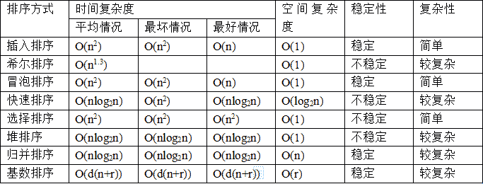

发表于 2017-09-02 18:43:17

* * *

[姚化吉](https://www.nowcoder.com/profile/6940209)

归并排序（2-路）空间复杂度是 N，堆排序空间复杂度是 1

发表于 2017-01-25 22:58:40

* * *

## 5

用二进制来编码字符串“abcdabeaa”,需要能够根据编码，解码回原来的字符串，最少需要多长的二进制字符串？

正确答案: C   你的答案: 空 (错误)

```cpp
17
```

```cpp
18
```

```cpp
19
```

```cpp
29
```

本题知识点

C++工程师 Java 工程师 滴滴 2017 测试工程师

讨论

[chhcqu](https://www.nowcoder.com/profile/7351267)

答案：C 哈夫曼编码是可变编码方式，它利用元素出现的频率的，频率越高的元素越靠近哈夫曼树的根节点，编码长度 越短，从而使编码字符串是二进制码位数最少，利用哈夫曼树的构造原理可得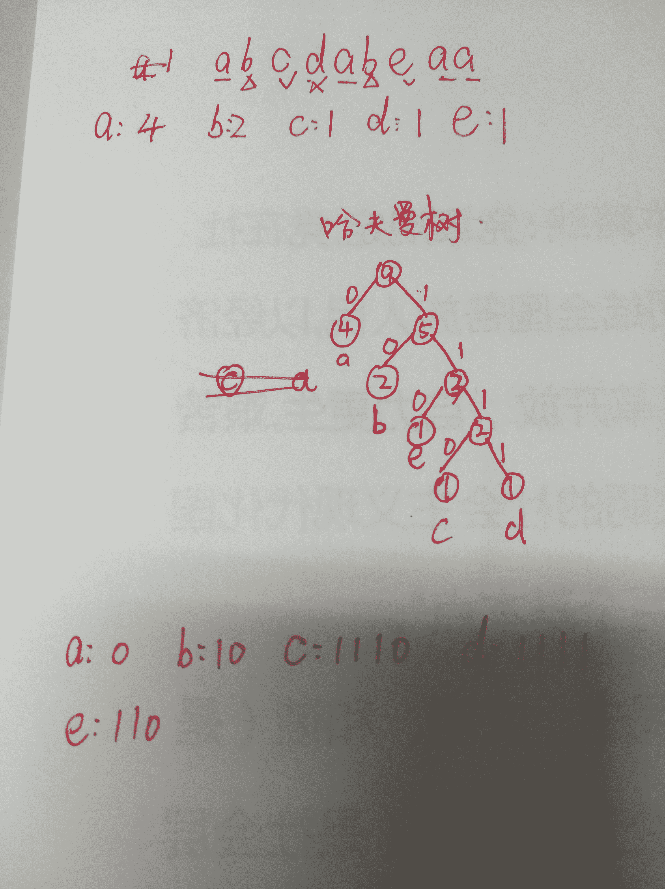

发表于 2017-03-09 11:27:56

* * *

[ShaoXiaobao](https://www.nowcoder.com/profile/4765842)

abcdabeaa，a(4) b(2) c(1) d(1) e(1),经过哈夫曼编码后，a:0, b: 10, c:110, d:1110, e:1111,所需字符串长度(位数*长度)为：a(4*1) + b(2*2) + c(1*3) + d(1*4) + e(1*4) = 19

发表于 2017-08-02 11:24:13

* * *

[chanplion](https://www.nowcoder.com/profile/6671561)

按照哈夫曼编码，先构造哈夫曼树。然后 a 的编码为 1，b 为 01，c 为 0000，d 为 0001，e 为 001。字符串“abcdabeaa ”的编码为“1010000000110100111”，编码总长度为 19.

发表于 2017-01-17 15:53:11

* * *

## 6

TCP 关闭过程中，主动关闭方不可能处于的状态是（）

正确答案: C   你的答案: 空 (错误)

```cpp
FIN_WAIT_1
```

```cpp
FIN_WAIT_2
```

```cpp
CLOSE_WAIT
```

```cpp
TIME_WAIT
```

本题知识点

C++工程师 Java 工程师 滴滴 2017 测试工程师 滴滴 2017

讨论

[cyanlong](https://www.nowcoder.com/profile/8977519)

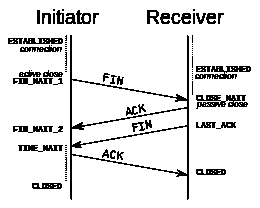

发表于 2017-01-08 10:59:06

* * *

[凤梨酥](https://www.nowcoder.com/profile/5798709)

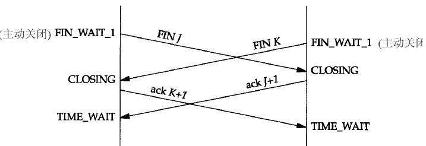

发表于 2017-01-07 18:32:18

* * *

[低调的我](https://www.nowcoder.com/profile/4546028)

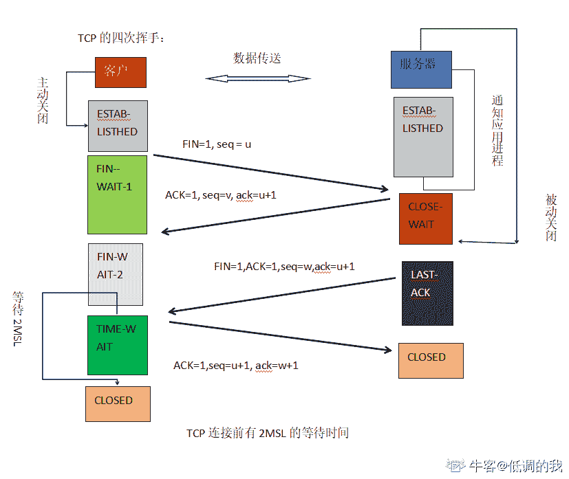

发表于 2019-08-25 20:30:39

* * *

## 7

已知二叉树的前序序列为 BCDEFAG，中序序列为 DCFAEGB，请问后序序列为 ___

正确答案: C   你的答案: 空 (错误)

```cpp
DAFEGCB
```

```cpp
DAEGFCB
```

```cpp
DAFGECB
```

```cpp
DAEFGCB
```

本题知识点

C++工程师 Java 工程师 滴滴 2017 测试工程师

讨论

[NightKnight 宇](https://www.nowcoder.com/profile/5494124)

                                                    B                                                 /
                                              C
                                           /     \
                                         D       E
                                                 /    \
                                               F      G
                                                \
                                                 A

发表于 2016-12-31 22:42:42

* * *

[段誉 34](https://www.nowcoder.com/profile/830606332)

1、确定树的根节点。树根是当前树中所有元素在前序遍历中最先出现的元素。

2、求解树的子树。找出根节点在中序遍历中的位置，根左边的所有元素就是左子树，根右边的所有元素就是右子树。若根节点左边或右边为空，则该方向子树为空；若根节点左边和右边都为空，则根节点已经为叶子节点。

3、递归求解树。将左子树和右子树分别看成一棵二叉树，重复 1、2、3 步，直到所有的节点完成定位。

发表于 2018-09-18 10:44:19

* * *

## 8

请写出下面程序的输出：

```cpp
#include <iostream>
using namespace std;
unsigned int GetTestNum() {
    static unsigned int a = 0;  
    static unsigned int b = 1;  
    int c = a + b;
    a = b;
    b = c;
    return c;
}
int main(int argc, char* argv[]) {
    for (int i = 0; i < 9; i++) {
        GetTestNum();
    }   
    cout << GetTestNum() << endl;
}
```

正确答案: C   你的答案: 空 (错误)

```cpp
1
```

```cpp
144
```

```cpp
89
```

```cpp
55
```

本题知识点

C++工程师 Java 工程师 滴滴 2017 测试工程师 C++

讨论

[我是一哥](https://www.nowcoder.com/profile/7687800)

哎，最后还执行一次！！！！！！！！！！！！！！！！！

发表于 2017-06-07 10:20:57

* * *

[璎珞-沐](https://www.nowcoder.com/profile/6390519)

通常，在函数体内定义了一个变量，每当程序运行到该语句时都会给该局部变量分配栈内存。但随着程序退出函数体，系统就会收回栈内存，局部变量也相应失效。但有时候我们需要在两次调用之间对变量的值进行保存。通常的想法是定义一个全局变量来实现。但这样一来，变量已经不再属于函数本身了，不再仅受函数的控制，给程序的维护带来不便。
静态局部变量正好可以解决这个问题。静态局部变量保存在全局数据区，而不是保存在栈中，每次的值保持到下一次调用，直到下次赋新值。 
静态局部变量有以下特点：
• 该变量在全局数据区分配内存； 
• 静态局部变量在程序执行到该对象的声明处时被首次初始化，即以后的函数调用不再进行初始化； 
• 静态局部变量一般在声明处初始化，如果没有显式初始化，会被程序自动初始化为 0； 
• 它始终驻留在全局数据区，直到程序运行结束。但其作用域为局部作用域，当定义它的函数或语句块结束时，其作用域随之结束；

发表于 2017-09-09 22:36:53

* * *

[Hyacinth_J](https://www.nowcoder.com/profile/1510684)

斐波那契数列 第八次 c 是 55 但是最后输出又执行一次

发表于 2017-08-25 18:50:01

* * *

## 9

如下函数，在 32 bit 系统 foo(2³¹-3)的值是：

```cpp
int foo(int x)
 {
     return x&-x;
 }
```

正确答案: C   你的答案: 空 (错误)

```cpp
0
```

```cpp
1
```

```cpp
2
```

```cpp
4
```

本题知识点

C++工程师 Java 工程师 滴滴 2017 测试工程师

讨论

[吃石榴的猫](https://www.nowcoder.com/profile/9576423)

2 与 31 异或，10 与 11111 异或后得 11101，3 为 11，11101-11=11010-11010 相当于 11010 取反加 1 为 00110

11010&00110=10，结果为 2

发表于 2016-12-29 18:40:21

* * *

[78018046](https://www.nowcoder.com/profile/78018046)

我以为是 2 的 31 次方。。。

发表于 2019-08-26 22:21:33

* * *

[姚博 vinson](https://www.nowcoder.com/profile/2577961)

2³¹ - 3 = (2³¹ - 1) - 2 x = 01111111 11111111 11111111 11111101-x = 11111111 11111111 11111111 11111101-x(补码) = 10000000 00000000 00000000 00000011x & -x = x & -x(补码) = 1 补充：-x(补码) = x 取反 + 1 

发表于 2020-02-29 01:36:27

* * *

## 10

本流程图描述了某子程序的处理流程，现要求用白盒测试法对子程序进行测试。根据白盒测试常用的以下几种方式：语句覆盖、判定覆盖、条件覆盖、判定／条件覆盖、多重条件覆盖(条件组合覆盖)、路径覆盖六种覆盖标准，从供选择的答案中分别找出满足相应覆盖标准的最小的测试数据组并简述各种测试方法。  流程图: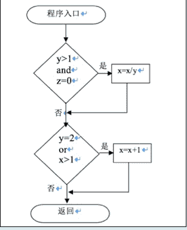
条件覆盖 ，是指选择足够的测试用例，使得运行这些测试用例时，判定中的每个条件的所有可能结果至少出现一次；请选择能够满足条件覆盖的选择项

正确答案: B   你的答案: 空 (错误)

```cpp
x=3 y=3 z=0;x=1 y=2 z=1
```

```cpp
x=1 y=2 z=0;x=2 y=1 z=1
```

```cpp
x=4 y=2 z=0; x=3 y=3 z=0; x=2 y=1 z=0; x=1 y=1 z=1
```

```cpp
x=4 y=2 z=0; x=1 y=2 z=1; x=2 y=1 z=0; x=1 y=1 z=1
```

```cpp
x=4 y=2 z=0
```

```cpp
x=4 y=2 z=0;x=1 y=1 z=1
```

本题知识点

测试工程师 滴滴 2017

讨论

[morenbuding](https://www.nowcoder.com/profile/3837154)

本题答案应选择 F

发表于 2017-07-21 21:05:45

* * *

[青山崖野](https://www.nowcoder.com/profile/7614806)

条件覆盖：除了所有语句都要执行一遍，每个条件的所有可能结果至少出现一次；B 和 F 的区别 就是： F 不能保证所有语句执行一遍。

编辑于 2017-04-18 22:01:20

* * *

[七耀之心](https://www.nowcoder.com/profile/665806865)

B 和 F 都对吧

发表于 2020-09-05 21:05:52

* * *

## 11

```cpp
int func(int x) { 
    int countx = 0; 
    while(x) { 
        countx ++; 
        x = x & (x - 1); 
    } 
    return countx; 
} 
```

如果 x=254，函数返回值为：

正确答案: B   你的答案: 空 (错误)

```cpp
6
```

```cpp
7
```

```cpp
8
```

```cpp
0
```

本题知识点

C++工程师 Java 工程师 滴滴 2017 测试工程师 C++ C 语言

讨论

[凤梨酥](https://www.nowcoder.com/profile/5798709)

x = x&(x-1);//求 x 的二进制表达式有多少个 1x = x|(x-1);//求 x 的二进制表达式有多少个 0

发表于 2017-01-07 19:16:26

* * *

[月河雪飞](https://www.nowcoder.com/profile/305650473)

分两种情况：1、x 是偶数，形如 xxx10..0，最低位必然是 0，x-1 则是形如 xxx01...1，高位第一个 1 被借位变成 0，中间的 0 变成 1，最低位的 0 变成 1，二者相与，导致高位第一个 1 变成 0，其他位不变，相当于除以 4，即左移 2 位；2、x 是奇数，形如 xxx..1，最低位是 1，减一后，形如 xxx..0，只是最低位变成 0，二者相与，相当于除以 2，即左移 1 位。总的来说就是最低位为 0 则左移两位，最低位为 1 则左移 1 位，直到其变为 0，254=B1111 1110，要移动 7 次。

发表于 2020-07-03 09:20:56

* * *

[Fndoid](https://www.nowcoder.com/profile/9439878)

**2** ^(**n **) **& (2** ^(**n**) **-1) = 0**254 = 1111 11**10**253 = 1111 11**01**相与= 1111 1**100**countx = 1 减一= 1111 1**001**每次循环有一位被归 0，第一次结束有 2 最后两位为 0，所以答案为 7

发表于 2016-12-23 17:14:23

* * *

## 12

在进程状态转换时，下列哪一种状态是不可能发生的：

正确答案: A   你的答案: 空 (错误)

```cpp
等待态->运行态
```

```cpp
运行态->就绪态
```

```cpp
运行态->等待态
```

```cpp
就绪态->运行态
```

本题知识点

C++工程师 Java 工程师 滴滴 2017 测试工程师

讨论

[阿絮](https://www.nowcoder.com/profile/7441199)

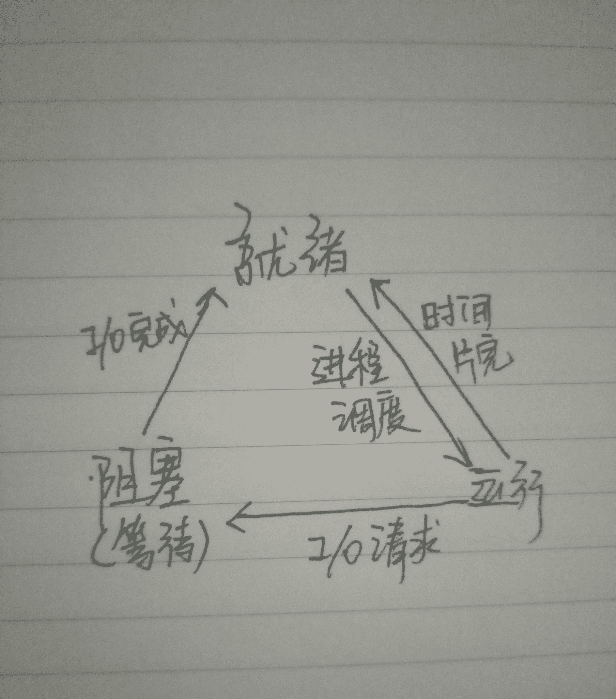

发表于 2017-08-26 09:28:44

* * *

[乔静](https://www.nowcoder.com/profile/7370705)

正在运行的进程遇到 io 请求就会阻塞（等待），阻塞（等待）的进程得到 io 设备就会转成就绪状态，就绪状态的进程在 cpu 调度下，会给该进程分配时间片，分配到时间片段后就会执行，对于正在执行的进程，如果它的时间片段用完了的话，就会转化成就绪状态。

发表于 2017-01-06 08:17:35

* * *

[萨菲娜](https://www.nowcoder.com/profile/5657438)

堵车结束后要经过松手刹，踩离合，加油门等一系列就绪工作才能继续运行。哈哈~

发表于 2017-09-06 15:51:52

* * *

## 13

如果 i=5；那么 a=(++i)--;之后，a 和 i 的值各是多少？

正确答案: C   你的答案: 空 (错误)

```cpp
a=6.i=6
```

```cpp
a=5.i=6
```

```cpp
a=6.i=5
```

```cpp
a=5.i=5
```

本题知识点

C++工程师 Java 工程师 滴滴 2017 测试工程师 C++

讨论

[明日边缘](https://www.nowcoder.com/profile/7609788)

这道题不该关联到 C 题库里。C++中：答案 C，++i 自增后返回自身(左值)，接着 i--自减并返回减前的旧值(右值)，所以 a 是 6，i 最终一加一减值不变。但 C 语言里，++i 和 i++都是右值，编译不过的。

发表于 2021-03-11 00:04:31

* * *

[青山崖野](https://www.nowcoder.com/profile/7614806)

**先自增，再赋值，在自减。****赋值运算符的优先级最低。**

发表于 2017-04-18 22:07:53

* * *

[萝卜坑~~~](https://www.nowcoder.com/profile/247885354)

我理解的是 （） 和 后置自减运算符优先级为 1 级，所以先算（++i）,此时 i=6，接着算 i--，i 的值为 5，但是要下一次才生效，所以 a = 6，i = 5,赋值运算符的优先级为 14

发表于 2019-08-31 09:36:59

* * *

## 14

DNS 协议位于 OSI 模型中的哪一层：

正确答案: A   你的答案: 空 (错误)

```cpp
应用层
```

```cpp
网络层
```

```cpp
传输层
```

```cpp
会话层
```

本题知识点

C++工程师 Java 工程师 滴滴 2017 测试工程师

讨论

[姚化吉](https://www.nowcoder.com/profile/6940209)

```cpp
DNS 即域名系统，其作用是将字符串域名解析成相对于的服务器 IP 地址，免除人们记忆 IP 地址的单调和苦恼，属于为用户排忧解难之举，因此划归为应用层
```

发表于 2017-01-25 23:37:02

* * *

## 15

下列算法中不属于稳定排序的是：

正确答案: C   你的答案: 空 (错误)

```cpp
插入排序
```

```cpp
冒泡排序
```

```cpp
快速排序
```

```cpp
归并排序
```

本题知识点

C++工程师 Java 工程师 滴滴 2017 测试工程师

讨论

[为快乐而设计](https://www.nowcoder.com/profile/2531670)

不稳定排序：快些(希)选堆 快 ：快速排序 希：希尔排序 选：选择排序 堆：堆排序

发表于 2018-05-23 12:57:38

* * *

[surperdan](https://www.nowcoder.com/profile/8102445)

不稳定的排序 快希选堆 （快速排序 希尔排序 选择排序 堆排序 ）

发表于 2018-03-23 23:58:16

* * *

[简相杰](https://www.nowcoder.com/profile/8442454)

不稳定的排序 快希选堆快速排序希尔排序选择排序堆排序

发表于 2017-09-07 21:22:11

* * *

## 16

二叉树的根节点计为第 1 层结点，则第 9 层最多有多少个结点？

正确答案: B   你的答案: 空 (错误)

```cpp
18
```

```cpp
256
```

```cpp
128
```

```cpp
64
```

本题知识点

C++工程师 Java 工程师 滴滴 2017 测试工程师

讨论

[Anfield_ 哲](https://www.nowcoder.com/profile/534010)

最多讨论满二叉树，这个时候节点个数就是 2^(k-1)，所以就是 2⁸=256

发表于 2016-12-21 15:49:35

* * *

## 17

下列描述，正确的一共有多少个？1)const char *p，这是一个常量指针，p 的值不可修改 2)在 64 位机上，char *p= “abcdefghijk”; sizeof(p)大小为 123)inline 会检查函数参数，所以调用开销显著大于宏 4)重载是编译时确定的，虚函数是运行时绑定的；

正确答案: A   你的答案: 空 (错误)

```cpp
1
```

```cpp
2
```

```cpp
3
```

```cpp
4
```

本题知识点

C++工程师 Java 工程师 滴滴 2017 测试工程师 C++ C 语言

讨论

[李今晖 atPKU](https://www.nowcoder.com/profile/1896076)

补充一下第一个：Effective c++ 第三版 p18const 出现在星号左边，表示被指物是常量； 如果出现在星号右边，表示指针自身是常量

发表于 2017-04-22 04:28:46

* * *

[青山崖野](https://www.nowcoder.com/profile/7614806)

对于 inline 和宏的比较：内联函数比宏更安全，前者会有类型检查，后者只是代码的简单替换；inline：在编译时，把函数代码直接插入到目标代码中，通过空间换取时间来提高执行效率；不存在普通函数的调用开销（现场的保护，数据的保存）。D 选项对

编辑于 2017-08-01 16:36:41

* * *

[牛客 342725254 号](https://www.nowcoder.com/profile/342725254)

A. 常量指针，p 指向的值的大小不变 B. sizeof（）测的是类型大小，指针类型在 64 位机中是 8 C. 内联函数以空间换时间，直接嵌入函数，不存在普通函数的调用开销。 D. 正确

发表于 2020-10-24 10:45:03

* * *

## 18

下面关于 linux 文件系统的软链接文件和硬链接文件，描述不正确的是

正确答案: D   你的答案: 空 (错误)

```cpp
软链接文件可以指向另外一个文件系统的文件
```

```cpp
硬链接文件会增加被指向文件的引用计数
```

```cpp
删除被指向文件时，对应的软链接文件会失效
```

```cpp
删除被指向文件时，对应的硬链接文件会失效
```

本题知识点

C++工程师 Java 工程师 滴滴 2017 测试工程师

讨论

[韩小亖](https://www.nowcoder.com/profile/469574)

硬连接的作用是允许一个文件拥有多个有效路径名，这样用户就可以建立硬连接到重要文件，以防止“误删”的功能。只删除一个连接并不影响索引节点本身和其它的连接，只有当最后一个连接被删除后，文件的数据块及目录的连接才会被释放。也就是说，文件真正删除的条件是与之相关的所有硬连接文件均被删除。符号连接（Symbolic Link），也叫软连接。软链接文件有类似于 Windows 的快捷方式。它实际上是一个特殊的文件。在符号连接中，文件实际上是一个文本文件，其中包含的有另一文件的位置信息。

发表于 2017-01-14 22:43:27

* * *

[青山崖野](https://www.nowcoder.com/profile/7614806)

软连接可以跨文件系统，可以是任意文件；硬链接。必须在同一个文件系统，且不能建立指向目录的连接。删除时，因为软连接相当于指向原文件的指针，删除被指文件时，指针指向不明，即失效。             相反，硬链接和被连接文件互为别名，删除任何一个都不会影响源文件，除非删掉最后一个指向源文件的目录。

发表于 2017-07-28 22:06:03

* * *

[冰冰脆旺旺](https://www.nowcoder.com/profile/98304998)

D

发表于 2020-08-26 21:54:09

* * *

## 19

下列描述，错误的是：

正确答案: C   你的答案: 空 (错误)

```cpp
文件系统 IO 自带缓冲，以减小对磁盘文件的访问，提高系统性能
```

```cpp
通过 select 和 epoll 能同时监听处理多个 IO 事件
```

```cpp
使用 linuxIPC 中的 pipe 机制，生产者写入数据到消费者消费数据，依次要经过如下拷贝：生产者用户空间到生产者内核空间的拷贝，生产者内核空间到消费者内核空间的拷贝，消费者内核空间到消费者用户空间的拷贝。
```

```cpp
C 标准 IO 库自带缓冲，以减小 fread 或 fwrite 等带来的系统开销
```

本题知识点

C++工程师 Java 工程师 滴滴 2017 测试工程师 C 语言

讨论

[Er_myy](https://www.nowcoder.com/profile/9152370)

```cpp
pipe 通过返回两个文件描述符比如 fout、fin 实现进程通信，
一次通信共涉及四次拷贝：
1、写入进程用户空间--写入进程内核空间；
2、写入进程内核空间--pipe 内核空间
3、pipe 内核空间--读入进程内核空间
4、读入进程内核空间--读入进程用户空间

另外，共享内存方式只涉及两次拷贝，
这也是共享内存比 pipe、消息队列效率高的原因减少了系统调用以及拷贝次数
```

编辑于 2017-09-10 11:21:47

* * *

[Leli](https://www.nowcoder.com/profile/6726457)

从生产者用户空间直接到内核管道，再从内核管道到消费者用户空间

发表于 2017-06-15 21:53:15

* * *

[牛客 123765043 号](https://www.nowcoder.com/profile/123765043)

linux 知识

发表于 2021-08-10 08:39:38

* * *

## 20

有以下函数，其作用是什么？

```cpp
int func(int num, int i) { 
	int tmp = ~((1 << (i + 1)) -1); 
	return num & tmp;
 } 
```

正确答案: D   你的答案: 空 (错误)

```cpp
检查 num 的 i 位是否为 0
```

```cpp
将 num 的倍数据取反
```

```cpp
将 num 最高位到 i 位（含）清零
```

```cpp
将 num 的 i 位到 0 位（含）清零
```

本题知识点

C++工程师 Java 工程师 滴滴 2017 测试工程师 滴滴 2017

讨论

[tnvm](https://www.nowcoder.com/profile/8204872)

位运算：把 1 从最右边的一位向左移动 i+1 位，然后再减 1 ，这时最右边的 第 i 到第 0 位都变成 1，其余位都为 0.然后取反，也就是从右边第 i 位到第 0 位都变成 0，其余位为 1，与 num 做&运算，如果 num 从第 i 位到第 0 位含 1 ，那么就返回 1，否则返回 0

发表于 2016-12-21 15:16:45

* * *

## 21

关于 epoll 和 select，以下说法哪个是错误的：

正确答案: C   你的答案: 空 (错误)

```cpp
select 单个进程可监视的 fd 数量受到限制
```

```cpp
epoll 和 select 都可以实现同时监听多个 I/O 事件的状态
```

```cpp
epoll 基于轮训机制，select 基于操作系统支持的 I/O 通知机制
```

```cpp
epoll 支持水平触发和边沿触发两种模式
```

本题知识点

C++工程师 Java 工程师 滴滴 2017 测试工程师

讨论

[恭喜您顺利入职](https://www.nowcoder.com/profile/409095)

c 说反了，select 是轮询

发表于 2016-12-21 14:58:01

* * *

## 22

下列不属于标准冯诺依曼计算机体系结构部件的是

正确答案: C   你的答案: 空 (错误)

```cpp
输入与输出设备
```

```cpp
控制器
```

```cpp
寄存器
```

```cpp
运算器
```

本题知识点

C++工程师 Java 工程师 滴滴 2017 测试工程师 滴滴 2017

讨论

[无心鲶鱼](https://www.nowcoder.com/profile/991587)

冯·诺依曼体系结构计算机必须具备五大基本组成部件，包括：输人数据和程序的输入设备、记忆程序和数据的存储器、完成数据加工处理的运算器、控制程序执行的控制器、输出处理结果的输出设备。因此，C

发表于 2016-12-20 20:20:25

* * *

[surperdan](https://www.nowcoder.com/profile/8102445)

```cpp
输入与输出设备，

```
控制器，

```cpp
运算器
```

存储器
```cpp

```

发表于 2018-03-25 20:04:40

* * *

## 23

n 个节点的二叉树，最多可以有多少层？

正确答案: D   你的答案: 空 (错误)

```cpp
n/2
```

```cpp
log(n)
```

```cpp
n-1
```

```cpp
n
```

本题知识点

C++工程师 Java 工程师 滴滴 2017 测试工程师

讨论

[无心鲶鱼](https://www.nowcoder.com/profile/991587)

假定根节点层次为 1，一层一个节点，则有 n 层

发表于 2016-12-20 20:13:31

* * *

[青山崖野](https://www.nowcoder.com/profile/7614806)

最坏情况下，斜树。

发表于 2017-07-28 21:34:33

* * *

## 24

如下那一段代码不能给地址 0xaae0275c 赋值为 1？

正确答案: D   你的答案: 空 (错误)

```cpp
volatile int *p = (int *)0xaae0275c; *p = 1;
```

```cpp
volatile int *p = (int *)0xaae0275c; p[0] = 1;
```

```cpp
*(volatile int *)0xaae0275c = 1;
```

```cpp
(volatile int *)0xaae0275c[0] = 1;
```

本题知识点

C++工程师 Java 工程师 滴滴 2017 测试工程师 滴滴 2017

讨论

[tnvm](https://www.nowcoder.com/profile/8204872)

A、B 选项都是定义一个指针 p 指向 0xaae0275c 这个地址，解引用后再赋值；C 选项把 0xaae0275c 转换成指针，再加*解引用后赋值

发表于 2016-12-21 15:04:01

* * *

## 25

下面关于二叉树的说法正确的是：

正确答案: A   你的答案: 空 (错误)

```cpp
满二叉树是完全二叉树
```

```cpp
满二叉树中有可能存在度数为 1 的节点
```

```cpp
完全二叉树是满二叉树
```

```cpp
完全二叉树中某个节点可以没有左孩子，只有右孩子
```

本题知识点

C++工程师 Java 工程师 滴滴 2017 测试工程师

讨论

[无心鲶鱼](https://www.nowcoder.com/profile/991587)

A 对 B 满二叉树无度为 1 的节点 C 完全二叉树不是满二叉树，满二叉树一定是完全二叉树 D 完全二叉树中度为 1 的节点肯定是只有左孩子没有右孩子

发表于 2016-12-20 20:19:01

* * *

[Bu 可方物](https://www.nowcoder.com/profile/1944678)

度是连接结点和结点的线

发表于 2018-07-19 11:30:16

* * *

[surperdan](https://www.nowcoder.com/profile/8102445)

```cpp
满二叉树是完全二叉树
```

发表于 2018-03-25 20:15:28

* * *

## 26

已知二叉树的前序序列为 BCDEFAG，中序序列为 DCFAEGB，请问后序序列为 ___

正确答案: C   你的答案: 空 (错误)

```cpp
DAFEGCB
```

```cpp
DAEGFCB
```

```cpp
DAFGECB
```

```cpp
DAEFGCB
```

本题知识点

C++工程师 Java 工程师 滴滴 2017 测试工程师 滴滴 2017

讨论

[布罗格](https://www.nowcoder.com/profile/4903380)

这道题的关键在于如何根据树的前序和中序序列画出二叉树，只要画出二叉树就好办了。
概念：
前序遍历：根节点，左子树，右子树。
中序遍历：左子树，根节点，右子树。
后序遍历：左子树，右子树，根节点。
步骤如下：
1.已知前序序列为 BCDEFAG，所以可知根节点为 B 且 B 的左子节点为 C。
2.已知中序序列为 DCFAEGB，所以 D,C,F,A,E,G 都属于左子树，根节点 B 无右子树。
3.C 为左子树的根节点，由中序序列知 D 为 C 的左子节点，F,A,E,G 属于 C 的右子树
4.由此规律可递归推出二叉树的结构
具体的图别的答案里已经画完了，答案选 C

发表于 2017-01-03 22:38:53

* * *

[first-class](https://www.nowcoder.com/profile/337817)

```cpp
 B
       / 
      C   
     /\
    D  E
       /\
      F  G
      \
       A 
```

得出后序遍历为 DAFGECB

发表于 2016-12-21 12:27:53

* * *

## 27

下列描述，错误的是？

正确答案: D   你的答案: 空 (错误)

```cpp
函数参数传值，相比传指针，很多时候开销会更大
```

```cpp
函数使用引用做形参时，无法对该引用形参赋值为 NULL
```

```cpp
函数返回指针时，要避免指针指向内部临时变量
```

```cpp
函数传值时，如果函数体内对形参值做修改，同样会影响到实参的值
```

本题知识点

C++工程师 Java 工程师 滴滴 2017 测试工程师 C++

讨论

[树上的朋友 rocketman](https://www.nowcoder.com/profile/830541)

在函数体内修改形参是不会影响实参值的

编辑于 2016-12-21 10:48:47

* * *

[登 dua 郎爱好者](https://www.nowcoder.com/profile/242920051)

引用不可以赋值。

发表于 2020-09-18 21:43:30

* * *

[求 offer55555](https://www.nowcoder.com/profile/193382014)

D 的意思难道不是 ，a 的值也会变吗？Void f(it a){a++;}it a=4;f(a);

发表于 2021-10-30 14:28:20

* * *

## 28

关于可重入和线程安全，下面描述不准确的是：

正确答案: B   你的答案: 空 (错误)

```cpp
可重入函数一定线程安全，而线程安全函数不一定可重入
```

```cpp
单线程环境中，使用不可重入函数并不会引发问题
```

```cpp
使用互斥变量，确保非线程函数被串行调用，并不会引发问题
```

```cpp
函数最好别使用全局变量，以便保证线程可安全或可重入
```

本题知识点

C++工程师 Java 工程师 滴滴 2017 测试工程师

讨论

[糯米饭团](https://www.nowcoder.com/profile/1373171)

**线程安全函数** 
• 概念： 
       线程安全的概念比较直观。一般说来，一个函数被称为线程安全的，当且仅当被多个并发线程反复调用时，它会一直产生正确的结果。 
• 确保线程安全： 
       要确保函数线程安全，主要需要考虑的是线程之间的共享变量。属于同一进程的不同线程会共享进程内存空间中的全局区和堆，而私有的线程空间则主要包括栈和寄存器。因此，对于同一进程的不同线程来说，每个线程的局部变量都是私有的，而全局变量、局部静态变量、分配于堆的变量都是共享的。在对这些共享变量进行访 问时，如果要保证线程安全，则必须通过加锁的方式。
• 线程不安全的后果： 
       线程不安全可能导致的后果是显而易见的——共享变量的值由于不同线程的访问，可能发生不可预料的变化，进而导致程序的错误，甚至崩溃。 

**可重入函数** 
• 概念： 
       可重入的概念基本没有比较正式的完整解释，多数的文档都只是说明什么样的情况才能保证函数可重入，但没有完整定义。按照 Wiki 上的说法，“A computer program or routine is described as reentrant if it can be safely executed concurrently; that is, the routine can be re-entered while it is already running.”根据笔者的经验，所谓“重入”，常见的情况是，程序执行到某个函数 foo()时，收到信号，于是暂停目前正在执行的函数，转到信号处理 函数，而这个信号处理函数的执行过程中，又恰恰也会进入到刚刚执行的函数 foo()，这样便发生了所谓的重入。此时如果 foo()能够正确的运行，而且处 理完成后，之前暂停的 foo()也能够正确运行，则说明它是可重入的。
• 确保可重入： 
       要确保函数可重入，需满足以下几个条件： 
       1、不在函数内部使用静态或全局数据 
       2、不返回静态或全局数据，所有数据都由函数的调用者提供。 
       3、使用本地数据，或者通过制作全局数据的本地拷贝来保护全局数据。 
       4、不调用不可重入函数。 
• 不可重入的后果： 
       不可重入的后果主要体现在象信号处理函数这样需要重入的情况中。如果信号处理函数中使用了不可重入的函数，则可能导致程序的错误甚至崩溃。 

**可重入与线程安全**

       可重入与线程安全并不等同。一般说来，可重入的函数一定是线程安全的，但反过来不一定成立。它们的关系可用下图来表示：

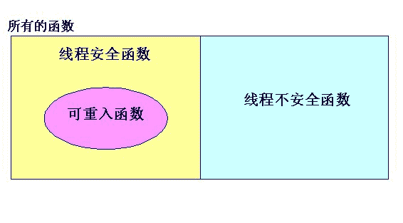

发表于 2017-04-22 15:51:52

* * *

[Astone](https://www.nowcoder.com/profile/8030974)

在信号处理时调用不可重入函数仍然可能产生错误.

发表于 2017-01-26 12:57:35

* * *

[surperdan](https://www.nowcoder.com/profile/8102445)

可重入的函数并非是安全的线程安全的肯定是可重入的不可重入的函数一定不是线程安全的

发表于 2018-03-25 20:52:14

* * *

## 29

每天有千万级的用户在使用滴滴出行，来改善他们的出行体验。同时，也给我们的许多后台系统带来了大量的请求，后台系统每秒承受着数万级的请求数，为了减轻大量请求带来的压力，我们通常采用的是缓存技术。  下图有一个典型的采用了分布式缓存技术的系统 A，A 提供了一个毫秒级的数据查询的功能，数据内容大约 1T，缓存在分布式 cache 系统中，上游其他系统，通过内部协议请求系统 A 中的 server 获取数据。系统 A 的数据内容，每天凌晨进行一次全量更新。 请针对系统 A，给出一个测试设计，至少包括以下内容： 1、对被测对象的系统架构分析； 2、枚举所有测试点以及测试方法的简单设计； 3、指出该系统存在的隐患及改进方向；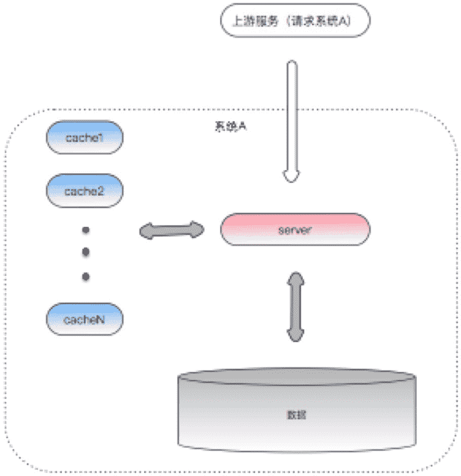

你的答案

本题知识点

测试工程师 滴滴 2017

## 30

滴滴出行平台的出租车、快车、专车等业务都是基于地理位置的服务，乘客发出订单后，附近的司机很快能够收到订单；下面是一张简化版的分单模型设计图，以及简要介绍：

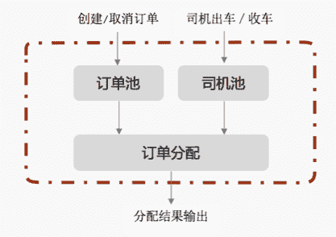

（1） 乘客创建订单时，会将订单信息写入订单池，取消订单则删除，司机出车时，将司机信息写入司机池，收车时删除；

（2） 订单分配模块会拉取到订单和司机的信息，其中包含地理位置信息，根据位置进行匹配，最终为司机分配 1 个 5 公里范围内的订单；

请根据以上的信息，回答如下问题：

1\. 分析该系统各模块的功能及特点；

2\. 对该系统做出功能和性能的测试设计；

你的答案

本题知识点

测试工程师 滴滴 2017

讨论

[凤梨酥](https://www.nowcoder.com/profile/5798709)

1.分析如下：（1）订单池：功能：a.包含用户的基本信息，比如用户名，用户电话，所在位置，可选车的类型（出租车、私家车或其他车型）                                  b.允许多用户同时登录，互不影响                                  c.创建订单需要用填写上车的位置，目的地地址，预约的时间以及车型，在规定时间内可删除订单                                  d.订单创建好后，将信息传递给订单分配模块，若成功删除订单，则订单池中的订单信息被删除                      特点：允许多用户同时登陆，具有数据录入，删除和传递功能（2）司机池：功能：a.包含司机的基本信息，比如 司机 名， 司机 电话，所在位置，所开车的类型（出租车、私家车或其他车型）和车牌号，是否空                                      车                                  b.允许多用户同时登录，互不影响                                  c.接受订单后，在司机池录入出车信息；订单完成后，在司机池录入收车信息                      特点：允许多用户同时登陆，具有数据录入，删除和传递功能，与订单池类似（3）订单分配模块:功能： 拉取到订单和司机的信息，其中包含地理位置信息，根据位置进行匹配，最终为司机分配 1 个 5 公里范围内的订单                       特点：是订单池和司机池的控制和分配中心，负责两者信息的匹配与调度 2.（1）功能测试：登陆模块测试：a.用户和司机的登陆测试，对输入（账号和密码）进行等价类和边界值分析相结合的用例测试，检测能否成功登                                                            陆                                                      b.测试登陆界面的风格与整体是否相融合，有无错别字                                                      c.鼠标点击文本框，能成功选中，并且鼠标由箭头转换为在相应文本框中开始位置的竖线光标                                   订单模块 ：a.订单界面包含所有需求说明书上的功能按钮，且链接正常，可成功转到相应界面                                                      b.输入用户的上车位置信息是由 GPS 定位选择还是自己手动输入                                                      c.填写完所有信息后，订单创建按钮变高亮，点击后出现订单已创建成功，正等待司机接收的提示信息                                                      d.司机接收订单后会弹出相应提示，告知用户司机的一些基本信息，比如司机当前所在位置，到达所需时间等。                                                      e.订单提交后，能在司机接收前删除订单。                                   司机模块：a.登陆后可选择出车或收车状态                                                    b.可以成功接收订单，接收订单后可获得用户的一些基本信息，比如名字，电话，所在位置以及目的地                           订单分配模块： a.可以获取订单池和司机池的订单和出车信息                                                     b.可以对两边的信息，根据位置进行匹配，并给司机分配订单                                                     c.订单被司机接收之后，向用户反馈司机的信息。（2）性能测试：a.由登陆界面进入系统要多久                           b.订单池最多能容纳多少个用户的订单，司机池最多能容纳多少个司机的信息                           c.在同一时刻，最多能允许多少个用户登陆                           b.用户登陆后，能在系统呆多长时间                           c.是否支持网页登陆

发表于 2017-01-08 11:40:05

* * *

## 31

随着滴滴的业务压力急剧增加，保持服务稳定性成了滴滴工程师的重中之重。为了能够以最小的风险完成上线，工程师们希望在上线过程中能够将一个城市的流量引到特定机器进行观察。为此，工程师小 A 对现有的上线流程进行了改造，架构图变化如下：

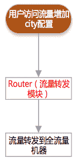  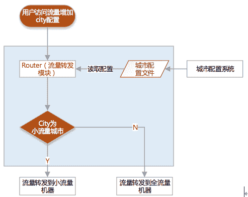

其中，router 流量转发模块需要承接所有的外部流量，根据下游的服务器规模平均分配流量， 确保下游机器的压力是均衡的。在本次改造中，router 模块将新增一个上游流量解析函数，该函数读取特定的城市配置文件，并且解析上游的流量（url），提取 city 参数值，然后对 city 值进行判断；如果 city 在配置文件中有配置，那么将流量转发到小流量机器，否则，仍然按照原有的逻辑分发流量。

而为了能够控制小流量的城市，小 A 开发了一个配置系统，该系统可以实时修改城市配置文件。

测试工程师小 B 拿到测试任务后，进行了简单的分析，他意识到 router 承载了巨大的流量，新增函数会对整体性能产生很大的影响，同时该模块对全系统的稳定性有决定性作用，为此需要对测试方案进行精心设计。

现在，请帮助小 B 给出一个完整的测试方案，至少包括以下内容：1、对被测对象进行风险分析 2、列举所有的测试点以及测试方法的简单设计

你的答案

本题知识点

测试工程师 滴滴 2017

讨论

[一叶浮尘-测试咨询](https://www.nowcoder.com/profile/1687)

感觉都读不懂题目。我们是要测试小 A 开发的的函数吗？

发表于 2016-12-24 10:22:32

* * *