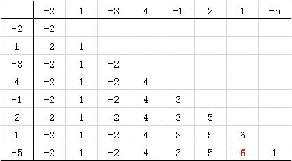
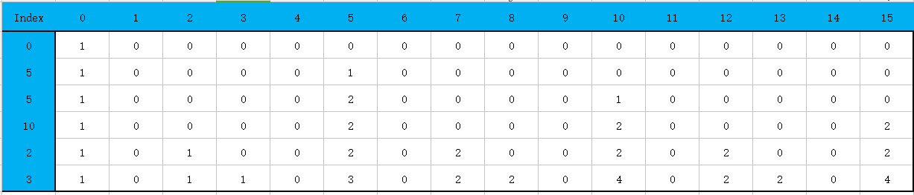

# 滴滴出行 2017 秋招笔试真题-编程题汇总

## 1

一个数组有 N 个元素，求连续子数组的最大和。 例如：[-1,2,1]，和最大的连续子数组为[2,1]，其和为 3

本题知识点

动态规划 贪心 C++工程师 golang 工程师 iOS 工程师 安卓工程师 运维工程师 前端工程师 算法工程师 测试工程师 PHP 工程师 Java 工程师 滴滴 2017

讨论

[卡玛酱](https://www.nowcoder.com/profile/1242799)

```cpp
#include <iostream>
using namespace std;
int main(){
	int n,curSum=0,maxSum=-1e5;
	cin>>n;
	int arr[n];
	for(int i=0;i<n;i++){
		cin>>arr[i];
		curSum+=arr[i];
		if(curSum>maxSum){
			maxSum=curSum;
		}
        if(curSum<0){
			curSum=0;
		}
	}
	cout<<maxSum<<endl;
	return 0;
}
```

编辑于 2017-08-26 11:11:44

* * *

[wangwenbin](https://www.nowcoder.com/profile/8315212)

```cpp
// 经典 dp 问题
// 假设 dp[n]表示以 n 为最后一个元素的子数组和的最大值，
// 因此， dp[n] = max(dp[n-1],0)+num[n];
// 当然实现的时候，没有必要设置一个数组保存所有的情况，因为只是用到了前一个位置的计算结果。
import java.util.Scanner;
public class Main{
    public static void main(String[] args){
        Scanner sc = new Scanner(System.in);
        int n = 0;
        while(sc.hasNext()){
            n = sc.nextInt();
            int[] num = new int[n];
            for(int i=0;i<n;i++){
                num[i] = sc.nextInt();
            }
            int max = num[0];
            int sum = num[0];
            for(int i=1;i<n;i++){
                if(sum>=0){
                    sum += num[i];
                }else{
                    sum=num[i];
                }
                if(sum>max)max=sum;
            }
            System.out.println(max);
        }
    }
}
```

发表于 2017-08-24 16:15:18

* * *

[NB 响当当](https://www.nowcoder.com/profile/8714452)

// 读完题的第一反应是动态规划。开始写了一个二维的，很好想，但是运行 60%超时，// 于是将二维改一维。这里我说一下我一维的思路，后面的代码是二维改一维后的代码// ，思路是一样的。我们社 dp[i]为第 i 个数与前面最大和数 dp[i-1]之和的最大数，那么若// dp[i] + dp[i-1] > dp[i]，dp[i]的值就应该是 dp[i] + dp[i-1]；否则，是它本身，即 dp[i]... ...// 这样一直找到，然后找出 dp[n]中最大的数字即可。如果不明白的话请结合下图思考：             
// 代码如下：

1.  #include <iostream>
2.  #include <vector>
3.  using namespace std;
4.  int main(void)
5.  {
6.  int n, max;
7.  cin >> n;
8.  vector<int> list(n, 0), dp(list);
9.  for (int i = 0; i < n; i++)   //创建数组
10.  cin >> list[i];
11.  max = dp[0] = list[0];
12.  for (int i = 1; i < n; i++)   //由于是连续的，因此只需要更新对
13.  {                                     //角线即可，之前部分遇上一行相同
14.  if (list[i] + dp[i - 1] > list[i])      //如果上一对角线上的数和更大
15.  dp[i] = list[i] + dp[i - 1];       //填入对应位置
16.  else
17.  dp[i] = list[i];                       //否则，即为这个数本身
18.  if (max < dp[i]) max = dp[i];     //寻找数组中最大的

20.  }
21.  cout << max << endl;
22.  return 0;
23.  }

发表于 2018-01-24 14:50:42

* * *

## 2

某餐馆有 n 张桌子，每张桌子有一个参数：a 可容纳的最大人数； 有 m 批客人，每批客人有两个参数:b 人数，c 预计消费金额。 在不允许拼桌的情况下，请实现一个算法选择其中一部分客人，使得总预计消费金额最大

本题知识点

排序 *贪心 C++工程师 golang 工程师 iOS 工程师 安卓工程师 运维工程师 前端工程师 算法工程师 测试工程师 PHP 工程师 Java 工程师 滴滴 2017* *讨论

[Jimmy_gg](https://www.nowcoder.com/profile/6073942)

```cpp
#include <iostream>
#include <string>
#include <vector>
#include <algorithm>
#include <set>

struct guest {
	int num;
	int money;
};
bool cmp(guest a, guest b) {
	if (a.money == b.money) {
		return a.num < b.num;
	}
	return a.money > b.money;
}
int main() {
	using namespace std;
	int n, m;
	while (cin >> n >> m) {
		multiset<int> desk;
		vector<guest> people(m);
		long long ans = 0;
		for (int i = 0; i < n; i++) {
			int temp;
			cin >> temp;
			desk.insert(temp);
		}
		for (int i = 0; i < m; i++) {
			int a, b;
			cin >> a >> b;
			people[i].num = a;
			people[i].money = b;
		}
		sort(people.begin(), people.end(), cmp);
		for (int i = 0; i < m; i++) {
			if (desk.empty()) {
				break;
			}
			if (people[i].num <= *desk.rbegin()) {
				ans += people[i].money;
				desk.erase(desk.lower_bound(people[i].num));
			}
		}
		cout << ans << endl;
	}
	return 0;
}

```

感觉大神们写的优先队列的答法很牛逼，一时间竟看不太懂，正赶上最近在研究 multiset 数据结构，即兴写了一发，直接 AC，也是有点小开心，其实，时间主要浪费在了寻找合适的桌子上了，multiset 里的 lower_bound 简直就是为了这道题设计的，哈哈。

发表于 2017-06-09 15:09:50

* * *

[我也支持](https://www.nowcoder.com/profile/6206174)

```cpp
/*
思路：优先选消费额度大的客人安排就餐
对客人按照消费额度排序（大->小）
对桌子按照容量排序（大->小）
选取当前消费额度最大客人：
1.如果没有桌子可用，结束；
2.如果人数过多无法安排，跳过；
3.如果可安排，则找到最合适的桌位，可就餐的桌位中容量最小的；
  3.1 向这批客人收费；
  3.2 将桌子从可用资源中删除；
直到没有桌子可用或所有客人全部安排
*/
#include<iostream>
#include<vector>
#include<map>
#include<algorithm>
using namespace std;
int main()
{
    int n, m, b, c;
    int num;
    vector<int> desk;//可用桌子资源的容量
    vector<pair<int, int>> customer;//预计消费，人数
    cin >> n >> m;
    while(n--)//输入桌子容量
    {
        cin >> num;
        desk.push_back(num);
    }
    //对桌子容量从大到小排序
    sort(desk.begin(), desk.end());
    reverse(desk.begin(), desk.end());
    vector<bool> flag(desk.size(), false);
    while(m--)
    {
        cin >> b >> c;
        customer.push_back(make_pair(c, b));
    }
    //对顾客按消费额度从大到小排序
    sort(customer.begin(), customer.end());
    reverse(customer.begin(), customer.end());

    long long ret = 0;//必须是 long long，int 会溢出
    for(int it = 0; it < customer.size(); ++it)
    {
        if(desk.size() == 0)//没有可用的桌子了
            break;
        int consumeMoney = customer[it].first;
        int countOfPeople = customer[it].second;
        if(desk[0] < countOfPeople)//最大的桌子也容不下这批客人
            continue;
        int i = 0;
        while(i < desk.size() && desk[i] >= countOfPeople)//找到可以容纳这批客人的最小桌子
            ++i;//i 为第一个不可容纳的桌子，则 i-1 位这批客人的最佳桌位
        ret = ret + consumeMoney;//收入增加
        desk.erase(desk.begin() + i - 1);//桌子从可用资源中删除
    }
    cout << ret << endl;
}

```

发表于 2017-09-16 21:35:18

* * *

[桀骜猴子](https://www.nowcoder.com/profile/2774985)

基本思路就是：桌子序列升序排列  ，客人按照预定花钱多少降序排序，然后贪心法从钱多的客人开始招呼。但是这题时间复杂度卡得太紧，在遍历能容得下第 i 批客人的时候需要二分查找去找否则超时，以下是我的代码。

```cpp
import java.util.*;

public class Main{
    public static void main(String[] args){
        Scanner sc  = new Scanner(System.in);
        while(sc.hasNext()){
            int n = sc.nextInt();  // n table
            int m = sc.nextInt();  // m customers
            int[] table = new int[n];
            for(int i=0;i<n;i++)
                table[i]=sc.nextInt();  // volume of a table

            int[][] cus = new int[m][2];
            for(int j=0;j<m;j++){
                cus[j][0]=sc.nextInt(); // number of customers
                cus[j][1]=sc.nextInt(); // money
            }

            Arrays.sort(table);
            Arrays.sort(cus, new Comparator<int[]>(){

	        public int compare(int[] a, int[] b){

	           return b[1]-a[1];

}
            });

            long res = 0L;
            int index = 0;
            boolean[] tableb = new boolean[n];
            for(int i=0;i<m;i++){
                if(cus[i][0]>table[n-1])
                    continue;
                index = bs(table,cus[i][0]);
                while(index<n && tableb[index]==true)
                    index++;
                if(index<n){
                    res += cus[i][1];
                    tableb[index]=true;
                }
            }

            System.out.println(res);
        }
        sc.close();
    }

    private static int bs(int[] num, int tar){
        int low=0;
        int high=num.length-1;
        int mid=0;
        while(low<=high){
            mid=(high+low)>>1;
            if(num[mid]>=tar)
                high=mid-1;
            else
                low=mid+1;
        }

        return low;
    }
}
```

编辑于 2017-08-20 20:22:08

* * *

## 3

小青蛙有一天不小心落入了一个地下迷宫,小青蛙希望用自己仅剩的体力值 P 跳出这个地下迷宫。为了让问题简单,假设这是一个 n*m 的格子迷宫,迷宫每个位置为 0 或者 1,0 代表这个位置有障碍物,小青蛙达到不了这个位置;1 代表小青蛙可以达到的位置。小青蛙初始在(0,0)位置,地下迷宫的出口在(0,m-1)(保证这两个位置都是 1,并且保证一定有起点到终点可达的路径),小青蛙在迷宫中水平移动一个单位距离需要消耗 1 点体力值,向上爬一个单位距离需要消耗 3 个单位的体力值,向下移动不消耗体力值,当小青蛙的体力值等于 0 的时候还没有到达出口,小青蛙将无法逃离迷宫。现在需要你帮助小青蛙计算出能否用仅剩的体力值跳出迷宫(即达到(0,m-1)位置)。

本题知识点

查找 *C++工程师 golang 工程师 iOS 工程师 安卓工程师 运维工程师 前端工程师 算法工程师 测试工程师 PHP 工程师 Java 工程师 滴滴 2017* *讨论

[诗妮](https://www.nowcoder.com/profile/3219240)

```cpp
package LineCode.Recruit2017.滴滴出行;

import java.util.Iterator;
import java.util.LinkedList;
import java.util.Scanner;

/**
 * 小青蛙有一天不小心落入了一个地下迷宫,
 * 小青蛙希望用自己仅剩的体力值 P 跳出这个地下迷宫。
 * 为了让问题简单,假设这是一个 n*m 的格子迷宫,
 * 迷宫每个位置为 0 或者 1,0 代表这个位置有障碍物,
 * 小青蛙达到不了这个位置;1 代表小青蛙可以达到的位置。
 * 小青蛙初始在(0,0)位置,地下迷宫的出口在(0,m-1)(保证这两个位置都是 1,并且保证一定有起点到终点可达的路径),
 * 小青蛙在迷宫中水平移动一个单位距离需要消耗 1 点体力值,
 * 向上爬一个单位距离需要消耗 3 个单位的体力值,
 * 向下移动不消耗体力值,当小青蛙的体力值等于 0 的时候还没有到达出口,
 * 小青蛙将无法逃离迷宫。现在需要你帮助小青蛙计算出能否用仅剩的体力值跳出迷宫(即达到(0,m-1)位置)。
 */
public class 地下迷宫 {

    static int n, m, maxRemainEnergy = 0;
    static int[][] map;
    static boolean flag = false;
    static String path = "";
    static LinkedList<String> linkedlist = new LinkedList<>();

    public static void main(String[] args) {

        //输入
        Scanner sc = new Scanner(System.in);
        n = sc.nextInt();
        m = sc.nextInt();
        int P = sc.nextInt();
        map = new int[n][m];
        for (int i = 0; i < n; i++) {
            for (int j = 0; j < m; j++) {
                map[i][j] = sc.nextInt();
            }
        }

        //处理
        runMap(0, 0, P);

        //输出
        if (!flag)
            System.out.println("Can not escape!");
        else
            System.out.println(path);

    }

    public static synchronized void runMap(int x, int y, int energy) {
        if (energy < 0 || x<0 || y<0 || x>=n || y>= m || map[x][y] != 1) return;
        else {
            linkedlist.offer("[" + x + "," + y + "]");
            map[x][y] = 0;
            if (x == 0 && y == m - 1) {
                if (energy >= maxRemainEnergy) {
                    maxRemainEnergy = energy;
                    updatePath();
                }
                map[x][y] = 1; linkedlist.removeLast();
                flag = true; return;
            }
            runMap(x, y+1, energy-1);
            runMap(x+1, y, energy);
            runMap(x-1, y, energy-3);
            runMap(x, y-1, energy-1);
            map[x][y] = 1;linkedlist.removeLast();
        }
    }

    public static void updatePath() {
        StringBuilder sb = new StringBuilder();
        Iterator<String> iterator = linkedlist.iterator();
        while (iterator.hasNext())
            sb.append(iterator.next() + ",");
        if (sb.length() > 0)
            sb.deleteCharAt(sb.length() - 1);
        path = sb.toString();
    }

}

```

编辑于 2017-08-16 16:37:34

* * *

[卷积神经网络哦](https://www.nowcoder.com/profile/8684256)

挺不错的题 深度优先搜索遍历所有解 找到耗体力最少也就是剩余体力最多的解

```cpp
#include <iostream>
#include <cstdio>
#include <cstring>
#include <algorithm>
#include <cmath>
#include <vector>

using namespace std;
//常量区
const int maxn = 1e2 + 5;
int pos[maxn][maxn], vis[maxn][maxn];
int dx[] = {0, -1, 1, 0}; //右 上 下 左   
int dy[] = {1, 0, 0, -1}; //右 上 下 左   
int lifee[] = {1, 3, 0, 1}; //各个方向消耗的体力
int n, m, P, cnt;
vector<int> way;
vector<int> allways[maxn];

//函数区
int dfs(int ro, int col, int life){
    if(ro < 0 || col < 0 || ro >= n || col >= m) return 0;
    if(ro == 0 && col == m - 1){
        if(life < 0) return 0;
        int size = way.size();
        allways[cnt].push_back(life);
        for(int i = 0; i < size; i++)
            allways[cnt].push_back(way[i]);
        cnt ++;
        return 1;
    }
    else for(int i = 0; i < 4; i++){ 
        if(pos[ro + dx[i]][col + dy[i]] == 1 && vis[ro + dx[i]][col + dy[i]] == 0){
            vis[ro][col] = 1;
            way.push_back(i);
            dfs(ro + dx[i], col + dy[i], life - lifee[i]); 
            way.pop_back();
            vis[ro][col] = 0;
        }            
    }
    return 0;   
}

//main 函数
int main(){
    scanf("%d%d%d", &n, &m ,&P);
    memset(vis, 0, sizeof(vis));
    for(int i = 0; i < n; i++)
        for(int j = 0; j < m; j++)
            scanf("%d", &pos[i][j]);
    cnt = 0;
    dfs(0, 0, P);
    if(!cnt) printf("Can not escape!\n");
    else{
        int max_left_life = 0, maxpos = 0;
        for(int i = 0; i < cnt; i++)
            if(allways[i][0] >= max_left_life){
                max_left_life = allways[i][0];
                maxpos = i;
            }  //找到体力剩余最多的解
        int size = allways[maxpos].size(), x = 0, y = 0;;
        printf("[0,0]");
        for(int i = 1; i < size; i++){
            x += dx[allways[maxpos][i]]; 
            y += dy[allways[maxpos][i]];
            printf(",[%d,%d]", x, y);
        }
        printf("\n");
    }
    return 0;
} 
```

编辑于 2018-09-13 21:12:04

* * *

[liantieyu](https://www.nowcoder.com/profile/399566)

```cpp
#include <iostream>
#include <vector>
using namespace std;

/*
 * 声明：这份代码是照搬@null_ptr 的 但是代码没什么注释，乍一看不好理解，
 * 所以我作了比较详细的注释，方便参考
 * 基本思想：典型的迷宫问题，DFS 穷举所有路径，找出剩余体力最多的路径
 */

#define VISITED 2

int m, n, P;		// 输入 m，n，P
int maze[10][10];	// 迷宫地图
int dir[4][2] = {{0, -1}, {0, 1}, {-1, 0}, {1, 0}};     // 左，右，上，下移动，例如：{0, -1}代表向左移动一步
int cost[4] = {-1, -1, -3, 0};    // 左，右，上，下移动的体力消耗，例如：{0， -1}对应-1
int final_P = -200;    // 剩余的体力值，初始为较小的数，保证 final_P 被正确更新

// 存储各点的数据结构
struct mazePoint {
    mazePoint(int _x, int _y): x(_x), y(_y) {}
    int x, y;
};
// 存储每次遍历到的路径
vector<mazePoint> pathStack;
// 存储最终的最优路径
vector<mazePoint> minCostPath;

// 函数：打印路径
void printPath(const vector<mazePoint>& path) {
    for (int i = 0; i < path.size(); ++i) {
        cout << "[" << path[i].x << "," << path[i].y << "]";
        if (i < path.size() - 1) {
            cout << ",";
        }
    }
}

// 函数：寻找最优路径
void search(int x, int y, int cur_P) {
    // 将当前点加入路径并标记为 VISITED
    pathStack.push_back(mazePoint(x, y));
    maze[x][y] = VISITED;

    // 如果当前点为出口且当前体力值>=0，则更新 final_P 与 minCostPath，并返回
    if (x == 0 && y == m-1 && cur_P >= 0) {
        if (cur_P > final_P) {
            final_P = cur_P;
            minCostPath = pathStack;
        }
        pathStack.pop_back();	// 为了回退至之前的节点，将当前结点弹出
        maze[x][y] = 1;    // 注意：之前 maze[x][y]被标记为 VISITED（值为 2），回退后应该将其还原为 1
        return;
    }

    // 如果当前点并非出口且当前体力值>=0，则分别向左右上下四个方向探索，并计算相应的消耗
    // 如果新的点再边界内且为可达点，递归调用 search 函数
    if (cur_P > 0) {
        for (int i = 0; i < 4; ++i) {
            int nx = x + dir[i][0];
            int ny = y + dir[i][1];
            int nP = cur_P + cost[i];
            if (nx >= 0 && nx < n && ny >= 0 && ny < m && maze[nx][ny] == 1)
                search(nx, ny, nP);
        }
    }

    pathStack.pop_back();    // 为了回退至之前的节点，将当前结点弹出
    maze[x][y] = 1;    // 注意：之前 maze[x][y]被标记为 VISITED（值为 2），回退后应该将其还原为 1
}

// 主函数
int main() {
    cin >> n >> m >> P;
    for (int i = 0; i < n; ++i)
        for (int j = 0; j < m; ++j)
            cin >> maze[i][j];

    search(0, 0, P);

    if (final_P != -200)    // 如果 final_P 更新过，输出最优路径
        printPath(minCostPath);
    else    // 如果 final_P 为初始值-200，代表其没有被更新过，也就意味着没有可行路径
        cout << "Can not escape!";

    return 0;
}

```

编辑于 2017-08-23 11:44:36

* * *

## 4

输入一个正整数 n,求 n!(即阶乘)末尾有多少个 0？ 比如: n = 10; n! = 3628800,所以答案为 2

本题知识点

数学 贪心 C++工程师 golang 工程师 iOS 工程师 安卓工程师 运维工程师 前端工程师 算法工程师 测试工程师 PHP 工程师 Java 工程师 滴滴 2017

讨论

[司坤天南](https://www.nowcoder.com/profile/6482721)

```cpp
#include<iostream>
#include<iomanip>
#include<string>
#include<vector>
using namespace std;
int main()
{
	int n, counter=0;
	cin >> n;
	while (n/=5)
	{
		counter += n;
	}
	cout << counter;
	return 0;
}
```

有 0 ，则是由偶数和 5 乘到的。考虑 5/5=1,25/5=5,125/5=25.所以即，5 是一个 5,25 是两个五。125 十三个 5.所以有 n/5 直到 n 为零时有 125 等三个五组成的，25 50 等有两个 5 组成的 第二次除 5 就 5 15 35 45 等有一个屋的第一次除 5 就 n/5 还有统计 0 到 n 中有多上个有 5 的数。即 999/5=199 即 0 到 999，有 5*1 5*2.........5*199

发表于 2017-08-26 14:27:13

* * *

[美团到店招聘](https://www.nowcoder.com/profile/3472441)

#include <stdlib.h>#include <stdio.h>using namespace std;int main()    {    int n;    scanf("%d",&n);    //算法    int count = 0;    while(n){        count += n/5;        n /= 5;    }    printf("%d",count);    return 0;

```cpp
}
```

发表于 2017-02-07 22:42:02

* * *

[唐龙 3bf](https://www.nowcoder.com/profile/5140297)

最简单的思路就是把所有的数字进行分解质因数，例如：6 = 2*315 = 3*564 = 2*2*2*2*2*2 = 2⁶¹⁰⁰ = 2² * 5²⁵⁷⁶ = 2⁶ * 3² 那么我们在计算 n 的阶乘时，实际上就是把所有小于等于 n 的正整数分解成质因数，然后再将其乘到一起，那么末尾 0 的个数实际上就是 2*5 的个数，而 2 的个数明显是很多很多的，所以问题就转化成了 5 的个数。而只有 5 的倍数才有 5 这个因数，所以，问题就进一步简化为小于等于 n 的数中有多少个数是 5 的倍数，当然 25 的倍数，125 的倍数，625 还要单独考虑。

发表于 2017-01-31 00:18:45

* * *

## 5

给定一个十进制数 M，以及需要转换的进制数 N。将十进制数 M 转化为 N 进制数

本题知识点

进制转化 数学 C++工程师 golang 工程师 iOS 工程师 安卓工程师 运维工程师 前端工程师 算法工程师 测试工程师 PHP 工程师 Java 工程师 滴滴 2017 基础数学

讨论

[卡玛酱](https://www.nowcoder.com/profile/1242799)

```cpp
#include <iostream>
using namespace std;
int main(){
	string s="",table="0123456789ABCDEF";
	int m,n;
	cin>>m>>n;
	while(m){
		if(m<0){
			m=-m;
			cout<<"-";
		}
		s=table[m%n]+s;
		m/=n;
	}
	cout<<s<<endl;
	return 0;
}
```

发表于 2017-08-21 14:02:04

* * *

[指 offer 的剑在哪？](https://www.nowcoder.com/profile/3812129)

十进制数的进制转换使用辗转相除法获取每步的余数；这里需要考虑几种情况：1.十进制数为负数时，这个时候就需要将十进制数转换成一个整数进行转换，只不过在最后输出的时候在结果加上一个负号就好了 2.输出的值不止是阿拉伯数字，还有 A-F，可以使用一个数组保存，对余数进行判断就好了；3.辗转相除得到的结果最后输出需要反序，因为计算的结果是反的；（我是保存在字符串的情况）

```cpp
import java.io.BufferedReader;
import java.io.IOException;
import java.io.InputStreamReader;

public class StringUtil {

	//进制转换
	public static void main(String[] args) throws IOException {

		BufferedReader br = new BufferedReader(new InputStreamReader(System.in));
		String[] nums = br.readLine().split(" ");
		int m = Integer.valueOf(nums[0]);
		int n = Integer.valueOf(nums[1]);
		StringBuffer sb = new StringBuffer();
		char[] arr = {'A','B','C','D','E','F'};
		int temp = 0;
		boolean fs = false;
		if(m < 0){
			fs = true;
			m = -m;
		}
		while(m != 0){
			temp = m%n;
			if(temp > 9)
				sb.append(arr[temp-9-1]);
			else
				sb.append(temp);
			m = m/n;
		}
		if(fs)
			sb.append("-");
		System.out.println(sb.reverse().toString());
	}
}
```

发表于 2017-09-07 22:45:00

* * *

[华科平凡](https://www.nowcoder.com/profile/4939096)

python 解法

本來想用递归解的，结果超出最大深度，只能用循环做了。

```cpp
def baseN(num, b):
    res = ""
    if num > 0:
        while num:
            res = "0123456789ABCDEFGHIGKLMNOPQRSTUVWXYZ"[num % b] + res
            num = num // b
        return res
    else:
        num = -num
        while num:
            res = "0123456789ABCDEFGHIGKLMNOPQRSTUVWXYZ"[num % b] + res
            num = num // b
        return "-" + res

a, b = map(int, input().split())
print(baseN(a, b)) 
```

发表于 2018-04-13 10:21:05

* * *

## 6

给定一个有 n 个正整数的数组 A 和一个整数 sum,求选择数组 A 中部分数字和为 sum 的方案数。
当两种选取方案有一个数字的下标不一样,我们就认为是不同的组成方案。

本题知识点

动态规划 C++工程师 golang 工程师 iOS 工程师 安卓工程师 运维工程师 前端工程师 算法工程师 测试工程师 PHP 工程师 Java 工程师 滴滴 2017

讨论

[NB 响当当](https://www.nowcoder.com/profile/8714452)

// 刚开始是用递归写的，说实话递归即好想有好写。但是毕竟时间复杂度是 O(n^n)，// 运行完后 50%超时。然后想到了动态规划。但是吧，不知道怎样规划这个很恼人，// 最后在评论区找到思路然后开始写代码。------------------------------------------------------------------------------------------------------// 我这里的思路以示例为例，然后我把图标放在了下面，纵坐标除了第一个外是输// 入；横坐标是从 0-sum 的所有值。数组内格子含义是该行最左侧数字（即输入）// 与之前的数字能得到该列数字的最多的可能性：
// 然后说一下做法：// 1.由于每个数总能把 0 填上，且 0 不可填上初 0 外其余数，所以数组第一行全填 0，第// 一列全填 1；// 2.从第二行第二列开始遍历数组。如果列所在数字减去该行数小于 0，那么该格子继// 承本列上一行的数字。例如图中(2,10)对应格子。由于让 10 得到 2，那必须由-8+5 得// 到，但是该题无法得到比 0 小的数，因此由 10 之前的数得到 2 的最多可能与他之前的// 数（即 5）是一样的；// 3.如果列所在数字减去该行数大于等于 0，该格子内容为该列上一行数字与上一行差// 值所在格子数量和。什么意思呢？例如(10,3)，若想要用 3 之前的数列得到 10，除了// 它上一行(即 2)本身就能得到 2 个 10 外，只要之前的数字是 7,7+3 依然可以得到 10。因// 此去看上一行中列数为 7 的格子数值，为 2，即它上一个数有 2 中组合得到 7,7+3=10。// 那该行数值即为 2+2=4。// 代码如下：

1.  #include <iostream>
2.  #include <vector>
3.  using namespace std;
4.  int main(void)
5.  {
6.  int n, sum;
7.  cin >> n >> sum;
8.  vector<long> tmp(sum + 1, 0), input(n + 1, 0);
9.  tmp[0] = 1, input[0] = 0;
10.  vector<vector<long> >dp(n + 1, tmp);
11.  for (int i = 1; i <= n; i++) cin >> input[i];
12.  for (int i = 1; i <= n; i++)
13.  {
14.  for (int j = 1; j <= sum; j++)
15.  {
16.  if (j - input[i] >= 0) dp[i][j] = dp[i - 1][j] + dp[i - 1][j - input[i]]; //这个就如解析力写的一样
17.  else dp[i][j] = dp[i - 1][j]; //否则直接继承该列上一行值
18.  }
19.  }
20.  cout << dp[n][sum] << endl;  //输出最后一个
21.  return 0;
22.  }

发表于 2018-01-20 15:44:39

* * *

[初日晨曦](https://www.nowcoder.com/profile/775649)

```cpp
//递归会超时，只能过 40%，用 dp. dp[i][j]表示用前 i 个值组成和为 j 的方案个数（相比一维的，更容易理解一些）
#include <iostream>
#include <algorithm>
using namespace std;
//注意：最终结果 int 类型存不下，需要 64 位数据
//注意：dp 不能放在 main 里，栈存不下。需要存在全局数据区
long long dp[1001][1001];
int main()
{
	int n,sum;
	cin>>n>>sum;

	int p[1000];
	for(int i = 1 ; i <= n ; i++)
		cin>>p[i];
//初始化 dp,用前 i 个组成和为 0 的方案，只有 1 种，就是什么都不取，和为 0；
	for (int i = 0 ; i < n ;i++)
	{
		dp[i][0] = 1;
	}
//用 0 个元素不能组成 1~sum
	for (int j = 1 ; j < sum ;j++)
	{
		dp[0][j] = 0;
	}

	for (int i = 1 ; i <= n ;i++)
	{
		for (int j = 0 ; j<=sum ;j++)
		{
			if(p[i]<=j) dp[i][j] = dp[i-1][j]+dp[i-1][j-p[i]];
			else dp[i][j] = dp[i-1][j];
		}
	}
	cout<<dp[n][sum]<<endl;
	return 0;
}
```

编辑于 2018-09-17 09:26:34

* * *

[骏博日博的迷弟](https://www.nowcoder.com/profile/2071506)

这题没得说，看到 sum 的范围为 1000 就该 dp 了。。

```cpp
#include <cstdio>
#include <algorithm>
#include <cstring>
long long dp[1002][1002];
int main()
{
	int n;
	int A[1002];
	int sum;
	while (scanf("%d %d", &n, &sum) != EOF)
	{
		for (int i = 0; i<n; i++)
			scanf("%d", A + i);
		for (int i = 0; i <= sum; i++)
			dp[0][i] = 0;
		dp[0][0] = 1;
		for (int i = 1; i <= n; i++)
		{
			for (int j = 0; j <= sum; j++)
			{
				dp[i][j] = dp[i - 1][j];
				if (j >= A[i-1])
					dp[i][j] += dp[i - 1][j - A[i-1]];
			}
		}
		printf("%lld\n", dp[n][sum]);
	}
	return 0;
}
```

发表于 2017-08-08 20:58:02

* * ***