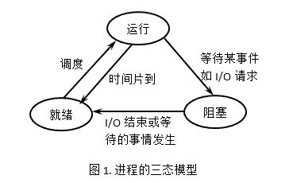

# 美团 2017 秋招笔试真题-测试开发工程师卷 A

## 1

Session 和 Cookie 是互联网领域中两种常用的技术，数以亿计的用户访问美团网 Web 页面时，就会用到这两种技术。有关 Cookie 和 Session 的描述，下面错误的是？

正确答案: D   你的答案: 空 (错误)

```cpp
Cookie 数据存放在客户的浏览器上，Session 数据放在服务器上。
```

```cpp
服务端为每个用户都会生成一个 Session 对象，通过 SessionID 来区分来自于哪个用户
```

```cpp
保存这个 SessionID 的方式可以采用 Cookie
```

```cpp
只要关闭浏览器，Session 就消失了
```

本题知识点

Java 工程师 C++工程师 测试工程师 美团 美团 Java 工程师 C++工程师 测试工程师 美团 美团 Java 工程师 C++工程师 测试工程师 美团 美团 测试开发工程师 美团 2017

讨论

[小小小小透明](https://www.nowcoder.com/profile/884926)

1，Session 是放在服务器上的。2，Cookie 是放在本地浏览器的，单个大小不会超过 4KB 一个站点最多保存 20 个。3，服务器会对每个用户生成一个 Session 其中 SessionID 用来区分用户。4，在本地保存这个 SessionID 可以将其保存在 Cookie 中。5，Session 在服务器上，一定时间之后是由服务器销毁的。

发表于 2017-02-09 10:12:04

* * *

[苏小研等你](https://www.nowcoder.com/profile/140922059)

1、数据存放位置不同：

cookie 数据存放在客户的浏览器上，session 数据放在服务器上。

2、安全程度不同：

cookie 不是很安全，别人可以分析存放在本地的 COOKIE 并进行[COOKIE 欺骗](https://www.baidu.com/s?wd=COOKIE%E6%AC%BA%E9%AA%97&tn=SE_PcZhidaonwhc_ngpagmjz&rsv_dl=gh_pc_zhidao),考虑到安全应当使用 session。

3、性能使用程度不同：

session 会在一定时间内保存在服务器上。当访问增多，会比较占用你服务器的性能,考虑到减轻服务器性能方面，应当使用 cookie。

4、数据存储大小不同：

单个 cookie 保存的数据不能超过 4K，很多浏览器都限制一个站点最多保存 20 个 cookie，而 session 则存储与服务端，浏览器对其没有限制。

发表于 2019-08-20 15:44:04

* * *

## 2

瀑布模型表达了一种系统的、顺序的软件开发方法。以下关于瀑布模型的叙述中，正确的是？

正确答案: D   你的答案: 空 (错误)

```cpp
瀑布模型能够非常快速地开发大规模软件项目
```

```cpp
只有很大的开发团队才使用瀑布模型
```

```cpp
瀑布模型已不再适合于现今的软件开发环境
```

```cpp
瀑布模型适用于软件需求确定，开发过程能够采用线性方式完成的项目
```

本题知识点

Java 工程师 C++工程师 测试工程师 美团 美团 Java 工程师 C++工程师 测试工程师 美团 美团 Java 工程师 C++工程师 测试工程师 美团 美团 测试开发工程师 美团 2017

讨论

[offercall 快点来好嘛](https://www.nowcoder.com/profile/4107414)

瀑布模型是一种系统的，顺序的软件开发方法，它适用于软件需求确定，开发过程能够以线性化的方式完成的那些软件开发项目。能否适用于某个项目或者快速开发某个项目并不取决于软件项目的规模或开发团队的规模，而且只要软件需求确定，开发过程能够采用线性方式完成，现今的软件开发仍然可以使用瀑布模型

发表于 2018-08-02 17:01:28

* * *

[zhaoyun](https://www.nowcoder.com/profile/626681)

在瀑布模型中，软件开发的各项活动严格按照线性方式进行，当前活动接受上一项活动的工作结果，实施完成所需的工作内容。当前活动的工作结果需要进行验证，如果验证通过，则该结果作为下一项活动的输入，继续进行下一项活动，否则返回修改。 瀑布模型强调文档的作用，并要求每个阶段都要仔细验证。但是，这种模型的线性过程太理想化，已不再适合现代的软件开发模式

发表于 2017-03-11 10:07:51

* * *

## 3

正在执行的进程，由于期待的某些事件未发生，则由系统自动执行阻塞原语(Block)，使自己由运行状态变为阻塞状态。进程阻塞的原因不包括？

正确答案: A   你的答案: 空 (错误)

```cpp
时间片切换
```

```cpp
等待 I/O
```

```cpp
进程 sleep
```

```cpp
等待解锁
```

本题知识点

Java 工程师 C++工程师 测试工程师 美团 美团 Java 工程师 C++工程师 测试工程师 美团 美团 Java 工程师 C++工程师 测试工程师 美团 美团 测试开发工程师 美团 2017

讨论

[大仁哥 _csu](https://www.nowcoder.com/profile/3607945)

链接：[`www.nowcoder.com/questionTerminal/a53587a4c85b4eb5aad69e742854898f`](https://www.nowcoder.com/questionTerminal/a53587a4c85b4eb5aad69e742854898f)
来源：牛客网
答案：A 时间片切换不会进入阻塞态

解析：进程有 3 个状态：就绪态。执行态、阻塞态。三种状态的转换包含有：

就绪->执行，执行->就绪，执行->阻塞，阻塞->就绪

等待 I/O、进程 sleep、等待解锁等原因都会导致进程暂停。关于"时间片切换"，当进程已经获得了除 cpu 外所有的资源，这时的状态就是就绪态，当分配到了时间片就成了执行态，当时间片用完之前一直未进入阻塞态的话，此后便继续进入就绪态。所以进程的就绪与阻塞是完全不同的

发表于 2017-03-05 23:55:40

* * *

[鸢尾楚楚](https://www.nowcoder.com/profile/109408)



发表于 2018-01-06 10:44:21

* * *

[zhaoyun](https://www.nowcoder.com/profile/626681)

时间片切换回导致进程进入就绪状态，而不是阻塞状态

发表于 2017-03-11 10:12:57

* * *

## 4

向一个栈按顺序 push 下列元素，ABCDE，其 pop 可能的顺序不正确的是？

正确答案: D   你的答案: 空 (错误)

```cpp
EDCBA
```

```cpp
DECBA
```

```cpp
ABCDE
```

```cpp
DCEAB
```

本题知识点

Java 工程师 C++工程师 测试工程师 美团 美团 Java 工程师 C++工程师 测试工程师 美团 美团 Java 工程师 C++工程师 测试工程师 美团 美团 测试开发工程师 美团 2017

讨论

[水灵灵](https://www.nowcoder.com/profile/8996455)

根据先进后出的顺序，做题即可。可以 a 进 a 出，或 ab 进 ba，ab 出依次类推

发表于 2017-03-17 20:17:02

* * *

[阿嘉嘉](https://www.nowcoder.com/profile/9462138)

首先，排除法，1,3 排除。4：D 先出，表示此时 ABC 都已经在栈内了，绝不可能 A 比 B 先出。

发表于 2017-03-17 21:59:49

* * *

## 5

下列页面置换算法中，会产生 Belady 异常现象的是？

正确答案: B   你的答案: 空 (错误)

```cpp
 最佳页面置换算法（OPT）
```

```cpp
先进先出页面置换算法（FIFO）
```

```cpp
最近最久未使用算法（LRU）
```

```cpp
时钟页面置换算法（Clock）
```

本题知识点

Java 工程师 C++工程师 测试工程师 美团 美团 Java 工程师 C++工程师 测试工程师 美团 美团 Java 工程师 C++工程师 测试工程师 美团 美团 测试开发工程师 美团 2017

讨论

[大仁哥 _csu](https://www.nowcoder.com/profile/3607945)

所谓 Belady 现象是指：采用 FIFO 算法时，如果对—个进程未分配它所要求的全部页面，有时就会出现分配的页面数增多但缺页率反而提高的异常现象。 FIFO 的性能较差，因为较早调入的页往往是经常被访问的页，这些页在 FIFO 算法下会被反复调入和调出。Belady 现象的原因是 FIFO 算法的置换特征与进程访问内存的动态特征是矛盾的，即被置换的页面并不是进程不会访问的。

发表于 2017-03-05 23:59:05

* * *

[牛客 1220853 号](https://www.nowcoder.com/profile/1220853)

belady 是分配的页面数增多，反而缺页率提高的现象

发表于 2017-03-05 22:39:46

* * *

## 6

猫眼电影 App 和后台服务的通信建立在 HTTP 的基础上，而每个 HTTP 请求的发送都需要建立 TCP 连接。用户在获取《魔兽》电影某场的详情时，TCP 建立连接的第三次握手报文的发送序列号为 1000，确认序列号为 2000，则本次连接的第二次握手报文的发送序列号和确认序列号分别是？

正确答案: B   你的答案: 空 (错误)

```cpp
1999，999
```

```cpp
1999，1000
```

```cpp
999，2000
```

```cpp
999，1999
```

本题知识点

Java 工程师 C++工程师 测试工程师 美团 美团 Java 工程师 C++工程师 测试工程师 美团 美团 Java 工程师 C++工程师 测试工程师 美团 美团 测试开发工程师 美团 2017

讨论

[木星上的土星人](https://www.nowcoder.com/profile/356477)

第一次握手序列号是 x；第二次握手序列号 y，确认号 x+1；第三次握手序列号 x+1，确认号 y+1

发表于 2017-03-21 15:12:28

* * *

[networkcpx](https://www.nowcoder.com/profile/246646)

不知道是不是这样子……如果有上一次握手的话，本次握手的确认号 ACK = 上一次的 Seq+1，表示上一次对方发送的序列号我已经成功收到了，然后想要接收下一个序号的报文；本次握手的序列号 Seq = 上一次的 ACK，表示对上一次对方想要接收的序号进行回应，发送对方想要的报文给他。

发表于 2017-03-21 17:23:15

* * *

[tsung](https://www.nowcoder.com/profile/8374318)

要发送的确认号=已接收的序列号+已收到数据的字节数

发表于 2017-08-13 20:09:58

* * *

## 7

int main(int argc, char **argv) {
int a[4]={1, 2, 3, 4};
int *ptr=(int *)(&a + 1);
printf("%d", *(ptr - 1));
}
上面的代码会输出（ ）。

正确答案: D   你的答案: 空 (错误)

```cpp
1
```

```cpp
2
```

```cpp
3
```

```cpp
4
```

本题知识点

Java 工程师 C++工程师 测试工程师 美团 美团 Java 工程师 C++工程师 测试工程师 美团 美团 Java 工程师 C++工程师 测试工程师 美团 美团 测试开发工程师 美团 2017

讨论

[看云卷云舒](https://www.nowcoder.com/profile/2051915)

&a 是数组指针，其类型为 int(*)[5];

而指针加 1 要根据指针类型加上一定的值，不同类型的指针+1 之后增加的大小不同，a 是长度为 5 的 int 数组指针，所以要加 5*sizeof(int)，所以 ptr 实际是 a[5],但是 ptr 与（&a+1）类型是不一样的，这点非常重要，所以 ptr-1 只会减去 sizeof(int*),a，&a 的地址是一样的，但意思就不一样了，a 是数组首地址，也就是 a[0]的地址，&a 是对象（数组）首地址，a+1 是数组下一元素的地址，即 a[1],&a+1 是下一个对象的地址，即 a[5]。

发表于 2017-02-11 16:54:12

* * *

[阿嘉嘉](https://www.nowcoder.com/profile/9462138)

参见 http://blog.sina.com.cn/s/blog_75b0e2ad01014ig3.html

发表于 2017-03-21 14:50:56

* * *

[主人没有名字](https://www.nowcoder.com/profile/6103516)

&a+1:取数组 a 的首地址，该地址的值加上 sizeof(a)的值，即&a+5*sizeof(int)，也就是下一个数组的首地址，当前指针已经越过了数组的界限；(int *)(&a+1): 把上一步计算出来的地址，强制转换为 int * 类型，赋值给 ptr 。 

发表于 2017-03-19 20:59:23

* * *

## 8

新美大的 HR 系统的数据库中有一个 employee 表，该表用于存储员工 ID、主管姓名、薪水等信息。程序员小团在自己的 Oracle 数据库中练习创建 employee 表的语句如下：
① CREATE TABLE employee (
empleyee_id NUMBER(9),
② CONSTRAINT salary_pk PRIMARY KEY,
③ 1995_salary NUMBER(8,2),
④ manager_name VARCHAR(225),
CONSTRAINT mgr_name_nn NOT NULL,
salary_96 NUMBER(8,2)
);
执行后报错，这个语句产生错误的地方是在第（ ）行。

正确答案: B   你的答案: 空 (错误)

```cpp
①
```

```cpp
②
```

```cpp
③
```

```cpp
④
```

本题知识点

Java 工程师 C++工程师 测试工程师 美团 美团 Java 工程师 C++工程师 测试工程师 美团 美团 Java 工程师 C++工程师 测试工程师 美团 美团 测试开发工程师 美团 2017

讨论

[空空以空空](https://www.nowcoder.com/profile/479441)

primary key(salary_pk)

发表于 2017-03-24 23:48:00

* * *

[牛客 558239 号](https://www.nowcoder.com/profile/558239)

应该为 CONSTRAINT salary_pk PRIMARY KEY（ salary_pk  ）吧

发表于 2017-02-24 12:11:46

* * *

[ChicChic](https://www.nowcoder.com/profile/5385566)

constraint salary_pk primary key**(sid)**

发表于 2017-03-01 10:19:56

* * *

## 9

I/O 系统硬件结构分为四级：1。设备控制器，2。I/O 设备，3。处理机，4。I/O 通道，按级别由高到低的顺序是？

正确答案: D   你的答案: 空 (错误)

```cpp
2－4－1－3
```

```cpp
3－1－4－2
```

```cpp
2－1－4－3
```

```cpp
3－4－1－2
```

本题知识点

Java 工程师 C++工程师 测试工程师 美团 美团 Java 工程师 C++工程师 测试工程师 美团 美团 Java 工程师 C++工程师 测试工程师 美团 美团 测试开发工程师 美团 2017

讨论

[老邢 1993](https://www.nowcoder.com/profile/595424)

大概可以这样理解。一句话：处理机（CPU）控制设备（比如，打印机）进行某些操作。这样，处理机是最高层、实际的 IO 设备是最底层。设备控制器是紧贴在硬件 IO 设备之上，驱动 IO 设备正常运转。IO 通道负责在处理机跟设备之间传输指令命令数据什么的。

发表于 2017-05-26 16:16:13

* * *

[白媛媛](https://www.nowcoder.com/profile/5243805)

选择 D，处理机（cpu）等级显然是最高的，通道是一个独立于 CPU 的专管输入/输出控制的处理机，它控制设备与内存直接进行数据交换。所以通道是第二，通道控制设备控制器，设备控制器控制设备。

发表于 2017-08-09 10:56:36

* * *

[ChicChic](https://www.nowcoder.com/profile/5385566)

不该是 D 吗

发表于 2017-03-01 10:24:22

* * *

## 10

局域网内划分子网是一种有效的减小局域网内广播冲突的手段，粗略统计，美团北京的办公区就有近万台设备需要连接互联网，所以划分子网就显得尤为重要。现有一个 IP 地址为 136.111.0.0 的 B 类网络，若要切割为 9 个子网，而且都要连上 Internet，子网掩码设为？

正确答案: D   你的答案: 空 (错误)

```cpp
255.0.0.0
```

```cpp
255.255.0.0
```

```cpp
255.255.128.0
```

```cpp
255.255.240.0 
```

本题知识点

Java 工程师 C++工程师 测试工程师 美团 美团 Java 工程师 C++工程师 测试工程师 美团 美团 Java 工程师 C++工程师 测试工程师 美团 美团 测试开发工程师 美团 2017

讨论

[alive_leo](https://www.nowcoder.com/profile/2197525)

255.255.192.0 提供 2 个字网 255.255.224.0 提供 6 个字网 255.255.240.0 提供 14 个字网

发表于 2017-03-19 01:31:22

* * *

[毛头小子](https://www.nowcoder.com/profile/7228738)

```cpp
B 类，后 16 位为主机号，9 个子网需要 4 位二进制数表示，将 16 位主机号的前 4 位置为 1\.  
11110000 00000000  即 240.0
```

发表于 2017-08-27 17:16:59

* * *

[zhaoyun](https://www.nowcoder.com/profile/626681)

9 个子网，9 的二进制为 1001，有 4 位，所以子网掩码第 3 段的二进制形式为：11110000，为十进制数的 240 即子网掩码为：255.255.240.0

发表于 2017-03-11 11:00:26

* * *

## 11

以下操作中，数组比线性表速度更快的是？

正确答案: A C   你的答案: 空 (错误)

```cpp
原地逆序
```

```cpp
头部插入
```

```cpp
返回中间节点
```

```cpp
返回头部节点
```

本题知识点

Java 工程师 C++工程师 测试工程师 美团 美团 Java 工程师 C++工程师 测试工程师 美团 美团 Java 工程师 C++工程师 测试工程师 美团 美团 测试开发工程师 美团 2017

讨论

[吉吉国王](https://www.nowcoder.com/profile/6836950)

原地逆序排序，数组只需要 O（n/2） ，链表逆序三个指针，需要 O(n)次，所以慢些。

发表于 2017-02-24 18:08:12

* * *

[追风少女鸭](https://www.nowcoder.com/profile/8456936)

数组是随机存取的，线性表是逻辑上连续但物理上分开存放的，因此，对于查询和修改操作来讲，数组的效率比较高，但是对于插入和删除操作而言，线性表的效率比较高。所以，选项 D 错误

对于选项 A，当需要进行原地逆序时，数组比线性表速度更快。对于数组的逆序，具体做法如下：定义两个下标，一个下标 i 表示数组首元素，一个下标 j 表示数组尾元素，交换 i 与 j 两个位置的元素值，同时执行++i，--j 操作，一共需要经过 n/2 次交换（n 表示数组的长度）。而链表的逆序需要修改指针的指向，需要更多的操作。所以，选项 A 正确。

对于选项 C，数组可以通过 array[length/2]访问中间结点，链表需要依次查找到中间结点，所以，数组比线性表更快。因此，选项 C 正确

发表于 2018-03-21 09:46:13

* * *

[牛客 558239 号](https://www.nowcoder.com/profile/558239)

返回头部节点应该一样快吧返回中间节点，数组是 O（1）插入，线性表快原地逆序不太清楚，有人给解答吗

发表于 2017-02-24 12:14:43

* * *

## 12

系统缓存技术（如 Redis/Tair/Memcached）是服务器后台系统中常用的一种技术，它具有读写高效、断电后数据丢失等特点，下面的数据中，哪个不适合放在缓存系统里？

正确答案: B D   你的答案: 空 (错误)

```cpp
用户登录后获得的认证 token
```

```cpp
用户所下团购订单
```

```cpp
登录美团旅行的短信验证码
```

```cpp
用户的手机号码信息
```

本题知识点

Java 工程师 C++工程师 测试工程师 美团 美团 Java 工程师 C++工程师 测试工程师 美团 美团 Java 工程师 C++工程师 测试工程师 美团 美团 测试开发工程师 美团 2017

讨论

[大仁哥 _csu](https://www.nowcoder.com/profile/3607945)

题目说了缓存存在断电后数据丢失的问题，所以需要长时间存储的都不能放。选 BD。

发表于 2017-03-06 00:18:31

* * *

[旭>_](https://www.nowcoder.com/profile/2709654)

出的不严谨啊,应该问"不适合只存放在缓存中的数据"

发表于 2017-03-28 21:06:00

* * *

## 13

一个 IP 地址为 220.1.0.3，由此你能得出的信息是？

正确答案: B   你的答案: 空 (错误)

```cpp
这是一个 B 类地址
```

```cpp
网络号是 220.1.0.0
```

```cpp
网络号是 220.0.0.0
```

```cpp
这是一个保留地址
```

本题知识点

Java 工程师 C++工程师 测试工程师 美团 美团 Java 工程师 C++工程师 测试工程师 美团 美团 Java 工程师 C++工程师 测试工程师 美团 美团 测试开发工程师 美团 2017

讨论

[追风少女鸭](https://www.nowcoder.com/profile/8456936)

```cpp
A 类 IP 地址范围从 1.0.0.0 到 126.0.0.0。可用的 A 类网络有 126 个，每个网络能容纳 1 亿多个主机。 
B 类 IP 地址范围从 128.0.0.0 到 191.255.255.255。可用的 B 类网络有 16382 个，每个网络能容纳 6 万多个主机 。

	C 类 IP 地址范围从 192.0.0.0 到 223.255.255.255。C 类网络可达 209 万余个，每个网络能容纳 254 个主机。

	 保留地址（特殊用途的）  A 类：127.X.X.X B 类：169.254.X.X

```

发表于 2018-03-21 09:49:51

* * *

[GrayGray](https://www.nowcoder.com/profile/7480959)

这是个 C 类地址，C 类地址的子网掩码为 255.255.255.0，将其与 IP 地址进行逻辑与便得到网络号

发表于 2017-03-21 17:39:25

* * *

[吴愣愣](https://www.nowcoder.com/profile/755933)

答案有误吧 应该是 C 类地址啊

发表于 2017-03-01 15:31:38

* * *

## 14

白盒测试又称结构测试、透明盒测试、逻辑驱动测试或基于代码的测试。下面属于白盒测试方法的有哪些？

正确答案: A D   你的答案: 空 (错误)

```cpp
语句覆盖
```

```cpp
等价类划分
```

```cpp
边界值分析
```

```cpp
判定条件覆盖
```

本题知识点

Java 工程师 C++工程师 测试工程师 美团 美团 Java 工程师 C++工程师 测试工程师 美团 美团 Java 工程师 C++工程师 测试工程师 美团 美团 测试开发工程师 美团 2017

讨论

[CherryBlove](https://www.nowcoder.com/profile/1555346)

其余的都很明显，这里着重说一下等价类划分，这里的类可不是指我们自己写的类文件的那个类。等价类划分法是一种典型的、重要的黑盒测试方法,它将程序所有可能的输入数据（有效的和无效的）划分成若干个等价类.然后从每个部分中选取具有代表性的数据当做测试用例进行合理的分类,测试用例由有效等价类和无效等价类的代表组成,从而保证测试用例具有完整性和代表性.利用这一方法设计测试用例可以不考虑程序的内部结构,以需求规格说明书为依据,选择适当的典型子集,认真分析和推敲说明书的各项需求,特别是功能需求,尽可能多地发现错误.等价类划分法是一种系统性的确定要输入的测试条件的方法.

发表于 2017-03-17 15:03:47

* * *

[默默努力的新人](https://www.nowcoder.com/profile/4325524)

不是说边界值是黑盒测试方法和白盒测试方法共有的测试方法吗？？？？？？？？？？？？？

发表于 2017-08-22 09:17:42

* * *

[追风少女鸭](https://www.nowcoder.com/profile/8456936)

白盒测试中语句覆盖、判定覆盖、条件覆盖、条件判定覆盖、条件组合覆盖

发表于 2018-03-21 09:53:16

* * *

## 15

移动硬盘和 U 盘是两种常见的移动存储设备，下列有关移动硬盘和 U 盘的叙述中，正确的是？

正确答案: A D   你的答案: 空 (错误)

```cpp
二者都呈现单位存储的价格越来越低的趋势
```

```cpp
二者都是随机存储设备
```

```cpp
移动硬盘的传输速度在任何时候都比 U 盘快
```

```cpp
二者都可以通过 USB 总线和计算机连接
```

本题知识点

Java 工程师 C++工程师 测试工程师 美团 美团 Java 工程师 C++工程师 测试工程师 美团 美团 Java 工程师 C++工程师 测试工程师 美团 美团 测试开发工程师 美团 2017

讨论

[奔跑的螃蟹](https://www.nowcoder.com/profile/7842755)

随机存储设备（RAM）属于内存，硬板、U 盘属于外部存储设备。

发表于 2017-03-12 11:32:14

* * *

## 16

美团有一个 API 用于创建团购订单，地址如下
https://open.meituan.com/order/createorder?token=1234567890abcdefghijklmnopqrstuvwxyz
其中，token 用于验证用户身份
请求方法：POST
参数类型：application/json
参数列表（隐去无关参数）：
{
"dealid": 90,
"quantity": 5
}
传入 deal ID（要购买的团购券的 ID）和数量后，返回新生成的订单 ID（隐去无关参数）。例如：
{
"success": 0, // 正常情况为 0
"msg": "", // 正常情况为空
"orderid": 2910100100, // 订单 id
}
设计测试用例进行测试，尽可能覆盖的完备。

你的答案

本题知识点

Java 工程师 C++工程师 测试工程师 美团 美团 Java 工程师 C++工程师 测试工程师 美团 美团 Java 工程师 C++工程师 测试工程师 美团 美团 测试开发工程师 美团 2017

讨论

[true colors](https://www.nowcoder.com/profile/7768364)

1、输入合法参数，是否正确的生成订单；2、输入为空，是否有提示；3、输入 dealid 为非数值型，是否有提示；4、输入 dealid 不存在时，是否有提示；5、quantity 为 0 或负数，是否有提示；6、quantity 大于库存，是否有提示；7、token 无效时，是否有提示；8、输入不是 json 时，是否有提示；性能测试：1、压力测试：系统在极限压力下的处理能力 2、狭义性能测试：验证系统能够达到一定的处理能力 3、并发测试：测试数据库和应用服务器对并发请求的处理兼容性：在不同浏览器上测试；在不同系统上测试；安全性测试：1）sql 注入攻击 2）token 伪造 3）大量订单 4）deal 遍历

发表于 2017-08-20 21:40:11

* * *

[牛客 2600384 号](https://www.nowcoder.com/profile/2600384)

求问各位大佬，这种题应该是写程序吧，还是说写思路？能不能发一张提交的程序图片

发表于 2017-08-31 17:19:43

* * *

[姜茵](https://www.nowcoder.com/profile/469960636)

功能测试：1.点击链接，是否正常出现下单页面；2.传入正确的团购券的 id，传入错误团购券的 id，是否会提示错误；3.传入数量，若想修改或取消是否有可操作的地方；4，若传入的数量超过了团购的最大量，是否会有异常提示；5.在传入 ID 和数量后，是否会提示确认自己的订单，确认后生成的订单 id 是否会有异常；6.在点击链接后，用户登录时 若输入错误的用户名或密码，是否会提示用户名和密码错误；性能测试：在点击链接后，页面出现所用的时间压力测试：在多个用户同时点击链接时，是否可以同时下单，最多可以多少个用户同时下单兼容性测试，使用不同的系统如安卓，苹果，或同一系统的不同手机，在点击链接下单时，是否会出现异常。

发表于 2019-09-17 11:35:36

* * *