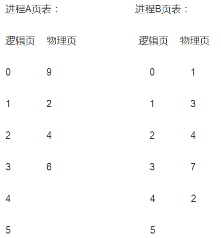
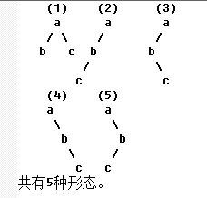
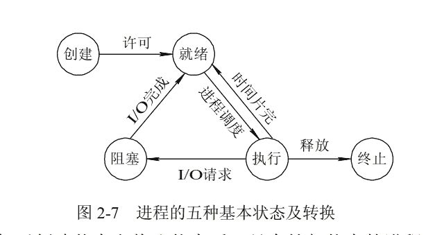
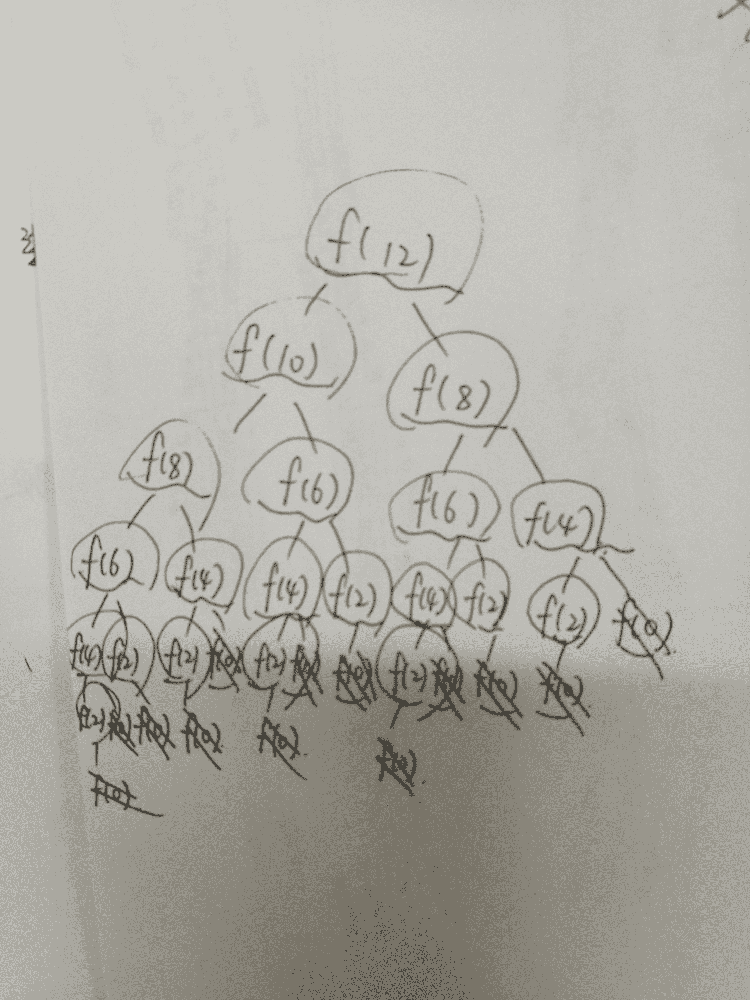

# 美团 2017 秋招笔试真题-测试开发工程师卷 B

## 1

已知一个 IP 地址为 10.5.136.5, 子网掩码为 255.255.64.0, 他的网络号和主机号分别是？

正确答案: C   你的答案: 空 (错误)

```cpp
10.5.136.0  5
```

```cpp
10.5.64.0  5
```

```cpp
10.5.0.0  5
```

```cpp
10.5.136.0  0
```

本题知识点

Java 工程师 C++工程师 测试工程师 美团 美团 Java 工程师 C++工程师 测试工程师 美团 美团 Java 工程师 C++工程师 测试工程师 美团 美团 测试开发工程师 美团 2017

讨论

[牛客 3089303 号](https://www.nowcoder.com/profile/3089303)

```cpp
136 的二进制 10001000
64 的二进制 01000000
相与为 0
选 C
```

发表于 2017-02-15 20:40:23

* * *

[牛客 370562 号](https://www.nowcoder.com/profile/370562)

主机号怎么算

发表于 2017-04-16 00:04:23

* * *

[伍佳](https://www.nowcoder.com/profile/4854859)

为什么子网掩码 0 和 1 还可以交叉。。。。子网掩码由 1 和 0 组成，且 1 和 0 分别连续。子网掩码的长度也是 32 位，左边是网络位，用[二进制](https://baike.baidu.com/item/%E4%BA%8C%E8%BF%9B%E5%88%B6)数字“1”表示，1 的数目等于网络位的长度；右边是主机位，用二进制数字“0”表示，0 的数目等于主机位的长度。

发表于 2017-08-29 13:38:32

* * *

## 2

软件测试的目的是？

正确答案: A   你的答案: 空 (错误)

```cpp
A. 尽可能多的发现软件系统中的错误
```

```cpp
B. 证明软件的正确性
```

```cpp
C. 找出软件系统中存在的所有错误
```

```cpp
D. 证明软件系统中存在错误
```

本题知识点

Java 工程师 C++工程师 测试工程师 美团 美团 Java 工程师 C++工程师 测试工程师 美团 美团 Java 工程师 C++工程师 测试工程师 美团 美团 测试开发工程师 美团 2017

讨论

[萨菲娜](https://www.nowcoder.com/profile/5657438)

目的难道不应该是找出所有的错误嘛，至于能不能全找出来那是另一回事了。正所谓理想很丰满，现实很骨感嘛。。。哼~

发表于 2017-09-05 14:29:38

* * *

[舍末逐本-](https://www.nowcoder.com/profile/960300)

作为测试人员一定要严谨，一直要追求完美，而达不到完美

发表于 2017-03-07 18:41:55

* * *

## 3

某操作系统采用分页存储管理方式，下图给出了进程 A 和进程 B 的页表结构。如果物理页的大小为 512 字节，那么进程 A 与进程 B 的物理内存总共使用了（ ）字节。
进程 A 页表： 进程 B 页表：
逻辑页 物理页 逻辑页 物理页
0 9 0 1
1 2 1 3
2 4 2 4
3 6 3 7
4 - 4 2
5 - 5 -

正确答案: B   你的答案: 空 (错误)

```cpp
4608
```

```cpp
3584
```

```cpp
4096
```

```cpp
5120
```

本题知识点

Java 工程师 C++工程师 测试工程师 美团 美团 Java 工程师 C++工程师 测试工程师 美团 美团 Java 工程师 C++工程师 测试工程师 美团 美团 测试开发工程师 美团 2017

讨论

[吴愣愣](https://www.nowcoder.com/profile/755933)

物理页可以在进程间共享，两个进程共使用了 1,2,3,4,6,7,9，共 7 个物理页。7*512=3584

发表于 2017-03-01 16:12:17

* * *

[大丽快快跑](https://www.nowcoder.com/profile/3855302)

题目排版有误，请看这个
接下来参考@吴愣愣的讲解。

编辑于 2017-10-11 14:04:11

* * *

## 4

```cpp
#include <stdio.h>
int main() {
 fork();
 fork();
 fork();
 printf("hello\n");
 return 0;
}
```

以上程序执行后输出（ ）个 hello。

正确答案: D   你的答案: 空 (错误)

```cpp
3
```

```cpp
4
```

```cpp
6
```

```cpp
8
```

本题知识点

Java 工程师 C++工程师 测试工程师 美团 美团 Java 工程师 C++工程师 测试工程师 美团 美团 Java 工程师 C++工程师 测试工程师 美团 美团 测试开发工程师 美团 2017

讨论

[牛客 3089303 号](https://www.nowcoder.com/profile/3089303)

```cpp
fork 调用一次返回两次
三个 fork 2 的 3 次方 8 次
```

发表于 2017-02-15 20:52:48

* * *

[主人没有名字](https://www.nowcoder.com/profile/6103516)

fork（）函数：通过系统调用创建一个与原来几乎完全相同的进程（若出入参数不同可以做不同的事），相当于克隆了一个自己。第一个 fork（）：1 个 hello 第二个 fork：2 个 hello（一个是上一个 fork 的，一个是原本的）第三个 fork：1+2+1 个 fork 原本函数：1 个 fork 共 1+2+4+1=8 个

发表于 2017-03-18 21:24:12

* * *

[向上芙蓉](https://www.nowcoder.com/profile/950435)

首先推荐一个[博客](http://blog.csdn.net/jason314/article/details/5640969)
然后本题分析：父进程为 P，
第一个 fork()后，产生 S1；
第二个 fork()后，P 产生一个子进程 S2，S1 产生一个子进程 S1_1(S1_1 的父进程为 S1)；
第三个 fork()后，P 产生子进程 S3，S2 产生子进程 S2_1,S1 进程产生 S1_2;S1_1 产生一个子进程 S1_1_1
因此调用 printf 的进程有 P，由 P 产生的 S1，S2，S3；由 S1 产生的 S1_1，S1_2；由 S2 产生的 S2_1;由 S1_1 产生的 S1_1_1，共有 8 个

发表于 2017-07-12 14:04:13

* * *

## 5

哪种协议在数据链路层？

正确答案: A   你的答案: 空 (错误)

```cpp
ARP
```

```cpp
ICMP
```

```cpp
FTP
```

```cpp
UDP
```

本题知识点

Java 工程师 C++工程师 测试工程师 美团 美团 Java 工程师 C++工程师 测试工程师 美团 美团 Java 工程师 C++工程师 测试工程师 美团 美团 测试开发工程师 美团 2017

讨论

[offer..](https://www.nowcoder.com/profile/2243793)

在 OSI 模型中 ARP 协议属于链路层；而在 TCP/IP 模型中，ARP 协议属于网络层

发表于 2017-08-20 22:55:36

* * *

[主人没有名字](https://www.nowcoder.com/profile/6103516)

ARP：链路层 ICMP:网路层 FTP：应用层 UDP：运输层

发表于 2017-03-18 21:27:10

* * *

[Mr_whale](https://www.nowcoder.com/profile/272572357)

有争议，大部分把 ARP 划分到网络层

发表于 2020-03-12 12:05:06

* * *

## 6

按照二叉树的定义,具有 3 个结点的二叉树有多少种？

正确答案: C   你的答案: 空 (错误)

```cpp
3
```

```cpp
4
```

```cpp
5
```

```cpp
6
```

本题知识点

Java 工程师 C++工程师 测试工程师 美团 美团 Java 工程师 C++工程师 测试工程师 美团 美团 Java 工程师 C++工程师 测试工程师 美团 美团 测试开发工程师 美团 2017

讨论

[印第安小斑鸠](https://www.nowcoder.com/profile/6572924)



发表于 2017-03-17 20:59:17

* * *

[遇见更美的自己](https://www.nowcoder.com/profile/1906862)

这个题扩展开是卡特兰数

发表于 2017-08-11 11:11:24

* * *

[大丽快快跑](https://www.nowcoder.com/profile/3855302)

两层的有一种，1。三层的话：第一层是根节点，第二层有 2 两种情况，第三层也有两种情况，1*2*2。所以是，1+4=5

发表于 2017-10-11 14:13:09

* * *

## 7

进程从运行状态变为阻塞状态的原因是？

正确答案: A   你的答案: 空 (错误)

```cpp
输入或输出事件发生
```

```cpp
时间片到
```

```cpp
输入或输出事件完成
```

```cpp
某个进程被唤醒
```

本题知识点

Java 工程师 C++工程师 测试工程师 美团 美团 Java 工程师 C++工程师 测试工程师 美团 美团 Java 工程师 C++工程师 测试工程师 美团 美团 测试开发工程师 美团 2017

讨论

[吴吴](https://www.nowcoder.com/profile/6530084)



发表于 2018-04-17 17:04:50

* * *

[Deborah](https://www.nowcoder.com/profile/823671)

时间片到是        运行－－》就绪状态

发表于 2017-03-14 13:13:38

* * *

## 8

运行 f(12)后，函数 f()被调用了多少次？
int f(int x) {
if(x <= 2) return 1;
return f(x - 2) + f(x - 4) + 1;
}

正确答案: C   你的答案: 空 (错误)

```cpp
15
```

```cpp
20
```

```cpp
25
```

```cpp
30
```

本题知识点

Java 工程师 C++工程师 测试工程师 美团 美团 Java 工程师 C++工程师 测试工程师 美团 美团 Java 工程师 C++工程师 测试工程师 美团 美团 测试开发工程师 美团 2017

讨论

[xxxxxxxxy](https://www.nowcoder.com/profile/1813299)

这个题应该是 20 吧？？？

发表于 2017-03-18 20:40:51

* * *

[爱简单的 Paul](https://www.nowcoder.com/profile/756110)

应该是 25 次。首先：f(12) = f(10) +f(8)+1          f(10) = f(8) +f(6)+1          f(8) = f(6) +f(4)+1          f(6) = f(4) +f(2)+1          f(4) = f(2) +f(0)+1          f(2) = 1          f(2) 被调用了一次，f(4)被调用了 3 次（本身有一次调用），f(6)5 次，f(8) 9 次，f(10)15 次， f(12)  =  15+9+1=25 次

发表于 2017-06-29 08:59:42

* * *

[木子 bling](https://www.nowcoder.com/profile/2839666)

画出来是 20

发表于 2017-03-20 21:11:57

* * *

## 9

在一个双向循环链表中，指针 p 所指向的节点（非尾节点）之后插入指针 s 指向的节点，其修改指针的操作是？

正确答案: C   你的答案: 空 (错误)

```cpp
A. p->next=s; s->prev=p; p->next->prev=s; s->next=p->nex
```

```cpp
B. p->next->prev=s; p->next=s; s->prev=p; s->next=p->next;
```

```cpp
C. s->prev=p; s->next=p->next; p->next->prev=s; p->next=s;
```

```cpp
D. p->next->prev=s; s->prev=p; p->next=s; s->next=p->next;
```

本题知识点

Java 工程师 C++工程师 测试工程师 美团 美团 Java 工程师 C++工程师 测试工程师 美团 美团 Java 工程师 C++工程师 测试工程师 美团 美团 测试开发工程师 美团 2017

讨论

[Virginia_cc](https://www.nowcoder.com/profile/348486)

将 s 插入链表中时，是先对结点 s 操作，然后再对结点 p 操作

编辑于 2017-03-19 16:50:33

* * *

[yangyang1234](https://www.nowcoder.com/profile/1199682)

只有先将 S 的前驱以及后继分别指向了 P 以及 P 的后继之后，才能去改变 P 的后继、P 的后继的前驱所指向的结点。

发表于 2017-08-31 16:55:58

* * *

## 10

下列删除表 A 全部数据的方法，一般情况下执行速度最快的是？

正确答案: C   你的答案: 空 (错误)

```cpp
delete * from A
```

```cpp
drop table A
```

```cpp
truncate table A
```

```cpp
rename table A to B
```

本题知识点

Java 工程师 C++工程师 测试工程师 美团 美团 Java 工程师 C++工程师 测试工程师 美团 美团 Java 工程师 C++工程师 测试工程师 美团 美团 测试开发工程师 美团 2017

讨论

[networkcpx](https://www.nowcoder.com/profile/246646)

 正确答案应该是 C。 drop table A 是**删除整个表**，题目的潜在意思是删除表中的数据而并非删除整个表。 truncate table A 是**删除表中的数据**，**删除速度比 delete 更** **快**，无法撤回（回退）。 
 delete from A **删除数据表中的数据**，可以回退，可添加 where 子句。 

发表于 2017-03-21 16:52:12

* * *

[大丽快快跑](https://www.nowcoder.com/profile/3855302)

速度,一般来说:drop> truncate > delete .但 drop 是删除整个表了。

发表于 2017-10-11 14:23:02

* * *

[向上芙蓉](https://www.nowcoder.com/profile/950435)

*   TRUNCATE TABLE 删除表中的所有行，而不记录单个行删除操作。

*   DELETE 语句每次删除一行，并在事务日志中为所删除的每行记录一项。

*   如果要删除表定义及其数据，请使用 DROP TABLE 语句。

发表于 2017-07-13 14:48:54

* * *

## 11

数据库完整性约束包括哪些？

正确答案: A C D   你的答案: 空 (错误)

```cpp
参照完整性
```

```cpp
事物完整性
```

```cpp
实体完整性
```

```cpp
用户定义完整性
```

本题知识点

Java 工程师 C++工程师 测试工程师 美团 美团 Java 工程师 C++工程师 测试工程师 美团 美团 Java 工程师 C++工程师 测试工程师 美团 美团 测试开发工程师 美团 2017

讨论

[豪 92](https://www.nowcoder.com/profile/2889221)

数据库完整性约束分为以下四类：
1) 实体完整性：规定表的每一行在表中是惟一的实体。
2) 域完整性：是指表中的列必须满足某种特定的数据类型约束，其中约束又包括取值范围、精度等规定。
3) 参照完整性：是指两个表的主关键字和外关键字的数据应一致，保证了表之间的数据的一致性，防止了数据丢失或无意义的数据在数据库中扩散。
4) 用户定义的完整性：不同的关系数据库系统根据其应用环境的不同，往往还需要一些特殊的约束条件。用户定义的完整性即是针对某个特定关系数据库的约束条件，它反映某一具体应用必须满足的语义要求。

发表于 2017-08-11 15:51:20

* * *

[Virginia_cc](https://www.nowcoder.com/profile/348486)

数据库完整性包括： 1、实体完整性：指关系的主关键字（primary key）不能重复也不能取空值，因为空值是不确定。 2、参照完整性：指定义建立关系之间的主关键字与外部关键字引用的约束条件。 3、用户定义完整性：根据应用环境的要求和实际的需要，对某一具体应用所涉及的数据提出约束性条件。由关系模型提供定义并检验。主要包括字段有效性和记录有效性。

实体完整性和参照完整性适用于任何关系型数据库系统，它主要是针对关系的主关键字和外部关键字取值必须有效而做出的约束。

发表于 2017-03-19 17:28:52

* * *

[彩色系](https://www.nowcoder.com/profile/7385777)

答案不对吧 应该是 acd 吧

发表于 2017-03-10 21:11:32

* * *

## 12

下列选项中，有关死锁的说法正确的是？

正确答案: A D   你的答案: 空 (错误)

```cpp
采用“按序分配”策略可以破坏产生死锁的环路等待条件
```

```cpp
在资源的动态分配过程中，防止系统进入安全状态，可避免发生死锁
```

```cpp
银行家算法是最有代表性的死锁解除算法
```

```cpp
产生死锁的现象是每个进程等待着某个不能得到且不可释放的资源
```

本题知识点

Java 工程师 C++工程师 测试工程师 美团 美团 Java 工程师 C++工程师 测试工程师 美团 美团 Java 工程师 C++工程师 测试工程师 美团 美团 测试开发工程师 美团 2017

讨论

[藤和艾莉欧。](https://www.nowcoder.com/profile/134888353)

B、在资源的动态分配过程中，防止系统进入**不安全**状态，可避免发生死锁 C、银行家算法**避免**死锁（指在分配资源之前先看清楚，资源分配后是否会导致系统死锁。如果会死锁，则不分配，否则就分配。）

发表于 2019-08-02 15:33:36

* * *

[DingYu](https://www.nowcoder.com/profile/646808631)

我怎么感觉 D 是错误的，产生死锁应该不用“每个”进程都等待对方的资源吧

发表于 2019-01-21 09:37:37

* * *

[ak_](https://www.nowcoder.com/profile/465597501)

A 选项是对的吗？？？“按需分配”吧？？按序分配怎么可能无死锁。应该是根据最大资源数一次性分配吧。

发表于 2020-03-12 12:08:19

* * *

## 13

```cpp
 #include <stdio.h>
 #define P_char char*           //语句 1
 #typedef char* char_P        //语句 2
 char arr[10]="movie";
 int main() {
     P_char p1, p2;
     char_P p3, p4;
     const P_char pa;
     const char_P pb;
     p1=arr;
     p2=*(arr + 3);
     p3=&(arr[2]);
     p4=arr + 4;
     printf("%s,%s,%s,%s\n", p1, p2, p3, p4);   //语句 3
     return 0;
 }
```

以下四种说法正确的是？

正确答案: B D   你的答案: 空 (错误)

```cpp
p1,p2,p3,p4,pa,pb 都是字符指针
```

```cpp
语句 1 是在预处理阶段执行的
```

```cpp
语句 2 是在预处理阶段执行的
```

```cpp
语句 3 的输出结果是 movie,i,vie,e
```

本题知识点

Java 工程师 C++工程师 测试工程师 美团 美团 Java 工程师 C++工程师 测试工程师 美团 美团 Java 工程师 C++工程师 测试工程师 美团 美团 测试开发工程师 美团 2017

讨论

[向上芙蓉](https://www.nowcoder.com/profile/950435)

`#define`
进行简单的字符串代换(原地扩展)，不作正确性检查，只有在编译已被展开的源程序时才会发现可能的错误并报错。例如：#define PI 3.1415g26 在预处理不出错，程序中的：area=PI*r*r 会替换为`3.1415g26*r*r 出错

`#typedef`
不是简单替换 ，而是采用如同定义变量的方法那样来声明一种类型。

```cpp
#define int_ptr int *
int_ptr a, b; 
//相当于 int *a, b; 只是简单的宏替换

typedef int* int_ptr; 
int_ptr a, b; //a, b 都为指向 int 的指针,typedef 为 int* 引入了一个新的助记符 
```

发表于 2017-07-13 16:08:00

* * *

[binbinok](https://www.nowcoder.com/profile/2695354)

仅解释 Aconst p_char pa 被宏定义替换为 const char *pa 是一个 指向常量字符的指针 const char_p pb 被解释为 char * const pb 是一个指针常量

发表于 2017-03-19 11:18:58

* * *

[9123](https://www.nowcoder.com/profile/3876971)

> [`www.cnblogs.com/kerwinshaw/archive/2009/02/02/1382428.html`](http://www.cnblogs.com/kerwinshaw/archive/2009/02/02/1382428.html)
> 
> 宏定义只是简单的字符串代换(原地扩展)，而 typedef 则不是原地扩展，它的新名字具有一定的封装性，以致于新命名的标识符具有更易定义变
> 
> 量的功能。请看上面第一大点代码的第三行：
> 
> typedef    (int*)      pINT;
> 
> 以及下面这行:
> #define    pINT2    int*
> 
> #define    pINT2    int*
> 
> [效果](http://action.vogate.com/click/click.php?r=http%3A/www.google.cn/search%3Fcomplete%3D1%26hl%3Dzh-CN%26inlang%3Dzh-CN%26newwindow%3D1%26q%3Dtypedef%26btnG%3DGoogle+%25E6%2590%259C%25E7%25B4%25A2%26meta%3D%26aq%3Dnull&ads_id=3480&site_id=6235007045036118&click=1&url=http%3A/www.samsungplay.com.cn/index.jsp&v=0&k=%u6548%u679C&s=http%3A/www.sf.org.cn/Article/base/200608/18988.html&rn=307562)相同？实则不同！实践中见差别：pINT a,b;的效果同 int *a; int *b;表示定义了两个整型指针变量。而 pINT2 a,b;的效果同 int *a, b;
> 
> 表示定义了一个整型指针变量 a 和整型变量 b。 typedef 的四个用途和两个陷阱
> 
> 用途一： 
> 
> 定义一种类型的别名，而不只是简单的宏替换。可以用作同时声明指针型的多个对象。比如： 
> char*   pa,   pb;     //   
> 
> char*   pa,   pb;     //   这多数不符合我们的意图，它只声明了一个指向字符变量的指针，   
> //   
> 
> //   和一个字符变量； 
> 
> 以下则可行： 
> typedef   char*   PCHAR;     //   
> 
> typedef   char*   PCHAR;     //   一般用大写 
> PCHAR   pa,   pb;                 //   
> 
> PCHAR   pa,   pb;                 //   可行，同时声明了两个指向字符变量的指针 
> 
> 虽然： 
> char   *pa,   *pb; 
> 
> char   *pa,   *pb; 
> 
> 也可行，但相对来说没有用 typedef 的形式直观，尤其在需要大量指针的地方，typedef 的方式更省事。

发表于 2017-08-31 17:44:22

* * *

## 14

下列 Linux 命令中，哪些可以显示文本文件内容？

正确答案: A B D   你的答案: 空 (错误)

```cpp
less
```

```cpp
tail
```

```cpp
join
```

```cpp
cat
```

本题知识点

Java 工程师 C++工程师 测试工程师 美团 美团 Java 工程师 C++工程师 测试工程师 美团 美团 Java 工程师 C++工程师 测试工程师 美团 美团 测试开发工程师 美团 2017

讨论

[牛客 1220853 号](https://www.nowcoder.com/profile/1220853)

join 是将两个文件中内容相同的连接起来

发表于 2017-03-05 21:58:26

* * *

[月逗逗*^_^*](https://www.nowcoder.com/profile/7785275)

cat:将文件内容连续输出在屏幕上 less：显示文件内容，显示完一屏后停下，可以下翻。可使用 pagedown 和 pageup 上下翻。more 不可用这两个键。head:默认显示文件的前 10 行 tail:默认显示后 10 行。

发表于 2020-03-29 17:25:11

* * *

[一流风沙](https://www.nowcoder.com/profile/3648146)

还有 more 也可以显示文本

发表于 2017-08-07 21:54:13

* * *

## 15

以下 http 返回报头有哪几行有错误？
①HTTP/1.1 302 Moved Permanently
Cache-Control: private, no-store, no-cache, must-revalidate
②Expires: Sat, 01 Jan 2000 00:00:00 GMT
Pragma: no-cache
③Content-Type: text/html; charset=utf-8
④Connection: maintain

正确答案: A D   你的答案: 空 (错误)

```cpp
①
```

```cpp
②
```

```cpp
③
```

```cpp
④
```

本题知识点

Java 工程师 C++工程师 测试工程师 美团 美团 Java 工程师 C++工程师 测试工程师 美团 美团 Java 工程师 C++工程师 测试工程师 美团 美团 测试开发工程师 美团 2017

讨论

[牛客 558239 号](https://www.nowcoder.com/profile/558239)

301 是永久重定向，302 是临时重定向 Connection 只有 close 和 keep-Alive 两个吧

编辑于 2017-02-24 13:49:34

* * *

[大丽快快跑](https://www.nowcoder.com/profile/3855302)

Permanently   是永久的意思

发表于 2017-10-11 14:33:08

* * *

## 16

 
每年的 5 月 17 日，点评都会在全国各大城市举办 517 吃货节优惠活动，如果你来负责手机端 517 某一个活动的测试任务，你会想到从哪些方面测试，来保证 517 活动的质量？
此次活动投放首页上”全城好券”活动中的每日优惠页面
1\. 用户领取条件：每个商户的券每个用户只能领取一次。
2\. 券数目限制：每个商户的每天的券有数目限制。
3\. 领券时间限制：只有上午 10 点开始可以才可以领券。

你的答案

本题知识点

Java 工程师 C++工程师 测试工程师 美团 美团 Java 工程师 C++工程师 测试工程师 美团 美团 Java 工程师 C++工程师 测试工程师 美团 美团 测试开发工程师 美团 2017

讨论

[找工作啊找工作](https://www.nowcoder.com/profile/5731525)

1、静态黑盒测试：查看产品说明书，看功能设置方面是否有需要补充的方面；和产品经理对产品需求等进行交流，或者直接从客户（包括用户和商户）方面了解客户需求，完善功能设计；2、动态黑盒测试：设计测试用例，测试该活动的各项功能，如是否满足条件的用户可以领取优惠券，且是否每用户只可以领取同一商户优惠一次，商户优惠券存在上限功能是否能够实现，是否只可以在上午 10 点以后领券；设计测试用例可以采取等价类划分的方法：对于第一个功能设计的测试用例为：一个用户领取某一商户优惠券一次，一个用户领取多个商户优惠券各一次，一个用户领取一个商户优惠券两次对于第二个功能设计的测试用例为：用户领取的某商户的优惠券数目小于其数目上限、用户 领取的某商户的优惠券数目等于其数目上限、 用户 领取的某商户的优惠券数目超过其数目上限对于第三个功能设计的测试用例为：在上午 10 点前领券、在上午 10 点整领券、在上午 10 点以后领券还需测试的功能为用户在当天领取某商户优惠券后第二天是否仍然可以领取、用户点击首页全程好券后是否可以正确进入到领取优惠页面等 3、白盒测试查看代码、并根据代码语句分支、条件分支、不同状态等设计测试用例进行测试 4、性能测试让很多个用户同时点击全程好券活动界面，看是否能够正常进入、以及等待响应的时间让很多个用户同时领取同一商户优惠券，看是否能够正确领取，以及等待响应的时间 5、兼容性测试测试用户是否只有更新版本够才可以使用全程好券活动功能，是否兼容以前版本测试该活动功能在安卓、ios 等不同系统下能否正常运行测试增加该功能后其他功能的使用情况

发表于 2017-03-20 11:27:31

* * *

[杨杨 young](https://www.nowcoder.com/profile/7285578)

功能测试： （1）点击“全城好券”页面跳转是否正常；（2）针对每一个商家，是否可以多次领券；（3）超出每天领券数量限制，是否还可以继续领券；（4）10 点之前是否可以参与领券，准时 10 点领券是否成功；（5）账号在登录和非登录状态下领券是否成功；（6）领券之后【XXX 人已抢】的显示数量是否会增加；界面测试： （1）排版正常，不出现重叠、缺失等现象 ；（2）图片正常展示，无明显拉伸现象；（3）字体大小样式展示正常，过长截断；（4）点击跳转正常 ；（5）用户滑动无卡顿；（6）加载更多无重复兼容性测试： （1）屏幕大小测试：大屏、小屏手机 （2）系统兼容性测试 ios、android 性能相关： （1）前端性能：CPU，内存占用，低配置 Android 机体验效果 ；（2）压力测试；（3）稳定性等；网络环境模拟测试： Wiki 测试、3g/4g、弱网络情景；其他： （1）图片太多，图片不宜太大，以免消耗用户太多流量；（2）用户数据统计等信息，统计商户曝光率，点击率等信息测试；

发表于 2018-09-05 18:40:13

* * *

[后天要考试](https://www.nowcoder.com/profile/5221401)

1、对领取条件的测试：    （1）已经注册过的用户是否能领取成功；    （2）非注册用户是否领取失败，并给出提示；2、对券数目限制的测试：    （1）同一个用户在每个商户下是否都能领取成功；    （2）同一个用户在同一个商户领取多次是否都能领取成功，如果领取失败，是否有提示；    （3）多个用户在同一个商户下领取，当券领完后是否会有提示；3、领券时间的测试：（1）在上午 9:59 及之前的任何一个时间领券是否能显示领券失败，并显示正确的领取时间；     （2）在上午 10:00 及之后任意一个时间领券是否能显示成功领券；
    （3）在晚上 10:00 及之前任何一个时间领券是否能显示领券成功；
    （4）在晚上 10:00 及之后任意一个时间领券是否能显示领券成功；
4、压力测试：在规定的领券时间内，假设有足够的券数目，先让 100 个用户同时点击领券是否能领取成功，再测试 500 个，1000 个，5000 个...测出服务器最大能容纳多少用户的并发；5、兼容性测试：分别用不同操作系统的手机进行领券，看看在系统不同的情况下是否都能领券成功，或者不会因为系统的不同出现卡顿等等情况；6、用户易用性测试：测试领券界面是否显眼，是否能吸引客户眼球，用户是否容易找到领券的位置。

发表于 2017-08-30 14:36:31

* * *