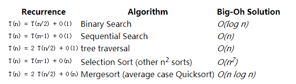
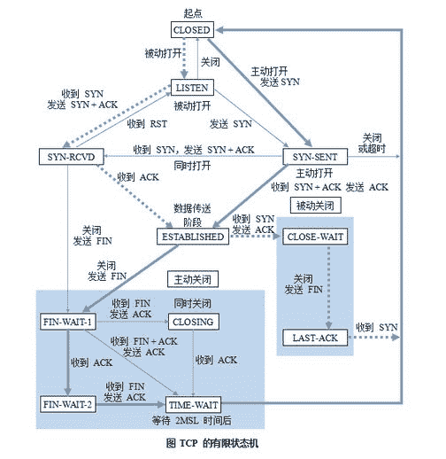
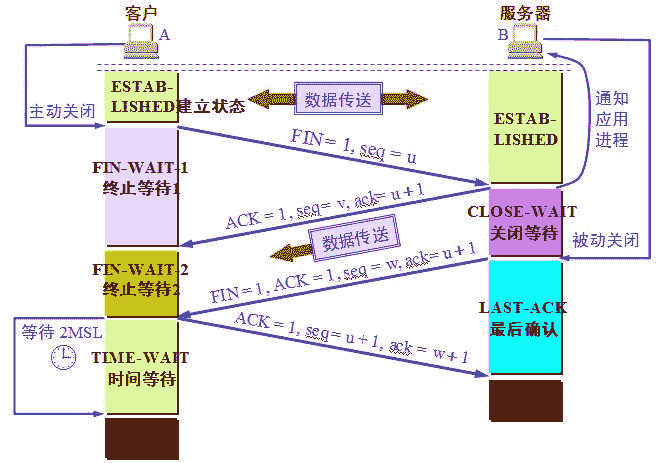

# 美团 2017 秋招笔试真题-后台开发

## 1

下面代码输出的结果是？
public static void main(String args[]) {
Thread t = new Thread() {
public void run() {
print();
}
};
t.run();
System.out.print(“MT”);
}
static void print() {
System.out.print(“DP”);
}

正确答案: A   你的答案: 空 (错误)

```cpp
DPMT
```

```cpp
MTDP
```

```cpp
MTDP 和 DPMT 都有可能
```

```cpp
都不输出
```

本题知识点

Java 工程师 C++工程师 安卓工程师 iOS 工程师 运维工程师 前端工程师 算法工程师 PHP 工程师 美团 美团 Java 工程师 C++工程师 安卓工程师 iOS 工程师 运维工程师 前端工程师 算法工程师 PHP 工程师 美团 美团 Java 工程师 C++工程师 安卓工程师 iOS 工程师 运维工程师 前端工程师 算法工程师 PHP 工程师 美团 美团 C++工程师 Java 工程师 美团 2017

讨论

[浅安 vivi](https://www.nowcoder.com/profile/6980705)

start()用来启动一个线程，当调用 start 方法后，系统才会开启一个新的线程，进而调用 run()方法来执行任务，而单独的调用 run()就跟调用普通方法是一样的，已经失去线程的特性了。因此在启动一个线程的时候一定要使用 start()而不是 run()

发表于 2017-02-11 22:21:14

* * *

[go_changing](https://www.nowcoder.com/profile/990318)

如果是多线程的情况（即用 t.start()而不是 t.run()），MTDP 和 DPMT 都有可能，现在用的是 t.run()，还是只有一个 main 线程，是单线程，所以顺序执行，输出的是 DPMT

发表于 2017-03-20 20:41:45

* * *

[scarfaceyang](https://www.nowcoder.com/profile/6428896)

我一直以为匿名内部类只能实现接口，想不到还可以重写类（不是接口）的方法。

发表于 2017-09-19 10:00:50

* * *

## 2

关于以下程序，正确的说法是？

- String s1=“abc” + “def”;
- String s2=new String(s1);
- if(s1 == s2)
- System.out.println(“===succeed===");
- if(s1.equals(s2))
- System.out.println(“===equals() succeed===");

正确答案: C   你的答案: 空 (错误)

```cpp
行 4 与行 6 都执行
```

```cpp
行 4 执行，行 6 不执行
```

```cpp
行 4 不执行，行 6 执行
```

```cpp
行 4 不执行，行 6 不执行
```

本题知识点

Java 工程师 C++工程师 安卓工程师 iOS 工程师 运维工程师 前端工程师 算法工程师 PHP 工程师 美团 美团 Java 工程师 C++工程师 安卓工程师 iOS 工程师 运维工程师 前端工程师 算法工程师 PHP 工程师 美团 美团 Java 工程师 C++工程师 安卓工程师 iOS 工程师 运维工程师 前端工程师 算法工程师 PHP 工程师 美团 美团 C++工程师 Java 工程师 美团 2017

讨论

[牛客 6825892 号](https://www.nowcoder.com/profile/6825892)

s1,s2 存储的位置不同。 s1 存储在常量池中，s2 存储在堆中。</br> 当调用"=="比较时，比较的是内存地址； 当调用"equals()"方法时，比较的是值。

发表于 2017-03-23 17:53:58

* * *

[offer 去哪了](https://www.nowcoder.com/profile/3061072)

equal 判断值是否相同，==判断地址是否相同。s1 的值（abcdef）是存放在常量池里，而 s2 的值放在堆里

发表于 2017-03-21 11:02:58

* * *

[zzr](https://www.nowcoder.com/profile/255217)

equal 判断值是否相同，==判断地址是否相同。

发表于 2017-02-14 21:07:22

* * *

## 3

关于实模式和保护模式的描述正确的是？

正确答案: C   你的答案: 空 (错误)

```cpp
实模式下的地址是计算公式是：段值＊16+偏移，其中段值 16 位，偏移 16 位，访问的地址范围 1MB，如果程序访问超过 1MB 的地址，系统会发生异常
```

```cpp
决定实模式与保护模式的关键是 CR1 寄存器中的 PE 位，当为 0 时为实模式，为 1 位保护模式
```

```cpp
在保护模式下，通过调用门，可以实现不同特权级之间的代码转移
```

```cpp
保护模式下，共有 4 个特权级别，0 特权级的任务访问 3 特权级的段时会触发常规保护错误(#GP)
```

本题知识点

Java 工程师 C++工程师 安卓工程师 iOS 工程师 运维工程师 前端工程师 算法工程师 PHP 工程师 美团 美团 Java 工程师 C++工程师 安卓工程师 iOS 工程师 运维工程师 前端工程师 算法工程师 PHP 工程师 美团 美团 Java 工程师 C++工程师 安卓工程师 iOS 工程师 运维工程师 前端工程师 算法工程师 PHP 工程师 美团 美团 C++工程师 Java 工程师 美团 2017

讨论

[青鸟飛鱼](https://www.nowcoder.com/profile/324870)

A：超过 1MB 会取模运算。B：CR0 寄存器的 PG 和 PE 位。PG 是否分页，PE 是否保护。D : 0 特权等级最高，可以任意访问.

发表于 2017-08-31 14:45:05

* * *

[sb785646](https://www.nowcoder.com/profile/5120370)

0 特权等级最高，可以任意访问

发表于 2017-08-25 10:25:58

* * *

[SpringBoot](https://www.nowcoder.com/profile/3385233)

组成原理的知识，不会，附一篇博文。 [《实模式和保护模式区别及寻址方式》](http://blog.csdn.net/rosetta/article/details/8933200)

发表于 2017-02-25 19:23:43

* * *

## 4

下列需要使用队列做辅助存储空间的操作是？

正确答案: C   你的答案: 空 (错误)

```cpp
查找哈希表
```

```cpp
先序遍历二叉树
```

```cpp
广度优先搜索图
```

```cpp
深度优先搜索图
```

本题知识点

Java 工程师 C++工程师 安卓工程师 iOS 工程师 运维工程师 前端工程师 算法工程师 PHP 工程师 美团 美团 Java 工程师 C++工程师 安卓工程师 iOS 工程师 运维工程师 前端工程师 算法工程师 PHP 工程师 美团 美团 Java 工程师 C++工程师 安卓工程师 iOS 工程师 运维工程师 前端工程师 算法工程师 PHP 工程师 美团 美团 C++工程师 Java 工程师 美团 2017

讨论

[大 V 郑立源](https://www.nowcoder.com/profile/3015074)

广度遍历用队列，深度遍历用栈

发表于 2017-02-07 16:05:23

* * *

[在长大,在长大](https://www.nowcoder.com/profile/4017671)

深度优先搜索，首先选择一个起始顶点并需要遵守三个规则：
(1) 如果可能，访问一个邻接的未访问顶点，标记它，并把它放入栈中。
(2) 当不能执行规则 1 时，如果栈不空，就从栈中弹出一个顶点。
(3) 如果不能执行规则 1 和规则 2，就完成了整个搜索过程。

广度优先搜索：
在深度优先搜索中，算法表现得好像要尽快地远离起始点似的。相反，在广度优先搜索中，算法好像要尽可能地靠近起始点。它首先访问起始顶点的所有邻接点，然后再访问较远的区域。它是用队列来实现的。

发表于 2018-08-21 11:32:25

* * *

[亲疙瘩…o>_](https://www.nowcoder.com/profile/3936923)

广度优先搜索用到队列，因为是先进先出；深度优先搜索用到栈，后进先出，向根节点遍历

发表于 2017-12-10 17:34:30

* * *

## 5

若一棵二叉树的前序遍历序列为 a, e, b, d, c，后序遍历序列为 b, c, d, e, a，则根结点的孩子结点是？

正确答案: A   你的答案: 空 (错误)

```cpp
只有 e
```

```cpp
有 e、b
```

```cpp
有 e、c
```

```cpp
无法确定
```

本题知识点

Java 工程师 C++工程师 安卓工程师 iOS 工程师 运维工程师 前端工程师 算法工程师 PHP 工程师 美团 美团 Java 工程师 C++工程师 安卓工程师 iOS 工程师 运维工程师 前端工程师 算法工程师 PHP 工程师 美团 美团 Java 工程师 C++工程师 安卓工程师 iOS 工程师 运维工程师 前端工程师 算法工程师 PHP 工程师 美团 美团 C++工程师 Java 工程师 美团 2017

讨论

[云枫](https://www.nowcoder.com/profile/7149420)

前序遍历：（ 根--左--右  ）  后序遍历（左--右--根）a 是根节点 从前序来看，ebdc 一部分左一部分右从后序来看，bcde 一部分左一部分右 可看到 e 在两头 所以 a 只有一个子节点 e（可能是左节点，可能右节点）

发表于 2017-03-19 15:02:35

* * *

[╰有血有肉](https://www.nowcoder.com/profile/7596495)

  这里主要把题意弄懂，我们知道只知道前序遍历和后序遍历是无法确定一个唯一的树结构的，但这并不代表不能确定部分子节点。根的子节点就是离根最近的节点，那么通过前序我们可以预选出 e 、b 可能为根的子节点，再通过后序我们可以预选出 d、e 可能为根的子节点，综上选出 e 为根的子节点。

发表于 2017-08-17 13:18:17

* * *

[小谢 backup](https://www.nowcoder.com/profile/5379055)

前序遍历：（ 根--左--右  ）  后序遍历（左--右--根）a 是根节点 从前序来看，ebdc 一部分左一部分右从后序来看，bcde 一部分左一部分右 可看到 e 在两头 所以 a 只有一个子节点 e（可能是左节点，可能右节点）再看 bdc 和 bcd，b 是根节点，d 也是根节点，说明在 e 节点下有两个子节点。因为 c 离 d 更近，所以 b 自为一组，dc 为一组，由 dc 为前序，可以看出 d 相对 c 为根节点。

发表于 2018-03-22 14:23:18

* * *

## 6

关于数据库索引，以下说法正确的是？

正确答案: D   你的答案: 空 (错误)

```cpp
针对某些字段建立索引，能够有效的减少相关数据库表的磁盘空间占用
```

```cpp
针对某些字段建立索引，能够有效的提升相关字段的读与写的效率
```

```cpp
常见数据库管理系统，通常使用 hash 表来存储索引
```

```cpp
数据库索引的存在，可能导致相关字段删除的效率降低
```

本题知识点

Java 工程师 C++工程师 安卓工程师 iOS 工程师 运维工程师 前端工程师 算法工程师 PHP 工程师 美团 美团 Java 工程师 C++工程师 安卓工程师 iOS 工程师 运维工程师 前端工程师 算法工程师 PHP 工程师 美团 美团 Java 工程师 C++工程师 安卓工程师 iOS 工程师 运维工程师 前端工程师 算法工程师 PHP 工程师 美团 美团 C++工程师 Java 工程师 美团 2017

讨论

[Maooyer](https://www.nowcoder.com/profile/864348)

A：增加索引会增加磁盘占用 B：建立索引可以提升查询速度，即读速度；但在一定程度上降低写速度 C：数据库一般使用 B*树作为索引 D：删除数据需要调整索引，所以会降低效率

发表于 2017-02-21 16:34:41

* * *

[zm29](https://www.nowcoder.com/profile/3545641)

什么是索引？

一个索引是存储的表中一个特定列的值数据结构（最常见的是 B-Tree）。索引是在表的列上创建。所以，要记住的关键点是索引包含一个表中列的值，并且这些值存储在一个数据结构中。请记住记住这一点：索引是一种数据结构 。

什么样的数据结构可以作为索引？

B-Tree 是最常用的用于索引的数据结构。因为它们是时间复杂度低， 查找、删除、插入操作都可以可以在对数时间内完成。另外一个重要原因存储在 B-Tree 中的数据是有序的。数据库管理系统（RDBMS）通常决定索引应该用哪些数据结构。但是，在某些情况下，你在创建索引时可以指定索引要使用的数据结构。

哈希表索引是怎么工作的？

哈希表是另外一种你可能看到用作索引的数据结构-这些索引通常被称为哈希索引。使用哈希索引的原因是，在寻找值时哈希表效率极高。所以，如果使用哈希索引，对于比较字符串是否相等的查询能够极快的检索出的值。例如之前我们讨论过的这个查询(SELECT * FROM Employee WHERE Employee_Name = ‘Jesus’) 就可以受益于创建在 Employee_Name 列上的哈希索引。哈系索引的工作方式是将列的值作为索引的键值（key），和键值相对应实际的值（value）是指向该表中相应行的指针。因为哈希表基本上可以看作是关联数组，一个典型的数据项就像“Jesus => 0x28939″，而 0x28939 是对内存中表中包含 Jesus 这一行的引用。在哈系索引的中查询一个像“Jesus”这样的值，并得到对应行的在内存中的引用，明显要比扫描全表获得值为“Jesus”的行的方式快很多。

哈希索引的缺点

哈希表是无顺的数据结构，对于很多类型的查询语句哈希索引都无能为力。举例来说，假如你想要找出所有小于 40 岁的员工。你怎么使用使用哈希索引进行查询？这不可行，因为哈希表只适合查询键值对-也就是说查询相等的查询（例：like “WHERE name = ‘Jesus’）。哈希表的键值映射也暗示其键的存储是无序的。这就是为什么哈希索引通常不是数据库索引的默认数据结构-因为在作为索引的数据结构时，其不像 B-Tree 那么灵活

发表于 2018-04-18 10:14:07

* * *

[lilinl](https://www.nowcoder.com/profile/3431580)

A：增加索引会增加磁盘占用 B：建立索引可以提升查询速度，即读速度；但是在一定程度上降低写速度；C：数据库一般使用 B*树作为索引；D：删除数据需要调整索引，所以会降低效率

发表于 2018-09-06 09:01:41

* * *

## 7

把 60 个糖果分给 5 个小朋友，每个小朋友至少分到 10 个糖果，请问有几种分法？

正确答案: C   你的答案: 空 (错误)

```cpp
126
```

```cpp
330
```

```cpp
1001
```

```cpp
2973
```

本题知识点

Java 工程师 C++工程师 安卓工程师 iOS 工程师 运维工程师 前端工程师 算法工程师 PHP 工程师 美团 美团 Java 工程师 C++工程师 安卓工程师 iOS 工程师 运维工程师 前端工程师 算法工程师 PHP 工程师 美团 美团 Java 工程师 C++工程师 安卓工程师 iOS 工程师 运维工程师 前端工程师 算法工程师 PHP 工程师 美团 美团 C++工程师 Java 工程师 美团 2017

讨论

[sillyeye](https://www.nowcoder.com/profile/558982)

**这道题答案的确是 1001(C(14,4)即 14 个中取 4 个)，这是排列组合中的挡板法得到的结果。**10 的 5 次方肯定是不对的，10 的 5 次方就表示了剩下的 10 个糖果每个糖果互异，那么前面 50 个分法因为糖果互异自然也应该另外算上。题目的真正意思是每个糖果相同，即拿任意位置糖果都一样，也就是只和每个朋友最后所得的糖果个数相关。比如剩下 10 个糖果，a 和 b 两人平分，a 拿前 5 个和拿后 5 个一样，然后 5 的十次方包含了其中多种情况。**先拿出 45（5*9）** **个糖果每人平分。那么题目要求就变成 15 个糖果分给 5 人，每人最少一个，也就是在 14 个位置中放入 4 个** **挡板，最后如结果 1001。****切记不能像我开始一样，每人平分 10 个，最后再 10 个分给 5 人，每人最少 0 个，然后 11 个位置（加上 1 前面和 10 后面那两个位置）放 4 个挡板。如果这样分，中间三个人不可能出现得到 0 的情况，只有两边边上的才能得到 0 个糖果。**

发表于 2017-02-07 16:38:16

* * *

[Tiffany0422](https://www.nowcoder.com/profile/1233229)

先每个人分 10 个，还剩 10 个，5 个小朋友随意分，在剩下的 10 个糖果中，小朋友得到的数量也可以为空，具体的算法就是把剩下的 10 个糖果和 4 个板放在一起，一共 14 个，选择 4 个当板，就是 C（14,4）

发表于 2017-03-13 11:19:41

* * *

[新世纪的神](https://www.nowcoder.com/profile/204696)

先给每个人分 10 个，然后把 10 个糖果分给 4 个人。使用排列组合中的隔板法。在 14 个里选择 4 个作为隔板。结果就是 14!/(4!)/(10!)=1001

发表于 2017-03-17 20:40:54

* * *

## 8

3 的 102 次方结尾数字是?

正确答案: A   你的答案: 空 (错误)

```cpp
9
```

```cpp
1
```

```cpp
3
```

```cpp
7
```

本题知识点

Java 工程师 C++工程师 安卓工程师 iOS 工程师 运维工程师 前端工程师 算法工程师 PHP 工程师 美团 美团 Java 工程师 C++工程师 安卓工程师 iOS 工程师 运维工程师 前端工程师 算法工程师 PHP 工程师 美团 美团 Java 工程师 C++工程师 安卓工程师 iOS 工程师 运维工程师 前端工程师 算法工程师 PHP 工程师 美团 美团 C++工程师 Java 工程师 美团 2017

讨论

[王半瓶](https://www.nowcoder.com/profile/9037164)

3 的 N 次方尾数是有规律的 3--9--7--1 四个一组循环 102 除 4 余 2

发表于 2017-02-08 09:48:10

* * *

[zm29](https://www.nowcoder.com/profile/3545641)

大概没有我这么奇葩的，从 3 的平方开始算

发表于 2018-04-18 10:23:56

* * *

[要有个昵称](https://www.nowcoder.com/profile/610979902)

即求 9 的 51 次方。而 9 的平方末位是 1，所以 9 的 50 次方末位也是 1。再乘个 9，最后末位是 9。

发表于 2021-04-02 10:40:26

* * *

## 9

下列算法的时间复杂度是 int  fun(int n){
if(n<2){
return 1;
}
return n*fun(n-2);
}

正确答案: B   你的答案: 空 (错误)

```cpp
0(nlog2n) 
```

```cpp
0(n)
```

```cpp
0(n2)
```

```cpp
0(log2n)
```

本题知识点

Java 工程师 C++工程师 安卓工程师 iOS 工程师 运维工程师 前端工程师 算法工程师 PHP 工程师 美团 美团 Java 工程师 C++工程师 安卓工程师 iOS 工程师 运维工程师 前端工程师 算法工程师 PHP 工程师 美团 美团 Java 工程师 C++工程师 安卓工程师 iOS 工程师 运维工程师 前端工程师 算法工程师 PHP 工程师 美团 美团 C++工程师 Java 工程师 美团 2017

讨论

[牛客 6529643 号](https://www.nowcoder.com/profile/6529643)

复杂度是衡量计算次数而不是计算数据的数量的。这个函数一共只会执行约 n/2 次 操作。所以是 o(n)

发表于 2017-03-20 21:36:07

* * *

[BrownLincoln](https://www.nowcoder.com/profile/7533277)

关于递归公式的复杂度，可以看看下面的总结表
公式推导见[`users.cs.duke.edu/`](https://users.cs.duke.edu/)~ola/ap/recurrence.html

编辑于 2017-08-23 19:02:07

* * *

[嗨 55](https://www.nowcoder.com/profile/7682461)

不要把 n-2 看成 n/2

发表于 2017-03-10 17:04:07

* * *

## 10

下面对于 cookie 的描述中错误的是？

正确答案: D   你的答案: 空 (错误)

```cpp
用于实现 session 跟踪技术
```

```cpp
Cookie 是由服务器保存在客户端的文本文件，大小限制在 4kb 左右
```

```cpp
Cookie 在服务端与客户端之间往返时通过 HTTP Headers 进行传输
```

```cpp
HTTP 请求中的 Cookie 是加密传递的
```

本题知识点

Java 工程师 C++工程师 安卓工程师 iOS 工程师 运维工程师 前端工程师 算法工程师 PHP 工程师 美团 美团 Java 工程师 C++工程师 安卓工程师 iOS 工程师 运维工程师 前端工程师 算法工程师 PHP 工程师 美团 美团 Java 工程师 C++工程师 安卓工程师 iOS 工程师 运维工程师 前端工程师 算法工程师 PHP 工程师 美团 美团 C++工程师 Java 工程师 美团 2017

讨论

[@offer@](https://www.nowcoder.com/profile/320810)

Cookie 是客户端保存用户状态，Session 是服务器端保存用户状态

发表于 2017-03-02 22:19:33

* * *

[牛客零零柒](https://www.nowcoder.com/profile/6522621)

关于 D,在 HTTP 请求中的 cookie 是明文传递的，所以安全性成问题。（除非用 HTTPS)

发表于 2017-03-19 14:30:19

* * *

[小谢 backup](https://www.nowcoder.com/profile/5379055)

HTTP 都是明文的，更何况是它里面区区的 cookie 呢

发表于 2018-03-22 14:25:17

* * *

## 11

以下不属于 tcp 连接断开的状态是？

正确答案: C   你的答案: 空 (错误)

```cpp
TIME_WAIT
```

```cpp
FIN_WAIT_1
```

```cpp
SYN_SENT
```

```cpp
FIN_WAIT_2
```

本题知识点

Java 工程师 C++工程师 安卓工程师 iOS 工程师 运维工程师 前端工程师 算法工程师 PHP 工程师 美团 美团 Java 工程师 C++工程师 安卓工程师 iOS 工程师 运维工程师 前端工程师 算法工程师 PHP 工程师 美团 美团 Java 工程师 C++工程师 安卓工程师 iOS 工程师 运维工程师 前端工程师 算法工程师 PHP 工程师 美团 美团 C++工程师 Java 工程师 美团 2017

讨论

[SpringBoot](https://www.nowcoder.com/profile/3385233)

惭愧，才学完的 TCP 有限状态机居然忘了。

发表于 2017-02-25 19:36:21

* * *

[鸢尾楚楚](https://www.nowcoder.com/profile/109408)



发表于 2018-01-08 10:18:52

* * *

[梦境迷离](https://www.nowcoder.com/profile/759736)

fin 是四次挥手，time_wait 是关闭

发表于 2018-02-18 15:39:18

* * *

## 12

下面哪个不是进程间的通信方式？

正确答案: A   你的答案: 空 (错误)

```cpp
回调
```

```cpp
共享内存
```

```cpp
消息传递
```

```cpp
信号量
```

本题知识点

Java 工程师 C++工程师 安卓工程师 iOS 工程师 运维工程师 前端工程师 算法工程师 PHP 工程师 美团 美团 Java 工程师 C++工程师 安卓工程师 iOS 工程师 运维工程师 前端工程师 算法工程师 PHP 工程师 美团 美团 Java 工程师 C++工程师 安卓工程师 iOS 工程师 运维工程师 前端工程师 算法工程师 PHP 工程师 美团 美团 C++工程师 Java 工程师 美团 2017

讨论

[zzr](https://www.nowcoder.com/profile/255217)

进程间的通信方式 1.管道 2.信号量 3.消息队列 4.信号 5.共享内存 6.套接字

发表于 2017-02-14 21:18:19

* * *

[lilinl](https://www.nowcoder.com/profile/3431580)

进程间的通信方式：管道 信号量 消息队列 信号 共享内存 套接字

发表于 2018-09-06 09:13:57

* * *

## 13

以下代码编译不报错的有？

正确答案: B   你的答案: 空 (错误)

```cpp
class MyString extend String{ 
    private String myString;    
    public MyString(String s){        
        this.myString = s;    
    }    
    public void print(){        
        System.out.print(myString);    
    }
}
```

```cpp
class NULL {    
    private String value = null;    
    public void print() {        
        System.out.print(String.format("%s", null));    
    }    
    public void setValue(String value) {        
        this.value = value;    
   }
}
```

```cpp
class Calculate{    
    private int value = 1; 
    public static double calculate(){  
        return this.value * getDiscountRate(); 
    } 
    public double getDiscountRate(){  
        return 0.5; 
   }
}
```

```cpp
class MyDouble{ 
    private int  value = 1;    
    public Boolean equals(Object o){       
        if (this == o) 
            return true;       
        if (o == null || getClass() != o.getClass()) 
            return false;       
        MyDouble aMyDouble = (MyDouble)o;       
       return value == aMyDouble.getValue();    
   }    
   public int getValue() {        
       return value;    
   }    
   public void setValue(int value) {        
        this.value = value;    
   }
}
```

本题知识点

Java 工程师 C++工程师 安卓工程师 iOS 工程师 运维工程师 前端工程师 算法工程师 PHP 工程师 美团 美团 Java 工程师 C++工程师 安卓工程师 iOS 工程师 运维工程师 前端工程师 算法工程师 PHP 工程师 美团 美团 Java 工程师 C++工程师 安卓工程师 iOS 工程师 运维工程师 前端工程师 算法工程师 PHP 工程师 美团 美团 C++工程师 Java 工程师 美团 2017

讨论

[小小小小透明](https://www.nowcoder.com/profile/884926)

第一个：1，extends 不是 extend。2，String 是 public final class String 无法继承。

第二个：1，this 只能在对象的方法里用，不能在 static 里面用，static 方法是这个类的方法，是静态的方法里面不能用 this。同理 getDiscountRate() 方法是对象的方法，如果要调用只能先 new 一个对象出来，然后使用这个对象的方法。或者将这个方法改成 static。

第三个：这是 Object 的 equals 方法，这里返回的 boolean 不是 Boolean

```cpp
 public boolean equals(Object obj) {
        return (this == obj);
    } 
```

发表于 2017-02-09 13:31:09

* * *

[莪是学渣莪喂自己袋盐](https://www.nowcoder.com/profile/4044228)

A 选项：1，extend 有误，应该用 extends  2，String 是不可变类，不能用其他类继承 String 类

C 选项：1，this 只能在对象的方法里用，不能在 static 里面用，static 方法是这个类的方法，是静态的方法里面不能用 this             2，getDiscountRate() 方法是对象的方法，如果要调用只能先 new 一个对象出来，然后使用这个对象的方法。或者将这个方法改成 staticD 选项：这是 Object 的 equals 方法，这里返回的 boolean 不是 Boolean 注意：重写一个方法不能改变该方法的返回类型（协变返回类型除外）、参数个数，重载一个方法可以改变返回类型、参数个数、参数类型

编辑于 2017-03-28 11:09:05

* * *

[撒旦的奶爸](https://www.nowcoder.com/profile/9605861)

```cpp
还真没注意到 null 的大小写，上来就把 B 排除了。:-(
```

发表于 2017-03-20 13:26:23

* * *

## 14

下面 java concurrent 包下的 4 个类中差别最大的一个是？

正确答案: B   你的答案: 空 (错误)

```cpp
CountDownLatch
```

```cpp
Future
```

```cpp
Semaphore
```

```cpp
ReentrantLock
```

本题知识点

Java 工程师 C++工程师 安卓工程师 iOS 工程师 运维工程师 前端工程师 算法工程师 PHP 工程师 美团 美团 Java 工程师 C++工程师 安卓工程师 iOS 工程师 运维工程师 前端工程师 算法工程师 PHP 工程师 美团 美团 Java 工程师 C++工程师 安卓工程师 iOS 工程师 运维工程师 前端工程师 算法工程师 PHP 工程师 美团 美团 C++工程师 Java 工程师 美团 2017

讨论

[旭>_](https://www.nowcoder.com/profile/2709654)

另外 3 个都可以用来做线程间同步.Future 是用来接收线程运行完的结果的

发表于 2017-03-23 16:28:19

* * *

[Idiot320](https://www.nowcoder.com/profile/4115175)

A、Semaphore：类，控制某个资源可被同时访问的个数; B、ReentrantLock：类，具有与使用 synchronized 方法和语句所访问的隐式监视器锁相同的一些基本行为和语义，但功能更强大；C、 Future：接口，表示异步计算的结果；D、 CountDownLatch： 类，可以用来在一个线程中等待多个线程完成任务的类。

发表于 2017-03-11 17:14:48

* * *

[zzr](https://www.nowcoder.com/profile/255217)

future 是接口，其他是类

发表于 2017-02-14 21:20:50

* * *

## 15

哪些设计模式能够提高系统扩展性？

正确答案: B C D   你的答案: 空 (错误)

```cpp
singleton
```

```cpp
abstract factory
```

```cpp
adapter
```

```cpp
Decorator
```

本题知识点

Java 工程师 C++工程师 安卓工程师 iOS 工程师 运维工程师 前端工程师 算法工程师 PHP 工程师 美团 美团 Java 工程师 C++工程师 安卓工程师 iOS 工程师 运维工程师 前端工程师 算法工程师 PHP 工程师 美团 美团 Java 工程师 C++工程师 安卓工程师 iOS 工程师 运维工程师 前端工程师 算法工程师 PHP 工程师 美团 美团 C++工程师 Java 工程师 美团 2017

讨论

[黄小斜](https://www.nowcoder.com/profile/3539721)

A 单例模式没有提高扩展性 B 工厂方法实现松耦合，可以提高扩展性 C 适配器模式可以将一个接口转换成另一个接口，方便引入外部接口 D 装饰者模式可以扩展接口功能

发表于 2017-03-18 11:22:19

* * *

[zzr](https://www.nowcoder.com/profile/255217)

A 单例模式 B 抽象工厂模式 C 适配器模式 D 装饰器模式

发表于 2017-02-14 21:22:08

* * *

[lilinl](https://www.nowcoder.com/profile/3431580)

A： 单例模式不能提高扩展性 B：工厂方法实现松耦合，可以提高扩展性 C：适配器模式可以将一个接口转换成另一个接口，方便引入外部接口 D：装饰者模式可以扩展接口功能

发表于 2018-09-06 09:20:46

* * *

## 16

下面对多线程和多进程编程描述正确的是？

正确答案: A C D   你的答案: 空 (错误)

```cpp
线程的数据交换更快，因为他们在同一地址空间内
```

```cpp
线程因为有自己的独立栈空间且共享数据，不利于资源管理和保护
```

```cpp
多进程里，子进程可获得父进程的所有堆和栈的数据；
```

```cpp
进程比线程更健壮，但是进程比线程更容易杀掉。
```

本题知识点

Java 工程师 C++工程师 安卓工程师 iOS 工程师 运维工程师 前端工程师 算法工程师 PHP 工程师 美团 美团 Java 工程师 C++工程师 安卓工程师 iOS 工程师 运维工程师 前端工程师 算法工程师 PHP 工程师 美团 美团 Java 工程师 C++工程师 安卓工程师 iOS 工程师 运维工程师 前端工程师 算法工程师 PHP 工程师 美团 美团 C++工程师 Java 工程师 美团 2017

讨论

[暗影行者 L](https://www.nowcoder.com/profile/6543830)

线程和进程的区别联系：1，进程：子进程是父进程的复制品。子进程获得父进程数据空间、堆和栈的复制品。2，线程：相对与进程而言，线程是一个更加接近与执行体的概念，它可以与同进程的其他线程共享数据，但拥有自己的栈空间，拥有独立的执行序列。  
两者都可以提高程序的并发度，提高程序运行效率和响应时间。  
线程和进程在使用上各有优缺点：线程执行开销小，但不利于资源管理和保护；而进程正相反。同时，线程适合于在 SMP 机器上运行，而进程则可以跨机器迁移。根本区别就一点：用多进程每个进程有自己的地址空间(address space)，线程则共享地址空间。所有其它区别都是由此而来的： 
1、速度：线程产生的速度快，线程间的通讯快、切换快等，因为他们在同一个地址空间内。 
2、资源利用率：线程的资源利用率比较好也是因为他们在同一个地址空间内。 
3、同步问题：线程使用公共变量/内存时需要使用同步机制还是因为他们在同一个地址空间内

发表于 2017-02-24 14:50:23

* * *

[不死大金刚](https://www.nowcoder.com/profile/5839035)

所以 B 为什么错了？？

发表于 2017-04-06 10:15:33

* * *

[大公嚼](https://www.nowcoder.com/profile/1658530)

**线程和进程的区别联系：**

```cpp
1\. 进程：子进程是父进程的复制品。子进程获得父进程数据空间、堆和栈的复制品。
2\. 线程：相对与进程而言，线程是一个更加接近与执行体的概念，它可以与同进程的其他线程共享数据，但拥有自己的栈空间，拥有独立的执行序列。 
```

两者都可以提高程序的并发度，提高程序运行效率和响应时间。
线程和进程在使用上各有优缺点：线程执行开销小，但不利于资源管理和保护；而进程正相反。同时，线程适合于在 SMP 机器上运行，而进程则可以跨机器迁移。
根本区别就一点：用多进程每个进程有自己的地址空间(address space)，线程则共享地址空间。
所有其它区别都是由此而来的：

```cpp
1、速度：线程产生的速度快，线程间的通讯快、切换快等，因为他们在同一个地址空间内。 
2、资源利用率：线程的资源利用率比较好也是因为他们在同一个地址空间内。
3、同步问题：线程使用公共变量/内存时需要使用同步机制还是因为他们在同一个地址空间内 
```

这道题腾讯 16 年出过类似：

```cpp
http://blog.csdn.net/chengonghao/article/details/51883769 
```

当时的 B 选项为

```cpp
线程因为有自己的独立栈空间且共享数据，所有执行的开销相对较大，同时不利于资源管理和保护 
```

发表于 2017-08-22 15:41:56

* * *

## 17

有四个整数，用 8 位补码分别表示为 r1=FEH, r2=F2H, r3=90H, r4=F8H。运算结构存入 8 位寄存器中，不会溢出的是？

正确答案: A C D   你的答案: 空 (错误)

```cpp
r1*r2
```

```cpp
r2*r3
```

```cpp
r1*r4
```

```cpp
r4*r2
```

本题知识点

Java 工程师 C++工程师 安卓工程师 iOS 工程师 运维工程师 前端工程师 算法工程师 PHP 工程师 美团 美团 Java 工程师 C++工程师 安卓工程师 iOS 工程师 运维工程师 前端工程师 算法工程师 PHP 工程师 美团 美团 Java 工程师 C++工程师 安卓工程师 iOS 工程师 运维工程师 前端工程师 算法工程师 PHP 工程师 美团 美团 C++工程师 Java 工程师 美团 2017

讨论

[Idiot320](https://www.nowcoder.com/profile/4115175)

用补码表示时 8 位寄存器所能表示的整数范围为-128 到+127。
r 1 =(15×16+14)-256=-2；
r 2 =(15×16+2)-256=-14；
r 3 =(9×16+0)-256=-112；
r 4 =(15×16+8)-256=-8；
则 r 1 ×r 2 =28，r 2 ×r 3 =1568，r 1 ×r 4 =16，r 2 ×r 4 =112，只有 r 2 ×r 3 结果溢出。

发表于 2017-03-11 17:36:09

* * *

[AAJ](https://www.nowcoder.com/profile/6803713)

个人见解：除了 r3，其他都是负数，FE=-2 , F2=-14 ,F8=-8，这三者互乘没有超过-128~127 的范围

发表于 2017-02-22 21:22:34

* * *

[DingYu](https://www.nowcoder.com/profile/646808631)

补码转原码的方法     如果高位为 1（负）,高位不变，其他按位取反再加 1
    如果高位位 0，就是本身

发表于 2019-01-20 10:52:36

* * *